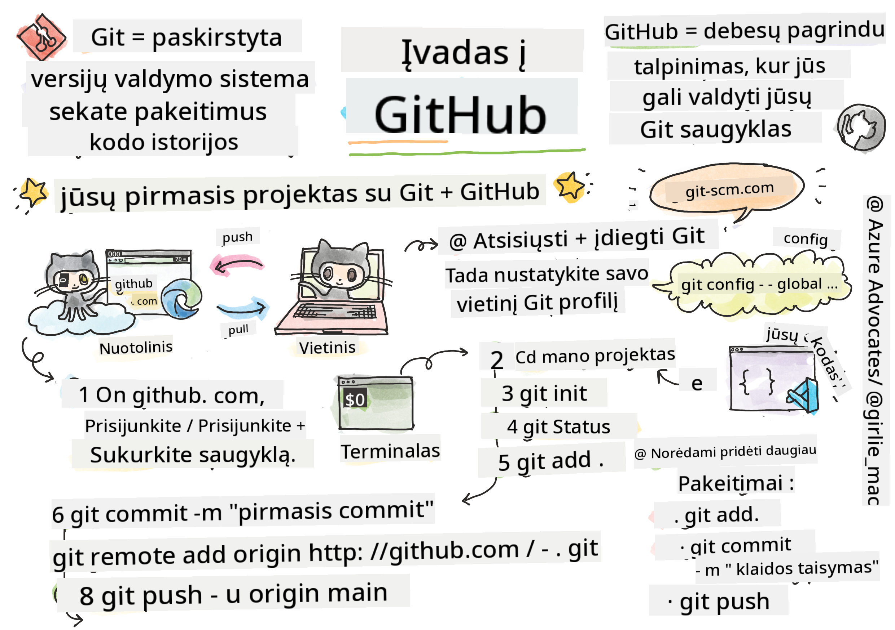

<!--
CO_OP_TRANSLATOR_METADATA:
{
  "original_hash": "361249da70432ddfd4741c917d1a6f50",
  "translation_date": "2025-08-29T17:01:45+00:00",
  "source_file": "1-getting-started-lessons/2-github-basics/README.md",
  "language_code": "lt"
}
-->
# Įvadas į GitHub

Ši pamoka apima GitHub pagrindus – platformą, skirtą kodui talpinti ir jo pakeitimams valdyti.


> Sketchnote sukūrė [Tomomi Imura](https://twitter.com/girlie_mac)

## Prieš paskaitą: testas
[Prieš paskaitą: testas](https://ff-quizzes.netlify.app)

## Įvadas

Šioje pamokoje aptarsime:

- kaip sekti savo darbą kompiuteryje
- kaip dirbti su kitais projektais
- kaip prisidėti prie atvirojo kodo projektų

### Reikalavimai

Prieš pradėdami, patikrinkite, ar jūsų kompiuteryje įdiegtas Git. Terminale įveskite: 
`git --version`

Jei Git nėra įdiegtas, [parsisiųskite Git](https://git-scm.com/downloads). Tada terminale sukonfigūruokite savo vietinį Git profilį:
* `git config --global user.name "jūsų-vardas"`
* `git config --global user.email "jūsų-el.paštas"`

Norėdami patikrinti, ar Git jau sukonfigūruotas, galite įvesti:
`git config --list`

Taip pat jums reikės GitHub paskyros, kodo redaktoriaus (pvz., Visual Studio Code) ir terminalo (arba komandų eilutės).

Eikite į [github.com](https://github.com/) ir susikurkite paskyrą, jei dar neturite, arba prisijunkite ir užpildykite savo profilį. 

✅ GitHub nėra vienintelė kodo saugykla pasaulyje; yra ir kitų, tačiau GitHub yra geriausiai žinoma.

### Pasiruošimas

Jums reikės aplanko su kodo projektu jūsų vietiniame kompiuteryje (nešiojamame ar stacionariame) ir viešos saugyklos GitHub, kuri bus naudojama kaip pavyzdys, kaip prisidėti prie kitų projektų.  

---

## Kodo valdymas

Tarkime, turite aplanką su kodo projektu savo kompiuteryje ir norite pradėti sekti savo progresą naudodami git – versijų valdymo sistemą. Kai kurie žmonės lygina git naudojimą su meilės laiško rašymu sau ateityje. Skaitydami savo commit žinutes po dienų, savaičių ar mėnesių galėsite prisiminti, kodėl priėmėte tam tikrą sprendimą, arba „atsukti“ pakeitimą – žinoma, jei rašote geras commit žinutes.

### Užduotis: Sukurkite saugyklą ir commit'inkite kodą  

> Peržiūrėkite vaizdo įrašą
> 
> [](https://www.youtube.com/watch?v=9R31OUPpxU4)

1. **Sukurkite saugyklą GitHub**. GitHub.com, skirtuke „Repositories“ arba viršutiniame dešiniajame navigacijos juostoje, raskite mygtuką **new repo**.

   1. Suteikite savo saugyklai (aplankui) pavadinimą.
   1. Pasirinkite **create repository**.

1. **Eikite į savo darbo aplanką**. Terminale pereikite į aplanką (dar vadinamą direktorija), kurį norite pradėti sekti. Įveskite:

   ```bash
   cd [name of your folder]
   ```

1. **Inicializuokite git saugyklą**. Savo projekte įveskite:

   ```bash
   git init
   ```

1. **Patikrinkite būseną**. Norėdami patikrinti saugyklos būseną, įveskite:

   ```bash
   git status
   ```

   Rezultatas gali atrodyti maždaug taip:

   ```output
   Changes not staged for commit:
   (use "git add <file>..." to update what will be committed)
   (use "git checkout -- <file>..." to discard changes in working directory)

        modified:   file.txt
        modified:   file2.txt
   ```

   Paprastai `git status` komanda nurodo, kurie failai yra paruošti _išsaugoti_ saugykloje arba turi pakeitimų, kuriuos galbūt norėsite išsaugoti.

1. **Pridėkite visus failus sekimui**
   Tai dar vadinama failų „staging“ arba pridėjimu į „staging area“.

   ```bash
   git add .
   ```

   `git add` su `.` argumentu nurodo, kad visi jūsų failai ir pakeitimai bus sekami. 

1. **Pridėkite pasirinktus failus sekimui**

   ```bash
   git add [file or folder name]
   ```

   Tai leidžia pridėti tik pasirinktus failus į „staging area“, kai nenorite commit'inti visų failų iš karto.

1. **Atšaukite visų failų sekimą**

   ```bash
   git reset
   ```

   Ši komanda leidžia atšaukti visų failų sekimą iš karto.

1. **Atšaukite konkretaus failo sekimą**

   ```bash
   git reset [file or folder name]
   ```

   Ši komanda leidžia atšaukti tik konkretaus failo sekimą, kurio nenorite įtraukti į kitą commit'ą.

1. **Išsaugokite savo darbą**. Šiuo metu pridėjote failus į vadinamąją _staging area_. Tai vieta, kur Git seka jūsų failus. Norėdami pakeitimą padaryti nuolatiniu, turite _commit'inti_ failus. Tai padaryti galite su `git commit` komanda. Commit'as reprezentuoja išsaugojimo tašką jūsų saugyklos istorijoje. Įveskite šią komandą, kad sukurtumėte commit'ą:

   ```bash
   git commit -m "first commit"
   ```

   Tai commit'ina visus jūsų failus, pridedant žinutę „first commit“. Ateities commit žinutėse norėsite būti detalesni, kad aiškiai perteiktumėte, kokį pakeitimą atlikote.

1. **Susiekite savo vietinę Git saugyklą su GitHub**. Git saugykla yra naudinga jūsų kompiuteryje, tačiau tam tikru momentu norėsite turėti failų atsarginę kopiją kažkur kitur ir taip pat pakviesti kitus žmones dirbti su jūsų saugykla. Viena puiki vieta tai padaryti yra GitHub. Prisiminkite, kad jau sukūrėme saugyklą GitHub, todėl vienintelis dalykas, kurį reikia padaryti, yra susieti vietinę Git saugyklą su GitHub. Komanda `git remote add` tai padarys. Įveskite šią komandą:

   > Pastaba: prieš įvesdami komandą, eikite į savo GitHub saugyklos puslapį, kad rastumėte saugyklos URL. Jį naudosite žemiau esančioje komandoje. Pakeiskite ```https://github.com/username/repository_name.git``` savo GitHub URL.

   ```bash
   git remote add origin https://github.com/username/repository_name.git
   ```

   Tai sukuria _remote_ ryšį, pavadintą „origin“, nukreiptą į anksčiau sukurtą GitHub saugyklą.

1. **Siųskite vietinius failus į GitHub**. Iki šiol sukūrėte _ryšį_ tarp vietinės saugyklos ir GitHub saugyklos. Siųskime šiuos failus į GitHub naudodami komandą `git push`, taip:

   > Pastaba: jūsų šakos pavadinimas pagal numatymą gali skirtis nuo ```main```.

   ```bash
   git push -u origin main
   ```

   Tai siunčia jūsų commit'us iš „main“ šakos į GitHub.

2. **Pridėkite daugiau pakeitimų**. Jei norite tęsti pakeitimų darymą ir siuntimą į GitHub, jums tereikės naudoti šias tris komandas:

   ```bash
   git add .
   git commit -m "type your commit message here"
   git push
   ```

   > Patarimas: galbūt norėsite naudoti `.gitignore` failą, kad išvengtumėte failų, kurių nenorite sekti, rodymo GitHub – pvz., užrašų failo, kurį saugote tame pačiame aplanke, bet kuris neturi vietos viešoje saugykloje. `.gitignore` failų šablonus galite rasti [`.gitignore templates`](https://github.com/github/gitignore).

#### Commit žinutės

Puiki Git commit žinutės antraštė užbaigia šį sakinį:
Jei pritaikyta, šis commit'as <jūsų antraštė čia>

Antraštėje naudokite imperatyvą, esamą laiką: „keisti“, o ne „pakeista“ ar „keičiasi“. 
Kaip ir antraštėje, kūne (neprivaloma) taip pat naudokite imperatyvą, esamą laiką. Kūnas turėtų apimti motyvaciją pakeitimui ir palyginti tai su ankstesniu elgesiu. Jūs aiškinate `kodėl`, o ne `kaip`.

✅ Skirkite kelias minutes naršymui GitHub. Ar galite rasti tikrai puikią commit žinutę? Ar galite rasti labai minimalią? Kokią informaciją, jūsų manymu, svarbiausia ir naudinga perteikti commit žinutėje?

### Užduotis: Bendradarbiaukite

Pagrindinė priežastis, kodėl dalinatės projektais GitHub, yra galimybė bendradarbiauti su kitais kūrėjais.

## Darbas su kitais projektais

> Peržiūrėkite vaizdo įrašą
>
> [](https://www.youtube.com/watch?v=bFCM-PC3cu8)

Savo saugykloje eikite į `Insights > Community`, kad pamatytumėte, kaip jūsų projektas atitinka rekomenduojamus bendruomenės standartus.

   Štai keletas dalykų, kurie gali pagerinti jūsų GitHub saugyklą:
   - **Aprašymas**. Ar pridėjote projekto aprašymą?
   - **README**. Ar pridėjote README? GitHub pateikia rekomendacijas, kaip rašyti [README](https://docs.github.com/articles/about-readmes/?WT.mc_id=academic-77807-sagibbon).
   - **Gairės prisidėjimui**. Ar jūsų projektas turi [prisidėjimo gaires](https://docs.github.com/articles/setting-guidelines-for-repository-contributors/?WT.mc_id=academic-77807-sagibbon)?
   - **Elgesio kodeksas**. Ar pridėjote [elgesio kodeksą](https://docs.github.com/articles/adding-a-code-of-conduct-to-your-project/)?
   - **Licencija**. Galbūt svarbiausia – [licencija](https://docs.github.com/articles/adding-a-license-to-a-repository/)?

Visi šie ištekliai padės naujiems komandos nariams greičiau prisijungti. Tai paprastai yra dalykai, kuriuos nauji prisidėtojai peržiūri prieš net žiūrėdami į jūsų kodą, kad sužinotų, ar jūsų projektas yra tinkama vieta jų laikui skirti.

✅ README failai, nors jų paruošimas užtrunka, dažnai yra ignoruojami užimtų prižiūrėtojų. Ar galite rasti ypač išsamų pavyzdį? Pastaba: yra keletas [įrankių, kurie padeda kurti gerus README](https://www.makeareadme.com/), kuriuos galbūt norėsite išbandyti.

### Užduotis: Sujunkite kodą

Prisidėjimo dokumentai padeda žmonėms prisidėti prie projekto. Jie paaiškina, kokių prisidėjimų ieškote ir kaip veikia procesas. Prisidėtojai turės atlikti kelis veiksmus, kad galėtų prisidėti prie jūsų saugyklos GitHub:

1. **Fork'inkite jūsų saugyklą**. Tikriausiai norėsite, kad žmonės _fork'intų_ jūsų projektą. Fork'inimas reiškia jūsų saugyklos kopijos sukūrimą jų GitHub profilyje.
1. **Klonuokite**. Iš ten jie klonuos projektą į savo vietinį kompiuterį. 
1. **Sukurkite šaką**. Norėsite paprašyti jų sukurti _šaką_ savo darbui. 
1. **Sutelkti dėmesį į vieną sritį**. Paprašykite prisidėtojų sutelkti savo prisidėjimus į vieną dalyką vienu metu – taip padidėja tikimybė, kad galėsite _sujungti_ jų darbą. Įsivaizduokite, kad jie pataiso klaidą, prideda naują funkciją ir atnaujina kelis testus – o kas, jei norite arba galite įgyvendinti tik 2 iš 3 ar 1 iš 3 pakeitimų?

✅ Įsivaizduokite situaciją, kurioje šakos yra ypač svarbios rašant ir išleidžiant gerą kodą. Kokius naudojimo atvejus galite sugalvoti?

> Pastaba: būkite pokytis, kurį norite matyti pasaulyje, ir kurkite šakas savo darbui. Visi commit'ai, kuriuos atliksite, bus atlikti šakoje, kurioje šiuo metu esate „prisijungę“. Naudokite `git status`, kad pamatytumėte, kurioje šakoje esate.

Eikime per prisidėtojo darbo eigą. Tarkime, prisidėtojas jau _fork'ino_ ir _klonavo_ saugyklą, todėl jie turi Git saugyklą, paruoštą darbui, savo vietiniame kompiuteryje:

1. **Sukurkite šaką**. Naudokite komandą `git branch`, kad sukurtumėte šaką, kurioje bus pakeitimai, kuriuos jie ketina prisidėti:

   ```bash
   git branch [branch-name]
   ```

1. **Pereikite į darbo šaką**. Pereikite į nurodytą šaką ir atnaujinkite darbo direktoriją su `git switch`:

   ```bash
   git switch [branch-name]
   ```

1. **Dirbkite**. Šiuo metu norite pridėti savo pakeitimus. Nepamirškite apie juos pranešti Git naudodami šias komandas:

   ```bash
   git add .
   git commit -m "my changes"
   ```

   Įsitikinkite, kad suteikėte commit'ui gerą pavadinimą – tiek savo, tiek saugyklos prižiūrėtojo labui.

1. **Sujunkite savo darbą su „main“ šaka**. Tam tikru momentu baigiate darbą ir norite sujungti savo darbą su „main“ šaka. „Main“ šaka tuo metu galėjo pasikeisti, todėl įsitikinkite, kad pirmiausia ją atnaujinate iki naujausios versijos naudodami šias komandas:

   ```bash
   git switch main
   git pull
   ```

   Šiuo metu norite įsitikinti, kad visi _konfliktai_, situacijos, kai Git negali lengvai _sujungti_ pakeitimų, atsiranda jūsų darbo šakoje. Todėl vykdykite šias komandas:

   ```bash
   git switch [branch_name]
   git merge main
   ```

   Tai įtrauks visus pakeitimus iš „main“ į jūsų šaką, ir tikimės, kad galėsite tiesiog tęsti. Jei ne, VS Code parodys, kur Git yra _pasimetęs_, ir jūs tiesiog pakeisite paveiktus failus, kad nurodytumėte, kuris turinys yra tiksliausias.

1. **Siųskite savo darbą į GitHub**. Siųsti savo darbą į GitHub reiškia du dalykus: stumti savo šaką į savo saugyklą ir tada atidaryti PR (Pull Request).

   ```bash
   git push --set-upstream origin [branch-name]
   ```

   Aukščiau esanti komanda sukuria šaką jūsų fork'intoje saugykloje.

1. **Atidarykite PR**. Toliau norite atidaryti PR. Tai darote naršydami į fork'intą saugyklą GitHub. GitHub parodys indikaciją, kurioje klausia, ar norite sukurti naują PR, spustelėkite tai ir būsite nukreipti į sąsają, kurioje galite pakeisti commit žinutės pavadinimą, suteikti tinkamesnį aprašymą. Dabar saugyklos, kurią fork'inote, prižiūrėtojas matys šį PR ir _tikėkimės_, jie įvertins ir _sujungs_ jūsų PR. Dabar esate prisidėtojas, valio :)

1. **Išvalykite**. Laikoma gera praktika _išvalyti_ po to, kai sėkmingai sujungiate PR. Norite išvalyti tiek vietinę šaką, tiek šaką, kurią stumėte į GitHub. Pirmiausia ištrinkite ją vietoje naudodami šią komandą:

   ```bash
   git branch -d [branch-name]
   ```

   Įsitikinkite, kad einate į GitHub puslapį fork'intos saugyklos ir pašalinate nuotolinę šaką, kurią ką tik stumėte į ją.
„Pull request“ atrodo kaip keistas terminas, nes iš tikrųjų jūs norite „push“ savo pakeitimus į projektą. Tačiau projekto prižiūrėtojas (projekto savininkas) arba pagrindinė komanda turi apsvarstyti jūsų pakeitimus prieš juos sujungiant su projekto „main“ šaka, todėl iš esmės jūs prašote prižiūrėtojo priimti sprendimą dėl pakeitimo.

„Pull request“ yra vieta, kur galima palyginti ir aptarti skirtumus, įvestus šakoje, su apžvalgomis, komentarais, integruotais testais ir daugiau. Geras „pull request“ laikosi maždaug tų pačių taisyklių kaip ir „commit“ žinutė. Galite pridėti nuorodą į problemą problemų sekimo sistemoje, pavyzdžiui, kai jūsų darbas išsprendžia problemą. Tai daroma naudojant „#“, po kurio seka jūsų problemos numeris. Pavyzdžiui, „#97“.

🤞Tikimės, kad visi patikrinimai praeis ir projekto savininkas(-ai) sujungs jūsų pakeitimus į projektą🤞

Atnaujinkite savo dabartinę vietinę darbo šaką su visais naujais „commit'ais“ iš atitinkamos nuotolinės šakos GitHub'e:

`git pull`

## Kaip prisidėti prie atvirojo kodo

Pirmiausia, raskite GitHub'e jus dominančią saugyklą (arba **repo**), prie kurios norėtumėte prisidėti pakeitimais. Jums reikės nukopijuoti jos turinį į savo kompiuterį.

✅ Geras būdas rasti „pradedantiesiems draugiškas“ saugyklas yra [ieškoti pagal žymą „good-first-issue“](https://github.blog/2020-01-22-browse-good-first-issues-to-start-contributing-to-open-source/).


Yra keli būdai nukopijuoti kodą. Vienas iš būdų yra „klonuoti“ saugyklos turinį naudojant HTTPS, SSH arba GitHub CLI (komandinės eilutės sąsają).

Atidarykite terminalą ir klonuokite saugyklą taip:
`git clone https://github.com/ProjectURL`

Norėdami dirbti su projektu, pereikite į tinkamą aplanką:
`cd ProjectURL`

Taip pat galite atidaryti visą projektą naudodami [Codespaces](https://github.com/features/codespaces), GitHub integruotą kodo redaktorių / debesų kūrimo aplinką, arba [GitHub Desktop](https://desktop.github.com/).

Galiausiai, galite atsisiųsti kodą į suspaustą aplanką.

### Keletas įdomių dalykų apie GitHub

GitHub'e galite „užžvaigždinti“, stebėti ir/arba „forkinti“ bet kurią viešą saugyklą. Savo „užžvaigždintas“ saugyklas galite rasti viršutiniame dešiniajame išskleidžiamajame meniu. Tai tarsi žymėjimas, bet skirta kodui.

Projektai turi problemų sekimo sistemą, dažniausiai GitHub'e, „Issues“ skiltyje, nebent nurodyta kitaip, kur žmonės aptaria su projektu susijusias problemas. O „Pull Requests“ skiltyje žmonės aptaria ir peržiūri pakeitimus, kurie yra vykdomi.

Projektai taip pat gali turėti diskusijas forumuose, el. pašto sąrašuose arba pokalbių kanaluose, tokiuose kaip Slack, Discord ar IRC.

✅ Apžiūrėkite savo naują GitHub saugyklą ir išbandykite keletą dalykų, pavyzdžiui, redaguoti nustatymus, pridėti informaciją į savo saugyklą ir sukurti projektą (pvz., Kanban lentą). Galite daug ką nuveikti!

---

## 🚀 Iššūkis

Dirbkite poroje su draugu prie vienas kito kodo. Sukurkite projektą kartu, „forkinkite“ kodą, sukurkite šakas ir sujunkite pakeitimus.

## Po paskaitos testas
[Po paskaitos testas](https://ff-quizzes.netlify.app/web/en/)

## Apžvalga ir savarankiškas mokymasis

Skaitykite daugiau apie [prisidėjimą prie atvirojo kodo programinės įrangos](https://opensource.guide/how-to-contribute/#how-to-submit-a-contribution).

[Git atmintinė](https://training.github.com/downloads/github-git-cheat-sheet/).

Praktikuokitės, praktikuokitės, praktikuokitės. GitHub turi puikius mokymosi kelius, pasiekiamus per [skills.github.com](https://skills.github.com):

- [Pirma savaitė GitHub'e](https://skills.github.com/#first-week-on-github)

Taip pat rasite daugiau pažangių kursų.

## Užduotis

Baikite [Pirmos savaitės GitHub'e kursą](https://skills.github.com/#first-week-on-github)

---

**Atsakomybės apribojimas**:  
Šis dokumentas buvo išverstas naudojant AI vertimo paslaugą [Co-op Translator](https://github.com/Azure/co-op-translator). Nors siekiame tikslumo, prašome atkreipti dėmesį, kad automatiniai vertimai gali turėti klaidų ar netikslumų. Originalus dokumentas jo gimtąja kalba turėtų būti laikomas autoritetingu šaltiniu. Kritinei informacijai rekomenduojama naudoti profesionalų žmogaus vertimą. Mes neprisiimame atsakomybės už nesusipratimus ar klaidingus aiškinimus, atsiradusius dėl šio vertimo naudojimo.