<!--
CO_OP_TRANSLATOR_METADATA:
{
  "original_hash": "7f2c48e04754724123ea100a822765e5",
  "translation_date": "2026-01-07T12:14:09+00:00",
  "source_file": "1-getting-started-lessons/3-accessibility/README.md",
  "language_code": "lt"
}
-->
# Prieinamų svetainių kūrimas


> Sketchnote autorius [Tomomi Imura](https://twitter.com/girlie_mac)

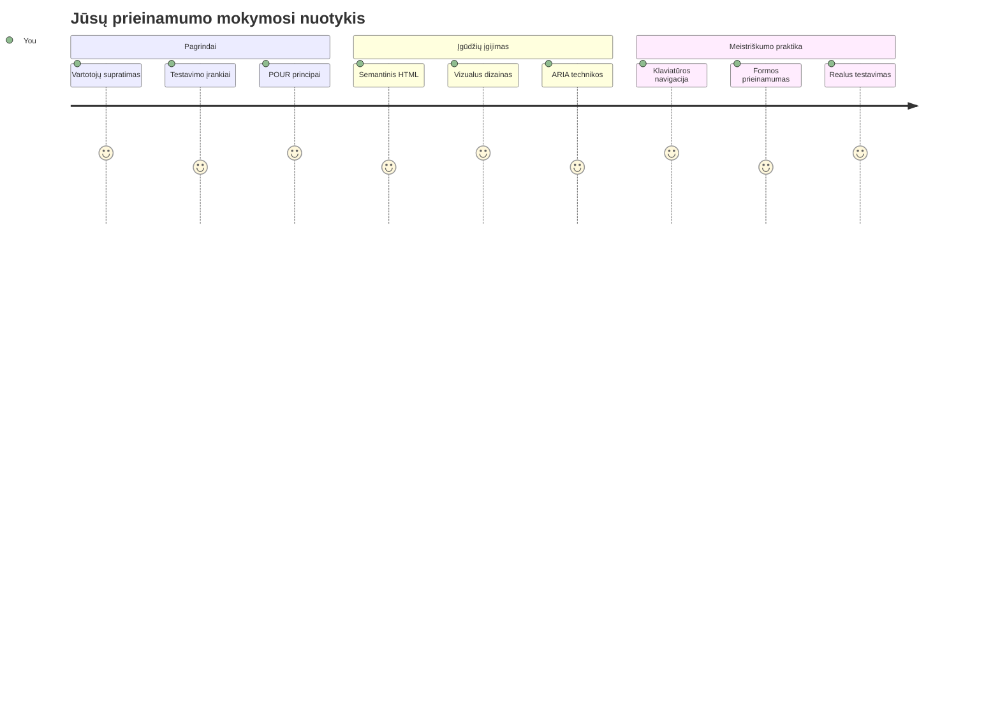
## Priešpaskaitinis testas
[Priešpaskaitinis testas](https://ff-quizzes.netlify.app/web/)

> Interneto galia slypi jo universaliyje. Prieinamumas visiems, nepaisant negalios, yra esminis aspektas.
>
> \- Seras Timothy Berners-Lee, W3C direktorius ir Pasaulinio interneto išradėjas

Štai kas gali jus nustebinti: kūrę prieinamas svetaines jūs ne tik padedate žmonėms su negalia — jūs iš tikrųjų darote internetą geresnį visiems!

Ar pastebėjote tas nuolaidas šaligatvių kampuose? Jos iš pradžių buvo skirtos neįgaliųjų vežimėliams, bet dabar padeda žmonėms su vaikų vežimėliais, pristatymo darbuotojams su vežimėliais, keliautojams su lagaminais ant ratukų ir dviratininkams. Būtent taip veikia prieinama interneto dizainas — sprendimai, padedantys vienai grupei, dažnai naudingi visiems. Gana šaunu, tiesa?

Šiame pamoke tyrinėsime, kaip sukurti svetaines, kurios iš tikrųjų veikia visiems, nesvarbu, kaip jie naršo internete. Nusiųsite praktiškus metodus, kurie jau įtraukti į interneto standartus, išbandysite testavimo įrankius ir pamatysite, kaip prieinamumas paverčia jūsų svetaines patogesnėmis visiems vartotojams.

Pamokos pabaigoje jūs turėsite pasitikėjimą, kad prieinamumas tampa natūralia jūsų kūrimo darbo dalimi. Pasiruošę sužinoti, kaip apgalvoti dizaino sprendimai gali atverti internetą milijardams vartotojų? Pradėkime!

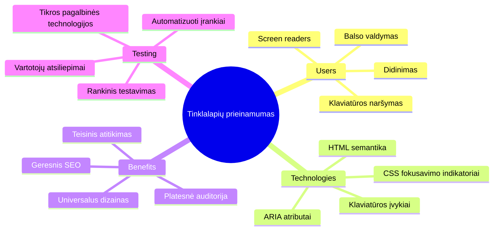
> Šią pamoką galite laikyti [Microsoft Learn](https://docs.microsoft.com/learn/modules/web-development-101/accessibility/?WT.mc_id=academic-77807-sagibbon)!

## Asistinių technologijų supratimas

Prieš pradėdami koduoti, skirkime akimirką suprasti, kaip žmonės su skirtingomis gebėjimų rūšimis iš tikrųjų patiria internetą. Tai ne tik teorija — supratimas apie šiuos realaus pasaulio naršymo būdus padarys jus daug geresniu kūrėju!

Asistinės technologijos yra gana nuostabios priemonės, kurios padeda žmonėms su negalia sąveikauti su svetainėmis būdais, kurie gali jus nustebinti. Kai suprasite, kaip šios technologijos veikia, prieinamų interneto patirčių kūrimas taps kur kas intuityvesnis. Tai tarsi mokytis matyti savo kodą kito žmogaus akimis.

### Ekrano skaitytuvai

[Ekrano skaitytuvai](https://en.wikipedia.org/wiki/Screen_reader) yra gana sudėtingos technologijos, kurios konvertuoja skaitmeninį tekstą į kalbą arba Brailio išvestį. Nors daugiausia juos naudoja regos negalią turintys žmonės, jie taip pat labai naudingi vartotojams su mokymosi sunkumais, tokiais kaip disgrafija.

Man patinka galvoti apie ekrano skaitytuvą kaip apie labai išmanų pasakotoją, kuris skaito knygą jums. Jis skaito garsiai turinį logiška tvarka, paskelbia interaktyvius elementus, tokius kaip "mygtukas" arba "nuoroda", ir suteikia klaviatūros nuorodas, kad būtų galima greitai pereiti per puslapį. Bet čia yra dalykas — ekrano skaitytuvai gali atlikti savo stebuklus tik tada, kai mes kuriame svetaines su tinkama struktūra ir prasmingu turiniu. Štai kur įsijungi jūs, kūrėjas!

**Populiariausi ekrano skaitytuvai įvairioms platformoms:**
- **Windows**: [NVDA](https://www.nvaccess.org/about-nvda/) (nemokamas ir labiausiai paplitęs), [JAWS](https://webaim.org/articles/jaws/), [Narrator](https://support.microsoft.com/windows/complete-guide-to-narrator-e4397a0d-ef4f-b386-d8ae-c172f109bdb1/?WT.mc_id=academic-77807-sagibbon) (integruotas)
- **macOS/iOS**: [VoiceOver](https://support.apple.com/guide/voiceover/welcome/10) (integruotas ir labai pajėgus)
- **Android**: [TalkBack](https://support.google.com/accessibility/android/answer/6283677) (integruotas)
- **Linux**: [Orca](https://wiki.gnome.org/Projects/Orca) (nemokamas ir atviro kodo)

**Kaip ekrano skaitytuvai naršo interneto turinį:**

Ekrano skaitytuvai suteikia kelis naršymo metodus, kurie daro naršymą efektyvų įgudusiems vartotojams:
- **Sekantis skaitymas**: skaito turinį iš viršaus į apačią, kaip knygą
- **Žemėlapių (landmark) naršymas**: pereina tarp puslapio sekcijų (antraštė, naršymas, pagrindinė dalis, poraštė)
- **Antraščių naršymas**: praleidžia tarp antraščių, kad suprastų puslapio struktūrą
- **Nuorodų sąrašai**: sukuria visų nuorodų sąrašą greitam prieinamumui
- **Formos valdikliai**: tiesiogiai naršo tarp įvesties laukų ir mygtukų

> 💡 **Čia yra tai, kas pribloškė mane**: 68 % ekrano skaitytuvo vartotojų daugiausia naršo pagal antraštes ([WebAIM apklausa](https://webaim.org/projects/screenreadersurvey9/#finding)). Tai reiškia, kad jūsų antraščių struktūra yra tarsi žemėlapis vartotojams — kai ją teisingai sudėliojate, jūs tiesiogine prasme padedate žmonėms greičiau rasti jūsų turinį!

### Testavimo darbo eigos kūrimas

Štai gera žinia — efektyvus prieinamumo testavimas nebūtinai turi būti varginantis! Norėsite sujungti automatinius įrankius (jie puikūs aptikdami akivaizdžias problemas) su šiek tiek rankinio testavimo. Štai sistemingas požiūris, kurį radau aptinkant daugiausiai problemų per trumpą laiką:

**Pagrindinė rankinio testavimo darbo eiga:**

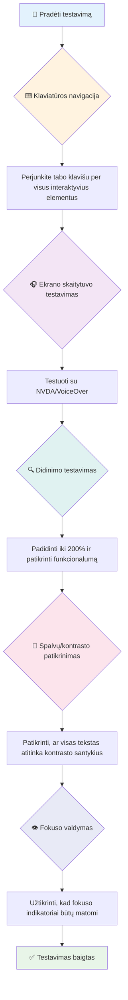
**Testavimo žingsnis po žingsnio kontrolinis sąrašas:**
1. **Klaviatūros naršymas**: naudokite tik Tab, Shift+Tab, Enter, Space ir rodyklių klavišus
2. **Ekrano skaitytuvo testavimas**: įjunkite NVDA, VoiceOver arba Narrator ir naršykite užmerktomis akimis
3. **Padidinimo testavimas**: išbandykite 200 % ir 400 % padidinimus
4. **Spalvų kontrasto patikrinimas**: patikrinkite visą tekstą ir vartotojo sąsajos komponentus
5. **Fokusavimo indikatoriaus testavimas**: įsitikinkite, kad visi interaktyvūs elementai turi matomus fokusavimo būsenas

✅ **Pradėkite nuo Lighthouse**: Atidarykite naršyklės kūrėjų įrankius, paleiskite Lighthouse prieinamumo auditą ir naudokite rezultatus kaip vadovą jūsų rankinio testavimo prioritetams.

### Didinimo ir priartinimo įrankiai

Žinote, kaip kartais savo telefone prispaudžiate ekraną, kad padidintumėte tekstą, kai jis per mažas, arba įsižiūrite į nešiojamojo kompiuterio ekraną ryškioje saulėje? Daugelis vartotojų kiekvieną dieną pasikliauja priartinimo įrankiais, kad turinys būtų įskaitomas. Tai apima žmones su silpnu regėjimu, vyresnio amžiaus asmenis ir visus, kurie kada nors bandė skaityti svetainę lauke.

Modernios didinimo technologijos išsivystė toliau nei tik didinimas. Supratimas, kaip šie įrankiai veikia, padės jums sukurti reaktyvų dizainą, kuris išlieka funkcionalus ir patrauklus bet kokiu priartinimo lygiu.

**Šiuolaikiškos naršyklės didinimo galimybės:**
- **Puslapio didinimas**: proporcingai keičia visą turinį (tekstą, vaizdus, išdėstymą) – tai pageidaujamas būdas
- **Tik teksto didinimas**: didina šriftų dydį išlaikant originalų išdėstymą
- **Suvėlimo priartinimas (pinch-to-zoom)**: mobilus gestas laikiniam priartinimui
- **Naršyklių palaikymas**: visos modernios naršyklės palaiko priartinimą iki 500 % nesulaužant funkcionalumo

**Specializuota didinimo programinė įranga:**
- **Windows**: [Didintuvė](https://support.microsoft.com/windows/use-magnifier-to-make-things-on-the-screen-easier-to-see-414948ba-8b1c-d3bd-8615-0e5e32204198) (integruota), [ZoomText](https://www.freedomscientific.com/training/zoomtext/getting-started/)
- **macOS/iOS**: [Zoom](https://www.apple.com/accessibility/mac/vision/) (integruota su pažangiomis funkcijomis)

> ⚠️ **Dizaino svarstymai**: WCAG reikalauja, kad turinys išliktų funkcionalus priartinus iki 200 %. Ta lygiu horizontalus slinkimas turėtų būti minimalus, o visi interaktyvūs elementai likti prieinami.

✅ **Išbandykite savo reaktyvų dizainą**: priartinkite naršyklę iki 200 % ir 400 %. Ar jūsų išdėstymas prisitaiko sklandžiai? Ar galite pasiekti visas funkcijas be perteklinio slinkimo?

## Šiuolaikiniai prieinamumo testavimo įrankiai

Dabar, kai suprantate, kaip žmonės naršo internetą su asistinėmis technologijomis, pažvelkime į įrankius, kurie padeda jums kurti ir testuoti prieinamas svetaines.

Galvokite apie tai taip: automatizuoti įrankiai puikiai aptinka akivaizdžias problemas (pavyzdžiui, trūkstamą alt tekstą), o rankinis testavimas padeda užtikrinti, kad jūsų svetainė būtų patogi naudoti realiame pasaulyje. Kartu jie suteikia jums pasitikėjimą, kad jūsų svetainės veikia visiems.

### Spalvų kontrasto testavimas

Štai gera žinia: spalvų kontrastas yra viena dažniausių prieinamumo problemų, bet taip pat viena lengviausių ištaisyti. Geras kontrastas naudingas visiems — nuo regos negalią turinčių vartotojų iki žmonių, bandančių skaityti telefoną paplūdimyje.

**WCAG kontrasto reikalavimai:**

| Teksto tipas | WCAG AA (minimali) | WCAG AAA (patobulinta) |
|--------------|--------------------|------------------------|
| **Įprastas tekstas** (iki 18pt) | 4.5:1 kontrasto santykis | 7:1 kontrasto santykis |
| **Didelis tekstas** (18pt+ arba 14pt+ paryškintas) | 3:1 kontrasto santykis | 4.5:1 kontrasto santykis |
| **Vartotojo sąsajos komponentai** (mygtukai, formų rėmeliai) | 3:1 kontrasto santykis | 3:1 kontrasto santykis |

**Svarbiausi testavimo įrankiai:**
- [Colour Contrast Analyser](https://www.tpgi.com/color-contrast-checker/) – darbalaukio programa su spalvų rinkikliu
- [WebAIM Contrast Checker](https://webaim.org/resources/contrastchecker/) – internetinis įrankis su momentiniu grįžtamuoju ryšiu
- [Stark](https://www.getstark.co/) – dizaino įrankių įskiepis Figma, Sketch, Adobe XD
- [Accessible Colors](https://accessible-colors.com/) – suraskite prieinamas spalvų paletes

✅ **Sukurkite geresnes spalvų paletes**: pradėkite nuo savo prekės ženklo spalvų ir naudokite kontrasto tikrintuvus, kad sukurtumėte prieinamas variacijas. Užfiksuokite jas kaip savo dizaino sistemos prieinamus spalvų žetonus.

### Išsamus prieinamumo auditas

Efektyviausias prieinamumo testavimas sujungia kelis metodus. Nė vienas įrankis neaptinka visko, todėl sukūrus testavimo rutiną įvairiomis priemonėmis užtikrinama išsami apžvalga.

**Testavimas naršyklėje (integruotas kūrėjų įrankiuose):**
- **Chrome/Edge**: Lighthouse prieinamumo auditas + Accessibility panel
- **Firefox**: Accessibility Inspector su detaliu medžio vaizdu
- **Safari**: Audit tab Web Inspector su VoiceOver simuliacija

**Profesionalios testavimo plėtiniai:**
- [axe DevTools](https://www.deque.com/axe/devtools/) – pramonės standartas automatizuotame testavime
- [WAVE](https://wave.webaim.org/extension/) – vizualinis grįžtamasis ryšys su klaidų paryškinimu
- [Accessibility Insights](https://accessibilityinsights.io/) – Microsoft išsami testavimo sistema

**Komandinės eilutės ir CI/CD integracija:**
- [axe-core](https://github.com/dequelabs/axe-core) – JavaScript biblioteka automatizuotam testavimui
- [Pa11y](https://pa11y.org/) – komandinės eilutės prieinamumo testavimo įrankis
- [Lighthouse CI](https://github.com/GoogleChrome/lighthouse-ci/) – automatinis prieinamumo įvertinimas

> 🎯 **Testavimo tikslas**: siekite Lighthouse prieinamumo balo 95+ kaip bazinę vertę. Atminkite, automatizuoti įrankiai aptinka tik apie 30–40 % prieinamumo problemų — rankinis testavimas vis dar būtinas!

### 🧠 **Testavimo įgūdžių tikrinimas: pasiruošę rasti problemas?**

**Pažiūrėkime, kaip jaučiatės dėl prieinamumo testavimo:**
- Kuris testavimo metodas dabar atrodo labiausiai prieinamas jums?
- Ar galite įsivaizduoti naudotis tik klaviatūra visą dieną?
- Kokia viena prieinamumo kliūtis jums asmeniškai teko patirti internete?

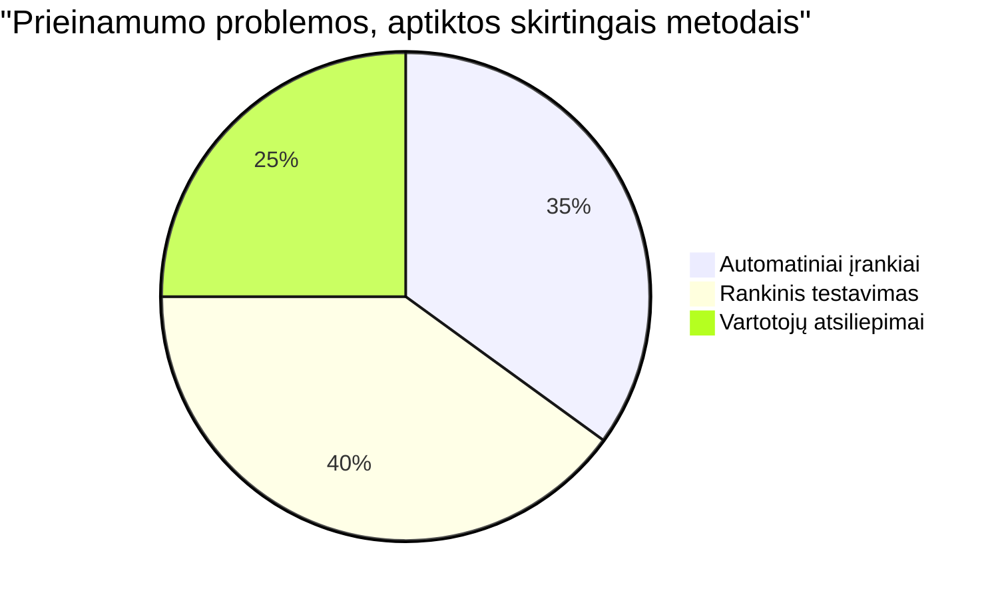
> **Pasitikėjimo stiprintuvas**: profesionalūs prieinamumo testuotojai naudoja būtent tokį metodų derinį. Jūs mokotės pramonės standartų praktikų!

## Prieinamumo kūrimas nuo pagrindų

Prieinamumo sėkmės pagrindas yra įtraukti jį į savo pamatą nuo pirmos dienos. Žinau, kad vilioja pagalvoti „prieinamumą pridėsiu vėliau“, bet tai tarsi bandyti įvesti rampą į namą, kai jis jau pastatytas. Įmanoma? Taip. Lengva? Ne visai.

Galvokite apie prieinamumą kaip apie namo planavimą — daug lengviau įtraukti pritaikymą neįgaliesiems pradiniuose architektūriniuose planuose nei viską perdaryti vėliau.

### PRINCIPAI POUR: Jūsų prieinamumo pamatas

Web Content Accessibility Guidelines (WCAG) remiasi keturiais pagrindiniais principais, kurie sudaro akronimą POUR. Nesijaudinkite — tai nėra sausi akademiniai terminai! Tai praktiškos gairės, kaip kurti turinį, kuris veikia visiems.

Kai susipažinsite su POUR, priimti prieinamumo sprendimus taps žymiai paprasčiau. Tai kaip turėti protinį kontrolinį sąrašą, kuris veda jūsų dizaino pasirinkimus. Pradėkime:

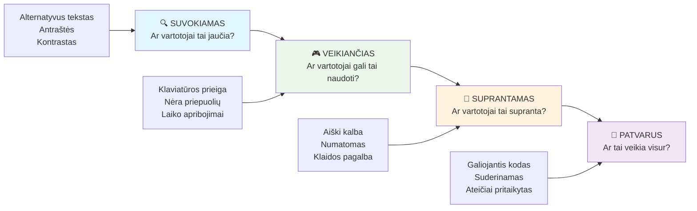
**🔍 Perceivable (Suvokiamas)**: informacija turi būti pateikiama tokiais būdais, kad vartotojai ją galėtų suvokti per savo turimus jutimus

- Suteikite tekstines alternatyvas netekstiniam turiniui (vaizdams, vaizdo įrašams, garsui)
- Užtikrinkite pakankamą spalvų kontrastą visam tekstui ir vartotojo sąsajos komponentams
- Pateikite subtitrus ir transkripcijas daugialypiam turiniui
- Kurkite turinį, kuris išlieka funkcionalus keičiant dydį iki 200 %
- Naudokite kelias jutimo charakteristikas (ne tik spalvą) perduodant informaciją

**🎮 Operable (Valdomas)**: visi sąsajos komponentai turi būti valdomi esamais įvesties metodais

- Užtikrinkite, kad visa funkcionalumas būtų pasiekiamas naudojant klaviatūrą
- Suteikite vartotojams pakankamai laiko skaityti ir sąveikauti su turiniu
- Venkite turinio, kuris gali sukelti traukulius ar vestibuliarinius sutrikimus
- Padėkite vartotojams efektyviai naršyti su aiškia struktūra ir žemėlapiais
- Užtikrinkite interaktyvių elementų tinkamus taikinius (44 px minimum)

**📖 Understandable (Suprantamas)**: informacija ir sąsajos veiksmai turi būti aiškūs ir suprantami

- Naudokite aiškią, paprastą kalbą, pritaikytą jūsų auditorijai
- Užtikrinkite, kad turinys pasirodo ir veikia numatomais, nuosekliais būdais
- Pateikite aiškias instrukcijas ir klaidų pranešimus vartotojo įvesties atveju
- Padėkite vartotojams suprasti ir ištaisyti klaidas formose
- Organizuokite turinį su logine skaitymo tvarka ir informacijos hierarchija

**💪 Robust (Patikimas)**: turinys turi veikti patikimai įvairiose technologijose ir asistinėse įrangoje

- **Naudokite validų, semantinį HTML kaip pagrindą**
- **Užtikrinkite suderinamumą su esamomis ir būsimomis asistinėmis technologijomis**
- **Laikykitės interneto standartų ir geriausių praktikų žymėjime**
- **Išbandykite skirtinguose naršyklėse, įrenginiuose ir pagalbinėse priemonėse**
- **Struktūrizuokite turinį taip, kad jis palaipsniui prastėtų, jei nepalaikomos pažangesnės funkcijos**

### 🎯 **POUR principų patikra: Įtvirtinimas**

**Greitas atspindėjimas apie pagrindus:**
- Ar galite prisiminti svetainės funkciją, kuri neatitinka kiekvieno POUR principo?
- Kuris principas jums kaip kūrėjui atrodo natūraliausias?
- Kaip šie principai galėtų pagerinti dizainą visiems, o ne tik neįgaliesiems?

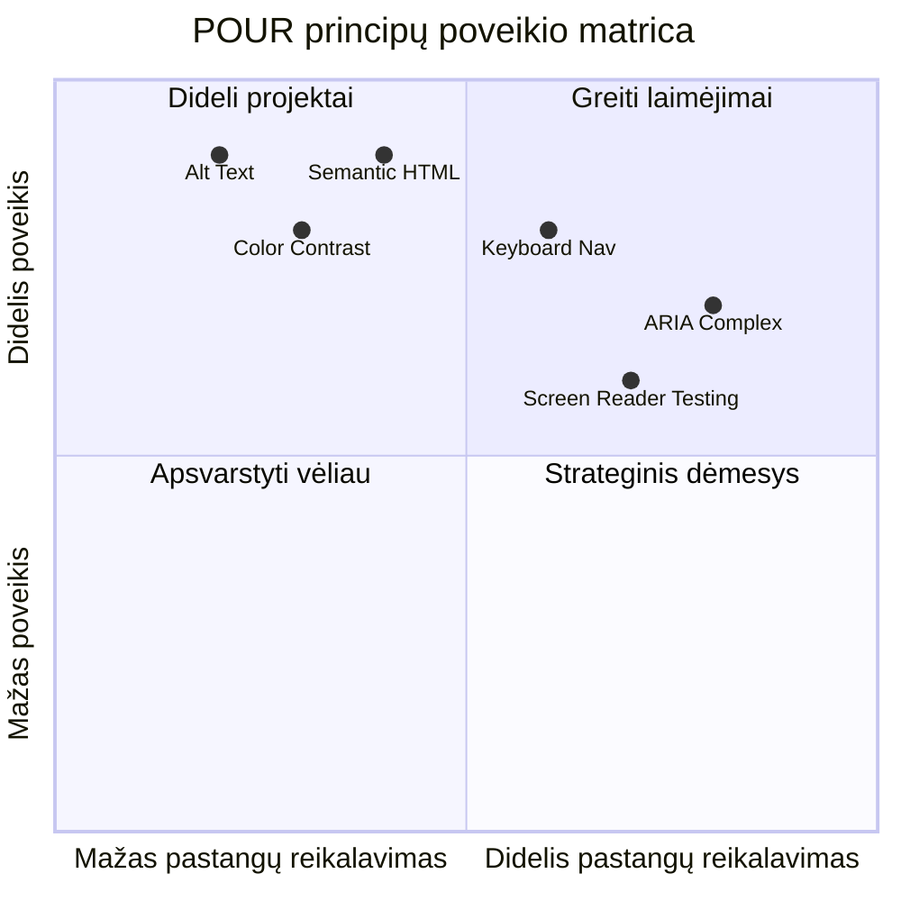
> **Prisiminkite**: Pradėkite nuo didelio poveikio, mažo pastangų reikalaujančių patobulinimų. Semantinis HTML ir alternatyvus tekstas suteikia didžiausią prieinamumo naudą už mažiausias pastangas!

## Prieinamų vizualinių dizainų kūrimas

Geras vizualinis dizainas ir prieinamumas eina koja kojon. Kai projektuojate turėdami omenyje prieinamumą, dažnai pastebite, kad šie apribojimai lemia švaresnius, elegantiškesnius sprendimus, kurie naudingi visiems vartotojams.

Pažvelkime, kaip sukurti vizualiai patrauklius dizainus, kurie veikia visiems, nepriklausomai nuo jų regėjimo gebėjimų ar sąlygų, kuriose jie žiūri jūsų turinį.

### Spalvų ir vizualinio prieinamumo strategijos

Spalva yra galinga komunikacijos priemonė, tačiau tai neturėtų būti vienintelis būdas perduoti svarbią informaciją. Projektavimas, neapsiribojant spalva, sukuria tvirtesnes, įtraukiančias patirtis, kurios veikia daugiau situacijų.

**Projektuokite atsižvelgdami į spalvų regos skirtumus:**

Apie 8 % vyrų ir 0,5 % moterų turi tam tikrą spalvų regos skirtumą (dažnai vadinamą „spalvų aklumu“). Dažniausios rūšys yra:
- **Deuteranopija**: sunku atskirti raudoną ir žalią spalvas
- **Protanopija**: raudona atrodo blankesnė
- **Tritanopija**: sunku atskirti mėlyną ir geltoną (retai pasitaiko)

**Įtraukiamosios spalvų strategijos:**

```css
/* ❌ Bad: Using only color to indicate status */
.error { color: red; }
.success { color: green; }

/* ✅ Good: Color plus icons and context */
.error {
  color: #d32f2f;
  border-left: 4px solid #d32f2f;
}
.error::before {
  content: "⚠️";
  margin-right: 8px;
}

.success {
  color: #2e7d32;
  border-left: 4px solid #2e7d32;
}
.success::before {
  content: "✅";
  margin-right: 8px;
}
```

**Už bazinių kontrasto reikalavimų ribų:**
- Išbandykite savo spalvų pasirinkimus naudojant spalvų aklumo simuliatorius
- Naudokite raštus, tekstūras arba formas kartu su spalvų žymėjimu
- Užtikrinkite, kad interaktyvūs būsena būtų atskiriamos be spalvų
- Apsvarstykite, kaip jūsų dizainas atrodo didelio kontrasto režimu

✅ **Patikrinkite savo spalvų prieinamumą**: Naudokitės įrankiais, tokiais kaip [Coblis](https://www.color-blindness.com/coblis-color-blindness-simulator/), kad pamatytumėte, kaip jūsų svetainė atrodo vartotojams su skirtingų tipų spalvų regos skirtumais.

### Fokuso indikatoriai ir sąveikos dizainas

Fokuso indikatoriai yra skaitmeninis žymeklio atitikmuo – jie rodo klaviatūros vartotojams, kur jie yra puslapyje. Gerai sukurti fokusavimo indikatoriai pagerina patirtį visiems, padarydami sąveikas aiškiomis ir nuspėjamomis.

**Modernios fokusavimo indikatorių gerosios praktikos:**

```css
/* Enhanced focus styles that work across browsers */
button:focus-visible {
  outline: 2px solid #0066cc;
  outline-offset: 2px;
  box-shadow: 0 0 0 4px rgba(0, 102, 204, 0.25);
}

/* Remove focus outline for mouse users, preserve for keyboard users */
button:focus:not(:focus-visible) {
  outline: none;
}

/* Focus-within for complex components */
.card:focus-within {
  box-shadow: 0 0 0 3px rgba(74, 144, 164, 0.5);
  border-color: #4A90A4;
}

/* Ensure focus indicators meet contrast requirements */
.custom-focus:focus-visible {
  outline: 3px solid #ffffff;
  outline-offset: 2px;
  box-shadow: 0 0 0 6px #000000;
}
```

**Fokuso indikatoriai reikalavimai:**
- **Matomumas**: turi turėti bent 3:1 kontrasto santykį su aplinkiniais elementais
- **Plotis**: aplink visą elementą turi būti bent 2px storio
- **Ištvermė**: turėtų likti matomi, kol fokusas persikelia kitur
- **Skirtumas**: turi būti vizualiai skirtingi nuo kitų vartotojo sąsajos būsenų

> 💡 **Dizaino patarimas**: Puikūs fokusavimo indikatoriai dažnai naudoja apvadą, dėžutės šešėlį ir spalvos pasikeitimus, kad užtikrintų matomumą įvairiame fone ir kontekstuose.

✅ **Patikrinkite fokusavimo indikatorius**: Naudokite Tab klavišą naršydami savo svetainę ir atkreipkite dėmesį, kuriems elementams aiškiai matomi fokusavimo indikatoriai. Ar yra sunkiai matomų ar visai be jų?

### Semantinis HTML: Prieinamumo pamatai

Semantinis HTML yra tarsi GPS sistema jūsų svetainei pagalbinėms technologijoms. Kai naudojate tinkamus HTML elementus jų paskirčiai, jūs iš esmės teikiate ekrano skaitytuvams, klaviatūroms ir kitiems įrankiams detalią žemėlapio schemą, padedančią vartotojams efektyviai orientuotis.

Man patinka analogija: semantinis HTML yra skirtumas tarp gerai organizuotos bibliotekos su aiškiomis kategorijomis ir naudingais ženklais, ir sandėlio, kuriame knygos išmėtytos atsitiktinai. Abiejose vietose yra tos pačios knygos, bet kurioje geriau ieškotumėte ko nors? Būtent!

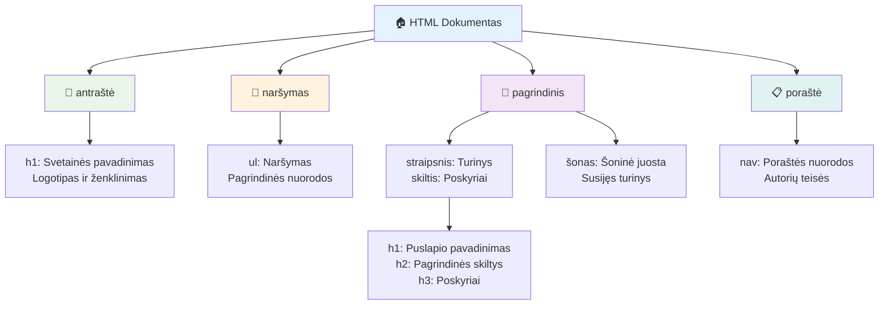
**Prieinamos puslapio struktūros statybiniai elementai:**

```html
<!-- Landmark elements provide page navigation structure -->
<header>
  <h1>Your Site Name</h1>
  <nav aria-label="Main navigation">
    <ul>
      <li><a href="/home">Home</a></li>
      <li><a href="/about">About</a></li>
      <li><a href="/services">Services</a></li>
    </ul>
  </nav>
</header>

<main>
  <article>
    <header>
      <h1>Article Title</h1>
      <p>Published on <time datetime="2024-10-14">October 14, 2024</time></p>
    </header>
    
    <section>
      <h2>First Section</h2>
      <p>Content that relates to this section...</p>
    </section>
    
    <section>
      <h2>Second Section</h2>
      <p>More related content...</p>
    </section>
  </article>
  
  <aside>
    <h2>Related Links</h2>
    <nav aria-label="Related articles">
      <ul>
        <li><a href="/related-1">First related article</a></li>
        <li><a href="/related-2">Second related article</a></li>
      </ul>
    </nav>
  </aside>
</main>

<footer>
  <p>&copy; 2024 Your Site Name. All rights reserved.</p>
  <nav aria-label="Footer links">
    <ul>
      <li><a href="/privacy">Privacy Policy</a></li>
      <li><a href="/contact">Contact Us</a></li>
    </ul>
  </nav>
</footer>
```

**Kodėl semantinis HTML transformuoja prieinamumą:**

| Semantinis elementas | Paskirtis | Ekrano skaitytuvo nauda |
|---------------------|-----------|-------------------------|
| `<header>` | Puslapio ar skyriaus antraštė | „Reklaminės juostos žymė“ – greita navigacija į viršų |
| `<nav>` | Navigacijos nuorodos | „Navigacijos žymė“ – navigacijos sekcijų sąrašas |
| `<main>` | Pagrindinis puslapio turinys | „Pagrindinė žymė“ – tiesioginis peršokimas į turinį |
| `<article>` | Savarankiškas turinys | Nurodo straipsnio ribas |
| `<section>` | Teminiai turinio blokai | Teikia turinio struktūrą |
| `<aside>` | Susijęs šoninės juostos turinys | „Papildomos žymės“ |
| `<footer>` | Puslapio ar skyriaus poraštė | „Turinio informacijos žymė“ |

**Ekrano skaitytuvo supergalia su semantiniu HTML:**
- **Žymių navigacija**: Greitai šokinėkite tarp pagrindinių puslapio sekcijų
- **Antraščių žemėlapiai**: Generuoja turinio lentelę pagal antraštes
- **Elementų sąrašai**: Kuria visų nuorodų, mygtukų ar formos valdiklių sąrašus
- **Konteksto suvokimas**: Supranta sąsajas tarp turinio skyrių

> 🎯 **Greitas testas**: Išbandykite svetainės naršymą ekrano skaitytuvu naudodami žymių nuorodas (D žyme, H antraštei, K nuorodai NVDA/JAWS). Ar navigacija prasminga?

### 🏗️ **Semantinio HTML meistriškumo patikra: Tvirtų pamatų kūrimas**

**Įvertinkite savo semantinį supratimą:**
- Ar galite atpažinti žymes puslapyje vien pažvelgę į HTML?
- Kaip paaiškintumėte draugui skirtumą tarp `<section>` ir `<div>`?
- Ką pirmiausia tikrintumėte, jei ekrano skaitytuvo vartotojas praneštų apie navigacijos problemas?

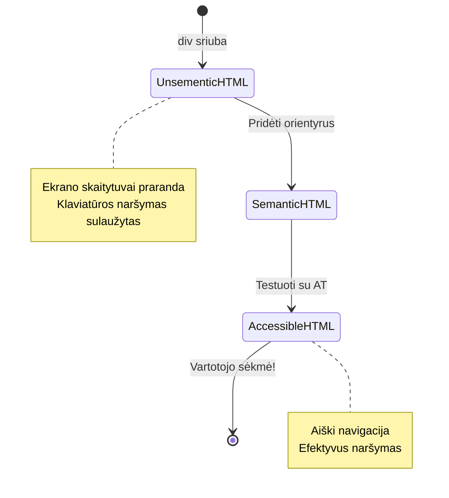
> **Profesionalus patarimas**: Geras semantinis HTML automatiškai išsprendžia apie 70 % prieinamumo problemų. Išmokite šį pagrindą ir jau būsite kelyje į sėkmę!

✅ **Patikrinkite semantinę struktūrą**: Naudokite Naršyklės kūrėjų įrankių Prieinamumo skydelį, kad pamatytumėte prieinamumo medį ir įsitikintumėte, jog žymėjimas sukuria logišką struktūrą.

### Antraščių hierarchija: Logiškos turinio struktūros kūrimas

Antraštės yra itin svarbios prieinamam turiniui – jos tarsi stuburas, kuris viską laiko kartu. Ekrano skaitytuvo vartotojai labai remiasi antraštėmis, kad suprastų ir naršytų jūsų turinį. Tai lyg pateikti turinio lentelę jūsų puslapiui.

**Auksinė antraščių taisyklė:**
Niekada nepraleiskite lygių. Visada logiškai keliaukite nuo `<h1>` iki `<h2>`, `<h3>` ir t.t. Ar mokykloje darėte planus? Tai ta pati taisyklė – juk nepraleidžiate nuo „I. Pagrindinė mintis“ tiesiai prie „C. Po-pakomentė“, praleisdami „A. Pakomentė“, tiesa?

**Puikus antraščių struktūros pavyzdys:**

```html
<!-- ✅ Excellent: Logical, hierarchical progression -->
<main>
  <h1>Complete Guide to Web Accessibility</h1>
  
  <section>
    <h2>Understanding Screen Readers</h2>
    <p>Introduction to screen reader technology...</p>
    
    <h3>Popular Screen Reader Software</h3>
    <p>NVDA, JAWS, and VoiceOver comparison...</p>
    
    <h3>Testing with Screen Readers</h3>
    <p>Step-by-step testing instructions...</p>
  </section>
  
  <section>
    <h2>Color and Contrast Guidelines</h2>
    <p>Designing with sufficient contrast...</p>
    
    <h3>WCAG Contrast Requirements</h3>
    <p>Understanding the different contrast levels...</p>
    
    <h3>Testing Tools and Techniques</h3>
    <p>Tools for verifying contrast ratios...</p>
  </section>
</main>
```

```html
<!-- ❌ Problematic: Skipping levels, inconsistent structure -->
<h1>Page Title</h1>
<h3>Subsection</h3> <!-- Skipped h2 -->
<h2>This should come before h3</h2>
<h1>Another main heading?</h1> <!-- Multiple h1s -->
```

**Antraščių gerosios praktikos:**
- **Vienas `<h1>` puslapyje**: Dažniausiai pagrindinis puslapio pavadinimas ar pagrindinė turinio antraštė
- **Logiška seka**: Niekada nepraleiskite lygių (h1 → h2 → h3, ne h1 → h3)
- **Aprašomas turinys**: Antraštės turi būti prasmingos net išskyrus kontekstą
- **Vizualinis stilius su CSS**: Naudokite CSS išvaizdai, HTML lygių struktūrai

**Ekrano skaitytuvo navigacijos statistika:**
- 68 % ekrano skaitytuvo vartotojų naršo pagal antraštes ([WebAIM Survey](https://webaim.org/projects/screenreadersurvey9/#finding))
- Vartotojai tikisi rasti logišką antraščių struktūrą
- Antraštės leidžia greičiausiai suprasti puslapio struktūrą

> 💡 **Profesionalus patarimas**: Naudokite naršyklės plėtinius, pvz., "HeadingsMap", kad vizualizuotumėte antraščių struktūrą. Ji turėtų skaitytis kaip gerai organizuota turinio lentelė.

✅ **Išbandykite antraščių struktūrą**: Naudokite ekrano skaitytuvo antraščių navigaciją (H klavišas NVDA) peršokti per antraštes. Ar seka logiškai pasakoja turinio istoriją?

### Pažangios vizualinio prieinamumo technikos

Be pagrindinio kontrasto ir spalvų, yra sudėtingų technikų, kurios padeda sukurti tikrai įtraukiančias vizualines patirtis. Šie metodai užtikrina, kad jūsų turinys veiktų įvairiomis žiūrėjimo sąlygomis ir su pagalbinėmis technologijomis.

**Būtinos vizualinės komunikacijos strategijos:**

- **Daugiakanalis grįžtamasis ryšys**: derinkite vizualinius, tekstinius ir kartais garso signalus
- **Progresyvus atskleidimas**: pateikite informaciją dalimis
- **Vientisos sąveikos modeliai**: naudokite pažįstamus UI įpročius
- **Reaguojanti tipografija**: tinkamai didinkite tekstą įvairiuose įrenginiuose
- **Krovimo ir klaidų būsenos**: suteikite aiškų grįžtamąjį ryšį visiems vartotojo veiksmams

**CSS įrankiai patobulintam prieinamumui:**

```css
/* Screen reader only text - visually hidden but accessible */
.sr-only {
  position: absolute;
  width: 1px;
  height: 1px;
  padding: 0;
  margin: -1px;
  overflow: hidden;
  clip: rect(0, 0, 0, 0);
  white-space: nowrap;
  border: 0;
}

/* Skip link for keyboard navigation */
.skip-link {
  position: absolute;
  top: -40px;
  left: 6px;
  background: #000000;
  color: #ffffff;
  padding: 8px 16px;
  text-decoration: none;
  border-radius: 4px;
  font-weight: bold;
  transition: top 0.3s ease;
  z-index: 1000;
}

.skip-link:focus {
  top: 6px;
}

/* Reduced motion respect */
@media (prefers-reduced-motion: reduce) {
  .skip-link {
    transition: none;
  }
  
  * {
    animation-duration: 0.01ms !important;
    animation-iteration-count: 1 !important;
    transition-duration: 0.01ms !important;
  }
}

/* High contrast mode support */
@media (prefers-contrast: high) {
  .button {
    border: 2px solid;
  }
}
```

> 🎯 **Prieinamumo modelis**: „Praleidimo nuoroda“ yra būtina klaviatūros vartotojams. Ji turėtų būti pirmasis fokusuojamas elementas jūsų puslapyje ir tiesiai pereiti į pagrindinį turinį.

✅ **Įgyvendinkite praleidimo navigaciją**: Įtraukite praleidimo nuorodas į savo puslapius ir išbandykite jas paspausdami Tab, kai puslapis įkrautas. Jos turi būti matomos ir leisti tiesiai pereiti į pagrindinį turinį.

## Gili prasmingų nuorodų tekstų kūrimas

Nuorodos yra tarsi interneto magistralės, tačiau prastai parašytas nuorodų tekstas – tai kaip kelio ženklai, kurie sako tik „Vieta“ vietoje „Čikagos centras“. Ne labai naudinga, tiesa?

Štai kas mane sužavėjo, kai pirmą kartą tai sužinojau: ekrano skaitytuvai gali ištraukoti visas nuorodas iš puslapio ir parodyti jas dideliame sąraše. Įsivaizduokite, jei kažkas duotų jums visų nuorodų katalogą jūsų puslapyje. Ar kiekviena nuoroda savarankiškai reikš kažką aiškaus? Tai yra testas, kurį turi išlaikyti jūsų nuorodų tekstas!

### Nuorodų navigacijos modelių supratimas

Ekrano skaitytuvai siūlo galingas nuorodų navigacijos funkcijas, kurios priklauso nuo gerai parašyto nuorodų teksto:

**Nuorodų navigacijos būdai:**
- **Sekantis skaitymas**: nuorodos skaitomos kontekste kaip turinio dalis
- **Nuorodų sąrašų generavimas**: visos puslapio nuorodos surenkamos į ieškomą katalogą
- **Greita navigacija**: šokinėjimas tarp nuorodų naudojant klaviatūros spartųjį klavišą (K NVDA)
- **Paieškos funkcionalumas**: ieškokite konkrečių nuorodų pagal dalinį tekstą

**Kodėl svarbus kontekstas:**
Kai ekrano skaitytuvo vartotojai sugeneruoja nuorodų sąrašą, jie mato kažką panašaus į šį:
- „Atsisiųsti ataskaitą“
- „Sužinokite daugiau“
- „Spustelėkite čia“
- „Privatumo politika“
- „Spustelėkite čia“

Tik dvi iš šių nuorodų suteikia naudingą informaciją be konteksto!

> 📊 **Vartotojo poveikis**: Ekrano skaitytuvo vartotojai naršo nuorodų sąrašus, kad greitai suprastų puslapio turinį. Bendriniai nuorodų tekstai priverčia grįžti iki kiekvienos nuorodos konteksto, reikšmingai sulėtindami naršymą.

### Dažnos nuorodų teksto klaidos, kurių reikia vengti

Suprasti, kas neveikia, padeda atpažinti ir ištaisyti prieinamumo problemas esamame turinyje.

**❌ Bendri nuorodų tekstai, nesuteikiantys konteksto:**

```html
<!-- Meaningless when read from a link list -->
<p>Our sustainability efforts are detailed in our recent report. 
   <a href="/sustainability-2024.pdf">Click here</a> to view it.</p>

<!-- Repeated generic text throughout the page -->
<div class="article-card">
  <h3>Web Accessibility Guide</h3>
  <p>Learn the fundamentals...</p>
  <a href="/accessibility-guide">Read more</a>
</div>
<div class="article-card">
  <h3>Color Contrast Tips</h3>
  <p>Improve your design...</p>
  <a href="/color-contrast">Read more</a>
</div>

<!-- URLs as link text (difficult for screen readers to announce) -->
<p>Visit https://www.w3.org/WAI/WCAG21/quickref/ for WCAG guidelines.</p>

<!-- Vague action words -->
<a href="/contact">Go</a> | <a href="/about">See</a> | <a href="/help">View</a>
```

**Kodėl šie modeliai nepavyksta:**
- **„Spustelėkite čia“** vartotojams nesako nieko apie paskirties vietą
- **„Skaityti daugiau“** kartojama kelis kartus sukelia painiavą
- **Grynos URL** sunkiai taisyklingai tariami ekrano skaitytuve
- **Vienas žodis**, pvz., „Eiti“ ar „Žiūrėti“, stokojantys aprašomo konteksto

### Puikaus nuorodų teksto rašymas

Aprašomas nuorodų tekstas naudingas visiems – regimieji vartotojai gali greitai peržiūrėti nuorodas, o ekrano skaitytuvo vartotojai iš karto supranta paskirtį.

**✅ Aiškūs, aprašomieji nuorodų teksto pavyzdžiai:**

```html
<!-- Descriptive text that explains the destination -->
<p>Our comprehensive <a href="/sustainability-2024.pdf">2024 sustainability report (PDF, 2.1MB)</a> details our environmental initiatives.</p>

<!-- Specific, unique link text for each card -->
<div class="article-card">
  <h3>Web Accessibility Guide</h3>
  <p>Learn the fundamentals of inclusive design...</p>
  <a href="/accessibility-guide">Read our complete web accessibility guide</a>
</div>
<div class="article-card">
  <h3>Color Contrast Tips</h3>
  <p>Improve your design with better color choices...</p>
  <a href="/color-contrast">Explore color contrast best practices</a>
</div>

<!-- Meaningful text instead of raw URLs -->
<p>The <a href="https://www.w3.org/WAI/WCAG21/quickref/">WCAG 2.1 Quick Reference guide</a> provides comprehensive accessibility guidelines.</p>

<!-- Descriptive action links -->
<a href="/contact">Contact our support team</a> | 
<a href="/about">About our company</a> | 
<a href="/help">Get help with your account</a>
```

**Geriausios nuorodų teksto praktikos:**
- **Būkite konkrečiais**: „Atsisiųsti ketvirtinį finansinę ataskaitą“ vietoje „Atsisiųsti“
- **Nurodykite failo tipą ir dydį**: „(PDF, 1,2MB)“ atsisiunčiamoms byloms
- **Nurodykite, jei nuorodos atsidaro išoriniame lange**: „(atidaro naujame lange)“ kai tinkama
- **Naudokite aktyvią kalbą**: „Susisiekite su mumis“ vietoje „Kontaktų puslapis“
- **Išlaikykite glaustumą**: siekite 2–8 žodžių, kai įmanoma

### Pažangūs nuorodų prieinamumo modeliai

Kartais vizualaus dizaino apribojimai ar techniniai reikalavimai reikalauja specialių sprendimų. Štai pažangios technikos dažnoms sudėtingoms situacijoms:

**ARIA naudojimas papildomam kontekstui suteikti:**

```html
<!-- When button text must be short but needs more context -->
<a href="/report.pdf" 
   aria-label="Download 2024 annual financial report, PDF format, 2.3MB">
  Download Report
</a>

<!-- When the full context comes from surrounding content -->
<h3 id="sustainability-heading">Sustainability Initiative</h3>
<p>Our efforts to reduce environmental impact...</p>
<a href="/sustainability-details" 
   aria-labelledby="sustainability-heading"
   aria-describedby="sustainability-summary">
  Learn more
</a>
<p id="sustainability-summary">Detailed breakdown of our 2024 environmental goals and achievements</p>
```

**Failų tipų ir išorinių paskirčių nurodymas:**

```html
<!-- Method 1: Include information in visible link text -->
<a href="/annual-report.pdf">
  Download our 2024 annual report (PDF, 2.3MB)
</a>

<!-- Method 2: Use screen reader-only text for file details -->
<a href="/annual-report.pdf">
  Download our 2024 annual report
  <span class="sr-only">(PDF format, 2.3MB)</span>
</a>

<!-- Method 3: External link indication -->
<a href="https://example.com" 
   target="_blank" 
   aria-describedby="external-link-warning">
  Visit external resource
</a>
<span id="external-link-warning" class="sr-only">
  (opens in new window)
</span>

<!-- Method 4: Using CSS for visual indicators -->
<a href="https://example.com" class="external-link">
  External resource
</a>
```

```css
/* Visual indicator for external links */
.external-link::after {
  content: " ↗";
  font-size: 0.8em;
  color: #666;
}

/* Screen reader announcement for external links */
.external-link::before {
  content: "External link: ";
  position: absolute;
  left: -10000px;
  width: 1px;
  height: 1px;
  overflow: hidden;
}
```

> ⚠️ **Svarbu**: Naudojant `target="_blank"`, visada praneškite vartotojams, kad nuoroda atsidaro naujame lange ar skirtuke. Nenumatyti naršymo pokyčiai gali sukelti sumišimą.

✅ **Patikrinkite nuorodų kontekstą**: Naudokite naršyklės kūrėjų įrankius, kad sugeneruotumėte visų nuorodų sąrašą puslapyje. Ar suprantate kiekvienos nuorodos paskirtį be jokio papildomo konteksto?

## ARIA: HTML prieinamumo galios stiprinimas

[Prieinamos turtingos interneto programos (ARIA)](https://developer.mozilla.org/docs/Web/Accessibility/ARIA) yra tarsi universalus vertėjas tarp sudėtingų interneto programėlių ir pagalbinių technologijų. Kai pats HTML negali išreikšti visko, ką atlieka jūsų interaktyvūs komponentai, ARIA žengia į pagalbą užpildyti šias spragas.

Mėgstu mąstyti, kad ARIA prideda naudingas pastabas jūsų HTML – tarsi scenaristo nurodymus spektaklio tekste, kurie padeda aktoriams suprasti vaidmenis ir santykius.

**Svarbiausia taisyklė apie ARIA**: Visada pirmiausia naudokite semantinį HTML, o paskui pridėkite ARIA, kad jį sustiprintumėte. Galvokite apie ARIA kaip prieskonį, o ne pagrindinį patiekalą. Ji turėtų aiškinti ir pagerinti jūsų HTML struktūrą, niekada jos nepakeisti. Pirmiausia pasirūpinkite pamatų teisingumu!

### Strateginis ARIA taikymas

ARIA yra galingas, bet su galia ateina ir atsakomybė. Netinkamai naudojama ARIA gali prieinamumą pabloginti labiau nei jo nebuvimas. Štai kada ir kaip ją naudoti efektyviai:

**✅ Naudokite ARIA, kai:**
- Kuriate individualius interaktyvius valdiklius (akordeonus, korteles, karuseles)
- Kuriate dinaminį turinį, kuris keičiasi be puslapio perkrovimo
- Teikiate papildomą kontekstą sudėtingoms UI struktūroms
- Žymite krovimo būsenas ar gyvų turinio atnaujinimus
- Kuriate programėlių tipo sąsajas su pasirinktiniais valdikliais

**❌ Venkite ARIA, kai:**
- Standartiniai HTML elementai jau teikia reikalingas semantikas
- Nežinote, kaip tinkamai ją įdiegti
- Ji dubliuoja jau semantiniu HTML teikiamą informaciją
- Neturite galimybės išbandyti su tikromis pagalbinėmis technologijomis

> 🎯 **ARIA auksinė taisyklė**: „Nekeiskite semantikų nebent būtina, visada užtikrinkite klaviatūros prieinamumą ir testuokite su tikromis pagalbinėmis technologijomis.“
**Penkios ARIA kategorijos:**

1. **Rolės**: Kas yra šis elementas? (`button`, `tab`, `dialog`)
2. **Savybės**: Kokios jo savybės? (`aria-required`, `aria-haspopup`)
3. **Būsenos**: Kokia yra jo dabartinė būklė? (`aria-expanded`, `aria-checked`)
4. **Žymekliai**: Kur jis yra puslapio struktūroje? (`banner`, `navigation`, `main`)
5. **Gyvos sritys**: Kaip turėtų būti pranešami pokyčiai? (`aria-live`, `aria-atomic`)

### Būtini ARIA šablonai modernioms žiniatinklio programėlėms

Šie šablonai sprendžia dažniausias prieinamumo problemas interaktyviose žiniatinklio programėlėse:

**Elementų pavadinimas ir aprašymas:**

```html
<!-- aria-label: Provides accessible name when visible text isn't sufficient -->
<button aria-label="Close newsletter subscription dialog">×</button>

<!-- aria-labelledby: References existing text as the accessible name -->
<section aria-labelledby="news-heading">
  <h2 id="news-heading">Latest News</h2>
  <!-- news content -->
</section>

<!-- aria-describedby: Links to additional descriptive text -->
<input type="password" 
       aria-describedby="pwd-requirements pwd-strength"
       required>
<div id="pwd-requirements">
  Password must contain at least 8 characters, including uppercase, lowercase, and numbers.
</div>
<div id="pwd-strength" aria-live="polite">
  <!-- Dynamic password strength indicator -->
</div>
```

**Gyvos sritys dinaminiam turiniui:**

```html
<!-- Polite announcements (don't interrupt current speech) -->
<div aria-live="polite" id="status-updates">
  <!-- Status messages appear here -->
</div>

<!-- Assertive announcements (interrupt and announce immediately) -->
<div aria-live="assertive" id="urgent-alerts">
  <!-- Error messages and critical alerts -->
</div>

<!-- Loading states with live regions -->
<button id="submit-btn" aria-describedby="loading-status">
  Submit Application
</button>
<div id="loading-status" aria-live="polite" aria-atomic="true">
  <!-- "Processing your application..." appears here -->
</div>
```

**Interaktyvi valdiklio pavyzdys (akordeonas):**

```html
<div class="accordion">
  <h3>
    <button aria-expanded="false" 
            aria-controls="panel-1" 
            id="accordion-trigger-1"
            class="accordion-trigger">
      Accessibility Guidelines
    </button>
  </h3>
  <div id="panel-1" 
       role="region"
       aria-labelledby="accordion-trigger-1" 
       hidden>
    <p>WCAG 2.1 provides comprehensive guidelines...</p>
  </div>
</div>
```

```javascript
// JavaScript akordeono būsenoje valdyti
function toggleAccordion(trigger) {
  const panel = document.getElementById(trigger.getAttribute('aria-controls'));
  const isExpanded = trigger.getAttribute('aria-expanded') === 'true';
  
  // Perjungti būsenas
  trigger.setAttribute('aria-expanded', !isExpanded);
  panel.hidden = isExpanded;
  
  // Pranešti apie pokytį ekrano skaitytuvams
  const status = document.getElementById('status-updates');
  status.textContent = isExpanded ? 'Section collapsed' : 'Section expanded';
}
```

### Geriausios ARIA diegimo praktikos

ARIA yra galinga, tačiau reikalauja atidaus diegimo. Šių gairių laikymasis padeda užtikrinti, kad jūsų ARIA pagerins, o ne trukdys prieinamumui:

**🛡️ Pagrindiniai principai:**

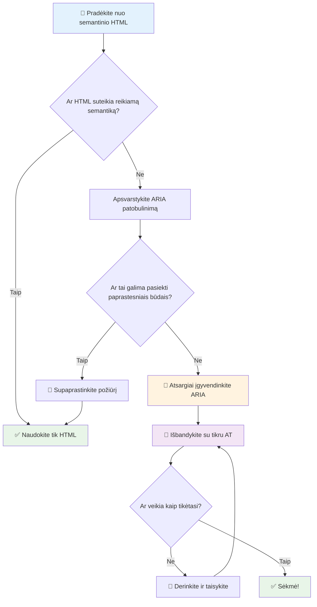
1. **Pirmiausia semantinis HTML**: Visada rinkitės `<button>` vietoj `<div role="button">`
2. **Nesunaikinkite semantikos**: Niekada nepakeiskite esamos HTML prasmės (venkite `<h1 role="button">`)
3. **Išlaikykite klaviatūros prieinamumą**: Visi interaktyvūs ARIA elementai turi būti pilnai valdomi klaviatūra
4. **Testuokite su tikrais vartotojais**: ARIA palaikymas labai skiriasi tarp pagalbinių technologijų
5. **Pradėkite paprastai**: Sudėtingas ARIA diegimas dažniau turi klaidų

**🔍 Testavimo eiga:**

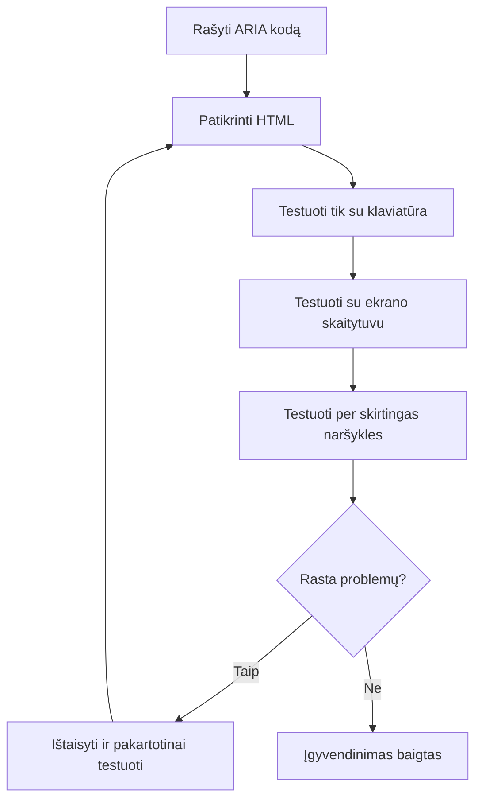
**🚫 Dažnos ARIA klaidos, kurių reikėtų vengti:**

- **Prieštaringa informacija**: Nesikryžminkite su HTML semantika
- **Per daug ženklinimo**: Per daug ARIA informacijos trikdo vartotojus
- **Statinė ARIA**: Nepamirškite atnaujinti ARIA būsenų keičiantis turiniui
- **Netestuoti diegimai**: ARIA, kuri teoriškai veikia, bet praktiškai ne
- **Trūksta klaviatūros palaikymo**: ARIA rolės be atitinkamų klaviatūros interakcijų

> 💡 **Testavimo ištekliai**: Naudokite įrankius kaip [accessibility-checker](https://www.npmjs.com/package/accessibility-checker) automatiniai ARIA patikrinimui, tačiau visada testuokite su tikrais ekrano skaitytuvais pilname kontekste.

### 🎭 **ARIA įgūdžių patikra: Ar esate pasiruošę sudėtingoms sąveikoms?**

**Įvertinkite savo ARIA pasitikėjimą:**
- Kada rinktumėtės ARIA vietoje semantinio HTML? (Užuomina: beveik niekada!)
- Ar galite paaiškinti, kodėl `<div role="button">` dažniausiai blogesnis už `<button>`?
- Kokia svarbiausia taisyklė ARIA testavime?

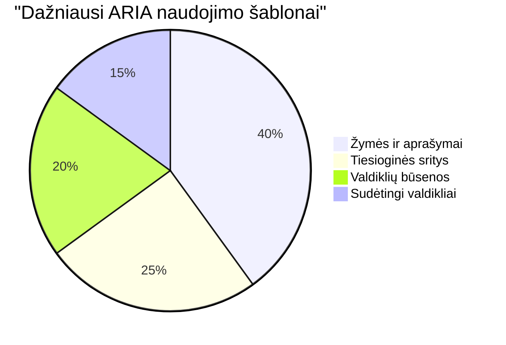
> **Svarbi įžvalga**: Dauguma ARIA naudojimo yra elementų ženklinimui ir aprašymui. Sudėtingi valdiklių šablonai yra daug retesni nei galvojate!

✅ **Mokykitės iš ekspertų**: Studijuokite [ARIA Authoring Practices Guide](https://w3c.github.io/aria-practices/) – tai patikrinti šablonai ir sudėtingų interaktyvių valdiklių diegimai.

## Vaizdų ir medijos prieinamumo užtikrinimas

Vaizdinis ir garso turinys yra esminė šiuolaikinių tinklalapių dalis, tačiau jei jų neįgyvendinsite apgalvotai, jie gali sukelti kliūtis. Tikslas – užtikrinti, kad informacija ir emocinis medijos poveikis pasiektų kiekvieną vartotoją. Kai tai suprasite, tai taps įpročiu.

Skirtingi medijos tipai reikalauja skirtingų prieinamumo sprendimų. Tai tarsi gaminimas – jūs nesielgsite su trapiu žuvies patiekalu taip pat, kaip su tvirtu kepsniu. Šių skirtumų supratimas padeda pasirinkti tinkamą sprendimą kiekvienu atveju.

### Strateginis vaizdų prieinamumas

Kiekvienas jūsų svetainės vaizdas turi paskirtį. Supratimas apie ją padeda geriau parašyti alternatyvų tekstą ir sukurti įtraukesnę patirtį.

**Keturi vaizdų tipai ir jų alt teksto strategijos:**

**Informaciniai vaizdai** – perteikia svarbią informaciją:
```html

```

**Dekoratyviniai vaizdai** – grynai vizualūs, be informacinės vertės:
```html

```

**Funkciniai vaizdai** – veikia kaip mygtukai ar valdymo elementai:
```html
<button>
  
</button>
```

**Sudėtingi vaizdai** – grafikai, schemos, infografika:
```html

<div id="chart-description">
  <p>Detailed description: Sales data shows a steady increase across all quarters...</p>
</div>
```

### Vaizdo ir garso prieinamumas

**Vaizdo reikalavimai:**
- **Titrai**: Tekstinė kalbamo turinio ir garso efektų versija
- **Garso aprašymai**: Vaizdinių elementų aprašymas regos negalią turintiems vartotojams
- **Perrašymai**: Visas garso ir vaizdo turinio tekstinis variantas

```html
<video controls>
  <source src="video.mp4" type="video/mp4">
  <track kind="captions" src="captions.vtt" srclang="en" label="English">
  <track kind="descriptions" src="descriptions.vtt" srclang="en" label="Audio descriptions">
</video>
```

**Garso reikalavimai:**
- **Perrašymai**: Visos kalbos teksto versija
- **Vizualiniai indikatoriai**: Tik garsui skirtam turiniui pateikti vizualinius signalus

### Modernios vaizdo technologijos

**Dekoratyviniams vaizdams naudokite CSS:**
```css
.hero-section {
  background-image: url('decorative-hero.jpg');
  /* Decorative images in CSS don't need alt text */
}
```

**Reaguojantys vaizdai su prieinamumu:**
```html
<picture>
  <source media="(min-width: 800px)" srcset="large-chart.png">
  <source media="(min-width: 400px)" srcset="medium-chart.png">
  
</picture>
```

✅ **Testuokite vaizdų prieinamumą**: Naudokite ekrano skaitytuvą naršydami puslapį su vaizdais. Ar gaunate pakankamai informacijos, kad suprastumėte turinį?

## Klaviatūros navigacija ir fokusavimo valdymas

Daugelis vartotojų naršo tinklą tik naudodami klaviatūrą. Tai apima žmones su motorikos sutrikimais, energingus naudotojus, kuriems klaviatūra greitesnė už pelę, ir visus, kurių pelė nebefunkcionuoja. Užtikrinti, kad jūsų svetainė gerai veiktų klaviatūra, yra būtina ir dažnai daro svetainę efektyvesnę visiems.

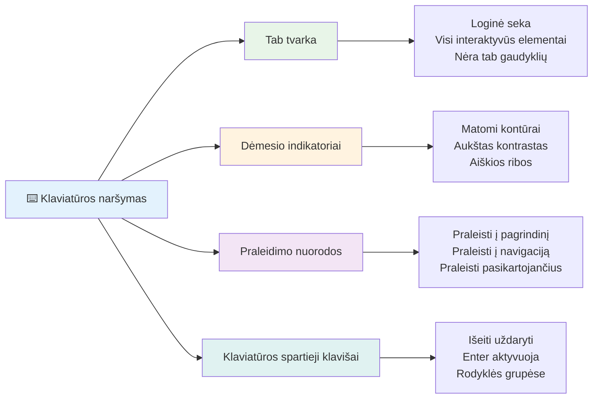
### Būtini klaviatūros navigacijos šablonai

**Standartinės klaviatūros sąveikos:**
- **Tab**: Perkelti fokusą į priekį per interaktyvius elementus
- **Shift + Tab**: Perkelti fokusą atgal
- **Enter**: Aktyvuoti mygtukus ir nuorodas
- **Space**: Aktyvuoti mygtukus, pažymėti žymimuosius laukelius
- **Rodyklės**: Naršyti tarp komponentų grupių (radiomygtukai, meniu)
- **Escape**: Uždaryti modalus, išskleidžiamuosius sąrašus arba atšaukti veiksmus

### Fokusavimo valdymo geriausios praktikos

**Matomi fokusavimo indikatoriai:**
```css
/* Ensure focus is always visible */
button:focus-visible {
  outline: 2px solid #4A90A4;
  outline-offset: 2px;
}

/* Custom focus styles for different components */
.card:focus-within {
  box-shadow: 0 0 0 3px rgba(74, 144, 164, 0.5);
}
```

**Praleidimo nuorodos efektyviai navigacijai:**
```html
<a href="#main-content" class="skip-link">Skip to main content</a>
<a href="#navigation" class="skip-link">Skip to navigation</a>

<nav id="navigation">
  <!-- navigation content -->
</nav>
<main id="main-content">
  <!-- main content -->
</main>
```

**Tinkama tabuliavimo tvarka:**
```html
<!-- Use semantic HTML for natural tab order -->
<form>
  <label for="name">Name:</label>
  <input type="text" id="name" tabindex="0">
  
  <label for="email">Email:</label>
  <input type="email" id="email" tabindex="0">
  
  <button type="submit" tabindex="0">Submit</button>
</form>
```

### Fokusavimo įkalinimas modaliniuose languose

Atidarant modalius dialogus, fokusas turi būti užfiksuotas modalyje:

```javascript
// Šiuolaikiška fokusavimo užrakinimo įgyvendinimas
function trapFocus(element) {
  const focusableElements = element.querySelectorAll(
    'button, [href], input, select, textarea, [tabindex]:not([tabindex="-1"])'
  );
  
  const firstElement = focusableElements[0];
  const lastElement = focusableElements[focusableElements.length - 1];

  element.addEventListener('keydown', (e) => {
    if (e.key === 'Tab') {
      if (e.shiftKey && document.activeElement === firstElement) {
        e.preventDefault();
        lastElement.focus();
      } else if (!e.shiftKey && document.activeElement === lastElement) {
        e.preventDefault();
        firstElement.focus();
      }
    }
    
    if (e.key === 'Escape') {
      closeModal();
    }
  });
  
  // Fokusas pirmam elementui atidarius modalą
  firstElement.focus();
}
```

✅ **Testuokite klaviatūros navigaciją**: Pabandykite naršyti savo svetainę naudodami tik Tab klavišą. Ar pasiekiate visus interaktyvius elementus? Ar fokusavimo tvarka logiška? Ar fokusavimo indikatoriai aiškiai matomi?

## Formų prieinamumas

Formos yra svarbios vartotojų sąveikai ir reikalauja ypatingo dėmesio prieinamumui.

### Etikečių ir valdiklių susiejimas

**Kiekvienas formos valdiklis turi turėti etiketę:**
```html
<!-- Explicit labeling (preferred) -->
<label for="username">Username:</label>
<input type="text" id="username" name="username" required>

<!-- Implicit labeling -->
<label>
  Password:
  <input type="password" name="password" required>
</label>

<!-- Using aria-label when visual label isn't desired -->
<input type="search" aria-label="Search products" placeholder="Search...">
```

### Klaidų tvarkymas ir patikra

**Prieinamos klaidų žinutės:**
```html
<label for="email">Email Address:</label>
<input type="email" id="email" name="email" 
       aria-describedby="email-error" 
       aria-invalid="true" required>
<div id="email-error" role="alert">
  Please enter a valid email address
</div>
```

**Formų tikrinimo geriausios praktikos:**
- Naudokite `aria-invalid` norėdami nurodyti netinkamus laukus
- Pateikite aiškias, konkrečias klaidų žinutes
- Naudokite `role="alert"` svarbiems klaidų pranešimams
- Klaidas rodykite iškart ir formos pateikimo metu

### Laukų grupavimas su fieldset

**Grupuokite susijusius formos valdiklius:**
```html
<fieldset>
  <legend>Shipping Address</legend>
  <label for="street">Street Address:</label>
  <input type="text" id="street" name="street">
  
  <label for="city">City:</label>
  <input type="text" id="city" name="city">
</fieldset>

<fieldset>
  <legend>Preferred Contact Method</legend>
  <input type="radio" id="contact-email" name="contact" value="email">
  <label for="contact-email">Email</label>
  
  <input type="radio" id="contact-phone" name="contact" value="phone">
  <label for="contact-phone">Phone</label>
</fieldset>
```

## Jūsų prieinamumo kelionė: svarbiausios išvados

Sveikiname! Jūs ką tik įgijote pagrindines žinias kurti tikrai įtraukiantiems tinklalapiams. Tai gana įdomu! Prieinamumas nėra tik reikalavimų patikrinimas – tai įvairių žmonių sąveikos su skaitmeniniu turiniu pripažinimas ir tokio sudėtingumo sąmoningas atvaizdavimas.

Dabar esate besiplečiančios kūrėjų bendruomenės dalis, suprantančios, kad puikus dizainas veikia visiems. Sveiki atvykę į klubą!

**🎯 Jūsų prieinamumo įrankių rinkinį sudaro:**

| Pagrindinis principas | Įgyvendinimas | Poveikis |
|----------------|----------------|---------|
| **Semantinis HTML pagrindas** | Naudokite tinkamus HTML elementus jų paskirčiai | Ekrano skaitytuvai efektyviai naršo, klaviatūra veikia automatiškai |
| **Įtraukus vizualinis dizainas** | Pakankamas kontrastas, prasmingas spalvų naudojimas, matomi fokusavimo indikatoriai | Aišku visiems bet kokiomis apšvietimo sąlygomis |
| **Aprašomasis turinys** | Prasmingas nuorodų tekstas, alt tekstas, antraštės | Vartotojai supranta turinį be vizualinio konteksto |
| **Klaviatūros prieinamumas** | Tab tvarka, klaviatūros spartieji klavišai, fokusavimo valdymas | Judėjimo prieinamumas ir energingų naudotojų efektyvumas |
| **ARIA patobulinimai** | Strateginis naudojimas semantikos spragoms užpildyti | Sudėtingos programėlės veikia su pagalbinėmis technologijomis |
| **Išsamus testavimas** | Automatiniai įrankiai + rankinis patikrinimas + tikri naudotojai | Problemos aptinkamos prieš paveikiant vartotojus |

**🚀 Jūsų tolesni žingsniai:**

1. **Įtraukite prieinamumą į savo darbo eigą**: Testavimą darykite natūralia kūrimo dalimi
2. **Mokykitės iš tikrų vartotojų**: Ieškokite grįžtamojo ryšio iš pagalbinių technologijų naudotojų
3. **Sekite naujoves**: Prieinamumo metodikos vystosi su naujomis technologijomis ir standartais
4. **Paremkite įtraukimą**: Dalinkitės žiniomis ir darykite prieinamumą komandos prioritetu

> 💡 **Prisiminkite**: Prieinamumo ribojimai dažnai lemia novatoriškus, elegantiškus sprendimus, kurie naudingi visiems. Nuolaidos, subtitrai ir balso valdymas pirmiausia prasidėjo kaip prieinamumo funkcijos ir tapo įprastais patobulinimais.

**Verslo nauda aiški kaip diena**: Prieinamos svetainės pasiekia daugiau vartotojų, geriau reitinguojamos paieškos sistemose, turi mažesnes priežiūros sąnaudas ir išvengia teisinių rizikų. Bet rimtai? Tikroji prieinamumo priežastis yra daug giliau. Prieinamos svetainės reprezentuoja geriausias žiniatinklio vertybes – atvirumą, įtraukimą ir idėją, kad visi nusipelno lygios prieigos prie informacijos.

Jūs jau pasiruošę kurti ateities įtraukų žiniatinklį. Kiekviena jūsų sukurta prieinama svetainė daro internetą svetingesne vieta visiems. Tai tikrai nuostabu pagalvojus!

## Papildomi ištekliai

Tęskite prieinamumo mokymąsi naudodamiesi šiomis svarbiomis priemonėmis:

**📚 Oficiali standartai ir gairės:**
- [WCAG 2.1 gairės](https://www.w3.org/WAI/WCAG21/quickref/) – oficialus prieinamumo standartas su greita nuoroda
- [ARIA Authoring Practices Guide](https://w3c.github.io/aria-practices/) – išsamūs interaktyvių valdiklių šablonai
- [WebAIM gairės](https://webaim.org/) – praktiškos, pradedančiųjų prieinamumo gairės

**🛠️ Įrankiai ir testavimo ištekliai:**
- [axe DevTools](https://www.deque.com/axe/devtools/) – pramonės standartinis prieinamumo testavimas
- [A11y Project Checkout](https://www.a11yproject.com/checklist/) – žingsnis po žingsnio prieinamumo patikra
- [Accessibility Insights](https://accessibilityinsights.io/) – „Microsoft“ išsamus testavimo paketas
- [Color Oracle](https://colororacle.org/) – spalvų aklumo emuliatorius dizaino testavimui

**🎓 Mokymasis ir bendruomenė:**
- [WebAIM ekrano skaitytuvų tyrimai](https://webaim.org/projects/screenreadersurvey9/) – tikrų vartotojų pasirinkimai ir elgesys
- [Inclusive Components](https://inclusive-components.design/) – modernūs prieinami komponentų šablonai
- [A11y Coffee](https://a11y.coffee/) – greiti prieinamumo patarimai ir įžvalgos
- [Web Accessibility Initiative (WAI)](https://www.w3.org/WAI/) – W3C išsamūs prieinamumo ištekliai

**🎥 Praktinis mokymasis:**
- [Accessibility Developer Guide](https://www.accessibility-developer-guide.com/) – praktinės diegimo gairės
- [Deque University](https://dequeuniversity.com/) – profesiniai prieinamumo mokymai

## GitHub Copilot agento iššūkis 🚀

Naudokite agento režimą, kad įvykdytumėte šį iššūkį:

**Aprašymas:** Sukurkite prieinamą modalo dialogo komponentą, kuris demonstruoja tinkamą fokusavimo valdymą, ARIA atributus ir klaviatūros navigacijos šablonus.

**Užduotis:** Sukurkite pilną modalo dialogo komponentą su HTML, CSS ir JavaScript, kuris apimtų: tinkamą fokusavimo įkalinimą, ESC klavišo uždarymą, paspaudimą už modalo uždarymui, ARIA atributus ekrano skaitytuvams ir matomus fokusavimo indikatorius. Modalas turėtų turėti formą su tinkamomis etiketėmis ir klaidų valdymu. Užtikrinkite, kad komponentas atitiktų WCAG 2.1 AA standartus.

## 🚀 Iššūkis

Paimkite šį HTML ir perrašykite jį kuo labiau prieinama, remdamiesi išmoktomis strategijomis.

```html
<!DOCTYPE html>
<html lang="en">
  <head>
    <meta charset="UTF-8">
    <meta name="viewport" content="width=device-width, initial-scale=1.0">
    <title>Turtle Ipsum - The World's Premier Turtle Fan Club</title>
    <link href='../assets/style.css' rel='stylesheet' type='text/css'>
  </head>
  <body>
    <header class="site-header">
      <h1 class="site-title">Turtle Ipsum</h1>
      <p class="site-subtitle">The World's Premier Turtle Fan Club</p>
    </header>
    
    <nav class="main-nav" aria-label="Main navigation">
      <h2 class="nav-header">Resources</h2>
      <ul class="nav-list">
        <li><a href="https://www.youtube.com/watch?v=CMNry4PE93Y">"I like turtles" video</a></li>
        <li><a href="https://en.wikipedia.org/wiki/Turtle">Basic turtle information</a></li>
        <li><a href="https://en.wikipedia.org/wiki/Turtles_(chocolate)">Chocolate turtles candy</a></li>
      </ul>
    </nav>
    
    <main class="main-content">
      <article>
        <h1>Welcome to Turtle Ipsum</h1>
        <p class="intro">
          <a href="/about">Learn more about our turtle community</a> and discover fascinating facts about these amazing creatures.
        </p>
        <p class="article-text">
          Turtle ipsum dolor sit amet, consectetur adipiscing elit, sed do eiusmod tempor incididunt ut labore et dolore magna aliqua. Ut enim ad minim veniam, quis nostrud exercitation ullamco laboris nisi ut aliquip ex ea commodo consequat. Duis aute irure dolor in reprehenderit in voluptate velit esse cillum dolore eu fugiat nulla pariatur. Excepteur sint occaecat cupidatat non proident, sunt in culpa qui officia deserunt mollit anim id est laborum.
        </p>
      </article>
    </main>
    
    <footer class="footer">
      <section class="newsletter-signup">
        <h2>Stay Updated</h2>
        <button type="button" onclick="showNewsletterForm()">Sign up for turtle news</button>
      </section>
      
      <nav class="footer-nav" aria-label="Footer navigation">
        <h2>Site Pages</h2>
        <ul>
          <li><a href="../">Home</a></li>
          <li><a href="../semantic">Semantic HTML example</a></li>
        </ul>
      </nav>
      
      <p class="footer-copyright">&copy; 2024 Instrument. All rights reserved.</p>
    </footer>
  </body>
</html>
```

**Pagrindiniai patobulinimai:**
- Pridėta tinkama semantinė HTML struktūra
- Sutvarkyta antraščių hierarchija (vienas h1, logiška seka)
- Pakeistas reikšmingas nuorodų tekstas vietoje „spauskite čia“
- Pridėtos tinkamos ARIA etiketės navigacijai
- Pridėtas lang atributas ir tinkami meta žymekliai
- Interaktyviems elementams naudotas button elementas
- Poraščių turinys struktūruotas su tinkamais žymekliais

## Paskaitos testas
[Paskaitos testas](https://ff-quizzes.netlify.app/web/en/)

## Peržiūra ir savarankiškas mokymasis

Daugelis valstybių turi įstatymus dėl prieinamumo reikalavimų. Perskaitykite savo šalies prieinamumo įstatymus. Kas juose numatyta, o kas ne? Pavyzdžiui, [šis valstybės tinklalapis](https://accessibility.blog.gov.uk/).

## Užduotis

[Analizuokite ne prieinamą tinklalapį](assignment.md)

Autorystė: [Turtle Ipsum](https://github.com/Instrument/semantic-html-sample) – Instrument

---

## 🚀 Jūsų Prieinamumo Meistrystės Laiko Juosta

### ⚡ **Ką galite padaryti per artimiausias 5 minutes**
- [ ] Įdiekite axe DevTools plėtinį savo naršyklėje
- [ ] Atlikite Lighthouse prieinamumo auditą mėgstamiausiame tinklalapyje
- [ ] Pabandykite naršyti bet kurį tinklalapį naudodami tik Tab klavišą
- [ ] Išbandykite savo naršyklės įmontuotą ekrano skaitytuvą (Narrator/VoiceOver)

### 🎯 **Ką galite pasiekti šią valandą**
- [ ] Užpildyti po paskaitos testą ir apmąstyti prieinamumo įžvalgas
- [ ] Praktikuotis rašyti prasmingą alt tekstą 10 skirtingų vaizdų
- [ ] Audituoti svetainės antraščių struktūrą naudodami HeadingsMap plėtinį
- [ ] Pataisyti prieinamumo problemas, rastas iššūkio HTML kode
- [ ] Patikrinti spalvų kontrastą savo projekte su WebAIM įrankiu

### 📅 **Jūsų savaitės trukmės prieinamumo kelionė**
- [ ] Atlikti užduotį analizuojant ne prieinamą svetainę
- [ ] Paruošti savo kūrimo aplinką prieinamumo tikrinimo įrankiams
- [ ] Praktikuok klaviatūros navigaciją 5 skirtingose sudėtingose svetainėse
- [ ] Sukurk paprastą formą su tinkamais žymėjimais, klaidų tvarkymu ir ARIA
- [ ] Prisijunk prie prieinamumo bendruomenės (A11y Slack, WebAIM forumas)
- [ ] Stebėk, kaip tikri neįgalūs vartotojai naršo svetaines (YouTube yra puikių pavyzdžių)

### 🌟 **Tavo mėnesio transformacija**
- [ ] Integruok prieinamumo testavimą į savo kūrimo darbo eigą
- [ ] Prisidėk prie atviro kodo projekto taisydamas prieinamumo problemas
- [ ] Atlik naudotojų patogumo testavimą su asmeniu, naudojančiu pagalbinę technologiją
- [ ] Sukurk prieinamą komponentų biblioteką savo komandai
- [ ] Rėm prieinamumą savo darbo vietoje ar bendruomenėje
- [ ] Mentoruok ką nors naują apie prieinamumo koncepcijas

### 🏆 **Galutinis prieinamumo čempiono patikrinimas**

**Švęsk savo prieinamumo kelionę:**
- Kas labiausiai tave nustebino, sužinojus, kaip žmonės naudoja internetą?
- Kuri prieinamumo principas labiausiai atitinka tavo kūrimo stilių?
- Kaip prieinamumo mokymasis pakeitė tavo požiūrį į dizainą?
- Kokį pirmąjį prieinamumo patobulinimą nori įgyvendinti realiame projekte?

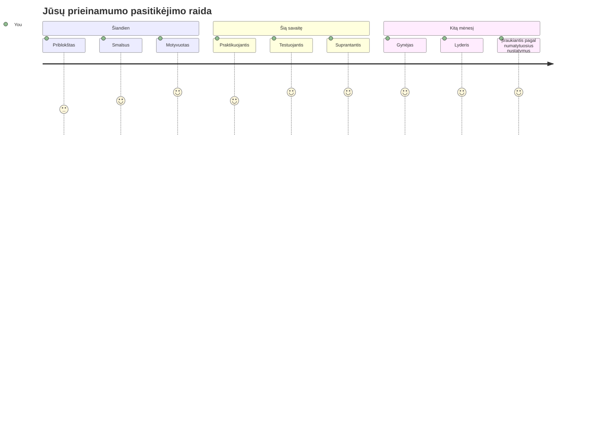
> 🌍 **Tu dabar esi prieinamumo čempionas!** Tu supranti, kad puiki interneto patirtis veikia visiems, nepriklausomai nuo to, kaip jie prieina prie interneto. Kiekviena prieinama funkcija, kurią sukuri, daro internetą labiau įtraukiančiu. Internetui reikia kūrėjų, tokių kaip tu, kurie prieinamumą mato ne kaip kliūtį, o kaip galimybę kurti geresnes patirtis visiems vartotojams. Sveikas atvykęs į judėjimą! 🎉

---

<!-- CO-OP TRANSLATOR DISCLAIMER START -->
**Atsakomybės apribojimas**:  
Šis dokumentas buvo išverstas naudojant dirbtinio intelekto vertimo paslaugą [Co-op Translator](https://github.com/Azure/co-op-translator). Nors stengiamės užtikrinti tikslumą, prašome atkreipti dėmesį, kad automatiniai vertimai gali turėti klaidų ar netikslumų. Originalus dokumentas gimtąja kalba laikomas oficialiu šaltiniu. Svarbiai informacijai rekomenduojama naudoti profesionalų žmogišką vertimą. Mes neatsakome už bet kokius nesusipratimus ar klaidingas interpretacijas, kilusias dėl šio vertimo naudojimo.
<!-- CO-OP TRANSLATOR DISCLAIMER END -->