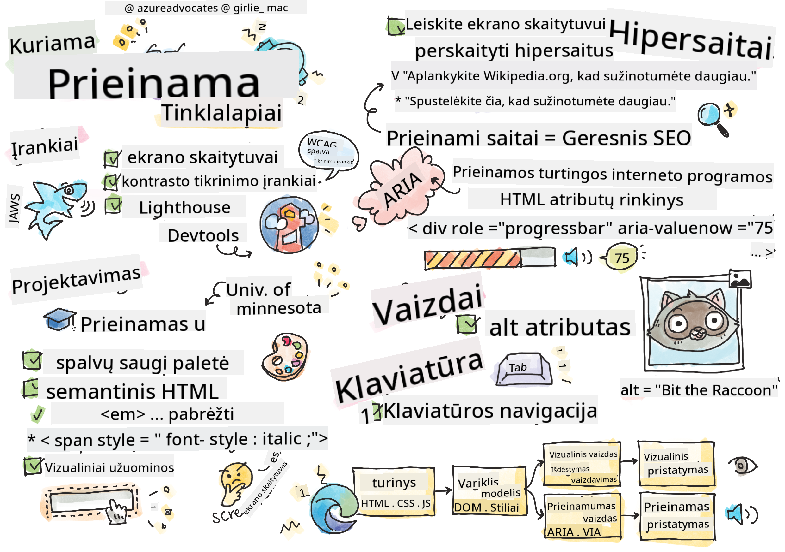

<!--
CO_OP_TRANSLATOR_METADATA:
{
  "original_hash": "f0c88c3e2cefa8952d356f802b1e47ca",
  "translation_date": "2025-08-29T17:00:54+00:00",
  "source_file": "1-getting-started-lessons/3-accessibility/README.md",
  "language_code": "lt"
}
-->
# Kuriame prieinamus tinklalapius


> Sketchnote sukūrė [Tomomi Imura](https://twitter.com/girlie_mac)

## Prieš paskaitą: testas
[Prieš paskaitą: testas](https://ff-quizzes.netlify.app/web/)

> Interneto galia slypi jo universalume. Prieinamumas visiems, nepaisant negalios, yra esminis aspektas.
>
> \- Seras Timothy Berners-Lee, W3C direktorius ir Pasaulinio tinklo išradėjas

Ši citata puikiai pabrėžia, kodėl svarbu kurti prieinamus tinklalapius. Programėlė, kuri nėra prieinama visiems, iš esmės yra išskirianti. Kaip interneto kūrėjai, mes visada turėtume galvoti apie prieinamumą. Turėdami šį tikslą nuo pat pradžių, būsite gerame kelyje užtikrinti, kad visi galėtų pasiekti jūsų sukurtus puslapius. Šioje pamokoje sužinosite apie įrankius, kurie padės užtikrinti, kad jūsų interneto ištekliai būtų prieinami, ir kaip kurti galvojant apie prieinamumą.

> Šią pamoką galite rasti [Microsoft Learn](https://docs.microsoft.com/learn/modules/web-development-101/accessibility/?WT.mc_id=academic-77807-sagibbon)!

## Naudojami įrankiai

### Ekrano skaitytuvai

Vienas geriausiai žinomų prieinamumo įrankių yra ekrano skaitytuvai.

[Ekrano skaitytuvai](https://en.wikipedia.org/wiki/Screen_reader) yra dažniausiai naudojami klientai žmonėms, turintiems regos sutrikimų. Kaip mes stengiamės užtikrinti, kad naršyklė tinkamai perteiktų informaciją, kurią norime pasidalinti, taip pat turime užtikrinti, kad ekrano skaitytuvas tai padarytų.

Pagrindiniu lygiu ekrano skaitytuvas garsiai perskaitys puslapį nuo viršaus iki apačios. Jei jūsų puslapis yra tik tekstas, skaitytuvas perteiks informaciją panašiai kaip naršyklė. Žinoma, tinklalapiai retai būna vien tekstiniai; jie turės nuorodų, grafikų, spalvų ir kitų vizualinių komponentų. Reikia pasirūpinti, kad ši informacija būtų tinkamai perskaityta ekrano skaitytuvu.

Kiekvienas interneto kūrėjas turėtų susipažinti su ekrano skaitytuvu. Kaip minėta aukščiau, tai yra klientas, kurį naudos jūsų vartotojai. Kaip esate susipažinę su naršyklės veikimu, taip turėtumėte išmokti, kaip veikia ekrano skaitytuvas. Laimei, ekrano skaitytuvai yra įdiegti daugumoje operacinių sistemų.

Kai kurios naršyklės taip pat turi įmontuotus įrankius ir plėtinius, kurie gali garsiai skaityti tekstą arba netgi suteikti pagrindines navigacijos funkcijas, kaip [šios Edge naršyklės prieinamumo funkcijos](https://support.microsoft.com/help/4000734/microsoft-edge-accessibility-features). Tai taip pat svarbūs prieinamumo įrankiai, tačiau jie veikia kitaip nei ekrano skaitytuvai ir neturėtų būti laikomi ekrano skaitytuvo testavimo įrankiais.

✅ Išbandykite ekrano skaitytuvą ir naršyklės teksto skaitytuvą. Windows operacinėje sistemoje [Narrator](https://support.microsoft.com/windows/complete-guide-to-narrator-e4397a0d-ef4f-b386-d8ae-c172f109bdb1/?WT.mc_id=academic-77807-sagibbon) yra įdiegtas pagal nutylėjimą, o [JAWS](https://webaim.org/articles/jaws/) ir [NVDA](https://www.nvaccess.org/about-nvda/) gali būti įdiegti papildomai. macOS ir iOS operacinėse sistemose [VoiceOver](https://support.apple.com/guide/voiceover/welcome/10) yra įdiegtas pagal nutylėjimą.

### Priartinimas

Kitas įrankis, dažnai naudojamas žmonių su regos sutrikimais, yra priartinimas. Paprasčiausias priartinimo tipas yra statinis priartinimas, valdomas per `Control + pliuso ženklas (+)` arba sumažinant ekrano rezoliuciją. Šis priartinimo tipas keičia viso puslapio dydį, todėl naudojant [responsyvaus dizaino](https://developer.mozilla.org/docs/Learn/CSS/CSS_layout/Responsive_Design) principus svarbu užtikrinti gerą vartotojo patirtį padidinto priartinimo lygiuose.

Kitas priartinimo tipas remiasi specializuota programine įranga, kuri padidina vieną ekrano sritį ir leidžia ją perkelti, panašiai kaip naudojant tikrą didinamąjį stiklą. Windows operacinėje sistemoje [Magnifier](https://support.microsoft.com/windows/use-magnifier-to-make-things-on-the-screen-easier-to-see-414948ba-8b1c-d3bd-8615-0e5e32204198) yra įmontuotas, o [ZoomText](https://www.freedomscientific.com/training/zoomtext/getting-started/) yra trečiosios šalies didinimo programinė įranga su daugiau funkcijų ir didesne vartotojų baze. macOS ir iOS operacinėse sistemose yra įmontuota didinimo programinė įranga, vadinama [Zoom](https://www.apple.com/accessibility/mac/vision/).

### Kontrasto tikrinimo įrankiai

Spalvos tinklalapiuose turi būti kruopščiai parinktos, kad atitiktų spalvų aklumo turinčių vartotojų ar žmonių, kuriems sunku matyti mažo kontrasto spalvas, poreikius.

✅ Išbandykite mėgstamą tinklalapį dėl spalvų naudojimo su naršyklės plėtiniu, pvz., [WCAG spalvų tikrinimo įrankiu](https://microsoftedge.microsoft.com/addons/detail/wcag-color-contrast-check/idahaggnlnekelhgplklhfpchbfdmkjp?hl=en-US&WT.mc_id=academic-77807-sagibbon). Ką sužinote?

### Lighthouse

Naršyklės kūrėjų įrankių srityje rasite Lighthouse įrankį. Šis įrankis yra svarbus norint gauti pirmąją tinklalapio prieinamumo (taip pat ir kitų analizės aspektų) apžvalgą. Nors svarbu nepasikliauti vien Lighthouse, 100% rezultatas yra labai naudingas kaip pagrindas.

✅ Suraskite Lighthouse savo naršyklės kūrėjų įrankių skydelyje ir atlikite analizę bet kuriame tinklalapyje. Ką sužinote?

## Prieinamumo dizainas

Prieinamumas yra gana plati tema. Kad jums būtų lengviau, yra daugybė prieinamų išteklių.

- [Accessible U - Minesotos universitetas](https://accessibility.umn.edu/your-role/web-developers)

Nors negalėsime aptarti visų aspektų, susijusių su prieinamų tinklalapių kūrimu, žemiau pateikiami pagrindiniai principai, kuriuos norėsite įgyvendinti. Prieinamo puslapio kūrimas nuo pat pradžių **visada** yra lengvesnis nei grįžimas prie esamo puslapio ir jo pritaikymas.

## Geros rodymo praktikos

### Saugios spalvų paletės

Žmonės mato pasaulį skirtingai, ir tai apima spalvas. Renkantis spalvų schemą savo tinklalapiui, turėtumėte užtikrinti, kad ji būtų prieinama visiems. Puikus [įrankis spalvų paletėms generuoti yra Color Safe](http://colorsafe.co/).

✅ Identifikuokite tinklalapį, kuris labai problematiškai naudoja spalvas. Kodėl?

### Naudokite tinkamą HTML

Naudojant CSS ir JavaScript galima bet kurį elementą paversti bet kokio tipo valdikliu. `<span>` gali būti naudojamas sukurti `<button>`, o `<b>` gali tapti hipernuoroda. Nors tai gali būti laikoma lengviau stilizuojama, tai nieko neperteikia ekrano skaitytuvui. Naudokite tinkamą HTML kurdami valdiklius puslapyje. Jei norite hipernuorodos, naudokite `<a>`. Tinkamo HTML naudojimas tinkamam valdikliui vadinamas semantinio HTML naudojimu.

✅ Eikite į bet kurį tinklalapį ir pažiūrėkite, ar dizaineriai ir kūrėjai tinkamai naudoja HTML. Ar galite rasti mygtuką, kuris turėtų būti nuoroda? Užuomina: dešiniuoju pelės mygtuku spustelėkite ir pasirinkite „View Page Source“ savo naršyklėje, kad pamatytumėte pagrindinį kodą.

### Sukurkite aprašomą antraščių hierarchiją

Ekrano skaitytuvų vartotojai [labai remiasi antraštėmis](https://webaim.org/projects/screenreadersurvey8/#finding), kad rastų informaciją ir naršytų puslapyje. Rašyti aprašomą antraščių turinį ir naudoti semantines antraščių žymes yra svarbu kuriant lengvai naršomą puslapį ekrano skaitytuvų vartotojams.

### Naudokite gerus vizualinius užuominas

CSS suteikia visišką kontrolę dėl bet kurio elemento išvaizdos puslapyje. Galite sukurti tekstines dėžutes be kontūro arba hipernuorodas be pabraukimo. Deja, pašalinus šias užuominas, gali būti sunkiau tiems, kurie jomis remiasi, atpažinti valdiklio tipą.

## Nuorodų teksto svarba

Hipernuorodos yra pagrindinis interneto naršymo elementas. Todėl užtikrinimas, kad ekrano skaitytuvas tinkamai perskaitytų nuorodas, leidžia visiems vartotojams naršyti jūsų puslapyje.

### Ekrano skaitytuvai ir nuorodos

Kaip ir tikėtasi, ekrano skaitytuvai skaito nuorodų tekstą taip pat, kaip ir bet kurį kitą tekstą puslapyje. Atsižvelgiant į tai, žemiau pateiktas tekstas gali atrodyti visiškai priimtinas.

> Mažasis pingvinas, kartais vadinamas fėjų pingvinu, yra mažiausias pingvinas pasaulyje. [Spauskite čia](https://en.wikipedia.org/wiki/Little_penguin) norėdami sužinoti daugiau.

> Mažasis pingvinas, kartais vadinamas fėjų pingvinu, yra mažiausias pingvinas pasaulyje. Apsilankykite https://en.wikipedia.org/wiki/Little_penguin norėdami sužinoti daugiau.

> **NOTE** Kaip netrukus perskaitysite, **niekada** neturėtumėte kurti nuorodų, kurios atrodo kaip aukščiau pateiktos.

Atminkite, ekrano skaitytuvai yra kitokia sąsaja nei naršyklės, turinti kitą funkcijų rinkinį.

### Problema su URL naudojimu

Ekrano skaitytuvai skaito tekstą. Jei tekste yra URL, ekrano skaitytuvas perskaitys URL. Paprastai URL nesuteikia prasmingos informacijos ir gali skambėti erzinančiai. Jūs galėjote tai patirti, jei jūsų telefonas kada nors garsiai perskaitė tekstinę žinutę su URL.

### Problema su „spausti čia“

Ekrano skaitytuvai taip pat turi galimybę skaityti tik hipernuorodas puslapyje, panašiai kaip regintis žmogus skenuotų puslapį ieškodamas nuorodų. Jei nuorodų tekstas visada yra „spausti čia“, vartotojas girdės tik „spausti čia, spausti čia, spausti čia, spausti čia, spausti čia, ...“. Visos nuorodos tampa neatskiriamos viena nuo kitos.

### Geras nuorodų tekstas

Geras nuorodų tekstas trumpai apibūdina, kas yra kitoje nuorodos pusėje. Aukščiau pateiktame pavyzdyje apie mažus pingvinus nuoroda veda į Wikipedia puslapį apie šią rūšį. Frazė *mažasis pingvinas* būtų puikus nuorodos tekstas, nes aiškiai nurodo, ką sužinosite paspaudę nuorodą – apie mažus pingvinus.

> [Mažasis pingvinas](https://en.wikipedia.org/wiki/Little_penguin), kartais vadinamas fėjų pingvinu, yra mažiausias pingvinas pasaulyje.

✅ Naršykite internete kelias minutes ir raskite puslapius, kurie naudoja neaiškias nuorodų strategijas. Palyginkite juos su kitais, geriau susietais puslapiais. Ką sužinote?

#### Paieškos sistemų pastabos

Kaip papildoma nauda užtikrinant, kad jūsų puslapis būtų prieinamas visiems, padėsite paieškos sistemoms naršyti jūsų puslapyje. Paieškos sistemos naudoja nuorodų tekstą, kad sužinotų puslapių temas. Taigi, naudodami gerą nuorodų tekstą, padedate visiems!

### ARIA

Įsivaizduokite šį puslapį:

| Produktas      | Aprašymas         | Užsakymas    |
| -------------- | ----------------- | ------------ |
| Widget         | [Aprašymas](../../../../1-getting-started-lessons/3-accessibility/')  | [Užsakymas](../../../../1-getting-started-lessons/3-accessibility/') |
| Super widget   | [Aprašymas](../../../../1-getting-started-lessons/3-accessibility/')  | [Užsakymas](../../../../1-getting-started-lessons/3-accessibility/') |

Šiame pavyzdyje tekstų „aprašymas“ ir „užsakymas“ dubliavimas yra prasmingas naršyklės vartotojui. Tačiau ekrano skaitytuvo vartotojas girdėtų tik žodžius *aprašymas* ir *užsakymas* be konteksto.

Norint palaikyti tokias situacijas, HTML palaiko atributų rinkinį, vadinamą [Prieinamos turtingos interneto aplikacijos (ARIA)](https://developer.mozilla.org/docs/Web/Accessibility/ARIA). Šie atributai leidžia pateikti papildomą informaciją ekrano skaitytuvams.

> **NOTE**: Kaip ir daugelis HTML aspektų, naršyklės ir ekrano skaitytuvų palaikymas gali skirtis. Tačiau dauguma pagrindinių klientų palaiko ARIA atributus.

Galite naudoti `aria-label`, kad apibūdintumėte nuorodą, kai puslapio formatas to neleidžia. Aprašymas widgetui galėtų būti nustatytas kaip

``` html
<a href="#" aria-label="Widget description">description</a>
```

✅ Paprastai semantinio žymėjimo naudojimas, kaip aprašyta aukščiau, yra svarbesnis nei ARIA naudojimas, tačiau kartais nėra semantinio ekvivalento įvairiems HTML valdikliams. Geras pavyzdys yra medis. HTML nėra ekvivalento medžiui, todėl jūs identifikuojate bendrą `<div>` šiam elementui su tinkamu vaidmeniu ir ARIA reikšmėmis. [MDN dokumentacija apie ARIA](https://developer.mozilla.org/docs/Web/Accessibility/ARIA) turi daugiau naudingos informacijos.

```html
<h2 id="tree-label">File Viewer</h2>
<div role="tree" aria-labelledby="tree-label">
  <div role="treeitem" aria-expanded="false" tabindex="0">Uploads</div>
</div>
```

## Vaizdai

Akivaizdu, kad ekrano skaitytuvai negali automatiškai perskaityti, kas yra vaizde. Užtikrinti, kad vaizdai būtų prieinami, nereikalauja daug darbo – tam skirtas `alt` atributas. Visi prasmingi vaizdai turėtų turėti `alt`, kuris apibūdina, kas jie yra. Vaizdai, kurie yra tik dekoratyviniai, turėtų turėti `alt` atributą, nustatytą kaip tuščią eilutę: `alt=""`. Tai neleidžia ekrano skaitytuvams nereikalingai pranešti apie dekoratyvinį vaizdą.

✅ Kaip galite tikėtis, paieškos sistemos taip pat negali suprasti, kas yra vaizde. Jos taip pat naudoja alt tekstą. Taigi dar kartą, užtikrinant jūsų puslapio prieinamumą, gaunate papildomų privalumų!

## Klaviatūra

Kai kurie vartotojai negali naudoti pelės ar jutiklinio pulto, vietoj to pasikliauja klaviatūros sąveikomis, kad pereitų nuo vieno elemento prie kito. Svarbu, kad jūsų tinklalapis pateiktų turinį logiška tv
Daugelis vyriausybių turi įstatymus, susijusius su prieinamumo reikalavimais. Pasidomėkite savo šalies prieinamumo įstatymais. Kas yra apimta, o kas ne? Pavyzdžiui, [ši vyriausybinė svetainė](https://accessibility.blog.gov.uk/).

## Užduotis

[Analizuokite neprieinamą svetainę](assignment.md)

Kreditai: [Turtle Ipsum](https://github.com/Instrument/semantic-html-sample) sukūrė Instrument

---

**Atsakomybės apribojimas**:  
Šis dokumentas buvo išverstas naudojant AI vertimo paslaugą [Co-op Translator](https://github.com/Azure/co-op-translator). Nors siekiame tikslumo, atkreipkite dėmesį, kad automatiniai vertimai gali turėti klaidų ar netikslumų. Originalus dokumentas jo gimtąja kalba turėtų būti laikomas autoritetingu šaltiniu. Kritinei informacijai rekomenduojama naudoti profesionalų žmogaus vertimą. Mes neprisiimame atsakomybės už nesusipratimus ar klaidingus interpretavimus, atsiradusius dėl šio vertimo naudojimo.