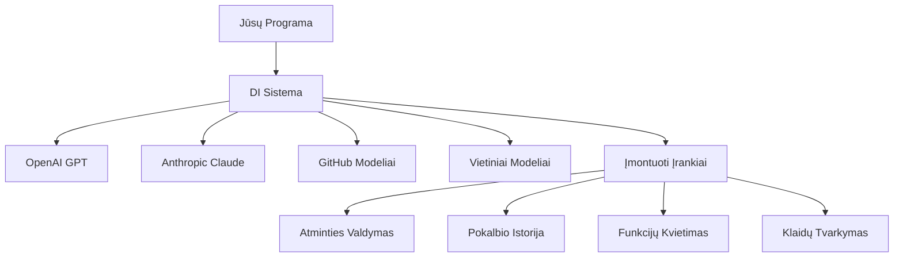
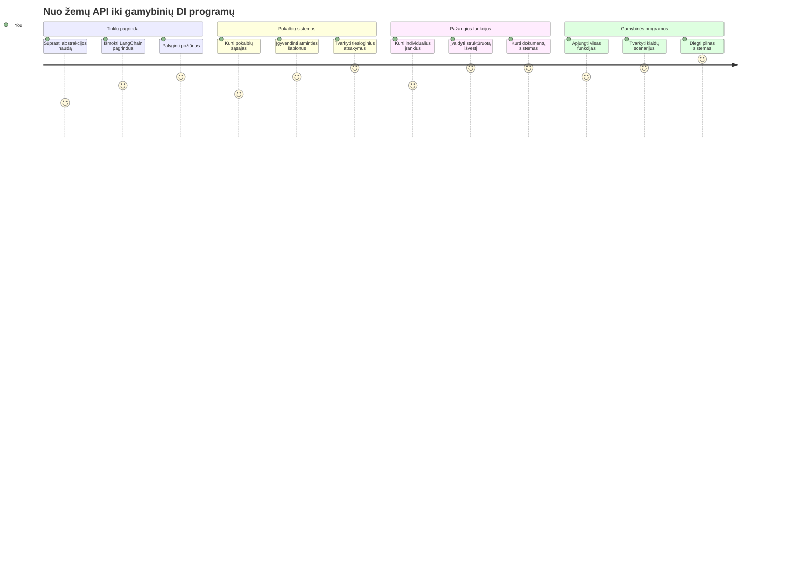
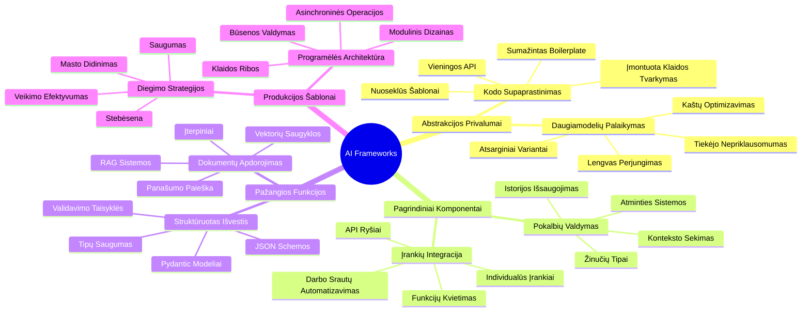
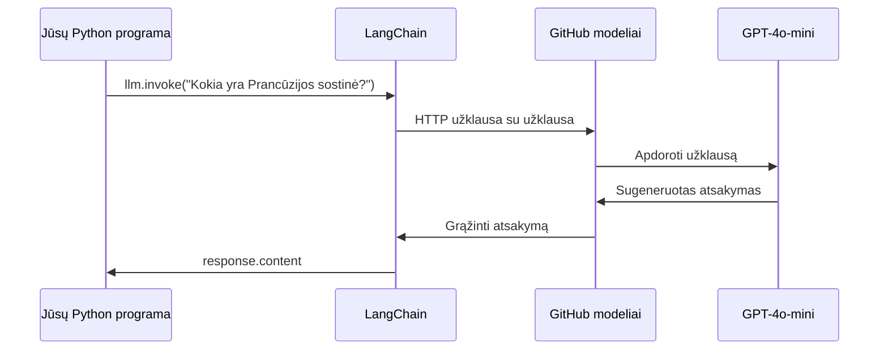
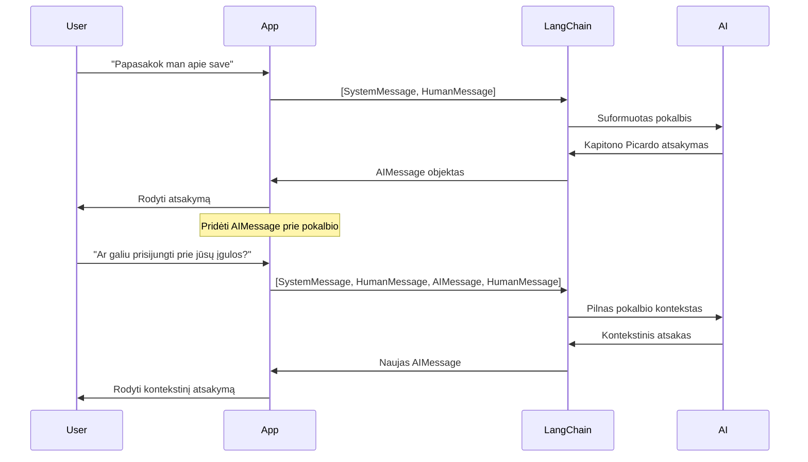
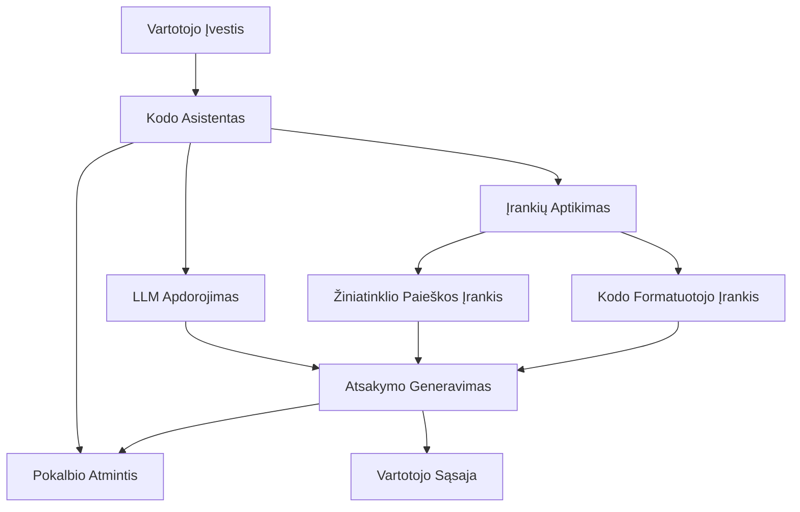
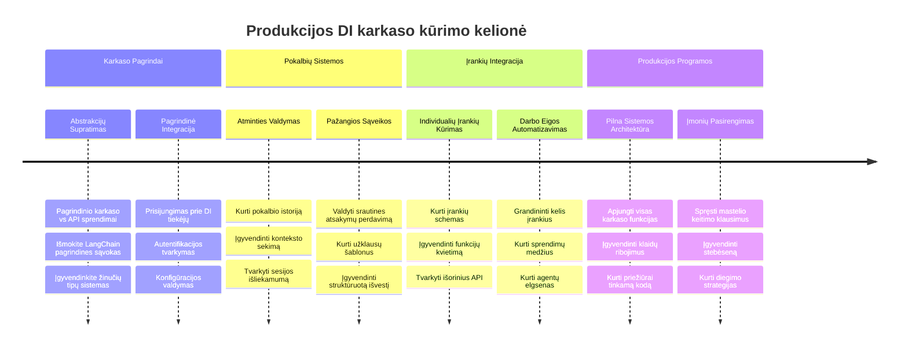
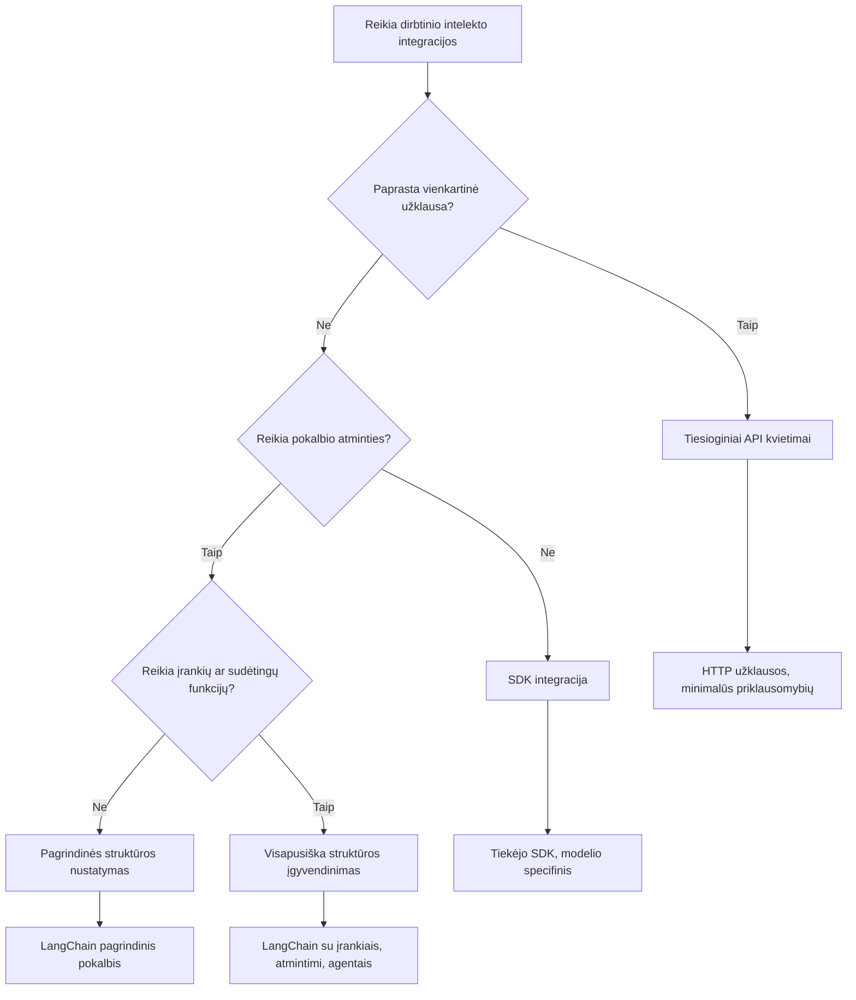

# Dirbtinio intelekto pagrindas

Ar kada nors jautėtės priblokšti bandydami sukurti dirbtinio intelekto programas nuo nulio? Jūs nesate vieni! Dirbtinio intelekto pagrindai yra tarsi Šveicariškas armijos peilis dirbtinio intelekto kūrimui – tai galingi įrankiai, kurie gali sutaupyti laiko ir galvos skausmo kuriant išmanias programas. Įsivaizduokite dirbtinio intelekto pagrindą kaip gerai organizuotą biblioteką: ji suteikia iš anksto paruoštas sudedamąsias dalis, standartizuotus API ir išmanias abstrakcijas, todėl galite koncentruotis į problemų sprendimą, o ne į implementacijos detales.

Šioje pamokoje mes išnagrinėsime, kaip tokie pagrindai kaip LangChain gali paversti anksčiau sudėtingas dirbtinio intelekto integracijos užduotis į švarų, skaitomą kodą. Jūs sužinosite, kaip spręsti realaus pasaulio iššūkius, tokius kaip pokalbių stebėjimas, įrankių kvietimas ir skirtingų dirbtinio intelekto modelių valdymas per vieningą sąsają.

Pamokos pabaigoje jūs žinosite, kada verta naudoti pagrindus vietoje žemų API kvietimų, kaip efektyviai naudoti jų abstrakcijas ir kaip kurti dirbtinio intelekto programas, pasiruošusias realiam naudojimui. Pažvelkime, ką dirbtinio intelekto pagrindai gali padaryti jūsų projektams.

## ⚡ Ką galite padaryti per kitą 5 minutes

**Greitas pradžios kelias užsiėmusiems programuotojams**


- **1 minutė**: Įdiekite LangChain: `pip install langchain langchain-openai`
- **2 minutė**: Nustatykite savo GitHub tokeną ir importuokite ChatOpenAI klientą
- **3 minutė**: Sukurkite paprastą pokalbį su sistemos ir žmogaus žinutėmis
- **4 minutė**: Pridėkite bazinį įrankį (pvz., sudėjimo funkciją) ir pamatykite dirbtinio intelekto įrankių kvietimą
- **5 minutė**: Pažinkite skirtumą tarp žemų API kvietimų ir pagrindų abstrakcijų

**Greitas bandymo kodas**:
```python
from langchain_openai import ChatOpenAI
from langchain_core.messages import SystemMessage, HumanMessage

llm = ChatOpenAI(
    api_key=os.environ["GITHUB_TOKEN"],
    base_url="https://models.github.ai/inference",
    model="openai/gpt-4o-mini"
)

response = llm.invoke([
    SystemMessage(content="You are a helpful coding assistant"),
    HumanMessage(content="Explain Python functions briefly")
])
print(response.content)
```

**Kodėl tai svarbu**: Per 5 minutes patirsite, kaip dirbtinio intelekto pagrindai paverčia sudėtingą dirbtinio intelekto integraciją paprastais metodų kvietimais. Tai yra pagrindas, kuris leidžia kurti gamybines dirbtinio intelekto programas.

## Kodėl verta rinktis pagrindą?

Taigi jūs pasiruošę kurti dirbtinio intelekto programą – puiku! Bet štai kas: turite kelis skirtingus kelius, kuriuos galite pasirinkti, ir kiekvienas turi savo privalumų ir trūkumų. Tai panašu į pasirinkimą vaikščioti pėsčiomis, važiuoti dviračiu ar automobiliu – visi jus nuves ten, kurią nors patirtį (ir pastangas) skirs skirtingai.

Išskaidykime tris pagrindinius būdus, kaip galite integruoti dirbtinį intelektą į savo projektus:

| Požiūris | Privalumai | Geriausia | Apsvarstymai |
|----------|------------|----------|--------------|
| **Tiesioginiai HTTP užklausos** | Pilnas valdymas, be priklausomybių | Paprasti užklausimų atvejai, mokymosi pagrindai | Išsamesnis kodas, rankinis klaidų tvarkymas |
| **SDK integracija** | Mažiau boilerplate, modelio specifinė optimizacija | Vieno modelio programos | Ribojama konkrečių tiekėjų |
| **Dirbtinio intelekto pagrindai** | Vieningas API, įmontuotos abstrakcijos | Daugiamodelinės programos, sudėtingi darbo srautai | Mokymosi kreivė, galimas per didelis abstrahavimas |

### Pagrindų nauda praktikoje


**Kodėl pagrindai svarbūs:**
- **Vienija** kelis dirbtinio intelekto tiekėjus po viena sąsaja
- **Automatiškai tvarko** pokalbių atmintį
- **Suteikia** paruoštus įrankius bendroms užduotims, tokioms kaip įterpiniai ir funkcijų kvietimas
- **Tvarko** klaidų valdymą ir pakartotinių bandymų logiką
- **Paverčia** sudėtingus darbo srautus skaitomais metodų kvietimais

> 💡 **Pro patarimas**: Naudokite pagrindus, kai pereinate tarp skirtingų dirbtinio intelekto modelių ar kuriate sudėtingas funkcijas kaip agentus, atmintį ar įrankių kvietimus. Laikykitės tiesioginių API, kai mokotės pagrindų arba kuriate paprastas, sutelktas programas.

**Galiausiai**: kaip renkantis tarp specializuotų amatininko įrankių ir pilnos dirbtuvės, svarbu pritaikyti įrankį užduočiai. Pagrindai puikiai tinka sudėtingoms, daug funkcijų turinčioms programoms, o tiesioginiai API gerai veikia paprastiems naudojimo atvejams.

## 🗺️ Jūsų mokymosi kelionė į dirbtinio intelekto pagrindų meistriškumą


**Jūsų kelionės tikslas**: Pamokos pabaigoje būsite įvaldę dirbtinio intelekto pagrindų kūrimą ir galėsite kurti pažangias, gamybinėms reikmėms paruoštas dirbtinio intelekto programas, kurios gali konkuruoti su komerciniais dirbtinio intelekto asistentais.

## Įvadas

Šioje pamokoje mes išmoksime:

- Naudoti bendrą dirbtinio intelekto pagrindą.
- Spręsti dažnas problemas, tokias kaip pokalbių valdymas, įrankių naudojimas, atmintis ir kontekstas.
- Pasinaudoti šiais įrankiais kuriant dirbtinio intelekto programas.

## 🧠 Dirbtinio intelekto pagrindų vystymo ekosistema


**Pagrindinė taisyklė**: Dirbtinio intelekto pagrindai abstrahuoja sudėtingumą, tuo pačiu suteikdami galingas abstrakcijas pokalbių valdymui, įrankių integracijai ir dokumentų apdorojimui, leidžiančias kūrėjams kurti pažangias dirbtinio intelekto programas su švariu, prižiūrimu kodu.

## Jūsų pirmasis dirbtinio intelekto užklausa

Pradėkime nuo pagrindų sukurdami pirmąją dirbtinio intelekto programą, kuri išsiųs klausimą ir gaus atsakymą atgal. Kaip Archimedas atrado išstūmimo principą savo vonioje, kartais paprasčiausi stebėjimai veda prie galingiausių įžvalgų – ir pagrindai leidžia šias įžvalgas pasiekti.

### LangChain nustatymas su GitHub modeliais

Naudosime LangChain, kad prisijungtume prie GitHub modelių, kas yra gan smagu, nes suteikia nemokamą prieigą prie įvairių dirbtinio intelekto modelių. Geriausia dalis? Jums reikia tik kelių paprastų konfigūracijos parametrų pradžiai:

```python
from langchain_openai import ChatOpenAI
import os

llm = ChatOpenAI(
    api_key=os.environ["GITHUB_TOKEN"],
    base_url="https://models.github.ai/inference",
    model="openai/gpt-4o-mini",
)

# Siųsti paprastą užklausą
response = llm.invoke("What's the capital of France?")
print(response.content)
```

**Pažvelkime, kas čia vyksta:**
- **Sukuria** LangChain klientą naudojant `ChatOpenAI` klasę – tai jūsų vartai į dirbtinį intelektą!
- **Konfigūruoja** prisijungimą prie GitHub modelių su jūsų autentifikacijos tokenu
- **Nurodo**, kurį dirbtinio intelekto modelį naudoti (`gpt-4o-mini`) – tai tarsi pasirenkate savo dirbtinio intelekto asistentą
- **Siunčia** jūsų klausimą naudojant `invoke()` metodą – čia vyksta magija
- **Ištraukia** ir parodo atsakymą – ir štai, jūs jau kalbatės su dirbtiniu intelektu!

> 🔧 **Nustatymo pastaba**: Jei naudojate GitHub Codespaces, jums pasisekė – `GITHUB_TOKEN` jau paruoštas! Dirbate vietoje? Nesijaudinkite, tiesiog susikurkite asmeninį prieigos tokeną su tinkamomis teisėmis.

**Tikėtinas atsakymas:**
```text
The capital of France is Paris.
```


## Kuriame pokalbių dirbtinį intelektą

Pirmasis pavyzdys rodo pagrindus, bet tai tik vienas pakeitimas – jūs užduodate klausimą, gaunate atsakymą ir viskas. Realiuose programuose norite, kad jūsų dirbtinis intelektas prisimintų, apie ką diskutavote, kaip Watson ir Holmes laipsniškai kūrė savo tyrimo pokalbius.

Čia LangChain tampa ypač naudingas. Jis suteikia skirtingų žinučių tipus, kurie padeda struktūruoti pokalbius ir leidžia suteikti savo dirbtiniam intelektui asmenybę. Jūs kursite pokalbių patirtis, kurios palaiko kontekstą ir charakterį.

### Žinučių tipų supratimas

Įsivaizduokite šiuos žinučių tipus kaip skirtingus "kepures", kurias pokalbio dalyviai dėvi. LangChain naudoja skirtingas žinučių klases, kad atsekų, kas ką sako:

| Žinutės tipas | Paskirtis | Pavyzdinė situacija |
|--------------|---------|------------------|
| `SystemMessage` | Apibrėžia dirbtinio intelekto asmenybę ir elgesį | "Tu esi naudingas programavimo asistentas" |
| `HumanMessage` | Atspindi vartotojo įvestį | "Paaiškink, kaip veikia funkcijos" |
| `AIMessage` | Saugo dirbtinio intelekto atsakymus | Ankstesni dirbtinio intelekto atsakymai pokalbyje |

### Sukurkite pirmąjį pokalbį

Sukurkime pokalbį, kuriame mūsų dirbtinis intelektas prisiims tam tikrą vaidmenį. Tegul jis įkūnija kapitoną Picardą – personažą, žinomą dėl savo diplomatinio išminties ir lyderystės:

```python
messages = [
    SystemMessage(content="You are Captain Picard of the Starship Enterprise"),
    HumanMessage(content="Tell me about you"),
]
```

**Išskaidykime šio pokalbio nustatymą:**
- **Nustato** dirbtinio intelekto vaidmenį ir asmenybę per `SystemMessage`
- **Pateikia** pradinį vartotojo klausimą per `HumanMessage`
- **Sukuria** pagrindą daugiažingsniam pokalbiui

Visa to pavyzdžio kodo dalis atrodo taip:

```python
from langchain_core.messages import HumanMessage, SystemMessage
from langchain_openai import ChatOpenAI
import os

llm = ChatOpenAI(
    api_key=os.environ["GITHUB_TOKEN"],
    base_url="https://models.github.ai/inference",
    model="openai/gpt-4o-mini",
)

messages = [
    SystemMessage(content="You are Captain Picard of the Starship Enterprise"),
    HumanMessage(content="Tell me about you"),
]


# veikia
response  = llm.invoke(messages)
print(response.content)
```

Turėtumėte matyti panašų rezultatą:

```text
I am Captain Jean-Luc Picard, the commanding officer of the USS Enterprise (NCC-1701-D), a starship in the United Federation of Planets. My primary mission is to explore new worlds, seek out new life and new civilizations, and boldly go where no one has gone before. 

I believe in the importance of diplomacy, reason, and the pursuit of knowledge. My crew is diverse and skilled, and we often face challenges that test our resolve, ethics, and ingenuity. Throughout my career, I have encountered numerous species, grappled with complex moral dilemmas, and have consistently sought peaceful solutions to conflicts.

I hold the ideals of the Federation close to my heart, believing in the importance of cooperation, understanding, and respect for all sentient beings. My experiences have shaped my leadership style, and I strive to be a thoughtful and just captain. How may I assist you further?
```

Kad išlaikytumėte pokalbio tęstinumą (vietoje konteksto kiekvieną kartą nustatant iš naujo), turite nuolat pridėti atsakymus prie savo žinučių sąrašo. Kaip žodinės tradicijos, kurios saugo pasakojimus per kartas, šis metodas kuria ilgalaikę atmintį:

```python
from langchain_core.messages import HumanMessage, SystemMessage
from langchain_openai import ChatOpenAI
import os

llm = ChatOpenAI(
    api_key=os.environ["GITHUB_TOKEN"],
    base_url="https://models.github.ai/inference",
    model="openai/gpt-4o-mini",
)

messages = [
    SystemMessage(content="You are Captain Picard of the Starship Enterprise"),
    HumanMessage(content="Tell me about you"),
]


# veikia
response  = llm.invoke(messages)

print(response.content)

print("---- Next ----")

messages.append(response)
messages.append(HumanMessage(content="Now that I know about you, I'm Chris, can I be in your crew?"))

response  = llm.invoke(messages)

print(response.content)

```

Gan faina, tiesa? Čia vyksta tai, kad mes iškviečiame LLM du kartus – pirmą kartą tik su pradinėmis dviem žinutėmis, o vėliau su visa pokalbio istorija. Tarsi dirbtinis intelektas iš tiesų seka mūsų pokalbį!

Paleidus šį kodą, gausite antrą atsakymą, kuris skambės maždaug taip:

```text
Welcome aboard, Chris! It's always a pleasure to meet those who share a passion for exploration and discovery. While I cannot formally offer you a position on the Enterprise right now, I encourage you to pursue your aspirations. We are always in need of talented individuals with diverse skills and backgrounds. 

If you are interested in space exploration, consider education and training in the sciences, engineering, or diplomacy. The values of curiosity, resilience, and teamwork are crucial in Starfleet. Should you ever find yourself on a starship, remember to uphold the principles of the Federation: peace, understanding, and respect for all beings. Your journey can lead you to remarkable adventures, whether in the stars or on the ground. Engage!
```


Tai galėtų būti “galbūt” ;)

## Srautinių atsakymų pateikimas

Ar pastebėjote, kaip ChatGPT tarsi "rašo" atsakymus realiu laiku? Tai yra srautinis atsakymų pateikimas. Kaip stebėti meistrišką kaligrafą, kuris žodžius piešia raštuojamąja tvarka, o ne jie atsiranda akimirksniu – srautinimas daro sąveiką natūralesnę ir suteikia momentinį atsiliepimą.

### Srautinio perdavimo įgyvendinimas su LangChain

```python
from langchain_openai import ChatOpenAI
import os

llm = ChatOpenAI(
    api_key=os.environ["GITHUB_TOKEN"],
    base_url="https://models.github.ai/inference",
    model="openai/gpt-4o-mini",
    streaming=True
)

# Srautu perduokite atsakymą
for chunk in llm.stream("Write a short story about a robot learning to code"):
    print(chunk.content, end="", flush=True)
```

**Kodėl srautinimas yra puikus:**
- **Rodo** turinį, kai jis kuriamas – nebereikia nerimauti dėl laukimo!
- **Leidžia** vartotojams jausti, kad kažkas vyksta
- **Jaučiasi** greičiau, net jei techniškai nėra
- **Leidžia** vartotojams pradėti skaityti, kai dirbtinis intelektas dar "galvoja"

> 💡 **Vartotojo patirties patarimas**: Srautinimas ypač naudingas, kai dirbate su ilgesniais atsakymais, tokiais kaip kodo paaiškinimai, kūrybinis rašymas ar detalūs mokymai. Jūsų vartotojai dievins matyti pažangą vietoje žiūrėjimo į tuščią ekraną!

### 🎯 Pedagoginis patikrinimas: Pagrindų abstrakcijos nauda

**Sustabkite ir apmąstykite**: Ką tik patyrėte dirbtinio intelekto pagrindų abstrakcijų galią. Palyginkite tai su žemų API kvietimais iš ankstesnių pamokų.

**Greitas savęs įvertinimas**:
- Ar galite paaiškinti, kaip LangChain supaprastina pokalbių valdymą, palyginus su rankiniu žinučių sekimu?
- Kuo skiriasi `invoke()` ir `stream()` metodai, ir kada naudotumėte kiekvieną?
- Kaip pagrindų žinučių tipų sistema pagerina kodo organizavimą?

**Realus pasaulis**: Abstrakcijų modeliai, kuriuos įgijote (žinučių tipai, srautinės sąsajos, pokalbių atmintis) yra naudojami kiekvienoje didelėje dirbtinio intelekto programoje – nuo ChatGPT sąsajos iki GitHub Copilot kodo pagalbos. Jūs įvaldote tuos pačius architektūrinius modelius, kuriuos naudoja profesionalios dirbtinio intelekto kūrimo komandos.

**Iššūkio klausimas**: Kaip suprojektuotumėte pagrindo abstrakciją dirbtinio intelekto modelių tiekėjams (OpenAI, Anthropic, Google) per vieną sąsają? Apsvarstykite privalumus ir kompromisus.

## Užklausų šablonai

Užklausų šablonai veikia kaip retorinės struktūros klasikinėje oratorijoje – įsivaizduokite, kaip Cicero pritaikydavo savo kalbų modelius skirtingoms auditorijoms išlaikydamas tą pačią įtikinamą pagrindą. Jie leidžia kurti pakartotinai naudojamus užklausimus, kuriuose galite keisti skirtingas informacijos dalis be viso perrašymo nuo nulio. Sukūrę šabloną, tiesiog užpildote kintamuosius su reikalingomis reikšmėmis.

### Pakartotinai naudojamų užklausų kūrimas

```python
from langchain_core.prompts import ChatPromptTemplate

# Apibrėžkite šabloną kodo paaiškinimams
template = ChatPromptTemplate.from_messages([
    ("system", "You are an expert programming instructor. Explain concepts clearly with examples."),
    ("human", "Explain {concept} in {language} with a practical example for {skill_level} developers")
])

# Naudokite šabloną su skirtingomis reikšmėmis
questions = [
    {"concept": "functions", "language": "JavaScript", "skill_level": "beginner"},
    {"concept": "classes", "language": "Python", "skill_level": "intermediate"},
    {"concept": "async/await", "language": "JavaScript", "skill_level": "advanced"}
]

for question in questions:
    prompt = template.format_messages(**question)
    response = llm.invoke(prompt)
    print(f"Topic: {question['concept']}\n{response.content}\n---\n")
```

**Kodėl jums patiks naudoti šablonus:**
- **Užtikrina** nuoseklumą visoje programoje
- **Nebereikia** chaotiško teksto jungimo – tiesiog tvarkingi, paprasti kintamieji
- **Jūsų dirbtinis intelektas** elgiasi nuspėjamai, nes struktūra lieka ta pati
- **Pakeitimai** labai paprasti – pakeiskite šabloną kartą ir jis atsinaujins visur

## Strukturizuota išvestis

Ar teko nusivilti bandant išskaidyti dirbtinio intelekto atsakymus, kurie grįžta kaip nestruktūruotas tekstas? Strukturizuota išvestis yra kaip mokyti dirbtinį intelektą laikytis Linnejaus biologinės klasifikacijos sisteminio požiūrio – organizuota, nuspėjama ir patogi naudoti. Galite prašyti JSON, specifinių duomenų struktūrų ar bet kokio jums reikalingo formato.

### Išvesties schemų apibrėžimas

```python
from langchain_core.prompts import ChatPromptTemplate
from langchain_core.output_parsers import JsonOutputParser
from pydantic import BaseModel, Field

class CodeReview(BaseModel):
    score: int = Field(description="Code quality score from 1-10")
    strengths: list[str] = Field(description="List of code strengths")
    improvements: list[str] = Field(description="List of suggested improvements")
    overall_feedback: str = Field(description="Summary feedback")

# Nustatyti analizatorių
parser = JsonOutputParser(pydantic_object=CodeReview)

# Sukurti užklausą su formato instrukcijomis
prompt = ChatPromptTemplate.from_messages([
    ("system", "You are a code reviewer. {format_instructions}"),
    ("human", "Review this code: {code}")
])

# Suformatuoti užklausą pagal instrukcijas
chain = prompt | llm | parser

# Gauti struktūruotą atsakymą
code_sample = """
def calculate_average(numbers):
    return sum(numbers) / len(numbers)
"""

result = chain.invoke({
    "code": code_sample,
    "format_instructions": parser.get_format_instructions()
})

print(f"Score: {result['score']}")
print(f"Strengths: {', '.join(result['strengths'])}")
```

**Kodėl strukturizuota išvestis keičia žaidimo taisykles:**
- **Nebereikia** spėlioti, kokią formą gausite – visada nuoseklu
- **Tiesiogiai jungiasi** prie duomenų bazių ir API be papildomo darbo
- **Pagalba** atpažinti keistus dirbtinio intelekto atsakymus anksčiau, nei jie sugadins jūsų programą
- **Švaresnis kodas** – jūs tiksliai žinote, su kuo dirbate

## Įrankių kvietimas

Dabar pasieksime vieną galingiausių funkcijų: įrankius. Tai, kaip suteikti dirbtiniam intelektui praktines galimybes už pokalbį. Kaip viduramžių gildijos kūrė specializuotus įrankius tam tikriems amatininkystės darbams, jūs galite aprūpinti savo dirbtinį intelektą sutelktomis priemonėmis. Jūs nurodote, kokie įrankiai yra prieinami, o kai kas nors užklausia ką nors atitinkančio, jūsų dirbtinis intelektas gali imtis veiksmų.

### Naudojant Python

Pridėkime keletą įrankių taip:

```python
from typing_extensions import Annotated, TypedDict

class add(TypedDict):
    """Add two integers."""

    # Anotacijos privalo turėti tipą ir gali pasirinktinai apimti numatytąją reikšmę bei aprašymą (šia tvarka).
    a: Annotated[int, ..., "First integer"]
    b: Annotated[int, ..., "Second integer"]

tools = [add]

functions = {
    "add": lambda a, b: a + b
}
```

Kas čia vyksta? Kuriame įrankio šabloną, pavadintą `add`. Paveldėdami iš `TypedDict` ir naudodami tuos įdomius `Annotated` tipus `a` ir `b`, mes LLM suteikiame aiškią informaciją, ką šis įrankis daro ir ko jam reikia. `functions` žodynas yra tarsi mūsų įrankių dėžė – jis pasako mūsų kodui, ką daryti, kai dirbtinis intelektas nusprendžia naudoti konkretų įrankį.

Pažiūrėkime, kaip kitame žingsnyje kviečiame LLM su šiuo įrankiu:

```python
llm = ChatOpenAI(
    api_key=os.environ["GITHUB_TOKEN"],
    base_url="https://models.github.ai/inference",
    model="openai/gpt-4o-mini",
)

llm_with_tools = llm.bind_tools(tools)
```

Štai kviečiame `bind_tools` su mūsų `tools` masyvu ir taip LLM `llm_with_tools` įgauna žinių apie šį įrankį.

Norėdami naudoti šį naują LLM, galime įrašyti tokį kodą:

```python
query = "What is 3 + 12?"

res = llm_with_tools.invoke(query)
if(res.tool_calls):
    for tool in res.tool_calls:
        print("TOOL CALL: ", functions[tool["name"]](../../../10-ai-framework-project/**tool["args"]))
print("CONTENT: ",res.content)
```

Dabar, kai kviečiame `invoke` ant šio naujo llm, kuris turi įrankius, mes galbūt gauname užpildytą `tool_calls` savybę. Jei taip, bet kuris identifikuotas įrankis turi `name` ir `args` savybes, identifikuojančias, koks įrankis turi būti kviečiamas ir su kokiais argumentais. Visa kodo dalis atrodo taip:

```python
from langchain_core.messages import HumanMessage, SystemMessage
from langchain_openai import ChatOpenAI
import os
from typing_extensions import Annotated, TypedDict

class add(TypedDict):
    """Add two integers."""

    # Anotacijos privalo turėti tipą ir gali papildomai įtraukti numatytąją reikšmę bei aprašymą (šiame tvarkoje).
    a: Annotated[int, ..., "First integer"]
    b: Annotated[int, ..., "Second integer"]

tools = [add]

functions = {
    "add": lambda a, b: a + b
}

llm = ChatOpenAI(
    api_key=os.environ["GITHUB_TOKEN"],
    base_url="https://models.github.ai/inference",
    model="openai/gpt-4o-mini",
)

llm_with_tools = llm.bind_tools(tools)

query = "What is 3 + 12?"

res = llm_with_tools.invoke(query)
if(res.tool_calls):
    for tool in res.tool_calls:
        print("TOOL CALL: ", functions[tool["name"]](../../../10-ai-framework-project/**tool["args"]))
print("CONTENT: ",res.content)
```

Paleidus šį kodą, turėtumėte matyti panašų rezultatą:

```text
TOOL CALL:  15
CONTENT: 
```

Dirbtinis intelektas peržvelgė "What is 3 + 12" ir atpažino tai kaip užduotį `add` įrankiui. Kaip meistriškas bibliotekininkas žino, kurį šaltinį pasitikrinti pagal užduoties tipą, jis priėmė šį sprendimą remdamasis įrankio vardu, aprašymu ir laukų specifikacijomis. Rezultatas 15 gaunamas iš mūsų `functions` žodyno, vykdančio įrankį:

```python
print("TOOL CALL: ", functions[tool["name"]](../../../10-ai-framework-project/**tool["args"]))
```

### Įdomesnis įrankis, kuris kviečia žiniatinklio API
Skaičių sudėjimas iliustruoja sąvoką, tačiau tikri įrankiai paprastai atlieka sudėtingesnes operacijas, pavyzdžiui, kviečia interneto API. Išplėsime mūsų pavyzdį, kad AI galėtų gauti turinį iš interneto – panašiai kaip kadaise telegrafo operatoriai sujungdavo tolimus taškus:

```python
class joke(TypedDict):
    """Tell a joke."""

    # Anotacijos turi turėti tipą ir neprivalomai gali įtraukti numatytąją reikšmę bei aprašymą (šia tvarka).
    category: Annotated[str, ..., "The joke category"]

def get_joke(category: str) -> str:
    response = requests.get(f"https://api.chucknorris.io/jokes/random?category={category}", headers={"Accept": "application/json"})
    if response.status_code == 200:
        return response.json().get("value", f"Here's a {category} joke!")
    return f"Here's a {category} joke!"

functions = {
    "add": lambda a, b: a + b,
    "joke": lambda category: get_joke(category)
}

query = "Tell me a joke about animals"

# likusi kodo dalis yra tokia pati
```

Dabar, jei paleisite šį kodą, gausite atsakymą, kuris atrodys maždaug taip:

```text
TOOL CALL:  Chuck Norris once rode a nine foot grizzly bear through an automatic car wash, instead of taking a shower.
CONTENT:  
```

```mermaid
flowchart TD
    A[Vartotojo užklausa: "Papasakok man žaidimą apie gyvūnus"] --> B[LangChain analizė]
    B --> C{Ar įrankis prieinamas?}
    C -->|Taip| D[Pasirinkti juokelių įrankį]
    C -->|Ne| E[Generuoti tiesioginį atsakymą]
    
    D --> F[Išgauti parametrus]
    F --> G[Iššaukti juoką(kategorija="gyvūnai")]
    G --> H[API užklausa į chucknorris.io]
    H --> I[Grąžinti juokelio turinį]
    I --> J[Rodyti vartotojui]
    
    E --> K[AI sugeneruotas atsakymas]
    K --> J
    
    subgraph "Įrankio apibrėžimo sluoksnis"
        L[TypedDict schema]
        M[Funkcijos įgyvendinimas]
        N[Paramentrų tikrinimas]
    end
    
    D --> L
    F --> N
    G --> M
```
Štai visas kodas:

```python
from langchain_openai import ChatOpenAI
import requests
import os
from typing_extensions import Annotated, TypedDict

class add(TypedDict):
    """Add two integers."""

    # Anotacijos turi turėti tipą ir gali papildomai turėti numatytąją reikšmę bei aprašymą (šia tvarka).
    a: Annotated[int, ..., "First integer"]
    b: Annotated[int, ..., "Second integer"]

class joke(TypedDict):
    """Tell a joke."""

    # Anotacijos turi turėti tipą ir gali papildomai turėti numatytąją reikšmę ir aprašymą (šia tvarka).
    category: Annotated[str, ..., "The joke category"]

tools = [add, joke]

def get_joke(category: str) -> str:
    response = requests.get(f"https://api.chucknorris.io/jokes/random?category={category}", headers={"Accept": "application/json"})
    if response.status_code == 200:
        return response.json().get("value", f"Here's a {category} joke!")
    return f"Here's a {category} joke!"

functions = {
    "add": lambda a, b: a + b,
    "joke": lambda category: get_joke(category)
}

llm = ChatOpenAI(
    api_key=os.environ["GITHUB_TOKEN"],
    base_url="https://models.github.ai/inference",
    model="openai/gpt-4o-mini",
)

llm_with_tools = llm.bind_tools(tools)

query = "Tell me a joke about animals"

res = llm_with_tools.invoke(query)
if(res.tool_calls):
    for tool in res.tool_calls:
        # print("ĮRANKIO KVĖTIMAS: ", tool)
        print("TOOL CALL: ", functions[tool["name"]](../../../10-ai-framework-project/**tool["args"]))
print("CONTENT: ",res.content)
```

## Įterpiniai ir dokumentų apdorojimas

Įterpiniai yra viena elegantiškiausių šiuolaikinio AI sprendimų. Įsivaizduokite, kad galite imti bet kokį teksto fragmentą ir paversti jį skaitinėmis koordinatėmis, kurios atspindi jo prasmę. Būtent tai ir daro įterpiniai – jie transformuoja tekstą į taškus daugiamatėje erdvėje, kur panašios sąvokos susitelkia kartu. Tai kaip turėti idėjų koordinačių sistemą, primenančią, kaip Mendelejevas organizavo periodinę lentelę pagal atomines savybes.

### Įterpinių kūrimas ir naudojimas

```python
from langchain_openai import OpenAIEmbeddings
from langchain_community.vectorstores import FAISS
from langchain_community.document_loaders import TextLoader
from langchain.text_splitter import CharacterTextSplitter

# Inicializuoti įterpimus
embeddings = OpenAIEmbeddings(
    api_key=os.environ["GITHUB_TOKEN"],
    base_url="https://models.github.ai/inference",
    model="text-embedding-3-small"
)

# Įkelti ir padalinti dokumentus
loader = TextLoader("documentation.txt")
documents = loader.load()

text_splitter = CharacterTextSplitter(chunk_size=1000, chunk_overlap=0)
texts = text_splitter.split_documents(documents)

# Sukurti vektorių saugyklą
vectorstore = FAISS.from_documents(texts, embeddings)

# Atlikti panašumo paiešką
query = "How do I handle user authentication?"
similar_docs = vectorstore.similarity_search(query, k=3)

for doc in similar_docs:
    print(f"Relevant content: {doc.page_content[:200]}...")
```

### Dokumentų įkėlėjai įvairiems formatams

```python
from langchain_community.document_loaders import (
    PyPDFLoader,
    CSVLoader,
    JSONLoader,
    WebBaseLoader
)

# Įkelti skirtingus dokumentų tipus
pdf_loader = PyPDFLoader("manual.pdf")
csv_loader = CSVLoader("data.csv")
json_loader = JSONLoader("config.json")
web_loader = WebBaseLoader("https://example.com/docs")

# Apdoroti visus dokumentus
all_documents = []
for loader in [pdf_loader, csv_loader, json_loader, web_loader]:
    docs = loader.load()
    all_documents.extend(docs)
```

**Ką galite daryti su įterpiniais:**
- **Kurti** paiešką, kuri iš tikrųjų supranta, ką turite omenyje, ne tik raktinių žodžių atitikimą
- **Sukurti** AI, galintį atsakyti į klausimus apie jūsų dokumentus
- **Padaryti** rekomendacijų sistemas, kurios siūlo tikrai aktualų turinį
- **Automatiškai** organizuoti ir kategorizuoti jūsų turinį

```mermaid
flowchart LR
    A[Dokumentai] --> B[Teksto skaldytuvas]
    B --> C[Sukurti įterpimus]
    C --> D[Vektorinė saugykla]
    
    E[Vartotojo užklausa] --> F[Užklausos įterpimas]
    F --> G[Panašumo paieška]
    G --> D
    D --> H[Susiję dokumentai]
    H --> I[DI atsakymas]
    
    subgraph "Vektorinė erdvė"
        J[Dokumentas A: [0.1, 0.8, 0.3...]]
        K[Dokumentas B: [0.2, 0.7, 0.4...]]
        L[Užklausa: [0.15, 0.75, 0.35...]]
    end
    
    C --> J
    C --> K
    F --> L
    G --> J
    G --> K
```
## Vystant pilną AI programą

Dabar sujungsime viską, ką išmokote, į visapusišką programą – programavimo asistentą, galintį atsakyti į klausimus, naudoti įrankius ir išlaikyti pokalbio atmintį. Panašiai kaip spaudos mašina sujungė esamas technologijas (perkeliamą spaudinį, dažus, popierių ir spaudimą) į ką nors revoliucinį, mes sudėsime savo AI komponentus į praktišką ir naudingą produktą.

### Pilno programos pavyzdys

```python
from langchain_openai import ChatOpenAI, OpenAIEmbeddings
from langchain_core.prompts import ChatPromptTemplate
from langchain_core.messages import HumanMessage, SystemMessage, AIMessage
from langchain_community.vectorstores import FAISS
from typing_extensions import Annotated, TypedDict
import os
import requests

class CodingAssistant:
    def __init__(self):
        self.llm = ChatOpenAI(
            api_key=os.environ["GITHUB_TOKEN"],
            base_url="https://models.github.ai/inference",
            model="openai/gpt-4o-mini"
        )
        
        self.conversation_history = [
            SystemMessage(content="""You are an expert coding assistant. 
            Help users learn programming concepts, debug code, and write better software.
            Use tools when needed and maintain a helpful, encouraging tone.""")
        ]
        
        # Apibrėžti įrankius
        self.setup_tools()
    
    def setup_tools(self):
        class web_search(TypedDict):
            """Search for programming documentation or examples."""
            query: Annotated[str, "Search query for programming help"]
        
        class code_formatter(TypedDict):
            """Format and validate code snippets."""
            code: Annotated[str, "Code to format"]
            language: Annotated[str, "Programming language"]
        
        self.tools = [web_search, code_formatter]
        self.llm_with_tools = self.llm.bind_tools(self.tools)
    
    def chat(self, user_input: str):
        # Pridėti vartotojo žinutę prie pokalbio
        self.conversation_history.append(HumanMessage(content=user_input))
        
        # Gauti AI atsakymą
        response = self.llm_with_tools.invoke(self.conversation_history)
        
        # Apdoroti įrankių kvietimus, jei jų yra
        if response.tool_calls:
            for tool_call in response.tool_calls:
                tool_result = self.execute_tool(tool_call)
                print(f"🔧 Tool used: {tool_call['name']}")
                print(f"📊 Result: {tool_result}")
        
        # Pridėti AI atsakymą prie pokalbio
        self.conversation_history.append(response)
        
        return response.content
    
    def execute_tool(self, tool_call):
        tool_name = tool_call['name']
        args = tool_call['args']
        
        if tool_name == 'web_search':
            return f"Found documentation for: {args['query']}"
        elif tool_name == 'code_formatter':
            return f"Formatted {args['language']} code: {args['code'][:50]}..."
        
        return "Tool execution completed"

# Naudojimo pavyzdys
assistant = CodingAssistant()

print("🤖 Coding Assistant Ready! Type 'quit' to exit.\n")

while True:
    user_input = input("You: ")
    if user_input.lower() == 'quit':
        break
    
    response = assistant.chat(user_input)
    print(f"🤖 Assistant: {response}\n")
```

**Programos architektūra:**


**Pagrindinės įgyvendintos funkcijos:**
- **Prisimena** visą jūsų pokalbį konteksto vientisumui
- **Atlieka veiksmus** per įrankių kvietimą, o ne tik pokalbius
- **Laikosi** numatomų sąveikos šablonų
- **Valdo** klaidų tvarkymą ir sudėtingus darbo procesus automatiškai

### 🎯 Pedagoginis patikrinimas: Produkcinės AI architektūros

**Architektūros suvokimas**: Jūs sukūrėte pilną AI programą, kuri sujungia pokalbių valdymą, įrankių kvietimą ir struktūruotus darbo procesus. Tai atitinka produkcinio lygio AI programų kūrimą.

**Įgytos pagrindinės sąvokos**:
- **Klasinė architektūra**: organizuota, prižiūrima AI programos struktūra
- **Įrankių integracija**: specializuota funkcionalumas už pokalbių ribų
- **Atminties valdymas**: nuolatinis pokalbio kontekstas
- **Klaidų valdymas**: patikima programos eiga

**Pramonės ryšys**: Architektūros modeliai, kuriuos įgyvendinote (pokalbių klasės, įrankių sistemos, atminties valdymas), yra tie patys modeliai, kurie naudojami įmonių AI programose, tokiuose kaip Slack AI asistentas, GitHub Copilot ir Microsoft Copilot. Jūs dirbate su profesionalaus lygio architektūriniu mąstymu.

**Apžvalgos klausimas**: Kaip išplėstumėte šią programą, kad ji aptarnautų kelis vartotojus, turėtų nuolatinę saugyklą ar integruotųsi su išorinėmis duomenų bazėmis? Pagalvokite apie mastelio keitimo ir būsenos valdymo iššūkius.

## Užduotis: Sukurkite savo AI varomą mokymosi asistentą

**Tikslas**: Sukurti AI programą, kuri padeda studentams mokytis programavimo sąvokų, teikdama paaiškinimus, kodo pavyzdžius ir interaktyvius testus.

### Reikalavimai

**Pagrindinės funkcijos (privalomos):**
1. **Pokalbių sąsaja**: įgyvendinti pokalbių sistemą, kuri išlaiko kontekstą per kelis klausimus
2. **Mokymosi įrankiai**: sukurti bent du įrankius, kurie padeda mokytis:
   - Kodo paaiškinimo įrankis
   - Sąvokų testų generavimo įrankis
3. **Personalizuotas mokymasis**: naudoti sistemos žinutes, kad pritaikytumėte atsakymus skirtingiems įgūdžių lygiams
4. **Atsakymų formatavimas**: įgyvendinti struktūruotą išvestį testų klausimams

### Įgyvendinimo žingsniai

**1 žingsnis: Aplinkos paruošimas**
```bash
pip install langchain langchain-openai
```

**2 žingsnis: Pagrindinė pokalbių funkcionalumo kūrimas**
- Sukurkite klasę `StudyAssistant`
- Įgyvendinkite pokalbių atmintį
- Pridėkite asmenybės konfigūraciją mokymosi palaikymui

**3 žingsnis: Pridėti mokymo įrankius**
- **Kodo paaiškintojas**: skaido kodą į suprantamas dalis
- **Testų generatorius**: kuria klausimus apie programavimo sąvokas
- **Progreso sekimas**: seka apimtus temas

**4 žingsnis: Pažangios funkcijos (neprivaloma)**
- Įgyvendinti srautinį atsakymų siuntimą geresnei naudotojo patirčiai
- Pridėti dokumentų įkėlimą mokymų medžiagai įtraukti
- Sukurti įterpinius turinio paieškai pagal panašumą

### Vertinimo kriterijai

| Funkcija | Puiku (4) | Gerai (3) | Patenkinamai (2) | Reikia dirbti (1) |
|---------|---------------|----------|------------------|----------------|
| **Pokalbio eiga** | Natūralūs, kontekstą atitinkantys atsakymai | Geras konteksto išlaikymas | Pagrindinis pokalbis | Atminties nėra tarp pokalbių |
| **Įrankių integracija** | Keli naudingi įrankiai veikia sklandžiai | Įgyvendinti 2+ įrankiai teisingai | 1-2 pagrindiniai įrankiai | Įrankiai neveikia |
| **Kodo kokybė** | Švarus, dokumentuotas, su klaidų valdymu | Geras struktūra, dalinė dokumentacija | Pagrindinis funkcionalumas veikia | Bloga struktūra, nėra klaidų valdymo |
| **Mokymosi vertė** | Tikrai naudingas mokymuisi, adaptuojamas | Geras mokymosi palaikymas | Pagrindiniai paaiškinimai | Ribota edukacinė nauda |

### Pavyzdinė kodo struktūra

```python
class StudyAssistant:
    def __init__(self, skill_level="beginner"):
        # Inicijuoti LLM, įrankius ir pokalbio atmintį
        pass
    
    def explain_code(self, code, language):
        # Įrankis: Paaiškinti, kaip veikia kodas
        pass
    
    def generate_quiz(self, topic, difficulty):
        # Įrankis: Kurti praktikos klausimus
        pass
    
    def chat(self, user_input):
        # Pagrindinė pokalbio sąsaja
        pass

# Pavyzdinis naudojimas
assistant = StudyAssistant(skill_level="intermediate")
response = assistant.chat("Explain how Python functions work")
```

**Papildomi iššūkiai:**
- Pridėti balso įvesties/išvesties galimybes
- Įgyvendinti interneto sąsają su Streamlit arba Flask
- Sukurti žinių bazę iš mokymo medžiagos naudojant įterpinius
- Pridėti progreso sekimą ir personalizuotus mokymosi kelius

## 📈 Jūsų AI karkaso kūrimo meistriškumo laiko juosta


**🎓 Baigimo etapas**: Jūs sėkmingai įvaldėte AI karkaso kūrimą naudodami tas pačias priemones ir modelius, kurie varo šiuolaikines AI programas. Šios įgūdžiai atspindi pažangiausią AI programų kūrimą ir ruošia jus kurti profesionalaus lygio intelektines sistemas.

**🔄 Aukštesnio lygio galimybės**:
- Pasiruošę tyrinėti sudėtingas AI architektūras (agentus, daugiaagentines sistemas)
- Paruošti kurti RAG sistemas su vektorinėmis duomenų bazėmis
- Įrengti kurti daugiamodalius AI sprendimus
- Nustatyta pagrindas AI programų mastelio didinimui ir optimizavimui

## Santrauka

🎉 Jūs įvaldėte AI karkaso kūrimo pagrindus ir išmokote kurti pažangias AI programas naudojant LangChain. Lyg sutikę pilną amatininko praktiką, jūs įgijote gausų įgūdžių rinkinį. Apžvelkime, ką pasiekėte.

### Ką išmokote

**Pagrindinės karkaso sąvokos:**
- **Karkaso privalumai**: kada rinktis karkasus vietoje tiesioginių API kvietimų
- **LangChain pagrindai**: AI modelių ryšių nustatymas ir konfigūravimas
- **Žinučių tipai**: tiek „SystemMessage“, „HumanMessage“, tiek „AIMessage“ naudojimas struktūrizuotiems pokalbiams

**Išplėstinės funkcijos:**
- **Įrankių kvietimas**: kurti ir integruoti specializuotus įrankius AI galimybėms plėsti
- **Pokalbių atmintis**: išlaikyti kontekstą per kelis pokalbio poslinkius
- **Srautiniai atsakymai**: įgyvendinti realaus laiko atsakymų teikimą
- **Šablonai**: kurti pakartotinai naudojamus, dinamiškus užklausimus
- **Struktūruota išvestis**: užtikrinti nuoseklius, analizuojamus AI atsakymus
- **Įterpiniai**: kurti semantinę paiešką ir dokumentų apdorojimo galimybes

**Praktinės taikymo sritys:**
- **Pilnų programų kūrimas**: sujungti daugybę funkcijų į gamybai paruoštas programas
- **Klaidų valdymas**: įgyvendinti patikimą klaidų tvarkymą ir tikrinimą
- **Įrankių integracija**: kurti specialius įrankius, kurie plečia AI galimybes

### Svarbiausios pamokos

> 🎯 **Atminkite**: AI karkasai tokie kaip LangChain yra kaip jūsų sudėtingumą slepiantys, funkcijų kupini patikimi pagalbininkai. Jie puikiai tinka, kai reikia išlaikyti pokalbių atmintį, kvietimus įrankiams ar dirbti su keliais AI modeliais neprarandant proto.

**Sprendimų karkasas AI integracijai:**


### Kur eiti toliau?

**Pradėkite kurti jau dabar:**
- Paimkite šias sąvokas ir kurkite kažką, kas JUMS suteikia įkvėpimo!
- Išbandykite skirtingus AI modelius per LangChain – tai kaip turėti žaidimų aikštelę AI modeliams
- Kurkite įrankius, kurie sprendžia realias problemas jūsų darbe ar projektuose

**Pasiruošę kitam lygiui?**
- **AI agentai**: kurkite AI sistemas, kurios gali savarankiškai planuoti ir vykdyti sudėtingas užduotis
- **RAG (Retrieval-Augmented Generation)**: sujunkite AI su savo žinių bazėmis galingoms programoms
- **Daugiamodalis AI**: dirbkite su tekstu, vaizdais ir garsu kartu – galimybės beribės!
- **Produkcinis diegimas**: išmokite, kaip skalėti savo AI programas ir jas stebėti realiame pasaulyje

**Prisijunkite prie bendruomenės:**
- LangChain bendruomenė puiki, kad būtumėte informuoti ir mokytumėtės geriausių praktikų
- GitHub Models suteikia prieigą prie pažangių AI galimybių – puikiai tinka eksperimentams
- Tobulėkite skirtingais naudojimo atvejais – kiekvienas projektas atneš kažką naujo

Jūs dabar turite žinių kurti intelektualias, pokalbių programas, kurios padeda žmonėms spręsti realias problemas. Kaip Renesanso amatininkai, sujungiantys meninę viziją su techniniais įgūdžiais, jūs dabar galite apjungti AI galimybes su praktine taikymu. Klausimas: ką Jūs kursite? 🚀

## GitHub Copilot agento iššūkis 🚀

Naudokite agento režimą, kad įvykdytumėte šį iššūkį:

**Aprašymas:** Sukurkite pažangų AI varomą kodo peržiūros asistentą, kuris sujungia kelias LangChain savybes, įskaitant įrankių kvietimą, struktūruotą išvestį ir pokalbių atmintį, kad suteiktų išsamų atsiliepimą apie kodo pateikimus.

**Užklausa:** Sukurkite klasę CodeReviewAssistant, kuri įgyvendina:
1. Įrankį kodo sudėtingumui analizuoti ir tobulinimų siūlymui
2. Įrankį patikrinimui pagal gerąsias praktikas
3. Struktūruotą išvestį naudojant Pydantic modelius nuosekliam peržiūros formatui
4. Pokalbių atmintį peržiūrų sesijoms sekti
5. Pagrindinę pokalbių sąsają, galinčią tvarkyti kodo pateikimus ir teikti detalius, veiksmingus atsiliepimus

Asistentas turėtų gebėti peržiūrėti kodą keliomis programavimo kalbomis, išlaikyti kontekstą per kelis kodo pateikimus sesijos metu ir teikti tiek santraukos įvertinimus, tiek detalias pataisų rekomendacijas.

Sužinokite daugiau apie [agentų režimą](https://code.visualstudio.com/blogs/2025/02/24/introducing-copilot-agent-mode) čia.

---

<!-- CO-OP TRANSLATOR DISCLAIMER START -->
**Atsakomybės apribojimas**:
Šis dokumentas buvo išverstas naudojant dirbtinio intelekto vertimo paslaugą [Co-op Translator](https://github.com/Azure/co-op-translator). Nors siekiame tikslumo, atkreipkite dėmesį, kad automatizuoti vertimai gali turėti klaidų ar netikslumų. Originalus dokumentas gimtąja kalba laikomas autoritetingu šaltiniu. Svarbiai informacijai rekomenduojamas profesionalus žmogaus vertimas. Mes neprisiimame atsakomybės už bet kokius nesusipratimus ar neteisingą šio vertimo interpretaciją.
<!-- CO-OP TRANSLATOR DISCLAIMER END -->