# JavaScript pagrindai: duomenų tipai


> Sketchnote autorius [Tomomi Imura](https://twitter.com/girlie_mac)

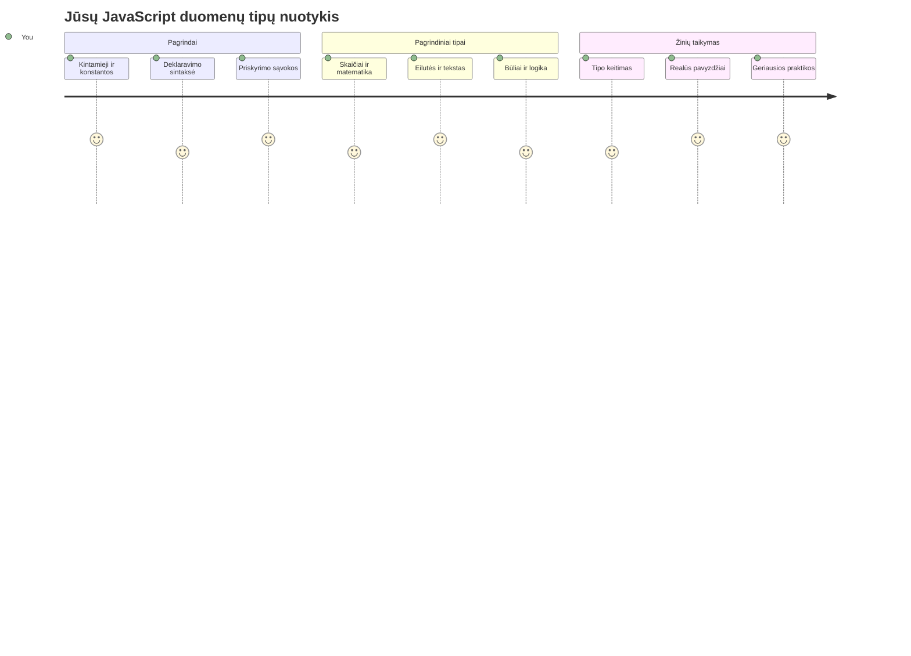
Duomenų tipai yra vienas iš pagrindinių JavaScript konceptų, su kuriais susidursite rašydami kiekvieną programą. Galvokite apie duomenų tipus kaip apie archyvo sistemą, kurią naudojo senovės Aleksandrijos bibliotekininkai – jie turėjo atskiras vietas pergamentams, kuriuose buvo poezija, matematika ir istoriniai įrašai. JavaScript organizuoja informaciją panašiai, skirstydama ją į skirtingas kategorijas skirtingų duomenų tipams.

Šioje pamokoje nagrinėsime pagrindinius duomenų tipus, kurie leidžia JavaScript veikti. Išmoksite dirbti su skaičiais, tekstu, tiesa/netiesa reikšmėmis ir suprasite, kodėl svarbu pasirinkti tinkamą tipą savo programoms. Šios sąvokos iš pradžių gali atrodyti abstrakčios, bet su praktika jos taps antrąja prigimtimi.

Supratimas apie duomenų tipus padarys viską JavaScript daug aiškesnį. Kaip architektai turi suprasti skirtingas statybines medžiagas prieš pradėdami katedros statybą, taip šie pagrindai palaikys viską, ką kursite ateityje.

## Priešpaskaitinė viktorina
[Priešpaskaitinė viktorina](https://ff-quizzes.netlify.app/web/)

Ši pamoka apima JavaScript pagrindus – kalbą, kuri suteikia interaktyvumą internete.

> Šią pamoką galite atlikti [Microsoft Learn](https://docs.microsoft.com/learn/modules/web-development-101-variables/?WT.mc_id=academic-77807-sagibbon) platformoje!

[](https://youtube.com/watch?v=JNIXfGiDWM8 "Kintamieji JavaScript")

[](https://youtube.com/watch?v=AWfA95eLdq8 "Duomenų tipai JavaScript")

> 🎥 Spauskite aukščiau esančias nuotraukas norėdami peržiūrėti vaizdo įrašus apie kintamuosius ir duomenų tipus

Pradėkime nuo kintamųjų ir duomenų tipų, kurie juos užpildo!

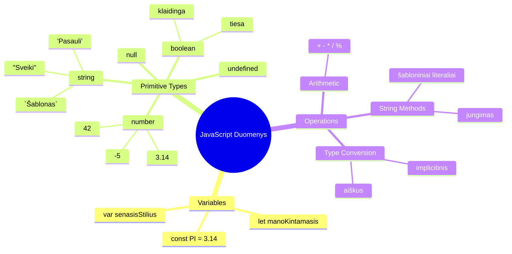
## Kintamieji

Kintamieji yra pagrindiniai programavimo elementai. Kaip viduramžių alchemikai žymėjo indelius, skirtus skirtingoms medžiagoms laikyti, taip kintamieji leidžia saugoti informaciją ir suteikti jai aprašomą pavadinimą, kad galėtumėte ją naudoti vėliau. Reikia prisiminti kieno nors amžių? Laikykite jį kintamajame pavadinimu `age`. Norite sekti vartotojo vardą? Laikykite jį kintamajame pavadinimu `userName`.

Mes sutelksime dėmesį į modernų būdą kurti kintamuosius JavaScript. Čia išmoktos technikos atsirado po daug metų kalbos evoliucijos ir geriausių praktikų, sukurtų programavimo bendruomenės.

Kintamojo kūrimas ir **deklaravimas** turi šią sintaksę: **[raktažodis] [vardas]**. Tai sudaryta iš dviejų dalių:

- **Raktažodis**. Naudokite `let` kintamiesiems, kurie gali keistis, arba `const` reikšmėms, kurios lieka nepakitusios.
- **Kintamojo pavadinimas**, tai aprašomas vardas, kurį pasirenkate patys.

✅ Raktažodis `let` buvo įvestas ES6 ir suteikia jūsų kintamajam vadinamąją _blokinio lygio apimtį_. Rekomenduojama naudoti `let` arba `const` vietoje senojo raktažodžio `var`. Blokinių apimčių nagrinėjimą aptarsime detaliau vėlesniuose skyriuose.

### Užduotis – darbas su kintamaisiais

1. **Deklaruokite kintamąjį**. Pradėkime nuo pirmojo kintamojo sukūrimo:

    ```javascript
    let myVariable;
    ```

   **Ką tai veikia:**
   - JavaScript įsakoma sukurti saugyklą pavadinimu `myVariable`
   - JavaScript rezervuoja atminties vietą šiam kintamajam
   - Kintamasis šiuo metu neturi jokios reikšmės (undefined)

2. **Priskirkite reikšmę**. Dabar įdėkime kažką į mūsų kintamąjį:

    ```javascript
    myVariable = 123;
    ```

   **Kaip veikia priskyrimas:**
   - Operatorius `=` priskiria reikšmę 123 mūsų kintamajam
   - Kintamasis dabar turi šią reikšmę, o ne undefined
   - Galite naudoti šią reikšmę visame kode, nurodydami `myVariable`

   > Pastaba: šiame pamokoje `=` reiškia priskyrimo operatorių, kuris naudojamas reikšmės priskyrimui kintamajam. Tai nereiškia lygybės.

3. **Padarykite tai protingai**. Iš tiesų, sujunkime šiuos du veiksmus:

    ```javascript
    let myVariable = 123;
    ```

    **Šis metodas yra efektyvesnis:**
    - Deklaruojate kintamąjį ir priskiriate jam reikšmę viename sakinyje
    - Tai yra įprasta programavimo praktika
    - Tai sumažina kodo apimtį, išlaikant aiškumą

4. **Pakeiskite mintį**. O kas, jei norime saugoti kitą skaičių?

   ```javascript
   myVariable = 321;
   ```

   **Supratimas apie pakartotinį priskyrimą:**
   - Kintamasis dabar saugo 321 vietoje 123
   - Ankstesnė vertė pakeičiama – kintamieji saugo tik vieną vertę vienu metu
   - Šis keičiamumas yra pagrindinė `let` deklaruotų kintamųjų savybė

   ✅ Išbandykite! JavaScript galite rašyti tiesiai naršyklėje. Atidarykite naršyklės langą ir pereikite į Kūrėjų įrankius. Konsolėje rasite komandų eilutę; įveskite `let myVariable = 123`, paspauskite Enter, tada įveskite `myVariable`. Kas nutiko? Toliau pamokoje sužinosite daugiau apie šias sąvokas.

### 🧠 **Kintamųjų meistriškumo patikrinimas: atsipalaiduokite**

**Pažiūrėkime, kaip jaučiatės dėl kintamųjų:**
- Ar galite paaiškinti skirtumą tarp kintamojo deklaravimo ir priskyrimo?
- Kas nutinka, jei bandote naudoti kintamąjį prieš jį deklaruodami?
- Kada rinktumėtės `let` vietoje `const` kintamajam?

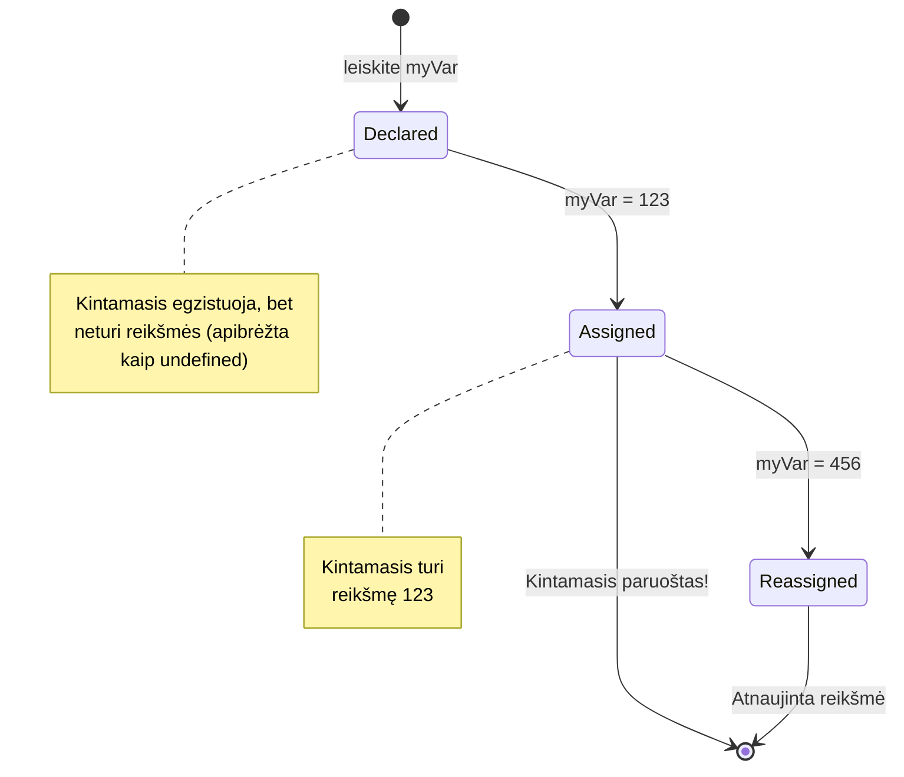
> **Greita pastaba**: Galvokite apie kintamuosius kaip apie dėžutes su etiketėmis. Jūs sukuriate dėžutę (`let`), kažką įdedate (`=`), ir galite vėliau pakeisti turinį, jei reikia!

## Konstanta

Kartais reikia saugoti informaciją, kuri negali keistis programos vykdymo metu. Galvokite apie konstantas kaip apie matematikos principus, kuriuos Euklidas nustatė senovės Graikijoje – kartą įrodžius ir užfiksavus, jie liko nepakeičiami ateičiai.

Konstanta veikia panašiai kaip kintamasis, bet turi svarbią ribą: kai priskiriate reikšmę, jos nebegalima pakeisti. Ši nekintamumas padeda išvengti atsitiktinių reikšmių pakeitimų programoje.

Konstanta deklaruojama ir inicializuojama tokiu pačiu principu kaip ir kintamasis, tik vietoje `let` naudojamas raktažodis `const`. Konstantos dažnai rašomos didžiosiomis raidėmis.

```javascript
const MY_VARIABLE = 123;
```

**Šis kodas daro:**
- **Sukuria** konstantą pavadinimu `MY_VARIABLE` su reikšme 123
- **Naudoja** didžiųjų raidžių vartojimą konstantoms
- **Neleidžia** ateityje keisti šios reikšmės

Konstantoms galioja dvi pagrindinės taisyklės:

- **Jūs privalote iškart priskirti reikšmę** – tuščios konstantos nėra leidžiamos!
- **Negalima keisti priskirtos reikšmės** – jei bandysite, JavaScript parodys klaidą. Pažiūrėkime, ką tai reiškia:

   **Paprasta reikšmė** - Čia NEGALIMA:
   
      ```javascript
      const PI = 3;
      PI = 4; // neleidžiama
      ```

   **Reikia prisiminti:**
   - **Bandymas** priskirti konstantai kitą reikšmę sukels klaidą
   - **Apsaugo** svarbias reikšmes nuo netyčinių pakeitimų
   - **Užtikrina**, kad reikšmė visada išliktų pastovi programoje
 
   **Objekto nuoroda yra apsaugota** - Čia NEGALIMA:
   
      ```javascript
      const obj = { a: 3 };
      obj = { b: 5 } // neleidžiama
      ```

   **Suprantant šias sąvokas:**
   - **Neleidžia** viso objekto pakeisti nauju
   - **Apsaugo** nuorodą į originalų objektą
   - **Išlaiko** objekto tapatumą atmintyje

    **Objekto reikšmė nėra apsaugota** - Čia LEIDŽIAMA:
    
      ```javascript
      const obj = { a: 3 };
      obj.a = 5;  // leidžiama
      ```

      **Kas čia vyksta:**
      - **Keičia** savybę objekte
      - **Išlaiko** tą pačią nuorodą į objektą
      - **Parodo**, kad objekto turinys gali keistis, nors nuoroda lieka pastovi

   > Pastaba, `const` reiškia, jog nuoroda yra apsaugota nuo priskyrimo. Tačiau pati reikšmė nėra _nekintama_ ir gali keistis, ypač jei tai sudėtingas objektas.

## Duomenų tipai

JavaScript organizuoja informaciją į skirtingas kategorijas, vadinamas duomenų tipais. Ši sąvoka primena, kaip senovės mokytojai skirstė žinias – Aristotelis skyrė skirtingus mąstymo tipus, žinodamas, kad loginiai principai netaikomi vienodai poezijai, matematikai ir gamtos filosofijai.

Duomenų tipai yra svarbūs, nes skirtingos operacijos veikia su skirtingų rūšių informacija. Kaip negalite atlikti aritmetinių veiksmų su žmogaus vardu arba rūšiuoti matematinės lygties, taip JavaScript reikalauja tinkamo duomenų tipo kiekvienai operacijai. Tai leidžia išvengti klaidų ir padaryti jūsų kodą patikimesnį.

Kintamieji gali saugoti daug skirtingų tipų reikšmių, pavyzdžiui, skaičius ir tekstą. Šie skirtingi reikšmių tipai vadinami **duomenų tipu**. Duomenų tipai yra svarbi programinės įrangos kūrimo dalis, nes padeda programuotojams nuspręsti, kaip rašyti kodą ir kaip programa turėtų veikti. Be to, kai kurie duomenų tipai turi unikalių savybių, kurios leidžia transformuoti arba išgauti papildomą informaciją iš reikšmės.

✅ Duomenų tipai taip pat vadinami JavaScript pirminiais duomenų tipais, nes jie yra žemiausio lygio duomenų tipai, kuriuos pateikia kalba. Yra 7 pirminiai tipai: string, number, bigint, boolean, undefined, null ir symbol. Skirkite minutę vizualizuoti, ką kiekvienas iš šių tipų gali reikšti. Kas yra `zebra`? O `0`? `true`?

### Skaičiai

Skaičiai yra paprasčiausias duomenų tipas JavaScript. Nesvarbu, ar dirbate su sveikaisiais skaičiais, pavyzdžiui, 42, trupmeniniais, pavyzdžiui, 3.14, ar neigiamais skaičiais, pavyzdžiui, -5, JavaScript tvarko juos vienodai.

Prisiminkite mūsų ankstesnį kintamąjį? Tas 123, kurį ten saugojome, buvo skaičiaus duomenų tipas:

```javascript
let myVariable = 123;
```

**Pagrindinės savybės:**
- JavaScript automatiškai atpažįsta skaitines reikšmes
- Galite atlikti matematikos operacijas su šiais kintamaisiais
- Nereikia aiškiai deklaruoti tipo

Kintamieji gali saugoti visų tipų skaičius, įskaitant trupmeninius ar neigiamus. Skaičiai taip pat gali būti naudojami su aritmetiniais operatoriais, aptariami [kitame skyriuje](../../../../2-js-basics/1-data-types).

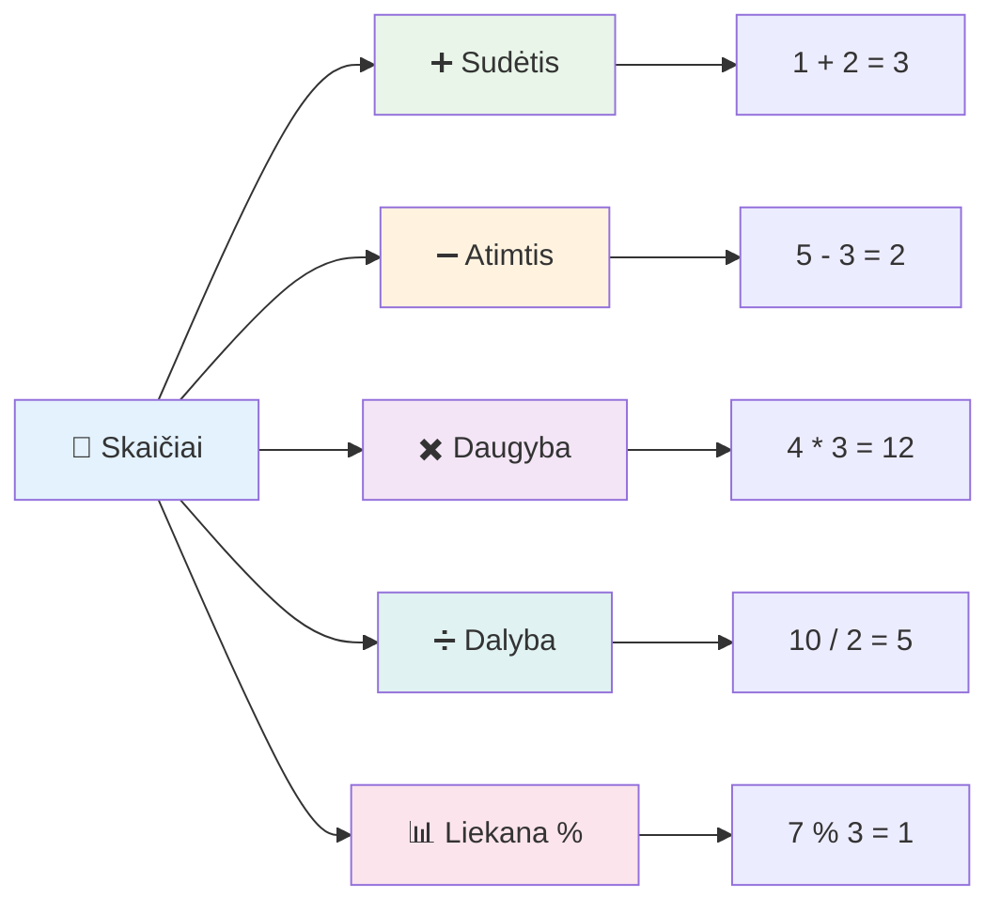
### Aritmetiniai operatoriai

Aritmetiniai operatoriai leidžia atlikti matematikos skaičiavimus JavaScript. Šie operatoriai veikia pagal tuos pačius principus, kuriuos matematikai naudojo amžius – tos pačios simbolikos, kuri pasirodė tokių mokslininkų kaip Al-Chvazimis, sukūrusio algebrai naudojamą notaciją, darbuose.

Operatoriai veikia taip, kaip tikitės iš tradicinės matematikos: pliusas sudėčiai, minusas atimčiai ir t.t.

Yra kelių tipų operatoriai, kurie naudojami aritmetinėse funkcijose, keletas jų pateikiami žemiau:

| Simbolis | Aprašymas                                                     | Pavyzdys                        |
| -------- | -------------------------------------------------------------| ------------------------------ |
| `+`      | **Sudėtis**: apskaičiuoja dviejų skaičių sumą                | `1 + 2 //tikėtinas atsakymas 3`|
| `-`      | **Atimtis**: apskaičiuoja dviejų skaičių skirtumą            | `1 - 2 //tikėtinas atsakymas -1`|
| `*`      | **Daugynimas**: apskaičiuoja dviejų skaičių sandaugą        | `1 * 2 //tikėtinas atsakymas 2`|
| `/`      | **Dalyba**: apskaičiuoja dviejų skaičių dalmenį              | `1 / 2 //tikėtinas atsakymas 0.5`|
| `%`      | **Liekana**: apskaičiuoja likutį po dviejų skaičių dalybos   | `1 % 2 //tikėtinas atsakymas 1` |

✅ Išbandykite! Pabandykite atlikti aritmetinę operaciją naršyklės konsolėje. Ar rezultatai jus nustebino?

### 🧮 **Matematikos įgūdžių patikrinimas: skaičiavimai be baimės**

**Patikrinkite savo aritmetikos supratimą:**
- Kuo skiriasi `/` (dalyba) ir `%` (liekana)?
- Ar galite nuspėti, kiek yra `10 % 3`? (Užuomina: tai nėra 3.33...)
- Kam gali būti naudingas liekanos operatorius programavime?

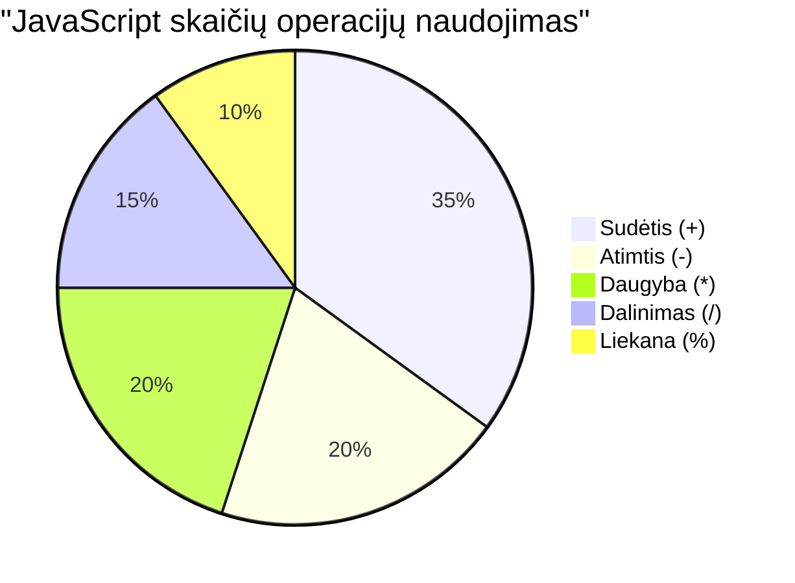
> **Realaus pasaulio įžvalga**: Liekandos operatorius (%) yra labai naudingas tikrinant, ar skaičius yra lyginis/nelyginis, kuriant šablonus arba einant per masyvus!

### Tekstai (String)

JavaScript tekstiniai duomenys vaizduojami kaip stringai. Žodis "string" kilo iš sąvokos apie simbolių eilę, panašiai kaip viduramžių vienuoliai rašydavo raides, sudarydami žodžius ir sakinius savo rankraščiuose.

Stringai yra esminiai žiniatinklio kūrimui. Kiekvienas tekstas tinklalapyje – vartotojo vardai, mygtukų pavadinimai, klaidų pranešimai, turinys – yra tvarkomas kaip tekstinis duomenų tipas. Supratimas apie stringus būtinas kuriant funkcionalias vartotojo sąsajas.

Stringai yra simbolių rinkiniai, esantys tarp viengubų arba dvigubų kabučių.

```javascript
'This is a string'
"This is also a string"
let myString = 'This is a string value stored in a variable';
```

**Supratimas apie šias sąvokas:**
- **Naudoja** viengubas `'` arba dvigubas `"` kabutes stringams apibrėžti
- **Saugo** tekstinius duomenis, kurie gali apimti raides, skaičius ir simbolius
- **Priskiria** stringo reikšmes kintamiesiems vėlesniam naudojimui
- **Reikalauja** kabučių, kad atskirtų tekstą nuo kintamųjų vardų

Atminkite, kad rašant stringą reikalingos kabutės, kitaip JavaScript laiko tai kintamojo vardu.

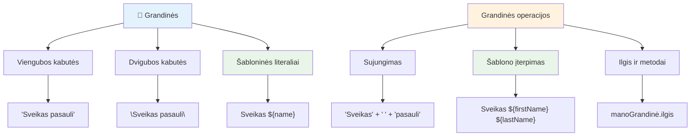
### Stringų formatavimas

Stringų manipuliacija leidžia sujungti tekstinius elementus, įterpti kintamuosius ir kurti dinaminį turinį, kuris reaguoja į programos būseną. Ši technika leidžia programiškai kurti tekstą.

Dažnai reikia sujungti kelis stringus – šis procesas vadinamas sujungimu (konkatenacija).
Norėdami **sujungti** du ar daugiau tekstų, arba juos sudėti kartu, naudokite `+` operatorių.

```javascript
let myString1 = "Hello";
let myString2 = "World";

myString1 + myString2 + "!"; //SveikasPasauli!
myString1 + " " + myString2 + "!"; //Sveikas Pasauli!
myString1 + ", " + myString2 + "!"; //Sveikas, Pasauli!
```

**Žingsnis po žingsnio, štai kas vyksta:**
- **Sujungia** kelis tekstus naudodamas `+` operatorių
- **Jungia** tekstus tiesiogiai be tarpų pirmajame pavyzdyje
- **Įterpia** tarpų simbolius `" "` tarp tekstų dėl skaitomumo
- **Įterpia** skyrybos ženklus, tokius kaip kableliai, tinkamam formatavimui

✅ Kodėl JavaScript `1 + 1 = 2`, bet `'1' + '1' = 11?` Pagalvokite. O kaip `'1' + 1`?

**Šabloniniai tekstai** yra dar vienas būdas formatuoti tekstus, tik vietoje kabučių naudojamas atgalinis apostrofas. Viskas, kas nėra paprastas tekstas, turi būti dedama į vietas su `${ }`. Tai apima ir kintamuosius, kurie gali būti tekstai.

```javascript
let myString1 = "Hello";
let myString2 = "World";

`${myString1} ${myString2}!` //Sveikas, pasauli!
`${myString1}, ${myString2}!` //Sveikas, pasauli!
```

**Supraskime kiekvieną dalį:**
- **Naudoja** atgalinius apostrofus `` ` `` vietoje įprastų kabučių šabloniniams tekstams kurti
- **Įterpia** kintamuosius tiesiogiai naudodamas `${}` vietų sintaksę
- **Išlaiko** tarpų ir formatavimo tiksliai kaip parašyta
- **Suteikia** švaresnį būdą kurti sudėtingus tekstus su kintamaisiais

Galite pasiekti savo formatavimo tikslus bet kuriuo būdu, tačiau šabloniniai tekstai gerbia visus tarpus ir eilutės pertraukimus.

✅ Kada naudotumėte šabloninį tekstą, o kada įprastą tekstą?

### 🔤 **Teksto meistriškumo patikra: Teksto manipuliavimo pasitikėjimas**

**Įvertinkite savo teksto įgūdžius:**
- Ar galite paaiškinti, kodėl `'1' + '1'` lygu `'11'`, o ne `2`?
- Kurią teksto metodiką laikote lengviau skaitoma: sujungimą ar šabloninius tekstus?
- Kas nutinka, jei pamiršite kabutes aplink tekstą?

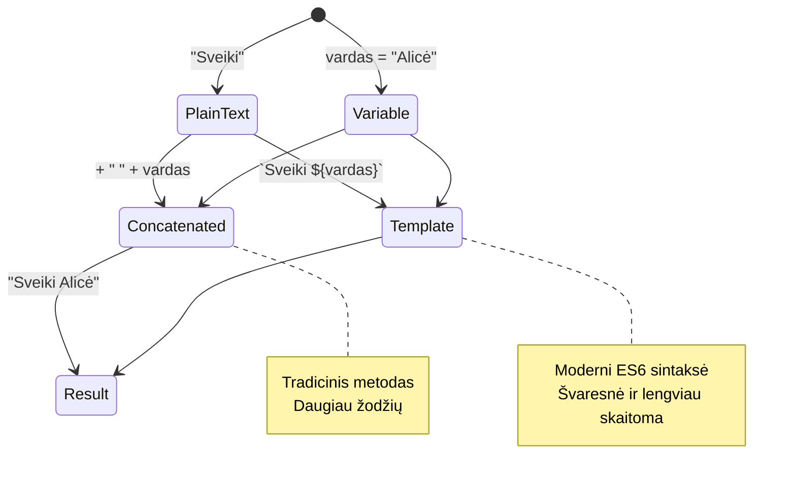
> **Profesionalus patarimas**: Šabloniniai tekstai paprastai yra pageidaujami kuriant sudėtingą tekstą, nes jie lengviau skaitomi ir puikiai tvarko daugiavielius tekstus!

### Būlio tipas (Booleans)

Būlio tipas reiškia paprasčiausią duomenų formą: jis gali turėti tik vieną iš dviejų reikšmių – `true` arba `false`. Ši dvejetainė logikos sistema kyla iš XIX a. matematiko George'o Boole'o darbų, kuris sukūrė Būlio algebrą.

Nors jie paprasti, būliai yra būtini programos logikai. Jie leidžia jūsų kodui priimti sprendimus pagal sąlygas – ar vartotojas prisijungęs, ar mygtukas paspaustas, arba ar tam tikri kriterijai įvykdyti.

Būlio tipas gali būti tik viena iš dviejų reikšmių: `true` arba `false`. Būliai padeda apsispręsti, kurios kodo eilutės vykdytinos, kai įvykdomos tam tikros sąlygos. Daugeliu atvejų [operatoriai](../../../../2-js-basics/1-data-types) padeda nustatyti būlio vertę, ir jūs dažnai pamatysite bei rašysite kintamuosius, kurie yra inicializuojami arba atnaujinami su operatoriais.

```javascript
let myTrueBool = true;
let myFalseBool = false;
```

**Aukščiau mes:**
- **Sukūrėme** kintamąjį, kuriame saugoma būlio reikšmė `true`
- **Parodėme**, kaip saugoti būlio reikšmę `false`
- **Naudojome** tikruosius raktažodžius `true` ir `false` (kabutės nereikalingos)
- **Paruošėme** šiuos kintamuosius naudoti sąlyginiuose sakiniuose

✅ Kintamąjį galima laikyti 'tiesos' verte, jei jis įvertinamas kaip būlio `true`. Įdomu, kad JavaScript [visos reikšmės yra pripažįstamos kaip tiesos, nebent apibrėžiamos kaip klaidingos](https://developer.mozilla.org/docs/Glossary/Truthy).

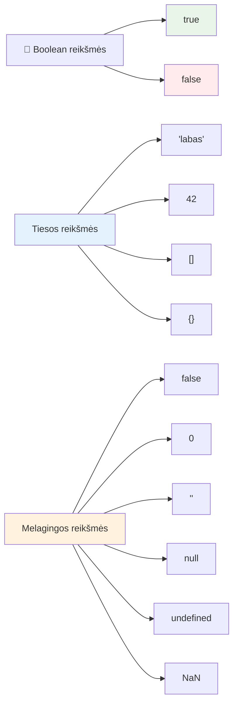
### 🎯 **Būlio logikos patikra: sprendimų priėmimo įgūdžiai**

**Patikrinkite savo būlio supratimą:**
- Kodėl, jūsų manymu, JavaScript turi "tiesos" ir "klaidingas" reikšmes, be `true` ir `false`?
- Ar galite prognozuoti, kuris iš šių yra klaidingas: `0`, `"0"`, `[]`, `"false"`?
- Kaip būliai gali būti naudingi programuoto programos eigos valdymui?

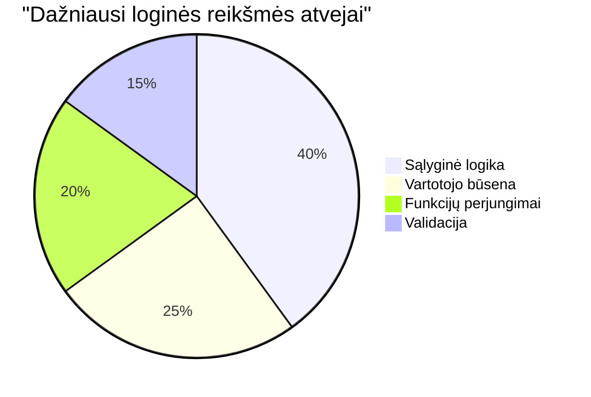
> **Atminkite**: JavaScript yra tik 6 klaidingos reikšmės: `false`, `0`, `""`, `null`, `undefined`, ir `NaN`. Viskas kita yra tiesa!

---

## 📊 **Jūsų duomenų tipų įrankių santrauka**

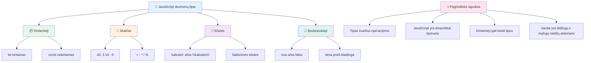
## GitHub Copilot agento iššūkis 🚀

Naudokite Agent režimą, kad įvykdytumėte šį iššūkį:

**Aprašymas:** Sukurkite asmeninio informacijos vadybininką, kuris demonstruoja visas JavaScript duomenų tipus, išmoktas šiame pamokoje, sprendžiant realaus pasaulio duomenų situacijas.

**Uždavinys:** Parašykite JavaScript programą, kuri sukuria vartotojo profilio objektą, turintį: asmens vardą (tekstas), amžių (skaičius), studento statusą (būlio tipas), mėgstamas spalvas kaip masyvą ir adresą kaip objektą su gatvės, miesto ir pašto kodo ypatybėmis. Įtraukite funkcijas profilio informacijos rodymui ir atskirų laukų atnaujinimui. Būtinai parodykite teksto sujungimą, šabloninius tekstus, aritmetines operacijas su amžiumi ir būlio logiką studento statusui.

Daugiau sužinokite apie [agent režimą](https://code.visualstudio.com/blogs/2025/02/24/introducing-copilot-agent-mode) čia.

## 🚀 Iššūkis

JavaScript turi keletą elgsenų, kurios gali nustebinti programuotojus. Štai klasikinis pavyzdys: įrašykite šį kodą savo naršyklės konsolėje: `let age = 1; let Age = 2; age == Age` ir stebėkite rezultatą. Jis grąžina `false` – galite nustatyti kodėl?

Tai viena iš daugelio JavaScript savybių, kurią verta suprasti. Pažintis su šiomis keistenybėmis padės rašyti patikimesnį kodą ir veiksmingiau taisyti klaidas.

## Po paskaitos testas
[Po paskaitos testas](https://ff-quizzes.netlify.app)

## Peržiūra ir savarankiškas mokymasis

Peržiūrėkite [JavaScript užduočių sąrašą](https://css-tricks.com/snippets/javascript/) ir išbandykite vieną. Ką išmokote?

## Namų darbas

[Duomenų tipų praktika](assignment.md)

## 🚀 Jūsų JavaScript duomenų tipų meistriškumo kelio planas

### ⚡ **Ką galite padaryti per artimiausias 5 minutes**
- [ ] Atidaryti naršyklės konsolę ir sukurti 3 kintamuosius su skirtingais duomenų tipais
- [ ] Išbandyti iššūkį: `let age = 1; let Age = 2; age == Age` ir suprasti, kodėl tai klaidinga
- [ ] Praktikuoti teksto sujungimą su savo vardu ir mėgstamu skaičiumi
- [ ] Išbandyti, kas nutinka, kai prie teksto pridedate skaičių

### 🎯 **Ką galite pasiekti šią valandą**
- [ ] Atlikti po pamokos testą ir peržiūrėti neaiškias temas
- [ ] Sukurti mini skaičiuotuvą, kuris sudeda, atima, dauginą ir dalija du skaičius
- [ ] Parašyti paprastą vardo formatavimo funkciją naudojant šabloninius tekstus
- [ ] Išnagrinėti skirtumus tarp `==` ir `===` palyginimo operatorių
- [ ] Praktikuoti konvertuoti tarp skirtingų duomenų tipų

### 📅 **Jūsų savaitės JavaScript pagrindai**
- [ ] Atlikti užduotį su pasitikėjimu ir kūrybiškumu
- [ ] Sukurti asmeninį profilio objektą naudodami visus išmoktus duomenų tipus
- [ ] Praktikuotis su [JavaScript užduotimis iš CSS-Tricks](https://css-tricks.com/snippets/javascript/)
- [ ] Parašyti paprastą formos tikrintuvą naudojant būlio logiką
- [ ] Eksperimentuoti su masyvų ir objektų duomenų tipais (bus ateinančiuose pamokose)
- [ ] Prisijungti prie JavaScript bendruomenės ir užduoti klausimus apie duomenų tipus

### 🌟 **Jūsų mėnesio ilgalaikis transformacijos planas**
- [ ] Integruoti duomenų tipų žinias į didesnius programavimo projektus
- [ ] Suprasti, kada ir kodėl naudoti kiekvieną duomenų tipą realiose programose
- [ ] Padėti kitiems pradedantiesiems suprasti JavaScript pagrindus
- [ ] Sukurti mažą programėlę, kuri tvarko įvairių tipų vartotojo duomenis
- [ ] Išnagrinėti pažangias duomenų tipų sąvokas, tokias kaip tipo perauga ir griežtas lyginimas
- [ ] Prisidėti prie atviro kodo JavaScript projektų tobulinimo dokumentacijoje

### 🧠 **Galutinis duomenų tipų meistriškumo patikrinimas**

**Švęskite savo JavaScript pagrindus:**
- Kuris duomenų tipas jus labiausiai nustebino dėl savo elgesio?
- Kaip gerai jaučiatės aiškindami kintamuosius ir konstantas draugui?
- Koks įdomiausias dalykas, kurį atradote apie JavaScript tipų sistemą?
- Kokią realią programėlę įsivaizduojate kurdami su šiomis pagrindinėmis žiniomis?

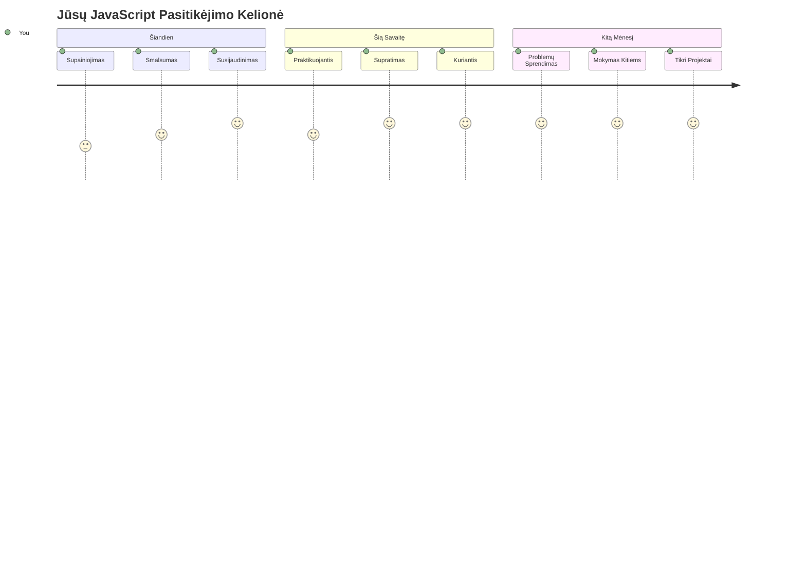
> 💡 **Jūs sukūrėte pagrindus!** Duomenų tipų supratimas yra kaip alfabetą išmokti prieš rašant istorijas. Kiekviena JavaScript programa, kurią rašysite, naudos šias pagrindines sąvokas. Dabar turite pagrindus kurti interaktyvias svetaines, dinamiškas programėles ir spręsti realaus pasaulio problemas su kodu. Sveiki atvykę į nuostabų JavaScript pasaulį! 🎉

---

<!-- CO-OP TRANSLATOR DISCLAIMER START -->
**Atsakomybės apribojimas**:
Šis dokumentas buvo išverstas naudojant dirbtinio intelekto vertimo paslaugą [Co-op Translator](https://github.com/Azure/co-op-translator). Nors stengiamės užtikrinti tikslumą, prašome atkreipti dėmesį, kad automatizuoti vertimai gali turėti klaidų ar netikslumų. Originalus dokumentas jo gimtąja kalba turėtų būti laikomas oficialiu šaltiniu. Svarbiai informacijai rekomenduojama kreiptis į profesionalius vertėjus. Mes neatsakome už jokius nesusipratimus ar neteisingus aiškinimus, kylančius dėl šio vertimo naudojimo.
<!-- CO-OP TRANSLATOR DISCLAIMER END -->