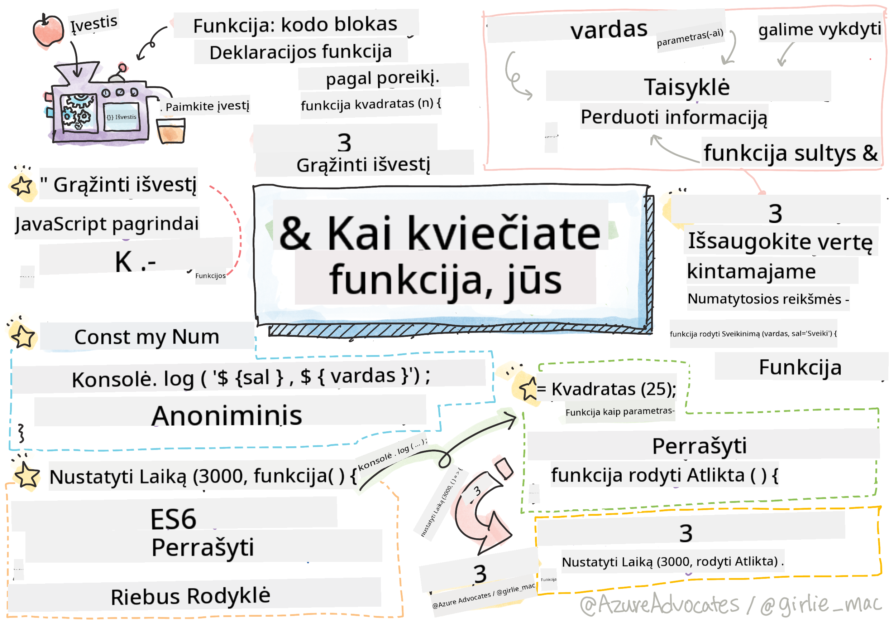

<!--
CO_OP_TRANSLATOR_METADATA:
{
  "original_hash": "92e136090efc4341b1d51c37924c1802",
  "translation_date": "2025-08-29T16:53:09+00:00",
  "source_file": "2-js-basics/2-functions-methods/README.md",
  "language_code": "lt"
}
-->
# JavaScript pagrindai: metodai ir funkcijos


> Sketchnote sukūrė [Tomomi Imura](https://twitter.com/girlie_mac)

## Klausimai prieš paskaitą
[Klausimai prieš paskaitą](https://ff-quizzes.netlify.app)

Kai galvojame apie kodo rašymą, visada norime užtikrinti, kad mūsų kodas būtų lengvai skaitomas. Nors tai gali atrodyti nelogiška, kodas yra skaitomas daug daugiau kartų nei rašomas. Vienas pagrindinių įrankių, padedančių kurti lengvai prižiūrimą kodą, yra **funkcija**.

[](https://youtube.com/watch?v=XgKsD6Zwvlc "Metodai ir funkcijos")

> 🎥 Spustelėkite paveikslėlį aukščiau, kad peržiūrėtumėte vaizdo įrašą apie metodus ir funkcijas.

> Šią pamoką galite rasti [Microsoft Learn](https://docs.microsoft.com/learn/modules/web-development-101-functions/?WT.mc_id=academic-77807-sagibbon)!

## Funkcijos

Funkcija iš esmės yra kodo blokas, kurį galime vykdyti pagal poreikį. Tai puikiai tinka situacijoms, kai reikia atlikti tą pačią užduotį kelis kartus; vietoj to, kad logiką dubliuotume keliose vietose (kas apsunkintų atnaujinimą ateityje), galime ją centralizuoti vienoje vietoje ir iškviesti, kai tik reikia atlikti operaciją – funkcijas netgi galima iškviesti iš kitų funkcijų!

Taip pat svarbu suteikti funkcijai pavadinimą. Nors tai gali atrodyti nereikšminga, pavadinimas suteikia greitą būdą dokumentuoti kodo dalį. Galite tai įsivaizduoti kaip etiketę ant mygtuko. Jei paspausiu mygtuką, ant kurio parašyta „Atšaukti laikmatį“, žinau, kad jis sustabdys laikrodžio veikimą.

## Funkcijos kūrimas ir iškvietimas

Funkcijos sintaksė atrodo taip:

```javascript
function nameOfFunction() { // function definition
 // function definition/body
}
```

Jei norėčiau sukurti funkciją, kuri rodytų pasisveikinimą, ji galėtų atrodyti taip:

```javascript
function displayGreeting() {
  console.log('Hello, world!');
}
```

Kai norime iškviesti (arba aktyvuoti) savo funkciją, naudojame funkcijos pavadinimą, po kurio seka `()`. Verta paminėti, kad funkcija gali būti apibrėžta prieš arba po jos iškvietimo; JavaScript kompiliatorius ją suras už jus.

```javascript
// calling our function
displayGreeting();
```

> **NOTE:** Yra specialus funkcijų tipas, vadinamas **metodu**, kurį jūs jau naudojote! Iš tiesų, tai matėme aukščiau pateiktame pavyzdyje, kai naudojome `console.log`. Skirtumas tarp metodo ir funkcijos yra tas, kad metodas yra priskirtas objektui (mūsų pavyzdyje – `console`), o funkcija yra laisvai plaukiojanti. Daugelis programuotojų šiuos terminus naudoja pakaitomis.

### Geriausios praktikos kuriant funkcijas

Kuriant funkcijas verta atsižvelgti į keletą geriausių praktikų:

- Visada naudokite aiškius pavadinimus, kad žinotumėte, ką funkcija atliks
- Naudokite **camelCasing**, kad sujungtumėte žodžius
- Funkcijas orientuokite į konkrečią užduotį

## Informacijos perdavimas funkcijai

Kad funkcija būtų universalesnė, dažnai norėsite perduoti jai informaciją. Jei pažvelgtume į mūsų aukščiau pateiktą `displayGreeting` pavyzdį, jis rodys tik **Hello, world!**. Tai nėra pati naudingiausia funkcija, kurią galima sukurti. Jei norime ją padaryti šiek tiek lankstesnę, pavyzdžiui, leisti nurodyti asmens, kuriam sveikinamės, vardą, galime pridėti **parametrą**. Parametras (kartais vadinamas **argumentu**) yra papildoma informacija, perduodama funkcijai.

Parametrai nurodomi apibrėžimo dalyje, skliausteliuose, ir yra atskirti kableliais, kaip parodyta:

```javascript
function name(param, param2, param3) {

}
```

Galime atnaujinti savo `displayGreeting`, kad priimtų vardą ir jį rodytų.

```javascript
function displayGreeting(name) {
  const message = `Hello, ${name}!`;
  console.log(message);
}
```

Kai norime iškviesti funkciją ir perduoti parametrą, nurodome jį skliausteliuose.

```javascript
displayGreeting('Christopher');
// displays "Hello, Christopher!" when run
```

## Numatytosios reikšmės

Funkciją galime padaryti dar lankstesnę, pridėdami daugiau parametrų. Bet ką daryti, jei nenorime, kad kiekviena reikšmė būtų privaloma? Grįžtant prie mūsų sveikinimo pavyzdžio, galime palikti vardą kaip privalomą (mums reikia žinoti, kam sveikinamės), tačiau norime leisti sveikinimą pritaikyti pagal poreikį. Jei kas nors nenori jo pritaikyti, vietoj to pateikiame numatytąją reikšmę. Norėdami nustatyti numatytąją parametro reikšmę, ją nustatome taip pat, kaip nustatytume reikšmę kintamajam – `parameterName = 'defaultValue'`. Pilnas pavyzdys:

```javascript
function displayGreeting(name, salutation='Hello') {
  console.log(`${salutation}, ${name}`);
}
```

Kai iškviečiame funkciją, galime nuspręsti, ar norime nustatyti reikšmę `salutation`.

```javascript
displayGreeting('Christopher');
// displays "Hello, Christopher"

displayGreeting('Christopher', 'Hi');
// displays "Hi, Christopher"
```

## Grąžinamosios reikšmės

Iki šiol mūsų sukurta funkcija visada išves informaciją į [console](https://developer.mozilla.org/docs/Web/API/console). Kartais tai gali būti būtent tai, ko ieškome, ypač kai kuriame funkcijas, kurios iškvies kitas paslaugas. Bet ką daryti, jei noriu sukurti pagalbinę funkciją, kuri atliktų skaičiavimą ir grąžintų reikšmę, kad galėčiau ją naudoti kitur?

Tai galime padaryti naudodami **grąžinamąją reikšmę**. Grąžinamoji reikšmė yra grąžinama funkcijos ir gali būti saugoma kintamajame taip pat, kaip galėtume saugoti literalinę reikšmę, pvz., eilutę ar skaičių.

Jei funkcija grąžina kažką, tada naudojamas raktažodis `return`. Raktažodis `return` tikisi reikšmės arba nuorodos į tai, kas grąžinama, kaip parodyta:

```javascript
return myVariable;
```  

Galime sukurti funkciją, kuri sukurtų sveikinimo pranešimą ir grąžintų reikšmę atgal kvietėjui.

```javascript
function createGreetingMessage(name) {
  const message = `Hello, ${name}`;
  return message;
}
```

Kai kviečiame šią funkciją, reikšmę saugosime kintamajame. Tai labai panašu į tai, kaip nustatytume kintamąjį statinei reikšmei (pvz., `const name = 'Christopher'`).

```javascript
const greetingMessage = createGreetingMessage('Christopher');
```

## Funkcijos kaip funkcijų parametrai

Tobulėjant jūsų programavimo karjerai, susidursite su funkcijomis, kurios priima funkcijas kaip parametrus. Šis įdomus triukas dažnai naudojamas, kai nežinome, kada kažkas įvyks ar baigsis, bet žinome, kad reikia atlikti operaciją reaguojant į tai.

Pavyzdžiui, apsvarstykite [setTimeout](https://developer.mozilla.org/docs/Web/API/WindowOrWorkerGlobalScope/setTimeout), kuris pradeda laikmatį ir vykdo kodą, kai jis baigiasi. Turime nurodyti, kokį kodą norime vykdyti. Skamba kaip puikus darbas funkcijai!

Jei paleisite žemiau pateiktą kodą, po 3 sekundžių pamatysite pranešimą **Praėjo 3 sekundės**.

```javascript
function displayDone() {
  console.log('3 seconds has elapsed');
}
// timer value is in milliseconds
setTimeout(displayDone, 3000);
```

### Anoniminės funkcijos

Pažvelkime dar kartą į tai, ką sukūrėme. Mes sukuriame funkciją su pavadinimu, kuri bus naudojama tik vieną kartą. Kai mūsų programa tampa sudėtingesnė, galime pastebėti, kad kuriame daug funkcijų, kurios bus iškviestos tik vieną kartą. Tai nėra idealu. Pasirodo, ne visada reikia suteikti funkcijai pavadinimą!

Kai perduodame funkciją kaip parametrą, galime apeiti jos kūrimą iš anksto ir vietoj to ją sukurti kaip parametro dalį. Naudojame tą patį raktažodį `function`, tačiau ją sukuriame kaip parametrą.

Perrašykime aukščiau pateiktą kodą, kad naudotume anoniminę funkciją:

```javascript
setTimeout(function() {
  console.log('3 seconds has elapsed');
}, 3000);
```

Jei paleisite mūsų naują kodą, pastebėsite, kad gauname tuos pačius rezultatus. Sukūrėme funkciją, tačiau nereikėjo suteikti jai pavadinimo!

### Fat arrow funkcijos

Vienas iš dažnai naudojamų trumpinių daugelyje programavimo kalbų (įskaitant JavaScript) yra vadinamosios **arrow** arba **fat arrow** funkcijos. Jos naudoja specialų simbolį `=>`, kuris atrodo kaip rodyklė – todėl toks pavadinimas! Naudodami `=>`, galime praleisti raktažodį `function`.

Perrašykime mūsų kodą dar kartą, kad naudotume fat arrow funkciją:

```javascript
setTimeout(() => {
  console.log('3 seconds has elapsed');
}, 3000);
```

### Kada naudoti kiekvieną strategiją

Dabar matėte, kad turime tris būdus perduoti funkciją kaip parametrą ir galbūt svarstote, kada naudoti kiekvieną. Jei žinote, kad funkciją naudosite daugiau nei vieną kartą, sukurkite ją įprastai. Jei ją naudosite tik vienoje vietoje, paprastai geriausia naudoti anoniminę funkciją. Ar naudosite fat arrow funkciją, ar tradicinę `function` sintaksę, priklauso nuo jūsų, tačiau pastebėsite, kad dauguma šiuolaikinių programuotojų renkasi `=>`.

---

## 🚀 Iššūkis

Ar galite vienu sakiniu paaiškinti skirtumą tarp funkcijų ir metodų? Pabandykite!

## Klausimai po paskaitos
[Klausimai po paskaitos](https://ff-quizzes.netlify.app)

## Apžvalga ir savarankiškas mokymasis

Verta [pasidomėti daugiau apie arrow funkcijas](https://developer.mozilla.org/docs/Web/JavaScript/Reference/Functions/Arrow_functions), nes jos vis dažniau naudojamos kodų bazėse. Praktikuokite rašyti funkciją, o tada perrašykite ją naudodami šią sintaksę.

## Užduotis

[Linksmybės su funkcijomis](assignment.md)

---

**Atsakomybės apribojimas**:  
Šis dokumentas buvo išverstas naudojant AI vertimo paslaugą [Co-op Translator](https://github.com/Azure/co-op-translator). Nors siekiame tikslumo, prašome atkreipti dėmesį, kad automatiniai vertimai gali turėti klaidų ar netikslumų. Originalus dokumentas jo gimtąja kalba turėtų būti laikomas autoritetingu šaltiniu. Kritinei informacijai rekomenduojama profesionali žmogaus vertimo paslauga. Mes neprisiimame atsakomybės už nesusipratimus ar klaidingus aiškinimus, atsiradusius dėl šio vertimo naudojimo.