# JavaScript pagrindai: metodai ir funkcijos

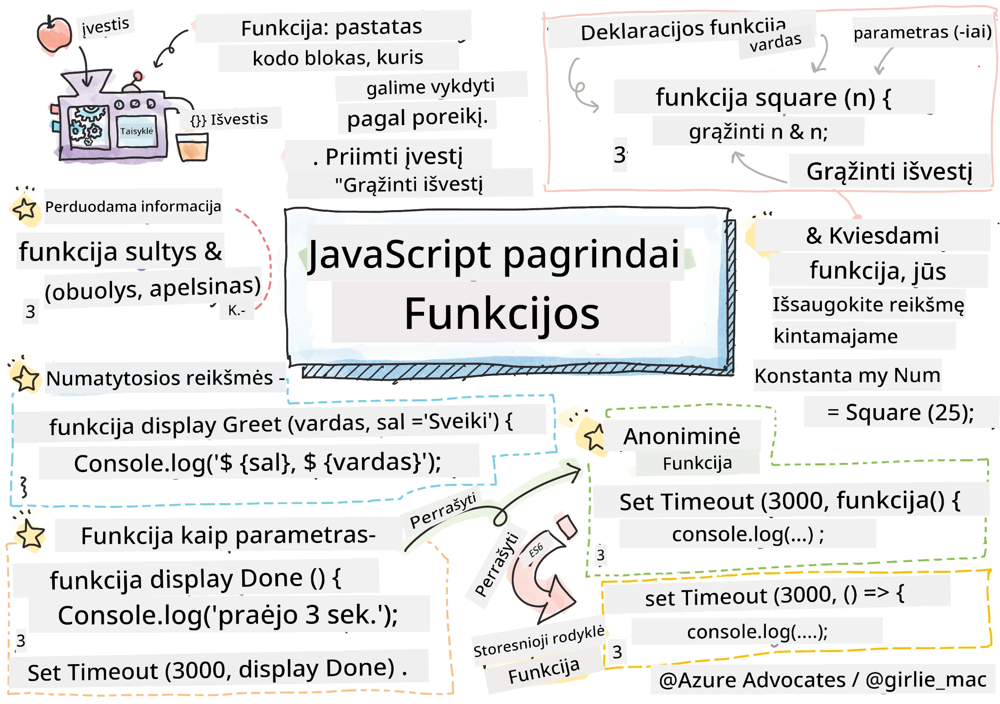
> Sketchnote autorius [Tomomi Imura](https://twitter.com/girlie_mac)

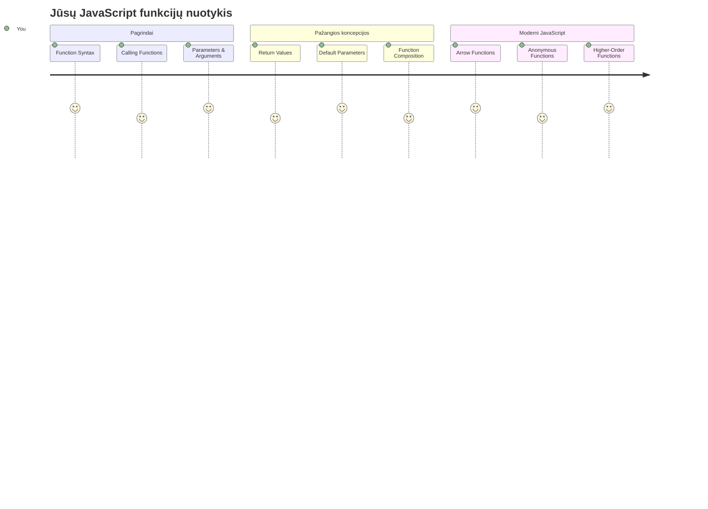
## Priešpaskaitinis testas
[Priešpaskaitinis testas](https://ff-quizzes.netlify.app)

Tas pats kodas kelis kartus yra vienas iš dažniausių programavimo erzinimų. Funkcijos išsprendžia šią problemą leidžiant supakuoti kodą į pakartotinai naudojamus blokus. Pagalvokite apie funkcijas kaip standartizuotas dalis, kurios padarė Henry Ford surinkimo liniją revoliucine – kai sukuri patikimą komponentą, jį gali naudoti bet kur, nereikalaudamas perkurti nuo nulio.

Funkcijos leidžia sugrupuoti kodo dalis, kad galėtumėte jas naudoti visame savo programoje. Vietoj to, kad visur kopijuotumėte ir įklijuotumėte tą pačią logiką, galite sukurti funkciją vieną kartą ir ją kviesti, kai reikia. Šis požiūris padeda palaikyti jūsų kodą tvarkingą ir palengvina atnaujinimus.

Šiame pamokoje sužinosite, kaip sukurti savo funkcijas, perduoti joms informaciją ir gauti naudingus rezultatus. Išmoksite skirtumą tarp funkcijų ir metodų, susipažinsite su šiuolaikinėmis sintaksės priemonėmis ir pamatysite, kaip funkcijos gali bendradarbiauti su kitomis funkcijomis. Mes apžvelgsime šias sąvokas žingsnis po žingsnio.

[](https://youtube.com/watch?v=XgKsD6Zwvlc "Metodai ir funkcijos")

> 🎥 Paspauskite aukščiau esantį vaizdą, kad peržiūrėtumėte vaizdo įrašą apie metodus ir funkcijas.

> Šią pamoką galite atlikti [Microsoft Learn](https://docs.microsoft.com/learn/modules/web-development-101-functions/?WT.mc_id=academic-77807-sagibbon) platformoje!

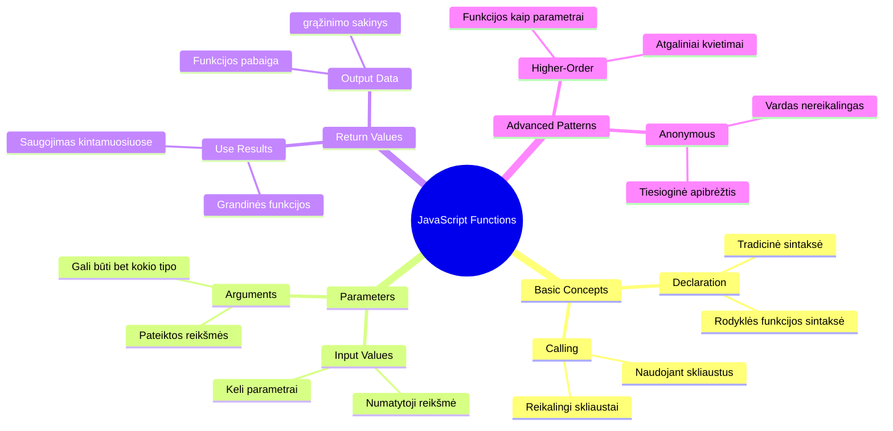
## Funkcijos

Funkcija yra savarankiškas kodo blokas, atliekantis tam tikrą užduotį. Ji apima logiką, kurią galite vykdyti kada tik reikia.

Vietoj to, kad rašytumėte tą patį kodą kelis kartus visoje programoje, galite supakuoti jį į funkciją ir kviesti šią funkciją, kai reikia. Šis požiūris palaiko jūsų kodą švarų ir palengvina atnaujinimus. Pagalvokite, kokia būtų palaikymo kliūtis, jei reikėtų keisti logiką, išmėtytą net 20 skirtingų vietų jūsų kodo bazėje.

Labai svarbu funkcijoms suteikti aprašomuosius pavadinimus. Gerai pavadinta funkcija aiškiai perteikia savo paskirtį – kai matote `cancelTimer()`, iš karto suprantate, ką ji daro, kaip ir aiškiai pažymėtas mygtukas tiksliai nurodo, kas nutiks, kai jį spustelėsite.

## Funkcijos kūrimas ir kvietimas

Pažiūrėkime, kaip sukurti funkciją. Sintaksė laikosi nuoseklaus modelio:

```javascript
function nameOfFunction() { // funkcijos apibrėžimas
 // funkcijos apibrėžimas/kūnas
}
```

Išskaidykime tai:
- Raktažodis `function` sako JavaScript „Ei, aš kuriu funkciją!“
- `nameOfFunction` yra vieta, kur suteikiate funkcijai aprašomą pavadinimą
- Skliaustai `()` – čia galite pridėti parametrų (apie juos kalbėsime netrukus)
- Garbanotosios kabutės `{}` talpina tikrąjį kodą, kuris vykdomas, kai kviečiate funkciją

Sukurkime paprastą pasisveikinimo funkciją, kad tai pamatytume praktiškai:

```javascript
function displayGreeting() {
  console.log('Hello, world!');
}
```

Ši funkcija išveda „Hello, world!“ į konsolę. Kai ją apibrėžiate, galite ją naudoti tiek kartų, kiek reikia.

Kad paleistumėte (arba „kvietumėte“) funkciją, rašykite jos pavadinimą, po kurio eina skliaustai. JavaScript leidžia apibrėžti funkciją prieš arba po jos kvietimo – JavaScript variklis pasirūpins vykdymo tvarka.

```javascript
// kviečiame mūsų funkciją
displayGreeting();
```

Paleidus šią eilutę, bus vykdomas visas kodas jūsų `displayGreeting` funkcijoje, rodantis „Hello, world!“ naršyklės konsolėje. Šią funkciją galite kviesti kelis kartus.

### 🧠 **Funkcijos pagrindų patikra: Pirmųjų funkcijų kūrimas**

**Pažiūrėkime, kaip jaučiatės dėl pagrindinių funkcijų:**
- Kodėl funkcijos apibrėžime naudojamos garbanotosios kabutės `{}`?
- Kas nutinka, jei parašote `displayGreeting` be skliaustų?
- Kodėl norėtumėte tą pačią funkciją kviesti kelis kartus?

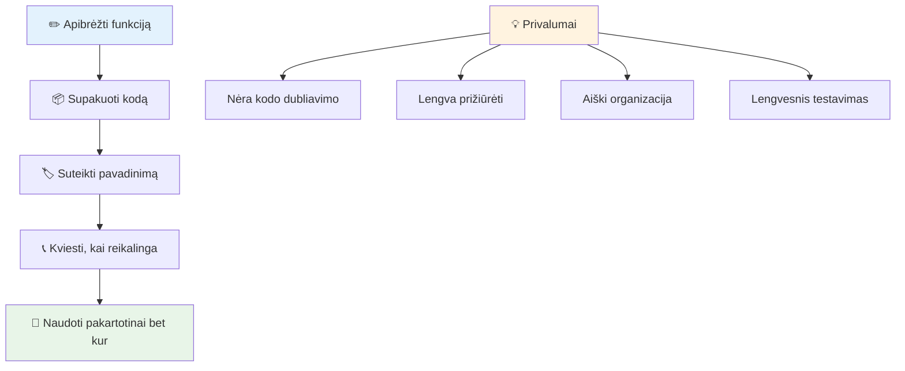
> **Pastaba:** Šiose pamokose naudojote **metodus**. `console.log()` yra metodas – iš esmės funkcija, priklausanti `console` objektui. Pagrindinis skirtumas yra tas, kad metodai yra pririšti prie objektų, o funkcijos veikia savarankiškai. Daugelis programuotojų šiuos terminus neformaliuose pokalbiuose vartoja kaip sinonimus.

### Geriausios funkcijų rašymo praktikos

Štai kelios gairės, padedančios kurti puikias funkcijas:

- Suteikite funkcijoms aiškius, aprašomuosius pavadinimus – ateities jūs jums padėkos!
- Naudokite **camelCase** kelių žodžių pavadinimams (pvz., `calculateTotal` vietoje `calculate_total`)
- Laikykite kiekvieną funkciją vienoje užduotyje ir atlikite ją gerai

## Informacijos perdavimas funkcijai

Mūsų funkcija `displayGreeting` yra ribota – ji gali rodyti tik „Hello, world!“ visiems. Parametrai leidžia mums padaryti funkcijas lankstesnes ir naudingesnes.

**Parametrai** elgiasi kaip vietos užtvarai, kuriuose galite įstatyti skirtingas vertes kiekvieną kartą naudodami funkciją. Taip ta pati funkcija kiekvieną kartą dirbs su skirtinga informacija.

Parametrai išvardijami skliaustuose funkcijos apibrėžime, atskirti kableliais:

```javascript
function name(param, param2, param3) {

}
```

Kiekvienas parametras elgiasi kaip vietos užtvaras – kai kas nors kviečia jūsų funkciją, jis pateikia tikrąsias vertes, kurios įterpiamos į šias vietas.

Pakeiskime mūsų pasisveikinimo funkciją, kad ji priimtų vardą:

```javascript
function displayGreeting(name) {
  const message = `Hello, ${name}!`;
  console.log(message);
}
```

Atkreipkite dėmesį, kad naudojame kabliataškius (`` ` ``) ir `${}` – tokiu būdu vardas yra tiesiogiai įterpiamas į mūsų žinutę – tai vadinama šablonine eilute (template literal) ir yra labai patogi eilutės kūrimo su kintamaisiais technika.

Dabar, kai kviesime funkciją, galime perduoti bet kokį vardą:

```javascript
displayGreeting('Christopher');
// paleidus rodomas „Sveikas, Christopher!“
```

JavaScript paima eilutę `'Christopher'`, priskiria ją parametrui `name` ir sukuria suasmenintą žinutę „Hello, Christopher!“

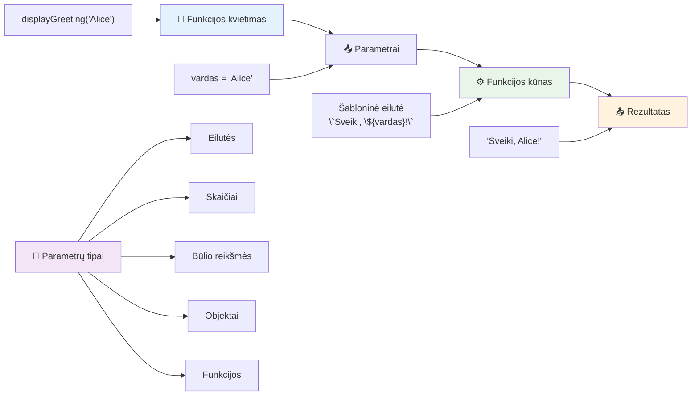
## Numatytoji reikšmė

O kas, jei norime, kad kai kurie parametrai būtų neprivalomi? Štai čia praverčia numatytosios reikšmės!

Tarkime, norime, kad žmonės galėtų pritaikyti pasisveikinimo žodį, bet jei jo nenurodys, naudokime „Hello“ kaip atsarginę vertę. Galite nustatyti numatytąsias reikšmes naudodami lygybės ženklą, kaip kintamajam:

```javascript
function displayGreeting(name, salutation='Hello') {
  console.log(`${salutation}, ${name}`);
}
```

Čia `name` dar vis reikalingas, tačiau `salutation` turi atsarginę vertę `'Hello'`, jei niekas nepateikia kito pasisveikinimo žodžio.

Dabar galime iškviesti funkciją dviem būdais:

```javascript
displayGreeting('Christopher');
// rodo "Sveikas, Christopher"

displayGreeting('Christopher', 'Hi');
// rodo "Labas, Christopher"
```

Pirmuoju atveju JavaScript naudoja numatytąjį „Hello“, nes nenurodėme pasisveikinimo žodžio. Antruoju atveju jis naudoja mūsų pasirinktą „Hi“. Šis lankstumas leidžia funkcijoms prisitaikyti prie skirtingų situacijų.

### 🎛️ **Parametrų įvaldymo patikra: funkcijų lankstumas**

**Patikrinkite savąjį parametrų supratimą:**
- Kuo skiriasi parametras ir argumentas?
- Kodėl numatytosios reikšmės svarbios realiame programavime?
- Ar galite numatyti, kas nutiks, jei perduosite daugiau argumentų nei parametrų?

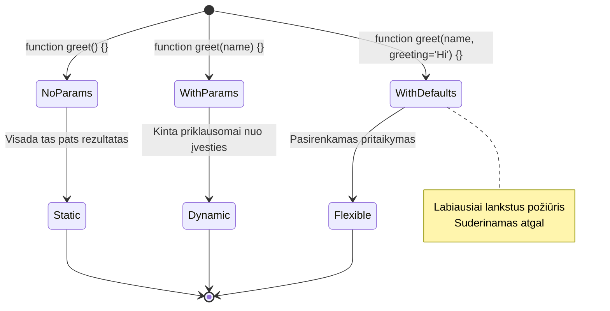
> **Profesionali pastaba**: numatytieji parametrai daro funkcijas patogesnes vartotojui. Vartotojai gali greitai pradėti naudotis su sveiku protu pagrįstomis reikšmėmis, bet vis tiek gali pritaikyti pagal poreikį!

## Grąžinamosios reikšmės

Mūsų funkcijos iki šiol tik spausdino pranešimus į konsolę, bet ką daryti, jei norite, kad funkcija apskaičiuotų kažką ir grąžintų rezultatą?

Čia praverčia **grąžinamosios reikšmės**. Vietoj to, kad tiesiog kažką rodytų, funkcija gali grąžinti reikšmę, kurią galite priskirti kintamajam arba naudoti kitose kodo vietose.

Norėdami grąžinti reikšmę, naudokite raktažodį `return` ir po jo parašykite, ką norite grąžinti:

```javascript
return myVariable;
```

Svarbu žinoti: kai funkcija pasiekia `return` sakinį, ji iš karto sustoja ir grąžina tą reikšmę tam, kuris ją pašaukė.

Pakeiskime mūsų pasisveikinimo funkciją, kad ji grąžintų žinutę, o ne spausdintų ją:

```javascript
function createGreetingMessage(name) {
  const message = `Hello, ${name}`;
  return message;
}
```

Dabar, vietoj to, kad atspausdintų pasisveikinimą, ši funkcija sukuria žinutę ir perduoda ją mums.

Norėdami naudoti grąžintą reikšmę, galite ją priskirti kintamajam, kaip ir bet kokią kitą vertę:

```javascript
const greetingMessage = createGreetingMessage('Christopher');
```

Dabar `greetingMessage` laikys „Hello, Christopher“ ir galime ją naudoti bet kur programoje – parodyti tinklalapyje, įtraukti el. laiške ar perduoti kitai funkcijai.

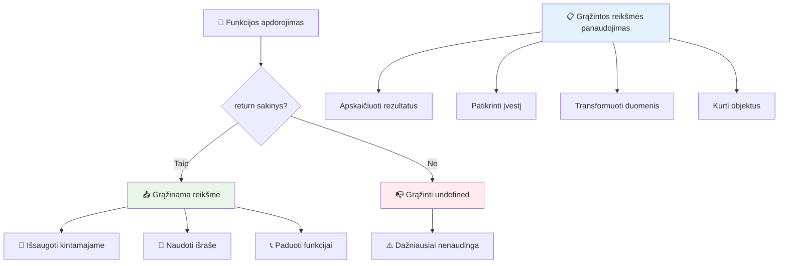
### 🔄 **Grąžinamųjų reikšmių patikra: gavimas atgal**

**Įvertinkite supratimą apie grąžinamas reikšmes:**
- Kas nutinka kodui po `return` sakinio funkcijoje?
- Kodėl grąžinti reikšmes dažnai yra geriau nei tiesiog atspausdinti konsolėje?
- Ar funkcija gali grąžinti skirtingų tipų reikšmes (eilutę, skaičių, loginę reikšmę)?

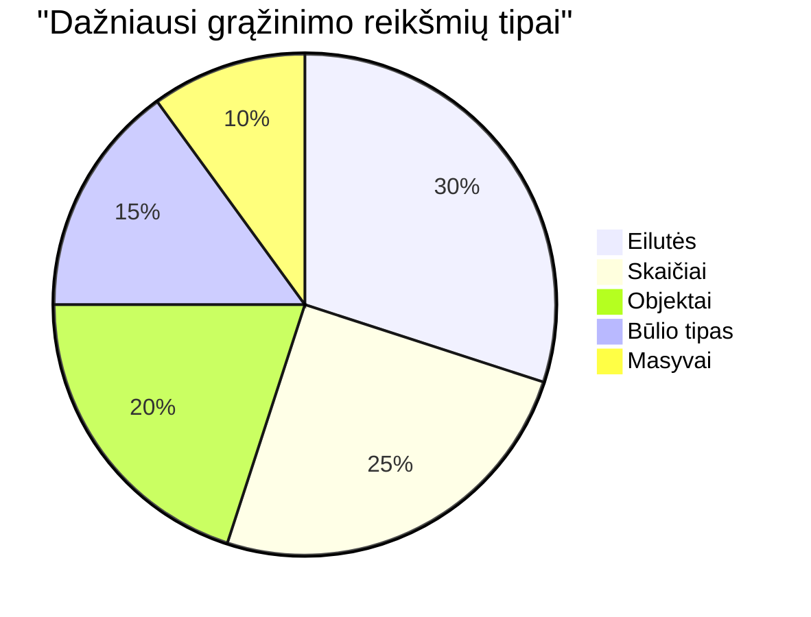
> **Svarbi įžvalga**: funkcijos, kurios grąžina reikšmes, yra lankstesnės, nes tas, kas jas kviečia, nusprendžia, ką daryti su rezultatu. Tai daro jūsų kodą moduliarią ir pakartotinai naudojamą!

## Funkcijos kaip parametrų perdavimas funkcijoms

Funkcijos gali būti perduodamos kaip parametrai kitoms funkcijoms. Nors ši sąvoka iš pradžių gali pasirodyti sudėtinga, tai galinga funkcija, leidžianti kurti lankstų programavimo stilių.

Šis modelis labai dažnas, kai norima pasakyti „kai kas nors įvyksta, padaryk šį kitą dalyką“. Pavyzdžiui, „kai laikmatis pasibaigia, paleisk šį kodą“ arba „kai vartotojas spaudžia mygtuką, iškviesk šią funkciją“.

Pažiūrėkime į `setTimeout`, kuri yra integruota funkcija, kuri laukia tam tikrą laiką ir tada vykdo kodą. Turime pasakyti, ką vykdyti – puikus atvejis perduoti funkciją!

Išbandykite šį kodą – po 3 sekundžių pamatysite pranešimą:

```javascript
function displayDone() {
  console.log('3 seconds has elapsed');
}
// laikmačio reikšmė yra milisekundėmis
setTimeout(displayDone, 3000);
```

Atkreipkite dėmesį, kaip perduodame `displayDone` (be skliaustų) į `setTimeout`. Mes patys nekviečiame funkcijos – perduodame ją `setTimeout` ir sakome „iškviesk tai po 3 sekundžių“.

### Anoniminės funkcijos

Kartais jums reikia funkcijos tik vienai užduočiai ir nenorite suteikti jai pavadinimo. Pagalvokite – jei naudosite funkciją tik vieną kartą, kam apkrauti kodą papildomu vardu?

JavaScript leidžia kurti **anoniminias funkcijas** – funkcijas be pavadinimo, kurias galite apibrėžti tiesiai ten, kur jų reikia.

Štai kaip galime perrašyti mūsų laikmačio pavyzdį naudodami anoniminę funkciją:

```javascript
setTimeout(function() {
  console.log('3 seconds has elapsed');
}, 3000);
```

Tai pasiekia tą patį rezultatą, bet funkcija yra apibrėžta tiesiai `setTimeout` kvietime, nereikia atskiro deklaravimo.

### Trumpųjų rodyklių (fat arrow) funkcijos

Šiuolaikinis JavaScript turi dar trumpesnį būdą rašyti funkcijas, vadinamas **rodyklinėmis funkcijomis (arrow functions)**. Jos naudoja `=>` (atrodo kaip rodyklė – supratote?) ir yra labai populiarios tarp programuotojų.

Rodyklinės funkcijos leidžia praleisti raktažodį `function` ir rašyti trumpesnį kodą.

Štai mūsų laikmačio pavyzdys naudojant rodyklinę funkciją:

```javascript
setTimeout(() => {
  console.log('3 seconds has elapsed');
}, 3000);
```

Skliaustai `()` – tai vieta, kur būtų parametrai (šiuo atveju tušti), po jų eina rodyklė `=>`, o po jos – funkcijos turinys garbanotose kabutėse. Tai suteikia tą pačią funkcionalumą su trumpesne sintakse.

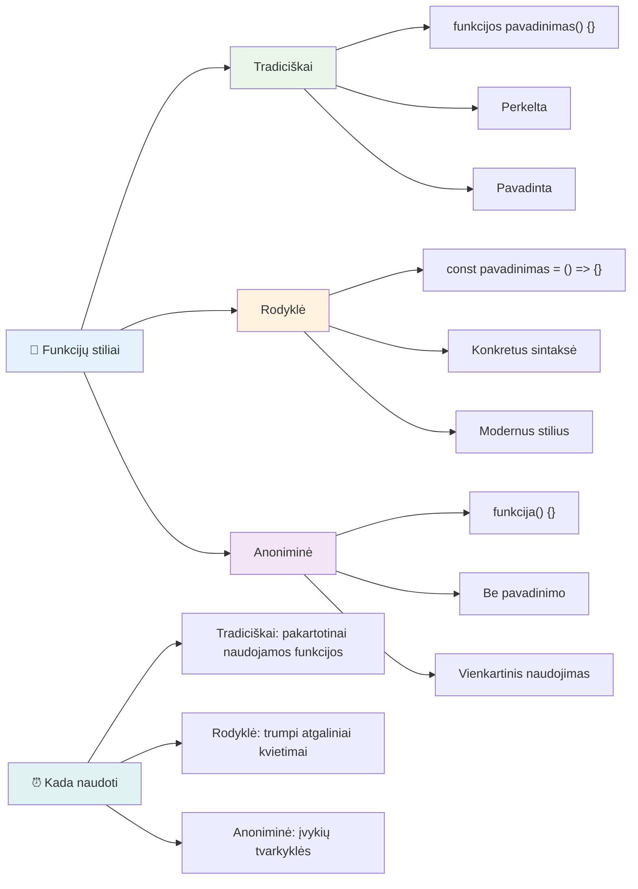
### Kada naudoti kurią strategiją

Kada verta rinktis kurią? Praktinė taisyklė: jeigu funkciją naudositės kelis kartus, suteikite jai pavadinimą ir apibrėžkite atskirai. Jeigu funkcija skirta vienai specifinei užduočiai, apsvarstykite anoniminę funkciją. Abu – tiek rodyklinės, tiek tradicinės funkcijos – yra tinkamos, nors rodyklinės funkcijos vyrauja šiuolaikiniame JavaScript kode.

### 🎨 **Funkcijų stiliaus patikra: tinkamos sintaksės pasirinkimas**

**Patikrinkite savo sintaksės supratimą:**
- Kada galėtumėte rinktis rodyklines funkcijas prieš tradicinę sintaksę?
- Koks anoniminių funkcijų pagrindinis privalumas?
- Ar galite įsivaizduoti situaciją, kur varduota funkcija būtų geresnė už anoniminę?

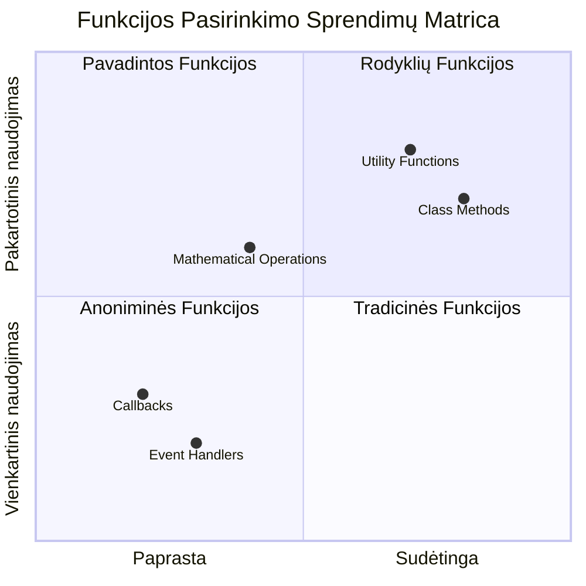
> **Šiuolaikinė tendencija**: rodykliniai funkcijos tampa daugelio programuotojų pagrindiniu pasirinkimu dėl savo trumpumos, bet tradicinės funkcijos vis dar turi savo vietą!

---


## 🚀 Iššūkis

Ar galite vienu sakiniu apibrėžti skirtumą tarp funkcijų ir metodų? Išbandykite!

## GitHub Copilot agento iššūkis 🚀

Naudokite Agent režimą, kad įvykdytumėte šį iššūkį:

**Aprašymas:** Sukurkite matematikos funkcijų pagalbinę biblioteką, kuri demonstruoja įvairias šiame pamokoje apžvelgtas funkcijų sąvokas, įskaitant parametrus, numatytąsias reikšmes, grąžinamas reikšmes ir rodyklines funkcijas.

**Užduotis:** Sukurkite JavaScript failą `mathUtils.js`, kuriame būtų šios funkcijos:
1. Funkcija `add`, kuri priima du parametrus ir grąžina jų sumą
2. Funkcija `multiply` su numatytosiomis parametrų reikšmėmis (antras parametras numatytas lygiu 1)
3. Rodyklinė funkcija `square`, kuri priima skaičių ir grąžina jo kvadratą
4. Funkcija `calculate`, kuri priima kitą funkciją kaip parametrą ir du skaičius, tada taiko funkciją tiems skaičiams
5. Demonstracija, kaip kiekviena funkcija kviečiama su tinkamais testiniais atvejais

Daugiau apie [agentų režimą](https://code.visualstudio.com/blogs/2025/02/24/introducing-copilot-agent-mode) skaitykite čia.

## Po paskaitos testas
[Po paskaitos testas](https://ff-quizzes.netlify.app)

## Peržiūra ir savarankiškas mokymasis

Vertėtų [pažvelgti šiek tiek giliau apie rodyklines funkcijas](https://developer.mozilla.org/docs/Web/JavaScript/Reference/Functions/Arrow_functions), nes jos vis dažniau naudojamos kodų bazėse. Praktikuokite rašyti funkciją ir tada perrašykite ją šia sintakse.

## Namų darbai

[Žaidžiame su funkcijomis](assignment.md)

---

## 🧰 **Jūsų JavaScript funkcijų įrankių rinkinio santrauka**

```mermaid
graph TD
    A["🎯 JavaScript funkcijos"] --> B["📋 Funkcijos deklaracija"]
    A --> C["📥 Parametrai"]
    A --> D["📤 Grąžinamos vertės"]
    A --> E["🎨 Moderni sintaksė"]
    
    B --> B1["function name() {}"]
    B --> B2["Aprašomas pavadinimas"]
    B --> B3["Pakartotinai naudojami kodo blokai"]
    
    C --> C1["Įvesties duomenys"]
    C --> C2["Numatytosios reikšmės"]
    C --> C3["Daugybė parametrų"]
    
    D --> D1["return sakinys"]
    D --> D2["Funkcijos pabaiga"]
    D --> D3["Perduoti duomenis atgal"]
    
    E --> E1["Rodyklinės funkcijos: () =>"]
    E --> E2["Anoniminės funkcijos"]
    E --> E3["Funkcijos aukštesniojo lygio"]
    
    F["⚡ Pagrindinės naudos"] --> F1["Kodo pakartotinis naudojimas"]
    F --> F2["Geresnė organizacija"]
    F --> F3["Lengvesnis testavimas"]
    F --> F4["Modulinis dizainas"]
    
    style A fill:#e3f2fd
    style B fill:#e8f5e8
    style C fill:#fff3e0
    style D fill:#f3e5f5
    style E fill:#e0f2f1
    style F fill:#fce4ec
```
---

## 🚀 Jūsų JavaScript funkcijų įvaldymo laiko juosta

### ⚡ **Ką galite padaryti per kitą 5 minutes**
- [ ] Parašyti paprastą funkciją, grąžinančią jūsų mėgstamiausią skaičių
- [ ] Sukurti funkciją su dviem parametrais, kuri juos sudeda
- [ ] Išbandykite tradicinės funkcijos konvertavimą į rodyklių funkcijų sintaksę  
- [ ] Praktikuokite užduotį: paaiškinkite skirtumą tarp funkcijų ir metodų  

### 🎯 **Ką galite pasiekti per šią valandą**  
- [ ] Užbaikite pamokos pabaigos testą ir peržiūrėkite painias sąvokas  
- [ ] Sukurkite matematikos įrankių biblioteką iš GitHub Copilot iššūkio  
- [ ] Sukurkite funkciją, kuri naudoja kitą funkciją kaip parametrą  
- [ ] Praktikuokite rašyti funkcijas su numatytosiomis reikšmėmis  
- [ ] Eksperimentuokite su šablonų literaliais funkcijų grąžinimo reikšmėse  

### 📅 **Jūsų savaitės trukmės funkcijų įvaldymas**  
- [ ] Kūrybiškai atlikite užduotį „Smagiai su funkcijomis“  
- [ ] Pertvarkykite kai kurį pasikartojantį kodą į pakartotinai naudojamas funkcijas  
- [ ] Sukurkite mažą skaičiuotuvą naudodami tik funkcijas (be globalių kintamųjų)  
- [ ] Praktikuokite rodyklių funkcijas su masyvo metodais kaip `map()` ir `filter()`  
- [ ] Sudarykite naudingų funkcijų rinkinį dažnai pasitaikantiems darbams  
- [ ] Išstudijuokite aukštesnio lygio funkcijas ir funkcinio programavimo koncepcijas  

### 🌟 **Jūsų mėnesio trukmės transformacija**  
- [ ] Įvaldykite pažangias funkcijų sąvokas kaip uždarymus ir apimtį  
- [ ] Sukurkite projektą, kuris daugiausia remiasi funkcijų sudėtimi  
- [ ] Prisidėkite prie atviro kodo gerindami funkcijų dokumentaciją  
- [ ] Mokykite kitus apie funkcijas ir skirtingus sintaksės stilius  
- [ ] Tyrinėkite funkcinio programavimo paradigmas JavaScripte  
- [ ] Sukurkite asmeninę pakartotinai naudojamų funkcijų biblioteką būsimiesiems projektams  

### 🏆 **Galutinis funkcijų čempiono patikrinimas**  

**Švęskite savo funkcijų įvaldymą:**  
- Kokia naudingiausia funkcija, kurią iki šiol sukūrėte?  
- Kaip funkcijų mokymasis pakeitė jūsų požiūrį į kodo organizavimą?  
- Kuria funkcijų sintakse teikiate pirmenybę ir kodėl?  
- Kokią realaus pasaulio problemą išspręstumėte rašydami funkciją?  

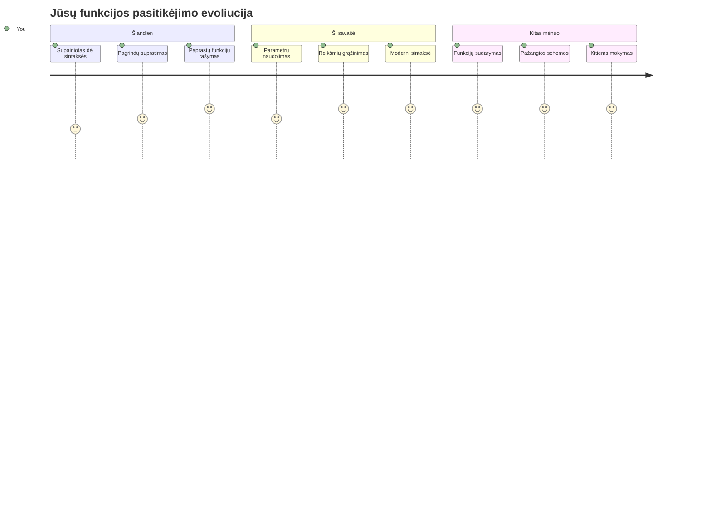
> 🎉 **Jūs įvaldėte vieną galingiausių programavimo koncepcijų!** Funkcijos yra pagrindiniai didesnių programų statybiniai blokai. Kiekviena programa, kurią kursite, naudos funkcijas kodui organizuoti, pakartotinai naudoti ir struktūruoti. Dabar suprantate, kaip logiką supakuoti į pakartotinai naudojamus komponentus, kas jus daro efektyvesniu ir rezultatyvesniu programuotoju. Sveiki modularaus programavimo pasaulyje! 🚀

---

<!-- CO-OP TRANSLATOR DISCLAIMER START -->
**Atsakomybės apribojimas**:
Šis dokumentas buvo išverstas naudojant dirbtinio intelekto vertimo paslaugą [Co-op Translator](https://github.com/Azure/co-op-translator). Nors mes siekiame tikslumo, prašome atkreipti dėmesį, kad automatiniai vertimai gali turėti klaidų ar netikslumų. Originalus dokumentas jo gimtąja kalba turėtų būti laikomas autoritetingu šaltiniu. Svarbiai informacijai rekomenduojamas profesionalus vertimas žmogaus. Mes neatsakome už klaidingą supratimą ar neteisingą interpretaciją, kilusią dėl šio vertimo naudojimo.
<!-- CO-OP TRANSLATOR DISCLAIMER END -->