<!--
CO_OP_TRANSLATOR_METADATA:
{
  "original_hash": "c688385d15dd3645e924ea0ffee8967f",
  "translation_date": "2026-01-07T11:11:24+00:00",
  "source_file": "2-js-basics/3-making-decisions/README.md",
  "language_code": "lt"
}
-->
# JavaScript pagrindai: sprendimų priėmimas

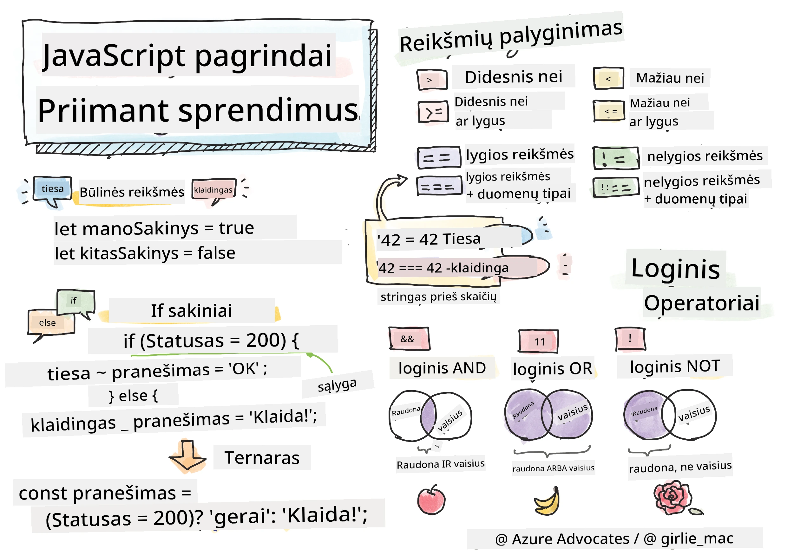

> Sketchnote autoriaus [Tomomi Imura](https://twitter.com/girlie_mac)

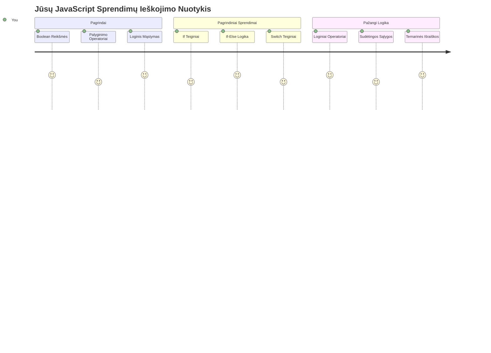
Ar kada nors susimąstėte, kaip programos priima protingus sprendimus? Pavyzdžiui, kaip navigacijos sistema pasirenka greičiausią maršrutą arba kaip termostatas nusprendžia, kada įjungti šildymą? Tai yra pagrindinė sprendimų priėmimo programavime sąvoka.

Kaip Charlesas Babbage'as savo Analitinį variklį sukūrė taip, kad jis vykdytų skirtingas veiksmų sekas pagal sąlygas, taip ir šiuolaikinės JavaScript programos turi priimti sprendimus pagal įvairias aplinkybes. Ši gebėjimas šakotis ir priimti sprendimus yra tai, kas paverčia statinį kodą į jautrias, protingas programas.

Šiame pamokoje išmoksite, kaip įgyvendinti sąlyginę logiką savo programose. Tyrinėsime sąlygines sakinius, palyginimo operatorius ir loginės išraiškas, kurios leidžia jūsų kodui įvertinti situacijas ir tinkamai sureaguoti.

## Priešpamokos testas

[Priešpamokos testas](https://ff-quizzes.netlify.app/web/quiz/11)

Gebėjimas priimti sprendimus ir valdyti programos srautą yra esminė programavimo dalis. Šioje dalyje aptariama, kaip valdyti savo JavaScript programų vykdymo kelią naudojant Boolean reikšmes ir sąlyginę logiką.

[](https://youtube.com/watch?v=SxTp8j-fMMY "Sprendimų priėmimas")

> 🎥 Spustelėkite viršuje esantį paveikslėlį, kad peržiūrėtumėte video apie sprendimų priėmimą.

> Šią pamoką galite studijuoti [Microsoft Learn](https://docs.microsoft.com/learn/modules/web-development-101-if-else/?WT.mc_id=academic-77807-sagibbon)!

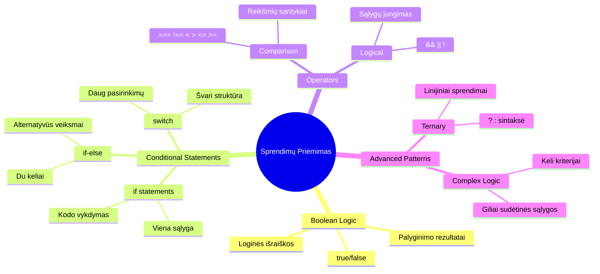
## Trumpas Boole'io reikšmių prisiminimas

Prieš gilindamiesi į sprendimų priėmimą, prisiminkime Boolean reikšmes iš ankstesnės pamokos. Jos pavadintos matematikos George'o Boole'o garbei ir reiškia dvejopą būseną – arba `true`, arba `false`. Nėra jokios neapibrėžtumo, jokios vidurinės būsenos.

Šios dvejopos reikšmės sudaro visos kompiuterinės logikos pagrindą. Kiekvienas sprendimas, kurį priima jūsų programa, galiausiai sumažėja iki Boolean įvertinimo.

Boolean kintamųjų kūrimas yra paprastas:

```javascript
let myTrueBool = true;
let myFalseBool = false;
```

Tai sukuria du kintamuosius su aiškiomis Boolean reikšmėmis.

✅ Boolean vardai kilę nuo anglų matematikos, filosofijos ir logikos mokslininko George'o Boole'o (1815–1864).

## Palyginimo operatoriai ir Boolean

Praktikoje retai kada Boolean reikšmės nustatomos rankiniu būdu. Vietoje to, jos generuojamos vertinant sąlygas: „Ar šis skaičius didesnis už tą?“ arba „Ar šios reikšmės lygios?“

Palyginimo operatoriai leidžia šias vertinimo operacijas atlikti. Jie palygina reikšmes ir grąžina Boolean rezultatus pagal operandų santykį.

| Simbolis | Aprašymas                                                                                                                                                   | Pavyzdys           |
| -------- | ----------------------------------------------------------------------------------------------------------------------------------------------------------- | ------------------ |
| `<`      | **Mažiau nei**: Palygina dvi reikšmes ir grąžina `true` Boolean tipo, jei reikšmė kairėje yra mažesnė už dešinę                                         | `5 < 6 // true`    |
| `<=`     | **Mažiau arba lygu**: Palygina dvi reikšmes ir grąžina `true` Boolean tipo, jei reikšmė kairėje yra mažesnė arba lygi dešinei                            | `5 <= 6 // true`   |
| `>`      | **Daugiau nei**: Palygina dvi reikšmes ir grąžina `true` Boolean tipo, jei reikšmė kairėje yra didesnė už dešinę                                          | `5 > 6 // false`   |
| `>=`     | **Daugiau arba lygu**: Palygina dvi reikšmes ir grąžina `true` Boolean tipo, jei reikšmė kairėje yra didesnė arba lygi dešinei                           | `5 >= 6 // false`  |
| `===`    | **Griežtas lygybės tikrinimas**: Palygina dvi reikšmes ir grąžina `true` Boolean tipo, jei reikšmės kairėje ir dešinėje yra lygios IR yra tos pačios rūšies | `5 === 6 // false` |
| `!==`    | **Nelygybė**: Palygina dvi reikšmes ir grąžina priešingą Boolean reikšmę nei griežto lygybės operatorius                                                    | `5 !== 6 // true`  |

✅ Patikrinkite savo žinias rašydami palyginimus naršyklės konsolėje. Ar kuris nors rezultatas jus nustebino?

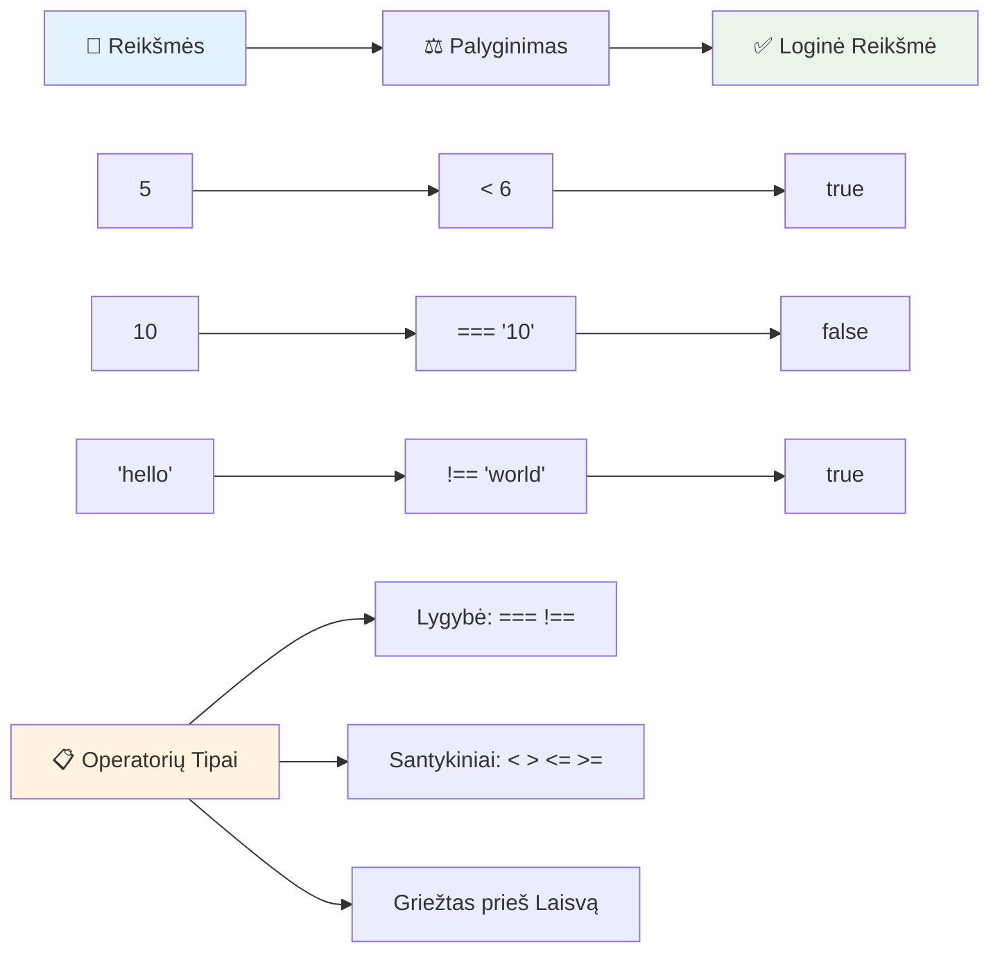
### 🧠 **Palyginimo gebėjimų patikra: Boolean logikos supratimas**

**Išbandykite savo palyginimo supratimą:**
- Kodėl manote, kad `===` (griežtas lygybės tikrinimas) dažniausiai yra pageidautinas prieš `==` (laisvą lygybės tikrinimą)?
- Ar galite nuspėti, ką grąžins `5 === '5'`? O kaip `5 == '5'`?
- Kuo skiriasi `!==` ir `!=`?

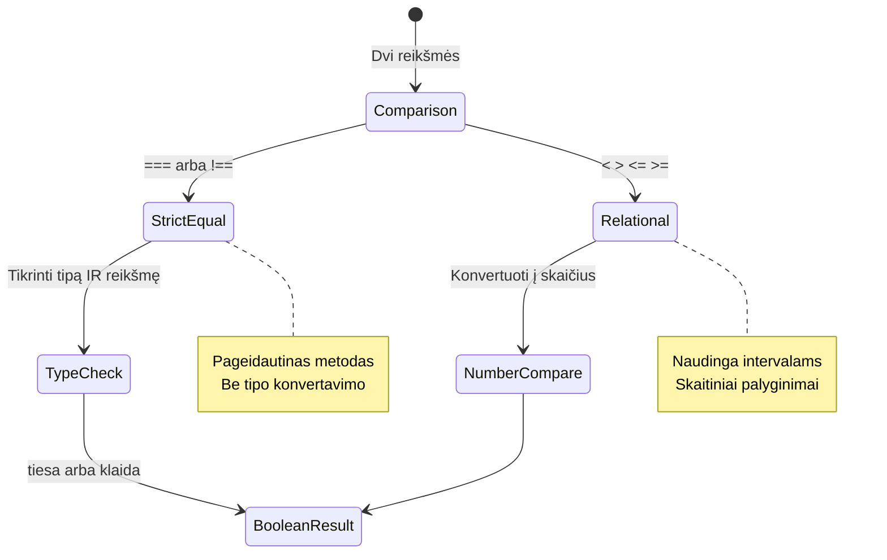
> **Profesionalus patarimas**: Visada naudokite `===` ir `!==` lyginimams, nebent konkrečiai reikia tipų konvertavimo. Tai apsaugos nuo netikėto elgesio!

## If sakinys

`if` sakinys yra tarsi klausimas jūsų kode. „Jei ši sąlyga tiesa, tada atlik tai.“ Tai tikriausiai svarbiausias įrankis sprendimams priimti JavaScripte.

Štai kaip tai veikia:

```javascript
if (condition) {
  // Sąlyga yra teisinga. Kode šiame bloke bus vykdoma.
}
```

Sąlyga įrašoma tarp skliaustų, ir jei ji yra `true`, JavaScript vykdo kodą viduje garbanotųjų skliaustų. Jei ji yra `false`, JavaScript praleidžia tą visą bloką.

Dažnai naudojate palyginimo operatorius, kad sukurtumėte šias sąlygas. Pažiūrėkime praktinį pavyzdį:

```javascript
let currentMoney = 1000;
let laptopPrice = 800;

if (currentMoney >= laptopPrice) {
  // Sąlyga yra teisinga. Šiame bloke esantis kodas bus vykdomas.
  console.log("Getting a new laptop!");
}
```

Kadangi `1000 >= 800` įvertinama kaip `true`, kodas bloko viduje vykdomas ir konsolėje atsiranda pranešimas „Getting a new laptop!“.

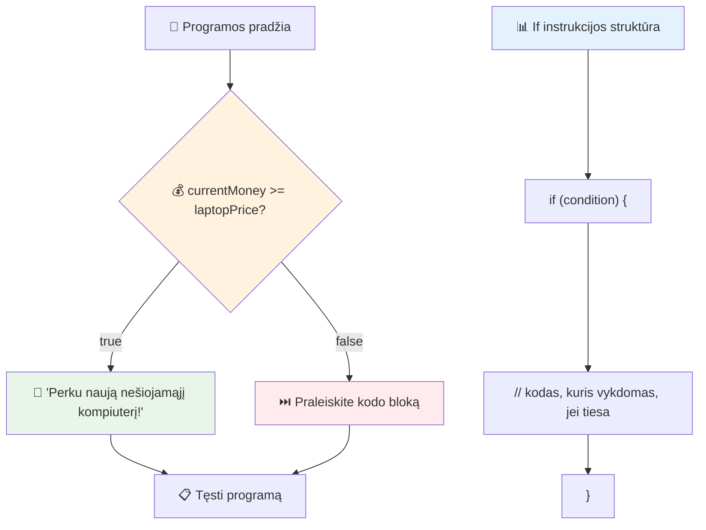
## If..Else sakinys

Bet kas jei norite, kad programa atliktų kažką kito, kai sąlyga yra netiesa? Čia praverčia `else` – lyg atsarginis planas.

`else` sakinys leidžia pasakyti „jei ši sąlyga nėra tiesa, tada daryk ką nors kitą.“

```javascript
let currentMoney = 500;
let laptopPrice = 800;

if (currentMoney >= laptopPrice) {
  // Sąlyga yra teisinga. Šio bloko kodas bus vykdomas.
  console.log("Getting a new laptop!");
} else {
  // Sąlyga yra neteisinga. Šio bloko kodas bus vykdomas.
  console.log("Can't afford a new laptop, yet!");
}
```

Kadangi `500 >= 800` yra `false`, JavaScript praleidžia pirmąjį bloką ir vykdo `else` bloką. Konsolėje matysite „Can't afford a new laptop, yet!“.

✅ Išbandykite šį ir toliau pateiktą kodą naršyklės konsolėje. Pakeiskite kintamųjų currentMoney ir laptopPrice reikšmes, kad pakeistumėte `console.log()` išvestį.

### 🎯 **If-Else logikos patikra: Šakoti keliai**

**Įvertinkite sąlyginės logikos supratimą:**
- Kas nutiks, jei `currentMoney` tiksliai lygus `laptopPrice`?
- Ar galite įsivaizduoti realią situaciją, kur if-else logika būtų naudinga?
- Kaip galėtumėte išplėsti tai kelioms kainų riboms apdoroti?

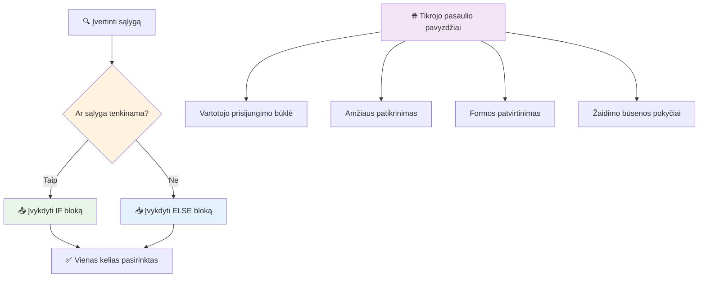
> **Svarbi įžvalga**: If-else užtikrina, kad pasirenkamas tik vienas kelias. Tai garantuoja, kad jūsų programa visada turi atsakymą bet kuriai sąlygai!

## Switch sakinys

Kartais reikia palyginti vieną reikšmę su keliomis galimybėmis. Nors galėtumėte naudoti keletą sujungtų `if..else` sakinių, toks požiūris tampa nepatogus. `switch` sakinys suteikia tvarkingesnę struktūrą kelių atskirų reikšmių apdorojimui.

Ši sąvoka primena mechaninius jungiklius, naudojamus ankstyvuosiuose telefonų centruose – viena įvesties reikšmė nulemia, kurį konkretų kelią vykdymas pasirinks.

```javascript
switch (expression) {
  case x:
    // kodo blokas
    break;
  case y:
    // kodo blokas
    break;
  default:
    // kodo blokas
}
```

Štai kaip jis struktūruojamas:
- JavaScript įvertina išraišką vieną kartą
- Ieško kiekvieno `case`, kad rastų atitikimą
- Radęs atitikimą, vykdo tą kodo bloką
- `break` nurodo JavaScript sustoti ir išeiti iš switch
- Jei jokie case neatitinka, vykdo `default` bloką (jei jis yra)

```javascript
// Programa, naudojanti switch sakinį savaitės dienai nustatyti
let dayNumber = 2;
let dayName;

switch (dayNumber) {
  case 1:
    dayName = "Monday";
    break;
  case 2:
    dayName = "Tuesday";
    break;
  case 3:
    dayName = "Wednesday";
    break;
  default:
    dayName = "Unknown day";
    break;
}
console.log(`Today is ${dayName}`);
```

Šiame pavyzdyje JavaScript mato, kad `dayNumber` yra `2`, randa atitinkantį `case 2`, priskiria `dayName` reikšmę „Tuesday“ ir išeina iš switch. Rezultatas? Konsolėje atsiranda „Today is Tuesday“.

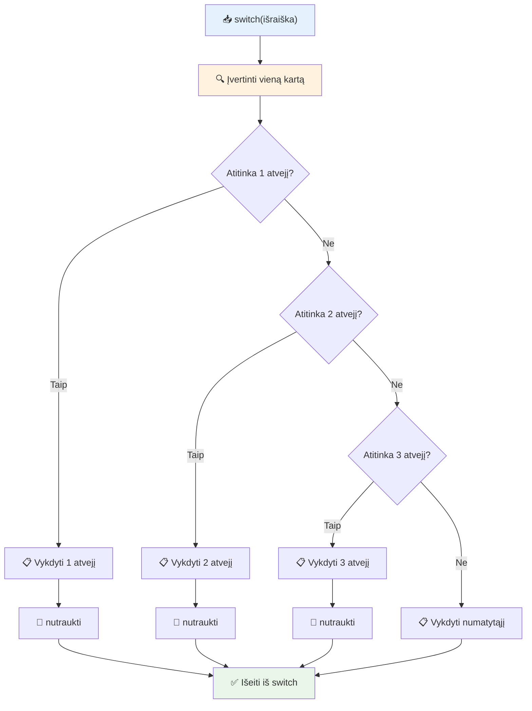
✅ Išbandykite šį ir tolesnį kodą naršyklės konsolėje. Pakeiskite kintamojo a reikšmę, kad pakeistumėte `console.log()` išvestį.

### 🔄 **Switch sakinio meistriškumo patikra: Kelios pasirinktys**

**Testuokite switch supratimą:**
- Kas nutiks, jei pamiršite `break` sakinį?
- Kada naudotumėte `switch` vietoje kelių `if-else` sakinių?
- Kodėl `default` atvejis yra naudingas net jei manote, kad apėmėte visas galimybes?

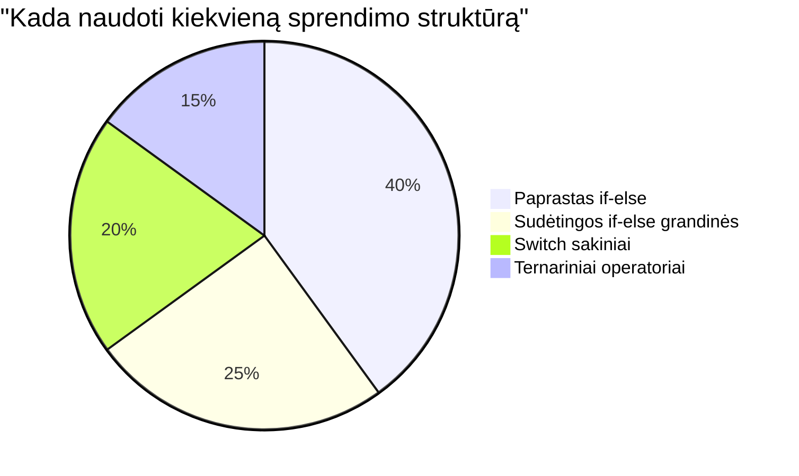
> **Geriausia praktika**: Naudokite `switch`, kai palyginate vieną kintamąjį su keliomis konkrečiomis reikšmėmis. Naudokite `if-else` diapazonų tikrinimui arba sudėtingoms sąlygoms!

## Loginiai operatoriai ir Boole'ai

Sudėtingi sprendimai dažnai reikalauja vienu metu įvertinti kelias sąlygas. Kaip Boolean algebra leidžia matematikams jungti loginės išraiškas, taip programavimas suteikia loginės operatorius kelioms Boolean sąlygoms sujungti.

Šie operatoriai leidžia sudėtingą sąlyginę logiką kurti sujungiant paprastus tiesa/netiesa vertinimus.

| Simbolis | Aprašymas                                                                                     | Pavyzdys                                                                 |
| -------- | --------------------------------------------------------------------------------------------- | ----------------------------------------------------------------------- |
| `&&`     | **Loginis IR**: Palygina dvi Boolean išraiškas. Grąžina true **tik** jei abi pusės yra tiesa   | `(5 > 3) && (5 < 10) // Abi pusės tiesa. Grąžina true` |
| `\|\|`   | **Loginis ARBA**: Palygina dvi Boolean išraiškas. Grąžina true jei bent viena pusė yra tiesa  | `(5 > 10) \|\| (5 < 10) // Viena pusė klaidinga, kita tiesa. Grąžina true` |
| `!`      | **Loginis NE**: Grąžina priešingą Boolean reikšmę                                             | `!(5 > 10) // 5 nėra didesnis už 10, taigi "!" tai paverčia į true`    |

Šie operatoriai leidžia sujungti sąlygas naudingu būdu:
- IR (`&&`) reiškia, kad abi sąlygos turi būti tiesos
- ARBA (`||`) reiškia, kad bent viena sąlyga turi būti tiesos  
- NE (`!`) pakeičia tiesą į netiesą (ir atvirkščiai)

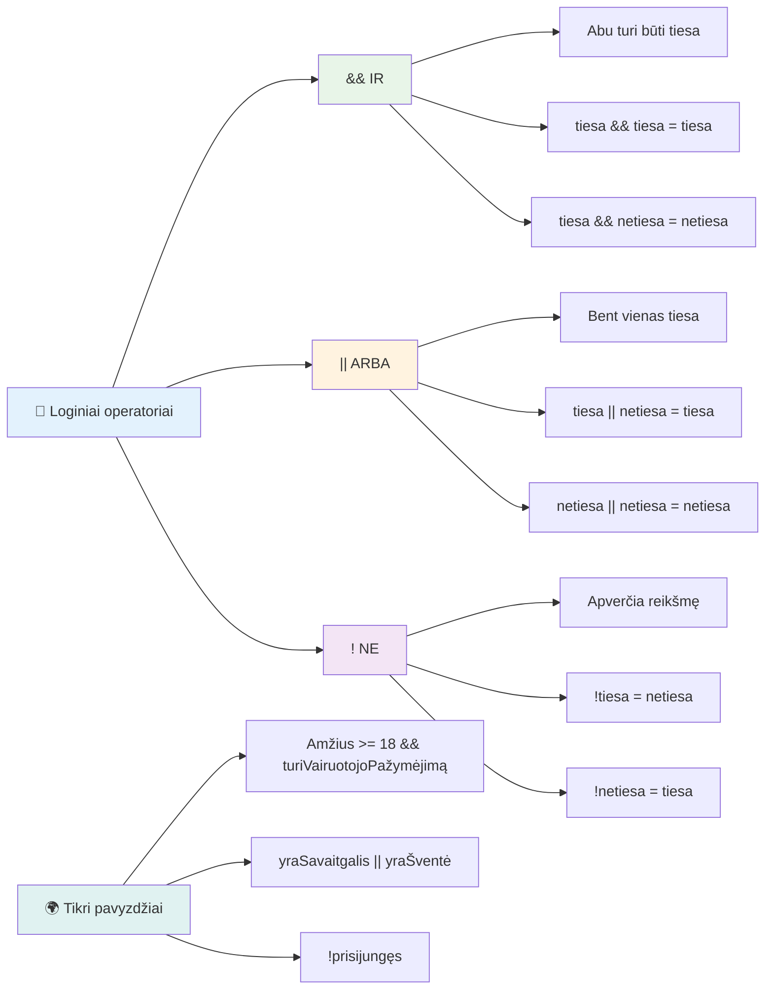
## Sąlygos ir sprendimai su loginiais operatoriais

Pažiūrėkime šiuos loginės operacijas praktiškai:

```javascript
let currentMoney = 600;
let laptopPrice = 800;
let laptopDiscountPrice = laptopPrice - (laptopPrice * 0.2); // Nešiojamojo kompiuterio kaina su 20 procentų nuolaida

if (currentMoney >= laptopPrice || currentMoney >= laptopDiscountPrice) {
  // Sąlyga yra teisinga. Šiame bloke esantis kodas bus vykdomas.
  console.log("Getting a new laptop!");
} else {
  // Sąlyga yra klaidinga. Šiame bloke esantis kodas bus vykdomas.
  console.log("Can't afford a new laptop, yet!");
}
```

Šiame pavyzdyje: apskaičiuojame 20% nuolaidos kainą (640), tada vertiname, ar turimi pinigai padengia pilną kainą ARBA nuolaidą. Kadangi 600 pasiekia nuolaidą (640), sąlyga įvertinama kaip tiesa.

### 🧮 **Loginiai operatoriai: sąlygų jungimas**

**Išbandykite loginės logikos supratimą:**
- Išraiškoje `A && B`, kas nutinka, jei A yra klaidinga? Ar B net tikrinama?
- Ar galite įsivaizduoti situaciją, kur jums reikėtų naudoti visus tris operatorius (&&, ||, !) kartu?
- Kuo skiriasi `!user.isActive` ir `user.isActive !== true`?

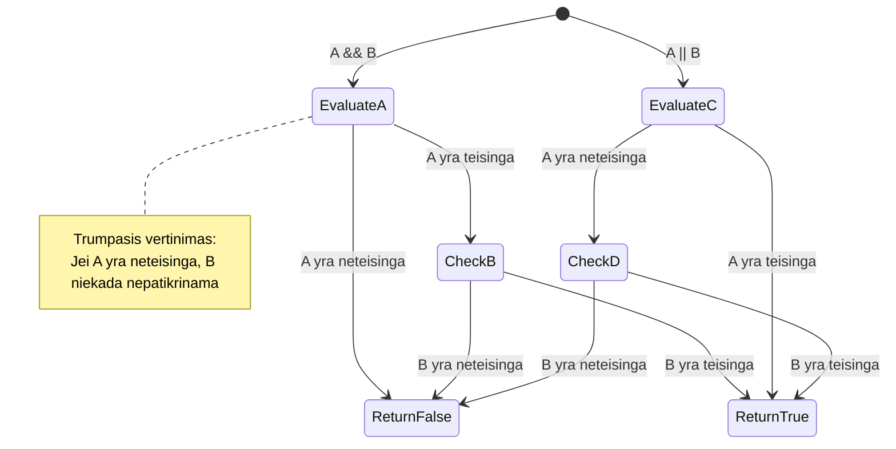
> **Veikimo patarimas**: JavaScript naudoja „trumpinimo vertinimą“ – išraiškoje `A && B`, jei A yra klaidinga, B net nėra vertinamas. Pasinaudokite tuo savo naudai!

### Neigimo operatorius

Kartais lengviau galvoti apie tai, kada kažkas NĖRA tiesa. Pavyzdžiui, vietoje klausimo „Ar vartotojas prisijungęs?“, galite klausti „Ar vartotojas NĖRA prisijungęs?“ Išsikirtimo ženklas (`!`) apverčia loginę reikšmę.

```javascript
if (!condition) {
  // vyksta, jei sąlyga yra klaidinga
} else {
  // vyksta, jei sąlyga yra teisinga
}
```

`!` operatorius tarsi sako „priešingai nei...“ – jei kažkas yra `true`, `!` paverčia jį į `false`, ir atvirkščiai.

### Ternarinės išraiškos

Paprastoms sąlyginiams priskyrimams JavaScript siūlo **ternarinį operatorių**. Ši koncentruota sintaksė leidžia parašyti sąlyginę išraišką vienoje eilutėje, naudinga kai reikia priskirti vieną iš dviejų reikšmių priklausomai nuo sąlygos.

```javascript
let variable = condition ? returnThisIfTrue : returnThisIfFalse;
```

Tai skaitosi kaip klausimas: „Ar ši sąlyga tiesa? Jei taip, naudok šią reikšmę. Jei ne, naudok tą reikšmę.“

Žemiau pateiktas konkretus pavyzdys:

```javascript
let firstNumber = 20;
let secondNumber = 10;
let biggestNumber = firstNumber > secondNumber ? firstNumber : secondNumber;
```

✅ Paskirkite minutę peržiūrėti šį kodą keletą kartų. Ar suprantate, kaip veikia šie operatoriai?

Tai reiškia: „Ar `firstNumber` didesnis už `secondNumber`? Jei taip, į `biggestNumber` įrašyk `firstNumber`. Jei ne, įrašyk `secondNumber`.“

Ternarinis operatorius yra trumpesnis būdas parašyti tradicinį `if..else` sakinį:

```javascript
let biggestNumber;
if (firstNumber > secondNumber) {
  biggestNumber = firstNumber;
} else {
  biggestNumber = secondNumber;
}
```

Abi priemonės duoda identiškus rezultatus. Ternarinis operatorius suteikia glaustumą, tuo tarpu tradicinis if-else kodas gali būti labiau suprantamas sudėtingoms sąlygoms.

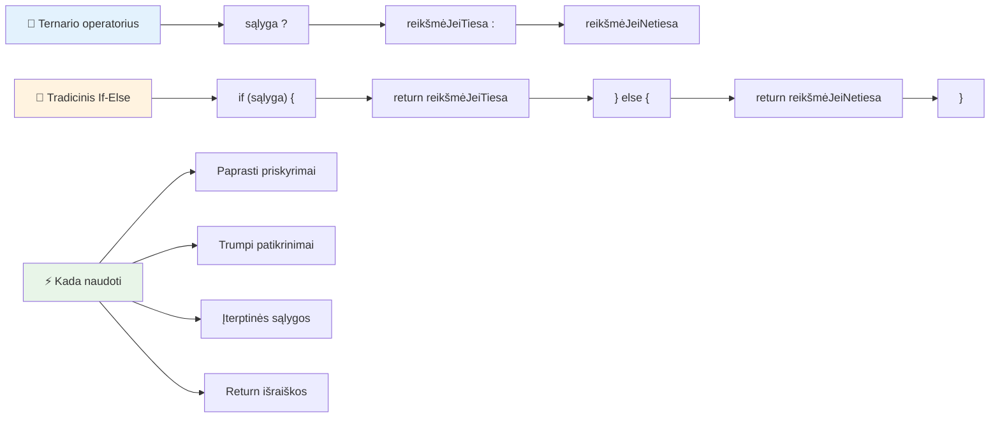
---


## 🚀 Iššūkis

Sukurkite programą, kuri pirmiausia parašyta naudojant loginius operatorius, o po to perrašykite ją naudodami ternarinę išraišką. Kuria sintakse verčiau naudojate?

---

## GitHub Copilot agento iššūkis 🚀

Naudokite Agento režimą, kad įgyvendintumėte šį iššūkį:

**Aprašymas:** Sukurkite išsamų pažymių skaičiuoklę, kuri demonstruotų kelias sprendimų priėmimo sąvokas iš šios pamokos, įskaitant if-else sakinius, switch sakinius, loginius operatorius ir ternarines išraiškas.

**Užduotis:** Parašykite JavaScript programą, kuri priima studento skaitinį rezultatą (0-100) ir nustato jų raidinį pažymį pagal šiuos kriterijus:
- A: 90-100
- B: 80-89  
- C: 70-79
- D: 60-69
- F: žemiau 60

Reikalavimai:
1. Naudokite if-else sakinį raidiniam pažymiui nustatyti
2. Naudokite loginį operatorių patikrinti, ar studentas išlaikė (balas >= 60) IR turi pagyrimus (balas >= 90)  
3. Naudokite switch sakinį, kad suteiktumėte konkrečią grįžtamąją informaciją kiekvienam raidiniam balui  
4. Naudokite ternarinį operatorių, norėdami nustatyti, ar studentas yra tinkamas kitam kursui (balas >= 70)  
5. Įtraukite įvesties tikrinimą, kad įsitikintumėte, jog balas yra nuo 0 iki 100  

Išbandykite savo programą su įvairiais balais, įskaitant kraštutinius atvejus, tokius kaip 59, 60, 89, 90, ir netinkamomis įvestimis.

Sužinokite daugiau apie [agent mode](https://code.visualstudio.com/blogs/2025/02/24/introducing-copilot-agent-mode) čia.


## Po paskaitos testas

[Po paskaitos testas](https://ff-quizzes.netlify.app/web/quiz/12)

## Peržiūra ir savarankiškas mokymasis

Skaitykite daugiau apie daugybę vartotojui prieinamų operatorių [MDN svetainėje](https://developer.mozilla.org/docs/Web/JavaScript/Reference/Operators).

Peržiūrėkite Josh Comeau nuostabų [operatorių žinyną](https://joshwcomeau.com/operator-lookup/)!

## Užduotis

[Operatoriai](assignment.md)

---

## 🧠 **Jūsų sprendimų priėmimo įrankių rinkinys – santrauka**

```mermaid
graph TD
    A["🎯 JavaScript Sprendimai"] --> B["🔍 Booleanų logika"]
    A --> C["📊 Sąlyginiai pareiškimai"]
    A --> D["🔗 Loginiai operatoriai"]
    A --> E["⚡ Pažangios schemos"]
    
    B --> B1["true/false reikšmės"]
    B --> B2["Lyginimo operatoriai"]
    B --> B3["Tikrumo sąvokos"]
    
    C --> C1["if pareiškimai"]
    C --> C2["if-else grandinės"]
    C --> C3["switch pareiškimai"]
    
    D --> D1["&& (IR)"]
    D --> D2["|| (ARBA)"]
    D --> D3["! (NE)"]
    
    E --> E1["Trinaris operatorius"]
    E --> E2["Trumpa vertinimo grandinė"]
    E --> E3["Sudėtingos sąlygos"]
    
    F["💡 Pagrindinės taisyklės"] --> F1["Aiškios skaitomos sąlygos"]
    F --> F2["Nuosekli lyginimo stilistika"]
    F --> F3["Tinkama operatorių eilės tvarka"]
    F --> F4["Efektyvus vertinimo tvarkymas"]
    
    style A fill:#e3f2fd
    style B fill:#e8f5e8
    style C fill:#fff3e0
    style D fill:#f3e5f5
    style E fill:#e0f2f1
    style F fill:#fce4ec
```
---

## 🚀 Jūsų JavaScript sprendimų priėmimo meistriškumo laiko juosta

### ⚡ **Ką galite padaryti per artimiausias 5 minutes**
- [ ] Praktikuoti palyginimo operatorius naršyklės konsolėje
- [ ] Parašyti paprastą if-else sakinį, kuris tikrina jūsų amžių
- [ ] Iššūkis: perrašykite if-else naudojant ternarinį operatorių
- [ ] Išbandykite, kas nutinka su skirtingomis „truthy“ ir „falsy“ reikšmėmis

### 🎯 **Ką galite pasiekti šią valandą**
- [ ] Užbaikite po pamokos testą ir peržiūrėkite neaiškius konceptus
- [ ] Sukurkite išsamų pažymių skaičiuoklį pagal GitHub Copilot iššūkį
- [ ] Sukurkite paprastą sprendimų medį realaus pasaulio situacijai (pvz., ką apsirengti)
- [ ] Praktikuokite kelių sąlygų derinimą naudojant loginės operacijas
- [ ] Eksperimentuokite su switch sakiniais skirtingiems naudojimo atvejams

### 📅 **Jūsų savaitės trukmės loginio meistriškumo planas**
- [ ] Užbaikite operatorių užduotį su kūrybingais pavyzdžiais
- [ ] Sukurkite mini testų programą naudodami įvairias sąlygines struktūras
- [ ] Sukurkite formos validatorių, tikrinantį kelias įvesties sąlygas
- [ ] Praktikuokite Josh Comeau [operatorių žinyno](https://joshwcomeau.com/operator-lookup/) užduotis
- [ ] Refaktorizuokite esamą kodą, naudodami tinkamesnes sąlygines struktūras
- [ ] Išnagrinėkite trumpųjų jungčių (short-circuit) įvertinimą ir našumo poveikį

### 🌟 **Jūsų mėnesio trukmės transformacija**
- [ ] Įvaldykite sudėtingas suskilusias sąlygas ir išlaikykite kodo skaitomumą
- [ ] Sukurkite programą su pažangia sprendimų logika
- [ ] Prisidėkite prie atviro kodo projektų, tobulindami sąlyginę logiką
- [ ] Mokykite kitus apie skirtingas sąlygines struktūras ir kada jas naudoti
- [ ] Tyrinėkite funkcinių programavimo požiūrius į sąlyginę logiką
- [ ] Sukurkite asmeninį sąlyginių gerosios praktikos gairių vadovą

### 🏆 **Galutinis sprendimų priėmimo čempiono tikrinimas**

**Švęskite savo loginio mąstymo meistriškumą:**  
- Kokia sudėtingiausia sprendimų logika, kurią sėkmingai įgyvendinote?  
- Kuri sąlyginė struktūra jums atrodo labiausiai natūrali ir kodėl?  
- Kaip loginiai operatoriai pakeitė jūsų problemų sprendimo būdą?  
- Kuri realaus pasaulio programa galėtų pasinaudoti pažangia sprendimų logika?  

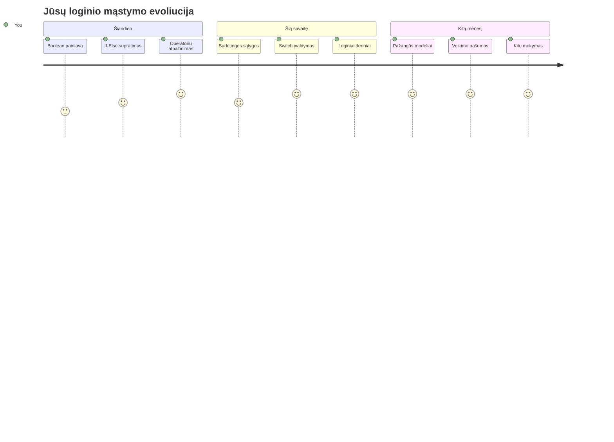
> 🧠 **Jūs įvaldėte skaitmeninio sprendimų priėmimo meną!** Kiekviena interaktyvi programa remiasi sąlygine logika, kad protingai reaguotų į naudotojo veiksmus ir kintančias sąlygas. Dabar jūs suprantate, kaip priversti savo programas mąstyti, vertinti ir pasirinkti tinkamus atsakymus. Šis loginis pagrindas įgalins kiekvieną dinamišką programą, kurią kuriate! 🎉

---

<!-- CO-OP TRANSLATOR DISCLAIMER START -->
**Atsakomybės apribojimas**:  
Šis dokumentas buvo išverstas naudojant dirbtinio intelekto vertimo paslaugą [Co-op Translator](https://github.com/Azure/co-op-translator). Nors stengiamės užtikrinti tikslumą, prašome atkreipti dėmesį, kad automatizuoti vertimai gali turėti klaidų ar netikslumų. Pirminis dokumentas jo gimtąja kalba turėtų būti laikomas autoritetingu šaltiniu. Svarbiai informacijai rekomenduojamas profesionalus žmogaus atliktas vertimas. Mes neatsakome už jokius nesusipratimus ar neteisingas interpretacijas, kylančias dėl šio vertimo naudojimo.
<!-- CO-OP TRANSLATOR DISCLAIMER END -->