<!--
CO_OP_TRANSLATOR_METADATA:
{
  "original_hash": "1710a50a519a6e4a1b40a5638783018d",
  "translation_date": "2026-01-07T11:14:36+00:00",
  "source_file": "2-js-basics/4-arrays-loops/README.md",
  "language_code": "lt"
}
-->
# JavaScript pagrindai: masyvai ir ciklai

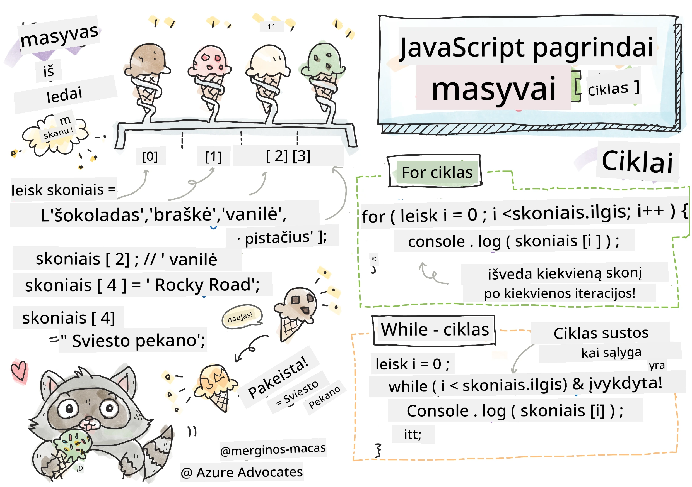
> Sketchnote autorius [Tomomi Imura](https://twitter.com/girlie_mac)

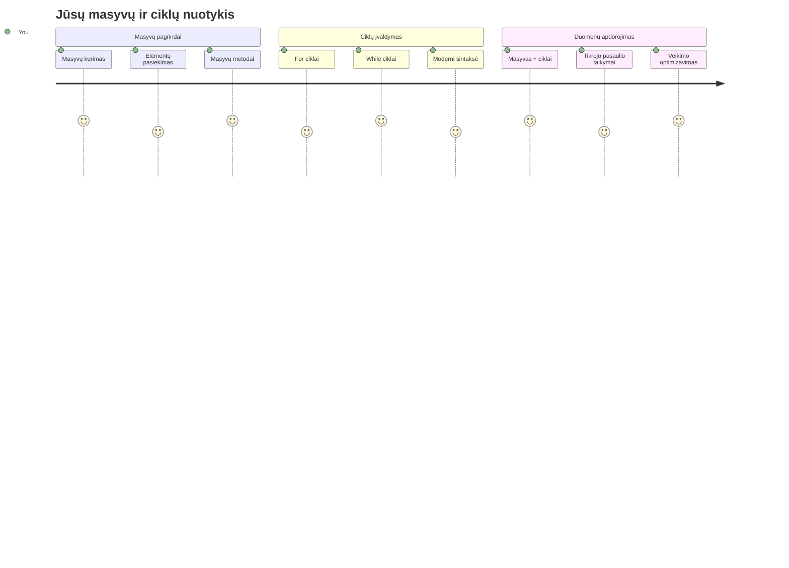
## Prieš paskaitą testas
[Prieš paskaitą testas](https://ff-quizzes.netlify.app/web/quiz/13)

Ar kada nors svarstėte, kaip svetainės seka prekių krepšelio elementus arba rodo jūsų draugų sąrašą? Čia į pagalbą ateina masyvai ir ciklai. Masyvai – tai skaitmeniniai konteineriai, kurie laiko kelis duomenų gabalus, o ciklai leidžia efektyviai tvarkyti tuos duomenis be pasikartojančio kodo.

Šios dvi sąvokos kartu sudaro pagrindą informacijos tvarkymui programose. Išmoksite pereiti nuo kiekvieno žingsnio rašymo ranka prie protingo, efektyvaus kodo, kuris gali greitai apdoroti šimtus ar net tūkstančius elementų.

Pamokos pabaigoje suprasite, kaip sudėtingas duomenų užduotis atlikti vos keliais kodo sakiniais. Pasinerkime į šias esmines programavimo sąvokas.

[](https://youtube.com/watch?v=1U4qTyq02Xw "Arrays")

[](https://www.youtube.com/watch?v=Eeh7pxtTZ3k "Loops")

> 🎥 Paspauskite aukščiau esančias nuotraukas, kad peržiūrėtumėte vaizdo įrašus apie masyvus ir ciklus.

> Šią pamoką galite atlikti [Microsoft Learn platformoje](https://docs.microsoft.com/learn/modules/web-development-101-arrays/?WT.mc_id=academic-77807-sagibbon)!

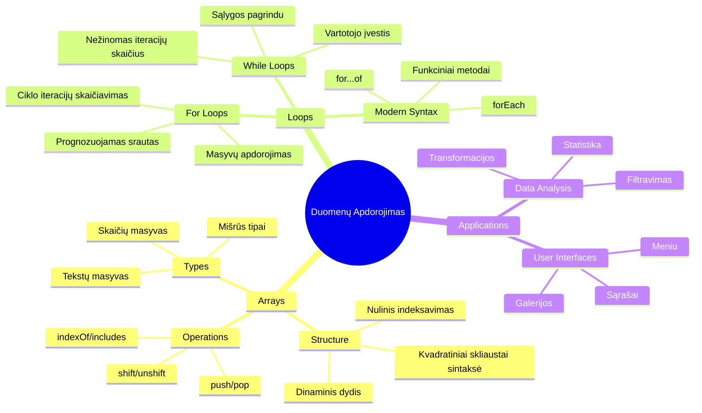
## Masyvai

Įsivaizduokite masyvus kaip skaitmeninę segtuvą - vietoj to, kad saugotumėte vieną dokumentą viename skyriuje, galite sutvarkyti kelis susijusius elementus viename struktūruotame konteineryje. Programavimo terminais masyvai leidžia saugoti kelis duomenų vienetus viename organizuotame pakete.

Nesvarbu, ar kuriate nuotraukų galeriją, valdote darbų sąrašą, ar laikote aukščiausių rezultatų sąrašą žaidime, masyvai suteikia duomenų organizavimo pagrindą. Pažiūrėkime, kaip jie veikia.

✅ Masyvai mus supa visur! Ar galite įvardyti realų gyvenimo pavyzdį, kaip saulės modulių masyvą?

### Masyvų kūrimas

Masyvą sukurti labai paprasta – tiesiog naudokite kvadratines skliaustelius!

```javascript
// Tuščias masyvas - kaip tuščia pirkinių krepšelis, laukiantis prekių
const myArray = [];
```

**Kas čia vyksta?**  
Jūs ką tik sukūrėte tuščią konteinerį naudodami kvadratinius skliaustelius `[]`. Tai panašu į tuščią bibliotekos lentyną – ją galima užpildyti bet kokiomis norimomis knygomis.

Taip pat galite iš karto užpildyti savo masyvą pradinėmis reikšmėmis:

```javascript
// Jūsų ledų parduotuvės skonių meniu
const iceCreamFlavors = ["Chocolate", "Strawberry", "Vanilla", "Pistachio", "Rocky Road"];

// Vartotojo profilio informacija (jungiami įvairių tipų duomenys)
const userData = ["John", 25, true, "developer"];

// Testo rezultatai jūsų mėgstamiausiam dalykui
const scores = [95, 87, 92, 78, 85];
```

**Įdomūs pastebėjimai:**  
- Galite saugoti tekstą, skaičius ar net true/false reikšmes tame pačiame masyve  
- Elementus atskirkite kableliu – labai paprasta!  
- Masyvai puikiai tinka saugoti susijusią informaciją kartu

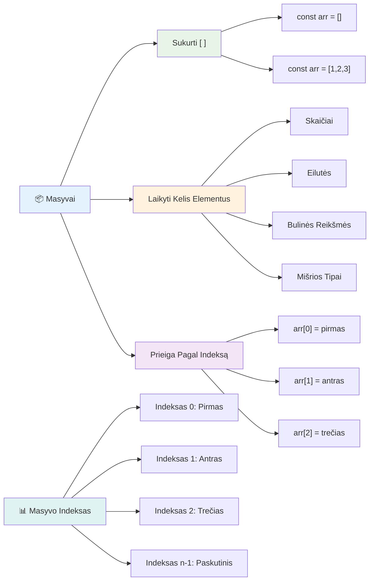
### Masyvo indeksavimas

Štai kas iš pradžių gali pasirodyti neįprasta: masyvai numeruoja elementus nuo 0, o ne nuo 1. Šis nulinis indeksavimas kilo iš kompiuterinės atminties veikimo principų – tai programavimo konvencija nuo ankstyvųjų C kalbos laikų. Kiekviena vieta masyve turi savo adresą, vadinamą **indeksu**.

| Indeksas | Reikšmė | Aprašas |
|----------|---------|---------|
| 0 | "Šokoladas" | Pirmas elementas |
| 1 | "Braškė" | Antras elementas |
| 2 | "Vanilė" | Trečias elementas |
| 3 | "Pistacija" | Ketvirtas elementas |
| 4 | "Rocky Road" | Penktas elementas |

✅ Ar jus stebina, kad masyvo indeksavimas prasideda nuo nulio? Kai kuriose programavimo kalbose indeksai prasideda nuo 1. Įdomią istoriją apie tai galite perskaityti [Vikipedijoje](https://en.wikipedia.org/wiki/Zero-based_numbering).

**Prieigos prie masyvo elementų išraiška:**

```javascript
const iceCreamFlavors = ["Chocolate", "Strawberry", "Vanilla", "Pistachio", "Rocky Road"];

// Prieiga prie atskirų elementų naudojant skliaustų žymėjimą
console.log(iceCreamFlavors[0]); // "Šokoladas" - pirmas elementas
console.log(iceCreamFlavors[2]); // "Vanilė" - trečias elementas
console.log(iceCreamFlavors[4]); // "Rocky Road" - paskutinis elementas
```

**Išskaidykime, kas vyksta čia:**  
- **Naudoja** kvadratinius skliaustelius su indeksu elementų pasiekimui  
- **Grąžina** reikšmę, esančią nurodytoje pozicijoje masyve  
- **Skaičiuoja** nuo 0, todėl pirmo elemento indeksas yra 0

**Masyvo elementų keitimas:**

```javascript
// Pakeisti esamą reikšmę
iceCreamFlavors[4] = "Butter Pecan";
console.log(iceCreamFlavors[4]); // "Sviesto Pekano"

// Pridėti naują elementą pabaigoje
iceCreamFlavors[5] = "Cookie Dough";
console.log(iceCreamFlavors[5]); // "Sausainių tešla"
```

**Aukščiau mes:**  
- **Pakeitėme** elementą su indeksu 4 iš "Rocky Road" į "Sviesto pekano"  
- **Pridėjome** naują elementą "Cookie Dough" su indeksu 5  
- **Automatiškai** išplėtėme masyvo ilgį pridėdami elementą už dabartinių ribų

### Masyvo ilgis ir dažniausiai naudojami metodai

Masyvai turi įmontuotas savybes ir metodus, kurie labai palengvina darbą su duomenimis.

**Masyvo ilgio gavimas:**

```javascript
const iceCreamFlavors = ["Chocolate", "Strawberry", "Vanilla", "Pistachio", "Rocky Road"];
console.log(iceCreamFlavors.length); // 5

// Ilgis atnaujinamas automatiškai keičiantis masyvui
iceCreamFlavors.push("Mint Chip");
console.log(iceCreamFlavors.length); // 6
```

**Svarbiausi dalykai:**  
- **Grąžina** bendrą masyvo elementų kiekį  
- **Automatiškai atnaujinamas** kai elementai pridedami ar pašalinami  
- **Svarbus** ciklams ir validacijai

**Esminiai masyvo metodai:**

```javascript
const fruits = ["apple", "banana", "orange"];

// Pridėti elementus
fruits.push("grape");           // Prideda į pabaigą: ["obuolys", "bananas", "apelsinas", "vynuogė"]
fruits.unshift("strawberry");   // Prideda į pradžią: ["braškė", "obuolys", "bananas", "apelsinas", "vynuogė"]

// Pašalinti elementus
const lastFruit = fruits.pop();        // Pašalina ir grąžina "vynuogė"
const firstFruit = fruits.shift();     // Pašalina ir grąžina "braškė"

// Rasti elementus
const index = fruits.indexOf("banana"); // Grąžina 1 (pozicija "bananas")
const hasApple = fruits.includes("apple"); // Grąžina tiesa
```

**Svarbu suprasti šiuos metodus:**  
- **Prideda** elementus su `push()` (pabaigoje) ir `unshift()` (pradžioje)  
- **Šalina** elementus su `pop()` (pabaigoje) ir `shift()` (pradžioje)  
- **Randa** elementus su `indexOf()` ir tikrina egzistavimą su `includes()`  
- **Grąžina** naudingas reikšmes, pvz., pašalintus elementus ar pozicijų indeksus

✅ Išbandykite patys! Naudokite naršyklės konsolę kurdami ir manipuliuodami savo sukurtu masyvu.

### 🧠 **Masyvų pagrindų patikrinimas: organizuokite savo duomenis**

**Patikrinkite savo žinias apie masyvus:**  
- Kodėl manote, kad masyvai skaičiuoja nuo 0, o ne nuo 1?  
- Kas nutinka, jei bandote pasiekti neegzistuojantį indeksą (pvz., `arr[100]` penkių elementų masyve)?  
- Ar galite įvardinti tris realaus gyvenimo situacijas, kur masyvai būtų naudingi?

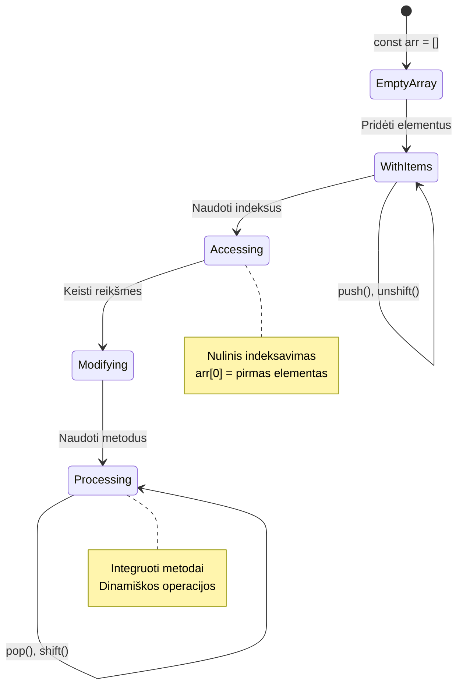
> **Reali gyvenimo įžvalga**: Masyvai yra visur programavime! Socialinių tinklų naujienų srautas, prekių krepšeliai, nuotraukų galerijos, muzikiniai sąrašai – visa tai yra masyvai!

## Ciklai

Įsivaizduokite Charleso Dickenso romanų bausmę, kai mokiniai turėjo kelis kartus ant lentelės parašyti tą pačią frazę. O jeigu galėtumėte paprasčiausiai nurodyti „rašyk šią frazę 100 kartų“ ir tai būtų atlikta automatiškai? Būtent tai ciklai ir daro jūsų kode.

Ciklai yra kaip nepavargstantis asistentas, kuris gali be klaidų pakartoti užduotis. Nesvarbu, ar reikia patikrinti kiekvieną prekių krepšelio elementą, ar parodyti visas nuotraukas albume – ciklai efektyviai tvarko pasikartojimus.

JavaScript siūlo keletą ciklų tipų. Pažiūrėkime kiekvieną ir supraskime, kada juos naudoti.

```mermaid
flowchart TD
    A["🔄 Ciklo tipai"] --> B["For ciklas"]
    A --> C["While ciklas"]
    A --> D["For...of ciklas"]
    A --> E["forEach metodas"]
    
    B --> B1["Žinomas iteracijų skaičius"]
    B --> B2["Skaitiklio pagrindu"]
    B --> B3["for(init; sąlyga; didinimas)"]
    
    C --> C1["Nežinomas iteracijų skaičius"]
    C --> C2["Sąlygos pagrindu"]
    C --> C3["while(sąlyga)"]
    
    D --> D1["Modernus ES6+"]
    D --> D2["Masyvo iteracija"]
    D --> D3["for(elementas iš masyvo)"]
    
    E --> E1["Funkcinis stilius"]
    E --> E2["Masivo metodas"]
    E --> E3["masyvas.forEach(atgalinis kvietimas)"]
    
    F["⏰ Kada naudoti"] --> F1["For: skaičiavimui, indeksams"]
    F --> F2["While: vartotojo įvestims, paieškai"]
    F --> F3["For...of: paprastai iteruoti"]
    F --> F4["forEach: funkcinis programavimas"]
    
    style A fill:#e3f2fd
    style B fill:#e8f5e8
    style C fill:#fff3e0
    style D fill:#f3e5f5
    style E fill:#e0f2f1
    style F fill:#fce4ec
```
### For ciklas

`for` ciklas yra panašus į laikmatį – jūs žinote, kiek kartų norite kažką atlikti. Jis labai organizuotas ir nuspėjamas, todėl puikiai tinka darbui su masyvais arba kai reikia kažką suskaičiuoti.

**For ciklo struktūra:**

| Dalys | Paskirtis | Pavyzdys |
|-------|-----------|----------|
| **Inicijavimas** | Nustato pradžios tašką | `let i = 0` |
| **Sąlyga** | Iki kada tęsti | `i < 10` |
| **Inkrementavimas** | Kaip atnaujinti | `i++` |

```javascript
// Skaičiavimas nuo 0 iki 9
for (let i = 0; i < 10; i++) {
  console.log(`Count: ${i}`);
}

// Praktikesnis pavyzdys: rezultatų apdorojimas
const testScores = [85, 92, 78, 96, 88];
for (let i = 0; i < testScores.length; i++) {
  console.log(`Student ${i + 1}: ${testScores[i]}%`);
}
```

**Žingsnis po žingsnio, kas vyksta:**  
- **Inicijuoja** skaitiklio kintamąjį `i` su 0 pradžioje  
- **Tikrina** sąlygą `i < 10` prieš kiekvieną iteraciją  
- **Vykdo** kodo bloką, kai sąlyga yra teisinga  
- **Didina** `i` vienetu po kiekvienos iteracijos su `i++`  
- **Sustoja**, kai sąlyga tampa melaginga (kai `i` pasiekia 10)

✅ Išbandykite šį kodą naršyklės konsolėje. Kas nutinka, jei šiek tiek pakeičiate skaitiklį, sąlygą ar iteracijos išraišką? Ar galite jį paleisti atgaline eiga, sukurdami atskaitą?

### 🗓️ **For ciklo mokėjimo patikrinimas: kontroliuojamas kartojimas**

**Įvertinkite savo for ciklo supratimą:**  
- Kokios yra trys for ciklo dalys ir ką kiekviena daro?  
- Kaip sukaupti masyvą atgaline tvarka?  
- Kas nutinka, jei pamiršite inkrementavimo dalį (`i++`)?

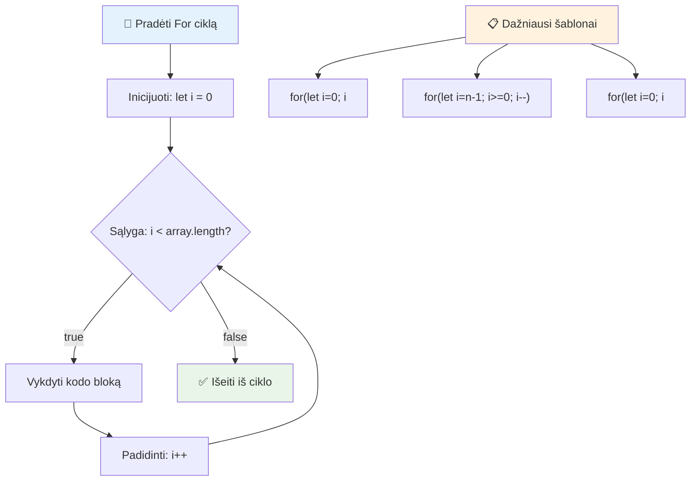
> **Ciklų išmintis**: For ciklai puikiai tinka, kai žinote, kiek kartų reikia kažką kartoti. Tai pats dažniausias pasirinkimas dirbant su masyvais!

### While ciklas

`while` ciklas yra kaip sakyti „daryk tai tol, kol...“ – gali būti, kad nežinote tiksliai, kiek kartų jis bus vykdomas, bet žinote, kada sustoti. Puikiai tinka situacijoms, kai vartotoją reikia klausti, kol gaunate norimą atsakymą, arba ieškoti duomenyse, kol randate tai, ko ieškote.

**While ciklo ypatybės:**  
- **Tęsiasi** tol, kol sąlyga yra teisinga  
- **Reikalauja** rankinio skaitiklių valdymo  
- **Tikrina** sąlygą prieš kiekvieną iteraciją  
- **Gali sukelti** begalinius ciklus, jei sąlyga niekada nesikeičia į melagingą

```javascript
// Pagrindinis skaičiavimo pavyzdys
let i = 0;
while (i < 10) {
  console.log(`While count: ${i}`);
  i++; // Nepamiršk didinti!
}

// Praktinė pavyzdys: vartotojo įvesties apdorojimas
let userInput = "";
let attempts = 0;
const maxAttempts = 3;

while (userInput !== "quit" && attempts < maxAttempts) {
  userInput = prompt(`Enter 'quit' to exit (attempt ${attempts + 1}):`);
  attempts++;
}

if (attempts >= maxAttempts) {
  console.log("Maximum attempts reached!");
}
```

**Šių pavyzdžių paaiškinimas:**  
- **Rankiniu būdu valdo** kintamąjį `i` ciklo viduje  
- **Didina** skaitiklį, kad išvengtų begalinio ciklo  
- **Rodo** praktinį panaudojimą su vartotojo įvestimi ir bandymų ribojimu  
- **Apima** saugos mechanizmus, kad nebūtų nepabaigiamas vykdymas

### ♾️ **While ciklo išminties patikrinimas: sąlygų pagrindu vykdomas kartojimas**

**Išbandykite savo while ciklo supratimą:**  
- Kokia yra pagrindinė while ciklų pavojų priežastis?  
- Kada rinktumėtės while ciklą vietoje for ciklo?  
- Kaip galima išvengti begalinių ciklų?

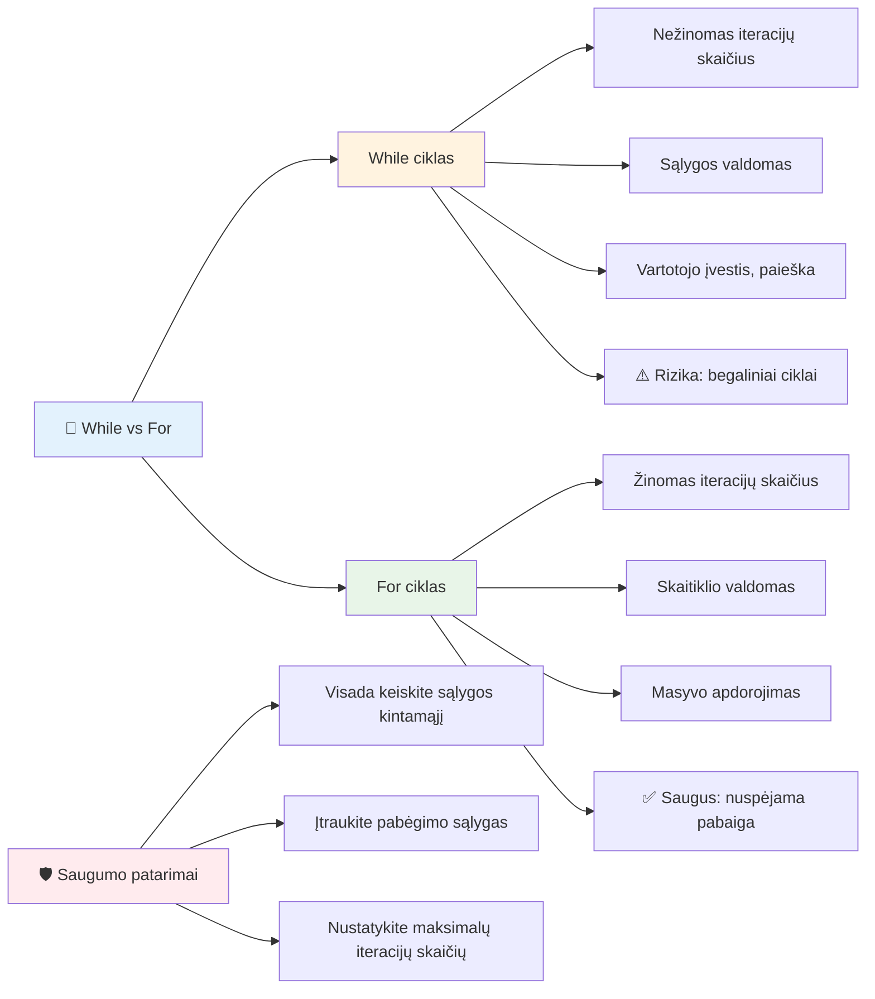
> **Saugumas pirmiausia**: While ciklai yra galingi, bet reikalauja atsargaus sąlygų valdymo. Visada įsitikinkite, kad jūsų ciklo sąlyga galiausiai taps melaginga!

### Šiuolaikinės ciklų alternatyvos

JavaScript siūlo modernią ciklų sintaksę, kuri gali padaryti jūsų kodą skaitomesnį ir mažiau klaidinamą.

**For...of ciklas (ES6+):**

```javascript
const colors = ["red", "green", "blue", "yellow"];

// Modernus požiūris - švaresnis ir saugesnis
for (const color of colors) {
  console.log(`Color: ${color}`);
}

// Palyginti su tradiciniu for ciklu
for (let i = 0; i < colors.length; i++) {
  console.log(`Color: ${colors[i]}`);
}
```

**Svarbiausios for...of privalumai:**  
- **Pašalina** indeksų valdymo poreikį ir galimas klaidas  
- **Tiesiogiai suteikia** prieigą prie masyvo elementų  
- **Pagerina** kodo skaitomumą ir sumažina sintaksės sudėtingumą

**forEach metodas:**

```javascript
const prices = [9.99, 15.50, 22.75, 8.25];

// Naudojant forEach funkciniam programavimui
prices.forEach((price, index) => {
  console.log(`Item ${index + 1}: $${price.toFixed(2)}`);
});

// forEach su rodyklių funkcijomis paprastoms operacijoms
prices.forEach(price => console.log(`Price: $${price}`));
```

**Svarbu žinoti apie forEach:**  
- **Vykdo** funkciją kiekvienam masyvo elementui  
- **Suteikia** elementų reikšmę ir indeksą kaip parametrus  
- **Negalima** jo sustabdyti anksčiau (priešingai nei tradiciniai ciklai)  
- **Grąžina** undefined (nekuria naujo masyvo)

✅ Kodėl rinktumėtės for ciklą vietoje while ciklo? 17 tūkst. žiūrovų StackOverflow turėjo tą patį klausimą ir kai kurios nuomonės [gali būti jums įdomios](https://stackoverflow.com/questions/39969145/while-loops-vs-for-loops-in-javascript).

### 🎨 **Šiuolaikinės ciklų sintaksės patikrinimas: ES6+ priėmimas**

**Įvertinkite savo moderniojo JavaScript supratimą:**  
- Kokie privalumai naudojant `for...of` palyginti su tradiciniais for ciklais?  
- Kada vis dar galėtumėte rinktis tradicinius for ciklus?  
- Kuo skiriasi `forEach` nuo `map`?

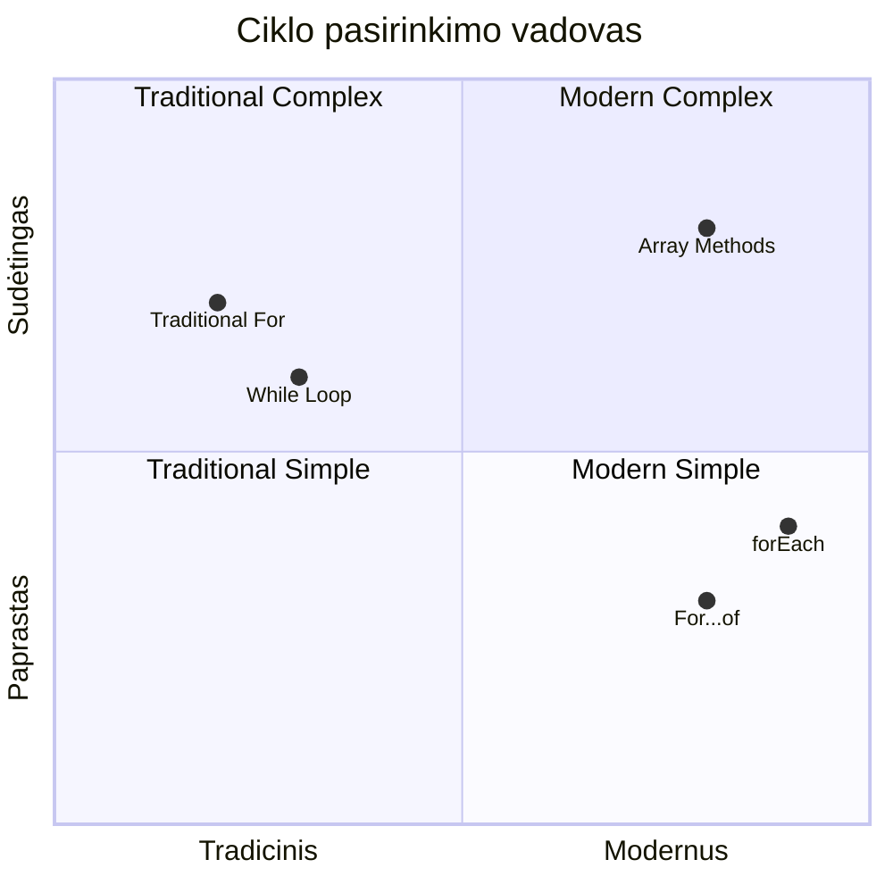
> **Šiuolaikinės tendencijos**: ES6+ sintaksė kaip `for...of` ir `forEach` tampa mėgstamiausia masyvų iteracijai, nes ji yra švaresnė ir mažiau klaidinanti!

## Ciklai ir masyvai

Masyvų ir ciklų derinys suteikia galingas duomenų apdorojimo galimybes. Šis derinys yra pagrindas daugeliui programavimo užduočių – nuo sąrašų rodymo iki statistikos skaičiavimo.

**Tradiciškas masyvo apdorojimas:**

```javascript
const iceCreamFlavors = ["Chocolate", "Strawberry", "Vanilla", "Pistachio", "Rocky Road"];

// Klasikinis for ciklo metodas
for (let i = 0; i < iceCreamFlavors.length; i++) {
  console.log(`Flavor ${i + 1}: ${iceCreamFlavors[i]}`);
}

// Modernus for...of metodas
for (const flavor of iceCreamFlavors) {
  console.log(`Available flavor: ${flavor}`);
}
```

**Pažiūrėkime, kaip veikia kiekvienas metodas:**  
- **Naudoja** masyvo ilgį ciklo ribai nustatyti  
- **Pasiekia** elementus pagal indeksą tradiciniame for cikle  
- **Suteikia** tiesioginę prieigą prie elementų for...of cikle  
- **Apdoroja** kiekvieną masyvo elementą tik vieną kartą

**Praktinis duomenų apdorojimo pavyzdys:**

```javascript
const studentGrades = [85, 92, 78, 96, 88, 73, 89];
let total = 0;
let highestGrade = studentGrades[0];
let lowestGrade = studentGrades[0];

// Apdorokite visus pažymius naudodami vieną ciklą
for (let i = 0; i < studentGrades.length; i++) {
  const grade = studentGrades[i];
  total += grade;
  
  if (grade > highestGrade) {
    highestGrade = grade;
  }
  
  if (grade < lowestGrade) {
    lowestGrade = grade;
  }
}

const average = total / studentGrades.length;
console.log(`Average: ${average.toFixed(1)}`);
console.log(`Highest: ${highestGrade}`);
console.log(`Lowest: ${lowestGrade}`);
```

**Kaip veikia šis kodas:**  
- **Inicijuoja** kintamuosius sumai ir riboms sekti  
- **Apdoroja** kiekvieną pažymį per vieną efektyvų ciklą  
- **Kaupia** bendrą sumą vidurkiui apskaičiuoti  
- **Stebi** aukščiausią ir žemiausią vertes iteracijos metu  
- **Apskaičiuoja** galutines statistikas ciklui pasibaigus

✅ Eksperimentuokite su savo sukurtu masyvu naršyklės konsolėje.

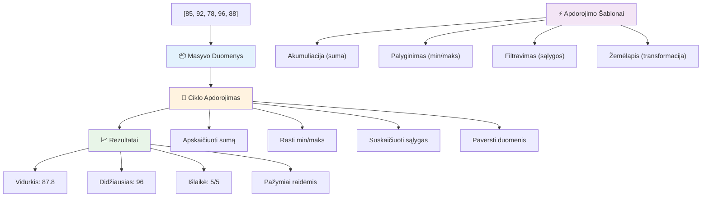
---

## GitHub Copilot agento iššūkis 🚀

Naudokite Agent režimą, kad atliktumėte šį iššūkį:

**Aprašymas:** Sukurkite išsamų duomenų apdorojimo funkciją, kuri derina masyvus ir ciklus, analizuoja duomenų rinkinį ir generuoja prasmingas įžvalgas.

**Užduotis:** Sukurkite funkciją `analyzeGrades`, kuri priima masyvą su mokinių pažymių objektais (kiekvienas objektas turi `name` ir `score` savybes) ir grąžina objektą su statistika: aukščiausias balas, žemiausias balas, vidutinis balas, sėkmingai išlaikiusių (balas >= 70) skaičius bei masyvas su mokinių vardais, kurių balai viršija vidurkį. Naudokite bent du skirtingus ciklų tipus sprendime.

Sužinokite daugiau apie [agent režimą](https://code.visualstudio.com/blogs/2025/02/24/introducing-copilot-agent-mode) čia.

## 🚀 Iššūkis
JavaScript siūlo keletą modernių masyvų metodų, kurie gali pakeisti tradicines ciklus specifinėms užduotims. Išmokite naudotis [forEach](https://developer.mozilla.org/docs/Web/JavaScript/Reference/Global_Objects/Array/forEach), [for-of](https://developer.mozilla.org/docs/Web/JavaScript/Reference/Statements/for...of), [map](https://developer.mozilla.org/docs/Web/JavaScript/Reference/Global_Objects/Array/map), [filter](https://developer.mozilla.org/docs/Web/JavaScript/Reference/Global_Objects/Array/filter) ir [reduce](https://developer.mozilla.org/docs/Web/JavaScript/Reference/Global_Objects/Array/reduce).

**Jūsų iššūkis:** Pertvarkykite studentų pažymių pavyzdį naudodami bent tris skirtingus masyvų metodus. Pastebėsite, kaip daug švaresnis ir suprantamesnis tampa kodas su modernia JavaScript sintakse.

## Po paskaitos testas
[Po paskaitos testas](https://ff-quizzes.netlify.app/web/quiz/14)

## Peržiūra ir savarankiškas mokymasis

JavaScript masyvai turi daug metodų, kurie yra labai naudingi duomenų manipuliavimui. [Susipažinkite su šiais metodais](https://developer.mozilla.org/docs/Web/JavaScript/Reference/Global_Objects/Array) ir išbandykite kai kuriuos iš jų (pvz., push, pop, slice ir splice) su savo sukurtu masyvu.

## Užduotis

[Ciklas masyve](assignment.md)

---

## 📊 **Jūsų masyvų ir ciklų įrankių santrauka**

```mermaid
graph TD
    A["🎯 Masyvų ir ciklų įvaldymas"] --> B["📦 Masyvų pagrindai"]
    A --> C["🔄 Ciklų tipai"]
    A --> D["🔗 Duomenų apdorojimas"]
    A --> E["🎨 Modernios technikos"]
    
    B --> B1["Sukūrimas: [ ]"]
    B --> B2["Indeksavimas: arr[0]"]
    B --> B3["Metodai: push, pop"]
    B --> B4["Savybės: length"]
    
    C --> C1["For: žinomi kartojimai"]
    C --> C2["While: sąlygos pagrindu"]
    C --> C3["For...of: tiesioginis priėjimas"]
    C --> C4["forEach: funkcinis"]
    
    D --> D1["Statistikos skaičiavimas"]
    D --> D2["Duomenų transformavimas"]
    D --> D3["Filtravimas ir paieška"]
    D --> D4["Realaus laiko apdorojimas"]
    
    E --> E1["Rodyklių funkcijos"]
    E --> E2["Metodų grandinimas"]
    E --> E3["Išardymas"]
    E --> E4["Šabloninės išraiškos"]
    
    F["💡 Pagrindinės naudos"] --> F1["Efektyvus duomenų tvarkymas"]
    F --> F2["Mažiau kodo kartojimo"]
    F --> F3["Mastelio sprendimai"]
    F --> F4["Švaresnė sintaksė"]
    
    style A fill:#e3f2fd
    style B fill:#e8f5e8
    style C fill:#fff3e0
    style D fill:#f3e5f5
    style E fill:#e0f2f1
    style F fill:#fce4ec
```
---

## 🚀 Jūsų masyvų ir ciklų meistriškumo laiko planas

### ⚡ **Ką galite padaryti per artimiausias 5 minutes**
- [ ] Sukurkite mėgstamų filmų masyvą ir pasiekite konkrečius elementus
- [ ] Parašykite for ciklą, kuris skaičiuoja nuo 1 iki 10
- [ ] Išbandykite šiuolaikinių masyvo metodų iššūkį iš pamokos
- [ ] Praktikuokite masyvų indeksavimą savo naršyklės konsolėje

### 🎯 **Ką galite pasiekti šią valandą**
- [ ] Atlikite po pamokos testą ir peržiūrėkite sudėtingesnes temas
- [ ] Sukurkite išsamų pažymių analizatorių pagal GitHub Copilot iššūkį
- [ ] Sukurkite paprastą pirkinių krepšelį, kuris prideda ir pašalina prekes
- [ ] Praktikuokite konvertuoti tarp skirtingų ciklų tipų
- [ ] Eksperimentuokite su masyvo metodais, tokiais kaip `push`, `pop`, `slice` ir `splice`

### 📅 **Jūsų savaitės duomenų apdorojimo kelionė**
- [ ] Atlikite užduotį „Ciklas masyve“ su kūrybiniais patobulinimais
- [ ] Sukurkite darbų sąrašų programėlę naudodami masyvus ir ciklus
- [ ] Sukurkite paprastą statistikos skaičiuoklę skaitiniams duomenims
- [ ] Praktikuokitės su [MDN masyvų metodais](https://developer.mozilla.org/docs/Web/JavaScript/Reference/Global_Objects/Array)
- [ ] Sukurkite nuotraukų galerijos arba muzikos grojaraščio sąsają
- [ ] Išbandykite funkcinį programavimą naudodami `map`, `filter` ir `reduce`

### 🌟 **Jūsų mėnesio transformacija**
- [ ] Įvaldykite pažangias masyvų operacijas ir našumo optimizavimą
- [ ] Sukurkite pilną duomenų vizualizacijos informacijos suvestinę
- [ ] Prisidėkite prie atviro kodo projektų, susijusių su duomenų apdorojimu
- [ ] Mokykite kitus apie masyvus ir ciklus su praktiškais pavyzdžiais
- [ ] Sukurkite asmeninę biblioteką pakartotinai naudojamoms duomenų apdorojimo funkcijoms
- [ ] Ištyrinėkite algoritmus ir duomenų struktūras, pagrįstas masyvais

### 🏆 **Galutinė duomenų apdorojimo čempiono grįžtamojo ryšio dalis**

**Švęskite savo masyvų ir ciklų meistriškumą:**
- Kokia naudingiausia masyvų operacija, kurią išmokote naudoti realaus pasaulio programose?
- Koks ciklo tipas jums atrodo natūraliausias ir kodėl?
- Kaip masyvų ir ciklų supratimas pakeitė jūsų būdą organizuoti duomenis?
- Kokį sudėtingą duomenų apdorojimo uždavinį norėtumėte spręsti toliau?

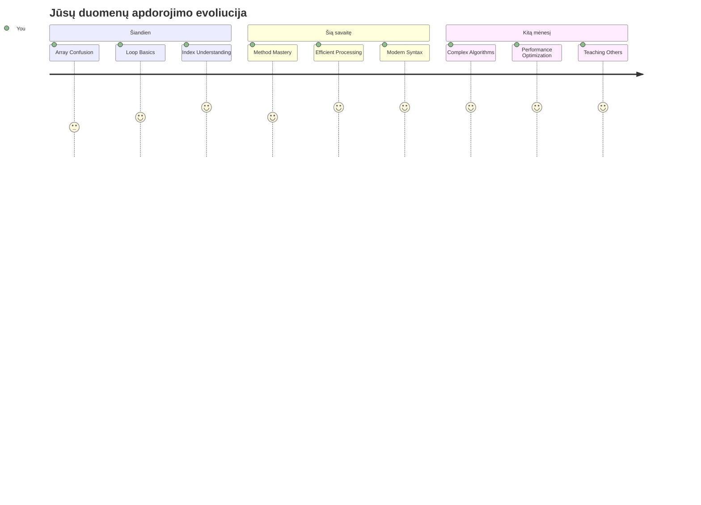
> 📦 **Jūs atrakinote duomenų organizavimo ir apdorojimo galią!** Masyvai ir ciklai yra beveik kiekvienos programėlės, kurią kada nors kursite, pagrindas. Nuo paprastų sąrašų iki sudėtingos duomenų analizės – dabar turite įrankius informacijai efektyviai ir elegantiškai tvarkyti. Kiekvienas dinamiškas tinklalapis, mobilioji programėlė ir duomenimis pagrįsta programėlė remiasi šiomis pagrindinėmis sąvokomis. Sveiki atvykę į mastelio duomenų apdorojimo pasaulį! 🎉

---

<!-- CO-OP TRANSLATOR DISCLAIMER START -->
**Atsakomybės atsisakymas**:
Šis dokumentas buvo išverstas naudojant dirbtinio intelekto vertimo paslaugą [Co-op Translator](https://github.com/Azure/co-op-translator). Nors siekiame tikslumo, prašome atkreipti dėmesį, kad automatiniai vertimai gali turėti klaidų ar netikslumų. Originalus dokumentas gimtąja kalba turėtų būti laikomas autoritetingu šaltiniu. Svarbiai informacijai rekomenduojama kreiptis į profesionalų žmogaus vertėją. Mes neprisiimame atsakomybės už bet kokius nesusipratimus ar klaidingą interpretaciją, kilusią dėl šio vertimo naudojimo.
<!-- CO-OP TRANSLATOR DISCLAIMER END -->