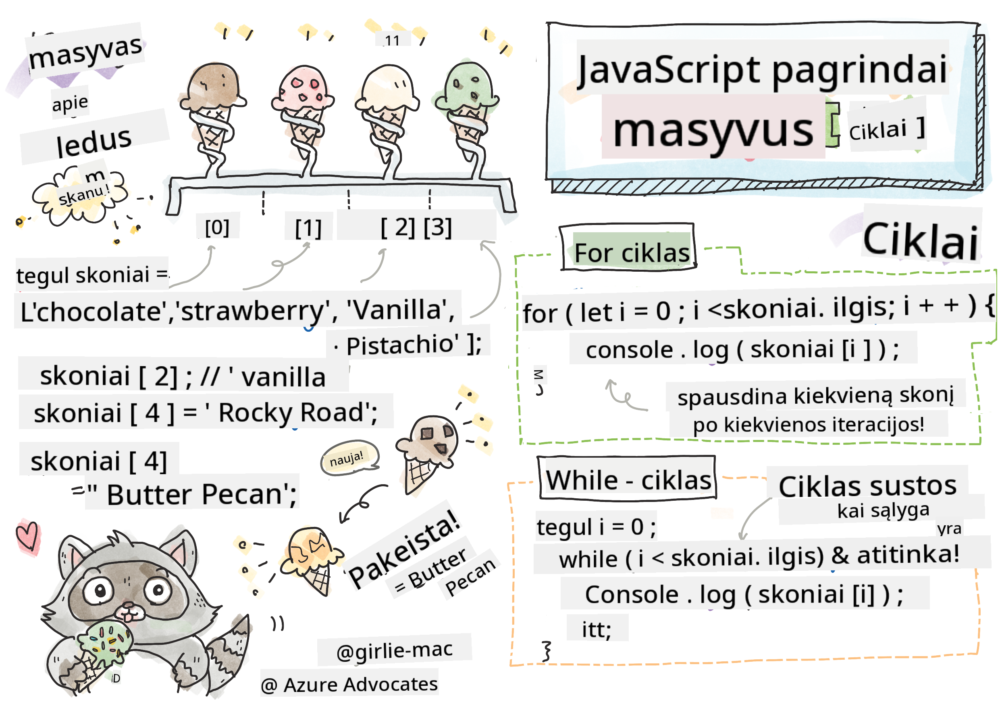

<!--
CO_OP_TRANSLATOR_METADATA:
{
  "original_hash": "3f7f87871312cf6cc12662da7d973182",
  "translation_date": "2025-08-28T11:46:52+00:00",
  "source_file": "2-js-basics/4-arrays-loops/README.md",
  "language_code": "lt"
}
-->
# JavaScript pagrindai: masyvai ir ciklai


> Sketchnote sukūrė [Tomomi Imura](https://twitter.com/girlie_mac)

## Klausimai prieš paskaitą
[Klausimai prieš paskaitą](https://ashy-river-0debb7803.1.azurestaticapps.net/quiz/13)

Ši pamoka apima JavaScript pagrindus – kalbą, kuri suteikia interaktyvumo internete. Šioje pamokoje sužinosite apie masyvus ir ciklus, kurie naudojami duomenims manipuliuoti.

[](https://youtube.com/watch?v=1U4qTyq02Xw "Masyvai")

[](https://www.youtube.com/watch?v=Eeh7pxtTZ3k "Ciklai")

> 🎥 Spustelėkite aukščiau esančius paveikslėlius, kad peržiūrėtumėte vaizdo įrašus apie masyvus ir ciklus.

> Šią pamoką galite rasti [Microsoft Learn](https://docs.microsoft.com/learn/modules/web-development-101-arrays/?WT.mc_id=academic-77807-sagibbon)!

## Masyvai

Darbas su duomenimis yra dažna užduotis bet kurioje programavimo kalboje, ir tai tampa daug lengviau, kai duomenys yra organizuoti struktūriškai, pavyzdžiui, masyvuose. Masyvuose duomenys saugomi struktūroje, panašioje į sąrašą. Vienas iš pagrindinių masyvų privalumų yra tas, kad viename masyve galite saugoti skirtingų tipų duomenis.

✅ Masyvai yra visur aplink mus! Ar galite sugalvoti realaus gyvenimo pavyzdį, pavyzdžiui, saulės baterijų masyvą?

Masyvo sintaksė yra kvadratinių skliaustų pora.

```javascript
let myArray = [];
```

Tai tuščias masyvas, tačiau masyvai gali būti deklaruojami jau užpildyti duomenimis. Keli masyvo elementai atskiriami kableliu.

```javascript
let iceCreamFlavors = ["Chocolate", "Strawberry", "Vanilla", "Pistachio", "Rocky Road"];
```

Masyvo reikšmėms priskiriama unikali reikšmė, vadinama **indeksu**, kuris yra sveikasis skaičius, priskiriamas pagal jo atstumą nuo masyvo pradžios. Aukščiau pateiktame pavyzdyje eilutės reikšmė „Chocolate“ turi indeksą 0, o „Rocky Road“ indeksas yra 4. Naudokite indeksą su kvadratiniais skliaustais, kad gautumėte, pakeistumėte arba įterptumėte masyvo reikšmes.

✅ Ar jus stebina, kad masyvai prasideda nuo nulio indekso? Kai kuriose programavimo kalbose indeksai prasideda nuo 1. Apie tai yra įdomi istorija, kurią galite [perskaityti Vikipedijoje](https://en.wikipedia.org/wiki/Zero-based_numbering).

```javascript
let iceCreamFlavors = ["Chocolate", "Strawberry", "Vanilla", "Pistachio", "Rocky Road"];
iceCreamFlavors[2]; //"Vanilla"
```

Indeksą galite panaudoti reikšmei pakeisti, kaip šiame pavyzdyje:

```javascript
iceCreamFlavors[4] = "Butter Pecan"; //Changed "Rocky Road" to "Butter Pecan"
```

Taip pat galite įterpti naują reikšmę tam tikrame indekse, kaip šiame pavyzdyje:

```javascript
iceCreamFlavors[5] = "Cookie Dough"; //Added "Cookie Dough"
```

✅ Dažnesnis būdas pridėti reikšmes į masyvą yra naudojant masyvo operatorius, tokius kaip array.push()

Norėdami sužinoti, kiek elementų yra masyve, naudokite `length` savybę.

```javascript
let iceCreamFlavors = ["Chocolate", "Strawberry", "Vanilla", "Pistachio", "Rocky Road"];
iceCreamFlavors.length; //5
```

✅ Išbandykite patys! Naudokite savo naršyklės konsolę, kad sukurtumėte ir manipuliuotumėte savo sukurtu masyvu.

## Ciklai

Ciklai leidžia atlikti pasikartojančias arba **iteracines** užduotis ir gali sutaupyti daug laiko bei kodo. Kiekviena iteracija gali skirtis savo kintamaisiais, reikšmėmis ir sąlygomis. JavaScript yra skirtingų tipų ciklų, kurie turi nedidelius skirtumus, tačiau iš esmės atlieka tą patį: iteruoja per duomenis.

### For ciklas

`for` ciklas reikalauja 3 dalių, kad galėtų iteruoti:
- `counter` Kintamasis, kuris paprastai inicializuojamas skaičiumi, skaičiuojančiu iteracijų skaičių
- `condition` Išraiška, naudojanti palyginimo operatorius, kad ciklas sustotų, kai reikšmė yra `false`
- `iteration-expression` Vykdoma kiekvienos iteracijos pabaigoje, paprastai naudojama keisti skaitiklio reikšmę
  
```javascript
// Counting up to 10
for (let i = 0; i < 10; i++) {
  console.log(i);
}
```

✅ Paleiskite šį kodą naršyklės konsolėje. Kas nutinka, kai šiek tiek pakeičiate skaitiklį, sąlygą ar iteracijos išraišką? Ar galite priversti jį veikti atgal, sukuriant atgalinį skaičiavimą?

### While ciklas

Skirtingai nuo `for` ciklo sintaksės, `while` ciklai reikalauja tik sąlygos, kuri sustabdys ciklą, kai sąlyga taps `false`. Ciklų sąlygos paprastai priklauso nuo kitų reikšmių, tokių kaip skaitikliai, ir turi būti valdomos ciklo metu. Pradinės skaitiklių reikšmės turi būti sukurtos už ciklo ribų, o bet kokios išraiškos, reikalingos sąlygai įvykdyti, įskaitant skaitiklio keitimą, turi būti palaikomos ciklo viduje.

```javascript
//Counting up to 10
let i = 0;
while (i < 10) {
 console.log(i);
 i++;
}
```

✅ Kodėl rinktumėtės for ciklą, o ne while ciklą? 17 tūkst. žiūrovų turėjo tą patį klausimą StackOverflow, ir kai kurios nuomonės [gali būti jums įdomios](https://stackoverflow.com/questions/39969145/while-loops-vs-for-loops-in-javascript).

## Ciklai ir masyvai

Masyvai dažnai naudojami su ciklais, nes dauguma sąlygų reikalauja masyvo ilgio, kad sustabdytų ciklą, o indeksas taip pat gali būti skaitiklio reikšmė.

```javascript
let iceCreamFlavors = ["Chocolate", "Strawberry", "Vanilla", "Pistachio", "Rocky Road"];

for (let i = 0; i < iceCreamFlavors.length; i++) {
  console.log(iceCreamFlavors[i]);
} //Ends when all flavors are printed
```

✅ Eksperimentuokite su ciklu per savo sukurtą masyvą naršyklės konsolėje.

---

## 🚀 Iššūkis

Yra ir kitų būdų iteruoti per masyvus, be for ir while ciklų. Yra [forEach](https://developer.mozilla.org/docs/Web/JavaScript/Reference/Global_Objects/Array/forEach), [for-of](https://developer.mozilla.org/docs/Web/JavaScript/Reference/Statements/for...of) ir [map](https://developer.mozilla.org/docs/Web/JavaScript/Reference/Global_Objects/Array/map). Pakeiskite savo masyvo ciklą naudodami vieną iš šių metodų.

## Klausimai po paskaitos
[Klausimai po paskaitos](https://ashy-river-0debb7803.1.azurestaticapps.net/quiz/14)

## Apžvalga ir savarankiškas mokymasis

JavaScript masyvai turi daug metodų, kurie yra labai naudingi duomenų manipuliavimui. [Perskaitykite apie šiuos metodus](https://developer.mozilla.org/docs/Web/JavaScript/Reference/Global_Objects/Array) ir išbandykite kai kuriuos iš jų (pvz., push, pop, slice ir splice) savo sukurtame masyve.

## Užduotis

[Iteruokite per masyvą](assignment.md)

---

**Atsakomybės apribojimas**:  
Šis dokumentas buvo išverstas naudojant AI vertimo paslaugą [Co-op Translator](https://github.com/Azure/co-op-translator). Nors siekiame tikslumo, prašome atkreipti dėmesį, kad automatiniai vertimai gali turėti klaidų ar netikslumų. Originalus dokumentas jo gimtąja kalba turėtų būti laikomas autoritetingu šaltiniu. Kritinei informacijai rekomenduojama naudoti profesionalų žmogaus vertimą. Mes neprisiimame atsakomybės už nesusipratimus ar klaidingus interpretavimus, atsiradusius dėl šio vertimo naudojimo.