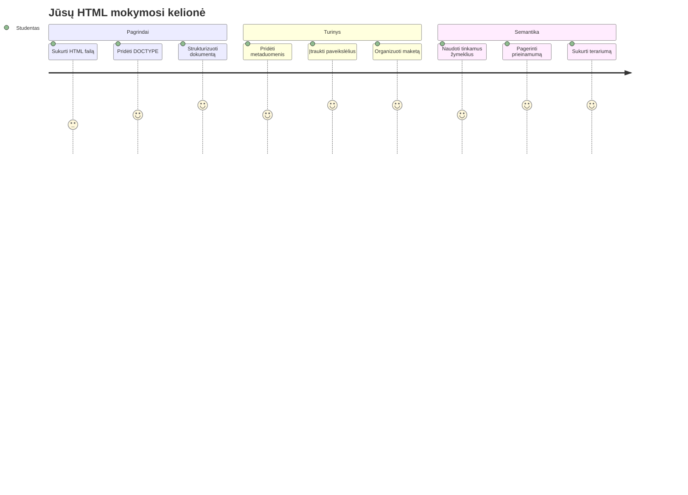
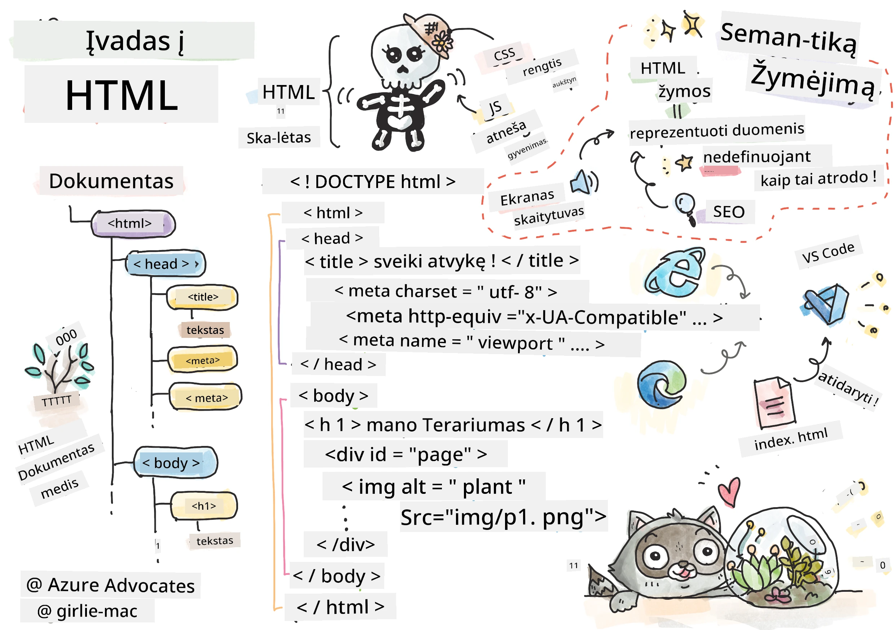
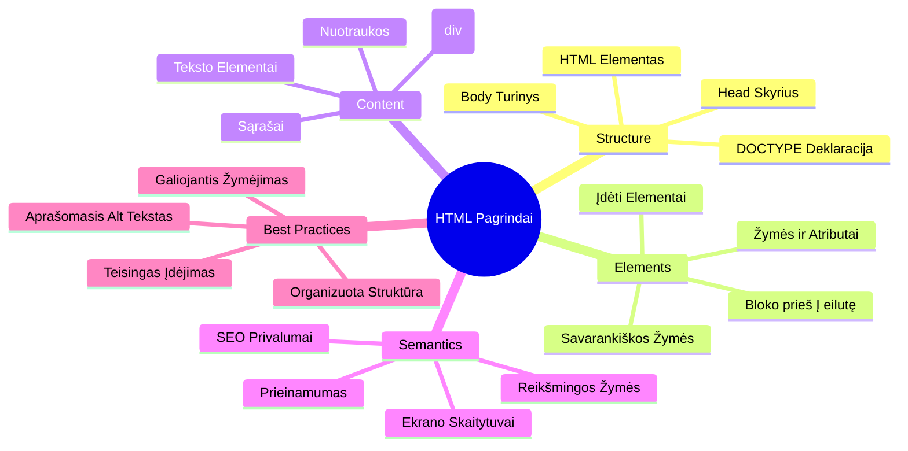
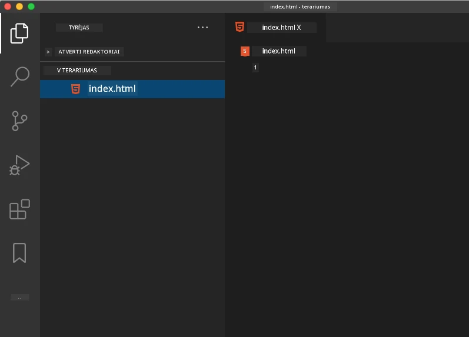
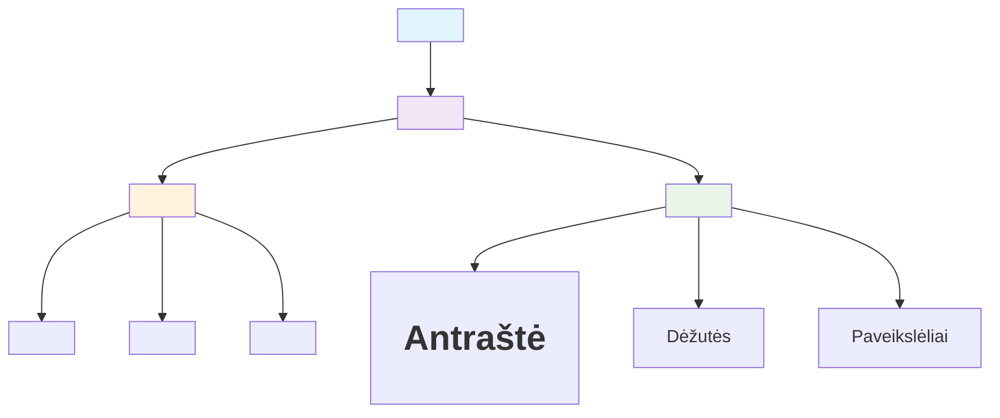
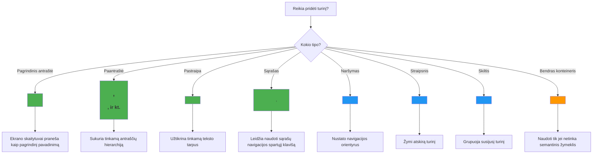
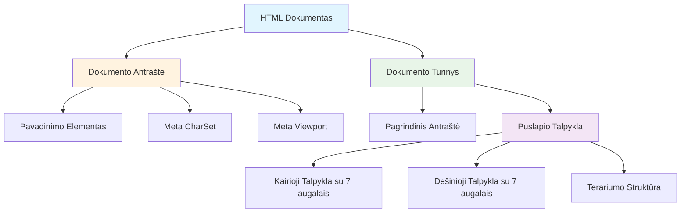
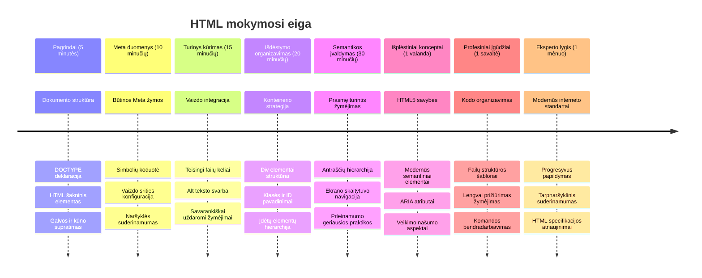

<!--
CO_OP_TRANSLATOR_METADATA:
{
  "original_hash": "3fcfa99c4897e051b558b5eaf1e8cc74",
  "translation_date": "2026-01-07T12:05:04+00:00",
  "source_file": "3-terrarium/1-intro-to-html/README.md",
  "language_code": "lt"
}
-->
# Terrarium Projektas 1 dalis: Įvadas į HTML



> Sketchnote autorius [Tomomi Imura](https://twitter.com/girlie_mac)

HTML arba HyperText Markup Language yra kiekvieno jūsų lankyto interneto svetainės pagrindas. Galvokite apie HTML kaip apie skeletą, kuris suteikia struktūrą tinklalapiams – jis apibrėžia, kur dedamas turinys, kaip jis organizuotas ir ką kiekvienas elementas reiškia. Nors CSS vėliau „papuoš“ jūsų HTML spalvomis ir išdėstymu, o JavaScript suteiks jam gyvybės su interaktyvumu, HTML suteikia būtiną struktūrą, dėl kurios visa kita tampa įmanoma.

Šios pamokos metu sukursite virtualaus terariumo sąsajos HTML struktūrą. Šis praktinis projektas išmokys pagrindines HTML sąvokas, tuo pačiu kuriant vizualiai patrauklų rezultatą. Išmoksite, kaip organizuoti turinį naudojant semantinius elementus, dirbti su paveikslėliais ir sukurti pagrindą interaktyviai interneto programai.

Pamokos pabaigoje turėsite veikiančią HTML puslapį, kuriame bus rodomi augalų paveikslėliai organizuotose stulpeliuose, paruoštus stilizavimui kitoje pamokoje. Nesijaudinkite, jei jis iš pradžių atrodo paprastas – būtent taip ir turi būti HTML prieš pridedant vizualinį apipavidalinimą su CSS.


## Priešpaskaitinis testas

[Priešpaskaitinis testas](https://ff-quizzes.netlify.app/web/quiz/15)

> 📺 **Žiūrėkite ir mokykitės**: Peržiūrėkite šį naudingą vaizdo įrašo apžvalgą
> 
> [](https://www.youtube.com/watch?v=1TvxJKBzhyQ)

## Projekto parengimas

Prieš pradėdami rašyti HTML kodą, susikurkite tinkamą darbo vietą savo terariumo projektui. Iš karto sukuriant tvarkingą failų struktūrą yra svarbi įprotis, kuris jums labai pasitarnaus visos interneto svetainių kūrimo kelionės metu.

### Užduotis: Sukurkite savo projekto struktūrą

Sukursite atskirą aplanką savo terariumo projektui ir pridėsite pirmąjį HTML failą. Štai du būdai, kuriuos galite naudoti:

**Variantas 1: Naudojant Visual Studio Code**  
1. Atidarykite Visual Studio Code  
2. Spauskite „File“ → „Open Folder“ arba naudokite `Ctrl+K, Ctrl+O` (Windows/Linux) arba `Cmd+K, Cmd+O` (Mac)  
3. Sukurkite naują aplanką `terrarium` ir jį pasirinkite  
4. „Explorer“ lange spauskite „New File“ ikoną  
5. Pavadinkite savo failą `index.html`



**Variantas 2: Naudojant terminalo komandas**  
```bash
mkdir terrarium
cd terrarium
touch index.html
code index.html
```
  
**Štai ką šios komandos atlieka:**  
- **Sukuria** naują katalogą `terrarium` jūsų projektui  
- **Pereina** į terrarium katalogą  
- **Sukuria** tuščią `index.html` failą  
- **Atidaro** failą Visual Studio Code redagavimui

> 💡 **Pro patarimas**: Failo vardas `index.html` yra ypatingas interneto programavimo srityje. Kai kas nors apsilanko tinklalapyje, naršyklės automatiškai ieško `index.html` kaip numatytojo puslapio. Tai reiškia, kad URL kaip `https://mysite.com/projects/` automatiškai pateiks `index.html` failą iš katalogo `projects`, nereikalaujant nurodyti failo pavadinimo URL.

## HTML dokumento struktūros supratimas

Kiekvienas HTML dokumentas turi specifinę struktūrą, kurią naršyklės turi suprasti ir teisingai atvaizduoti. Galvokite apie šią struktūrą kaip apie oficialų laišką – ji turi privalomus elementus tam tikra tvarka, kurie padeda gavėjui (šiuo atveju naršyklei) tinkamai apdoroti turinį.


Pradėkime pridėdami esminį pamatą, kurio kiekvienas HTML dokumentas reikalauja.

### DOCTYPE deklaracija ir šakninis elementas

Pirmos dvi bet kokio HTML failo eilutės veikia kaip dokumento „įžanga“ naršyklei:

```html
<!DOCTYPE html>
<html></html>
```
  
**Suprasdami ką daro šis kodas:**  
- **Deklaruoja** dokumento tipą kaip HTML5 naudojant `<!DOCTYPE html>`  
- **Sukuria** šakninį `<html>` elementą, kuriame bus visa puslapio turinys  
- **Nustato** šiuolaikinius interneto standartus teisingam naršyklių atvaizdavimui  
- **Užtikrina** vienodą rodymą skirtingose naršyklėse ir įrenginiuose

> 💡 **VS Code patarimas**: Užveskite pelę ant bet kurio HTML žymės VS Code, kad gautumėte naudingą informaciją iš MDN Web Docs, įskaitant naudojimo pavyzdžius ir naršyklių suderinamumo detales.

> 📚 **Sužinokite daugiau**: DOCTYPE deklaracija apsaugo naršykles nuo „quirks režimo“, kuris buvo naudojamas labai senų svetainių palaikymui. Šiuolaikinė interneto kūrimo praktika naudoja paprastą `<!DOCTYPE html>` deklaraciją, kuri užtikrina [standartų atitinkantį atvaizdavimą](https://developer.mozilla.org/docs/Web/HTML/Quirks_Mode_and_Standards_Mode).

### 🔄 **Pedagoginė peržiūra**  
**Sustokite ir apmąstykite**: Prieš tęsdami, įsitikinkite, kad suprantate:  
- ✅ Kodėl kiekvienas HTML dokumentas turi DOCTYPE deklaraciją  
- ✅ Ką talpina šakninis `<html>` elementas  
- ✅ Kaip ši struktūra padeda naršyklėms teisingai atvaizduoti puslapius

**Greitas savitikrinimas**: Ar galite savo žodžiais paaiškinti, ką reiškia „standartų atitinkantis atvaizdavimas“?

## Esminių dokumento metaduomenų pridėjimas

`<head>` sekcija HTML dokumente talpina svarbią informaciją, kurios reikia naršyklėms ir paieškos sistemoms, bet kurios lankytojai tiesiogiai nemato puslapyje. Galvokite apie tai kaip apie „užkulisių“ informaciją, kuri padeda jūsų tinklalapiui tinkamai veikti ir taisyklingai atrodyti įvairiuose įrenginiuose bei platformose.

Šie metaduomenys nurodo naršyklėms, kaip rodyti jūsų puslapį, kokį simbolių kodavimą naudoti ir kaip valdyti skirtingų ekrano dydžių palaikymą – visa tai būtina norint kurti profesionalias, prieinamas interneto svetaines.

### Užduotis: Pridėkite dokumento antraštę

Įterpkite šią `<head>` sekciją tarp atidarančių ir uždarančių `<html>` žymių:

```html
<head>
	<title>Welcome to my Virtual Terrarium</title>
	<meta charset="utf-8" />
	<meta http-equiv="X-UA-Compatible" content="IE=edge" />
	<meta name="viewport" content="width=device-width, initial-scale=1" />
</head>
```
  
**Išskaidant ką daro kiekvienas elementas:**  
- **Nustato** puslapio pavadinimą, kuris rodomas naršyklės skirtukuose ir paieškos rezultatuose  
- **Nurodo** UTF-8 simbolių kodavimą, kad tekstas būtų tinkamai rodomas visame pasaulyje  
- **Užtikrina** suderinamumą su naujesnėmis Internet Explorer versijomis  
- **Konfigūruoja** reaguojantį dizainą nustatydama viewport dydį pagal įrenginio plotį  
- **Valdo** pradinį padidinimą, kad turinys būtų rodomas natūraliu dydžiu

> 🤔 **Pagalvokite apie tai**: Kas nutiktų, jei nustatytumėte viewport meta žymę taip: `<meta name="viewport" content="width=600">`? Tai priverstų puslapį visada būti 600 pikselių pločio, sulaužydama reaguojantį dizainą! Sužinokite daugiau apie [teisingą viewport konfigūravimą](https://developer.mozilla.org/docs/Web/HTML/Viewport_meta_tag).

## Dokumento turinio kūrimas

`<body>` elementas talpina visą matomą jūsų tinklalapio turinį – viską, ką vartotojai matys ir su kuo bendraus. Kol `<head>` sekcija pateikia naršyklei instrukcijas, `<body>` sekcija turi faktinį turinį: tekstą, paveikslėlius, mygtukus ir kitus elementus, kurie sudaro vartotojo sąsają.

Pridėkime kūno struktūrą ir supraskime, kaip HTML žymės veikia kartu, kad sukurtų prasmingą turinį.

### HTML žymių struktūros supratimas

HTML naudoja porines žymes elementams apibrėžti. Dauguma žymių turi atidarančią `<p>` ir uždarančią `</p>` žymes, su turiniu tarp jų: `<p>Labas, pasauli!</p>`. Tai sukuria paragrafą su tekstu „Labas, pasauli!“.

### Užduotis: Pridėkite kūno elementą

Atnaujinkite savo HTML failą, kad jis turėtų `<body>` elementą:

```html
<!DOCTYPE html>
<html>
	<head>
		<title>Welcome to my Virtual Terrarium</title>
		<meta charset="utf-8" />
		<meta http-equiv="X-UA-Compatible" content="IE=edge" />
		<meta name="viewport" content="width=device-width, initial-scale=1" />
	</head>
	<body></body>
</html>
```
  
**Štai ką suteikia ši pilna struktūra:**  
- **Nustato** pagrindinę HTML5 dokumento schemą  
- **Įtraukia** svarbius metaduomenis teisingam naršyklės atvaizdavimui  
- **Sukuria** tuščią kūną, pasiruošusį jūsų matomam turiniui  
- **Laikosi** modernių interneto kūrimo geriausių praktikų

Dabar esate pasiruošę pridėti savo terariumo matomus elementus. Naudosime `<div>` elementus kaip konteinerius skirtingoms turinio dalims organizuoti ir `` elementus augalų paveikslėliams rodyti.

### Darbas su paveikslėliais ir išdėstymo konteineriais

Paveikslėliai HTML yra specialūs, nes naudoja „savą uždarymą“ - žymę. Skirtingai nei elementai kaip `<p></p>`, kurie apima turinį, `` žymė turi visą informaciją savyje naudodama atributus, tokius kaip `src` – paveikslėlio failo keliui ir `alt` – prieinamumui.

Prieš pridėdami paveikslėlius į HTML, turėsite tinkamai susiorganizuoti savo projekto failus sukurdami paveikslėlių aplanką ir pridėdami augalų grafikas.

**Pirmiausia, paruoškite savo paveikslėlius:**  
1. Sukurkite aplanką `images` savo terariumo projekto aplanko viduje  
2. Atsisiųskite augalų paveikslėlius iš [sprendimo aplanko](../../../../3-terrarium/solution/images) (iš viso 14 augalų paveikslėlių)  
3. Nukopijuokite visus augalų paveikslėlius į naują `images` aplanką

### Užduotis: Sukurkite augalų rodymo išdėstymą

Dabar pridėkite augalų paveikslėlius, organizuotus dviejuose stulpeliuose tarp `<body></body>` žymių:

```html
<div id="page">
	<div id="left-container" class="container">
		<div class="plant-holder">
			
		</div>
		<div class="plant-holder">
			
		</div>
		<div class="plant-holder">
			
		</div>
		<div class="plant-holder">
			
		</div>
		<div class="plant-holder">
			
		</div>
		<div class="plant-holder">
			
		</div>
		<div class="plant-holder">
			
		</div>
	</div>
	<div id="right-container" class="container">
		<div class="plant-holder">
			
		</div>
		<div class="plant-holder">
			
		</div>
		<div class="plant-holder">
			
		</div>
		<div class="plant-holder">
			
		</div>
		<div class="plant-holder">
			
		</div>
		<div class="plant-holder">
			
		</div>
		<div class="plant-holder">
			
		</div>
	</div>
</div>
```
  
**Žingsnis po žingsnio, štai kas vyksta šiame kode:**  
- **Sukuria** pagrindinį puslapio konteinerį su `id="page"`, kuris laiko visą turinį  
- **Nustato** du stulpelių konteinerius: `left-container` ir `right-container`  
- **Organizuoja** 7 augalus kairiajame stulpelyje ir 7 augalus dešiniajame stulpelyje  
- **Įdeda** kiekvieną augalo paveikslėlį į `plant-holder` `div` atskiram pozicionavimui  
- **Priskiria** nuoseklias klasės pavadinimus CSS stilizavimui kitoje pamokoje  
- **Pateikia** unikalius ID kiekvienam paveikslėliui interaktyvumui su JavaScript vėliau  
- **Nurodo** teisingus failų kelius į paveikslėlių aplanką

> 🤔 **Apmąstykite tai**: Pastebėkite, kad visų paveikslėlių `alt` tekstas dabar yra „plant“. Tai nėra idealu prieinamumui. Ekrano skaitytuvų vartotojai girdėtų „plant“ pakartotinai 14 kartų nežinodami, kuris konkretus augalas kiekviename paveikslėlyje. Ar galite sugalvoti geresnį, išsamesnį `alt` tekstą kiekvienam paveikslėliui?

> 📝 **HTML elementų tipai**: `<div>` elementai yra „blokinio lygio“ ir užima visą plotį, o `<span>` elementai yra „eilutės lygio“ ir užima tik reikiamą plotį. Ką manote, kas nutiktų, jei pakeistumėte visas `<div>` žymes į `<span>` žymes?

### 🔄 **Pedagoginė peržiūra**  
**Struktūros supratimas**: Skirkite akimirką peržiūrėti savo HTML struktūrą:  
- ✅ Ar galite identifikuoti pagrindinius jūsų išdėstymo konteinerius?  
- ✅ Ar suprantate, kodėl kiekvienas paveikslėlis turi unikalų ID?  
- ✅ Kaip apibūdintumėte `plant-holder` divų paskirtį?

**Vizualinė apžvalga**: Atidarykite HTML failą naršyklėje. Turėtumėte matyti:  
- Paprastą augalų paveikslėlių sąrašą  
- Paveikslėlius suskirstytus dviem stulpeliais  
- Paprastą, nestilizuotą išdėstymą

**Prisiminkite**: Ši paprasta išvaizda yra būtent tai, kaip turi atrodyti HTML prieš CSS stilizavimą!

Su šiuo žymėjimu augalai pasirodys ekrane, nors dar neatrodys tvarkingai – tam reikalingas CSS kitame pamokoje! Dabar turite tvirtą HTML pagrindą, kuris tinkamai organizuoja jūsų turinį ir laikosi geriausių prieinamumo praktikų.

## Semantinio HTML naudojimas prieinamumui

Semantinis HTML reiškia HTML elementų pasirinkimą pagal jų prasmę ir paskirtį, ne tik pagal išvaizdą. Naudodami semantinį žymėjimą perduodate struktūrą ir turinio prasmę naršyklėms, paieškos sistemoms ir pagalbinėms technologijoms, pvz., ekrano skaitytuvams.


Šis požiūris padaro jūsų svetaines prieinamesnes žmonėms su negalia ir padeda paieškos sistemoms geriau suprasti jūsų turinį. Tai esminė šiuolaikinio interneto plėtros principo dalis, kuri kuria geresnę patirtį visiems.

### Semantinio puslapio pavadinimo pridėjimas

Pridėkime tinkamą antraštę jūsų terariumo puslapiui. Įdėkite šią eilutę iškart po atidarančios `<body>` žymės:

```html
<h1>My Terrarium</h1>
```
  
**Kodėl semantinis žymėjimas svarbus:**  
- **Padeda** ekrano skaitytuvams naviguoti ir suprasti puslapio struktūrą  
- **Pagerina** paieškos sistemų optimizavimą (SEO), aiškindamas turinio hierarchiją  
- **Didina** prieinamumą vartotojams su regos sutrikimais ar pažinimo skirtumais  
- **Kuria** geresnę vartotojo patirtį visuose įrenginiuose ir platformose  
- **Laikosi** interneto standartų ir geriausių praktikos principų profesionaliai kūrėjų bendruomenei

**Semantinių ir neseemantinių pasirinkimų pavyzdžiai:**

| Paskirtis | ✅ Semantinis pasirinkimas | ❌ Neseemantinis pasirinkimas |
|---------|-----------------------|----------------------------|
| Pagrindinė antraštė | `<h1>Pavadinimas</h1>` | `<div class="big-text">Pavadinimas</div>` |
| Navigacija | `<nav><ul><li></li></ul></nav>` | `<div class="menu"><div></div></div>` |
| Mygtukas | `<button>Spustelėk mane</button>` | `<span onclick="...">Spustelėk mane</span>` |
| Straipsnio turinys | `<article><p></p></article>` | `<div class="content"><div></div></div>` |

> 🎥 **Pažiūrėkite veiksme**: Žiūrėkite [kaip ekrano skaitytuvai bendrauja su tinklalapiais](https://www.youtube.com/watch?v=OUDV1gqs9GA), kad suprastumėte, kodėl semantinis žymėjimas yra svarbus prieinamumui. Atkreipkite dėmesį, kaip tinkama HTML struktūra padeda vartotojams veiksmingai naršyti.

## Terariumo konteinerio kūrimas

Dabar pridėkime HTML struktūrą pačiam terariumui – stiklinėms talpykloms, kur bus dedami augalai. Ši sekcija demonstruoja svarbią sąvoką: HTML suteikia struktūrą, bet be CSS stilizavimo šie elementai dar nebus matomi.

Terariumo žymėjime naudojami aprašomieji klasės pavadinimai, kurie CSS stilizavimą padarys intuityvų ir lengvai prižiūrimą kitoje pamokoje.

### Užduotis: Pridėkite terariumo struktūrą

Įterpkite šį žymėjimą virš paskutinės `</div>` žymės (prieš puslapio konteinerio uždarymą):

```html
<div id="terrarium">
	<div class="jar-top"></div>
	<div class="jar-walls">
		<div class="jar-glossy-long"></div>
		<div class="jar-glossy-short"></div>
	</div>
	<div class="dirt"></div>
	<div class="jar-bottom"></div>
</div>
```
  
**Suprasdami šią terariumo struktūrą:**  
- **Sukuria** pagrindinį terariumo konteinerį su unikaliu ID stilizavimui
- **Apibrėžia** atskirus elementus kiekvienam vaizdiniam komponentui (viršus, sienos, žemė, apačia)
- **Įtraukia** įdėtus elementus stiklo atspindžių efektams (blizgūs elementai)
- **Naudoja** aprašomuosius klasės pavadinimus, aiškiai nurodančius kiekvieno elemento paskirtį
- **Paruošia** struktūrą CSS stiliavimui, kuris sukurs stiklinio terariumo išvaizdą

> 🤔 **Pastebėjote kažką?**: Nors pridėjote šį žymėjimą, puslapyje nematote nieko naujo! Tai puikiai iliustruoja, kaip HTML suteikia struktūrą, o CSS suteikia išvaizdą. Šie `<div>` elementai egzistuoja, bet dar neturi jokio vizualinio stiliaus – tai bus kitoje pamokoje!


### 🔄 **Pedagoginė kontrolė**
**HTML struktūros valdymas**: Prieš tęsdami, įsitikinkite, kad galite:
- ✅ Paaiškinti skirtumą tarp HTML struktūros ir vaizdinės išvaizdos
- ✅ Nustatyti semantinius ir ne-semantinius HTML elementus
- ✅ Apibūdinti, kaip tinkamas žymėjimas pagerina prieinamumą
- ✅ Atpažinti pilną dokumento medžio struktūrą

**Testuokite savo supratimą**: Atidarykite savo HTML failą naršyklėje su išjungtu JavaScript ir pašalintu CSS. Tai parodys jums sukurtą gryną semantinę struktūrą!

---

## GitHub Copilot agento iššūkis

Naudokite Agent režimą, kad įvykdytumėte šį iššūkį:

**Aprašymas:** Sukurkite semantinę HTML struktūrą augalų priežiūros gairių sekcijai, kurią būtų galima pridėti prie terariumo projekto.

**Užduotis:** Sukurkite semantinę HTML sekciją su pagrindiniu antrašte „Plantas priežiūros gidas“, trimis poskyriais su antraštėmis „Laistymas“, „Šviesos reikalavimai“ ir „Dirvožemio priežiūra“, kiekviename pateiktame po pastraipą augalo priežiūros informacijos. Naudokite tinkamus semantinius HTML žymėjimus, tokius kaip `<section>`, `<h2>`, `<h3>` ir `<p>`, kad turinys būtų teisingai struktūruotas.

Sužinokite daugiau apie [agentų režimą](https://code.visualstudio.com/blogs/2025/02/24/introducing-copilot-agent-mode).

## Ištirkite HTML istorijos iššūkį

**Sužinokite apie interneto evoliuciją**

HTML labai pasikeitė nuo tada, kai Timas Berners-Lee 1990 m. CERN sukūrė pirmąjį žiniatinklio naršyklę. Kai kurie senesni žymėjimai, pvz., `<marquee>`, dabar yra pasenę, nes jie blogai suderinami su šiuolaikiniais prieinamumo standartais ir reaguojančio dizaino principais.

**Išbandykite šį eksperimentą:**
1. Laikinai apvyniokite savo `<h1>` antraštę `<marquee>` žyma: `<marquee><h1>My Terrarium</h1></marquee>`
2. Atidarykite puslapį naršyklėje ir stebėkite slinkties efektą
3. Pagalvokite, kodėl ši žyma buvo pasenusi (užuomina: pagalvokite apie naudotojo patirtį ir prieinamumą)
4. Pašalinkite `<marquee>` žymą ir grįžkite prie semantinio žymėjimo

**Refleksijos klausimai:**
- Kaip slenkantis pavadinimas galėtų paveikti regėjimo negalią turinčius ar judesio jautrumą turinčius naudotojus?
- Kokios šiuolaikinės CSS technikos galėtų pasiekti panašius vaizdinius efektus, bet būtų labiau prieinamos?
- Kodėl svarbu naudoti dabartinius interneto standartus, o ne pasenusius elementus?

Išsamiau sužinokite apie [pasenusius ir pasenusius HTML elementus](https://developer.mozilla.org/docs/Web/HTML/Element#Obsolete_and_deprecated_elements), kad suprastumėte, kaip interneto standartai keičiasi siekiant geresnės naudotojo patirties.


## Po paskaitos testas

[Po paskaitos testas](https://ff-quizzes.netlify.app/web/quiz/16)

## Peržiūra ir savarankiškas mokymasis

**Pagilinkite savo HTML žinias**

HTML jau daugiau nei 30 metų yra interneto pagrindas, nuo paprastos dokumentų žymėjimo kalbos išsivystęs į pažangią platformą interaktyvioms programoms kurti. Suprasdami šią evoliuciją, geriau įvertinsite šiuolaikinius interneto standartus ir priimsite geresnius sprendimus programuojant.

**Rekomenduojami mokymosi keliai:**

1. **HTML istorija ir evoliucija**
   - Išnagrinėkite laiko juostą nuo HTML 1.0 iki HTML5
   - Išsiaiškinkite, kodėl tam tikros žymos buvo pašalintos (prieinamumas, mobilių įrenginių pritaikymas, priežiūra)
   - Tirti naujas HTML funkcijas ir pasiūlymus

2. **Semantinis HTML giliau**
   - Studijuokite pilną [HTML5 semantinių elementų sąrašą](https://developer.mozilla.org/docs/Web/HTML/Element)
   - Praktikuokite, kada naudoti `<article>`, `<section>`, `<aside>`, ir `<main>`
   - Sužinokite apie ARIA atributus geresniam prieinamumui

3. **Šiuolaikinis interneto kūrimas**
   - Išnagrinėkite [pritaikomų svetainių kūrimą](https://docs.microsoft.com/learn/modules/build-simple-website/?WT.mc_id=academic-77807-sagibbon) Microsoft Learn platformoje
   - Supraskite HTML integraciją su CSS ir JavaScript
   - Susipažinkite su interneto našumu ir SEO gerosiomis praktikomis

**Refleksijos klausimai:**
- Kurias pasenusias HTML žymas atradote ir kodėl jos buvo pašalintos?
- Kokios naujos HTML funkcijos siūlomos ateities versijoms?
- Kaip semantinis HTML prisideda prie svetainių prieinamumo ir SEO?

### ⚡ **Ką galite padaryti per ateinančias 5 minutes**
- [ ] Atidarykite DevTools (F12) ir apžiūrėkite mėgstamos svetainės HTML struktūrą
- [ ] Sukurkite paprastą HTML failą su pagrindinėmis žymomis: `<h1>`, `<p>`, ir ``
- [ ] Patikrinkite savo HTML W3C HTML Validator internete
- [ ] Pabandykite pridėti komentarą į savo HTML su `<!-- comment -->`

### 🎯 **Ką galite pasiekti šią valandą**
- [ ] Baikite po pamokos testą ir peržiūrėkite semantinio HTML sąvokas
- [ ] Sukurkite paprastą tinklapį apie save, naudodami tinkamą HTML struktūrą
- [ ] Eksperimentuokite su skirtingų lygmenų antraštėmis ir teksto formatavimo žymomis
- [ ] Įtraukite paveikslėlius ir nuorodas, kad išmėgintumėte multimedijos integraciją
- [ ] Ištirkite HTML5 funkcijas, kurių dar neišbandėte

### 📅 **Jūsų savaitės HTML kelias**
- [ ] Baikite terariumo projekto užduotį su semantiniu žymėjimu
- [ ] Sukurkite prieinamą tinklalapį, naudodami ARIA etiketes ir vaidmenis
- [ ] Praktikuokite formų kūrimą su įvairiais įvedimo tipais
- [ ] Išnagrinėkite HTML5 API, tokias kaip localStorage arba geolokacija
- [ ] Studijuokite reaguojančio HTML raštus ir mobiliems įrenginiams orientuotą dizainą
- [ ] Peržiūrėkite kitų kūrėjų HTML kodus, siekdami geriausių praktikų

### 🌟 **Jūsų mėnesio interneto pagrindai**
- [ ] Sukurkite portfelio svetainę, demonstruojančią jūsų HTML valdymą
- [ ] Išmokite HTML šablonų kūrimą su sistema, pavyzdžiui, Handlebars
- [ ] Prisidėkite prie atviro kodo projektų, tobulindami HTML dokumentaciją
- [ ] Išmokite pažangių HTML koncepcijų, pvz., pasirinktinius elementus
- [ ] Integruokite HTML su CSS sistemomis ir JavaScript bibliotekomis
- [ ] Mokykite kitus ir dalinkitės HTML pagrindais

## 🎯 Jūsų HTML įvaldymo laiko juosta


### 🛠️ Jūsų HTML įrankių santrauka

Pabaigę šią pamoką, turite:
- **Dokumento struktūrą**: pilną HTML5 pagrindą su tinkamu DOCTYPE
- **Semantinį žymėjimą**: prasmingas žymas, kurios gerina prieinamumą ir SEO
- **Paveikslėlių integraciją**: tinkamą failų organizavimą ir alt teksto taikymą
- **Išdėstymo konteinerius**: strategiškai naudojamus div su aprašomaisiais klasės pavadinimais
- **Prieinamumo suvokimą**: supratimą apie ekrano skaitytuvų navigaciją
- **Šiuolaikinius standartus**: dabartines HTML5 praktikas ir pasenusių žymų žinias
- **Projekto pagrindą**: tvirtą bazę CSS stiliavimui ir JavaScript interaktyvumui

**Tolimesni žingsniai**: Jūsų HTML struktūra paruošta CSS stiliaus pritaikymui! Sukurta semantinė bazė palengvins supratimą kitoje pamokoje.


## Užduotis

[Praktikuokite savo HTML: Sukurkite tinklaraščio maketą](assignment.md)

---

<!-- CO-OP TRANSLATOR DISCLAIMER START -->
**Atsakomybės apribojimas**:  
Šis dokumentas buvo išverstas naudojant dirbtinio intelekto vertimo paslaugą [Co-op Translator](https://github.com/Azure/co-op-translator). Nors stengiamės užtikrinti tikslumą, prašome atkreipti dėmesį, kad automatizuoti vertimai gali turėti klaidų ar netikslumų. Pirminis dokumentas gimtąja kalba laikomas autoritetingu šaltiniu. Svarbiai informacijai rekomenduojamas profesionalus žmogaus vertimas. Mes neatsakome už bet kokius nesusipratimus ar klaidingas interpretacijas, kilusias dėl šio vertimo naudojimo.
<!-- CO-OP TRANSLATOR DISCLAIMER END -->