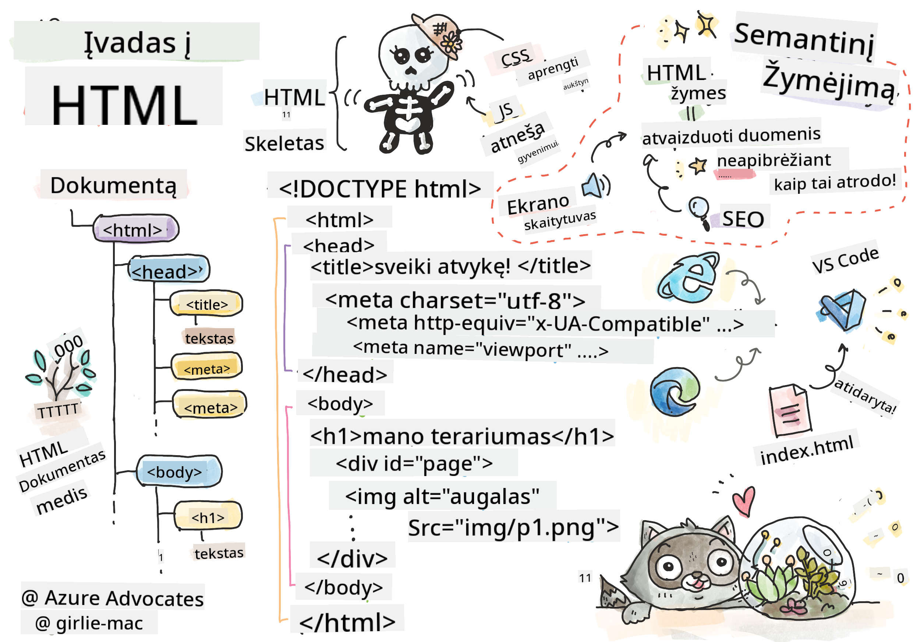

<!--
CO_OP_TRANSLATOR_METADATA:
{
  "original_hash": "46a0639e719b9cf1dfd062aa24cad639",
  "translation_date": "2025-08-28T11:49:10+00:00",
  "source_file": "3-terrarium/1-intro-to-html/README.md",
  "language_code": "lt"
}
-->
# Terariumo projektas 1 dalis: Įvadas į HTML


> Sketchnote sukūrė [Tomomi Imura](https://twitter.com/girlie_mac)

## Klausimynas prieš paskaitą

[Klausimynas prieš paskaitą](https://ff-quizzes.netlify.app/web/quiz/15)

> Peržiūrėkite vaizdo įrašą

> 
> [](https://www.youtube.com/watch?v=1TvxJKBzhyQ)

### Įvadas

HTML, arba HyperText Markup Language, yra interneto „skeletas“. Jei CSS „aprengia“ jūsų HTML, o JavaScript suteikia jam gyvybės, tai HTML yra jūsų internetinės programos kūnas. HTML sintaksė netgi atspindi šią idėją, nes ji apima „head“, „body“ ir „footer“ žymes.

Šioje pamokoje mes naudosime HTML, kad sukurtume virtualaus terariumo sąsajos „skeletą“. Jis turės pavadinimą ir tris stulpelius: dešinįjį ir kairįjį stulpelius, kuriuose bus perkeliamieji augalai, ir centrinę sritį, kuri bus stiklinio terariumo imitacija. Pamokos pabaigoje galėsite matyti augalus stulpeliuose, tačiau sąsaja atrodys šiek tiek keistai; nesijaudinkite, kitame skyriuje pridėsite CSS stilių, kad sąsaja atrodytų geriau.

### Užduotis

Savo kompiuteryje sukurkite aplanką pavadinimu „terrarium“ ir jame failą pavadinimu „index.html“. Tai galite padaryti naudodami Visual Studio Code, atidarę naują VS Code langą, spustelėję „open folder“ ir pasirinkę naują aplanką. Tada Explorer skydelyje spustelėkite mažą „file“ mygtuką ir sukurkite naują failą:


Arba

Naudokite šias komandas savo git bash:
* `mkdir terrarium`
* `cd terrarium`
* `touch index.html`
* `code index.html` arba `nano index.html`

> index.html failai naršyklei nurodo, kad tai yra numatytasis failas aplanke; URL, pvz., `https://anysite.com/test`, gali būti sukurtas naudojant aplankų struktūrą, kurioje yra aplankas „test“ su „index.html“ viduje; „index.html“ nebūtinai turi būti rodomas URL.

---

## DocType ir html žymės

Pirmoji HTML failo eilutė yra jo doctype. Gali būti šiek tiek netikėta, kad ši eilutė turi būti pačiame failo viršuje, tačiau ji nurodo senesnėms naršyklėms, kad puslapis turi būti atvaizduojamas standartiniu režimu, laikantis dabartinės HTML specifikacijos.

> Patarimas: VS Code galite užvesti pelės žymeklį ant žymės ir gauti informaciją apie jos naudojimą iš MDN Reference vadovų.

Antroji eilutė turėtų būti `<html>` žymės atidarymo žymė, o iškart po jos – uždarymo žymė `</html>`. Šios žymės yra jūsų sąsajos šaknies elementai.

### Užduotis

Pridėkite šias eilutes savo `index.html` failo viršuje:

```HTML
<!DOCTYPE html>
<html></html>
```

✅ Yra keletas skirtingų režimų, kuriuos galima nustatyti naudojant DocType su užklausos eilute: [Quirks Mode ir Standards Mode](https://developer.mozilla.org/docs/Web/HTML/Quirks_Mode_and_Standards_Mode). Šie režimai buvo naudojami palaikyti labai senas naršykles, kurios šiais laikais beveik nenaudojamos (pvz., Netscape Navigator 4 ir Internet Explorer 5). Galite laikytis standartinio doctype deklaravimo.

---

## Dokumento „head“

HTML dokumento „head“ sritis apima svarbią informaciją apie jūsų tinklalapį, dar vadinamą [metaduomenimis](https://developer.mozilla.org/docs/Web/HTML/Element/meta). Mūsų atveju, mes nurodome žiniatinklio serveriui, kuriam šis puslapis bus siunčiamas atvaizduoti, šiuos keturis dalykus:

-   puslapio pavadinimą
-   puslapio metaduomenis, įskaitant:
    -   „character set“, nurodantį, kokia simbolių koduotė naudojama puslapyje
    -   naršyklės informaciją, įskaitant `x-ua-compatible`, kuris nurodo, kad palaikoma IE=edge naršyklė
    -   informaciją apie tai, kaip turėtų elgtis peržiūros sritis, kai ji įkeliama. Nustatant peržiūros sritį su pradiniu masteliu 1, kontroliuojamas priartinimo lygis, kai puslapis pirmą kartą įkeliamas.

### Užduotis

Pridėkite „head“ bloką savo dokumente tarp `<html>` atidarymo ir uždarymo žymių.

```html
<head>
	<title>Welcome to my Virtual Terrarium</title>
	<meta charset="utf-8" />
	<meta http-equiv="X-UA-Compatible" content="IE=edge" />
	<meta name="viewport" content="width=device-width, initial-scale=1" />
</head>
```

✅ Kas nutiktų, jei nustatytumėte peržiūros srities meta žymę taip: `<meta name="viewport" content="width=600">`? Skaitykite daugiau apie [peržiūros sritį](https://developer.mozilla.org/docs/Web/HTML/Viewport_meta_tag).

---

## Dokumento `body`

### HTML žymės

HTML faile pridedate žymes, kad sukurtumėte tinklalapio elementus. Kiekviena žymė paprastai turi atidarymo ir uždarymo žymę, pvz.: `<p>hello</p>`, kad nurodytų pastraipą. Sukurkite savo sąsajos kūną, pridėdami `<body>` žymių rinkinį tarp `<html>` žymių poros; jūsų žymėjimas dabar atrodo taip:

### Užduotis

```html
<!DOCTYPE html>
<html>
	<head>
		<title>Welcome to my Virtual Terrarium</title>
		<meta charset="utf-8" />
		<meta http-equiv="X-UA-Compatible" content="IE=edge" />
		<meta name="viewport" content="width=device-width, initial-scale=1" />
	</head>
	<body></body>
</html>
```

Dabar galite pradėti kurti savo puslapį. Paprastai naudojate `<div>` žymes, kad sukurtumėte atskirus puslapio elementus. Sukursime seriją `<div>` elementų, kuriuose bus vaizdai.

### Vaizdai

Viena HTML žymė, kuriai nereikia uždarymo žymės, yra `` žymė, nes ji turi `src` elementą, kuriame yra visa informacija, reikalinga puslapiui atvaizduoti elementą.

Sukurkite savo programoje aplanką pavadinimu `images` ir jame pridėkite visus vaizdus iš [šaltinio kodo aplanko](../../../../3-terrarium/solution/images); (yra 14 augalų vaizdų).

### Užduotis

Pridėkite tuos augalų vaizdus į du stulpelius tarp `<body></body>` žymių:

```html
<div id="page">
	<div id="left-container" class="container">
		<div class="plant-holder">
			
		</div>
		<div class="plant-holder">
			
		</div>
		<div class="plant-holder">
			
		</div>
		<div class="plant-holder">
			
		</div>
		<div class="plant-holder">
			
		</div>
		<div class="plant-holder">
			
		</div>
		<div class="plant-holder">
			
		</div>
	</div>
	<div id="right-container" class="container">
		<div class="plant-holder">
			
		</div>
		<div class="plant-holder">
			
		</div>
		<div class="plant-holder">
			
		</div>
		<div class="plant-holder">
			
		</div>
		<div class="plant-holder">
			
		</div>
		<div class="plant-holder">
			
		</div>
		<div class="plant-holder">
			
		</div>
	</div>
</div>
```

> Pastaba: Span ir Div skirtumai. Div yra laikomi „blokų“ elementais, o Span – „eilutės“. Kas nutiktų, jei šiuos div pakeistumėte į span?

Naudodami šį žymėjimą, augalai dabar rodomi ekrane. Tai atrodo gana prastai, nes jie dar nėra stilizuoti naudojant CSS, tačiau tai padarysime kitoje pamokoje.

Kiekvienas vaizdas turi alternatyvų tekstą, kuris pasirodys, net jei negalite matyti ar atvaizduoti vaizdo. Tai svarbus atributas, kurį reikia įtraukti dėl prieinamumo. Sužinokite daugiau apie prieinamumą būsimose pamokose; kol kas prisiminkite, kad alt atributas pateikia alternatyvią informaciją apie vaizdą, jei vartotojas dėl kokių nors priežasčių negali jo matyti (dėl lėto ryšio, klaidos src atribute arba jei vartotojas naudoja ekrano skaitytuvą).

✅ Ar pastebėjote, kad kiekvienas vaizdas turi tą patį alt tekstą? Ar tai gera praktika? Kodėl taip arba kodėl ne? Ar galite patobulinti šį kodą?

---

## Semantinis žymėjimas

Apskritai, rašant HTML, geriau naudoti prasmingą „semantiką“. Ką tai reiškia? Tai reiškia, kad naudojate HTML žymes, kurios atspindi duomenų tipą arba sąveiką, kuriai jos buvo sukurtos. Pavyzdžiui, pagrindinis puslapio pavadinimo tekstas turėtų naudoti `<h1>` žymę.

Pridėkite šią eilutę iškart po `<body>` atidarymo žymės:

```html
<h1>My Terrarium</h1>
```

Naudojant semantinį žymėjimą, pvz., antraštėms naudoti `<h1>` ir nesutvarkytoms sąrašams naudoti `<ul>`, padedama ekrano skaitytuvams naršyti puslapyje. Apskritai, mygtukai turėtų būti rašomi kaip `<button>`, o sąrašai – kaip `<li>`. Nors _įmanoma_ naudoti specialiai stilizuotus `<span>` elementus su paspaudimo valdikliais, kad imituotumėte mygtukus, neįgaliesiems skirtos technologijos geriau nustato, kur puslapyje yra mygtukas, ir sąveikauja su juo, jei elementas atrodo kaip mygtukas. Dėl šios priežasties stenkitės kuo daugiau naudoti semantinį žymėjimą.

✅ Pažvelkite į ekrano skaitytuvą ir [kaip jis sąveikauja su tinklalapiu](https://www.youtube.com/watch?v=OUDV1gqs9GA). Ar matote, kodėl nesemantinis žymėjimas gali sukelti vartotojui nepatogumų?

## Terariumas

Paskutinė šios sąsajos dalis apima žymėjimo kūrimą, kuris bus stilizuotas, kad sukurtų terariumą.

### Užduotis:

Pridėkite šį žymėjimą virš paskutinės `</div>` žymės:

```html
<div id="terrarium">
	<div class="jar-top"></div>
	<div class="jar-walls">
		<div class="jar-glossy-long"></div>
		<div class="jar-glossy-short"></div>
	</div>
	<div class="dirt"></div>
	<div class="jar-bottom"></div>
</div>
```

✅ Nors pridėjote šį žymėjimą ekrane, nieko nesimato. Kodėl?

---

## 🚀Iššūkis

HTML yra keletas senų „laukinės“ išvaizdos žymių, kurios vis dar smagios naudoti, nors neturėtumėte naudoti pasenusių žymių, tokių kaip [šios žymės](https://developer.mozilla.org/docs/Web/HTML/Element#Obsolete_and_deprecated_elements), savo žymėjime. Vis dėlto, ar galite naudoti seną `<marquee>` žymę, kad h1 pavadinimas slinktų horizontaliai? (jei taip padarysite, nepamirškite jos pašalinti vėliau)

## Klausimynas po paskaitos

[Klausimynas po paskaitos](https://ff-quizzes.netlify.app/web/quiz/16)

## Apžvalga ir savarankiškas mokymasis

HTML yra „patikrinta ir patikima“ statybinių blokų sistema, padėjusi sukurti internetą tokį, koks jis yra šiandien. Sužinokite šiek tiek apie jo istoriją, išnagrinėdami senas ir naujas žymes. Ar galite suprasti, kodėl kai kurios žymės buvo pasenusios, o kitos pridėtos? Kokios žymės galėtų būti pristatytos ateityje?

Sužinokite daugiau apie svetainių kūrimą žiniatinkliui ir mobiliesiems įrenginiams [Microsoft Learn](https://docs.microsoft.com/learn/modules/build-simple-website/?WT.mc_id=academic-77807-sagibbon).

## Užduotis

[Praktikuokite HTML: Sukurkite tinklaraščio maketą](assignment.md)

---

**Atsakomybės apribojimas**:  
Šis dokumentas buvo išverstas naudojant AI vertimo paslaugą [Co-op Translator](https://github.com/Azure/co-op-translator). Nors siekiame tikslumo, prašome atkreipti dėmesį, kad automatiniai vertimai gali turėti klaidų ar netikslumų. Originalus dokumentas jo gimtąja kalba turėtų būti laikomas autoritetingu šaltiniu. Kritinei informacijai rekomenduojama naudoti profesionalų žmogaus vertimą. Mes neprisiimame atsakomybės už nesusipratimus ar klaidingus interpretavimus, atsiradusius dėl šio vertimo naudojimo.