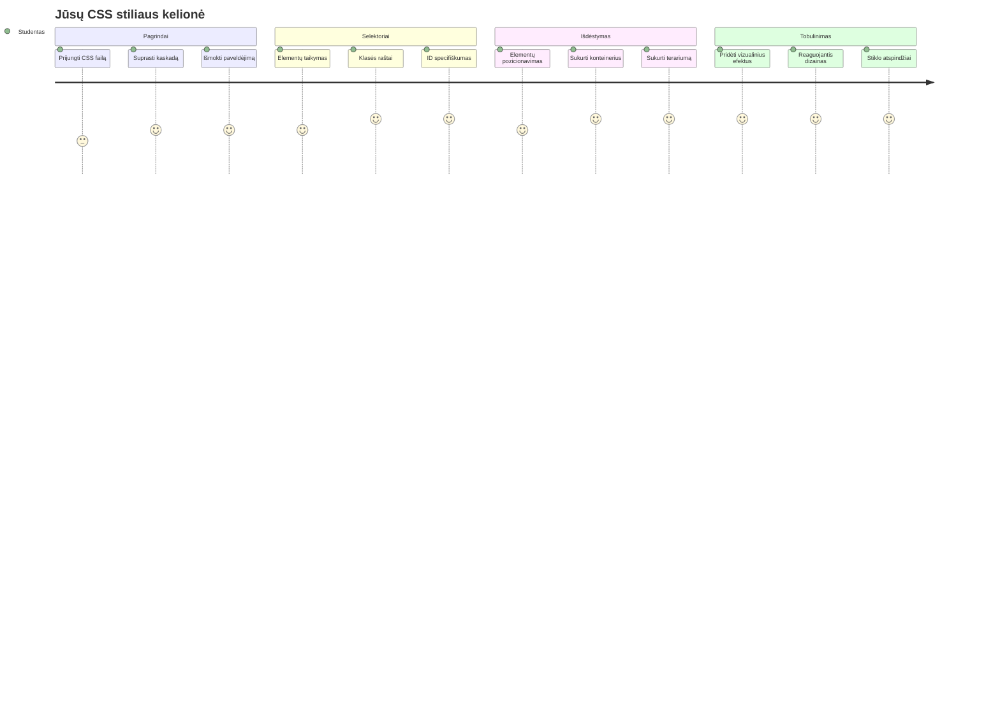
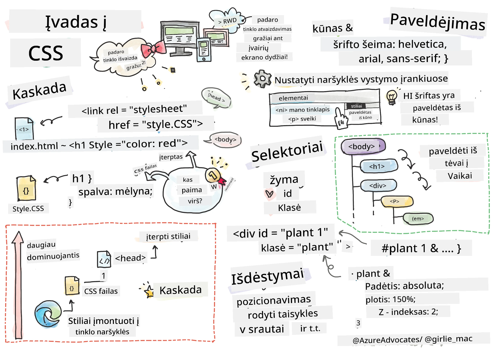
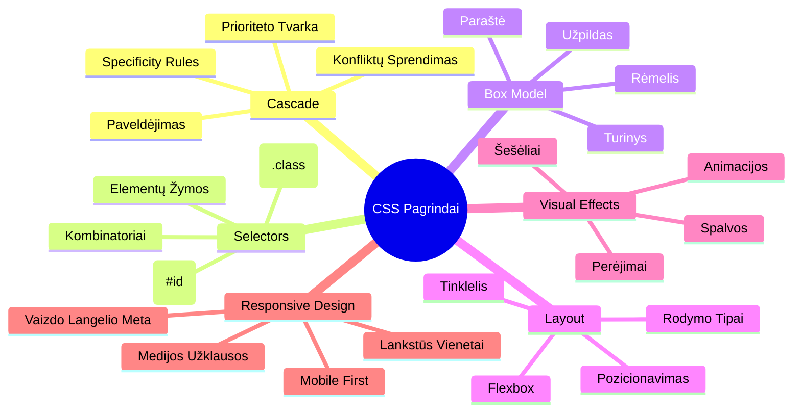
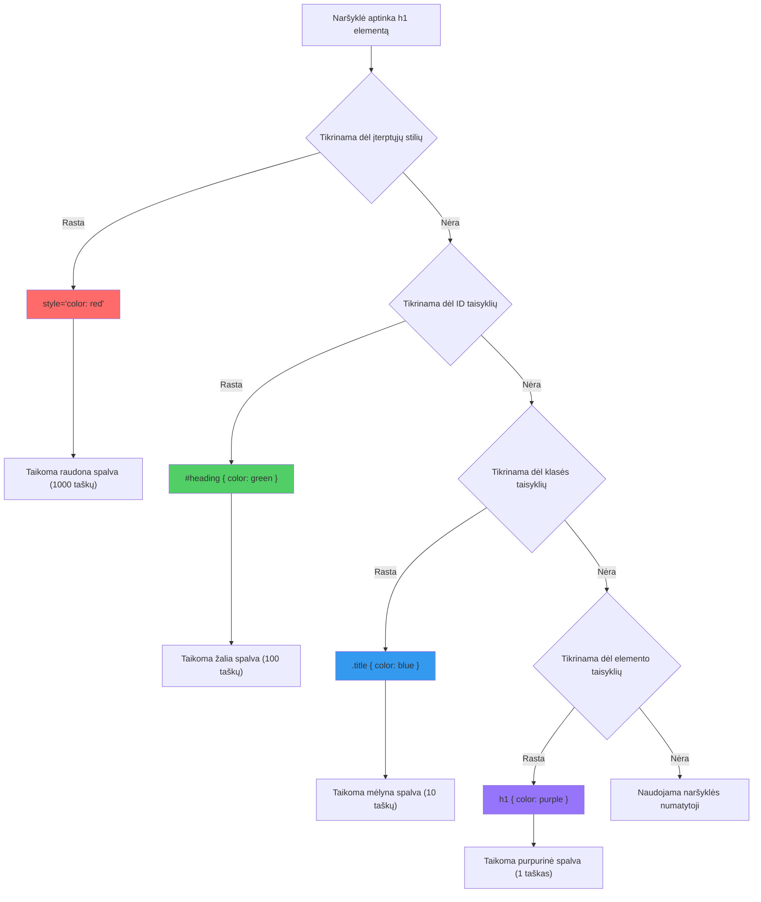
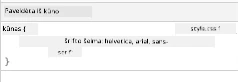
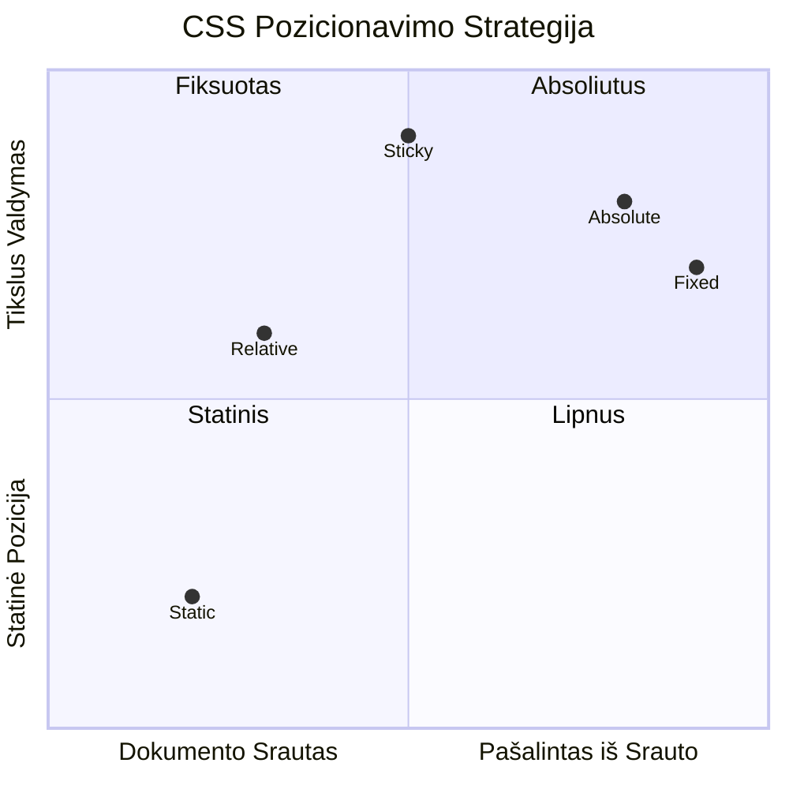
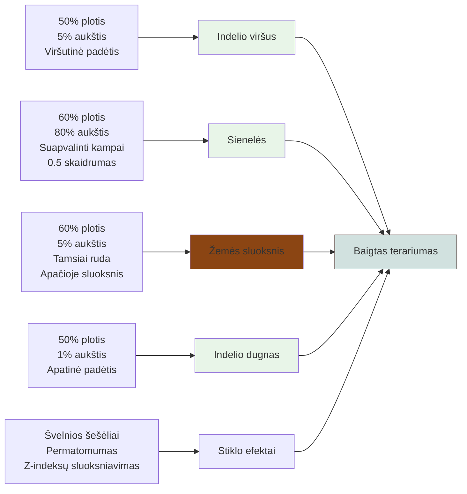
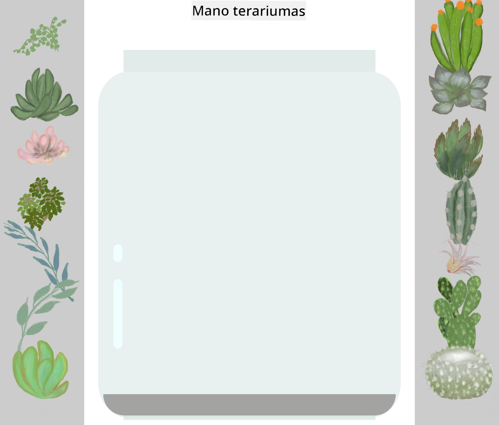
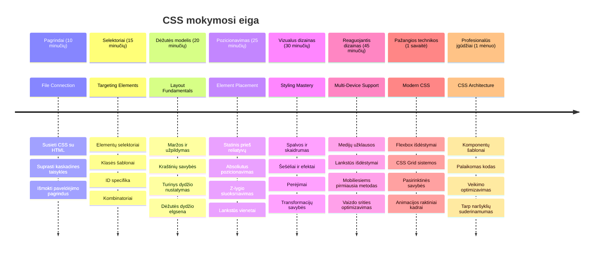

# Terrarium projektas 2 dalis: Įvadas į CSS



> Sketchnote autorius [Tomomi Imura](https://twitter.com/girlie_mac)

Prisimeni, kaip tavo HTML terrariumas atrodė gana paprastai? CSS yra ta vieta, kur mes tą paprastą struktūrą paverčiame vizualiai patrauklia.

Jei HTML yra kaip namo karkaso statyba, tai CSS yra viskas, kas daro namus jaukiais - dažų spalvos, baldų išdėstymas, apšvietimas ir kaip kambariai „surišti“ į vieną visumą. Pagalvok apie Versalio rūmus, kurie prasidėjo kaip paprasta medžioklės trobelė, bet dėmesys dekoracijoms ir išplanavimui pavertė juos vienu iš nuostabiausių pasaulio pastatų.

Šiandien mes pavirsime tavo terrariumą iš funkcinio į tobulai atrodantį. Sužinosi, kaip tiksliai pozicionuoti elementus, kaip išdėstymas reaguoja į skirtingo dydžio ekranus ir kaip sukurti vizualų patrauklumą, kuris daro svetaines patrauklias.

Pamokos pabaigoje pamatysi, kaip strategiškai taikomas CSS stilius gali drastiškai pagerinti tavo projektą. Pridėkime šiek tiek stiliaus tavo terrariumui.


## Priešpaskaitos testas

[Priešpaskaitos testas](https://ff-quizzes.netlify.app/web/quiz/17)

## Pradžia su CSS

Dažnai CSS laikomas tiesiog „kaip padaryti gražu“, bet jo paskirtis yra daug platesnė. CSS yra kaip filmo režisierius - tu kontroliuoji ne tik kaip viskas atrodo, bet kaip tai juda, reaguoja į vartotojo veiksmus ir prisitaiko prie skirtingų situacijų.

Šiuolaikinis CSS yra ypač galingas. Gali rašyti kodą, kuris automatiškai prisitaiko prie telefonų, planšečių ir darbalaukių išdėstymų. Gali sukurti sklandžias animacijas, kurios nukreipia vartotojų dėmesį ten, kur reikia. Rezultatai gali būti labai įspūdingi, kai viskas veikia kartu.

> 💡 **Profesionalus Patarimas**: CSS nuolat evoliucionuoja su naujomis funkcijomis ir galimybėmis. Visada patikrink [CanIUse.com](https://caniuse.com), kad patvirtintum naršyklių palaikymą naujesnėms CSS funkcijoms prieš jas naudodamas gamybiniuose projektuose.

**Štai ką mes pasieksime šioje pamokoje:**
- **Sukursime** pilną vizualinį dizainą tavo terrariumui, naudojant modernias CSS technikas
- **Išnagrinėsime** pagrindines koncepcijas, tokias kaip kaskada, paveldėjimas ir CSS selektoriai
- **Įgyvendinsime** reaguojančias pozicionavimo ir išdėstymo strategijas
- **Sukursime** terrariumo konteinerį naudodami CSS formas ir stilių

### Prieš sąlyga

Turėtum būti užbaigęs HTML struktūrą savo terrariumui iš ankstesnės pamokos ir turėti ją paruoštą stiliui.

> 📺 **Vaizdo ištekliai**: Peržiūrėk šį naudingą video gidą
>
> [](https://www.youtube.com/watch?v=6yIdOIV9p1I)

### CSS failo paruošimas

Prieš pradedant stilizavimą, turime susieti CSS su mūsų HTML. Šis ryšys parodo naršyklei, kur rasti stilių instrukcijas mūsų terrariumui.

Savo terrarium aplanke sukurk naują failą, pavadintą `style.css`, tada susiek jį savo HTML dokumento `<head>` skiltyje:

```html
<link rel="stylesheet" href="./style.css" />
```

**Štai ką atlieka šis kodas:**
- **Sukuria** ryšį tarp tavo HTML ir CSS failų
- **Nurodo** naršyklei pakrauti ir pritaikyti stilius iš `style.css`
- **Naudoja** atributą `rel="stylesheet"`, nurodantį, kad tai CSS failas
- **Nurodo** failo kelią atributu `href="./style.css"`

## CSS kaskados supratimas

Ar kada nors klausėte, kodėl CSS vadinamas "Cascading" Style Sheets? Stiliai leidžiasi žemyn kaip krioklys ir kartais jie konfliktuoja tarpusavyje.

Pavyzdžiui, kaip veikia kariniai įsakymų lygiai - bendrasis įsakymas gali būti „visos pajėgos dėvi žalią“, bet konkretaus tavo vieneto įsakymas gali skambėti „ceremonijai dėvėkite mėlyną uniformą“. Konkretus nurodymas turi pirmenybę. CSS laikosi panašios logikos, ir supratimas apie šią hierarchiją palengvina klaidų taisymą.

### Eksperimentas su kaskados prioritetu

Pažiūrėkime kaskadą veikime sukuriant stilių konfliktą. Pirmiausia pridėk internetinį stilių savo `<h1>` žymelei:

```html
<h1 style="color: red">My Terrarium</h1>
```

**Šis kodas daro:**
- **Pritaiko** raudoną spalvą tiesiogiai `<h1>` elementui naudojant internetinį stilizavimą
- **Naudoja** atributą `style`, kad įterptų CSS tiesiai į HTML
- **Sukuria** aukščiausios prioritetinės taisyklės stilių šiam konkrečiam elementui

Tada pridėk šią taisyklę į savo `style.css` failą:

```css
h1 {
  color: blue;
}
```

**Aukščiau mes:**
- **Nustatėme** CSS taisyklę, taikomą visiems `<h1>` elementams
- **Nustatėme** teksto spalvą mėlyną naudojant išorinį stiliaus lapą
- **Sukūrėme** žemesnės prioritetinės taisyklės stilių lyginant su internetiniu stiliumi

✅ **Žinių tikrinimas**: Kokia spalva rodoma tavo internetinėje programoje? Kodėl būtent ši spalva laimi? Ar gali įsivaizduoti situacijas, kai norėtum perrašyti stilius?


> 💡 **CSS Prioriteto tvarka (nuo didžiausio iki mažiausio):**
> 1. **Internetiniai stiliai** (atributas style)
> 2. **ID** (#myId)
> 3. **Klasės** (.myClass) ir atributai
> 4. **Elemento selektoriai** (h1, div, p)
> 5. **Naršyklės numatytieji stiliai**

## CSS paveldėjimas veikime

CSS paveldėjimas veikia kaip genetika - elementai paveldi tam tikras savybes iš savo tėvinių elementų. Jei nustatysi šrifto šeimą ant body elemento, visas tekstas tame elemente automatiškai naudos tą patį šriftą. Tai panašu į Habzburgų šeimą, kurios būdingas smakro bruožas pasireiškė per kartas, nors jis nebuvo nurodytas kiekvienam asmeniui atskirai.

Tačiau ne viskas paveldima. Teksto stiliai, tokie kaip šriftai ir spalvos, paveldimi, bet išdėstymo savybės kaip tarpai ir kraštinės ne. Kaip vaikai gali paveldėti fizines savybes, bet ne tėvų mados pasirinkimus.

### Šrifto paveldėjimo stebėjimas

Pažiūrėkime paveldėjimą nustatant šrifto šeimą ant `<body>` elemento:

```css
body {
  font-family: 'Segoe UI', Tahoma, Geneva, Verdana, sans-serif;
}
```

**Analizė:**
- **Nustato** šrifto šeimą visai svetainei taikant `<body>` selektorių
- **Naudoja** kelių šriftų seką su atsarginiais variantais geresnei naršyklių suderinamumui
- **Taiko** modernius sistemos šriftus, kurie atrodo gerai skirtingose operacinėse sistemose
- **Užtikrina**, kad visi vaikiniai elementai paveldi šį šriftą, nebent jis būtų konkrečiai perrašytas

Atidaryk naršyklės kūrėjų įrankius (F12), eik į "Elements" skiltį ir apžiūrėk savo `<h1>` elementą. Pamatysi, kad jis paveldi šrifto šeimą iš body:



✅ **Eksperimentas**: Išbandyk nustatyti kitas paveldimas savybes ant `<body>`, kaip `color`, `line-height` arba `text-align`. Kas nutinka tavo antraštei ir kitiems elementams?

> 📝 **Paveldimos savybės yra**: `color`, `font-family`, `font-size`, `line-height`, `text-align`, `visibility`
>
> **Nepaveldimos savybės yra**: `margin`, `padding`, `border`, `width`, `height`, `position`

### 🔄 **Pedagoginis patikrinimas**
**CSS pagrindų supratimas**: Prieš pereinant prie selektorių, įsitikink, kad gali:
- ✅ Paaiškinti skirtumą tarp kaskados ir paveldėjimo
- ✅ Numatyti, kuris stilius laimės specifikos konflikte
- ✅ Nustatyti, kurios savybės paveldimos iš tėvinių elementų
- ✅ Teisingai susieti CSS failus su HTML

**Greitas testas**: Jei turi šiuos stilius, kokia spalva bus `<h1>`, kuris yra viduje `<div class="special">`?
```css
div { color: blue; }
.special { color: green; }
h1 { color: red; }
```
*Atsakymas: Raudona (elementų selektorius tiesiogiai taiko h1)*

## CSS selektorių įvaldymas

CSS selektoriai leidžia tiksliai taikyti stilių konkretiems elementams. Jie veikia kaip tikslūs nurodymai – vietoje „namas“ pasakai „mėlynas namas su raudonomis durimis Maple gatvėje“.

CSS suteikia skirtingus būdus būti konkrečiam, o pasirinkti tinkamą selektorių – tai kaip pasirinkti tinkamą įrankį darbui. Kartais reikia stilizuoti kiekvienas kaimynystės duris, o kartais tik vienas specifines.

### Elementų selektoriai (žymės)

Elemento selektoriai taiko stilių HTML elementams pagal jų žymės pavadinimą. Jie puikūs nustatyti bazinius stilius, kurie pritaikomi plačiai puslapyje:

```css
body {
  font-family: 'Segoe UI', Tahoma, Geneva, Verdana, sans-serif;
  margin: 0;
  padding: 0;
}

h1 {
  color: #3a241d;
  text-align: center;
  font-size: 2.5rem;
  margin-bottom: 1rem;
}
```

**Šių stilių supratimas:**
- **Nustato** nuoseklią tipografiją visam puslapiui su `body` selektoriumi
- **Pašalina** naršyklės numatytuosius tarpelius ir padding’ą geresnei kontrolei
- **Stilizuoja** visas antraštes spalva, lygiavimu ir tarpais
- **Naudoja** `rem` vienetus skalūriam šrifto dydžiui ir geresniam pasiekiamumui

Nors elementų selektoriai puikiai tinka bendram stilizavimui, tau reikės specifinių selektorių atskiriems komponentams, tokiems kaip augalai tavo terrariume.

### ID selektoriai unikaliems elementams

ID selektoriai naudoja simbolį `#` ir taiko elementams su unikaliais `id` atributais. Kadangi ID puslapyje turi būti unikalūs, jie puikiai tinka stilizuoti pavieniams, išskirtiniams elementams, kaip mūsų kairės ir dešinės augalų talpyklos.

Sukurkime stilių terrariumo šoninėms talpykloms, kur bus augalai:

```css
#left-container {
  background-color: #f5f5f5;
  width: 15%;
  left: 0;
  top: 0;
  position: absolute;
  height: 100vh;
  padding: 1rem;
  box-sizing: border-box;
}

#right-container {
  background-color: #f5f5f5;
  width: 15%;
  right: 0;
  top: 0;
  position: absolute;
  height: 100vh;
  padding: 1rem;
  box-sizing: border-box;
}
```

**Šis kodas atlieka:**
- **Pozicionuoja** konteinerius ties kairiu ir dešiniu kraštu naudodamas `absolute` pozicionavimą
- **Naudoja** `vh` (žiūrovo aukščio) vienetus, kad aukštis reaguotų į ekrano dydį
- **Taiko** `box-sizing: border-box`, kad padding būtų įskaičiuotas į bendrą plotį
- **Pašalina** nereikalingus `px` vienetus nuo nulinių reikšmių, kad kodas būtų švaresnis
- **Nustato** subtilią fono spalvą, kuri geriau akis ramina nei ryškiai pilka

✅ **Kodo kokybės iššūkis**: Pastebėk, kaip šis CSS pažeidžia DRY (Don't Repeat Yourself) principą. Ar gali jį pertvarkyti naudodamas tiek ID, tiek klasę?

**Patobulintas metodas:**
```html
<div id="left-container" class="container"></div>
<div id="right-container" class="container"></div>
```

```css
.container {
  background-color: #f5f5f5;
  width: 15%;
  top: 0;
  position: absolute;
  height: 100vh;
  padding: 1rem;
  box-sizing: border-box;
}

#left-container {
  left: 0;
}

#right-container {
  right: 0;
}
```

### Klasės selektoriai pakartotinai naudojamiems stiliams

Klasės selektoriai naudoja simbolį `.` ir puikiai tinka, kai nori tuos pačius stilius taikyti daugeliui elementų. Skirtingai nuo ID, klasės gali būti naudojamos keliose HTML vietose, todėl jos idealios vienodų stiliaus šablonų taikymui.

Mūsų terrariume kiekvienam augalui reikia panašaus stilizavimo, bet kartu kiekvienas turi savo poziciją. Naudosime klasės ir ID kombinaciją: klasėms bendrai stilizuoti ir ID unikaliam pozicionavimui.

**Štai HTML struktūra kiekvienam augalui:**
```html
<div class="plant-holder">
  
</div>
```

**Svarbiausi elementai:**
- **Naudoja** `class="plant-holder"` nuosekliai konteinerių stilizacijai visiems augalams
- **Taiko** `class="plant"` bendriems paveikslėlių stiliams ir elgesiui
- **Turi** unikalų `id="plant1"` individualiam pozicionavimui ir JavaScript sąveikai
- **Pateikia** aprašomąjį alt tekstą ekrano skaitytojams

Dabar pridėk šiuos stilius į savo `style.css` failą:

```css
.plant-holder {
  position: relative;
  height: 13%;
  left: -0.6rem;
}

.plant {
  position: absolute;
  max-width: 150%;
  max-height: 150%;
  z-index: 2;
  transition: transform 0.3s ease;
}

.plant:hover {
  transform: scale(1.05);
}
```

**Analizė:**
- **Sukuria** santykinį pozicionavimą augalo konteineriui, kad nustatytų pozicionavimo kontekstą
- **Nustato** kiekvieno konteinerio aukštį kaip 13%, užtikrindamas, kad visi augalai tilptų vertikaliai be slinkties
- **Šiek tiek** perstumdo konteinerius į kairę, kad augalai būtų geriau centriniai savo talpyklose
- **Leidžia** augalams skalė su reaguojančiais `max-width` ir `max-height` nustatymais
- **Naudoja** `z-index`, kad augalai būtų virš kitų terrariumo elementų sluoksnių
- **Prideda** subtilią pelės užvedimo efektą su CSS tranzicijomis geresnei sąveikai

✅ **Kritinis mąstymas**: Kodėl mums reikia tiek `.plant-holder`, tiek `.plant` selektorių? Kas nutiktų, jei naudotume tik vieną?

> 💡 **Dizaino principas**: Konteineris (`.plant-holder`) valdo išdėstymą ir pozicionavimą, o turinys (`.plant`) valdo išvaizdą ir skalavimą. Tokia atskirtis daro kodą lengviau prižiūrimą ir lankstesnį.

## CSS pozicionavimo supratimas

CSS pozicionavimas yra kaip režisierius scenoje – nurodai, kur stovėti kiekvienam aktoriui ir kaip judėti scenoje. Kai kurie aktoriai laikosi standartinio išdėstymo, o kitiems reikia specifinio pozicionavimo draminės įtakos labui.

Kai supranti pozicionavimą, daugelis išdėstymo iššūkių tampa įveikiami. Reikia navigacijos juostos, kuri lieka viršuje slenkant puslapiui? Pozicionavimas tai gali padaryti. Nori žymeklio, kuris pasirodo konkrečioje vietoje? Tai irgi pozicionavimas.

### Penkios pozicionavimo reikšmės


| Pozicijos reikšmė | Elgesys | Naudojimo atvejis |
|-------------------|---------|-------------------|
| `static` | Numatytoji eiga, ignoruoja top/left/right/bottom | Normalus dokumento išdėstymas |
| `relative` | Pozicionuojamas santykinai pagal savo įprastą vietą | Nedideli pakeitimai, pozicionavimo konteksto kūrimas |
| `absolute` | Pozicionuojamas pagal artimiausią pozicionuotą protėvį | Tikslus išdėstymas, perdangos |
| `fixed` | Pozicionuojamas santykinai lango vaizdui | Navigacijos juostos, plaukiojantys elementai |
| `sticky` | Pereina tarp relative ir fixed priklausomai nuo slinkties | Antraštės, kurios lieka matomos slenkant |

### Pozicionavimas mūsų terrariume

Mūsų terrariumas naudoja strategiškai pasirinktų pozicionavimo tipų derinį, kad sukurtų norimą išdėstymą:

```css
/* Container positioning */
.container {
  position: absolute; /* Removes from normal flow */
  /* ... other styles ... */
}

/* Plant holder positioning */
.plant-holder {
  position: relative; /* Creates positioning context */
  /* ... other styles ... */
}

/* Plant positioning */
.plant {
  position: absolute; /* Allows precise placement within holder */
  /* ... other styles ... */
}
```

**Pozicionavimo strategijos supratimas:**
- **Absolute konteineriai** yra pašalinami iš numatyto dokumento srauto ir prisegami prie ekrano kraštų
- **Relative augalų laikikliai** kuria pozicionavimo kontekstą ir lieka dokumento sraute
- **Absolute augalai** gali būti tiksliai pozicionuojami savo santykiniuose konteineriuose
- **Šis derinys** leidžia augalams būti vertikaliai išdėstytiems ir tuo pačiu atskirai pozicionuojamiems

> 🎯 **Kodėl tai svarbu**: `plant` elementams reikia absolute pozicionavimo, kad jie taptų vilkami (drag-and-drop) kitoje pamokoje. Absolute pozicionavimas juos pašalina iš įprasto išdėstymo, leidžiančio palaikyti vilkimo sąveiką.

✅ **Eksperimentas**: Pabandyk pakeisti pozicionavimo reikšmes ir pasižiūrėk rezultatus:
- Kas nutinka, jei `.container` pakeisi iš `absolute` į `relative`?
- Kaip pasikeičia išdėstymas, jei `.plant-holder` naudoja `absolute` vietoj `relative`?
- Kas nutinka, kai `.plant` pereina į `relative` pozicionavimą?

### 🔄 **Pedagoginis patikrinimas**
**CSS pozicionavimo meistriškumas**: Sustokite patikrinti savo supratimą:
- ✅ Ar galite paaiškinti, kodėl augalai turi naudoti absoliučią poziciją drag-and-drop funkcijai?
- ✅ Ar suprantate, kaip reliatyvūs konteineriai sukuria pozicionavimo kontekstą?
- ✅ Kodėl šoninės talpyklos naudoja absoliučią poziciją?
- ✅ Kas nutiktų, jei visiškai pašalintumėte pozicijos deklaracijas?

**Tikro pasaulio ryšys**: Pagalvokite, kaip CSS pozicionavimas atspindi tikro pasaulio išdėstymą:
- **Static**: Knygos ant lentynos (natūrali tvarka)
- **Relative**: Šiek tiek perkelti knygą, bet išlaikyti vietą
- **Absolute**: Įdėti žymeklį tiksliai tam puslapiui
- **Fixed**: Lipni pastaba, kuri lieka matoma vartant puslapius

## Terrariumo kūrimas su CSS

Dabar sukursime stiklainį naudodami tik CSS – nereikia jokių paveikslėlių ar grafikos programų.

Realistiško stiklo, šešėlių ir gylio efektų sukūrimas naudojant pozicionavimą ir skaidrumą demonstruoja CSS vizualines galimybes. Ši technika atspindi, kaip Bauhauzo architektai naudojo paprastas geometrines formas sudėtingiems ir gražiems pastatams kurti. Kai suprasite šias principus, pastebėsite CSS technikas daugelyje interneto dizainų.


### Stiklainio detalių kūrimas

Kuriame terrariumo stiklainį po dalį. Kiekviena dalis naudoja absoliučią poziciją ir procentinius dydžius reaguojančiam dizainui:

```css
.jar-walls {
  height: 80%;
  width: 60%;
  background: #d1e1df;
  border-radius: 1rem;
  position: absolute;
  bottom: 0.5%;
  left: 20%;
  opacity: 0.5;
  z-index: 1;
  box-shadow: inset 0 0 2rem rgba(0, 0, 0, 0.1);
}

.jar-top {
  width: 50%;
  height: 5%;
  background: #d1e1df;
  position: absolute;
  bottom: 80.5%;
  left: 25%;
  opacity: 0.7;
  z-index: 1;
  border-radius: 0.5rem 0.5rem 0 0;
}

.jar-bottom {
  width: 50%;
  height: 1%;
  background: #d1e1df;
  position: absolute;
  bottom: 0;
  left: 25%;
  opacity: 0.7;
  border-radius: 0 0 0.5rem 0.5rem;
}

.dirt {
  width: 60%;
  height: 5%;
  background: #3a241d;
  position: absolute;
  border-radius: 0 0 1rem 1rem;
  bottom: 1%;
  left: 20%;
  opacity: 0.7;
  z-index: -1;
}
```

**Terrariumo sukūrimo supratimas:**
- **Naudoja** procentinius dydžius, kad būtų galima reaguoti į bet kokį ekrano dydį
- **Išdėsto** elementus absoliučiai, kad tiksliai sudėtų ir susietų
- **Taiko** skirtingą skaidrumą, kad sukurtų stiklo efekto įspūdį
- **Vykdo** `z-index` sluoksniavimą, kad augalai būtų stiklainio viduje
- **Prideda** subtilų šešėlį ir apvalintus kampus tikresniam vaizdui

### Reaguojantis dizainas su procentais

Atkreipkite dėmesį, kad visi matmenys yra procentais, o ne fiksuota pikselių verte:

**Kodėl tai svarbu:**
- **Garantuoja** proporcingą terrariumo mastelį bet kokiame ekrane
- **Išlaiko** vizualinius santykius tarp stiklainio dalių
- **Užtikrina** nuoseklią patirtį nuo mobiliųjų telefonų iki didelių monitorių
- **Leidžia** dizainui prisitaikyti be vizualinių išdėstymo klaidų

### CSS vienetai veikime

Naudojame `rem` vienetus border-radius savybei, kurie masteliuojasi priklausomai nuo pagrindinio šrifto dydžio. Tai kuria prieinamesnį dizainą, gerbiantį vartotojo šrifto nustatymus. Daugiau sužinokite apie [CSS reliatyviuosius vienetus](https://www.w3.org/TR/css-values-3/#font-relative-lengths) oficialiame standarte.

✅ **Vizualiniai eksperimentai**: Pakeiskite šias reikšmes ir stebėkite rezultatus:
- Pakeiskite stiklo skaidrumą nuo 0.5 iki 0.8 – kaip tai veikia stiklo išvaizdą?
- Pakeiskite žemės spalvą nuo `#3a241d` į `#8B4513` – koks bus vizualinis efektas?
- Pakeiskite žemės `z-index` į 2 – kas nutiks sluoksniavimui?

### 🔄 **Pedagoginis patikrinimas**
**CSS vizualinio dizaino suvokimas**: Patvirtinkite savo CSS vaizdinio supratimą:
- ✅ Kaip procentiniai matmenys sukuria reaguojantį dizainą?
- ✅ Kodėl skaidrumas sukuria stiklo transparencijos efektą?
- ✅ Kokia `z-index` reikšmė sluoksniavimo procesuose?
- ✅ Kaip border-radius reikšmės suformuoja stiklainio formą?

**Dizaino principas**: Pastebėkite, kaip mes naudojame paprastas formas sudėtingiems vaizdams kurti:
1. **Stačiakampiai** → **Apvalinti stačiakampiai** → **Stiklainio dalys**
2. **Lygių spalvų paviršiai** → **Skaidrumas** → **Stiklo efektas**
3. **Atskiri elementai** → **Sluoksniuotas sudėjimas** → **3D vaizdas**

---

## GitHub Copilot agento iššūkis 🚀

Naudokite Agent režimą, kad įvykdytumėte šį iššūkį:

**Aprašymas:** Sukurkite CSS animaciją, kuri priverstų terrariumo augalus švelniai svyruoti iš vienos pusės į kitą, imituodama natūralų vėjo efektą. Tai padės praktikuotis su CSS animacijomis, transformacijomis ir keyframe'ais, pagerinant terrariumo vizualinį patrauklumą.

**Užduotis:** Pridėkite CSS keyframe animacijas, kad augalai terrariume švelniai svyruotų iš vienos pusės į kitą. Sukurkite svyravimo animaciją, kuri sukurtų šiek tiek (2-3 laipsnių) pasukimą į kairę ir į dešinę, trukmė 3-4 sekundės, ir pritaikykite `.plant` klasei. Užtikrinkite, kad animacija kartotųsi begalinį kartų skaičių ir turėtų natūralų judėjimą užtikrinantį ease efektą.

Sužinokite daugiau apie [agent mode](https://code.visualstudio.com/blogs/2025/02/24/introducing-copilot-agent-mode) čia.

## 🚀 Iššūkis: stiklo atspindžių pridėjimas

Pasiruošę pagerinti savo terrariumą realistiškais stiklo atspindžiais? Ši technika pridės gilumo ir tikroviškumo jūsų dizainui.

Kursite subtilius šviesos žiburius, imituojančius, kaip šviesa atsispindi nuo stiklo paviršių. Šis būdas panašus į tai, kaip Renesanso tapytojai, pvz., Jan van Eyck, naudojo šviesą ir atspindžius, kad nudažytas stiklas atrodytų trimatis. Štai ko siekiate:



**Jūsų iššūkis:**
- **Sukurkite** subtilias baltas ar šviesias ovalo formos dėmes stiklo atspindžiams
- **Išdėstykite** jas strategiškai kairėje stiklainio pusėje
- **Taikykite** tinkamą skaidrumą ir blur efektus realistiškam šviesos atspindžiui
- **Naudokite** `border-radius`, kad sukurtumėte organiškas, burbulo formas
- **Eksperimentuokite** su gradientais ar dėžių šešėliais papildomam tikroviškumui

## Po paskaitos testas

[Po paskaitos testas](https://ff-quizzes.netlify.app/web/quiz/18)

## Išplėskite savo CSS žinias

CSS iš pradžių gali atrodyti sudėtingas, bet supratę šiuos pagrindus pasieksite tvirtus pagrindus pažangesnėms technikoms.

**Jūsų kitos CSS mokymosi sritys:**
- **Flexbox** - supaprastina elementų išlyginimą ir paskirstymą
- **CSS Grid** - suteikia galingus įrankius sudėtingiems išdėstymams kurti
- **CSS kintamieji** - mažina kartojimą ir pagerina priežiūrą
- **Reaguojantis dizainas** - užtikrina tinkamą veikimą skirtingų ekranų dydžiuose

### Interaktyvūs mokymosi ištekliai

Praktikuokite šias koncepcijas žaisdami:
- 🐸 [Flexbox Froggy](https://flexboxfroggy.com/) - išmokite Flexbox per smagius iššūkius
- 🌱 [Grid Garden](https://codepip.com/games/grid-garden/) - sužinokite CSS Grid augindami virtualius morkas
- 🎯 [CSS Battle](https://cssbattle.dev/) - išbandykite savo CSS įgūdžius su kodo iššūkiais

### Papildomas mokymasis

Dėl išsamių CSS pagrindų baigkite šią Microsoft Learn pamoką: [Stiliaus taikymas HTML programėlei su CSS](https://docs.microsoft.com/learn/modules/build-simple-website/4-css-basics/?WT.mc_id=academic-77807-sagibbon)

### ⚡ **Ką galite padaryti per ateinančias 5 minutes**
- [ ] Atidarykite DevTools ir patikrinkite CSS stilius bet kuriame tinklalapyje naudodami Elements panel
- [ ] Sukurkite paprastą CSS failą ir susiekite jį su HTML puslapiu
- [ ] Išbandykite keisti spalvas įvairiais metodais: heksu, RGB, vardiniais pavadinimais
- [ ] Praktikuokitės su box model pridėdami padding ir margin div elementui

### 🎯 **Ką galite pasiekti per šią valandą**
- [ ] Užbaikite po pamokos testą ir peržiūrėkite CSS pagrindus
- [ ] Stiliaus pritaikymas HTML puslapiui su šriftais, spalvomis ir tarpu
- [ ] Sukurkite paprastą išdėstymą naudojant flexbox arba grid
- [ ] Eksperimentuokite su CSS perėjimais sklandiems efektams
- [ ] Praktikuokitės reaguojančio dizaino su media queries

### 📅 **Jūsų savaitės CSS nuotykiai**
- [ ] Užbaikite terrariumo stiliaus užduotį kūrybiškai
- [ ] Išmokite CSS Grid kurdami nuotraukų galerijos išdėstymą
- [ ] Išmokite CSS animacijas, kad jūsų dizainai būtų gyvi
- [ ] Pažinkite CSS preprocessorius kaip Sass ar Less
- [ ] Studijuokite dizaino principus ir pritaikykite juos CSS
- [ ] Analizuokite ir atkurkite įdomius dizainus, kuriuos randate internete

### 🌟 **Jūsų mėnesio dizaino meistriškumas**
- [ ] Sukurkite pilną reaguojančio tinklalapio dizaino sistemą
- [ ] Išmokite CSS-in-JS ar utilitarinius framework us kaip Tailwind
- [ ] Prisidėkite prie atviro kodo projektų tobulindami CSS
- [ ] Įvaldykite pažangias CSS temas, tokias kaip CSS tinkinamos savybės ir kontainment
- [ ] Kurkite pakartotinai naudojamas komponentų biblioteka su moduliniais CSS
- [ ] Mokykite kitus CSS besimokančius ir dalinkitės dizaino žiniomis

## 🎯 Jūsų CSS meistriškumo laiko juosta


### 🛠️ Jūsų CSS įrankių santrauka

Baigę šią pamoką dabar turite:
- **Kaskadinio poveikio supratimą**: Kaip stiliai paveldimi ir perrašomi
- **Selektorių meistriškumą**: Tikslų taikymą elementams, klasėms ir ID
- **Pozicionavimo įgūdžius**: Strateginį elementų išdėstymą ir sluoksniavimą
- **Vizualinį dizainą**: Stiklo efektų, šešėlių ir skaidrumo kūrimą
- **Reaguojančias technikas**: Procentinius dydžius, prisitaikančius prie bet kokio ekrano
- **Kodo organizavimą**: Švarų, prižiūrimą CSS struktūrą
- **Modernias praktikas**: Reliatyvių vienetų ir prieinamo dizaino modelių naudojimą

**Kiti žingsniai**: Jūsų terrariumas dabar turi tiek struktūrą (HTML), tiek stilių (CSS). Paskutinėje pamokoje pridėsime interaktyvumą su JavaScript!

## Užduotis

[CSS refaktoringas](assignment.md)

---

<!-- CO-OP TRANSLATOR DISCLAIMER START -->
**Atsakomybės apribojimas**:  
Šis dokumentas buvo išverstas naudojant dirbtinio intelekto vertimo paslaugą [Co-op Translator](https://github.com/Azure/co-op-translator). Nors siekiame tikslumo, prašome atkreipti dėmesį, kad automatiniai vertimai gali turėti klaidų ar netikslumų. Pirminis dokumentas jo gimtąja kalba laikomas autoritetingu šaltiniu. Svarbiai informacijai rekomenduojame naudotis profesionalaus vertėjo paslaugomis. Mes neatsakome už bet kokius nesusipratimus ar neteisingus interpretavimus, kylančius dėl šio vertimo naudojimo.
<!-- CO-OP TRANSLATOR DISCLAIMER END -->