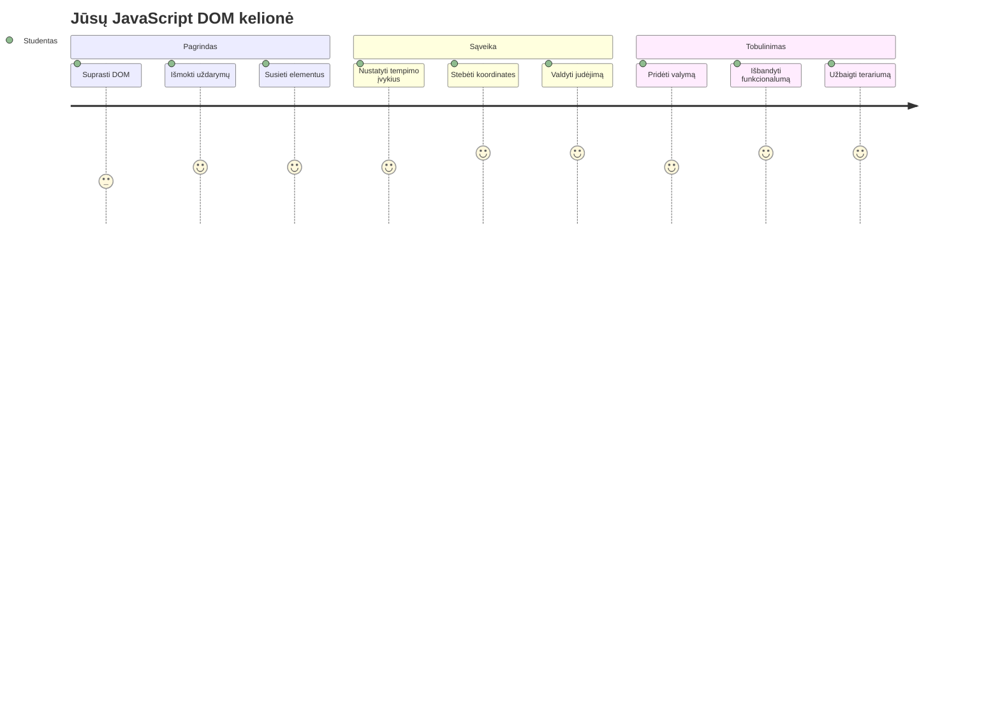
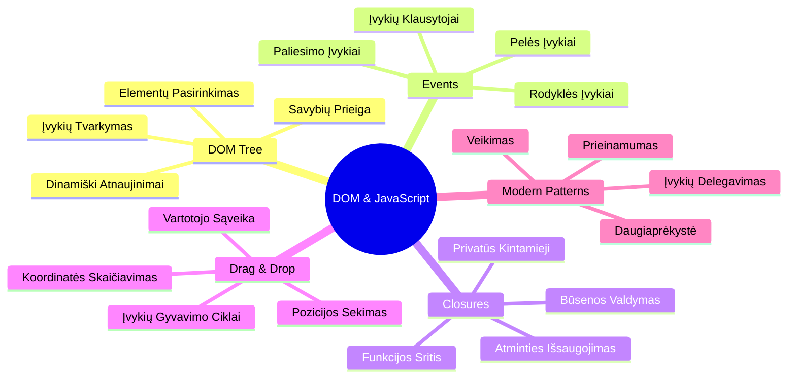
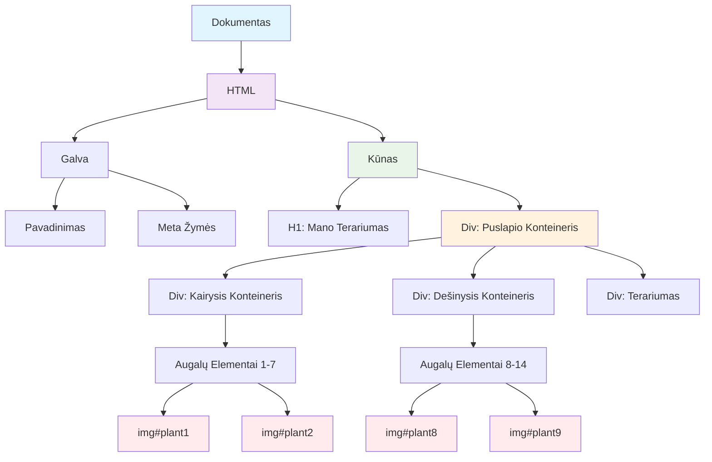
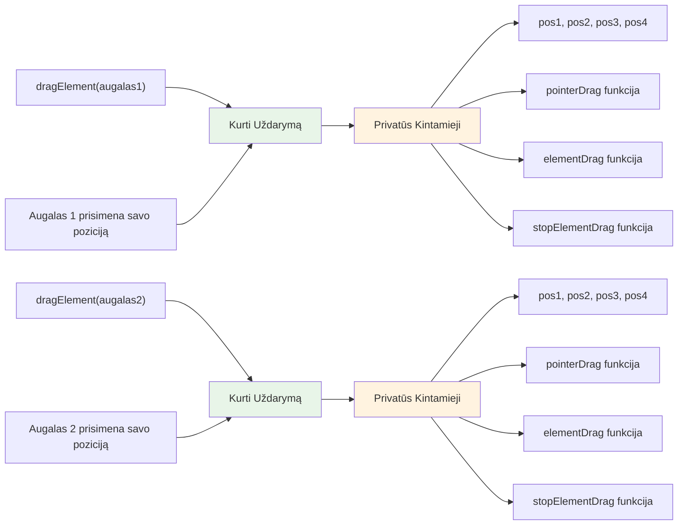
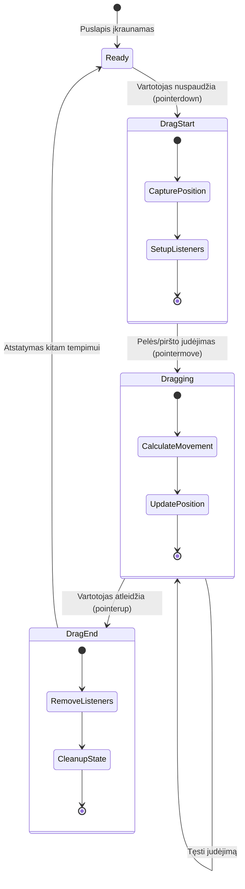
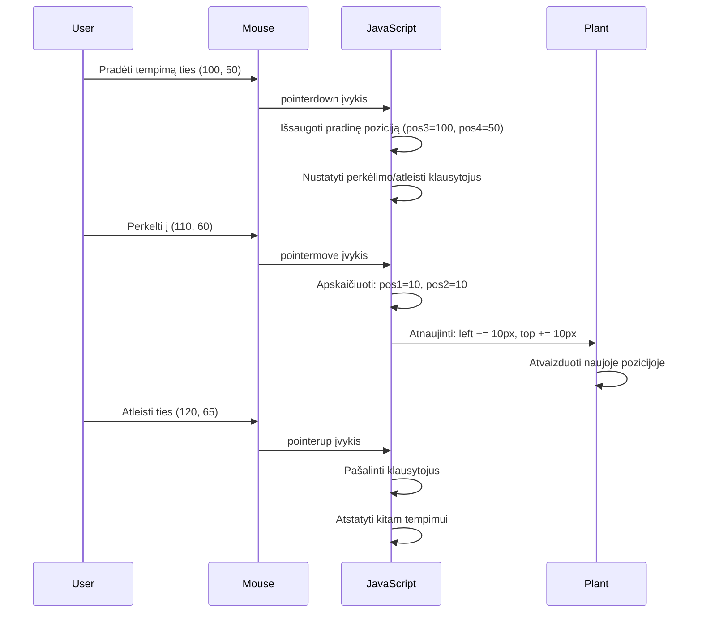
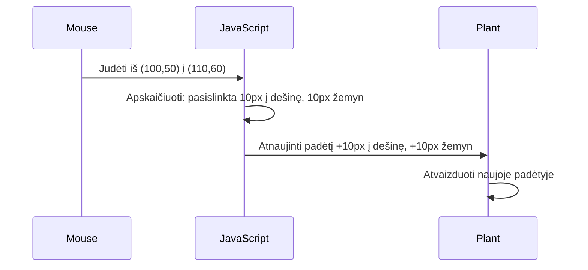
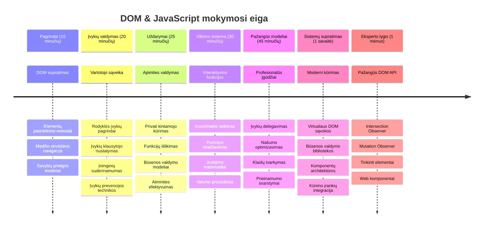

<!--
CO_OP_TRANSLATOR_METADATA:
{
  "original_hash": "973e48ad87d67bf5bb819746c9f8e302",
  "translation_date": "2026-01-07T12:08:06+00:00",
  "source_file": "3-terrarium/3-intro-to-DOM-and-closures/README.md",
  "language_code": "lt"
}
-->
# Terariumo projektas 3 dalis: DOM manipuliacija ir JavaScript uždarymai



> Sketchnote autorius [Tomomi Imura](https://twitter.com/girlie_mac)

Sveiki atvykę į vieną įdomiausių žiniatinklio kūrimo aspektų – padaryti dalykus interaktyviais! Dokumento objektų modelis (DOM) yra tarsi tiltas tarp jūsų HTML ir JavaScript, ir šiandien naudosime jį, kad įkvėptume jūsų terariumą gyvybės. Kai Tim Berners-Lee sukūrė pirmą naršyklę, jis įsivaizdavo internetą, kuriame dokumentai gali būti dinamiški ir interaktyvūs – DOM padaro šią viziją įmanoma.

Taip pat nagrinėsime JavaScript uždarymus, kurie iš pradžių gali skambėti bauginamai. Pagalvokite apie uždarymus kaip „atminties kišenes“, kuriose jūsų funkcijos gali prisiminti svarbią informaciją. Tai tarsi kiekvienas jūsų terariumo augalas turėtų savo duomenų įrašą, kad sektų savo padėtį. Pamokos pabaigoje suprasite, kaip natūralūs ir naudingi jie yra.

Štai ką statome: terariumą, kuriame vartotojai gali vilkti ir mesti augalus bet kurioje norimoje vietoje. Išmoksite DOM manipuliavimo technikų, kurios veikia nuo vilkimo ir metimo bylų įkėlimo iki interaktyvių žaidimų. Padarykime jūsų terariumą gyvą.


## Priešpaskaitos testas

[Priešpaskaitos testas](https://ff-quizzes.netlify.app/web/quiz/19)

## Supratimas apie DOM: jūsų vartai į interaktyvias žiniatinklio svetaines

Dokumento objektų modelis (DOM) yra būdas, kaip JavaScript bendrauja su jūsų HTML elementais. Kai jūsų naršyklė įkelia HTML puslapį, ji sukuria struktūrizuotą šio puslapio atvaizdą atmintyje – tai yra DOM. Pagalvokite apie jį kaip apie šeimos medį, kuriame kiekvienas HTML elementas yra šeimos narys, prie kurio JavaScript gali prieiti, keisti ar pertvarkyti.

DOM manipuliacija paverčia statinius puslapius interaktyviomis svetainėmis. Kiekvieną kartą, kai matote, jog mygtukas pakeičia spalvą, kai jį užvedate pele, turinys atsinaujina be puslapio perkrovimo arba galite vilkti elementus aplink, tai yra DOM manipuliacijos rezultatas.




> DOM ir jį nurodančio HTML žymėjimo atvaizdas. Iš [Olfa Nasraoui](https://www.researchgate.net/publication/221417012_Profile-Based_Focused_Crawler_for_Social_Media-Sharing_Websites)

**Štai kas daro DOM galingu:**
- **Teikia** struktūrizuotą būdą prieiti prie bet kurio elementų jūsų puslapyje
- **Leidžia** dinamiškai atnaujinti turinį be puslapio perkrovimo
- **Užtikrina** realaus laiko atsaką į vartotojų veiksmus kaip paspaudimai ir vilkimas
- **Sukuria** pagrindą modernioms interaktyvioms žiniatinklio programoms

## JavaScript uždarymai: organizuoto ir galingo kodo kūrimas

[JavaScript uždarymas](https://developer.mozilla.org/docs/Web/JavaScript/Closures) yra tarsi suteikti funkcijai jos privatų darbo plotą su nuolatine atmintimi. Pagalvokite, kaip Darvino žieduotosios žvirblės Galapaguose kiekviena sukūrė specializuotus snapus, atsižvelgiant į jų aplinką – uždarymai veikia panašiai, kurdami specializuotas funkcijas, kurios „prisimena“ savo konkretų kontekstą, net kai jų tėvinė funkcija jau baigė darbą.

Mūsų terariume uždarymai padeda kiekvienam augalui nepriklausomai prisiminti savo padėtį. Šis modelis pasikartoja profesionaliame JavaScript kūrime, todėl tai yra vertingas suprasti konceptas.


> 💡 **Uždarymų supratimas:** Uždarymai yra svarbi JavaScript tema, ir daugelis programuotojų juos naudoja metų metus, kol pilnai supranta visas teorines puses. Šiandien mes dėmesį skiriame praktiniam pritaikymui – pamatysite, kaip uždarymai natūraliai atsiranda, kai kuriame interaktyvias funkcijas. Supratimas atsiras, kai matysite, kaip jie sprendžia tikras problemas.


> DOM ir jį nurodančio HTML žymėjimo atvaizdas. Iš [Olfa Nasraoui](https://www.researchgate.net/publication/221417012_Profile-Based_Focused_Crawler_for_Social_Media-Sharing_Websites)

Šioje pamokoje mes užbaigsime savo interaktyvų terariumo projektą kurdami JavaScript, kuris leis vartotojui manipuliuoti augalais puslapyje.

## Pradžiai: Pasiruošimas sėkmei

Jums reikės HTML ir CSS failų iš ankstesnių terariumo pamokų – mes ruošiame tą statinį dizainą interaktyviam. Jei prisijungiate pirmą kartą, svarbu pirmiausia baigti tas pamokas, kad suprastumėte kontekstą.

Štai ką kursime:
- **Sklandus vilkimas ir metimas** visiems terariumo augalams
- **Koordinačių sekimas**, kad augalai prisimintų savo vietą
- **Pilnai interaktyvi sąsaja** naudojant vanilla JavaScript
- **Švarus, organizuotas kodas** naudojant uždarymų modelius

## JavaScript failo paruošimas

Sukurkime JavaScript failą, kuris padarys jūsų terariumą interaktyvų.

**1 žingsnis: Sukurkite savo skripto failą**

Savo terariumo aplanke sukurkite naują failą pavadinimu `script.js`.

**2 žingsnis: Susiekite JavaScript su savo HTML**

Pridėkite šį scenarijaus žymą į jūsų `index.html` failo `<head>` skyrių:

```html
<script src="./script.js" defer></script>
```

**Kodėl `defer` atributas yra svarbus:**
- **Užtikrina**, kad jūsų JavaScript lauktų, kol visas HTML bus įkeltas
- **Apsaugo nuo klaidų** kai JavaScript bando pasiekti dar neįkeltus elementus
- **Garantuoja**, kad visi jūsų augalų elementai bus paruošti sąveikai
- **Suteikia** geresnį veikimą nei skriptų įdėjimas į puslapio apačią

> ⚠️ **Svarbi pastaba**: `defer` atributas užkerta kelią įprastoms laiko problemoms. Be jo JavaScript gali bandyti pasiekti HTML elementus dar jiems neįkėlus, sukeldamas klaidas.

---

## JavaScript sujungimas su HTML elementais

Prieš galėdami padaryti elementus vilkimus, JavaScript turi juos rasti DOM. Galvokite apie tai kaip apie bibliotekos katalogavimo sistemą – kai turite katalogo numerį, galite rasti tiksliai tą knygą ir prieiti prie jos turinio.

Naudosime `document.getElementById()` metodą, kad užmegztume šį ryšį. Tai kaip tikslus archyvavimo sistemas – pateikiate ID ir jis suranda tiksliai tą elementą HTML.

### Vilkimo funkcijos įjungimas visiems augalams

Pridėkite šį kodą į savo `script.js` failą:

```javascript
// Įgalinti vilkimo funkciją visiems 14 augalų
dragElement(document.getElementById('plant1'));
dragElement(document.getElementById('plant2'));
dragElement(document.getElementById('plant3'));
dragElement(document.getElementById('plant4'));
dragElement(document.getElementById('plant5'));
dragElement(document.getElementById('plant6'));
dragElement(document.getElementById('plant7'));
dragElement(document.getElementById('plant8'));
dragElement(document.getElementById('plant9'));
dragElement(document.getElementById('plant10'));
dragElement(document.getElementById('plant11'));
dragElement(document.getElementById('plant12'));
dragElement(document.getElementById('plant13'));
dragElement(document.getElementById('plant14'));
```

**Štai ką šis kodas atlieka:**
- **Randa** kiekvieną augalo elementą DOM naudojant unikalų ID
- **Gautas** JavaScript nuorodą į kiekvieną HTML elementą
- **Perduoda** kiekvieną elementą į funkciją `dragElement` (kurią kursime netrukus)
- **Paruošia** kiekvieną augalą vilkimo ir metimo sąveikai
- **Sujungia** jūsų HTML struktūrą su JavaScript funkcionalumu

> 🎯 **Kodėl naudojame ID, o ne klases?** ID suteikia unikalius identifikatorius konkretiems elementams, o CSS klasės skirtos grupėms stilizuoti. Kai JavaScript turi manipuliuoti atskirais elementais, ID suteikia mums reikiamą tikslumą ir našumą.

> 💡 **Patyrimo patarimas**: Atkreipkite dėmesį, kaip kviečiame `dragElement()` kiekvienam augalui atskirai. Šis požiūris užtikrina, kad kiekvienas augalas turi nepriklausomą vilkimo elgseną, kas svarbu sklandžiai vartotojo sąveikai.

### 🔄 **Pedagoginė peržiūra**
**DOM sujungimo supratimas**: prieš pereinant prie vilkimo funkcijos, įsitikinkite, kad galite:
- ✅ Paaiškinti, kaip `document.getElementById()` randa HTML elementus
- ✅ Suprasti, kodėl naudojame unikalius ID kiekvienam augalui
- ✅ Apibūdinti, kam skirtas `defer` atributas skriptų žyma
- ✅ Pripažinti, kaip JavaScript ir HTML sujungiami per DOM

**Greitas savitikrinimas**: kas nutiktų, jei du elementai turėtų tą patį ID? Kodėl `getElementById()` grąžina tik vieną elementą?
*Atsakymas: ID turi būti unikaliai; jei dubliuojami, grąžinamas tik pirmas elementas*

---

## Vilkimo elemento uždarymo kūrimas

Dabar sukursime mūsų vilkimo funkcijos šerdį: uždarymą, kuris valdys vilkimo elgseną kiekvienam augalui. Šiame uždaryme bus kelios vidinės funkcijos, kurios kartu seks pelės judėjimą ir naujins elementų pozicijas.

Uždarymai puikiai tinka šiai užduočiai, nes leidžia sukurti „privatinius“ kintamuosius, kurie išlieka tarp funkcijų kvietimų, suteikiant kiekvienam augalui nepriklausomą koordinacijų sekimą.

### Uždarymų supratimas paprastu pavyzdžiu

Leiskite pademonstruoti uždarymus paprastu pavyzdžiu, kuris iliustruoja koncepciją:

```javascript
function createCounter() {
    let count = 0; // Tai tarsi privatus kintamasis
    
    function increment() {
        count++; // Vidinė funkcija prisimena išorinį kintamąjį
        return count;
    }
    
    return increment; // Grąžiname vidinę funkciją
}

const myCounter = createCounter();
console.log(myCounter()); // 1
console.log(myCounter()); // 2
```

**Štai kas vyksta šiame uždarymo modelyje:**
- **Sukuria** privatų kintamąjį `count`, kuris yra tik šiame uždaryme
- **Vidinė funkcija** gali pasiekti ir keisti tą išorinį kintamąjį (uždarymo mechanizmas)
- **Kai grąžiname** vidinę funkciją, ji palaiko ryšį su ta privačia informacija
- **Net po to**, kai `createCounter()` baigia darbą, `count` išlieka ir prisimena savo reikšmę

### Kodėl uždarymai puikiai tinka vilkimo funkcijai

Mūsų terariume kiekvienam augalui reikia prisiminti savo dabartines koordinates. Uždarymai suteikia tobulą sprendimą:

**Pagrindiniai privalumai mūsų projektui:**
- **Laiko** privatų pozicijų kintamuosius kiekvienam augalui nepriklausomai
- **Išlaiko** koordinačių duomenis tarp vilkimo įvykių
- **Užkerta kelią** kintamųjų konfliktams tarp skirtingų vilkimo elementų
- **Sukuria** švarų, organizuotą kodo struktūrą

> 🎯 **Mokymosi tikslas**: jums nereikia dabar įvaldyti visų uždarymų pusių. Sutelkkite dėmesį į tai, kaip jie padeda organizuoti kodą ir palaikyti būseną mūsų vilkimo funkcionalumui.


### dragElement funkcijos kūrimas

Dabar sukurkime pagrindinę funkciją, kuri tvarkys visą vilkimo logiką. Pridėkite šią funkciją po savo augalų elementų deklaracijų:

```javascript
function dragElement(terrariumElement) {
    // Inicializuoti pozicijos sekimo kintamuosius
    let pos1 = 0,  // Ankstesnė pelės X pozicija
        pos2 = 0,  // Ankstesnė pelės Y pozicija
        pos3 = 0,  // Dabartinė pelės X pozicija
        pos4 = 0;  // Dabartinė pelės Y pozicija
    
    // Nustatyti pradinį tempimo įvykio klausytoją
    terrariumElement.onpointerdown = pointerDrag;
}
```

**Pozicijų sekimo sistemos supratimas:**
- **`pos1` ir `pos2`**: saugo skirtumą tarp senos ir naujos pelės pozicijos
- **`pos3` ir `pos4`**: seka dabartines pelės koordinates
- **`terrariumElement`**: konkretus augalo elementas, kurį darome vilkimu
- **`onpointerdown`**: įvykis, kuris vyksta, kai vartotojas pradeda vilkti

**Štai kaip veikia uždarymo modelis:**
- **Sukuria** privatinius pozicijų kintamuosius kiekvienam augalo elementui
- **Išlaiko** šiuos kintamuosius per vilkimo ciklą
- **Užtikrina**, kad kiekvienas augalas nepriklausomai seka savo koordinates
- **Suteikia** švarią sąsają per `dragElement` funkciją

### Kodėl naudoti Pointer įvykius?

Gali kilti klausimas, kodėl naudojame `onpointerdown` vietoj labiau pažįstamo `onclick`. Štai priežastys:

| Įvykio tipas | Geriausia naudoti | Trūkumas |
|--------------|-------------------|----------|
| `onclick` | Paprasti mygtuko paspaudimai | Negali tvarkyti vilkimo (tik paspaudimai ir paleidimai) |
| `onpointerdown` | Pelės ir lietimo įrenginiai | Naujovesnis, bet šiandien gerai palaikomas |
| `onmousedown` | Tik darbalaukio pelė | Palieka mobiliuosius naudotojus be palaikymo |

**Kodėl pointer įvykiai puikiai tinka mūsų funkcijai:**
- **Veikia vienodai** naudojant pelę, pirštą ar net rašiklį
- **Jausmas tas pats** nešiojamuose kompiuteriuose, planšetėse ar telefonuose
- **Tvarko** faktinį vilkimo judesį (ne tik paspaudimą ir paleidimą)
- **Sukuria** sklandžią patirtį, kurios laukia vartotojai iš modernių žiniatinklio programų

> 💡 **Ateičiai pasiruošimas**: Pointer įvykiai yra modernus būdas valdyti vartotojo sąveikas. Vietoj atskiro kodo pelės ir lietimo įrenginiams, gaunate abu iš karto. Tikrai šaunu, tiesa?

### 🔄 **Pedagoginė peržiūra**
**Įvykių valdymo supratimas**: stabtelėkite ir patikrinkite savo žinias:
- ✅ Kodėl naudojame pointer įvykius vietoj pelės įvykių?
- ✅ Kaip uždarymų kintamieji išlieka tarp funkcijų kvietimų?
- ✅ Kokia `preventDefault()` funkcijos reikšmė sklandžiam vilkimui?
- ✅ Kodėl klausytojus pririšame prie dokumento, o ne prie atskirų elementų?

**Realaus pasaulio ryšys**: pagalvokite apie vilkimo ir metimo sąsajas, kurias naudojate kasdien:
- **Failų įkėlimas**: vilkdami failus į naršyklės langą
- **Kanban lentos**: keliant užduotis tarp stulpelių
- **Nuotraukų galerijos**: pertvarkant nuotraukų tvarką
- **Mobilios sąsajos**: braukimas ir vilkimas lietimo ekranuose

---

## pointerDrag funkcija: vilkimo pradžios užfiksavimas

Kai vartotojas paspaudžia ant augalo (ar pelės spustelėjimu, ar piršto prisilietimu), `pointerDrag` funkcija pradeda veikti. Ši funkcija įrašo pradinius koordinates ir paruošia vilkimo sistemą.

Pridėkite šią funkciją į savo `dragElement` uždarymą, tiesiai po eilutės `terrariumElement.onpointerdown = pointerDrag;`:

```javascript
function pointerDrag(e) {
    // Užkirsti kelią numatytajam naršyklės elgesiui (pvz., teksto pasirinkimui)
    e.preventDefault();
    
    // Užfiksuoti pradinę pelės/jutiklio padėtį
    pos3 = e.clientX;  // X koordinatė, kur prasidėjo tempimas
    pos4 = e.clientY;  // Y koordinatė, kur prasidėjo tempimas
    
    // Nustatyti įvykių klausytojus tempimo procesui
    document.onpointermove = elementDrag;
    document.onpointerup = stopElementDrag;
}
```

**Žingsnis po žingsnio, kas vyksta:**
- **Užkerta kelią** naršyklės numatytiems veiksmams, kurie galėtų trukdyti vilkimui
- **Įrašo** tikslias koordinates, kur vartotojas pradėjo vilkimą
- **Nustato** įvykių klausytojus nuolatiniam pelės ar piršto judėjimui
- **Paruošia** sistemą sekti pelės/piršto judėjimus per visą dokumentą

### Įvykių užkirtimo supratimas

`e.preventDefault()` eilutė yra labai svarbi sklandžiam vilkimui:

**Be užkirtimo naršyklės gali:**
- **Pažymėti** tekstą, kai vilki per puslapį
- **Atidaryti** kontekstinius meniu paspaudus vilkdami dešiniuoju pelės mygtuku
- **Trukdyti** mūsų adaptyviam vilkimo elgesiui
- **Sukurti** vizualinius trikdžius vilkimo metu

> 🔍 **Eksperimentas**: baigę šią pamoką, pabandykite pašalinti `e.preventDefault()` ir stebėkite, kaip tai pakeičia vilkimo patirtį. Greitai suprasite, kodėl ši eilutė yra būtina!

### Koordinačių sekimo sistema

`e.clientX` ir `e.clientY` savybės suteikia tikslias pelės arba prisilietimo koordinates:

| Ypatybė | Ką matuoja | Naudojimo atvejis |
|----------|------------|-------------------|
| `clientX` | Horizontalioji pozicija lyginant su vaizdo plotu | Kairės ir dešinės judėjimo sekimas |
| `clientY` | Vertikalioji pozicija lyginant su vaizdo plotu | Viršaus ir apačios judėjimo sekimas |
**Šių koordinatų supratimas:**
- **Teikia** pikseliui tobulą pozicionavimo informaciją
- **Atnaujinamas** realiu laiku, kai vartotojas juda pelės žymekliu
- **Išlieka** nuoseklus įvairiuose ekrano dydžiuose ir mastelio lygiuose
- **Leidžia** sklandžias, jautrias vilkimo sąveikas

### Dokumento lygmens įvykių klausytojų nustatymas

Atkreipkite dėmesį, kaip pririšame move ir stop įvykius prie viso `document`, o ne tik prie augalo elemento:

```javascript
document.onpointermove = elementDrag;
document.onpointerup = stopElementDrag;
```

**Kodėl pririšame prie dokumento:**
- **Tęsia** sekimą net kai pelė išeina iš augalo elemento
- **Neleidžia** vilkimui nutrūkti, jei vartotojas juda greitai
- **Teikia** sklandų vilkimą per visą ekraną
- **Tvarko** kraštutinius atvejus, kai žymeklis išeina už naršyklės lango ribų

> ⚡ **Veikimo pastaba**: Kai vilkimas baigsis, išjungsime šiuos dokumento lygmens klausytojus, kad išvengtume atminties nutekėjimo ir veikimo problemų.

## Vilkimo sistemos užbaigimas: judėjimas ir valymas

Dabar pridėsime dar dvi funkcijas, kurios valdo tikrąjį vilkimo judėjimą ir valymą, kai vilkimas baigiasi. Šios funkcijos veikia kartu, kad sukurtų sklandų, jautrų augalo judėjimą jūsų terariume.

### Funkcija elementDrag: judėjimo sekimas

Pridėkite `elementDrag` funkciją iš karto po uždarančios šakninės skliausto `pointerDrag` pabaigoje:

```javascript
function elementDrag(e) {
    // Apskaičiuokite atstumą, kurį perėjote nuo paskutinio įvykio
    pos1 = pos3 - e.clientX;  // Horizontaliai nueitas atstumas
    pos2 = pos4 - e.clientY;  // Vertikaliai nueitas atstumas
    
    // Atnaujinkite dabartinės pozicijos sekimą
    pos3 = e.clientX;  // Nauja esama X pozicija
    pos4 = e.clientY;  // Nauja esama Y pozicija
    
    // Taikykite judėjimą elemento pozicijai
    terrariumElement.style.top = (terrariumElement.offsetTop - pos2) + 'px';
    terrariumElement.style.left = (terrariumElement.offsetLeft - pos1) + 'px';
}
```

**Koordinačių matematikos supratimas:**
- **`pos1` ir `pos2`**: skaičiuoja, kiek pelė pajudėjo nuo paskutinio atnaujinimo
- **`pos3` ir `pos4`**: saugo dabartinę pelės padėtį kitam skaičiavimui
- **`offsetTop` ir `offsetLeft`**: gauna elemento dabartinę poziciją puslapyje
- **Atimties logika**: judina elementą tiek pat, kiek pajudėjo pelė


**Štai judėjimo skaičiavimo santrauka:**
1. **Matuoja** skirtumą tarp seno ir naujo pelės padėties
2. **Apskaičiuoja** kiek judinti elementą pagal pelės judėjimą
3. **Atnaujina** elemento CSS pozicijos savybes realiu laiku
4. **Išsaugo** naują poziciją kaip atskaitos tašką kitam judėjimo skaičiavimui

### Matematikos vizualizacija


### Funkcija stopElementDrag: valymo procesas

Pridėkite valymo funkciją po uždarančios šakninės skliausto `elementDrag` pabaigoje:

```javascript
function stopElementDrag() {
    // Pašalinkite dokumento lygio įvykių klausytojus
    document.onpointerup = null;
    document.onpointermove = null;
}
```

**Kodėl valymas būtinas:**
- **Užkerta kelią** atminties nutekėjimui dėl likusių įvykių klausytojų
- **Nutraukia** vilkimo elgseną, kai vartotojas atleidžia augalą
- **Leidžia** kitus elementus vėl vilkti nepriklausomai
- **Atkuria** sistemą kitam vilkimo veiksmui

**Kas nutiktų be valymo:**
- Įvykių klausytojai veikia ir po vilkimo pabaigos
- Veikimas blogėja, kaupiasi nenaudojami klausytojai
- Netikėta elgsena dirbant su kitais elementais
- Naršyklės resursai švaistomi nereikalingai įvykių apdorojimui

### CSS pozicijos savybių supratimas

Mūsų vilkimo sistema manipuliuoja dviem pagrindinėmis CSS savybėmis:

| Savybė | Ką valdo | Kaip naudojame |
|---------|----------|----------------|
| `top` | Atstumas nuo viršutinio krašto | Vertikalus pozicionavimas vilkimo metu |
| `left` | Atstumas nuo kairiojo krašto | Horizontalus pozicionavimas vilkimo metu |

**Svarbūs offset savybių įžvalgos:**
- **`offsetTop`**: Dabartinis atstumas nuo pozicionuoto tėvinio elemento viršaus
- **`offsetLeft`**: Dabartinis atstumas nuo pozicionuoto tėvinio elemento kairės
- **Pozicionavimo kontekstas**: Šios reikšmės yra santykinės artimiausio pozicionuoto protėvio atžvilgiu
- **Realiojo laiko atnaujinimai**: Kinta iš karto, kai keičiasi CSS savybės

> 🎯 **Dizaino filosofija**: Ši vilkimo sistema yra sąmoningai lanksti – nėra „nuleidimo zonų“ ar apribojimų. Vartotojai gali augalus statyti bet kur, turėdami visišką kūrybinę kontrolę savo terariumo dizainui.

## Visų elementų sujungimas: jūsų pilna vilkimo sistema

Sveikiname! Jūs ką tik sukūrėte sudėtingą vilkimo sistemą naudojant vanilla JavaScript. Jūsų `dragElement` funkcija dabar turi galingą bei savotišką uždarumą, kuris valdo:

**Ką daro jūsų uždarymas:**
- **Išlaiko** privačius pozicijos kintamuosius kiekvienam augalui atskirai
- **Valdo** visą vilkimo ciklą nuo pradžios iki pabaigos
- **Suteikia** sklandų, jautrų judėjimą per visą ekraną
- **Tvarko** išteklių valymą, kad nebūtų atminties nutekėjimo
- **Kuria** intuityvią, kūrybinę sąsają terariumo dizainui

### Išbandykite savo interaktyvų terariumą

Dabar išbandykite savo interaktyvų terariumą! Atidarykite savo `index.html` naršyklėje ir išbandykite funkcionalumą:

1. **Spustelėkite ir laikykite** pasirinktą augalą, kad pradėtumėte vilkimą
2. **Judinkite pelę arba pirštą** ir stebėkite, kaip augalas sklandžiai seka
3. **Atleiskite**, kad padėtumėte augalą naujoje vietoje
4. **Eksperimentuokite** su skirtingais išdėstymais, kad patirtumėte sąsają

🥇 **Pasiekimas**: Jūs sukūrėte pilnai interaktyvią interneto programėlę, naudojančią pagrindinius principus, kuriuos kasdien naudoja profesionalūs kūrėjai. Ši vilkimo-funkcionalumas remiasi tais pačiais principais, kaip ir failų įkėlimai, kanban lentos ir kitos interaktyvios sąsajos.

### 🔄 **Pedagoginis patikrinimas**
**Pilnas sistemos supratimas**: Patikrinkite savo vilkimo sistemos valdymą:
- ✅ Kaip uždarymai palaiko nepriklausomą būseną kiekvienam augalui?
- ✅ Kodėl reikalinga koordinačių skaičiavimo matematika sklandžiam judėjimui?
- ✅ Kas nutiktų, jei pamirštume išvalyti įvykių klausytojus?
- ✅ Kaip ši schema plečiasi į sudėtingesnes sąveikas?

**Kodo kokybės apmąstymai**: Peržiūrėkite savo pilną sprendimą:
- **Modulinis dizainas**: kiekvienam augalui sukuriama sava uždaroji egzempliorius
- **Įvykių efektyvumas**: teisingas klausytojų įrengimas ir valymas
- **Kryžminė įranga**: veikia tiek kompiuteriuose, tiek mobiliuosiuose įrenginiuose
- **Veikimo sąmoningumas**: nėra atminties nutekėjimų ar perteklinių skaičiavimų


---

## GitHub Copilot Agent Užduotis 🚀

Naudokite Agent režimą, kad įvykdytumėte šią užduotį:

**Aprašymas:** Pagerinkite terariumo projektą pridėdami atstatymo funkcionalumą, kuris gražiai animuotų visus augalus į jų pradinę padėtį.

**Užduotis:** Sukurkite atstatymo mygtuką, kuris paspaudus animuotų visus augalus atgal į jų pradinę padėtį šoninėje juostoje, naudodamas CSS perėjimus. Funkcija turėtų saugoti pradinius pozicijų duomenis puslapio įkėlimo metu ir sklandžiai per 1 sekundę sugrąžinti augalus atgal paspaudus atstatymo mygtuką.

Sužinokite daugiau apie [agent mode](https://code.visualstudio.com/blogs/2025/02/24/introducing-copilot-agent-mode).

## 🚀 Papildomas iššūkis: praplėskite savo įgūdžius

Norite pakelti savo terariumą į kitą lygį? Išbandykite šiuos patobulinimus:

**Kūrybingi praplėtimai:**
- **Du kartus spustelėkite** augalą, kad jį paryškintumėte priekyje (per z-index valdymą)
- **Pridėkite vizualinį atsiliepimą**, pavyzdžiui, subtilų švytėjimą pelės užvedimo metu
- **Įgyvendinkite ribas**, kad augalai nebūtų velkami už terariumo ribų
- **Sukurkite išsaugojimo funkciją**, kuri prisimena augalų pozicijas naudojant localStorage
- **Pridėkite garso efektus** kelti ir padėti augalus

> 💡 **Mokymosi galimybė**: Kiekvienas iš šių iššūkių padės išmokti naujų DOM manipuliavimo, įvykių valdymo ir vartotojo patirties dizaino aspektų.

## Po paskaitos testas

[Po paskaitos testas](https://ff-quizzes.netlify.app/web/quiz/20)

## Peržiūra ir savarankiškas mokymasis: gilinkite savo supratimą

Jūs jau įvaldėte DOM manipuliavimo ir uždarumų pagrindus, bet visada yra ką dar atrasti! Štai keletas krypčių, kaip plėsti žinias ir įgūdžius.

### Alternatyvūs vilkimo ir metimo būdai

Naudojome pointer eventus dėl didžiausio lankstumo, tačiau žiniatinklio kūrimas siūlo daugybę kitų metodų:

| Metodas | Geriausia skirta | Mokymosi vertė |
|---------|-----------------|----------------|
| [HTML Drag and Drop API](https://developer.mozilla.org/docs/Web/API/HTML_Drag_and_Drop_API) | Failų įkėlimui, oficialioms vilkimo zonoms | Suprasti naršyklės gimtąsias galimybes |
| [Touch Events](https://developer.mozilla.org/docs/Web/API/Touch_events) | Tik mobiliosioms sąveikoms | Mobiliesiems skirtų vystymo modelių |
| CSS `transform` savybės | Sklandžios animacijos | Veikimo optimizavimo technikos |

### Pažangesnės DOM manipuliacijos temos

**Tolimesni žingsniai mokantis:**
- **Įvykių delegavimas**: efektyvus įvykių valdymas daugeliui elementų
- **Intersection Observer**: elementų pasirodymo ir pasitraukimo iš ekrano stebėjimas
- **Mutation Observer**: stebėti DOM struktūros pokyčius
- **Web Components**: kurti pakartotinai naudojamus, kapsuliuotus UI elementus
- **Virtualus DOM**: suprasti, kaip karkasai optimizuoja DOM atnaujinimus

### Būtini resursai tolimesniam mokymuisi

**Techninė dokumentacija:**
- [MDN Pointer Events vadovas](https://developer.mozilla.org/docs/Web/API/Pointer_events) – Išsamus pointer event'ų aprašymas
- [W3C Pointer Events specifikacija](https://www.w3.org/TR/pointerevents1/) – Oficialioji standartų dokumentacija
- [JavaScript uždarumų giluminis tyrinėjimas](https://developer.mozilla.org/docs/Web/JavaScript/Closures) – Išplėstiniai uždarumų modeliai

**Naršyklių suderinamumas:**
- [CanIUse.com](https://caniuse.com/) – Funkcijų palaikymas skirtingose naršyklėse
- [MDN naršyklių suderinamumo duomenys](https://github.com/mdn/browser-compat-data) – Detali informacija

**Praktikos galimybės:**
- **Sukurkite** dėlionės žaidimą su panašia vilkimo mechanika
- **Sukurkite** kanban lentą su užduočių valdymu vilkimo būdu
- **Sukurkite** nuotraukų galeriją su vilkimo funkcionalumu
- **Išbandykite** lietimo gestus mobiliems įrenginiams

> 🎯 **Mokymosi strategija**: Geriausias būdas įsisavinti šias sąvokas yra praktika. Bandykite kurti įvairias vilkimo sąsajas – kiekvienas projektas išmokys kažką naujo apie vartotojo sąveiką ir DOM manipuliavimą.

### ⚡ **Ką galite padaryti per artimiausias 5 minutes**
- [ ] Atidarykite naršyklės DevTools ir įveskite `document.querySelector('body')` konsolėje
- [ ] Pabandykite pakeisti tinklalapio tekstą naudodami `innerHTML` arba `textContent`
- [ ] Pridėkite spustelėjimo įvykio klausytoją bet kuriam mygtukui ar nuorodai tinklalapyje
- [ ] Apžiūrėkite DOM medžio struktūrą Elements skiltyje

### 🎯 **Ką galite pasiekti šią valandą**
- [ ] Užbaigti po pamokos testą ir peržiūrėti DOM manipuliacijos koncepcijas
- [ ] Sukurti interaktyvų tinklalapį, kuris reaguoja į vartotojo spustelėjimus
- [ ] Praktikuoti įvykių valdymą naudojant skirtingus įvykių tipus (click, mouseover, keypress)
- [ ] Sukurti paprastą užduočių sąrašą ar skaitiklį naudodami DOM manipuliavimą
- [ ] Ištirti HTML elementų ir JavaScript objektų santykį

### 📅 **Jūsų savaitės trukmės JavaScript kelionė**
- [ ] Užbaigti interaktyvų terariumo projektą su vilkimo-funkcionalumu
- [ ] Išmokti įvykių delegavimo efektyviai tvarkant įvykius
- [ ] Išmokti įvykių ciklą ir asinchroninį JavaScript
- [ ] Praktikuoti uždarumus, kuriant modulius su privačia būsena
- [ ] Išmokti modernių DOM API, tokių kaip Intersection Observer
- [ ] Kurti interaktyvius komponentus nenaudojant karkasų

### 🌟 **Jūsų mėnesio trukmės JavaScript meistriškumas**
- [ ] Sukurti sudėtingą vieno puslapio aplikaciją naudodami vanilla JavaScript
- [ ] Išmokti modernų karkasą (React, Vue arba Angular) ir palyginti su vanilla DOM
- [ ] Prisidėti prie atviro kodo JavaScript projektų
- [ ] Išmokti pažangių koncepcijų, tokių kaip web components ir custom elements
- [ ] Kurti optimizuotas web aplikacijas su geriausiomis DOM praktikomis
- [ ] Mokyti kitus DOM manipuliavimo ir JavaScript pagrindų

## 🎯 Jūsų JavaScript DOM meistriškumo laiko juosta


### 🛠️ Jūsų JavaScript įrankių santrauka

Po šios pamokos jūs turite:
- **DOM meistriškumas**: elementų paieška, savybių manipuliacija, medžio navigacija
- **Įvykių ekspertizė**: kryžminio įrenginio sąveikų valdymas naudodami pointer eventus
- **Uždarymų supratimas**: privačios būsenos valdymas ir funkcijų išliekamumas
- **Interaktyvios sistemos**: pilnas vilkimo ir metimo įgyvendinimas iš pagrindų
- **Veikimo sąmoningumas**: teisingas įvykių valymas ir atminties tvarkymas
- **Modernios schemos**: kodo organizavimo technikos, naudojamos profesionaliame kūrime
- **Vartotojo patirtis**: intuityvių, jautrių sąsajų kūrimas

**Profesionalūs įgūdžiai įgyti**: Jūs sukūrėte funkcijas naudodami tas pačias technikas kaip:
- **Trello/Kanban lentos**: kortelių vilkimas tarp stulpelių
- **Failų įkėlimo sistemos**: vilkimo ir numetimo failų apdorojimas
- **Nuotraukų galerijos**: nuotraukų išdėstymo sąsajos
- **Mobiliosios aplikacijos**: lietimo sąveikų modeliai

**Kitas lygis**: Jūs pasirengę tyrinėti modernius karkasus, tokius kaip React, Vue ar Angular, kurie remiasi šiomis DOM manipuliacijos pagrindinėmis sąvokomis!

## Užduotis

[Dirbkite daugiau su DOM](assignment.md)

---

<!-- CO-OP TRANSLATOR DISCLAIMER START -->
**Atsakomybės apribojimas**:
Šis dokumentas buvo išverstas naudojant dirbtinio intelekto vertimo paslaugą [Co-op Translator](https://github.com/Azure/co-op-translator). Nors siekiame tikslumo, prašome suprasti, kad automatiniai vertimai gali turėti klaidų ar netikslumų. Originalus dokumentas jo gimtąja kalba turi būti laikomas autoritetingu šaltiniu. Kritinei informacijai rekomenduojamas profesionalus žmogaus atliktas vertimas. Mes neatsakome už jokius nesusipratimus ar neteisingus aiškinimus, kylančius dėl šio vertimo naudojimo.
<!-- CO-OP TRANSLATOR DISCLAIMER END -->