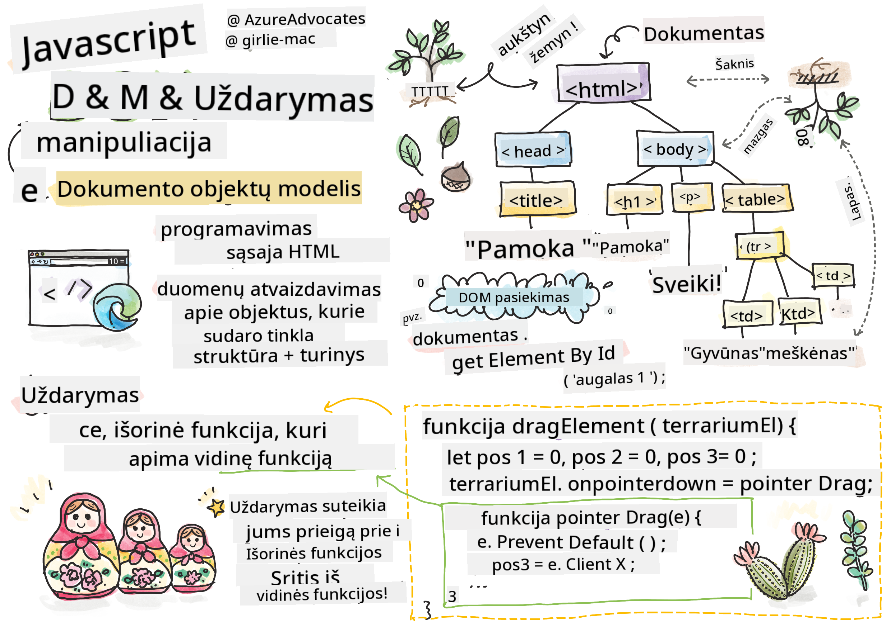

<!--
CO_OP_TRANSLATOR_METADATA:
{
  "original_hash": "61c14b27044861e5e69db35dd52c4403",
  "translation_date": "2025-08-29T16:56:20+00:00",
  "source_file": "3-terrarium/3-intro-to-DOM-and-closures/README.md",
  "language_code": "lt"
}
-->
# Terariumo projektas 3 dalis: DOM manipuliacija ir uždara funkcija


> Sketchnote sukūrė [Tomomi Imura](https://twitter.com/girlie_mac)

## Prieš paskaitą: testas

[Prieš paskaitą: testas](https://ff-quizzes.netlify.app/web/quiz/19)

### Įvadas

DOM manipuliacija, arba "Dokumento Objektų Modelis", yra pagrindinis interneto kūrimo aspektas. Pasak [MDN](https://developer.mozilla.org/docs/Web/API/Document_Object_Model/Introduction), "Dokumento Objektų Modelis (DOM) yra duomenų reprezentacija objektų, sudarančių dokumento struktūrą ir turinį internete." DOM manipuliacijos iššūkiai dažnai paskatino naudoti JavaScript karkasus vietoj gryno JavaScript, kad būtų lengviau valdyti DOM, tačiau mes susitvarkysime patys!

Be to, ši pamoka supažindins su [JavaScript uždara funkcija](https://developer.mozilla.org/docs/Web/JavaScript/Closures), kurią galite įsivaizduoti kaip funkciją, apgaubtą kita funkcija, leidžiančią vidinei funkcijai pasiekti išorinės funkcijos sritį.

> JavaScript uždaros funkcijos yra plati ir sudėtinga tema. Ši pamoka apima pagrindinę idėją, kad šiame terariumo kode rasite uždarą funkciją: vidinę funkciją ir išorinę funkciją, sukonstruotą taip, kad vidinė funkcija galėtų pasiekti išorinės funkcijos sritį. Daugiau informacijos apie tai, kaip tai veikia, rasite [išsamioje dokumentacijoje](https://developer.mozilla.org/docs/Web/JavaScript/Closures).

Mes naudosime uždarą funkciją DOM manipuliacijai.

Įsivaizduokite DOM kaip medį, kuris reprezentuoja visus būdus, kaip galima manipuliuoti interneto puslapio dokumentu. Buvo sukurta įvairių API (Programų Sąsajų), kad programuotojai, naudodami savo pasirinktą programavimo kalbą, galėtų pasiekti DOM ir jį redaguoti, keisti, pertvarkyti bei kitaip valdyti.


> DOM ir HTML žymėjimo, kuris jį nurodo, reprezentacija. Sukūrė [Olfa Nasraoui](https://www.researchgate.net/publication/221417012_Profile-Based_Focused_Crawler_for_Social_Media-Sharing_Websites)

Šioje pamokoje užbaigsime interaktyvų terariumo projektą, sukurdami JavaScript kodą, kuris leis vartotojui manipuliuoti augalais puslapyje.

### Reikalavimai

Jūs turėtumėte turėti sukurtą HTML ir CSS savo terariumui. Pamokos pabaigoje galėsite perkelti augalus į terariumą ir iš jo, juos vilkdami.

### Užduotis

Savo terariumo aplanke sukurkite naują failą pavadinimu `script.js`. Importuokite šį failą į `<head>` sekciją:

```html
	<script src="./script.js" defer></script>
```

> Pastaba: naudokite `defer`, kai importuojate išorinį JavaScript failą į HTML failą, kad JavaScript būtų vykdomas tik po to, kai HTML failas bus visiškai įkeltas. Taip pat galite naudoti atributą `async`, kuris leidžia skriptui vykdyti, kol HTML failas yra apdorojamas, tačiau mūsų atveju svarbu, kad HTML elementai būtų visiškai prieinami vilkimui prieš leidžiant vykdyti vilkimo skriptą.
---

## DOM elementai

Pirmiausia turite sukurti nuorodas į elementus, kuriuos norite manipuliuoti DOM. Mūsų atveju tai yra 14 augalų, šiuo metu esančių šoninėse juostose.

### Užduotis

```html
dragElement(document.getElementById('plant1'));
dragElement(document.getElementById('plant2'));
dragElement(document.getElementById('plant3'));
dragElement(document.getElementById('plant4'));
dragElement(document.getElementById('plant5'));
dragElement(document.getElementById('plant6'));
dragElement(document.getElementById('plant7'));
dragElement(document.getElementById('plant8'));
dragElement(document.getElementById('plant9'));
dragElement(document.getElementById('plant10'));
dragElement(document.getElementById('plant11'));
dragElement(document.getElementById('plant12'));
dragElement(document.getElementById('plant13'));
dragElement(document.getElementById('plant14'));
```

Kas čia vyksta? Jūs nurodote dokumentą ir ieškote jo DOM elemento su konkrečiu Id. Prisiminkite, kad pirmoje HTML pamokoje kiekvienam augalo paveikslėliui priskyrėte individualius Id (`id="plant1"`)? Dabar pasinaudosite šiuo darbu. Identifikavę kiekvieną elementą, perduodate jį funkcijai `dragElement`, kurią netrukus sukursite. Taigi, HTML elementas dabar yra paruoštas vilkimui arba bus netrukus.

✅ Kodėl mes nurodome elementus pagal Id? Kodėl ne pagal jų CSS klasę? Galite grįžti prie ankstesnės pamokos apie CSS, kad atsakytumėte į šį klausimą.

---

## Uždara funkcija

Dabar esate pasiruošę sukurti uždarą funkciją `dragElement`, kuri yra išorinė funkcija, apgaubianti vidinę funkciją ar funkcijas (mūsų atveju turėsime tris).

Uždaros funkcijos yra naudingos, kai viena ar daugiau funkcijų turi pasiekti išorinės funkcijos sritį. Štai pavyzdys:

```javascript
function displayCandy(){
	let candy = ['jellybeans'];
	function addCandy(candyType) {
		candy.push(candyType)
	}
	addCandy('gumdrops');
}
displayCandy();
console.log(candy)
```

Šiame pavyzdyje funkcija `displayCandy` apgaubia funkciją, kuri įterpia naują saldainių tipą į masyvą, kuris jau egzistuoja funkcijoje. Jei vykdytumėte šį kodą, masyvas `candy` būtų neapibrėžtas, nes jis yra lokalus kintamasis (lokalus uždarai funkcijai).

✅ Kaip galite padaryti, kad masyvas `candy` būtų prieinamas? Pabandykite perkelti jį už uždaros funkcijos ribų. Tokiu būdu masyvas taps globalus, o ne liks prieinamas tik uždaros funkcijos lokalioje srityje.

### Užduotis

Po elementų deklaracijų faile `script.js` sukurkite funkciją:

```javascript
function dragElement(terrariumElement) {
	//set 4 positions for positioning on the screen
	let pos1 = 0,
		pos2 = 0,
		pos3 = 0,
		pos4 = 0;
	terrariumElement.onpointerdown = pointerDrag;
}
```

`dragElement` gauna savo `terrariumElement` objektą iš deklaracijų skripto viršuje. Tada jūs nustatote keletą lokalių pozicijų kaip `0` objektui, perduotam funkcijai. Tai yra lokalūs kintamieji, kurie bus manipuliuojami kiekvienam elementui, kai pridėsite vilkimo ir numetimo funkcionalumą uždaroje funkcijoje kiekvienam elementui. Terariumas bus užpildytas šiais vilktais elementais, todėl programa turi sekti, kur jie yra išdėstyti.

Be to, funkcijai perduotas `terrariumElement` priskiriamas `pointerdown` įvykis, kuris yra dalis [web API](https://developer.mozilla.org/docs/Web/API), skirtų padėti valdyti DOM. `onpointerdown` įvykis įvyksta, kai paspaudžiamas mygtukas arba, mūsų atveju, kai paliečiamas vilkimo elementas. Šis įvykio tvarkytuvas veikia tiek [interneto, tiek mobiliuosiuose naršyklėse](https://caniuse.com/?search=onpointerdown), su keliomis išimtimis.

✅ [Įvykio tvarkytuvas `onclick`](https://developer.mozilla.org/docs/Web/API/GlobalEventHandlers/onclick) turi daug didesnį palaikymą įvairiose naršyklėse; kodėl jo nenaudotumėte čia? Pagalvokite apie tikslų ekrano sąveikos tipą, kurį bandote sukurti.

---

## Pointerdrag funkcija

`terrariumElement` yra pasiruošęs būti vilkamas; kai įvyksta `onpointerdown` įvykis, iškviečiama funkcija `pointerDrag`. Pridėkite šią funkciją tiesiai po šia eilute: `terrariumElement.onpointerdown = pointerDrag;`:

### Užduotis 

```javascript
function pointerDrag(e) {
	e.preventDefault();
	console.log(e);
	pos3 = e.clientX;
	pos4 = e.clientY;
}
```

Įvyksta keli dalykai. Pirma, jūs užkertate kelią numatytiems įvykiams, kurie paprastai įvyksta paspaudus pointerdown, naudodami `e.preventDefault();`. Tokiu būdu turite daugiau kontrolės sąsajos elgesyje.

> Grįžkite prie šios eilutės, kai visiškai sukursite skripto failą, ir pabandykite be `e.preventDefault()` - kas nutinka?

Antra, atidarykite `index.html` naršyklės lange ir patikrinkite sąsają. Kai spustelėsite augalą, pamatysite, kaip užfiksuojamas 'e' įvykis. Išanalizuokite įvykį, kad pamatytumėte, kiek informacijos surenkama vieno pointerdown įvykio metu!  

Toliau atkreipkite dėmesį, kaip lokalūs kintamieji `pos3` ir `pos4` nustatomi kaip e.clientX. Šias `e` reikšmes galite rasti inspektavimo lange. Šios reikšmės užfiksuoja augalo x ir y koordinates tuo momentu, kai jį spustelėjate arba paliečiate. Jums reikės detalaus valdymo augalų elgesyje, kai juos spustelėsite ir vilksite, todėl sekate jų koordinates.

✅ Ar tampa aiškiau, kodėl visa ši programa sukurta naudojant vieną didelę uždarą funkciją? Jei ne, kaip išlaikytumėte sritį kiekvienam iš 14 vilkimo augalų?

Užbaikite pradinę funkciją pridėdami dar du pointer įvykių manipuliavimus po `pos4 = e.clientY`:

```html
document.onpointermove = elementDrag;
document.onpointerup = stopElementDrag;
```
Dabar jūs nurodote, kad norite, jog augalas būtų vilkamas kartu su pointer, kai jį judinate, ir kad vilkimo gestas sustotų, kai nustojate pasirinkti augalą. `onpointermove` ir `onpointerup` yra tos pačios API dalys kaip `onpointerdown`. Sąsaja dabar išmes klaidas, nes dar neapibrėžėte funkcijų `elementDrag` ir `stopElementDrag`, todėl sukurkite jas toliau.

## Funkcijos elementDrag ir stopElementDrag

Užbaigsite savo uždarą funkciją pridėdami dar dvi vidines funkcijas, kurios tvarkys, kas nutinka, kai vilkite augalą ir nustojate jį vilkti. Norimas elgesys yra toks, kad bet kuriuo metu galėtumėte vilkti bet kurį augalą ir padėti jį bet kur ekrane. Ši sąsaja yra gana neapibrėžta (pavyzdžiui, nėra numetimo zonos), kad galėtumėte sukurti savo terariumą taip, kaip norite, pridėdami, pašalindami ir perstatydami augalus.

### Užduotis

Pridėkite funkciją `elementDrag` tiesiai po `pointerDrag` uždarymo skliaustu:

```javascript
function elementDrag(e) {
	pos1 = pos3 - e.clientX;
	pos2 = pos4 - e.clientY;
	pos3 = e.clientX;
	pos4 = e.clientY;
	console.log(pos1, pos2, pos3, pos4);
	terrariumElement.style.top = terrariumElement.offsetTop - pos2 + 'px';
	terrariumElement.style.left = terrariumElement.offsetLeft - pos1 + 'px';
}
```
Šioje funkcijoje jūs daug redaguojate pradinės pozicijos 1-4, kurias nustatėte kaip lokalūs kintamieji išorinėje funkcijoje. Kas čia vyksta?

Kai vilkite, jūs iš naujo priskiriate `pos1`, padarydami ją lygią `pos3` (kurią anksčiau nustatėte kaip `e.clientX`) minus dabartinę `e.clientX` reikšmę. Panaši operacija atliekama su `pos2`. Tada jūs iš naujo nustatote `pos3` ir `pos4` į naujas elemento X ir Y koordinates. Šiuos pokyčius galite stebėti konsolėje, kai vilkite. Tada jūs manipuliuojate augalo CSS stiliumi, kad nustatytumėte jo naują poziciją, remdamiesi naujomis `pos1` ir `pos2` pozicijomis, apskaičiuodami augalo viršutinę ir kairę X ir Y koordinates, palygindami jo poslinkį su šiomis naujomis pozicijomis.

> `offsetTop` ir `offsetLeft` yra CSS savybės, kurios nustato elemento poziciją, remiantis jo tėviniu elementu; tėvinis elementas gali būti bet kuris elementas, kuris nėra pozicionuotas kaip `static`. 

Visa ši pozicijų perskaičiavimas leidžia jums tiksliai sureguliuoti terariumo ir jo augalų elgesį.

### Užduotis 

Paskutinė užduotis, norint užbaigti sąsają, yra pridėti funkciją `stopElementDrag` po `elementDrag` uždarymo skliaustu:

```javascript
function stopElementDrag() {
	document.onpointerup = null;
	document.onpointermove = null;
}
```

Ši nedidelė funkcija iš naujo nustato `onpointerup` ir `onpointermove` įvykius, kad galėtumėte arba iš naujo pradėti augalo vilkimo procesą, arba pradėti vilkti naują augalą.

✅ Kas nutinka, jei nenustatote šių įvykių kaip null?

Dabar jūs užbaigėte savo projektą!

🥇Sveikiname! Jūs užbaigėte savo gražų terariumą! 

---

## 🚀Iššūkis

Pridėkite naują įvykio tvarkytuvą savo uždaroje funkcijoje, kad augalai atliktų kažką daugiau; pavyzdžiui, dukart spustelėkite augalą, kad jis būtų perkeliamas į priekį. Būkite kūrybingi!

## Po paskaitos: testas

[Po paskaitos: testas](https://ff-quizzes.netlify.app/web/quiz/20)

## Apžvalga ir savarankiškas mokymasis

Nors elementų vilkimas ekrane atrodo trivialus, yra daug būdų tai padaryti ir daug spąstų, priklausomai nuo norimo efekto. Iš tiesų, yra visa [vilkimo ir numetimo API](https://developer.mozilla.org/docs/Web/API/HTML_Drag_and_Drop_API), kurią galite išbandyti. Mes jos nenaudojome šiame modulyje, nes norimas efektas buvo šiek tiek kitoks, tačiau išbandykite šią API savo projekte ir pažiūrėkite, ką galite pasiekti.

Daugiau informacijos apie pointer įvykius rasite [W3C dokumentacijoje](https://www.w3.org/TR/pointerevents1/) ir [MDN web dokumentacijoje](https://developer.mozilla.org/docs/Web/API/Pointer_events).

Visada patikrinkite naršyklių galimybes naudodami [CanIUse.com](https://caniuse.com/).

## Užduotis

[Padirbėkite šiek tiek daugiau su DOM](assignment.md)

---

**Atsakomybės atsisakymas**:  
Šis dokumentas buvo išverstas naudojant AI vertimo paslaugą [Co-op Translator](https://github.com/Azure/co-op-translator). Nors siekiame tikslumo, prašome atkreipti dėmesį, kad automatiniai vertimai gali turėti klaidų ar netikslumų. Originalus dokumentas jo gimtąja kalba turėtų būti laikomas autoritetingu šaltiniu. Dėl svarbios informacijos rekomenduojama profesionali žmogaus vertimo paslauga. Mes neprisiimame atsakomybės už nesusipratimus ar klaidingus interpretavimus, atsiradusius naudojant šį vertimą.