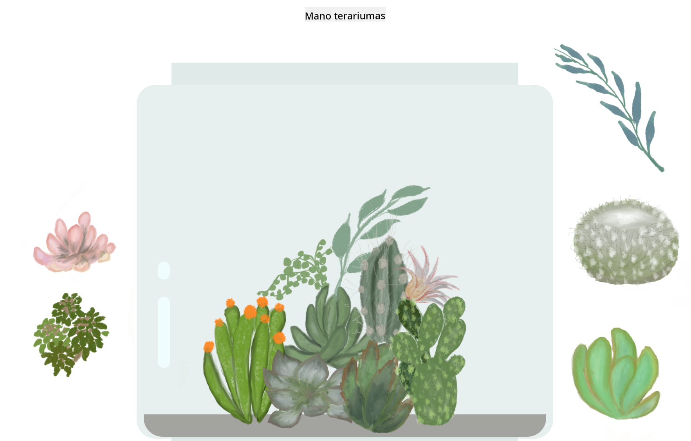

<!--
CO_OP_TRANSLATOR_METADATA:
{
  "original_hash": "7965cd2bc5dc92ad888dc4c6ab2ab70a",
  "translation_date": "2025-08-28T11:48:35+00:00",
  "source_file": "3-terrarium/README.md",
  "language_code": "lt"
}
-->
# Mano Terariumas: Projektas mokytis apie HTML, CSS ir DOM manipuliavimą naudojant JavaScript 🌵🌱

Maža vilkimo ir numetimo kodo meditacija. Su šiek tiek HTML, JS ir CSS galėsite sukurti internetinę sąsają, ją stilizuoti ir net pridėti įvairių pasirinktų sąveikų.

# Pamokos

1. [Įvadas į HTML](./1-intro-to-html/README.md)
2. [Įvadas į CSS](./2-intro-to-css/README.md)
3. [Įvadas į DOM ir JS uždarymus](./3-intro-to-DOM-and-closures/README.md)

## Kreditas

Parašyta su ♥️ [Jen Looper](https://www.twitter.com/jenlooper)

Terariumas, sukurtas naudojant CSS, buvo įkvėptas Jakub Mandra stiklinio indo [codepen](https://codepen.io/Rotarepmi/pen/rjpNZY).

Piešiniai ranka nupiešti [Jen Looper](http://jenlooper.com) naudojant Procreate.

## Publikuokite savo Terariumą

Galite publikuoti arba paskelbti savo terariumą internete naudodami Azure Static Web Apps.

1. Fork'inkite šį repozitoriją

2. Paspauskite šį mygtuką

3. Užpildykite vedlio nurodymus, kurdami savo programą. Įsitikinkite, kad programos šaknis nustatyta kaip `/solution` arba jūsų kodo bazės šaknis. Šioje programoje nėra API, todėl dėl to nesijaudinkite. Jūsų fork'intoje repozitorijoje bus sukurtas github aplankas, kuris padės Azure Static Web Apps kūrimo paslaugoms sukurti ir publikuoti jūsų programą nauju URL.

---

**Atsakomybės apribojimas**:  
Šis dokumentas buvo išverstas naudojant AI vertimo paslaugą [Co-op Translator](https://github.com/Azure/co-op-translator). Nors siekiame tikslumo, prašome atkreipti dėmesį, kad automatiniai vertimai gali turėti klaidų ar netikslumų. Originalus dokumentas jo gimtąja kalba turėtų būti laikomas autoritetingu šaltiniu. Kritinei informacijai rekomenduojama naudoti profesionalų žmogaus vertimą. Mes neprisiimame atsakomybės už nesusipratimus ar klaidingus interpretavimus, atsiradusius dėl šio vertimo naudojimo.