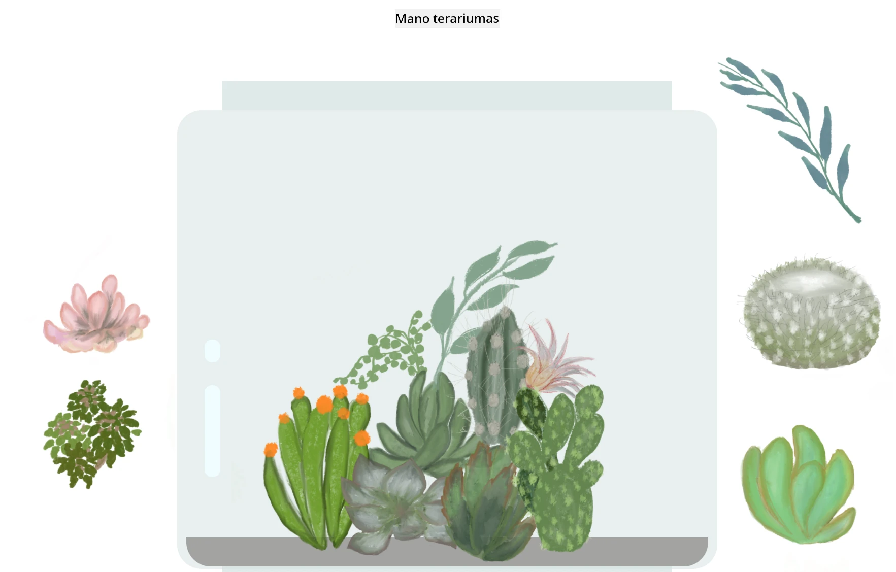

# Mano Terariumas: Projektas mokytis apie HTML, CSS ir DOM manipuliavimą naudojant JavaScript 🌵🌱

Maža vilkimo ir numetimo kodavimo meditacija. Naudodami šiek tiek HTML, JS ir CSS, galite sukurti internetinę sąsają, ją stilizuoti ir pridėti interaktyvumo.

## Kreditas

Sukurta su ♥️ [Jen Looper](https://www.twitter.com/jenlooper)

Terariumas, sukurtas naudojant CSS, buvo įkvėptas Jakubo Mandros stiklinio stiklainio [codepen](https://codepen.io/Rotarepmi/pen/rjpNZY).

Meno kūriniai buvo ranka piešti [Jen Looper](http://jenlooper.com) naudojant Procreate.

## Publikuokite savo Terariumą

Galite publikuoti arba paskelbti savo terariumą internete naudodami Azure Static Web Apps.

1. Fork'inkite šį repozitoriją

2. Paspauskite šį mygtuką

3. Sekite vedlio nurodymus, kurdami savo programėlę. Įsitikinkite, kad nustatėte programėlės šaknį kaip `/solution` arba savo kodo bazės šaknį. Šioje programėlėje nėra API, todėl dėl to nesijaudinkite. Fork'intoje repozitorijoje bus sukurta `.github` aplankas, kuris padės Azure Static Web Apps kūrimo paslaugai sukurti ir publikuoti jūsų programėlę nauju URL adresu.

---

**Atsakomybės apribojimas**:  
Šis dokumentas buvo išverstas naudojant AI vertimo paslaugą [Co-op Translator](https://github.com/Azure/co-op-translator). Nors siekiame tikslumo, prašome atkreipti dėmesį, kad automatiniai vertimai gali turėti klaidų ar netikslumų. Originalus dokumentas jo gimtąja kalba turėtų būti laikomas autoritetingu šaltiniu. Dėl svarbios informacijos rekomenduojama profesionali žmogaus vertimo paslauga. Mes neprisiimame atsakomybės už nesusipratimus ar klaidingus interpretavimus, atsiradusius naudojant šį vertimą.