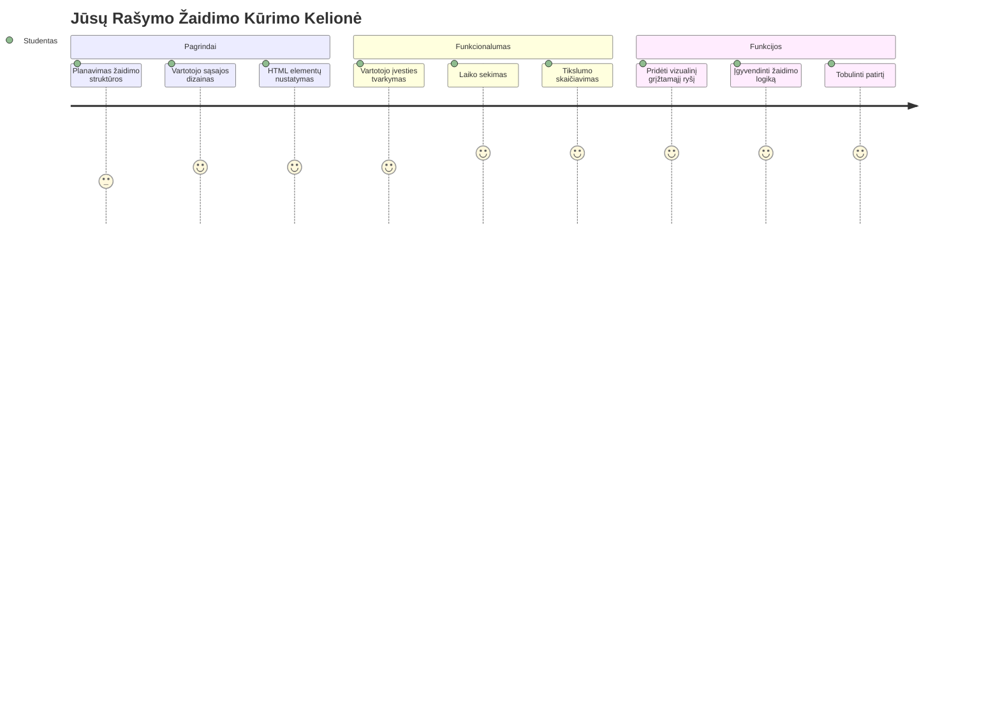
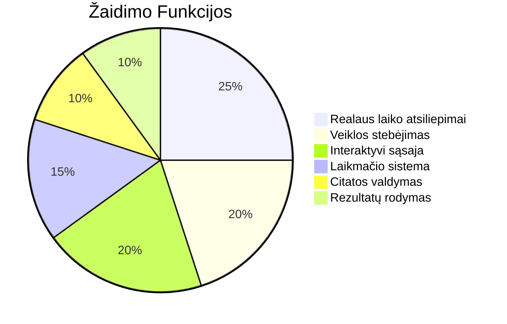
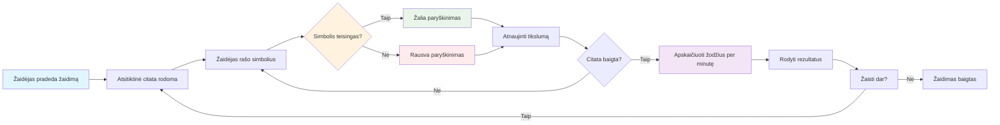
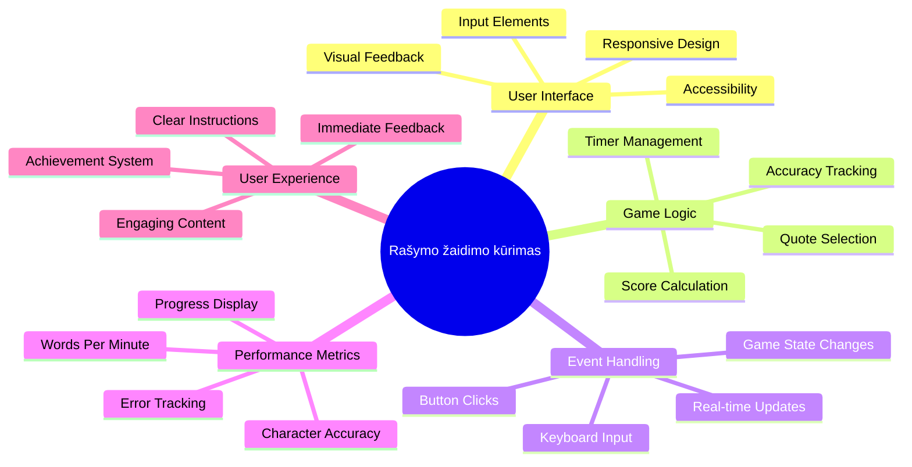
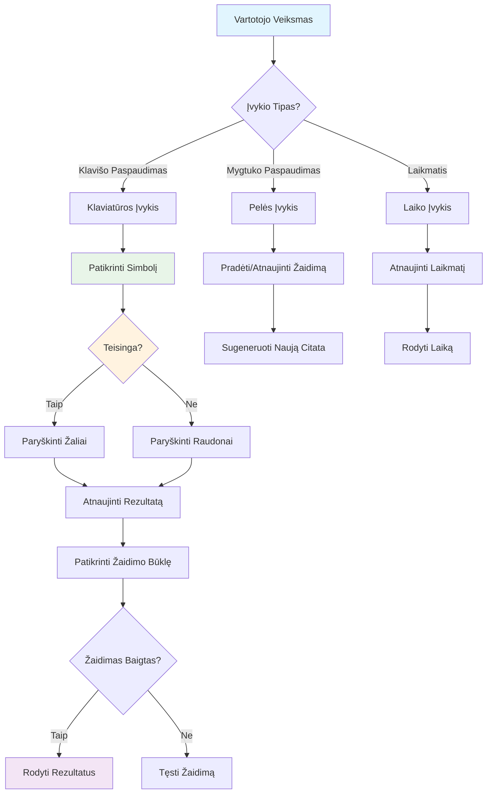
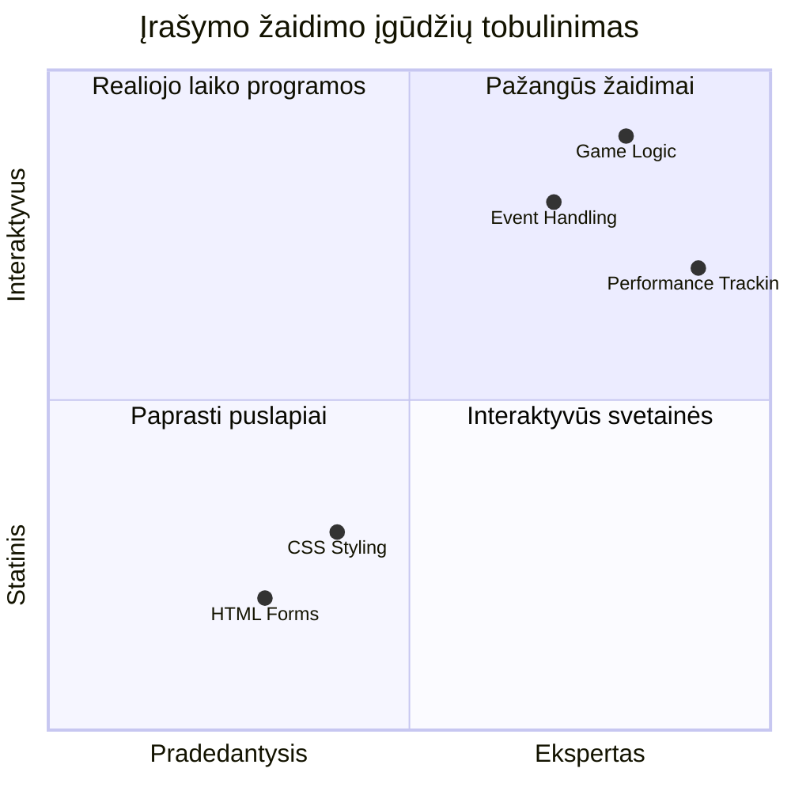
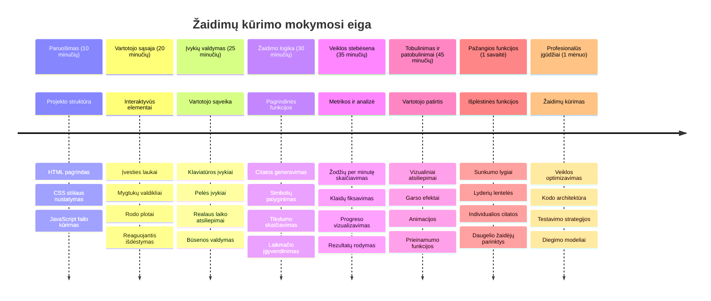

<!--
CO_OP_TRANSLATOR_METADATA:
{
  "original_hash": "efa2ab875b8bb5a7883816506da6b6d2",
  "translation_date": "2026-01-07T10:58:17+00:00",
  "source_file": "4-typing-game/README.md",
  "language_code": "lt"
}
-->
# Įvykių valdomas programavimas - Sukurkite rašymo žaidimą

## Įvadas

Tai, ką žino kiekvienas programuotojas, bet retai apie tai kalba: greitas rašymas yra supergalia! 🚀 Pagalvokite – kuo greičiau galite savo idėjas perkelti nuo smegenų į kodo redaktorių, tuo labiau gali tekėti jūsų kūrybiškumas. Tai tarsi tiesioginė linija tarp jūsų minčių ir ekrano.

Norite sužinoti vieną geriausių būdų patobulinti šį įgūdį? Atspėjote – mes kursime žaidimą!

> Sukurkime kartu nuostabų rašymo žaidimą!

Pasiruošę panaudoti visas tas JavaScript, HTML ir CSS žinias, kurias mokėtės? Mes kursime rašymo žaidimą, kuris iššūkį jums mestų su atsitiktinėmis legendinio detektyvo [Šerloko Holmo](https://en.wikipedia.org/wiki/Sherlock_Holmes) citatomis. Žaidimas sekios, kaip greitai ir tiksliai sugebate rašyti – ir patikėkite manimi, tai yra labiau priklausomybę keliantis, nei galbūt manėte!

## Ką reikės žinoti

Prieš pradėdami, įsitikinkite, kad esate susipažinę su šiomis sąvokomis (nesijaudinkite, jei reikės greitos peržiūros – mes visi taip buvome!):

- Teksto įvesties ir mygtukų valdiklių kūrimas
- CSS ir stilių nustatymas naudojant klases  
- JavaScript pagrindai
  - Masyvų kūrimas
  - Atsitiktinio skaičiaus generavimas
  - Einamo laiko gavimas

Jei kuris nors iš šių dalykų skamba kiek neryškiai, viskas gerai! Kartais geriausias būdas tvirtai įsisavinti yra įšokti į projektą ir spręsti problemas kelyje.

### 🔄 **Pedagoginis patikrinimas**
**Pagrindų vertinimas**: Prieš pradedant kūrimą, įsitikinkite, kad suprantate:
- ✅ Kaip veikia HTML formos ir įvesties elementai
- ✅ CSS klasės ir dinaminis stilizavimas
- ✅ JavaScript įvykių klausytojai ir apdorotojai
- ✅ Masyvų valdymas ir atsitiktinis pasirinkimas
- ✅ Laiko matavimas ir skaičiavimai

**Greitas savitikrinimas**: Ar galite paaiškinti, kaip šios sąvokos veikia kartu interaktyviame žaidime?
- **Įvykiai** suveikia, kai vartotojai sąveikauja su elementais
- **Apdorotojai** tvarko tuos įvykius ir atnaujina žaidimo būseną
- **CSS** suteikia vizualinį grįžtamąjį ryšį vartotojo veiksmams
- **Laikmačiai** leidžia matuoti našumą ir valdyti žaidimo eigą

## Pradėkime kurti!

[Rašymo žaidimo kūrimas naudojant įvykių valdomą programavimą](./typing-game/README.md)

### ⚡ **Ką galite padaryti per artimiausias 5 minutes**
- [ ] Atidarykite naršyklės konsolę ir pabandykite klausytis klaviatūros įvykių su `addEventListener`
- [ ] Sukurkite paprastą HTML puslapį su įvesties lauku ir pabandykite aptikti rašymą
- [ ] Praktikuokitės manipuliuoti eilutėmis, lygindami įvestą tekstą su tikslu
- [ ] Eksperimentuokite su `setTimeout`, kad suprastumėte laiko funkcijas

### 🎯 **Ką galite pasiekti per šią valandą**
- [ ] Atlikite po pamokos testą ir supraskite įvykių valdomą programavimą
- [ ] Sukurkite bazinę rašymo žaidimo versiją su žodžių tikrinimu
- [ ] Pridėkite vizualinį grįžtamąjį ryšį teisingam ir klaidingam rašymui
- [ ] Įgyvendinkite paprastą taškų sistemą, pagrįstą greičiu ir tikslumu
- [ ] Stilizuokite žaidimą su CSS, kad jis būtų vizualiai patrauklus

### 📅 **Savaitės trukmės žaidimo kūrimas**
- [ ] Užbaikite pilną rašymo žaidimą su visomis funkcijomis ir šlifavimu
- [ ] Pridėkite sunkumo lygius su skirtingo sudėtingumo žodžiais
- [ ] Įgyvendinkite vartotojų statistikos sekimą (WPM, tikslumas per laiką)
- [ ] Sukurkite garsinius efektus ir animacijas geresnei naudotojo patirčiai
- [ ] Padarykite žaidimą mobiliesiems pritaikytą prisilietimui
- [ ] Pasidalinkite žaidimu internete ir rinkite vartotojų atsiliepimus

### 🌟 **Mėnesio trukmės interaktyvus kūrimas**
- [ ] Sukurkite kelis žaidimus, tyrinėdami įvairias sąveikos schemas
- [ ] Išmokite apie žaidimų ciklus, būsenų valdymą ir našumo optimizavimą
- [ ] Prisidėkite prie atvirojo kodo žaidimų kūrimo projektų
- [ ] Įvaldykite pažangias laiko koncepcijas ir sklandžias animacijas
- [ ] Sukurkite portfolio, demonstruojantį įvairias interaktyvias programas
- [ ] Mokykite kitus, besidominčius žaidimų kūrimu ir vartotojo sąveika

## 🎯 Jūsų rašymo žaidimo meistriškumo laiko planas

### 🛠️ Jūsų žaidimo kūrimo įrankių rinkinio santrauka

Baigę šį projektą, jūs būsitreipę:
- **Įvykių valdomas programavimas**: Reaguojančios vartotojo sąsajos, kurios prisitaiko prie įvesties
- **Realiojo laiko grįžtamasis ryšys**: Momentiniai vizualiniai ir našumo atnaujinimai
- **Našumo matavimas**: Tikslūs laiko ir taškų skaičiavimo mechanizmai
- **Žaidimo būsenos valdymas**: Programos eigos ir vartotojo patirties valdymas
- **Interaktyvus dizainas**: Įtraukiančios, priklausomybę sukeliančios vartotojo patirtys
- **Šiuolaikiniai žiniatinklio API**: Naršyklės galimybių panaudojimas turtingoms sąveikoms
- **Prieinamumo modeliai**: Įtraukus dizainas visiems vartotojams

**Tikrojo pasaulio taikymai**: Šie įgūdžiai tiesiogiai taikomi:
- **Žiniatinklio programos**: Bet kuri interaktyvi sąsaja ar valdymo skydelis
- **Mokomoji programinė įranga**: Mokymosi platformos ir įgūdžių vertinimo įrankiai
- **Produktyvumo įrankiai**: Teksto redaktoriai, IDE ir bendradarbiavimo programinė įranga
- **Žaidimų industrija**: Naršyklės žaidimai ir interaktyvi pramoga
- **Mobilioji kūrimas**: Prisilietimo pagrindu veikiančios sąsajos ir gestų valdymas

**Kitas lygis**: Jūs esate pasirengę tyrinėti pažangias žaidimų sistemas, realaus laiko daugelio žaidėjų sistemas ar sudėtingas interaktyvias programas!

## Autoriai

Parašė su ♥️ [Christopher Harrison](http://www.twitter.com/geektrainer)

---

<!-- CO-OP TRANSLATOR DISCLAIMER START -->
**Atsakomybės apribojimas**:
Šis dokumentas buvo išverstas naudojant dirbtinio intelekto vertimo paslaugą [Co-op Translator](https://github.com/Azure/co-op-translator). Nors siekiame tikslumo, prašome atkreipti dėmesį, kad automatiniai vertimai gali turėti klaidų ar netikslumų. Originalus dokumentas gimtąja kalba laikomas autoritetingu šaltiniu. Esant svarbiai informacijai, rekomenduojama kreiptis į profesionalų vertėją. Mes neprisiimame atsakomybės už bet kokius nesusipratimus ar neteisingus interpretavimus, kylančius dėl šio vertimo naudojimo.
<!-- CO-OP TRANSLATOR DISCLAIMER END -->