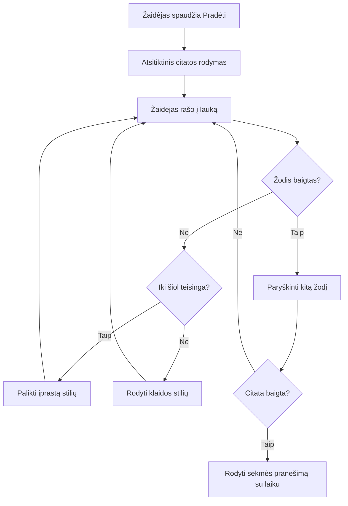
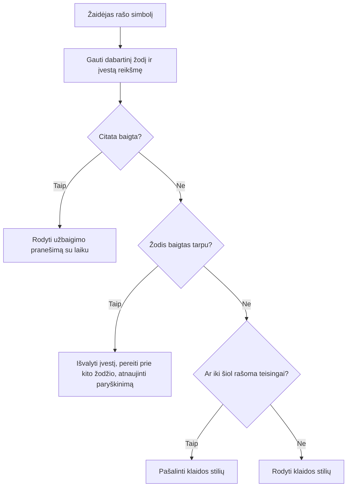
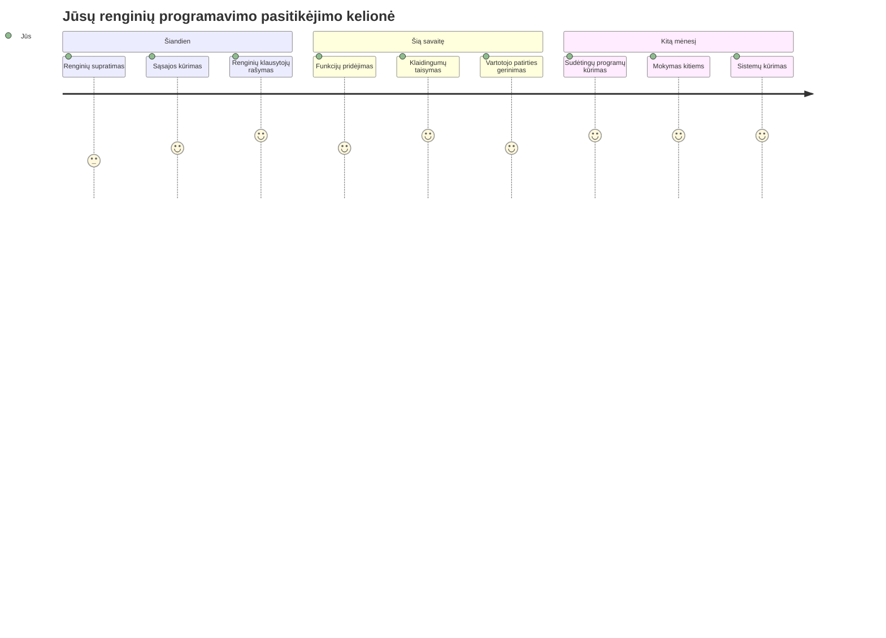

# Žaidimo kūrimas naudojant įvykius

Ar kada nors susimąstėte, kaip svetainės žino, kai paspaudžiate mygtuką ar rašote teksto laukelyje? Tai yra įvykių valdomos programavimo magija! Koks geresnis būdas išmokti šį svarbų įgūdį nei sukurti ką nors naudingo – rašymo greičio žaidimą, kuris reaguoja į kiekvieną jūsų paspaustą klavišą.

Jūs pamatysite iš arti, kaip žiniatinklio naršyklės „kalba“ su jūsų JavaScript kodu. Kiekvieną kartą kai paspaudžiate, rašote ar judinate pelę, naršyklė siunčia mažus pranešimus (juos vadiname įvykiais) jūsų kodui, o jūs nusprendžiate, kaip į juos reaguoti!

Kai baigsime, jūs būsite sukūrę tikrą rašymo žaidimą, kuris seka jūsų greitį ir tikslumą. Svarbiau, jūs suprasite pagrindines sąvokas, kurios veikia kiekvieną interaktyvią svetainę, kurią kada nors naudojote. Pradėkime!

## Priešpaskaitos testas

[Priešpaskaitos testas](https://ff-quizzes.netlify.app/web/quiz/21)

## Įvykių valdomas programavimas

Pagalvokite apie savo mėgstamiausią programėlę ar svetainę – kas ją daro gyvą ir jautrią? Viskas priklauso nuo to, kaip ji reaguoja į jūsų veiksmus! Kiekvienas bakstelėjimas, paspaudimas, perbraukimas ar klavišo paspaudimas sukuria tai, ką vadiname „įvykiu“, ir tai yra tikroji interneto kūrimo magija.

Štai kas daro programavimą žiniatinkliui taip įdomų: mes niekada nežinome, kada kas nors paspaus tą mygtuką arba pradės rašyti teksto laukelyje. Jie gali paspausti iš karto, palaukti penkias minutes arba gal niekada nespausti! Šis nenuspėjamumas reiškia, kad turime kitaip mąstyti rašydami savo kodą.

Vietoj to, kad rašytume kodą, kuris veikia iš viršaus į apačią kaip receptas, mes rašome kodą, kuris kantriai laukia, kol kažkas įvyks. Tai panašu į 1800-ųjų telegrafo operatorius, kurie sėdėdavo prie savo mašinų, pasirengę reaguoti, kai tik per laidą ateidavo žinutė.

Tai kas yra „įvykis“? Paprastai sakant, tai kažkas, kas įvyksta! Kai paspaudžiate mygtuką – tai įvykis. Kai įvedate raidę – tai įvykis. Kai judinate pelę – tai dar vienas įvykis.

Įvykių valdomas programavimas leidžia mums nustatyti kodą, kuris klausosi ir reaguoja. Mes kuriame specialias funkcijas, vadinamas **įvykių klausytojais** (event listeners), kurios kantriai laukia tam tikrų dalykų įvykti, o kai jie įvyksta, tuoj pat pradeda veikti.

Pagalvokite apie įvykių klausytojus kaip durų skambutį jūsų kodui. Jūs įrengiate durų skambutį (`addEventListener()`), nurodote, kokio garso klausytis (pvz., „click“ arba „keypress“), o tada apibrėžiate, kas turėtų nutikti, kai kas nors paspaudžia skambutį (jūsų pasirinkta funkcija).

**Kaip veikia įvykių klausytojai:**
- **Klauso** konkrečių vartotojo veiksmų, tokių kaip paspaudimai, klavišo paspaudimai ar pelės judesiai
- **Atlieka** jūsų pasirinktą kodą, kai nurodytas įvykis įvyksta
- **Reaguoja** iš karto į vartotojo sąveikas, sukuriant sklandžią patirtį
- **Aptarnauja** kelis įvykius tame pačiame elemente naudodami skirtingus klausytojus

> **PASTABA:** Svarbu paminėti, kad yra daug būdų sukurti įvykių klausytojus. Galite naudoti anonimines funkcijas arba sukurti pavadintas. Galite naudoti įvairias trumpesnes formas, pavyzdžiui, nustatyti `click` savybę ar naudoti `addEventListener()`. Mūsų pratime sutelksime dėmesį į `addEventListener()` ir anoniminias funkcijas, nes tai tikriausiai pati dažniausia technika, kurią naudoja interneto kūrėjai. Taip pat tai pati lankščiausia, nes `addEventListener()` veikia su visais įvykiais, o įvykio pavadinimas gali būti pateiktas kaip parametras.

### Įprasti įvykiai

Nors interneto naršyklės siūlo dešimtis skirtingų įvykių, kuriuos galite klausytis, dauguma interaktyvių programėlių remiasi vos keliais pagrindiniais įvykiais. Šių pagrindinių įvykių supratimas suteiks pagrindą kurti sudėtingas vartotojo sąveikas.

Yra [dešimtys įvykių](https://developer.mozilla.org/docs/Web/Events), kuriuos galite naudoti kurdami programėlę. Iš esmės bet koks vartotojo veiksmas puslapyje sukuria įvykį, kuris suteikia jums daug galios užtikrinti pageidaujamą vartotojo patirtį. Laimei, paprastai jums reikės tik kelių įvykių. Štai keletas įprastų (įskaitant du, kuriuos naudosime kurdami žaidimą):

| Įvykis | Aprašymas | Dažniausios naudojimo sritys |
|--------|-----------|------------------------------|
| `click` | Vartotojas paspaudė kažką | Mygtukai, nuorodos, interaktyvūs elementai |
| `contextmenu` | Vartotojas paspaudė dešinį pelės mygtuką | Adaptuotos dešinio pelės mygtuko meniu |
| `select` | Vartotojas pažymėjo tekstą | Teksto redagavimas, kopijavimo operacijos |
| `input` | Vartotojas įvedė tekstą | Formų validacija, realaus laiko paieška |

**Šių įvykių tipų supratimas:**
- **Sukelia veiksmą**, kai vartotojas sąveikauja su specifiniais jūsų puslapio elementais
- **Teikia** išsamią informaciją apie vartotojo veiksmą per įvykių objektus
- **Leidžia** kurti jautrias, interaktyvias interneto programėles
- **Veikia** nuosekliai įvairiose naršyklėse ir įrenginiuose

## Žaidimo kūrimas

Dabar, kai suprantate, kaip veikia įvykiai, panaudosime šias žinias praktiškai kurdami ką nors naudingo. Mes sukursime rašymo greičio žaidimą, kuris demonstruoja įvykių tvarkymą, tuo pačiu padėdamas jums įgyti svarbų programuotojo įgūdį.

Kursime žaidimą, kad ištirtume, kaip veikia įvykiai JavaScripte. Mūsų žaidimas patikrins žaidėjo rašymo įgūdžius, kurie yra vieni iš mažiausiai vertinamų įgūdžių, kuriuos turėtų turėti visi programuotojai. Įdomu: QWERTY klaviatūros išdėstymas, kurį naudojame šiandien, iš tiesų buvo sukurta 1870-aisiais rašomosioms mašinėlėms – ir geri rašymo įgūdžiai vis dar yra labai vertingi programuotojams! Žaidimo pagrindinė eiga atrodys taip:


**Kaip veiks mūsų žaidimas:**
- **Prasideda**, kai žaidėjas paspaudžia pradžios mygtuką ir parodomas atsitiktinis citatos tekstas
- **Sekamas** žaidėjo rašymo progresas žodis po žodžio realiuoju laiku
- **Pažymimas** dabartinis žodis, kad žaidėjas galėtų susikaupti
- **Teikiama** momentinė vizualinė grįžtamoji informacija apie rašymo klaidas
- **Skaičiuojamas** ir rodomas bendras laikas, kai citata yra parašyta

Sukurkime mūsų žaidimą ir sužinokime apie įvykius!

### Failų struktūra

Prieš pradėdami rašyti kodą, susitvarkykime! Aiški failų struktūra nuo pat pradžių jums sutaupys galvos skausmo vėliau ir padarys jūsų projektą profesionalesnį. 😊

Mes laikysimės paprastumo ir turėsime tik tris failus: `index.html` puslapio struktūrai, `script.js` visai žaidimo logikai bei `style.css` visam stiliaus aprašymui. Tai klasikinė trio, kuris varo didžiąją dalį interneto!

**Sukurkite naują aplanką savo darbui atidarydami konsolę arba terminalą ir įveskite šią komandą:**

```bash
# Linux arba macOS
mkdir typing-game && cd typing-game

# Windows
md typing-game && cd typing-game
```

**Štai ką daro šios komandos:**
- **Sukuria** naują katalogą `typing-game` jūsų projekto failams
- **Automatiškai pereina** į naujai sukurtą katalogą
- **Sukuria** švarią darbo erdvę žaidimo kūrimui

**Atidarykite Visual Studio Code:**

```bash
code .
```

**Ši komanda:**
- **Paleidžia** Visual Studio Code dabartiniame kataloge
- **Atidaro** jūsų projekto aplanką redaktoriuje
- **Suteikia** prieigą prie visų kūrimo įrankių, kurių jums reikės

**Pridėkite tris failus į aplanką Visual Studio Code su šiais pavadinimais:**
- `index.html` – žaidimo struktūra ir turinys
- `script.js` – visa žaidimo logika ir įvykių klausytojai
- `style.css` – išvaizdos ir stiliaus aprašymas

## Vartotojo sąsajos kūrimas

Dabar sukurkime sceną, kur vyks visas mūsų žaidimo veiksmas! Galvokite apie tai kaip apie erdvėlaivio valdymo pulto dizainą – turime užtikrinti, kad žaidėjams reikalingi dalykai būtų ten, kur jie tikisi.

Išnagrinėkime, ko mūsų žaidimui tikrai reikia. Jei žaistumėte rašymo žaidimą, ką norėtumėte matyti ekrane? Štai ko reikės:

| Sąsajos elementas | Paskirtis | HTML elementas |
|-------------------|-----------|---------------|
| Citatos rodymas | Rodo tekstą, kurį reikia įvesti | `<p>` su `id="quote"` |
| Pranešimų zona | Rodo būsenos ir sėkmės pranešimus | `<p>` su `id="message"` |
| Teksto įvedimas | Kur žaidėjai rašo citatą | `<input>` su `id="typed-value"` |
| Pradžios mygtukas | Pradeda žaidimą | `<button>` su `id="start"` |

**UI struktūros supratimas:**
- **Logiškai organizuoja** turinį iš viršaus į apačią
- **Priskiria** unikalius ID elementams, kad galėtume juos valdyti JavaScript
- **Suteikia** aiškią vizualinę hierarchiją geresnei naudotojo patirčiai
- **Naudoja** semantinius HTML elementus prieinamumui užtikrinti

Kiekvienam iš jų reikės ID, kad galėtume dirbti su jais JavaScripte. Pridėsime ir nuorodas į CSS bei JavaScript failus, kuriuos kursime.

Sukurkite naują failą pavadinimu `index.html`. Įrašykite šį HTML kodą:

```html
<!-- inside index.html -->
<html>
<head>
  <title>Typing game</title>
  <link rel="stylesheet" href="style.css">
</head>
<body>
  <h1>Typing game!</h1>
  <p>Practice your typing skills with a quote from Sherlock Holmes. Click **start** to begin!</p>
  <p id="quote"></p> <!-- This will display our quote -->
  <p id="message"></p> <!-- This will display any status messages -->
  <div>
    <input type="text" aria-label="current word" id="typed-value" /> <!-- The textbox for typing -->
    <button type="button" id="start">Start</button> <!-- To start the game -->
  </div>
  <script src="script.js"></script>
</body>
</html>
```

**Ką suteikia ši HTML struktūra:**
- **Prijungia** CSS stilių failą `<head>`, kad suformuotų išvaizdą
- **Sukuria** aiškią antraštę ir instrukcijas vartotojams
- **Nustato** vietas dinamiškam turiniui su specifiniais ID
- **Įtraukia** įvedimo lauką su prieinamumo atributais
- **Suteikia** pradžios mygtuką žaidimui pradėti
- **Įrašo** JavaScript failą gale dėl geresnio veikimo

### Programėlės paleidimas

Dažnas programėlės testavimas leidžia laiku pastebėti problemas ir stebėti pažangą realiu laiku. Live Server yra vertingas įrankis, kuris automatiškai atnaujina naršyklę kiekvieną kartą išsaugojus pakeitimus, tai labai pagreitina vystymą.

Geriau kurti po truputį ir matyti, kaip viskas atrodo. Paleiskime mūsų programėlę. Visual Studio Code yra puikus plėtinys [Live Server](https://marketplace.visualstudio.com/items?itemName=ritwickdey.LiveServer&WT.mc_id=academic-77807-sagibbon), kuris lokalizuotai talpina programėlę ir automatiškai atnaujina naršyklę kaskart išsaugojus.

**Įdiekite [Live Server](https://marketplace.visualstudio.com/items?itemName=ritwickdey.LiveServer&WT.mc_id=academic-77807-sagibbon) spustelėdami nuorodą ir pasirinkdami Install:**

**Įdiegimo metu vyksta:**
- **Naršyklė** paprašo atidaryti Visual Studio Code
- **Čia nukreipiama** jus per plėtinio diegimo procesą
- **Gali prireikti** perkrauti Visual Studio Code, kad įdiegimas būtų baigtas

**Įdiegus, Visual Studio Code spustelėkite Ctrl-Shift-P (arba Cmd-Shift-P), kad atidarytumėte komandų paletę:**

**Komandų paletės supratimas:**
- **Greitas priėjimas** prie visų VS Code komandų
- **Ieškote** komandų rašydami
- **Siūlo** klaviatūros nuorodas greitesniam darbui

**Įveskite „Live Server: Open with Live Server“:**

**Live Server daro:**
- **Paleidžia** vietinį kūrimo serverį jūsų projektui
- **Automatiškai** atnaujina naršyklę išsaugojus failus
- **Tarnauja** jūsų failams per vietinį URL (dažniausiai `localhost:5500`)

**Atidarykite naršyklę ir eikite į `https://localhost:5500`:**

Dabar turėtumėte matyti jūsų sukurtą puslapį! Pridėkime šiek tiek funkcionalumo.

## Pridėkite CSS

Dabar padarykime, kad viskas atrodytų gerai! Vizualinė grįžtamoji informacija buvo labai svarbi vartotojo sąsajoms nuo ankstyvųjų kompiuterių laikų. 1980-aisiais tyrėjai nustatė, kad akimirksniu teikiama vizualinė grįžtamoji informacija žymiai pagerina vartotojo efektyvumą ir sumažina klaidas. Būtent tai kursime.

Mūsų žaidimas turi būti labai aiškus dėl to, kas vyksta. Žaidėjai turėtų iš karto matyti, kurį žodį reikia rašyti, ir jei padaro klaidą, tai turėtų matytis iš karto. Sukurkime paprastą, bet veiksmingą stilių:

Sukurkite naują failą pavadinimu `style.css` ir pridėkite šį tekstą:

```css
/* inside style.css */
.highlight {
  background-color: yellow;
}

.error {
  background-color: lightcoral;
  border: red;
}
```

**Šių CSS klasių supratimas:**
- **Pažymi** dabartinį žodį geltonu fonu aiškiam vizualiniam nurodymui
- **Žymi** rašymo klaidas šviesiai koraliniu fono spalva
- **Suteikia** momentinį grįžtamąjį ryšį nesutrikdydama vartotojo rašymo
- **Naudoja** kontrastingas spalvas prieinamumui ir aiškiam vaizdui

✅ Kalbant apie CSS, galite išdėstyti puslapį taip, kaip jums patinka. Skirkite šiek tiek laiko puslapiui padaryti patrauklesnį:

- Pasirinkite kitą šriftą
- Nuspalvinkite antraštes
- Pakeiskite elementų dydžius

## JavaScript

Čia viskas tampa įdomu! 🎉 Turime mūsų HTML struktūrą ir CSS stilių, bet dabar mūsų žaidimas yra kaip gražus automobilis be variklio. JavaScript bus tas variklis – jis iš tiesų leidžia viskam veikti ir reaguoti į žaidėjų veiksmus.

Čia pamatysite, kaip jūsų kūrinys įgyja gyvenimą. Spręsime šią užduotį po žingsnio, kad niekas neatrodytų pernelyg sudėtinga:

| Žingsnis | Paskirtis | Ko išmoksite |
|----------|-----------|--------------|
| [Konstantų kūrimas](../../../../4-typing-game/typing-game) | Nustatyti citatas ir DOM nuorodas | Kintamųjų valdymas ir DOM pasirinkimas |
| [Įvykių klausytojas žaidimo pradžiai](../../../../4-typing-game/typing-game) | Tvarkyti žaidimo pradžią | Įvykių tvarkymas ir UI atnaujinimai |
| [Įvykių klausytojas rašymui](../../../../4-typing-game/typing-game) | Apdoroti vartotojo įvestį realiu laiku | Įvesties validacija ir dinaminis grįžtamasis ryšys |

**Šis struktūrizuotas požiūris padeda jums:**
- **Organizuoti** kodą į logiškas ir valdomas dalis
- **Kūrybiškai kurti** funkcionalumą palaipsniui, palengvinant derinimą
- **Suprasti**, kaip skirtingos programėlės dalys veikia kartu
- **Kurti** pakartojamus modelius būsimam naudojimui

Bet pirmiausia sukurkite naują failą pavadinimu `script.js`.

### Pridėkite konstantas

Prieš pradėdami veikti, surinkime visas mūsų išteklius! Kaip NASA misijos valdymo centras įrengia visas savo stebėjimo sistemas prieš startą, taip ir mums daug lengviau, kai viskas paruošta iš anksto. Tai padeda išvengti vėliau ieškojimo ir klaidų rašyme.

Štai ką pirmiausia turime nustatyti:

| Duomenų tipas | Paskirtis | Pavyzdys |
| Citatos masyvas | Saugo visas galimas žaidimo citatas | `['Citata 1', 'Citata 2', ...]` |
| Žodžių masyvas | Suskaido dabartinę citatą į atskirus žodžius | `['Kai', 'tu', 'turi', ...]` |
| Žodžio indeksas | Sekti, kurį žodį žaidėjas rašo | `0, 1, 2, 3...` |
| Pradžios laikas | Skaičiuoti praėjusį laiką taškų skaičiavimui | `Date.now()` |

**Taip pat reikės nuorodų į mūsų UI elementus:**
| Elementas | ID | Paskirtis |
|---------|----|---------|
| Teksto įvestis | `typed-value` | Kur žaidėjai rašo |
| Citos rodymas | `quote` | Rodo citatą, kurią reikia rašyti |
| Žinutės sritis | `message` | Rodo būsenos pranešimus |

```javascript
// viduje script.js
// visi mūsų citatos
const quotes = [
    'When you have eliminated the impossible, whatever remains, however improbable, must be the truth.',
    'There is nothing more deceptive than an obvious fact.',
    'I ought to know by this time that when a fact appears to be opposed to a long train of deductions it invariably proves to be capable of bearing some other interpretation.',
    'I never make exceptions. An exception disproves the rule.',
    'What one man can invent another can discover.',
    'Nothing clears up a case so much as stating it to another person.',
    'Education never ends, Watson. It is a series of lessons, with the greatest for the last.',
];
// saugoti žodžių sąrašą ir žodžio indeksą, kurį žaidėjas šiuo metu rašo
let words = [];
let wordIndex = 0;
// pradžios laikas
let startTime = Date.now();
// puslapio elementai
const quoteElement = document.getElementById('quote');
const messageElement = document.getElementById('message');
const typedValueElement = document.getElementById('typed-value');
```

**Išskaidome, ką atlieka šis nustatymo kodas:**
- **Saugo** masyvą su Sherlocko Holmso citatomis naudojant `const`, nes citatos nesikeis
- **Inicijuoja** stebėjimo kintamuosius su `let`, nes šios reikšmės keisis žaidimo metu
- **Gauna** nuorodas į DOM elementus naudojant `document.getElementById()` efektyviam prieinamumui
- **Sukuria** pagrindą visai žaidimo funkcionalumui su aiškiais, aprašomais kintamaisiais
- **Organizuoja** susijusius duomenis ir elementus logiškai, kad būtų lengviau prižiūrėti kodą

✅ Toliau pridėkite daugiau citatų prie savo žaidimo

> 💡 **Naudingas patarimas**: Mes galime bet kada gauti elementus kode naudodami `document.getElementById()`. Kadangi dažnai kreipsimės į šiuos elementus, išvengsime rašybos klaidų, naudodami konstantas. Tokie sistemų karkasai kaip [Vue.js](https://vuejs.org/) ar [React](https://reactjs.org/) padės geriau valdyti ir centralizuoti jūsų kodą.
>
**Štai kodėl šis požiūris veikia taip gerai:**
- **Apsaugo** nuo rašybos klaidų, kai keli kartai kreipiamės į elementus
- **Pagerina** kodo skaitomumą naudojant aprašomas konstantas
- **Užtikrina** geresnę IDE pagalbą su automatinio užbaigimo ir klaidų tikrinimu
- **Palengvina** refaktoringą, jei vėliau keisis elementų ID

Skirkite minutę pažiūrėti vaizdo įrašą apie `const`, `let` ir `var` naudojimą

[](https://youtube.com/watch?v=JNIXfGiDWM8 "Kintamųjų tipai")

> 🎥 Spustelkite viršuje esančią nuotrauką, kad peržiūrėtumėte vaizdo įrašą apie kintamuosius.

### Pridėti pradinę logiką

Čia viskas pradeda veikti! 🚀 Jūs ruošiatės parašyti pirmąjį tikrą įvykio klausytuvą, o matyti, kaip jūsų kodas reaguoja į mygtuko paspaudimą, yra tikrai malonu.

Pagalvokite: kažkur žaidėjas paspaus mygtuką „Start“, ir jūsų kodas turi būti tam pasiruošęs. Mes nežinome, kada jis paspaus — gal iškart, gal po kavos — bet kai paspaus, jūsų žaidimas įsijungs.

Kai vartotojas paspaudžia `start`, turime pasirinkti citatą, nustatyti vartotojo sąsają ir stebėti dabartinį žodį bei laiką. Žemiau pateiktas reikalingas JavaScript kodas; jį aptarsime po kodo bloko.

```javascript
// skripto pabaigoje.js
document.getElementById('start').addEventListener('click', () => {
  // gauti citatą
  const quoteIndex = Math.floor(Math.random() * quotes.length);
  const quote = quotes[quoteIndex];
  // Sudėti citatą į žodžių masyvą
  words = quote.split(' ');
  // iš naujo nustatyti žodžio indeksą sekimui
  wordIndex = 0;

  // vartotojo sąsajos atnaujinimai
  // Sukurti span elementų masyvą, kad galėtume nustatyti klasę
  const spanWords = words.map(function(word) { return `<span>${word} </span>`});
  // Paversti į eilutę ir nustatyti kaip innerHTML citatos rodinyje
  quoteElement.innerHTML = spanWords.join('');
  // Pažymėti pirmą žodį
  quoteElement.childNodes[0].className = 'highlight';
  // Išvalyti ankstesnes žinutes
  messageElement.innerText = '';

  // Paruošti teksto lauką
  // Išvalyti teksto lauką
  typedValueElement.value = '';
  // nustatyti fokusą
  typedValueElement.focus();
  // nustatyti įvykio apdorojimo funkciją

  // Pradėti laikmatį
  startTime = new Date().getTime();
});
```

**Išskaidykime kodą logiškai dalimis:**

**📊 Žodžių sekimas:**
- **Pasirenka** atsitiktinę citatą naudodamas `Math.floor()` ir `Math.random()` įvairovei
- **Paverčia** citatą į atskirų žodžių masyvą naudodamas `split(' ')`
- **Nustato** `wordIndex` į 0, nes žaidėjai pradeda nuo pirmo žodžio
- **Paruošia** žaidimo būseną naujam raundui

**🎨 UI nustatymas ir rodymas:**
- **Sukuria** `<span>` elementų masyvą, apgaubiant kiekvieną žodį individualiam stiliui
- **Sujungia** span elementus į vieną eilutę efektyviam DOM atnaujinimui
- **Paryškina** pirmą žodį pridėdama `highlight` CSS klasę
- **Išvalo** ankstesnes žaidimo žinutes, kad būtų švarus vaizdas

**⌨️ Teksto laukelio paruošimas:**
- **Išvalo** esamą tekstą įvesties lauke
- **Nustato fokusuotą vaizdą** į tekstinį lauką, kad žaidėjai galėtų iškart rašyti
- **Paruošia** įvesties sritį naujam žaidimo seansui

**⏱️ Laikmačio inicijavimas:**
- **Užfiksuoja** dabartinį laiką naudodamas `new Date().getTime()`
- **Leidžia** tiksliai skaičiuoti rašymo greitį ir laiką
- **Pradeda** našumo sekimą žaidimo sesijai

### Pridėti rašymo logiką

Čia gilinamės į žaidimo šerdį! Nebijokite, jei pradžioje atrodo sudėtinga — pereisime viską žingsnis po žingsnio, ir pabaigoje pamatysite, kokia visa tai logiška.

Ką statome, yra gana sudėtinga: kiekvieną kartą, kai kas nors įveda raidę, mūsų kodas patikrina, ką įvedė, pateikia grįžtamąjį ryšį ir nusprendžia, kas turi nutikti toliau. Tai panašu į tai, kaip ankstyvieji žodžių procesoriai, pavyzdžiui, WordStar 1970-aisiais, pateikdavo rašytojams realaus laiko atsiliepimus.

```javascript
// script.js pabaigoje
typedValueElement.addEventListener('input', () => {
  // Gaukite esamą žodį
  const currentWord = words[wordIndex];
  // gaukite esamą reikšmę
  const typedValue = typedValueElement.value;

  if (typedValue === currentWord && wordIndex === words.length - 1) {
    // sakinio pabaiga
    // Rodyti sėkmę
    const elapsedTime = new Date().getTime() - startTime;
    const message = `CONGRATULATIONS! You finished in ${elapsedTime / 1000} seconds.`;
    messageElement.innerText = message;
  } else if (typedValue.endsWith(' ') && typedValue.trim() === currentWord) {
    // žodžio pabaiga
    // išvalykite typedValueElement naujam žodžiui
    typedValueElement.value = '';
    // pereiti prie kito žodžio
    wordIndex++;
    // iš naujo nustatyti klasių pavadinimus visiems elementams citatoje
    for (const wordElement of quoteElement.childNodes) {
      wordElement.className = '';
    }
    // paryškinti naują žodį
    quoteElement.childNodes[wordIndex].className = 'highlight';
  } else if (currentWord.startsWith(typedValue)) {
    // šiuo metu teisinga
    // paryškinti kitą žodį
    typedValueElement.className = '';
  } else {
    // klaidos būsena
    typedValueElement.className = 'error';
  }
});
```

**Suprasti rašymo logikos srautą:**

Ši funkcija naudoja laiptuotą požiūrį, tikrindama sąlygas nuo konkrečiausios iki bendriausios. Išskaidykime kiekvieną scenarijų:


**🏁 Citata baigta (Scenarijus 1):**
- **Tikrina**, ar įvesta reikšmė atitinka dabartinį žodį IR ar esame paskutiniame žodyje
- **Apskaičiuoja** praėjusį laiką atimdama pradžios laiką iš dabartinio laiko
- **Konvertuoja** milisekundes į sekundes, dalindama iš 1,000
- **Rodo** sveikinimo pranešimą su atlikimo laiku

**✅ Žodis baigtas (Scenarijus 2):**
- **Nustato** žodžio pabaigą, kai įvestis baigiasi tarpeliu
- **Patikrina**, ar apkarpytas įrašas tiksliai atitinka dabartinį žodį
- **Išvalo** įvesties lauką kitam žodžiui
- **Judina** žodžio indeksą į priekį `wordIndex` didinimu
- **Atnaujina** vizualinę paryškinimo dalį pašalindama visas klases ir paryškindama naują žodį

**📝 Rašymas vyksta (Scenarijus 3):**
- **Patikrina**, ar dabartinis žodis prasideda nuo to, ką vartotojas jau įvedė
- **Pašalina** klaidos stilių, kad parodytų, jog įvestis teisinga
- **Leidžia** tęsti rašymą be pertraukimo

**❌ Klaidos būsena (Scenarijus 4):**
- **Sukelia** būseną, kai įvesta reikšmė nesutampa su numatyta žodžio pradžia
- **Prideda** klaidos CSS klasę, suteikiančią momentinį vizualinį grįžtamąjį ryšį
- **Padeda** žaidėjams greitai pastebėti ir taisyti klaidas

## Išbandykite savo programą

Pažiūrėkite, ką sukūrėte! 🎉 Jūs ką tik sukūrėte veikiantį rašymo žaidimą nuo nulio, naudodami įvykiais pagrįstą programavimą. Skirkite akimirką tai įvertinti — tai ne mažas pasiekimas!

Dabar laikas testavimui! Ar viskas veiks kaip tikėtasi? Ar kažko nepamiršome? Svarbu: jei kas nors neduos idealaus rezultato iš karto, tai visiškai normalu. Net patyrę programuotojai reguliariai randa klaidų savo kode. Tai natūrali kūrimo proceso dalis!

Spustelkite `start` ir pradėkite rašyti! Turėtų atrodyti panašiai kaip animacijoje, kurią matėme anksčiau.


**Ką reikia patikrinti jūsų programoje:**
- **Patikrinti**, ar paspaudus Start rodo atsitiktinę citatą
- **Patikrinti**, ar rašant teisingai paryškinamas dabartinis žodis
- **Tikrina**, ar klaidos stilius pasirodo neteisingai rašant
- **Patikrinti**, ar pabaigus žodį paryškinimas juda tinkamai
- **Testuoti**, ar baigus citatą rodomas baigimo pranešimas su laiku

**Bendri derinimo patarimai:**
- **Patikrinti** naršyklės konsolę (F12) dėl JavaScript klaidų
- **Įsitikinti**, kad visi failų pavadinimai tiksliai atitinka (dėmesys didžiosioms raidėms)
- **Užtikrinti**, kad Live Server veikia ir tinkamai atnaujina puslapį
- **Išbandyti** įvairias citatas, kad patikrintumėte atsitiktinį pasirinkimą

---

## GitHub Copilot agento iššūkis 🎮

Naudokite Agent režimą, kad įvykdytumėte šį iššūkį:

**Aprašymas:** Pratęskite rašymo žaidimą įgyvendindami sunkumo lygio sistemą, kuri prisitaiko prie žaidėjo rezultato. Šis iššūkis padės jums tobulinti pažangų įvykių valdymą, duomenų analizę ir dinamišką UI atnaujinimą.

**Užduotis:** Sukurkite rašymo žaidimo sunkumo reguliavimo sistemą, kuri:
1. Stebi žaidėjo rašymo greitį (žodžius per minutę) ir tikslumo procentą
2. Automatiškai pereina tarp trijų sunkumo lygių: Lengvas (paprastos citatos), Vidutinis (esamos citatos), Sunkus (sudėtingos citatos su skyryba)
3. Rodo dabartinį sunkumo lygį ir žaidėjo statistiką UI
4. Įgyvendina straipsnio skaitiklį, kuris didina sunkumą po 3 iš eilės gerų rezultatų
5. Prideda vizualinį grįžtamąjį ryšį (spalvos, animacijos) sunkumo pakitimams parodyti

Pridėkite reikalingus HTML elementus, CSS stilius ir JavaScript funkcijas šiai funkcijai įgyvendinti. Įtraukite tinkamą klaidų valdymą ir užtikrinkite žaidimo prieinamumą su atitinkamais ARIA žymenimis.

Plačiau apie [Agent režimą](https://code.visualstudio.com/blogs/2025/02/24/introducing-copilot-agent-mode).

## 🚀 Iššūkis

Ruošiatės pakelti savo rašymo žaidimą į kitą lygį? Pabandykite įgyvendinti šias pažangias funkcijas, kad gilintumėte supratimą apie įvykių valdymą ir DOM manipuliavimą:

**Pridėkite daugiau funkcionalumo:**

| Funkcija | Aprašymas | Įgūdžiai kuriuos lavinsite |
|---------|-------------|------------------------|
| **Įvesties valdymas** | Išjungti `input` įvykio klausytuvą pabaigus ir vėl įjungti paspaudus mygtuką | Įvykių valdymas ir būsenų kontrolė |
| **UI būsenos valdymas** | Išjungti teksto laukelį, kai žaidėjas baigia citatą | DOM savybių valdymas |
| **Modalinis dialogas** | Rodyti modalinį dialogo langą su sėkmės pranešimu | Pažangios UI struktūros ir prieinamumas |
| **Aukšto rezultato sistema** | Saugo aukščiausius rezultatus naudojant `localStorage` | Naršyklės saugojimo API ir duomenų išsaugojimas |

**Įgyvendinimo patarimai:**
- **Išnagrinėkite** `localStorage.setItem()` ir `localStorage.getItem()` duomenų išsaugojimui
- **Praktikuokite** dinamiškai pridėti ir pašalinti įvykių klausytuvus
- **Išnagrinėkite** HTML dialogo elementus arba CSS modalinius šablonus
- **Apsvarstykite** prieinamumą išjungiant ir įjungiant formų valdiklius

## Po paskaitos testas

[Po paskaitos testas](https://ff-quizzes.netlify.app/web/quiz/22)

---

## 🚀 Jūsų rašymo žaidimo įvaldymo laiko planas

### ⚡ **Ką galite padaryti per artimiausias 5 minutes**
- [ ] Išbandyti rašymo žaidimą su skirtingomis citatomis, kad veiktų sklandžiai
- [ ] Eksperimentuoti su CSS stiliais – pabandyti keisti paryškinimo ir klaidų spalvas
- [ ] Atidaryti naršyklės DevTools (F12) ir stebėti Konsolę žaidimo metu
- [ ] Iššūkis sau – pabandyti kuo greičiau parašyti citatą

### ⏰ **Ką galite pasiekti šią valandą**
- [ ] Pridėti daugiau citatų masyvui (galbūt iš mėgstamų knygų ar filmų)
- [ ] Įgyvendinti aukščiausio rezultato sistemą `localStorage` iššūkio skyriuje
- [ ] Sukurti žodžių per minutę skaičiuoklį, rodantį po kiekvieno žaidimo
- [ ] Pridėti garsinius efektus teisingam rašymui, klaidoms ir baigimui

### 📅 **Jūsų savaitės nuotykis**
- [ ] Sukurti daugelio žaidėjų versiją, kur draugai gali konkuruoti šalia
- [ ] Sukurti skirtingus sunkumo lygius su įvairaus sudėtingumo citatomis
- [ ] Pridėti progreso juostą, rodančią, kiek citatos jau parašyta
- [ ] Įgyvendinti vartotojų paskyras su asmeninėmis statistikos ataskaitomis
- [ ] Sukurti pasirinktinius dizainus ir leisti vartotojams pasirinkti savo stilių

### 🗓️ **Jūsų mėnesio transformacija**
- [ ] Sukurti rašymo kursą su pamokomis, kurios palaipsniui moko teisingos pirštų padėties
- [ ] Kurti analizę, kuri rodytų, kurie raidės ar žodžiai sukelia daugiausia klaidų
- [ ] Pridėti palaikymą įvairioms kalboms ir klaviatūros išdėstymams
- [ ] Integruoti su švietimo API, kad būtų gaunamos citatos iš literatūrinių duomenų bazių
- [ ] Publikuoti savo patobulintą rašymo žaidimą kitiems naudoti ir mėgautis

### 🎯 **Galutinė savirefleksija**

**Prieš pradėdami toliau, skirkite akimirką atšvęsti:**
- Kas buvo maloniausia kuriant šį žaidimą?
- Kaip jaučiatės dėl įvykių valdimo programavimo, lyginant su pradžia?
- Kokią funkciją esate sužavėti įdiegti, kad žaidimas taptų unikalus?
- Kaip galite panaudoti įvykių valdymo koncepcijas kituose projektuose?


> 🌟 **Prisiminkite**: Jūs ką tik įvaldėte vieną svarbiausių koncepcijų, kuri žadina kiekvieną interaktyvų tinklalapį ir programą. Įvykių valdimas programavime leidžia internetui jaustis gyvam ir reaguojančiam. Kiekvieną kartą, kai matote išskleidžiamąjį meniu, formą, kuri tikrina įvestį rašymo metu, ar žaidimą, reaguojantį į jūsų paspaudimus – dabar suprantate užkulisius. Jūs mokotės ne tik programuoti, bet ir kurti intuityvias bei įtraukiančias patirtis! 🎉

---

## Peržiūra ir savarankiškas mokymasis

Pasidomėkite [visais galimais įvykiais](https://developer.mozilla.org/docs/Web/Events), kuriuos naršyklė suteikia programuotojui, ir apsvarstykite situacijas, kurias naudotumėte kiekvienam atvejui.

## Užduotis

[Sukurti naują klaviatūros žaidimą](assignment.md)

---

<!-- CO-OP TRANSLATOR DISCLAIMER START -->
**Atsakomybės apribojimas**:
Šis dokumentas buvo išverstas naudojant dirbtinio intelekto vertimo paslaugą [Co-op Translator](https://github.com/Azure/co-op-translator). Nors stengiamės užtikrinti tikslumą, prašome atkreipti dėmesį, kad automatizuotuose vertimuose gali būti klaidų arba netikslumų. Originalus dokumentas jo gimtąja kalba turėtų būti laikomas autoritetingu šaltiniu. Kritinei informacijai rekomenduojamas profesionalus vertimas žmogaus. Mes neatsakome už bet kokius nesusipratimus ar klaidingą interpretavimą, kylančius naudojantis šiuo vertimu.
<!-- CO-OP TRANSLATOR DISCLAIMER END -->