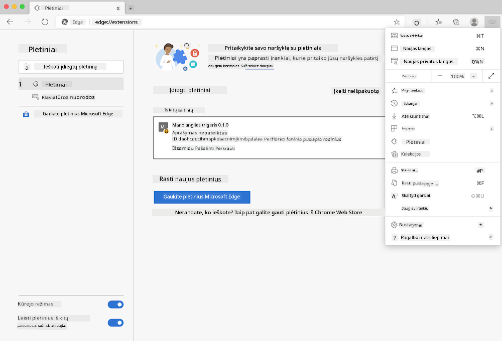
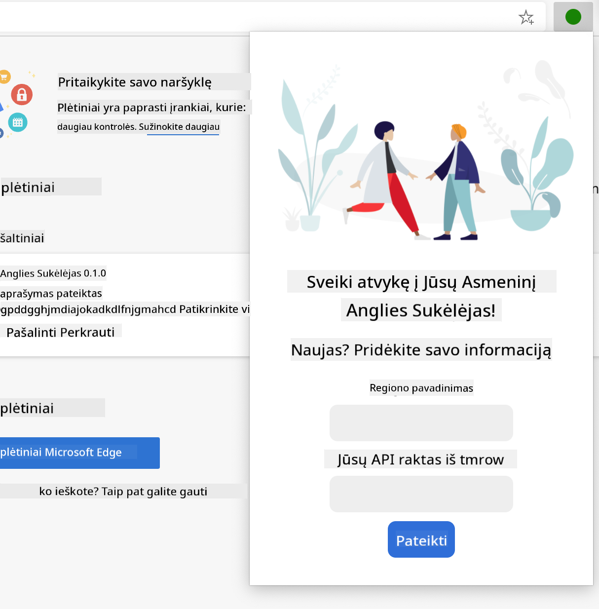
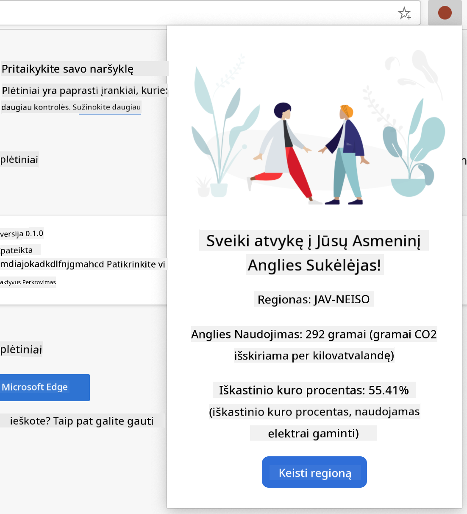

<!--
CO_OP_TRANSLATOR_METADATA:
{
  "original_hash": "2326d04e194a10aa760b51f5e5a1f61d",
  "translation_date": "2025-08-29T16:47:28+00:00",
  "source_file": "5-browser-extension/1-about-browsers/README.md",
  "language_code": "lt"
}
-->
# Naršyklės plėtinių projektas 1 dalis: Viskas apie naršykles


> Eskizas sukurtas [Wassim Chegham](https://dev.to/wassimchegham/ever-wondered-what-happens-when-you-type-in-a-url-in-an-address-bar-in-a-browser-3dob)

## Klausimai prieš paskaitą

[Klausimai prieš paskaitą](https://ff-quizzes.netlify.app/web/quiz/23)

### Įvadas

Naršyklės plėtiniai prideda papildomą funkcionalumą naršyklei. Tačiau prieš kuriant plėtinį, verta sužinoti, kaip naršyklės atlieka savo darbą.

### Apie naršyklę

Šioje pamokų serijoje išmoksite kurti naršyklės plėtinį, kuris veiks „Chrome“, „Firefox“ ir „Edge“ naršyklėse. Šioje dalyje sužinosite, kaip veikia naršyklės ir kaip sukurti naršyklės plėtinio elementus.

Tačiau kas yra naršyklė? Tai programinė įranga, leidžianti galutiniam vartotojui pasiekti turinį iš serverio ir rodyti jį tinklalapiuose.

✅ Šiek tiek istorijos: pirmoji naršyklė buvo pavadinta „WorldWideWeb“ ir ją 1990 m. sukūrė seras Timothy Berners-Lee.


> Kai kurios ankstyvos naršyklės, per [Karen McGrane](https://www.slideshare.net/KMcGrane/week-4-ixd-history-personal-computing)

Kai vartotojas prisijungia prie interneto naudodamas URL (Uniform Resource Locator) adresą, paprastai per Hypertext Transfer Protocol su `http` arba `https` adresu, naršyklė bendrauja su žiniatinklio serveriu ir gauna tinklalapį.

Šiuo metu naršyklės atvaizdavimo variklis rodo jį vartotojo įrenginyje, kuris gali būti mobilusis telefonas, stacionarus kompiuteris ar nešiojamas kompiuteris.

Naršyklės taip pat gali talpinti turinį, kad jo nereikėtų kiekvieną kartą gauti iš serverio. Jos gali įrašyti vartotojo naršymo istoriją, saugoti „sausainėlius“ (cookies), kurie yra maži duomenų gabalėliai, turintys informaciją apie vartotojo veiklą, ir dar daugiau.

Labai svarbu prisiminti, kad naršyklės nėra vienodos! Kiekviena naršyklė turi savo stipriąsias ir silpnąsias puses, o profesionalus žiniatinklio kūrėjas turi suprasti, kaip tinklalapiai veikia skirtingose naršyklėse. Tai apima mažų ekranų, tokių kaip mobiliojo telefono, palaikymą, taip pat vartotojo, kuris yra neprisijungęs, poreikius.

Labai naudinga svetainė, kurią tikriausiai turėtumėte įsiminti savo mėgstamoje naršyklėje, yra [caniuse.com](https://www.caniuse.com). Kurdamas tinklalapius, galite naudotis „caniuse“ technologijų palaikymo sąrašais, kad geriau palaikytumėte savo vartotojus.

✅ Kaip sužinoti, kurios naršyklės yra populiariausios jūsų svetainės vartotojų bazėje? Patikrinkite savo analizės duomenis – galite įdiegti įvairius analizės paketus kaip savo žiniatinklio kūrimo proceso dalį, ir jie parodys, kurios naršyklės yra dažniausiai naudojamos.

## Naršyklės plėtiniai

Kodėl verta kurti naršyklės plėtinį? Tai patogus įrankis, kurį galima pridėti prie naršyklės, kai reikia greitai pasiekti užduotis, kurias dažnai kartojate. Pavyzdžiui, jei dažnai tikrinate spalvas įvairiuose tinklalapiuose, galite įdiegti spalvų rinkiklio plėtinį. Jei jums sunku prisiminti slaptažodžius, galite naudoti slaptažodžių valdymo plėtinį.

Naršyklės plėtinius taip pat smagu kurti. Jie paprastai valdo ribotą skaičių užduočių, kurias atlieka gerai.

✅ Kokie jūsų mėgstamiausi naršyklės plėtiniai? Kokias užduotis jie atlieka?

### Plėtinių diegimas

Prieš pradėdami kurti, pažvelkite į naršyklės plėtinio kūrimo ir diegimo procesą. Nors kiekviena naršyklė šiek tiek skiriasi, kaip ji tvarko šią užduotį, procesas „Chrome“ ir „Firefox“ yra panašus į šį pavyzdį „Edge“:



> Pastaba: Įsitikinkite, kad įjungėte kūrėjo režimą ir leidote plėtinius iš kitų parduotuvių.

Iš esmės procesas bus toks:

- sukurkite savo plėtinį naudodami `npm run build` 
- naršyklėje eikite į plėtinių skydelį naudodami mygtuką „Nustatymai ir daugiau“ (piktograma `...`) viršutiniame dešiniajame kampe
- jei tai nauja diegimo versija, pasirinkite `load unpacked`, kad įkeltumėte naują plėtinį iš jo kūrimo aplanko (mūsų atveju tai yra `/dist`) 
- arba spustelėkite `reload`, jei iš naujo įkeliate jau įdiegtą plėtinį

✅ Šios instrukcijos taikomos plėtiniams, kuriuos kuriate patys; norėdami įdiegti plėtinius, kurie jau yra išleisti naršyklės plėtinių parduotuvėje, turėtumėte pereiti į šias [parduotuves](https://microsoftedge.microsoft.com/addons/Microsoft-Edge-Extensions-Home) ir įdiegti norimą plėtinį.

### Pradėkite

Jūs ketinate sukurti naršyklės plėtinį, kuris rodys jūsų regiono anglies pėdsaką, parodydamas jūsų regiono energijos naudojimą ir energijos šaltinį. Plėtinys turės formą, kuri surinks API raktą, kad galėtumėte pasiekti CO2 Signal API.

**Jums reikės:**

- [API rakto](https://www.co2signal.com/); įveskite savo el. pašto adresą į laukelį šioje svetainėje, ir jums bus atsiųstas raktas
- [kodo jūsų regionui](http://api.electricitymap.org/v3/zones), atitinkančio [Electricity Map](https://www.electricitymap.org/map) (pavyzdžiui, Bostone naudoju „US-NEISO“)
- [pradinio kodo](../../../../5-browser-extension/start). Atsisiųskite aplanką `start`; jūs užbaigsite kodą šiame aplanke.
- [NPM](https://www.npmjs.com) - NPM yra paketų valdymo įrankis; įdiekite jį vietoje, ir paketai, nurodyti jūsų `package.json` faile, bus įdiegti naudojimui jūsų žiniatinklio turte

✅ Sužinokite daugiau apie paketų valdymą šiame [puikiame mokymosi modulyje](https://docs.microsoft.com/learn/modules/create-nodejs-project-dependencies/?WT.mc_id=academic-77807-sagibbon)

Skirkite minutę peržiūrėti kodų bazę:

dist
    -|manifest.json (numatytosios nuostatos čia)
    -|index.html (HTML žymėjimas čia)
    -|background.js (foninis JS čia)
    -|main.js (sukurtas JS)
src
    -|index.js (jūsų JS kodas čia)

✅ Kai turėsite savo API raktą ir regiono kodą, išsaugokite juos kur nors užrašuose, kad galėtumėte naudoti ateityje.

### Sukurkite HTML plėtiniui

Šis plėtinys turi dvi peržiūras. Viena skirta API rakto ir regiono kodo surinkimui:



Ir antra, skirta regiono anglies naudojimui rodyti:



Pradėkime nuo formos HTML kūrimo ir jos stiliaus pritaikymo naudojant CSS.

Aplanke `/dist` sukurkite formą ir rezultatų sritį. Faile `index.html` užpildykite nurodytą formos sritį:

```HTML
<form class="form-data" autocomplete="on">
	<div>
		<h2>New? Add your Information</h2>
	</div>
	<div>
		<label for="region">Region Name</label>
		<input type="text" id="region" required class="region-name" />
	</div>
	<div>
		<label for="api">Your API Key from tmrow</label>
		<input type="text" id="api" required class="api-key" />
	</div>
	<button class="search-btn">Submit</button>
</form>	
```
Tai forma, kurioje bus įvesti ir išsaugoti jūsų duomenys vietinėje saugykloje.

Toliau sukurkite rezultatų sritį; po paskutinės formos žymos pridėkite keletą div elementų:

```HTML
<div class="result">
	<div class="loading">loading...</div>
	<div class="errors"></div>
	<div class="data"></div>
	<div class="result-container">
		<p><strong>Region: </strong><span class="my-region"></span></p>
		<p><strong>Carbon Usage: </strong><span class="carbon-usage"></span></p>
		<p><strong>Fossil Fuel Percentage: </strong><span class="fossil-fuel"></span></p>
	</div>
	<button class="clear-btn">Change region</button>
</div>
```
Šiuo metu galite pabandyti sukurti plėtinį. Įsitikinkite, kad įdiegėte šio plėtinio paketų priklausomybes:

```
npm install
```

Ši komanda naudos npm, „Node Package Manager“, kad įdiegtų „webpack“ jūsų plėtinio kūrimo procesui. „Webpack“ yra paketų tvarkyklė, kuri apdoroja kodo kompiliavimą. Galite peržiūrėti šio proceso rezultatą aplanke `/dist/main.js` - pamatysite, kad kodas buvo sujungtas.

Šiuo metu plėtinys turėtų būti sukurtas, ir jei jį įdiegsite „Edge“ kaip plėtinį, pamatysite tvarkingai rodomą formą.

Sveikiname, jūs žengėte pirmuosius žingsnius kuriant naršyklės plėtinį. Kitose pamokose padarysite jį funkcionalesnį ir naudingesnį.

---

## 🚀 Iššūkis

Pažvelkite į naršyklės plėtinių parduotuvę ir įdiekite vieną plėtinį į savo naršyklę. Galite įdomiais būdais išnagrinėti jo failus. Ką atrandate?

## Klausimai po paskaitos

[Klausimai po paskaitos](https://ff-quizzes.netlify.app/web/quiz/24)

## Apžvalga ir savarankiškas mokymasis

Šioje pamokoje sužinojote šiek tiek apie žiniatinklio naršyklės istoriją; pasinaudokite šia proga sužinoti, kaip Pasaulinio tinklo išradėjai įsivaizdavo jo naudojimą, skaitydami daugiau apie jo istoriją. Naudingos svetainės:

[Žiniatinklio naršyklių istorija](https://www.mozilla.org/firefox/browsers/browser-history/)

[Žiniatinklio istorija](https://webfoundation.org/about/vision/history-of-the-web/)

[Interviu su Tim Berners-Lee](https://www.theguardian.com/technology/2019/mar/12/tim-berners-lee-on-30-years-of-the-web-if-we-dream-a-little-we-can-get-the-web-we-want)

## Užduotis 

[Perstilizuokite savo plėtinį](assignment.md)

---

**Atsakomybės apribojimas**:  
Šis dokumentas buvo išverstas naudojant AI vertimo paslaugą [Co-op Translator](https://github.com/Azure/co-op-translator). Nors siekiame tikslumo, prašome atkreipti dėmesį, kad automatiniai vertimai gali turėti klaidų ar netikslumų. Originalus dokumentas jo gimtąja kalba turėtų būti laikomas autoritetingu šaltiniu. Kritinei informacijai rekomenduojama naudoti profesionalų žmogaus vertimą. Mes neprisiimame atsakomybės už nesusipratimus ar klaidingus interpretavimus, atsiradusius dėl šio vertimo naudojimo.