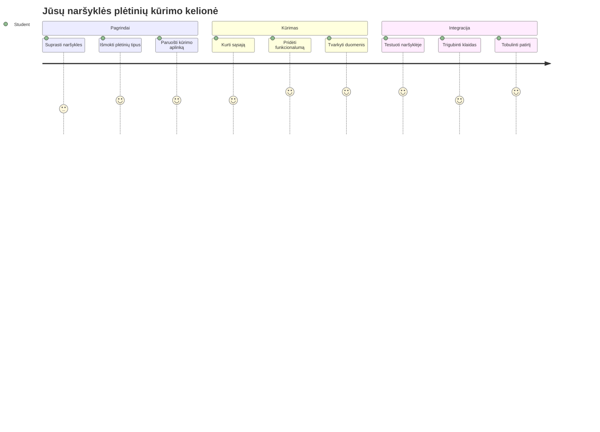
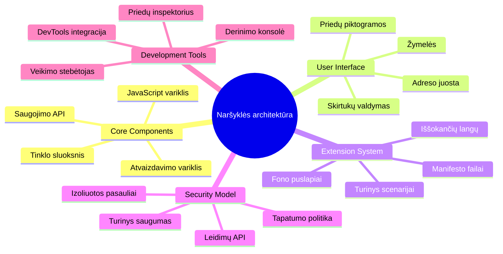
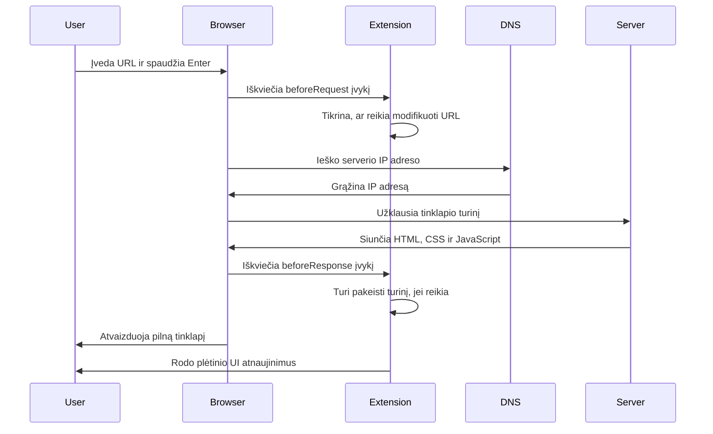
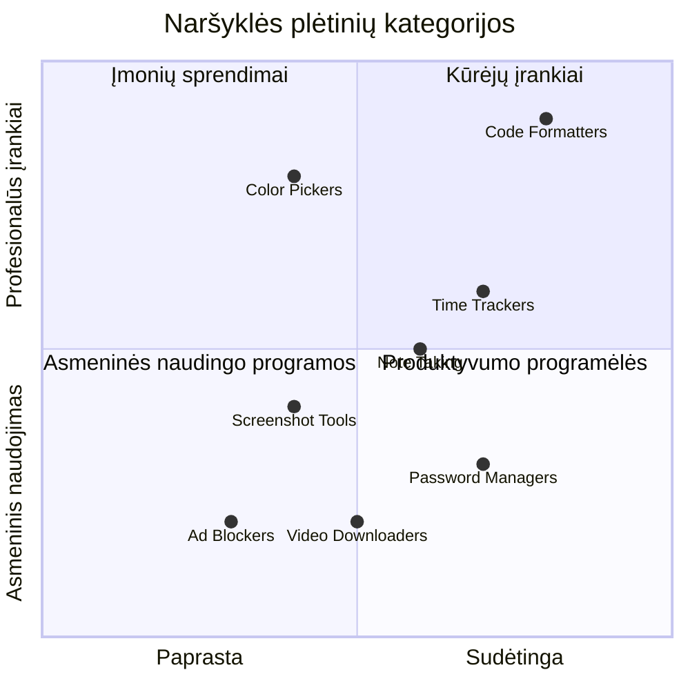
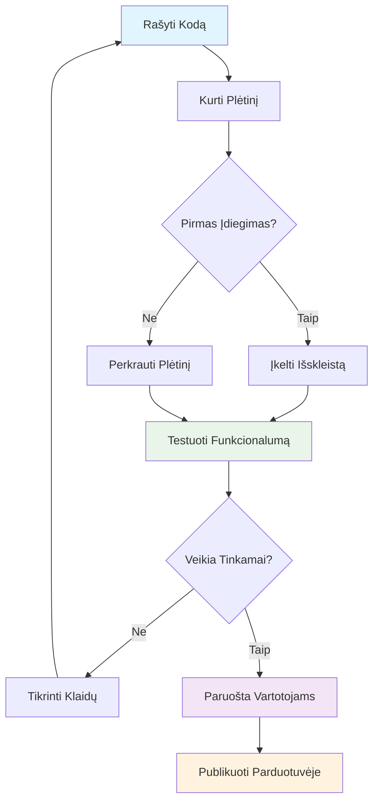
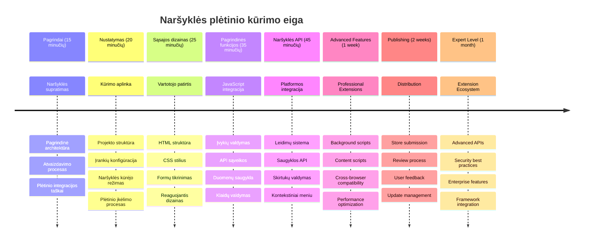

<!--
CO_OP_TRANSLATOR_METADATA:
{
  "original_hash": "00aa85715e1efd4930c17a23e3012e69",
  "translation_date": "2026-01-07T11:44:44+00:00",
  "source_file": "5-browser-extension/1-about-browsers/README.md",
  "language_code": "lt"
}
-->
# Naršyklės plėtinių projektas 1 dalis: Viskas apie naršykles



> Sketchnote autorius [Wassim Chegham](https://dev.to/wassimchegham/ever-wondered-what-happens-when-you-type-in-a-url-in-an-address-bar-in-a-browser-3dob)

## Įvadinis testas prieš paskaitą

[Įvadinis testas prieš paskaitą](https://ff-quizzes.netlify.app/web/quiz/23)

### Įvadas

Naršyklės plėtiniai yra mini programėlės, kurios pagerina jūsų naršymo internete patirtį. Kaip Timas Bernersas-Lis originaliai įsivaizdavo interaktyvią interneto aplinką, plėtiniai išplečia naršyklės galimybes už paprasto dokumentų peržiūrėjimo ribų. Nuo slaptažodžių tvarkyklių, kurios saugo jūsų paskyrų saugumą, iki spalvų rinkiklių, kurie padeda dizaineriams pasirinkti tobulą atspalvį - plėtiniai sprendžia kasdienes naršymo problemas.

Prieš kurdami jūsų pirmąjį plėtinį, supraskime, kaip veikia naršyklės. Kaip Aleksandras Grahamas Bellas turėjo suprasti garso perdavimą prieš išradęs telefoną, žinojimas apie naršyklių pagrindus padės jums kurti plėtinius, kurie sklandžiai integruojasi su esamomis naršyklės sistemomis.

Šios pamokos pabaigoje suprasite naršyklės architektūrą ir pradėsite kurti savo pirmąjį plėtinį.


## Suprasti interneto naršykles

Interneto naršyklė iš esmės yra sudėtinga dokumentų interpretuoklė. Kai įvedate „google.com“ adreso juostoje, naršyklė atlieka sudėtingų veiksmų seriją – prašo turinio iš serverių visame pasaulyje, tada analizuoja ir atvaizduoja tą kodą interaktyviuose interneto puslapiuose, kuriuos matote.

Šis procesas atspindi, kaip pirmoji interneto naršyklė WorldWideWeb, sukurta Timo Bernerso-Lio 1990 metais, buvo sukurta tam, kad prieinamus hipersaitus turinčius dokumentus galėtų matyti kiekvienas.

✅ **Trumpa istorija**: Pirmoji naršyklė buvo pavadinta „WorldWideWeb“ ir ją sukūrė seras Timothy Berners-Lee 1990 metais.


> Kai kurios ankstyvos naršyklės, pagal [Karen McGrane](https://www.slideshare.net/KMcGrane/week-4-ixd-history-personal-computing)

### Kaip naršyklės apdoroja interneto turinį

Procesas nuo URL įvedimo iki puslapio peržiūros apima kelis koordinuotus veiksmus, vykstančius per keletą sekundžių:


**Štai ką atlieka šis procesas:**
- **Paverčia** žmogui skaitomą URL į serverio IP adresą per DNS užklausą
- **Nustato** saugų ryšį su interneto serveriu naudojant HTTP arba HTTPS protokolus
- **Prašoma** konkretaus interneto puslapio turinio iš serverio
- **Gautas** HTML žymėjimas, CSS stilizavimas ir JavaScript kodas iš serverio
- **Atvaizduojamas** visas turinys interaktyviame interneto puslapyje, kurį matote

### Naršyklės pagrindinės funkcijos

Šiuolaikinės naršyklės suteikia daug funkcijų, kurias gali naudoti plėtinių kūrėjai:

| Funkcija | Paskirtis | Plėtinių galimybės |
|---------|---------|------------------------|
| **Atvaizdavimo variklis** | Rodo HTML, CSS ir JavaScript | Turinio modifikavimas, stilizacijos įterpimas |
| **JavaScript variklis** | Vykdo JavaScript kodą | Individualūs skriptai, API sąveikos |
| **Vietinė saugykla** | Išsaugo duomenis vietoje | Naudotojo nustatymai, kešuoti duomenys |
| **Tinklo sluoksnis** | Tvarko interneto užklausas | Užklausų stebėjimas, duomenų analizė |
| **Saugumo modelis** | Apsaugo naudotojus nuo kenksmingo turinio | Turinio filtravimas, saugumo patobulinimai |

**Suprasti šias funkcijas padeda jums:**
- **Nustatyti**, kur jūsų plėtinys gali pridėti didžiausią vertę
- **Pasirinkti** tinkamus naršyklės API jūsų plėtinio funkcionalumui
- **Kurkite** plėtinius, kurie efektyviai veikia su naršyklės sistemomis
- **Užtikrinkite**, kad jūsų plėtinys laikytųsi naršyklės saugumo geriausių praktikų

### Pasvarstymai apie kryžminės naršyklės vystymą

Skirtingos naršyklės standartus įgyvendina šiek tiek skirtingai, panašiai kaip skirtingos programavimo kalbos gali įvairiai tvarkyti tą patį algoritmą. Chrome, Firefox ir Safari turi unikalių savybių, kurias kūrėjai turi turėti omenyje plėtinių kūrimo metu.

> 💡 **Profesionali patarimas**: Naudokitės [caniuse.com](https://www.caniuse.com), norėdami patikrinti, kurios interneto technologijos palaikomos skirtingose naršyklėse. Tai labai vertinga planuojant plėtinio funkcijas!

**Svarbiausi aspektai kuriant plėtinius:**
- **Testuokite** plėtinį Chrome, Firefox ir Edge naršyklėse
- **Prisitaikykite** prie skirtingų naršyklės plėtinių API ir manifestų formatų
- **Tvarkykite** skirtingas našumo ypatybes ir apribojimus
- **Suteikite** alternatyvas naršyklės specifinėms funkcijoms, kurios gali būti neprieinamos

✅ **Analitikos įžvalga**: Jūs galite nustatyti, kurios naršyklės yra populiariausios tarp jūsų vartotojų, įdiegę analitikos paketus savo interneto kūrimo projektuose. Šie duomenys padeda jums prioritetizuoti, kurias naršykles pirmiausia palaikyti.

## Suprasti naršyklės plėtinius

Naršyklės plėtiniai sprendžia dažnas naršymo internete problemas, tiesiogiai pridėdami funkcionalumą į naršyklės sąsają. Vietoje to, kad reikėtų atskirų programų ar sudėtingų darbo eigų, plėtiniai suteikia tiesioginę prieigą prie įrankių ir funkcijų.

Ši idėja atitinka ankstyvųjų kompiuterių pionierių, tokių kaip Douglas Engelbart, viziją, kaip technologijos gali stiprinti žmogaus gebėjimus – plėtiniai papildo jūsų naršyklės pagrindines funkcijas.


**Populiarios plėtinių kategorijos ir jų nauda:**
- **Produktyvumo įrankiai**: Užduočių valdytojai, užrašų programėlės, laiko sekimo įrankiai, kurie padeda išlaikyti tvarką
- **Saugumo patobulinimai**: Slaptažodžių tvarkytuvės, skelbimų blokatoriai, privatumo įrankiai, saugantys jūsų duomenis
- **Kūrėjų įrankiai**: Kodo formatuotojai, spalvų rinkikliai, derinimo įrankiai, kuriantys patogesnę plėtrą
- **Turinio patobulinimai**: Skaitymo režimai, vaizdo įrašų atsisiuntėjai, ekrano kopijų įrankiai, gerinantys jūsų žiniatinklio patirtį

✅ **Apmąstymo klausimas**: Kokie yra jūsų mėgstamiausi naršyklės plėtiniai? Kokią konkrečią užduotį jie atlieka ir kaip pagerina jūsų naršymo patirtį?

### 🔄 **Pedagoginis patikrinimas**
**Naršyklės architektūros supratimas**: Prieš pereinant prie plėtinių kūrimo, įsitikinkite, kad galite:
- ✅ Paaiškinti, kaip naršyklės apdoroja interneto užklausas ir atvaizduoja turinį
- ✅ Nustatyti pagrindines naršyklės architektūros dalis
- ✅ Suprasti, kaip plėtiniai integruojasi su naršyklės funkcionalumu
- ✅ Atpažinti saugumo modelį, saugantį naudotojus

**Greitas savitikrinimas**: Ar galite sekti kelią nuo URL įvedimo iki puslapio matymo?
1. **DNS užklausa** paverčia URL į IP adresą
2. **HTTP užklausa** gauna turinį iš serverio
3. **Analizė** apdoroja HTML, CSS ir JavaScript
4. **Atvaizdavimas** rodo galutinį puslapį
5. **Plėtiniai** gali keisti turinį keliais etapais

## Plėtinių diegimas ir valdymas

Supratimas apie plėtinių diegimo procesą padės numatyti naudotojo patirtį, kai žmonės diegia jūsų plėtinį. Diegimo procesas yra standartizuotas šiuolaikinėse naršyklėse, nors vartotojo sąsajoje gali būti nedideli skirtumai.


> **Svarbu**: Įsitikinkite, kad įjungėte kūrėjo režimą ir leidžiate plėtinius iš kitų parduotuvių, kai testuojate savo plėtinius.

### Plėtinių kūrimo įdiegimo procesas

Kai kuriate ir testuojate savo plėtinius, laikykitės šios veiksmų seka:


```bash
# 1 žingsnis: Sukurkite savo plėtinį
npm run build
```

**Šis įsakymas atlieka:**
- **Kompiliuoja** jūsų šaltinio kodą į naršyklėms paruoštus failus
- **Surenka** JavaScript modulius į optimizuotas paketus
- **Generuoja** galutinius plėtinio failus aplanke `/dist`
- **Paruošia** jūsų plėtinį diegimui ir testavimui

**2 žingsnis: Pereikite prie naršyklės plėtinių**
1. **Atidarykite** naršyklės plėtinių valdymo puslapį
2. **Spustelėkite** mygtuką „Nustatymai ir daugiau“ (piktograma `...`) viršutiniame dešiniajame kampe
3. **Pasirinkite** „Plėtiniai“ iš išskleidžiamojo meniu

**3 žingsnis: Įkelkite savo plėtinį**
- **Naujam diegimui**: Pasirinkite `load unpacked` ir pasirinkite savo `/dist` aplanką
- **Atnaujinimui**: Spustelėkite `reload` šalia jau įdiegto plėtinio
- **Testavimui**: Įjunkite „Kūrėjo režimą“, kad pasiektumėte papildomas derinimo funkcijas

### Produkcinis plėtinių diegimas

> ✅ **Pastaba**: Šios kūrimo instrukcijos skirtos tik jūsų pačių kuriamiems plėtiniams. Norėdami įdiegti paskelbtus plėtinius, apsilankykite oficialiose naršyklės plėtinių parduotuvėse, pvz., [Microsoft Edge papildinių parduotuvėje](https://microsoftedge.microsoft.com/addons/Microsoft-Edge-Extensions-Home).

**Skirtumų supratimas:**
- **Kūrimo diegimai** leidžia testuoti nepublikuotus plėtinius jų kūrimo metu
- **Parduotuvės diegimai** suteikia patikrintus, paskelbtus plėtinius su automatiniu atnaujinimu
- **Sideloading** leidžia diegti plėtinius iš neoficialių parduotuvių (reikalingas kūrėjo režimas)

## Kuriame jūsų anglies pėdsako plėtinį

Sukursime naršyklės plėtinį, kuris rodys jūsų regiono energijos naudojimo anglies pėdsaką. Šis projektas demonstruoja esmines plėtinių kūrimo sąvokas, tuo pačiu kuriant naudingą įrankį aplinkosaugos sąmoningumui skatinti.

Šis metodas remiasi principu „mokytis veikdami“, kuris pasiteisino nuo Johno Dewey švietimo teorijų – sujungiant techninius įgūdžius su prasmingais realaus pasaulio taikymais.

### Projekto reikalavimai

Prieš pradėdami kūrimą, surinkime reikalingus resursus ir priklausomybes:

**Reikalingas API prisijungimas:**
- **[CO2 Signal API raktas](https://www.co2signal.com/)**: Įveskite savo el. pašto adresą, kad gautumėte nemokamą API raktą
- **[Regiono kodas](http://api.electricitymap.org/v3/zones)**: Suraskite savo regiono kodą naudodami [Electricity Map](https://www.electricitymap.org/map) (pvz., Bostonas naudoja 'US-NEISO')

**Kūrimo įrankiai:**
- **[Node.js ir NPM](https://www.npmjs.com)**: Paketų valdymo įrankis projekto priklausomybių diegimui
- **[Pradinis kodas](../../../../5-browser-extension/start)**: Atsisiųskite aplanką `start`, kad pradėtumėte kūrimą

✅ **Sužinokite daugiau**: Tobulinkite savo paketų valdymo įgūdžius su šiuo [išsamiu Learn moduliu](https://docs.microsoft.com/learn/modules/create-nodejs-project-dependencies/?WT.mc_id=academic-77807-sagibbon)

### Suprasti projekto struktūrą

Projekto struktūros supratimas padeda efektyviai organizuoti kūrimo darbą. Kaip Aleksandrijos biblioteka buvo organizuota žinių lengvam paieškai, taip gerai struktūruotas kodo bazė palengvina kūrimą:

```
project-root/
├── dist/                    # Built extension files
│   ├── manifest.json        # Extension configuration
│   ├── index.html           # User interface markup
│   ├── background.js        # Background script functionality
│   └── main.js              # Compiled JavaScript bundle
├── src/                     # Source development files
│   └── index.js             # Your main JavaScript code
├── package.json             # Project dependencies and scripts
└── webpack.config.js        # Build configuration
```

**Ką atlieka kiekvienas failas:**
- **`manifest.json`**: **Apibrėžia** plėtinio metaduomenis, leidimus ir įėjimo taškus
- **`index.html`**: **Sukuria** vartotojo sąsają, kuri rodoma paspaudus ant plėtinio
- **`background.js`**: **Tvarko** foninius uždavinius ir naršyklės įvykių klausytojus
- **`main.js`**: **Laiko** galutinį sukompiliuotą JavaScript po kūrimo proceso
- **`src/index.js`**: **Laiko** jūsų pagrindinį kūrimo kodą, kuris yra sukompiliuojamas į `main.js`

> 💡 **Organizacijos patarimas**: Laikykite savo API raktą ir regiono kodą saugioje užrašo vietoje, kad patogiai naudotumėte kūrimo metu. Jums reikės šių reikšmių, norint išbandyti plėtinio funkcionalumą.

✅ **Saugumo pastaba**: Niekada neįtraukite API raktų ar jautrių kredencialų į savo kodo saugyklą. Kitame žingsnyje parodysime, kaip tai saugiai tvarkyti.

## Kuriame plėtinio sąsają

Dabar sukursime vartotojo sąsajos komponentus. Plėtinys naudoja dviejų ekranų metodą: konfigūracijos ekraną pradiniam nustatymui ir rezultatų ekraną duomenų rodymui.

Tai atitinka progresyvios informacijos teikimo principą, naudojamą sąsajų dizaine nuo ankstyvųjų kompiuterijos laikų – informacijos ir parinkčių išdėstymas logiška seka, kad nesukeltų vartotojams per didelės apkrovos.

### Plėtinio vaizdų apžvalga

**Nustatymų vaizdas** – pirmą kartą naudojančio nustatymai:


**Rezultatų vaizdas** – anglies pėdsako duomenų rodymas:


### Kuriame konfigūracijos formą

Nustatymų forma renka vartotojo konfigūracijos duomenis pradiniu naudojimu. Kai nustatymai pateikti, ši informacija išsaugoma naršyklės saugykloje tolimesnėms sesijoms.

Failo `/dist/index.html` įrašykite šią formos struktūrą:

```html
<form class="form-data" autocomplete="on">
    <div>
        <h2>New? Add your Information</h2>
    </div>
    <div>
        <label for="region">Region Name</label>
        <input type="text" id="region" required class="region-name" />
    </div>
    <div>
        <label for="api">Your API Key from tmrow</label>
        <input type="text" id="api" required class="api-key" />
    </div>
    <button class="search-btn">Submit</button>
</form>
```

**Štai ką ši forma atlieka:**
- **Sukuria** semantinę formos struktūrą su tinkamais žymėjimais ir įvesties elementų ryšiais
- **Įgalina** naršyklės automatinio pildymo funkciją geresnei naudotojo patirčiai
- **Reikalauja** užpildyti abu laukus prieš pateikiant, naudojant atributą `required`
- **Organizuoja** įvestis su aiškiais klasių pavadinimais, kad būtų lengva stilizuoti ir valdyti JavaScript'u
- **Suteikia** aiškius nurodymus vartotojams, kurie nustato plėtinį pirmą kartą

### Kuriame rezultatų rodinį

Kitas žingsnis – sukurti rezultatų sritį, kurioje bus rodomi anglies pėdsako duomenys. Žemiau formos įterpkite šį HTML:

```html
<div class="result">
    <div class="loading">loading...</div>
    <div class="errors"></div>
    <div class="data"></div>
    <div class="result-container">
        <p><strong>Region: </strong><span class="my-region"></span></p>
        <p><strong>Carbon Usage: </strong><span class="carbon-usage"></span></p>
        <p><strong>Fossil Fuel Percentage: </strong><span class="fossil-fuel"></span></p>
    </div>
    <button class="clear-btn">Change region</button>
</div>
```

**Štai ką ši struktūra suteikia:**
- **`loading`**: **Rodo** užkrovimo pranešimą, kol yra gaunami API duomenys
- **`errors`**: **Rodo** klaidų pranešimus, jei API užklausos nepavyksta arba duomenys yra neteisingi
- **`data`**: **Laiko** žalius duomenis derinimui kūrimo metu
- **`result-container`**: **Pateikia** suformatuotą anglies pėdsako informaciją vartotojams
- **`clear-btn`**: **Leidžia** vartotojams keisti savo regioną ir iš naujo konfigūruoti plėtinį

### Nustatome kūrimo procesą

Dabar įdiekime projekto priklausomybes ir išbandysime kūrimo procesą:

```bash
npm install
```

**Šis diegimo procesas atlieka:**
- **Atsisiunčia** Webpack ir kitas kūrimo priklausomybes iš `package.json`
- **Konfigūruoja** kūrimo įrankių grandinę moderniam JavaScript kompiliavimui
- **Paruošia** kūrimo aplinką plėtinių kūrimui ir testavimui
- **Įgalina** kodo surinkimą, optimizavimą ir kryžminės naršyklės suderinamumo funkcijas

> 💡 **Kūrimo proceso įžvalga**: Webpack sujungia jūsų šaltinio kodą iš `/src/index.js` į `/dist/main.js`. Šis procesas optimizuoja jūsų kodą gamybai ir užtikrina naršyklių suderinamumą.

### Testuokite savo pažangą

Dabar galite išbandyti savo plėtinį:
1. **Vykdykite** kompilavimo komandą, kad sukompiliuotumėte savo kodą  
2. **Įkelkite** plėtinį į naršyklę naudodami kūrėjo režimą  
3. **Patikrinkite**, ar forma rodomi teisingai ir atrodo profesionaliai  
4. **Patikrinkite**, ar visi formos elementai yra tinkamai išdėstyti ir veikia  

**Ką pasiekėte:**  
- **Sukūrėte** pagrindinę HTML struktūrą savo plėtiniui  
- **Sukūrėte** tiek konfigūracijos, tiek rezultatų sąsajas su tinkama semantika  
- **Nustatėte** modernų vystymo darbų srautą, naudojant pramonės standartų įrankius  
- **Paruošėte** pagrindą interaktyvios JavaScript funkcionalumo pridėjimui  

### 🔄 **Pedagoginis patikrinimas**  
**Plėtinių kūrimo pažanga:** Patikrinkite savo supratimą prieš tęsdami:  
- ✅ Ar galite paaiškinti kiekvieno projekto struktūros failo paskirtį?  
- ✅ Ar suprantate, kaip kompiliavimo procesas transformuoja jūsų pradinį kodą?  
- ✅ Kodėl mes atskiriame konfigūraciją ir rezultatus į skirtingas vartotojo sąsajos dalis?  
- ✅ Kaip formos struktūra palaiko tiek naudojamumą, tiek prieinamumą?  

**Vystymo darbų srauto supratimas:** Dabar turėtumėte sugebėti:  
1. **Redaguoti** HTML ir CSS savo plėtinio sąsajai  
2. **Vykdyti** kompiliavimo komandą, kad sukompiliuotumėte pakeitimus  
3. **Perkrauti** plėtinį naršyklėje, kad išbandytumėte atnaujinimus  
4. **Taisyti klaidas** naudodami naršyklės kūrėjo įrankius  

Jūs baigėte pirmąjį naršyklės plėtinių kūrimo etapą. Kaip Wrightai pirmiausia turėjo suprasti aerodinamiką prieš pasiekiant skrydį, taip ir jūs, suprasdami šiuos pagrindinius principus, pasiruošiate kurti sudėtingesnes interaktyvias funkcijas kitame pamokoje.  

## GitHub Copilot agento iššūkis 🚀  

Naudokitės Agent režimu šiam iššūkiui įvykdyti:  

**Aprašymas:** Patobulinkite naršyklės plėtinį pridėdami formos tikrinimą ir vartotojo grįžtamąjį ryšį, siekiant pagerinti naudotojo patirtį įvedant API raktus ir regionų kodus.  

**Užduotis:** Sukurkite JavaScript validavimo funkcijas, kurios patikrina, ar API rakto laukas turi bent 20 simbolių, ir ar regiono kodas atitinka teisingą formatą (pvz., 'US-NEISO'). Pridėkite vizualinį grįžtamąjį ryšį, keičiant įvesties laukelio kraštinių spalvą į žalią, jei įvestis teisinga, ir raudoną, jei neteisinga. Taip pat pridėkite perjungimo funkciją API rakto rodymui/slėpimui dėl saugumo.  

Sužinokite daugiau apie [agent mode](https://code.visualstudio.com/blogs/2025/02/24/introducing-copilot-agent-mode).  

## 🚀 Iššūkis  

Peržvelkite naršyklės plėtinių parduotuvę ir įdiekite vieną plėtinį savo naršyklėje. Galite įdomiai išnagrinėti jo failus. Ką atradote?  

## Po paskaitos testas  

[Po paskaitos testas](https://ff-quizzes.netlify.app/web/quiz/24)  

## Apžvalga ir savarankiškas mokymasis  

Šioje pamokoje sužinojote šiek tiek apie interneto naršyklių istoriją; pasinaudokite proga sužinoti, kaip Pasaulinio tinklo kūrėjai įsivaizdavo jo naudojimą, daugiau skaitydami apie jo istoriją. Naudingos svetainės:  

[Internetinių naršyklių istorija](https://www.mozilla.org/firefox/browsers/browser-history/)  

[Tinklo istorija](https://webfoundation.org/about/vision/history-of-the-web/)  

[Interviu su Tim Berners-Lee](https://www.theguardian.com/technology/2019/mar/12/tim-berners-lee-on-30-years-of-the-web-if-we-dream-a-little-we-can-get-the-web-we-want)  

### ⚡ **Ką galite padaryti per artimiausias 5 minutes**  
- [ ] Atidarykite Chrome/Edge plėtinių puslapį (chrome://extensions) ir apžiūrėkite, ką esate įdiegę  
- [ ] Naršyklės kūrėjo įrankių Tinklo skiltyje stebėkite tinklapio įkėlimą  
- [ ] Pabandykite peržiūrėti puslapio šaltinį (Ctrl+U), kad pamatytumėte HTML struktūrą  
- [ ] Apžiūrėkite bet kurį puslapio elementą ir pakeiskite jo CSS kūrėjo įrankiuose  

### 🎯 **Ką galite įgyvendinti šią valandą**  
- [ ] Atlikite po pamokos testą ir supraskite naršyklės pagrindus  
- [ ] Sukurkite bazinį manifest.json failą naršyklės plėtiniui  
- [ ] Sukurkite paprastą "Hello World" plėtinį, kuris rodo iškylantį langą  
- [ ] Išbandykite plėtinio įkėlimą kūrėjo režimu  
- [ ] Išnagrinėkite naršyklės plėtinių dokumentaciją savo tikslinėi naršyklei  

### 📅 **Jūsų savaitės trukmės plėtinių kūrimo kelias**  
- [ ] Sukurkite funkcionalų naršyklės plėtinį su realia nauda  
- [ ] Sužinokite apie turinio scenarijus, foninius scenarijus ir popup sąveikas  
- [ ] Išmokite dirbti su naršyklės API, tokiais kaip saugykla, skirtukai ir žinutės  
- [ ] Sukurkite patogias vartotojo sąsajas savo plėtiniui  
- [ ] Išbandykite savo plėtinį įvairiuose tinklalapiuose ir situacijose  
- [ ] Paskelbkite plėtinį naršyklės plėtinių parduotuvėje  

### 🌟 **Jūsų mėnesio naršyklės plėtinių kūrimas**  
- [ ] Kurkite kelis plėtinius, sprendžiančius skirtingas naudotojų problemas  
- [ ] Išmokite pažangių naršyklės API naudojimo ir saugumo praktikų  
- [ ] Dalyvaukite atvirojo kodo naršyklės plėtinių projektuose  
- [ ] Tobulinkite tarp naršyklių suderinamumą ir palaikykite progresyvų tobulėjimą  
- [ ] Kurkite plėtinių kūrimo įrankius ir šablonus kitiems  
- [ ] Tapkite naršyklės plėtinių ekspertu, kuris padeda kitiems kūrėjams  

## 🎯 Jūsų naršyklės plėtinio meistriškumo laiko juosta  


### 🛠️ Jūsų plėtinių kūrimo įrankių rinkinio santrauka  

Baigę šią pamoką, dabar turite:  
- **Naršyklės architektūros žinias**: supratimą apie atvaizdavimo variklius, saugumo modelius ir plėtinių integraciją  
- **Vystymo aplinką**: modernų įrankių rinkinį su Webpack, NPM ir klaidų taisymo galimybėmis  
- **UI/UX pagrindus**: semantinę HTML struktūrą su progresyvaus atskleidimo šablonais  
- **Saugumo sąmoningumą**: supratimą apie naršyklės leidimus ir saugias kūrimo praktikas  
- **Tarp naršyklių sąvokas**: žinias apie suderinamumo aspektus ir testavimo metodus  
- **API integraciją**: pagrindus darbui su išoriniais duomenų šaltiniais  
- **Profesionalų darbų srautą**: pramonės standartinius vystymo ir testavimo procesus  

**Realios taikymo sritys:** šie įgūdžiai tiesiogiai taikomi:  
- **Interneto kūrimui**: vieno puslapio programoms ir progresyvioms interneto programoms  
- **Darbalaukio programoms**: Electron ir interneto pagrindu veikiančiai darbalaukio programinei įrangai  
- **Mobiliajam vystymui**: hibridinėms programoms ir interneto pagrindu veikiančioms mobiliosioms sistemoms  
- **Įmonių įrankiams**: vidaus produktyvumo programoms ir darbų eigų automatizavimui  
- **Atviram kodui**: dalyvavimui naršyklės plėtinių projektuose ir interneto standartų kūrime  

**Kitas lygis:** Jūs pasiruošę pridėti interaktyvų funkcionalumą, dirbti su naršyklės API ir kurti plėtinius, sprendžiančius tikras naudotojų problemas!

## Užduotis  

[Performatuokite savo plėtinį](assignment.md)

---

<!-- CO-OP TRANSLATOR DISCLAIMER START -->
**Atsakomybės apribojimas**:  
Šis dokumentas buvo išverstas naudojant dirbtinio intelekto vertimo paslaugą [Co-op Translator](https://github.com/Azure/co-op-translator). Nors stengiamės užtikrinti tikslumą, primename, kad automatizuoti vertimai gali turėti klaidų ar netikslumų. Originalus dokumentas gimtąja kalba turi būti laikomas autoritetingu šaltiniu. Svarbiai informacijai rekomenduojamas profesionalus žmogaus vertimas. Mes neprisiimame atsakomybės už bet kokius nesusipratimus ar neteisingus aiškinimus, kylančius naudojant šį vertimą.
<!-- CO-OP TRANSLATOR DISCLAIMER END -->