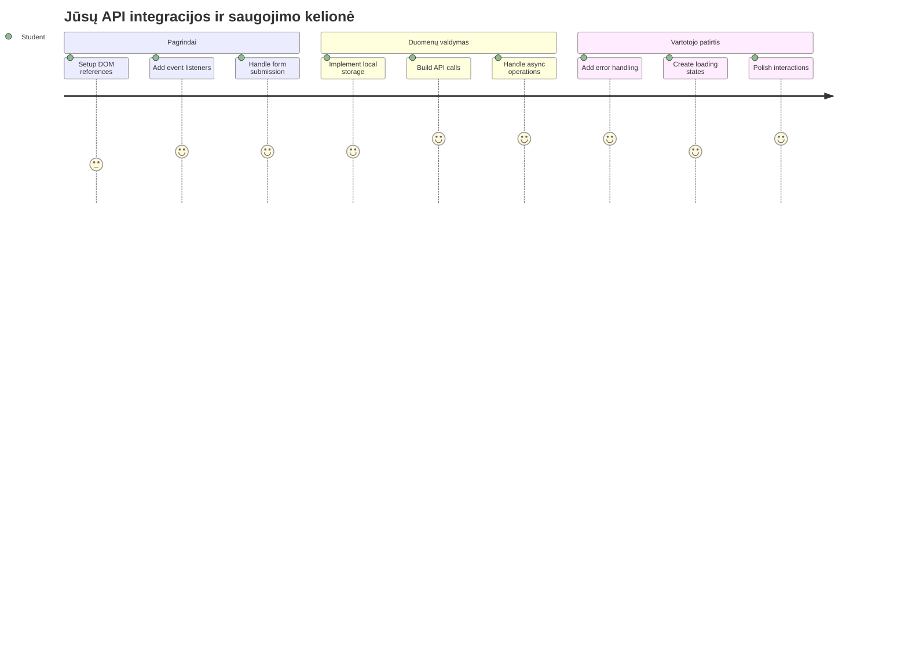
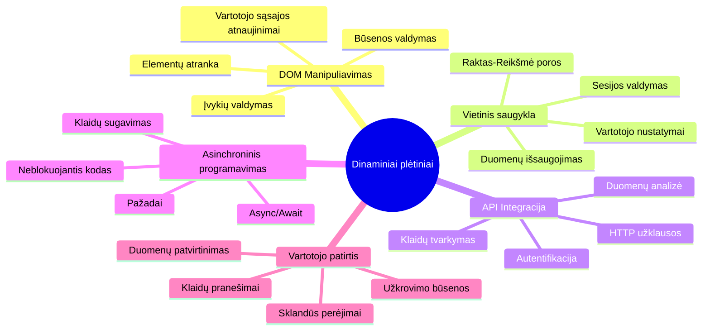
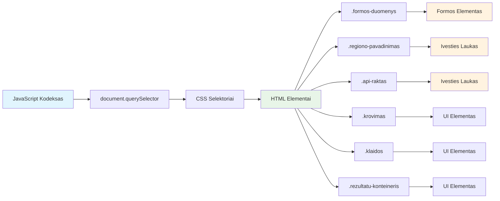
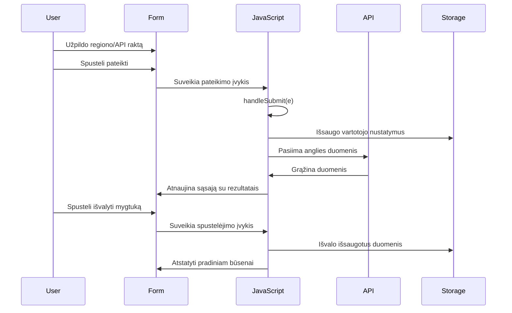
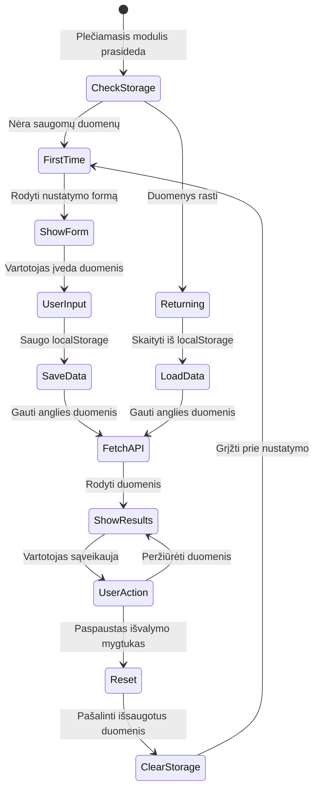
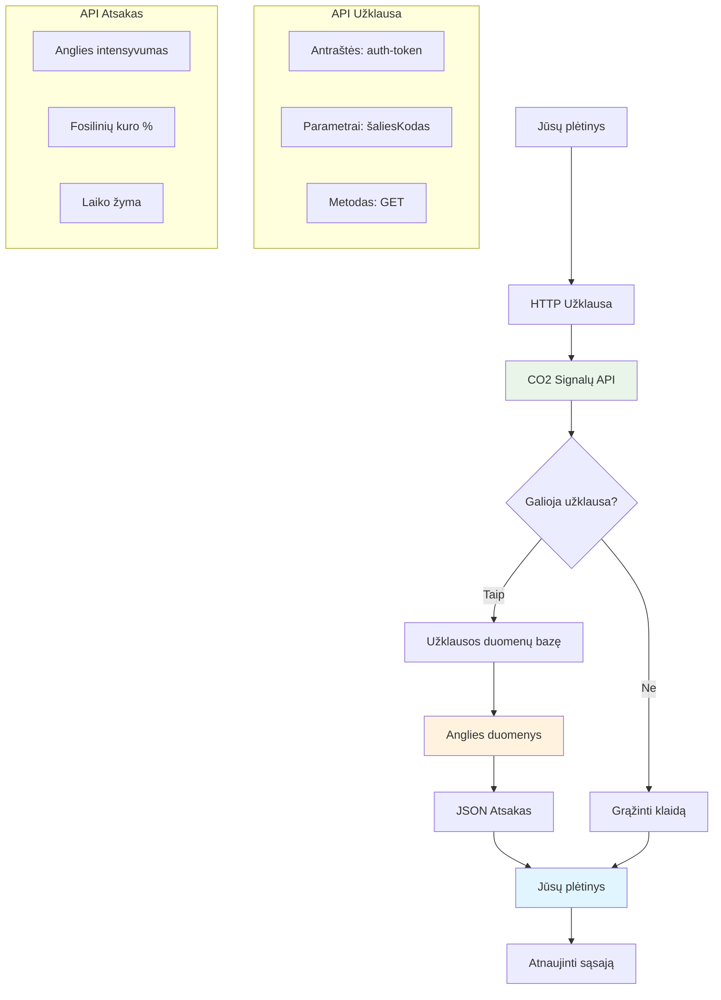
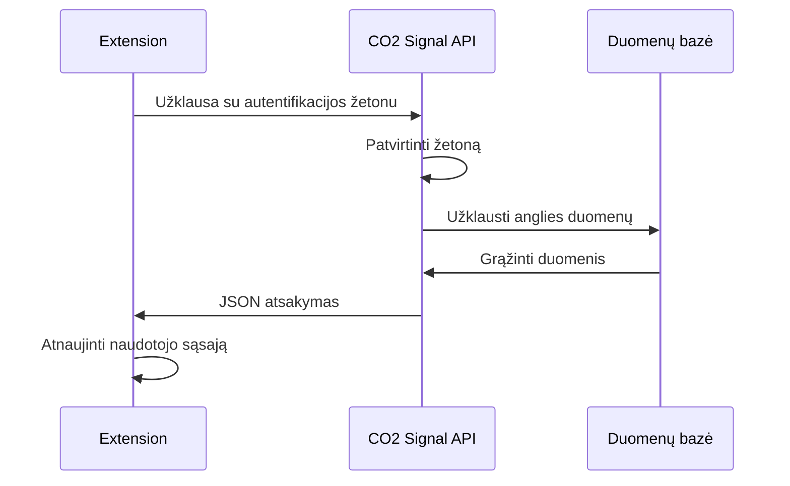
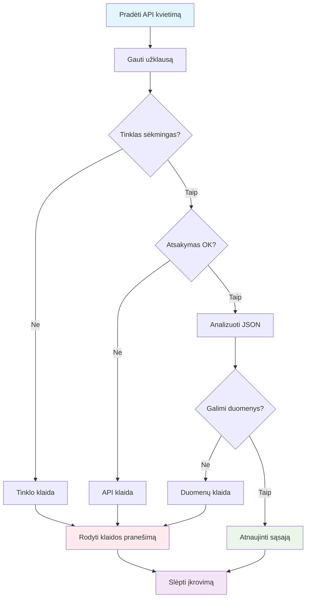
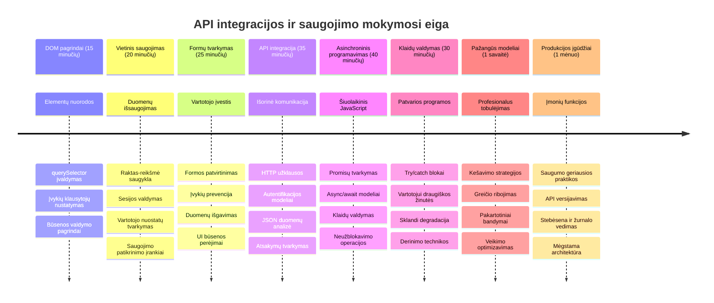

<!--
CO_OP_TRANSLATOR_METADATA:
{
  "original_hash": "2b6203a48c48d8234e0948353b47d84e",
  "translation_date": "2026-01-07T11:38:16+00:00",
  "source_file": "5-browser-extension/2-forms-browsers-local-storage/README.md",
  "language_code": "lt"
}
-->
# Naršyklės plėtinio projektas, 2 dalis: kvietimas API, vietinis saugojimas


## Prieš paskaitą testas

[Prieš paskaitą testas](https://ff-quizzes.netlify.app/web/quiz/25)

## Įvadas

Prisimeni tą naršyklės plėtinį, kurį pradėjai kurti? Dabar turi gražią formą, bet ji iš esmės statinė. Šiandien ją prikeliam gyvybei prijungdami prie tikrų duomenų ir suteikdami atmintį.

Pagalvok apie Apollo misijos valdymo kompiuterius – jie ne tik rodė fiksuotą informaciją. Jie nuolat bendravo su kosminiu laivu, atnaujindavo telemetrijos duomenis ir atsimindavo svarbiausius misijos parametrus. Tokį dinamišką elgesį šiandien kuriame ir mes. Tavo plėtinys prisijungs prie interneto, paims tikrus aplinkos duomenis ir prisimins tavo nustatymus kitam kartui.

API integracija gali skambėti sudėtingai, bet tai tiesiog mokymas tavo kodo bendrauti su kitomis paslaugomis. Nesvarbu, ar gauni orų duomenis, socialinių tinklų srautus, ar anglies pėdsako informaciją, kaip darysime šiandien – visa esmė yra šių skaitmeninių ryšių užmezgime. Taip pat panagrinėsime, kaip naršyklės gali išlaikyti informaciją – kaip bibliotekos anksčiau naudojo kortelių katalogus, kad prisimintų, kur esančios knygos.

Pamokos pabaigoje turėsi naršyklės plėtinį, kuris gauna tikrus duomenis, saugo naudotojo pageidavimus ir suteikia sklandžią patirtį. Pradėkime!


✅ Sek numeruotais segmentais atitinkamuose failuose, kad žinotum, kur įterpti savo kodą

## Paruošk elementus, kuriais manipuliuosime plėtinio viduje

Prieš tavo JavaScript gali manipuliuoti sąsaja, jam reikia nuorodų į specifinius HTML elementus. Tai kaip teleskopui, kuris turi būti nukreiptas į konkrečias žvaigždes – prieš Galileo galėdamas tyrinėti Jupiterio palydovus, jis turėjo surasti ir susikoncentruoti į patį Jupiterį.

Tavo `index.js` faile sukursime `const` kintamuosius, kurie fiksuos nuorodas į kiekvieną svarbų formos elementą. Tai panašu į tai, kaip mokslininkai žymi savo įrangą – vietoje to, kad kas kartą ieškotų visoje laboratorijoje, jie gali tiesiogiai prieiti prie reikalingo objekto.


```javascript
// formos laukai
const form = document.querySelector('.form-data');
const region = document.querySelector('.region-name');
const apiKey = document.querySelector('.api-key');

// rezultatai
const errors = document.querySelector('.errors');
const loading = document.querySelector('.loading');
const results = document.querySelector('.result-container');
const usage = document.querySelector('.carbon-usage');
const fossilfuel = document.querySelector('.fossil-fuel');
const myregion = document.querySelector('.my-region');
const clearBtn = document.querySelector('.clear-btn');
```

**Štai ką daro šis kodas:**
- **Fiksuoja** formos elementus naudojant `document.querySelector()` su CSS klasių selektoriais
- **Sukuria** nuorodas į įvesties laukus regiono pavadinimui ir API raktui
- **Užmezga** ryšius su rezultatų rodymo elementais dėl anglies naudojimo duomenų
- **Paruošia** prieigą prie UI elementų, tokių kaip pakrovimo indikatoriai ir klaidų pranešimai
- **Saugo** kiekvienos nuorodos elementą `const` kintamuosiuose, kad būtų lengva pakartotinai naudoti visame kode

## Pridėk įvykių klausytojus

Dabar padarysime jūsų plėtinį reaguojantį į naudotojų veiksmus. Įvykių klausytojai – tai tavo kodo būdas stebėti naudotojų sąveikas. Galvok apie juos kaip apie ankstyvųjų telefonų operatorius – jie klausydavosi skambučių ir sujungdavo teisingus linijų grandinius, kai kažkas norėdavo užmegzti ryšį.


```javascript
form.addEventListener('submit', (e) => handleSubmit(e));
clearBtn.addEventListener('click', (e) => reset(e));
init();
```

**Šių sąvokų supratimas:**
- **Prideda** submit įvykio klausytoją formei, kuris suveikia, kai vartotojai paspaudžia Enter arba spaudžia pateikti
- **Jungia** paspaudimo klausytoją prie išvalymo mygtuko formai atstatyti
- **Perduoda** įvykių objektą `(e)` tvarkymo funkcijoms papildomai kontrolei
- **Iškviečia** `init()` funkciją nedelsiant pradinei būsenai nustatyti

✅ Atkreipk dėmesį į trumpą rodyklių funkcijos sintaksę. Šis šiuolaikinis JavaScript rašymo būdas yra švaresnis nei tradicinės funkcijų išraiškos, bet abi vienodai veikia!

### 🔄 **Pedagoginė patikra**
**Įvykių valdymo supratimas**: prieš pereinant prie inicializacijos, įsitikink, kad gali:
- ✅ Paaiškinti, kaip `addEventListener` sujungia vartotojo veiksmus su JavaScript funkcijomis
- ✅ Suprasti, kodėl į tvarkymo funkcijas perduodame įvykio objektą `(e)`
- ✅ Atpažinti skirtumą tarp `submit` ir `click` įvykių
- ✅ Apibūdinti, kada vykdoma `init()` funkcija ir kodėl

**Greitas savitikslinis testas**: kas nutiktų, jei pamirštum `e.preventDefault()` formos pateikime?
*Atsakymas: puslapis perkrautų, prarastų visą JavaScript būseną ir sutrikdytų naudotojo patirtį*

## Sukurk inicializavimo ir atstatymo funkcijas

Sukurkime tavo plėtinio inicializacijos logiką. `init()` funkcija yra kaip laivo navigacijos sistema, tikrinanti instrumentus – ji nustato dabartinę būseną ir reguliuoja sąsają atitinkamai. Ji tikrina, ar kažkas jau naudojo tavo plėtinį ir įkelia ankstesnius nustatymus.

`reset()` funkcija suteikia naudotojams švarų startą – kaip mokslininkai tarp eksperimentų iš naujo sureguliuoja savo prietaisus, kad užtikrintų švarius duomenis.

```javascript
function init() {
	// Patikrinkite, ar vartotojas anksčiau išsaugojo API kredencialus
	const storedApiKey = localStorage.getItem('apiKey');
	const storedRegion = localStorage.getItem('regionName');

	// Nustatykite plėtinio piktogramą į bendrą žalią (vietos užrašas būsimam pamokai)
	// NORINT ATLIKTI: Įgyvendinti piktogramos atnaujinimą kitoje pamokoje

	if (storedApiKey === null || storedRegion === null) {
		// Pirmą kartą vartotojui: parodykite nustatymo formą
		form.style.display = 'block';
		results.style.display = 'none';
		loading.style.display = 'none';
		clearBtn.style.display = 'none';
		errors.textContent = '';
	} else {
		// Besugrįžtantis vartotojas: automatiškai įkelkite jų išsaugotus duomenis
		displayCarbonUsage(storedApiKey, storedRegion);
		results.style.display = 'none';
		form.style.display = 'none';
		clearBtn.style.display = 'block';
	}
}

function reset(e) {
	e.preventDefault();
	// Išvalykite saugomą regioną, kad vartotojas galėtų pasirinkti naują vietą
	localStorage.removeItem('regionName');
	// Paleiskite iš naujo inicijavimo procesą
	init();
}
```

**Išskaidymas, kas vyksta čia:**
- **Gauna** saugomą API raktą ir regioną naršyklės vietiniame saugykloje
- **Ttikrina**, ar tai pirmas karto naudotojas (nėra saugotų duomenų) ar grįžtantis naudotojas
- **Rodo** paruošimo formą naujiems vartotojams ir slepia kitus sąsajos elementus
- **Automatiškai įkelia** išsaugotus duomenis grįžtantiems naudotojams bei rodo atstatymo galimybę
- **Valdo** vartotojo sąsajos būseną pagal prieinamus duomenis

**Svarbios vietinio saugojimo sąvokos:**
- **Išlaiko** duomenis tarp naršyklės sesijų (skirtingai nuo sesijos saugyklos)
- **Saugo** duomenis kaip raktas-reikšmė poras naudojant `getItem()` ir `setItem()`
- **Grąžina** `null`, kai duomenų raktui nėra
- **Pateikia** paprastą būdą prisiminti naudotojo pageidavimus ir nustatymus

> 💡 **Vietinio naršyklės saugojimo supratimas**: [LocalStorage](https://developer.mozilla.org/docs/Web/API/Window/localStorage) suteikia tavo plėtiniui nuolatinę atmintį. Pagalvok, kaip senovės Aleksandrijos biblioteka saugojo ritinius – informacija prieinama net tada, kai mokslininkai išeidavo ir vėl grįždavo.
>
> **Pagrindinės savybės:**
> - **Išlaiko** duomenis net uždarius naršyklę
> - **Išlaiko** informaciją po kompiuterio perkrovimų ar naršyklės gedimų
> - **Turi** didelę saugojimo erdvę naudotojų pageidavimams
> - **Suteikia** momentinę prieigą be tinklo delsimo

> **Svarbi pastaba**: tavo naršyklės plėtinys turi savo izoliuotą vietinį saugyklą, atskirą nuo įprastų tinklalapių. Tai užtikrina saugumą ir išvengia konfliktų su kitais tinklapiais.

Gali peržiūrėti saugomus duomenis atidarydamas naršyklės kūrimo įrankius (F12), pereik į skirtuką **Application** ir išplėsk skyrių **Local Storage**.




> ⚠️ **Saugumo perspėjimas**: komerciniuose sprendimuose API raktų saugojimas LocalStorage kelia saugumo riziką, nes JavaScript gali prieiti prie šių duomenų. Mokymosi tikslais šis būdas tinka, tačiau tikrose programose jautrių kredencialų saugojimui reikia naudoti saugų serverio pusės saugojimą.

## Tvarkyk formos pateikimą

Dabar apdorosime, kas vyksta, kai kas nors pateikia tavo formą. Naršyklės pagal numatytuosius nustatymus perkrauna puslapį pateikus formas, bet mes nutrauksime šį elgesį, kad sukurtume sklandesnę patirtį.

Šis būdas primena, kaip misijos valdymas tvarko ryšius su kosminiais laivais – vietoje to, kad kiekvieną kartą perkrautų visą sistemą, jie palaiko nuolatinį veikimą ir apdoroja naują informaciją.

Sukurk funkciją, kuri pagautų formos pateikimo įvykį ir išgautų naudotojo įvestį:

```javascript
function handleSubmit(e) {
	e.preventDefault();
	setUpUser(apiKey.value, region.value);
}
```

**Aukščiau mes:**
- **Nutraukėme** numatytąjį formos pateikimo elgesį, kuris perkrautų puslapį
- **Išėmėme** naudotojo įvesties reikšmes iš API rakto ir regiono laukų
- **Perdavėme** formos duomenis funkcijai `setUpUser()` apdorojimui
- **Išlaikėme** vieno puslapio programėlės elgesį, vengiant puslapio perkrovimų

✅ Atmink, kad tavo HTML formos laukų atributas apima `required`, todėl naršyklė automatiškai tikrina, ar vartotojai pateikė tiek API raktą, tiek regioną prieš vykdant šią funkciją.

## Nustatyk naudotojo pageidavimus

`setUpUser` funkcija atsakinga už naudotojo kredencialų išsaugojimą ir pradinį API kvietimą. Tai sukuria sklandžią pereinamojo laikotarpio nuo paruošimo prie rezultatų ekranavimo patirtį.

```javascript
function setUpUser(apiKey, regionName) {
	// Išsaugoti vartotojo duomenis kitoms sesijoms
	localStorage.setItem('apiKey', apiKey);
	localStorage.setItem('regionName', regionName);
	
	// Atnaujinti vartotojo sąsają, kad būtų rodoma įkėlimo būsena
	loading.style.display = 'block';
	errors.textContent = '';
	clearBtn.style.display = 'block';
	
	// Gauti anglies pėdsako duomenis naudojant vartotojo duomenis
	displayCarbonUsage(apiKey, regionName);
}
```

**Žingsnis po žingsnio, štai kas vyksta:**
- **Įrašo** API raktą ir regiono pavadinimą į vietinę saugyklą būsimam naudojimui
- **Rodo** pakrovimo indikatorius, informuojant vartotojus, kad duomenys kraunasi
- **Išvalo** ankstesnius klaidų pranešimus ekrane
- **Parodo** išvalymo mygtuką, kad naudotojai galėtų vėliau atstatyti nustatymus
- **Pradeda** API kvietimą, kad gauti tikrus anglies naudojimo duomenis

Ši funkcija sukuria sklandžią naudotojo patirtį valdant tiek duomenų išsaugojimą, tiek sąsajos atnaujinimus vienu koordinuotu veiksmu.

## Rodyk anglies naudojimo duomenis

Dabar prijungsime tavo plėtinį prie išorinių duomenų šaltinių per API. Tai paverčia tavo plėtinį iš vienintelio įrankio į kažką, galinčio prieiti prie realaus laiko informacijos iš viso interneto.

**API supratimas**

[API](https://www.webopedia.com/TERM/A/API.html) leidžia skirtingoms aplikacijoms bendrauti tarpusavyje. Galvok apie juos kaip apie telegrafo sistemą, kuri XIX a. sujungė tolimus miestus – operatoriai siųsdavo užklausas tolimoms stotims ir gaudavo atsakymus su prašoma informacija. Kiekvieną kartą tikrinant socialinius tinklus, klausiant balso asistentą ar naudojant pristatymo programėlę API palengvina šiuos duomenų mainus.


**Svarbios REST API sąvokos:**
- **REST** reiškia 'Representational State Transfer'
- **Naudoja** standartines HTTP komandas (GET, POST, PUT, DELETE) duomenų sąveikai
- **Grąžina** duomenis prognozuojamais formatais, dažniausiai JSON
- **Suteikia** nuoseklias, URL pagrindu veikiančias galines taškus skirtingiems užklausų tipams

✅ Naudosime [CO2 Signal API](https://www.co2signal.com/), kuri pateikia realaus laiko anglies intensyvumo duomenis iš elektros tinklų visame pasaulyje. Tai padės vartotojams suprasti savo elektros naudojimo poveikį aplinkai!

> 💡 **Asinchroninio JavaScript supratimas**: [`async` raktažodis](https://developer.mozilla.org/docs/Web/JavaScript/Reference/Statements/async_function) leidžia tavo kodui atlikti kelis veiksmus vienu metu. Kai užklausi duomenų iš serverio, nenori, kad visas plėtinys užšaltų – būtų kaip oro eismo valdymas, kuris sustabdo visas operacijas laukdamas vieno lėktuvo atsakymo.
>
> **Svarbūs privalumai:**
> - **Išlaiko** plėtinio atsakymumą duomenims kraunantis
> - **Leidžia** kitam kodui tęsti vykdymą per tinklo užklausas
> - **Pagerina** kodo skaitomumą, palyginus su tradiciniais atgalinių kvietimų modeliais
> - **Suteikia** gražią klaidų tvarkymo galimybę tinklo problemoms

Trumpas video apie `async`:

[](https://youtube.com/watch?v=YwmlRkrxvkk "Async ir Await pažadų valdymui")

> 🎥 Paspausk aukščiau esantį paveikslėlį žiūrėti video apie async/await.

### 🔄 **Pedagoginė patikra**
**Asinchroninio programavimo supratimas**: prieš pradedant API funkciją, patikrink, ar supranti:
- ✅ Kodėl naudojame `async/await`, o ne blokuojame visą plėtinį
- ✅ Kaip `try/catch` blokai tvarko tinklo klaidas gražiai
- ✅ Skirtumą tarp sinchroninių ir asinchroninių operacijų
- ✅ Kodėl API kvietimai gali nepavykti ir kaip apdoroti klaidas

**Realaus pasaulio pavyzdžiai su asinchroniškumu:**
- **Maitinimosi užsakymas**: nesi lauke virtuvės – gauni kvitą ir tęsi kitas veiklas
- **Siuntimas el. paštu**: tavo pašto programa neužstringa siunčiant – gali rašyti naujus laiškus
- **Tinklalapių užkrovimas**: vaizdai kraunasi palaipsniui, o tu jau gali skaityti tekstą

**API autentifikacijos srautas**:

Sukurk funkciją, kuri užkrauna ir rodo anglies naudojimo duomenis:

```javascript
// Modernus fetch API požiūris (nereikia išorinių priklausomybių)
async function displayCarbonUsage(apiKey, region) {
	try {
		// Gauti anglies intensyvumo duomenis iš CO2 Signal API
		const response = await fetch('https://api.co2signal.com/v1/latest', {
			method: 'GET',
			headers: {
				'auth-token': apiKey,
				'Content-Type': 'application/json'
			},
			// Pridėti užklausos parametrus konkrečiam regionui
			...new URLSearchParams({ countryCode: region }) && {
				url: `https://api.co2signal.com/v1/latest?countryCode=${region}`
			}
		});

		// Patikrinti, ar API užklausa buvo sėkminga
		if (!response.ok) {
			throw new Error(`API request failed: ${response.status}`);
		}

		const data = await response.json();
		const carbonData = data.data;

		// Apskaičiuoti suapvalintą anglies intensyvumo reikšmę
		const carbonIntensity = Math.round(carbonData.carbonIntensity);

		// Atnaujinti vartotojo sąsają su gautais duomenimis
		loading.style.display = 'none';
		form.style.display = 'none';
		myregion.textContent = region.toUpperCase();
		usage.textContent = `${carbonIntensity} grams (grams CO₂ emitted per kilowatt hour)`;
		fossilfuel.textContent = `${carbonData.fossilFuelPercentage.toFixed(2)}% (percentage of fossil fuels used to generate electricity)`;
		results.style.display = 'block';

		// TODO: calculateColor(carbonIntensity) - įgyvendinti kitame pamokoje

	} catch (error) {
		console.error('Error fetching carbon data:', error);
		
		// Rodyti draugišką vartotojui klaidos pranešimą
		loading.style.display = 'none';
		results.style.display = 'none';
		errors.textContent = 'Sorry, we couldn\'t fetch data for that region. Please check your API key and region code.';
	}
}
```

**Išskaidymas, kas čia vyksta:**
- **Naudoja** modernią `fetch()` API vietoje išorinių bibliotekų, pvz., Axios, kad kodas būtų švaresnis ir be priklausomybių
- **Atlieka** tinkamą klaidų tikrinimą su `response.ok`, kad anksti pagautų API klaidas
- **Valdo** asinchronines operacijas su `async/await` tam, kad kodas būtų skaitomesnis
- **Autentifikuojasi** CO2 Signal API su `auth-token` antrašte
- **Parsina** JSON atsakymo duomenis ir išima anglies intensyvumo informaciją
- **Atnaujina** kelis UI elementus su formatuotais aplinkos duomenimis
- **Rodo** naudotojui suprantamus klaidų pranešimus, kai API kvietimai nepavyksta

**Svarbios moderniojo JavaScript sąvokos, pademonstruotos čia:**
- **Šabloninės eilutės** su `${}` sintakse švaresniam formatavimui
- **Klaidų valdymas** su try/catch blokais patvarioms aplikacijoms
- **Async/await** modelis gražiam tinklo užklausų valdymui
- **Objektų destruktūrizavimas** ištraukiant specifinius duomenis iš API atsakymų
- **Metodų grandinimas** keliems DOM pakeitimams

✅ Ši funkcija parodo keletą svarbių tinklo kūrimo įgūdžių – bendravimą su serveriais, autentifikaciją, duomenų apdorojimą, sąsajų atnaujinimus ir klaidų valdymą. Tai pagrindinės profesionalių programuotojų naudojamos technikos.


### 🔄 **Pedagoginė patikra**
**Pilno sistemos supratimas**: patikrink savo išmanymą apie visą srautą:
- ✅ Kaip DOM nuorodos leidžia JavaScript valdyti sąsają
- ✅ Kodėl vietinis saugojimas suteikia pastovumą tarp naršyklės sesijų
- ✅ Kaip async/await leidžia skambinti API nesustingdant plėtinio
- ✅ Kas nutinka, kai API kvietimai nepavyksta ir kaip apdorojamos klaidos
- ✅ Kodėl naudotojo patirtis apima pakrovimo būsenas ir klaidų pranešimus

🎉 **Ką pasiekei:** sukūrei naršyklės plėtinį, kuris:
- **Prisijungia** prie interneto ir gauna tikrus aplinkos duomenis
- **Išlaiko** naudotojo nustatymus tarp sesijų
- **Tvarko** klaidas gražiai, o ne stringa
- **Suteikia** sklandžią ir profesionalią naudotojo patirtį

Išbandyk savo darbą paleidęs `npm run build` ir atnaujinęs plėtinį naršyklėje. Dabar turi veikiančią anglies pėdsako sekimo priemonę. Kitoje pamokoje pridėsime dinamiškų ikonų funkcionalumą plėtiniui užbaigti.

---

## GitHub Copilot agento iššūkis 🚀

Naudok Agent režimą, kad įvykdytum žemiau pateiktą iššūkį:
**Aprašymas:** Patobulinkite naršyklės plėtinį pridėdami klaidų valdymo patobulinimus ir naudotojo patirties funkcijas. Šis iššūkis padės jums praktikuotis dirbant su API, vietine atmintimi ir DOM manipuliacija naudojant modernius JavaScript šablonus.

**Uždavinys:** Sukurkite patobulintą displayCarbonUsage funkcijos versiją, kuri apimtų: 1) Pakartotinio bandymo mechanizmą su eksponentiniu atsilikimu nesėkmingiems API kvietimams, 2) Įvesties patikrinimą pagal regiono kodą prieš atliekant API kvietimą, 3) Įkėlimo animaciją su pažangos indikatoriais, 4) API atsakymų kešavimą localStorage su galiojimo laiku (30 minučių kešas), ir 5) Funkciją rodyti istoriniai duomenys iš ankstesnių API kvietimų. Taip pat pridėkite tinkamus TypeScript stiliaus JSDoc komentarus, dokumentuojančius visus funkcijos parametrus ir gražinamus tipus.

Sužinokite daugiau apie [agent mode](https://code.visualstudio.com/blogs/2025/02/24/introducing-copilot-agent-mode).

## 🚀 Iššūkis

Išplėskite savo supratimą apie API tyrinėdami gausybę naršyklių API, skirtų interneto kūrimui. Pasirinkite vieną iš šių naršyklės API ir sukurkite nedidelę demonstraciją:

- [Geografinės vietos API](https://developer.mozilla.org/docs/Web/API/Geolocation_API) - Gaukite vartotojo dabartinę vietą
- [Pranešimų API](https://developer.mozilla.org/docs/Web/API/Notifications_API) - Siųskite stalinių pranešimus
- [HTML tempimo ir nuleidimo API](https://developer.mozilla.org/docs/Web/API/HTML_Drag_and_Drop_API) - Kurkite interaktyvias tempimo sąsajas
- [Tinklo saugyklos API](https://developer.mozilla.org/docs/Web/API/Web_Storage_API) - Pažangios vietinės saugyklos technikos
- [Fetch API](https://developer.mozilla.org/docs/Web/API/Fetch_API) - Moderni alternatyva XMLHttpRequest

**Tyrimo klausimai, kuriuos verta apsvarstyti:**
- Kokias realias problemas ši API sprendžia?
- Kaip API tvarko klaidas ir ypatingus atvejus?
- Kokie saugumo aspektai yra naudojant šią API?
- Kaip plačiai ši API palaikoma skirtingose naršyklėse?

Atlikus tyrimą, nustatykite, kokios savybės daro API patogią kūrėjui ir patikimą.

## Po paskaitos testas

[Po paskaitos testas](https://ff-quizzes.netlify.app/web/quiz/26)

## Peržiūra ir savarankiškas mokymasis

Šioje pamokoje sužinojote apie LocalStorage ir API, kurie abu yra labai naudingi profesionaliam interneto kūrėjui. Ar galite pagalvoti, kaip šie du dalykai veikia kartu? Pagalvokite, kaip jūs kurtumėte svetainės architektūrą, kurioje saugomos reikšmės būtų naudojamos API.

### ⚡ **Ką galite padaryti per kitą 5 minutes**
- [ ] Atidarykite DevTools Application skirtuką ir tyrinėkite localStorage bet kurioje svetainėje
- [ ] Sukurkite paprastą HTML formą ir išbandykite jos validavimą naršyklėje
- [ ] Išbandykite duomenų saugojimą ir gavimą naudojant localStorage naršyklės konsolėje
- [ ] Sekite formos siunčiamus duomenis naudodami tinklo skirtuką

### 🎯 **Ką galite nuveikti šią valandą**
- [ ] Baigti po pamokos testą ir suprasti formų valdymo konceptus
- [ ] Sukurti naršyklės plėtinio formą, kuri išsaugo vartotojo pasirinkimus
- [ ] Įgyvendinti klientinį formų validavimą su naudingais klaidų pranešimais
- [ ] Praktikuotis naudojant chrome.storage API duomenų saugumui plėtinio viduje
- [ ] Kurti vartotojo sąsają, kuri reaguoja į išsaugotus nustatymus

### 📅 **Jūsų savaitės trukmės plėtinio kūrimas**
- [ ] Sukurti pilnavertį naršyklės plėtinį su formų funkcionalumu
- [ ] Išmokti skirtingus saugojimo būdus: local, sync ir session storage
- [ ] Įgyvendinti pažangias formų funkcijas, tokias kaip automatinis pildymas ir validavimas
- [ ] Pridėti duomenų importavimo/eksportavimo funkcionalumą
- [ ] Kruopščiai išbandyti plėtinį skirtingose naršyklėse
- [ ] Tobulinti plėtinio naudotojo patirtį ir klaidų valdymą

### 🌟 **Jūsų mėnesio web API meistriškumo programa**
- [ ] Kurti sudėtingas programas naudodami įvairias naršyklių saugojimo API
- [ ] Mokytis offline-pirmojo kūrimo šablonų
- [ ] Prisidėti prie atviro kodo projektų, susijusių su duomenų saugojimu
- [ ] Tobulėti privatumo orientuotame programavime ir GDPR atitiktyje
- [ ] Kurti pakartotinai naudojamas bibliotekas formų valdymui ir duomenų tvarkymui
- [ ] Dalintis žiniomis apie web API ir plėtinių kūrimą

## 🎯 Jūsų plėtinių kūrimo meistriškumo laiko planas


### 🛠️ Jūsų pilnaverčio kūrimo įrankių santrauka

Po šios pamokos jūs dabar turite:
- **DOM valdymo įgūdžius**: tikslų elementų taikymą ir manipuliaciją
- **Saugojimo žinias**: nuolatinį duomenų valdymą su localStorage
- **API integraciją**: realaus laiko duomenų gavimą ir autentifikaciją
- **Asinchroninį programavimą**: neblokavimą naudojant modernų JavaScript
- **Klaidų valdymą**: tvirtas programas, kurios elegantiškai tvarko klaidas
- **Vartotojo patirtį**: įkėlimo būsenas, validavimą ir sklandžius sąveikos būdus
- **Modernius šablonus**: fetch API, async/await ir ES6+ funkcijas

**Įgyti profesiniai įgūdžiai**: Įgyvendinote šablonus, naudojamus:
- **Internetinėse programose**: vieno puslapio programos su išoriniais duomenų šaltiniais
- **Mobiliajame kūrime**: API pagrįstos programos su offline galimybėmis
- **Darbalaukio programose**: Electron programos su nuolatiniu saugojimu
- **Verslo sistemose**: autentifikacija, kešavimas ir klaidų valdymas
- **Moderniuose karkasuose**: React/Vue/Angular duomenų valdymo šablonai

**Kitas lygis**: Esate pasiruošę tyrinėti pažangias temas, tokias kaip kešavimo strategijos, realaus laiko WebSocket ryšiai ar sudėtingas būsena valdymas!

## Užduotis

[Adopt an API](assignment.md)

---

<!-- CO-OP TRANSLATOR DISCLAIMER START -->
**Atsakomybės apribojimas**:  
Šis dokumentas buvo išverstas naudojant dirbtinio intelekto vertimo paslaugą [Co-op Translator](https://github.com/Azure/co-op-translator). Nors stengiamės užtikrinti tikslumą, prašome atkreipti dėmesį, kad automatizuoti vertimai gali turėti klaidų ar netikslumų. Originalus dokumentas gimtąja kalba laikomas autoritetingu šaltiniu. Esant svarbiai informacijai, rekomenduojamas profesionalus žmogaus atliktas vertimas. Mes neatsakome už bet kokius nesusipratimus ar klaidingas interpretacijas, kylančias dėl šio vertimo naudojimo.
<!-- CO-OP TRANSLATOR DISCLAIMER END -->