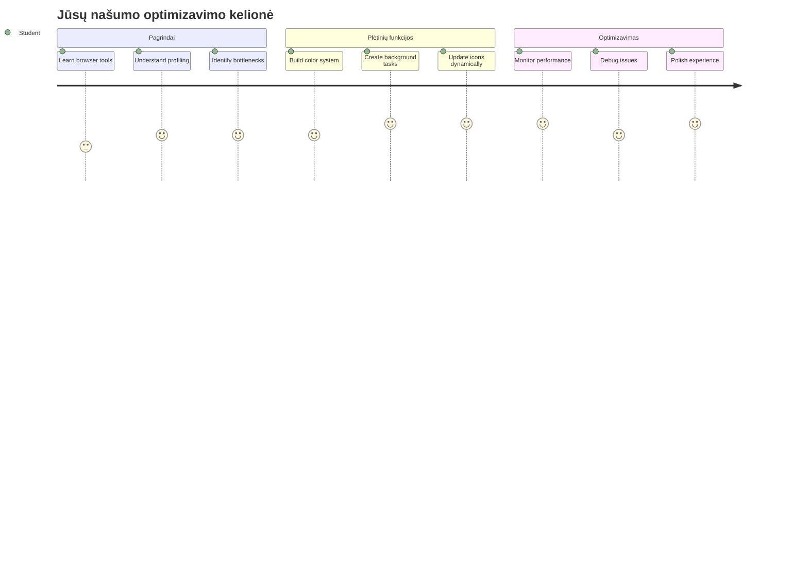
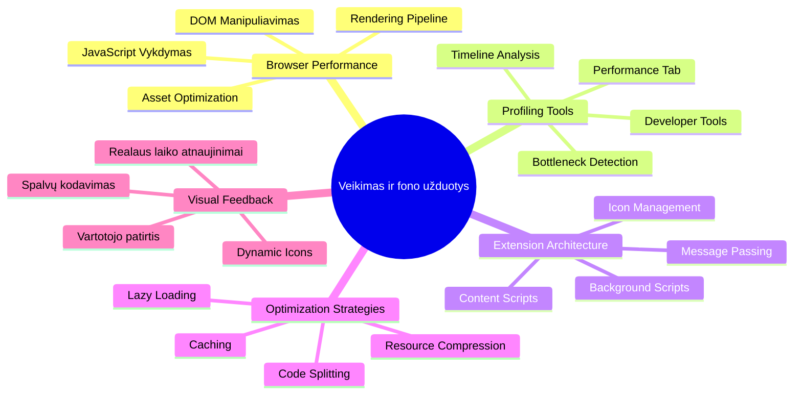
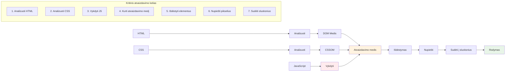
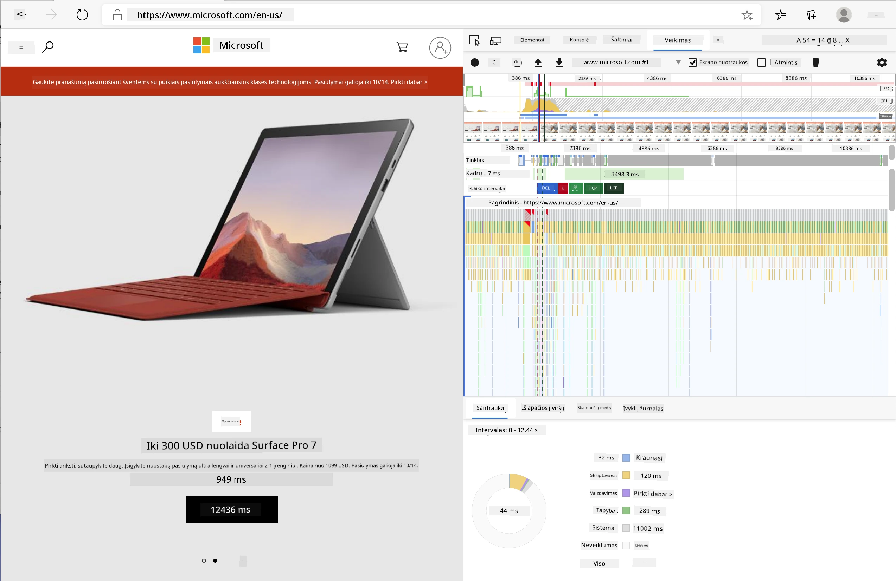
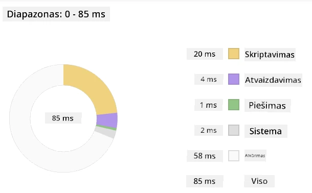
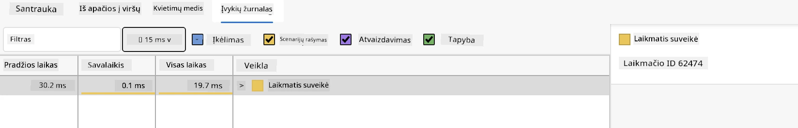
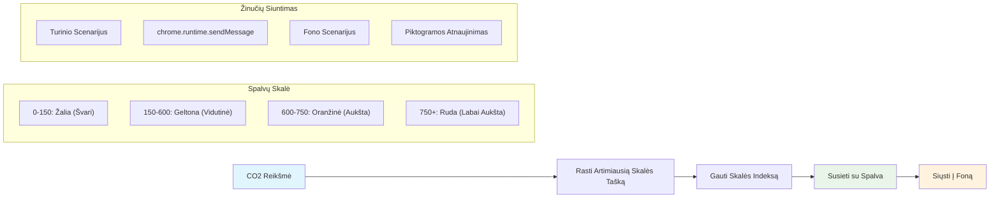
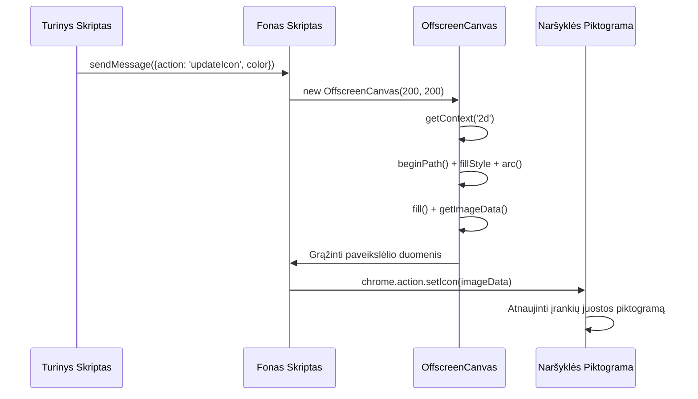
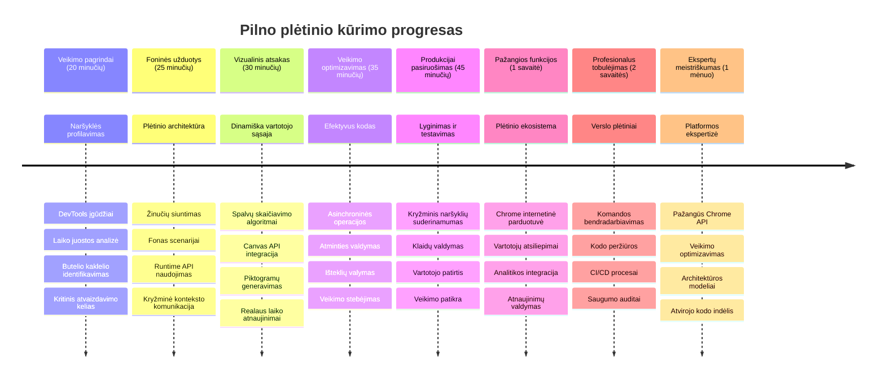

<!--
CO_OP_TRANSLATOR_METADATA:
{
  "original_hash": "b275fed2c6fc90d2b9b6661a3225faa2",
  "translation_date": "2026-01-07T11:41:27+00:00",
  "source_file": "5-browser-extension/3-background-tasks-and-performance/README.md",
  "language_code": "lt"
}
-->
# Naršyklės plėtinio projektas 3 dalis: Sužinokite apie fono užduotis ir našumą


Ar kada nors susimąstėte, kas daro kai kuriuos naršyklės plėtinius greitus ir jautrius, o kiti atrodo lėtai reaguojantys? Paslaptis slypi užkulisiuose. Kol vartotojai spustelėja jūsų plėtinio sąsają, vyksta visa fono procesų visata, tyliai valdanti duomenų atsiuntimą, piktogramų atnaujinimą ir sistemos išteklius.

Tai mūsų paskutinė pamoka naršyklės plėtinių serijoje, ir mes padarysime, kad jūsų anglies pėdsako seklys veiktų sklandžiai. Jūs pridėsite dinaminį piktogramos atnaujinimą ir sužinosite, kaip pastebėti našumo problemas dar prieš joms tampant problemomis. Tai kaip varžybų automobilio derinimas – mažos optimizacijos gali smarkiai pagerinti veikimą.

Baigę turėsite paruoštą plėtinį ir suprasite našumo principus, kurie skiria geras žiniatinklio programas nuo puikių. Panagrinėkime naršyklės optimizavimo pasaulį.

## Priešpaskaitinis testas

[Priešpaskaitinis testas](https://ff-quizzes.netlify.app/web/quiz/27)

### Įvadas

Ankstesnėse pamokose sukūrėte formą, sujungėte ją su API ir susidorojote su asinchroniniu duomenų atsiuntimu. Jūsų plėtinys gražiai formuojasi.

Dabar turime pridėti paskutinius štrichus – kaip pavyzdžiui, kad plėtinio piktograma keistų spalvą pagal anglies duomenis. Tai primena, kaip NASA turėjo optimizuoti kiekvieną Apollo kosminio laivo sistemą. Jie negalėjo sau leisti jokių prarastų ciklų ar atminties, nes gyvybės priklausė nuo našumo. Nors mūsų naršyklės plėtinys nėra toks kritiškas, tie patys principai galioja – efektyvus kodas sukuria geresnę vartotojo patirtį.


## Žiniatinklio našumo pagrindai

Kai jūsų kodas veikia efektyviai, žmonės iš tikrųjų *jaučia* skirtumą. Žinote tą akimirką, kai puslapis įsikrauna akimirksniu arba animacija juda sklandžiai? Tai yra geras našumas.

Našumas nėra tik apie greitį – tai apie žiniatinklio patirtis, kurios jaučiasi natūraliai, o ne nepatogiai ir frustruojančiai. Ankstyvaisiais kompiuterių laikais Grace Hopper garsiai laikė ant stalo nanosekundės ilgio vielutę (apie pėdą ilgio), kad parodytų, kokį atstumą šviesa nukeliauja per milijardinę sekundės dalį. Tai buvo jos būdas paaiškinti, kodėl kiekviena mikrosekundė kompiuterių veikime yra svarbi. Pažiūrėkime į detektyvinius įrankius, kurie padės jums išsiaiškinti, kas sulėtina veikimą.

> "Svetainės našumas susideda iš dviejų dalykų: kaip greitai puslapis įsikrauna ir kaip greitai veikia jo kodas." -- [Zack Grossbart](https://www.smashingmagazine.com/2012/06/javascript-profiling-chrome-developer-tools/)

Tema, kaip padaryti jūsų svetaines žaibiškai greitas visose įrenginių rūšyse, visiems vartotojams ir įvairiose situacijose, neabejotinai yra plati. Štai keletas punktų, kuriuos verta turėti omenyje, kai kuriate standartinį žiniatinklio projektą arba naršyklės plėtinį.

Pirmas žingsnis optimizuojant puslapį yra suprasti, kas iš tikrųjų vyksta po gaubtu. Laimei, jūsų naršyklėje yra galingi detektyviniai įrankiai.


Norėdami atidaryti Kūrėjo įrankius Edge naršyklėje, spustelėkite tris taškus viršutiniame dešiniajame kampe, tada eikite į Daugiau įrankių > Kūrėjo įrankiai. Arba naudokite klaviatūros spartųjį klavišą: `Ctrl` + `Shift` + `I` Windows sistemoje arba `Option` + `Command` + `I` Mac. Kai pateksite, spustelėkite skirtuką Performance – čia prasidės jūsų tyrimas.

**Jūsų našumo detektyvo rinkinys:**
- **Atidarykite** Kūrėjo įrankius (juos naudosite nuolatos!)
- **Eikite** į Performance skirtuką – galvokite apie jį kaip apie savo žiniatinklio programos fitneso sekiklį
- **Paspauskite** įrašymo mygtuką ir stebėkite puslapio veikimą
- **Išnagrinėkite** rezultatus, kad surastumėte, kas sulėtina veikimą

Pabandykime. Atidarykite svetainę (Microsoft.com tinka gerai) ir spustelėkite mygtuką „Įrašyti“. Dabar atnaujinkite puslapį ir stebėkite, kaip profiliuotojas užfiksuoja viską, kas vyksta. Kai sustabdysite įrašymą, pamatysite išsamią naršyklės veiklos, „scripts“, „renders“ ir „paints“, analizę. Tai primena misijų valdymo centrą, kuris seka kiekvieną sistemą raketos paleidimo metu – gaunate realaus laiko duomenis, kas vyksta ir kada.



✅ [Microsoft dokumentacija](https://docs.microsoft.com/microsoft-edge/devtools-guide/performance/?WT.mc_id=academic-77807-sagibbon) turi daug daugiau detalių, jei norite gilintis

> Profesionalus patarimas: Išvalykite naršyklės talpyklą prieš testavimą, kad pamatytumėte, kaip jūsų svetainė veikia pirmą kartą ją aplankantiems – dažnai tai labai skiriasi nuo pakartotinių apsilankymų!

Pasirinkite profilio laiko linijos dalis, kad priartintumėte įvykius, vykstančius puslapio įkėlimo metu.

Gaukite puslapio našumo momentinę nuotrauką pasirinkdami profilio laiko linijos dalį ir pažvelgdami į santraukos langą:



Peržiūrėkite Įvykių žurnalo langą, ar kuris nors įvykis užtruko ilgiau nei 15 ms:



✅ Susipažinkite su savo profiliuotoju! Atidarykite kūrėjo įrankius šioje svetainėje ir pažiūrėkite, ar yra kokių nors kliūčių. Koks greičiausiai užsikrauna turtas? O lėčiausias?

```mermaid
flowchart TD
    A[Atidaryti DevTools] --> B[Naviguoti į Veiklos skirtuką]
    B --> C[Paspausti Įrašymo mygtuką]
    C --> D[Atlikti veiksmus]
    D --> E[Nutraukti įrašymą]
    E --> F{Analizuoti rezultatus}
    
    F --> G[Patikrinti Laiko juostą]
    F --> H[Peržiūrėti Tinklą]
    F --> I[Apžiūrėti Scriptus]
    F --> J[Nustatyti Piešimo įvykius]
    
    G --> K{Ilgi darbai?}
    H --> L{Dideli turtai?}
    I --> M{Blokuoja atvaizdavimą?}
    J --> N{Brangūs piešimai?}
    
    K -->|Taip| O[Optimizuoti JavaScript]
    L -->|Taip| P[Spausti turtus]
    M -->|Taip| Q[Pridėti Async/Defer]
    N -->|Taip| R[Supaprastinti stilius]
    
    O --> S[Išbandyti dar kartą]
    P --> S
    Q --> S
    R --> S
    
    style A fill:#e1f5fe
    style F fill:#fff3e0
    style S fill:#e8f5e8
```


## Ko ieškoti profiliuojant

Profiliaus paleidimas yra tik pradžia – tikrasis įgūdis yra suprasti, ką šie spalvoti grafikai jums sako. Nesijaudinkite, greitai išmoksite juos skaityti. Patyrę kūrėjai išmoksta pastebėti įspėjamuosius signalus dar prieš jiems tampant tikromis problemomis.

Pašnekėkime apie įprastus kaltininkus – našumo trikdžius, kurie dažnai įsilaužia į žiniatinklio projektus. Kaip Marie Curie turėjo kruopščiai stebėti spinduliuotės lygius savo laboratorijoje, taip ir mes turime stebėti tam tikrus modelius, kurie byloja apie kylančias problemas. Ankstyvas jų pastebėjimas taupo daug nusivylimo jums (ir jūsų vartotojams).

**Turtų dydžiai**: Svetainės ilgainiui tapo „sunkesnės“, ir daug ši papildoma svorio tenka paveikslėliams. Tai tarsi pildyti vis didesnius ir didesnius skaitmeninius lagaminus.

✅ Peržiūrėkite [Internet Archive](https://httparchive.org/reports/page-weight), kad pamatytumėte, kaip puslapio dydžiai augo laikui bėgant – tai labai atskleidžianti informacija.

**Štai kaip palaikyti optimizuotus turtus:**
- **Suspauskite** paveikslėlius! Modernūs formatai, kaip WebP, gali drastiškai sumažinti failų dydžius
- **Pateikite** tinkamą paveikslėlio dydį kiekvienam įrenginiui – nereikia siųsti milžiniškų darbastalio paveikslėlių telefonams
- **Sutrumpinkite** savo CSS ir JavaScript – kiekvienas baitas svarbus
- **Naudokite** tingųjį įkėlimą, kad paveikslėliai siųstųsi tik tada, kai vartotojas juos iš tiesų peržvelgia

**DOM naršymas**: Naršyklė turi sukurti savo Dokumento Objekto Modelį pagal jūsų rašomą kodą, todėl svarbu palaikyti žymes minimalias, naudoti ir stilizuoti tik tai, ko puslapis iš tikrųjų reikalauja. Pvz., perteklinį CSS, susietą su puslapiu, galima optimizuoti; stiliai, naudojami tik viename puslapyje, nereikia įtraukti į bendrą stilių lapą.

**Pagrindinės DOM optimizavimo strategijos:**
- **Sumažina** HTML elementų skaičių ir įdėliojimo lygius
- **Ištrina** nenaudojamus CSS taisykles ir efektyviai konsoliduoja stilių lapus
- **Organizuoja** CSS, kad užkrautų tik tai, ko reikia kiekvienam puslapiui
- **Švelniai struktūruoja** HTML semantiškai, kad naršyklė geriau apdorotų

**JavaScript**: Kiekvienas JavaScript kūrėjas turi saugotis „rendinimą blokuojančių“ scenarijų, kurie turi būti įkrauti, kol DOM gali būti naršomas ir pateikiamas naršyklėje. Apsvarstykite galimybę naudoti `defer` su savo eilutės scenarijais (kaip daroma Terrarium modulyje).

**Modernios JavaScript optimizavimo technikos:**
- **Naudoja** `defer` atributą, kad scenarijai būtų įkraunami po DOM analizės
- **Įdiegia** kodo skaidymą, kad įkrautų tik būtiną JavaScript
- **Taiko** tingųjį įkėlimą ne kritinėms funkcijoms
- **Sumažina** sunkių bibliotekų ir karkasų naudojimą kur įmanoma

✅ Išbandykite keletą svetainių [Site Speed Test svetainėje](https://www.webpagetest.org/), kad sužinotumėte daugiau apie įprastus patikrinimus, kurių imasi norint įvertinti svetainės našumą.

### 🔄 **Pedagoginis patikrinimas**
**Našumo supratimas**: Prieš kurdami plėtinio funkcijas, įsitikinkite, kad galite:
- ✅ Paaiškinti kritinį rendering'o kelią nuo HTML iki pikselių
- ✅ Atpažinti dažnas našumo kliūtis žiniatinklio programose
- ✅ Naudoti naršyklės kūrėjo įrankius puslapio veikimo profilaksiui
- ✅ Suprasti, kaip turtų dydis ir DOM sudėtingumas veikia greitį

**Greitas savitikris**: Kas nutinka, kai turite rendinimą blokuojantį JavaScript?
*Atsakymas: Naršyklė turi atsisiųsti ir vykdyti scenarijų prieš tęsiant HTML analizę ir puslapio pateikimą*

**Realaus pasaulio našumo poveikis**:
- **100 ms vėlavimas**: Vartotojai jau pajunta sulėtėjimą
- **1 sekundės vėlavimas**: Vartotojai pradeda prarasti dėmesį
- **3+ sekundės**: 40% vartotojų palieka puslapį
- **Mobilūs tinklai**: Našumas dar svarbesnis

Dabar, kai turite idėją, kaip naršyklė pateikia jums siunčiamus turtus, pažvelkime į paskutinius žingsnius, kuriuos reikia atlikti, kad užbaigtumėte savo plėtinį:

### Sukurkite funkciją spalvai apskaičiuoti

Dabar sukursime funkciją, kuri skaitinius duomenis pavers reikšmingomis spalvomis. Galvokite apie tai kaip apie šviesoforo sistemą – žalia reiškia švarią energiją, raudona – aukštą anglies intensyvumą.

Ši funkcija naudos CO2 duomenis iš mūsų API ir nustatys, kuri spalva geriausiai atspindi aplinkos poveikį. Tai panašu į mokslininkų naudojamą spalvų kodavimą karštųjų zonų žemėlapiuose, skirtuose vizualizuoti sudėtingus duomenų modelius – nuo vandenynų temperatūros iki žvaigždžių susidarymo. Pridėkime tai prie `/src/index.js`, tiesiai po tomis anksčiau sukurtomis `const` kintamųjų deklaracijomis:


```javascript
function calculateColor(value) {
	// Nustatyti CO2 intensyvumo skalę (gramais už kWh)
	const co2Scale = [0, 150, 600, 750, 800];
	// Atitinkamos spalvos nuo žalios (švarios) iki tamsiai rudos (didelis anglies kiekis)
	const colors = ['#2AA364', '#F5EB4D', '#9E4229', '#381D02', '#381D02'];

	// Rasti artimiausią skalės reikšmę mūsų įvestai vertei
	const closestNum = co2Scale.sort((a, b) => {
		return Math.abs(a - value) - Math.abs(b - value);
	})[0];
	
	console.log(`${value} is closest to ${closestNum}`);
	
	// Rasti indekso reikšmę spalvų susiejimui
	const num = (element) => element > closestNum;
	const scaleIndex = co2Scale.findIndex(num);

	const closestColor = colors[scaleIndex];
	console.log(scaleIndex, closestColor);

	// Išsiųsti spalvų atnaujinimo pranešimą foniniam skriptui
	chrome.runtime.sendMessage({ action: 'updateIcon', value: { color: closestColor } });
}
```

**Išskleiskime šią sumanią funkciją:**
- **Sukuria** dvi masyvo reikšmes – viena CO2 lygiams, kita spalvoms (žalia = švaru, ruda = purvu!)
- **Randa** artimiausią atitikmenį faktiniam CO2 rodikliui naudodama tvarkymą masyve
- **Paimama** atitinkama spalva su `findIndex()` metodu
- **Siunčia** žinutę Chrome fono scenarijui su mūsų išrinkta spalva
- **Naudoja** šabloninius literalius (tuos atgalinius kabučius) švaresniam tekstų formatavimui
- **Laiko** viską tvarkingai su `const` deklaracijomis

`chrome.runtime` [API](https://developer.chrome.com/extensions/runtime) veikia kaip jūsų plėtinio nervų sistema – ji valdo visą užkulisinę komunikaciją ir užduotis:

> "Naudokite chrome.runtime API, kad gautumėte fono puslapį, grąžintumėte informaciją apie manifestą ir klausytumėte bei reaguotumėte į įvykius programos ar plėtinio gyvenimo cikle. Taip pat galite naudoti šį API, kad konvertuotumėte santykinius URL kelius į pilnus URL."

**Kodėl Chrome Runtime API yra toks patogus:**
- **Leidžia** skirtingoms plėtinio dalims bendrauti tarpusavyje
- **Vykdo** fono darbus nesustabdydamas vartotojo sąsajos
- **Valdo** plėtinio gyvenimo ciklo įvykius
- **Palengvina** žinučių siuntimą tarp scenarijų

✅ Jei kuriate šį plėtinį Edge naršyklei, gali jus nustebinti, kad naudojate chrome API. Naujesnės Edge versijos veikia Chromium varikliu, tad galite naudotis šiomis priemonėmis.


> **Profesionalus patarimas**: Jei norite atlikti naršyklės plėtinio profilaktiką, paleiskite kūrėjo įrankius iš pačio plėtinio, nes tai yra atskira naršyklės instancija. Tai suteikia prieigą prie plėtinio specifinių našumo rodiklių.

### Nustatykite numatytąją piktogramos spalvą

Prieš pradėdami gauti tikrus duomenis, duokime plėtiniui pradžios tašką. Niekam nepatinka žiūrėti į tuščią ar sugadintą piktogramą. Pradėsime nuo žalios spalvos, kad vartotojai žinotų, jog plėtinys veikia nuo pat įdiegimo momento.

Jūsų `init()` funkcijoje nustatykime numatytąją žalią piktogramą:

```javascript
chrome.runtime.sendMessage({
	action: 'updateIcon',
	value: {
		color: 'green',
	},
});
```

**Ką šis inicializavimas atlieka:**
- **Nustato** neutralų žalią spalvą kaip numatytąją būseną
- **Teikia** akimirkos vizualinį atsiliepimą, kai plėtinys užkraunamas
- **Nustato** komunikacijos modelį su fono scenarijumi
- **Užtikrina**, kad vartotojai mato veikiantį plėtinį prieš įkeliant duomenis

### Iškvieskite funkciją, įvykdykite iškvietimą

Dabar sujungsime viską kartu, kad kai pasirodys nauji CO2 duomenys, jūsų piktograma automatiškai atsinaujintų tinkama spalva. Tai lyg prijungti galutinį grandinės elementą elektroniniame prietaise – staiga visi atskiri komponentai pradeda veikti kaip vieninga sistema.

Pridėkite šią eilutę iškart po to, kai gaunate CO2 duomenis iš API:

```javascript
// Gavus CO2 duomenis iš API
// leisti CO2 = data.data[0].intensity.actual;
calculateColor(CO2);
```

**Šis integravimas atlieka:**
- **Jungia** API duomenų srautą su vizualinio indikatorius sistema
- **Aktyvuoja** piktogramos atnaujinimus automatiškai, kai gaunama nauja informacija
- **Užtikrina** realaus laiko vizualinį atsiliepimą pagal dabartinį anglies intensyvumą
- **Išlaiko** duomenų atsiuntimo ir rodymo logikos atskirtį

Ir galiausiai, faile `/dist/background.js` pridėkite klausytoją šioms fono veiksmų užklausoms:

```javascript
// Klausykite pranešimų iš turinio skripto
chrome.runtime.onMessage.addListener(function (msg, sender, sendResponse) {
	if (msg.action === 'updateIcon') {
		chrome.action.setIcon({ imageData: drawIcon(msg.value) });
	}
});

// Pieškite dinamišką piktogramą naudodami Canvas API
// Paskolinta iš energy lollipop plėtinio - puiki funkcija!
function drawIcon(value) {
	// Sukurkite offscreen drobę geresniam našumui
	const canvas = new OffscreenCanvas(200, 200);
	const context = canvas.getContext('2d');

	// Nupieškite spalvotą apskritimą, atspindintį anglies intensyvumą
	context.beginPath();
	context.fillStyle = value.color;
	context.arc(100, 100, 50, 0, 2 * Math.PI);
	context.fill();

	// Grąžinkite paveikslėlio duomenis naršyklės piktogramai
	return context.getImageData(50, 50, 100, 100);
}
```

**Štai ką daro šis fono scenarijus:**
- **Klauso** žinučių iš pagrindinio scenarijaus (kaip registratorius priimantis skambučius)
- **Apdoroja** šias 'updateIcon' užklausas piktogramos įrankių juostai pakeisti
- **Kuria** naujas piktogramas “on the fly” naudodamas Canvas API
- **Piešia** paprastą spalvotą ratą, rodantį dabartinį anglies intensyvumą
- **Atnaujina** naršyklės įrankių juostą nauja piktograma
- **Naudoja** OffscreenCanvas geresniam našumui (neblokuoja sąsajos)

✅ Daugiau apie Canvas API sužinosite [Kosmoso žaidimo pamokose](../../6-space-game/2-drawing-to-canvas/README.md).


### 🔄 **Pedagoginis patikrinimas**
**Pilnas plėtinio supratimas**: Įvertinkite savo visos sistemos išmanymą:
- ✅ Kaip veikia žinučių siuntimas tarp skirtingų plėtinio scenarijų?
- ✅ Kodėl naudojame OffscreenCanvas vietoje įprasto Canvas dėl našumo?
- ✅ Kokią rolę atlieka Chrome Runtime API plėtinių architektūroje?
- ✅ Kaip spalvų skaičiavimo algoritmas atvaizduoja duomenis į vizualinį grįžtamąjį ryšį?

**Veikimo našumo svarstymai**: Jūsų plėtinys dabar demonstruoja:
- **Efektyvų žinučių perdavimą**: Aiškią komunikaciją tarp skriptų kontekstų
- **Optimizuotą atvaizdavimą**: OffscreenCanvas neleidžia blokuoti vartotojo sąsajos
- **Realaus laiko atnaujinimus**: Dinamiški piktogramos pokyčiai pagal gyvus duomenis
- **Atminties valdymą**: Tinkamą išvalymą ir resursų tvarkymą

**Laikas išbandyti savo plėtinį:**
- **Sukurkite** viską su `npm run build`
- **Perkraukite** plėtinį naršyklėje (nepamirškite šio žingsnio)
- **Atidarykite** savo plėtinį ir stebėkite, kaip keičiasi piktogramos spalvos
- **Patikrinkite**, kaip jis reaguoja į tikrus anglies dioksido duomenis iš viso pasaulio

Dabar galėsite iš karto pamatyti, ar tinkamas laikas skalbti ar geriau palaukti švaresnės energijos. Jūs ką tik sukūrėte tikrai naudingą funkciją ir pakeliui sužinojote apie naršyklės našumą.

## GitHub Copilot Agent užduotis 🚀

Naudokite Agent režimą, kad atliktumėte šią užduotį:

**Aprašymas:** Pagerinkite naršyklės plėtinio veikimo stebėjimo galimybes pridėdami funkciją, kuri seka ir rodo skirtingų plėtinio komponentų užkrovimo laikus.

**Užduotis:** Sukurkite našumo stebėjimo sistemą naršyklės plėtiniui, kuri matuotų ir registruotų laiką, reikalingą CO2 duomenims gauti iš API, spalvoms apskaičiuoti ir piktogramai atnaujinti. Pridėkite funkciją `performanceTracker`, kuri naudoja Performance API šiems procesams matuoti ir rodo rezultatus naršyklės konsolėje su laiko žymomis ir trukmės matavimais.

Daugiau sužinokite apie [agent režimą](https://code.visualstudio.com/blogs/2025/02/24/introducing-copilot-agent-mode).

## 🚀 Užduotis

Štai įdomi detektyvinė misija: pasirinkite keletą atviro kodo svetainių, kurios veikia jau daugelį metų (pvz., Wikipedia, GitHub ar Stack Overflow) ir peržiūrėkite jų įsipareigojimų istoriją. Ar galite pastebėti, kur jos tobulino našumą? Kokios problemos dažnai kartojosi?

**Jūsų tyrimo metodas:**
- **Ieškokite** įsipareigojimų žinučių su žodžiais „optimize“, „performance“ arba „faster“
- **Ieškokite** pasikartojančių modelių – ar taiso tuos pačius trikdžius?
- **Nustatykite** dažniausias priežastis, kurios lėtina svetaines
- **Pasidalykite** savo atradimais – kiti kūrėjai mokosi iš realių pavyzdžių

## Paskaitos pabaigos testas

[Paskaitos pabaigos testas](https://ff-quizzes.netlify.app/web/quiz/28)

## Peržiūra ir savarankiškas mokymasis

Apsvarstykite galimybę užsiprenumeruoti [našumo naujienlaiškį](https://perf.email/)

Išnagrinėkite naršyklių našumo vertinimo būdus nagrinėdami našumo skirtukus jų kūrimo įrankiuose. Ar pastebite esminių skirtumų?

### ⚡ **Ką galite padaryti per artimiausias 5 minutes**
- [ ] Atidarykite naršyklės užduočių tvarkytuvę (Shift+Esc Chrome naršyklėje), kad pamatytumėte plėtinių resursų naudojimą
- [ ] Naudokite DevTools Performance skirtuką, kad fiksuotumėte ir analizuotumėte tinklalapio našumą
- [ ] Patikrinkite naršyklės plėtinių puslapį, kurie plėtiniai veikia paleidimo metu
- [ ] Pabandykite laikinai išjungti plėtinius ir palyginkite našumo skirtumus

### 🎯 **Ką galite pasiekti šią valandą**
- [ ] Atlikite paskaitos pabaigos testą ir supraskite našumo sąvokas
- [ ] Įgyvendinkite foninį skriptą savo naršyklės plėtinyje
- [ ] Išmokite naudoti browser.alarms efektyviems foniniams darbams
- [ ] Praktikuokitės siuntimo žinučių tarp turinio ir fono skriptų mechaniką
- [ ] Matavimas ir optimizavimas jūsų plėtinio resursų naudojimui

### 📅 **Jūsų savaitės trukmės našumo kelionė**
- [ ] Sukurkite aukšto našumo naršyklės plėtinį su foninėmis funkcijomis
- [ ] Įvaldykite paslaugų darbininkus ir šiuolaikinę plėtinių architektūrą
- [ ] Įgyvendinkite efektyvias duomenų sinchronizavimo ir talpyklos strategijas
- [ ] Išmokite pažangias plėtinių našumo derinimo metodikas
- [ ] Optimizuokite plėtinį tiek funkcionalumo, tiek resursų atžvilgiu
- [ ] Sukurkite išsamias plėtinių našumo scenarijų testavimo procedūras

### 🌟 **Jūsų mėnesio trukmės optimizavimo meistrystė**
- [ ] Kurkite aukščiausios klasės naršyklių plėtinius su optimalia našumo kokybe
- [ ] Išmokite apie Web Workers, Service Workers ir šiuolaikinį interneto našumą
- [ ] Dalyvaukite atviro kodo projektuose, skirtuose našumo optimizavimui
- [ ] Įvaldykite naršyklės vidines operacijas ir pažangias derinimo metodikas
- [ ] Sukurkite našumo stebėjimo įrankius ir geriausių praktikų gaires
- [ ] Tapkite našumo ekspertais, padedančiais optimizuoti interneto programas

## 🎯 Jūsų naršyklės plėtinių meistrystės laiko juosta


### 🛠️ Jūsų pilnas plėtinių kūrimo įrankių rinkinys

Įveikę šią trilogiją, dabar įvaldėte:
- **Naršyklės architektūrą**: Gilų supratimą, kaip plėtiniai integruojasi į naršyklės sistemas
- **Našumo profilaktiką**: Gebėjimą identifikuoti ir šalinti užsikirtimus naudojant kūrėjų įrankius
- **Asinchroninį programavimą**: Modernius JavaScript modelius reaguojančioms, neblokuojančioms operacijoms
- **API integraciją**: Išorinių duomenų gavimą su autentifikacija ir klaidų valdymu
- **Vizualinį dizainą**: Dinamiškus UI atnaujinimus ir grafikų generavimą naudojant Canvas
- **Žinučių perdavimą**: Komunikaciją tarp skriptų plėtinių architektūroje
- **Vartotojo patirtį**: Užkrovimo būsenas, klaidų valdymą ir intuityvius veiksmus
- **Gamybos įgūdžius**: Testavimą, derinimą ir optimizavimą realiam diegimui

**Realūs panaudojimo atvejai**: Jūsų plėtinių kūrimo įgūdžiai pritaikomi tiesiogiai:
- **Progresyviosios žiniatinklio programos**: Panaši architektūra ir našumo modeliai
- **Electron stalinės programos**: Kryžminės platformos programos naudojant interneto technologijas
- **Mobilios hibridinės programos**: Cordova/PhoneGap kūrimas naudojant interneto API
- **Įmonių žiniatinklio programos**: Sudėtingi valdymo skydeliai ir produktyvumo įrankiai
- **Chrome DevTools plėtiniai**: Pažangūs kūrėjo įrankiai ir derinimas
- **Interneto API integracija**: Bet kokia programa, bendraujanti su išorinėmis paslaugomis

**Profesionalus poveikis**: Dabar galite:
- **Kurti** gamybos lygio naršyklės plėtinius nuo idėjos iki diegimo
- **Optimizuoti** žiniatinklio programų našumą naudojant pramoninius profilaktikos įrankius
- **Architektūrizuoti** mastelio keičiamas sistemas su tinkamu atsakomybės skaidymu
- **Derinti** sudėtingas asinchronines operacijas ir komunikaciją tarp kontekstų
- **Prisidėti** prie atviro kodo plėtinių projektų ir naršyklės standartų

**Tolimesnės karjeros galimybės**:
- **Chrome Web Store kūrėjas**: Publikuokite plėtinius milijonams vartotojų
- **Internetinio našumo inžinierius**: Specializuokitės optimizavimo ir vartotojo patirties srityje
- **Naršyklės platformos kūrėjas**: Prisidėkite prie naršyklės variklio tobulinimo
- **Plėtinių karkaso kūrėjas**: Kurkite įrankius, padedančius kitiems kūrėjams
- **Kūrėjų santykiai**: Dalinkitės žiniomis per mokymus ir turinio kūrimą

🌟 **Pasiekimas atrakintas**: Jūs sukūrėte pilną, funkcionalų naršyklės plėtinį, demonstruojantį profesionalius kūrimo metodus ir šiuolaikinius interneto standartus!

## Užduotis

[Analizuokite svetainę našumui](assignment.md)

---

<!-- CO-OP TRANSLATOR DISCLAIMER START -->
**Atsakomybės apribojimas**:
Šis dokumentas buvo išverstas naudojant dirbtinio intelekto vertimo paslaugą [Co-op Translator](https://github.com/Azure/co-op-translator). Nors siekiame tikslumo, prašome atkreipti dėmesį, kad automatizuoti vertimai gali turėti klaidų ar netikslumų. Originalus dokumentas jo gimtąja kalba turi būti laikomas autoritetingu šaltiniu. Kritinei informacijai rekomenduojame naudoti profesionalų žmogaus vertimą. Mes neatsakome už bet kokius nesusipratimus ar neteisingus interpretavimus, kylančius dėl šio vertimo naudojimo.
<!-- CO-OP TRANSLATOR DISCLAIMER END -->