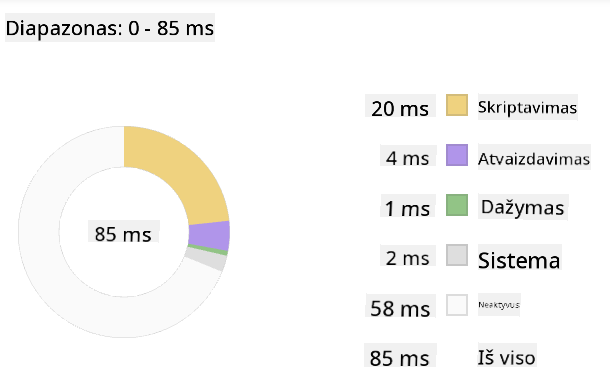

<!--
CO_OP_TRANSLATOR_METADATA:
{
  "original_hash": "f198c6b817b4b2a99749f4662e7cae98",
  "translation_date": "2025-08-28T11:25:53+00:00",
  "source_file": "5-browser-extension/3-background-tasks-and-performance/README.md",
  "language_code": "lt"
}
-->
# Naršyklės plėtinio projektas 3 dalis: Sužinokite apie fono užduotis ir našumą

## Klausimynas prieš paskaitą

[Klausimynas prieš paskaitą](https://ashy-river-0debb7803.1.azurestaticapps.net/quiz/27)

### Įvadas

Per paskutines dvi šio modulio pamokas išmokote sukurti formą ir duomenų rodymo sritį, skirtą informacijai iš API. Tai labai standartinis būdas kurti internetinį buvimą internete. Jūs netgi išmokote tvarkyti asinchroninį duomenų gavimą. Jūsų naršyklės plėtinys beveik baigtas.

Liko valdyti kai kurias fono užduotis, įskaitant plėtinio piktogramos spalvos atnaujinimą, todėl tai puikus metas aptarti, kaip naršyklė tvarko tokio tipo užduotis. Pagalvokime apie šias naršyklės užduotis jūsų internetinių išteklių našumo kontekste, kai juos kuriate.

## Interneto našumo pagrindai

> „Svetainės našumas susijęs su dviem dalykais: kaip greitai puslapis įkeliama ir kaip greitai jame veikia kodas.“ -- [Zack Grossbart](https://www.smashingmagazine.com/2012/06/javascript-profiling-chrome-developer-tools/)

Kaip padaryti, kad jūsų svetainės veiktų žaibiškai greitai visų tipų įrenginiuose, visų tipų vartotojams ir visose situacijose, yra, nenuostabu, labai plati tema. Štai keletas dalykų, kuriuos verta prisiminti, kuriant standartinį interneto projektą ar naršyklės plėtinį.

Pirmas dalykas, kurį turite padaryti, kad užtikrintumėte efektyvų svetainės veikimą, yra surinkti duomenis apie jos našumą. Pirmoji vieta, kur tai padaryti, yra jūsų naršyklės kūrėjo įrankiai. Naršyklėje „Edge“ galite pasirinkti mygtuką „Nustatymai ir daugiau“ (trijų taškų piktograma viršutiniame dešiniajame naršyklės kampe), tada eiti į Daugiau įrankių > Kūrėjo įrankiai ir atidaryti našumo skirtuką. Taip pat galite naudoti klaviatūros sparčiuosius klavišus `Ctrl` + `Shift` + `I` „Windows“ arba `Option` + `Command` + `I` „Mac“, kad atidarytumėte kūrėjo įrankius.

Našumo skirtuke yra Profilio įrankis. Atidarykite svetainę (pavyzdžiui, [https://www.microsoft.com](https://www.microsoft.com/?WT.mc_id=academic-77807-sagibbon)) ir spustelėkite mygtuką „Įrašyti“, tada atnaujinkite svetainę. Bet kuriuo metu sustabdykite įrašymą ir galėsite pamatyti rutinas, kurios generuojamos „script“, „render“ ir „paint“ svetainės:


✅ Aplankykite [Microsoft dokumentaciją](https://docs.microsoft.com/microsoft-edge/devtools-guide/performance/?WT.mc_id=academic-77807-sagibbon) apie našumo skydelį „Edge“.

> Patarimas: norėdami gauti tikslius svetainės paleidimo laiko duomenis, išvalykite naršyklės talpyklą.

Pasirinkite profilio laiko juostos elementus, kad priartintumėte įvykius, vykstančius, kol jūsų puslapis įkeliama.

Gaukite savo puslapio našumo momentinę nuotrauką, pasirinkdami profilio laiko juostos dalį ir peržiūrėdami santraukos skydelį:



Patikrinkite įvykių žurnalo skydelį, kad pamatytumėte, ar kuris nors įvykis truko ilgiau nei 15 ms:


✅ Susipažinkite su savo profiliuotoju! Atidarykite kūrėjo įrankius šioje svetainėje ir pažiūrėkite, ar yra kokių nors kliūčių. Koks yra lėčiausiai įkeliantis išteklius? Greičiausias?

## Profilio patikrinimai

Apskritai, yra keletas „probleminių sričių“, į kurias kiekvienas interneto kūrėjas turėtų atkreipti dėmesį, kurdamas svetainę, kad išvengtų nemalonių staigmenų, kai ateis laikas ją diegti į gamybą.

**Išteklių dydžiai**: Per pastaruosius kelerius metus internetas tapo „sunkesnis“ ir todėl lėtesnis. Dalis šio svorio susijusi su vaizdų naudojimu.

✅ Peržiūrėkite [Interneto archyvą](https://httparchive.org/reports/page-weight), kad pamatytumėte istorinius puslapio svorio duomenis ir daugiau.

Gera praktika yra užtikrinti, kad jūsų vaizdai būtų optimizuoti ir pateikti tinkamo dydžio bei raiškos jūsų vartotojams.

**DOM naršymas**: Naršyklė turi sukurti savo Dokumento objektų modelį pagal jūsų parašytą kodą, todėl geram puslapio našumui svarbu, kad jūsų žymos būtų minimalios, naudojant ir stiliuojant tik tai, ko reikia puslapiui. Šiuo atžvilgiu perteklinė CSS, susijusi su puslapiu, galėtų būti optimizuota; stiliai, kurie turi būti naudojami tik viename puslapyje, neturėtų būti įtraukti į pagrindinį stiliaus lapą, pavyzdžiui.

**JavaScript**: Kiekvienas JavaScript kūrėjas turėtų stebėti „render-blocking“ scenarijus, kurie turi būti įkelti prieš naršyklės galimybę naršyti ir piešti likusį DOM. Apsvarstykite galimybę naudoti `defer` su savo įterptaisiais scenarijais (kaip tai daroma „Terrarium“ modulyje).

✅ Išbandykite keletą svetainių [Svetainės greičio testavimo svetainėje](https://www.webpagetest.org/), kad sužinotumėte daugiau apie įprastus patikrinimus, kurie atliekami siekiant nustatyti svetainės našumą.

Dabar, kai turite idėją, kaip naršyklė atvaizduoja jūsų siunčiamus išteklius, pažvelkime į paskutinius kelis dalykus, kuriuos reikia padaryti, kad užbaigtumėte savo plėtinį:

### Sukurkite funkciją spalvai apskaičiuoti

Dirbdami su `/src/index.js`, pridėkite funkciją, pavadintą `calculateColor()`, po serijos `const` kintamųjų, kuriuos nustatėte, kad gautumėte prieigą prie DOM:

```JavaScript
function calculateColor(value) {
	let co2Scale = [0, 150, 600, 750, 800];
	let colors = ['#2AA364', '#F5EB4D', '#9E4229', '#381D02', '#381D02'];

	let closestNum = co2Scale.sort((a, b) => {
		return Math.abs(a - value) - Math.abs(b - value);
	})[0];
	console.log(value + ' is closest to ' + closestNum);
	let num = (element) => element > closestNum;
	let scaleIndex = co2Scale.findIndex(num);

	let closestColor = colors[scaleIndex];
	console.log(scaleIndex, closestColor);

	chrome.runtime.sendMessage({ action: 'updateIcon', value: { color: closestColor } });
}
```

Kas čia vyksta? Jūs perduodate reikšmę (anglies intensyvumą) iš API užklausos, kurią užbaigėte per paskutinę pamoką, ir tada apskaičiuojate, kaip arti jos reikšmė yra spalvų masyve pateikto indekso. Tada siunčiate tą artimiausią spalvos reikšmę į „chrome runtime“.

„chrome.runtime“ turi [API](https://developer.chrome.com/extensions/runtime), kuris tvarko įvairias fono užduotis, ir jūsų plėtinys tuo naudojasi:

> „Naudokite „chrome.runtime“ API, kad gautumėte fono puslapį, grąžintumėte informaciją apie manifestą ir klausytumėte bei reaguotumėte į įvykius programos ar plėtinio gyvavimo cikle. Taip pat galite naudoti šią API, kad konvertuotumėte santykinius URL kelių į visiškai kvalifikuotus URL.“

✅ Jei kuriate šį naršyklės plėtinį „Edge“, jus gali nustebinti, kad naudojate „chrome“ API. Naujesnės „Edge“ naršyklės versijos veikia „Chromium“ naršyklės variklyje, todėl galite naudotis šiais įrankiais.

> Pastaba: jei norite profiliuoti naršyklės plėtinį, paleiskite kūrėjo įrankius iš paties plėtinio, nes tai yra atskira naršyklės instancija.

### Nustatykite numatytąją piktogramos spalvą

Dabar, funkcijoje `init()`, nustatykite piktogramą kaip bendrą žalią spalvą, iš naujo iškviesdami „chrome“ `updateIcon` veiksmą:

```JavaScript
chrome.runtime.sendMessage({
	action: 'updateIcon',
		value: {
			color: 'green',
		},
});
```

### Iškvieskite funkciją, vykdykite užklausą

Toliau iškvieskite ką tik sukurtą funkciją, pridėdami ją prie pažado, kurį grąžina C02Signal API:

```JavaScript
//let CO2...
calculateColor(CO2);
```

Ir galiausiai, faile `/dist/background.js`, pridėkite klausytoją šiems fono veiksmų iškvietimams:

```JavaScript
chrome.runtime.onMessage.addListener(function (msg, sender, sendResponse) {
	if (msg.action === 'updateIcon') {
		chrome.browserAction.setIcon({ imageData: drawIcon(msg.value) });
	}
});
//borrowed from energy lollipop extension, nice feature!
function drawIcon(value) {
	let canvas = document.createElement('canvas');
	let context = canvas.getContext('2d');

	context.beginPath();
	context.fillStyle = value.color;
	context.arc(100, 100, 50, 0, 2 * Math.PI);
	context.fill();

	return context.getImageData(50, 50, 100, 100);
}
```

Šiame kode pridedate klausytoją bet kokioms žinutėms, siunčiamoms į užduočių valdytoją fone. Jei ji vadinama „updateIcon“, tada vykdomas kitas kodas, kuris piešia tinkamos spalvos piktogramą, naudojant „Canvas API“.

✅ Daugiau apie „Canvas API“ sužinosite [Kosmoso žaidimo pamokose](../../6-space-game/2-drawing-to-canvas/README.md).

Dabar, iš naujo sukurkite savo plėtinį (`npm run build`), atnaujinkite ir paleiskite savo plėtinį ir stebėkite, kaip keičiasi spalva. Ar tai tinkamas metas atlikti kokį nors darbą ar išplauti indus? Dabar jūs žinote!

Sveikiname, jūs sukūrėte naudingą naršyklės plėtinį ir daugiau sužinojote apie tai, kaip veikia naršyklė ir kaip profiliuoti jos našumą.

---

## 🚀 Iššūkis

Ištirkite kai kurias atvirojo kodo svetaines, kurios egzistuoja jau ilgą laiką, ir, remdamiesi jų „GitHub“ istorija, pabandykite nustatyti, kaip jos buvo optimizuotos našumui per metus, jei iš viso buvo. Koks yra dažniausias skausmo taškas?

## Klausimynas po paskaitos

[Klausimynas po paskaitos](https://ashy-river-0debb7803.1.azurestaticapps.net/quiz/28)

## Apžvalga ir savarankiškas mokymasis

Apsvarstykite galimybę užsiprenumeruoti [našumo naujienlaiškį](https://perf.email/).

Ištirkite kai kuriuos būdus, kaip naršyklės vertina interneto našumą, peržiūrėdami jų kūrėjo įrankių našumo skirtukus. Ar pastebėjote kokių nors esminių skirtumų?

## Užduotis

[Analizuokite svetainės našumą](assignment.md)

---

**Atsakomybės apribojimas**:  
Šis dokumentas buvo išverstas naudojant AI vertimo paslaugą [Co-op Translator](https://github.com/Azure/co-op-translator). Nors siekiame tikslumo, prašome atkreipti dėmesį, kad automatiniai vertimai gali turėti klaidų ar netikslumų. Originalus dokumentas jo gimtąja kalba turėtų būti laikomas autoritetingu šaltiniu. Kritinei informacijai rekomenduojama naudoti profesionalų žmogaus vertimą. Mes neprisiimame atsakomybės už nesusipratimus ar klaidingus interpretavimus, atsiradusius dėl šio vertimo naudojimo.