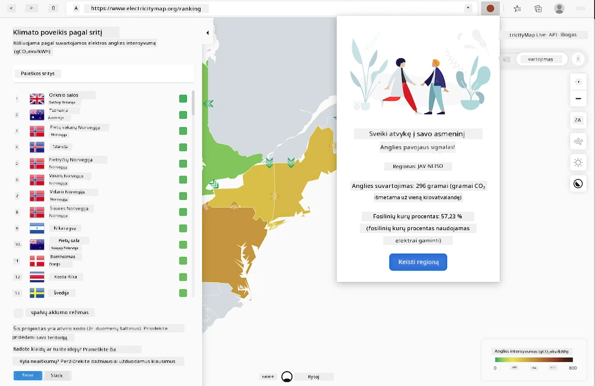
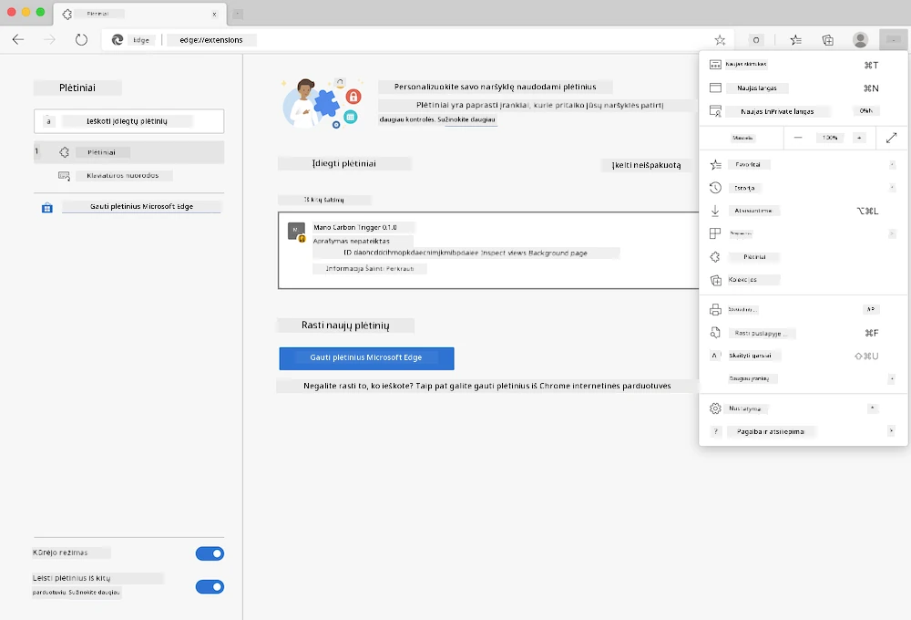

<!--
CO_OP_TRANSLATOR_METADATA:
{
  "original_hash": "9361268ca430b2579375009e1eceb5e5",
  "translation_date": "2025-08-28T11:29:16+00:00",
  "source_file": "5-browser-extension/solution/translation/README.fr.md",
  "language_code": "lt"
}
-->
# Naršyklės plėtinys Carbon Trigger: Baigtas kodas

Naudodami tmrow API C02 Signal, skirtą stebėti elektros energijos suvartojimą, sukurkite naršyklės plėtinį, kuris tiesiogiai jūsų naršyklėje primintų apie jūsų regiono elektros energijos suvartojimą. Šis plėtinys padės jums priimti sprendimus dėl savo veiklos, remiantis šia informacija.



## Pradžia

Jums reikės įdiegti [npm](https://npmjs.com). Atsisiųskite šio kodo kopiją į savo kompiuterio aplanką.

Įdiekite visus reikalingus paketus:

```
npm install
```

Sukurkite plėtinį naudodami webpack

```
npm run build
```

Norėdami įdiegti Edge naršyklėje, naudokite meniu „trys taškai“ viršutiniame dešiniajame naršyklės kampe, kad rastumėte plėtinių skydelį. Iš ten pasirinkite „Įkelti neišpakuotą plėtinį“, kad įkeltumėte naują plėtinį. Atidarykite aplanką „dist“ pagal nurodymus, ir plėtinys bus įkeltas. Norėdami jį naudoti, jums reikės API rakto CO2 Signal API ([gaukite jį el. paštu čia](https://www.co2signal.com/) - įveskite savo el. paštą laukelyje šioje svetainėje) ir [kodo savo regionui](http://api.electricitymap.org/v3/zones), atitinkančio [Elektros žemėlapį](https://www.electricitymap.org/map) (pavyzdžiui, Bostone aš naudoju „US-NEISO“).



Kai API raktas ir regionas bus įvesti į plėtinio sąsają, spalvotas taškas naršyklės plėtinių juostoje turėtų pasikeisti, atspindėdamas jūsų regiono energijos suvartojimą ir suteikdamas jums indikatorių apie energiją naudojančias veiklas, kurias būtų tinkama atlikti. Šios „taškų“ sistemos koncepciją man pasiūlė [plėtinys Energy Lollipop](https://energylollipop.com/) Kalifornijos emisijoms.

---

**Atsakomybės apribojimas**:  
Šis dokumentas buvo išverstas naudojant AI vertimo paslaugą [Co-op Translator](https://github.com/Azure/co-op-translator). Nors siekiame tikslumo, prašome atkreipti dėmesį, kad automatiniai vertimai gali turėti klaidų ar netikslumų. Originalus dokumentas jo gimtąja kalba turėtų būti laikomas autoritetingu šaltiniu. Kritinei informacijai rekomenduojama profesionali žmogaus vertimo paslauga. Mes neprisiimame atsakomybės už nesusipratimus ar klaidingus interpretavimus, atsiradusius naudojant šį vertimą.