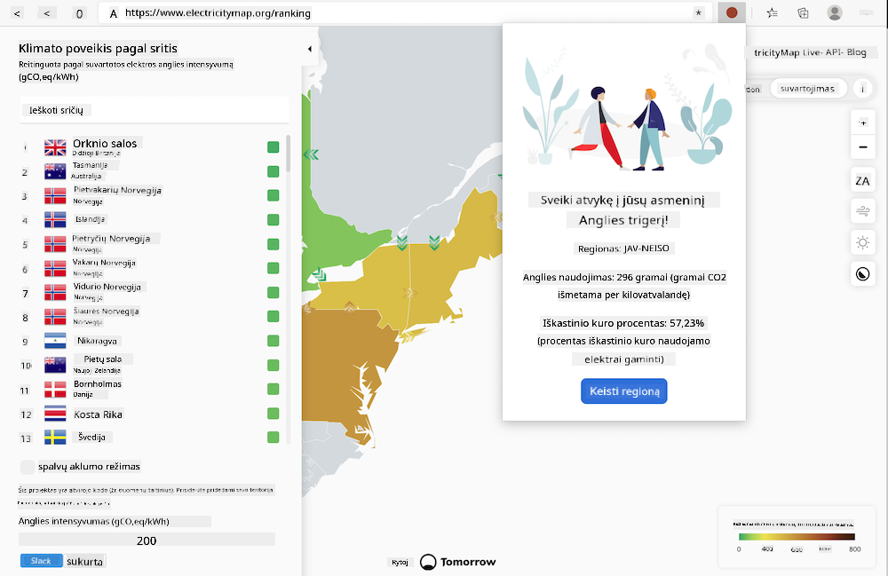

<!--
CO_OP_TRANSLATOR_METADATA:
{
  "original_hash": "dd58ae1b7707034f055718c1b68bc8de",
  "translation_date": "2025-08-28T11:27:28+00:00",
  "source_file": "5-browser-extension/solution/translation/README.hi.md",
  "language_code": "lt"
}
-->
# Anglies dioksido trigerio naršyklės plėtinys: Baigtas kodas

Naudojant tmrow CO2 Signal API elektros energijos naudojimui stebėti, sukurtas naršyklės plėtinys, kuris primena, kiek intensyviai jūsų regione naudojama elektros energija. Naudodami šį plėtinį, galėsite priimti sprendimus dėl savo veiklos, remdamiesi šia informacija.



## Pradžia

Jums reikės įdiegti [npm](https://npmjs.com). Atsisiųskite šio kodo kopiją į savo kompiuterio aplanką.

Įdiekite visus reikalingus paketus:

```
npm install
```

Sukurkite plėtinį naudodami webpack:

```
npm run build
```

Norėdami įdiegti „Edge“ naršyklėje, naudokite naršyklės viršutiniame dešiniajame kampe esančiame meniu „trys taškai“, kad rastumėte plėtinių skydelį. Ten pasirinkite „Įkelti neišpakuotą“ ir atidarykite „dist“ aplanką, kai būsite paraginti. Plėtinys bus įkeltas. Norėdami jį naudoti, jums reikės CO2 Signal API rakto ([gaukite čia el. paštu](https://www.co2snal.com/) – įveskite savo el. paštą laukelyje šiame puslapyje) ir [savo regiono kodo](http://api.electricitymap.org/v3/zones) iš [Electricity Map](https://www.electricitymap.org/map) (pavyzdžiui, Bostone aš naudoju „US-NEISO“).


Kai API raktas ir regionas bus įvesti į plėtinio sąsają, spalvotas taškas naršyklės plėtinių juostoje turėtų pasikeisti, atspindėdamas jūsų regiono energijos naudojimą, ir suteikti jums indikatorių, kokia energijai imli veikla būtų tinkama atlikti. Šios „taško“ sistemos idėją pasiskolinau iš Kalifornijos emisijų [Energy Lollipop plėtinio](https://energylollipop.com/).

---

**Atsakomybės apribojimas**:  
Šis dokumentas buvo išverstas naudojant AI vertimo paslaugą [Co-op Translator](https://github.com/Azure/co-op-translator). Nors siekiame tikslumo, prašome atkreipti dėmesį, kad automatiniai vertimai gali turėti klaidų ar netikslumų. Originalus dokumentas jo gimtąja kalba turėtų būti laikomas autoritetingu šaltiniu. Kritinei informacijai rekomenduojama naudoti profesionalų žmogaus vertimą. Mes neprisiimame atsakomybės už nesusipratimus ar klaidingus interpretavimus, atsiradusius dėl šio vertimo naudojimo.