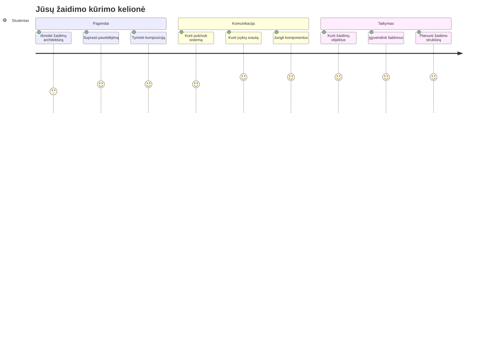
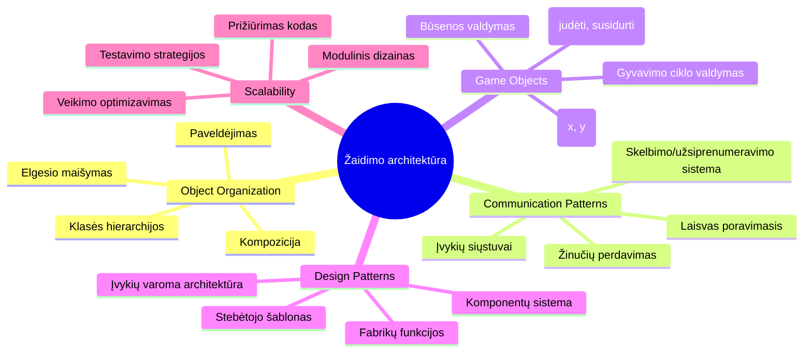
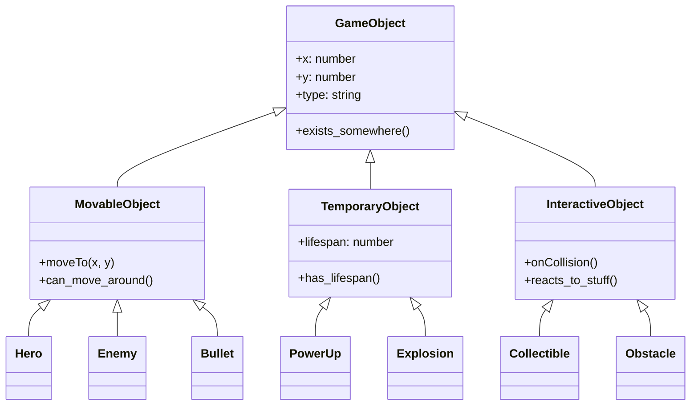
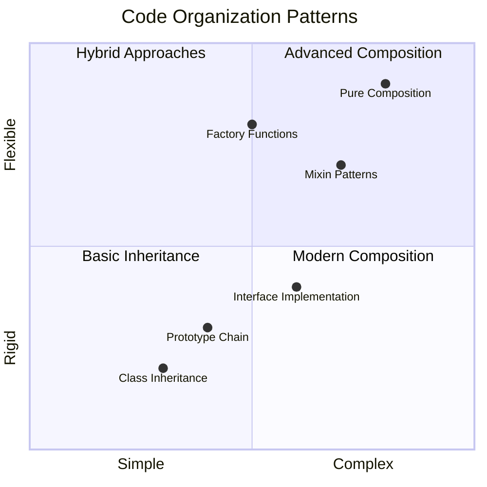
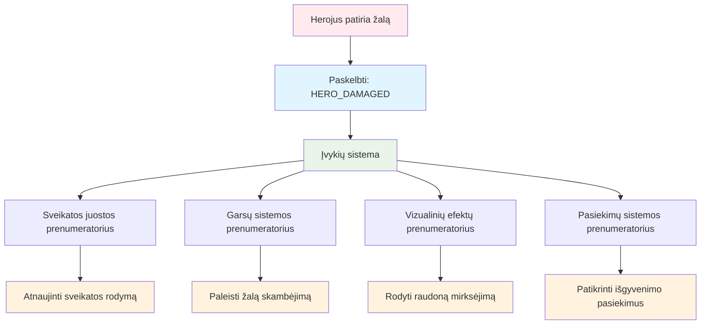
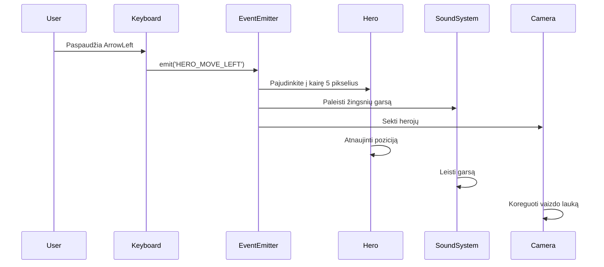
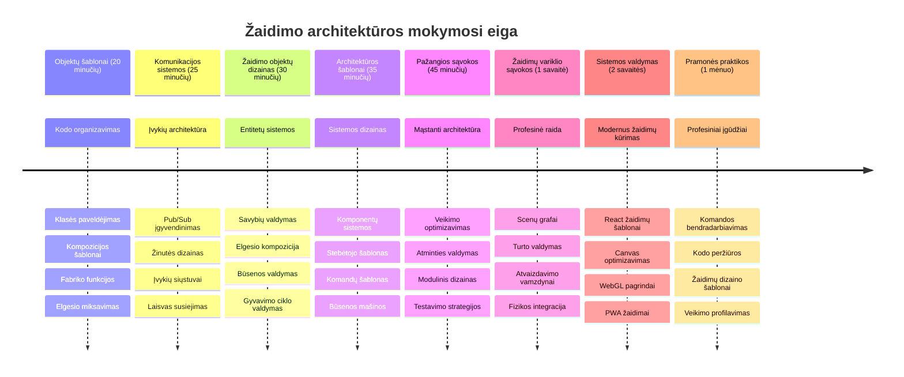

<!--
CO_OP_TRANSLATOR_METADATA:
{
  "original_hash": "a6332a7bb4d0be3bfd24199c83993777",
  "translation_date": "2026-01-07T11:32:37+00:00",
  "source_file": "6-space-game/1-introduction/README.md",
  "language_code": "lt"
}
-->
# Sukurkite kosminį žaidimą 1 dalis: Įvadas




Kaip NASA misijų valdymo centras koordinuoja daugybę sistemų paleidžiant kosminį laivą, mes sukursime kosminį žaidimą, kuris demonstruos, kaip skirtingos programos dalys gali sklandžiai veikti kartu. Kurdamas kažką, ką iš tikrųjų galima žaisti, išmoksite esminių programavimo koncepcijų, taikomų bet kuriame programinės įrangos projekte.

Tyrinėsime du pagrindinius kodo organizavimo būdus: paveldėjimą ir kompoziciją. Tai nėra tik akademinės sąvokos – tai tos pačios struktūros, kurios veikia viską nuo vaizdo žaidimų iki bankų sistemų. Taip pat įgyvendinsime komunikacijos sistemą, vadinamą pub/sub, veikiantį kaip ryšių tinklai kosminiuose laivuose, leidžiant skirtingoms komponentėms dalintis informacija neturint tarpusavio priklausomybių.

Šios serijos pabaigoje suprasite, kaip kurti programas, kurios gali augti ir tobulėti – ar tai būtų žaidimų kūrimas, interneto taikomosios programos ar bet kuri kita programinės įrangos sistema.


## Priešpaskaitos testas

[Priešpaskaitos testas](https://ff-quizzes.netlify.app/web/quiz/29)

## Paveldėjimas ir kompozicija žaidimų kūrime

Kai projektai tampa sudėtingesni, kodo organizavimas tampa kritiškai svarbus. Tai, kas prasidėjo kaip paprastas scenarijus, be tinkamos struktūros gali tapti sunkiai prižiūrima – panašiai kaip Apolono misijos reikėjo kruopščios koordinacijos tarp tūkstančių komponentų.

Tyrinėsime du pagrindinius kodo organizavimo būdus: paveldėjimą ir kompoziciją. Kiekvienas turi savų privalumų, o jų abiejų supratimas padeda pasirinkti tinkamą prieigą skirtingoms situacijoms. Šias koncepcijas iliustruosime savo kosminiame žaidime, kur herojai, priešai, stiprinimai ir kiti objektai turi efektyviai bendrauti.

✅ Viena garsiausių parašytų programavimo knygų yra apie [dizaino šablonus](https://en.wikipedia.org/wiki/Design_Patterns).

Bet kuriame žaidime turite `žaidimo objektus` – interaktyvius elementus, kurie užpildo jūsų žaidimo pasaulį. Herojai, priešai, stiprinimai ir vizualiniai efektai yra žaidimo objektai. Kiekvienas jie egzistuoja tam tikrose ekrano koordinatėse su reikšmėmis `x` ir `y`, panašiai kaip taškų braižymas koordinačių plokštumoje.

Nepaisant vizualių skirtumų, šie objektai dažnai dalijasi pagrindiniais elgesio bruožais:

- **Jie egzistuoja kažkur** – kiekvienas objektas turi x ir y koordinates, kad žaidimas žinotų, kur jį nupiešti
- **Daugelis gali judėti** – herojai bėga, priešai vejasi, kulkos skrieja per ekraną
- **Jie turi gyvavimo trukmę** – kai kurie išlieka amžinai, kiti (pavyzdžiui, sprogimai) pasirodo trumpai ir dingsta
- **Reaguoja į įvykius** – kai kas susiduria, stiprinimai renkami, atnaujinamos sveikatos juostos

✅ Pagalvokite apie žaidimą Pac-Man. Ar galite identifikuoti keturių minėtų objektų tipus šiame žaidime?


### Elgesio išraiška per kodą

Dabar, kai suprantate bendrus žaidimo objektų elgesio bruožus, pažiūrėkime, kaip juos įgyvendinti JavaScript kalboje. Objektų elgesys gali būti išreiškiamas per metodus, priskirtus klasėms ar atskiriems objektams, ir yra keletas pasirinkimų.

**Klasių pagrindu paremtas požiūris**

Klasės ir paveldėjimas suteikia struktūruotą būdą organizuoti žaidimo objektus. Kaip ir taksonominėje klasifikacijoje, sukurtos Carlo Linėjaus, pradedate nuo bazinės klasės su bendromis savybėmis, tada sukuriate specializuotas klases, kurios paveldi šias pagrindines savybes ir prideda specifines galimybes.

✅ Paveldėjimas yra svarbi sąvoka. Sužinokite daugiau MDN straipsnyje apie [paveldėjimą](https://developer.mozilla.org/docs/Web/JavaScript/Inheritance_and_the_prototype_chain).

Štai kaip galite įgyvendinti žaidimo objektus naudodami klases ir paveldėjimą:

```javascript
// 1 veiksmas: Sukurkite pagrindinę GameObject klasę
class GameObject {
  constructor(x, y, type) {
    this.x = x;
    this.y = y;
    this.type = type;
  }
}
```

**Šį procesą suskaidykime žingsnis po žingsnio:**
- Kuriame pagrindinį šabloną, kurį gali naudoti kiekvienas žaidimo objektas
- Konstruktorius išsaugo, kur objektas yra (`x`, `y`) ir kokio tipo jis yra
- Tai tampa pamatu, ant kurio visi jūsų žaidimo objektai kūriasi

```javascript
// 2 žingsnis: Pridėkite judėjimo galimybę per paveldėjimą
class Movable extends GameObject {
  constructor(x, y, type) {
    super(x, y, type); // Iškvieskite tėvo konstruktorių
  }

  // Pridėkite galimybę pereiti į naują poziciją
  moveTo(x, y) {
    this.x = x;
    this.y = y;
  }
}
```

**Aukščiau esame:**
- **Išplėtę** GameObject klasę, kad pridėtume judėjimo funkcionalumą
- **Iškvietę** tėvinį konstruktorių naudodami `super()`, kad inicijuotume paveldėtas savybes
- **Pridėję** `moveTo()` metodą, kuris atnaujina objekto poziciją

```javascript
// 3 žingsnis: Sukurkite konkrečių žaidimo objektų tipus
class Hero extends Movable {
  constructor(x, y) {
    super(x, y, 'Hero'); // Nustatykite tipą automatiškai
  }
}

class Tree extends GameObject {
  constructor(x, y) {
    super(x, y, 'Tree'); // Medžiams nereikia judėti
  }
}

// 4 žingsnis: Naudokite savo žaidimo objektus
const hero = new Hero(0, 0);
hero.moveTo(5, 5); // Herojus gali judėti!

const tree = new Tree(10, 15);
// tree.moveTo() sukeltų klaidą - medžiai negali judėti
```

**Šių koncepcijų supratimas:**
- **Sukuria** specializuotus objektų tipus, kurie paveldi tinkamus elgesius
- **Demonstruoja**, kaip paveldėjimas leidžia pasirinktinius funkcijų įtraukimus
- **Rodo**, kad herojai gali judėti, o medžiai lieka statiški
- **Iliustruoja**, kaip klasių hierarchija neleidžia atlikti netinkamų veiksmų

✅ Skirkite kelias minutes ir perkūrkite Pac-Man herojaus (pvz., Inky, Pinky ar Blinky) programavimą JavaScript kalba.

**Kompozicijos požiūris**

Kompozicija laikosi modulinio dizaino filosofijos, panašios į tai, kaip inžinieriai suprojektuoja kosminius laivus su keičiamais komponentais. Vietoje paveldėjimo iš tėvų klasės, jūs derinate specifinius elgesius, kad sukurtumėte objektus su tik reikalingomis funkcijomis. Šis požiūris siūlo lankstumą be griežtų hierarchinių apribojimų.

```javascript
// 1 žingsnis: Sukurkite bazinius elgesio objektus
const gameObject = {
  x: 0,
  y: 0,
  type: ''
};

const movable = {
  moveTo(x, y) {
    this.x = x;
    this.y = y;
  }
};
```

**Šis kodas daro štai ką:**
- **Apibrėžia** bazinį `gameObject` su pozicijos ir tipo savybėmis
- **Sukuria** atskirą `movable` elgesio objektą su judėjimo funkcionalumu
- **Atskiria** atsakomybes, išlaikydamas pozicijos duomenis ir judėjimo logiką nepriklausomas

```javascript
// 2 žingsnis: Sudėkite objektus derindami elgesius
const movableObject = { ...gameObject, ...movable };

// 3 žingsnis: Sukurkite gamyklos funkcijas skirtingiems objektų tipams
function createHero(x, y) {
  return {
    ...movableObject,
    x,
    y,
    type: 'Hero'
  };
}

function createStatic(x, y, type) {
  return {
    ...gameObject,
    x,
    y,
    type
  };
}
```

**Aukščiau esame:**
- **Sujungę** bazinio objekto savybes su judėjimo elgesiu naudojant spread sintaksę
- **Sukūrę** fabrikos funkcijas, kurios grąžina pritaikytus objektus
- **Suteikę** lankstų objektų kūrimą be griežtų klasių hierarchijų
- **Leidę** objektams turėti būtent tuos elgesius, kurių reikia

```javascript
// 4 žingsnis: Sukurkite ir naudokite savo sudėtinius objektus
const hero = createHero(10, 10);
hero.moveTo(5, 5); // Veikia puikiai!

const tree = createStatic(0, 0, 'Tree');
// tree.moveTo() nėra apibrėžta - judėjimo elgesys nebuvo sudarytas
```

**Svarbiausi dalykai:**
- **Komponuoja** objektus maišant elgesius, o ne paveldint juos
- **Teikia** daugiau lankstumo nei griežtos paveldėjimo hierarchijos
- **Leidžia** objektams turėti būtent reikalingas savybes
- **Naudoja** šiuolaikinę JavaScript spread sintaksę švariam objektų sujungimui
```

**Which Pattern Should You Choose?**

**Which Pattern Should You Choose?**



> 💡 **Patarimas Pro**: Abu šablonai turi savo vietą šiuolaikiniame JavaScript kūrime. Klasės puikiai tinka aiškioms hierarchijoms, o kompozicija sužiba, kai reikia maksimalios lankstumo.
> 
**Štai kada naudoti kiekvieną požiūrį:**
- **Rinkitės** paveldėjimą, kai turite aiškias „yra-objektas“ (angl. is-a) ryšius (pvz., Herojus *yra* Judantis objektas)
- **Naudokite** kompoziciją, kai turite „turi-objektą“ (angl. has-a) ryšius (pvz., Herojus *turi* judėjimo galimybes)
- **Apsvarstykite** savo komandos pageidavimus ir projekto reikalavimus
- **Prisiminkite**, jog galite derinti abu požiūrius toje pačioje programoje

### 🔄 **Pedagoginė savitikra**
**Objektų organizacijos suvokimas**: Prieš pereidami prie komunikacijos šablonų, užtikrinkite, kad galite:
- ✅ Paaiškinti skirtumą tarp paveldėjimo ir kompozicijos
- ✅ Nustatyti, kada naudoti klases ar fabrikos funkcijas
- ✅ Suprasti, kaip veikia `super()` raktinis žodis paveldėjime
- ✅ Pripažinti abiejų požiūrių naudą žaidimų kūrime

**Greitas savitestavimas**: Kaip sukurtumėte Skraidantį priešą, kuris gali ir judėti, ir skraidyti?
- **Paveldėjimo požiūris**: `class FlyingEnemy extends Movable`
- **Kompozicijos požiūris**: `{ ...movable, ...flyable, ...gameObject }`

**Tikro pasaulio ryšys**: Šie šablonai taikomi visur:
- **React komponentai**: Props (kompozicija) vs klasių paveldėjimas
- **Žaidimų varikliai**: Entity-component sistemos naudoja kompoziciją
- **Mobiliosios programėlės**: UI karkasai dažnai naudoja paveldėjimo hierarchijas

## Komunikacijos šablonai: Pub/Sub sistema

Kai programos sudėtingėja, sunku valdyti komunikaciją tarp komponentų. Išleidimo-prenumeratos (pub/sub) modelis sprendžia šią problemą, naudodamas principus, panašius į radijo transliaciją – vienas siųstuvas gali pasiekti daugelį gavėjų, nežinodamas, kas klauso.

Įsivaizduokite, kas nutinka, kai herojus gauna žalą: atnaujinama sveikatos juosta, leidžiamas garsas, rodoma vizualinė reakcija. Užuot tiesiogiai susiejus herojų su šiomis sistemomis, pub/sub leidžia herojui paskelbti žinutę „gavau žalą“. Bet kuri sistema, kuri nori reaguoti, gali užsiprenumeruoti šio žinučių tipo ir tinkamai atsakyti.

✅ Pub/Sub reiškia 'publish-subscribe' (išleisti-prenumeruoti)


### Pub/Sub architektūros supratimas

Pub/sub modelis išlaiko skirtingas jūsų programos dalis silpnai susietas, reiškiančias, kad jos gali veikti kartu, nesant tiesioginėms priklausomybėms. Šis atskyrimas padaro jūsų kodą lengviau prižiūrimą, testuojamą ir lankstesnį pokyčiams.

**Svarbiausi veikėjai pub/sub:**
- **Žinutės** – Paprasti tekstiniai žymekliai, pvz., `'PLAYER_SCORED'`, apibūdinantys įvykį (ir papildoma informacija)
- **Išleidėjai** – Objektai, kurie paskelbia „Įvyko kažkas!“ visiems, kurie klauso
- **Prenumeratoriai** – Objektai, kurie sako „Man svarbus šis įvykis“ ir reaguoja, kai jis įvyksta
- **Įvykių sistema** – Tarpininkas, užtikrinantis, kad žinutės pasiektų tinkamus klausytojus

### Įvykių sistemos kūrimas

Sukurkime paprastą bet galingą įvykių sistemą, kuri demonstruos šias koncepcijas:

```javascript
// 1 žingsnis: Sukurkite EventEmitter klasę
class EventEmitter {
  constructor() {
    this.listeners = {}; // Saugo visus įvykių klausytojus
  }
  
  // Užregistruokite klausytoją konkretaus pranešimo tipui
  on(message, listener) {
    if (!this.listeners[message]) {
      this.listeners[message] = [];
    }
    this.listeners[message].push(listener);
  }
  
  // Išsiųskite pranešimą visiems užregistruotiems klausytojams
  emit(message, payload = null) {
    if (this.listeners[message]) {
      this.listeners[message].forEach(listener => {
        listener(message, payload);
      });
    }
  }
}
```

**Išskaidymas, kas čia vyksta:**
- **Sukuriama** centrinė įvykių valdymo sistema, naudojant paprastą klasę
- **Saugo** klausytojus objekte, sugrupuotus pagal žinutės tipą
- **Registruoja** naujus klausytojus naudojant `on()` metodą
- **Skleidžia** žinutes visiems susidomėjusiems klausytojams naudojant `emit()`
- **Palaiko** papildomus duomenų krovinius perduodant svarbią informaciją

### Sudedame viską į vieną: praktinis pavyzdys

Gerai, pažiūrėkime tai veikiančią! Sukursime paprastą judėjimo sistemą, kuri parodo, kaip švariai ir lankstiai veikia pub/sub:

```javascript
// 1 žingsnis: Apibrėžkite savo žinutės tipus
const Messages = {
  HERO_MOVE_LEFT: 'HERO_MOVE_LEFT',
  HERO_MOVE_RIGHT: 'HERO_MOVE_RIGHT',
  ENEMY_SPOTTED: 'ENEMY_SPOTTED'
};

// 2 žingsnis: Sukurkite savo įvykių sistemą ir žaidimo objektus
const eventEmitter = new EventEmitter();
const hero = createHero(0, 0);
```

**Šis kodas daro štai ką:**
- **Apibrėžia** konstantų objektą, kad išvengtų rašybos klaidų žinučių pavadinimuose
- **Sukuria** įvykio išleidėjo egzempliorių, apdorojantį visą komunikaciją
- **Inicijuoja** herojaus objektą pradinėje pozicijoje

```javascript
// 3 žingsnis: Nustatykite įvykių klausytojus (abonentus)
eventEmitter.on(Messages.HERO_MOVE_LEFT, () => {
  hero.moveTo(hero.x - 5, hero.y);
  console.log(`Hero moved to position: ${hero.x}, ${hero.y}`);
});

eventEmitter.on(Messages.HERO_MOVE_RIGHT, () => {
  hero.moveTo(hero.x + 5, hero.y);
  console.log(`Hero moved to position: ${hero.x}, ${hero.y}`);
});
```

**Aukščiau esame:**
- **Užregistravę** įvykių klausytojus, kurie reaguoja į judėjimo žinutes
- **Atnaujinę** herojaus poziciją pagal judėjimo kryptį
- **Pridėję** konsolės žurnalą herojaus pozicijos pokyčiams sekti
- **Atskyrę** judėjimo logiką nuo įvesties apdorojimo

```javascript
// 4 žingsnis: Prijunkite klaviatūros įvestį prie įvykių (leidėjų)
window.addEventListener('keydown', (event) => {
  switch(event.key) {
    case 'ArrowLeft':
      eventEmitter.emit(Messages.HERO_MOVE_LEFT);
      break;
    case 'ArrowRight':
      eventEmitter.emit(Messages.HERO_MOVE_RIGHT);
      break;
  }
});
```

**Šių koncepcijų supratimas:**
- **Jungia** klaviatūros įvestį su žaidimo įvykiais be griežto susiejimo
- **Leidžia** įvesties sistemai komunikuoti su žaidimo objektais netiesiogiai
- **Suteikia** galimybę kelioms sistemoms reaguoti į tuos pačius klaviatūros įvykius
- **Palengvina** klavišų priskyrimų keitimą ar naujų įvesties metodų pridėjimą


> 💡 **Patarimas Pro**: Šio modelio grožis yra lankstumas! Galite lengvai pridėti garso efektus, ekrano drebėjimą arba dalelių efektus tiesiog pridėję daugiau įvykių klausytojų – nereikia keisti esamo klaviatūros ar judėjimo kodo.
> 
**Štai kodėl jums patiks ši prieiga:**
- Naujos funkcijos pridedamos itin lengvai – tiesiog klausykite jums aktualių įvykių
- Keletas dalykų gali reaguoti į tą patį įvykį nesipainiodami
- Testavimas tampa daug paprastesnis, nes kiekviena dalis veikia nepriklausomai
- Kai kas nors sugenda, tiksliai žinote, kur ieškoti

### Kodėl Pub/Sub efektyviai skalūruojasi

Pub/sub modelis išlaiko paprastumą, kai programos sudėtingėja. Nesvarbu, ar valdote dešimtis priešų, dinamiškus UI atnaujinimus ar garso sistemas, modelis apsaugo nuo struktūrinių pokyčių poreikio. Naujos funkcijos integruojamos į esamą įvykių sistemą nekeisdamos jau sukurto funkcionalumo.

> ⚠️ **Dažna klaida**: Nenukrypkite į per daug specifinių žinučių tipų ankstyvame etape. Pradėkite nuo plačių kategorijų ir jas detalizuokite, kai žaidimo poreikiai taps aiškesni.
> 
**Geriausios praktikos:**
- **Grupuokite** susijusias žinutes į logines kategorijas
- **Naudokite** aprašomuosius pavadinimus, aiškiai nurodančius įvykį
- **Laikykite** žinutės krovinius paprastais ir tiksliais
- **Dokumentuokite** žinučių tipus komandinei darbui

### 🔄 **Pedagoginė savitikra**
**Įvykių varomos architektūros supratimas**: Patikrinkite savo žinias apie visą sistemą:
- ✅ Kaip pub/sub modelis neleidžia komponentams būti tiesiogiai susietiems?
- ✅ Kodėl su įvykių varoma architektūra lengviau pridėti naujas funkcijas?
- ✅ Kokia yra EventEmitter vaidmuo komunikacijos sraute?
- ✅ Kaip žinučių konstantos padeda išvengti klaidų ir gerina priežiūrą?

**Dizaino iššūkis**: Kaip tvarkytumėte šias žaidimo situacijas su pub/sub?
1. **Priešas miršta**: Atnaujinti taškus, paleisti garsą, sugeneruoti stiprinimą, pašalinti iš ekrano
2. **Lygis baigtas**: Sustabdyti muziką, parodyti UI, išsaugoti pažangą, įkelti kitą lygį
3. **Stiprinimas surinktas**: Pagerinti gebėjimus, atnaujinti UI, paleisti efektą, pradėti laikmatį

**Profesinis ryšys**: Šis modelis pasireiškia:
- **Frontend karkasuose**: React/Vue įvykių sistemos
- **Backend paslaugose**: Mikroservisų komunikacija
- **Žaidimų varikliuose**: Unity įvykių sistema
- **Mobilioje plėtroje**: iOS/Android pranešimų sistemos

---

## GitHub Copilot Agent Iššūkis 🚀

Naudokite Agent režimą, kad įvykdytumėte šį iššūkį:

**Aprašymas:** Sukurkite paprastą žaidimo objektų sistemą, naudodami tiek paveldėjimą, tiek pub/sub modelį. Įgyvendinkite bazinį žaidimą, kuriame skirtingi objektai gali komunikuoti per įvykius, nesusidurdami tiesiogiai vieni su kitais.

**Užduotis:** Sukurkite JavaScript žaidimo sistemą su šiomis sąlygomis: 1) Sukurkite bazinę GameObject klasę su x, y koordinatėmis ir tipo savybe. 2) Sukurkite Hero klasę, kuri paveldi GameObject ir gali judėti. 3) Sukurkite Enemy klasę, kuri paveldi GameObject ir gali vytis herojų. 4) Įgyvendinkite EventEmitter klasę pub/sub modeliui. 5) Nustatykite įvykių klausytojus taip, kad kai herojus juda, artimi priešai gauna „HERO_MOVED“ įvykį ir atnaujina savo poziciją, judėdami link herojaus. Įtraukite console.log pranešimus, rodydami komunikaciją tarp objektų.

Daugiau apie [agent režimą](https://code.visualstudio.com/blogs/2025/02/24/introducing-copilot-agent-mode) skaitykite čia.

## 🚀 Iššūkis
Apsvarstykite, kaip pub-sub modelis gali pagerinti žaidimo architektūrą. Nurodykite, kurie komponentai turėtų skleisti įvykius ir kaip sistema turėtų į juos reaguoti. Sukurkite žaidimo koncepciją ir nusistatykite komunikacijos modelius tarp jos komponentų.

## Po paskaitos viktorina

[Po paskaitos viktorina](https://ff-quizzes.netlify.app/web/quiz/30)

## Peržiūra ir savarankiškas mokymasis

Sužinokite daugiau apie Pub/Sub [skaitydami apie tai](https://docs.microsoft.com/azure/architecture/patterns/publisher-subscriber/?WT.mc_id=academic-77807-sagibbon).

### ⚡ **Ką galite padaryti per artimiausias 5 minutes**
- [ ] Atidarykite bet kurį HTML5 žaidimą internete ir peržiūrėkite jo kodą naudodami DevTools
- [ ] Sukurkite paprastą HTML5 Canvas elementą ir nupieškite paprastą figūrą
- [ ] Išbandykite `setInterval`, kad sukurtumėte paprastą animacijos ciklą
- [ ] Išnagrinėkite Canvas API dokumentaciją ir išbandykite piešimo metodą

### 🎯 **Ką galite pasiekti per šią valandą**
- [ ] Atlikite po pamokos viktoriną ir supraskite žaidimų kūrimo koncepcijas
- [ ] Nustatykite žaidimo projekto struktūrą su HTML, CSS ir JavaScript failais
- [ ] Sukurkite pagrindinį žaidimo ciklą, kuris nuolat atnaujina ir atvaizduoja
- [ ] Nupieškite pirmuosius žaidimo spritus ant drobės
- [ ] Įgyvendinkite bazinį turinio užkrovimą – vaizdus ir garsus

### 📅 **Jūsų savaitės žaidimo kūrimas**
- [ ] Sukurkite pilną kosmoso žaidimą su visomis numatytomis funkcijomis
- [ ] Pridėkite kokybišką grafiką, garso efektus ir sklandžias animacijas
- [ ] Įgyvendinkite žaidimo būsenas (pradžios ekranas, žaidimo eiga, žaidimo pabaiga)
- [ ] Sukurkite taškų skaičiavimo sistemą ir žaidėjo pažangos sekimą
- [ ] Padarykite žaidimą tinkamą naudoti įvairiuose įrenginiuose ir patogų visiems
- [ ] Dalinkitės žaidimu internete ir rinkite žaidėjų atsiliepimus

### 🌟 **Jūsų mėnesio trukmės žaidimų kūrimas**
- [ ] Sukurkite keletą žaidimų, tyrinėdami įvairius žanrus ir mechanikas
- [ ] Išmokite žaidimų kūrimo sistemą, pavyzdžiui, Phaser arba Three.js
- [ ] Prisidėkite prie atviro kodo žaidimų kūrimo projektų
- [ ] Išmokite pažangias žaidimų programavimo schemas ir optimizavimo metodus
- [ ] Sukurkite portfolio, demonstruojantį jūsų žaidimų kūrimo įgūdžius
- [ ] Mokykite kitus, besidominčius žaidimų kūrimu ir interaktyvia medija

## 🎯 Jūsų žaidimų kūrimo meistriškumo laiko juosta


### 🛠️ Jūsų žaidimų architektūros įrankių rinkinys – santrauka

Baigę šią pamoką jūs jau turite:
- **Dizaino šablonų meistriškumą**: Paveldėjimo ir kompozicijos kompromisų supratimą
- **Įvykių varomą architektūrą**: Pub/sub įgyvendinimą mastelio keitimo komunikacijai
- **Objektinio dizaino**: Klasės hierarchijas ir elgesio kompoziciją
- **Modernų JavaScript**: Fabrikacijos funkcijas, sklaidą (spread) ir ES6+ šablonus
- **Mastelio keičiamą architektūrą**: Laisvai sujungtų modulių dizaino principus
- **Žaidimų kūrimo pagrindus**: Entiteto sistemas ir komponentų šablonus
- **Profesionalius šablonus**: Pramonės standartus kodų organizavimui

**Praktinės taikymo sritys**: Šie šablonai tiesiogiai taikomi:
- **Frontend karkasuose**: React/Vue komponentų architektūroje ir būsenos valdyme
- **Backend paslaugose**: Mikropaslaugų komunikacijoje ir įvykių varomose sistemose
- **Mobiliosiose aplikacijose**: iOS/Android programų architektūroje ir pranešimų sistemose
- **Žaidimų varikliuose**: Unity, Unreal ir internetinių žaidimų kūrime
- **Verslo programinėje įrangoje**: Įvykių saugyklose ir paskirstytų sistemų dizaine
- **API dizaine**: REST paslaugose ir realaus laiko komunikacijoje

**Įgyti profesionalūs įgūdžiai**: Dabar jūs galite:
- **Projektuoti** mastelio keičiamas programinės įrangos architektūras naudodami patikrintas schemas
- **Įgyvendinti** įvykių pagrindu veikiančias sistemas, kurios apdoroja sudėtingas sąveikas
- **Pasirinkti** tinkamas kodų organizavimo strategijas skirtingoms situacijoms
- **Debuginti** ir efektyviai palaikyti laisvai sujungtas sistemas
- **Komunikuoti** techninius sprendimus naudojant pramonės standartų terminus

**Kitas lygis**: Jūs esate pasiruošę įgyvendinti šias schemas tikrame žaidime, tirti pažangias žaidimų kūrimo temas arba taikyti šias architektūros koncepcijas internetinėse programose!

🌟 **Pasiekimas atrakintas**: Jūs įvaldėte pagrindines programinės įrangos architektūros schemas, kurios maitina viską nuo paprastų žaidimų iki sudėtingų verslo sistemų!

## Užduotis

[Senarijų žaidimui kūrimas](assignment.md)

---

<!-- CO-OP TRANSLATOR DISCLAIMER START -->
**Atsakomybės apribojimas**:  
Šis dokumentas buvo išverstas naudojant dirbtinio intelekto vertimo paslaugą [Co-op Translator](https://github.com/Azure/co-op-translator). Nors stengiamės užtikrinti tikslumą, prašome atkreipti dėmesį, kad automatiniai vertimai gali turėti klaidų ar netikslumų. Originalus dokumentas gimtąja kalba laikomas autoritetingu šaltiniu. Svarbiai informacijai rekomenduojamas profesionalus žmogaus vertimas. Mes neatsakome už bet kokius nesusipratimus ar klaidingas interpretacijas, kylančias naudojant šį vertimą.
<!-- CO-OP TRANSLATOR DISCLAIMER END -->