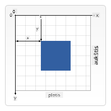

<!--
CO_OP_TRANSLATOR_METADATA:
{
  "original_hash": "056641280211e52fd0adb81b6058ec55",
  "translation_date": "2025-08-29T16:51:51+00:00",
  "source_file": "6-space-game/2-drawing-to-canvas/README.md",
  "language_code": "lt"
}
-->
# Sukurkite kosminį žaidimą, 2 dalis: Herojaus ir monstrų piešimas ant drobės

## Klausimai prieš paskaitą

[Prieš paskaitos klausimynas](https://ff-quizzes.netlify.app/web/quiz/31)

## Drobė (Canvas)

Drobė yra HTML elementas, kuris pagal nutylėjimą neturi jokio turinio – tai tuščias lapas. Norėdami ką nors pridėti, turite ant jo piešti.

✅ Skaitykite [daugiau apie Canvas API](https://developer.mozilla.org/docs/Web/API/Canvas_API) MDN svetainėje.

Štai kaip ji paprastai deklaruojama kaip puslapio kūno dalis:

```html
<canvas id="myCanvas" width="200" height="100"></canvas>
```

Aukščiau nustatome `id`, `width` ir `height`.

- `id`: nustatykite, kad galėtumėte gauti nuorodą, kai reikės su ja sąveikauti.
- `width`: tai elemento plotis.
- `height`: tai elemento aukštis.

## Paprastų geometrinių figūrų piešimas

Drobė naudoja Dekarto koordinačių sistemą piešimui. Ji naudoja x ir y ašis, kad nurodytų, kur kažkas yra. Koordinatė `0,0` yra viršutiniame kairiajame kampe, o apatinis dešinysis kampas atitinka jūsų nurodytą drobės PLOTĮ ir AUKŠTĮ.

  
> Vaizdas iš [MDN](https://developer.mozilla.org/docs/Web/API/Canvas_API/Tutorial/Drawing_shapes)

Norėdami piešti ant drobės elemento, turite atlikti šiuos veiksmus:

1. **Gauti nuorodą** į drobės elementą.  
2. **Gauti nuorodą** į Konteksto elementą, kuris yra drobės elemente.  
3. **Atlikti piešimo operaciją** naudojant konteksto elementą.

Kodas, atitinkantis aukščiau nurodytus veiksmus, paprastai atrodo taip:

```javascript
// draws a red rectangle
//1. get the canvas reference
canvas = document.getElementById("myCanvas");

//2. set the context to 2D to draw basic shapes
ctx = canvas.getContext("2d");

//3. fill it with the color red
ctx.fillStyle = 'red';

//4. and draw a rectangle with these parameters, setting location and size
ctx.fillRect(0,0, 200, 200) // x,y,width, height
```

✅ Canvas API daugiausia dėmesio skiria 2D formoms, tačiau taip pat galite piešti 3D elementus tinklalapyje; tam galite naudoti [WebGL API](https://developer.mozilla.org/docs/Web/API/WebGL_API).

Naudodami Canvas API galite piešti įvairius dalykus, tokius kaip:

- **Geometrinės figūros** – jau parodėme, kaip piešti stačiakampį, tačiau galite piešti daug daugiau.  
- **Tekstas** – galite piešti tekstą su bet kokiu šriftu ir spalva.  
- **Vaizdai** – galite piešti vaizdą, naudodami tokį failą kaip .jpg ar .png.  

✅ Išbandykite! Jūs jau žinote, kaip piešti stačiakampį, ar galite nupiešti apskritimą puslapyje? Pažvelkite į įdomius Canvas piešinius CodePen svetainėje. Štai [ypač įspūdingas pavyzdys](https://codepen.io/dissimulate/pen/KrAwx).

## Vaizdo išteklio įkėlimas ir piešimas

Vaizdo išteklius įkeliamas sukuriant `Image` objektą ir nustatant jo `src` savybę. Tada klausomasi `load` įvykio, kad žinotumėte, kada jis paruoštas naudoti. Kodas atrodo taip:

### Išteklių įkėlimas

```javascript
const img = new Image();
img.src = 'path/to/my/image.png';
img.onload = () => {
  // image loaded and ready to be used
}
```

### Išteklių įkėlimo šablonas

Rekomenduojama aukščiau pateiktą kodą įdėti į tokią konstrukciją, kad būtų lengviau naudoti ir manipuliuoti tik tada, kai jis visiškai įkeltas:

```javascript
function loadAsset(path) {
  return new Promise((resolve) => {
    const img = new Image();
    img.src = path;
    img.onload = () => {
      // image loaded and ready to be used
      resolve(img);
    }
  })
}

// use like so

async function run() {
  const heroImg = await loadAsset('hero.png')
  const monsterImg = await loadAsset('monster.png')
}

```

Norėdami piešti žaidimo išteklius ekrane, jūsų kodas atrodytų taip:

```javascript
async function run() {
  const heroImg = await loadAsset('hero.png')
  const monsterImg = await loadAsset('monster.png')

  canvas = document.getElementById("myCanvas");
  ctx = canvas.getContext("2d");
  ctx.drawImage(heroImg, canvas.width/2,canvas.height/2);
  ctx.drawImage(monsterImg, 0,0);
}
```

## Dabar laikas pradėti kurti savo žaidimą

### Ką kurti

Sukurkite tinklalapį su Canvas elementu. Jis turėtų rodyti juodą ekraną `1024*768`. Mes pateikėme jums du vaizdus:

- Herojaus laivas  

   

- 5*5 monstrų  

   

### Rekomenduojami žingsniai pradėti kūrimą

Raskite failus, kurie buvo sukurti jums `your-work` aplanke. Jame turėtų būti:

```bash
-| assets
  -| enemyShip.png
  -| player.png
-| index.html
-| app.js
-| package.json
```

Atidarykite šio aplanko kopiją Visual Studio Code programoje. Jums reikia turėti vietinę kūrimo aplinką, geriausia su Visual Studio Code, NPM ir Node įdiegtais. Jei jūsų kompiuteryje nėra nustatyto `npm`, [štai kaip tai padaryti](https://www.npmjs.com/get-npm).

Pradėkite savo projektą, pereidami į `your_work` aplanką:

```bash
cd your-work
npm start
```

Aukščiau pateiktas veiksmas paleis HTTP serverį adresu `http://localhost:5000`. Atidarykite naršyklę ir įveskite šį adresą. Šiuo metu tai tuščias puslapis, bet tai pasikeis.

> Pastaba: norėdami matyti pakeitimus ekrane, atnaujinkite naršyklę.

### Pridėkite kodą

Pridėkite reikiamą kodą į `your-work/app.js`, kad išspręstumėte šiuos uždavinius:

1. **Nupieškite** drobę su juodu fonu  
   > patarimas: pridėkite dvi eilutes po atitinkamu TODO `/app.js` faile, nustatydami `ctx` elementą juodai spalvai, o viršutinius/kairiuosius koordinates – 0,0, o aukštį ir plotį – lyg drobės dydžiui.  
2. **Įkelkite** tekstūras  
   > patarimas: pridėkite žaidėjo ir priešo vaizdus naudodami `await loadTexture` ir perduodami vaizdo kelią. Jų dar nematysite ekrane!  
3. **Nupieškite** herojų ekrano centre apatinėje pusėje  
   > patarimas: naudokite `drawImage` API, kad nupieštumėte heroImg ekrane, nustatydami `canvas.width / 2 - 45` ir `canvas.height - canvas.height / 4)`.  
4. **Nupieškite** 5*5 monstrus  
   > patarimas: dabar galite atkomentuoti kodą, kad nupieštumėte priešus ekrane. Tada eikite į `createEnemies` funkciją ir ją užbaikite.

   Pirmiausia nustatykite keletą konstantų:

    ```javascript
    const MONSTER_TOTAL = 5;
    const MONSTER_WIDTH = MONSTER_TOTAL * 98;
    const START_X = (canvas.width - MONSTER_WIDTH) / 2;
    const STOP_X = START_X + MONSTER_WIDTH;
    ```

   tada sukurkite ciklą, kad nupieštumėte monstrų masyvą ekrane:

    ```javascript
    for (let x = START_X; x < STOP_X; x += 98) {
        for (let y = 0; y < 50 * 5; y += 50) {
          ctx.drawImage(enemyImg, x, y);
        }
      }
    ```

## Rezultatas

Galutinis rezultatas turėtų atrodyti taip:


## Sprendimas

Pabandykite išspręsti patys, tačiau jei užstrigsite, peržiūrėkite [sprendimą](../../../../6-space-game/2-drawing-to-canvas/solution/app.js).

---

## 🚀 Iššūkis

Jūs išmokote piešti naudodami 2D orientuotą Canvas API; pažiūrėkite į [WebGL API](https://developer.mozilla.org/docs/Web/API/WebGL_API) ir pabandykite nupiešti 3D objektą.

## Klausimai po paskaitos

[Po paskaitos klausimynas](https://ff-quizzes.netlify.app/web/quiz/32)

## Apžvalga ir savarankiškas mokymasis

Sužinokite daugiau apie Canvas API [skaitydami apie tai](https://developer.mozilla.org/docs/Web/API/Canvas_API).

## Užduotis

[Pažaiskite su Canvas API](assignment.md)

---

**Atsakomybės apribojimas**:  
Šis dokumentas buvo išverstas naudojant AI vertimo paslaugą [Co-op Translator](https://github.com/Azure/co-op-translator). Nors siekiame tikslumo, prašome atkreipti dėmesį, kad automatiniai vertimai gali turėti klaidų ar netikslumų. Originalus dokumentas jo gimtąja kalba turėtų būti laikomas autoritetingu šaltiniu. Kritinei informacijai rekomenduojama naudoti profesionalų žmogaus vertimą. Mes neprisiimame atsakomybės už nesusipratimus ar klaidingus interpretavimus, atsiradusius dėl šio vertimo naudojimo.