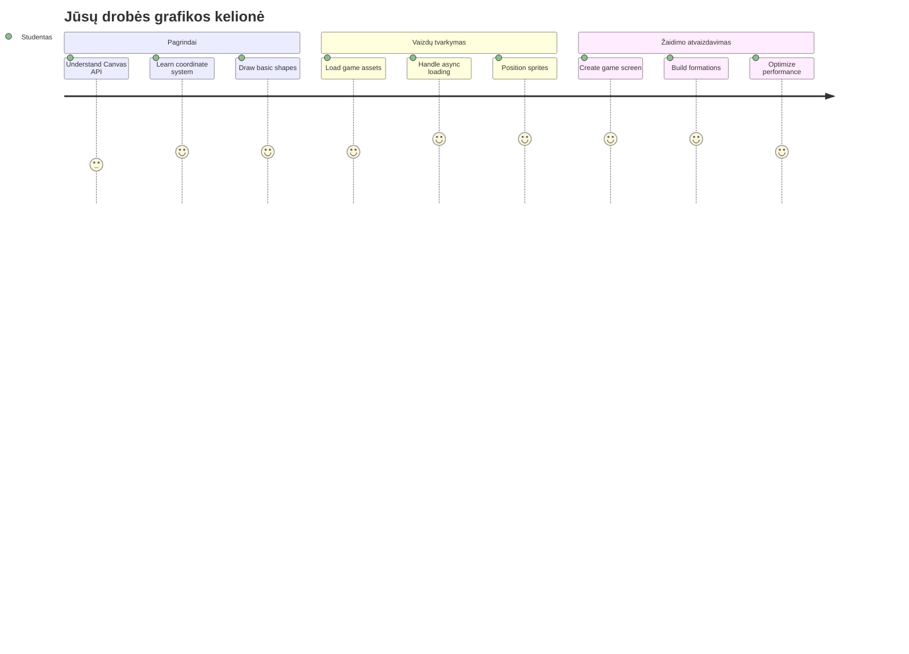
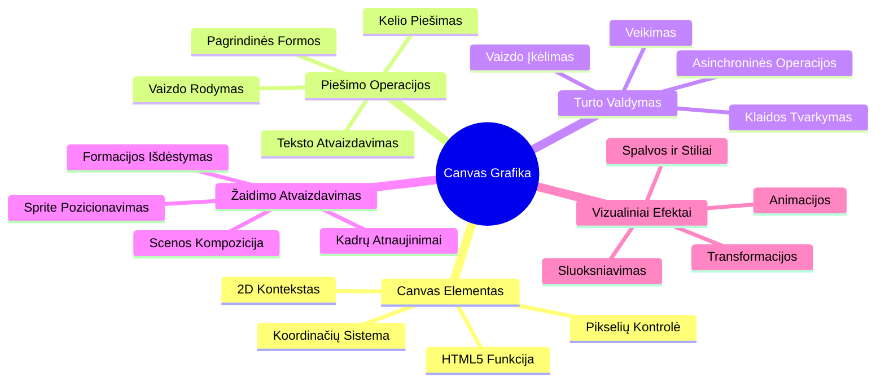
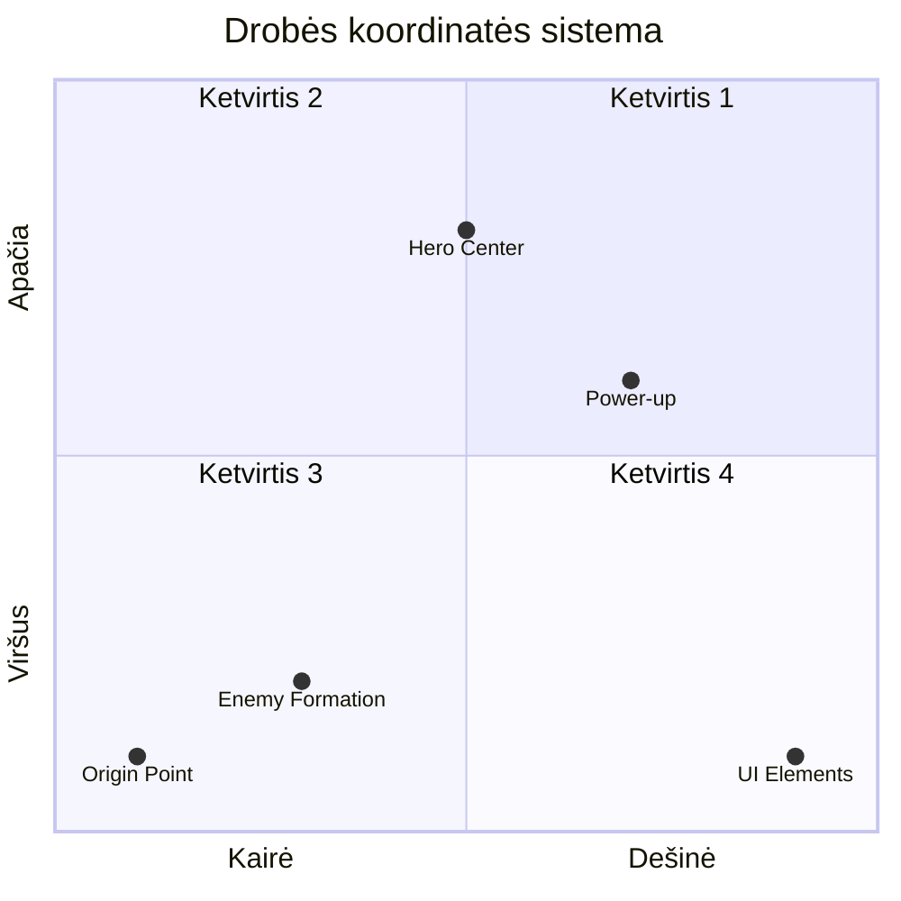
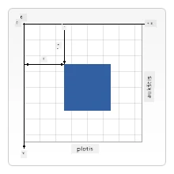
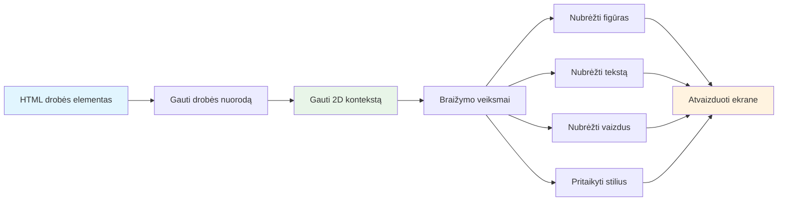
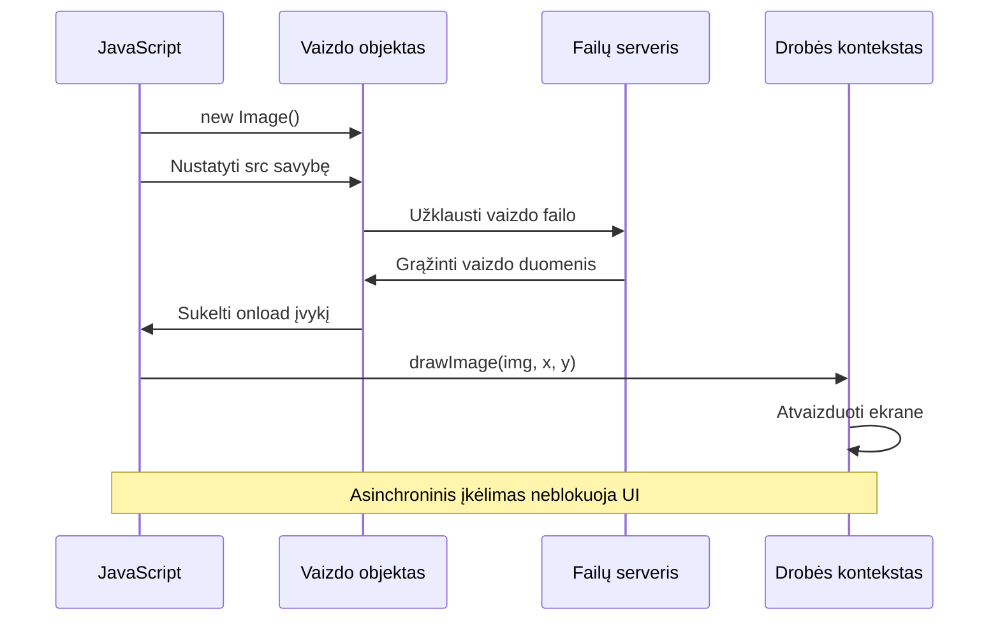
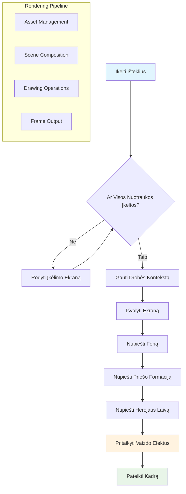
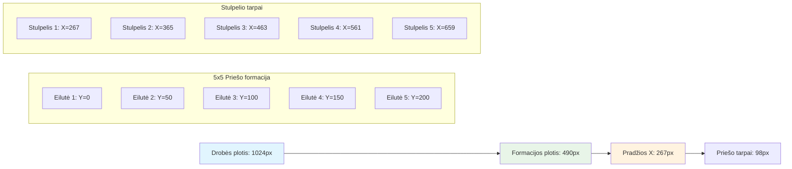
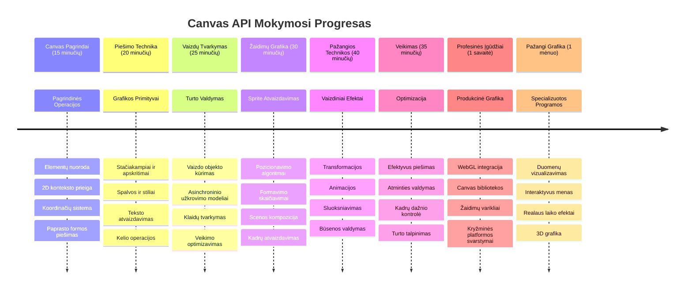

# Sukurkite kosminį žaidimą 2 dalis: Herojaus ir monstrų piešimas ant drobės


„Canvas“ API yra viena galingiausių žiniatinklio kūrimo funkcijų, leidžiančių kurti dinamišką, interaktyvią grafiką tiesiog naršyklėje. Šioje pamokoje mes paversime tuščią HTML `<canvas>` elementą į žaidimo pasaulį, pilną herojų ir monstrų. Pagalvokite apie drobę kaip apie skaitmeninį meno stalą, kur kodas tampa vaizdu.

Kuriame toliau nuo to, ką išmokote ankstesnėje pamokoje, ir dabar gilinsimės į vizualius aspektus. Išmoksite, kaip įkelti ir rodyti žaidimo sprite'us, tiksliai pozicionuoti elementus ir sukurti vizualų jūsų kosminio žaidimo pagrindą. Tai sujungia skirtumą tarp statinių tinklalapių ir dinamiškų, interaktyvių patirčių.

Pamokos pabaigoje turėsite pilną žaidimo sceną su teisingai pozicionuotu herojaus laivu ir pasiruošusiomis priešų formacijomis kovai. Suprasite, kaip šiuolaikiniai žaidimai atvaizduoja grafiką naršyklėse ir įgisite įgūdžių kurti savo interaktyvias vizualines patirtis. Pažvelkime į drobės grafiką ir atgaivinkime jūsų kosminį žaidimą!


## Priešpamokinė viktorina

[Priešpamokinė viktorina](https://ff-quizzes.netlify.app/web/quiz/31)

## Drobė

Tai kas gi yra šis `<canvas>` elementas? Tai HTML5 sprendimas dinamiškai grafikai ir animacijoms kurti žiniatinklio naršyklėse. Skirtingai nuo įprastų paveikslėlių ar vaizdo įrašų, kurie yra statiški, drobė suteikia jums pikselių lygmens kontrolę viskam, kas rodoma ekrane. Tai daro ją idealia žaidimams, duomenų vizualizacijoms ir interaktyviam menui. Pagalvokite apie ją kaip programuojamą piešimo paviršių, kur JavaScript tampa jūsų teptuku.

Pagal numatytuosius nustatymus drobės elementas atrodo kaip tuščias, skaidrus stačiakampis puslapyje. Tačiau ten slypi potencialas! Tikroji galios išraiška atsiranda, kai naudojate JavaScript piešti figūras, įkelti paveikslėlius, kurti animacijas ir priimti vartotojo sąveikos atsaką. Tai panašu į tai, kaip ankstyvieji kompiuterinės grafikos pionieriai Bell Labs 1960-aisiais turėjo programuoti kiekvieną pikselį, kad sukurtų pirmąsias skaitmenines animacijas.

✅ Skaitykite [daugiau apie Canvas API](https://developer.mozilla.org/docs/Web/API/Canvas_API) MDN svetainėje.

Štai kaip jis dažniausiai deklaruojamas puslapio kūno dalyje:

```html
<canvas id="myCanvas" width="200" height="100"></canvas>
```

**Štai ką daro šis kodas:**
- **Nustato** `id` atributą, kad galėtumėte nurodyti šį konkretų drobės elementą JavaScript'e
- **Apibrėžia** pločio reikšmę pikseliais, kad valdytumėte drobės horizontalų dydį
- **Nustato** aukštį pikseliais, kad apibrėžtumėte drobės vertikalią dimensiją

## Paprastos geometrijos piešimas

Dabar, kai žinote, kas yra drobės elementas, pažvelkime, kaip jame piešti! Drobė naudoja koordinačių sistemą, kuri gali būti pažįstama iš matematikos pamokų, bet yra viena svarbi ypatybė, būdinga kompiuterinei grafikai.

Drobė naudoja Dekarto koordinates su x ašimi (horizontali) ir y ašimi (vertikali) viskam, ką piešiate, pozicionuoti. Tačiau svarbus skirtumas: priešingai nei matematikos koordinačių sistema, pradžios taškas `(0,0)` yra viršutiniame kairiajame kampe, o x reikšmės didėja judant į dešinę, o y reikšmės didėja judant žemyn. Šis metodas kyla iš ankstyvųjų kompiuterinių ekranų, kuriuose elektronų spinduliai buvo skenuojami nuo viršaus iki apačios, todėl viršutinis kairys kampas yra natūrali pradžia.



> Nuotrauka iš [MDN](https://developer.mozilla.org/docs/Web/API/Canvas_API/Tutorial/Drawing_shapes)

Norint piešti ant drobės elemento, laikysitės to paties trijų žingsnių proceso, kuris sudaro visos drobės grafikos pagrindą. Kai tai padarysite kelis kartus, tai taps labiau įgūdžiu nei mokymusi:


1. **Gaukite nuorodą** į drobės elementą iš DOM (kaip ir bet kurį kitą HTML elementą)
2. **Gaukite 2D atvaizdavimo kontekstą** – tai suteikia visas piešimo priemones
3. **Pradėkite piešti!** Naudokite konteksto įmontuotas funkcijas, kad sukurtumėte grafiką

Štai kaip tai atrodo kode:

```javascript
// 1 žingsnis: Gaukite drobės elementą
const canvas = document.getElementById("myCanvas");

// 2 žingsnis: Gaukite 2D piešimo kontekstą
const ctx = canvas.getContext("2d");

// 3 žingsnis: Nustatykite užpildo spalvą ir nupieškite stačiakampį
ctx.fillStyle = 'red';
ctx.fillRect(0, 0, 200, 200); // x, y, plotis, aukštis
```

**Išskaidykime tai žingsnis po žingsnio:**
- Mes **paimame** drobės elementą pagal jo ID ir priskiriame kintamajam
- Mes **gauname** 2D atvaizdavimo kontekstą – tai mūsų piešimo įrankių komplektas
- Mes **nustatome** drobėje raudoną spalvą naudodami `fillStyle` savybę
- Mes **nupiešiame** stačiakampį, prasidedantį viršutiniame kairiajame kampe (0,0), kuris yra 200 px pločio ir 200 px aukščio

✅ „Canvas API“ daugiausia sutelkia dėmesį į 2D formas, bet taip pat galima piešti ir 3D elementus į svetainę; tam galite naudoti [WebGL API](https://developer.mozilla.org/docs/Web/API/WebGL_API).

Su „Canvas API“ galite piešti įvairius dalykus, pavyzdžiui:

- **Geometrines figūras** — mes jau parodėme, kaip nupiešti stačiakampį, bet yra dar daug daugiau, ką galite piešti.
- **Tekstą** — galite piešti tekstą su bet kokiu šriftu ir spalva, kokią norite.
- **Paveikslėlius** — galite piešti paveikslėlį iš paveikslėlio failo, pvz., .jpg ar .png.

✅ Išbandykite! Jūs jau žinote, kaip nupiešti stačiakampį, ar sugebėtumėte nupiešti apskritimą? Pažiūrėkite keletą įdomių drobės piešinių CodePen. Štai [ypač įspūdingas pavyzdys](https://codepen.io/dissimulate/pen/KrAwx).

### 🔄 **Pedagoginė patikra**
**Drobės pagrindų supratimas**: prieš pradėdami vaizdų krovimą, įsitikinkite, kad galite:
- ✅ Paaiškinti, kaip drobės koordinačių sistema skiriasi nuo matematinės
- ✅ Suprasti trijų žingsnių drobės piešimo operacijų procesą
- ✅ Nustatyti, ką suteikia 2D atvaizdavimo kontekstas
- ✅ Apibūdinti, kaip veikia fillStyle ir fillRect kartu

**Greitas savikontrolės testas**: Kaip nupieštumėte mėlyną apskritimą koordinatėse (100, 50) su spinduliu 25?
```javascript
ctx.fillStyle = 'blue';
ctx.beginPath();
ctx.arc(100, 50, 25, 0, 2 * Math.PI);
ctx.fill();
```

**Drobės piešimo metodai, kuriuos dabar žinote**:
- **fillRect()**: piešia užpildytus stačiakampius
- **fillStyle**: nustato spalvas ir raštus
- **beginPath()**: pradeda naujus piešimo kelius
- **arc()**: kuria apskritimus ir kreives

## Įkelkite ir nupieškite vaizdo elementą

Paprastų formų piešimas yra naudingas pradedant, bet dauguma žaidimų naudoja tikrus vaizdus! Sprite'ai, fonai ir tekstūros suteikia žaidimams vizualų patrauklumą. Vaizdų įkėlimas ir rodymas ant drobės veikia kitaip nei geometrinių figūrų piešimas, tačiau kai suprasite procesą, jis bus paprastas.

Turime sukurti `Image` objektą, įkelti savo vaizdo failą (tai vyksta asinchroniškai, t.y. fone), o tada nupiešti jį ant drobės, kai jis bus paruoštas. Šis būdas užtikrina, kad vaizdai bus rodomi tinkamai, neužblokavus programos įkėlimo proceso metu.


### Paprastas paveikslėlio įkėlimas

```javascript
const img = new Image();
img.src = 'path/to/my/image.png';
img.onload = () => {
  // Vaizdas įkeltas ir pasiruošęs naudoti
  console.log('Image loaded successfully!');
};
```

**Štai kas vyksta šiame kode:**
- Mes **sukuriame** visiškai naują „Image“ objektą, kuriame bus mūsų sprite'as arba tekstūra
- Mes **nustatome**, kokį paveikslėlį įkelti, priskirdami `src` kelio nuorodą
- Mes **stebime** įkėlimo įvykį, kad žinotume, kada vaizdas jau paruoštas naudoti

### Geresnis būdas įkelti vaizdus

Štai modernesnis ir stabilesnis būdas tvarkyti vaizdų krovimą, kurį naudoja profesionalūs kūrėjai. Apvyniosime vaizdų įkėlimą Promisių pagrindu veikiančioje funkcijoje – ši metodika, populiarėjusi nuo ES6 su JavaScript „Promise“ standartais, daro kodą aiškesnį ir leidžia tvarkingai valdyti klaidas:

```javascript
function loadAsset(path) {
  return new Promise((resolve, reject) => {
    const img = new Image();
    img.src = path;
    img.onload = () => {
      resolve(img);
    };
    img.onerror = () => {
      reject(new Error(`Failed to load image: ${path}`));
    };
  });
}

// Modernus naudojimas su async/await
async function initializeGame() {
  try {
    const heroImg = await loadAsset('hero.png');
    const monsterImg = await loadAsset('monster.png');
    // Vaizdai dabar paruošti naudoti
  } catch (error) {
    console.error('Failed to load game assets:', error);
  }
}
```

**Tai ką padarėme:**
- **Apvyniojome** visą vaizdų įkėlimo logiką į Promise, kad galėtume ją geriau valdyti
- **Pridėjome** klaidų tvarkymą, kuris praneša, jei kas nors nepavyksta
- **Naudojome** šiuolaikinę async/await sintaksę, nes ji lengviau skaitoma
- **Įtraukėme** try/catch blokus, kad tinkamai tvarkytume įkėlimo sutrikimus

Kai vaizdai bus įkelti, jų nupiešimas ant drobės yra iš tiesų paprastas:

```javascript
async function renderGameScreen() {
  try {
    // Įkelti žaidimo išteklius
    const heroImg = await loadAsset('hero.png');
    const monsterImg = await loadAsset('monster.png');

    // Gauti drobę ir kontekstą
    const canvas = document.getElementById("myCanvas");
    const ctx = canvas.getContext("2d");

    // Nupiešti paveikslėlius į konkrečias vietas
    ctx.drawImage(heroImg, canvas.width / 2, canvas.height / 2);
    ctx.drawImage(monsterImg, 0, 0);
  } catch (error) {
    console.error('Failed to render game screen:', error);
  }
}
```

**Eikime per tai žingsnis po žingsnio:**
- Mes asinchroniškai **įkeliam** tą patį herojų ir monstrų paveikslus laukelyje naudodami `await`
- Mes **paimame** drobės elementą ir gauname reikalingą 2D atvaizdavimo kontekstą
- Mes **pozicionuojame** herojaus paveikslėlį tiesiai centre naudodami greitus koordinačių skaičiavimus
- Mes **dedame** monstrų paveikslėlį viršutiniame kairiajame kampe, pradėdami priešų formaciją
- Mes **gaudome** klaidas, kurios gali kilti įkėlimo ar atvaizdavimo metu


## Dabar laikas pradėti kurti savo žaidimą

Dabar sudėsime viską kartu, kad sukurtume jūsų kosminio žaidimo vizualų pagrindą. Jūs gerai suprantate drobės pagrindus ir vaizdų įkėlimo metodus, todėl ši praktinė dalis žingsnis po žingsnio padės sukurti pilną žaidimo ekraną su tinkamai pozicionuotais sprite'ais.

### Ką reikės sukurti

Sukursite tinklalapį su drobės elementu. Jame bus nupieštas juodas ekranas `1024*768`. Jums pateikiami du vaizdai:

- Herojaus laivas

   

- 5x5 monstrų grupė

   

### Rekomenduojami žingsniai pradėti kūrimą

Raskite pradžios failus, sukurtus jums `your-work` aplanke. Jūsų projekto struktūroje turėtų būti:

```bash
your-work/
├── assets/
│   ├── enemyShip.png
│   └── player.png
├── index.html
├── app.js
└── package.json
```

**Tai su kuo dirbsite:**
- **Žaidimo sprite'ai** yra `assets/` aplanke, kad viskas būtų tvarkinga
- **Pagrindinis HTML failas** nustato drobės elementą ir paruošia viską
- **JavaScript failas**, kuriame rašysite visą žaidimo piešimo magiją
- **package.json** failas, kuris sukuria vietinį vystymo serverį, kad galėtumėte testuoti vietoje

Atidarykite šį aplanką Visual Studio Code programoje, kad pradėtumėte kurti. Reikės vietinės vystymo aplinkos su Visual Studio Code, NPM ir Node.js. Jei dar neturite `npm` komandos savo kompiuteryje, [čia paaiškinta, kaip ją įdiegti](https://www.npmjs.com/get-npm).

Paleiskite savo vystymo serverį, nueidami į `your-work` katalogą:

```bash
cd your-work
npm start
```

**Ši komanda atlieka kelis naudingus veiksmus:**
- **Paleidžia** vietinį serverį adresu `http://localhost:5000`, kad galėtumėte testuoti žaidimą
- **Tarnauja** visus jūsų failus tinkamai, kad naršyklė galėtų juos įkelti
- **Stebi** failų pakeitimus, kad kūrimas vyktų sklandžiai
- **Teikia** profesionalią vystymo aplinką bandymams

> 💡 **Pastaba**: naršyklėje iš pradžių matysite tuščią puslapį – tai normalu! Kai rašysite kodą, atnaujinkite naršyklę, kad pamatytumėte savo pokyčius. Šis iteratyvus kūrimo metodas panašus į tą, kaip NASA kūrė Apollo valdymo kompiuterį – testavo kiekvieną komponentą prieš jį įtraukiant į didesnę sistemą.

### Pridėkite kodą

Pridėkite reikiamą kodą į `your-work/app.js`, kad įvykdytumėte toliau nurodytas užduotis:

1. **Nupieškite drobę su juodu fonu**
   > 💡 **Kaip tai padaryti**: raskite TODO vietą `/app.js` ir pridėkite tik dvi eilutes. Nustatykite `ctx.fillStyle` į juodą, tada naudokite `ctx.fillRect()` nuo (0,0) su drobės matmenimis. Paprasta!

2. **Įkelkite žaidimo tekstūras**
   > 💡 **Kaip tai padaryti**: naudokite `await loadAsset()` įkeldami žaidėjo ir priešo paveikslėlius. Išsaugokite juos kintamuosiuose, kad galėtumėte naudoti vėliau. Atminkite – jie nebus rodomi, kol jų ne nupiešite!

3. **Nupieškite herojų laivą centre apačioje**
   > 💡 **Kaip tai padaryti**: naudokite `ctx.drawImage()` paduodami koordinatę x `canvas.width / 2 - 45`, kad herojus būtų centre, ir y `canvas.height - canvas.height / 4`, kad jis atsidurtų apatinėje dalyje.

4. **Nupieškite 5×5 priešų formaciją**
   > 💡 **Kaip tai padaryti**: raskite funkciją `createEnemies` ir sukurkite susuktą ciklą. Turėsite atlikti keletą skaičiavimų dėl atstumų ir pozicijų, bet nebijokite – aš parodysiu tiksliai kaip!

Pirmiausia apibrėžkite konstantas tinkamam priešų formacijos išdėstymui:

```javascript
const ENEMY_TOTAL = 5;
const ENEMY_SPACING = 98;
const FORMATION_WIDTH = ENEMY_TOTAL * ENEMY_SPACING;
const START_X = (canvas.width - FORMATION_WIDTH) / 2;
const STOP_X = START_X + FORMATION_WIDTH;
```

**Štai ką daro šios konstantos:**
- Nustato po 5 priešus kiekvienoje eilėje ir stulpelyje (tvarkingas 5×5 tinklelis)
- Apibrėžia, kiek vietos dedame tarp priešų, kad jie nebūtų sulipę
- Apskaičiuoja, kiek pločio užims visa formacija
- Nustato, kur pradėti ir kur baigti, kad formacija atrodytų centrinė


Tada sukurkite susuktus ciklus, kad nupieštumėte priešų grupę:

```javascript
for (let x = START_X; x < STOP_X; x += ENEMY_SPACING) {
  for (let y = 0; y < 50 * 5; y += 50) {
    ctx.drawImage(enemyImg, x, y);
  }
}
```

**Štai ką daro šis susuktas ciklas:**
- Išorinis ciklas juda iš kairės į dešinę per formaciją
- Vidinis ciklas juda iš viršaus žemyn, kad suformuotų tvarkingas eilutes
- Piešiame kiekvieną priešą tiksliose apskaičiuotose x,y koordinatėse
- Viskas išdėstyta tolygiai, kad atrodytų profesionaliai ir tvarkingai

### 🔄 **Pedagoginė patikra**
**Žaidimo atvaizdavimo valdymas**: Patikrinkite savo supratimą apie visą atvaizdavimo sistemą:
- ✅ Kaip asinchroninis vaizdų įkėlimas neleidžia blokuoti UI žaidimo paleidimo metu?
- ✅ Kodėl priešų formacijos pozicijų skaičiavimas atliekamas per konstantas, o ne užkoduojant tiesiogiai?
- ✅ Kokią funkciją atlieka 2D atvaizdavimo kontekstas piešimo procesuose?
- ✅ Kaip susukti ciklai sukuria tvarkingas sprite'ų formacijas?

**Vykdymo efektyvumo aspektai**: Jūsų žaidimas dabar demonstruoja:
- **Veiksmingą turtų įkėlimą**: Promisais paremtą vaizdų valdymą
- **Organizuotą atvaizdavimą**: Strukturizuotas piešimo operacijas
- **Matematinius pozicionavimo skaičiavimus**: Tikslią sprite'ų vietos nustatymą
- **Klaidų valdymą**: Gerai tvarkomą sistemos neveikimą

**Vizualios programavimo sąvokos**: Jūs išmokote:
- **Koordinačių sistemos**: matematikos vertimas į ekrano pozicijas  
- **Sprite’ų valdymas**: žaidimo grafikų įkėlimas ir rodymas  
- **Formacijos algoritmai**: matematiniai raštai organizuotam išdėstymui  
- **Asinchroninės operacijos**: modernus JavaScript sklandžiai naudotojo patirčiai  

## Rezultatas

Galutinis rezultatas turėtų atrodyti taip:


## Sprendimas

Pirmiausia pabandykite spręsti pats, bet jei užstrigsite, pažiūrėkite į [sprendimą](../../../../6-space-game/2-drawing-to-canvas/solution/app.js)

---

## GitHub Copilot Agent Iššūkis 🚀

Naudokite Agent režimą, kad įvykdytumėte šį iššūkį:

**Aprašymas:** Patobulinkite savo kosminių žaidimų drobę pridėdami vizualinius efektus ir interaktyvius elementus, naudodamiesi išmoktomis Canvas API technikomis.

**Užduotis:** Sukurkite naują failą `enhanced-canvas.html`, kuriame drobėje rodomi animuoti žvaigždžių fonas, pulsuojanti sveikatos juosta herojinio laivo gyvybei ir priešiški laivai, kurie lėtai juda žemyn. Pateikite JavaScript kodą, kuris piešia žaižaruojančias žvaigždes su atsitiktinėmis pozicijomis ir permatomumu, įgyvendina sveikatos juostą, kuri keičia spalvą priklausomai nuo gyvybės lygio (žalia > geltona > raudona), ir animuoja priešiškus laivus judėti žemyn ekranu skirtingu greičiu.

Sužinokite daugiau apie [agent režimą](https://code.visualstudio.com/blogs/2025/02/24/introducing-copilot-agent-mode).

## 🚀 Iššūkis

Išmokote piešti su daug dėmesio skiriančiu 2D Canvas API; pažvelkite į [WebGL API](https://developer.mozilla.org/docs/Web/API/WebGL_API) ir pabandykite nupiešti 3D objektą.

## Po paskaitos testas

[Po paskaitos testas](https://ff-quizzes.netlify.app/web/quiz/32)

## Peržiūra ir savarankiškas mokymasis

Sužinokite daugiau apie Canvas API, [skaitydami apie jį](https://developer.mozilla.org/docs/Web/API/Canvas_API).

### ⚡ **Ką galite padaryti per kitą 5 minutes**  
- [ ] Atidarykite naršyklės konsolę ir sukurkite drobės elementą su `document.createElement('canvas')`  
- [ ] Pabandykite nupiešti stačiakampį naudodami `fillRect()` ant drobės konteksto  
- [ ] Išbandykite skirtingas spalvas naudodami `fillStyle` savybę  
- [ ] Nupieškite paprastą ratą naudojant `arc()` metodą  

### 🎯 **Ką galite pasiekti šią valandą**  
- [ ] Užbaikite po pamokos testą ir supraskite drobės pagrindus  
- [ ] Sukurkite piešimo programėlę su keliais figūrų formatais ir spalvomis  
- [ ] Įgyvendinkite paveikslėlių įkėlimą ir sprite’ų atvaizdavimą žaidime  
- [ ] Sukurkite paprastą animaciją, kuri juda objektais per drobę  
- [ ] Praktikuokite drobės transformacijas, tokias kaip mastelio keitimas, sukimasis ir perkėlimas  

### 📅 **Jūsų savaitės kelionė su drobe**  
- [ ] Užbaikite kosminį žaidimą su išbaigta grafika ir sprite animacijomis  
- [ ] Išmokite pažangių drobės technikų, pvz., gradientų, raštų ir komponavimo  
- [ ] Kurkite interaktyvias vizualizacijas naudodami drobę duomenų atvaizdavimui  
- [ ] Sužinokite drobės optimizavimo metodus sklandžiam veikimui  
- [ ] Sukurkite piešimo ar tapybos programą su įvairiais įrankiais  
- [ ] Atraskite kūrybinius kodavimo raštus ir generatyvų meną su drobe  

### 🌟 **Jūsų mėnesio grafikos meistriškumas**  
- [ ] Kurkite sudėtingas vizualias programas naudodami Canvas 2D ir WebGL  
- [ ] Mokykitės grafikos programavimo konceptų ir šaderių pagrindų  
- [ ] Prisidėkite prie atviro kodo grafikos bibliotekų ir vizualizacijos įrankių  
- [ ] Tapkite našumo optimizavimo ekspertais grafiškai intensyvioms programoms  
- [ ] Kurkite edukacinį turinį apie drobės programavimą ir kompiuterinę grafiką  
- [ ] Tapkite grafikos programavimo ekspertu, padedančiu kitiems kurti vizualinius potyrius  

## 🎯 Jūsų drobės grafikų meistriškumo laiko juosta


### 🛠️ Jūsų drobės grafikų įrankių santrauka

Baigę šią pamoką dabar turite:  
- **Drobės API meistriškumą**: pilnas 2D grafikos programavimo supratimas  
- **Koordinačių matematiką**: tikslūs pozicionavimo ir išdėstymo algoritmai  
- **Turtų valdymą**: profesionalus paveikslėlių įkėlimas ir klaidų tvarkymas  
- **Atvaizdavimo vamzdyną**: struktūruotas scenos sudarymo požiūris  
- **Žaidimų grafiką**: Sprite’ų pozicionavimas ir formacijos skaičiavimai  
- **Asinchroninį programavimą**: modernūs JavaScript modeliai sklandžiam veikimui  
- **Vizualinį programavimą**: matematikos koncepcijų vertimas į ekrano grafiką  

**Realūs taikymai**: Jūsų drobės įgūdžiai tiesiogiai pritaikomi:  
- **Duomenų vizualizacijai**: diagramos, grafikai ir interaktyvūs informaciniai skydeliai  
- **Žaidimų kūrimui**: 2D žaidimai, simuliacijos ir interaktyvios patirtys  
- **Skaitmeniniam menui**: kūrybinis kodavimas ir generatyvūs meno projektai  
- **UI/UX dizainui**: individuali grafika ir interaktyvūs elementai  
- **Mokomajai programinei įrangai**: vizualiniai mokymosi įrankiai ir simuliacijos  
- **Interneto programoms**: dinamiška grafika ir realaus laiko vizualizacijos  

**Įgyti profesiniai įgūdžiai**: Dabar galite:  
- **Kurti** individualius grafikos sprendimus be išorinių bibliotekų  
- **Optimizuoti** atvaizdavimo našumą sklandžioms naudotojo patirtims  
- **Derinti ir taisyti** sudėtingas vizualines problemas naudodami naršyklės programuotojo įrankius  
- **Projektuoti** mastelio keičiamas grafikos sistemas naudodami matematinius principus  
- **Integruoti** drobės grafiką su moderniais interneto programų karkasais  

**Canvas API metodai, kuriuos įvaldėte**:  
- **Elemento valdymas**: getElementById, getContext  
- **Piešimo operacijos**: fillRect, drawImage, fillStyle  
- **Turto įkėlimas**: paveikslėlių objektai, Promise modeliai  
- **Matematinis pozicionavimas**: koordinačių skaičiavimai, formacijos algoritmai  

**Kitas lygis**: esate pasiruošę pridėti animaciją, naudotojo sąveiką, susidūrimų aptikimą arba ištirti WebGL 3D grafiką!

🌟 **Pasiekimas Atidarytas**: jūs sukūrėte pilną žaidimo atvaizdavimo sistemą panaudodami pagrindines Canvas API technikas!

## Užduotis

[Pasimėgaukite Canvas API](assignment.md)

---

<!-- CO-OP TRANSLATOR DISCLAIMER START -->
**Atsakomybės apribojimas**:
Šis dokumentas buvo išverstas naudojant dirbtinio intelekto vertimo paslaugą [Co-op Translator](https://github.com/Azure/co-op-translator). Nors stengiamės užtikrinti tikslumą, prašome atkreipti dėmesį, kad automatiniai vertimai gali turėti klaidų ar netikslumų. Originalus dokumentas gimtąja kalba turėtų būti laikomas autoritetingu šaltiniu. Kritinei informacijai rekomenduojamas profesionalus žmogaus atliktas vertimas. Mes neatsakome už bet kokius nesusipratimus ar klaidingas interpretacijas, kylančias dėl šio vertimo naudojimo.
<!-- CO-OP TRANSLATOR DISCLAIMER END -->