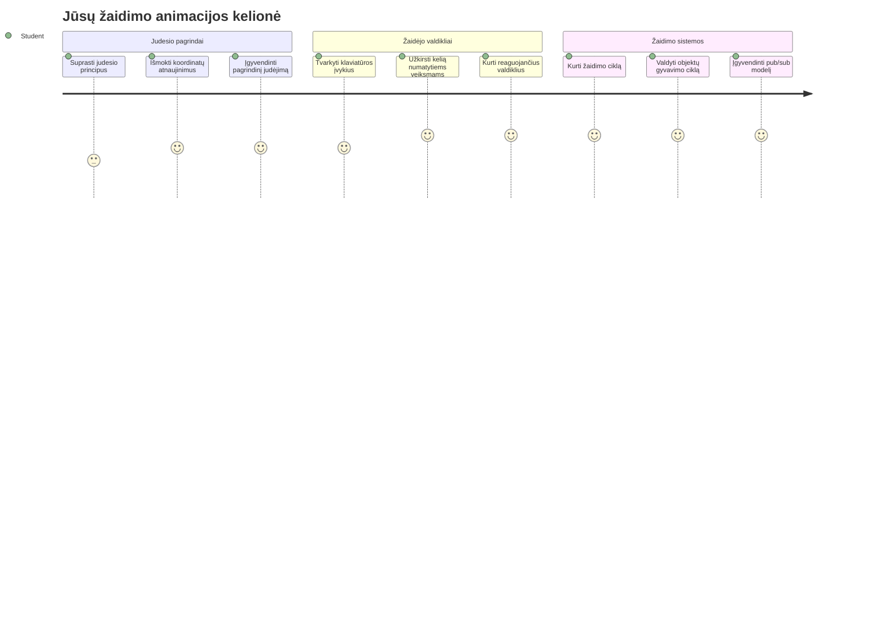
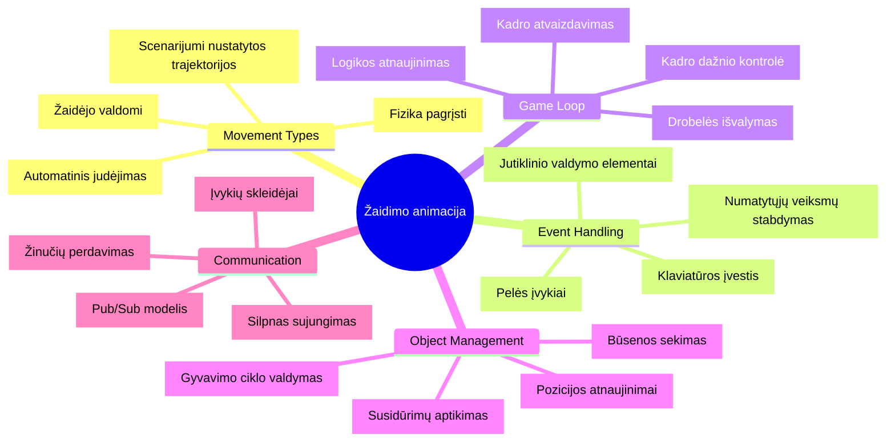
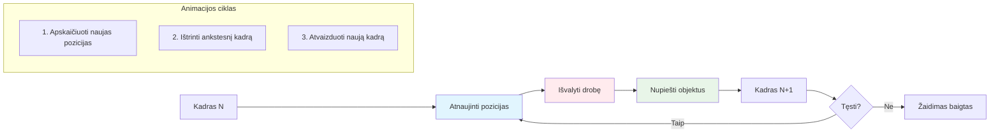
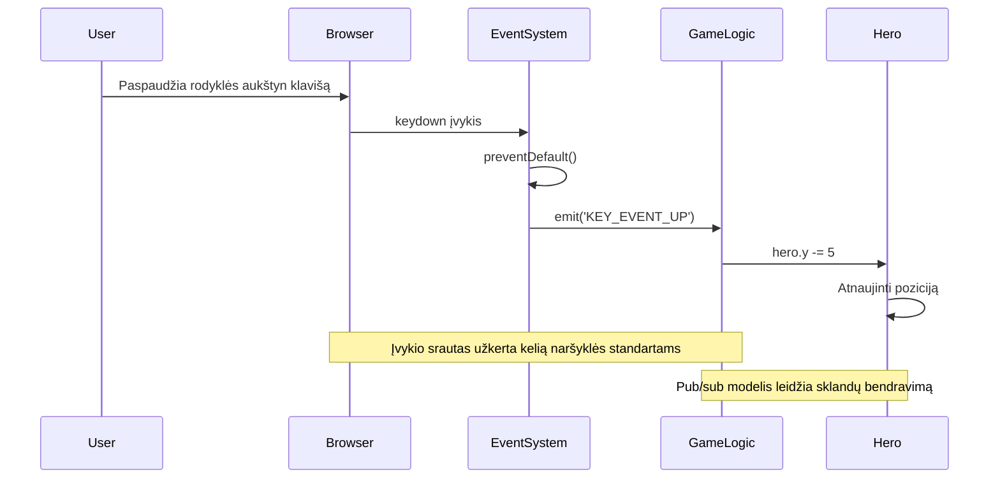
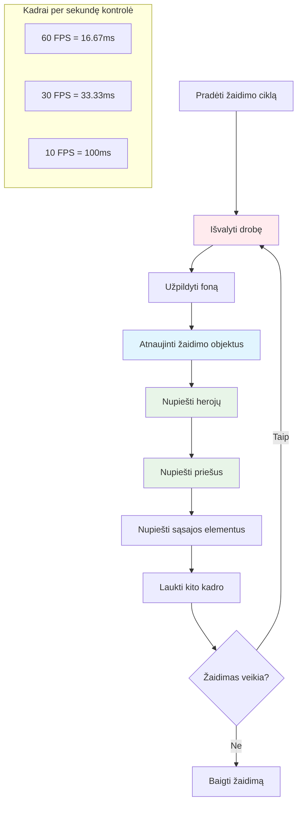
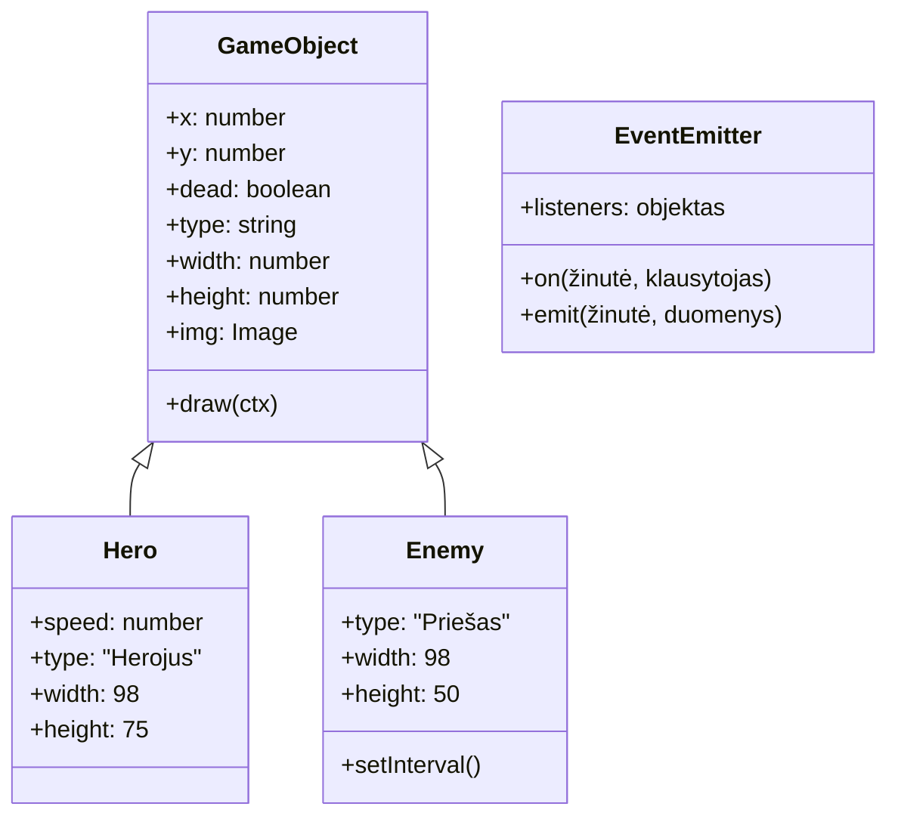
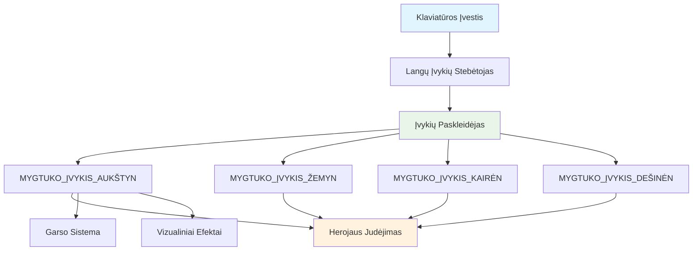
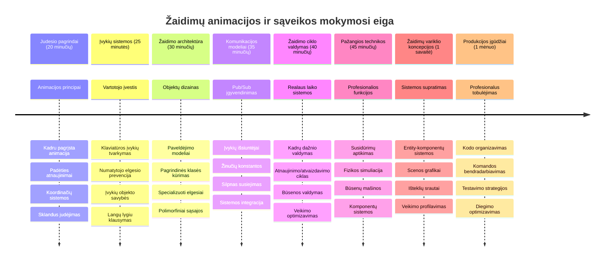

<!--
CO_OP_TRANSLATOR_METADATA:
{
  "original_hash": "8c55a2bd4bc0ebe4c88198fd563a9e09",
  "translation_date": "2026-01-07T11:35:27+00:00",
  "source_file": "6-space-game/3-moving-elements-around/README.md",
  "language_code": "lt"
}
-->
# Sukurkite kosminį žaidimą 3 dalis: Pridedame judėjimą


Pagalvokite apie savo mėgstamus žaidimus – kas juos daro patrauklius, tai ne tik graži grafika, bet ir tai, kaip viskas juda ir reaguoja į jūsų veiksmus. Šiuo metu jūsų kosminis žaidimas tarsi gražus paveikslas, bet mes ruošiamės pridėti judėjimą, kuris suteiks jam gyvybės.

Kai NASA inžinieriai programavo Apollo misijų orientacijos kompiuterį, jie susidūrė su panašia problema: kaip priversti kosminį laivą reaguoti į piloto komandą ir tuo pačiu automatiškai išlaikyti kursų korekcijas? Principai, kuriuos šiandien išmoksime, atspindi tuos pačius konceptus – žaidėjo valdomo judėjimo ir automatinio sistemos elgesio valdymą.

Šiame pamokoje sužinosite, kaip priversti erdvėlaivius slysti ekranu, reaguoti į žaidėjo komandas ir sukurti sklandžius judėjimo modelius. Viską suskaidysime į lengvai suprantamus konceptus, kurie natūraliai remiasi vienas kitu.

Pamokos pabaigoje žaidėjai skraidys savo herojų laivu po ekraną, o priešiški laivai patruliuos viršuje. Dar svarbiau, suprasite pagrindinius principus, kurie valdo žaidimų judėjimo sistemas.


## Įvadinis testas prieš paskaitą

[Prieš paskaitą testas](https://ff-quizzes.netlify.app/web/quiz/33)

## Supratimas apie žaidimo judėjimą

Žaidimai atgyja, kai pradeda judėti objektai, ir yra iš esmės du tokių judėjimų tipai:

- **Žaidėjo valdoma judėjimas**: Kai paspaudžiate klavišą arba spustelėjate pelę, kažkas juda. Tai tiesioginis ryšys tarp jūsų ir žaidimo pasaulio.
- **Automatinis judėjimas**: Kai pats žaidimas nusprendžia ką nors judinti – pavyzdžiui, tie priešų laivai, kurie turi patruliuoti ekranu, nesvarbu, ar jūs ką nors darote, ar ne.

Objektų judėjimas kompiuterio ekrane yra paprastesnis, nei galite pagalvoti. Prisiminkite tas x ir y koordinates iš matematikos pamokų? Būtent su tuo čia dirbame. Kai Galilėjus 1610 m. stebėjo Jupiterio palydovus, jis iš esmės darė tą patį – braižė pozicijas laikui bėgant, norėdamas suprasti judėjimo modelius.

Judėjimas ekrane yra tarsi animacijos knygelė – reikia atlikti tris paprastus veiksmus:


1. **Atnaujinti poziciją** – Pakeisti, kur objektas turėtų būti (galbūt perkelti jį 5 pikseliais į dešinę)
2. **Ištrinti seną kadrą** – Išvalyti ekraną, kad nematytumėte vaiduoklių takų visur
3. **Nupiešti naują kadrą** – Padėti objektą naujoje vietoje

Atlikus tai pakankamai greitai, štai – gaunate sklandų judėjimą, kuris žaidėjams atrodo natūralus.

Štai kaip tai gali atrodyti kode:

```javascript
// Nustatyti herojaus vietą
hero.x += 5;
// Išvalyti stačiakampį, kuriame yra herojus
ctx.clearRect(0, 0, canvas.width, canvas.height);
// Perpiešti žaidimo foną ir herojų
ctx.fillRect(0, 0, canvas.width, canvas.height);
ctx.fillStyle = "black";
ctx.drawImage(heroImg, hero.x, hero.y);
```

**Štai ką daro šis kodas:**
- **Atnaujina** herojaus x koordinatę 5 pikseliais, kad jis judėtų horizontaliai
- **Išvalo** visą drobės plotą, kad pašalintų ankstesnį kadrą
- **Užpildo** drobę juodu fonu
- **Nupiešia** herojaus paveikslėlį naujoje vietoje

✅ Ar galite pagalvoti, kodėl per daug dažnas herojaus perkūrimas kas sekundę gali sumažinti našumą? Sužinokite apie [alternatyvas šiam modeliui](https://developer.mozilla.org/en-US/docs/Web/API/Canvas_API/Tutorial/Optimizing_canvas).

## Klaviatūros įvykių valdymas

Čia mes sujungiame žaidėjo įvestį su žaidimo veiksmais. Kai kas nors paspaudžia tarpą, kad paleistų lazerį, arba spaudžia rodyklių klavišus, kad išvengtų asteroido, žaidimas turi aptikti ir sureaguoti į tą įvestį.

Klaviatūros įvykiai vyksta lango lygiu, tai reiškia, kad visas naršyklės langas klausosi tų klavišų paspaudimų. Pelės spragtelėjimai, kita vertus, gali būti susieti su tam tikrais elementais (pvz., paspaudimu ant mygtuko). Mūsų kosminiame žaidime dėmesį skirsime klaviatūros valdymui, nes tai suteikia klasikinį arkadinių žaidimų pojūtį.

Tai primena kaip XIX a. telegrrafo operatoriai turėjo išversti morzės kodą į prasmingas žinutes – mes darome kažką panašaus, verčiame klavišų paspaudimus į žaidimo komandas.

Norint valdyti įvykį, reikia naudoti lango `addEventListener()` metodą ir jam pateikti du parametrus. Pirmasis parametras yra įvykio pavadinimas, pavyzdžiui, `keyup`. Antras parametras yra funkcija, kuri turi būti iškviečiama įvykio metu.

Štai pavyzdys:

```javascript
window.addEventListener('keyup', (evt) => {
  // evt.key = raktas kaip eilutės atvaizdas
  if (evt.key === 'ArrowUp') {
    // daryti kažką
  }
});
```

**Išskaidymas, kas čia vyksta:**
- **Klauso** klaviatūros įvykių visame lange
- **Gauna** įvykio objektą, kuriame yra informacija apie paspaustą klavišą
- **Tikrina** ar paspaustas klavišas atitinka konkretų klavišą (šiuo atveju – rodyklę į viršų)
- **Vykdo** kodą, kai sąlyga įvykdoma

Klavišų įvykiams yra du savybių būdai sužinoti, kuris klavišas buvo paspaustas:

- `key` - tai klavišo pavadinimo eilutė, pvz., `'ArrowUp'`
- `keyCode` - tai skaičius, pvz., `37`, reiškiantis `ArrowLeft`

✅ Klavišų įvykių valdymas yra naudingas ne tik žaidimų kūrimui. Kokius kitus panaudojimo būdus galite įsivaizduoti šiai technikai?


### Specialūs klavišai: įspėjimas!

Kai kurie klavišai turi naršyklės numatytus veiksmus, kurie gali trukdyti jūsų žaidimui. Rodyklių klavišai leidžia puslapiui slinkti, o tarpo klavišas nuskrolina žemyn – tokio elgesio nenorite, kai kažkas valdo kosminį laivą.

Galime užkirsti kelią šiems numatytiems veiksmams ir leisti žaidimui pačiam valdyti įvestį. Tai panašu į tai, kaip ankstyvieji programuotojai turėjo perrašyti sistemos pertraukimus, kad sukurtų pritaikytą elgesį – mes tai darome naršyklės lygiu. Štai kaip:

```javascript
const onKeyDown = function (e) {
  console.log(e.keyCode);
  switch (e.keyCode) {
    case 37:
    case 39:
    case 38:
    case 40: // Rodyklės klavišai
    case 32:
      e.preventDefault();
      break; // Tarpas
    default:
      break; // neblokuoti kitų klavišų
  }
};

window.addEventListener('keydown', onKeyDown);
```

**Supratimas apie šią prevencijos kodo dalį:**
- **Tikrina** konkrečius klavišų kodus, kurie gali sukelti nepageidaujamą naršyklės elgesį
- **Užkerta kelią** numatytam naršyklės veiksmui rodyklių klavišams ir tarpui
- **Leidžia** kitus klavišus naudoti kaip įprasta
- **Naudoja** `e.preventDefault()`, kad sustabdytų naršyklės numatytą elgesį

### 🔄 **Pedagoginis tarpinis patikrinimas**
**Įvykių valdymo supratimas**: Prieš pereinant prie automatinio judėjimo, įsitikinkite, kad galite:
- ✅ Paaiškinti skirtumą tarp `keydown` ir `keyup` įvykių
- ✅ Suprasti, kodėl užkertame kelią naršyklės numatytiems veiksmams
- ✅ Apibūdinti, kaip įvykių klausytojai jungia vartotojo įvestį su žaidimo logika
- ✅ Nustatyti, kurie klavišai gali trukdyti žaidimo valdymui

**Greitas savitestavimas**: Kas nutiktų, jei neužkertate kelio numatytiems veiksmams rodyklių klavišams?
*Atsakymas: Naršyklė slinktų puslapį, trukdydama žaidimo judėjimui*

**Įvykių sistemos architektūra**: Dabar suprantate:
- **Langų lygio klausymą**: įvykių gaudymą naršyklės lygiu
- **Įvykio objekto savybes**: `key` eilutės ir `keyCode` skaičiai
- **Numatyto veikimo prevenciją**: nepageidaujamų naršyklės veiksmų sustabdymą
- **Salyginę logiką**: reakciją į specifinius klavišų derinius

## Žaidimo sukeliamas judėjimas

Dabar aptarkime objektus, kurie juda be žaidėjo įvesties. Pagalvokite apie priešų laivus, kurie plaukioja ekranu, kulkas, skrendančias tiesiomis linijomis, arba debesys, dreifuoja fone. Šis autonominis judėjimas daro žaidimo pasaulį gyvą net kai niekas nelies valdiklių.

Naudojame JavaScript įmontuotus laikmačius, kad reguliariai atnaujintume pozicijas. Ši koncepcija panaši į svyravimo laikrodžius – reguliari sistema, kuri sukelia nuoseklius, laiku paskirstytus veiksmus. Štai kaip paprastai tai gali atrodyti:

```javascript
const id = setInterval(() => {
  // Perkelkite priešą y ašyje
  enemy.y += 10;
}, 100);
```

**Štai ką daro šis judėjimo kodas:**
- **Sukuria** laikmatį, kuris vyksta kas 100 milisekundžių
- **Atnaujina** priešo y koordinatę 10 pikselių kiekvieną kartą
- **Išsaugo** intervalo ID, kad vėliau galėtume jį sustabdyti, jei reikės
- **Automatiškai** perkelia priešą žemyn ekrane

## Žaidimo ciklas

Štai konceptas, kuris sujungia viską – žaidimo ciklas. Jei jūsų žaidimas būtų filmas, žaidimo ciklas būtų kino projektorius, rodomas kadrą po kadro taip greitai, kad viskas atrodo sklandžiai judančiai.

Kiekvienas žaidimas turi tokį ciklą, veikiančią fone. Tai funkcija, kuri atnaujina visus žaidimo objektus, perkrauna ekraną ir kartoja šį procesą nuolat. Ji prižiūri jūsų herojų, visus priešus, bet kokius skriejančius lazerius – visą žaidimo būseną.

Šis konceptas primena, kaip ankstyvieji animatorių filmuotojai, tokie kaip Walt Disney, turėjo vėl ir vėl piešti personažus kadrą po kadro, kad sukurtų judėjimo iliuziją. Mes darome tą patį, tik su kodu vietoje pieštukų.

Štai kaip žaidimo ciklas dažniausiai gali atrodyti kode:


```javascript
const gameLoopId = setInterval(() => {
  function gameLoop() {
    ctx.clearRect(0, 0, canvas.width, canvas.height);
    ctx.fillStyle = "black";
    ctx.fillRect(0, 0, canvas.width, canvas.height);
    drawHero();
    drawEnemies();
    drawStaticObjects();
  }
  gameLoop();
}, 200);
```

**Suprantame žaidimo ciklo struktūrą:**
- **Išvalo** visą drobę, kad pašalintų ankstesnį kadrą
- **Užpildo** foną vientisa spalva
- **Nupiešia** visus žaidimo objektus jų dabartinėse pozicijose
- **Kartoja** šį procesą kas 200 milisekundžių, kad sukurtų sklandžią animaciją
- **Valdo** kadrų dažnį reguliuodamas intervalų laiką

## Toliau tęsiame kosminį žaidimą

Dabar pridėsime judėjimą prie statinės scenos, kurią sukūrėte ankstesnėje pamokoje. Paversime ekrano paveikslėlį interaktyvia patirtimi. Dirbsime žingsnis po žingsnio, kad kiekviena dalis natūraliai papildytų ankstesnę.

Pasiimkite kodą iš ten, kur sustojome ankstesnėje pamokoje (arba pradėkite nuo [II dalies pradinio](../../../../6-space-game/3-moving-elements-around/your-work) katalogo, jei norite pradėti nuo nulio).

**Štai ką šiandien kursime:**
- **Herojaus valdymas**: rodyklių klavišais valdysite savo kosminį laivą po ekraną
- **Priešo judėjimas**: tie ateivių laivai pradės savo judėjimą

Pradėkime įgyvendinti šias funkcijas.

## Rekomenduojami žingsniai

Suraskite failus, kurie jums buvo paruošti `your-work` aplanke. Juose turėtų būti:

```bash
-| assets
  -| enemyShip.png
  -| player.png
-| index.html
-| app.js
-| package.json
```

Projektą pradėkite `your-work` kataloge įvykdydami:

```bash
cd your-work
npm start
```

**Ši komanda daro:**
- **Pereina** į jūsų projekto katalogą
- **Paleidžia** HTTP serverį adresu `http://localhost:5000`
- **Pateikia** jūsų žaidimo failus, kad galėtumėte juos testuoti naršyklėje

Tai paleis HTTP serverį adresu `http://localhost:5000`. Atidarykite naršyklę ir įveskite tą adresą, šiuo metu jis turėtų atvaizduoti herojų ir visus priešus; tačiau niekas dar nejuda!

### Pridėkite kodą

1. **Sukurkite atskirus objektus** `hero`, `enemy` ir `game object`, kurie turėtų turėti `x` ir `y` savybes. (Prisiminkite skyrių apie [paveldėjimą ar kompoziciją](../README.md)).

   *PATARIMAS* `game object` turėtų būti tas, kuris turi `x`, `y` ir geba pats save nupiešti ant drobės.

   > **Patarimas**: Pradėkite sukurti naują `GameObject` klasę su žemiau pateiktu konstruktoriaus aprašymu ir nupieškite ją drobėje:

    ```javascript
    class GameObject {
      constructor(x, y) {
        this.x = x;
        this.y = y;
        this.dead = false;
        this.type = "";
        this.width = 0;
        this.height = 0;
        this.img = undefined;
      }
    
      draw(ctx) {
        ctx.drawImage(this.img, this.x, this.y, this.width, this.height);
      }
    }
    ```

    **Supratimas apie pagrindinę klasę:**
    - **Apibrėžia** bendras savybes, kurias dalijasi visi žaidimo objektai (pozicija, dydis, paveikslėlis)
    - **Turi** `dead` žymę, padedančią sekti, ar objektą reikia pašalinti
    - **Pateikia** `draw()` metodą, kuris nupiešia objektą ant drobės
    - **Nustato** numatytąsias visų savybių reikšmes, kurias gali perrašyti vaikinės klasės


    Dabar išplėskite `GameObject` ir sukurkite `Hero` ir `Enemy` klasės:
    
    ```javascript
    class Hero extends GameObject {
      constructor(x, y) {
        super(x, y);
        this.width = 98;
        this.height = 75;
        this.type = "Hero";
        this.speed = 5;
      }
    }
    ```

    ```javascript
    class Enemy extends GameObject {
      constructor(x, y) {
        super(x, y);
        this.width = 98;
        this.height = 50;
        this.type = "Enemy";
        const id = setInterval(() => {
          if (this.y < canvas.height - this.height) {
            this.y += 5;
          } else {
            console.log('Stopped at', this.y);
            clearInterval(id);
          }
        }, 300);
      }
    }
    ```

    **Svarbiausios idėjos šiose klasėse:**
    - **Paveldi** iš `GameObject`, naudojant `extends` raktažodį
    - **Kvies** tėvinį konstruktorių su `super(x, y)`
    - **Nustato** specifinius dydžius ir savybes kiekvienam objektų tipui
    - **Įgyvendina** automatinį judėjimą priešams, naudojant `setInterval()`

2. **Pridėkite klavišų įvykių valdymą**, kad valdytumėte herojaus judėjimą aukštyn/žemyn/į kairę/į dešinę.

   *ATKARTOTI*: tai yra Dekartinis koordinatės sistema, viršutinis kairys kampas yra `0,0`. Taip pat nepamirškite pridėti kodo, kuris sustabdo *numatytą elgesį*.

   > **Patarimas**: Sukurkite `onKeyDown` funkciją ir prijunkite ją prie lango:

   ```javascript
   const onKeyDown = function (e) {
     console.log(e.keyCode);
     // Pridėkite aukščiau esančio pamokos kodo, kad sustabdytumėte numatytąjį elgesį
     switch (e.keyCode) {
       case 37:
       case 39:
       case 38:
       case 40: // Rodyklių klavišai
       case 32:
         e.preventDefault();
         break; // Tarpas
       default:
         break; // neblokuoti kitų klavišų
     }
   };

   window.addEventListener("keydown", onKeyDown);
   ```
    
   **Šis įvykio valdiklis daro:**
   - **Klauso** klavišų nuspaudimų visame lange
   - **Rašo** į konsolę nuspausto klavišo kodą, kad galėtumėte sekti aktyvumą
   - **Užkerta kelią** numatytiems naršyklės veiksmams rodyklių klavišams ir tarpui
   - **Leidžia** naudoti kitus klavišus kaip įprasta
   
   Patikrinkite savo naršyklės konsolę šiame etape ir stebėkite registruojamus klavišų paspaudimus.

3. **Įgyvendinkite** [Pub sub modelį](../README.md), tai padės išlaikyti jūsų kodą tvarkingą tolimesniuose žingsniuose.

   Publish-Subscribe modelis padeda organizuoti kodą, atskiriant įvykių aptikimą nuo jų apdorojimo. Tai daro jūsų kodą moduliariu ir lengviau prižiūrimu.

   Norėdami padaryti paskutinį žingsnį, galite:

   1. **Pridėti įvykių klausytoją** langui:

       ```javascript
       window.addEventListener("keyup", (evt) => {
         if (evt.key === "ArrowUp") {
           eventEmitter.emit(Messages.KEY_EVENT_UP);
         } else if (evt.key === "ArrowDown") {
           eventEmitter.emit(Messages.KEY_EVENT_DOWN);
         } else if (evt.key === "ArrowLeft") {
           eventEmitter.emit(Messages.KEY_EVENT_LEFT);
         } else if (evt.key === "ArrowRight") {
           eventEmitter.emit(Messages.KEY_EVENT_RIGHT);
         }
       });
       ```

   **Ši įvykių sistema daro:**
   - **Aptinka** klaviatūros įvestį ir paverčia ją pritaikytais žaidimo įvykiais
   - **Atskiria** įvesties aptikimą nuo žaidimo logikos
   - **Leidžia** lengvai pakeisti valdymą vėliau nekeisdami žaidimo kodo
   - **Suteikia** galimybę kelioms sistemoms reaguoti į tą pačią įvestį


   2. **Sukurkite EventEmitter klasę**, kad skelbtumėte ir užsiprenumeruotumėte žinutes:

       ```javascript
       class EventEmitter {
         constructor() {
           this.listeners = {};
         }
       
         on(message, listener) {
           if (!this.listeners[message]) {
             this.listeners[message] = [];
           }
           this.listeners[message].push(listener);
         }
       
   3. **Pridėkite konstantas** ir sukonfigūruokite EventEmitter:

       ```javascript
       const Messages = {
         KEY_EVENT_UP: "KEY_EVENT_UP",
         KEY_EVENT_DOWN: "KEY_EVENT_DOWN",
         KEY_EVENT_LEFT: "KEY_EVENT_LEFT",
         KEY_EVENT_RIGHT: "KEY_EVENT_RIGHT",
       };
       
       let heroImg, 
           enemyImg, 
           laserImg,
           canvas, ctx, 
           gameObjects = [], 
           hero, 
           eventEmitter = new EventEmitter();
       ```

   **Supratimas apie šį konfigūravimą:**
   - **Apibrėžia** žinučių konstantas, kad sumažintų klaidų ir palengvintų kodo keitimą
   - **Deklaruoja** kintamuosius paveikslėliams, drobės kontekstui ir žaidimo būsenai
   - **Sukuria** globalų įvykių emitentą pub-sub sistemai
   - **Inicializuoja** masyvą, kuriame saugomi visi žaidimo objektai

   4. **Inicializuokite žaidimą**

       ```javascript
       function initGame() {
         gameObjects = [];
         createEnemies();
         createHero();
       
         eventEmitter.on(Messages.KEY_EVENT_UP, () => {
           hero.y -= 5;
         });
       
         eventEmitter.on(Messages.KEY_EVENT_DOWN, () => {
           hero.y += 5;
         });
       
         eventEmitter.on(Messages.KEY_EVENT_LEFT, () => {
           hero.x -= 5;
         });
       
4. **Nustatykite žaidimo ciklą**

   Pertvarkykite funkciją `window.onload`, kad inicializuotumėte žaidimą ir nustatytumėte žaidimo ciklą tinkamu intervalu. Taip pat pridėsite lazerio spindulį:

    ```javascript
    window.onload = async () => {
      canvas = document.getElementById("canvas");
      ctx = canvas.getContext("2d");
      heroImg = await loadTexture("assets/player.png");
      enemyImg = await loadTexture("assets/enemyShip.png");
      laserImg = await loadTexture("assets/laserRed.png");
    
      initGame();
      const gameLoopId = setInterval(() => {
        ctx.clearRect(0, 0, canvas.width, canvas.height);
        ctx.fillStyle = "black";
        ctx.fillRect(0, 0, canvas.width, canvas.height);
        drawGameObjects(ctx);
      }, 100);
    };
    ```

   **Žaidimo nustatymo supratimas:**
   - **Laukia**, kol puslapis visiškai užsikraus prieš pradedant
   - **Gauk** drobės elementą ir jo 2D atvaizdavimo kontekstą
   - **Asinchroniškai įkelia** visus paveikslėlių išteklius naudodamas `await`
   - **Pradeda** žaidimo ciklą, vykstantį kas 100ms (10 FPS)
   - **Išvalo** ir perpiešia visą ekraną kiekviename kadre

5. **Pridėkite kodą**, kad priešai judėtų tam tikru intervalu

    Pertvarkykite funkciją `createEnemies()`, kad sukurti priešus ir įtraukti juos į naują `gameObjects` klasę:

    ```javascript
    function createEnemies() {
      const MONSTER_TOTAL = 5;
      const MONSTER_WIDTH = MONSTER_TOTAL * 98;
      const START_X = (canvas.width - MONSTER_WIDTH) / 2;
      const STOP_X = START_X + MONSTER_WIDTH;
    
      for (let x = START_X; x < STOP_X; x += 98) {
        for (let y = 0; y < 50 * 5; y += 50) {
          const enemy = new Enemy(x, y);
          enemy.img = enemyImg;
          gameObjects.push(enemy);
        }
      }
    }
    ```

    **Ką daro priešų kūrimas:**
    - **Apskaičiuoja** pozicijas, kad priešai būtų centruoti ekrane
    - **Sukuria** priešų tinklelį su įdėtais ciklais
    - **Priskiria** priešo paveikslėlį kiekvienam priešo objektui
    - **Prideda** kiekvieną priešą į bendrą žaidimo objektų masyvą
    
    ir pridėkite funkciją `createHero()`, kad atliktumėte panašų procesą herojui.
    
    ```javascript
    function createHero() {
      hero = new Hero(
        canvas.width / 2 - 45,
        canvas.height - canvas.height / 4
      );
      hero.img = heroImg;
      gameObjects.push(hero);
    }
    ```

    **Ką daro herojaus kūrimas:**
    - **Pozicionuoja** herojų ekrano apačioje centre
    - **Priskiria** herojaus paveikslėlį herojui
    - **Prideda** herojų į žaidimo objektų masyvą atvaizdavimui

    ir galiausiai pridėkite funkciją `drawGameObjects()`, kad pradėtumėte piešimą:

    ```javascript
    function drawGameObjects(ctx) {
      gameObjects.forEach(go => go.draw(ctx));
    }
    ```

    **Piešimo funkcijos supratimas:**
    - **Eina per visus žaidimo objektus** masyve
    - **Iškviečia** kiekvieno objekto `draw()` metodą
    - **Pateikia** drobės kontekstą, kad objektai galėtų patys save nupiešti

    ### 🔄 **Pedagoginis patikrinimas**
    **Pilnas žaidimo sistemos supratimas**: Patikrinkite savo visos architektūros žinias:
    - ✅ Kaip paveldėjimas leidžia Hero ir Enemy dalintis bendromis GameObject savybėmis?
    - ✅ Kodėl pub/sub modelis daro jūsų kodą lengviau prižiūrimą?
    - ✅ Koks žaidimo ciklo vaidmuo kuriant sklandžią animaciją?
    - ✅ Kaip įvykių klausytojai jungia naudotojo įvestį su žaidimo objektų elgsena?

    **Sistemos integracija**: Jūsų žaidimas dabar demonstruoja:
    - **Objektinį dizainą**: Bazinės klasės su specializuotu paveldėjimu
    - **Įvykių varomą architektūrą**: Pub/sub modelis dėl silpno įsitraukimo
    - **Animacijos sistemą**: Žaidimo ciklas su nuolatiniais kadrų atnaujinimais
    - **Įvesties apdorojimą**: Klaviatūros įvykiai su numatyto elgesio prevencija
    - **Išteklų valdymą**: Paveikslėlių įkėlimas ir sprites atvaizdavimas

    **Profesionalūs modeliai**: Jūs įgyvendinote:
    - **Rūšių atskyrimą**: Įvestis, logika ir atvaizdavimas atskirti
    - **Polimorfizmą**: Visi žaidimo objektai dalinasi bendru piešimo interfeisu
    - **Pranešimų siuntimą**: Švari komunikacija tarp komponentų
    - **Išteklų valdymą**: Efektyvus sprite'ų ir animacijų tvarkymas

    Jūsų priešai turėtų pradėti judėti jūsų herojaus kosminio laivo link!
      }
    }
    ```
    
    and add a `createHero()` function to do a similar process for the hero.
    
    ```javascript
    function createHero() {
      hero = new Hero(
        canvas.width / 2 - 45,
        canvas.height - canvas.height / 4
      );
      hero.img = heroImg;
      gameObjects.push(hero);
    }
    ```

    ir galiausiai pridėkite funkciją `drawGameObjects()`, kad pradėtumėte piešimą:

    ```javascript
    function drawGameObjects(ctx) {
      gameObjects.forEach(go => go.draw(ctx));
    }
    ```

    Jūsų priešai turėtų pradėti judėti jūsų herojaus kosminio laivo link!

---

## GitHub Copilot agento iššūkis 🚀

Štai iššūkis, kuris pagerins jūsų žaidimo kokybę: pridėti ribas ir sklandų valdymą. Šiuo metu jūsų herojus gali išeiti už ekrano ribų, o judėjimas gali atrodyti nelygus.

**Jūsų užduotis:** Padarykite, kad jūsų kosminis laivas būtų realistiškesnis įgyvendindami ekrano ribas ir sklandų judėjimą. Tai panašu į tai, kaip NASA skrydžio valdymo sistemos neleidžia kosminiams laivams viršyti saugių eksploatacijos parametrų.

**Ką kurti:** Sukurkite sistemą, kuri palaiko herojaus kosminį laivą ekrano ribose ir suteikia sklandų valdymą. Kai žaidėjas laiko nuspaustą rodyklių klavišą, laivas turėtų slysti nuolat, o ne judėti žingsniais. Apsvarstykite vizualinį efektą, kai laivas pasiekia ekrano ribas – gal subtili indikacija play zonos krašte.

Daugiau apie [agentų režimą](https://code.visualstudio.com/blogs/2025/02/24/introducing-copilot-agent-mode) sužinokite čia.

## 🚀 Iššūkis

Kodo organizacija tampa vis svarbesnė didėjant projektų apimtims. Gal pastebėjote, kad jūsų failas pildosi funkcijomis, kintamaisiais ir klasėmis. Tai primena, kaip inžinieriai, dirbę ties Apollo misija, turėjo sukurti aiškias, prižiūrimas sistemas, ant kurių galėtų dirbti keli kolektyvai vienu metu.

**Jūsų užduotis:**
Mąstykite kaip programinės įrangos architektas. Kaip suorganizuotumėte savo kodą, kad po šešių mėnesių jūs ar jūsų komandos narys galėtumėte suprasti, kas vyksta? Net jei kol kas viskas būtų viename faile, galite sukurti geresnę organizaciją:

- **Grupuokite susijusias funkcijas** aiškiai pažymėdami komentarais
- **Atskirkite atsakomybes** – žaidimo logiką atskirkite nuo atvaizdavimo
- **Naudokite nuoseklias vardų konvencijas** kintamiesiems ir funkcijoms
- **Sukurkite modulius** arba vardų erdves skirtingoms žaidimo dalims organizuoti
- **Pridėkite dokumentaciją**, paaiškinančią kiekvienos didelės dalies paskirtį

**Refleksijos klausimai:**
- Kokios kodo dalys sunkiausiai suprantamos, kai sugrįžtate?
- Kaip galėtumėte organizuoti kodą, kad būtų lengviau kitiems prisidėti?
- Kas nutiktų, jei norėtumėte pridėti naujų funkcijų kaip galios ženklus ar skirtingų priešų tipus?

## Po paskaitos testas

[Po paskaitos testas](https://ff-quizzes.netlify.app/web/quiz/34)

## Peržiūra ir savarankiškas mokymasis

Mes viską konstruojame nuo nulio, kas puiku mokantis, bet štai mažytė paslaptis – yra nuostabių JavaScript sistemų, kurios gali daug ką palengvinti už jus. Kai įgysite pasitikėjimo pagrindais, verta [pažvelgti, kas prieinama](https://github.com/collections/javascript-game-engines).

Sistemos yra kaip gerai aprūpintas įrankių dėžė, o ne rankų darbo kiekvienas įrankis. Jos gali išspręsti daugelį kodo organizacijos iššūkių, apie kuriuos kalbėjome, ir pasiūlyti funkcijas, kurių sukūrimas užtruktų savaites.

**Verta išbandyti:**
- Kaip žaidimų varikliai organizuoja kodą – būsite sužavėti jų sumaniais modeliais
- Perfomanso triukai sklandžiam drobės žaidimui  
- Modernios JavaScript savybės, kurios pagyvina ir palengvina jūsų kodą
- Skirtingi požiūriai į žaidimo objektų ir jų sąveikų valdymą

## 🎯 Jūsų žaidimo animacijos meistriškumo tvarkaraštis


### 🛠️ Jūsų žaidimo kūrimo įrankių santrauka

Po šio pamokymo jūs įgijote:
- **Animacijos principai**: Kadrinių judėjimo ir sklandžių perėjimų pagrindai
- **Įvykių valdymas**: Klaviatūros įvesties apdorojimas su teisingu valdymu
- **Objektinis dizainas**: Paveldėjimo hierarchijos ir polimorfiniai interfeisai
- **Komunikacijos modeliai**: Pub/sub architektūra prižiūrimam kodui
- **Žaidimo ciklo architektūra**: Realio laiko atnaujinimas ir piešimas
- **Įvesties sistemos**: Vartotojo valdymas su numatyto elgesio prevencija
- **Išteklų valdymas**: Sprite'ų įkėlimas ir efektyvus atvaizdavimas

### ⚡ **Ką galite padaryti per artimiausias 5 minutes**
- [ ] Atidarykite naršyklės konsolę ir pabandykite `addEventListener('keydown', console.log)`, kad pamatytumėte klaviatūros įvykius
- [ ] Sukurkite paprastą div elementą ir perkelkite jį naudodami rodyklių klavišus
- [ ] Eksperimentuokite su `setInterval` nuolatiniam judėjimui sukurti
- [ ] Pamėginkite užkirsti kelią numatytajam veiksmui su `event.preventDefault()`

### 🎯 **Ką galite pasiekti šią valandą**
- [ ] Užbaikite po paskaitos testą ir supraskite įvykių varomą programavimą
- [ ] Sukurkite judantį herojų kosminį laivą su pilnu klaviatūros valdymu
- [ ] Įgyvendinkite sklandžius priešų judėjimo modelius
- [ ] Pridėkite ribas, kad žaidimo objektai neišeitų už ekrano
- [ ] Sukurkite pagrindinę kolizijų aptikimą tarp žaidimo objektų

### 📅 **Jūsų savaitės trukmės animacijos kelionė**
- [ ] Užbaikite visą kosmoso žaidimą su apgalvotu judėjimu ir sąveikomis
- [ ] Pridėkite pažangius judėjimo modelius: kreives, pagreitį ir fizikos efektus
- [ ] Implmentuokite sklandžius perėjimus ir lengvinimo funkcijas
- [ ] Sukurkite dalelių efektus ir vizualinės grįžtamosios informacijos sistemas
- [ ] Optimizuokite žaidimo veikimą 60 FPS sklandumui pasiekti
- [ ] Pridėkite mobiliojo jutiklinio valdymo ir adaptaciją dizainui

### 🌟 **Jūsų mėnesio trukmės interaktyvus vystymasis**
- [ ] Kurkite sudėtingas interaktyvias programas su pažangiomis animacijos sistemomis
- [ ] Išmokite animacijos bibliotekas kaip GSAP arba sukurkite savo animacijos variklį
- [ ] Prisidėkite prie atviro kodo žaidimų kūrimo ir animacijos projektų
- [ ] Tobulinkite veikimą grafikos intensyvioms programoms
- [ ] Kurkite edukacinį turinį apie žaidimų kūrimą ir animaciją
- [ ] Sukurkite portfelį, demonstruojantį pažangias interaktyvaus programavimo įgūdžius

**Realaus pasaulio panaudojimas:** Jūsų žaidimo animacijos įgūdžiai tiesiogiai pritaikomi:
- **Interaktyvios interneto programos**: Dinamiškos informacijos panelės ir realaus laiko sąsajos
- **Duomenų vizualizacija**: Animacinės diagramos ir interaktyvi grafika
- **Edukacinė programinė įranga**: Interaktyvios simuliacijos ir mokymosi įrankiai
- **Mobilios aplikacijos**: Jutikliniai žaidimai ir gestų valdymas
- **Darbalaukio programos**: Electron programos su sklandžiomis animacijomis
- **Interneto animacijos**: CSS ir JavaScript animacijos bibliotekos

**Įgyti profesiniai įgūdžiai:** Dabar galite:
- **Architektūruoti** įvykių valdymo sistemas, kurios plečiasi kartu su sudėtingumu
- **Įgyvendinti** sklandžias animacijas taikant matematinius principus
- **Trikčių šalinimu** sudėtingų sąveikų sistemose naudodami naršyklės kūrėjų įrankius
- **Optimizuoti** žaidimų veikimą skirtingiems įrenginiams ir naršyklėms
- **Kurti** prižiūrimą kodo struktūrą naudodami patvirtintus modelius

**Įvaldytos žaidimų kūrimo koncepcijos:**
- **Kadrijų dažnio valdymas**: FPS ir laiko valdymo supratimas
- **Įvesties valdymas**: Kryžminės platformos klaviatūros ir įvykių sistemų naudojimas
- **Objektų gyvavimo ciklas**: Kūrimas, atnaujinimas ir naikinimas
- **Būsenos sinchronizavimas**: Žaidimo būsenos nuoseklumas per kadrus
- **Įvykių architektūra**: Atsietas komunikavimas tarp žaidimo sistemų

**Kitas lygis:** Jūs pasiruošę pridėti kolizijų aptikimą, taškų sistemą, garso efektus ar tyrinėti modernius žaidimų variklius kaip Phaser ar Three.js!

🌟 **Pasiekimas atrakintas**: Jūs sukūrėte pilną interaktyvią žaidimo sistemą su profesionaliais architektūros modeliais!

## Užduotis

[Komentuokite savo kodą](assignment.md)

---

<!-- CO-OP TRANSLATOR DISCLAIMER START -->
**Atsakomybės apribojimas**:
Šis dokumentas buvo išverstas naudojant dirbtinio intelekto vertimo paslaugą [Co-op Translator](https://github.com/Azure/co-op-translator). Nors siekiame tikslumo, atkreipkite dėmesį, kad automatizuoti vertimai gali turėti klaidų ar netikslumų. Originalus dokumentas gimtąja kalba laikomas autoritetingu šaltiniu. Svarbiai informacijai rekomenduojamas profesionalus žmogaus vertimas. Mes neatsakome už bet kokius nesusipratimus ar klaidingus aiškinimus, kylantčius naudojantis šiuo vertimu.
<!-- CO-OP TRANSLATOR DISCLAIMER END -->