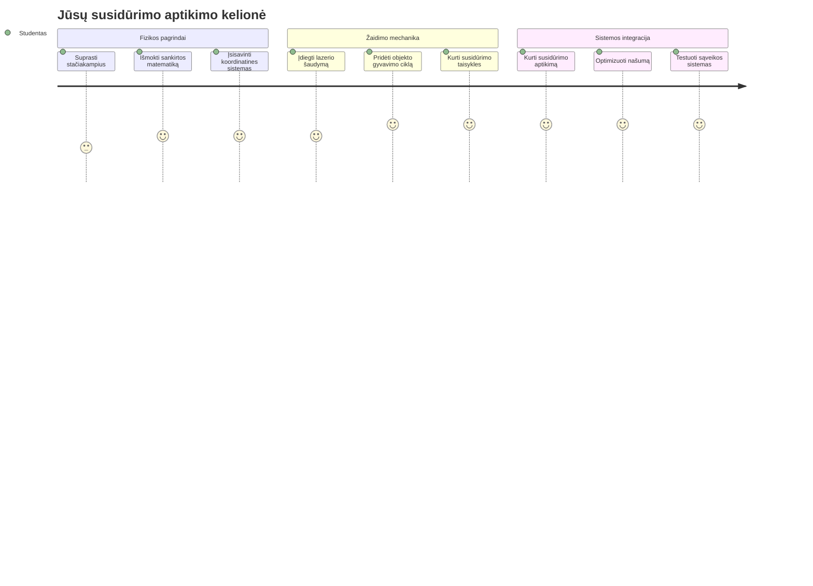
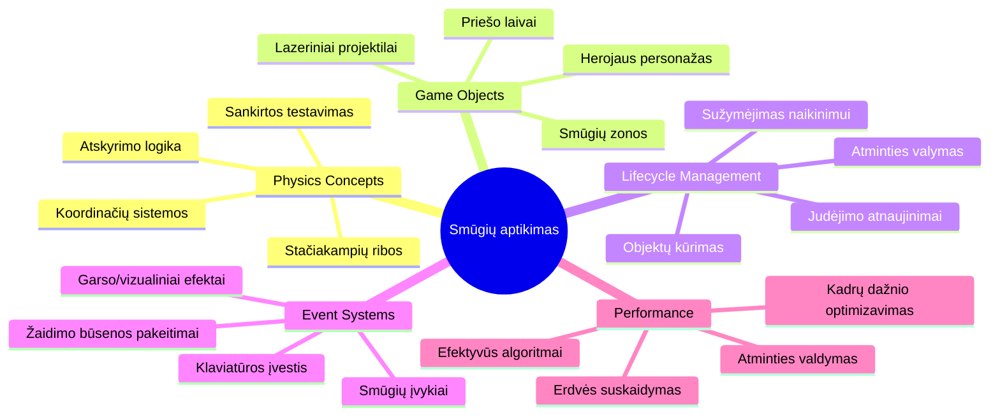
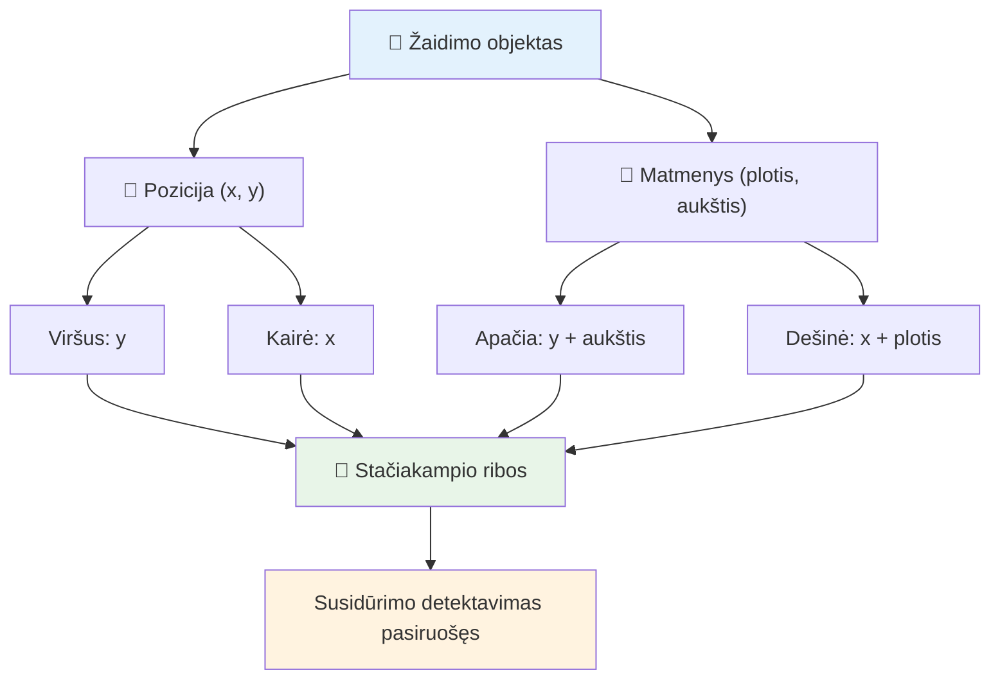
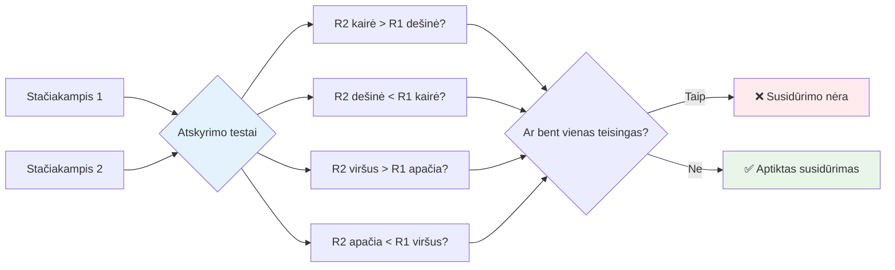
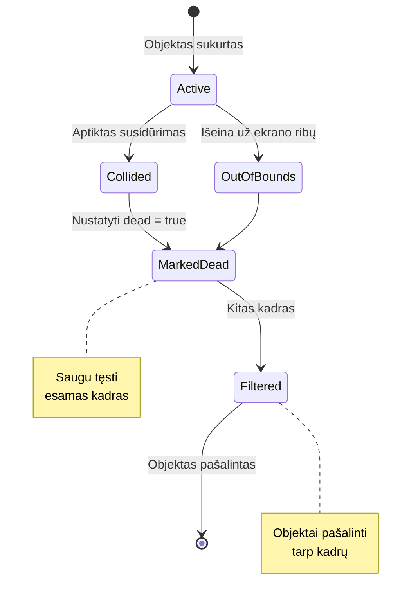
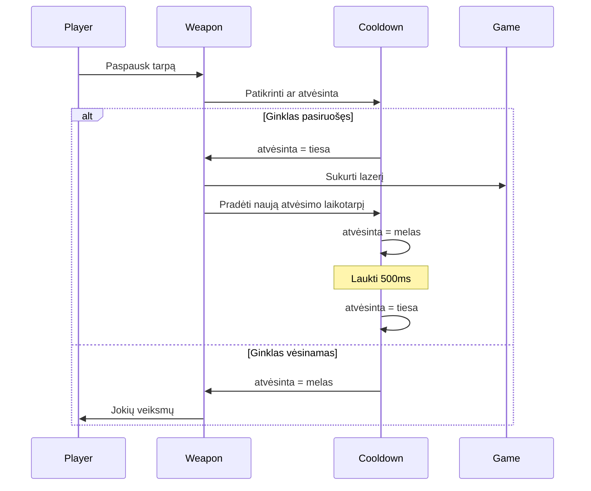
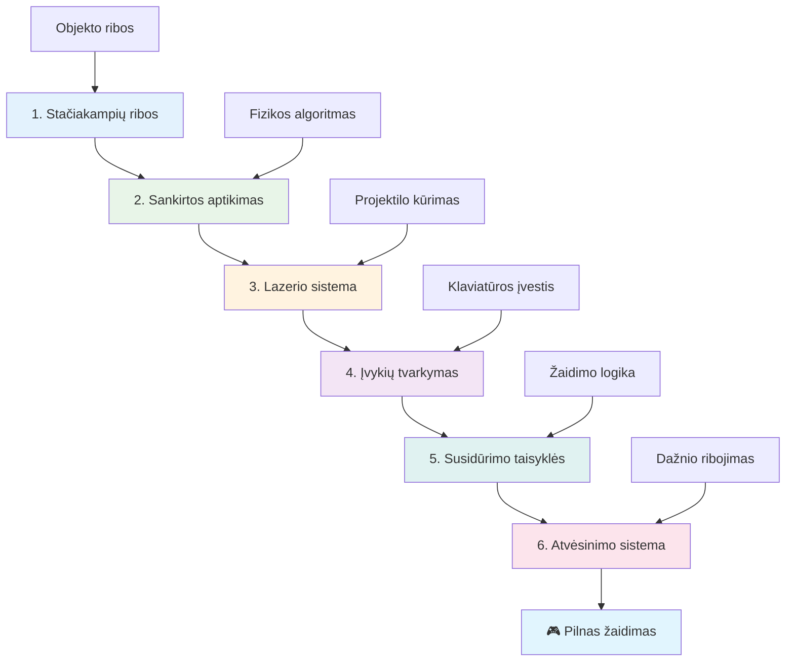
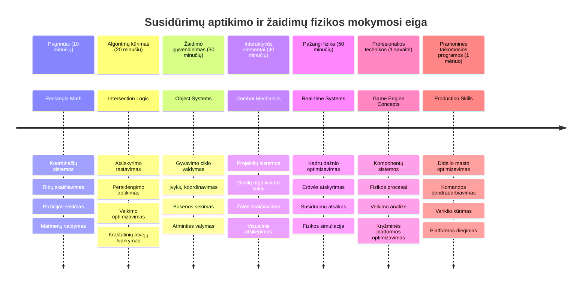

# Sukurkite kosminį žaidimą 4 dalis: Pridėkite lazerį ir aptikite susidūrimus


## Priešpaskaitinis testas

[Priešpaskaitinis testas](https://ff-quizzes.netlify.app/web/quiz/35)

Pagalvokite apie tą akimirką Star Wars, kai Luke protoninės torpedos pataiko į Mirties žvaigždės išmetimo anga. Būtent ši tiksli susidūrimo aptikimo akimirka pakeitė galaktikos likimą! Žaidimuose susidūrimų aptikimas veikia taip pat – nustatoma, kada objektai sąveikauja ir kas įvyksta toliau.

Šioje pamokoje pridėsite lazerinius ginklus savo kosminiame žaidime ir įgyvendinsite susidūrimų aptikimą. Kaip NASA misijų planuotojai skaičiuoja kosminių laivų trajektorijas, kad išvengtų šiukšlių, taip ir jūs mokysitės aptikti, kada žaidimo objektai persidengia. Paskirstysime tai į valdomus žingsnius, kurie vienas kitą papildo.

Pamokos pabaigoje turėsite veikiantį kovos sistemą, kur lazeriai naikina priešus, o susidūrimai sukelia žaidimo įvykius. Šios pačios susidūrimų taisyklės naudojamos nuo fizikos simuliacijų iki interaktyvių interneto sąsajų.


✅ Šiek tiek pasidomėkite pirmuoju kompiuterinio žaidimo pavyzdžiu. Kokias funkcijas jis turėjo?

## Susidūrimų aptikimas

Susidūrimų aptikimas veikia kaip artumo jutikliai Apollo mėnulio modulyje – nuolat tikrina atstumus ir praneša, kai objektai per arti. Žaidimuose ši sistema nustato, kada objektai sąveikauja ir kas turėtų nutikti.

Naudosime metodą, kur kiekvienas žaidimo objektas laikomas stačiakampiu, panašiai kaip oro eismo valdymo sistemos naudoja supaprastintas geometrines formas orlaivių stebėjimui. Šis stačiakampių metodas gali atrodyti paprastas, bet jis skaičiavimo prasme efektyvus ir gerai veikia daugelyje žaidimo situacijų.

### Stačiakampio vaizdavimas

Kiekvienas žaidimo objektas turi koordinatinius ribinius taškus, kaip Marso kelio zondas žemėlapyje nustato savo vietą Marso paviršiuje. Štai kaip apibrėžiame ribines koordinates:


```javascript
rectFromGameObject() {
  return {
    top: this.y,
    left: this.x,
    bottom: this.y + this.height,
    right: this.x + this.width
  }
}
```

**Išskaidykime tai:**
- **Viršutinė kraštinė**: Tai tiesiog vertikalioji jos pradžia (y pozicija)
- **Kairioji kraštinė**: Horizontalioji pradžia (x pozicija)
- **Apatinė kraštinė**: Pridedame aukštį prie y pozicijos – gauname pabaigą
- **Dešinioji kraštinė**: Pridedame plotį prie x pozicijos – turime visą ribą

### Persidengimo algoritmas

Stačiakampių persidengimo aptikimas naudoja logiką, panašią į tą, kaip Hubble kosminis teleskopas nustato, ar dangaus kūnai persidengia jo matymo lauke. Algoritmas tikrina atskyrimo sąlygas:


```javascript
function intersectRect(r1, r2) {
  return !(r2.left > r1.right ||
    r2.right < r1.left ||
    r2.top > r1.bottom ||
    r2.bottom < r1.top);
}
```

**Atstumo testas veikia kaip radarų sistemos:**
- Ar stačiakampis 2 yra visiškai dešinėje nuo stačiakampio 1?
- Ar stačiakampis 2 yra visiškai kairėje nuo stačiakampio 1?
- Ar stačiakampis 2 yra visiškai žemiau nuo stačiakampio 1?
- Ar stačiakampis 2 yra visiškai viršuje nuo stačiakampio 1?

Jei nė viena iš šių sąlygų nėra teisinga, reiškia stačiakampiai persidengia. Ši logika primena, kaip radarų operatoriai nustato, ar du lėktuvai yra saugiu atstumu.

## Objektų gyvavimo ciklo valdymas

Kai lazeris pataiko į priešą, abu objektai turi būti pašalinti iš žaidimo. Tačiau objektų šalinimas vidury ciklo gali sukelti klaidas – tai buvo sunkiai išmokta pamoka ankstyvose Apollo Guidance Computer sistemose. Vietoj to naudojame žymėjimą „pašalinimui“, kad saugiai pašalintume objektus tarp kadrų.


Štai kaip mes žymime objektą pašalinimui:

```javascript
// Pažymėti objektą pašalinimui
enemy.dead = true;
```

**Kodėl šis būdas veikia:**
- Žymime objektą kaip „miręs“, bet jo neduodame naikinti iš karto
- Leidžiame dabartiniam žaidimo kadrui užbaigti saugiai
- Nėra klaidų bandant naudoti jau pašalintą objektą!

Tada filtruojame žymėtus prieš kitą renderį:

```javascript
gameObjects = gameObjects.filter(go => !go.dead);
```

**Ką daro šis filtras:**
- Sukuria naują sąrašą tik su „gyvais“ objektais
- Išmeta viską, kas pažymėta kaip „miręs“
- Užtikrina sklandų žaidimą
- Neleidžia augti atminties nutekėjimui iš sunaikintų objektų

## Lazerio mechanikos įgyvendinimas

Lazeriniai šoviniai žaidimuose veikia kaip fotoninės torpedos Star Treke – tai diskretūs objektai, kurie juda tiesiomis linijomis, kol pataiko į kokį nors objektą. Kiekvieno tarpo paspaudimo metu sukuriamas naujas lazerio objektas, kuris juda ekranu.

Kad tai veiktų, turime suderinti keletą dalių:

**Pagrindiniai komponentai:**
- **Sukurti** lazerio objektus, atsirandančius iš herojų pozicijos
- **Apdoroti** klaviatūros įvestį, kad būtų sukurtas lazeris
- **Valdyti** lazerio judėjimą ir gyvavimo ciklą
- **Įdiegti** lazerio projektilių vizualinį atvaizdavimą

## Šaudymo dažnio valdymas

Neribotas šaudymo dažnis perkrautų žaidimo variklį ir žaidimą padarytų per lengvą. Tikros ginkluotės sistemos susiduria su panašiomis ribomis – net USS Enterprise fazeriai turėjo laiko atsigauti tarp šūvių.

Įdiegsime atvėsinimo sistemą, kuri neleis per greitai šaudyti, išlaikydama reagavimo greitį:


```javascript
class Cooldown {
  constructor(time) {
    this.cool = false;
    setTimeout(() => {
      this.cool = true;
    }, time);
  }
}

class Weapon {
  constructor() {
    this.cooldown = null;
  }
  
  fire() {
    if (!this.cooldown || this.cooldown.cool) {
      // Sukurti lazerio projektilį
      this.cooldown = new Cooldown(500);
    } else {
      // Ginklas vis dar vėsta
    }
  }
}
```

**Kaip veikia atvėsinimas:**
- Sukūrus, ginklas pradeda „karštas“ (negali šaudyti)
- Po laukimo periodo tampa „šaltas“ (pasiruošęs šaudyti)
- Prieš šaudymą tikriname: „Ar ginklas šaltas?“
- Tai neleidžia spaminti, bet palaiko valdymą jautrų

✅ Priminkite sau 1 pamoką iš kosminių žaidimų serijos apie atvėsinimą.

## Susidūrimų sistemos kūrimas

Išplėsite esamą kosminio žaidimo kodą, sukurdami susidūrimų aptikimo sistemą. Kaip Tarptautinės kosminės stoties automatinė susidūrimų išvengimo sistema, jūsų žaidimas nuolat stebės objektų pozicijas ir reaguos į persidengimus.

Pradėdami nuo ankstesnės pamokos kodo, pridėsite susidūrimų aptikimą su specifinėmis taisyklėmis, reguliuojančiomis objektų sąveiką.

> 💡 **Pro patarimas**: lazerio sprite jau įtrauktas į jūsų turto katalogą ir nurodytas kode, pasiruošęs naudoti.

### Įgyvendinosite šias susidūrimo taisykles

**Pridėkite žaidimo mechaniką:**
1. **Lazeris pataiko priešą**: priešo objektas sunaikinamas, kai jį pataiko lazeris
2. **Lazeris pasiekia ekrano ribą**: lazeris pašalinamas, kai pasiekia ekrano viršutinę kraštinę
3. **Priešo ir herojaus susidūrimas**: abu objektai sunaikinami persidengus
4. **Priešas pasiekia apačią**: žaidimo pabaigos sąlyga, kai priešai pasiekia ekrano apačią

### 🔄 **Pedagoginė patikra**
**Susidūrimų aptikimo pagrindai:** Prieš pradedant įgyvendinti, įsitikinkite, kad suprantate:
- ✅ Kaip stačiakampių ribos apibrėžia susidūrimo zonas
- ✅ Kodėl atskyrimo testas efektyvesnis už persidengimo skaičiavimą
- ✅ Objektų gyvavimo ciklo valdymo svarbą žaidimo cikluose
- ✅ Kaip įvykių valdymo sistemos koordinuoja susidūrimų atsakymus

**Greita savitikra:** Kas nutiktų, jei ištrintumėte objektus iškart, o ne pažymėtumėte juos?
*Atsakymas: Ištrynimas vidury ciklo gali sukelti klaidas arba praleisti objektus iteracijoje*

**Fizikos supratimas:** Jūs suprantate:
- **Koordinačių sistemas:** kaip pozicija ir matmenys apibrėžia ribas
- **Persidengimų logiką:** matematiniai principai už susidūrimų aptikimo
- **Veikimo optimizavimą:** kodėl efektyvūs algoritmai svarbūs realiu laiku
- **Atminties valdymą:** saugios gyvavimo ciklo praktikos stabilumui

## Plėtros aplinkos paruošimas

Geros naujienos – didžiąją darbo dalį jau padarėme už jus! Visos jūsų žaidimo priemonės ir bazinė struktūra laukia `your-work` subaplanke, pasiruošusios pridėti įdomias susidūrimų funkcijas.

### Projekto struktūra

```bash
-| assets
  -| enemyShip.png
  -| player.png
  -| laserRed.png
-| index.html
-| app.js
-| package.json
```

**Failų struktūros supratimas:**
- **Turi** visas sprite paveikslėlius žaidimo objektams
- **Įtraukia** pagrindinį HTML dokumentą ir JavaScript programą
- **Pateikia** paketų konfigūraciją vietiniam kūrimo serveriui

### Vietinio serverio paleidimas

Eikite į projekto katalogą ir paleiskite vietinį serverį:

```bash
cd your-work
npm start
```

**Ši komandų seka:**
- **Pereina** į jūsų darbo projekto aplanką
- **Paleidžia** vietinį HTTP serverį adresu `http://localhost:5000`
- **Teikia** žaidimo failus testavimui ir kūrimui
- **Leidžia** tiesioginį kūrimą su automatinio perkrovimo funkcija

Atverkite naršyklę ir eikite į `http://localhost:5000`, kad pamatytumėte dabartinę žaidimo būseną su herojumi ir priešais.

### Įgyvendinimas žingsnis po žingsnio

Kaip NASA sistemingai programavo Voyager kosminius laivus, taip ir mes metodologiškai įdiegsime susidūrimų aptikimą, kuriant kiekvieną komponentą paeiliui.


#### 1. Pridėkite stačiakampių ribas

Pirmiausia išmokykime žaidimo objektus apibrėžti savo ribas. Šį metodą pridėkite prie `GameObject` klasės:

```javascript
rectFromGameObject() {
    return {
      top: this.y,
      left: this.x,
      bottom: this.y + this.height,
      right: this.x + this.width,
    };
  }
```

**Šis metodas daro:**
- **Sukuria** stačiakampio objektą su tiksliomis ribinėmis koordinatėmis
- **Apskaičiuoja** apatinę ir dešinę kraštines naudojant poziciją ir matmenis
- **Grąžina** objektą, paruoštą aptikimo algoritmams
- **Suteikia** standartizuotą sąsają visiems žaidimo objektams

#### 2. Įgyvendinkite persidengimo aptikimą

Dabar sukurkime susidūrimų detektyvą – funkciją, kuri nustato, ar du stačiakampiai persidengia:

```javascript
function intersectRect(r1, r2) {
  return !(
    r2.left > r1.right ||
    r2.right < r1.left ||
    r2.top > r1.bottom ||
    r2.bottom < r1.top
  );
}
```

**Algoritmas dirba taip:**
- **Tiria** keturias atskyrimo sąlygas stačiakampiams
- **Grąžina** `false`, jei bent viena sąlyga teisė
- **Nurodo** susidūrimą, jei atskyrimų nėra
- **Naudoja** negacijos logiką efektyviam testavimui

#### 3. Įgyvendinkite lazerio paleidimo sistemą

Štai kur prasideda įdomybės! Įveskime lazerio šaudymo sistemą.

##### Pranešimų konstantos

Pirmiausia apibrėžkime pranešimų tipus, kad skirtingos žaidimo dalys galėtų bendrauti:

```javascript
KEY_EVENT_SPACE: "KEY_EVENT_SPACE",
COLLISION_ENEMY_LASER: "COLLISION_ENEMY_LASER",
COLLISION_ENEMY_HERO: "COLLISION_ENEMY_HERO",
```

**Šios konstantos suteikia:**
- **Standardizuoja** įvykių pavadinimus visame kode
- **Leidžia** nuosekliai bendrauti tarp sistemų
- **Padeda** išvengti klaidų registruojant valdiklius

##### Klaviatūros įvesties tvarkymas

Į savo klavišų įvykio klausytoją pridėkite tarpo klavišo detektavimą:

```javascript
} else if(evt.keyCode === 32) {
  eventEmitter.emit(Messages.KEY_EVENT_SPACE);
}
```

**Šis įvesties tvarkyklė:**
- **Aptinka** tarpo klavišo paspaudimus (keyCode 32)
- **Išmeta** standartizuotą įvykio pranešimą
- **Leidžia** atsietai tvarkyti šaudymo logiką

##### Įvykio klausytojo nustatymas

Registruokite šaudymo elgseną `initGame()` funkcijoje:

```javascript
eventEmitter.on(Messages.KEY_EVENT_SPACE, () => {
 if (hero.canFire()) {
   hero.fire();
 }
});
```

**Šis klausytojas:**
- **Reaguoja** į tarpo klavišo įvykius
- **Tikrino** ar yra atvėsinimo laikas
- **Sukuria** lazerį, jei leidžiama šauti

Pridėkite susidūrimų tvarkymą tarp lazerio ir priešo:

```javascript
eventEmitter.on(Messages.COLLISION_ENEMY_LASER, (_, { first, second }) => {
  first.dead = true;
  second.dead = true;
});
```

**Šis tvarkytuvas:**
- **Priima** susidūrimo duomenis su abiem objektais
- **Žymi** abu objektus pašalinimui
- **Užtikrina** tinkamą valymą po susidūrimo

#### 4. Sukurkite Laser klasę

Įgyvendinkite lazerio projektilį, kuris juda aukštyn ir valdo savo gyvavimo ciklą:

```javascript
class Laser extends GameObject {
  constructor(x, y) {
    super(x, y);
    this.width = 9;
    this.height = 33;
    this.type = 'Laser';
    this.img = laserImg;
    
    let id = setInterval(() => {
      if (this.y > 0) {
        this.y -= 15;
      } else {
        this.dead = true;
        clearInterval(id);
      }
    }, 100);
  }
}
```

**Šios klasės įgyvendinimas:**
- **Išplečia** GameObject klasę
- **Nustato** tinkamus lazerio matmenis
- **Sukuria** automatinį judėjimą aukštyn su `setInterval()`
- **Tvarko** savaiminį sunaikinimą pasiekus ekraną
- **Valdo** animacijos laiką ir valymą

#### 5. Įgyvendinkite susidūrimų aptikimo sistemą

Sukurkite visapusišką susidūrimų aptikimo funkciją:

```javascript
function updateGameObjects() {
  const enemies = gameObjects.filter(go => go.type === 'Enemy');
  const lasers = gameObjects.filter(go => go.type === "Laser");
  
  // Išbandyti lazerio ir priešo susidūrimus
  lasers.forEach((laser) => {
    enemies.forEach((enemy) => {
      if (intersectRect(laser.rectFromGameObject(), enemy.rectFromGameObject())) {
        eventEmitter.emit(Messages.COLLISION_ENEMY_LASER, {
          first: laser,
          second: enemy,
        });
      }
    });
  });

  // Pašalinti sunaikintus objektus
  gameObjects = gameObjects.filter(go => !go.dead);
}
```

**Ši sistema:**
- **Filtruoja** žaidimo objektus pagal tipą efektyvumui
- **Tiria** kiekvieną lazerį su kiekvienu priešu persidengimams
- **Išmeta** susidūrimo įvykius aptikus persidengimą
- **Išvalo** sunaikintus objektus po apdorojimo

> ⚠️ **Svarbu**: Įdėkite `updateGameObjects()` į pagrindinį žaidimo ciklą `window.onload` funkcijoje, kad įgalintumėte susidūrimų aptikimą.

#### 6. Pridėkite atvėsinimo sistemą Hero klasei

Patobulinkite Hero klasę su šaudymo mechanika ir šaudymo dažnio ribojimu:

```javascript
class Hero extends GameObject {
  constructor(x, y) {
    super(x, y);
    this.width = 99;
    this.height = 75;
    this.type = "Hero";
    this.speed = { x: 0, y: 0 };
    this.cooldown = 0;
  }
  
  fire() {
    gameObjects.push(new Laser(this.x + 45, this.y - 10));
    this.cooldown = 500;

    let id = setInterval(() => {
      if (this.cooldown > 0) {
        this.cooldown -= 100;
      } else {
        clearInterval(id);
      }
    }, 200);
  }
  
  canFire() {
    return this.cooldown === 0;
  }
}
```

**Hero klasės patobulinimai:**
- **Inicijuoja** atvėsinimo laikmatį nulį (paruoštas šauti)
- **Sukuria** lazerio objektus virš herojų laivo
- **Nustato** atvėsinimo periodą, kad ribotų greitą šaudymą
- **Mažina** atvėsinimo laikmatį intervalais
- **Teikia** šaudymo galimybės patikrą per `canFire()` metodą

### 🔄 **Pedagoginė patikra**
**Visuminis sistemos supratimas:** Patikrinkite savo susidūrimų sistemos įvaldymą:
- ✅ Kaip stačiakampių ribos leidžia efektyviai aptikti susidūrimus?
- ✅ Kodėl objektų gyvavimo ciklo valdymas svarbus žaidimo stabilumui?
- ✅ Kaip atvėsinimo sistema neleidžia apkrauti veikimo našumo?
- ✅ Kokį vaidmenį atlieka įvykių valdymo architektūra susidūrimų tvarkyme?

**Sistemos integracija:** Jūsų susidūrimų aptikimas demonstruoja:
- **Matematinį tikslumą:** Stačiakampių sankirtų algoritmai
- **Veikimo optimizavimą:** Efektyvios susidūrimų testavimo praktikos
- **Atminties valdymą:** Saugų objektų kūrimą ir naikinimą
- **Įvykių koordinavimą:** Atsietą sistemų komunikaciją
- **Realaus laiko apdorojimą:** Kadrų bazinius atnaujinimus

**Profesionalūs modeliai:** Jūs įdiegėte:
- **Sąlygų atskyrimą:** Fizikos, grafinį atvaizdavimą ir įvestį atskirai
- **Objektinį dizainą:** Paveldėjimą ir polimorfizmą
- **Būsenos valdymą:** Objektų gyvavimo ciklą ir žaidimo būsenos sekimą
- **Veikimo optimizavimą:** Efektyvius algoritmus realiam laikui

### Testavimas

Jūsų kosminis žaidimas dabar turi pilną susidūrimų aptikimo ir kovos mechaniką. 🚀 Išbandykite naujas galimybes:
- **Valdykite** žaidimą rodyklėmis, kad patikrintumėte judėjimą
- **Šaudykite lazeriais** tarpuku – pastebėkite, kaip atvėsinimo sistema neleidžia spaminti
- **Stebėkite susidūrimus** – kai lazeriai pataiko į priešus, jie pašalinami
- **Patikrinkite valymo procesą**, kai sunaikinti objektai dingsta iš žaidimo

Sėkmingai įdiegėte susidūrimų aptikimą naudodami tuos pačius matematikos principus, kurie padeda naviguoti kosminius laivus ir robotus.

### ⚡ **Kas per artimiausius 5 minutes galite padaryti**
- [ ] Atidarykite naršyklės kūrėjo įrankius ir nustatykite taškus savo susidūrimų aptikimo funkcijoje
- [ ] Pabandykite keisti lazerio greitį ar priešo judėjimą, kad pamatytumėte susidūrimo efektus
- [ ] Eksperimentuokite su skirtingais atvėsinimo laikais, kad išbandytumėte šaudymo dažnius
- [ ] Pridėkite `console.log` sakinius, kad realiu laiku stebėtumėte susidūrimų įvykius

### 🎯 **Ką galite pasiekti per šią valandą**
- [ ] Užbaikite po pamokos testą ir supraskite susidūrimų aptikimo algoritmus
- [ ] Pridėkite vizualinius efektus, kaip sprogimus, kai įvyksta susidūrimas
- [ ] Įgyvendinkite skirtingų tipų projektilus su įvairiomis savybėmis
- [ ] Sukurkite jėgos stiprinimus, laikinai pagerinančius žaidėjo gebėjimus
- [ ] Pridėkite garso efektus, kad susidūrimai būtų patrauklesni

### 📅 **Jūsų savaitės trukmės fizikos programavimas**
- [ ] Užbaikite visą kosmoso žaidimą su tobulai veikiančiomis susidūrimų sistemomis
- [ ] Įgyvendinkite pažangias susidūrimų formas už stačiakampių ribų (apskritimai, daugiakampiai)
- [ ] Pridėkite dalelių sistemas, kad sprogimai atrodytų realistiškiau
- [ ] Sukurkite sudėtingą priešo elgesį, vengiantį susidūrimų
- [ ] Optimizuokite susidūrimų aptikimą, kad geriau veiktų daug objektų atveju
- [ ] Pridėkite fizikos simuliaciją, kaip impulsas ir realistiškas judėjimas

### 🌟 **Jūsų mėnesio trukmės žaidimų fizikos įvaldymas**
- [ ] Kurkite žaidimus su pažangiais fizikos varikliais ir realistiškomis simuliacijomis
- [ ] Išmokite 3D susidūrimų aptikimą ir erdvės padalijimo algoritmus
- [ ] Prisidėkite prie atvirojo kodo fizikos bibliotekų ir žaidimų variklių vystymo
- [ ] Įvaldykite našumo optimizavimą grafikos intensyvioms programoms
- [ ] Kurkite mokomąją medžiagą apie žaidimų fiziką ir susidūrimų aptikimą
- [ ] Sukurkite portfelį, demonstruojantį pažangius fizikos programavimo įgūdžius

## 🎯 Jūsų susidūrimų aptikimo įgūdžių įvaldymo tvarkaraštis


### 🛠️ Jūsų žaidimų fizikos įrankių santrauka

Baigus šią pamoką Jūs įvaldėte:
- **Susidūrimų matematika**: Stačiakampių sankirtos algoritmai ir koordinačių sistemos
- **Našumo optimizavimas**: Efektyvus susidūrimų aptikimas realaus laiko programose
- **Objektų gyvavimo valdymas**: Saugūs kūrimo, atnaujinimo ir šalinimo modeliai
- **Įvykių pagrindu sukurta architektūra**: Atskirtos sistemos susidūrimų reakcijai
- **Žaidimo ciklo integracija**: Frazėmis pagrįsti fizikos atnaujinimai ir vaizdų suderinimas
- **Įvesties sistemos**: Reaguojantys valdikliai su dažnio apribojimu ir grįžtamuoju ryšiu
- **Atminties valdymas**: Efektyvus objektų kaupimas ir išvalymas

**Realaus pasaulio panaudojimas**: Jūsų susidūrimų aptikimo įgūdžiai tiesiogiai pritaikomi:
- **Interaktyvios simuliacijos**: Moksliniai modeliavimai ir mokomieji įrankiai
- **Naudotojo sąsajų dizainas**: Vilkimo ir metimo veiksmų bei lietimo aptikimas
- **Duomenų vizualizacija**: Interaktyvūs diagramos ir spustelėjami elementai
- **Mobilioji kūrimas**: Lietimo gestų atpažinimas ir susidūrimų valdymas
- **Robotikos programavimas**: Maršruto planavimas ir kliūčių vengimas
- **Kompiuterinė grafika**: Spindulių sekimas ir erdvės algoritmai

**Gauti profesiniai įgūdžiai**: Dabar galite:
- **Kurkite** efektyvius algoritmus realaus laiko susidūrimų aptikimui
- **Įgyvendinkite** fizikos sistemas, pritaikytas prie objektų sudėtingumo
- **Debug'inkite** sudėtingas sąveikos sistemas taikant matematinius principus
- **Optimizuokite** našumą skirtingoms aparatūros ir naršyklių galimybėms
- **Architektuokite** palaikomus žaidimų sistemas naudodami patikrintus dizaino modelius

**Įvaldytos žaidimų kūrimo sąvokos**:
- **Fizikos simuliacija**: Realiojo laiko susidūrimų aptikimas ir reakcija
- **Našumo inžinerija**: Optimizuoti algoritmai interaktyvioms programoms
- **Įvykių sistemos**: Atskirta komunikacija tarp žaidimų komponentų
- **Objektų valdymas**: Efektyvūs gyvavimo ciklo modeliai dinamiškai turiniui
- **Įvesties apdorojimas**: Reaguojantys valdikliai su tinkamu grįžtamuoju ryšiu

**Kitas lygis**: Esate pasirengę tyrinėti pažangius fizikos variklius, kaip Matter.js, įgyvendinti 3D susidūrimų aptikimą ar kurti sudėtingas dalelių sistemas!

🌟 **Pasiekimas atrakintas**: Sukūrėte pilną fizika pagrįstą sąveikos sistemą su profesionalaus lygio susidūrimų aptikimu!

## GitHub Copilot Agent Iššūkis 🚀

Naudokite Agent režimą užduoties įgyvendinimui:

**Aprašymas:** Patobulinkite susidūrimų aptikimo sistemą, įgyvendindami jėgos stiprinimus, kurie atsiranda atsitiktinai ir suteikia laikinus gebėjimus, kai herojinė laivas juos surenka.

**Užklausa:** Sukurkite PowerUp klasę, besitęsiančią nuo GameObject, ir įgyvendinkite susidūrimų aptikimą tarp herojaus ir jėgos stiprinimų. Įtraukite bent du jėgos stiprinimų tipus: vieną, kuris padidina šaudymo greitį (sumažina atšalimo laiką), ir kitą, kuris sukuria laikiną skydą. Įtraukite sugeneravimo logiką, kuri jėgos stiprinimus kuria atsitiktiniais intervalais ir vietomis.

---


## 🚀 Iššūkis

Pridėkite sprogimą! Pažvelkite į žaidimo išteklius [the Space Art repo](../../../../6-space-game/solution/spaceArt/readme.txt) ir pabandykite pridėti sprogimą, kai lazeris pataiko į ateivį

## Po paskaitos testas

[Po paskaitos testas](https://ff-quizzes.netlify.app/web/quiz/36)

## Peržiūra ir savarankiškas mokymasis

Eksperimentuokite su intervalais savo žaidime iki šiol. Kas nutinka, kai juos pakeičiate? Skaitykite daugiau apie [JavaScript laikmačių įvykius](https://www.freecodecamp.org/news/javascript-timing-events-settimeout-and-setinterval/).

## Užduotis

[Pažinkite susidūrimus](assignment.md)

---

<!-- CO-OP TRANSLATOR DISCLAIMER START -->
**Atsakomybės apribojimas**:  
Šis dokumentas buvo išverstas naudojant dirbtinio intelekto vertimo paslaugą [Co-op Translator](https://github.com/Azure/co-op-translator). Nors stengiamės užtikrinti tikslumą, atkreipkite dėmesį, kad automatizuoti vertimai gali turėti klaidų arba netikslumų. Originalus dokumentas gimtąja kalba turėtų būti laikomas autoritetingu šaltiniu. Svarbiai informacijai rekomenduojama naudoti profesionalų žmogaus vertimą. Mes neatsakome už bet kokius nesusipratimus ar neteisingus interpretavimus, atsiradusius naudojant šį vertimą.
<!-- CO-OP TRANSLATOR DISCLAIMER END -->