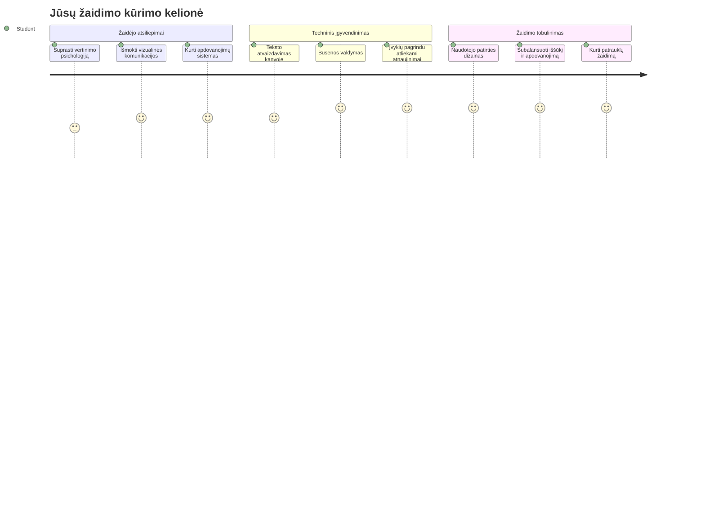
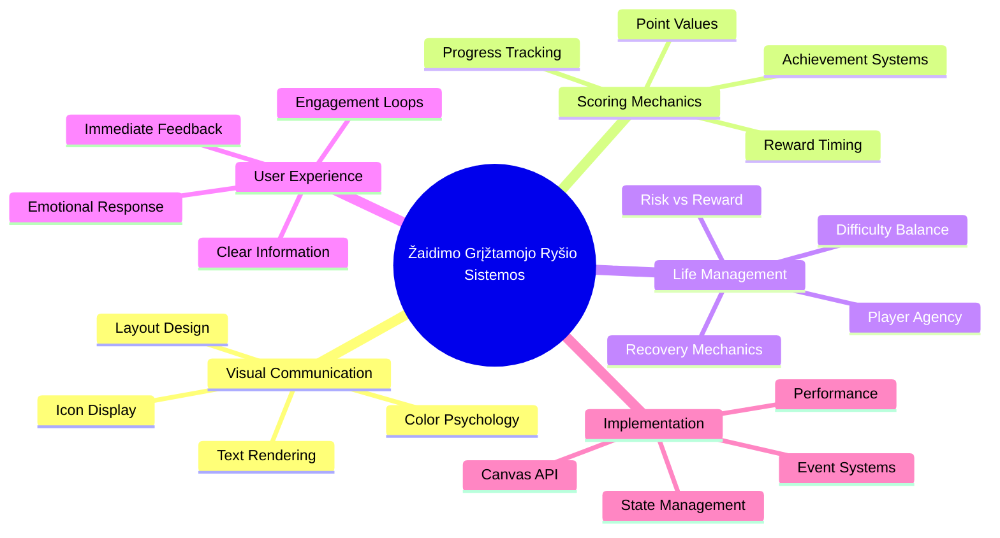
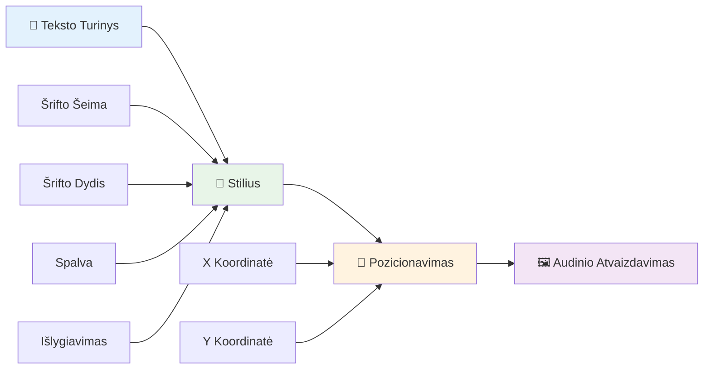
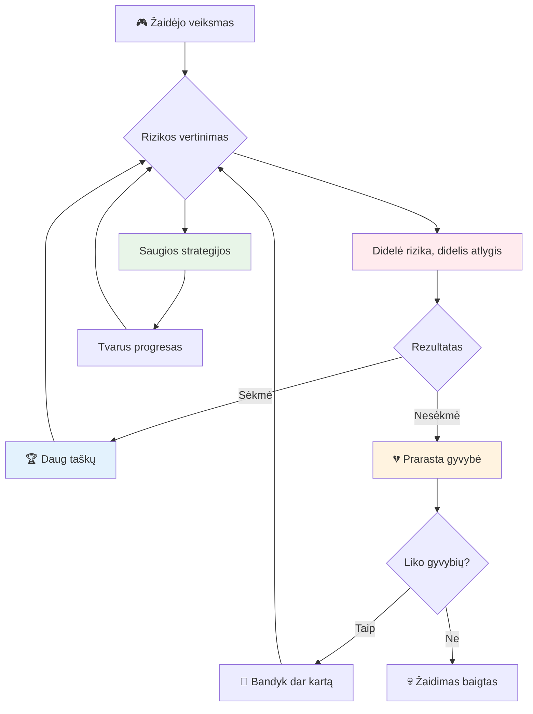
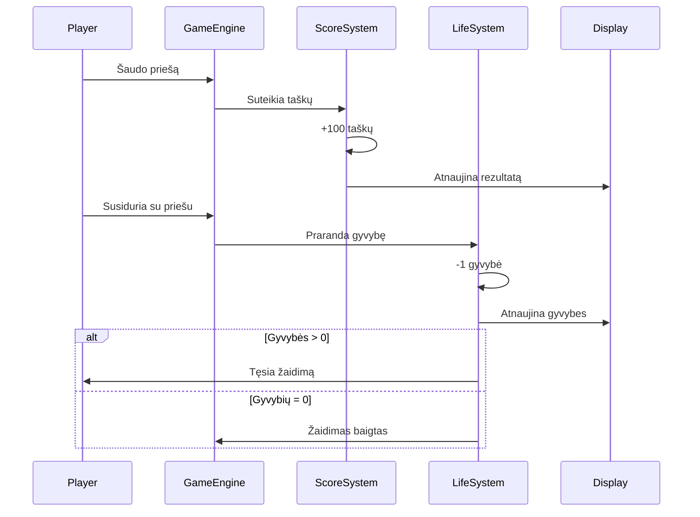
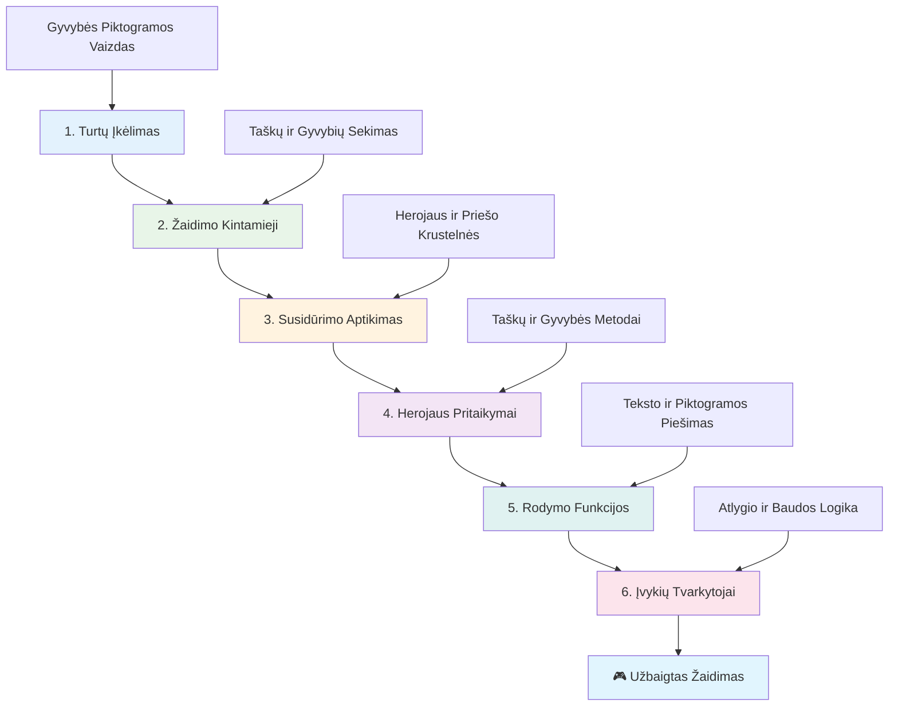
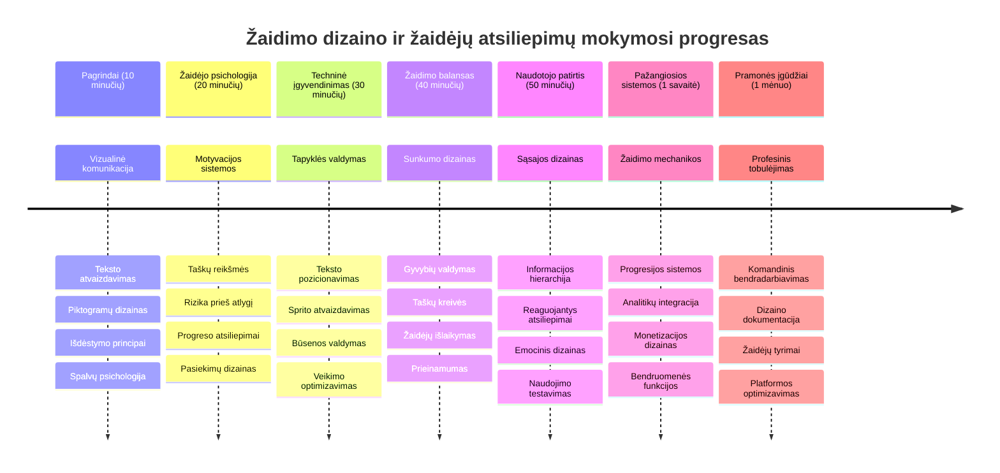

<!--
CO_OP_TRANSLATOR_METADATA:
{
  "original_hash": "2ed9145a16cf576faa2a973dff84d099",
  "translation_date": "2026-01-07T11:31:02+00:00",
  "source_file": "6-space-game/5-keeping-score/README.md",
  "language_code": "lt"
}
-->
# Sukurkite kosmoso žaidimą 5 dalis: taškų skaičiavimas ir gyvybės


## Priešpaskaitinis testas

[Priešpaskaitinis testas](https://ff-quizzes.netlify.app/web/quiz/37)

Pasiruošę, kad jūsų kosmoso žaidimas jaustųsi tikru žaidimu? Pridėsime taškų skaičiavimą ir gyvybių valdymą – pagrindines mechanikas, kurios paverčia ankstyvuosius arkadinius žaidimus, kaip Space Invaders, iš paprastų demonstracijų į priklausomybę sukeliančią pramogą. Čia jūsų žaidimas tampa tikrai žaidžiamas.


## Teksto atvaizdavimas ekrane – jūsų žaidimo balsas

Norėdami parodyti savo rezultatus, turime išmokti, kaip atvaizduoti tekstą ant drobės. `fillText()` metodas yra pagrindinis įrankis tam – ta pati technika buvo naudojama klasikiniuose arkadiniuose žaidimuose rezultatams ir būsenos informacijai rodyti.


Galite visiškai kontroliuoti teksto išvaizdą:

```javascript
ctx.font = "30px Arial";
ctx.fillStyle = "red";
ctx.textAlign = "right";
ctx.fillText("show this on the screen", 0, 0);
```

✅ Gilinkitės į [teksto pridėjimą prie drobės](https://developer.mozilla.org/docs/Web/API/Canvas_API/Tutorial/Drawing_text) – galite nustebti, kokia kūrybinga galite būti su šriftais ir stiliais!

## Gyvybės – daugiau nei paprastas skaičius

Žaidimų dizainuose „gyvybė“ reiškia žaidėjo klaidų rezervą. Ši sąvoka siekia pinbolo mašinas, kur gaudavote kelis kamuoliukus žaidimui. Ankstyvuosiuose vaizdo žaidimuose, tokiuose kaip Asteroids, gyvybės suteikdavo žaidėjams leidimą rizikuoti ir mokytis iš klaidų.


Vizualinis atvaizdavimas labai svarbus – laivo ikonų rodymas vietoje tik „Gyvybės: 3“ suteikia momentinį vaizdinį atpažinimą, panašiai kaip ankstyvieji arkadiniai automatų galėjo naudoti ikonografiją bendrauti per kalbų barjerus.

## Jūsų žaidimo atlygio sistemos kūrimas

Dabar įgyvendinsime pagrindines atsiliepimų sistemas, kurios išlaiko žaidėjus įsitraukusius:


- **Taškų sistema**: Kiekvienas sunaikintas priešo laivas suteikia 100 taškų (apvalūs skaičiai žaidėjams lengvesni protui). Rezultatas rodomas apatiniame kairiajame kampe.
- **Gyvybių skaitiklis**: Jūsų herojus pradeda turėdamas tris gyvybes – standartą, nustatytą ankstyvuose arkadiniuose žaidimuose, siekiant suderinti iššūkį su žaidžiamumu. Kiekvienas susidūrimas su priešu kainuoja vieną gyvybę. Likusios gyvybės rodomos apatiniame dešiniajame kampe, naudojant laivo ikonas .

## Pradėkime kurti!

Pirmiausia paruoškite savo darbo vietą. Eikite į failus savo `your-work` poaplankyje. Turėtumėte matyti šiuos failus:

```bash
-| assets
  -| enemyShip.png
  -| player.png
  -| laserRed.png
-| index.html
-| app.js
-| package.json
```

Norėdami išbandyti savo žaidimą, paleiskite kūrimo serverį iš `your_work` aplanko:

```bash
cd your-work
npm start
```

Tai paleidžia vietinį serverį adresu `http://localhost:5000`. Atidarykite šį adresą naršyklėje, kad pamatytumėte savo žaidimą. Išbandykite valdymą su rodyklių klavišais ir pabandykite šaudyti priešus, kad įsitikintumėte, jog viskas veikia.


### Laikas koduoti!

1. **Pažaiskite su vizualiniais ištekliais, kurių reikės**. Nukopijuokite `life.png` failą iš `solution/assets/` aplanko į savo `your-work` aplanką. Tada pridėkite lifeImg prie savo window.onload funkcijos:

    ```javascript
    lifeImg = await loadTexture("assets/life.png");
    ```

1. Nepamirškite pridėti `lifeImg` prie savo išteklių sąrašo:

    ```javascript
    let heroImg,
    ...
    lifeImg,
    ...
    eventEmitter = new EventEmitter();
    ```
  
2. **Nustatykite žaidimo kintamuosius**. Pridėkite kodą, kuris sekė bendrą rezultatą (pradinis – 0) ir likusias gyvybes (pradinis – 3). Šias vertes rodysime ekrane, kad žaidėjai visada žinotų, kur jie stovi.

3. **Įgyvendinkite susidūrimų aptikimą**. Išplėskite `updateGameObjects()` funkciją, kad nustatyti, kada priešai susiduria su jūsų herojumi:

    ```javascript
    enemies.forEach(enemy => {
        const heroRect = hero.rectFromGameObject();
        if (intersectRect(heroRect, enemy.rectFromGameObject())) {
          eventEmitter.emit(Messages.COLLISION_ENEMY_HERO, { enemy });
        }
      })
    ```

4. **Pridėkite gyvybių ir taškų sekimą prie savo Herojaus**.  
   1. **Inicializuokite skaitiklius**. Po `this.cooldown = 0` Hero klasėje pridėkite gyvybes ir taškus:

        ```javascript
        this.life = 3;
        this.points = 0;
        ```

   1. **Rodykite šias vertes žaidėjui**. Sukurkite funkcijas, kurios atvaizduoja šias vertes ekrane:

        ```javascript
        function drawLife() {
          // PADARYTI, 35, 27
          const START_POS = canvas.width - 180;
          for(let i=0; i < hero.life; i++ ) {
            ctx.drawImage(
              lifeImg, 
              START_POS + (45 * (i+1) ), 
              canvas.height - 37);
          }
        }
        
        function drawPoints() {
          ctx.font = "30px Arial";
          ctx.fillStyle = "red";
          ctx.textAlign = "left";
          drawText("Points: " + hero.points, 10, canvas.height-20);
        }
        
        function drawText(message, x, y) {
          ctx.fillText(message, x, y);
        }

        ```

   1. **Įtraukkite viską į žaidimo ciklą**. Pridėkite šias funkcijas prie savo window.onload funkcijos iškart po `updateGameObjects()`:

        ```javascript
        drawPoints();
        drawLife();
        ```

### 🔄 **Pedagoginis patikrinimas**
**Žaidimo dizaino supratimas**: Prieš įgyvendinant pasekmes, įsitikinkite, kad suprantate:
- ✅ Kaip vizualinė reakcija perduoda žaidimo būseną žaidėjams
- ✅ Kodėl nuoseklus UI elementų išdėstymas gerina naudojimo patogumą
- ✅ Psichologiją už taškų vertinimo ir gyvybių valdymo
- ✅ Kaip drobės teksto atvaizdavimas skiriasi nuo HTML teksto

**Greitas savitikrinimas**: Kodėl arkadiniai žaidimai paprastai naudoja apvalius skaičius taškams?
*Atsakymas: Apvalūs skaičiai lengviau skaičiuojami mintyse ir sukuria malonius psichologinius apdovanojimus.*

**Vartotojo patirties principai**: Dabar taikote:
- **Vizualinę hierarchiją**: Svarbią informaciją pateikti ryškiai
- **Momentinę reakciją**: Realiojo laiko atnaujinimus žaidėjo veiksmams
- **Kognityvinę apkrovą**: Paprastą ir aiškų informacijos pateikimą
- **Emocinį dizainą**: Ikonas ir spalvas, kurios sukuria žaidėjo ryšį

1. **Įgyvendinkite žaidimo pasekmes ir apdovanojimus**. Dabar pridėsime atsiliepimų sistemas, kurios daro žaidėjo veiksmus prasmingais:

   1. **Susidūrimai kainuoja gyvybes**. Kiekvieną kartą, kai jūsų herojus susiduria su priešu, prarandate gyvybę.
   
      Pridėkite šį metodą prie savo Hero klasės:

        ```javascript
        decrementLife() {
          this.life--;
          if (this.life === 0) {
            this.dead = true;
          }
        }
        ```

   2. **Šaudant į priešus – taškai**. Kiekvienas sėkmingas pataikymas suteikia 100 taškų, tai suteikia momentinį teigiamą atsiliepimą už tikslią šaudymą.

      Išplėskite Hero klasę šiuo didinimo metodu:
    
        ```javascript
          incrementPoints() {
            this.points += 100;
          }
        ```

        Dabar prijunkite šias funkcijas prie susidūrimo įvykių:

        ```javascript
        eventEmitter.on(Messages.COLLISION_ENEMY_LASER, (_, { first, second }) => {
           first.dead = true;
           second.dead = true;
           hero.incrementPoints();
        })

        eventEmitter.on(Messages.COLLISION_ENEMY_HERO, (_, { enemy }) => {
           enemy.dead = true;
           hero.decrementLife();
        });
        ```

✅ Domina kiti žaidimai, sukurti naudojant JavaScript ir Canvas? Ištirkite – galite nustebti, ką galima sukurti!

Įgyvendinę šias funkcijas, išbandykite žaidimą ir pamatykite visišką atsiliepimų sistemą veikime. Turėtumėte matyti gyvybių ikonas apačioje dešinėje, rezultatus – apačioje kairėje, ir stebėti, kaip susidūrimai mažina gyvybes, o sėkmingi šūviai didina taškus.

Jūsų žaidimas dabar turi esmines mechanikas, kurios darė ankstyvuosius arkadinius žaidimus tokiais įtraukiančiais – aiškus tikslas, momentinė reakcija ir prasmingos pasekmės už žaidėjo veiksmus.

### 🔄 **Pedagoginis patikrinimas**
**Visas žaidimo dizaino sistema**: Patikrinkite savo žaidėjo atsiliepimų sistemų supratimą:
- ✅ Kaip taškų mechanika kuria žaidėjo motyvaciją ir įsitraukimą?
- ✅ Kodėl vizualinis nuoseklumas svarbus vartotojo sąsajos dizainui?
- ✅ Kaip gyvybių sistema balansuojama iššūkį su žaidėjo išlaikymu?
- ✅ Kokią reikšmę turi momentinė reakcija kuriant malonų žaidimą?

**Sistemos integracija**: Jūsų atsiliepimų sistema demonstruoja:
- **Vartotojo patirties dizainą**: Aiškią vizualinę komunikaciją ir informacijos hierarchiją
- **Įvykių varomą architektūrą**: Reaguojančius atnaujinimus į žaidėjo veiksmus
- **Būsenos valdymą**: Dinaminės žaidimo informacijos sekimą ir rodymą
- **Drobes meistriškumą**: Teksto atvaizdavimą ir sprite pozicionavimą
- **Žaidimo psichologiją**: Žaidėjo motyvacijos ir įsitraukimo supratimą

**Profesionalūs modeliai**: Įgyvendinote:
- **MVC architektūrą**: Žaidimo logikos, duomenų ir pateikimo atskyrimą
- **Stebėtojo modelį**: Įvykių varomus atnaujinimus žaidimo būsenoms
- **Komponentų dizainą**: Pakartotinai naudojamas funkcijas atvaizdavimui ir logikai
- **Veiklos optimizavimą**: Efektyvų atvaizdavimą žaidimo cikluose

### ⚡ **Ką galite padaryti per kitą 5 minutes**
- [ ] Eksperimentuokite su skirtingais šrifto dydžiais ir spalvomis rezultatų rodymui
- [ ] Pakeiskite taškų vertes ir pažiūrėkite, kaip tai veikia žaidimo pojūtį
- [ ] Pridėkite console.log sakinius, kad sektumėte, kada keičiasi taškai ir gyvybės
- [ ] Išbandykite kraštutinius atvejus, pvz., gyvybių išsekimą ar aukštų rezultatų pasiekimą

### 🎯 **Ką galite pasiekti šią valandą**
- [ ] Užbaikite po pamokos esantį testą ir supraskite žaidimų dizaino psichologiją
- [ ] Pridėkite garso efektus taškų skaičiavimui ir gyvybių praradimui
- [ ] Įgyvendinkite aukštų rezultatų sistemą, naudojant localStorage
- [ ] Sukurkite skirtingas taškų vertes skirtingiems priešo tipams
- [ ] Pridėkite vizualinius efektus, pvz., ekrano drebėjimą prarandant gyvybę

### 📅 **Jūsų savaites truksianti žaidimo dizaino kelionė**
- [ ] Užbaikite visą kosmoso žaidimą su patobulintomis atsiliepimų sistemomis
- [ ] Įgyvendinkite pažangias taškų mechanikas, pvz., kombinuotus dauginamuosius
- [ ] Pridėkite pasiekimus ir atrakintinį turinį
- [ ] Sukurkite sunkumo progresiją ir balansavimo sistemas
- [ ] Sukurkite vartotojo sąsajas meniu ir žaidimo pabaigos ekranams
- [ ] Studijuokite kitus žaidimus, kad suprastumėte įsitraukimo mechanizmus

### 🌟 **Jūsų mėnesio trukmės žaidimo kūrimo meistriškumas**
- [ ] Kurkite pilnus žaidimus su sudėtingomis progresijos sistemomis
- [ ] Išmokite žaidimų analitikos ir žaidėjų elgsenos matavimo
- [ ] Prisidėkite prie atviro kodo žaidimų kūrimo projektų
- [ ] Įvaldykite pažangius žaidimų dizaino modelius ir monetizaciją
- [ ] Kurkite edukacinį turinį apie žaidimų dizainą ir vartotojo patirtį
- [ ] Sukurkite portfelį, demonstruojantį žaidimų dizaino ir kūrimo įgūdžius

## 🎯 Jūsų žaidimo dizaino meistriškumo laiko juosta


### 🛠️ Jūsų žaidimo dizaino įrankių santrauka

Baigę šią pamoką, dabar mokate:
- **Žaidėjų psichologiją**: Motyvacijos, rizikos/atlygio ir įsitraukimo ciklų supratimą
- **Vizualinę komunikaciją**: Efektyvų UI dizainą, naudojant tekstą, ikonas ir išdėstymą
- **Atsiliepimų sistemas**: Realiuoju laiku reaguoti į žaidėjo veiksmus ir žaidimo įvykius
- **Būsenos valdymą**: Dinaminių žaidimo duomenų sekimą ir rodymą efektyviai
- **Drobes teksto atvaizdavimą**: Profesionalų teksto rodymą su stiliais ir pozicionavimu
- **Įvykių integraciją**: Vartotojo veiksmų sujungimą su prasmingomis žaidimo pasekmėmis
- **Žaidimo balansą**: Iššūkių kreivių ir žaidėjo progresijos sistemų kūrimą

**Realios taikymo sritys**: Jūsų žaidimo dizaino įgūdžiai tiesiogiai naudingi:
- **Vartotojo sąsajų dizainui**: Patrauklių ir intuityvių sąsajų kūrimui
- **Produkto vystymui**: Vartotojų motyvacijos ir atsiliepimų ciklų supratimui
- **Edukacinei technologijai**: Žaidybinimui ir mokymosi įsitraukimo sistemoms
- **Duomenų vizualizacijai**: Sunkiai suprantamos informacijos pateikimui patraukliai
- **Mobiliosioms programėlėms**: Išlaikymo mechanikoms ir vartotojo patirties dizainui
- **Marketingo technologijoms**: Vartotojų elgsenos supratimui ir konversijos optimizavimui

**Gauti profesionalūs įgūdžiai**: Dabar galite:
- **Kurti** vartotojo patirtį, skatinančią ir įtraukiančią vartotojus
- **Įgyvendinti** atsiliepimų sistemas, veiksmingai nukreipiančias vartotojo elgesį
- **Subalansuoti** iššūkį ir prieinamumą interaktyviose sistemose
- **Sukurti** vizualinę komunikaciją, veikiančią įvairioms vartotojų grupėms
- **Analizuoti** vartotojų elgesį ir tobulinti dizainą iteruojant

**Įvaldytos žaidimų kūrimo sąvokos**:
- **Žaidėjo motyvacija**: Supratimas, kas skatina įsitraukimą ir išlaikymą
- **Vizualinis dizainas**: Aiškių, patrauklių ir funkcinių sąsajų kūrimas
- **Sistemos integracija**: Kelių žaidimo sistemų sujungimas darniai patirčiai
- **Veiklos optimizavimas**: Efektyvus atvaizdavimas ir būsenos valdymas
- **Prieinamumas**: Dizainas skirtingų įgūdžių lygiams ir žaidėjų poreikiams

**Kitas lygis**: Esate pasiruošę tyrinėti pažangius žaidimų dizaino modelius, įgyvendinti analitikos sistemas arba studijuoti žaidimo monetizaciją ir žaidėjų išlaikymo strategijas!

🌟 **Pasiekimas atrakintas**: Jūs sukūrėte pilną žaidėjo atsiliepimų sistemą, grindžiamą profesionaliais žaidimų dizaino principais!

---

## GitHub Copilot Agent iššūkis 🚀

Naudokite Agent režimą, kad įvykdytumėte šį iššūkį:

**Aprašymas:** Patobulinkite kosmoso žaidimo taškų sistemą įdiegdami aukščiausio rezultato funkciją su nuolatiniu saugojimu ir premijų taškų mechanikomis.

**Užklausa:** Sukurkite aukščiausio rezultato sistemą, kuri saugotų geriausią žaidėjo rezultatą localStorage. Pridėkite premijų taškus už nuolatinius priešo sunaikinimus (kombinacijų sistema) ir įgyvendinkite skirtingas taškų vertes skirtingiems priešo tipams. Įtraukite vizualinį indikatorių, kai žaidėjas pasiekia naują aukščiausią rezultatą, ir parodykite dabartinį aukščiausią rezultatą žaidimo ekrane.

## 🚀 Iššūkis

Jūs jau turite funkcinį žaidimą su taškais ir gyvybėmis. Pagalvokite, kokios papildomos funkcijos galėtų pagerinti žaidėjo patirtį.

## Po paskaitos testas

[Po paskaitos testas](https://ff-quizzes.netlify.app/web/quiz/38)

## Peržiūra ir savarankiškas mokymasis

Norite sužinoti daugiau? Ištirkite skirtingus žaidimų taškų skaičiavimo ir gyvybių sistemų metodus. Yra įdomių žaidimų variklių, tokių kaip [PlayFab](https://playfab.com), kurie tvarko taškų skaičiavimą, lyderių lenteles ir žaidėjų progresą. Kaip tokios integracijos gali pakelti jūsų žaidimą į aukštesnį lygį?

## Užduotis

[Sukurkite taškų skaičiavimo žaidimą](assignment.md)

---

<!-- CO-OP TRANSLATOR DISCLAIMER START -->
**Atsakomybės apribojimas**:  
Šis dokumentas buvo išverstas naudojant dirbtinio intelekto vertimo paslaugą [Co-op Translator](https://github.com/Azure/co-op-translator). Nors siekiame tikslumo, prašome atkreipti dėmesį, kad automatiniai vertimai gali turėti klaidų ar netikslumų. Originalus dokumentas gimtąja kalba turėtų būti laikomas autoritetingu šaltiniu. Svarbiai informacijai rekomenduojame naudotis profesionalaus žmogaus vertimu. Mes neatsakome už jokius nesusipratimus ar neteisingus aiškinimus, atsiradusius naudojant šį vertimą.
<!-- CO-OP TRANSLATOR DISCLAIMER END -->