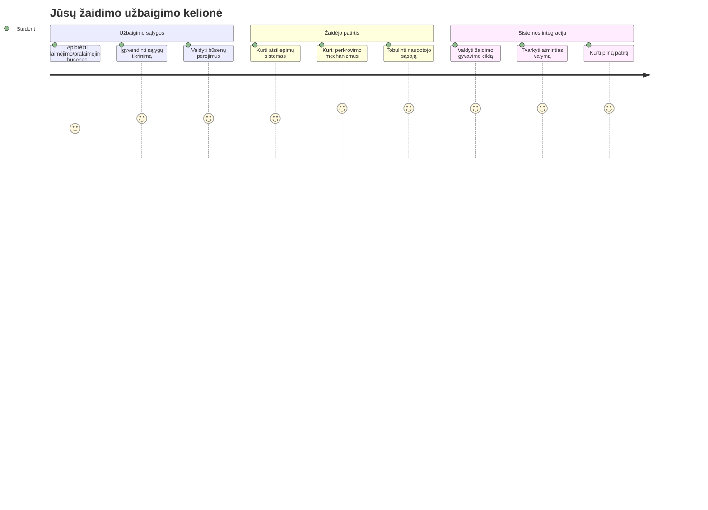
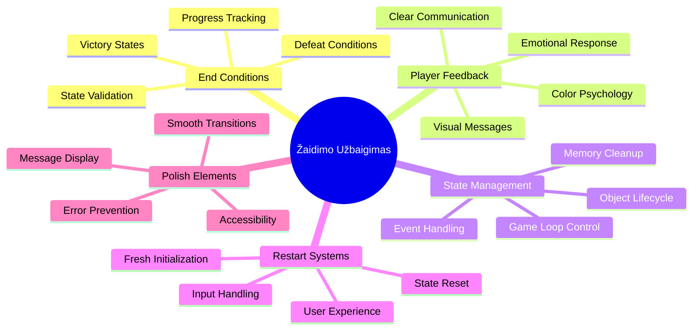
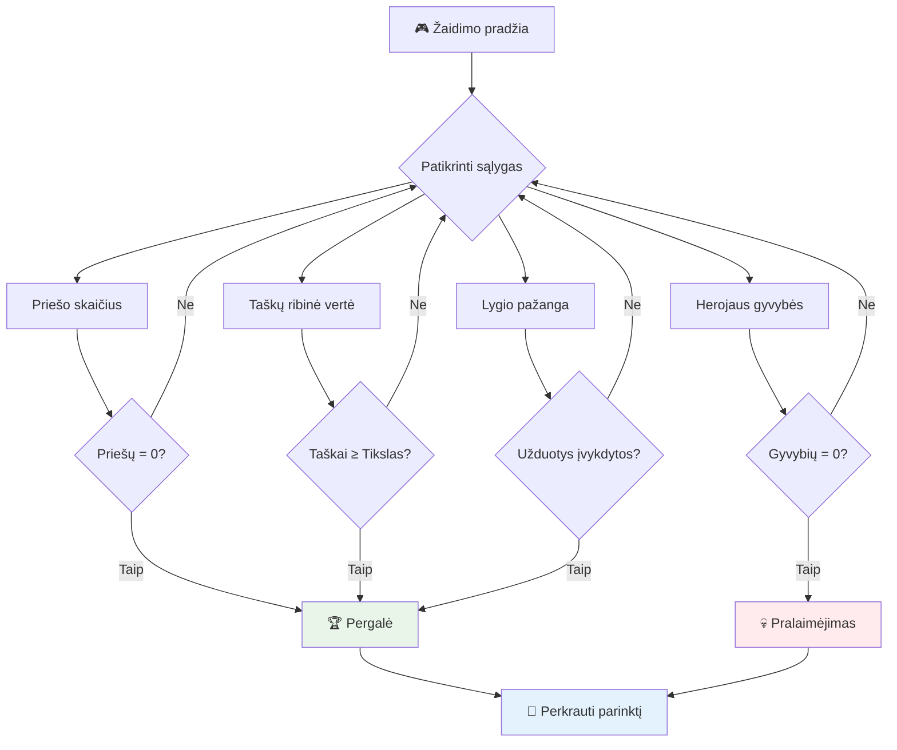
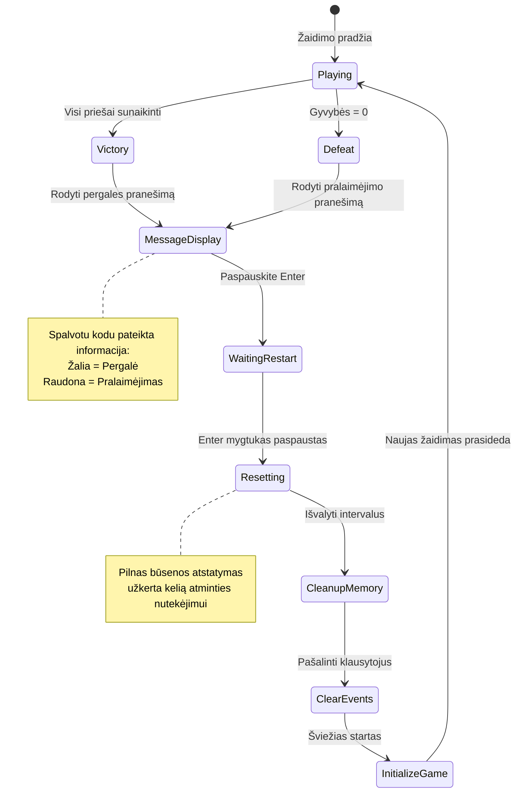
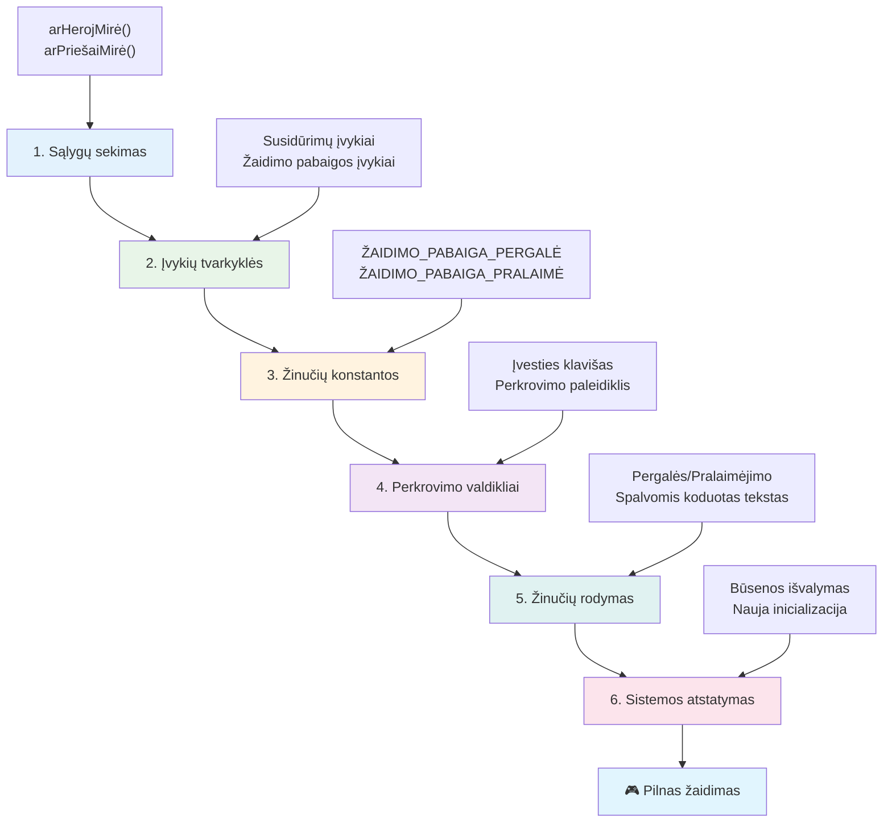
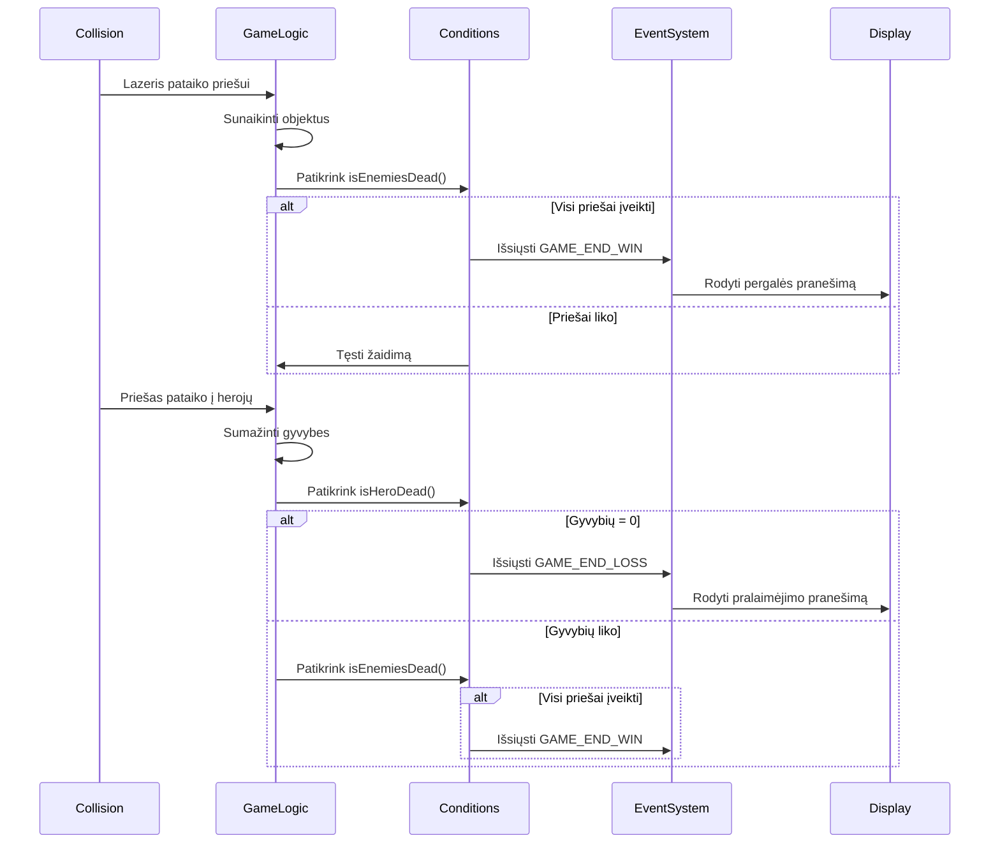
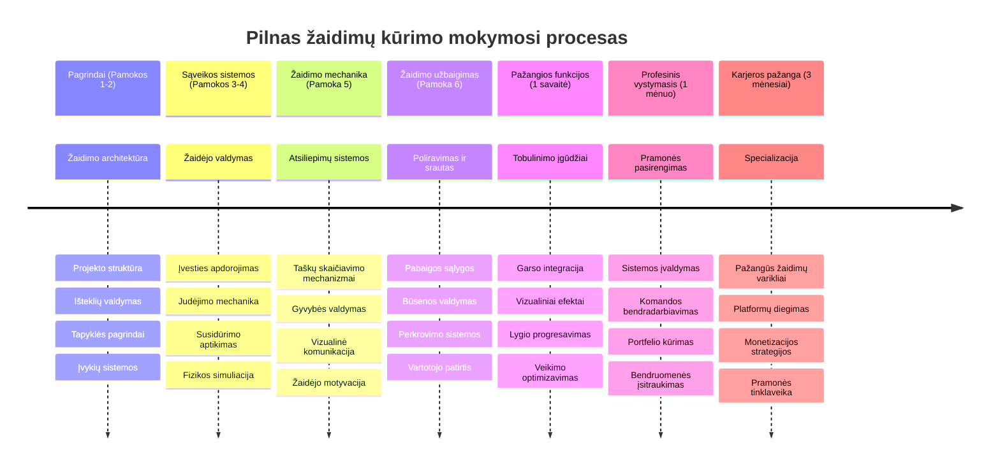

# Sukurkite kosmoso žaidimą 6 dalis: pabaiga ir perkūrimas


Kiekvienas puikus žaidimas turi aiškias pabaigos sąlygas ir sklandų perkūrimo mechanizmą. Jūs sukūrėte įspūdingą kosmoso žaidimą su judėjimu, kova ir taškų skaičiavimu – dabar metas pridėti paskutinius elementus, kurie suteiks žaidimui užbaigtumo jausmą.

Jūsų žaidimas šiuo metu veikia neribotai, kaip ir Voyager zondai, kuriuos NASA paleido 1977 metais – jie vis dar keliauja per kosmosą po kelių dešimtmečių. Nors tai tinkama kosmoso tyrinėjimams, žaidimai turi turėti aiškias pabaigos ribas, kad sukurtų patenkinamą patirtį.

Šiandien įdiegsime tinkamas pergalės/pralaimėjimo sąlygas ir perkūrimo sistemą. Šios pamokos pabaigoje turėsite išbaigtą žaidimą, kurį žaidėjai galės įveikti ir žaisti iš naujo, panašiai kaip klasikiniai arkadiniai žaidimai, kurie apibrėžė šią mediją.


## Priešpaskaitinis testas

[Priešpaskaitinis testas](https://ff-quizzes.netlify.app/web/quiz/39)

## Žaidimo pabaigos sąlygų supratimas

Kada turėtų baigtis jūsų žaidimas? Šis esminis klausimas formavo žaidimų dizainą nuo ankstyvojo arkadinių žaidimų laikotarpio. Pac-Man baigiasi, kai jus pagauna vaiduokliai arba išvalote visas taškelius, o Space Invaders – kai ateiviai pasiekia apačią arba juos visus sunaikinate.

Kaip žaidimo kūrėjas, jūs nustatote pergalės ir pralaimėjimo sąlygas. Mūsų kosmoso žaidimui yra patikrintos strategijos, kurios kuria įtraukiantį žaidimą:


- **Sunaikinta `N` priešo laivų**: Tai gana įprasta, kai žaidimą skirstote į lygius, ir norint užbaigti lygį reikia sunaikinti `N` priešo laivus
- **Jūsų laivas sunaikintas**: Yra žaidimų, kuriuose pralaimite, jei jūsų laivas sunaikinamas. Kita įprasta strategija – gyvybių konceptas. Kiekvieną kartą, kai jūsų laivas sunaikinamas, prarandate gyvybę. Kai visas gyvybes prarandate, pralaimite žaidimą.
- **Surinkote `N` taškų**: Kita įprasta pabaigos sąlyga yra surinkti taškus. Kaip taškus gaunate – jūsų pasirinkimas, bet dažnai taškai suteikiami už tokias veiklas kaip priešo laivo sunaikinimas ar daiktų surinkimas, kuriuos daiktai *išmeta* būdami sunaikinti.
- **Užbaigti lygį**: Tai gali apimti kelias sąlygas, pavyzdžiui, `X` priešo laivų sunaikinimą, `Y` taškų surinkimą ar tam tikro daikto surinkimą.

## Žaidimo perkūrimo funkcionalumo įgyvendinimas

Geri žaidimai skatina kartotinį žaidimą per sklandžius perkūrimo mechanizmus. Kai žaidėjai baigia žaidimą (arba pralaimi), dažnai nori iš karto bandyti dar kartą – siekdami pagerinti savo rezultatus ar pasirodymą.


Tetris tai puikiai iliustruoja: kai jūsų blokai pasiekia viršų, galite iš karto pradėti naują žaidimą be sudėtingų meniu naršymo. Mes sukursime panašią perkūrimo sistemą, kuri švariai atkurs žaidimo būseną ir greitai grąžins žaidėjus į kovą.

✅ **Apmąstymas**: Pagalvokite apie žaidimus, kuriuos žaidėte. Kokios sąlygos juos baigia ir kaip jums siūloma perkrauti žaidimą? Kas daro perkūrimo patirtį sklandžią, o kas – erzina?

## Ką sukursite

Įgyvendinsite paskutines funkcijas, kurios pavers jūsų projektą pilnu žaidimu. Šie elementai atskiria išbaigtus žaidimus nuo pagrindinių prototipų.

**Štai ką šiandien pridėsime:**

1. **Pergalės sąlyga**: Sunaikinkite visus priešininkus ir sulaukite tinkamo šventimo (jūs to nusipelnėte!)
2. **Pralaimėjimo sąlyga**: Praraskite visas gyvybes ir susitaikykite su pralaimėjimo ekranu
3. **Perkūrimo mechanizmas**: Spaudykite Enter, kad iš karto pradėtumėte iš naujo – nes vieno žaidimo niekada nepakanka
4. **Būsenos valdymas**: Kiekvieną kartą švarus lapas – be likusių priešų ar keistų klaidų iš paskutinio žaidimo

## Pradedame

Pasiruoškite savo kūrimo aplinką. Turėtumėte turėti visus kosminio žaidimo failus iš ankstesnių pamokų.

**Jūsų projektas turėtų atrodyti maždaug taip:**

```bash
-| assets
  -| enemyShip.png
  -| player.png
  -| laserRed.png
  -| life.png
-| index.html
-| app.js
-| package.json
```

**Paleiskite savo kūrimo serverį:**

```bash
cd your-work
npm start
```

**Ši komanda:**
- Paleidžia vietinį serverį adresu `http://localhost:5000`
- Tinkamai aptarnauja jūsų failus
- Automatiškai atnaujina puslapį, kai darote pakeitimus

Atidarykite `http://localhost:5000` naršyklėje ir patikrinkite, ar žaidimas veikia. Turėtumėte galėti judėti, šaudyti ir sąveikauti su priešininkais. Patvirtinus, galime tęsti įgyvendinimą.

> 💡 **Profesionalus patarimas**: Norėdami išvengti įspėjimų Visual Studio Code, deklaruokite `gameLoopId` failo viršuje kaip `let gameLoopId;`, o ne funkcijoje `window.onload`. Tai atitinka šiuolaikines JavaScript kintamųjų deklaravimo praktikas.


## Įgyvendinimo žingsniai

### 1 žingsnis: Sukurkite pabaigos sąlygų stebėjimo funkcijas

Reikia funkcijų, kurios stebėtų, kada žaidimas turėtų baigtis. Kaip ir tarptautinėje kosminėje stotyje veikiantys jutikliai, nuolat tikrinantys kritines sistemas, šios funkcijos nuolat stebės žaidimo būseną.

```javascript
function isHeroDead() {
  return hero.life <= 0;
}

function isEnemiesDead() {
  const enemies = gameObjects.filter((go) => go.type === "Enemy" && !go.dead);
  return enemies.length === 0;
}
```

**Štai kas vyksta užkulisiuose:**
- **Tikrina**, ar mūsų herojus liko be gyvybių (auč!)
- **Skaičiuoja**, kiek priešų dar gyvi ir veiksnūs
- **Grąžina** `true`, kai laukas išvalytas nuo priešų
- **Naudoja** paprastą tiesos/netiesos logiką, kad viskas būtų aišku
- **Filtruoja** per visus žaidimo objektus, kad rastų išlikusius

### 2 žingsnis: Atnaujinkite įvykių apdorojimo funkcijas pabaigos sąlygoms

Dabar sujungsime šiuos patikrinimus su žaidimo įvykių sistema. Kiekvieną kartą įvykus susidūrimui, žaidimas įvertins, ar tai sukelia pabaigos sąlygą. Tai suteikia tiesioginį atsaką į svarbius žaidimo įvykius.


```javascript
eventEmitter.on(Messages.COLLISION_ENEMY_LASER, (_, { first, second }) => {
    first.dead = true;
    second.dead = true;
    hero.incrementPoints();

    if (isEnemiesDead()) {
      eventEmitter.emit(Messages.GAME_END_WIN);
    }
});

eventEmitter.on(Messages.COLLISION_ENEMY_HERO, (_, { enemy }) => {
    enemy.dead = true;
    hero.decrementLife();
    if (isHeroDead())  {
      eventEmitter.emit(Messages.GAME_END_LOSS);
      return; // pralaimėjimas prieš pergalę
    }
    if (isEnemiesDead()) {
      eventEmitter.emit(Messages.GAME_END_WIN);
    }
});

eventEmitter.on(Messages.GAME_END_WIN, () => {
    endGame(true);
});
  
eventEmitter.on(Messages.GAME_END_LOSS, () => {
  endGame(false);
});
```

**Kas čia vyksta:**
- **Lazeris pataiko į priešą**: Abu dingsta, gaunate taškų, patikriname, ar laimėjote
- **Priešas pataiko į jus**: Prarandate gyvybę, patikriname, ar dar kvėpuojate
- **Protinga eiga**: Pirmiausia tikriname pralaimėjimą (niekas nenori laimėti ir pralaimėti vienu metu!)
- **Momentiniai atsakai**: Kai tik svarbus įvykis įvyksta, žaidimas apie tai iškart sužino

### 3 žingsnis: Pridėkite naujus žinučių konstantus

Reikės pridėti naujų žinučių tipų prie `Messages` konstantų objekto. Šios konstantos padeda palaikyti nuoseklumą ir išvengti klaidų įvykių sistemoje.

```javascript
GAME_END_LOSS: "GAME_END_LOSS",
GAME_END_WIN: "GAME_END_WIN",
```

**Aukščiau mes:**
- **Pridėjome** konstantas žaidimo pabaigos įvykiams, kad būtų nuoseklu
- **Naudojome** aprašomuosius pavadinimus, aiškiai nurodančius įvykio paskirtį
- **Vadovavomės** esama žinučių pavadinimų konvencija

### 4 žingsnis: Įgyvendinkite perkūrimo valdiklius

Dabar pridėsite klaviatūros valdiklius, leidžiančius žaidėjams perkrauti žaidimą. Enter klavišas yra natūralus pasirinkimas, nes jis dažnai susijęs su veiksmų patvirtinimu ir naujo žaidimo pradžia.

**Pridėkite Enter klavišo aptikimą esamam `keydown` įvykių klausytuvui:**

```javascript
else if(evt.key === "Enter") {
   eventEmitter.emit(Messages.KEY_EVENT_ENTER);
}
```

**Pridėkite naują žinutės konstantą:**

```javascript
KEY_EVENT_ENTER: "KEY_EVENT_ENTER",
```

**Reikia žinoti:**
- **Išplečia** esamą klaviatūros įvykių apdorojimo sistemą
- **Naudoja** Enter klavišą kaip perkūrimo signalą, kad vartotojui būtų paprasta
- **Išmeta** nestandartinį įvykį, kurį gali laikyti kitos žaidimo dalys
- **Išlaiko** tą pačią kitų klaviatūros valdiklių struktūrą

### 5 žingsnis: Sukurkite žinučių rodymo sistemą

Žaidimas turi aiškiai perduoti rezultatus žaidėjams. Mes sukursime žinučių sistemą, kuri rodo pergalę ir pralaimėjimą spalvotu tekstu, panašiai kaip ankstyvųjų kompiuterių terminalų sąsajos, kur žalia reiškė sėkmę, o raudona – klaidas.

**Sukurkite funkciją `displayMessage()`:**

```javascript
function displayMessage(message, color = "red") {
  ctx.font = "30px Arial";
  ctx.fillStyle = color;
  ctx.textAlign = "center";
  ctx.fillText(message, canvas.width / 2, canvas.height / 2);
}
```

**Žingsnis po žingsnio, kas vyksta:**
- **Nustato** šrifto dydį ir rūšį aiškiam, lengvai skaitomam tekstui
- **Taiko** spalvos parametrą, kur numatytoji – „raudona“ įspėjimams
- **Centruoja** tekstą horizontaliai ir vertikaliai ant drobės
- **Naudoja** modernius JavaScript numatytuosius parametrus lankstiems spalvos nustatymams
- **Panaudoja** 2D drobės kontekstą tiesioginiam teksto atvaizdavimui

**Sukurkite funkciją `endGame()`:**

```javascript
function endGame(win) {
  clearInterval(gameLoopId);

  // Nustatykite uždelsimą, kad užtikrintumėte, jog visi laukiamieji atvaizdavimai būtų baigti
  setTimeout(() => {
    ctx.clearRect(0, 0, canvas.width, canvas.height);
    ctx.fillStyle = "black";
    ctx.fillRect(0, 0, canvas.width, canvas.height);
    if (win) {
      displayMessage(
        "Victory!!! Pew Pew... - Press [Enter] to start a new game Captain Pew Pew",
        "green"
      );
    } else {
      displayMessage(
        "You died !!! Press [Enter] to start a new game Captain Pew Pew"
      );
    }
  }, 200)  
}
```

**Ką ši funkcija daro:**
- **Sustabdo** viską vietoje – jokių judančių laivų ar lazerių
- **Imasi** trumpo pauzės (200 ms), kad paskutinis kadras pilnai nupieštų
- **Išvalo** ekraną, nudažo juodai dramatiškam efektui
- **Rodo** skirtingas žinutes laimėtojams ir pralaimėtojams
- **Spalvinama** – žalia sėkmei, raudona – ne taip gerai
- **Nurodo** žaidėjams, kaip vėl pradėti žaidimą

### 🔄 **Pedagoginis patikrinimas**
**Žaidimo būsenos valdymas**: Prieš įgyvendinant perkūrimą, įsitikinkite, kad suprantate:
- ✅ Kaip pabaigos sąlygos sukuria aiškius žaidimo tikslus
- ✅ Kodėl vizualinis atsiliepimas yra būtinas žaidėjų supratimui
- ✅ Kaip tinkamas valymas apsaugo nuo atminties nutekėjimų
- ✅ Kaip įvykių architektūra leidžia sklandžiai keisti žaidimo būsenas

**Greitas savitestavimas**: Kas nutiktų, jei nesutvarkytumėte įvykių klausytojų perkūrimo metu?
*Atsakymas: atminties nutekėjimai ir pasikartojantys įvykių apdorotojai sukeltų nenuspėjamą elgseną*

**Žaidimo dizaino principai**: Dabar įgyvendinate:
- **Aiškius tikslus**: žaidėjai žino, kas reiškia sėkmę ar nesėkmę
- **Momentinį atsiliepimą**: žaidimo būsenos pasikeitimai rodomi iškart
- **Naudotojo kontrolę**: žaidėjai gali restartuoti, kai pasiruošę
- **Sistemos patikimumą**: tinkamas valymas apsaugo nuo klaidų ir našumo problemų

### 6 žingsnis: Įgyvendinkite žaidimo perkūrimo funkciją

Perkūrimo sistema turi visiškai sutvarkyti esamą žaidimo būseną ir inicializuoti naują žaidimo sesiją. Tai užtikrina, kad žaidėjai pradės švarų žaidimą be likusių duomenų iš ankstesnio.

**Sukurkite funkciją `resetGame()`:**

```javascript
function resetGame() {
  if (gameLoopId) {
    clearInterval(gameLoopId);
    eventEmitter.clear();
    initGame();
    gameLoopId = setInterval(() => {
      ctx.clearRect(0, 0, canvas.width, canvas.height);
      ctx.fillStyle = "black";
      ctx.fillRect(0, 0, canvas.width, canvas.height);
      drawPoints();
      drawLife();
      updateGameObjects();
      drawGameObjects(ctx);
    }, 100);
  }
}
```

**Išanalizuokime kiekvieną dalį:**
- **Tikrina**, ar žaidimo ciklas šiuo metu vyksta prieš perkraunant
- **Nutraukia** esamą žaidimo ciklą, sustabdydamas žaidimą
- **Pašalina** visus įvykių klausytojus, kad nebūtų atminties nutekėjimų
- **Inicializuoja** žaidimo būseną su naujais objektais ir kintamaisiais
- **Paleidžia** naują žaidimo ciklą su visomis pagrindinėmis žaidimo funkcijomis
- **Išlaiko** tą patį 100 ms intervalą, kad veikimas būtų pastovus

**Pridėkite Enter klavišo įvykio apdorojimą prie `initGame()` funkcijos:**

```javascript
eventEmitter.on(Messages.KEY_EVENT_ENTER, () => {
  resetGame();
});
```

**Pridėkite `clear()` metodą prie EventEmitter klasės:**

```javascript
clear() {
  this.listeners = {};
}
```

**Svarbiausios mintys:**
- **Sujungia** Enter klavišo paspaudimą su žaidimo perkūrimo funkcija
- **Registruoja** šį įvykių klausytuvą žaidimo inicializacijos metu
- **Pateikia** aiškią priemonę pašalinti visus įvykių klausytuvus perkūrimo metu
- **Užkerta kelią** atminties nutekėjimams, išvalydamas apdorotojus tarp žaidimų
- **Atstato** klausytojų objektą į tuščią būseną naujai inicializacijai

## Sveikiname! 🎉

👽 💥 🚀 Jūs sėkmingai sukūrėte visiškai veikiantį žaidimą nuo nulio. Kaip programuotojai, kurie kūrė pirmuosius vaizdo žaidimus 1970-aisiais, jūs pavertėte kodo eilutes interaktyvia patirtimi su tinkamais žaidimo mechanizmais ir vartotojo atsiliepimais. 🚀 💥 👽

**Jūs pasiekėte:**
- **Įgyvendinote** pilnas pergalės ir pralaimėjimo sąlygas su vartotojo atsiliepimais
- **Sukūrėte** sklandžią perkūrimo sistemą nenutrūkstamam žaidimui
- **Sukūrėte** aiškią vizualinę komunikaciją žaidimo būsenoms
- **Valdėte** sudėtingas žaidimo būsenų kaitas ir valymą
- **Surenkėte** visas dalis į vieningą, žaidimui tinkamą visumą

### 🔄 **Pedagoginis patikrinimas**
**Pilnas žaidimo kūrimo ciklas**: Pasidžiaukite savo meistriškumu pilname žaidimo kūrimo cikle:
- ✅ Kaip pabaigos sąlygos kuria patenkinamą žaidėjų patirtį?
- ✅ Kodėl tinkamas būsenos valdymas yra būtinas žaidimo stabilumui?
- ✅ Kaip vizualinis atsiliepimas pagerina žaidėjo supratimą?
- ✅ Kokį vaidmenį perkūrimo sistema atlieka žaidėjų išlaikymui?

**Sistemos valdymas**: Jūsų pilnas žaidimas rodo:
- **Visapusišką žaidimo kūrimą**: nuo grafikos iki įvesties ir būsenos valdymo
- **Profesionali architektūra**: įvykių sistema su tinkamu valymu
- **Vartotojo patirties dizainą**: aiškų atsiliepimą ir intuityvius valdiklius
- **Veikimo optimizavimą**: efektyvų atvaizdavimą ir atminties valdymą
- **Išbaigtumą**: visas detales, kurios sukuria užbaigtumo pojūtį

**Pramoninės įgūdžių bazė**: Jūs įdiegėte:
- **Žaidimo ciklo architektūrą**: realaus laiko sistemas su pastoviu veikimu
- **Įvykių valdymą**: atskirtas sistemas, kurios efektyviai skalėja
- **Būsenos valdymą**: sudėtingą duomenų apdorojimą ir gyvavimo ciklo valdymą
- **Vartotojo sąsają**: aiškų bendravimą ir reaguojančius valdiklius
- **Testavimą ir derinimą**: iteratyvų vystymą ir problemų sprendimą

### ⚡ **Ką galite padaryti per artimiausias 5 minutes**
- [ ] Žaidimas pilną žaidimą ir išbandykite visas pergalės ir pralaimėjimo sąlygas
- [ ] Eksperimentuokite su įvairiais pabaigos sąlygų parametrais
- [ ] Pabandykite pridėti console.log išrašus, kad sektumėte žaidimo būsenos pokyčius
- [ ] Pasidalykite žaidimu su draugais ir gaukite atsiliepimų

### 🎯 **Ką galite nuveikti per šią valandą**
- [ ] Užbaigti po pamokos testą ir apmąstyti savo žaidimų kūrimo kelionę
- [ ] Pridėti garso efektų pergalės ir pralaimėjimo būsenoms
- [ ] Įgyvendinti papildomas pabaigos sąlygas, pvz., laiko ribojimą ar papildomus tikslus
- [ ] Sukurti skirtingus sunkumo lygius su skirtingu priešo skaičiumi
- [ ] Patobulinti vizualinį pateikimą su geresniais šriftais ir spalvomis

### 📅 **Jūsų savaitės trukmės žaidimų kūrimo meistriškumas**
- [ ] Užbaigti išplėstinį kosmoso žaidimą su keliais lygiais ir progresavimu
- [ ] Pridėti pažangias funkcijas, tokias kaip galių efektai, skirtingi priešo tipai ir specialieji ginklai
- [ ] Sukurti aukščiausių rezultatų sistemą su nuolatine saugykla
- [ ] Sukurti vartotojo sąsajas meniu, nustatymams ir žaidimo pasirinkimams
- [ ] Optimizuoti veikimą skirtingiems įrenginiams ir naršyklėms
- [ ] Talpinti žaidimą internete ir dalintis jį bendruomenei
### 🌟 **Jūsų Mėnesio Trukmės Žaidimų Kūrimo Karjera**
- [ ] Sukurkite kelis pilnus žaidimus, tyrinėdami skirtingus žanrus ir mechanikas
- [ ] Išmokite pažangius žaidimų kūrimo karkasus, tokius kaip Phaser ar Three.js
- [ ] Prisidėkite prie atviro kodo žaidimų kūrimo projektų
- [ ] Studijuokite žaidimų dizaino principus ir žaidėjų psichologiją
- [ ] Sukurkite portfelį, demonstruojantį jūsų žaidimų kūrimo įgūdžius
- [ ] Užmegzkite ryšius su žaidimų kūrėjų bendruomene ir toliau mokykitės

## 🎯 Jūsų Pilnas Žaidimų Kūrimo Meistriškumo Laiko Planas


### 🛠️ Jūsų Pilno Žaidimų Kūrimo Įrankių Rinkinys

Baigus visą šią kosminio žaidimo seriją, jūs išmokote:
- **Žaidimų architektūra**: Įvykių varomi sistemos, žaidimų ciklai ir būsenų valdymas
- **Grafikos programavimas**: Canvas API, sprite'ų atvaizdavimas ir vizualiniai efektai
- **Įvesties sistemos**: Klaviatūros valdymas, susidūrimų aptikimas ir reagavimas į valdymą
- **Žaidimų dizainas**: Žaidėjo atsiliepimai, progresijos sistemos ir įsitraukimo mechanikos
- **Veikimo optimizavimas**: Efektyvus atvaizdavimas, atminties valdymas ir kadrų dažnio kontrolė
- **Vartotojo patirtis**: Aiškus bendravimas, intuityvūs valdikliai ir išbaigti detalės
- **Profesionalūs modeliai**: Švarus kodas, derinimo metodai ir projekto organizavimas

**Tikslinės taikymo sritys**: Jūsų žaidimų kūrimo įgūdžiai tiesiogiai pritaikomi:
- **Interaktyvios žiniatinklio programos**: Dinamiškos sąsajos ir realaus laiko sistemos
- **Duomenų vizualizacija**: Animacinės diagramos ir interaktyvi grafika
- **Mokslinė technologija**: Žaidybinimas ir įtraukiančios mokymosi patirtys
- **Mobilioji kūrimas**: Jutiklinės sąveikos ir veikimo optimizavimas
- **Simuliacinė programinė įranga**: Fizikos varikliai ir realaus laiko modeliavimas
- **Kūrybinės industrijos**: Interaktyvi menas, pramogos ir skaitmeninės patirtys

**Įgyti profesionalūs įgūdžiai**: Dabar galite:
- **Projektuoti** sudėtingas interaktyvias sistemas nuo nulio
- **Derinti** realaus laiko programas naudodami sistemingus metodus
- **Optimizuoti** veikimą sklandžiai vartotojo patirčiai
- **Kūrti** įtraukiančias vartotojo sąsajas ir sąveikos modelius
- **Bendradarbiauti** efektyviai techniniuose projektuose su tinkama kodo organizacija

**Įvaldyti žaidimų kūrimo konceptai**:
- **Realaus laiko sistemos**: Žaidimų ciklai, kadrų dažnio valdymas ir veikimas
- **Įvykių varoma architektūra**: Atjungtos sistemos ir pranešimų perdavimas
- **Būsenų valdymas**: Sudėtingas duomenų tvarkymas ir gyvavimo ciklo valdymas
- **Vartotojo sąsajos programavimas**: Canvas grafika ir reaguojantis dizainas
- **Žaidimų dizaino teorija**: Žaidėjo psichologija ir įsitraukimo mechanikos

**Kitas lygis**: Jūs pasiruošę tyrinėti pažangius žaidimų karkasus, 3D grafiką, daugelio žaidėjų sistemas arba pereiti į profesionalaus žaidimų kūrimo pozicijas!

🌟 **Pasiekimas atrakintas**: Sėkmingai įveikėte visą žaidimų kūrimo kelionę ir sukūrėte profesionalios kokybės interaktyvią patirtį nuo nulio!

**Sveiki atvykę į žaidimų kūrėjų bendruomenę!** 🎮✨

## GitHub Copilot Agent Užduotis 🚀

Naudokite Agent režimą norėdami įvykdyti šią užduotį:

**Aprašymas:** Pagerinkite kosminį žaidimą, įgyvendindami lygio progresavimo sistemą su didėjančiu sudėtingumu ir papildomomis funkcijomis.

**Užduotis:** Sukurkite daugiapakopę kosminio žaidimo sistemą, kur kiekviename lygyje būtų daugiau priešų laivų su didesniu greičiu ir gyvybėmis. Pridėkite taškų daugiklį, kuris didėja su kiekvienu lygiu, ir įgyvendinkite galios papildus (pvz., greitą šaudymą arba skydą), atsitiktinai atsirandančius sunaikinus priešus. Pridėkite lygio užbaigimo premiją ir ekrane parodykite esamą lygį kartu su esamu tašku ir gyvybėmis.

Daugiau sužinokite apie [agent režimą](https://code.visualstudio.com/blogs/2025/02/24/introducing-copilot-agent-mode) čia.

## 🚀 Neprivaloma Tobulinimo Užduotis

**Pridėkite garsus į savo žaidimą**: Pagerinkite žaidimo patirtį įgyvendindami garso efektus! Apsvarstykite galimybę pridėti garsus:

- **Lazerio šūviai** kai žaidėjas šaudo
- **Priešo sunaikinimas** kai laivai yra pataikomi
- **Heros žala** kai žaidėjas gauna smūgių
- **Pergalės muzika** kai žaidimas laimėtas
- **Pralaimėjimo garsas** kai žaidimas prarandamas

**Garso įgyvendinimo pavyzdys:**

```javascript
// Sukurkite garso objektus
const laserSound = new Audio('assets/laser.wav');
const explosionSound = new Audio('assets/explosion.wav');

// Leiskite garsus žaidimo įvykių metu
function playLaserSound() {
  laserSound.currentTime = 0; // Grąžinti į pradžią
  laserSound.play();
}
```

**Ką turite žinoti:**
- **Sukuria** garso objektus skirtingiems garso efektams
- **Nustato** `currentTime` iš naujo, leidžiant greitai kartotis garso efektams
- **Valdo** naršyklės automatinio paleidimo taisykles, garsus paleidžiant naudotojo sąveikose
- **Tvarko** garso garsumą ir laiką geresnei žaidimo patirčiai

> 💡 **Mokymosi šaltinis**: Ištirkite šį [garsų pavyzdį](https://www.w3schools.com/jsref/tryit.asp?filename=tryjsref_audio_play), kad sužinotumėte daugiau apie garso įgyvendinimą JavaScript žaidimuose.

## Po paskaitos testas

[Po paskaitos testas](https://ff-quizzes.netlify.app/web/quiz/40)

## Peržiūra ir savarankiškas mokymasis

Jūsų užduotis – sukurti naują pavyzdinį žaidimą, tad apžiūrėkite keletą įdomių žaidimų ir pažiūrėkite, kokio tipo žaidimą galėtumėte sukurti.

## Užduotis

[Sukurkite Pavyzdinį Žaidimą](assignment.md)

---

<!-- CO-OP TRANSLATOR DISCLAIMER START -->
**Atsakomybės apribojimas**:
Šis dokumentas buvo išverstas naudojant dirbtinio intelekto vertimo paslaugą [Co-op Translator](https://github.com/Azure/co-op-translator). Nors siekiame tikslumo, prašome atkreipti dėmesį, kad automatizuoti vertimai gali turėti klaidų ar netikslumų. Originalus dokumentas jo gimtąja kalba turi būti laikomas autoritetingu šaltiniu. Svarbiai informacijai rekomenduojamas profesionalus žmogaus atliktas vertimas. Mes neatsakome už bet kokius nesusipratimus ar neteisingus supratimus, kilusius naudojantis šiuo vertimu.
<!-- CO-OP TRANSLATOR DISCLAIMER END -->