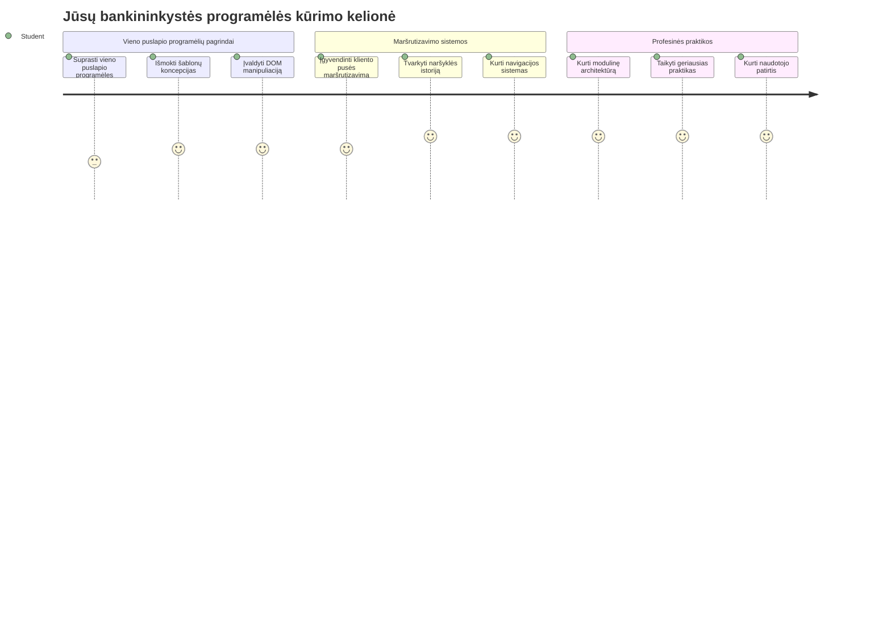
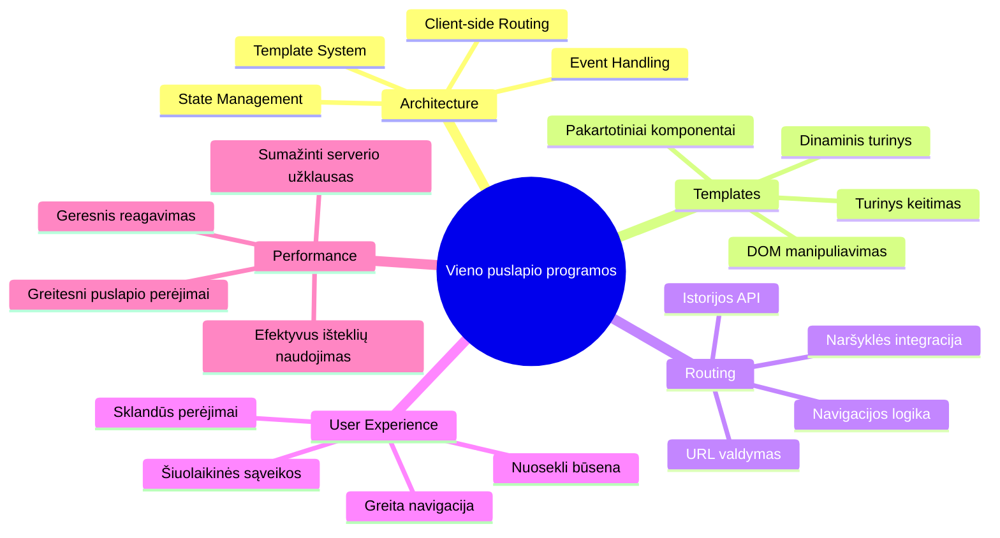
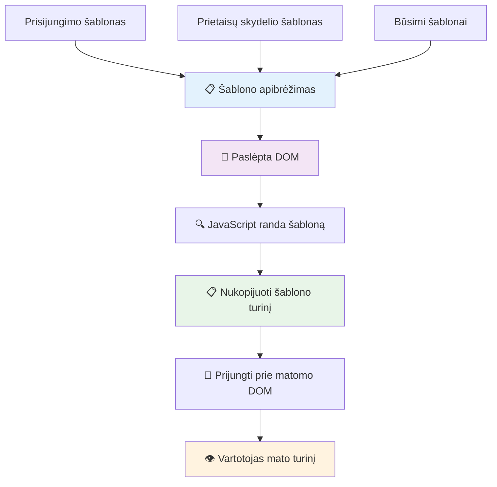
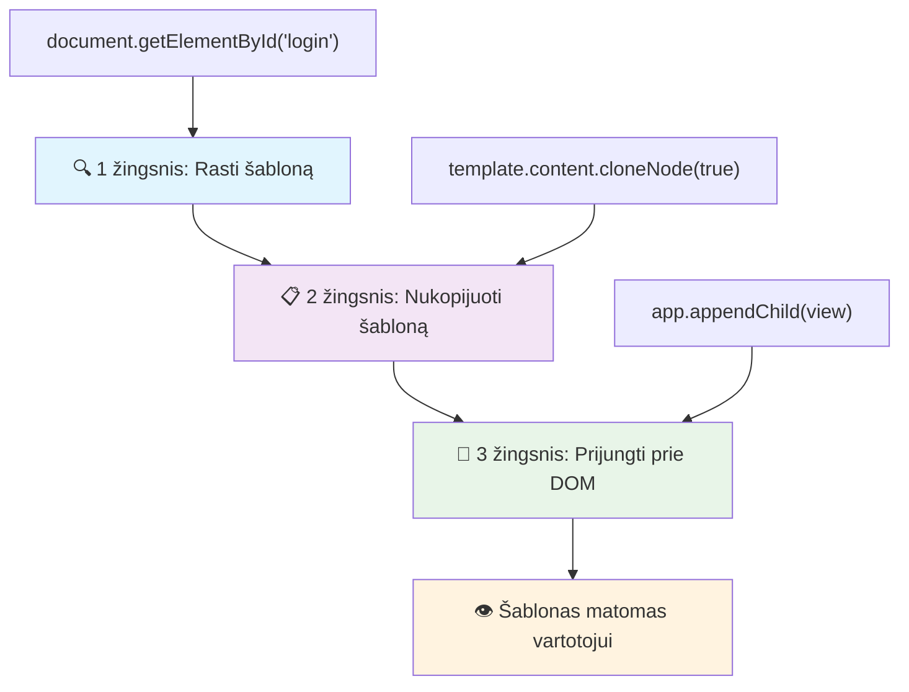
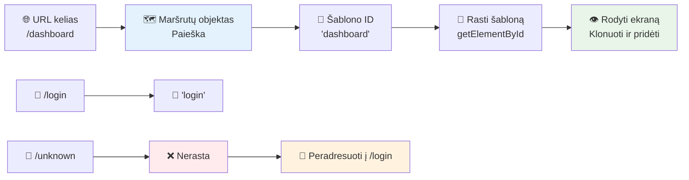
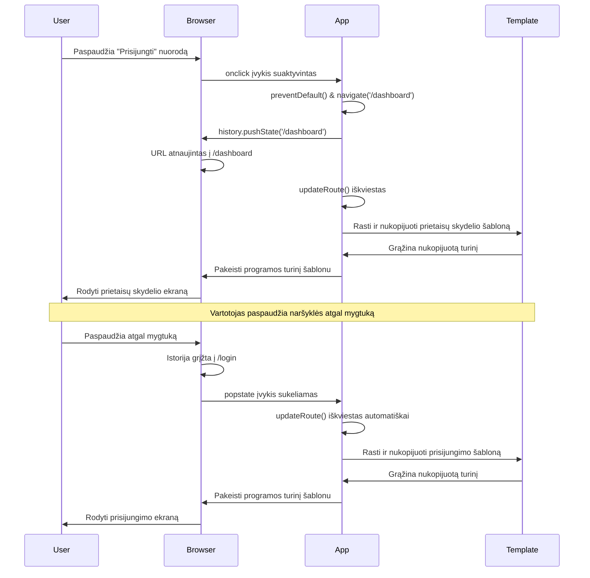
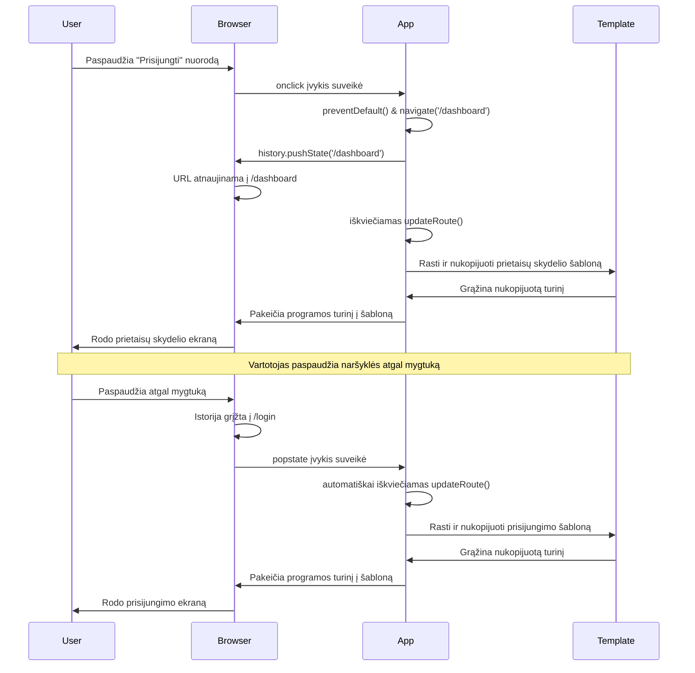
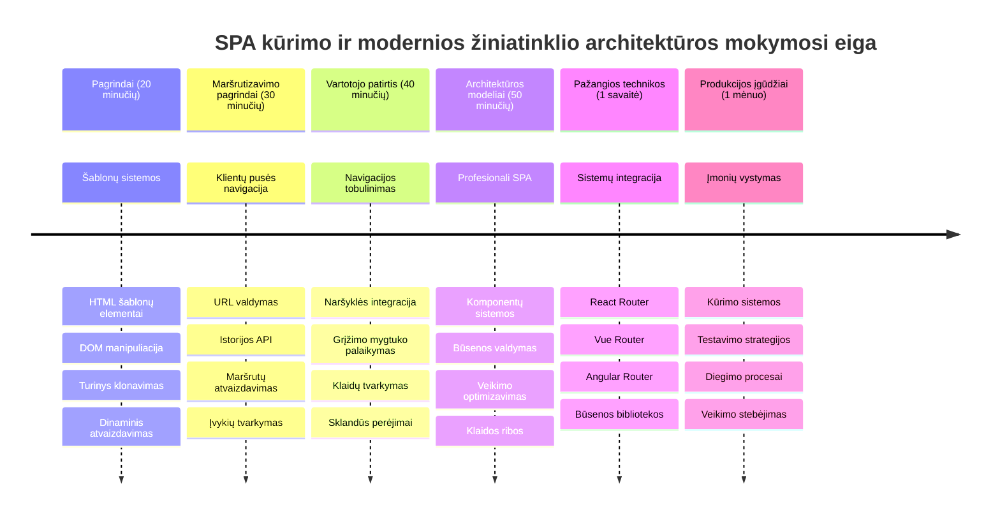

<!--
CO_OP_TRANSLATOR_METADATA:
{
  "original_hash": "351678bece18f07d9daa987a881fb062",
  "translation_date": "2026-01-07T11:51:11+00:00",
  "source_file": "7-bank-project/1-template-route/README.md",
  "language_code": "lt"
}
-->
# Sukurkite bankinę programėlę 1 dalis: HTML šablonai ir maršrutai žiniatinklio programoje


Kai Apollo 11 navigacijos kompiuteris 1969 m. nuskrido į mėnulį, jam reikėjo pereiti tarp skirtingų programų neperkraunant visos sistemos. Šiuolaikinės žiniatinklio programos veikia panašiai – jos keičia tai, ką matote, nenaudodamos visko perkrovimo iš naujo. Tai sukuria sklandžią ir jautrią vartotojų patirtį, kurios tikimasi šiandien.

Skirtingai nuo tradicinių svetainių, kurios kiekvieno veiksmo metu perkrauna visus puslapius, modernios žiniatinklio programos atnaujina tik tuos skyrius, kurie turi keistis. Šis požiūris, panašiai kaip misijos valdymo centras, kuris pereina tarp skirtingų rodinių išlaikydamas nuolatinį ryšį, sukuria tą sklandžią patirtį, kurios tikimės.

Štai kas šį skirtumą daro toks drastiškas:

| Tradicinės kelių puslapių programos | Šiuolaikinės vieno puslapio programos |
|-------------------------------------|-------------------------------------|
| **Navigacija** | Kiekvienam ekranui įkeliama visa puslapio dalis | Turinys keičiamas akimirksniu |
| **Veikimo greitis** | Lėtesnis dėl pilnų HTML atsisiuntimų | Greitesnis su daliniais atnaujinimais |
| **Vartotojo patirtis** | Ryškūs puslapio perkrovimai | Sklandūs, programėlės tipo perėjimai |
| **Duomenų dalijimasis** | Sudėtingas tarp puslapių | Lengvas būsenos valdymas |
| **Kūrimas** | Reikia daug HTML failų | Vienas HTML su dinaminiais šablonais |

**Evoliucijos supratimas:**
- **Tradiciinės programos** reikalauja serverio užklausų kiekvienai navigacijos veiklai
- **Modernios vieno puslapio programos (SPA)** įkelia kartą ir dinamiškai atnaujina turinį naudojant JavaScript
- **Vartotojai dabar** tikisi greitų ir sklandžių sąveikų
- **Veiklos pranašumai** apima sumažintą pralaidumą ir greitesnį reagavimą

Šioje pamokoje kursime bankinę programėlę su keliomis ekrano dalimis, kurios veikia kartu sklandžiai. Panašiai kaip mokslininkai naudoja moduliarius instrumentus, kuriuos galima keisti eksperimentams, mes naudosime HTML šablonus kaip pakartotinai naudojamus komponentus rodymui pagal poreikį.

Jūs dirbsite su HTML šablonais (pakartotinai naudojamomis ekrano dalimis), JavaScript maršrutizacija (sistema, kuri pereina tarp ekranų) ir naršyklės istorijos API (kuris palaiko „atgal“ mygtuko veikimą kaip įprasta). Tai yra tos pačios pagrindinės technikos, kurias naudoja tokie karkasai kaip React, Vue ir Angular.

Pamokos pabaigoje turėsite veikiančią bankinę programėlę, kuri demonstruos profesionalius vieno puslapio programų principus.


## Išankstinis testas prieš paskaitą

[Išankstinis testas prieš paskaitą](https://ff-quizzes.netlify.app/web/quiz/41)

### Ko reikės

Reikės vietinio žiniatinklio serverio, kad galėtume išbandyti bankinę programėlę – nesijaudinkite, tai lengviau nei atrodo! Jei jo dar neturite, tiesiog įsidiekite [Node.js](https://nodejs.org) ir paleiskite `npx lite-server` savo projekto aplanke. Ši patogi komanda paleidžia vietinį serverį ir automatiškai atidaro programėlę naršyklėje.

### Paruošimas

Savo kompiuteryje sukurkite aplanką pavadinimu `bank` su failu `index.html` viduje. Pradėsime nuo šio HTML [boilerplate](https://en.wikipedia.org/wiki/Boilerplate_code):

```html
<!DOCTYPE html>
<html lang="en">
  <head>
    <meta charset="UTF-8">
    <meta name="viewport" content="width=device-width, initial-scale=1.0">
    <title>Bank App</title>
  </head>
  <body>
    <!-- This is where you'll work -->
  </body>
</html>
```

**Štai ką suteikia šis boilerplate:**
- **Nustato** HTML5 dokumento struktūrą su tinkamu DOCTYPE deklaravimu
- **Nustato** simbolių kodavimą kaip UTF-8, užtikrinant pasaulinį tekstų palaikymą
- **Įgalina** reaguojančio dizaino palaikymą naudojant viewport meta žymę mobiliesiems įrenginiams
- **Nustato** aprašomą puslapio pavadinimą, kuris matomas naršyklės skirtuke
- **Sukuria** švarų body skyrių, kuriame statysime mūsų programėlę

> 📁 **Projekto struktūros peržiūra**
> 
> **Pamokos pabaigoje jūsų projektas turės:**
> ```
> bank/
> ├── index.html      <!-- Main HTML with templates -->
> ├── app.js          <!-- Routing and navigation logic -->
> └── style.css       <!-- (Optional for future lessons) -->
> ```
> 
> **Failų atsakomybės:**
> - **index.html**: Apima visus šablonus ir suteikia programėlės struktūrą
> - **app.js**: Tvarko maršrutizaciją, navigaciją ir šablonų valdymą
> - **Šablonai**: Apibrėžia vartotojo sąsają prisijungimui, informacijos suvestinei ir kitiems ekranams

---

## HTML Šablonai

Šablonai sprendžia pagrindinę problemą žiniatinklio kūrime. Kai Gutenbergas 1440-aisiais išrado judamąjį raidžių spausdinimą, jis suprato, kad vietoj visų puslapių išraižymo jis gali kurti pakartotinai naudojamus raidžių blokus ir komponuoti juos pagal poreikį. HTML šablonai veikia pagal tą patį principą – vietoj atskirų HTML failų kiekvienam ekranui, jūs apibrėžiate pakartotinai naudojamas struktūras, kurios gali būti rodoma pagal poreikį.


Galvokite apie šablonus kaip planus skirtingoms jūsų programėlės dalims. Kaip architektas sukūręs vieną planą, kurį naudoja kelis kartus, o ne piešia kiekvieną identišką kambarį, mes sukuriame šablonus vieną kartą ir panaudojame pagal poreikį. Naršyklė laiko šiuos šablonus paslėptus, kol JavaScript juos aktyvuoja.

Jei norite sukurti kelis tinklapio ekranus, viena išeitis būtų sukurti vieną HTML failą kiekvienam rodiniui. Tačiau tai turi tam tikrų nepatogumų:

- Reikia pilnai įkelti visą HTML perrašant ekraną, kas gali būti lėta.
- Sudėtinga dalintis duomenimis tarp skirtingų ekranų.

Kita išeitis – turėti tik vieną HTML failą ir apibrėžti kelis [HTML šablonus](https://developer.mozilla.org/docs/Web/HTML/Element/template) naudojant `<template>` elementą. Šablonas yra pakartotinai naudojamas HTML blokas, kurio naršyklė nerodo, jis turi būti instancijuojamas vykdymo metu naudojant JavaScript.

### Pradėkime kurti

Kursime banko programėlę su dviem pagrindiniais ekranais: prisijungimo puslapiu ir informacijos suvestine. Pirmiausia pridėsime į HTML body vietos rezervavimo elementą – čia bus rodomi visi mūsų ekranai:

```html
<div id="app">Loading...</div>
```

**Apibūdinimas apie šį vietos rezervavimą:**
- **Sukuria** konteinerį su ID „app“, kuriame bus rodomi visi ekranai
- **Rodo** įkėlimo pranešimą, kol JavaScript inicializuoja pirmą ekraną
- **Siūlo** vieną tvirtinimo tašką dinamiškam turiniui
- **Įgalina** lengvą paiešką naudojant `document.getElementById()`

> 💡 **Profesionalus patarimas**: Kadangi šio elemento turinys bus keičiama, galima čia įdėti įkėlimo pranešimą arba indikatorius, kurie rodys, kol programėlė kraunasi.

Toliau pridėsime žemiau HTML šabloną prisijungimo puslapiui. Šiuo metu jame bus tik pavadinimas ir skyrius su nuoroda, kuria naudositės navigacijai atlikti.

```html
<template id="login">
  <h1>Bank App</h1>
  <section>
    <a href="/dashboard">Login</a>
  </section>
</template>
```

**Šio prisijungimo šablono paaiškinimas:**
- **Apibrėžia** šabloną su unikaliu identifikatoriumi „login“ JavaScript taikymui
- **Įtraukia** pagrindinį antraštės elementą, kuris nustato programėlės ženklą
- **Turi** semantinį `<section>` elementą, kuris grupuoja susijusį turinį
- **Pateikia** navigacijos nuorodą, kuri nukreips vartotojus į informacijos suvestinę

Tada pridėsime kitą HTML šabloną informacijos suvestinės puslapiui. Šis puslapis turės kelis skyrius:

- Antraštę su pavadinimu ir atsijungimo nuoroda
- Dabartinę banko sąskaitos balansą
- Operacijų sąrašą, pateiktą lentelėje

```html
<template id="dashboard">
  <header>
    <h1>Bank App</h1>
    <a href="/login">Logout</a>
  </header>
  <section>
    Balance: 100$
  </section>
  <section>
    <h2>Transactions</h2>
    <table>
      <thead>
        <tr>
          <th>Date</th>
          <th>Object</th>
          <th>Amount</th>
        </tr>
      </thead>
      <tbody></tbody>
    </table>
  </section>
</template>
```

**Supraskime kiekvieną šios suvestinės dalį:**
- **Struktūruoja** puslapį su semantiniu `<header>` elementu, kuriame yra navigacija
- **Rodo** programėlės pavadinimą visuose ekranuose dėl jo ženklinimo
- **Pateikia** atsijungimo nuorodą, kuri nukreipia atgal į prisijungimo ekraną
- **Rodo** dabartinę sąskaitos balansą atskirame skyriuje
- **Organizuoja** operacijų duomenis naudojant tinkamai struktūruotą HTML lentelę
- **Apibrėžia** lentelės antraštes datai, objektui ir sumai
- **Palieka** lentelės kūną tuščią dinamiškai informacijai įterpti vėliau

> 💡 **Profesionalus patarimas**: Kai kuriate HTML šablonus, jei norite pamatyti, kaip tai atrodys, galite „iškomentuoti“ `<template>` ir `</template>` eilutes įrašydami jas tarp `<!-- -->`.

### 🔄 **Pedagoginė patikra**
**Šablonų sistemos supratimas**: Prieš pradedant naudoti JavaScript, įsitikinkite, kad suprantate:
- ✅ Kaip šablonai skiriasi nuo įprastų HTML elementų
- ✅ Kodėl šablonai lieka paslėpti, kol juos neaktyvina JavaScript
- ✅ Semantinės HTML struktūros svarbą šablonuose
- ✅ Kaip šablonai leidžia kurti pakartotinai naudojamus UI komponentus

**Greitas savitikris**: Kas nutinka, jei pašalinsite `<template>` žymes iš savo HTML?
*Atsakymas: Turinys iškart tampa matomas ir praranda šablono funkcionalumą*

**Architektūros privalumai**: Šablonai suteikia:
- **Pakartotinį naudojimą**: Vienas apibrėžimas, daug instancijų
- **Veikimo greitį**: Nėra bereikalingo HTML analizavimo
- **Priežiūrą**: Centralizuota vartotojo sąsajos struktūra
- **Lankstumą**: Dinamiškas turinio keitimas

✅ Kodėl, jūsų nuomone, naudojame `id` atributus šablonuose? Ar galėtume naudoti ką nors kitą, pavyzdžiui klases?

## Šablonų įgyvendinimas su JavaScript

Dabar turime šablonus paversti funkcionaliais. Kaip 3D spausdintuvas paima skaitmeninį planą ir kuria fizinį objektą, taip JavaScript paima mūsų paslėptus šablonus ir sukuria matomus, interaktyvius elementus, kuriuos gali matyti ir naudoti vartotojai.

Procesas susideda iš trijų nuoseklių žingsnių, kurie sudaro moderniojo žiniatinklio kūrimo pagrindą. Kai suprasite šį modelį, jį atpažinsite daugelyje karkasų ir bibliotekų.

Jei savo dabartinį HTML failą paleisite naršyklėje, pamatysite, kad jis užstringa rodydamas `Loading...`. Tai todėl, kad turime pridėti šiek tiek JavaScript kodo, kad instancijuotume ir parodytume HTML šablonus.

Paprastai šablono instancijavimas vyksta per 3 žingsnius:

1. Gauti šablono elementą DOM'e, pvz., naudojant [`document.getElementById`](https://developer.mozilla.org/docs/Web/API/Document/getElementById).
2. Nukopijuoti šablono elementą, naudojant [`cloneNode`](https://developer.mozilla.org/docs/Web/API/Node/cloneNode).
3. Pridėti jį prie DOM matomo elemento, pvz., naudojant [`appendChild`](https://developer.mozilla.org/docs/Web/API/Node/appendChild).


**Vizualus proceso paaiškinimas:**
- **Žingsnis 1** suranda paslėptą šabloną DOM struktūroje
- **Žingsnis 2** sukuria veikiančią kopiją, kurią galima saugiai keisti
- **Žingsnis 3** įterpia kopiją į matomą puslapio plotą
- **Rezultatas** yra funkcinis ekranas, su kuriuo vartotojai gali sąveikauti

✅ Kodėl reikia kopijuoti šabloną prieš jį pridedant į DOM? Ką, jūsų nuomone, nutiktų, jei praleistume šį žingsnį?

### Užduotis

Sukurkite naują failą `app.js` savo projekto aplanke ir importuokite jį `<head>` skiltyje savo HTML dokumente:

```html
<script src="app.js" defer></script>
```

**Apie šį skripto importavimą:**
- **Sujungia** JavaScript failą su mūsų HTML dokumentu
- **Naudoja** atributą `defer`, kad skriptas būtų vykdomas po to, kai HTML parsinimas baigtas
- **Įgalina** prieigą prie visų DOM elementų, nes jie visi užkrauti prieš skripto vykdymą
- **Laikosi** šiuolaikinių geriausių praktikų skriptų įkrovimui ir veikimui

Dabar `app.js` sukursime naują funkciją `updateRoute`:

```js
function updateRoute(templateId) {
  const template = document.getElementById(templateId);
  const view = template.content.cloneNode(true);
  const app = document.getElementById('app');
  app.innerHTML = '';
  app.appendChild(view);
}
```

**Žingsnis po žingsnio, vyksta štai kas:**
- **Suranda** šablono elementą pagal jo unikalų ID
- **Sukuria** gilų šablono turinio kopiją naudodamas `cloneNode(true)`
- **Randa** programėlės konteinerį, kuriame bus rodoma informacija
- **Išvalo** visą esamą programėlės konteinerio turinį
- **Įterpia** nukopijuotą šablono turinį į matomą DOM sritį

Iškvieskite šią funkciją su bet kuriuo šablono ID ir pažiūrėkite rezultatą.

```js
updateRoute('login');
```

**Šio funkcijos kvietimo nauda:**
- **Aktyvuoja** prisijungimo šabloną perduodant jo ID kaip parametrą
- **Demonstruoja** kaip programiškai jungtis tarp skirtingų programėlės ekranų
- **Rodo** prisijungimo ekraną vietoje „Loading...“ žinutės

✅ Koks šio kodo `app.innerHTML = '';` paskirtis? Kas nutiktų be jo?

## Maršrutų kūrimas

Maršrutizacija iš esmės reiškia URL sujungimą su tinkamu turiniu. Palyginkite su ankstyvaisiais telefonų operatoriais, kurie naudodavo jungiamuosius panelius, kad sujungtų skambučius – jie gautą užklausą nukreipdavo į teisingą adresatą. Žiniatinklio maršrutizacija veikia taip pat, gaunant URL užklausą ir nusprendžiant, kokį turinį rodyti.


Tradiciškai, žiniatinklio serveriai tai darė pateikdami skirtingus HTML failus skirtingiems URL. Kadangi mes kuriame vieno puslapio programą, turime patys valdyti maršrutizaciją su JavaScript. Šis požiūris suteikia daugiau kontrolės vartotojo patirčiai ir veikimui.


**Maršrutizacijos srauto supratimas:**
- **URL pasikeitimai** sukelia užklausą mūsų maršrutų konfigūracijoje
- **Galiojantys maršrutai** susieja su specifiniais šablono ID rodymui
- **Negaliojantys maršrutai** sukelia atsarginį elgesį, kad būtų išvengta nesklandumų
- **Šablonų rodymas** vyksta pagal anksčiau mokytą trijų žingsnių procesą

Kalbant apie žiniatinklio programą, *maršrutizacija* reiškia ketinimą sujungti **URL** su specifiniais ekranais, kurie turi būti rodomi. Svetainėje su daug HTML failų, tai vyksta automatiškai pagal failų kelius URL. Pavyzdžiui, turint tokius failus projekto aplanke:

```
mywebsite/index.html
mywebsite/login.html
mywebsite/admin/index.html
```

Jei sukursite žiniatinklio serverį, kur `mywebsite` bus šaknis, URL žemėlapis bus:

```
https://site.com            --> mywebsite/index.html
https://site.com/login.html --> mywebsite/login.html
https://site.com/admin/     --> mywebsite/admin/index.html
```

Tačiau mūsų žiniatinklio programa naudoja vieną HTML failą su visais ekranais, todėl šis numatytasis elgesys mums nepadės. Turime rankiniu būdu sukurti šį žemėlapį ir atnaujinti rodomą šabloną naudojant JavaScript.

### Užduotis

Naudosime paprastą objektą, kad įgyvendintume [žemėlapį](https://en.wikipedia.org/wiki/Associative_array) tarp URL kelių ir mūsų šablonų. Pridėkite šį objektą viršuje savo `app.js` faile.

```js
const routes = {
  '/login': { templateId: 'login' },
  '/dashboard': { templateId: 'dashboard' },
};
```

**Šios maršrutų konfigūracijos supratimas:**
- **Apibrėžia** susiejimą tarp URL kelių ir šablonų identifikatorių
- **Naudoja** objekto sintaksę, kur raktai yra URL keliai, o reikšmės – šablono informacija
- **Leidžia** lengvai surasti, kurį šabloną rodyti pagal bet kurį URL
- **Suteikia** plečiamą struktūrą naujų maršrutų pridėjimui ateityje
Dabar šiek tiek pakeiskime `updateRoute` funkciją. Vietoj to, kad tiesiogiai perduotume `templateId` kaip argumentą, norime jį gauti pirmiausia pažvelgę į esamą URL, o tada naudodami mūsų žemėlapį gauti atitinkamą šablono ID reikšmę. Galime naudoti [`window.location.pathname`](https://developer.mozilla.org/docs/Web/API/Location/pathname), kad gautume tik URL kelio dalį.

```js
function updateRoute() {
  const path = window.location.pathname;
  const route = routes[path];

  const template = document.getElementById(route.templateId);
  const view = template.content.cloneNode(true);
  const app = document.getElementById('app');
  app.innerHTML = '';
  app.appendChild(view);
}
```

**Išskaidymas, kas čia vyksta:**
- **Ištraukia** esamą kelią iš naršyklės URL naudodamas `window.location.pathname`
- **Ieško** atitinkamos maršruto konfigūracijos mūsų routes objekte
- **Gauk** šablono ID iš maršruto konfigūracijos
- **Atlieka** tą patį šablonų atvaizdavimo procesą kaip anksčiau
- **Sukuria** dinaminę sistemą, kuri reaguoja į URL pakeitimus

Čia mes susiejome deklaruotus maršrutus su atitinkamu šablonu. Galite pabandyti patikrinti, ar jis veikia teisingai, keisdami URL rankiniu būdu naršyklėje.

✅ Kas nutinka, jei URL įvesite nežinomą kelią? Kaip galėtume tai išspręsti?

## Navigacijos pridėjimas

Kai maršrutizavimas nustatytas, vartotojams reikia būdo naviguoti programėlėje. Tradicinės svetainės įkelia visą puslapį spustelėjus nuorodas, tačiau mes norime atnaujinti tiek URL, tiek turinį be puslapio perkrovimo. Tai sukuria sklandesnę patirtį, panašią į tai, kaip darbalaukio programos keičia skirtingus vaizdus.

Turime suderinti du dalykus: atnaujinti naršyklės URL, kad vartotojai galėtų žymėti puslapius ir dalintis nuorodomis, ir parodyti tinkamą turinį. Teisingai įgyvendinus, tai sukuria be pertrūkių navigaciją, kokią tikisi šiuolaikinės programėlės.


### 🔄 **Pedagoginė Patikra**
**Vieno puslapio programėlės architektūra**: Patikrinkite savo supratimą apie visą sistemą:
- ✅ Kaip klientinės pusės maršrutizavimas skiriasi nuo tradicinio serverio pusės maršrutizavimo?
- ✅ Kodėl History API yra būtinas tinkamai SPA navigacijai?
- ✅ Kaip šablonai leidžia dinamiškai keisti turinį nereikalaujant puslapio perkrovimo?
- ✅ Kokį vaidmenį atlieka įvykių tvarkymas reaguojant į navigaciją?

**Sistemų integracija**: Jūsų SPA demonstruoja:
- **Šablonų valdymas**: Pakartotinai naudojami UI komponentai su dinamišku turiniu
- **Klientinės pusės maršrutizavimas**: URL valdymas be serverio užklausų
- **Įvykių valdymo architektūra**: Reaguojanti navigacija ir vartotojo sąveikos
- **Naršyklės integracija**: Tinkamas istorijos bei atgal/į priekį mygtukų palaikymas
- **Veikimo optimizavimas**: Greiti perėjimai ir sumažintas serverio krūvis

**Profesionalūs modeliai**: Jūs įgyvendinote:
- **Modelio ir vaizdo atskyrimas**: Šablonai atskirti nuo programos logikos
- **Būsenos valdymas**: URL būsena suderinta su rodomu turiniu
- **Progresyvus papildymas**: JavaScript papildo bazinę HTML funkcionalumą
- **Vartotojo patirtis**: Sklandi, programėlę primenanti navigacija be puslapio perkrovimo

> � **Architektūros įžvalga**: Navigacijos sistemos komponentai
>
> **Ką kuriate:**
> - **🔄 URL valdymas**: Atnaujina naršyklės adreso juostą be puslapio perkrovimo
> - **📋 Šablonų sistema**: Dinamiškai keičia turinį pasikeitus maršrutui  
> - **📚 Istorijos integracija**: Išlaiko naršyklės atgal/į priekį mygtukų veikimą
> - **🛡️ Klaidos valdymas**: Graceful fallback mechanizmai neteisingiems ar trūkstamiems maršrutams
>
> **Kaip komponentai veikia kartu:**
> - **Klauso** navigacijos įvykių (paspaudimų, istorijos pokyčių)
> - **Atnaujina** URL naudodami History API
> - **Atvaizduoja** tinkamą šabloną naujam maršrutui
> - **Užtikrina** sklandžią vartotojo patirtį viso proceso metu

Kitas žingsnis mūsų programėlėje – pridėti galimybę naviguoti tarp puslapių nekeičiant URL rankiniu būdu. Tai reiškia du dalykus:

  1. Atnaujinti esamą URL
  2. Atnaujinti rodomą šabloną pagal naują URL

Antrojo punkto jau pasirūpinome su `updateRoute` funkcija, tad dabar turime išsiaiškinti, kaip atnaujinti esamą URL.

Turėsime naudoti JavaScript ir konkrečiau [`history.pushState`](https://developer.mozilla.org/docs/Web/API/History/pushState), kuris leidžia atnaujinti URL ir sukurti naują įrašą naršymo istorijoje, neperkrovus HTML.

> ⚠️ **Svarbi pastaba**: Nors HTML ankerio elementas [`<a href>`](https://developer.mozilla.org/docs/Web/HTML/Element/a) gali būti naudojamas savarankiškai kurti nuorodoms į skirtingus URL, jis pagal numatytuosius nustatymus privers naršyklę perkrauti HTML. Kai naudojate maršrutizavimą su pasirinktiniu JavaScript, būtina užkirsti kelią šiam elgesiui naudojant `preventDefault()` funkciją paspaudimo įvykyje.

### Užduotis

Sukurkime naują funkciją navigacijai mūsų programėlėje:

```js
function navigate(path) {
  window.history.pushState({}, path, path);
  updateRoute();
}
```

**Šios navigacijos funkcijos supratimas:**
- **Atnaujina** naršyklės URL į naują kelią naudodama `history.pushState`
- **Priduria** naują įrašą naršyklės istorijos kiegyje, kad veiktų atgal/į priekį mygtukai
- **Iškviečia** `updateRoute()` funkciją, kad būtų parodytas atitinkamas šablonas
- **Išlaiko** vieno puslapio programėlės patirtį be puslapio perkrovimų

Šis metodas pirmiausia atnaujina esamą URL pagal pateiktą kelią, tada atnaujina šabloną. Savybė `window.location.origin` grąžina URL šaknį, leidžiant mums rekonstruoti pilną URL iš duoto kelio.

Kadangi turime šią funkciją, galime išspręsti problemą, jei kelio nesutinkame jokiame apibrėžtame maršrute. Modifikuosime `updateRoute`, pridėdami atsarginį variantą, jei nerandame atitikmens.

```js
function updateRoute() {
  const path = window.location.pathname;
  const route = routes[path];

  if (!route) {
    return navigate('/login');
  }

  const template = document.getElementById(route.templateId);
  const view = template.content.cloneNode(true);
  const app = document.getElementById('app');
  app.innerHTML = '';
  app.appendChild(view);
}
```

**Svarbiausi punktai prisiminti:**
- **Patikrina**, ar egzistuoja maršrutas esamam keliui
- **Peradresuoja** į prisijungimo puslapį, jei pasiekiamas neteisingas maršrutas
- **Teikia** atsarginį mechanizmą, kuris apsaugo nuo nutrūkusios navigacijos
- **Užtikrina**, kad vartotojas visada matytų tinkamą ekraną, net ir su klaidingais URL

Jei maršrutas nerandamas, dabar bus peradresuota į `login` puslapį.

Dabar sukurkime funkciją, kuri gaus URL, kai bus spustelėta nuoroda, ir užkirs kelią naršyklės numatytam elgesiui:

```js
function onLinkClick(event) {
  event.preventDefault();
  navigate(event.target.href);
}
```

**Šio paspaudimo tvarkyklės išskaidymas:**
- **Užkerta kelią** naršyklės numatytam elgesiui naudojant `preventDefault()`
- **Ištraukia** tikslinį URL iš spustelėtos nuorodos elemento
- **Iškviečia** mūsų pasirinktą navigate funkciją vietoj puslapio perkrovimo
- **Išlaiko** sklandžią vieno puslapio programėlės patirtį

```html
<a href="/dashboard" onclick="onLinkClick(event)">Login</a>
...
<a href="/login" onclick="onLinkClick(event)">Logout</a>
```

**Ką reiškia ši onclick susiejimas:**
- **Susieja** kiekvieną nuorodą su mūsų pasirinkta navigacijos sistema
- **Perduoda** paspaudimo įvykį mūsų `onLinkClick` funkcijai apdoroti
- **Įgalina** sklandžią navigaciją be puslapio perkrovimo
- **Išlaiko** tinkamą URL struktūrą, kurią vartotojai gali žymėti ar dalintis

[`onclick`](https://developer.mozilla.org/docs/Web/API/GlobalEventHandlers/onclick) atributas susieja `click` įvykį su JavaScript kodu, šiuo atveju sukviečia `navigate()` funkciją.

Išbandykite spustelėjimą ant šių nuorodų, dabar turėtumėte galėti naviguoti tarp skirtingų jūsų programėlės ekranų.

✅ `history.pushState` metodas yra HTML5 standarto dalis ir įgyvendintas [visose moderniose naršyklėse](https://caniuse.com/?search=pushState). Jei kuriate interneto programėlę senesnėms naršyklėms, yra triukas, kurį galite naudoti vietoje šio API: naudodami [hash (`#`)](https://en.wikipedia.org/wiki/URI_fragment) prieš kelią galite sukurti maršrutizavimą, kuris veiktų su įprastine ankerio navigacija ir nepersikrautų puslapis, nes jo paskirtis buvo kurti vidines nuorodas puslapyje.

## Atgal ir pirmyn mygtukų veikimo užtikrinimas

Atgal ir pirmyn mygtukai yra pagrindiniai naršymo internete elementai, panašiai kaip NASA misijų valdytojai gali peržiūrėti ankstesnes sistemos būsenas kosminių misijų metu. Vartotojai tikisi, kad šie mygtukai veiks, o jei ne – prarandama įprasta naršymo patirtis.

Mūsų vieno puslapio programėlei reikia papildomos konfigūracijos tai palaikyti. Naršyklė saugo istorijos steką (kurį mes papildėme naudodami `history.pushState`), tačiau kai vartotojai naršo per šią istoriją, mūsų programėlė turi reaguoti atnaujindama rodomą turinį atitinkamai.


**Pagrindiniai sąveikos taškai:**
- **Vartotojo veiksmai** sukelia navigaciją per paspaudimus ar naršyklės mygtukus
- **Programėlė perima** nuorodų paspaudimus, kad užkirstų kelią puslapio perkrovimui
- **History API** valdo URL pakeitimus ir naršyklės istorijos steką
- **Šablonai** suteikia turinio struktūrą kiekvienam ekranui
- **Įvykių klausytojai** užtikrina, kad programa atsakytų į visų tipų navigaciją

Naudojant `history.pushState`, sukuriami nauji įrašai naršyklės navigacijos istorijoje. Galite patikrinti tai paspausdami ir palaikydami naršyklės *atgal* mygtuką, jis turėtų parodyti kažką panašaus:


Jei kelis kartus spustelėsite atgal mygtuką, pamatysite, kad esamas URL keičiasi ir istorija atnaujinama, tačiau tas pats šablonas vis dar rodomas.

Taip yra todėl, kad programa nežino, jog turime kaskart iškviesti `updateRoute()`, kai istorija keičiasi. Jei pažiūrėtumėte į [`history.pushState` dokumentaciją](https://developer.mozilla.org/docs/Web/API/History/pushState), pamatytumėte, kad jei būsena pasikeičia – tai reiškia, kad pereita prie kito URL – įvyksta [`popstate`](https://developer.mozilla.org/docs/Web/API/Window/popstate_event) įvykis. Tai naudosime problemos sprendimui.

### Užduotis

Kad būtų užtikrinta, jog rodomas šablonas bus atnaujintas, kai keičiasi naršyklės istorija, pridėsime naują funkciją, kuri kvies `updateRoute()`. Tai padarysime `app.js` failo apačioje:

```js
window.onpopstate = () => updateRoute();
updateRoute();
```

**Šios istorijos integracijos supratimas:**
- **Klauso** `popstate` įvykių, kurie vyksta, kai vartotojai naviguoja naršyklės mygtukais
- **Naudoja** rodyklės funkciją trumpai įvykių tvarkyklės sintaksei
- **Automatiškai kviečia** `updateRoute()` kiekvieną kartą, kai keičiasi istorijos būsena
- **Inicijuoja** programėlę kviesdama `updateRoute()` kai puslapis pirmą kartą įsikrauna
- **Užtikrina** teisingą šablono rodymą, nepaisant to, kaip vartotojai naršo

> 💡 **Profesionalus patarimas**: Čia panaudojome [rodyklės funkciją](https://developer.mozilla.org/docs/Web/JavaScript/Reference/Functions/Arrow_functions) `popstate` įvykių tvarkyklei dėl trumpumo, tačiau įprasta funkcija veikdavo taip pat.

Čia trumpas priminimas apie rodyklės funkcijas:

[](https://youtube.com/watch?v=OP6eEbOj2sc "Arrow Functions")

> 🎥 Spustelėkite aukščiau esantį paveikslėlį, kad pamatytumėte vaizdo įrašą apie rodyklės funkcijas.

Dabar išbandykite naudoti atgal ir pirmyn mygtukus savo naršyklėje, ir patikrinkite, ar rodomas maršrutas šį kartą atnaujinamas teisingai.

### ⚡ **Ką Galite Nuveikti Per Kitą 5 Minutes**
- [ ] Išbandyti savo bankinės programėlės navigaciją naudojant naršyklės atgal/pirmyn mygtukus
- [ ] Rankiniu būdu įvesti skirtingus URL adreso juostoje ir patikrinti maršrutizavimą
- [ ] Atidaryti naršyklės DevTools ir stebėti, kaip šablonai klonuojami į DOM
- [ ] Eksperimentuoti pridedant console.log teiginius maršrutizavimo srautui sekti

### 🎯 **Ką Galite Pasiekti Per Šią Valandą**
- [ ] Atlikti pamokos pabaigos testą ir suprasti SPA architektūros sąvokas
- [ ] Pridėti CSS stilių, kad jūsų bankinės programėlės šablonai atrodytų profesionaliai
- [ ] Įgyvendinti 404 klaidos puslapio iššūkį su tinkamu klaidų valdymu
- [ ] Sukurti kredito puslapio iššūkį su papildoma maršrutizavimo funkcija
- [ ] Pridėti įkėlimo būsenas ir perėjimus tarp šablonų

### 📅 **Jūsų SPA Kūrimo Savaitės Planas**
- [ ] Užbaigti pilną bankinę programėlę su formomis, duomenų valdymu ir išsaugojimu
- [ ] Pridėti pažangias maršruto funkcijas, tokias kaip maršruto parametrai ir įdėti maršrutai
- [ ] Įdiegti navigacijos apsaugas ir autentifikacija pagrįstą maršrutizavimą
- [ ] Kurti pakartotinai naudojamus šablonų komponentus ir komponentų biblioteką
- [ ] Pridėti animacijas ir perėjimus sklandesnei vartotojo patirčiai
- [ ] Diegti savo SPA į talpinimo platformą ir tinkamai sukonfigūruoti maršrutizavimą

### 🌟 **Jūsų Mėnesio Frontendo Architektūros Meistriškumas**
- [ ] Kurti sudėtingas SPA naudojant modernius karkasus kaip React, Vue ar Angular
- [ ] Išmokti pažangius būsenos valdymo modelius ir bibliotekas
- [ ] Išmokti naudoti kūrimo įrankius ir vystymo darbo srautus SPA kūrimui
- [ ] Įgyvendinti progresyvias interneto programėles ir neprisijungimo funkcionalumą
- [ ] Išstudijuoti našumo optimizavimo metodikas didelio masto SPA
- [ ] Prisidėti prie atviro kodo SPA projektų ir dalintis savo žiniomis

## 🎯 Jūsų Vieno puslapio programėlės Meistriškumo Laiko Juosta


### 🛠️ Jūsų SPA Kūrimo Įrankių Rinkinys

Baigus šią pamoką, jūs įvaldėte:
- **Šablonų architektūrą**: pakartotinai naudojami HTML komponentai su dinamišku turinio atvaizdavimu
- **Klientinės pusės maršrutizavimą**: URL valdymą ir navigaciją be puslapio perkrovimo
- **Naršyklės integraciją**: History API naudojimą ir atgal/į priekį mygtukų palaikymą
- **Įvykių valdymo sistemas**: navigacijos valdymą ir vartotojo sąveikos tvarkymą
- **DOM manipuliaciją**: šablonų klonavimą, turinio keitimą ir elementų valdymą
- **Klaidų valdymą**: malonius sprendimus neteisingiems maršrutams ar trūkstamam turiniui
- **Veikimo modelius**: efektyvų turinio įkėlimą ir atvaizdavimo strategijas

**Realios Pasaulio Programos**: Jūsų SPA kūrimo įgūdžiai tiesiogiai pritaikomi:
- **Modernioms interneto programoms**: React, Vue, Angular ir kitų karkasų kūrimui
- **Progresyvioms interneto programėlėms**: neprisijungimo galimybės ir programėlės tipo patirtys
- **Įmonių valdymo sistemoms**: sudėtingoms verslo programoms su keliomis peržiūromis
- **El. prekybos platformoms**: produktų katalogams, krepšeliams ir atsiskaitymo procesams
- **Turinio valdymui**: dinamiško turinio kūrimui ir redagavimo sąsajoms
- **Mobiliesiems sprendimams**: hibridinėms programėlėms naudojant interneto technologijas

**Įgyti Profesiniai Įgūdžiai**: Dabar galite:
- **Kurkite** vieno puslapio programas su tinkamu atsakomybių atskyrimu
- **Įgyvendinkite** klientinėje pusėje veikiančias maršruto sistemas, kurios auga kartu su programos sudėtingumu
- **Derinkite** sudėtingas naršymo eigas naudodami naršyklės kūrėjų įrankius
- **Optimizuokite** programos veikimą efektyviai valdant šablonus
- **Sukurkite** vartotojo patirtis, kurios atrodo natūralios ir reaguoja greitai

**Įvaldytos priekinės dalies kūrimo sąvokos**:
- **Komponentų architektūra**: Pernaudojami UI modeliai ir šablonų sistemos
- **Būsenos sinchronizavimas**: URL būsenos valdymas ir naršyklės istorija
- **Įvykių valdymas**: Vartotojo sąveikos valdymas ir naršymas
- **Veikimo optimizavimas**: Efektyvus DOM manipuliavimas ir turinio įkėlimas
- **Vartotojo patirties dizainas**: Lygūs perėjimai ir intuityvus naršymas

**Kitas lygis**: Jūs esate pasiruošę tyrinėti modernias priekinės dalies sistemas, pažangų būsenos valdymą arba kurti sudėtingas įmonių programas!

🌟 **Pasiektas laimėjimas**: Jūs sukūrėte profesionalios vieno puslapio programos pagrindą, naudodami modernius interneto architektūros modelius!

---

## GitHub Copilot Agent Iššūkis 🚀

Naudokite Agent režimą, kad įvykdytumėte šį iššūkį:

**Aprašymas:** Patobulinkite banko programėlę įgyvendindami klaidų tvarkymą ir 404 puslapio šabloną neteisingiems maršrutams, gerindami vartotojo patirtį naršant į neegzistuojančius puslapius.

**Užduotis:** Sukurkite naują HTML šabloną su id „not-found“, kuris rodo draugišką 404 klaidos puslapį su stiliumi. Tada pakeiskite JavaScript maršrutų logiką, kad šis šablonas būtų rodomas, kai vartotojai patenka į neteisingus URL, ir pridėkite mygtuką „Eiti į pradžią“, kuris nukreipia atgal į prisijungimo puslapį.

Daugiau apie [agent režimą](https://code.visualstudio.com/blogs/2025/02/24/introducing-copilot-agent-mode) sužinokite čia.

## 🚀 Iššūkis

Pridėkite naują šabloną ir maršrutą trečiajam puslapiui, kuris rodo šios programėlės kreditus.

**Iššūkio tikslai:**
- **Sukurkite** naują HTML šabloną su tinkama turinio struktūra
- **Pridėkite** naują maršrutą į maršrutų konfigūracijos objektą
- **Įtraukite** navigacijos nuorodas į ir iš kreditų puslapio
- **Išbandykite**, kad visa navigacija veikia tinkamai su naršyklės istorija

## Po paskaitos testas

[Po paskaitos testas](https://ff-quizzes.netlify.app/web/quiz/42)

## Apžvalga ir savarankiškas mokymasis

Maršrutizacija yra viena iš netikėtai sudėtingų interneto kūrimo dalių, ypač kai žiniatinklis pereina nuo puslapio perkrovimo elgsenos prie vieno puslapio programų perkrovimo. Perskaitykite šiek tiek apie [kaip Azure Static Web App paslauga](https://docs.microsoft.com/azure/static-web-apps/routes/?WT.mc_id=academic-77807-sagibbon) tvarko maršrutizaciją. Ar galite paaiškinti, kodėl kai kurie sprendimai šiame dokumente yra reikalingi?

**Papildomi mokymosi resursai:**
- **Tyrinėkite**, kaip populiarios sistemos, tokios kaip React Router ir Vue Router, įgyvendina klientinėje pusėje veikiančią maršrutizaciją
- **Ištirkite** skirtumus tarp maršrutizacijos naudojant hash ir istorijos API
- **Sužinokite** apie serverio pusės vaizdų generavimą (SSR) ir kaip jis veikia maršrutizacijos strategijas
- **Išnagrinėkite**, kaip progresyvios interneto programos (PWA) tvarko maršrutizaciją ir navigaciją

## Užduotis

[Patobulinkite maršrutizaciją](assignment.md)

---

<!-- CO-OP TRANSLATOR DISCLAIMER START -->
**Atsakomybės apribojimas**:
Šis dokumentas buvo išverstas naudojant dirbtinio intelekto vertimo paslaugą [Co-op Translator](https://github.com/Azure/co-op-translator). Nors siekiame tikslumo, prašome atkreipti dėmesį, kad automatiniai vertimai gali turėti klaidų ar netikslumų. Pirminis dokumentas gimtąja kalba turėtų būti laikomas autoritetingu šaltiniu. Svarbiai informacijai rekomenduojamas profesionalus vertimas žmogaus. Mes neatsakome už bet kokius nesusipratimus ar neteisingą interpretaciją, kylančią naudojant šį vertimą.
<!-- CO-OP TRANSLATOR DISCLAIMER END -->