# Kurkite bankinę programėlę 2 dalis: Sukurkite prisijungimo ir registracijos formą

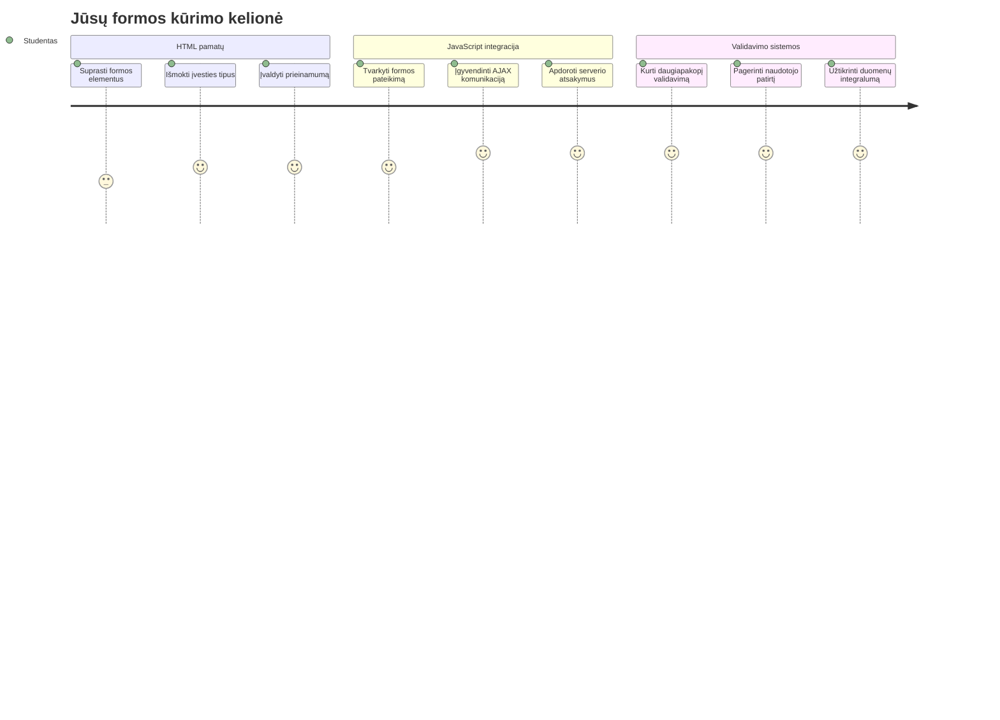
## Priešpaskaitos testas

[Priešpaskaitos testas](https://ff-quizzes.netlify.app/web/quiz/43)

Ar kada nors užpildėte formą internete ir ji atmetė jūsų el. pašto formatą? Ar praradote visą informaciją paspaudę siųsti? Visi esame susidūrę su tokiomis erzinančiomis patirtimis.

Formos yra tiltas tarp jūsų vartotojų ir jūsų programėlės funkcionalumo. Kaip ir oro eismo kontrolieriai naudoja atsargias protokolų taisykles, kad lėktuvai saugiai pasiektų tikslą, taip gerai sukurta forma teikia aiškią grįžtamąją informaciją ir užkerta kelią brangioms klaidoms. Prastos formos gali atbaidyti vartotojus greičiau nei nesusipratimai užimtoje oro uosto aplinkoje.

Šioje pamokoje paversime jūsų statinę bankinę programėlę į interaktyvią aplikaciją. Išmoksite kurti formas, kurios tikrina įvesties duomenis, bendrauja su serveriais ir suteikia naudingą grįžtamąjį ryšį. Įsivaizduokite tai kaip valdymo sąsają, leidžiančią vartotojams naršyti programos funkcijas.

Pamokos pabaigoje turėsite pilną prisijungimo ir registracijos sistemą su validacija, kuri nukreipia vartotojus link sėkmės, o ne frustracijos.

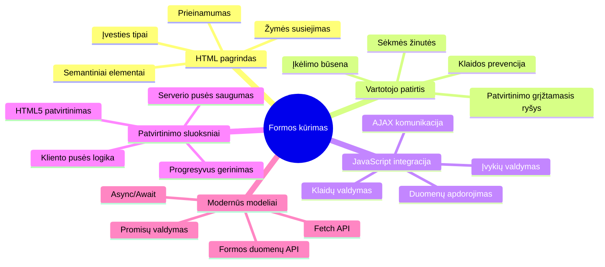
## Priešprielaidos

Prieš pradėdami kurti formas, įsitikinkime, kad viskas tinkamai įdiegta. Ši pamoka tęsia ten, kur baigėme ankstesnėje, tad jei praleidote ankstesnę dalį, verta grįžti ir išmokti pagrindus.

### Reikalinga įranga

| Komponentas | Būsena | Aprašymas |
|-----------|--------|-------------|
| [HTML Šablonai](../1-template-route/README.md) | ✅ Būtina | Jūsų pagrindinė bankinės programėlės struktūra |
| [Node.js](https://nodejs.org) | ✅ Būtina | JavaScript vykdymo aplinka serveriui |
| [Banko API serveris](../api/README.md) | ✅ Būtina | Užpakalinė paslauga duomenų saugojimui |

> 💡 **Kūrimo patarimas**: Jūs vienu metu paleisite du atskirus serverius – vieną priekinės dalies bankinę programėlę, kitą – užpakalinių API paslaugą. Šis išdėstymas atspindi realų kūrimą, kur frontend ir backend paslaugos veikia nepriklausomai.

### Serverio konfigūracija

**Jūsų kūrimo aplinka apims:**
- **Priekinės dalies serveris**: aptarnauja jūsų bankinę programėlę (dažniausiai prievadas `3000`)
- **API užpakalinis serveris**: tvarko duomenų saugojimą ir gavimą (prievadas `5000`)
- **Abi serveriai** gali veikti vienu metu be konfliktų

**Bandoma API jungtis:**
```bash
curl http://localhost:5000/api
# Tikėtinas atsakymas: "Bank API 1.0.0 versija"
```

**Jei matote API versijos atsakymą, galite tęsti!**

---

## Supratimas apie HTML formas ir valdiklius

HTML formos yra vartotojų komunikacija su internetine programa. Įsivaizduokite jas kaip telegrafo sistemą XIX a., sujungusią tolimus taškus – tai komunikacijos protokolas tarp vartotojo ketinimo ir programos atsako. Protingai sukurtos formos aptinka klaidas, gide įvesties formatavimą ir pateikia naudingas užuominas.

Modernios formos yra daug sudėtingesnės už paprastą teksto įvedimą. HTML5 pristatė specializuotus įvesčių tipus, kurie automatiškai atlieka el. pašto validaciją, skaičių formatavimą ir datos parinkimą. Šie patobulinimai naudingesni tiek prieinamumui, tiek mobiliųjų vartotojų patirčiai.

### Esminiai formos elementai

**Pagrindiniai blokai, kurių reikia kiekvienai formoje:**

```html
<!-- Basic form structure -->
<form id="userForm" method="POST">
  <label for="username">Username</label>
  <input id="username" name="username" type="text" required>
  
  <button type="submit">Submit</button>
</form>
```

**Šis kodas atlieka:**
- **Sukuria** formos konteinerį su unikaliu identifikatoriumi
- **Nurodo** HTTP metodą duomenų siuntimui
- **Susieja** etiketes su įvestimis dėl prieinamumo
- **Apibrėžia** siuntimo mygtuką formos apdorojimui

### Modernūs įvesčių tipai ir atributai

| Įvesčio tipas | Paskirtis | Naudojimo pavyzdys |
|------------|---------|---------------|
| `text` | Bendras teksto įvedimas | `<input type="text" name="username">` |
| `email` | El. pašto validacija | `<input type="email" name="email">` |
| `password` | Slapto teksto įvedimas | `<input type="password" name="password">` |
| `number` | Skaitmeninis įvedimas | `<input type="number" name="balance" min="0">` |
| `tel` | Telefono numeriai | `<input type="tel" name="phone">` |

> 💡 **Modernios HTML5 privalumas**: Naudojant specifinius įvesčių tipus automatiškai vykdoma validacija, pritaikoma tinkama mobiliųjų klaviatūra ir gerinama prieinamumo palaikymas be papildomo JavaScript!

### Mygtukų tipai ir elgsena

```html
<!-- Different button behaviors -->
<button type="submit">Save Data</button>     <!-- Submits the form -->
<button type="reset">Clear Form</button>    <!-- Resets all fields -->
<button type="button">Custom Action</button> <!-- No default behavior -->
```

**Ką veikia kiekvieno tipo mygtukas:**
- **Siuntimo mygtukai**: suaktyvina formos išsiuntimą ir siunčia duomenis į nurodytą galinį tašką
- **Atstatymo mygtukai**: atkurią visus formos laukus į pradinę būsena
- **Paprasti mygtukai**: neturi numatytos elgsenos, reikalauja sadomų JavaScript funkcijų

> ⚠️ **Svarbi pastaba**: `<input>` elementas yra savaiminis uždaromas ir nereikalauja uždarančios žymės. Moderni praktika rašyti `<input>` be užbaigiančio brūkšnio.

### Kurkite prisijungimo formą

Dabar sukurkime praktišką prisijungimo formą, demonstruojančią modernias HTML formų praktikas. Pradėsime nuo pagrindinės struktūros ir palaipsniui praturtinsime ją prieinamumo funkcijomis bei validacija.

```html
<template id="login">
  <h1>Bank App</h1>
  <section>
    <h2>Login</h2>
    <form id="loginForm" novalidate>
      <div class="form-group">
        <label for="username">Username</label>
        <input id="username" name="user" type="text" required 
               autocomplete="username" placeholder="Enter your username">
      </div>
      <button type="submit">Login</button>
    </form>
  </section>
</template>
```

**Kas čia vyksta:**
- **Struktūruoja** formą su semantinėmis HTML5 žymėmis
- **Grupuoja** susijusius elementus `div` konteineriuose su prasmingomis klasėmis
- **Susieja** etiketes su įvesčių laukais naudodamas `for` ir `id` atributus
- **Papildo** moderniais atributais, tokiais kaip `autocomplete` ir `placeholder`, geresnei UX
- **Prideda** `novalidate`, kad validaciją rūpintųsi JavaScript, o ne naršyklė

### Teisingų etikčių galia

**Kodėl etiketės svarbios šiuolaikiniame žiniatinklio kūrime:**

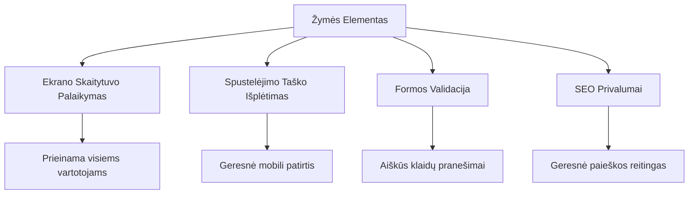
**Ką užtikrina teisingi etiketės:**
- **Leidžia** ekrano skaitytuvams aiškiai paskelbti formos laukus
- **Išplečia** spustelėjimo sritį (spustelėjus etiketę, fokusuojamas laukas)
- **Gerina** mobiliųjų įrenginių naudojimą su didesnėmis lietimo zonomis
- **Palaiko** formos validaciją su prasmingomis klaidų žinutėmis
- **Stiprina** SEO, įtraukiant semantinę prasmę formos elementams

> 🎯 **Prieinamumo tikslas**: Kiekvienas formos laukas turi turėti susijusią etiketę. Ši paprasta praktika leidžia visiems, įskaitant neįgaliuosius, naudotis formomis ir pagerina vartotojų patirtį.

### Registracijos formos kūrimas

Registracijos forma reikalauja daugiau informacijos norint sukurti pilną vartotojo paskyrą. Sukurkime ją su moderniomis HTML5 galimybėmis ir pagerintu prieinamumu.

```html
<hr/>
<h2>Register</h2>
<form id="registerForm" novalidate>
  <div class="form-group">
    <label for="user">Username</label>
    <input id="user" name="user" type="text" required 
           autocomplete="username" placeholder="Choose a username">
  </div>
  
  <div class="form-group">
    <label for="currency">Currency</label>
    <input id="currency" name="currency" type="text" value="$" 
           required maxlength="3" placeholder="USD, EUR, etc.">
  </div>
  
  <div class="form-group">
    <label for="description">Account Description</label>
    <input id="description" name="description" type="text" 
           maxlength="100" placeholder="Personal savings, checking, etc.">
  </div>
  
  <div class="form-group">
    <label for="balance">Starting Balance</label>
    <input id="balance" name="balance" type="number" value="0" 
           min="0" step="0.01" placeholder="0.00">
  </div>
  
  <button type="submit">Create Account</button>
</form>
```

**Aukščiau mes:**
- **Organizavome** kiekvieną lauką konteinerių `div`, kad geriau stilizuoti ir išdėstyti
- **Pridėjome** tinkamus `autocomplete` atributus, kad naršyklė palaikytų automatinį užpildymą
- **Įtraukėme** naudingus laikinuosius tekstus, kurie padeda vartotojui įvesti duomenis
- **Nustatėme** prasmingas numatytąsias reikšmes naudodami `value` atributą
- **Panaudojome** validavimo atributus, tokius kaip `required`, `maxlength` ir `min`
- **Naudojome** `type="number"` balanso laukui, palaikant skaitmenis su kableliu

### Įvesčių tipų ir elgsenos tyrinėjimas

**Modernūs įvesčių tipai suteikia papildomą funkcionalumą:**

| Funkcija | Nauda | Pavyzdys |
|---------|---------|----------|
| `type="number"` | Skaitmeninė klaviatūra mobiliesiems | Lengvesnė balanso įvestis |
| `step="0.01"` | Dešimtainio tikslumo kontrolė | Leidžia įvesti centus valiutoje |
| `autocomplete` | Naršyklės automatinis užpildymas | Greitesnis formos užpildymas |
| `placeholder` | Kontekstinės užuominos | Veda vartotojo lūkesčius |

> 🎯 **Prieinamumo iššūkis**: Pabandykite naudoti formas naudodami tik klaviatūrą! Naudokite `Tab` judėjimui tarp laukų, `Space` žymėjimo langeliams ir `Enter` siuntimui. Tai padės suprasti, kaip ekrano skaitytuvo vartotojai sąveikauja su jūsų formomis.

### 🔄 **Pedagoginis patikrinimas**
**Formos pagrindo supratimas**: Prieš pradedant naudoti JavaScript, įsitikinkite, kad suprantate:
- ✅ Kaip semantinis HTML kuria prieinamas formų struktūras
- ✅ Kodėl įvesčių tipai svarbūs mobiliųjų klaviatūroms ir validacijai
- ✅ Santykį tarp etikečių ir formos valdiklių
- ✅ Kaip formos atributai veikia numatytą naršyklės elgseną

**Greitas savitikrinimas**: Kas nutinka, jei siunčiate formą be JavaScript tvarkymo?
*Atsakymas: Naršyklė vykdo numatytą siuntimą, dažniausiai nukreipdama į veiksmo URL*

**HTML5 formų privalumai**: Modernios formos suteikia:
- **Įmontuotą validaciją**: Automatinį el. pašto ir skaičiaus formato tikrinimą
- **Mobiliojo optimizavimą**: Tinkamas klaviatūras skirtingiems įvesčių tipams
- **Prieinamumą**: Ekrano skaitytuvų palaikymą ir klaviatūros navigaciją
- **Progresyvią gerinimo galimybę**: Veikia net kai JavaScript išjungtas

## Suprasti formos siuntimo metodus

Kai kas nors užpildo jūsų formą ir paspaudžia siuntimą, tie duomenys turi kur nors patekti – dažniausiai į serverį, kuris gali juos išsaugoti. Yra keletas būdų, kaip tai vyksta, ir žinojimas, kurį naudoti, gali sutaupyti jums bėdų ateityje.

Pažiūrėkime, kas iš tikrųjų vyksta, kai kas nors paspaudžia siuntimo mygtuką.

### Numatytoji formos elgsena

Pirmiausia pažiūrėkime, kas vyksta su paprastu formos siuntimu:

**Išbandykite savo esamas formas:**
1. Paspauskite *Registruotis* mygtuką savo formoje
2. Stebėkite pakeitimus naršyklės adreso juostoje
3. Atkreipkite dėmesį, kaip puslapis persikrauna ir duomenys atsiranda URL


### HTTP metodų palyginimas

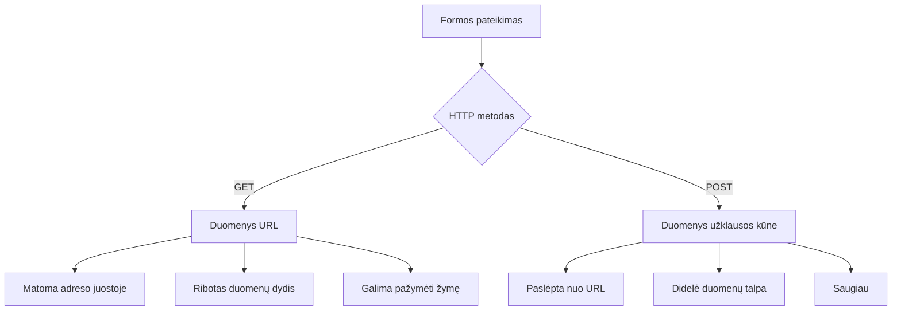
**Suprasti skirtumus:**

| Metodas | Paskirtis | Duomenų vieta | Saugumo lygis | Dydžio limitas |
|--------|----------|---------------|----------------|-------------|
| `GET` | Paieškos užklausos, filtrai | URL parametrai | Žemas (matomas) | ~2000 simbolių |
| `POST` | Vartotojų paskyros, jautri informacija | Užklausos kūnas | Aukštesnis (paslėptas) | Nėra praktiško limito |

**Pagrindiniai skirtumai:**
- **GET**: Priduria formos duomenis prie URL kaip užklausos parametrus (tinka paieškoms)
- **POST**: Įtraukia duomenis į užklausos kūną (būtina jautriai informacijai)
- **GET trūkumai**: Dydžio apribojimai, matomi duomenys, istoriniai naršyklės įrašai
- **POST privalumai**: Didelė duomenų talpa, privatumo apsauga, failų įkėlimas

> 💡 **Gera praktika**: Naudokite `GET` paieškos formoms ir filtrams (duomenų gavimui), `POST` naudokite vartotojo registracijai, prisijungimui ir duomenų kūrimui.

### Formos siuntimo konfigūravimas

Konfigūruokime registracijos formą taip, kad ji tinkamai bendrautų su užpakalinio API serverio pagalba POST metodu:

```html
<form id="registerForm" action="//localhost:5000/api/accounts" 
      method="POST" novalidate>
```

**Ši konfigūracija atlieka:**
- **Nukreipia** formos siuntimą į jūsų API galinį tašką
- **Naudoja** POST metodą saugiam duomenų perdavimui
- **Įrašo** `novalidate`, kad validaciją valdyti JavaScript

### Formos siuntimo testavimas

**Atlikite šiuos žingsnius formos testavimui:**
1. **Užpildykite** registracijos formą savo duomenimis
2. **Spustelėkite** "Sukurti paskyrą" mygtuką
3. **Stebėkite** serverio atsaką naršyklėje

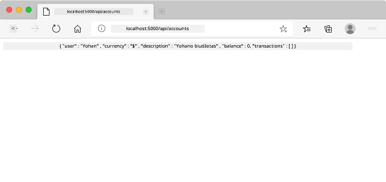

**Ką turėtumėte pamatyti:**
- **Naršyklė nukreipia** į API galinį tašką URL
- **JSON atsakymas** su jūsų ką tik sukurta paskyros informacija
- **Serverio patvirtinimas**, kad paskyra buvo sėkmingai sukurta

> 🧪 **Eksperimentų laikas**: Pabandykite registruotis su tuo pačiu naudotojo vardu dar kartą. Koks atsakymas? Tai padės suprasti, kaip serveris tvarko dublikatų duomenis ir klaidų situacijas.

### Supratimas apie JSON atsakymus

**Kai serveris sėkmingai apdoroja jūsų formą:**
```json
{
  "user": "john_doe",
  "currency": "$",
  "description": "Personal savings",
  "balance": 100,
  "id": "unique_account_id"
}
```

**Šis atsakymas patvirtina:**
- **Sukuria** naują paskyrą su jūsų nurodytais duomenimis
- **Priskiria** unikalų identifikatorių ateičiai
- **Grąžina** visą paskyros informaciją patikrinimui
- **Indikuoja** sėkmingą duomenų bazės įrašymą

## Modernus formų valdymas su JavaScript

Tradiciškai formos siuntimas sukelia pilną puslapio perkrovimą, panašiai kaip anksčiau kosminiai skrydžiai reikalaudavo visiškų sisteminių iš naujo nustatymų trajektorijos korekcijoms. Šis metodas trikdo vartotojo patirtį ir praranda programos būseną.

JavaScript formų valdymas veikia kaip nuolatinės navigacijos sistemos, naudojamos moderniuose kosminiuose aparatuose – suteikia realaus laiko koregavimus neprarandant navigacijos konteksto. Galime užkirsti formos siuntimą, suteikti momentinį grįžtamąjį ryšį, tvarkyti klaidas maloniai ir atnaujinti sąsają pagal serverio atsakymus išlaikant vartotojo poziciją programoje.

### Kodėl vengti puslapio perkrovimų?

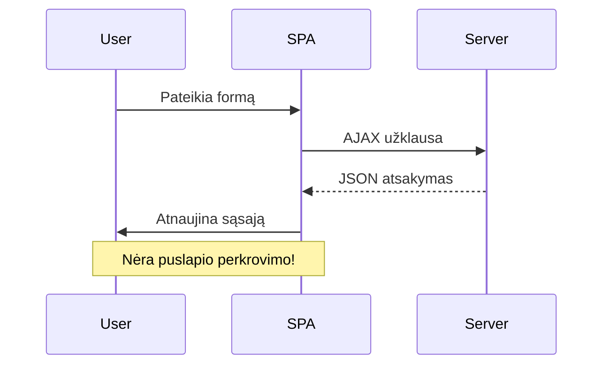
**JavaScript formų valdymo privalumai:**
- **Išlaiko** programos būseną ir vartotojo kontekstą
- **Suteikia** momentinį atsaką ir įkėlimo indikatorius
- **Leidžia** dinamiškai tvarkyti klaidas ir validaciją
- **Kuria** sklandų, programėlei panašų vartotojo patyrimą
- **Leidžia** sąlyginę logiką pagal serverio atsakymus

### Pereinamasis laikotarpis nuo tradicinio prie modernaus

**Tradiciniai metodai:**
- **Peradresuoja** vartotojus iš jūsų programos
- **Praranda** esamą programos būseną ir kontekstą
- **Reikalauja** pilno puslapio perkrovimo paprastoms operacijoms
- **Suteikia** ribotą kontrolę vartotojo grįžtamajam ryšiui

**Modernus JavaScript metodas:**
- **Laiko** vartotojus programoje
- **Išlaiko** visą programos būseną ir duomenis
- **Leidžia** realaus laiko validaciją ir grįžtamąjį ryšį
- **Palaiko** progresyvų patobulinimą ir prieinamumą

### JavaScript formų valdymo įgyvendinimas

Pakeiskime tradicinį formos siuntimą moderniu JavaScript įvykių valdymu:

```html
<!-- Remove the action attribute and add event handling -->
<form id="registerForm" method="POST" novalidate>
```

**Pridėkite registracijos logiką į savo `app.js` failą:**

```javascript
// Šiuolaikinis įvykių valdomas formos tvarkymas
function register() {
  const registerForm = document.getElementById('registerForm');
  const formData = new FormData(registerForm);
  const data = Object.fromEntries(formData);
  const jsonData = JSON.stringify(data);
  
  console.log('Form data prepared:', data);
}

// Pridėti įvykio klausytoją, kai įkeliamas puslapis
document.addEventListener('DOMContentLoaded', () => {
  const registerForm = document.getElementById('registerForm');
  registerForm.addEventListener('submit', (event) => {
    event.preventDefault(); // Užkirsti kelią numatytajam formos pateikimui
    register();
  });
});
```

**Kas čia vyksta:**
- **Užkerta kelią** numatytam formos siuntimui naudojant `event.preventDefault()`
- **Gauna** formos elementą naudojant šiuolaikinį DOM pasirinkimą
- **Išgauna** formos duomenis su galingu `FormData` API
- **Paverčia** FormData į paprastą objektą su `Object.fromEntries()`
- **Serealizuoja** duomenis į JSON formatą serveriui perduoti
- **Atspausdina** apdorotus duomenis derinimo ir patikrinimo tikslais

### FormData API supratimas

**FormData API suteikia galingą formų valdymą:**
```javascript
// FormData pavyzdys, ką jis fiksuoja
const formData = new FormData(registerForm);

// FormData automatiškai fiksuoja:
// {
//   "user": "john_doe",
//   "currency": "$",
//   "description": "Asmeninė sąskaita",
//   "balance": "100"
// }
```

**FormData API privalumai:**
- **Išsamus rinkimas**: surenka visus formos elementus, įskaitant tekstą, failus ir sudėtingus įvesties laukus
- **Tipų atpažinimas**: automatiškai tvarko skirtingus įvesties tipus be papildomo kodo rašymo
- **Veiksmingumas**: pašalina rankinį laukų rinkimą vienu API kvietimu
- **Prisitaikymas**: veikia net keičiasi formos struktūrai

### Serverio komunikacijos funkcijos kūrimas

Dabar sukurkime patikimą funkciją ryšiui su API serveriu, naudojant modernias JavaScript paradigmas:

```javascript
async function createAccount(account) {
  try {
    const response = await fetch('//localhost:5000/api/accounts', {
      method: 'POST',
      headers: { 
        'Content-Type': 'application/json',
        'Accept': 'application/json'
      },
      body: account
    });
    
    // Patikrinkite, ar atsakymas buvo sėkmingas
    if (!response.ok) {
      throw new Error(`HTTP error! status: ${response.status}`);
    }
    
    return await response.json();
  } catch (error) {
    console.error('Account creation failed:', error);
    return { error: error.message || 'Network error occurred' };
  }
}
```

**Asinchroninio JavaScript supratimas:**

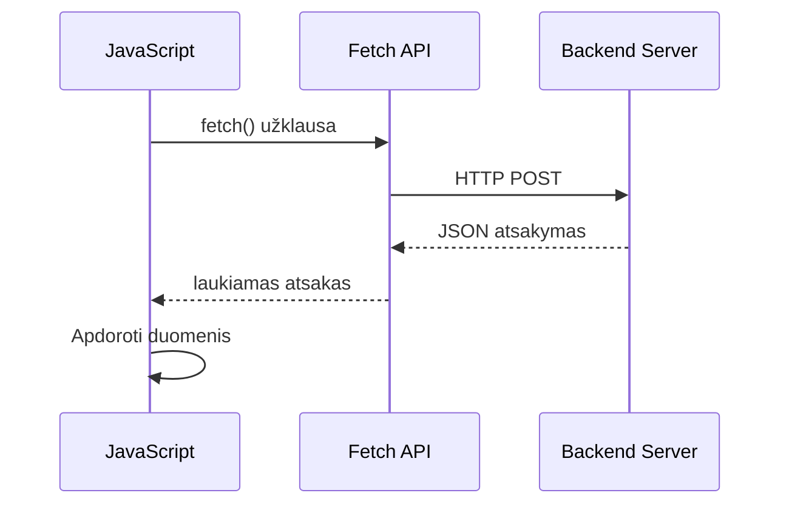
**Ši moderni įgyvendinimo versija atlieka:**
- **Naudoja** `async/await` skaitomam asinchroniniam kodui
- **Įtraukia** tinkamą klaidų tvarkymą su try/catch blokais
- **Patikrina** atsakymo statusą prieš apdorojimą
- **Nustato** tinkamus antraščių laukus JSON komunikacijai
- **Tiekia** išsamius klaidų pranešimus derinimui
- **Grąžina** nuoseklią duomenų struktūrą sėkmei ir klaidoms

### Moderniojo Fetch API galia

**Fetch API privalumai prieš senesnius metodus:**

| Funkcija | Privalumas | Įgyvendinimas |
|---------|---------|----------------|
| Promise pagrindu | Švarus asinchroninis kodas | `await fetch()` |
| Užklausos pritaikymas | Pilnas HTTP valdymas | Antraštės, metodai, turinys |
| Atsakymo tvarkymas | Lanksti duomenų analizė | `.json()`, `.text()`, `.blob()` |
| Klaidos tvarkymas | Išsamus klaidų gaudymas | Try/catch blokai |

> 🎥 **Sužinokite daugiau**: [Async/Await pamoka](https://youtube.com/watch?v=YwmlRkrxvkk) – asinchroninio JavaScript modelių supratimas modernaus žiniatinklio kūrimui.

**Pagrindinės serverio komunikacijos sąvokos:**
- **Asinchroninės funkcijos** leidžia sustabdyti vykdymą laukiant serverio atsakymų
- **Await raktinis žodis** verčia asinchroninį kodą skaitytis kaip sinchroninį
- **Fetch API** teikia modernias, Promise pagrindu veikiančias HTTP užklausas
- **Klaidų tvarkymas** užtikrina programos gražų reagavimą į tinklo klaidas

### Registracijos funkcijos užbaigimas

Apjungkime viską į pilnai paruoštą gamybai registracijos funkciją:

```javascript
async function register() {
  const registerForm = document.getElementById('registerForm');
  const submitButton = registerForm.querySelector('button[type="submit"]');
  
  try {
    // Rodyti įkėlimo būseną
    submitButton.disabled = true;
    submitButton.textContent = 'Creating Account...';
    
    // Apdoroti formos duomenis
    const formData = new FormData(registerForm);
    const jsonData = JSON.stringify(Object.fromEntries(formData));
    
    // Siųsti į serverį
    const result = await createAccount(jsonData);
    
    if (result.error) {
      console.error('Registration failed:', result.error);
      alert(`Registration failed: ${result.error}`);
      return;
    }
    
    console.log('Account created successfully!', result);
    alert(`Welcome, ${result.user}! Your account has been created.`);
    
    // Išvalyti formą po sėkmingos registracijos
    registerForm.reset();
    
  } catch (error) {
    console.error('Unexpected error:', error);
    alert('An unexpected error occurred. Please try again.');
  } finally {
    // Atstatyti mygtuko būseną
    submitButton.disabled = false;
    submitButton.textContent = 'Create Account';
  }
}
```

**Ši patobulinta versija apima:**
- **Teikia** vizualinį atsiliepimą formos pateikimo metu
- **Išjungia** mygtuką, kad išvengtų pasikartojančio pateikimo
- **Tvarko** tiek numatytas, tiek nenumatytas klaidas
- **Rodo** draugiškus sėkmės ir klaidų pranešimus
- **Atstato** formą po sėkmingos registracijos
- **Grąžina** UI būseną nepriklausomai nuo rezultato

### Jūsų įgyvendinimo testavimas

**Atidarykite naršyklės kūrėjų įrankius ir patikrinkite registraciją:**

1. **Atidarykite** naršyklės konsolę (F12 → Console skirtukas)
2. **Užpildykite** registracijos formą
3. **Paspauskite** „Create Account“
4. **Stebėkite** konsolės žinutes ir vartotojo atsiliepimą

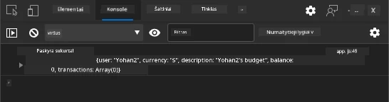

**Ką turėtumėte pamatyti:**
- **Įkėlimo būsena** matoma ant pateikimo mygtuko
- **Konsolės įrašai** demonstruoja detalų procesą
- **Sėkmės pranešimas** pasirodo, kai paskyros kūrimas pavyksta
- **Forma išsivalo** automatiškai po sėkmingo įrašymo

> 🔒 **Saugumo pastaba**: Šiuo metu duomenys perduodami per HTTP, kuris nėra saugus gamybai. Tikrose programose visada naudokite HTTPS duomenų šifravimui. Sužinokite daugiau apie [HTTPS saugumą](https://en.wikipedia.org/wiki/HTTPS) ir kodėl tai svarbu vartotojų duomenų apsaugai.

### 🔄 **Pedagoginis patikrinimas**
**Modernus JavaScript integravimas**: patikrinkite savo žinias apie asinchroninį formų tvarkymą:
- ✅ Kaip `event.preventDefault()` keičia numatytą formos veikimą?
- ✅ Kodėl FormData API yra veiksmingesnis už rankinį laukų rinkimą?
- ✅ Kaip async/await modeliai pagerina kodo skaitomumą?
- ✅ Kokią reikšmę turi klaidų tvarkymas vartotojo patirtyje?

**Sistemos architektūra**: jūsų formos tvarkymas demonstruoja:
- **Įvykių valdymą**: formos reaguoja į vartotojo veiksmus be puslapio perkrovimo
- **Asinchroninę komunikaciją**: serverio užklausos neužblokuoja sąsajos
- **Klaidų tvarkymą**: gražų elgesį tinklo klaidų atveju
- **Būsenos valdymą**: UI atnaujinama teisingai pagal serverio atsakymus
- **Progresyvų tobulinimą**: bazinė funkcija veikia, o JavaScript ją sustiprina

**Profesionalios praktikos**: įgyvendinote:
- **Vienos atsakomybės principą**: funkcijos turi aiškų ir tikslų tikslą
- **Klaidų ribojimus**: try/catch blokai apsaugo nuo avarijų
- **Vartotojo atsiliepimą**: įkėlimo būsena ir sėkmės/klaidų žinutės
- **Duomenų transformavimą**: FormData į JSON serverio komunikacijai

## Išsamus formos tikrinimas

Formos tikrinimas apsaugo nuo nemalonių klaidų radimo tik po pateikimo. Kaip daugybė perteklinių sistemų Tarptautinėje kosminėje stotyje, efektyvus tikrinimas remiasi keliomis saugumo sluoksniais.

Optimalus metodas apjungia naršyklės lygmens patikrą greitai grįžtamajai informacijai, JavaScript patikrą geresnei vartotojo patirčiai ir serverio pusės patikrą saugumui bei duomenų vientisumui. Ši perteklinė sistema užtikrina tiek vartotojo pasitenkinimą, tiek sistemos apsaugą.

### Tikrinimo sluoksnių supratimas

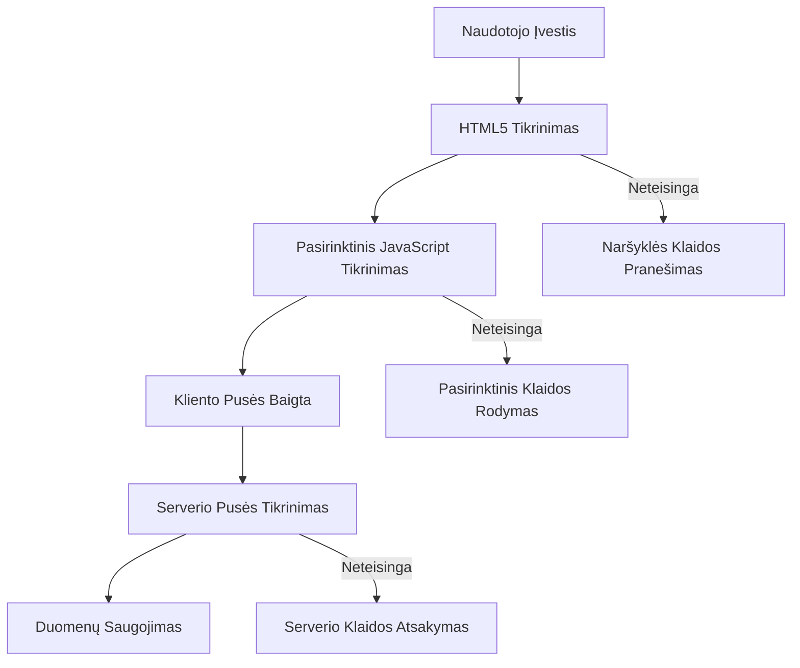
**Daugiapakopis tikrinimo metodas:**
- **HTML5 tikrinimas**: tiesioginiai naršyklės patikrinimai
- **JavaScript tikrinimas**: savita logika ir vartotojo patirtis
- **Serverio tikrinimas**: galutinė sauga ir duomenų vientisumas
- **Progresyvus tobulinimas**: veikia net kai JavaScript išjungtas

### HTML5 tikrinimo atributai

**Modernūs tikrinimo įrankiai jūsų paslaugoms:**

| Atributas | Paskirtis | Naudojimas | Naršyklės elgesys |
|-----------|---------|---------------|------------------|
| `required` | Privalomi laukai | `<input required>` | Neleidžia pateikti tuščio lauko |
| `minlength`/`maxlength` | Teksto ilgis | `<input maxlength="20">` | Riboja simbolių skaičių |
| `min`/`max` | Skaitinės ribos | `<input min="0" max="1000">` | Tikrina skaičių intervalus |
| `pattern` | Individualios regex taisyklės | `<input pattern="[A-Za-z]+">` | Atitinka specifinius formatų reikalavimus |
| `type` | Duomenų tipas | `<input type="email">` | Tikrina formatą pagal tipą |

### CSS tikrinimo stilius

**Sukurti vizualinį tikrinimo būsenų atvaizdavimą:**

```css
/* Valid input styling */
input:valid {
  border-color: #28a745;
  background-color: #f8fff9;
}

/* Invalid input styling */
input:invalid {
  border-color: #dc3545;
  background-color: #fff5f5;
}

/* Focus states for better accessibility */
input:focus:valid {
  box-shadow: 0 0 0 0.2rem rgba(40, 167, 69, 0.25);
}

input:focus:invalid {
  box-shadow: 0 0 0 0.2rem rgba(220, 53, 69, 0.25);
}
```

**Ką šie vizualiniai signalai reiškia:**
- **Žali apvadai**: rodo sėkmingą tikrinimą, kaip žalieji signalai valdymo centre
- **Raudoni apvadai**: signalizuoja klaidas, kurios reikalauja dėmesio
- **Fokuso paryškinimai**: aiškiai nurodo, kuriuo lauku šiuo metu veikiama
- **Vienodi stiliai**: sukuria vartotojui pažįstamus sąsajos modelius

> 💡 **Naudingas patarimas**: naudokite CSS pseudo klases `:valid` ir `:invalid`, kad teiktumėte greitą vizualinį atsiliepimą įvedant duomenis ir sukurtumėte dinamišką, naudingą sąsają.

### Išsamus tikrinimo įgyvendinimas

Patobulinkime jūsų registracijos formą su stipriu tikrinimu, kuris užtikrina puikią vartotojo patirtį ir aukštą duomenų kokybę:

```html
<form id="registerForm" method="POST" novalidate>
  <div class="form-group">
    <label for="user">Username <span class="required">*</span></label>
    <input id="user" name="user" type="text" required 
           minlength="3" maxlength="20" 
           pattern="[a-zA-Z0-9_]+" 
           autocomplete="username"
           title="Username must be 3-20 characters, letters, numbers, and underscores only">
    <small class="form-text">Choose a unique username (3-20 characters)</small>
  </div>
  
  <div class="form-group">
    <label for="currency">Currency <span class="required">*</span></label>
    <input id="currency" name="currency" type="text" required 
           value="$" maxlength="3" 
           pattern="[A-Z$€£¥₹]+" 
           title="Enter a valid currency symbol or code">
    <small class="form-text">Currency symbol (e.g., $, €, £)</small>
  </div>
  
  <div class="form-group">
    <label for="description">Account Description</label>
    <input id="description" name="description" type="text" 
           maxlength="100" 
           placeholder="Personal savings, checking, etc.">
    <small class="form-text">Optional description (up to 100 characters)</small>
  </div>
  
  <div class="form-group">
    <label for="balance">Starting Balance</label>
    <input id="balance" name="balance" type="number" 
           value="0" min="0" step="0.01" 
           title="Enter a positive number for your starting balance">
    <small class="form-text">Initial account balance (minimum $0.00)</small>
  </div>
  
  <button type="submit">Create Account</button>
</form>
```

**Patobulinto tikrinimo supratimas:**
- **Derina** privalomų laukų ženklus su naudingais aprašais
- **Apima** `pattern` atributus formatų tikrinimui
- **Prideda** `title` atributus prieinamumui ir patarimams
- **Prideda** pagalbinį tekstą vartotojo nurodymams
- **Naudoja** semantinę HTML struktūrą geresniam prieinamumui

### Išplėstinės tikrinimo taisyklės

**Ką atlieka kiekviena taisyklė:**

| Laukas | Tikrinimo taisyklės | Vartotojo privalumas |
|-------|------------------|--------------|
| Slapyvardis | `required`, `minlength="3"`, `maxlength="20"`, `pattern="[a-zA-Z0-9_]+"` | Užtikrina galiojančius ir unikalius identifikatorius |
| Valiuta | `required`, `maxlength="3"`, `pattern="[A-Z$€£¥₹]+"` | Priima įprastus valiutų simbolius |
| Balansas | `min="0"`, `step="0.01"`, `type="number"` | Neleidžia neigiamų likučių |
| Aprašymas | `maxlength="100"` | Protingi ilgumo apribojimai |

### Tikrinimo elgesio testavimas

**Išbandykite šias situacijas:**
1. **Pateikite** formą su tuščiais privalomais laukais
2. **Įveskite** trumpesnį nei 3 simbolių slapyvardį
3. **Pabandykite** specialius simbolius slapyvardžio lauke
4. **Įveskite** neigiamą balanso reikšmę

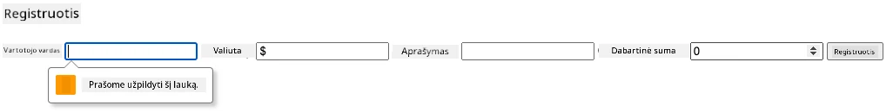

**Ką pastebėsite:**
- **Naršyklė rodo** vietinius tikrinimo pranešimus
- **Stilių pasikeitimai** priklausomai nuo `:valid` ir `:invalid` būsenų
- **Forma nepateikiama** kol visi tikrinimai nepraeina
- **Fokuso žymeklis automatiškai** pereina prie pirmo netinkamo lauko

### Kliento pusės ir serverio pusės tikrinimas

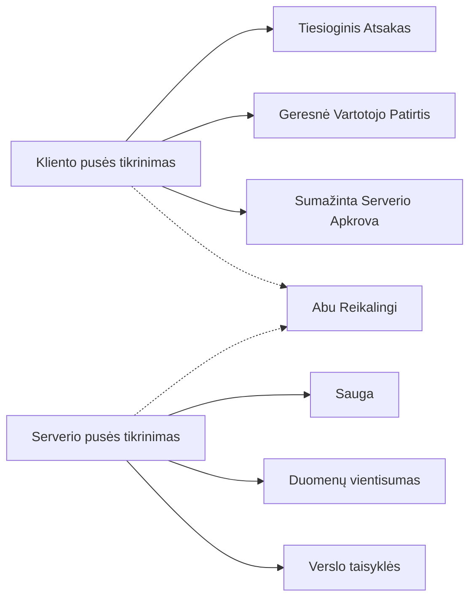
**Kodėl reikia abiejų sluoksnių:**
- **Kliento pusės tikrinimas**: suteikia greitą grįžtamąjį ryšį ir gerina vartotojo patirtį
- **Serverio pusės tikrinimas**: užtikrina saugumą ir apdoroja sudėtingas verslo taisykles
- **Kombinuotas metodas**: sukuria tvirtas, draugiškas ir saugias programas
- **Progresyvus tobulinimas**: veikia net kai JavaScript išjungtas

> 🛡️ **Saugumo priminimas**: Niekada netikėkite tik kliento pusės patikra! Kenksmingi vartotojai gali apeiti, todėl serverio pusės tikrinimas būtinas saugumui ir duomenų vientisumui.

### ⚡ **Ką galite padaryti per artimiausias 5 minutes**
- [ ] Išbandykite formą su neteisingais duomenimis ir pamatykite tikrinimo pranešimus
- [ ] Pabandykite pateikti formą su išjungtu JavaScript ir pamatykite HTML5 tikrinimą
- [ ] Atidarykite naršyklės DevTools ir patikrinkite siunčiamus formos duomenis
- [ ] Eksperimentuokite su skirtingais įvesties tipais ir stebėkite mobiliųjų klaviatūrų pokyčius

### 🎯 **Ką galite pasiekti per šią valandą**
- [ ] Užbaikite testą po pamokos ir supraskite formų tvarkymo sąvokas
- [ ] Įgyvendinkite išsamų tikrinimo iššūkį su realaus laiko atsiliepimu
- [ ] Pridėkite CSS stilių profesionalioms formoms
- [ ] Sukurkite klaidų tvarkymą dublikuojantiems vartotojo vardus ir serverio klaidas
- [ ] Pridėkite slaptažodžio patvirtinimo laukus su atitinkamu tikrinimu

### 📅 **Jūsų savaitės formų meistriškumo kelionė**
- [ ] Užbaikite visą bankinę programėlę su pažangiomis formų funkcijomis
- [ ] Įgyvendinkite failų įkėlimo galimybes profilio nuotraukoms ar dokumentams
- [ ] Pridėkite daugiapakopes formas su pažangos indikatoriais ir būsenos valdymu
- [ ] Sukurkite dinamiškas formas, kurios prisitaiko pagal vartotojo pasirinkimus
- [ ] Įgyvendinkite formų automatinio išsaugojimo ir atkūrimo funkcijas geresnei vartotojo patirčiai
- [ ] Pridėkite pažangų tikrinimą, pvz., el. pašto patvirtinimą bei telefono numerių formatavimą

### 🌟 **Jūsų mėnesio frontend kūrimo meistriškumas**
- [ ] Kurkite sudėtingas formų programas su sąlyginė logika ir darbo eiga
- [ ] Išmokite formų bibliotekas ir karkasus greitam kūrimui
- [ ] Įvaldykite prieinamumo gaires ir įtraukiantį dizainą
- [ ] Įgyvendinkite internacionalizaciją ir lokalizaciją pasaulinėms formoms
- [ ] Kurkite pakartotinai naudojamas formų komponentų bibliotekas ir dizaino sistemas
- [ ] Dalyvaukite atviro kodo formų projektuose ir dalinkitės geriausiomis praktikomis

## 🎯 Jūsų formų kūrimo meistriškumo laiko juosta

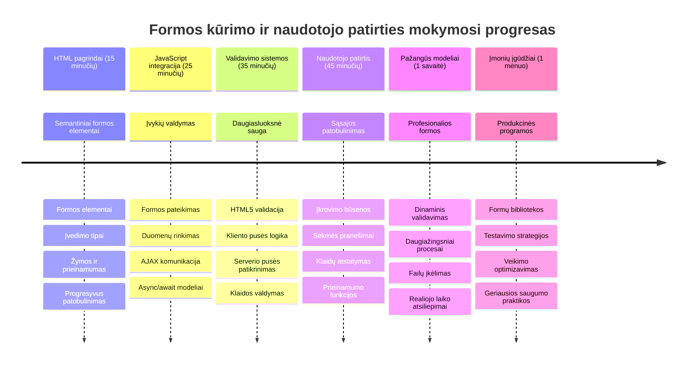
### 🛠️ Jūsų formų kūrimo įrankių rinkinys santrauka

Baigus šią pamoką, jūs įvaldėte:
- **HTML5 formos**: semantinė struktūra, įvesties tipai ir prieinamumo funkcijos
- **JavaScript formų tvarkymą**: įvykių valdymas, duomenų rinkimas ir AJAX komunikacija
- **Tikrinimo architektūrą**: kelių sluoksnių tikrinimas saugumui ir vartotojo patirčiai
- **Asinchroninį programavimą**: modernus fetch API ir async/await modeliai
- **Klaidų valdymą**: išsamus klaidų tvarkymas ir vartotojo atsiliepimai
- **Vartotojo patirties dizainą**: įkėlimo būsena, sėkmės pranešimai ir klaidų atkūrimas
- **Progresyvų tobulinimą**: formos, veikiančios visose naršyklėse ir galimybėse

**Realios pasaulio taikomosios sritys**: jūsų formų vystymo įgūdžiai tiesiogiai taikomi:
- **Elektroninės prekybos programoms**: užsakymų procesai, paskyrų registracija ir mokėjimų formos
- **Įmonių programinei įrangai**: duomenų įvedimo sistemos, ataskaitų sąsajos ir darbo eiga
- **Turinio valdymui**: leidybos platformos, vartotojų generuojamas turinys ir administravimo sąsajos
- **Finansinėms programoms**: bankininkystės sąsajos, investicijų platformos ir sandorių sistemos
- **Sveikatos priežiūros sistemoms**: pacientų portalai, susitikimų planavimas ir medicininių įrašų formos
- **Švietimo platformoms**: kursų registracija, vertinimo įrankiai ir mokymosi valdymas

**Įgyti profesiniai įgūdžiai**: dabar galite:
- **Kurti** prieinamas formas, veikiančias visiems vartotojams, įskaitant su negalia
- **Įgyvendinti** saugią formų tikrinimą, apsaugančią nuo duomenų korupcijos ir saugumo spragų
- **Kurkite** reaguojančias vartotojo sąsajas, teikiančias aiškią grįžtamąją informaciją ir nurodymus
- **Trikčių šalinimas** kompleksiškai formų sąveikai naudojant naršyklės kūrėjų įrankius ir tinklo analizę
- **Optimizuokite** formų veikimą efektyviu duomenų tvarkymu ir tikrinimo strategijomis

**Frontend kūrimo sąvokos įvaldytos**:
- **Įvykių varoma architektūra**: vartotojo sąveikos valdymas ir atsako sistemos
- **Asinchroninis programavimas**: neblokuojanti serverio komunikacija ir klaidų valdymas
- **Duomenų tikrinimas**: kliento ir serverio saugumo bei vientisumo patikrinimai
- **Vartotojo patirties dizainas**: intuityvios sąsajos, vedančios vartotojus į sėkmę
- **Prieinamumo inžinerija**: įtraukiantis dizainas, tinkantis įvairiems vartotojų poreikiams

**Kitas lygis**: esate pasirengęs tyrinėti pažangias formų bibliotekas, įgyvendinti sudėtingas tikrinimo taisykles ar kurti įmonių lygio duomenų rinkimo sistemas!

🌟 **Pasiekimas atrakintas**: sukūrėte pilną formų tvarkymo sistemą su profesionaliu tikrinimu, klaidų valdymu ir vartotojo patirties modeliais!

---


---

## GitHub Copilot Agent iššūkis 🚀

Naudokite Agent režimą šiam iššūkiui įgyvendinti:

**Aprašymas:** Patobulinkite registracijos formą išsamiu kliento pusės tikrinimu ir vartotojo atsiliepimais. Šis iššūkis padės jums praktikuotis formų tikrinimą, klaidų valdymą ir vartotojo patirties tobulinimą interaktyviu grįžtamuoju ryšiu.
**Promptas:** Sukurkite visišką registracijos formos patikrinimo sistemą, kuri apimtų: 1) Realaus laiko patikrinimo atsakymus kiekvienam laukui, kai vartotojas rašo, 2) Pasirinktines patikrinimo žinutes, kurios rodomos po kiekvienu įvesties lauku, 3) Slaptažodžio patvirtinimo lauką su atitikimo patikrinimu, 4) Vizualinius indikatorius (pvz., žalius varnelės ženklus teisingiems laukams ir raudonus įspėjimus neteisingiems), 5) Siuntimo mygtuką, kuris įgalinamas tik kai visi patikrinimai yra sėkmingi. Naudokite HTML5 patikrinimo atributus, CSS stilių patikrinimo būsenoms ir JavaScript interaktyviam elgesiui.

Daugiau apie [agent mode](https://code.visualstudio.com/blogs/2025/02/24/introducing-copilot-agent-mode) sužinokite čia.

## 🚀 Iššūkis

HTML faile parodykite klaidos žinutę, jei vartotojas jau egzistuoja.

Štai pavyzdys, kaip gali atrodyti galutinis prisijungimo puslapis po šiek tiek stiliaus taikymo:

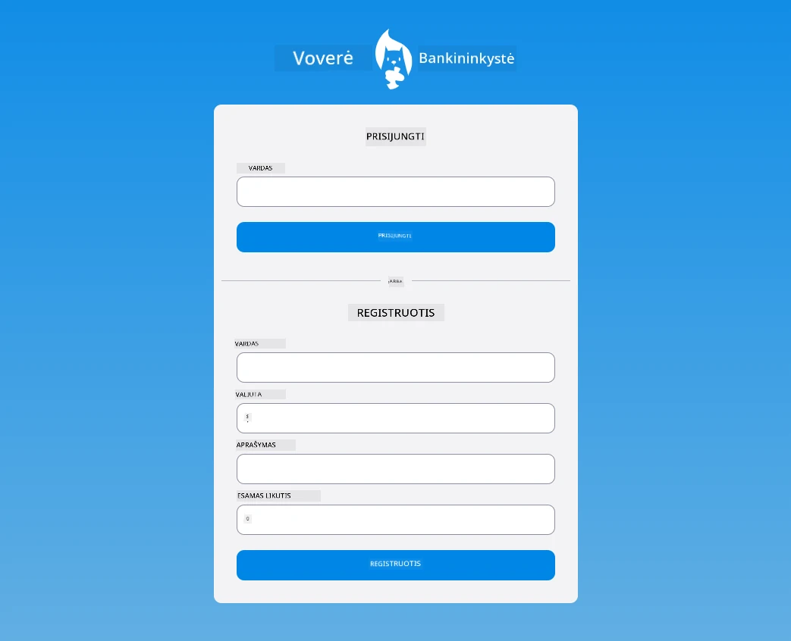

## Po paskaitos quizas

[Po paskaitos quizas](https://ff-quizzes.netlify.app/web/quiz/44)

## Apžvalga ir savarankiškas mokymasis

Kūrėjai labai išradingai kuria savo formas, ypač dėl validacijos strategijų. Pažinkite skirtingas formų eigas naršydami per [CodePen](https://codepen.com); ar pavyks rasti įdomių ir įkvepiančių formų?

## Užduotis

[Stilizuokite savo banko programėlę](assignment.md)

---

<!-- CO-OP TRANSLATOR DISCLAIMER START -->
**Atsakomybės apribojimas**:  
Šis dokumentas buvo išverstas naudojant dirbtinio intelekto vertimo paslaugą [Co-op Translator](https://github.com/Azure/co-op-translator). Nors stengiamės užtikrinti tikslumą, prašome atkreipti dėmesį, kad automatiniai vertimai gali turėti klaidų ar netikslumų. Pirminis dokumentas jo gimtąja kalba laikomas autoritetingu šaltiniu. Svarbiai informacijai rekomenduojamas profesionalus žmogaus vertimas. Mes neatsakome už jokius nesusipratimus ar neteisingą interpretavimą, kilusius dėl šio vertimo naudojimo.
<!-- CO-OP TRANSLATOR DISCLAIMER END -->