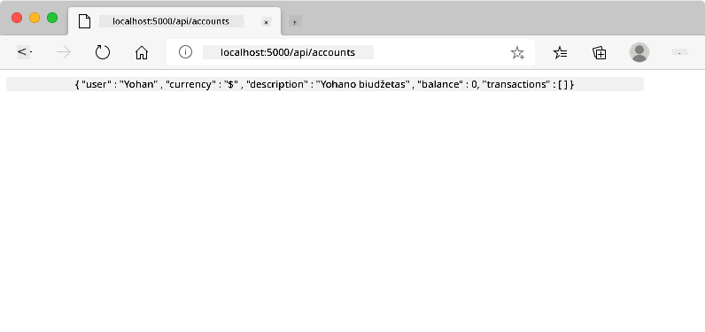
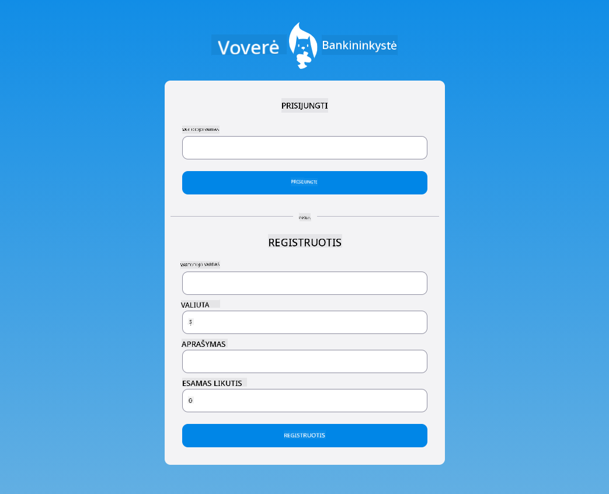

<!--
CO_OP_TRANSLATOR_METADATA:
{
  "original_hash": "b667b7d601e2ee19acb5aa9d102dc9f3",
  "translation_date": "2025-08-28T11:18:07+00:00",
  "source_file": "7-bank-project/2-forms/README.md",
  "language_code": "lt"
}
-->
# Sukurkite bankinę programėlę, 2 dalis: Sukurkite prisijungimo ir registracijos formą

## Klausimynas prieš paskaitą

[Klausimynas prieš paskaitą](https://ff-quizzes.netlify.app/web/quiz/43)

### Įvadas

Beveik visose šiuolaikinėse interneto programėlėse galite susikurti paskyrą, kad turėtumėte savo asmeninę erdvę. Kadangi keli vartotojai gali vienu metu naudotis interneto programėle, reikia mechanizmo, kuris leistų atskirai saugoti kiekvieno vartotojo asmeninius duomenis ir pasirinkti, kokią informaciją rodyti. Mes neaptarsime, kaip saugiai valdyti [vartotojo tapatybę](https://en.wikipedia.org/wiki/Authentication), nes tai yra plati tema, tačiau užtikrinsime, kad kiekvienas vartotojas galėtų sukurti vieną (ar daugiau) banko sąskaitų mūsų programėlėje.

Šioje dalyje naudosime HTML formas, kad pridėtume prisijungimo ir registracijos funkcijas mūsų interneto programėlėje. Pamatysime, kaip programiškai siųsti duomenis į serverio API ir kaip apibrėžti pagrindines vartotojo įvesties tikrinimo taisykles.

### Reikalavimai

Turite būti užbaigę [HTML šablonų ir maršrutų](../1-template-route/README.md) pamoką, skirtą interneto programėlei. Taip pat turite įdiegti [Node.js](https://nodejs.org) ir [paleisti serverio API](../api/README.md) lokaliai, kad galėtumėte siųsti duomenis sąskaitų kūrimui.

**Atkreipkite dėmesį**
Vienu metu turėsite paleisti du terminalus, kaip nurodyta žemiau:
1. Pagrindinei banko programėlei, kurią sukūrėme [HTML šablonų ir maršrutų](../1-template-route/README.md) pamokoje.
2. [Banko programėlės serverio API](../api/README.md), kurią ką tik nustatėme aukščiau.

Norint tęsti pamoką, abu serveriai turi veikti. Jie klausosi skirtinguose prievaduose (prievadas `3000` ir prievadas `5000`), todėl viskas turėtų veikti sklandžiai.

Galite patikrinti, ar serveris veikia tinkamai, vykdydami šią komandą terminale:

```sh
curl http://localhost:5000/api
# -> should return "Bank API v1.0.0" as a result
```

---

## Forma ir valdikliai

`<form>` elementas apima HTML dokumento dalį, kurioje vartotojas gali įvesti ir pateikti duomenis naudodamas interaktyvius valdiklius. Yra daugybė vartotojo sąsajos (UI) valdiklių, kuriuos galima naudoti formoje, tačiau dažniausiai naudojami `<input>` ir `<button>` elementai.

Yra daug skirtingų `<input>` [tipų](https://developer.mozilla.org/docs/Web/HTML/Element/input). Pavyzdžiui, norėdami sukurti lauką, kuriame vartotojas gali įvesti savo vartotojo vardą, galite naudoti:

```html
<input id="username" name="username" type="text">
```

`name` atributas bus naudojamas kaip savybės pavadinimas, kai formos duomenys bus siunčiami. `id` atributas naudojamas `<label>` susieti su formos valdikliu.

> Peržiūrėkite visą [`<input>` tipų](https://developer.mozilla.org/docs/Web/HTML/Element/input) ir [kitų formos valdiklių](https://developer.mozilla.org/docs/Learn/Forms/Other_form_controls) sąrašą, kad susipažintumėte su visais natūraliais UI elementais, kuriuos galite naudoti kurdami savo sąsają.

✅ Atkreipkite dėmesį, kad `<input>` yra [tuščias elementas](https://developer.mozilla.org/docs/Glossary/Empty_element), kuriam *nereikia* pridėti atitinkamos uždarymo žymos. Tačiau galite naudoti savarankiškai užsidarančią `<input/>` notaciją, bet tai nėra būtina.

`<button>` elementas formoje yra šiek tiek ypatingas. Jei nenurodysite jo `type` atributo, jis automatiškai pateiks formos duomenis serveriui, kai bus paspaustas. Štai galimi `type` reikšmių variantai:

- `submit`: Numatytasis `<form>` viduje, mygtukas sukelia formos pateikimo veiksmą.
- `reset`: Mygtukas atstato visus formos valdiklius į jų pradinius nustatymus.
- `button`: Nesuteikia numatytojo elgesio, kai mygtukas paspaudžiamas. Galite priskirti jam pasirinktinius veiksmus naudodami JavaScript.

### Užduotis

Pradėkime pridėdami formą prie `login` šablono. Mums reikės *vartotojo vardo* lauko ir *Prisijungimo* mygtuko.

```html
<template id="login">
  <h1>Bank App</h1>
  <section>
    <h2>Login</h2>
    <form id="loginForm">
      <label for="username">Username</label>
      <input id="username" name="user" type="text">
      <button>Login</button>
    </form>
  </section>
</template>
```

Jei atidžiau pažvelgsite, pastebėsite, kad čia taip pat pridėjome `<label>` elementą. `<label>` elementai naudojami UI valdikliams, tokiems kaip mūsų vartotojo vardo laukas, pavadinti. Etiketės yra svarbios formų skaitomumui, tačiau jos taip pat turi papildomų privalumų:

- Susiejus etiketę su formos valdikliu, tai padeda vartotojams, naudojantiems pagalbines technologijas (pvz., ekrano skaitytuvus), suprasti, kokius duomenis jie turėtų pateikti.
- Galite spustelėti etiketę, kad tiesiogiai sutelktumėte dėmesį į susietą įvestį, todėl ją lengviau pasiekti jutikliniuose įrenginiuose.

> [Prieinamumas](https://developer.mozilla.org/docs/Learn/Accessibility/What_is_accessibility) internete yra labai svarbi tema, kuri dažnai pamirštama. Dėl [semantinių HTML elementų](https://developer.mozilla.org/docs/Learn/Accessibility/HTML) nėra sunku sukurti prieinamą turinį, jei juos tinkamai naudojate. Galite [skaityti daugiau apie prieinamumą](https://developer.mozilla.org/docs/Web/Accessibility), kad išvengtumėte dažniausiai pasitaikančių klaidų ir taptumėte atsakingu kūrėju.

Dabar pridėsime antrą formą registracijai, tiesiai po ankstesne:

```html
<hr/>
<h2>Register</h2>
<form id="registerForm">
  <label for="user">Username</label>
  <input id="user" name="user" type="text">
  <label for="currency">Currency</label>
  <input id="currency" name="currency" type="text" value="$">
  <label for="description">Description</label>
  <input id="description" name="description" type="text">
  <label for="balance">Current balance</label>
  <input id="balance" name="balance" type="number" value="0">
  <button>Register</button>
</form>
```

Naudodami `value` atributą galime apibrėžti numatytąją reikšmę tam tikrai įvesčiai. Taip pat pastebėkite, kad įvestis `balance` turi `number` tipą. Ar ji atrodo kitaip nei kitos įvestys? Pabandykite su ja sąveikauti.

✅ Ar galite naršyti ir sąveikauti su formomis naudodami tik klaviatūrą? Kaip tai padarytumėte?

## Duomenų pateikimas serveriui

Dabar, kai turime veikiančią vartotojo sąsają, kitas žingsnis yra išsiųsti duomenis į serverį. Pabandykime greitai patikrinti naudodami dabartinį kodą: kas nutinka, jei spustelėsite *Prisijungti* arba *Registruotis* mygtuką?

Ar pastebėjote pokytį naršyklės URL skiltyje?


Numatytasis `<form>` veiksmas yra pateikti formą dabartiniam serverio URL naudojant [GET metodą](https://www.w3.org/Protocols/rfc2616/rfc2616-sec9.html#sec9.3), pridedant formos duomenis tiesiai prie URL. Tačiau šis metodas turi tam tikrų trūkumų:

- Siunčiamų duomenų dydis yra labai ribotas (apie 2000 simbolių).
- Duomenys tiesiogiai matomi URL (nepuiku slaptažodžiams).
- Jis neveikia su failų įkėlimais.

Todėl galite pakeisti jį naudoti [POST metodą](https://www.w3.org/Protocols/rfc2616/rfc2616-sec9.html#sec9.5), kuris siunčia formos duomenis serveriui HTTP užklausos kūne, be ankstesnių apribojimų.

> Nors POST yra dažniausiai naudojamas metodas duomenims siųsti, [tam tikrose specifinėse situacijose](https://www.w3.org/2001/tag/doc/whenToUseGet.html) geriau naudoti GET metodą, pavyzdžiui, įgyvendinant paieškos lauką.

### Užduotis

Pridėkite `action` ir `method` savybes registracijos formai:

```html
<form id="registerForm" action="//localhost:5000/api/accounts" method="POST">
```

Dabar pabandykite užregistruoti naują paskyrą su savo vardu. Paspaudus *Registruotis* mygtuką, turėtumėte pamatyti kažką panašaus:



Jei viskas gerai, serveris turėtų atsakyti į jūsų užklausą su [JSON](https://www.json.org/json-en.html) atsakymu, kuriame yra sukurti paskyros duomenys.

✅ Pabandykite dar kartą užsiregistruoti tuo pačiu vardu. Kas nutinka?
Patarimas: galite pritaikyti formos valdiklių išvaizdą, priklausomai nuo to, ar jie yra tinkami, ar ne, naudodami CSS pseudo-klases `:valid` ir `:invalid`.
### Užduotis

Norint sukurti galiojančią naują paskyrą, būtini du laukai: vartotojo vardas ir valiuta, o kiti laukai yra pasirenkami. Atnaujinkite formos HTML, naudodami tiek `required` atributą, tiek tekstą lauko etiketėje, kad:

```html
<label for="user">Username (required)</label>
<input id="user" name="user" type="text" required>
...
<label for="currency">Currency (required)</label>
<input id="currency" name="currency" type="text" value="$" required>
```

Nors ši konkreti serverio įgyvendinimo versija nenustato specifinių apribojimų laukų maksimaliam ilgiui, visada yra gera praktika apibrėžti pagrįstus apribojimus bet kokiam vartotojo tekstui.

Pridėkite `maxlength` atributą tekstiniams laukams:

```html
<input id="user" name="user" type="text" maxlength="20" required>
...
<input id="currency" name="currency" type="text" value="$" maxlength="5" required>
...
<input id="description" name="description" type="text" maxlength="100">
```

Dabar, jei paspausite mygtuką *Registruotis* ir kuris nors laukas neatitiks mūsų apibrėžtos validacijos taisyklės, turėtumėte pamatyti kažką panašaus į tai:


Tokio tipo validacija, atliekama *prieš* siunčiant duomenis į serverį, vadinama **kliento pusės** validacija. Tačiau atkreipkite dėmesį, kad ne visada įmanoma atlikti visus patikrinimus be duomenų siuntimo. Pavyzdžiui, čia negalime patikrinti, ar paskyra jau egzistuoja su tuo pačiu vartotojo vardu, nesikreipdami į serverį. Papildoma validacija, atliekama serveryje, vadinama **serverio pusės** validacija.

Paprastai reikia įgyvendinti abu metodus, ir nors kliento pusės validacija pagerina vartotojo patirtį, suteikdama greitą grįžtamąjį ryšį, serverio pusės validacija yra būtina, kad užtikrintumėte, jog vartotojo duomenys, su kuriais dirbate, yra patikimi ir saugūs.

---

## 🚀 Iššūkis

Rodykite klaidos pranešimą HTML, jei vartotojas jau egzistuoja.

Štai pavyzdys, kaip galutinė prisijungimo puslapio versija gali atrodyti po šiek tiek stiliaus pritaikymo:



## Po paskaitos testas

[Po paskaitos testas](https://ff-quizzes.netlify.app/web/quiz/44)

## Apžvalga ir savarankiškas mokymasis

Programuotojai tapo labai kūrybingi kurdami formas, ypač kalbant apie validacijos strategijas. Sužinokite apie skirtingus formų kūrimo būdus, peržiūrėdami [CodePen](https://codepen.com); ar galite rasti įdomių ir įkvepiančių formų?

## Užduotis

[Stilizuokite savo banko programėlę](assignment.md)

---

**Atsakomybės apribojimas**:  
Šis dokumentas buvo išverstas naudojant AI vertimo paslaugą [Co-op Translator](https://github.com/Azure/co-op-translator). Nors siekiame tikslumo, prašome atkreipti dėmesį, kad automatiniai vertimai gali turėti klaidų ar netikslumų. Originalus dokumentas jo gimtąja kalba turėtų būti laikomas autoritetingu šaltiniu. Kritinei informacijai rekomenduojama profesionali žmogaus vertimo paslauga. Mes neprisiimame atsakomybės už nesusipratimus ar klaidingus interpretavimus, atsiradusius naudojant šį vertimą.