<!--
CO_OP_TRANSLATOR_METADATA:
{
  "original_hash": "86ee5069f27ea3151389d8687c95fac9",
  "translation_date": "2026-01-07T11:54:20+00:00",
  "source_file": "7-bank-project/3-data/README.md",
  "language_code": "lt"
}
-->
# Sukurkite bankinę programėlę 3 dalis: Duomenų gavimo ir naudojimo metodai

Pagalvokite apie „Enterprise“ kompiuterį „Star Trek“ – kai Kapitonas Pikardas klausia apie laivo būseną, informacija atsiranda akimirksniu, neperkraunant visos sąsajos ir jos neperkuriant iš naujo. Toks sklandus informacijos srautas yra būtent tai, ką čia kuriame su dinamišku duomenų gavimu.

Šiuo metu jūsų bankinė programėlė yra kaip atspausdintas laikraštis – informatyvi, bet statiška. Mes ją paversime kažkuo panašiu į NASA misijų valdymo centrą, kur duomenys teka nuolat ir atnaujinami realiu laiku, netrukdant naudotojo darbo eigai.

Išmoksite, kaip asinchroniškai bendrauti su serveriais, tvarkyti duomenis, kurie atkeliauja skirtingu metu, ir transformuoti žaliąją informaciją į prasmingą turinį savo vartotojams. Tai yra skirtumas tarp demonstracinės ir produkcinės programinės įrangos.

## ⚡ Ką galite padaryti per artimiausias 5 minutes

**Greitas startas užimtiems programuotojams**

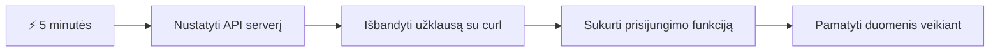
- **1-2 minutės**: Paleiskite savo API serverį (`cd api && npm start`) ir patikrinkite ryšį
- **3 minutė**: Sukurkite paprastą `getAccount()` funkciją naudodami fetch
- **4 minutė**: Susiekite prisijungimo formą su `action="javascript:login()"`
- **5 minutė**: Išbandykite prisijungimą ir stebėkite, kaip paskyros duomenys atsiranda konsolėje

**Greiti testavimo komandų pavyzdžiai**:
```bash
# Patvirtinti, kad API veikia
curl http://localhost:5000/api

# Išbandyti paskyros duomenų gavimą
curl http://localhost:5000/api/accounts/test
```

**Kodėl tai svarbu**: Per 5 minutes pamatysite asinchroninio duomenų gavimo magiją, kuri palaiko kiekvieną šiuolaikinę žiniatinklio programėlę. Tai pagrindas, leidžiantis programėlėms atrodyti jautrioms ir gyvoms.

## 🗺️ Jūsų mokymosi kelionė per duomenimis paremtas žiniatinklio programėles

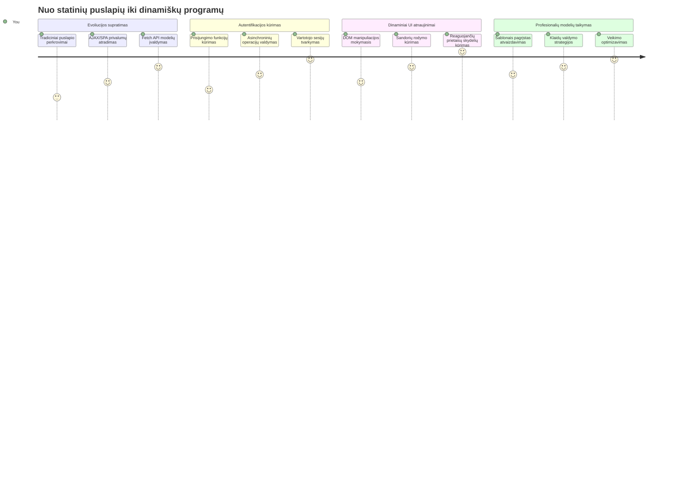
**Jūsų kelionės tikslas**: Pamokos pabaigoje suprasite, kaip šiuolaikinės žiniatinklio programėlės dinamiškai gauna, apdoroja ir rodo duomenis, sukurdamos sklandžią naudotojo patirtį, kurios tikimės iš profesionalių programų.

## Priešpaskaitinė viktorina

[Priešpaskaitinė viktorina](https://ff-quizzes.netlify.app/web/quiz/45)

### Prieš tai reikalinga

Prieš pradėdami žiūrėti duomenų gavimą, įsitikinkite, kad turite šiuos komponentus paruoštus:

- **Ankstesnė pamoka**: Baigti [Prisijungimo ir Registracijos Formą](../2-forms/README.md) – mes kursime šį pagrindą toliau
- **Vietinis serveris**: Įdiekite [Node.js](https://nodejs.org) ir [paleiskite serverio API](../api/README.md), kad būtų tiekiami paskyros duomenys
- **API ryšys**: Patikrinkite savo serverio ryšį su šia komanda:

```bash
curl http://localhost:5000/api
# Tikėtinas atsakymas: "Bank API v1.0.0"
```

Šis greitas testas užtikrina, kad visi komponentai bendrauja teisingai:
- Patikrina, ar Node.js veikia tinkamai jūsų sistemoje
- Patvirtina, kad jūsų API serveris yra aktyvus ir atsako
- Patikrina, ar jūsų programėlė gali pasiekti serverį (kaip radijo ryšio patikrinimas prieš misiją)

## 🧠 Duomenų valdymo ekosistemos apžvalga

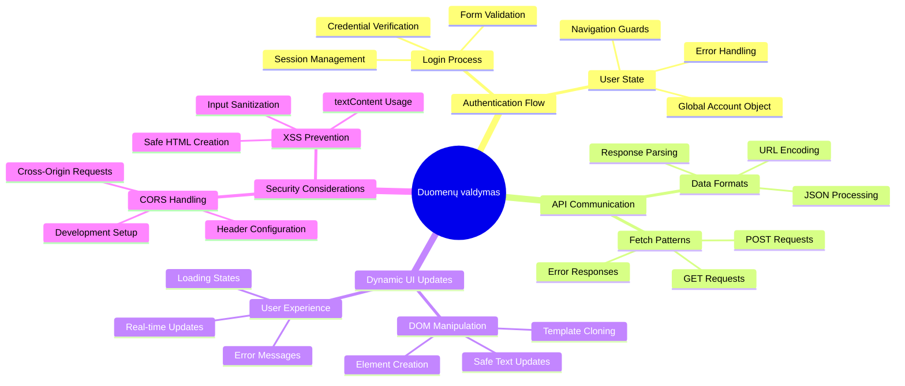
**Pagrindinė taisyklė**: Šiuolaikinės žiniatinklio programėlės yra duomenų koordinavimo sistemos – jos suderina naudotojo sąsajas, serverio API ir naršyklės saugumo modelius, kad sukurtų sklandžią, reaguojančią patirtį.

---

## Duomenų gavimo supratimas šiuolaikinėse žiniatinklio programėlėse

Būdas, kaip žiniatinklio programėlės tvarko duomenis, per pastaruosius du dešimtmečius dramatiškai pasikeitė. Supratimas apie šią evoliuciją padės jums įvertinti, kodėl tokios šiuolaikinės technikos kaip AJAX ir Fetch API yra tokios galingos ir kodėl jos tapo būtinos įrankiams žiniatinklio kūrėjams.

Pažiūrėkime, kaip tradiciniai tinklalapiai veikė palyginti su dinamiškomis, reaguojančiomis programėlėmis, kurias kuriame šiandien.

### Tradicinės daugiasvetės programėlės (MPA)

Pirmosiomis žiniatinklio dienomis kiekvienas paspaudimas buvo kaip kanalų keitimas senajame televizoriuje – ekranas tuštėdavo, o tada lėtai rodydavo naują turinį. Tai buvo ankstyvų žiniatinklio programėlių realybė, kai kiekviena sąveika reikšdavo visos puslapio perkūrimą nuo nulio.

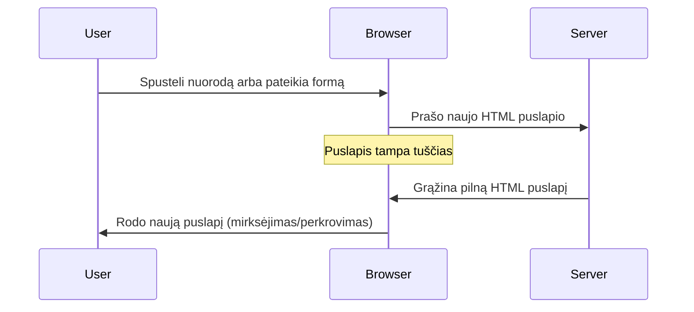
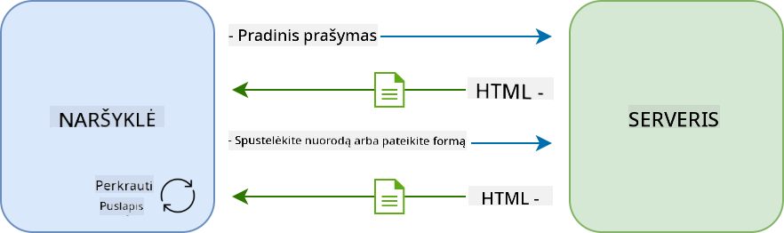

**Kodėl toks metodas atrodė nepatogus:**
- Kiekvienas paspaudimas reiškė viso puslapio perkūrimą nuo nulio
- Vartotojai pertraukė savo mintis dėl erziančių puslapio užsidegimų (mirksnių)
- Jūsų interneto ryšys dirbo permušdamas tą patį antraštės ir poraštės turinį vėl ir vėl
- Programėlės jautėsi labiau kaip naršymas per popierinių bylų spintą nei naudojimas programinės įrangos

### Šiuolaikinės vieno puslapio programėlės (SPA)

AJAX (asinchroninis JavaScript ir XML) visiškai pakeitė šį požiūrį. Kaip Tarptautinės kosmoso stoties modulinis dizainas, kai astronautai gali pakeisti atskirus komponentus neperrengiant visos struktūros, AJAX leidžia atnaujinti konkrečias tinklalapio dalis neperkraunant visko. Nors pavadinime minimas XML, šiandien daugiausia naudojame JSON, bet pagrindinis principas išlieka: atnaujinti tik tai, kas tikrai pasikeitė.

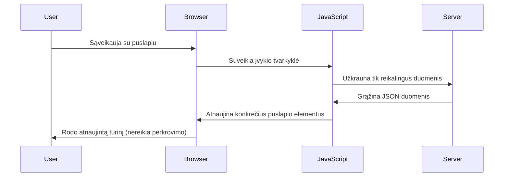
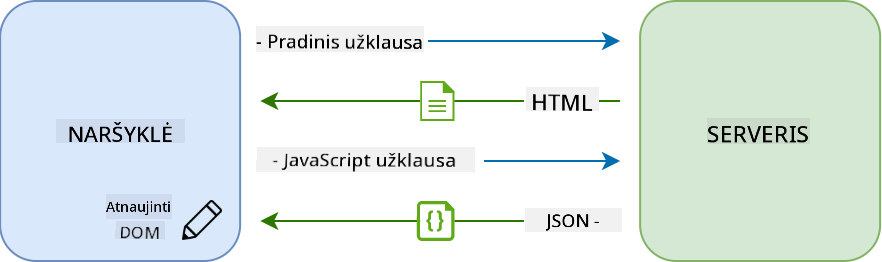

**Kodėl SPA atrodo daug geriau:**
- Atnaujinamos tik iš tikrųjų pasikeitusios dalys (protinga, tiesa?)
- Nebėra staigių pertrūkių – vartotojai lieka savo veikloje
- Mažiau duomenų keliauja per tinklą, todėl greičiau įsikrauna
- Viskas atrodo greita ir jautri, kaip programėlės jūsų telefone

### Evoliucija į šiuolaikinį Fetch API

Šiuolaikinės naršyklės teikia [`Fetch` API](https://developer.mozilla.org/docs/Web/API/Fetch_API), kuris pakeičia senąjį [`XMLHttpRequest`](https://developer.mozilla.org/docs/Web/API/XMLHttpRequest/Using_XMLHttpRequest). Kaip skirtumas tarp telegrapho ir el. pašto naudojimo, Fetch API naudoja pažadus (promises) sklandesniam asinchroniniam kodui ir natūraliai dirba su JSON.

| Funkcija | XMLHttpRequest | Fetch API |
|---------|----------------|----------|
| **Sintaksė** | Sudėtingos atgalinio kvietimo funkcijos | Švari, su pažadais |
| **JSON tvarkymas** | Reikia rankinio analizavimo | Įmontuotas `.json()` metodas |
| **Klaidų tvarkymas** | Ribota klaidų informacija | Išsami klaidų informacija |
| **Šiuolaikinė palaikymas** | Suderinamumas su senomis naršyklėmis | ES6+ pažadai ir async/await |

> 💡 **Naršyklių suderinamumas**: Gera žinia – Fetch API veikia visose šiuolaikinėse naršyklėse! Jei domina specifinės versijos, [caniuse.com](https://caniuse.com/fetch) pateikia pilną suderinamumo informaciją.
> 
**Apibendrinant:**
- Veikia puikiai Chrome, Firefox, Safari ir Edge (iš esmės visur, kur yra jūsų vartotojai)
- Tik Internet Explorer reikia papildomos pagalbos (ir tiesą sakant, jau laikas atsisveikinti su IE)
- Puikiai paruošia jus elegantiškiems async/await modeliams, kuriuos naudosime vėliau

### Vartotojo prisijungimo ir duomenų gavimo įgyvendinimas

Dabar įgyvendinkime prisijungimo sistemą, kuri pavers jūsų bankinę programėlę iš statiško vaizdo į funkcionalią aplikaciją. Kaip ir saugumo patikros protokolai karinėje įrangoje, mes patikrinsime vartotojo kredencialus ir suteiksime prieigą prie jų specifinių duomenų.

Kursime tai palaipsniui, pradedant nuo bazinės autentifikacijos ir vėliau pridėdami duomenų gavimo galimybes.

#### 1 žingsnis: Sukurkite Prisijungimo Funkcijos Pagrindą

Atidarykite savo `app.js` failą ir pridėkite naują `login` funkciją. Ji tvarkys vartotojo autentifikacijos procesą:

```javascript
async function login() {
  const loginForm = document.getElementById('loginForm');
  const user = loginForm.user.value;
}
```

**Suskaidykime tai:**
- Tas `async` žodis? Jis sako JavaScript „ei, ši funkcija gali laukti tam tikrų dalykų“
- Mes paimame formą iš puslapio (nieko sudėtingo, tiesiog randame pagal ID)
- Tuomet ištraukiame tai, ką vartotojas įrašė kaip savo vartotojo vardą
- Štai įdomi gudrybė: galite pasiekti bet kurį formos lauką pagal jo `name` atributą – nereikia papildomai naudoti getElementById!

> 💡 **Formos pasiekiamumo modelis**: Kiekvieną formos kontrolę galima pasiekti pagal jos vardą (nustatytą HTML `name` atributu) kaip formos elemento savybę. Tai suteikia švarų ir suprantamą būdą gauti formos duomenis.

#### 2 žingsnis: Sukurkite Paskyros Duomenų Gavimo Funkciją

Toliau sukursime specialią funkciją, kuri gaus paskyros duomenis iš serverio. Tai atitinka tą patį modelį kaip jūsų registracijos funkcija, bet orientuota į duomenų gavimą:

```javascript
async function getAccount(user) {
  try {
    const response = await fetch('//localhost:5000/api/accounts/' + encodeURIComponent(user));
    return await response.json();
  } catch (error) {
    return { error: error.message || 'Unknown error' };
  }
}
```

**Šis kodas atlieka:**
- **Naudoja** modernų `fetch` API asinchroniškai gauti duomenis
- **Sudaro** GET užklausos URL su vartotojo vardu kaip parametru
- **Taiko** `encodeURIComponent()` specialių simbolių saugumui URL
- **Paverčia** atsakymą į JSON formatą lengvesniam duomenų tvarkymui
- **Tvarko** klaidas mandagiai, gražindamas klaidos objektą, kad negestų programa

> ⚠️ **Saugumo pastaba**: Funkcija `encodeURIComponent()` apsaugo URL nuo specialių simbolių klaidingo interpretavimo. Kaip ir jūrų ryšių kodavimo sistemos, ji užtikrina, kad jūsų žinutė atkeliaus tiksliai tokia, kokia turi būti, apsaugant nuo „#“ ar „&“ simbolių klaidų.
> 
**Kodėl tai svarbu:**
- Užkerta kelią specialių simbolių įtakai URL struktūrai
- Apsaugo nuo URL manipuliacijos atakų
- Užtikrina, kad serveris gautų numatytus duomenis
- Atitinka saugaus kodo rašymo praktiką

#### HTTP GET Užklausų Supratimas

Štai kas gali nustebinti: kai naudojate `fetch` be papildomų nustatymų, jis automatiškai sukuria [`GET`](https://developer.mozilla.org/docs/Web/HTTP/Methods/GET) užklausą. Tai puikiai tinka tam, ką darome – klausiame serverio „ei, ar galiu pamatyti šio vartotojo paskyros duomenis?“

Įsivaizduokite GET užklausas kaip mandagų prašymą pasiskolinti knygą bibliotekoje – jūs prašote pamatyti tai, kas jau yra. POST užklausos (kurias panaudojome registracijoje) yra labiau kaip pateikti naują knygą, kad ji būtų įtraukta į kolekciją.

| GET Užklausa | POST Užklausa |
|-------------|---------------|
| **Paskirtis** | Gauti esamus duomenis | Siųsti naujus duomenis serveriui |
| **Parametrai** | URL kelio/užklausos eilutėje | Užklausos kūne |
| **Kešavimas** | Gali būti naršyklės kešuojama | Paprastai nekešuojama |
| **Saugumas** | Matomas URL/žurnaluose | Paslėptas užklausos kūne |

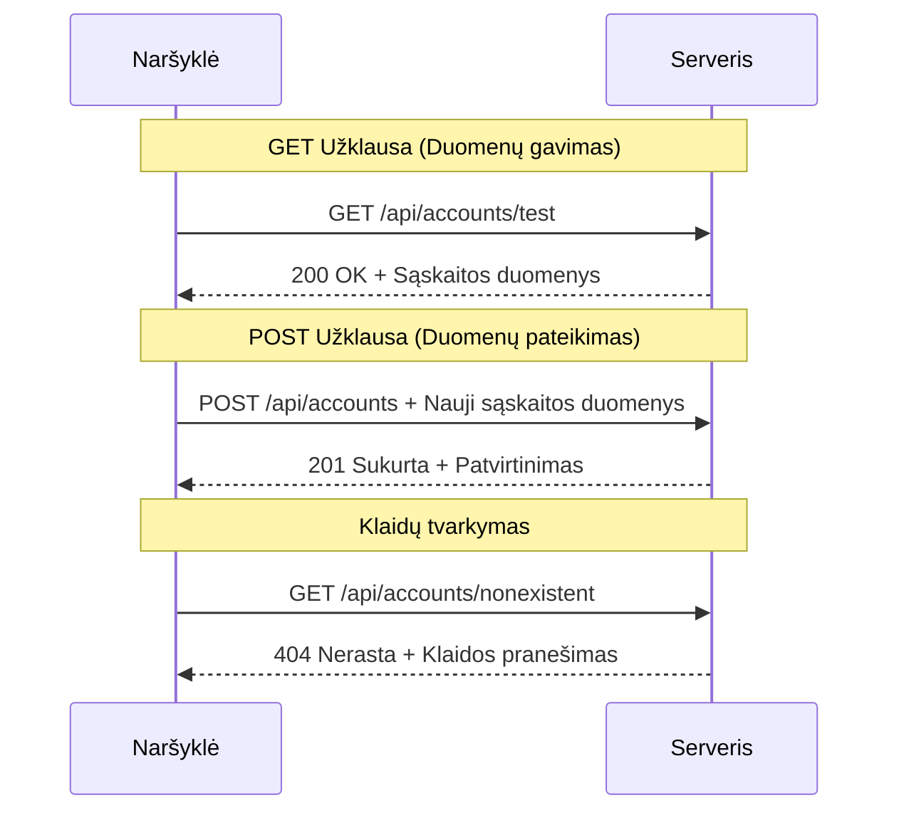
#### 3 žingsnis: Sujunkite viską

Dabar smagiausia dalis – susiekite paskyros gavimo funkciją su prisijungimo procesu. Čia viskas dera:

```javascript
async function login() {
  const loginForm = document.getElementById('loginForm');
  const user = loginForm.user.value;
  const data = await getAccount(user);

  if (data.error) {
    return console.log('loginError', data.error);
  }

  account = data;
  navigate('/dashboard');
}
```

Ši funkcija turi aiškią seką:
- Išformuoja vartotojo vardą iš formos lauko
- Užklausia paskyros duomenų iš serverio
- Tvarko visas klaidas, kylančias procese
- Saugiai saugo paskyros duomenis ir perveda į pagrindinį puslapį, jei viskas gerai

> 🎯 **Async/Await modelis**: Kadangi `getAccount` yra asinchroninė funkcija, naudojame `await`, kad kodo vykdymas palauktų serverio atsakymo. Tai apsaugo nuo kodo veikimo su neapibrėžtais duomenimis.

#### 4 žingsnis: Sukurkite laikymui vietą savo duomenims

Jūsų programėlė turi turėti vietą, kur atsimins paskyros informaciją po jos gavimo. Galvokite apie tai kaip trumpalaikę programėlės atmintį – vietą, kur saugomi dabartinio vartotojo duomenys patogiai. Pridėkite šią eilutę savo `app.js` failo pradžioje:

```javascript
// Čia saugomi dabartinio vartotojo paskyros duomenys
let account = null;
```

**Kodėl tai reikalinga:**
- Leidžia pasiekti paskyros duomenis iš bet kur programėlėje
- Pradinis `null` reiškia „dar niekas neprisijungė“
- Atnaujinama sėkmingo prisijungimo ar registracijos metu
- Veikia kaip vienintelis tiesos šaltinis – jokio nesusipratimo, kas prisijungęs

#### 5 žingsnis: Susiekite formą

Dabar susiekime jūsų naują prisijungimo funkciją su HTML forma. Atnaujinkite savo formos tagą taip:

```html
<form id="loginForm" action="javascript:login()">
  <!-- Your existing form inputs -->
</form>
```

**Ką daro šis mažas pakeitimas:**
- Sustabdo formos numatytąjį elgesį „perkrauti visą puslapį“
- Iškviečia jūsų pasirinktą JavaScript funkciją
- Užtikrina sklandų ir vieno puslapio aplikacijos patyrimą
- Suteikia jums pilną kontrolę, kas vyksta paspaudus „Prisijungti“

#### 6 žingsnis: Pagerinkite savo registracijos funkciją

Dėl nuoseklumo, atnaujinkite savo `register` funkciją taip, kad ji taip pat saugotų paskyros duomenis ir pereitų į pagrindinį puslapį:

```javascript
// Šias eilutes pridėkite savo registracijos funkcijos pabaigoje
account = result;
navigate('/dashboard');
```

**Šis patobulinimas suteikia:**
- **Sklandų** perėjimą nuo registracijos prie pagrindinio puslapio
- **Nuoseklią** naudotojo patirtį tiek prisijungimo, tiek registracijos procesuose
- **Momentinę** prieigą prie paskyros duomenų po sėkmingos registracijos

#### Testavimo instrukcija

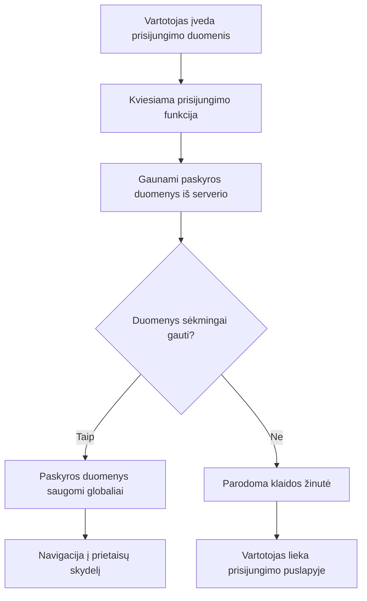
**Laikas išbandyti:**
1. Sukurkite naują paskyrą, kad įsitikintumėte, jog viskas veikia
2. Pabandykite prisijungti su tais pačiais duomenimis
3. Pasižiūrėkite naršyklės konsolę (F12), jei kažkas atrodo negerai
4. Įsitikinkite, kad po sėkmingo prisijungimo atsiduriate pagrindiniame puslapyje

Jei kažkas neveikia, nepanikuokite! Dauguma problemų – paprasti klaidų taisymai, kaip rašybos klaidos ar API serverio nepaleidimas.

#### Trumpas paaiškinimas apie Kryžmines Origin Magic

Galbūt klaustumėte: „Kaip mano žiniatinklio programėlė bendrauja su šiuo API serveriu, jei jie veikia skirtinguose portuose?“ Puikus klausimas! Tai yra tema, su kuria susiduria kiekvienas žiniatinklio kūrėjas.

> 🔒 **Kryžminis origin saugumas**: Naršyklės taiko „vienodo kilmės politiką“, kad užkirstų kelią neautorizuotam bendravimui tarp skirtingų domenų. Kaip punktas Pentagone, jos tikrina, ar bendravimas yra leidžiamas prieš perduodant duomenis.
> 
**Mūsų konfigūracija:**
- Jūsų žiniatinklio programėlė veikia `localhost:3000` (kūrimo serveris)
- Jūsų API serveris veikia `localhost:5000` (backend serveris)
- API serveris pridėjo [CORS antraštes](https://developer.mozilla.org/docs/Web/HTTP/CORS), kurios aiškiai leidžia bendravimą iš jūsų žiniatinklio programėlės

Ši konfigūracija atspindi realius vystymo scenarijus, kai frontend ir backend programėlės dažnai veikia skirtinguose serveriuose.

> 📚 **Sužinokite daugiau**: Gilinkitės į API ir duomenų gavimą su šiuo išsamų [Microsoft Learn moduliu apie API](https://docs.microsoft.com/learn/modules/use-apis-discover-museum-art/?WT.mc_id=academic-77807-sagibbon).

## Duomenų pateikimas HTML kode

Dabar padarysime gautus duomenis matomus vartotojams per DOM manipuliavimą. Kaip fotografijų plėtimasis tamsiame kambaryje, mes paimsime nematomus duomenis ir paversime juos į tai, ką vartotojai gali matyti ir su kuo bendrauti.
DOM manipuliavimas yra technika, kuri paverčia statinius tinklalapius į dinamiškas programas, kurios atnaujina savo turinį pagal vartotojo sąveikas ir serverio atsakymus.

### Tinkamo įrankio pasirinkimas darbui

Kai kalbama apie HTML atnaujinimą naudojant JavaScript, turite keletą pasirinkimų. Galvokite apie juos kaip apie skirtingus įrankius įrankių dėžėje – kiekvienas puikiai tinka tam tikriems darbams:

| Metodas | Kam jis puikus | Kada jį naudoti | Saugumo lygis |
|--------|-----------------|----------------|--------------|
| `textContent` | Vartotojo duomenų saugus rodymas | Bet kada, kai rodote tekstą | ✅ Nuožmus patikimumas |
| `createElement()` + `append()` | Sudėtingų maketų kūrimas | Naujiems skirsniams / sąrašams kurti | ✅ Atsparus klaidoms |
| `innerHTML` | HTML turinio nustatymas | ⚠️ Stenkitės jo vengti | ❌ Rizikinga praktika |

#### Saugus būdas rodyti tekstą: textContent

[`textContent`](https://developer.mozilla.org/docs/Web/API/Node/textContent) savybė yra jūsų geriausias draugas rodant vartotojo duomenis. Tai kaip apsauginis sargas jūsų tinklalapiui – niekas pavojingo neprasprūsta:

```javascript
// Saugus, patikimas būdas atnaujinti tekstą
const balanceElement = document.getElementById('balance');
balanceElement.textContent = account.balance;
```

**textContent privalumai:**
- Traktuoja viską kaip paprastą tekstą (neleidžia vykdyti skriptų)
- Automatiškai išvalo esamą turinį
- Efektyvus paprastiems teksto atnaujinimams
- Suteikia integruotą apsaugą nuo žalingo turinio

#### Dinaminių HTML elementų kūrimas

Sudėtingesniam turiniui derinkite [`document.createElement()`](https://developer.mozilla.org/docs/Web/API/Document/createElement) su [`append()`](https://developer.mozilla.org/docs/Web/API/ParentNode/append) metodu:

```javascript
// Saugus būdas kurti naujus elementus
const transactionItem = document.createElement('div');
transactionItem.className = 'transaction-item';
transactionItem.textContent = `${transaction.date}: ${transaction.description}`;
container.append(transactionItem);
```

**Šio metodo supratimas:**
- **Programiškai** sukuria naujus DOM elementus
- **Pilnai valdo** elementų atributus ir turinį
- **Leidžia** sudėtingas, įdėtas elementų struktūras
- **Išlaiko** saugumą atskirdamas struktūrą nuo turinio

> ⚠️ **Saugumo pastaba**: Nors [`innerHTML`](https://developer.mozilla.org/docs/Web/API/Element/innerHTML) dažnai minimas pamokose, jis gali vykdyti įterptus skriptus. Kaip CERN saugumo protokolai neleidžia neautorizuotai vykdyti kodo, taip `textContent` ir `createElement` yra saugesni sprendimai.
> 
**innerHTML rizikos:**
- Vykdo bet kokius `<script>` žymenis vartotojo duomenyse
- Jautrus kodo įsilaužimo atakoms
- Sukuria galimas saugumo spragas
- Naudojami saugesni alternatyvūs metodai suteikia tokį pat funkcionalumą

### Klaidas padaryti draugiškas vartotojams

Šiuo metu prisijungimo klaidos rodomos tik naršyklės konsolei, kuri yra nematoma vartotojams. Kaip skirtumas tarp piloto vidinės diagnostikos ir keleivių informacinės sistemos – svarbią informaciją reikia perduoti tinkamu kanalu.

Matomų klaidų pranešimų įgyvendinimas suteikia vartotojams greitą atsiliepimą dėl klaidų ir nurodymus, kaip elgtis.

#### 1 žingsnis: pridėti klaidų pranešimų vietą

Pirmiausia, suteikime klaidų pranešimams vietą jūsų HTML. Pridėkite tai tiesiai prieš prisijungimo mygtuką, kad vartotojai matytų natūraliai:

```html
<!-- This is where error messages will appear -->
<div id="loginError" role="alert"></div>
<button>Login</button>
```

**Ką čia darome:**
- Kuriame tuščią konteinerį, kuris lieka nematomas, kol neprireikia
- Jis yra ten, kur vartotojai žvilgteli po mygtuko "Prisijungti" paspaudimo
- Tas `role="alert"` puikus priedas ekrano skaitytuvams – praneša, kad tai svarbu!
- Unikalus `id` leidžia JavaScript lengvai jį surasti

#### 2 žingsnis: sukurti pagalbinę funkciją

Padarykime mažą naudingą funkciją, kuri atnaujins bet kurio elemento tekstą. Tai vienas iš tų „parašyk kartą, naudok visur“ funkcijų, kuri sutaupys jums laiko:

```javascript
function updateElement(id, text) {
  const element = document.getElementById(id);
  element.textContent = text;
}
```

**Funkcijos privalumai:**
- Paprasta sąsaja, kurios pakanka elementui ir tekstui identifikuoti
- Saugiai randa ir atnaujina DOM elementus
- Pakartotinai naudojamas modelis, mažinantis kodo pasikartojimą
- Išlaiko nuoseklų atnaujinimo elgesį programoje

#### 3 žingsnis: rodyti klaidas ten, kur vartotojai jas mato

Dabar pakeiskime tą paslėptą konsolės pranešimą į kažką, ką vartotojai mato. Atnaujinkite savo prisijungimo funkciją:

```javascript
// Vietoj to, kad tik būtų rašoma į konsolę, parodykite vartotojui, kas negerai
if (data.error) {
  return updateElement('loginError', data.error);
}
```

**Šis mažas pakeitimas daro didelį skirtumą:**
- Klaidos rodomos tiesiai ten, kur žiūri vartotojai
- Nebėra paslaptingų tylėtų gedimų
- Vartotojai gauna greitą, veiksmingą atsiliepimą
- Jūsų programėlė pradeda jaustis profesionaliai ir apgalvotai

Dabar, kai testuosite neteisingu paskyros duomenimis, matysite naudingą klaidos pranešimą tiesiog puslapyje!


#### 4 žingsnis: įtraukiantis prieinamumas

Štai įdomu apie tą `role="alert"`, kurį pridėjome – jis nėra tik dekoracija! Šis atributas sukuria vadinamąją [Live Region](https://developer.mozilla.org/docs/Web/Accessibility/ARIA/ARIA_Live_Regions), kuri iškart praneša ekrano skaitytuvams apie pasikeitimus:

```html
<div id="loginError" role="alert"></div>
```

**Kodėl tai svarbu:**
- Ekrano skaitytuvų vartotojai išgirsta klaidos pranešimą akimirksniu
- Visi gauna tą pačią svarbią informaciją, nepriklausomai nuo navigacijos būdo
- Tai paprastas būdas padaryti programą prieinamą daugiau žmonių
- Parodo, kad rūpinatės įtraukiama patirtimi

Tokie smulkūs elementai atskiria gerus programuotojus nuo puikių!

### 🎯 Pedagoginė pertrauka: autentifikacijos modeliai

**Sustabkite ir pagalvokite**: Jūs ką tik įgyvendinote pilną autentifikacijos srautą. Tai – pamatinis modelis interneto programavimo srityje.

**Greitas savęs įvertinimas:**
- Ar galite paaiškinti, kodėl naudojame async/await API užklausoms?
- Kas nutiktų, jei pamirštume `encodeURIComponent()` funkciją?
- Kaip mūsų klaidų valdymas pagerina vartotojo patirtį?

**Realus ryšys**: Modeliai, kuriuos mokotės čia (asinchroninis duomenų gavimas, klaidų valdymas, vartotojo atsiliepimas) naudojami kiekvienoje didelėje interneto programoje nuo socialinių tinklų iki el. prekybos svetainių. Jūs įgydote gamybinio lygio įgūdžių!

**Iššūkio klausimas**: Kaip galėtumėte modifikuoti šią autentifikacijos sistemą, kad palaikytumėte kelias vartotojų roles (klientas, administratorius, kasininkas)? Pagalvokite apie duomenų struktūrą ir vartotojo sąsajos pakeitimus.

#### 5 žingsnis: taikyti tą patį modelį registracijai

Dėl nuoseklumo įgyvendinkite tokį pat klaidų valdymą registracijos formoje:

1. **Pridėkite** klaidų rodymo elementą į registracijos HTML:
```html
<div id="registerError" role="alert"></div>
```

2. **Atnaujinkite** registracijos funkciją, kad naudotų tą patį klaidų rodymo modelį:
```javascript
if (data.error) {
  return updateElement('registerError', data.error);
}
```

**Nuoseklumo klaidų valdymo privalumai:**
- **Užtikrina** vienodą vartotojo patirtį visuose formose
- **Mažina** kognityvinę apkrovą naudojant pažįstamus modelius
- **Paprastina** priežiūrą su pakartotinai naudojamu kodu
- **Garantija** kad prieinamumo standartai bus laikomasi visoje programoje

## Sukurkite savo dinaminę norsę

Dabar paversime jūsų statinę norsę į dinamišką sąsają, kuri rodo realius sąskaitos duomenis. Kaip skirtumas tarp atspausdinto skrydžio tvarkaraščio ir gyvų išvykimo lentų oro uostuose, mes pereiname nuo statinės informacijos prie realiu laiku atnaujinamo rodymo.

Naudojant DOM manipuliavimo technikas, kurias išmokote, sukursime norsę, kuri automatiškai atnaujinsis su dabartine sąskaitos informacija.

### Susipažinkite su savo duomenimis

Prieš pradėdami kurti, pažvelkime, kokius duomenis jūsų serveris grąžina. Kai kas nors sėkmingai prisijungia, štai kokia informacija pasiekiama darbui:

```json
{
  "user": "test",
  "currency": "$",
  "description": "Test account",
  "balance": 75,
  "transactions": [
    { "id": "1", "date": "2020-10-01", "object": "Pocket money", "amount": 50 },
    { "id": "2", "date": "2020-10-03", "object": "Book", "amount": -10 },
    { "id": "3", "date": "2020-10-04", "object": "Sandwich", "amount": -5 }
  ]
}
```

**Ši duomenų struktūra suteikia:**
- **`user`**: Puikiai tinka patirties personalizavimui („Sveiki sugrįžę, Sarah!“)
- **`currency`**: Užtikrina, kad rodomos pinigų sumos būtų teisingos
- **`description`**: Draugiškas sąskaitos pavadinimas
- **`balance`**: Svarbiausias dabartinis balansas
- **`transactions`**: Pilna sandorių istorija su visomis detalėmis

Viskas, ko reikia profesionaliai atrodančios bankininkystės norsės kūrimui!

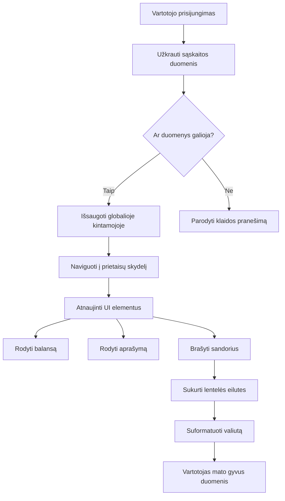
> 💡 **Pro patarimas**: Norite iš karto pamatyti norsę veikiant? Prisijunkite naudodami vartotojo vardą `test` – jis turi iš anksto užpildytus pavyzdinius duomenis, todėl matysite viską veikiant be būtinybės kurti sandorius.
> 
**Kodėl testinė paskyra patogi:**
- Jau pakeista realistiškais pavyzdiniais duomenimis
- Puikiai tinka matyti, kaip rodomi sandoriai
- Puikus testuoti norsės funkcijas
- Taupo laiką, nereikia ranka kurti pavyzdinių duomenų

### Sukurkite norsės rodymo elementus

Kurkime norsės sąsają žingsnis po žingsnio, pradėdami nuo sąskaitos santraukos informacijos, tada pereidami prie sudėtingesnių funkcijų, kaip sandorių sąrašai.

#### 1 žingsnis: atnaujinkite savo HTML struktūrą

Pirmiausia pakeiskite statinę „Balansas“ dalį į dinaminius vietos laikiklius, kuriuos galės pildyti jūsų JavaScript:

```html
<section>
  Balance: <span id="balance"></span><span id="currency"></span>
</section>
```

Tada pridėkite skyrių sąskaitos aprašymui. Kadangi tai veikia kaip pagrindinis titulinis norsės turiniui, naudokite semantinį HTML:

```html
<h2 id="description"></h2>
```

**HTML struktūros supratimas:**
- **Naudoja** atskirus `<span>` elementus balansui ir valiutai individualiam valdymui
- **Pritaiko** unikalius ID kiekvienam elementui JavaScript tikslams
- **Laikosi** semantinio HTML principų naudojant `<h2>` sąskaitos aprašymui
- **Sukuria** loginę hierarchiją ekrano skaitytuvams ir SEO

> ✅ **Prieinamumo įžvalga**: Sąskaitos aprašymas veikia kaip įrašo norsės turinio pavadinimas, todėl pažymėtas semantiškai kaip antraštė. Sužinokite daugiau apie tai, kaip [antraščių struktūra](https://www.nomensa.com/blog/2017/how-structure-headings-web-accessibility) veikia prieinamumą. Ar galite identifikuoti kitus puslapio elementus, kuriems pagelbėtų antraščių žymėjimas?

#### 2 žingsnis: sukurkite norsės atnaujinimo funkciją

Dabar sukurkite funkciją, kuri užpildo norsę tikrais sąskaitos duomenimis:

```javascript
function updateDashboard() {
  if (!account) {
    return navigate('/login');
  }

  updateElement('description', account.description);
  updateElement('balance', account.balance.toFixed(2));
  updateElement('currency', account.currency);
}
```

**Žingsnis po žingsnio, ką ši funkcija daro:**
- **Tikrina**, ar sąskaitos duomenys egzistuoja prieš tęsiant
- **Peradresuoja** neprisijungusius vartotojus atgal į prisijungimo puslapį
- **Atnaujina** sąskaitos aprašymą naudodama pakartotinai panaudojamą `updateElement` funkciją
- **Formatuoja** balansą, kad visada rodytų du dešimtinius skaičius
- **Rodo** tinkamą valiutos simbolį

> 💰 **Pinigų formatavimas**: Tas [`toFixed(2)`](https://developer.mozilla.org/docs/Web/JavaScript/Reference/Global_Objects/Number/toFixed) metodas yra tikras išsigelbėjimas! Jis užtikrina, kad jūsų balansas visada atrodytų kaip tikri pinigai – „75.00“ vietoj tiesiog „75“. Jūsų vartotojai įvertins matyti pažįstamą valiutos formatavimą.

#### 3 žingsnis: užtikrinkite norsės atnaujinimą

Kad norsė automatiškai atsinaujintų su naujausiomis duomenų kopijomis kiekvieną kartą, kai ją lankote, turime prisijungti prie jūsų navigacijos sistemos. Jei atlikote [1 pamokos užduotį](../1-template-route/assignment.md), tai turėtų būti pažįstama. Jei ne, čia jums reikia:

Pridėkite tai prie savo `updateRoute()` funkcijos pabaigos:

```javascript
if (typeof route.init === 'function') {
  route.init();
}
```

Tada atnaujinkite savo maršrutus, kad įtrauktumėte norsės inicializavimą:

```javascript
const routes = {
  '/login': { templateId: 'login' },
  '/dashboard': { templateId: 'dashboard', init: updateDashboard }
};
```

**Šis sumanus sprendimas daro:**
- Tikrina, ar maršrute yra specialaus inicializavimo kodo
- Automatiškai vykdo tą kodą, kai įkeliamas maršrutas
- Užtikrina, kad norsė visada rodytų šviežius duomenis
- Laiko jūsų maršrutų logiką švarią ir organizuotą

#### Testuokite savo norsę

Įgyvendinę pakeitimus, išbandykite norsę:

1. **Prisijunkite** su testine paskyra
2. **Patikrinkite**, ar būsite nukreipti į norsę
3. **Įsitikinkite**, kad sąskaitos aprašymas, balansas ir valiuta rodomi teisingai
4. **Išbandykite atsijungimą ir vėl prisijungimą**, kad įsitikintumėte, jog duomenys atsinaujina

Dabar jūsų norsė turėtų rodyti dinamišką sąskaitos informaciją, kuri atnaujinama pagal prisijungusio vartotojo duomenis!

## Išmanūs sandorių sąrašai su šablonais

Vietoje HTML kūrimo rankomis kiekvienam sandoriui naudosime šablonus, kurie automatiškai generuos nuoseklų formatavimą. Kaip standartizuoti komponentai kosminių laivų gamyboje, šablonai užtikrina, kad kiekviena sandorio eilutė turi vienodą struktūrą ir išvaizdą.

Ši technika efektyviai skalėja nuo kelių sandorių iki tūkstančių, išlaikant nuoseklų veikimą ir pateikimą.

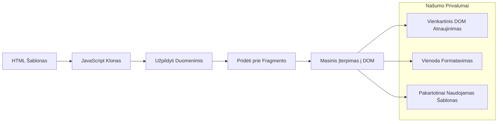
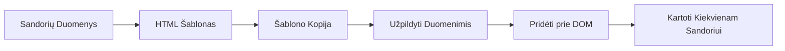
### 1 žingsnis: sukurkite sandorio šabloną

Pirmiausia pridėkite pakartotinai naudojamą sandorio eilutės šabloną į HTML `<body>`:

```html
<template id="transaction">
  <tr>
    <td></td>
    <td></td>
    <td></td>
  </tr>
</template>
```

**HTML šablonų supratimas:**
- **Apibrėžia** vienos lentelės eilutės struktūrą
- **Išlieka** nematomas, kol nėra kopijuojamas ir užpildomas JavaScript
- **Apima** tris langelius: datą, aprašymą ir sumą
- **Tarnauja** kaip pakartotinai naudojamas modelis nuosekliam formatavimui

### 2 žingsnis: paruoškite savo lentelę dinamiškam turiniui

Toliau pridėkite `id` savo lentelės kūnui, kad JavaScript galėtų jį lengvai rasti:

```html
<tbody id="transactions"></tbody>
```

**Ką tai pasiekia:**
- **Sukuria** aiškų taikinį įterpti sandorių eilutes
- **Atskiria** lentelės struktūrą nuo dinamiško turinio
- **Leidžia** lengvai išvalyti ir vėl užpildyti sandorių duomenis

### 3 žingsnis: sukurkite sandorių eilučių gamyklos funkciją

Dabar sukurkite funkciją, kuri paverčia sandorio duomenis HTML elementais:

```javascript
function createTransactionRow(transaction) {
  const template = document.getElementById('transaction');
  const transactionRow = template.content.cloneNode(true);
  const tr = transactionRow.querySelector('tr');
  tr.children[0].textContent = transaction.date;
  tr.children[1].textContent = transaction.object;
  tr.children[2].textContent = transaction.amount.toFixed(2);
  return transactionRow;
}
```

**Ši gamyklos funkcija paeiliui atlieka:**
- **Randa** šablono elementą pagal jo ID
- **Kopijuoja** šablono turinį saugiam apdorojimui
- **Pasirenka** lentelės eilutę kopijuotame turinyje
- **Užpildo** kiekvieną langelį sandorio duomenimis
- **Formatuoja** sumą su tinkamu skaičių po kablelio kiekiu
- **Grąžina** užbaigtą eilutę, pasirengusią įterpimui

### 4 žingsnis: efektyviai sugeneruokite daug sandorių eilučių

Pridėkite šį kodą į savo `updateDashboard()` funkciją, kad parodytumėte visus sandorius:

```javascript
const transactionsRows = document.createDocumentFragment();
for (const transaction of account.transactions) {
  const transactionRow = createTransactionRow(transaction);
  transactionsRows.appendChild(transactionRow);
}
updateElement('transactions', transactionsRows);
```

**Šis efektyvus metodas:**
- **Sukuria** dokumento fragmentą masinėms DOM operacijoms
- **Iteruoja** per visus sąskaitos sandorius
- **Generuoja** eilutę kiekvienam sandoriui naudodama gamyklos funkciją
- **Surenka** visas eilutes į fragmentą prieš įdedant į DOM
- **Atlieka** vieną DOM atnaujinimą vietoj daugybės pavienių įterpimų
> ⚡ **Veikimo optimizavimas**: [`document.createDocumentFragment()`](https://developer.mozilla.org/docs/Web/API/Document/createDocumentFragment) veikia panašiai kaip surinkimo procesas Boeing gamykloje – komponentai paruošiami ne pagrindinėje linijoje, o tada įrengiami kaip pilnas vienetas. Šis grupavimo metodas sumažina DOM pertvarkymų skaičių, atliekant vieną įterpimą vietoje daugybės atskirų veiksmų.

### 5 žingsnis: Patobulinkite atnaujinimo funkciją maišytam turiniui

Jūsų `updateElement()` funkcija šiuo metu tvarko tik tekstinį turinį. Atnaujinkite ją, kad veiktų tiek su tekstu, tiek su DOM mazgais:

```javascript
function updateElement(id, textOrNode) {
  const element = document.getElementById(id);
  element.textContent = ''; // Pašalina visus vaikus
  element.append(textOrNode);
}
```

**Pagrindiniai patobulinimai šiame atnaujinime:**
- **Išvalo** esamą turinį prieš pridedant naują
- **Priima** tiek teksto eilutes, tiek DOM mazgus kaip parametrus
- **Naudoja** [`append()`](https://developer.mozilla.org/docs/Web/API/ParentNode/append) metodą tam, kad būtų lankstesnė
- **Išlaiko** suderinamumą su esamu teksto pagrindu naudojimu

### Išbandykite savo informacijos suvestinę

Atėjo tiesos momentas! Pažiūrėkime, kaip veikia jūsų dinaminė informacijos suvestinė:

1. Prisijunkite naudodami paskyrą `test` (joje yra paruošti pavyzdiniai duomenys)
2. Nueikite į savo informacijos suvestinę
3. Patikrinkite, ar atsiranda pavedimų eilutės su tinkamu formatavimu
4. Įsitikinkite, kad datos, aprašymai ir sumos atrodo gerai

Jei viskas veikia, jūsų informacijos suvestinėje turėtumėte matyti pilnai funkcionuojantį pavedimų sąrašą! 🎉

**Ko pasiekėte:**
- Sukūrėte informacijos suvestinę, pritaikomą bet kokiam duomenų kiekiui
- Sukūrėte pakartotinai naudojamus šablonus vienodam formatavimui
- Įdiegėte efektyvias DOM manipuliavimo technikas
- Sukūrėte funkcionalumą, prilygstantį gamybinių bankinių programų lygmeniui

Jūs sėkmingai paverčiau statinį tinklalapį dinamine žiniatinklio programa.

### 🎯 Pedagoginis įvertinimas: Dinaminio turinio generavimas

**Architektūros supratimas**: Įgyvendinote sudėtingą duomenų į vartotojo sąsają srautą, kuris atitinka modelius, naudojamus tokiuose karkasuose kaip React, Vue ir Angular.

**Išmoktos pagrindinės sąvokos**:
- **Šablonų pagrindu generavimas**: pakartotinai naudojamų vartotojo sąsajos komponentų kūrimas
- **Dokumento fragmentai**: DOM našumo optimizavimas
- **Saugus DOM manipuliavimas**: saugumo spragų prevencija
- **Duomenų transformacija**: serverio duomenų konvertavimas į vartotojo sąsajas

**Pramonės ryšys**: Šios technikos sudaro šiuolaikinių frontend karkasų pagrindą. React virtualus DOM, Vue šablonų sistema ir Angular komponentų architektūra visi remiasi šiomis pagrindinėmis sąvokomis.

**Refleksijos klausimas**: Kaip pratęstumėte šią sistemą realaus laiko atnaujinimams tvarkyti (pavyzdžiui, automatiškai atsirandant naujiems pavedimams)? Apsvarstykite WebSockets ar Server-Sent Events naudojimą.

---

## 📈 Jūsų duomenų valdymo meistriškumo laiko juosta

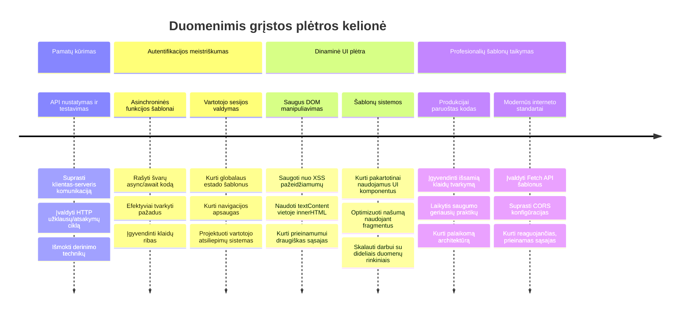
**🎓 Baigimo etapas**: Sėkmingai sukūrėte pilną duomenimis pagrįstą žiniatinklio programą, naudodami šiuolaikinius JavaScript modelius. Šios įgūdžiai tiesiogiai pritaikomi dirbant su karkasais, tokiais kaip React, Vue ar Angular.

**🔄 Kitų lygių galimybės**:
- Pasiruošę išbandyti frontend karkasus, kurie vystosi nuo šių sąvokų
- Pasirengę įgyvendinti realaus laiko funkcijas su WebSockets
- Gali kurti progresyvias žiniatinklio programas su veikimu neprisijungus
- Pagrindas pažangiam būsenos valdymo modelių mokymuisi

## GitHub Copilot agente Iššūkis 🚀

Naudokite Agento režimą, kad įvykdytumėte šį iššūkį:

**Aprašymas:** Pagerinkite bankinę programėlę sukurdami pavedimų paieškos ir filtravimo funkciją, leidžiančią vartotojams rasti konkrečius pavedimus pagal datos intervalą, sumą ar aprašymą.

**Užduotis:** Sukurkite bankinės programėlės paieškos funkcionalumą, kuris apimtų: 1) paieškos formą su įvesties laukais datos intervalui (nuo/iki), minimaliai/maksimaliai sumai ir pavedimų aprašymų raktažodžiams, 2) `filterTransactions()` funkciją, kuri filtruotų account.transactions masyvą pagal paieškos kriterijus, 3) atnaujintą `updateDashboard()` funkciją, kuri rodytų filtruotus rezultatus, ir 4) mygtuką „Išvalyti filtrus“ rodiniui atstatyti. Naudokite šiuolaikinius JavaScript masyvų metodus, pvz., `filter()`, ir tvarkykite tuščius paieškos kriterijų atvejus.

Daugiau apie [agentų režimą](https://code.visualstudio.com/blogs/2025/02/24/introducing-copilot-agent-mode) skaitykite čia.

## 🚀 Iššūkis

Pasiruošę pakelti savo bankinę programėlę į kitą lygmenį? Padarykime ją tokią, kokią tikrai norėtumėte naudoti. Štai keletas idėjų kūrybiškumui pažadinti:

**Padarykite ją gražią**: Pridėkite CSS stilių, kad funkcinę informacijos suvestinę paverstumėte vizualiai patrauklia. Mąstykite apie švarias linijas, gerus tarpus ir galbūt net subtilias animacijas.

**Padarykite ją reaguojančią**: Pabandykite naudoti [media queries](https://developer.mozilla.org/docs/Web/CSS/Media_Queries) tam, kad sukurtumėte [reaguojantį dizainą](https://developer.mozilla.org/docs/Web/Progressive_web_apps/Responsive/responsive_design_building_blocks), kuris puikiai veiktų telefonuose, planšetėse ir kompiuteriuose. Jūsų vartotojai jums padėkos!

**Pridėkite šarmo**: Apsvarstykite galimybę naudoti spalvų kodavimą pavedimams (žalia – pajamos, raudona – išlaidos), pridėti ikonėlių arba sukurti užvedimo efektus, kurie padarys sąsają interaktyvesnę.

Štai kaip galėtų atrodyti išbaigta suvestinė:

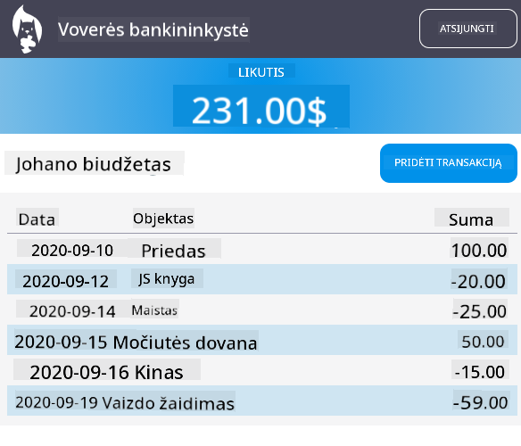

Nereikia tiksliai kopijuoti – naudokite tai kaip įkvėpimą ir pritaikykite sau!

## Po paskaitos testas

[Po paskaitos testas](https://ff-quizzes.netlify.app/web/quiz/46)

## Užduotis

[Refaktorizuokite ir komentuokite savo kodą](assignment.md)

---

<!-- CO-OP TRANSLATOR DISCLAIMER START -->
**Atsakomybės ribojimas**:
Šis dokumentas buvo išverstas naudojant dirbtinio intelekto vertimo paslaugą [Co-op Translator](https://github.com/Azure/co-op-translator). Nors siekiame tikslumo, prašome atkreipti dėmesį, kad automatiniai vertimai gali turėti klaidų arba netikslumų. Originalus dokumentas jo gimtąja kalba laikomas autoritetingu šaltiniu. Svarbiai informacijai rekomenduojamas profesionalus žmogiškas vertimas. Mes neatsakome už jokius nesusipratimus ar neteisingus aiškinimus, kylančius dėl šio vertimo naudojimo.
<!-- CO-OP TRANSLATOR DISCLAIMER END -->