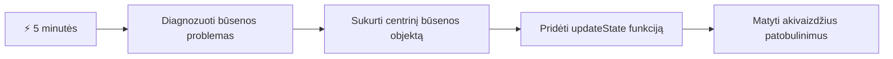
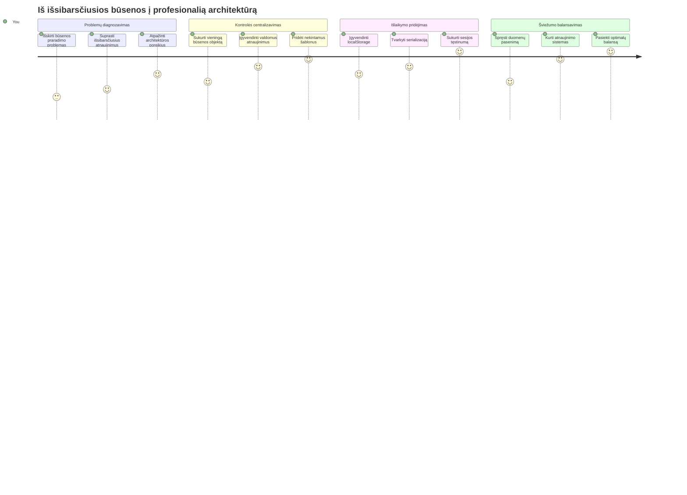
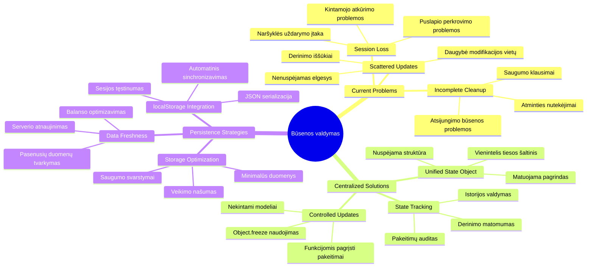
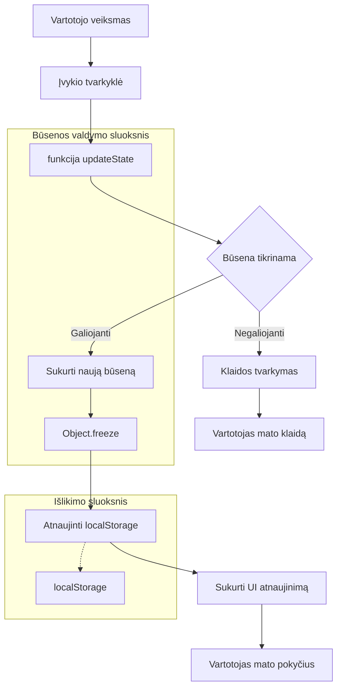
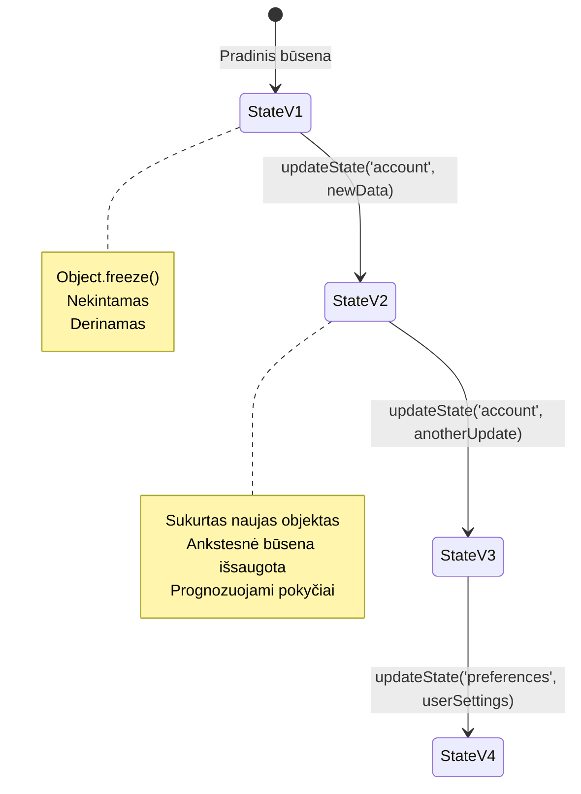
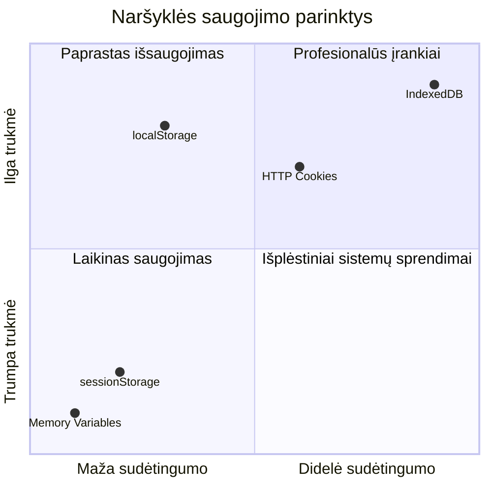
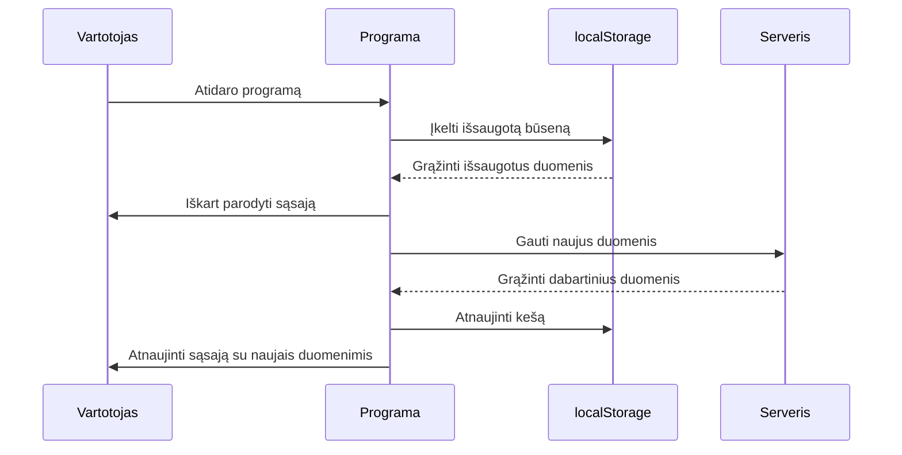
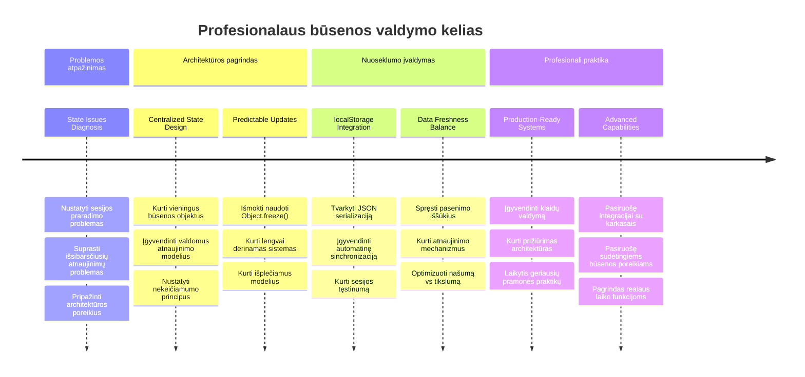

<!--
CO_OP_TRANSLATOR_METADATA:
{
  "original_hash": "b807b09df716dc48a2b750835bf8e933",
  "translation_date": "2026-01-07T11:58:19+00:00",
  "source_file": "7-bank-project/4-state-management/README.md",
  "language_code": "lt"
}
-->
# Sukurkite Bankinę Programėlę 4 Dalį: Būsenos Valdymo Koncepcijos

## ⚡ Ką Galite Padaryti Per Kitą 5 Minučių

**Greitas Pradžios Kelias Užsiėmusiems Kūrėjams**


- **1 Minutė**: Išbandykite dabartinę būsenos problemą - prisijunkite, atnaujinkite puslapį, stebėkite atsijungimą
- **2 Minutė**: Pakeiskite `let account = null` į `let state = { account: null }`
- **3 Minutė**: Sukurkite paprastą `updateState()` funkciją kontroliuojamiems atnaujinimams
- **4 Minutė**: Atnaujinkite vieną funkciją, kad naudotų naują modelį
- **5 Minutė**: Išbandykite pagerintą prognozuojamumą ir klaidų šalinimo galimybes

**Greitas Diagnostinis Testas**:
```javascript
// Prieš: Išblaškytas būsena
let account = null; // Prarasta atnaujinus!

// Po: Centralizuota būsena
let state = Object.freeze({ account: null }); // Kontroliuojama ir sekama!
```

**Kodėl tai svarbu**: Per 5 minutes patirsite transformaciją nuo chaotiško būsenos valdymo iki prognozuojamų, gerai atsekamų modelių. Tai yra pagrindas, kuris leidžia išlaikyti sudėtingas programas.

## 🗺️ Jūsų Mokymosi Kelionė Per Būsenos Valdymo Meistriškumą


**Jūsų Kelionės Tikslas**: Šios pamokos pabaigoje sukursite profesionalaus lygio būsenos valdymo sistemą, kuri sprendžia išlaikymą, duomenų šviežumą ir prognozuojamus atnaujinimus - tokius pačius modelius, kaip ir gamybinėse programose.

## Priešpaskaitinis Testas

[Priešpaskaitinis testas](https://ff-quizzes.netlify.app/web/quiz/47)

## Įvadas

Būsenos valdymas yra kaip navigacijos sistema Voyager kosminėje zonoje – kai viskas veikia sklandžiai, beveik nepastebite jos egzistavimo. Tačiau kai kas nors nutinka ne taip, tai tampa skirtumu tarp tarpgalaktinės erdvės pasiekimo ir pasiklydimo kosminėje tuštumoje. Interneto programų kūrime būsena reiškia viską, ką jūsų programa turi įsiminti: vartotojo prisijungimo statusą, formos duomenis, navigacijos istoriją ir laikinas vartotojo sąsajos būsenas.

Kai jūsų bankininkystės programa iš paprastos prisijungimo formos išaugo į išmanesnę aplikaciją, tikriausiai susidūrėte su kai kuriomis dažnomis problemomis. Pavyzdžiui, atnaujinus puslapį, vartotojai netikėtai išsijungia. Uždarę naršyklę, visa pažanga dingsta. Derindami klaidą, matote daugybę funkcijų, kurios skirtingais būdais modifikuoja tuos pačius duomenis.

Tai nėra blogo kodavimo požymiai – tai natūralios augimo skausmai, susiduriant su tam tikru programos sudėtingumo lygiu. Kiekvienas kūrėjas patiria šias problemas, kai jų programėlės pereina iš „idėjos patvirtinimo“ į „paruoštą gamybai“ būseną.

Šioje pamokoje įdiegsime centralizuotą būsenos valdymo sistemą, kuri pavers jūsų banko programą patikima, profesionalia aplikacija. Išmoksite valdyti duomenų srautus prognozuojamai, tinkamai išlaikyti vartotojo sesijas ir kurti sklandžią vartotojo patirtį, kurios reikalauja šiuolaikinės žiniatinklio programos.

## Priklausomybės

Prieš gilindamiesi į būsenos valdymo koncepcijas, turite tinkamai paruošti kūrimo aplinką ir turėti sukurtą banko programėlės pagrindą. Ši pamoka tiesiogiai remiasi ankstesnių serijos dalių koncepcijomis ir kodu.

Įsitikinkite, kad turite šiuos komponentus prieš pradėdami:

**Būtinas Paruošimas:**
- Užbaikite [duomenų gavimo pamoką](../3-data/README.md) – jūsų programa turėtų sėkmingai užkrauti ir parodyti sąskaitos duomenis
- Įdiekite [Node.js](https://nodejs.org) savo sistemoje, kad galėtumėte paleisti backend API
- Paleiskite [serverio API](../api/README.md) vietoje, kad galėtumėte valdyti sąskaitos duomenų operacijas

**Aplinkos Tikrinimas:**

Patikrinkite, ar jūsų API serveris veikia vykdydami šią komandą terminale:

```sh
curl http://localhost:5000/api
# -> turėtų grąžinti rezultatą "Bank API v1.0.0"
```

**Ši komanda atlieka:**
- **Išsiunčia** GET užklausą jūsų vietiniam API serveriui
- **Tikrina** ryšį ir įsitikina, kad serveris atsako
- **Grąžina** API versijos informaciją, jei viskas veikia teisingai

## 🧠 Būsenos Valdymo Architektūros Apžvalga


**Pagrindinis Principas**: Profesionalus būsenos valdymas suderina prognozuojamumą, išlaikymą ir našumą, kad sukurtų patikimas vartotojo patirtis, kurios gali augti nuo paprastų sąveikų iki sudėtingų programos darbo srautų.

---

## Dabartinių Būsenos Probleminių Vietų Diagnostika

Kaip Šerlokas Holmsas tyrinėdamas nusikaltimo vietą, mums reikia tiksliai suprasti, kas vyksta mūsų dabartinėje įgyvendinimo metu, prieš pradėdami spręsti dingstančių vartotojų sesijų paslaptį.

Atlikime paprastą eksperimentą, kuris atskleis pagrindines būsenos valdymo problemas:

**🧪 Išbandykite šį diagnostinį testą:**
1. Prisijunkite prie savo banko programos ir eikite į informacinį puslapį
2. Atnaujinkite naršyklės puslapį
3. Stebėkite, kas nutinka jūsų prisijungimo statusui

Jei esate peradresuoti atgal į prisijungimo ekraną, atradote klasikinę būsenos išlaikymo problemą. Tokį elgesį sukelia dabartinė įgyvendinimas, kai vartotojų duomenys saugomi JavaScript kintamuosiuose, kurie išvalomi kiekvieną kartą, kai puslapis perkraunamas.

**Dabartinės Įgyvendinimo Problemų Apžvalga:**

Paprastas `account` kintamasis iš mūsų [ankstesnės pamokos](../3-data/README.md) sukelia tris svarbias problemas, kurios veikia tiek vartotojo patirtį, tiek kodo išlaikomumą:

| Problema | Techninė Priežastis | Vartotojo Poveikis |
|---------|---------------------|--------------------|
| **Sesijos praradimas** | Puslapio atnaujinimas išvalo JavaScript kintamuosius | Vartotojai turi dažnai iš naujo prisijungti |
| **Pasklidę atnaujinimai** | Daug funkcijų tiesiogiai modifikuoja būseną | Kada nors tampa itin sunku tvarkyti klaidas |
| **Nesutvarkytas išvalymas** | Atsijungimas neišvalo visų būsenos nuorodų | Gali kilti saugumo ir privatumo rizikos |

**Architektūrinė Problema:**

Kaip Titaniko skirsniai atrodė labai tvirti, kol keli skyriai nebuvo užpildyti vandeniu vienu metu, pavienių problemų sprendimas neišspręs pagrindinės architektūrinės problemos. Reikia išsamaus būsenos valdymo sprendimo.

> 💡 **Ką iš tiesų siekiame pasiekti?**

[Būsenos valdymas](https://en.wikipedia.org/wiki/State_management) iš tikrųjų sprendžia du pagrindinius klausimus:

1. **Kur Yra Mano Duomenys?**: Sekame, kokia informacija turime ir iš kur ji gaunama
2. **Ar Visi Matome Tą Patį?**: Užtikriname, kad vartotojai matytų tą patį, kas iš tikrųjų vyksta

**Mūsų Planas:**

Vietoje to, kad vaikytumėmės savo uodegos, kursime **centralizuotą būsenos valdymo** sistemą. Įsivaizduokite, kad turite vieną labai organizuotą asmenį, kuris tvarko viską svarbų:



**Supratimas apie šį duomenų srautą:**
- **Centralizuoja** visą aplikacijos būseną vienoje vietoje
- **Veda** visus būsenos pokyčius per kontroliuojamas funkcijas
- **Užtikrina**, kad UI liktų sinchronizuotas su dabartine būsena
- **Sukuria** aiškų, prognozuojamą duomenų valdymo modelį

> 💡 **Profesionalus Patarimas**: Ši pamoka orientuota į fundamentalius principus. Sudėtingoms programoms tokios bibliotekos kaip [Redux](https://redux.js.org) siūlo pažangesnes būsenos valdymo galimybes. Šių pagrindų supratimas padės valdyti bet kurią būsenos valdymo biblioteką.

> ⚠️ **Pažangesnė Tema**: Automatiniai vartotojo sąsajos atnaujinimai, sukelti būsenos pokyčių, nėra aptariami, nes tai apima [reaktyvios programavimo](https://en.wikipedia.org/wiki/Reactive_programming) koncepcijas. Tai puikus kitas žingsnis jūsų mokymosi kelionėje!

### Užduotis: Centralizuoti Būsenos Struktūrą

Pradėkime transformuoti mūsų pasklidusį būsenos valdymą į centralizuotą sistemą. Šis pirmas žingsnis sudaro pagrindą visiems tolesniems patobulinimams.

**1 Žingsnis: Sukurkite Centrinių Būsenų Objektą**

Pakeiskite paprastą `account` deklaraciją:

```js
let account = null;
```

Į struktūruotą būsenos objektą:

```js
let state = {
  account: null
};
```

**Kodėl tai svarbu:**
- **Centralizuoja** visus programos duomenis vienoje vietoje
- **Paruošia** struktūrą tolimesniam būsenos savybių pridėjimui
- **Sukuria** aiškią ribą tarp būsenos ir kitų kintamųjų
- **Nustato** modelį, kuris plečiasi kartu su jūsų programa

**2 Žingsnis: Atnaujinkite Būsenos Prieigos Modelius**

Atnaujinkite funkcijas, kad jos naudotų naują būsenos struktūrą:

**Funkcijose `register()` ir `login()`** pakeiskite:
```js
account = ...
```

Į:
```js
state.account = ...
```

**Funkcijoje `updateDashboard()`** pridėkite šią eilutę viršuje:
```js
const account = state.account;
```

**Ką šie atnaujinimai daro:**
- **Išlaiko** esamą funkcionalumą, patobulindami struktūrą
- **Paruošia** jūsų kodą sudėtingesniam būsenos valdymui
- **Sukuria** nuoseklius modelius būsenos duomenų prieigai
- **Sudaro** pagrindą centralizuotiems būsenos atnaujinimams

> 💡 **Pastaba**: Ši pertvarka nedidina problemų iš karto, tačiau sudaro būtinas pamatines sąlygas galingiems patobulinimams, kurie seką!

### 🎯 Pedagoginis Patikrinimas: Centralizacijos Principai

**Sustabkite ir apmąstykite**: Jūs ką tik įdiegėte centralizuoto būsenos valdymo pagrindą. Tai svarbus architektūrinis sprendimas.

**Greita savianalizė**:
- Ar galite paaiškinti, kodėl geriau centralizuoti būseną viename objekte nei naudoti pasklidusius kintamuosius?
- Kas nutiktų, jei pamirštumėte atnaujinti funkciją, kad ji naudotų `state.account`?
- Kaip šis modelis paruošia jūsų kodą sudėtingesnėms funkcijoms?

**Realus Ryšys**: Centralizacijos modelis, kurį išmokote, yra pagrindas tokioms šiuolaikinėms sistemoms kaip Redux, Vuex ir React Context. Jūs statote tą pačią architektūrinę mintį, kuri naudojama didelėse programose.

**Iššūkio Klausimas**: Jei reikėtų pridėti vartotojo nustatymus (temą, kalbą) prie programos, kur jas dėtumėte būsenos struktūroje? Kaip tai galėtų augti?

## Kontroliuojamų Būsenos Atnaujinimų Įgyvendinimas

Su centralizuota būsena, kitas žingsnis yra nustatyti kontroliuojamus mechanizmus duomenų modifikacijoms. Šis požiūris užtikrina prognozuojamus būsenos pokyčius ir lengvesnį klaidų šalinimą.

Pagrindinis principas primena oro eismo kontrolę: vietoje to, kad daugybė funkcijų nepriklausomai keistų būseną, mes nukreipsime visus pokyčius per vieną kontroliuojamą funkciją. Šis modelis leidžia aiškiai stebėti, kada ir kaip duomenys keičiasi.

**Imutuojamas Būsenos Valdymas:**

Mes laikysime `state` objektą kaip [*imutabilų*](https://en.wikipedia.org/wiki/Immutable_object), tai reiškia, kad jo nekeisime tiesiogiai. Kiekvienas pokytis sukuria naują būseno objekto kopiją su atnaujintais duomenimis.

Nors toks požiūris pradžioje gali pasirodyti mažiau efektyvus nei tiesioginiai pakeitimai, jis suteikia didelių privalumų klaidų paieškai, testavimui ir programos prognozuojamumui išlaikyti.

**Imutuojamo Būsenos Valdymo Privalumai:**

| Privalumas | Aprašymas | Poveikis |
|---------|-------------|--------|
| **Prognozuojamumas** | Pokyčiai vyksta tik per kontroliuojamas funkcijas | Lengviau sekti klaidas ir testuoti |
| **Istorijos Sekimas** | Kiekvienas būsenos pokytis sukuria naują objektą | Leidžia įgyvendinti atšaukimą / pakartojimą |
| **Šalutinių Poveikių Prevencija** | Nėra netyčinių pakeitimų | Apsaugo nuo paslaptingų klaidų |
| **Našumo Optimizavimas** | Lengva aptikti tikrus būsenos pokyčius | Leidžia efektyviai atnaujinti vartotojo sąsają |

**JavaScript Imutabilumas su `Object.freeze()`:**

JavaScript suteikia [`Object.freeze()`](https://developer.mozilla.org/docs/Web/JavaScript/Reference/Global_Objects/Object/freeze), kad užkirstų kelią objekto modifikavimams:

```js
const immutableState = Object.freeze({ account: userData });
// Bet koks bandymas pakeisti nekeičiamaState sukels klaidą
```

**Kas čia vyksta:**
- **Neleidžia** tiesioginių savybių priskyrimų ar ištrynimų
- **Išmeta** klaidas, jei bandoma keisti objektą
- **Užtikrina** pokyčių vykdymą per kontroliuojamas funkcijas
- **Sukuria** aiškią sutartį, kaip galima atnaujinti būseną

> 💡 **Išsamiau**: Sužinokite apie *paviršinį* ir *gilų* imutabilumo skirtumus [MDN dokumentacijoje](https://developer.mozilla.org/docs/Web/JavaScript/Reference/Global_Objects/Object/freeze#What_is_shallow_freeze). Šis skirtumas labai svarbus sudėtingoms būsenos struktūroms.


### Užduotis

Sukurkime naują `updateState()` funkciją:

```js
function updateState(property, newData) {
  state = Object.freeze({
    ...state,
    [property]: newData
  });
}
```

Šioje funkcijoje mes sukuriame naują būseno objektą ir nukopijuojame duomenis iš ankstesnės būsenos naudodami [*spread (`...`) operatorių*](https://developer.mozilla.org/docs/Web/JavaScript/Reference/Operators/Spread_syntax#Spread_in_object_literals). Tada perrašome tam tikrą būseno savybę naujais duomenimis, naudodami laužtinius skliaustus (`[property]`). Galiausiai užfiksuojame objektą naudodami `Object.freeze()`, kad išvengtume modifikacijų. Dabar būsenoje saugoma tik `account` savybė, tačiau su šiuo metodu galite pridėti tiek savybių, kiek reikia.

Taip pat atnaujinsime `state` inicializaciją, kad pradinė būsena taip pat būtų užfiksuota:

```js
let state = Object.freeze({
  account: null
});
```

Po to atnaujinkite `register` funkciją, pakeisdami priskyrimą `state.account = result;` į:

```js
updateState('account', result);
```

Padarykite tą patį `login` funkcijoje, pakeisdami `state.account = data;` į:

```js
updateState('account', data);
```

Dabar pasinaudosime proga ištaisyti problemą, kad vartotojo atsijungimo metu sąskaitos duomenys neišvalomi.

Sukurkite naują funkciją `logout()`:

```js
function logout() {
  updateState('account', null);
  navigate('/login');
}
```

Funkcijoje `updateDashboard()` pakeiskite nukreipimą `return navigate('/login');` į `return logout();`

Išbandykite užsiregistruoti naują paskyrą, atsijungti ir vėl prisijungti, kad įsitikintumėte, jog viskas veikia teisingai.

> Patarimas: galite stebėti visus būsenos pokyčius pridėję `console.log(state)` prie `updateState()` pabaigos ir atidarydami naršyklės kūrėjo įrankių konsolę.

## Duomenų Išlaikymo Įgyvendinimas

Anksčiau nustatyta sesijos praradimo problema reikalauja išlaikymo sprendimo, kuris saugo vartotojo būseną naršyklės sesijų metu. Tai paverčia mūsų programą iš laikinės patirties į patikimą, profesionalų įrankį.

Pagalvokite, kaip atominių laikrodžių tikslus laikas išlieka net elektros dingimų metu, saugant kritinę būseną nepamatuojamoje atmintyje. Panašiai žiniatinklio programoms reikia nuolatinės saugyklos mechanizmų, kad išlaikytų svarbius vartotojo duomenis per naršyklės sesijas ir puslapio atnaujinimus.

**Strateginiai Klausimai Duomenų Išlaikymui:**

Prieš įgyvendindami išlaikymą, apsvarstykite šiuos svarbius veiksnius:

| Klausimas | Bankininkystės Programėlės Kontekstas | Sprendimo Poveikis |
|----------|-----------------------|-------------------|
| **Ar duomenys yra jautrūs?** | Sąskaitos likutis, sandorių istorija | Pasirinkite saugias saugojimo priemones |
| **Kiek ilgai tai turėtų išlikti?** | Prisijungimo būsena vs. laikini UI nustatymai | Pasirinkite tinkamą saugojimo laikotarpį |
| **Ar serveriui to reikia?** | Autentifikacijos žetonai vs. UI nustatymai | Nustatykite dalijimosi poreikius |

**Naršyklės saugojimo parinktys:**

Šiuolaikinės naršyklės siūlo kelis saugojimo mechanizmus, kiekvienas skirtas skirtingoms situacijoms:

**Pagrindiniai saugojimo API:**

1. **[`localStorage`](https://developer.mozilla.org/docs/Web/API/Window/localStorage)**: Nuolatinis [raktas/reikšmė saugojimas](https://en.wikipedia.org/wiki/Key%E2%80%93value_database)
   - **Išsaugo** duomenis tarp naršyklės sesijų neribotą laiką  
   - **Išlieka** po naršyklės paleidimų iš naujo ir kompiuterio perkrovimų
   - **Veikia** tik konkrečiam svetainės domenu
   - **Puikiai tinka** vartotojo nustatymams ir prisijungimo būsenoms

2. **[`sessionStorage`](https://developer.mozilla.org/docs/Web/API/Window/sessionStorage)**: Laikinas sesijos saugojimas
   - **Veikia** identiškai kaip localStorage aktyvių sesijų metu
   - **Automatiškai ištuštėja** uždarius naršyklės kortelę
   - **Idealus** laikiniems duomenims, kurių nereikia išsaugoti

3. **[HTTP slapukai](https://developer.mozilla.org/docs/Web/HTTP/Cookies)**: Serverio bendrinamas saugojimas
   - **Automatiškai siunčiami** su kiekvienu serverio užklausimu
   - **Puikiai tinka** [autentifikacijos](https://en.wikipedia.org/wiki/Authentication) žetonams
   - **Apribojimai** dėl dydžio ir gali turėti įtakos veikimui

**Duomenų serializacijos reikalavimas:**

Tiek `localStorage`, tiek `sessionStorage` saugo tik [eilutes](https://developer.mozilla.org/docs/Web/JavaScript/Reference/Global_Objects/String):

```js
// Konvertuoti objektus į JSON eilutes saugojimui
const accountData = { user: 'john', balance: 150 };
localStorage.setItem('account', JSON.stringify(accountData));

// Analizuoti JSON eilutes atgal į objektus jas gaunant
const savedAccount = JSON.parse(localStorage.getItem('account'));
```

**Kas yra serializacija:**
- **Paverčia** JavaScript objektus į JSON eilutes naudojant [`JSON.stringify()`](https://developer.mozilla.org/docs/Web/JavaScript/Reference/Global_Objects/JSON/stringify)
- **Atkuria** objektus iš JSON naudojant [`JSON.parse()`](https://developer.mozilla.org/docs/Web/JavaScript/Reference/Global_Objects/JSON/parse)
- **Automatiškai tvarko** sudėtingus įdėtus objektus ir masyvus
- **Nepavyksta** su funkcijomis, nedefinuotomis reikšmėmis ir ciklinėmis nuorodomis

> 💡 **Išplėstinė galimybė**: Sudėtingoms neprisijungimo programoms su dideliais duomenų kiekiais apsvarstykite [`IndexedDB` API](https://developer.mozilla.org/docs/Web/API/IndexedDB_API). Tai pilna kliento pusės duomenų bazė, bet reikalauja sudėtingesnės įgyvendinimo.


### Užduotis: Įgyvendinti localStorage išliekamumą

Įgyvendinkime nuolatinį saugojimą, kad vartotojai liktų prisijungę, kol patys atsijungs. Naudosime `localStorage` norėdami saugoti paskyros duomenis naršyklės sesijų metu.

**1 žingsnis: Apibrėžti saugojimo konfigūraciją**

```js
const storageKey = 'savedAccount';
```

**Ką šis konstanta suteikia:**
- **Kurti** nuoseklų identifikatorių mūsų saugomiems duomenims
- **Išvengti** klaidų rašant saugojimo rakto pavadinimus
- **Palengvinti** rakto keitimą, jei reikia
- **Laikyti** geras praktikas palaikomuoseose koduose

**2 žingsnis: Pridėti automatinį išlaikymą**

Pridėkite šią eilutę `updateState()` funkcijos pabaigoje:

```js
localStorage.setItem(storageKey, JSON.stringify(state.account));
```

**Kas vyksta šioje eilutėje:**
- **Konvertuoja** paskyros objektą į JSON eilutę saugojimui
- **Išsaugo** duomenis naudodamas mūsų nuoseklų rakto pavadinimą
- **Vykdo** automatiškai, kai keičiasi būsena
- **Užtikrina**, kad saugomi duomenys visada atitinka dabartinę būseną

> 💡 **Architektūrinė nauda**: Kadangi visa būsenos atnaujinimas centralizuotas `updateState()`, išlaikymas buvo įgyvendintas viena eilute. Tai parodo geros architektūros galią!

**3 žingsnis: Atkurti būseną programos paleidimo metu**

Sukurkite inicializavimo funkciją, kuri atkurs išsaugotus duomenis:

```js
function init() {
  const savedAccount = localStorage.getItem(storageKey);
  if (savedAccount) {
    updateState('account', JSON.parse(savedAccount));
  }

  // Mūsų ankstesnis inicijavimo kodas
  window.onpopstate = () => updateRoute();
  updateRoute();
}

init();
```

**Kas vyksta inicializacijoje:**
- **Gauna** anksčiau išsaugotą paskyros informaciją iš localStorage
- **Parsinaudoja** JSON eilutę atgal į JavaScript objektą
- **Atnaujina** būseną naudodama kontroliuojamą atnaujinimo funkciją
- **Automatiškai atkuria** vartotojo sesiją puslapio įkrovimo metu
- **Vyksta** prieš maršruto atnaujinimą, kad užtikrintų būsenos prieinamumą

**4 žingsnis: Optimizuokite numatytąjį maršrutą**

Atnaujinkite numatytąjį maršrutą, kad naudotųsi išlaikymo privalumais:

`updateRoute()` funkcijoje pakeiskite:
```js
// Pakeiskite: return navigate('/login');
return navigate('/dashboard');
```

**Kodėl tai prasmingas pakeitimas:**
- **Panaudoja** naują nuolatinio saugojimo sistemą efektyviai
- **Leidžia** prietaisų skydeliui tvarkyti autentifikacijos patikrinimus
- **Automatiškai nukreipia** į prisijungimą, jei nėra išsaugotos sesijos
- **Sukuria** sklandesnę vartotojo patirtį

**Jūsų įgyvendinimo testavimas:**

1. Prisijunkite prie savo bankininkystės programos
2. Atnaujinkite naršyklės puslapį
3. Patikrinkite, ar išlikote prisijungę ir esate prietaisų skydelyje
4. Uždarykite ir vėl atidarykite naršyklę
5. Grįžkite į programą ir patvirtinkite, kad vis dar prisijungę

🎉 **Pasiekimas įvykdytas**: Sėkmingai įgyvendinote nuolatinę būsenos valdymo sistemą! Jūsų programa dabar veikia kaip profesionali žiniatinklio programa.

### 🎯 Pedagoginė patikra: Išlaikymo architektūra

**Architektūros supratimas**: Įgyvendinote sudėtingą išlaikymo sluoksnį, kuris subalansuoja vartotojo patirtį ir duomenų valdymo sudėtingumą.

**Svarbiausios sąvokos, kurias įvaldėte**:
- **JSON serializacija**: sudėtingų objektų konvertavimas į saugomą eilutę
- **Automatinė sinchronizacija**: būsenos kaita sukelia nuolatinį saugojimą
- **Sesijos atstatymas**: programos gali atkurti vartotojo kontekstą po pertrūkių
- **Centralizuotas išlaikymas**: viena atnaujinimo funkcija tvarko visą saugojimą

**Pramonės ryšys**: Šis išlaikymo modelis yra kertinis progresyvių žiniatinklio programų (PWA), neprisijungimo pirmųjų programų ir šiuolaikinių mobiliųjų žiniatinklio patirčių elementas. Jūs kuriate gamybos lygio galimybes.

**Apgalvojimo klausimas**: Kaip pakeistumėte šią sistemą, kad tvarkytų kelias vartotojų paskyras toje pačioje įrangoje? Apsvarstykite privatumo ir saugumo aspektus.

## Nuolatinio išlaikymo ir duomenų šviežumo balansas

Mūsų išlaikymo sistema sėkmingai palaiko vartotojų sesijas, tačiau sukelia naują iššūkį: duomenų pasenimą. Kai keli vartotojai ar programos keičia tuos pačius serverio duomenis, vietinis talpyklos turinys pasidaro pasenęs.

Ši situacija primena vikingų navigatorius, kurie rėmėsi tiek saugomomis žvaigždžių žemėlapiais, tiek dabartiniais dangaus stebėjimais. Žemėlapiai suteikdavo nuoseklumą, bet navigatoriams reikėjo naujų stebėjimų, kad prisitaikytų prie kintančių sąlygų. Panašiai mūsų programai reikia ir tvarios vartotojo būsenos, ir šviežių serverio duomenų.

**🧪 Aptikimo testas duomenų šviežumo problemai:**

1. Prisijunkite prie prietaisų skydelio naudodami paskyrą `test`
2. Paleiskite šią komandą terminale imituojančią transakciją iš kito šaltinio:

```sh
curl --request POST \
     --header "Content-Type: application/json" \
     --data "{ \"date\": \"2020-07-24\", \"object\": \"Bought book\", \"amount\": -20 }" \
     http://localhost:5000/api/accounts/test/transactions
```

3. Atnaujinkite savo prietaisų skydelio puslapį naršyklėje
4. Pažiūrėkite, ar matote naują transakciją

**Ką šis testas parodo:**
- **Rodo**, kaip vietinis saugojimas gali tapti „pasenęs“ (netikslus)
- **Simuliuoja** realias situacijas, kai duomenys keičiasi už programos ribų
- **Atskleidžia** įtampą tarp išlaikymo ir duomenų šviežumo

**Duomenų pasenimo iššūkis:**

| Problema       | Priežastis                                   | Vartotojo poveikis                    |
|----------------|---------------------------------------------|-------------------------------------|
| **Pasenę duomenys** | localStorage niekada automatiškai neišsipučia | Vartotojai mato pasenusią informaciją |
| **Serverio pokyčiai** | Kitos programos/vartotojai keičia tuos pačius duomenis | Nesuderintos peržiūros įvairiose platformose |
| **Talpykla vs. realybė** | Vietinė talpykla neatitinka serverio būsenos | Prasta vartotojo patirtis ir painiava |

**Sprendimo strategija:**

Įgyvendinsime „atnaujinti įkrovus“ modelį, kuris subalansuoja išlaikymo privalumus su būtinybe turėti šviežius duomenis. Šis požiūris palaiko sklandžią vartotojo patirtį kartu užtikrinant duomenų tikslumą.


### Užduotis: Įgyvendinti duomenų atnaujinimo sistemą

Sukursime sistemą, kuri automatiškai gaus šviežius duomenis iš serverio išlaikydama mūsų nuolatinės būsenos valdymo privalumus.

**1 žingsnis: Sukurti paskyros duomenų atnaujintuvą**

```js
async function updateAccountData() {
  const account = state.account;
  if (!account) {
    return logout();
  }

  const data = await getAccount(account.user);
  if (data.error) {
    return logout();
  }

  updateState('account', data);
}
```

**Šios funkcijos logika:**
- **Tikrina**, ar vartotojas yra prisijungęs (yra state.account)
- **Nukreipia** į atsijungimą, jei nėra galiojančios sesijos
- **Gauna** šviežią paskyros informaciją iš serverio naudodama esamą `getAccount()` funkciją
- **Tvarko** serverio klaidas atsakingai, atsijungiant dėl negaliojančių sesijų
- **Atnaujina** būseną su šviežiais duomenimis naudojant valdomą atnaujinimo sistemą
- **Sukelia** automatinį localStorage išlaikymą per `updateState()` funkciją

**2 žingsnis: Sukurti prietaisų skydelio atnaujinimo valdiklį**

```js
async function refresh() {
  await updateAccountData();
  updateDashboard();
}
```

**Ką ši atnaujinimo funkcija daro:**
- **Koordinuoja** duomenų atnaujinimą ir UI atnaujinimo procesą
- **Laukia**, kol įkelti švieži duomenys prieš atnaujinant rodinį
- **Užtikrina**, kad prietaisų skydelis rodytų pačią naujausią informaciją
- **Laiko** duomenų valdymą ir UI atnaujinimą aiškiai atskirtus

**3 žingsnis: Integruoti su maršrutų sistema**

Atnaujinkite savo maršruto konfigūraciją, kad automatiškai paleistų atnaujinimą:

```js
const routes = {
  '/login': { templateId: 'login' },
  '/dashboard': { templateId: 'dashboard', init: refresh }
};
```

**Kaip veikia ši integracija:**
- **Vykdo** atnaujinimo funkciją kiekvieną kartą įkeliant prietaisų skydelio maršrutą
- **Užtikrina**, kad vartotojams naviguojant į prietaisų skyrelį visada būtų rodomi švieži duomenys
- **Išlaiko** esamą maršruto struktūrą, pridėdama duomenų atnaujinimą
- **Teikia** nuoseklų inicializacijos modelį maršrutams

**Jūsų duomenų atnaujinimo sistemos testavimas:**

1. Prisijunkite prie savo bankininkystės programos
2. Paleiskite ankstesnį curl komandą, kad sukurtumėte naują transakciją
3. Atnaujinkite prietaisų skydelio puslapį arba nueikite ir grįžkite į jį
4. Patikrinkite, ar nauja transakcija pasirodo nedelsiant

🎉 **Tobulas balansas pasiektas**: Jūsų programa dabar sujungia sklandžią nuolatinės būsenos patirtį su tiksliu šviežio serverio duomenų pateikimu!

## 📈 Jūsų būseno valdymo meistriškumo laiko juosta


**🎓 Baigimo etapas**: Sėkmingai sukūrėte pilną būsenos valdymo sistemą, naudodami tas pačias principus, kuriais grindžiamos Redux, Vuex ir kitos profesionalios būsenos bibliotekos. Šios struktūros pritaikomos nuo paprastų programų iki įmonių lygio sprendimų.

**🔄 Kitos lygio galimybės**:
- Pasiruošę įvaldyti būsenos valdymo sistemas (Redux, Zustand, Pinia)
- Pasiruošę įgyvendinti realaus laiko funkcijas su WebSockets
- Parengti kurti neprisijungimo pirmas progresyvias žiniatinklio programas
- Turite pagrindus pažangioms struktūroms, tokioms kaip būsenos mašinos ir stebėtojai

## GitHub Copilot Agent iššūkis 🚀

Naudokite Agent režimą, kad įvykdytumėte šią užduotį:

**Aprašymas:** Įgyvendinkite išplėstinę būsenos valdymo sistemą su anuliavimo/osos funkcijomis bankininkystės programai. Šis iššūkis padės praktikuoti pažangius būsenos valdymo principus, įskaitant būsenos istorijos sekimą, nekintamus atnaujinimus ir vartotojo sąsajos sinchronizavimą.

**Užklausa:** Sukurkite patobulintą būsenos valdymo sistemą, kuri apima: 1) būsenos istorijos masyvą, kuris seka visas ankstesnes būsenas, 2) anuliavimo ir perdarymo funkcijas, leidžiančias grįžti prie ankstesnių būsenų, 3) vartotojo sąsajos mygtukus anuliavimo/perdarymo operacijoms prietaisų skydelyje, 4) maksimalų 10 būsenų istorijos limitą atminties valdymui ir 5) tinkamą istorijos valymą vartotojui atsijungus. Užtikrinkite, kad anuliavimo/perdarymo funkcijos veiktų su sąskaitos likučio pokyčiais ir būtų išlaikytos naršyklės atnaujinimų metu.

Daugiau sužinokite apie [agent režimą](https://code.visualstudio.com/blogs/2025/02/24/introducing-copilot-agent-mode) čia.

## 🚀 Iššūkis: Saugojimo optimizavimas

Jūsų įgyvendinimas dabar efektyviai tvarko vartotojo sesijas, duomenų atnaujinimą ir būsenos valdymą. Tačiau apsvarstykite, ar mūsų dabartinis požiūris optimizuoja saugojimo efektyvumą kartu su funkcionalumu.

Kaip šachmatų meistrai, kurie atskiria svarbias figūras nuo menkaverčių pėstininkų, efektyvus būsenos valdymas reikalauja identifikuoti, kurie duomenys turi išlikti, o kurie turėtų visada būti švieži iš serverio.

**Optimizavimo analizė:**

Įvertinkite dabartinį localStorage įgyvendinimą ir apsvarstykite šiuos strateginius klausimus:
- Kokia yra minimaliausia informacija, reikalinga vartotojo autentifikacijai išlaikyti?
- Kurių duomenų pokyčiai yra tokie dažni, kad vietinė talpykla duoda mažai naudos?
- Kaip saugojimo optimizavimas gali pagerinti veikimą, nekenkiant vartotojo patirčiai?

Šio tipo architektūrinė analizė išskiria patyrusius kūrėjus, kurie atsižvelgia tiek į funkcionalumą, tiek į efektyvumą.

**Įgyvendinimo strategija:**
- **Nustatyti** pagrindinius duomenis, kurie turi būti nuolatiniai (greičiausiai tik vartotojo identifikacija)
- **Pakeisti** localStorage įgyvendinimą, kad saugotų tik svarbią sesijos informaciją
- **Užtikrinti**, kad švieži duomenys būtų visada gaunami iš serverio apsilankant prietaisų skyriuje
- **Išbandyti**, kad jūsų optimizuotas požiūris išlaikytų tą pačią vartotojo patirtį

**Išplėstinis svarstymas:**
- **Palyginti** kompromisus tarp visos paskyros duomenų saugojimo ir tik autentifikacijos žetonų
- **Dokumentuoti** savo sprendimus ir argumentaciją ateities komandos nariams

Šis iššūkis padės jums mąstyti kaip profesionaliam kūrėjui, kuris atsižvelgia į vartotojo patirtį ir programos efektyvumą. Eksperimentuokite ramiai!

## Po paskaitos testas

[Po paskaitos testas](https://ff-quizzes.netlify.app/web/quiz/48)

## Namų darbai

[Įgyvendinti "Pridėti transakciją" dialogą](assignment.md)

Čia pateikiamas pavyzdinis rezultatas po namų darbo atlikimo:


---

<!-- CO-OP TRANSLATOR DISCLAIMER START -->
**Atsakomybės apribojimas**:
Šis dokumentas buvo išverstas naudojant dirbtinio intelekto vertimo paslaugą [Co-op Translator](https://github.com/Azure/co-op-translator). Nors stengiamės užtikrinti tikslumą, prašome atkreipti dėmesį, kad automatiniai vertimai gali turėti klaidų ar netikslumų. Originalus dokumentas gimtąja kalba turėtų būti laikomas autoritetingu šaltiniu. Jei informacija yra svarbi, rekomenduojamas profesionalus žmogiškas vertimas. Mes neatsakome už bet kokius supratimo ar interpretavimo nesusipratimus, kilusius naudojant šį vertimą.
<!-- CO-OP TRANSLATOR DISCLAIMER END -->