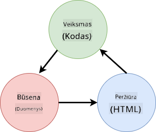

<!--
CO_OP_TRANSLATOR_METADATA:
{
  "original_hash": "4fa20c513e367e9cdd401bf49ae16e33",
  "translation_date": "2025-08-28T11:19:47+00:00",
  "source_file": "7-bank-project/4-state-management/README.md",
  "language_code": "lt"
}
-->
# Sukurkite bankinę programėlę 4 dalis: Būsenos valdymo koncepcijos

## Prieš paskaitą: testas

[Prieš paskaitą: testas](https://ff-quizzes.netlify.app/web/quiz/47)

### Įvadas

Kai internetinė programėlė auga, tampa sudėtinga sekti visus duomenų srautus. Kuris kodas gauna duomenis, kuris puslapis juos naudoja, kur ir kada juos reikia atnaujinti... lengva pasiekti netvarkingą kodą, kurį sunku prižiūrėti. Tai ypač aktualu, kai reikia dalintis duomenimis tarp skirtingų programėlės puslapių, pavyzdžiui, vartotojo duomenimis. *Būsenos valdymo* koncepcija visada egzistavo įvairiose programose, tačiau internetinėms programėlėms vis augant sudėtingumu, tai tapo svarbiu aspektu, kurį reikia apsvarstyti kuriant.

Šioje paskutinėje dalyje peržiūrėsime sukurtą programėlę, kad iš naujo apgalvotume, kaip valdoma būsena, suteikiant galimybę naršyklės atnaujinimui bet kuriuo metu ir duomenų išsaugojimui tarp vartotojo sesijų.

### Reikalavimai

Turite būti baigę [duomenų gavimo](../3-data/README.md) dalį, susijusią su šia pamoka. Taip pat turite įdiegti [Node.js](https://nodejs.org) ir [paleisti serverio API](../api/README.md) lokaliai, kad galėtumėte valdyti paskyros duomenis.

Galite patikrinti, ar serveris veikia tinkamai, vykdydami šią komandą terminale:

```sh
curl http://localhost:5000/api
# -> should return "Bank API v1.0.0" as a result
```

---

## Iš naujo apgalvokite būsenos valdymą

[Ankstesnėje pamokoje](../3-data/README.md) pristatėme pagrindinę būsenos koncepciją mūsų programėlėje su globaliu `account` kintamuoju, kuris saugo banko duomenis apie šiuo metu prisijungusį vartotoją. Tačiau dabartinis įgyvendinimas turi keletą trūkumų. Pabandykite atnaujinti puslapį, kai esate prietaisų skydelyje. Kas nutinka?

Yra 3 problemos su dabartiniu kodu:

- Būsena nėra išsaugoma, nes naršyklės atnaujinimas grąžina jus į prisijungimo puslapį.
- Yra kelios funkcijos, kurios keičia būseną. Kai programėlė auga, tampa sunku sekti pakeitimus ir lengva pamiršti atnaujinti vieną iš jų.
- Būsena nėra išvaloma, todėl paspaudus *Atsijungti* paskyros duomenys vis dar lieka, nors esate prisijungimo puslapyje.

Galėtume atnaujinti savo kodą, kad spręstume šias problemas po vieną, tačiau tai sukurtų daugiau kodo dubliavimo ir padarytų programėlę sudėtingesnę bei sunkiau prižiūrimą. Arba galėtume sustoti kelioms minutėms ir iš naujo apgalvoti savo strategiją.

> Kokias problemas iš tikrųjų bandome išspręsti?

[Būsenos valdymas](https://en.wikipedia.org/wiki/State_management) yra apie geros strategijos radimą sprendžiant šias dvi konkrečias problemas:

- Kaip išlaikyti duomenų srautus programėlėje suprantamus?
- Kaip užtikrinti, kad būsenos duomenys visada būtų sinchronizuoti su vartotojo sąsaja (ir atvirkščiai)?

Kai pasirūpinsite šiais aspektais, bet kokios kitos problemos, su kuriomis galite susidurti, gali būti jau išspręstos arba tapti lengviau išsprendžiamos. Yra daug galimų būdų spręsti šias problemas, tačiau mes pasirinkime bendrą sprendimą, kuris apima **duomenų ir jų keitimo būdų centralizavimą**. Duomenų srautai atrodytų taip:



> Čia neaptarsime dalies, kurioje duomenys automatiškai sukelia vaizdo atnaujinimą, nes tai susiję su pažangesnėmis [reaktyvaus programavimo](https://en.wikipedia.org/wiki/Reactive_programming) koncepcijomis. Tai gera tema gilintis, jei norite išsamiau pasinerti.

✅ Yra daug bibliotekų su skirtingais būsenos valdymo metodais, [Redux](https://redux.js.org) yra populiarus pasirinkimas. Susipažinkite su naudojamomis koncepcijomis ir modeliais, nes tai dažnai yra geras būdas sužinoti, kokių potencialių problemų galite susidurti didelėse internetinėse programėlėse ir kaip jas galima išspręsti.

### Užduotis

Pradėsime nuo šiek tiek refaktoringo. Pakeiskite `account` deklaraciją:

```js
let account = null;
```

Į:

```js
let state = {
  account: null
};
```

Idėja yra *centralizuoti* visus mūsų programėlės duomenis viename būsenos objekte. Šiuo metu būsenoje turime tik `account`, todėl tai daug nekeičia, tačiau tai sukuria kelią evoliucijoms.

Taip pat turime atnaujinti funkcijas, kurios ją naudoja. `register()` ir `login()` funkcijose pakeiskite `account = ...` į `state.account = ...`;

`updateDashboard()` funkcijos viršuje pridėkite šią eilutę:

```js
const account = state.account;
```

Šis refaktoringas pats savaime neatnešė daug patobulinimų, tačiau idėja buvo sukurti pagrindą kitoms pakeitimams.

## Sekite duomenų pokyčius

Dabar, kai sukūrėme `state` objektą duomenims saugoti, kitas žingsnis yra centralizuoti atnaujinimus. Tikslas yra palengvinti bet kokių pokyčių sekimą ir kada jie įvyksta.

Kad išvengtume pakeitimų `state` objekte, taip pat gera praktika laikyti jį [*nekintamu*](https://en.wikipedia.org/wiki/Immutable_object), tai reiškia, kad jo negalima visiškai modifikuoti. Tai taip pat reiškia, kad norėdami ką nors pakeisti, turite sukurti naują būsenos objektą. Taip sukuriate apsaugą nuo galimų nepageidaujamų [šalutinių efektų](https://en.wikipedia.org/wiki/Side_effect_(computer_science)) ir atveriate galimybes naujoms funkcijoms programėlėje, pvz., įgyvendinti atšaukimą/atstatymą, taip pat palengvinate derinimą. Pavyzdžiui, galite registruoti kiekvieną būsenos pakeitimą ir išsaugoti pakeitimų istoriją, kad suprastumėte klaidos šaltinį.

JavaScripte galite naudoti [`Object.freeze()`](https://developer.mozilla.org/docs/Web/JavaScript/Reference/Global_Objects/Object/freeze), kad sukurtumėte nekintamą objekto versiją. Jei bandysite pakeisti nekintamą objektą, bus iškelta išimtis.

✅ Ar žinote skirtumą tarp *paviršutiniškai* ir *giliai* nekintamo objekto? Apie tai galite perskaityti [čia](https://developer.mozilla.org/docs/Web/JavaScript/Reference/Global_Objects/Object/freeze#What_is_shallow_freeze).

### Užduotis

Sukurkime naują `updateState()` funkciją:

```js
function updateState(property, newData) {
  state = Object.freeze({
    ...state,
    [property]: newData
  });
}
```

Šioje funkcijoje mes sukuriame naują būsenos objektą ir kopijuojame duomenis iš ankstesnės būsenos naudodami [*sklaidos (`...`) operatorių*](https://developer.mozilla.org/docs/Web/JavaScript/Reference/Operators/Spread_syntax#Spread_in_object_literals). Tada mes pakeičiame tam tikrą būsenos objekto savybę naujais duomenimis naudodami [skliaustų notaciją](https://developer.mozilla.org/docs/Web/JavaScript/Guide/Working_with_Objects#Objects_and_properties) `[property]` priskyrimui. Galiausiai mes užrakiname objektą, kad išvengtume pakeitimų, naudodami `Object.freeze()`. Šiuo metu būsenoje saugome tik `account` savybę, tačiau su šiuo metodu galite pridėti tiek savybių, kiek reikia.

Taip pat atnaujinsime `state` inicializaciją, kad įsitikintume, jog pradinė būsena taip pat yra užšaldyta:

```js
let state = Object.freeze({
  account: null
});
```

Po to atnaujinkite `register` funkciją, pakeisdami `state.account = result;` priskyrimą į:

```js
updateState('account', result);
```

Padarykite tą patį su `login` funkcija, pakeisdami `state.account = data;` į:

```js
updateState('account', data);
```

Dabar pasinaudosime proga išspręsti problemą, kai paskyros duomenys nėra išvalomi, kai vartotojas paspaudžia *Atsijungti*.

Sukurkite naują funkciją `logout()`:

```js
function logout() {
  updateState('account', null);
  navigate('/login');
}
```

`updateDashboard()` funkcijoje pakeiskite nukreipimą `return navigate('/login');` į `return logout()`;

Pabandykite užregistruoti naują paskyrą, atsijungti ir vėl prisijungti, kad patikrintumėte, ar viskas vis dar veikia tinkamai.

> Patarimas: galite peržiūrėti visus būsenos pakeitimus, pridėdami `console.log(state)` `updateState()` apačioje ir atidarę naršyklės kūrimo įrankių konsolę.

## Išsaugokite būseną

Dauguma internetinių programėlių turi išsaugoti duomenis, kad galėtų tinkamai veikti. Visi svarbūs duomenys paprastai saugomi duomenų bazėje ir pasiekiami per serverio API, kaip mūsų atveju vartotojo paskyros duomenys. Tačiau kartais taip pat įdomu išsaugoti kai kuriuos duomenis kliento programėlėje, kuri veikia jūsų naršyklėje, siekiant geresnės vartotojo patirties arba pagerinti įkėlimo našumą.

Kai norite išsaugoti duomenis naršyklėje, yra keletas svarbių klausimų, kuriuos turėtumėte sau užduoti:

- *Ar duomenys yra jautrūs?* Turėtumėte vengti saugoti bet kokius jautrius duomenis kliente, pvz., vartotojo slaptažodžius.
- *Kiek laiko jums reikia išsaugoti šiuos duomenis?* Ar planuojate pasiekti šiuos duomenis tik dabartinei sesijai, ar norite, kad jie būtų saugomi amžinai?

Yra keli būdai saugoti informaciją internetinėje programėlėje, priklausomai nuo to, ką norite pasiekti. Pavyzdžiui, galite naudoti URL, kad saugotumėte paieškos užklausą ir padarytumėte ją dalinamą tarp vartotojų. Taip pat galite naudoti [HTTP slapukus](https://developer.mozilla.org/docs/Web/HTTP/Cookies), jei duomenys turi būti dalinami su serveriu, pvz., [autentifikacijos](https://en.wikipedia.org/wiki/Authentication) informacija.

Kita galimybė yra naudoti vieną iš daugelio naršyklės API duomenims saugoti. Dvi iš jų yra ypač įdomios:

- [`localStorage`](https://developer.mozilla.org/docs/Web/API/Window/localStorage): [Raktų/Verčių saugykla](https://en.wikipedia.org/wiki/Key%E2%80%93value_database), leidžianti išsaugoti duomenis, specifinius dabartinei svetainei, tarp skirtingų sesijų. Duomenys, išsaugoti joje, niekada nepasibaigia.
- [`sessionStorage`](https://developer.mozilla.org/docs/Web/API/Window/sessionStorage): veikia taip pat kaip `localStorage`, išskyrus tai, kad joje saugomi duomenys ištrinami, kai sesija baigiasi (kai naršyklė uždaroma).

Atkreipkite dėmesį, kad abi šios API leidžia saugoti tik [eilutes](https://developer.mozilla.org/docs/Web/JavaScript/Reference/Global_Objects/String). Jei norite saugoti sudėtingus objektus, turėsite juos serializuoti į [JSON](https://developer.mozilla.org/docs/Web/JavaScript/Reference/Global_Objects/JSON) formatą, naudodami [`JSON.stringify()`](https://developer.mozilla.org/docs/Web/JavaScript/Reference/Global_Objects/JSON/stringify).

✅ Jei norite sukurti internetinę programėlę, kuri neveikia su serveriu, taip pat galima sukurti duomenų bazę kliente, naudojant [`IndexedDB` API](https://developer.mozilla.org/docs/Web/API/IndexedDB_API). Ši API skirta pažangiems naudojimo atvejams arba jei reikia saugoti didelį kiekį duomenų, nes ją naudoti yra sudėtingiau.

### Užduotis

Norime, kad mūsų vartotojai liktų prisijungę, kol jie aiškiai nepaspaudžia *Atsijungti* mygtuko, todėl naudosime `localStorage`, kad saugotume paskyros duomenis. Pirmiausia apibrėžkime raktą, kurį naudosime duomenims saugoti.

```js
const storageKey = 'savedAccount';
```

Tada pridėkite šią eilutę `updateState()` funkcijos pabaigoje:

```js
localStorage.setItem(storageKey, JSON.stringify(state.account));
```

Su tuo vartotojo paskyros duomenys bus išsaugoti ir visada atnaujinti, nes anksčiau centralizavome visus būsenos atnaujinimus. Čia pradedame naudotis visais ankstesniais refaktoringais 🙂.

Kadangi duomenys yra išsaugoti, taip pat turime pasirūpinti jų atkūrimu, kai programėlė įkeliama. Kadangi pradėsime turėti daugiau inicializacijos kodo, gali būti gera idėja sukurti naują `init` funkciją, kuri taip pat apimtų mūsų ankstesnį kodą `app.js` apačioje:

```js
function init() {
  const savedAccount = localStorage.getItem(storageKey);
  if (savedAccount) {
    updateState('account', JSON.parse(savedAccount));
  }

  // Our previous initialization code
  window.onpopstate = () => updateRoute();
  updateRoute();
}

init();
```

Čia mes atkuriame išsaugotus duomenis, ir jei jų yra, atnaujiname būseną atitinkamai. Svarbu tai padaryti *prieš* atnaujinant maršrutą, nes gali būti kodas, kuris remiasi būsena puslapio atnaujinimo metu.

Taip pat galime padaryti *Prietaisų skydelio* puslapį mūsų programėlės numatytuoju puslapiu, nes dabar išsaugome paskyros duomenis. Jei duomenų nerandama, prietaisų skydelis vis tiek pasirūpina nukreipimu į *Prisijungimo* puslapį. `updateRoute()` funkcijoje pakeiskite atsarginį `return navigate('/login');` į `return navigate('/dashboard');`.

Dabar prisijunkite prie programėlės ir pabandykite atnaujinti puslapį. Turėtumėte likti prietaisų skydelyje. Su šiuo atnaujinimu mes išsprendėme visas pradines problemas...

## Atnaujinkite duomenis

...Bet mes taip pat galėjome sukurti naują problemą. Oi!

Eikite į prietaisų skydelį naudodami `test` paskyrą, tada paleiskite šią komandą terminale, kad sukurtumėte naują operaciją:

```sh
curl --request POST \
     --header "Content-Type: application/json" \
     --data "{ \"date\": \"2020-07-24\", \"object\": \"Bought book\", \"amount\": -20 }" \
     http://localhost:5000/api/accounts/test/transactions
```

Dabar pabandykite atnaujinti prietaisų skydelio puslapį naršyklėje. Kas nutinka? Ar matote naują operaciją?

Būsena yra išsaugota neribotai, dėka `localStorage`, tačiau tai taip pat reiškia, kad ji niekada nėra atnaujinama, kol neatsijungiate nuo programėlės ir vėl neprisijungiate!

Viena galimų strategijų tai išspręsti yra pakartotinai įkelti paskyros duomenis kiekvieną kartą, kai įkeliamas prietaisų skydelis, kad išvengtume pasenusių duomenų.

### Užduotis

Sukurkite naują funkciją `updateAccountData`:

```js
async function updateAccountData() {
  const account = state.account;
  if (!account) {
    return logout();
  }

  const data = await getAccount(account.user);
  if (data.error) {
    return logout();
  }

  updateState('account', data);
}
```

Šis metodas patikrina, ar šiuo metu esame prisijungę, tada pakartotinai įkelia paskyros duomenis iš serverio.

Sukurkite kitą funkciją, pavadintą `refresh`:

```js
async function refresh() {
  await updateAccountData();
  updateDashboard();
}
```

Ši funkcija atnaujina paskyros duomenis, tada pasirūpina prietaisų skydelio puslapio HTML atnaujinimu. Tai yra tai, ką reikia iškviesti, kai įkeliamas prietaisų skydelio maršrutas. Atnaujinkite maršruto
[Po paskaitos testas](https://ff-quizzes.netlify.app/web/quiz/48)

## Užduotis

[Įgyvendinkite dialogo langą „Pridėti operaciją“](assignment.md)

Štai pavyzdys, kaip turėtų atrodyti rezultatas po užduoties atlikimo:


---

**Atsakomybės apribojimas**:  
Šis dokumentas buvo išverstas naudojant AI vertimo paslaugą [Co-op Translator](https://github.com/Azure/co-op-translator). Nors siekiame tikslumo, prašome atkreipti dėmesį, kad automatiniai vertimai gali turėti klaidų ar netikslumų. Originalus dokumentas jo gimtąja kalba turėtų būti laikomas autoritetingu šaltiniu. Kritinei informacijai rekomenduojama profesionali žmogaus vertimo paslauga. Mes neprisiimame atsakomybės už nesusipratimus ar klaidingus interpretavimus, atsiradusius naudojant šį vertimą.