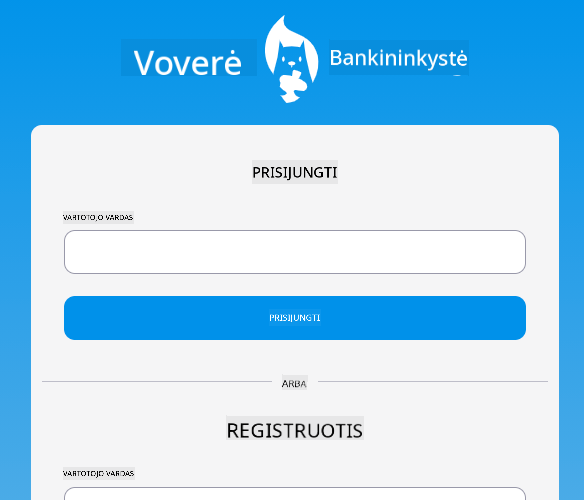

<!--
CO_OP_TRANSLATOR_METADATA:
{
  "original_hash": "830359535306594b448db6575ce5cdee",
  "translation_date": "2025-08-28T11:13:59+00:00",
  "source_file": "7-bank-project/README.md",
  "language_code": "lt"
}
-->
# :dollar: Sukurkite Banką

Šiame projekte išmoksite, kaip sukurti fiktyvų banką. Šios pamokos apima instrukcijas, kaip sukurti internetinės programos išdėstymą ir maršrutus, kurti formas, valdyti būseną ir gauti duomenis iš API, iš kurios galėsite gauti banko duomenis.

|  |  |
|--------------------------------|--------------------------------|

## Pamokos

1. [HTML šablonai ir maršrutai internetinėje programoje](1-template-route/README.md)
2. [Prisijungimo ir registracijos formos kūrimas](2-forms/README.md)
3. [Duomenų gavimo ir naudojimo metodai](3-data/README.md)
4. [Būsenos valdymo koncepcijos](4-state-management/README.md)

### Kreditas

Šios pamokos buvo parašytos su :hearts: [Yohan Lasorsa](https://twitter.com/sinedied).

Jei norite sužinoti, kaip sukurti [serverio API](/7-bank-project/api/README.md), naudojamą šiose pamokose, galite sekti [šią vaizdo įrašų seriją](https://aka.ms/NodeBeginner) (ypač 17–21 vaizdo įrašus).

Taip pat galite peržiūrėti [šį interaktyvų mokymosi vadovą](https://aka.ms/learn/express-api).

---

**Atsakomybės apribojimas**:  
Šis dokumentas buvo išverstas naudojant AI vertimo paslaugą [Co-op Translator](https://github.com/Azure/co-op-translator). Nors siekiame tikslumo, prašome atkreipti dėmesį, kad automatiniai vertimai gali turėti klaidų ar netikslumų. Originalus dokumentas jo gimtąja kalba turėtų būti laikomas autoritetingu šaltiniu. Kritinei informacijai rekomenduojama profesionali žmogaus vertimo paslauga. Mes neprisiimame atsakomybės už nesusipratimus ar klaidingus interpretavimus, atsiradusius naudojant šį vertimą.