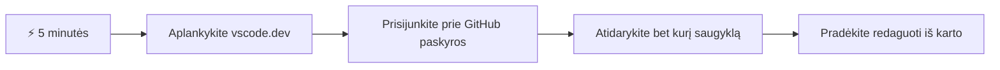
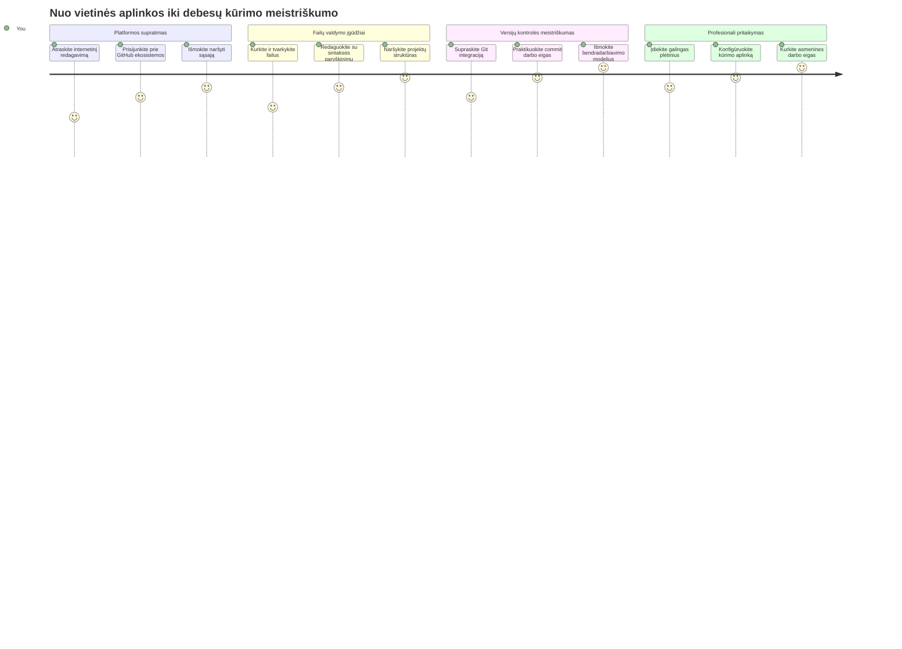
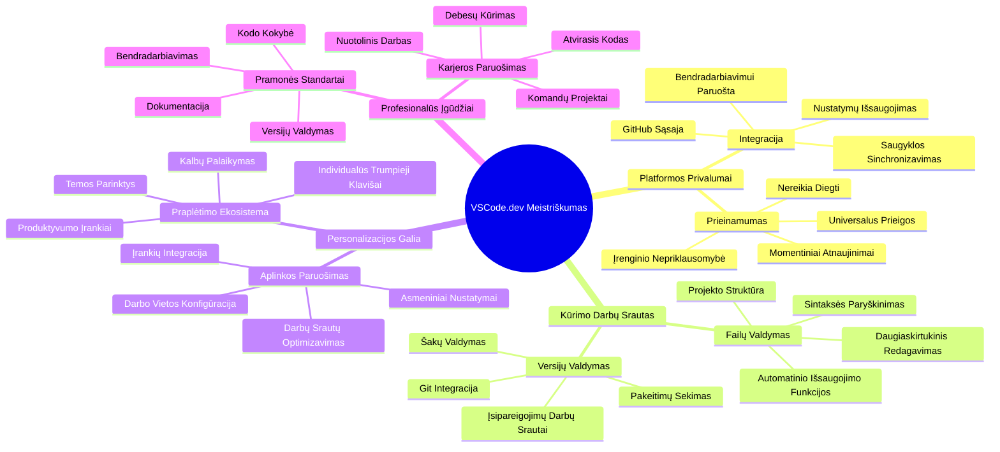
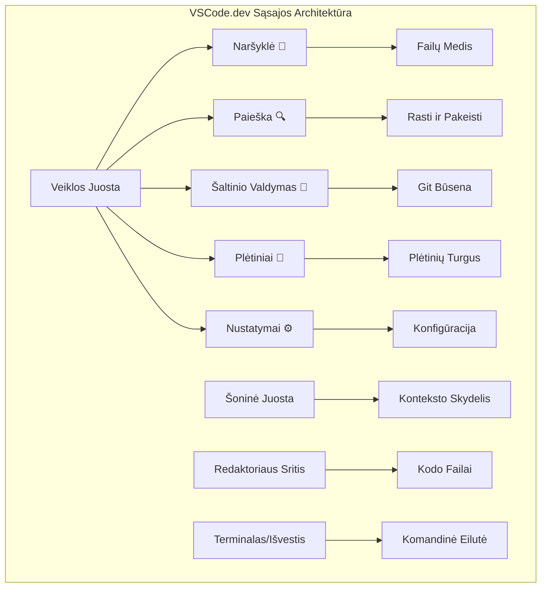
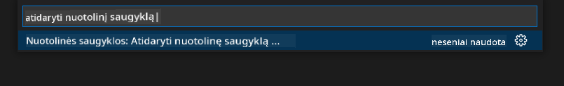
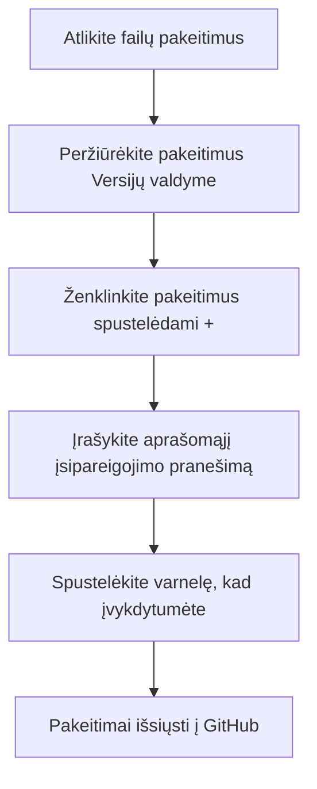
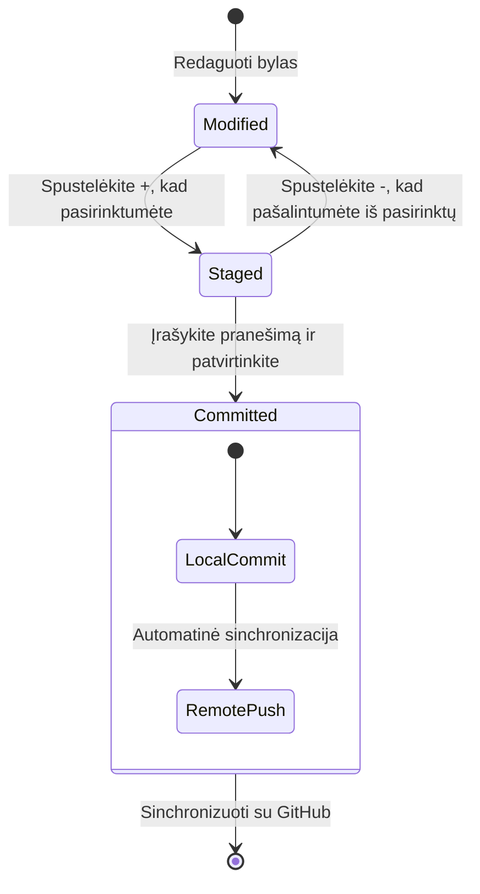
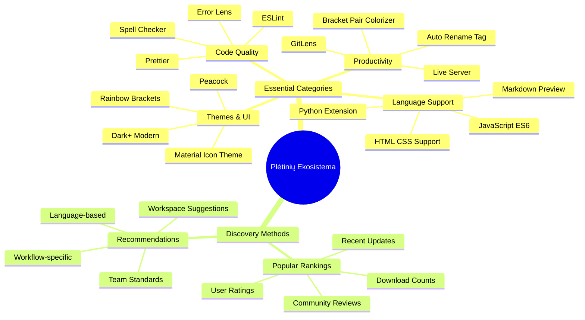
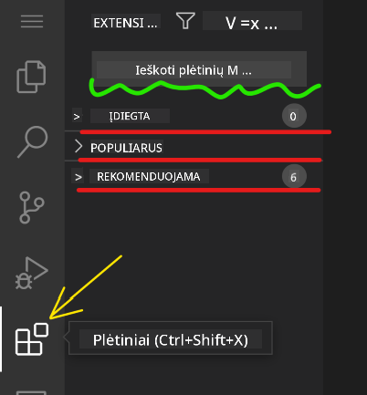
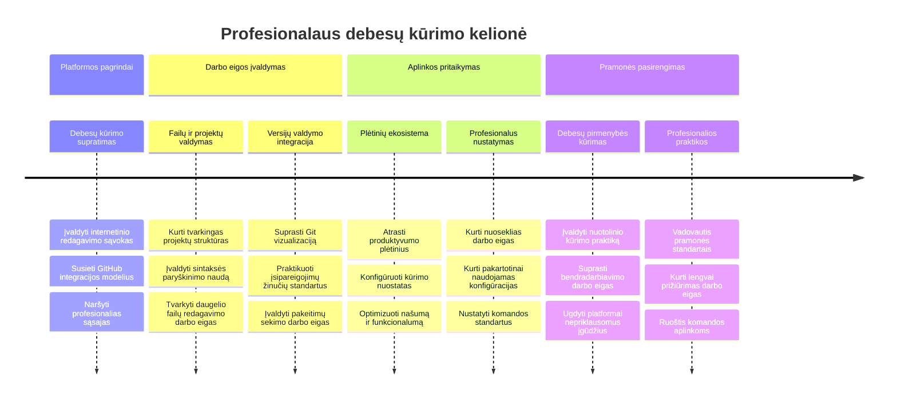

<!--
CO_OP_TRANSLATOR_METADATA:
{
  "original_hash": "a9a3bcc037a447e2d8994d99e871cd9f",
  "translation_date": "2026-01-07T11:17:53+00:00",
  "source_file": "8-code-editor/1-using-a-code-editor/README.md",
  "language_code": "lt"
}
-->
# Naudojimasis Kodo Redaktoriumi: VSCode.dev Įvaldymas

Prisiminkite, kaip *The Matrix* filmuke Neo turėjo prisijungti prie milžiniško kompiuterio terminalo, norėdamas patekti į skaitmeninį pasaulį? Šiuolaikiniai žiniatinklio kūrimo įrankiai yra visiškai priešingas pasakojimas – nepaprastai galingi įrankiai, prieinami bet kur. VSCode.dev yra naršyklėje veikiantis kodo redaktorius, kuris atneša profesionalius kūrimo įrankius į bet kurį įrenginį, turintį interneto ryšį.

Kaip spaustuvės mašina padarė knygas prieinamas visiems, ne tik vienuoliams vienuolynuose, taip ir VSCode.dev demokratizuoja programavimą. Galite dirbti prie projektų bibliotekoje, mokyklos laboratorijoje ar bet kur, kur turite prieigą prie naršyklės. Jokio diegimo, jokio „man reikalinga mano specifinė aplinka“ apribojimų.

Pamokos pabaigoje suprasite, kaip naršyti VSCode.dev, tiesiogiai atidaryti GitHub saugyklas naršyklėje ir naudoti Git versijų kontrolei – visos šios įgūdžiai yra kasdien naudojami profesionalių kūrėjų.

## ⚡ Ką Gali Padaryti Per Kitas 5 Minutes

**Greito Pradžios Gidas Užsiėmusiems Kūrėjams**


- **1 minučių**: Eikite į [vscode.dev](https://vscode.dev) - nereikia diegti
- **2 minučių**: Prisijunkite su GitHub, kad susietumėte savo saugyklas
- **3 minučių**: Išbandykite URL triuką: pakeiskite `github.com` į `vscode.dev/github` bet kurioje saugyklos nuorodoje
- **4 minučių**: Sukurkite naują failą ir stebėkite, kaip automatiškai veikia sintaksės paryškinimas
- **5 minučių**: Padarykite pakeitimą ir įsipareigokite jį per Versijų valdymo skydelį

**Greitas Testo URL**:
```
# Transform this:
github.com/microsoft/Web-Dev-For-Beginners

# Into this:
vscode.dev/github/microsoft/Web-Dev-For-Beginners
```

**Kodėl tai svarbu**: Per 5 minutes patirsite laisvę programuoti bet kur su profesionaliais įrankiais. Tai – kūrimo ateitis – prieinama, galinga ir momentinė.

## 🗺️ Jūsų Mokymosi Kelionė Per Debesų Įrankius


**Jūsų kelionės tikslas**: Pamokos pabaigoje įvaldysite profesionalią debesų kūrimo aplinką, kuri veikia bet kuriame įrenginyje ir leidžia programuoti su tais pačiais įrankiais, kuriuos naudoja didelės technologijų įmonės.

## Ką Išmoksite

Po šios pamokos galėsite:

- Naršyti VSCode.dev tarsi antruosiuose namuose – surasti viską, ko reikia, be pasiklydimo
- Tiesiogiai atidaryti bet kurią GitHub saugyklą naršyklėje ir iš karto pradėti redaguoti (tai tikrai magiška!)
- Naudoti Git, kad sektumėte savo pakeitimus ir išsaugotumėte pažangą kaip profesionalas
- Pritaikyti redaktorių su plėtiniais, kurie pagreitina ir pagražina programavimą
- Sukurti ir organizuoti projekto failus užtikrintai

## Ko Reikės

Reikalavimai yra aiškūs:

- Nemokama [GitHub paskyra](https://github.com) (jei jos neturite, padėsime ją susikurti)
- Pagrindinės žinios apie interneto naršykles
- GitHub Basics pamoka suteikia naudingos informacijos, bet nėra būtina

> 💡 **Naujas GitHub vartotojas?** Paskyros kūrimas yra nemokamas ir trunka kelias minutes. Kaip bibliotekos pažymėjimas suteikia prieigą prie knygų visame pasaulyje, taip GitHub paskyra atveria duris prie kelių kodo saugyklų internete.

## 🧠 Debesų Kūrimo Ekosistemos Apžvalga


**Pagrindinė Idėja**: Debesų pagrindu veikianti kūrimo aplinka yra programavimo ateitis – profesionalūs įrankiai, prieinami, bendradarbiaujantys ir nepriklausomi nuo platformos.

## Kodėl Svarbu Internetiniai Kodo Redaktoriai

Prieš internetą mokslininkai skirtingose universitetuose negalėjo lengvai dalytis tyrimais. 1960-aisiais atsirado ARPANET, jungęs kompiuterius atstumais. Internetiniai kodo redaktoriai remiasi ta pačia idėja – suteikti galingus įrankius nepriklausomai nuo fizinės vietos ar įrenginio.

Kodo redaktorius yra jūsų kūrimo darbo vieta, kur rašote, redaguojate ir organizuojate kodo failus. Skirtingai nuo paprastų teksto redaktorių, profesionalūs redaktoriai suteikia sintaksės paryškinimą, klaidų aptikimą ir projektų valdymo funkcijas.

VSCode.dev šias galimybes atneša į jūsų naršyklę:

**Internetinio redagavimo pranašumai:**

| Funkcija | Aprašymas | Praktinė Nauda |
|---------|-------------|----------|
| **Nepriklausomybė nuo platformos** | Veikia bet kuriame įrenginyje su naršykle | Dirbkite iš skirtingų kompiuterių be trukdžių |
| **Nereikia įdiegti** | Prieiga per interneto URL | Venkite programinės įrangos diegimo apribojimų |
| **Automatiniai atnaujinimai** | Visada veikia naujausia versija | Naudokitės naujomis funkcijomis be rankinio atnaujinimo |
| **Sąsaja su saugyklomis** | Tiesioginis ryšys su GitHub | Redaguokite kodą be vietinių failų valdymo |

**Praktinės pasekmės:**
- Darbo tęstinumas skirtingose aplinkose
- Vienoda sąsaja nepriklausomai nuo operacinės sistemos
- Momentinės bendradarbiavimo galimybės
- Mažesnės vietos diske sąnaudos

## VSCode.dev Tyrinėjimas

Kaip Marija Kiuri turėjo sudėtingą laboratoriją gan paprastoje erdvėje, VSCode.dev suspaudžia profesionalius kūrimo įrankius į naršyklės sąsają. Ši žiniatinklio programa pateikia tas pačias pagrindines funkcijas kaip ir darbalaukio kodo redaktoriai.

Pradėkite naršydami į [vscode.dev](https://vscode.dev). Sąsaja užsikrauna be atsisiuntimų ar sistemos diegimo – tai debesų kompiuterijos principų taikymas.

### Jūsų GitHub Sąskaitos Prisijungimas

Kaip Aleksandras Grahamas Bellas telefono dėka jungė atstumais esančias vietas, taip susiejimas su jūsų GitHub paskyra sujungia VSCode.dev su jūsų kodo saugyklomis. Kai bus pasiūlyta prisijungti per GitHub, rekomenduojama priimti.

**GitHub susiejimas suteikia:**
- Tiesioginę prieigą prie jūsų saugyklų redaktoriuje
- Sinchronizuotus nustatymus ir plėtinius tarp įrenginių
- Patogesnį saugojimą GitHub platformoje
- Personalizuotą kūrimo aplinką

### Susipažinimas su Jūsų Nauja Darbo Vietą

Kai viskas užsikraus, pamatysite švariai išdėstytą darbo vietą, kuri sukurta taip, kad būtumėte susikoncentravę į svarbiausia – kodą!


**Apžvalga jūsų rajono:**
- **Veiklos juosta** (kairėje esanti juosta): pagrindinė jūsų navigacija su Naršyklė 📁, Paieška 🔍, Versijų valdymas 🌿, Plėtiniai 🧩 ir Nustatymai ⚙️
- **Šoninė juosta** (šalia): pasikeičia ir rodo aktualią informaciją, priklausomai nuo to, ką pasirinkote
- **Redaktoriaus sritis** (didelė centrinė zona): čia vyksta stebuklai – pagrindinė programavimo zona

**Skirkite šiek tiek laiko apžiūrėti:**
- Spauskite veiklos juostos ikonėles ir stebėkite, ką kiekviena daro
- Atkreipkite dėmesį, kaip šoninė juosta keičiasi ir rodo skirtingą informaciją – gana įdomu, tiesa?
- Naršyklės vaizdas (📁) greičiausiai bus vieta, kur praleisite daugiausiai laiko, tad pripraskite prie jo


## GitHub Saugyklų Atidarymas

Prieš internetą tyrėjai turėjo fiziškai eiti į bibliotekas, norėdami prieiti prie dokumentų. GitHub saugyklos veikia panašiai – jos yra nuotoliniu būdu saugomi kodo rinkiniai. VSCode.dev pašalina tradicinį žingsnį, kai reikia parsisiųsti saugyklas į vietinę mašiną prieš pradedant redaguoti.

Ši galimybė suteikia momentinę prieigą prie bet kurios viešos saugyklos peržiūrai, redagavimui ar prisidėjimui. Štai du būdai atidaryti saugyklas:

### 1 Būdas: Užvedimas ir spustelėjimas

Tai puikus būdas pradėti darbą VSCode.dev ir atidaryti konkretų saugyklą. Paprasta ir draugiška pradedantiesiems:

**Kaip tai padaryti:**

1. Eikite į [vscode.dev](https://vscode.dev), jei dar ten nesate
2. Paspauskite mygtuką "Open Remote Repository" pasveikinimo ekrane

   

3. Įklijuokite bet kokį GitHub saugyklos URL (išbandykite šį: `https://github.com/microsoft/Web-Dev-For-Beginners`)
4. Paspauskite Enter ir stebėkite magiją!

**Profesionalus patarimas – Komandų paletės santrauka:**

Norite jaustis tarsi programavimo žinovas? Išbandykite šį klaviatūros spartųjį klavišą: Ctrl+Shift+P (ar Cmd+Shift+P Mac) atidaryti Komandų paletę:



**Komandų paletė yra tarsi paieškos variklis viskam, ką galite daryti:**
- Įveskite "open remote" ir ji suras, kaip atidaryti saugyklą
- Ji prisimena saugyklas, kurias atidarinėjote neseniai (labai patogu!)
- Kai priprasi, jausitės, kad programuojate žaibiškai
- Tai tarsi VSCode.dev versija „Ei Siri, bet programavimui“

### 2 Būdas: URL Keitimo Technika

Kaip HTTP ir HTTPS naudoja skirtingus protokolus išlaikydami tą patį domeno struktūrą, taip ir VSCode.dev naudoja URL modelį, kuris atkartoja GitHub adresavimą. Bet kurio GitHub saugyklos URL galite pakeisti ir atidaryti tiesiogiai VSCode.dev.

**URL transformacijos modelis:**

| Saugyklos Tipas | GitHub URL | VSCode.dev URL |
|----------------|---------------------|----------------|
| **Vieša Saugykla** | `github.com/microsoft/Web-Dev-For-Beginners` | `vscode.dev/github/microsoft/Web-Dev-For-Beginners` |
| **Asmeninis Projektas** | `github.com/your-username/my-project` | `vscode.dev/github/your-username/my-project` |
| **Bet kuri Prieinama Saugykla** | `github.com/their-username/awesome-repo` | `vscode.dev/github/their-username/awesome-repo` |

**Vykdymas:**
- Pakeiskite `github.com` į `vscode.dev/github`
- Išlaikykite kitus URL komponentus nepakitusius
- Veikia su bet kuria viešai prieinama saugykla
- Tiesioginė redagavimo prieiga

> 💡 **Gyvenimą keičiantis patarimas**: Įsirašykite VSCode.dev versijas savo mėgstamiausių saugyklų žymėse. Aš turiu žymes kaip "Redaguoti Mano Portfolio" ir "Taisyti Dokumentaciją", kurios tiesiogiai atidaro redagavimo režimą!

**Kurį metodą rinktis?**
- **Sąsajos būdas**: Puiku, kai naršote ar neprisimenate tikslių saugyklų vardų
- **URL triukas**: Tobulas greitam prieigos būdui, jei tiksliai žinote, kur einate

### 🎯 Pedagoginė Pertrauka: Debesų Kūrybos Prieiga

**Sustokite ir apmąstykite**: Jūs ką tik išmokote du būdus, kaip prieiti prie kodo saugyklų naršyklės pagalba. Tai pagrindinis pokytis kūrimo darbo tėkme.

**Greitas savęs įvertinimas**:
- Ar galite paaiškinti, kodėl internetinis redagavimas pašalina tradicinį „kūrimo aplinkos paruošimą“?
- Kokias privalumas suteikia URL keitimo technika lyginant su vietiniu git klonavimu?
- Kaip šis požiūris keičia jūsų galimybes prisidėti prie atviro kodo projektų?

**Realus ryšys**: Didelės kompanijos kaip GitHub, GitLab ir Replit statė savo kūrimo platformas remdamiesi šiais debesų pirmumo principais. Jūs mokotės tų pačių darbo eigų, kurios naudojamos profesionalių kūrėjų komandose visame pasaulyje.

**Iššūkio Klausimas**: Kaip gali debesų kūrimas pakeisti programavimo mokymą mokyklose? Pagalvokite apie įrenginių reikalavimus, programinės įrangos valdymą ir bendradarbiavimo galimybes.

## Darbas su Failais ir Projektais

Dabar, kai atidarėte saugyklą, pradėkime kurti! VSCode.dev suteikia viską, ko reikia kurti, redaguoti ir organizuoti kodo failus. Įsivaizduokite tai kaip skaitmeninę dirbtuvę – visi įrankiai yra ten, kur jums jų reikia.

Panagrinėkime kasdienes užduotis, kurios sudarys didžiąją dalį jūsų programavimo darbo.

### Naujų Failų Kūrimas

Kaip architekto biure tvarkomi brėžiniai, taip pat ir VSCode.dev failų kūrimas vyksta struktūruotai. Sistema palaiko visas standartines žiniatinklio kūrimo failų rūšis.

**Failo kūrimo procesas:**

1. Naršykite iki norimos aplanko Explorer šoninėje juostoje
2. Užveskite pelę ant aplanko pavadinimo, kad atsirastų „Naujo Failo“ ikona (📄+)
3. Įrašykite failo pavadinimą su tinkamu plėtiniu (`style.css`, `script.js`, `index.html`)
4. Paspauskite Enter, kad sukurtumėte failą


**Vardų taisyklės:**
- Naudokite aprašomuosius pavadinimus, nurodančius failo paskirtį
- Pateikite failo plėtinius, kad veiktų tinkamas sintaksės paryškinimas
- Laikykitės nuoseklių pavadinimų modelių visuose projektuose
- Venkite didžiųjų raidžių ir tarpai – naudokite mažąsias raides ir brūkšnelius

### Failų Redagavimas ir Saugojimas

Čia prasideda tikras smagumas! VSCode.dev redaktorius turi daug naudingų funkcijų, kurios daro programavimą sklandų ir intuityvų. Tarsi turėtumėte itin protingą rašytojo asistentą, tik skirtą kodui.

**Jūsų redagavimo darbo eiga:**

1. Spustelėkite bet kurį failą Explorer, kad atidarytumėte jį pagrindinėje srityje
2. Pradėkite rašyti ir stebėkite, kaip VSCode.dev padeda spalvomis, pasiūlymais ir klaidų aptikimu
3. Išsaugokite darbą su Ctrl+S (Windows/Linux) arba Cmd+S (Mac) – nors automatinis įrašymas yra taip pat!


**Įdomybės programuojant:**
- Jūsų kodas gražiai spalvinamas, kad būtų lengviau skaityti
- VSCode.dev siūlo užbaigimus rašant (kaip automatinis pataisymas, tik daug protingesnis)
- Aptinka rašybos klaidas ir klaidas dar prieš išsaugojant
- Galite turėti kelis failus atidarytus skirtukuose, kaip naršyklėje
- Viskas automatiškai saugoma fone

> ⚠️ **Greitas patarimas**: Nors automatinis saugojimas yra patogus, vis tiek gerai įprotis paspausti Ctrl+S arba Cmd+S. Tai iš karto išsaugo viską ir suaktyvina papildomas naudingas funkcijas, pvz., klaidų tikrinimą.

### Versijų Kontrolė su Git

Kaip archeologai detaliai fiksuoja kasinėjimų sluoksnius, taip Git seka jūsų kodo pakeitimus laikui bėgant. Ši sistema saugo projekto istoriją ir leidžia grįžti prie ankstesnių versijų, kai reikia. VSCode.dev turi integruotą Git funkcionalumą.

**Versijų valdymo sąsaja:**

1. Pasiekite Versijų valdymo skydelį spustelėdami 🌿 piktogramą Veiklos juostoje
2. Modifikuoti failai rodomi „Changes“ skiltyje
3. Spalvų žymėjimas nurodo pakeitimų tipus: žalia priedams, raudona ištrynimams


**Kaip įrašyti pakeitimus (įsipareigojimo eiga):**



**Jūsų žingsniai:**
- Paspauskite "+" šalia failų, kuriuos norite įrašyti (tai juos „prisideda“)
- Dukart patikrinkite, ar esate patenkinti visais savo pasiruoštais pakeitimais
- Parašykite trumpą pastabą, paaiškinančią, ką padarėte (tai jūsų „commit“ pranešimas)
- Paspauskite varnelės mygtuką, kad viską išsaugotumėte GitHub
- Jei ką nors persigalvojate, mygtukas „atšaukti“ leis atmesti pakeitimus

**Geri commit pranešimai (tai lengviau, nei manote!):**
- Tiesiog aprašykite, ką padarėte, pvz., „Pridėti kontaktų formą“ arba „Ištaisyta neveikianti navigacija“
- Laikykite trumpą ir aiškų – kaip tviterio ilgis, ne kaip esė
- Pradėkite veiksmažodžiais kaip „Pridėti“, „Ištaisyti“, „Atnaujinti“ arba „Pašalinti“
- **Geri pavyzdžiai**: „Pridėtas reaguojantis navigacijos meniu“, „Ištaisyti mobiliosios versijos išdėstymo nesklandumai“, „Atnaujintos spalvos geresniam prieinamumui“

> 💡 **Greitas naršymo patarimas**: Naudokite hamburgerio meniu (☰) viršuje kairėje, kad greitai grįžtumėte prie savo GitHub saugyklos ir matytumėte savo įsipareigotus pakeitimus internete. Tai tarsi portalas tarp jūsų redagavimo aplinkos ir jūsų projekto namų GitHub!

## Funkcionalumo praplėtimas per plėtinius

Kaip meistro dirbtuvėse yra specializuotų įrankių skirtingoms užduotims, taip ir VSCode.dev galima pritaikyti naudodami plėtinius, kurie prideda konkrečias galimybes. Šie bendruomenės sukurti įskiepių paketai atliepia dažnai pasitaikančius kūrimo poreikius, tokius kaip kodo formatavimas, tiesioginis peržiūra ir pažangesnė Git integracija.

Papildinių rinkoje yra tūkstančiai nemokamų įrankių, sukurtų programuotojų visame pasaulyje. Kiekvienas plėtinys sprendžia konkrečius darbo eigos iššūkius, leidžiant jums susikurti suasmenintą kūrimo aplinką, pritaikytą jūsų specifiniams poreikiams ir pageidavimams.


### Raskite savo tobulus plėtinius

Papildinių rinka yra labai gerai organizuota, tad nesuklysite ieškodami reikalingo įrankio. Ji sukurta taip, kad padėtų atrasti tiek specifinius įrankius, tiek įdomybes, apie kurias galbūt net nežinojote!

**Kaip pasiekti papildinių rinką:**

1. Spustelėkite papildymo piktogramą (🧩) Veiklos juostoje
2. Naršykite arba ieškokite konkretaus dalyko
3. Spauskite ant įdomių elementų, kad sužinotumėte daugiau



**Ką ten rasite:**

| Skiltis | Kas viduje | Kodėl tai naudinga |
|----------|------------|--------------------|
| **Įdiegta** | Jau įdiegti plėtiniai | Jūsų asmeninis kodo įrankių rinkinys |
| **Populiariausi** | Mėgstamiausi tarp vartotojų | Ką daugelis programuotojų laiko patikimu |
| **Rekomenduojami** | Išmanios rekomendacijos jūsų projektui | VSCode.dev naudingos rekomendacijos |

**Kas palengvina naršymą:**
- Kiekvienas plėtinys turi įvertinimus, parsisiuntimų skaičių ir tikrus vartotojų atsiliepimus
- Yra ekrano kopijos ir aiškūs aprašymai, ką kiekvienas daro
- Visos plėtinių suderinamumo informacija aiškiai pažymėta
- Panašūs plėtiniai siūlomi lyginimui

### Plėtinių diegimas (tai labai paprasta!)

Naujas funkcijas redaktoriui pridėti galite tiesiog paspaudę mygtuką. Plėtiniai įdiegiami per kelias sekundes ir pradeda veikti iš karto – nereikia perkrauti ar laukti.

**Štai ką reikia daryti:**

1. Ieškokite, ko norite (išbandykite paiešką „live server“ arba „prettier“)
2. Spustelėkite įdomų plėtinį, kad pamatytumėte išsamesnę informaciją
3. Perskaitykite, ką jis daro, ir peržiūrėkite įvertinimus
4. Paspauskite mėlyną mygtuką „Install“ ir viskas!


**Kas vyksta užkulisiuose:**
- Plėtinys atsisiunčiamas ir įdiegtas automatiškai
- Naujos funkcijos iš karto atsiranda sąsajoje
- Visos naujovės pradeda veikti nedelsiant (rimtai, taip greitai!)
- Jei esate prisijungę, plėtinys sinchronizuojamas visose jūsų įrenginiuose

**Keletas plėtinių, kuriuos rekomenduočiau pradėti naudoti:**
- **Live Server**: Matykite savo svetainės atnaujinimus realiu laiku programuojant (tai tikrai magiška!)
- **Prettier**: Automatiškai padaro jūsų kodą tvarkingą ir profesionalų
- **Auto Rename Tag**: Pakeitus vieną HTML žymę, atnaujinama ir jos pora
- **Bracket Pair Colorizer**: Spalvina jūsų skliaustus, kad niekada nesusipainiotumėte
- **GitLens**: Papildo jūsų Git galimybes daugybe naudingos informacijos

### Plėtinių pritaikymas

Dauguma plėtinių turi nustatymus, kuriuos galite keisti, kad jie veiktų tiksliai taip, kaip norite. Galima tai palyginti su automobiliu – kiekvienas mėgsta pasėdynės ir veidrodėlių reguliavimą!

**Kaip keisti plėtinių nustatymus:**

1. Raskite savo įdiegtą plėtinį plėtinių panelėje
2. Spustelėkite mažą pavarėlės ikonėlę (⚙️) šalia jo pavadinimo
3. Pasirinkite „Extension Settings“ iš išskleidžiamojo meniu
4. Koreguokite nustatymus tol, kol darbo eiga atitiks jūsų poreikius


**Dažniausiai norimos keisti dalykai:**
- Kaip formatuojamas kodas (tarpai ar tabuliacijos, eilučių ilgis ir pan.)
- Kurie klavišų kombinacijos suaktyvina konkrečias funkcijas
- Su kokių failų tipais plėtinys turėtų dirbti
- Konkrečių funkcijų įjungimas arba išjungimas, kad būtų tvarkinga

### Tvarkykite plėtinių kolekciją

Kai atrandate vis naujų naudingų plėtinių, norite savo kolekciją palaikyti tvarkingą ir sklandžią. VSCode.dev tai daro labai paprasta.

**Plėtinių valdymo galimybės:**

| Ką galite daryti | Kada tai naudinga | Patarimas |
|------------------|------------------|-----------|
| **Išjungti** | Kai norite patikrinti, ar plėtinys nesukelia problemų | Geriau nei šalinti, jei galbūt vėliau prireiks |
| **Pašalinti** | Visiškai pašalinti nereikalingus plėtinius | Laiko jūsų aplinką švarią ir greitą |
| **Atnaujinti** | Gauti naujausias funkcijas ir klaidų taisymus | Dažniausiai vyksta automatiškai, bet verta patikrinti |

**Kaip aš tvarkau plėtinius:**
- Kas kelis mėnesius peržiūriu, ką įdiegiau, ir pašalinu nenaudojamus
- Nuolat atnaujinu plėtinius, kad turėčiau naujausius patobulinimus ir saugumo pataisas
- Jei kas atrodo lėtai, laikinai išjungiu plėtinius, kad patikrinti kaltininką
- Skaitau atnaujinimų pastabas, kai plėtiniai gauna didelius atnaujinimus – kartais atsiranda įdomių naujų funkcijų!

> ⚠️ **Veikimo patarimas**: Plėtiniai puikūs, bet per daug jų gali sulėtinti darbą. Koncentruokitės į tuos, kurie tikrai palengvina jūsų gyvenimą ir nedvejodami pašalinkite nenaudojamus.

### 🎯 Pedagoginis tikrinimasis: kūrimo aplinkos pritaikymas

**Architektūros supratimas**: Išmokote suasmeninti profesionalią kūrimo aplinką naudodami bendruomenės sukurtus plėtinius. Tai atspindi, kaip įmonių kūrimo komandos sukuria standartizuotus įrankių rinkinius.

**Pagrindinės įsisavintos sąvokos**:
- **Plėtinių atranka**: rasti įrankius, sprendžiančius specifinius kūrimo iššūkius
- **Aplinkos konfigūracija**: pritaikyti įrankius asmeniniams ar komandos poreikiams
- **Veikimo optimizavimas**: derinti funkcionalumą su sistemos našumu
- **Bendruomenės bendradarbiavimas**: naudotis įrankiais, kuriais dalijasi globali programuotojų bendruomenė

**Ryšys su pramone**: Plėtinių ekosistemomis grindžiamos pagrindinės kūrimo platformos kaip VS Code, Chrome DevTools ir modernios IDE. Supratimas, kaip vertinti, diegti ir konfigūruoti plėtinius, yra svarbus profesionaliai kūrimo darbo eigai.

**Refleksijos klausimas**: Kaip organizuotumėte standartizuotą kūrimo aplinką 10 programuotojų komandai? Apsvarstykite nuoseklumą, veikimą ir individualius pageidavimus.

## 📈 Jūsų debesijos kūrimo meistriškumo laiko juosta


**🎓 Baigimo etapas**: Sėkmingai įvaldėte debesijos kūrimą naudodami tas pačias priemones ir darbo eigas, kuriomis naudojasi profesionalūs technologijų bendrovių programuotojai. Šie įgūdžiai žymi programinės įrangos kūrimo ateitį.

**🔄 Kitos lygio galimybės**:
- Pasiruošę tyrinėti pažangias debesijos kūrimo platformas (Codespaces, GitPod)
- Pasiruošę dirbti paskirstytose kūrimo komandose
- Turite išteklius prisidėti prie atvirojo kodo projektų visame pasaulyje
- Sukūrėte tvirtus pagrindus šiuolaikinėms DevOps ir nuolatinės integracijos praktikoms

## GitHub Copilot agento iššūkis 🚀

Kaip NASA naudoja struktūruotą požiūrį kosmoso misijoms, taip ir šis iššūkis apima sistemingą VSCode.dev įgūdžių taikymą pilnai darbo eigai.

**Tikslas:** Parodyti savo kompetenciją VSCode.dev įkuriant pilną interneto kūrimo darbo eigą.

**Projekto reikalavimai:** Naudojant agento režimo pagalbą, atlikite šiuos veiksmus:
1. Padarykite forką esamos saugyklos arba sukurkite naują
2. Sukurkite funkcinę projekto struktūrą su HTML, CSS ir JavaScript failais
3. Įdiekite ir sukonfigūruokite tris kūrimą pagerinančius plėtinius
4. Praktikuokite versijų valdymą su aprašomais commit pranešimais
5. Išbandykite funkcinių šakų kūrimą ir redagavimą
6. Dokumentuokite procesą ir įspūdžius README.md faile

Ši praktika apjungia visas VSCode.dev sąvokas į praktinę darbo eigą, kurią galite panaudoti būsimuose kūrimo projektuose.

Sužinokite daugiau apie [agentų režimą](https://code.visualstudio.com/blogs/2025/02/24/introducing-copilot-agent-mode) čia.

## Užduotis

Laikas išbandyti šiuos įgūdžius praktiškai! Turiu jums projektą: [Sukurti gyvenimo aprašymo svetainę naudojant VSCode.dev](./assignment.md)

Ši užduotis padės jums sukurti profesionalią gyvenimo aprašymo svetainę visiškai naršyklėje. Naudosite visas VSCode.dev funkcijas, kurias apžvelgėme, ir pabaigoje turėsite puikiai atrodančią svetainę bei pasitikėjimą nauja kūrimo eiga.

## Tęskite tyrinėjimą ir tobulėjimą

Jums jau yra tvirtas pagrindas, bet yra daug daugiau įdomių dalykų, kuriuos verta atrasti! Štai keletas išteklių ir idėjų, kaip pakelti savo VSCode.dev įgūdžius į kitą lygį:

**Oficiali dokumentacija verta užsibrėžti:**
- [VSCode Web dokumentacija](https://code.visualstudio.com/docs/editor/vscode-web?WT.mc_id=academic-0000-alfredodeza) – Komplektinis vadovas naršyklėje redagavimui
- [GitHub Codespaces](https://docs.github.com/en/codespaces) – Kai norite dar daugiau galios debesyje

**Įdomūs dalykai, kuriuos verta išbandyti:**
- **Klaviatūros trumpiniai**: Išmokite kombinacijas, kurios padarys jus kodo nindze
- **Darbo erdvės nustatymai**: Sukurkite skirtingas aplinkas įvairiems projektų tipams
- **Daugiakalto darbo erdvės**: Dirbkite su keliais saugyklų tuo pačiu metu (ypač patogu!)
- **Terminalo integracija**: Pasiekite komandinės eilutės įrankius tiesiog naršyklėje

**Praktikos idėjos:**
- Prisijunkite prie atvirojo kodo projektų ir prisidėkite naudodami VSCode.dev – tai puikus būdas duoti atgal!
- Išbandykite skirtingus plėtinius, kad rastumėte savo idealų derinį
- Kurkite projekto šablonus dažniausiai kuriamoms svetainėms
- Praktikuokite Git darbo eigas kaip šakų kūrimą ir sujungimą – šie įgūdžiai aukso vertės komandiniuose projektuose

---

**Jūs įvaldėte naršyklėje pagrįstą kūrimą!** 🎉 Kaip nešiojami instrumentai leido mokslininkams tyrinėti tolimas vietoves, taip VSCode.dev leidžia profesionaliai programuoti iš bet kurio įrenginio su internetu.

Šie įgūdžiai atspindi dabartines pramonės praktikas – daugelis profesionalų naudoja debesijos kūrimo aplinkas dėl jų lankstumo ir prieinamumo. Jūs išmokote darbo eigą, tinkamą tiek individualiems projektams, tiek didelėms komandų bendradarbiavimo užduotims.

Pritaikykite šias technikas kitame savo kūrimo projekte! 🚀

---

<!-- CO-OP TRANSLATOR DISCLAIMER START -->
**Atsakomybės apribojimas**:  
Šis dokumentas buvo išverstas naudojant dirbtinio intelekto vertimo paslaugą [Co-op Translator](https://github.com/Azure/co-op-translator). Nors stengiamės užtikrinti tikslumą, prašome atkreipti dėmesį, kad automatiniai vertimai gali turėti klaidų ar netikslumų. Originalus dokumentas jo gimtąja kalba turi būti laikomas autoritetingu šaltiniu. Esant svarbiai informacijai, rekomenduojame naudotis profesionalaus vertėjo paslaugomis. Mes neatsakome už jokių nesusipratimų ar neteisingų interpretacijų, kylančių dėl šio vertimo naudojimo.
<!-- CO-OP TRANSLATOR DISCLAIMER END -->