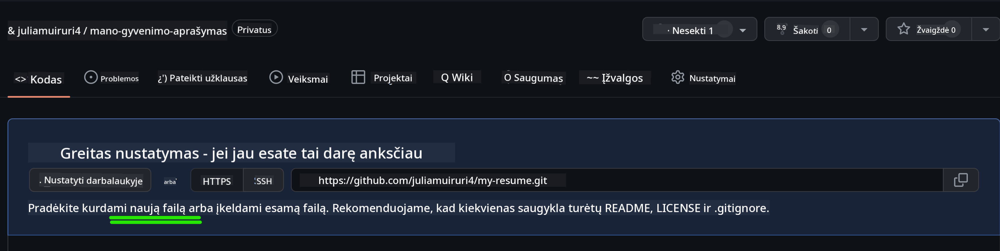
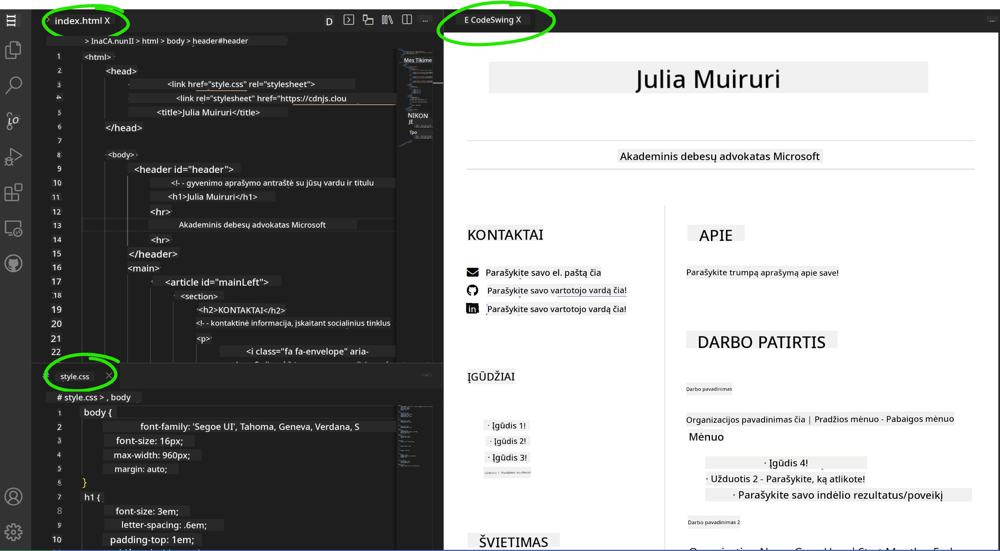

<!--
CO_OP_TRANSLATOR_METADATA:
{
  "original_hash": "2fcb983b8dbadadb1bc2e97f8c12dac5",
  "translation_date": "2025-08-28T11:55:53+00:00",
  "source_file": "8-code-editor/1-using-a-code-editor/assignment.md",
  "language_code": "lt"
}
-->
# Sukurkite gyvenimo aprašymo svetainę naudodami vscode.dev

_Kaip šaunu būtų, jei darbdavys paprašytų jūsų gyvenimo aprašymo, o jūs jam atsiųstumėte nuorodą?_ 😎

## Tikslai

Po šios užduoties jūs išmoksite:

- Sukurti svetainę, kurioje būtų pateiktas jūsų gyvenimo aprašymas

### Reikalavimai

1. GitHub paskyra. Eikite į [GitHub](https://github.com/) ir susikurkite paskyrą, jei dar neturite.

## Žingsniai

**1 žingsnis:** Sukurkite naują GitHub saugyklą ir pavadinkite ją `my-resume`.

**2 žingsnis:** Sukurkite `index.html` failą savo saugykloje. Pridėsime bent vieną failą tiesiogiai github.com, nes tuščios saugyklos negalima atidaryti vscode.dev.

Paspauskite nuorodą `creating a new file`, įveskite pavadinimą `index.html` ir pasirinkite mygtuką `Commit new file`.



**3 žingsnis:** Atidarykite [VSCode.dev](https://vscode.dev) ir pasirinkite mygtuką `Open Remote Repository`.

Nukopijuokite nuorodą į ką tik sukurtą saugyklą ir įklijuokite ją į įvesties laukelį:

_Pakeiskite `your-username` savo GitHub naudotojo vardu._

```
https://github.com/your-username/my-resume
```

✅ Jei viskas pavyko, pamatysite savo projektą ir `index.html` failą, atidarytą naršyklės teksto redaktoriuje.


**4 žingsnis:** Atidarykite `index.html` failą, įklijuokite žemiau pateiktą kodą į savo kodo sritį ir išsaugokite.

<details>
    <summary><b>HTML kodas, atsakingas už jūsų gyvenimo aprašymo svetainės turinį.</b></summary>
    
        <html>

            <head>
                <link href="style.css" rel="stylesheet">
                <link rel="stylesheet" href="https://cdnjs.cloudflare.com/ajax/libs/font-awesome/5.15.4/css/all.min.css">
                <title>Jūsų vardas čia!</title>
            </head>
            <body>
                <header id="header">
                    <!-- gyvenimo aprašymo antraštė su jūsų vardu ir pareigomis -->
                    <h1>Jūsų vardas čia!</h1>
                    <hr>
                    Jūsų pareigos!
                    <hr>
                </header>
                <main>
                    <article id="mainLeft">
                        <section>
                            <h2>KONTAKTAI</h2>
                            <!-- kontaktinė informacija, įskaitant socialinius tinklus -->
                            <p>
                                <i class="fa fa-envelope" aria-hidden="true"></i>
                                <a href="mailto:username@domain.top-level domain">Įrašykite savo el. paštą čia</a>
                            </p>
                            <p>
                                <i class="fab fa-github" aria-hidden="true"></i>
                                <a href="github.com/yourGitHubUsername">Įrašykite savo naudotojo vardą čia!</a>
                            </p>
                            <p>
                                <i class="fab fa-linkedin" aria-hidden="true"></i>
                                <a href="linkedin.com/yourLinkedInUsername">Įrašykite savo naudotojo vardą čia!</a>
                            </p>
                        </section>
                        <section>
                            <h2>ĮGŪDŽIAI</h2>
                            <!-- jūsų įgūdžiai -->
                            <ul>
                                <li>Įgūdis 1!</li>
                                <li>Įgūdis 2!</li>
                                <li>Įgūdis 3!</li>
                                <li>Įgūdis 4!</li>
                            </ul>
                        </section>
                        <section>
                            <h2>IŠSILAVINIMAS</h2>
                            <!-- jūsų išsilavinimas -->
                            <h3>Įrašykite savo studijų programą čia!</h3>
                            <p>
                                Įrašykite savo instituciją čia!
                            </p>
                            <p>
                                Pradžios - Pabaigos data
                            </p>
                        </section>            
                    </article>
                    <article id="mainRight">
                        <section>
                            <h2>APIE</h2>
                            <!-- apie jus -->
                            <p>Parašykite trumpą tekstą apie save!</p>
                        </section>
                        <section>
                            <h2>DARBINĖ PATIRTIS</h2>
                            <!-- jūsų darbinė patirtis -->
                            <h3>Pareigos</h3>
                            <p>
                                Organizacijos pavadinimas čia | Pradžios mėnuo – Pabaigos mėnuo
                            </p>
                            <ul>
                                    <li>Užduotis 1 - Parašykite, ką darėte!</li>
                                    <li>Užduotis 2 - Parašykite, ką darėte!</li>
                                    <li>Parašykite savo indėlio rezultatus/poveikį</li>
                                    
                            </ul>
                            <h3>Pareigos 2</h3>
                            <p>
                                Organizacijos pavadinimas čia | Pradžios mėnuo – Pabaigos mėnuo
                            </p>
                            <ul>
                                    <li>Užduotis 1 - Parašykite, ką darėte!</li>
                                    <li>Užduotis 2 - Parašykite, ką darėte!</li>
                                    <li>Parašykite savo indėlio rezultatus/poveikį</li>
                                    
                            </ul>
                        </section>
                    </article>
                </main>
            </body>
        </html>
</details>

Pakeiskite _vietos rezervavimo tekstą_ savo gyvenimo aprašymo informacija.

**5 žingsnis:** Užveskite pelės žymeklį ant My-Resume aplanko, spustelėkite `New File ...` piktogramą ir sukurkite 2 naujus failus savo projekte: `style.css` ir `codeswing.json`.

**6 žingsnis:** Atidarykite `style.css` failą, įklijuokite žemiau pateiktą kodą ir išsaugokite.

<details>
        <summary><b>CSS kodas, skirtas svetainės išdėstymui formatuoti.</b></summary>
            
            body {
                font-family: 'Segoe UI', Tahoma, Geneva, Verdana, sans-serif;
                font-size: 16px;
                max-width: 960px;
                margin: auto;
            }
            h1 {
                font-size: 3em;
                letter-spacing: .6em;
                padding-top: 1em;
                padding-bottom: 1em;
            }

            h2 {
                font-size: 1.5em;
                padding-bottom: 1em;
            }

            h3 {
                font-size: 1em;
                padding-bottom: 1em;
            }
            main { 
                display: grid;
                grid-template-columns: 40% 60%;
                margin-top: 3em;
            }
            header {
                text-align: center;
                margin: auto 2em;
            }

            section {
                margin: auto 1em 4em 2em;
            }

            i {
                margin-right: .5em;
            }

            p {
                margin: .2em auto
            }

            hr {
                border: none;
                background-color: lightgray;
                height: 1px;
            }

            h1, h2, h3 {
                font-weight: 100;
                margin-bottom: 0;
            }
            #mainLeft {
                border-right: 1px solid lightgray;
            }
            
</details>

**6 žingsnis:** Atidarykite `codeswing.json` failą, įklijuokite žemiau pateiktą kodą ir išsaugokite.

    {
    "scripts": [],
    "styles": []
    }

**7 žingsnis:** Įdiekite `Codeswing` plėtinį, kad galėtumėte peržiūrėti gyvenimo aprašymo svetainę kodo srityje.

Paspauskite _`Extensions`_ piktogramą veiklos juostoje ir įveskite Codeswing. Spustelėkite _mėlyną įdiegimo mygtuką_ išplėstoje veiklos juostoje arba naudokite įdiegimo mygtuką, kuris pasirodo kodo srityje, kai pasirenkate plėtinį. Iškart po plėtinio įdiegimo stebėkite, kaip jūsų projektas pasikeičia 😃


Štai ką pamatysite savo ekrane po plėtinio įdiegimo.



Jei esate patenkinti atliktais pakeitimais, užveskite pelės žymeklį ant `Changes` aplanko ir spustelėkite `+` mygtuką, kad įtrauktumėte pakeitimus.

Įveskite įsipareigojimo pranešimą _(projekto pakeitimų aprašymą)_ ir įsipareigokite pakeitimus spustelėdami `check`. Baigę darbą su projektu, pasirinkite viršutiniame kairiajame kampe esančią meniu piktogramą, kad grįžtumėte į saugyklą GitHub.

Sveikiname 🎉 Jūs ką tik sukūrėte savo gyvenimo aprašymo svetainę naudodami vscode.dev vos keliais žingsniais.

## 🚀 Iššūkis

Atidarykite nuotolinę saugyklą, kurioje turite leidimus atlikti pakeitimus, ir atnaujinkite kelis failus. Tada pabandykite sukurti naują šaką su savo pakeitimais ir pateikti „Pull Request“.

## Peržiūra ir savarankiškas mokymasis

Skaitykite daugiau apie [VSCode.dev](https://code.visualstudio.com/docs/editor/vscode-web?WT.mc_id=academic-0000-alfredodeza) ir kitas jo funkcijas.

---

**Atsakomybės apribojimas**:  
Šis dokumentas buvo išverstas naudojant AI vertimo paslaugą [Co-op Translator](https://github.com/Azure/co-op-translator). Nors siekiame tikslumo, prašome atkreipti dėmesį, kad automatiniai vertimai gali turėti klaidų ar netikslumų. Originalus dokumentas jo gimtąja kalba turėtų būti laikomas autoritetingu šaltiniu. Dėl svarbios informacijos rekomenduojama profesionali žmogaus vertimo paslauga. Mes neprisiimame atsakomybės už nesusipratimus ar klaidingus interpretavimus, atsiradusius naudojant šį vertimą.