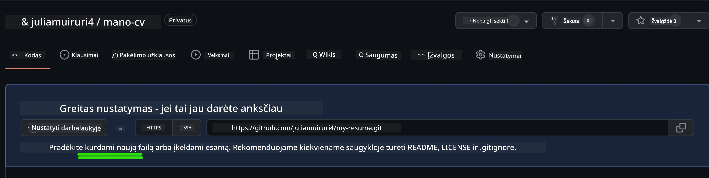
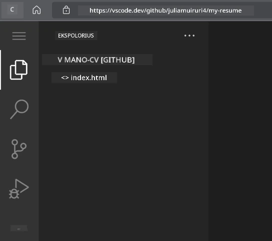
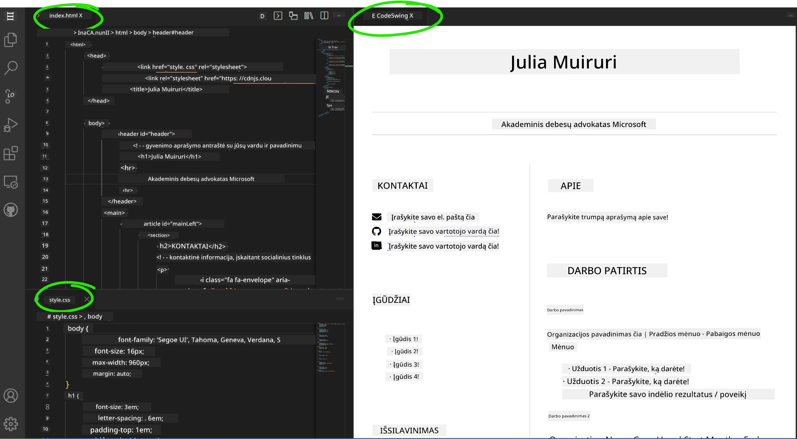

# Sukurkite gyvenimo aprašymo svetainę naudodami VSCode.dev

Patobulinkite savo karjeros galimybes kurdami profesionalią gyvenimo aprašymo svetainę, kuri interaktyviu ir šiuolaikišku formatu pristato jūsų įgūdžius ir patirtį. Vietoje tradicinių PDF dokumentų, įsivaizduokite, kad įdarbinimo specialistams pateikiate elegantišką, pritaikytą prie ekranų svetainę, kuri demonstruoja tiek jūsų kvalifikacijas, tiek jūsų svetainių kūrimo gebėjimus.

Ši praktinė užduotis leidžia pritaikyti visas jūsų VSCode.dev žinias, kuriant kažką iš tiesų naudingo jūsų karjerai. Patirsite visą interneto kūrimo procesą – nuo saugyklos sukūrimo iki paskelbimo – viską atlikdami naršyklėje.

Įgyvendinus šį projektą, turėsite profesionalią internetinę reprezentaciją, kurią lengva dalintis su potencialiais darbdaviais, atnaujinti gerėjant jūsų įgūdžiams ir pritaikyti pagal savo asmeninį prekės ženklą. Būtent tokie praktiniai projektai įrodo tikrus interneto kūrimo įgūdžius.

## Mokymosi tikslai

Užduočiai įvykdyti galėsite:

- **Sukurti** ir valdyti visišką interneto kūrimo projektą naudojant VSCode.dev
- **Suderinti** profesionalią svetainę naudojant semantinius HTML elementus
- **Stilizavimą** pritaikyti reaguojančioms išdėstymo schemoms su modernia CSS technika
- **Įgyvendinti** interaktyvias funkcijas naudojant pagrindines interneto technologijas
- **Paskelbti** gyvą svetainę, pasiekiamą per bendrinamą URL
- **Demonstruoti** versijų valdymo geriausius praktikavimus kūrimo proceso metu

## Prieš pradedant

Prieš pradėdami šią užduotį, įsitikinkite, kad turite:

- GitHub paskyrą (jei jos neturite, sukurkite adresu [github.com](https://github.com/))
- Įvykdytą VSCode.dev pamoką apie sąsajos naršymą ir pagrindines operacijas
- Pagrindines žinias apie HTML struktūrą ir CSS stilizavimo koncepcijas

## Projekto nustatymas ir saugyklos kūrimas

Pradėkime nuo jūsų projekto pagrindo sukūrimo. Šis procesas atitinka realaus pasaulio kūrimo srautus, kur projektai prasideda tinkamu saugyklos inicializavimu ir struktūros planavimu.

### 1 žingsnis: Sukurkite savo GitHub saugyklą

Atviros saugyklos sukūrimas garantuoja, kad jūsų projektas bus gerai organizuotas ir valdoma versijomis nuo pradžių.

1. **Eikite** į [GitHub.com](https://github.com) ir prisijunkite prie savo paskyros
2. **Paspauskite** žalią mygtuką "New" arba "+" piktogramą viršutiniame dešiniajame kampe
3. **Pavadinkite** savo saugyklą `my-resume` (arba pasirinkite asmeninį pavadinimą, pvz., `john-smith-resume`)
4. **Pridėkite** trumpą aprašymą: „Profesionali gyvenimo aprašymo svetainė sukurta naudojant HTML ir CSS“
5. **Pasirinkite** „Public“, kad jūsų gyvenimo aprašymas būtų prieinamas potencialiems darbdaviams
6. **Pažymėkite** „Add a README file“, kad sukurtumėte pradžią projektui
7. **Paspauskite** „Create repository“, kad baigtumėte nustatymą

> 💡 **Saugyklos pavadinimo patarimas**: Naudokite aprašomuosius, profesionalius pavadinimus, kurie aiškiai parodo projekto paskirtį. Tai padeda dalinatės darbdaviams arba peržiūrint portfolio.

### 2 žingsnis: Inicializuokite projekto struktūrą

Kadangi VSCode.dev reikalauja bent vieno failo, kad būtų galima atidaryti saugyklą, sukursime pagrindinį HTML failą tiesiogiai GitHub prieš pereidami į žiniatinklio redaktorių.

1. Saugyklos puslapyje **paspauskite** „creating a new file“ nuorodą
2. Įveskite pavadinimą `index.html`
3. Įdėkite šią pradinę HTML struktūrą:

```html
<!DOCTYPE html>
<html lang="en">
<head>
    <meta charset="UTF-8">
    <meta name="viewport" content="width=device-width, initial-scale=1.0">
    <title>Your Name - Professional Resume</title>
</head>
<body>
    <h1>Your Name</h1>
    <p>Professional Resume Website</p>
</body>
</html>
```

4. Parašykite įsipareigojimo žinutę: „Pridėti pradinę HTML struktūrą“
5. **Paspauskite** „Commit new file“, kad išsaugotumėte pakeitimus



**Šis pradinis nustatymas įgyvendina:**
- **Sukuria** tinkamą HTML5 dokumento struktūrą su semantiniais elementais
- **Įtraukia** viewport meta žymę reaguojančiam dizainui
- **Nustato** aprašantį puslapio pavadinimą, kuris rodomas naršyklės skirtukuose
- **Sukuria** pagrindą profesionaliam turinio organizavimui

## Darbas VSCode.dev aplinkoje

Dabar, kai jūsų saugyklos pagrindas yra parengtas, pereikime prie VSCode.dev pagrindiniam kūrimui. Šis internetinis redaktorius suteikia visas reikalingas priemones profesionaliam interneto kūrimui.

### 3 žingsnis: Atidarykite projektą VSCode.dev

1. Naujoje naršyklės kortelėje **eikite** į [vscode.dev](https://vscode.dev)
2. Pasveikinimo lange spustelėkite „Open Remote Repository“
3. Nukopijuokite savo saugyklos URL iš GitHub ir įklijuokite į įvesties laukelį

   Formatas: `https://github.com/jusu-vartotojo-vardas/my-resume`
   
   *Pakeiskite `jusu-vartotojo-vardas` savo tikru GitHub vartotojo vardu*

4. Paspauskite Enter, kad užkrautumėte projektą

✅ **Sėkmės indikatorius**: Jūs matysite savo projekto failus „Explorer“ šoninėje juostoje, o `index.html` bus atidarytas redagavimui pagrindinėje redaktoriaus srityje.



**Sąsajoje matysite:**
- **Explorer šoninę juostą**: rodo jūsų saugyklos failus ir aplankų struktūrą
- **Redaktoriaus sritį**: rodo pasirinkto failo turinį redagavimui
- **Veiklos juostą**: suteikia prieigą prie funkcijų, tokių kaip Source Control ir Extensions
- **Statuso juostą**: rodo prisijungimo būklę ir esamos šakos informaciją

### 4 žingsnis: Sukurkite savo gyvenimo aprašymo turinį

Pakeiskite laikinojo turinio tekstus faile `index.html` visaapimančia gyvenimo aprašymo struktūra. Šis HTML sudarys profesionalios kvalifikacijų demonstravimo pagrindą.

<details>
<summary><b>Visas HTML gyvenimo aprašymo struktūros pavyzdys</b></summary>

```html
<!DOCTYPE html>
<html lang="en">
<head>
    <meta charset="UTF-8">
    <meta name="viewport" content="width=device-width, initial-scale=1.0">
    <link href="style.css" rel="stylesheet">
    <link rel="stylesheet" href="https://cdnjs.cloudflare.com/ajax/libs/font-awesome/5.15.4/css/all.min.css">
    <title>Your Name - Professional Resume</title>
</head>
<body>
    <header id="header">
        <h1>Your Full Name</h1>
        <hr>
        <p class="role">Your Professional Title</p>
        <hr>
    </header>
    
    <main>
        <article id="mainLeft">
            <section>
                <h2>CONTACT</h2>
                <p>
                    <i class="fa fa-envelope" aria-hidden="true"></i>
                    <a href="mailto:your.email@domain.com">your.email@domain.com</a>
                </p>
                <p>
                    <i class="fab fa-github" aria-hidden="true"></i>
                    <a href="https://github.com/your-username">github.com/your-username</a>
                </p>
                <p>
                    <i class="fab fa-linkedin" aria-hidden="true"></i>
                    <a href="https://linkedin.com/in/your-profile">linkedin.com/in/your-profile</a>
                </p>
            </section>
            
            <section>
                <h2>SKILLS</h2>
                <ul>
                    <li>HTML5 & CSS3</li>
                    <li>JavaScript (ES6+)</li>
                    <li>Responsive Web Design</li>
                    <li>Version Control (Git)</li>
                    <li>Problem Solving</li>
                </ul>
            </section>
            
            <section>
                <h2>EDUCATION</h2>
                <h3>Your Degree or Certification</h3>
                <p>Institution Name</p>
                <p>Start Date - End Date</p>
            </section>
        </article>
        
        <article id="mainRight">
            <section>
                <h2>ABOUT</h2>
                <p>Write a compelling summary that highlights your passion for web development, key achievements, and career goals. This section should give employers insight into your personality and professional approach.</p>
            </section>
            
            <section>
                <h2>WORK EXPERIENCE</h2>
                <div class="job">
                    <h3>Job Title</h3>
                    <p class="company">Company Name | Start Date – End Date</p>
                    <ul>
                        <li>Describe a key accomplishment or responsibility</li>
                        <li>Highlight specific skills or technologies used</li>
                        <li>Quantify impact where possible (e.g., "Improved efficiency by 25%")</li>
                    </ul>
                </div>
                
                <div class="job">
                    <h3>Previous Job Title</h3>
                    <p class="company">Previous Company | Start Date – End Date</p>
                    <ul>
                        <li>Focus on transferable skills and achievements</li>
                        <li>Demonstrate growth and learning progression</li>
                        <li>Include any leadership or collaboration experiences</li>
                    </ul>
                </div>
            </section>
            
            <section>
                <h2>PROJECTS</h2>
                <div class="project">
                    <h3>Project Name</h3>
                    <p>Brief description of what the project accomplishes and technologies used.</p>
                    <a href="#" target="_blank">View Project</a>
                </div>
            </section>
        </article>
    </main>
</body>
</html>
```
</details>

**Pritaikymo gairės:**
- Pakeiskite visą laikino teksto turinį tikrais savo duomenimis
- Pritaikykite skyrius pagal savo patirties lygį ir karjeros kryptį
- Pridėkite arba pašalinkite skyrius pagal poreikį (pvz., sertifikatus, savanorišką veiklą, kalbas)
- Įtraukite nuorodas į tikrus savo profilius ir projektus

### 5 žingsnis: Sukurkite papildomus failus

Profesionaliai sutvarkytai svetainei reikalinga organizuota failų struktūra. Sukurkite CSS stiliaus ir konfigūracijos failus, reikalingus pilnam projektui.

1. Užveskite žymeklį ant projekto aplanko pavadinimo „Explorer“ šoninėje juostoje
2. Spustelėkite pasirodžiusią „New File“ piktogramą (📄+)
3. Sukurkite šiuos failus po vieną:
   - `style.css` (stilizavimo ir išdėstymo failas)
   - `codeswing.json` (plėtinio peržiūros konfigūracija)

**CSS failo (`style.css`) kūrimas:**

<details>
<summary><b>Profesionalus CSS stilizavimas</b></summary>

```css
/* Modern Resume Styling */
body {
    font-family: 'Segoe UI', Tahoma, Geneva, Verdana, sans-serif;
    font-size: 16px;
    line-height: 1.6;
    max-width: 960px;
    margin: 0 auto;
    padding: 20px;
    color: #333;
    background-color: #f9f9f9;
}

/* Header Styling */
header {
    text-align: center;
    margin-bottom: 3em;
    padding: 2em;
    background: linear-gradient(135deg, #667eea 0%, #764ba2 100%);
    color: white;
    border-radius: 10px;
    box-shadow: 0 4px 6px rgba(0, 0, 0, 0.1);
}

h1 {
    font-size: 3em;
    letter-spacing: 0.1em;
    margin-bottom: 0.2em;
    font-weight: 300;
}

.role {
    font-size: 1.3em;
    font-weight: 300;
    margin: 1em 0;
}

/* Main Content Layout */
main {
    display: grid;
    grid-template-columns: 35% 65%;
    gap: 3em;
    margin-top: 3em;
    background: white;
    padding: 2em;
    border-radius: 10px;
    box-shadow: 0 2px 10px rgba(0, 0, 0, 0.1);
}

/* Typography */
h2 {
    font-size: 1.4em;
    font-weight: 600;
    margin-bottom: 1em;
    color: #667eea;
    border-bottom: 2px solid #667eea;
    padding-bottom: 0.3em;
}

h3 {
    font-size: 1.1em;
    font-weight: 600;
    margin-bottom: 0.5em;
    color: #444;
}

/* Section Styling */
section {
    margin-bottom: 2.5em;
}

#mainLeft {
    border-right: 1px solid #e0e0e0;
    padding-right: 2em;
}

/* Contact Links */
section a {
    color: #667eea;
    text-decoration: none;
    transition: color 0.3s ease;
}

section a:hover {
    color: #764ba2;
    text-decoration: underline;
}

/* Icons */
i {
    margin-right: 0.8em;
    width: 20px;
    text-align: center;
    color: #667eea;
}

/* Lists */
ul {
    list-style: none;
    padding-left: 0;
}

li {
    margin: 0.5em 0;
    padding: 0.3em 0;
    position: relative;
}

li:before {
    content: "▸";
    color: #667eea;
    margin-right: 0.5em;
}

/* Work Experience */
.job, .project {
    margin-bottom: 2em;
    padding-bottom: 1.5em;
    border-bottom: 1px solid #f0f0f0;
}

.company {
    font-style: italic;
    color: #666;
    margin-bottom: 0.5em;
}

/* Responsive Design */
@media (max-width: 768px) {
    main {
        grid-template-columns: 1fr;
        gap: 2em;
    }
    
    #mainLeft {
        border-right: none;
        border-bottom: 1px solid #e0e0e0;
        padding-right: 0;
        padding-bottom: 2em;
    }
    
    h1 {
        font-size: 2.2em;
    }
    
    body {
        padding: 10px;
    }
}

/* Print Styles */
@media print {
    body {
        background: white;
        color: black;
        font-size: 12pt;
    }
    
    header {
        background: none;
        color: black;
        box-shadow: none;
    }
    
    main {
        box-shadow: none;
    }
}
```
</details>

**Konfigūracijos failo (`codeswing.json`) kūrimas:**

```json
{
    "scripts": [],
    "styles": []
}
```


**CSS ypatumai:**
- Naudoja CSS Grid reaguojančiai, profesionaliai išdėstymo struktūrai
- Įgyvendina modernias spalvų schemas su gradientiniu antraštės fonu
- Įtraukia pakėlimo (hover) efektus ir sklandžius perėjimus interaktyvumui
- Užtikrina pritaikymą visų dydžių ekranams
- Prideda spaudai draugiškas stiliaus taisykles PDF generavimui

### 6 žingsnis: Įdiekite ir sukonfigūruokite plėtinius

Plėtiniai pagerina jūsų kūrimo patirtį suteikdami gyvos peržiūros galimybes ir patogesnes darbo eigos priemones. CodeSwing plėtinys ypač naudingas interneto kūrimo projektams.

**CodeSwing plėtinio įdiegimas:**

1. Spustelėkite veiklos juostos piktogramą „Extensions“ (🧩)
2. Paieškos laukelyje įveskite „CodeSwing“
3. Pasirinkite „CodeSwing“ plėtinį iš rezultatų sąrašo
4. Spustelėkite mėlyną „Install“ mygtuką


**CodeSwing suteikia:**
- Leidžia realiu laiku peržiūrėti svetainę redagavimo metu
- Rodo pakeitimus nedarant rankinių atnaujinimų
- Palaiko kelis failų tipus, įskaitant HTML, CSS ir JavaScript
- Suteikia integruotą kūrimo aplinkos patirtį

**Tiesioginiai rezultatai po įdiegimo:**
Įdiegus CodeSwing, redaktoriuje pasirodys gyvos peržiūros langas su jūsų gyvenimo aprašymo svetaine. Galėsite matyti, kaip atrodo svetainė redaguojant turinį.



**Patobulintos sąsajos funkcijos:**
- Atskiras vaizdas: rodo kodą vienoje pusėje ir gyvą peržiūrą kitoje
- Realio laiko atnaujinimai: atspindi pakeitimus nedelsiant rašant
- Interaktyvi peržiūra: leidžia testuoti nuorodas ir sąveikas
- Mobiliojo įrenginio simuliacija: leidžia patikrinti adaptyvų dizainą

### 7 žingsnis: Versijų valdymas ir skelbimas

Dabar, kai jūsų gyvenimo aprašymo svetainė yra paruošta, naudokite Git, kad išsaugotumėte savo darbą ir padarytumėte jį prieinamą internete.

**Atlikdami pakeitimus commit:**

1. Spustelėkite „Source Control“ piktogramą (🌿) veiklos juostoje
2. Peržiūrėkite visus sukurtus ir pakeistus failus „Changes“ skiltyje
3. Pridėkite pakeitimus į stagingą, spustelėdami „+“ šalia kiekvieno failo
4. Parašykite aprašomąją commit žinutę, pvz.:
   - „Pridėta pilna gyvenimo aprašymo svetainė su pritaikymu ekranams“
   - „Įgyvendintas profesionalus stilizavimas ir turinio struktūra“
5. Spustelėkite varnelės ženklą (✓), kad commituotumėte ir pushintumėte pakeitimus

**Efektyvių commit žinučių pavyzdžiai:**
- „Pridėtas profesionalus gyvenimo aprašymo turinys ir stilizavimas“
- „Įgyvendintas pritaikymas mobiliesiems įrenginiams“
- „Atnaujinta kontaktinė informacija ir projektų nuorodos“

> 💡 **Profesionalus patarimas**: Geros commit žinutės padeda sekti projekto raidą ir demonstruoja dėmesį detalėms – savybę, kurią vertina darbdaviai.

**Prieiga prie paskelbtos svetainės:**
Po commit galite grįžti į savo GitHub saugyklą naudodami viršutiniame kairiajame kampe esantį hamburgerio meniu (☰). Jūsų gyvenimo aprašymo svetainė dabar yra versijomis valdoma ir pasiruošusi skelbimui ar bendrinimui.

## Rezultatai ir tolesni veiksmai

**Sveikiname! 🎉** Jūs sėkmingai sukūrėte profesionalią gyvenimo aprašymo svetainę naudojant VSCode.dev. Jūsų projektas demonstruoja:

**Techninius įgūdžius:**
- **Saugyklos valdymas**: sukūrėte ir organizavote pilną projekto struktūrą
- **Internetinių svetainių kūrimas**: sukūrėte reaguojančią svetainę su moderniu HTML5 ir CSS3
- **Versijų valdymas**: įgyvendinote tinkamą Git darbo eigą su prasmingais commit’ais
- **Įrankių įgūdžiai**: efektyviai naudojote VSCode.dev sąsają ir plėtinius

**Profesionalūs pasiekimai:**
- **Interneto reprezentacija**: bendrinamas URL, kuris pristato jūsų kvalifikacijas
- **Šiuolaikinis formatas**: interaktyvi alternatyva tradiciniams PDF gyvenimo aprašymams
- **Įgūdžių demonstravimas**: konkretūs įrodymai apie jūsų interneto kūrimo gebėjimus
- **Lengvi atnaujinimai**: pagrindas, kurį nuolat tobulinsite ir pritaikysite

### Paskelbimo galimybės

Norėdami padaryti savo gyvenimo aprašymą pasiekiamą darbdaviams, apsvarstykite šias talpinimo galimybes:

**GitHub Pages (Rekomenduojama):**
1. Eikite į savo saugyklos „Settings“ GitHub
2. Slinkite iki „Pages“ skilties
3. Pasirinkite „Deploy from a branch“ ir nurodykite „main“ šaką
4. Jūsų svetainė bus pasiekiama adresu `https://your-username.github.io/my-resume`

**Alternatyvios platformos:**
- **Netlify**: automatinis paskelbimas su pasirinktinais domenais
- **Vercel**: greitas paskelbimas su moderniomis hostingo funkcijomis
- **GitHub Codespaces**: kūrimo aplinka su integruota peržiūra

### Tobulinimo pasiūlymai

Toliau tobulinkite savo įgūdžius pridedant šias funkcijas:

**Techniniai patobulinimai:**
- **JavaScript interaktyvumas**: pridėkite sklandų slinkimą arba interaktyvius elementus
- **Tamsaus/šviesaus režimo perjungimas**: įgyvendinkite temų keitimą pagal vartotojo pageidavimus
- **Kontaktų forma**: suteikite galimybę tiesiogiai susisiekti su potencialiais darbdaviais
- **SEO optimizavimas**: pridėkite meta žymas ir struktūrizuotus duomenis geresniam matomumui

**Turinio patobulinimai:**
- **Projektų portfelis**: įtraukite nuorodas į GitHub saugyklas ir gyvus demonstravimus
- **Įgūdžių vizualizacija**: kurkite pažangos juostas ar reitingavimo sistemas
- **Rekomendacijų skyrius**: pridėkite kolegų ar mokytojų atsiliepimus
- **Blogo integravimas**: pridėkite tinklaraščio skyrių, kuriame dalinatės mokymosi kelione

## GitHub Copilot agento iššūkis 🚀

Naudodami agento režimą įvykdykite šį iššūkį:

**Aprašymas:** Praplėskite savo gyvenimo aprašymo svetainę pažangiomis funkcijomis, kurios demonstruoja profesionalius interneto kūrimo gebėjimus ir modernias dizaino principus.

**Užduotis:** Remiantis esama gyvenimo aprašymo svetaine, įgyvendinkite šias pažangias funkcijas:
1. Pridėkite tamsiojo/šviesiojo režimo jungiklį su sklandžiais perėjimais
2. Sukurkite interaktyvų įgūdžių skyrių su animuotomis pažangos juostomis
3. Įgyvendinkite kontaktų formą su formos tikrinimu
4. Pridėkite projektų portfelio skyrių su pakėlimo efektais ir modaliniais langais
5. Įtraukite blogo skyrių su bent 3 pavyzdiniais įrašais apie savo mokymosi kelionę
6. Optimizuokite SEO su tinkamomis meta žymomis, struktūrizuotais duomenimis ir našumu
7. Paskelbkite patobulintą svetainę naudojant GitHub Pages arba Netlify
8. Dokumentuokite visas naujas funkcijas savo README.md faile su ekrano kopijomis

Jūsų patobulinta svetainė turėtų parodyti šiuolaikinių interneto kūrimo praktikų meistriškumą, įskaitant reaguojantį dizainą, JavaScript interaktyvumą ir profesionalias paskelbimo darbo eigas.

## Iššūkio pratęsimas

Norite dar labiau tobulinti savo įgūdžius? Išbandykite šiuos pažangius iššūkius:

**📱 Mobiliesiems pritaikytas iš naujo dizainas:** Nauju būdu sukurkite savo svetainę naudodami mobiliųjų pirmumo metodiką su CSS Grid ir Flexbox

**🔍 SEO optimizavimas:** Įgyvendinkite išsamų SEO, įskaitant meta žymas, struktūrizuotus duomenis ir našumo optimizavimą

**🌐 Daugiakalbystės palaikymas:** Pridėkite tarptautiškumo funkcijas kelioms kalboms palaikyti

**📊 Analitikos integracija:** Įdiekite Google Analytics lankytojų įsitraukimo stebėjimui ir turinio optimizavimui

**🚀 Našumo optimizavimas:** Pasiekite maksimalų Lighthouse balų įvertinimą visuose kategorijose

## Peržiūra ir savarankiškas mokymasis

Išplėskite savo žinias naudodami šiuos išteklius:

**Pažangios VSCode.dev funkcijos:**
- [VSCode.dev dokumentacija](https://code.visualstudio.com/docs/editor/vscode-web?WT.mc_id=academic-0000-alfredodeza) – pilnas internetinio redagavimo vadovas
- [GitHub Codespaces](https://docs.github.com/en/codespaces) – debesų kūrimo aplinkos

**Internetinių svetainių kūrimo geriausios praktikos:**
- **Reaguojantis dizainas**: mokykitės CSS Grid ir Flexbox moderniems išdėstymams
- **Prieinamumas**: Sužinokite WCAG gaires įtraukiančiam žiniatinklio dizainui
- **Veikimas**: Išnagrinėkite tokius įrankius kaip Lighthouse optimizavimui
- **SEO**: Supraskite paieškos sistemų optimizavimo pagrindus

**Profesinis tobulėjimas:**
- **Portfolio kūrimas**: Sukurkite papildomus projektus, kad parodytumėte įvairius įgūdžius
- **Atvirojo kodo projektai**: Prisidėkite prie esamų projektų, kad įgytumėte bendradarbiavimo patirties
- **Tinklaveika**: Dalinkitės savo CV svetaine kūrėjų bendruomenėse, kad gautumėte atsiliepimų
- **Nuolatinis mokymasis**: Sekite web vystymo tendencijas ir technologijas

---

**Jūsų Kiti Žingsniai:** Pasidalykite savo CV svetaine su draugais, šeima ar mentoriais, kad gautumėte atsiliepimų. Naudokite jų pasiūlymus, kad tobulintumėte savo dizainą. Atminkite, šis projektas nėra tiesiog CV – tai jūsų kaip web kūrėjo augimo demonstracija!

---

<!-- CO-OP TRANSLATOR DISCLAIMER START -->
**Atsakomybės apribojimas**:  
Šis dokumentas buvo išverstas naudojant dirbtinio intelekto vertimo paslaugą [Co-op Translator](https://github.com/Azure/co-op-translator). Nors stengiamės užtikrinti tikslumą, prašome atkreipti dėmesį, kad automatiniai vertimai gali turėti klaidų arba netikslumų. Pradinė dokumento versija gimtąja kalba turi būti laikoma autoritetingu šaltiniu. Svarbiai informacijai rekomenduojama naudotis profesionalaus vertėjo paslaugomis. Mes neprisiimame atsakomybės už bet kokius nesusipratimus ar neteisingus aiškinimus, kilusius dėl šio vertimo naudojimo.
<!-- CO-OP TRANSLATOR DISCLAIMER END -->