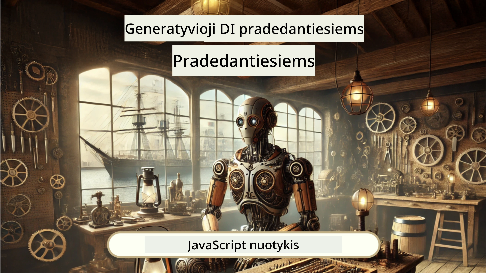
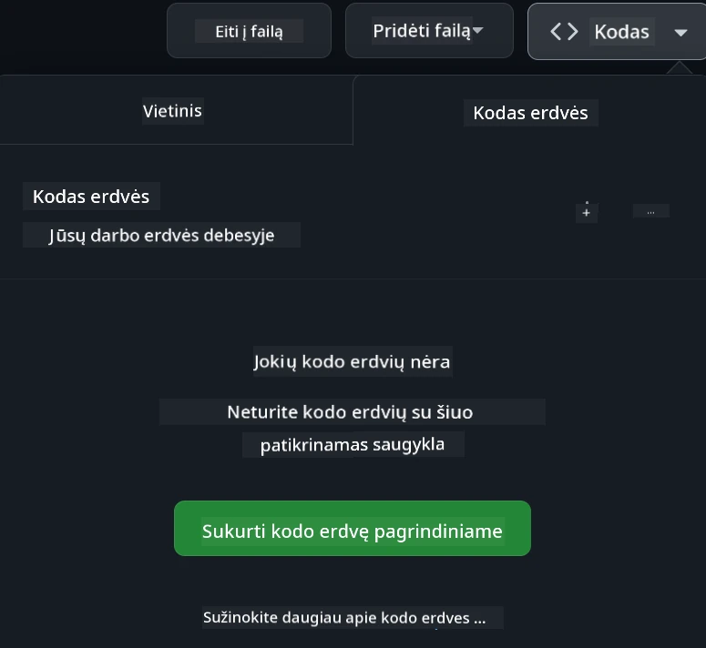

<!--
CO_OP_TRANSLATOR_METADATA:
{
  "original_hash": "fea3a0fceb8ad86fd640c09cf63a2aac",
  "translation_date": "2026-01-07T10:53:17+00:00",
  "source_file": "README.md",
  "language_code": "lt"
}
-->
[](https://github.com/microsoft/Web-Dev-For-Beginners/blob/master/LICENSE)
[](https://GitHub.com/microsoft/Web-Dev-For-Beginners/graphs/contributors/)
[](https://GitHub.com/microsoft/Web-Dev-For-Beginners/issues/)
[](https://GitHub.com/microsoft/Web-Dev-For-Beginners/pulls/)
[](http://makeapullrequest.com)

[](https://GitHub.com/microsoft/Web-Dev-For-Beginners/watchers/)
[](https://GitHub.com/microsoft/Web-Dev-For-Beginners/network/)
[](https://GitHub.com/microsoft/Web-Dev-For-Beginners/stargazers/)

[](https://discord.gg/nTYy5BXMWG)

# Interneto svetainių kūrimas pradedantiesiems – Mokymo programa

Išmokite interneto svetainių kūrimo pagrindus su mūsų 12 savaičių išsamia programa, parengta „Microsoft Cloud Advocates“. Kiekviena iš 24 pamokų nagrinėja JavaScript, CSS ir HTML per praktinius projektus, tokius kaip terariumai, naršyklių plėtiniai ir kosmoso žaidimai. Dalyvaukite viktorinose, diskusijose ir praktinėse užduotyse. Tobulinkite savo įgūdžius ir optimizuokite žinių įsisavinimą su mūsų efektyvia mokymo projektu pagrįsta pedagogika. Pradėkite kodavimo kelionę jau šiandien!

Prisijunkite prie „Azure AI Foundry“ Discord bendruomenės

[](https://discord.gg/nTYy5BXMWG)

Norėdami pradėti naudotis šiomis priemonėmis, atlikite šiuos veiksmus:
1. **Padarykite šaką (Fork) iš saugyklos**: Spustelėkite [](https://GitHub.com/microsoft/Web-Dev-For-Beginners/fork)
2. **Klonuokite saugyklą**: `git clone https://github.com/microsoft/Web-Dev-For-Beginners.git`
3. [**Prisijunkite prie Azure AI Foundry Discord ir susipažinkite su ekspertais bei kitais kūrėjais**](https://discord.com/invite/ByRwuEEgH4)

### 🌐 Daugiakalbė palaikymas

#### Palaikoma per GitHub Action (Automatizuota ir visada atnaujinta)

<!-- CO-OP TRANSLATOR LANGUAGES TABLE START -->
[Arabic](../ar/README.md) | [Bengali](../bn/README.md) | [Bulgarian](../bg/README.md) | [Burmese (Myanmar)](../my/README.md) | [Chinese (Simplified)](../zh/README.md) | [Chinese (Traditional, Hong Kong)](../hk/README.md) | [Chinese (Traditional, Macau)](../mo/README.md) | [Chinese (Traditional, Taiwan)](../tw/README.md) | [Croatian](../hr/README.md) | [Czech](../cs/README.md) | [Danish](../da/README.md) | [Dutch](../nl/README.md) | [Estonian](../et/README.md) | [Finnish](../fi/README.md) | [French](../fr/README.md) | [German](../de/README.md) | [Greek](../el/README.md) | [Hebrew](../he/README.md) | [Hindi](../hi/README.md) | [Hungarian](../hu/README.md) | [Indonesian](../id/README.md) | [Italian](../it/README.md) | [Japanese](../ja/README.md) | [Kannada](../kn/README.md) | [Korean](../ko/README.md) | [Lithuanian](./README.md) | [Malay](../ms/README.md) | [Malayalam](../ml/README.md) | [Marathi](../mr/README.md) | [Nepali](../ne/README.md) | [Nigerian Pidgin](../pcm/README.md) | [Norwegian](../no/README.md) | [Persian (Farsi)](../fa/README.md) | [Polish](../pl/README.md) | [Portuguese (Brazil)](../br/README.md) | [Portuguese (Portugal)](../pt/README.md) | [Punjabi (Gurmukhi)](../pa/README.md) | [Romanian](../ro/README.md) | [Russian](../ru/README.md) | [Serbian (Cyrillic)](../sr/README.md) | [Slovak](../sk/README.md) | [Slovenian](../sl/README.md) | [Spanish](../es/README.md) | [Swahili](../sw/README.md) | [Swedish](../sv/README.md) | [Tagalog (Filipino)](../tl/README.md) | [Tamil](../ta/README.md) | [Telugu](../te/README.md) | [Thai](../th/README.md) | [Turkish](../tr/README.md) | [Ukrainian](../uk/README.md) | [Urdu](../ur/README.md) | [Vietnamese](../vi/README.md)

> **Norite klonuoti vietoje?**

> Šioje saugykloje yra daugiau nei 50 kalbų vertimų, kurie reikšmingai padidina atsisiuntimo dydį. Norėdami klonuoti be vertimų, naudokite ribotą patikrinimą (sparse checkout):
> ```bash
> git clone --filter=blob:none --sparse https://github.com/microsoft/Web-Dev-For-Beginners.git
> cd Web-Dev-For-Beginners
> git sparse-checkout set --no-cone '/*' '!translations' '!translated_images'
> ```
> Tai suteiks jums viską, ko reikia kursui baigti, tačiau atsisiuntimas bus daug greitesnis.
<!-- CO-OP TRANSLATOR LANGUAGES TABLE END -->

**Jei norite, kad būtų palaikomos papildomos vertimo kalbos, jas rasite [čia](https://github.com/Azure/co-op-translator/blob/main/getting_started/supported-languages.md)**

[](https://open.vscode.dev/microsoft/Web-Dev-For-Beginners)

#### 🧑‍🎓 _Ar esi studentas?_

Aplankykite [**Studentų centrą**](https://docs.microsoft.com/learn/student-hub/?WT.mc_id=academic-77807-sagibbon), kuriame rasite pradedančiųjų išteklių, studentų paketus bei net galimybes gauti nemokamą sertifikato čekį. Tai puslapis, kurį verta išsaugoti žymių juostoje ir kartais patikrinti, nes mes kas mėnesį atnaujiname turinį.

### 📣 Pranešimas – Nauji „GitHub Copilot Agent“ režimo iššūkiai!

Įdėtas naujas iššūkis, ieškokite „GitHub Copilot Agent Challenge 🚀“ daugelyje skyrių. Tai naujas iššūkis, skirtas atlikti naudojant „GitHub Copilot“ ir Agent režimą. Jei dar nesate naudojęsi Agent režimu, jis gali ne tik generuoti tekstą, bet ir kurti bei redaguoti failus, vykdyti komandas ir dar daugiau.

### 📣 Pranešimas – _Naujas projektas, kuriam sukurti naudoti generatyvinės dirbtinis intelektas_

Pridėtas naujas AI Asistento projektas, peržiūrėkite jį [čia](./9-chat-project/README.md)

### 📣 Pranešimas – _Nauja mokymo programa_ Generatyvinės DI JavaScript

Nepraleiskite mūsų naujos Generatyvinės DI mokymo programos!

Aplankykite [https://aka.ms/genai-js-course](https://aka.ms/genai-js-course) pradėti!



- Pamokos apimančios viską nuo pagrindų iki RAG.
- Bendravimas su istorijų veikėjais naudojant GenAI ir mūsų companion programėlę.
- Įdomi ir įtraukianti istorija – keliausite laiku!


Kiekviena pamoka apima užduotį atlikti, žinių patikrinimą ir iššūkį, kurie padeda mokytis tokių temų kaip:
- Užklausų kūrimas ir užklausų inžinerija
- Teksto ir vaizdų programų generavimas
- Paieškos programos

Aplankykite [https://aka.ms/genai-js-course](../../[https:/aka.ms/genai-js-course) pradėti!


## 🌱 Pradžia

> **Mokytojai**, mes pateikėme [kelias rekomendacijas](for-teachers.md), kaip naudotis šia mokymo programa. Labai laukiame jūsų atsiliepimų [mūsų diskusijų forume](https://github.com/microsoft/Web-Dev-For-Beginners/discussions/categories/teacher-corner)!

**[Mokiniai](https://aka.ms/student-page/?WT.mc_id=academic-77807-sagibbon)**, kiekvienai pamokai pradėkite nuo priešpaskaitinės viktorinos, perskaitykite paskaitos medžiagą, atlikite įvairias veiklas ir patikrinkite supratimą atlikdami paskaitos pabaigos viktoriną.

Norėdami pagerinti mokymosi patirtį, susiburti kartu dirbti prie projektų su bendramoksliais! Diskutuokite mūsų [diskusijų forume](https://github.com/microsoft/Web-Dev-For-Beginners/discussions), kur mūsų moderatorių komanda bus pasirengusi atsakyti į jūsų klausimus.

Siekiant dar geriau mokytis, rekomenduojame tyrinėti [Microsoft Learn](https://learn.microsoft.com/users/wirelesslife/collections/p1ddcy5jwy0jkm?WT.mc_id=academic-77807-sagibbon) papildomoms studijų medžiagoms.

### 📋 Aplinkos paruošimas

Ši programa jau paruošta su vystymo aplinka! Pradėdami galite pasirinkti vykdyti programą [Codespace](https://github.com/features/codespaces/) aplinkoje (_naršyklėje, nereikia diegti_) arba vietoje, savo kompiuteryje naudodami teksto redaktorių, pvz., [Visual Studio Code](https://code.visualstudio.com/?WT.mc_id=academic-77807-sagibbon).

#### Sukurkite savo saugyklą
Kad galėtumėte lengvai saugoti savo darbą, rekomenduojame sukurti savo šios saugyklos kopiją. Tai galite padaryti spustelėję mygtuką **Naudoti šabloną** (Use this template) viršuje. Tai sukurs naują saugyklą jūsų GitHub paskyroje su šios mokymo medžiagos kopija.

Atlikite šiuos veiksmus:
1. **Padarykite šaką (Fork) iš saugyklos**: paspauskite mygtuką „Fork“ viršutiniame dešiniajame puslapio kampe.
2. **Klono kopija**: `git clone https://github.com/microsoft/Web-Dev-For-Beginners.git`

#### Programa Codespace aplinkoje

Jūsų sukurtos šios saugyklos kopijos lange, spustelėkite mygtuką **Code** ir pasirinkite **Open with Codespaces**. Tai sukurs naują Codespace aplinką darbui.



#### Programa vietoje, jūsų kompiuteryje

Norint paleisti šią programą savo kompiuteryje, jums reikės teksto redaktoriaus, naršyklės ir komandų eilutės įrankio. Mūsų pirmoji pamoka, [Programavimo kalbų ir darbui reikalingų įrankių įvadas](../../1-getting-started-lessons/1-intro-to-programming-languages), supažindins su keliomis galimybėmis kiekvienam įrankiui, kad galėtumėte pasirinkti tinkamiausią.

Rekomenduojame naudoti [Visual Studio Code](https://code.visualstudio.com/?WT.mc_id=academic-77807-sagibbon) kaip redaktorių, kuris taip pat turi integruotą [terminą](https://code.visualstudio.com/docs/terminal/basics/?WT.mc_id=academic-77807-sagibbon). Visual Studio Code galite atsisiųsti [čia](https://code.visualstudio.com/?WT.mc_id=academic-77807-sagibbon).


1. Klonuokite savo saugyklą į kompiuterį. Tai galite padaryti paspausdami mygtuką **Code** ir nukopijuodami URL:

    [CodeSpace](./images/createcodespace.png)
Tada atidarykite [Terminalą](https://code.visualstudio.com/docs/terminal/basics/?WT.mc_id=academic-77807-sagibbon) [Visual Studio Code](https://code.visualstudio.com/?WT.mc_id=academic-77807-sagibbon) aplinkoje ir paleiskite šią komandą, pakeisdami `<your-repository-url>` URL, kurį ką tik nukopijavote:

    ```bash 
    git clone <your-repository-url>
    ```

2. Atidarykite aplanką Visual Studio Code. Tai galite padaryti spustelėję **File** > **Open Folder** ir pasirinkę ką tik nuklonuotą aplanką.


> Rekomenduojami Visual Studio Code plėtiniai:
>
> * [Live Server](https://marketplace.visualstudio.com/items?itemName=ritwickdey.LiveServer&WT.mc_id=academic-77807-sagibbon) - HTML puslapių peržiūrai Visual Studio Code aplinkoje
> * [Copilot](https://marketplace.visualstudio.com/items?itemName=GitHub.copilot&WT.mc_id=academic-77807-sagibbon) - padėti rašyti kodą greičiau

## 📂 Kiekviename pamokoje yra:

- pasirenkama eskizų pastaba
- pasirenkamas papildomas vaizdo įrašas
- priešpamokos įžanginis testas
- rašytinė pamoka
- projektinėse pamokose pateiktos nuoseklios gairės, kaip sukurti projektą
- žinių patikrinimai
- iššūkis
- papildoma literatūra
- užduotis
- [po pamokos testas](https://ff-quizzes.netlify.app/web/)

> **Pastaba apie testus**: Visi testai yra `Quiz-app` aplanke, iš viso 48 testai po tris klausimus kiekviename. Jie prieinami [čia](https://ff-quizzes.netlify.app/web/); testų programėlė gali būti paleista lokaliai arba iškelta į Azure; vadovaukitės nurodymais `quiz-app` aplanke.

## 🗃️ Pamokos

|     |                       Projekto pavadinimas                       |                            Mokomi konceptai                             | Mokymosi tikslai                                                                                                                 |                                                         Susieta pamoka                                                          |         Autorius          |
| :-: | :--------------------------------------------------------------: | :--------------------------------------------------------------------: | -------------------------------------------------------------------------------------------------------------------------------- | :----------------------------------------------------------------------------------------------------------------------------: | :---------------------: |
| 01  |                     Pradžia                      |           Įvadas į programavimą ir naudojamus įrankius           | Susipažinti su pagrindais, būdingais daugumai programavimo kalbų, ir su programine įranga, kuri padeda profesionaliems programuotojams vykdyti savo darbą | [Įvadas į programavimo kalbas ir įrankius](./1-getting-started-lessons/1-intro-to-programming-languages/README.md) |         Jasmine         |
| 02  |                     Pradžia                      |             GitHub pagrindai, darbą su komanda             | Sužinoti, kaip naudoti GitHub projekte, kaip bendradarbiauti dirbant su kodu                                                    |                            [Įvadas į GitHub](./1-getting-started-lessons/2-github-basics/README.md)                             |          Floor          |
| 03  |                     Pradžia                      |                             Prieinamumas                              | Susipažinti su pagrindais apie interneto prieinamumą                                                                                               |                       [Prieinamumo pagrindai](./1-getting-started-lessons/3-accessibility/README.md)                       |       Christopher       |
| 04  |                        JS pagrindai                         |                         JavaScript duomenų tipai                          | JavaScript duomenų tipų pagrindai                                                                                                 |                                       [Duomenų tipai](./2-js-basics/1-data-types/README.md)                                        |         Jasmine         |
| 05  |                        JS pagrindai                         |                         Funkcijos ir metodai                          | Sužinoti apie funkcijas ir metodus, kurie valdo programos loginį srautą                                                             |                              [Funkcijos ir metodai](./2-js-basics/2-functions-methods/README.md)                               | Jasmine ir Christopher |
| 06  |                        JS pagrindai                         |                        Sprendimų priėmimas naudojant JS                        | Sužinoti, kaip kurti sąlygas savo kode naudojant sprendimų priėmimo metodus                                                           |                                 [Sprendimų priėmimas](./2-js-basics/3-making-decisions/README.md)                                  |         Jasmine         |
| 07  |                        JS pagrindai                         |                            Masyvai ir ciklai                            | Dirbti su duomenimis naudojant masyvus ir ciklus JavaScript                                                                                 |                                   [Masyvai ir ciklai](./2-js-basics/4-arrays-loops/README.md)                                    |         Jasmine         |
| 08  |       [Terariumas](./3-terrarium/solution/README.md)       |                            HTML praktikoje                            | Kurti HTML struktūrą, kad sukurtumėte internetinį terariumą, daugiausia dėmesio skiriant išdėstymo kūrimui                                                         |                                 [Įvadas į HTML](./3-terrarium/1-intro-to-html/README.md)                                 |           Jen           |
| 09  |       [Terariumas](./3-terrarium/solution/README.md)       |                            CSS praktikoje                             | Kurti CSS stilių internetiniam terariumui, susipažįstant su CSS pagrindais, įskaitant reagavimą į puslapio dydį                     |                                  [Įvadas į CSS](./3-terrarium/2-intro-to-css/README.md)                                  |           Jen           |
| 10  |            [Terariumas](./3-terrarium/solution/README.md)            |                 JavaScript uždarymai, DOM manipuliacija                  | Kurti JavaScript, kad terariumas veiktų kaip drag/dro žaidimo sąsaja, daugiausia dėmesio skiriant uždarosioms funkcijoms ir DOM manipuliacijai             |                  [JavaScript uždarymai, DOM manipuliacija](./3-terrarium/3-intro-to-DOM-and-closures/README.md)                   |           Jen           |
| 11  |          [Rašymo žaidimas](./4-typing-game/solution/README.md)          |                          Kurti rašymo žaidimą                           | Sužinoti, kaip naudoti klaviatūros įvykius, kad valdyti JavaScript programos logiką                                                          |                                [Įvykių valdymas](./4-typing-game/typing-game/README.md)                                |       Christopher       |
| 12  | [Žalioji naršyklės plėtinys](./5-browser-extension/solution/README.md) |                         Darbas su naršyklėmis                          | Sužinoti, kaip veikia naršyklės, jų istoriją ir kaip pradėti kurti naršyklės plėtinio pirmuosius elementus                               |                               [Apie naršykles](./5-browser-extension/1-about-browsers/README.md)                                |           Jen           |
| 13  | [Žalioji naršyklės plėtinys](./5-browser-extension/solution/README.md) | Kurti formą, kviesti API ir saugoti kintamuosius vietinėje saugykloje | Kurti JavaScript elementus savo naršyklės plėtinyje kviečiant API naudojant vietoje saugomus kintamuosius                      |                [API, formos ir vietinė saugykla](./5-browser-extension/2-forms-browsers-local-storage/README.md)                 |           Jen           |
| 14  | [Žalioji naršyklės plėtinys](./5-browser-extension/solution/README.md) |          Fono procesai naršyklėje, žiniatinklio našumas          | Naudoti naršyklės fono procesus valdyti plėtinio piktogramą; sužinoti apie žiniatinklio našumą ir kai kurias optimizacijas     |             [Fono užduotys ir našumas](./5-browser-extension/3-background-tasks-and-performance/README.md)              |           Jen           |
| 15  |           [Kosmoso žaidimas](./6-space-game/solution/README.md)           |             Pažangesnis žaidimų kūrimas su JavaScript             | Sužinoti apie paveldėjimą naudojant tiek klases, tiek kompoziciją, ir Pub/Sub modelį, ruošiantis kurti žaidimą              |                      [Įvadas į pažangų žaidimų kūrimą](./6-space-game/1-introduction/README.md)                       |          Chris          |
| 16  |           [Kosmoso žaidimas](./6-space-game/solution/README.md)           |                           Piešimas drobėje                            | Sužinoti apie Canvas API, skirtą elementų piešimui ekrane                                                                       |                                [Piešimas drobėje](./6-space-game/2-drawing-to-canvas/README.md)                                |          Chris          |
| 17  |           [Kosmoso žaidimas](./6-space-game/solution/README.md)           |                   Elementų judinimas ekrane                    | Sužinoti, kaip elementams suteikti judėjimą naudojant kartezinę koordinačių sistemą ir Canvas API                                            |                           [Elementų judinimas](./6-space-game/3-moving-elements-around/README.md)                           |          Chris          |
| 18  |           [Kosmoso žaidimas](./6-space-game/solution/README.md)           |                          Susidūrimo aptikimas                           | Padaryti, kad elementai susidurtų ir reaguotų vienas į kitą paspaudimus klavišais, ir suteikti funkciją, leidžiančią atvėsti, kad žaidimas veiktų sklandžiai    |                              [Susidūrimo aptikimas](./6-space-game/4-collision-detection/README.md)                              |          Chris          |
| 19  |           [Kosmoso žaidimas](./6-space-game/solution/README.md)           |                             Rezultatų skaičiavimas                              | Atlikti matematikos skaičiavimus pagal žaidimo statusą ir veikimą                                                                |                                    [Rezultatų skaičiavimas](./6-space-game/5-keeping-score/README.md)                                    |          Chris          |
| 20  |           [Kosmoso žaidimas](./6-space-game/solution/README.md)           |                     Žaidimo pabaiga ir perkūrimas                     | Sužinoti apie žaidimo pabaigą ir perkūrimą, įskaitant išteklių tvarkymą ir kintamųjų reikšmių nustatymą                              |                                [Pabaigos sąlyga](./6-space-game/6-end-condition/README.md)                                 |          Chris          |
| 21  |         [Banko programa](./7-bank-project/solution/README.md)          |                 HTML šablonai ir maršrutai internetinėje programoje                 | Sužinoti, kaip sukurti daugialapės svetainės architektūros karkasą naudojant maršrutus ir HTML šablonus                             |                            [HTML šablonai ir maršrutai](./7-bank-project/1-template-route/README.md)                             |          Yohan          |
| 22  |         [Banko programa](./7-bank-project/solution/README.md)          |                  Kurti prisijungimo ir registracijos formas                   | Sužinoti apie formų kūrimą ir patikros procedūras                                                                          |                                           [Formos](./7-bank-project/2-forms/README.md)                                           |          Yohan          |
| 23  |         [Banko programa](./7-bank-project/solution/README.md)          |                   Duomenų užklausų ir naudojimo metodai                   | Kaip duomenys patenka į programą ir išeina iš jos, kaip juos užklausti, saugoti ir pašalinti                                                 |                                            [Duomenys](./7-bank-project/3-data/README.md)                                            |          Yohan          |
| 24  |         [Banko programa](./7-bank-project/solution/README.md)          |                      Būsenos valdymo konceptai                      | Sužinoti, kaip programa išlaiko būseną ir kaip ją valdyti programiškai                                                              |                                [Būsenos valdymas](./7-bank-project/4-state-management/README.md)                                |          Yohan          |
| 25 | [Naršyklės/VScode kodas](../../8-code-editor) | Darbas su VScode | Sužinoti, kaip naudotis kodo redaktoriumi| [Naudoti VScode Kodo redaktorių](./8-code-editor/1-using-a-code-editor/README.md) | Chris |
| 26 | [DI asistentai](./9-chat-project/README.md) | Darbas su DI | Sužinoti, kaip sukurti savo DI asistentą | [DI asistento projektas](./9-chat-project/README.md) | Chris |

## 🏫 Pedagogika

Mūsų mokymo programa sukurta remiantis dviem pagrindinėmis pedagoginėmis nuostatomis:
* mokymasis pagrįstas projektais
* dažni testai

Programa moko JavaScript, HTML ir CSS pagrindų, taip pat naujausių įrankių ir metodų, kuriuos naudoja šiandienos interneto kūrėjai. Studentai turės galimybę įgyti praktinės patirties kurdami rašymo žaidimą, virtualų terariumą, ekologinį naršyklės plėtinį, žaidimą kosminių užkariautojų stiliumi bei banko programėlę įmonėms. Baigus seriją studentai turės tvirtą supratimą apie interneto kūrimą.

> 🎓 Galite pradėti nuo pirmųjų kelių šios programos pamokų kaip [Mokymosi kelio](https://docs.microsoft.com/learn/paths/web-development-101/?WT.mc_id=academic-77807-sagibbon) Microsoft Learn platformoje!

Užtikrinant, kad turinys atitiktų projektus, procesas tampa patrauklesnis studentams, o koncepcijų įsisavinimas vyksta geriau. Taip pat parašėme kelias pradinio lygio JavaScript pamokas, kad pristatytume pagrindines sąvokas, kartu su vaizdo įrašu iš „[Pradmenų serijos: JavaScript](https://channel9.msdn.com/Series/Beginners-Series-to-JavaScript/?WT.mc_id=academic-77807-sagibbon)“ vaizdo pamokų kolekcijos, kurioje dalis autorių prisidėjo prie šios programos kūrimo.

Be to, prieš klasę vykdomas mažo spaudimo testas nustato studentų ketinimus mokytis temos, o antras testas po klasės užtikrina geresnį įsisavinimą. Ši programa sukurta būti lanksti ir smagi, ją galima atlikti visiškai arba dalimis. Projektai prasideda nuo paprastų užduočių ir tampa vis sudėtingesni iki 12 savaičių ciklo pabaigos.

Nors sąmoningai vengėme pristatyti JavaScript karkasus, kad sutelktume dėmesį į pagrindinius žinias, reikalingas interneto kūrėjui prieš pereinant prie karkaso, kitas geras žingsnis baigus šią programą būtų išmokti apie Node.js per kitą vaizdo įrašų kolekciją: „[Pradmenų serija: Node.js](https://channel9.msdn.com/Series/Beginners-Series-to-Nodejs/?WT.mc_id=academic-77807-sagibbon)“.

> Apsilankykite mūsų [Elgesio kodekso](CODE_OF_CONDUCT.md) ir [Prisidėjimo](CONTRIBUTING.md) gairėse. Laukiame jūsų konstruktyvių atsiliepimų!


## 🧭 Offline prieiga

Šią dokumentaciją galite naudoti neprisijungę naudodami [Docsify](https://docsify.js.org/#/). Atsiųskite šį repo, [įdiekite Docsify](https://docsify.js.org/#/quickstart) savo kompiuteryje, tada atidarykite pagrindinį šio repo aplanką ir įveskite `docsify serve`. Svetainė bus paleista 3000 prievade jūsų localhost'e: `localhost:3000`.

## 📘 PDF

Visų pamokų PDF rasite [čia](https://microsoft.github.io/Web-Dev-For-Beginners/pdf/readme.pdf).


## 🎒 Kiti kursai
Mūsų komanda kuria ir kitus kursus! Peržiūrėkite:

<!-- CO-OP TRANSLATOR OTHER COURSES START -->
### LangChain
[](https://aka.ms/langchain4j-for-beginners)
[](https://aka.ms/langchainjs-for-beginners?WT.mc_id=m365-94501-dwahlin)

---

### Azure / Edge / MCP / Agents
[](https://github.com/microsoft/AZD-for-beginners?WT.mc_id=academic-105485-koreyst)
[](https://github.com/microsoft/edgeai-for-beginners?WT.mc_id=academic-105485-koreyst)
[](https://github.com/microsoft/mcp-for-beginners?WT.mc_id=academic-105485-koreyst)
[](https://github.com/microsoft/ai-agents-for-beginners?WT.mc_id=academic-105485-koreyst)

---
 
### Generatyvinio AI serija
[](https://github.com/microsoft/generative-ai-for-beginners?WT.mc_id=academic-105485-koreyst)
[-9333EA?style=for-the-badge&labelColor=E5E7EB&color=9333EA)](https://github.com/microsoft/Generative-AI-for-beginners-dotnet?WT.mc_id=academic-105485-koreyst)
[-C084FC?style=for-the-badge&labelColor=E5E7EB&color=C084FC)](https://github.com/microsoft/generative-ai-for-beginners-java?WT.mc_id=academic-105485-koreyst)
[-E879F9?style=for-the-badge&labelColor=E5E7EB&color=E879F9)](https://github.com/microsoft/generative-ai-with-javascript?WT.mc_id=academic-105485-koreyst)

---
 
### Pagrindinis mokymasis
[](https://aka.ms/ml-beginners?WT.mc_id=academic-105485-koreyst)
[](https://aka.ms/datascience-beginners?WT.mc_id=academic-105485-koreyst)
[](https://aka.ms/ai-beginners?WT.mc_id=academic-105485-koreyst)
[](https://github.com/microsoft/Security-101?WT.mc_id=academic-96948-sayoung)
[](https://aka.ms/webdev-beginners?WT.mc_id=academic-105485-koreyst)
[](https://aka.ms/iot-beginners?WT.mc_id=academic-105485-koreyst)
[](https://github.com/microsoft/xr-development-for-beginners?WT.mc_id=academic-105485-koreyst)

---
 
### Copilot serija
[](https://aka.ms/GitHubCopilotAI?WT.mc_id=academic-105485-koreyst)
[](https://github.com/microsoft/mastering-github-copilot-for-dotnet-csharp-developers?WT.mc_id=academic-105485-koreyst)
[](https://github.com/microsoft/CopilotAdventures?WT.mc_id=academic-105485-koreyst)
<!-- CO-OP TRANSLATOR OTHER COURSES END -->

## Pagalbos gavimas

Jei įstringate ar turite klausimų apie AI programėlių kūrimą. Prisijunkite prie kitų mokinių ir patyrusių kūrėjų diskusijų apie MCP. Tai palaikanti bendruomenė, kurioje klausimai laukiami, o žinios dalijamasi laisvai.

[](https://discord.gg/nTYy5BXMWG)

Jei turite produktų atsiliepimų ar radote klaidų kūrimo metu, apsilankykite:

[](https://aka.ms/foundry/forum)

## Licencija

Šis saugykla yra licencijuota pagal MIT licenciją. Daugiau informacijos rasite faile [LICENSE](../../LICENSE).

---

<!-- CO-OP TRANSLATOR DISCLAIMER START -->
**Atsakomybės atsisakymas**:  
Šis dokumentas buvo išverstas naudojant dirbtinio intelekto vertimo paslaugą [Co-op Translator](https://github.com/Azure/co-op-translator). Nors siekiame tikslumo, atkreipkite dėmesį, kad automatiniai vertimai gali turėti klaidų ar netikslumų. Originalus dokumentas gimtąja kalba laikomas autoritetingu šaltiniu. Svarbios informacijos atveju rekomenduojamas profesionalus žmogaus vertimas. Mes neatsakome už jokius nesusipratimus ar neteisingus aiškinimus, kylančius dėl šio vertimo naudojimo.
<!-- CO-OP TRANSLATOR DISCLAIMER END -->