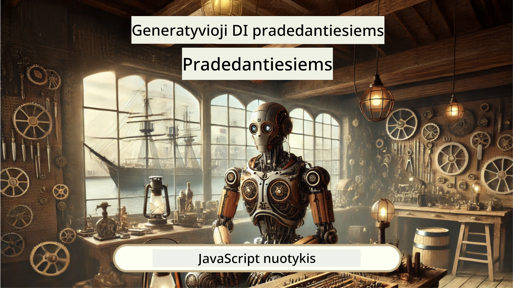
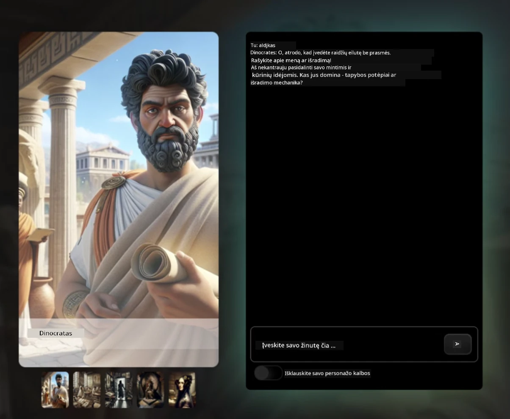
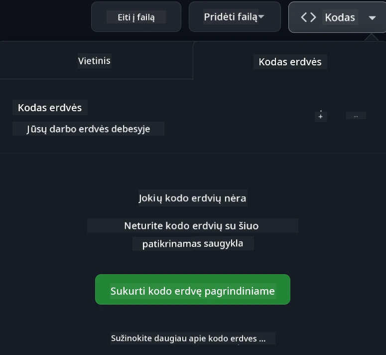

[](https://github.com/microsoft/Web-Dev-For-Beginners/blob/master/LICENSE)
[](https://GitHub.com/microsoft/Web-Dev-For-Beginners/graphs/contributors/)
[](https://GitHub.com/microsoft/Web-Dev-For-Beginners/issues/)
[](https://GitHub.com/microsoft/Web-Dev-For-Beginners/pulls/)
[](http://makeapullrequest.com) 

[](https://GitHub.com/microsoft/Web-Dev-For-Beginners/watchers/)
[](https://GitHub.com/microsoft/Web-Dev-For-Beginners/network/)
[](https://GitHub.com/microsoft/Web-Dev-For-Beginners/stargazers/)

[](https://discord.gg/nTYy5BXMWG)

# Interneto svetainių kūrimas pradedantiesiems – mokymo planas

Išmokite interneto svetainių kūrimo pagrindus per mūsų 12 savaičių išsamų kursą, kurį veda Microsoft Cloud Advocates komanda. Kiekviena iš 24 pamokų detalizuojama JavaScript, CSS ir HTML temas, dirbant su praktiniais projektais, tokiais kaip terariumai, naršyklės plėtiniai ir erdvės žaidimai. Dalyvaukite viktorinose, diskusijose ir praktiniuose užduotyse. Tobulinkite savo įgūdžius ir optimizuokite žinių įsisavinimą naudojant mūsų efektyvią projektinę pedagogiką. Pradėkite savo programavimo kelionę jau šiandien!

Prisijunkite prie Azure AI Foundry Discord bendruomenės

[](https://discord.gg/nTYy5BXMWG)

Atlikite šiuos žingsnius, kad pradėtumėte naudotis šiomis priemonėmis:
1. **Padarykite Forką**: Spauskite [](https://GitHub.com/microsoft/Web-Dev-For-Beginners/fork)
2. **Klonuokite Saugyklą**:   `git clone https://github.com/microsoft/Web-Dev-For-Beginners.git`
3. [**Prisijunkite prie Azure AI Foundry Discord ir susitikite su ekspertais bei kitais kūrėjais**](https://discord.com/invite/ByRwuEEgH4)

### 🌐 Daugiakalbė parama

#### Palaikoma per GitHub Action (automatizuota ir visuomet atnaujinta)

<!-- CO-OP TRANSLATOR LANGUAGES TABLE START -->
[Arabic](../ar/README.md) | [Bengali](../bn/README.md) | [Bulgarian](../bg/README.md) | [Burmese (Myanmar)](../my/README.md) | [Chinese (Simplified)](../zh-CN/README.md) | [Chinese (Traditional, Hong Kong)](../zh-HK/README.md) | [Chinese (Traditional, Macau)](../zh-MO/README.md) | [Chinese (Traditional, Taiwan)](../zh-TW/README.md) | [Croatian](../hr/README.md) | [Czech](../cs/README.md) | [Danish](../da/README.md) | [Dutch](../nl/README.md) | [Estonian](../et/README.md) | [Finnish](../fi/README.md) | [French](../fr/README.md) | [German](../de/README.md) | [Greek](../el/README.md) | [Hebrew](../he/README.md) | [Hindi](../hi/README.md) | [Hungarian](../hu/README.md) | [Indonesian](../id/README.md) | [Italian](../it/README.md) | [Japanese](../ja/README.md) | [Kannada](../kn/README.md) | [Khmer](../km/README.md) | [Korean](../ko/README.md) | [Lithuanian](./README.md) | [Malay](../ms/README.md) | [Malayalam](../ml/README.md) | [Marathi](../mr/README.md) | [Nepali](../ne/README.md) | [Nigerian Pidgin](../pcm/README.md) | [Norwegian](../no/README.md) | [Persian (Farsi)](../fa/README.md) | [Polish](../pl/README.md) | [Portuguese (Brazil)](../pt-BR/README.md) | [Portuguese (Portugal)](../pt-PT/README.md) | [Punjabi (Gurmukhi)](../pa/README.md) | [Romanian](../ro/README.md) | [Russian](../ru/README.md) | [Serbian (Cyrillic)](../sr/README.md) | [Slovak](../sk/README.md) | [Slovenian](../sl/README.md) | [Spanish](../es/README.md) | [Swahili](../sw/README.md) | [Swedish](../sv/README.md) | [Tagalog (Filipino)](../tl/README.md) | [Tamil](../ta/README.md) | [Telugu](../te/README.md) | [Thai](../th/README.md) | [Turkish](../tr/README.md) | [Ukrainian](../uk/README.md) | [Urdu](../ur/README.md) | [Vietnamese](../vi/README.md)

> **Norite klonuoti lokalizuotai?**
>
> Šioje saugykloje yra daugiau kaip 50 kalbų vertimų, dėl ko labai padidėja atsisiuntimo dydis. Jei norite klonuoti be vertimų, naudokite sparse checkout:
>
> **Bash / macOS / Linux:**
> ```bash
> git clone --filter=blob:none --sparse https://github.com/microsoft/Web-Dev-For-Beginners.git
> cd Web-Dev-For-Beginners
> git sparse-checkout set --no-cone '/*' '!translations' '!translated_images'
> ```
>
> **CMD (Windows):**
> ```cmd
> git clone --filter=blob:none --sparse https://github.com/microsoft/Web-Dev-For-Beginners.git
> cd Web-Dev-For-Beginners
> git sparse-checkout set --no-cone "/*" "!translations" "!translated_images"
> ```
>
> Taip gausite viską, ko reikia kursui atlikti, žymiai greičiau atsisiųsdami.
<!-- CO-OP TRANSLATOR LANGUAGES TABLE END -->

**Jei norite, kad būtų pridedamos papildomos palaikomos kalbos, jos išvardytos [čia](https://github.com/Azure/co-op-translator/blob/main/getting_started/supported-languages.md)**

[](https://open.vscode.dev/microsoft/Web-Dev-For-Beginners)

#### 🧑‍🎓 _Ar esi studentas?_

Aplankyk [**Studentų centrą puslapį**](https://docs.microsoft.com/learn/student-hub/?WT.mc_id=academic-77807-sagibbon), kur rasi pradedančiųjų resursus, studentų paketus ir net galimybes gauti nemokamą sertifikato kuponą. Tai puslapis, kurį verta pažymėti ir periodiškai tikrinti, nes mes kas mėnesį atnaujiname turinį.

### 📣 Pranešimas – Nauji GitHub Copilot Agent režimo iššūkiai!

Pridėtas naujas iššūkis – ieškokite "GitHub Copilot Agent Challenge 🚀" daugelyje skyrių. Tai naujas iššūkis, skirtas atlikti naudojant GitHub Copilot ir Agent režimą. Jei dar nenaudojote Agent režimo, jis ne tik generuoja tekstą, bet gali ir kurti bei redaguoti failus, vykdyti komandas ir daugiau.

### 📣 Pranešimas – _Naujas projektas generuojant dirbtiniu intelektu_

Pridėtas naujas AI Asistento projektas, pažiūrėkite [projektą](./9-chat-project/README.md)

### 📣 Pranešimas – _Naujasis Generatyvinio DI kursas JavaScript buvo ką tik išleistas_

Nepraleiskite mūsų naujo Generatyvinio DI mokymo plano!

Aplankykite [https://aka.ms/genai-js-course](https://aka.ms/genai-js-course) ir pradėkite!



- Pamokos, apimančios viską nuo pagrindų iki RAG.
- Sąveikaukite su istorinių veikėjų personažais naudodami GenAI ir mūsų palydovinę programėlę.
- Linksma ir įtraukianti istorija, keliausite laiku!




Kiekviena pamoka apima užduotį, žinių patikrinimą ir iššūkį, kuris padės išmokti:
- Užklausų ir užklausų inžinerijos
- Teksto ir vaizdo programėlių generavimo
- Paieškos programėlių

Aplankykite [https://aka.ms/genai-js-course](https://aka.ms/genai-js-course) ir pradėkite!


## 🌱 Pradžia

> **Mokytojai**, mes paruošėme [kelias rekomendacijas](for-teachers.md), kaip naudotis šiuo mokymo planu. Labai laukiame jūsų atsiliepimų [mūsų diskusijų forume](https://github.com/microsoft/Web-Dev-For-Beginners/discussions/categories/teacher-corner)!

**[Mokiniai](https://aka.ms/student-page/?WT.mc_id=academic-77807-sagibbon)**, kiekvienos pamokos pradžioje pradėkite nuo priešpaskaitinės viktorinos, vėliau peržiūrėkite paskaitos medžiagą, atlikite įvairias užduotis ir pasitikrinkite savo supratimą paskaitos pabaigos viktorinoje.

Siekiant pagerinti mokymosi patirtį, susisiekite su savo bendraamžiais ir dirbkite kartu prie projektų! Skatintinos diskusijos mūsų [diskusijų forume](https://github.com/microsoft/Web-Dev-For-Beginners/discussions), kuriame dirba mūsų moderatorių komanda, pasirengusi atsakyti į jūsų klausimus.

Norėdami toliau tobulėti, rekomenduojame peržiūrėti [Microsoft Learn](https://learn.microsoft.com/users/wirelesslife/collections/p1ddcy5jwy0jkm?WT.mc_id=academic-77807-sagibbon) papildomoms mokomosioms medžiagoms.

### 📋 Aplinkos paruošimas

Šiam mokymo planui yra paruošta plėtros aplinka! Pradėdami galite pasirinkti vykdyti kursą [Codespace](https://github.com/features/codespaces/) aplinkoje (_naršyklėje, nereikia diegti jokių programų_), arba lokaliai savo kompiuteryje naudodami teksto redaktorių, pvz., [Visual Studio Code](https://code.visualstudio.com/?WT.mc_id=academic-77807-sagibbon).

#### Sukurkite savo saugyklą
Kad lengvai išsaugotumėte savo darbus, rekomenduojama sukurti savo šios saugyklos kopiją. Tai galite padaryti paspaudę mygtuką **Use this template** šio puslapio viršuje. Tai sukurs naują saugyklą jūsų GitHub paskyroje su šio mokymo plano kopija.

Atlikite šiuos veiksmus:
1. **Padarykite Fork**: Spauskite "Fork" mygtuką viršutiniame dešiniajame puslapio kampe.
2. **Klonuokite Saugyklą**:   `git clone https://github.com/microsoft/Web-Dev-For-Beginners.git`

#### Kursą vykdykite Codespace aplinkoje

Jūsų sukurtos saugyklos lange spauskite **Code** mygtuką ir pasirinkite **Open with Codespaces**. Tai sukurs naują Codespace, kuriame galėsite dirbti.



#### Kursą vykdykite lokaliai savo kompiuteryje

Norėdami vykdyti kursą lokaliai savo kompiuteryje, jums reikės teksto redaktoriaus, naršyklės ir komandų eilutės įrankio. Mūsų pirma pamoka [Programavimo kalbų ir darbo įrankių įvadas](../../1-getting-started-lessons/1-intro-to-programming-languages) supažindins jus su įvairiomis šių įrankių pasirinkimo galimybėmis, kad galėtumėte pasirinkti tinkamiausią.

Rekomenduojame naudoti [Visual Studio Code](https://code.visualstudio.com/?WT.mc_id=academic-77807-sagibbon) kaip redaktorių, kuris taip pat turi integruotą [Terminalą](https://code.visualstudio.com/docs/terminal/basics/?WT.mc_id=academic-77807-sagibbon). Visual Studio Code galite parsisiųsti [čia](https://code.visualstudio.com/?WT.mc_id=academic-77807-sagibbon).
1. Nuklonuokite savo saugyklą į savo kompiuterį. Tai galite padaryti spustelėję mygtuką **Code** ir nukopijavę URL:

    [CodeSpace](./images/createcodespace.png)

    Tada atidarykite [Terminalą](https://code.visualstudio.com/docs/terminal/basics/?WT.mc_id=academic-77807-sagibbon) [Visual Studio Code](https://code.visualstudio.com/?WT.mc_id=academic-77807-sagibbon) aplinkoje ir vykdykite šią komandą, pakeisdami `<your-repository-url>` į ką tik nukopijuotą URL:

    ```bash 
    git clone <your-repository-url>
    ```

2. Atidarykite aplanką Visual Studio Code. Tai galite padaryti spustelėję **File** > **Open Folder** ir pasirinkdami ką tik nuklonuotą aplanką.


>  Rekomenduojami Visual Studio Code plėtiniai:
>
> * [Live Server](https://marketplace.visualstudio.com/items?itemName=ritwickdey.LiveServer&WT.mc_id=academic-77807-sagibbon) - HTML puslapių peržiūrai Visual Studio Code aplinkoje
> * [Copilot](https://marketplace.visualstudio.com/items?itemName=GitHub.copilot&WT.mc_id=academic-77807-sagibbon) - padeda greičiau rašyti kodą

## 📂 Kiekviena pamoka apima:

- neprivalomą sketchnote užrašą
- neprivalomą papildomą vaizdo įrašą
- šiltinimo viktoriną prieš pamoką
- rašytinę pamoką
- projektinėse pamokose – žingsnis po žingsnio instrukcijas, kaip sukurti projektą
- žinių patikrinimus
- iššūkį
- papildomą skaitymą
- užduotį
- [pamokos pabaigos viktoriną](https://ff-quizzes.netlify.app/web/)

> **Pastaba apie viktorinas**: Visos viktorinos yra Quiz-app aplanke, iš viso 48 viktorinos po tris klausimus kiekvienoje. Jas rasite [čia](https://ff-quizzes.netlify.app/web/) – viktorinų programėlę galima paleisti lokaliai arba diegti Azure; sekite nurodymus `quiz-app` aplanke.

## 🗃️ Pamokos

|     |                       Projekto pavadinimas                        |                              Mokomi konceptai                               | Mokymosi tikslai                                                                                                                   |                                                         Susietos pamokos                                                          |         Autorius          |
| :-: | :---------------------------------------------------------------: | :-------------------------------------------------------------------------: | --------------------------------------------------------------------------------------------------------------------------------- | :--------------------------------------------------------------------------------------------------------------------------------: | :-----------------------: |
| 01  |                      Pradžia                                   |           Programavimo pagrindai ir naudojami įrankiai                      | Sužinokite pagrindinius daugumos programavimo kalbų pagrindus ir apie programinę įrangą, padedančią profesionalams                | [Įvadas į programavimo kalbas ir įrankius](./1-getting-started-lessons/1-intro-to-programming-languages/README.md)             |         Jasmine           |
| 02  |                      Pradžia                                   |             GitHub pagrindai, įskaitant komandinius darbus                  | Kaip naudotis GitHub projekte, kaip bendradarbiauti dirbant su kodo baze                                                           |                               [Įvadas į GitHub](./1-getting-started-lessons/2-github-basics/README.md)                            |          Floor            |
| 03  |                      Pradžia                                   |                             Prieinamumas                                    | Sužinokite interneto prieinamumo pagrindus                                                                                        |                          [Prieinamumo pagrindai](./1-getting-started-lessons/3-accessibility/README.md)                        |       Christopher         |
| 04  |                        JS pagrindai                           |                         JavaScript duomenų tipai                           | JavaScript duomenų tipų pagrindai                                                                                                |                                   [Duomenų tipai](./2-js-basics/1-data-types/README.md)                                        |         Jasmine           |
| 05  |                        JS pagrindai                           |                         Funkcijos ir metodai                               | Sužinokite apie funkcijas ir metodus, valdančius programos logikos eigą                                                         |                               [Funkcijos ir metodai](./2-js-basics/2-functions-methods/README.md)                              | Jasmine ir Christopher    |
| 06  |                        JS pagrindai                           |                        Sprendimų priėmimas JS                              | Sužinokite, kaip sukurti sąlygas savo kode naudojant sprendimų priėmimo būdus                                                    |                                  [Sprendimų kūrimas](./2-js-basics/3-making-decisions/README.md)                                |         Jasmine           |
| 07  |                        JS pagrindai                           |                            Masyvai ir ciklai                              | Darbas su duomenimis naudojant masyvus ir ciklus JavaScript                                                                    |                                     [Masyvai ir ciklai](./2-js-basics/4-arrays-loops/README.md)                              |         Jasmine           |
| 08  |       [Terrarium](./3-terrarium/solution/README.md)            |                            HTML praktikoje                               | Sukurkite HTML, kad sukurtumėte internetinį terariumą, koncentruojantis į išdėstymo kūrimą                                        |                                [Įvadas į HTML](./3-terrarium/1-intro-to-html/README.md)                                     |           Jen             |
| 09  |       [Terrarium](./3-terrarium/solution/README.md)            |                            CSS praktikoje                                | Sukurkite CSS, kad stilizuotumėte internetinį terariumą, įskaitant pagrindus ir atsaką į skirtingų ekranų dydžius                 |                                 [Įvadas į CSS](./3-terrarium/2-intro-to-css/README.md)                                     |           Jen             |
| 10  |            [Terrarium](./3-terrarium/solution/README.md)       |               JavaScript Closure ir DOM manipuliavimas                    | Parašykite JavaScript, kad terariumas veiktų kaip vilkimo / metimo sąsaja, koncentruojantis į closure ir DOM manipuliavimą        |                      [JavaScript Closure ir DOM manipuliavimas](./3-terrarium/3-intro-to-DOM-and-closures/README.md)          |           Jen             |
| 11  |          [Rašymo žaidimas](./4-typing-game/solution/README.md) |                       Sukurkite rašymo žaidimą                           | Sužinokite, kaip naudoti klaviatūros įvykius valdyti jūsų JavaScript programos logiką                                            |                             [Įvykių valdymas](./4-typing-game/typing-game/README.md)                                      |       Christopher         |
| 12  | [Žalioji naršyklės plėtinys](./5-browser-extension/solution/README.md) |                         Darbas su naršyklėmis                           | Sužinokite, kaip veikia naršyklės, jų istoriją ir kaip sukurti pirmuosius naršyklės plėtinio elementus                            |                             [Apie naršykles](./5-browser-extension/1-about-browsers/README.md)                                |           Jen             |
| 13  | [Žalioji naršyklės plėtinys](./5-browser-extension/solution/README.md) | Formos kūrimas, API kvietimas ir kintamųjų saugojimas local storage     | Parašykite naršyklės plėtinio JavaScript elementus, kad kvietumėte API naudodami kintamuosius saugojamus local storage           |                         [API, formos ir local storage](./5-browser-extension/2-forms-browsers-local-storage/README.md)         |           Jen             |
| 14  | [Žalioji naršyklės plėtinys](./5-browser-extension/solution/README.md) |               Naršyklės fono procesai, žiniatinklio našumas             | Naudokite naršyklės foninius procesus plėtinio ikonų valdymui; sužinokite apie žiniatinklio našumą bei optimizacijas             |                     [Fono darbai ir našumas](./5-browser-extension/3-background-tasks-and-performance/README.md)               |           Jen             |
| 15  |           [Kosmoso žaidimas](./6-space-game/solution/README.md)           |           Sudėtingesnis žaidimų kūrimas su JavaScript                  | Sužinokite apie paveldėjimą naudojant klases ir kompoziciją, taip pat Pub/Sub modelį žaidimo kūrimui                               |                     [Įvadas į pažangų žaidimų kūrimą](./6-space-game/1-introduction/README.md)                                  |          Chris            |
| 16  |           [Kosmoso žaidimas](./6-space-game/solution/README.md)           |                          Piešimas ant drobės                             | Sužinokite apie Canvas API, kuris leidžia piešti elementus ekrane                                                             |                                [Piešimas ant drobės](./6-space-game/2-drawing-to-canvas/README.md)                           |          Chris            |
| 17  |           [Kosmoso žaidimas](./6-space-game/solution/README.md)           |                     Elementų judinimas ekrane                          | Sužinokite, kaip elementai gali judėti naudojant kartezines koordinates ir Canvas API                                            |                              [Elementų judinimas ekrane](./6-space-game/3-moving-elements-around/README.md)                   |          Chris            |
| 18  |           [Kosmoso žaidimas](./6-space-game/solution/README.md)           |                      Kolizijos aptikimas                              | Sukurkite elementų susidūrimus ir reakcijas į rakto paspaudimus, įdiekite „cooldown“ funkciją žaidimo našumui užtikrinti       |                               [Kolizijos aptikimas](./6-space-game/4-collision-detection/README.md)                          |          Chris            |
| 19  |           [Kosmoso žaidimas](./6-space-game/solution/README.md)           |                             Taškų skaičiavimas                         | Atlikite matematikos skaičiavimus pagal žaidimo būseną ir rezultatus                                                           |                                 [Taškų skaičiavimas](./6-space-game/5-keeping-score/README.md)                              |          Chris            |
| 20  |           [Kosmoso žaidimas](./6-space-game/solution/README.md)           |                      Žaidimo pabaiga ir paleidimas iš naujo            | Sužinokite apie žaidimo pabaigą ir iš naujo paleidimą, įskaitant išteklių valymą ir kintamųjų reikšmių atstatymą                 |                              [Pabaigos sąlyga](./6-space-game/6-end-condition/README.md)                                   |          Chris            |
| 21  |         [Banko programa](./7-bank-project/solution/README.md)             |               HTML šablonai ir maršrutizacija web programoje            | Sužinokite, kaip sukurti daugiapusės svetainės architektūrą naudojant maršrutizavimą ir HTML šablonus                          |                               [HTML šablonai ir maršrutizacija](./7-bank-project/1-template-route/README.md)                 |          Yohan            |
| 22  |         [Banko programa](./7-bank-project/solution/README.md)             |              Prisijungimo ir registracijos formos kūrimas               | Sužinokite apie formų kūrimą ir validacijos tvarkymą                                                                         |                                            [Formos](./7-bank-project/2-forms/README.md)                                     |          Yohan            |
| 23  |         [Banko programa](./7-bank-project/solution/README.md)             |                     Duomenų gavimo ir naudojimo būdai                  | Kaip duomenys teka jūsų programoje, kaip juos gauti, saugoti ir išmesti                                                       |                                              [Duomenys](./7-bank-project/3-data/README.md)                                   |          Yohan            |
| 24  |         [Banko programa](./7-bank-project/solution/README.md)             |                      Būsenos valdymo konceptai                          | Sužinokite, kaip jūsų programa saugo būseną ir kaip ją valdyti programiškai                                                  |                                 [Būsenos valdymas](./7-bank-project/4-state-management/README.md)                            |          Yohan            |
| 25  | [Naršyklės / VScode kodas](../../8-code-editor)                            | Darbas su VScode                                                       | Išmokite naudotis kodo redaktoriumi                                                                                           |                                 [Naudokite VScode redaktorių](./8-code-editor/1-using-a-code-editor/README.md)                | Chris                    |
| 26  | [AI asistentai](./9-chat-project/README.md)                             | Darbas su AI                                                         | Išmokite sukurti savo AI asistentą                                                                                            |                                     [AI asistento projektas](./9-chat-project/README.md)                                   | Chris                    |

## 🏫 Pedagogika

Mūsų mokymo programa sukurta remiantis dviem pagrindinėmis pedagoginėmis taisyklėmis:
* mokymasis per projektus
* dažnos viktorinos

Programa moko JavaScript, HTML ir CSS pagrindus bei naujausius įrankius ir metodus, kuriuos naudoja šių dienų interneto kūrėjai. Studentai turės galimybę įgyti praktinės patirties kuriant rašymo žaidimą, virtualų terariumą, ekologišką naršyklės plėtinį, kosmoso invazijos tipo žaidimą ir verslo banko programėlę. Baigus šį ciklą studentai įgis tvirtą supratimą apie interneto kūrimą.

> 🎓 Pirmas kelias šios programos pamokas galite atlikti kaip [Mokymosi kelią](https://docs.microsoft.com/learn/paths/web-development-101/?WT.mc_id=academic-77807-sagibbon) Microsoft Learn platformoje!

Užtikrinant, kad turinys atitiktų projektus, procesas tampa labiau įtraukiantis studentams, o konceptų įsisavinimas pagerėja. Taip pat parašėme keletą pradinio lygio pamokų JavaScript pagrindams supažindinti, jas lydi video iš „[Pradedančiųjų serijos į JavaScript](https://channel9.msdn.com/Series/Beginners-Series-to-JavaScript/?WT.mc_id=academic-77807-sagibbon)“ kolekcijos, kurios autorių dalyvavo ir šioje programoje.

Be to, žemesnio slenksčio viktorina prieš pamoką nukreipia studentų dėmesį mokytis temą, o antroji viktorina po pamokos užtikrina geresnį įsisavinimą. Ši programa sukurta taip, kad būtų lanksti ir smagi, ją galima atlikti visa arba dalimis. Projektai prasideda nedideli ir pamažu tampa vis sudėtingesni per visą 12 savaičių ciklą.

Nors sąmoningai vengėme įvesti JavaScript karkasus, kad susikoncentruotume į pagrindinius įgūdžius, reikalingus kaip interneto kūrėjui prieš pereinant prie karkasų, gera tolesnė žingsnis būtų išmokti apie Node.js per kitą video kolekciją: „[Pradedančiųjų serija į Node.js](https://channel9.msdn.com/Series/Beginners-Series-to-Nodejs/?WT.mc_id=academic-77807-sagibbon)“.

> Apsilankykite mūsų [Elgesio kodekse](CODE_OF_CONDUCT.md) ir [Dalyvavimo taisyklėse](CONTRIBUTING.md). Laukiame jūsų konstruktyvių atsiliepimų!


## 🧭 Offline prieiga

Šią dokumentaciją galite naudoti offline naudodami [Docsify](https://docsify.js.org/#/). Nuklonuokite šį repo, [įdiekite Docsify](https://docsify.js.org/#/quickstart) savo vietinėje mašinoje, tada šio repo šakniniame aplanke paleiskite `docsify serve`. Svetainė bus pasiekiama per 3000 prievadą jūsų localhost: `localhost:3000`.

## 📘 PDF
Visų pamokų PDF galite rasti [čia](https://microsoft.github.io/Web-Dev-For-Beginners/pdf/readme.pdf).


## 🎒 Kiti kursai

Mūsų komanda kuria ir kitus kursus! Pažiūrėkite:

<!-- CO-OP TRANSLATOR OTHER COURSES START -->
### LangChain
[](https://aka.ms/langchain4j-for-beginners)
[](https://aka.ms/langchainjs-for-beginners?WT.mc_id=m365-94501-dwahlin)
[](https://github.com/microsoft/langchain-for-beginners?WT.mc_id=m365-94501-dwahlin)
---

### Azure / Edge / MCP / Agentai
[](https://github.com/microsoft/AZD-for-beginners?WT.mc_id=academic-105485-koreyst)
[](https://github.com/microsoft/edgeai-for-beginners?WT.mc_id=academic-105485-koreyst)
[](https://github.com/microsoft/mcp-for-beginners?WT.mc_id=academic-105485-koreyst)
[](https://github.com/microsoft/ai-agents-for-beginners?WT.mc_id=academic-105485-koreyst)

---
 
### Generatyviosios AI serija
[](https://github.com/microsoft/generative-ai-for-beginners?WT.mc_id=academic-105485-koreyst)
[-9333EA?style=for-the-badge&labelColor=E5E7EB&color=9333EA)](https://github.com/microsoft/Generative-AI-for-beginners-dotnet?WT.mc_id=academic-105485-koreyst)
[-C084FC?style=for-the-badge&labelColor=E5E7EB&color=C084FC)](https://github.com/microsoft/generative-ai-for-beginners-java?WT.mc_id=academic-105485-koreyst)
[-E879F9?style=for-the-badge&labelColor=E5E7EB&color=E879F9)](https://github.com/microsoft/generative-ai-with-javascript?WT.mc_id=academic-105485-koreyst)

---
 
### Pagrindiniai mokymai
[](https://aka.ms/ml-beginners?WT.mc_id=academic-105485-koreyst)
[](https://aka.ms/datascience-beginners?WT.mc_id=academic-105485-koreyst)
[](https://aka.ms/ai-beginners?WT.mc_id=academic-105485-koreyst)
[](https://github.com/microsoft/Security-101?WT.mc_id=academic-96948-sayoung)
[](https://aka.ms/webdev-beginners?WT.mc_id=academic-105485-koreyst)
[](https://aka.ms/iot-beginners?WT.mc_id=academic-105485-koreyst)
[](https://github.com/microsoft/xr-development-for-beginners?WT.mc_id=academic-105485-koreyst)

---
 
### Copilot serija
[](https://aka.ms/GitHubCopilotAI?WT.mc_id=academic-105485-koreyst)
[](https://github.com/microsoft/mastering-github-copilot-for-dotnet-csharp-developers?WT.mc_id=academic-105485-koreyst)
[](https://github.com/microsoft/CopilotAdventures?WT.mc_id=academic-105485-koreyst)
<!-- CO-OP TRANSLATOR OTHER COURSES END -->

## Pagalba

Jei užstrigote arba turite klausimų apie AI programėlių kūrimą. Prisijunkite prie bendraminčių ir patyrusių programuotojų diskusijų apie MCP. Tai palaikanti bendruomenė, kurioje klausimai laukiami, o žinios laisvai dalijamos.

[](https://discord.gg/nTYy5BXMWG)

Jei turite produktų atsiliepimų arba randate klaidų kūrimo metu, apsilankykite:

[](https://aka.ms/foundry/forum)

## Licencija

Šis saugykla licencijuota pagal MIT licenciją. Daugiau informacijos žr. faile [LICENSE](../../LICENSE).

---

<!-- CO-OP TRANSLATOR DISCLAIMER START -->
**Atsakomybės apribojimas**:
Šis dokumentas buvo išverstas naudojant AI vertimo paslaugą [Co-op Translator](https://github.com/Azure/co-op-translator). Nors siekiame tikslumo, prašome atkreipti dėmesį, kad automatiniai vertimai gali turėti klaidų ar netikslumų. Originalus dokumentas jo gimtąja kalba turėtų būti laikomas autoritetingu šaltiniu. Kritiškai svarbiai informacijai rekomenduojamas profesionalus žmogiškas vertimas. Mes neatsakome už jokius nesusipratimus ar neteisingus aiškinimus, kilusius naudojant šį vertimą.
<!-- CO-OP TRANSLATOR DISCLAIMER END -->