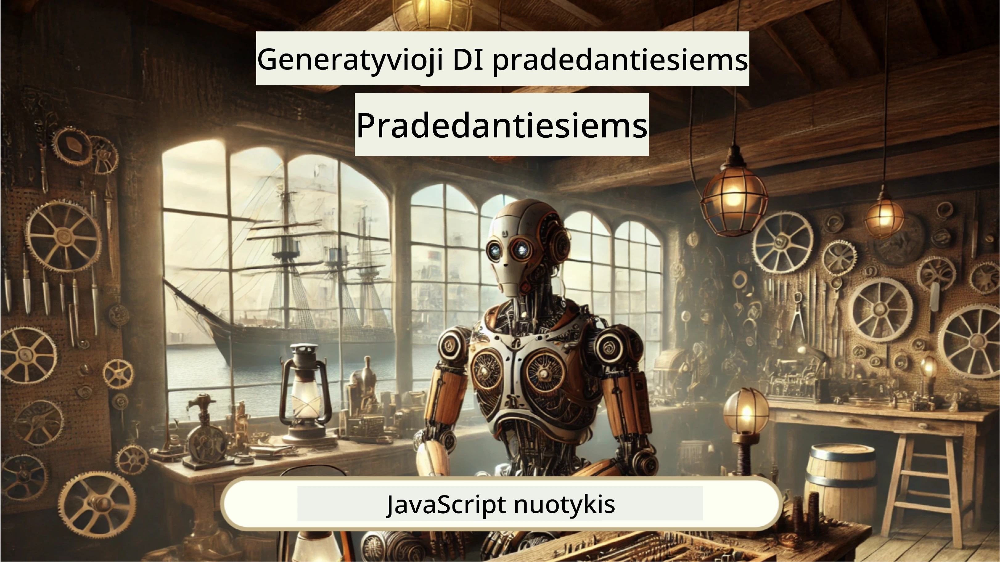
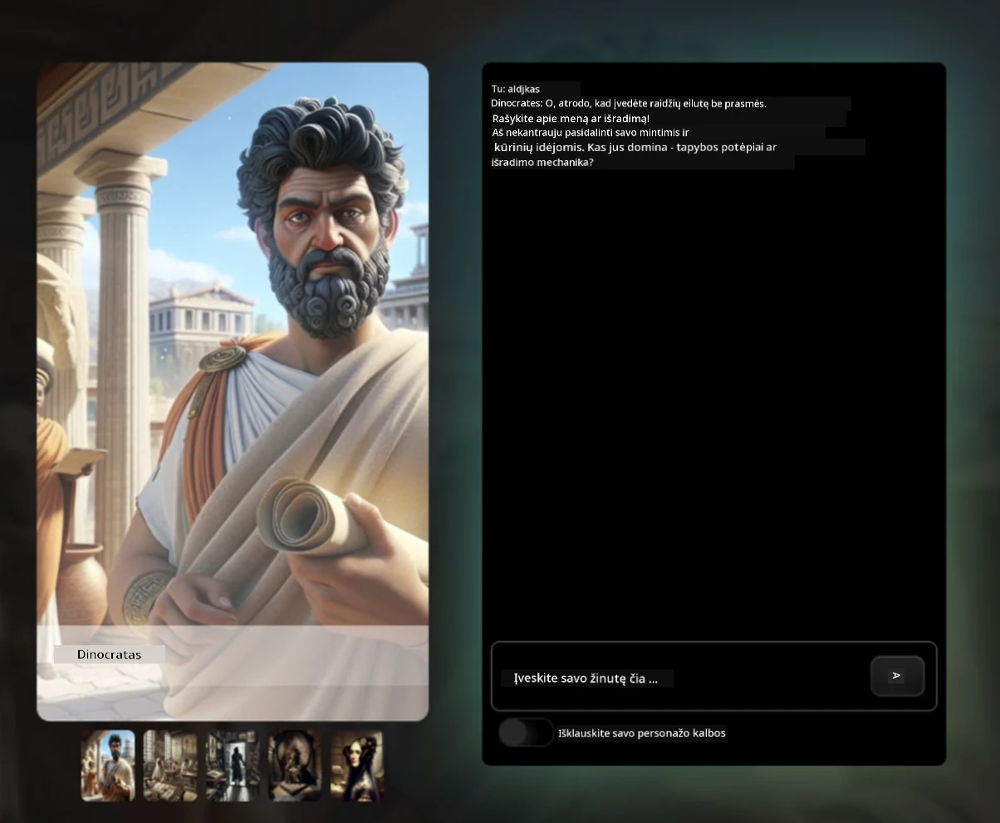
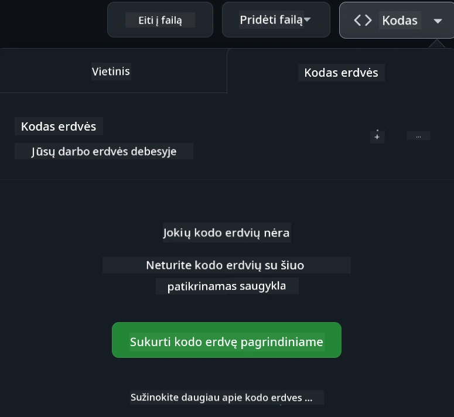

[](https://github.com/microsoft/Web-Dev-For-Beginners/blob/master/LICENSE)
[](https://GitHub.com/microsoft/Web-Dev-For-Beginners/graphs/contributors/)
[](https://GitHub.com/microsoft/Web-Dev-For-Beginners/issues/)
[](https://GitHub.com/microsoft/Web-Dev-For-Beginners/pulls/)
[](http://makeapullrequest.com) 

[](https://GitHub.com/microsoft/Web-Dev-For-Beginners/watchers/)
[](https://GitHub.com/microsoft/Web-Dev-For-Beginners/network/)
[](https://GitHub.com/microsoft/Web-Dev-For-Beginners/stargazers/)

[](https://discord.gg/nTYy5BXMWG)

# Tinklalapių kūrimas pradedantiesiems – Mokymo programa

Išmokite tinklalapių kūrimo pagrindus mūsų 12 savaičių išsamiame kurse, kurį rengia Microsoft Cloud Advocates. Kiekviena iš 24 pamokų gilina žinias apie JavaScript, CSS ir HTML per praktinius projektus, tokius kaip terariumai, naršyklės plėtiniai ir kosmoso žaidimai. Dalyvaukite viktorinose, diskusijose ir praktiniuose užduotyse. Tobulinkite įgūdžius ir optimizuokite žinių įsisavinimą su mūsų efektyvia projektais pagrįsta pedagogika. Pradėkite programavimo kelionę šiandien!

Prisijunkite prie Azure AI Foundry Discord ir susipažinkite su ekspertais bei kitais programuotojais.

[](https://discord.gg/nTYy5BXMWG)

Sekite šiuos veiksmus, kad pradėtumėte naudotis šiomis priemonėmis:
1. **Padarykite Repository fork’ą**: Spustelėkite [](https://GitHub.com/microsoft/Web-Dev-For-Beginners/fork)
2. **Klonuokite Repository**:   `git clone https://github.com/microsoft/Web-Dev-For-Beginners.git`
3. [**Prisijunkite prie Azure AI Foundry Discord ir susipažinkite su ekspertais bei kitais programuotojais**](https://discord.com/invite/ByRwuEEgH4)

### 🌐 Daugiakalbė palaikymas

#### Palaikoma per GitHub Action (automatiškai ir visuomet atnaujinta)

<!-- CO-OP TRANSLATOR LANGUAGES TABLE START -->
[Arabic](../ar/README.md) | [Bengali](../bn/README.md) | [Bulgarian](../bg/README.md) | [Burmese (Myanmar)](../my/README.md) | [Chinese (Simplified)](../zh-CN/README.md) | [Chinese (Traditional, Hong Kong)](../zh-HK/README.md) | [Chinese (Traditional, Macau)](../zh-MO/README.md) | [Chinese (Traditional, Taiwan)](../zh-TW/README.md) | [Croatian](../hr/README.md) | [Czech](../cs/README.md) | [Danish](../da/README.md) | [Dutch](../nl/README.md) | [Estonian](../et/README.md) | [Finnish](../fi/README.md) | [French](../fr/README.md) | [German](../de/README.md) | [Greek](../el/README.md) | [Hebrew](../he/README.md) | [Hindi](../hi/README.md) | [Hungarian](../hu/README.md) | [Indonesian](../id/README.md) | [Italian](../it/README.md) | [Japanese](../ja/README.md) | [Kannada](../kn/README.md) | [Khmer](../km/README.md) | [Korean](../ko/README.md) | [Lithuanian](./README.md) | [Malay](../ms/README.md) | [Malayalam](../ml/README.md) | [Marathi](../mr/README.md) | [Nepali](../ne/README.md) | [Nigerian Pidgin](../pcm/README.md) | [Norwegian](../no/README.md) | [Persian (Farsi)](../fa/README.md) | [Polish](../pl/README.md) | [Portuguese (Brazil)](../pt-BR/README.md) | [Portuguese (Portugal)](../pt-PT/README.md) | [Punjabi (Gurmukhi)](../pa/README.md) | [Romanian](../ro/README.md) | [Russian](../ru/README.md) | [Serbian (Cyrillic)](../sr/README.md) | [Slovak](../sk/README.md) | [Slovenian](../sl/README.md) | [Spanish](../es/README.md) | [Swahili](../sw/README.md) | [Swedish](../sv/README.md) | [Tagalog (Filipino)](../tl/README.md) | [Tamil](../ta/README.md) | [Telugu](../te/README.md) | [Thai](../th/README.md) | [Turkish](../tr/README.md) | [Ukrainian](../uk/README.md) | [Urdu](../ur/README.md) | [Vietnamese](../vi/README.md)

> **Norite klonuoti lokaliai?**
>
> Šiame repositorijoje yra virš 50 kalbų vertimų, kas ženkliai padidina atsisiuntimo dydį. Norėdami klonuoti be vertimų, naudokite sparse checkout:
>
> **Bash / macOS / Linux:**
> ```bash
> git clone --filter=blob:none --sparse https://github.com/microsoft/Web-Dev-For-Beginners.git
> cd Web-Dev-For-Beginners
> git sparse-checkout set --no-cone '/*' '!translations' '!translated_images'
> ```
>
> **CMD (Windows):**
> ```cmd
> git clone --filter=blob:none --sparse https://github.com/microsoft/Web-Dev-For-Beginners.git
> cd Web-Dev-For-Beginners
> git sparse-checkout set --no-cone "/*" "!translations" "!translated_images"
> ```
>
> Tai suteiks jums viską, ko reikia kursui užbaigti, žymiai greičiau atsisiuntus.
<!-- CO-OP TRANSLATOR LANGUAGES TABLE END -->

**Jei norite papildomų vertimų, palaikomos kalbos yra čia. [čia](https://github.com/Azure/co-op-translator/blob/main/getting_started/supported-languages.md)**

[](https://open.vscode.dev/microsoft/Web-Dev-For-Beginners)

#### 🧑‍🎓 _Ar esate studentas?_

Apsilankykite [**Studentų centras puslapyje**](https://docs.microsoft.com/learn/student-hub/?WT.mc_id=academic-77807-sagibbon), kur rasite pradedančiųjų išteklius, studentų rinkinius ir net būdus gauti nemokamą sertifikato kuponą. Šį puslapį verta įsidėti į žymes ir kartais patikrinti, nes turinys kas mėnesį keičiasi.

### 📣 Pranešimas – Nauji GitHub Copilot Agent režimo iššūkiai!

Pridėtas naujas iššūkis, ieškokite „GitHub Copilot Agent Challenge 🚀“ daugelyje skyrių. Tai naujas iššūkis, kurį turite atlikti naudodami GitHub Copilot ir Agent režimą. Jei anksčiau nenaudojote Agent režimo, jis gali ne tik generuoti tekstą, bet ir kurti bei redaguoti failus, vykdyti komandas ir daugiau.

### 📣 Pranešimas – _Naujas projektas naudojant Generatyviąją AI_

Pridėtas naujas AI Asistento projektas, pasižiūrėkite [projektą](./9-chat-project/README.md)

### 📣 Pranešimas – _Nauja mokymo programa_ apie Generatyviąją AI JavaScript kalboje ką tik išleista

Nepraleiskite mūsų naujos Generatyviosios AI mokymo programos!

Apsilankykite [https://aka.ms/genai-js-course](https://aka.ms/genai-js-course) ir pradėkite mokytis!



- Pamokos nuo pagrindų iki RAG.
- Bendravimas su istoriniais personažais naudojant GenAI ir mūsų palydovinę programėlę.
- Smagi ir įtraukianti pasakojimo forma – keliausite laiku!




Kiekvienoje pamokoje yra užduotis, žinių patikra ir iššūkis, padėsiantys mokytis šia tema:
- Užklausų pateikimas ir jų kūrimas
- Teksto ir vaizdų programėlių kūrimas
- Paieškos programėlės

Apsilankykite [https://aka.ms/genai-js-course](https://aka.ms/genai-js-course) ir pradėkite mokytis!


## 🌱 Pradžia

> **Mokytojai**, mes pateikėme [kelias rekomendacijas](for-teachers.md), kaip naudoti šią mokymo programą. Labai lauktume jūsų atsiliepimų [mūsų diskusijų forume](https://github.com/microsoft/Web-Dev-For-Beginners/discussions/categories/teacher-corner)!

**[Mokiniai](https://aka.ms/student-page/?WT.mc_id=academic-77807-sagibbon)**, kiekvienai pamokai pradėkite nuo priešpaskaitinės viktorinos, paskui skaitykite paskaitos medžiagą, atlikite įvairias veiklas ir pasitikrinkite supratimą po paskaitos viktorinoje.

Norėdami geriau mokytis, jungkitės prie savo bendramokslio ir dirbkite kartu su projektais! Diskusijos skatinamos mūsų [diskusijų forume](https://github.com/microsoft/Web-Dev-For-Beginners/discussions), kur mūsų moderatorių komanda bus pasirengusi atsakyti į jūsų klausimus.

Norėdami gilinti žinias, rekomenduojame naršyti [Microsoft Learn](https://learn.microsoft.com/users/wirelesslife/collections/p1ddcy5jwy0jkm?WT.mc_id=academic-77807-sagibbon) papildomoms mokymosi priemonėms.

### 📋 Aplinkos sąranka

Ši mokymo programa turi paruoštą kūrimo aplinką! Pradėdami galite rinktis vykdyti kursą [Codespace](https://github.com/features/codespaces/) (naršyklėje veikianti aplinka be diegimo), arba lokaliai savo kompiuteryje naudodami teksto redaktorių, pavyzdžiui, [Visual Studio Code](https://code.visualstudio.com/?WT.mc_id=academic-77807-sagibbon).

#### Sukurkite savo repository
Kad galėtumėte lengvai išsaugoti savo darbą, rekomenduojama sukurti savo kopiją šio repository. Tai galite padaryti paspausdami mygtuką **Use this template** puslapio viršuje. Tai sukurs naują repository jūsų GitHub paskyroje su mokymo programos kopija.

Sekite šiuos žingsnius:
1. **Padarykite Repository fork’ą**: Paspauskite mygtuką „Fork“ šio puslapio viršutiniame dešiniajame kampe.
2. **Klonuokite Repository**:   `git clone https://github.com/microsoft/Web-Dev-For-Beginners.git`

#### Kursų vykdymas Codespace aplinkoje

Jūsų sukurtame repository paspauskite mygtuką **Code** ir pasirinkite **Open with Codespaces**. Tai sukurs naują Codespace, dirbti jame.



#### Kursų vykdymas lokaliai jūsų kompiuteryje

Kad galėtumėte vykdyti mokymo programą lokaliai, jums reikės teksto redaktoriaus, naršyklės ir komandinės eilutės įrankio. Mūsų pirma pamoka, [Įvadas į programavimo kalbas ir įrankius](../../1-getting-started-lessons/1-intro-to-programming-languages), jus supažindins su galimybėmis kiekvienam iš šių įrankių, kad pasirinktumėte tinkamiausius sau.

Rekomenduojame naudoti [Visual Studio Code](https://code.visualstudio.com/?WT.mc_id=academic-77807-sagibbon) redaktorių, kuris turi integruotą [Terminalą](https://code.visualstudio.com/docs/terminal/basics/?WT.mc_id=academic-77807-sagibbon). Visual Studio Code galite atsisiųsti [čia](https://code.visualstudio.com/?WT.mc_id=academic-77807-sagibbon).
1. Klonuokite savo saugyklą į savo kompiuterį. Tai galite padaryti spustelėję mygtuką **Code** ir nukopijavę URL:

    [CodeSpace](./images/createcodespace.png)

    Tada atidarykite [Terminal](https://code.visualstudio.com/docs/terminal/basics/?WT.mc_id=academic-77807-sagibbon) „Visual Studio Code“ aplinkoje ir paleiskite šią komandą, pakeisdami `<your-repository-url>` tuo URL, kurį ką tik nukopijavote:

    ```bash 
    git clone <your-repository-url>
    ```

2. Atidarykite katalogą „Visual Studio Code“. Tai galite padaryti spustelėję **File** > **Open Folder** ir pasirinkę ką tik nuklonuotą katalogą.


>  Rekomenduojami „Visual Studio Code“ plėtiniai:
>
> * [Live Server](https://marketplace.visualstudio.com/items?itemName=ritwickdey.LiveServer&WT.mc_id=academic-77807-sagibbon) – HTML puslapių peržiūrai „Visual Studio Code“ aplinkoje
> * [Copilot](https://marketplace.visualstudio.com/items?itemName=GitHub.copilot&WT.mc_id=academic-77807-sagibbon) – padeda greičiau rašyti kodą

## 📂 Kiekviena pamoka apima:

- neprivalomą brėžinį (sketchnote)
- neprivalomą papildomą vaizdo įrašą
- apšilimo testą prieš pamoką
- rašytinę pamoką
- projektinėms pamokoms – žingsnis po žingsnio gidas, kaip sukurti projektą
- žinių patikrinimus
- iššūkį
- papildomą skaitymą
- užduotį
- [testą po pamokos](https://ff-quizzes.netlify.app/web/)

> **Pastaba apie testus**: Visi testai yra saugomi Quiz-app kataloge, yra iš viso 48 testai po tris klausimus kiekviename. Jie pasiekiami [čia](https://ff-quizzes.netlify.app/web/), testų programėlę galima paleisti lokaliai arba publikuoti „Azure“; vadovaukitės nurodymais `quiz-app` kataloge.

## 🗃️ Pamokos

|     |                       Projekto pavadinimas                        |                            Mokomi konceptai                              | Mokymosi tikslai                                                                                                                  |                                                         Susieta pamoka                                                          |         Autorius         |
| :-: | :----------------------------------------------------------------: | :----------------------------------------------------------------------: | --------------------------------------------------------------------------------------------------------------------------------- | :-------------------------------------------------------------------------------------------------------------------------------: | :----------------------: |
| 01  |                        Pradžia                                  |           Įvadas į programavimą ir įrankiai                             | Sužinoti pagrindus, kurie slypi daugumoje programavimo kalbų, ir apie programinę įrangą, kuri padeda profesionaliems kūrėjams dirbti | [Įvadas į programavimo kalbas ir įrankius](./1-getting-started-lessons/1-intro-to-programming-languages/README.md) |         Jasmine          |
| 02  |                        Pradžia                                  |             GitHub pagrindai, komandinio darbo ypatumai                 | Kaip naudoti GitHub projekte, kaip bendradarbiauti dirbant su kodo baze                                                            |                             [Įvadas į GitHub](./1-getting-started-lessons/2-github-basics/README.md)                              |          Floor           |
| 03  |                        Pradžia                                  |                             Prieinamumas                               | Susipažinti su interneto prieinamumo pagrindais                                                                                   |                       [Prieinamumo pagrindai](./1-getting-started-lessons/3-accessibility/README.md)                             |       Christopher        |
| 04  |                        JS pagrindai                             |                         JavaScript duomenų tipai                       | JavaScript duomenų tipų pagrindai                                                                                                |                                       [Duomenų tipai](./2-js-basics/1-data-types/README.md)                                             |         Jasmine          |
| 05  |                        JS pagrindai                             |                         Funkcijos ir metodai                           | Sužinoti apie funkcijas ir metodus, valdant programos logikos srautą                                                              |                              [Funkcijos ir metodai](./2-js-basics/2-functions-methods/README.md)                                    | Jasmine ir Christopher   |
| 06  |                        JS pagrindai                             |                        Sprendimų kūrimas su JS                         | Kaip kurti sąlygas savo kode naudojant sprendimų priėmimo būdus                                                                   |                                 [Sprendimų kūrimas](./2-js-basics/3-making-decisions/README.md)                                     |         Jasmine          |
| 07  |                        JS pagrindai                             |                            Masyvai ir ciklai                           | Dirbti su duomenimis naudojant masyvus ir ciklus JavaScript                                                                        |                                   [Masyvai ir ciklai](./2-js-basics/4-arrays-loops/README.md)                                      |         Jasmine          |
| 08  |       [Terrarijus](./3-terrarium/solution/README.md)            |                            HTML praktikoje                            | Sukurti HTML, kad sukurtumėte internetinį terarijų, daugiausia dėmesio skiriant maketui                                            |                                 [Įvadas į HTML](./3-terrarium/1-intro-to-html/README.md)                                        |           Jen            |
| 09  |       [Terrarijus](./3-terrarium/solution/README.md)            |                            CSS praktikoje                             | Kurti CSS stiliaus taisykles internetiniam terarijui, daugiausia dėmesio skiriant CSS pagrindams, įskaitant puslapio adaptaciją     |                                  [Įvadas į CSS](./3-terrarium/2-intro-to-css/README.md)                                         |           Jen            |
| 10  |            [Terrarijus](./3-terrarium/solution/README.md)       |                 JavaScript closure’ai, DOM manipuliacija              | Kurti JavaScript, kuris užtikrintų terarijaus veikimą per tempimą/paleidimą, daugiausia dėmesio skiriant closure’ams ir DOM manipuliacijai |                  [JavaScript closure’ai, DOM manipuliacija](./3-terrarium/3-intro-to-DOM-and-closures/README.md)              |           Jen            |
| 11  |          [Rašymo žaidimas](./4-typing-game/solution/README.md)  |                          Sukurti rašymo žaidimą                        | Sužinoti, kaip naudoti klaviatūros įvykius, kad valdytumėte savo JavaScript programos logiką                                       |                                [Įvykių valdymas](./4-typing-game/typing-game/README.md)                                           |       Christopher        |
| 12  | [Žalioji naršyklės plėtinys](./5-browser-extension/solution/README.md) |                         Darbas su naršyklėmis                         | Sužinoti, kaip veikia naršyklės, jų istoriją ir kaip sukurti pirmuosius naršyklės plėtinio elementus                               |                               [Apie naršykles](./5-browser-extension/1-about-browsers/README.md)                                   |           Jen            |
| 13  | [Žalioji naršyklės plėtinys](./5-browser-extension/solution/README.md) | Forma, API iškvietimas ir kintamųjų saugojimas local storage          | Kurti naršyklės plėtinio JavaScript elementus, kurie kviečia API naudojant local storage                                         |                [API, formos ir local storage](./5-browser-extension/2-forms-browsers-local-storage/README.md)                   |           Jen            |
| 14  | [Žalioji naršyklės plėtinys](./5-browser-extension/solution/README.md) |          Fono procesai naršyklėje, interneto našumas                   | Naudoti naršyklės fono procesus plėtinio piktogramai valdyti; sužinoti apie interneto našumą ir optimizacijas                      |             [Fono užduotys ir našumas](./5-browser-extension/3-background-tasks-and-performance/README.md)                    |           Jen            |
| 15  |           [Kosminis žaidimas](./6-space-game/solution/README.md) |             Pažangesnė žaidimų kūrimo su JavaScript dalis            | Sužinoti apie paveldėjimą naudojant klases ir kompoziciją bei pub/sub modelį, pasirengti žaidimo kūrimui                            |                      [Įvadas į pažangią žaidimų kūrimą](./6-space-game/1-introduction/README.md)                                  |          Chris           |
| 16  |           [Kosminis žaidimas](./6-space-game/solution/README.md) |                           Piešimas ant drobės                           | Sužinoti apie Canvas API, naudojamą elementų piešimui ekrane                                                                       |                                [Piešimas ant drobės](./6-space-game/2-drawing-to-canvas/README.md)                                |          Chris           |
| 17  |           [Kosminis žaidimas](./6-space-game/solution/README.md) |                   Elementų judinimas ekrane                          | Sužinoti, kaip elementai gali judėti naudojant Dekartines koordinates ir Canvas API                                                |                           [Judinamų elementų valdymas](./6-space-game/3-moving-elements-around/README.md)                       |          Chris           |
| 18  |           [Kosminis žaidimas](./6-space-game/solution/README.md) |                         Susidūrimo atpažinimas                        | Leisti elementams susidurti ir reaguoti vienam į kitą, naudoti klavišų paspaudimus ir suteikti atšildymo funkciją, užtikrinančią našumą |                              [Susidūrimo atpažinimas](./6-space-game/4-collision-detection/README.md)                           |          Chris           |
| 19  |           [Kosminis žaidimas](./6-space-game/solution/README.md) |                             Balansavimas                              | Atlikti matematikos skaičiavimus pagal žaidimo būseną ir veikimą                                                                  |                                    [Balansavimas](./6-space-game/5-keeping-score/README.md)                                       |          Chris           |
| 20  |           [Kosminis žaidimas](./6-space-game/solution/README.md) |                     Žaidimo pabaiga ir paleidimas iš naujo            | Sužinoti apie žaidimo pabaigą ir paleidimą iš naujo, įskaitant išteklių valymą ir kintamųjų reikšmių atstatymą                      |                                [Pabaigos sąlyga](./6-space-game/6-end-condition/README.md)                                       |          Chris           |
| 21  |         [Banko programėlė](./7-bank-project/solution/README.md) |                 HTML šablonai ir maršrutai interneto programoje       | Sužinoti, kaip sukurti daugiasluoksnio tinklalapio struktūrą, naudojant maršrutizavimą ir HTML šablonus                             |                            [HTML šablonai ir maršrutai](./7-bank-project/1-template-route/README.md)                            |          Yohan           |
| 22  |         [Banko programėlė](./7-bank-project/solution/README.md) |                  Prisijungimo ir registracijos formos kūrimas         | Sužinoti apie formų kūrimą ir validacijos vykdymą                                                                                  |                                           [Formos](./7-bank-project/2-forms/README.md)                                           |          Yohan           |
| 23  |         [Banko programėlė](./7-bank-project/solution/README.md) |                   Duomenų užklausų ir panaudojimo būdai               | Kaip duomenys teka programoje, kaip juos gauti, saugoti ir atsikratyti                                                             |                                            [Duomenys](./7-bank-project/3-data/README.md)                                         |          Yohan           |
| 24  |         [Banko programėlė](./7-bank-project/solution/README.md) |                      Būsenos valdymo pagrindai                        | Sužinoti, kaip programa išlaiko būseną ir kaip ją valdyti programiškai                                                          |                                [Būsenos valdymas](./7-bank-project/4-state-management/README.md)                                |          Yohan           |
| 25  | [Browser/VScode Code](../../8-code-editor) | Darbas su VScode | Sužinoti, kaip naudotis kodo redaktoriumi | [Naudok VScode kodo redaktorių](./8-code-editor/1-using-a-code-editor/README.md) | Chris |
| 26  | [Dirbtiniai intelektai](./9-chat-project/README.md) | Darbas su DI | Sužinoti, kaip sukurti savo dirbtinio intelekto asistentą | [DI asistento projektas](./9-chat-project/README.md) | Chris |

## 🏫 Pedagogika

Mūsų mokymo programa sukurta remiantis dviem pagrindinėmis pedagoginėmis taisyklėmis:
* projektinis mokymasis
* dažni testai

Programa moko JavaScript, HTML ir CSS pagrindų, taip pat naujausių įrankių ir metodų, kuriuos naudoja šių laikų interneto kūrėjai. Studentai turės galimybę įgyti praktinės patirties kurdami rašymo žaidimą, virtualų terarijų, ekologišką naršyklės plėtinį, kosminį invazijos stiliaus žaidimą ir banko programėlę verslui. Baigus šį ciklą, studentai turės tvirtą žinių pagrindą apie interneto kūrimą.

> 🎓 Pirmas kelias pamokas galite išklausyti kaip [mokymosi kelią](https://docs.microsoft.com/learn/paths/web-development-101/?WT.mc_id=academic-77807-sagibbon) Microsoft Learn platformoje!

Uždraudžiant turinį susieti su projektais, procesas tampa įdomesnis studentams, o konceptų įsisavinimas – geresnis. Taip pat parašėme keletą pradiniams JavaScript pagrindų orientuotų pamokų, supažindinančių su konceptais, papildytų vaizdo įrašu iš „Beginners Series to: JavaScript“ mokymų serijos, kurių kai kurie autoriai prisidėjo prie šios programos.

Be to, žemo slenksčio testas prieš pamoką nukreipia studentus į mokymosi temą, o antras testas po pamokos padeda įsisavinti žinias dar geriau. Ši programa sukurta būti lanksti ir smagi, ją galima įgyti visą arba iš dalies. Projektai prasideda nuo paprastų ir turi vis didėjančią sudėtingumo laipsnį per 12 savaičių ciklą.

Nors sąmoningai vengėme pristatyti JavaScript karkasus, kad susitelktume į pagrindinius įgūdžius, reikalingus interneto kūrėjui prieš perėjimą prie karkaso, kitas geras žingsnis po šios programos būtų susipažinti su Node.js per vaizdo įrašų seriją: "[Beginner Series to: Node.js](https://channel9.msdn.com/Series/Beginners-Series-to-Nodejs/?WT.mc_id=academic-77807-sagibbon)".

> Apsilankykite mūsų [Elgesio kodekse](CODE_OF_CONDUCT.md) ir [Prisidėjimo](CONTRIBUTING.md) gairėse. Laukiame jūsų konstruktyvaus grįžtamojo ryšio!

## 🧭 Offline prieiga

Šią dokumentaciją galite naudoti neprisijungę, naudodami [Docsify](https://docsify.js.org/#/). Sukurkite šaką (fork) šios saugyklos, [įdiekite Docsify](https://docsify.js.org/#/quickstart) savo vietiniame įrenginyje, tada įeiname į šios saugyklos pagrindinį katalogą ir įveskite komandą `docsify serve`. Svetainė bus pateikta jūsų localhost:3000 prievade: `localhost:3000`.

## 📘 PDF
Visų pamokų PDF galima rasti [čia](https://microsoft.github.io/Web-Dev-For-Beginners/pdf/readme.pdf).


## 🎒 Kiti kursai

Mūsų komanda kuria ir kitus kursus! Pažiūrėkite:

<!-- CO-OP TRANSLATOR OTHER COURSES START -->
### LangChain
[](https://aka.ms/langchain4j-for-beginners)
[](https://aka.ms/langchainjs-for-beginners?WT.mc_id=m365-94501-dwahlin)
[](https://github.com/microsoft/langchain-for-beginners?WT.mc_id=m365-94501-dwahlin)
---

### Azure / Edge / MCP / Agentai
[](https://github.com/microsoft/AZD-for-beginners?WT.mc_id=academic-105485-koreyst)
[](https://github.com/microsoft/edgeai-for-beginners?WT.mc_id=academic-105485-koreyst)
[](https://github.com/microsoft/mcp-for-beginners?WT.mc_id=academic-105485-koreyst)
[](https://github.com/microsoft/ai-agents-for-beginners?WT.mc_id=academic-105485-koreyst)

---
 
### Generatyvinio DI serija
[](https://github.com/microsoft/generative-ai-for-beginners?WT.mc_id=academic-105485-koreyst)
[-9333EA?style=for-the-badge&labelColor=E5E7EB&color=9333EA)](https://github.com/microsoft/Generative-AI-for-beginners-dotnet?WT.mc_id=academic-105485-koreyst)
[-C084FC?style=for-the-badge&labelColor=E5E7EB&color=C084FC)](https://github.com/microsoft/generative-ai-for-beginners-java?WT.mc_id=academic-105485-koreyst)
[-E879F9?style=for-the-badge&labelColor=E5E7EB&color=E879F9)](https://github.com/microsoft/generative-ai-with-javascript?WT.mc_id=academic-105485-koreyst)

---
 
### Pagrindinis mokymasis
[](https://aka.ms/ml-beginners?WT.mc_id=academic-105485-koreyst)
[](https://aka.ms/datascience-beginners?WT.mc_id=academic-105485-koreyst)
[](https://aka.ms/ai-beginners?WT.mc_id=academic-105485-koreyst)
[](https://github.com/microsoft/Security-101?WT.mc_id=academic-96948-sayoung)
[](https://aka.ms/webdev-beginners?WT.mc_id=academic-105485-koreyst)
[](https://aka.ms/iot-beginners?WT.mc_id=academic-105485-koreyst)
[](https://github.com/microsoft/xr-development-for-beginners?WT.mc_id=academic-105485-koreyst)

---
 
### Copilot serija
[](https://aka.ms/GitHubCopilotAI?WT.mc_id=academic-105485-koreyst)
[](https://github.com/microsoft/mastering-github-copilot-for-dotnet-csharp-developers?WT.mc_id=academic-105485-koreyst)
[](https://github.com/microsoft/CopilotAdventures?WT.mc_id=academic-105485-koreyst)
<!-- CO-OP TRANSLATOR OTHER COURSES END -->

## Pagalba

Jei sustojote arba turite klausimų apie DI programų kūrimą. Prisijunkite prie kitų besimokančiųjų ir patyrusių programuotojų diskusijose apie MCP. Tai palaikanti bendruomenė, kurioje klausimai yra laukiami, o žinios dalijamos laisvai.

[](https://discord.gg/nTYy5BXMWG)

Jei turite produkto atsiliepimų arba radote klaidų kūrimo metu, apsilankykite:

[](https://aka.ms/foundry/forum)

## Licencija

Šis saugykla yra licencijuota pagal MIT licenciją. Daugiau informacijos žr. faile [LICENSE](../../LICENSE).

---

<!-- CO-OP TRANSLATOR DISCLAIMER START -->
**Atsakomybės apribojimas**:  
Šis dokumentas buvo išverstas naudojant AI vertimo paslaugą [Co-op Translator](https://github.com/Azure/co-op-translator). Nors stengiamės užtikrinti tikslumą, prašome atkreipti dėmesį, kad automatizuoti vertimai gali būti su klaidomis ar netikslumais. Originalus dokumentas jo gimtąja kalba turėtų būti laikomas autoritetingu šaltiniu. Esant kritinei informacijai, rekomenduojamas profesionalus žmogaus vertimas. Mes neatsakome už bet kokius nesusipratimus ar klaidingą interpretavimą, kylančius dėl šio vertimo naudojimo.
<!-- CO-OP TRANSLATOR DISCLAIMER END -->