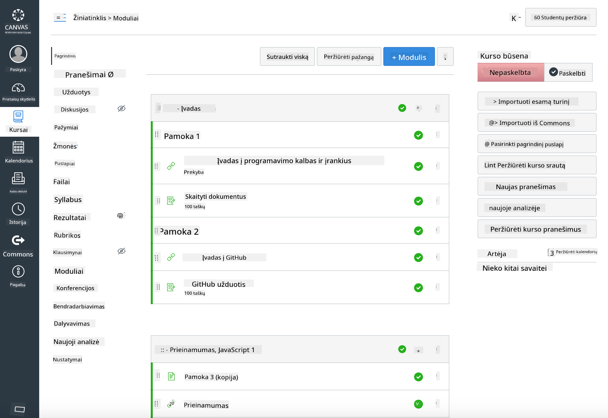

<!--
CO_OP_TRANSLATOR_METADATA:
{
  "original_hash": "71009af209f81cc01a1f2d324200375f",
  "translation_date": "2025-10-03T11:08:15+00:00",
  "source_file": "for-teachers.md",
  "language_code": "lt"
}
-->
### Mokytojams

Jūs galite naudoti šią mokymo programą savo klasėje. Ji puikiai veikia su GitHub Classroom ir populiariomis LMS platformomis, taip pat gali būti naudojama kaip atskiras repo su jūsų mokiniais.

### Naudojimas su GitHub Classroom

Norėdami valdyti pamokas ir užduotis pagal grupes, sukurkite po vieną saugyklą kiekvienai pamokai, kad GitHub Classroom galėtų priskirti kiekvieną užduotį atskirai.

- Nukopijuokite šį repo į savo organizaciją.
- Sukurkite atskirą repo kiekvienai pamokai, išskirdami kiekvienos pamokos aplanką į atskirą saugyklą.
  - 1 variantas: Sukurkite tuščias saugyklas (po vieną kiekvienai pamokai) ir nukopijuokite pamokos aplanko turinį į kiekvieną.
  - 2 variantas: Naudokite Git istoriją išsaugantį metodą (pvz., padalinkite aplanką į naują repo), jei jums reikia kilmės duomenų.
- GitHub Classroom sukurkite užduotį kiekvienai pamokai ir nurodykite atitinkamą pamokos repo.
- Rekomenduojami nustatymai:
  - Saugyklos matomumas: privatus studentų darbui.
  - Naudokite pradinį kodą iš pamokos repo numatytosios šakos.
  - Pridėkite problemų ir „pull request“ šablonus testams ir pateikimams.
  - Pasirinktinai sukonfigūruokite automatinį vertinimą ir testus, jei jūsų pamokose jie yra.
- Naudingi konvencijos patarimai:
  - Saugyklų pavadinimai, pvz., lesson-01-intro, lesson-02-html ir pan.
  - Žymos: quiz, assignment, needs-review, late, resubmission.
  - Žymos/leidimai pagal grupes (pvz., v2025-term1).

Patarimas: Venkite saugyklų laikymo sinchronizuotuose aplankuose (pvz., OneDrive/Google Drive), kad išvengtumėte Git konfliktų „Windows“ sistemoje.

### Naudojimas su Moodle, Canvas ar Blackboard

Ši mokymo programa apima importuojamus paketus, skirtus įprastiems LMS darbo procesams.

- Moodle: Naudokite Moodle įkėlimo failą [Moodle įkėlimo failas](../../../../../../../teaching-files/webdev-moodle.mbz), kad įkeltumėte visą kursą.
- Common Cartridge: Naudokite Common Cartridge failą [Common Cartridge failas](../../../../../../../teaching-files/webdev-common-cartridge.imscc), kad užtikrintumėte platesnį LMS suderinamumą.
- Pastabos:
  - Moodle Cloud turi ribotą Common Cartridge palaikymą. Geriau naudoti aukščiau pateiktą Moodle failą, kurį taip pat galima įkelti į Canvas.
  - Po importavimo peržiūrėkite modulius, terminų datas ir testų nustatymus, kad jie atitiktų jūsų semestro tvarkaraštį.

> Mokymo programa Moodle klasėje

> Mokymo programa Canvas platformoje

### Naudojimas tiesiogiai iš repo (be Classroom)

Jei nenorite naudoti GitHub Classroom, galite vykdyti kursą tiesiogiai iš šio repo.

- Sinchroniniai/online formatai (Zoom/Teams):
  - Vykdykite trumpus mentoriaus vedamus apšilimus; naudokite grupių kambarius testams.
  - Paskelbkite testų laikotarpį; studentai pateikia atsakymus kaip GitHub Issues.
  - Bendradarbiavimo užduotims studentai dirba viešuose pamokų repo ir atidaro „pull request“.
- Privatus/asinchroninis formatas:
  - Studentai nukopijuoja kiekvieną pamoką į savo **privačius** repo ir prideda jus kaip bendradarbį.
  - Jie pateikia per Issues (testai) ir Pull Requests (užduotys) jūsų klasės repo arba savo privačiuose kopijose.

### Geriausios praktikos

- Pateikite orientacinę pamoką apie Git/GitHub pagrindus, Issues ir PRs.
- Naudokite kontrolinius sąrašus Issues daugiaetapėms užduotims/testams.
- Pridėkite CONTRIBUTING.md ir CODE_OF_CONDUCT.md, kad nustatytumėte klasės normas.
- Pridėkite prieinamumo pastabas (alt tekstą, subtitrus) ir pasiūlykite spausdinamus PDF failus.
- Versijuokite savo turinį pagal semestrą ir užšaldykite pamokų repo po publikavimo.

### Atsiliepimai ir palaikymas

Norime, kad ši mokymo programa būtų naudinga jums ir jūsų studentams. Prašome atidaryti naują Issue šiame repo dėl klaidų, prašymų ar patobulinimų arba pradėti diskusiją „Teacher Corner“.

---

**Atsakomybės apribojimas**:  
Šis dokumentas buvo išverstas naudojant dirbtinio intelekto vertimo paslaugą [Co-op Translator](https://github.com/Azure/co-op-translator). Nors siekiame tikslumo, atkreipiame dėmesį, kad automatiniai vertimai gali turėti klaidų ar netikslumų. Originalus dokumentas jo gimtąja kalba turėtų būti laikomas autoritetingu šaltiniu. Kritinei informacijai rekomenduojama naudotis profesionalių vertėjų paslaugomis. Mes neprisiimame atsakomybės už nesusipratimus ar klaidingus aiškinimus, kylančius dėl šio vertimo naudojimo.