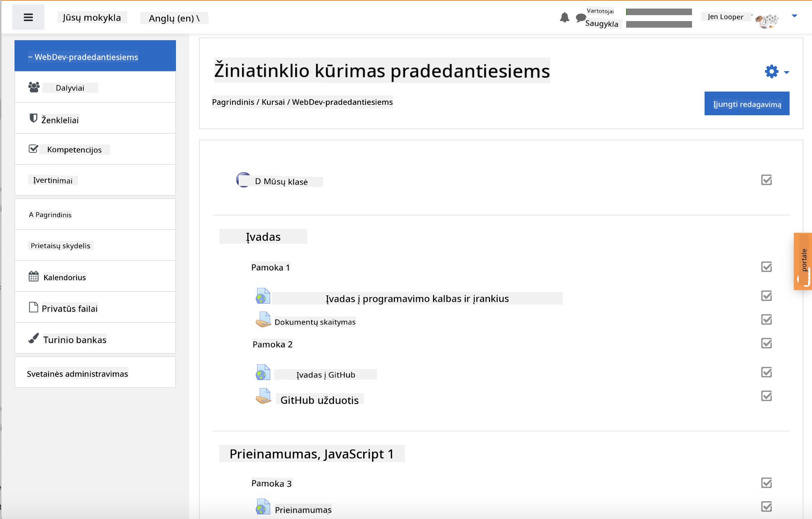

<!--
CO_OP_TRANSLATOR_METADATA:
{
  "original_hash": "75cb51f7ca9ea0b097ef4a1287e9290c",
  "translation_date": "2025-08-28T11:13:25+00:00",
  "source_file": "for-teachers.md",
  "language_code": "lt"
}
-->
## Mokytojams

Norėtumėte naudoti šią mokymo programą savo klasėje? Drąsiai tai darykite!

Iš tiesų, galite ją naudoti tiesiog GitHub platformoje, pasitelkdami GitHub Classroom.

Norėdami tai padaryti, nukopijuokite šį repozitoriją. Jums reikės sukurti atskirą repozitoriją kiekvienai pamokai, todėl turėsite išskirti kiekvieną aplanką į atskirą repozitoriją. Tokiu būdu [GitHub Classroom](https://classroom.github.com/classrooms) galės atskirai apdoroti kiekvieną pamoką.

Šios [išsamios instrukcijos](https://github.blog/2020-03-18-set-up-your-digital-classroom-with-github-classroom/) padės jums suprasti, kaip sukurti savo klasę.

## Naudojimas Moodle, Canvas ar Blackboard platformose

Ši mokymo programa puikiai veikia šiose mokymosi valdymo sistemose! Naudokite [Moodle įkėlimo failą](../../../../../../../teaching-files/webdev-moodle.mbz) visam turiniui arba išbandykite [Common Cartridge failą](../../../../../../../teaching-files/webdev-common-cartridge.imscc), kuriame yra dalis turinio. Moodle Cloud nepalaiko pilnų Common Cartridge eksportų, todėl geriau naudoti Moodle atsisiuntimo failą, kurį galima įkelti į Canvas. Prašome pranešti, kaip galėtume pagerinti šią patirtį.

> Mokymo programa Moodle klasėje

> Mokymo programa Canvas platformoje

## Naudojimas repozitorijos dabartiniu pavidalu

Jei norėtumėte naudoti šią repozitoriją tokią, kokia ji yra dabar, be GitHub Classroom, tai taip pat įmanoma. Jums reikės informuoti savo mokinius, kurią pamoką dirbti kartu.

Naudojant internetinį formatą (Zoom, Teams ar kitą), galite sukurti atskiras grupes viktorinoms ir padėti mokiniams pasiruošti mokymuisi. Tada pakvieskite mokinius dalyvauti viktorinose ir pateikti savo atsakymus kaip „issues“ tam tikru metu. Tą patį galite daryti ir su užduotimis, jei norite, kad mokiniai dirbtų bendradarbiaudami viešai.

Jei norite labiau privačios aplinkos, paprašykite mokinių nukopijuoti mokymo programą, pamoka po pamokos, į savo privačias GitHub repozitorijas ir suteikti jums prieigą. Tada jie galės atlikti viktorinas ir užduotis privačiai bei pateikti jas jums per „issues“ jūsų klasės repozitorijoje.

Yra daugybė būdų, kaip tai pritaikyti internetinio mokymo formatui. Prašome pranešti, kas jums veikia geriausiai!

## Pasidalinkite savo mintimis!

Norime, kad ši mokymo programa būtų naudinga jums ir jūsų mokiniams. Susisiekite su mumis [Mokytojų kampelyje](https://github.com/microsoft/Web-Dev-For-Beginners/discussions/categories/teacher-corner) ir atidarykite [**naują „issue“**](https://github.com/microsoft/Web-Dev-For-Beginners/issues/new/choose) dėl bet kokių prašymų, klaidų ar atsiliepimų.

---

**Atsakomybės apribojimas**:  
Šis dokumentas buvo išverstas naudojant AI vertimo paslaugą [Co-op Translator](https://github.com/Azure/co-op-translator). Nors siekiame tikslumo, prašome atkreipti dėmesį, kad automatiniai vertimai gali turėti klaidų ar netikslumų. Originalus dokumentas jo gimtąja kalba turėtų būti laikomas autoritetingu šaltiniu. Kritinei informacijai rekomenduojama naudoti profesionalų žmogaus vertimą. Mes neprisiimame atsakomybės už nesusipratimus ar klaidingus interpretavimus, atsiradusius naudojant šį vertimą.