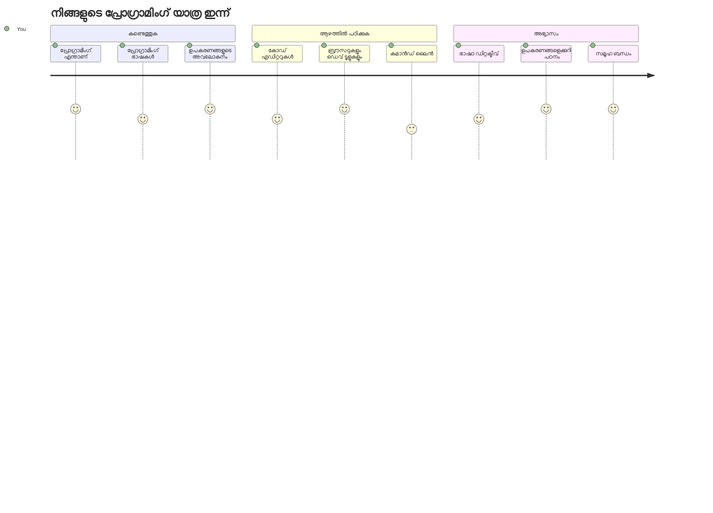
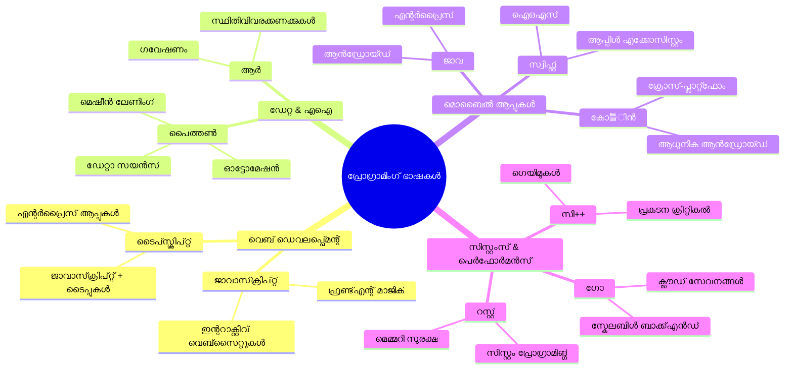
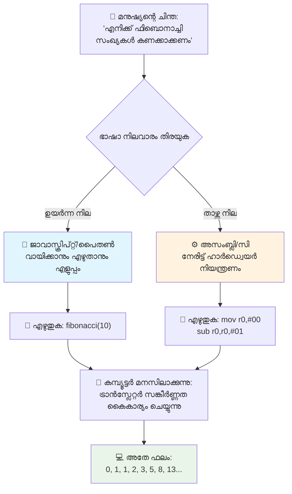
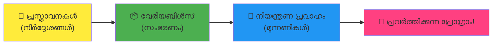
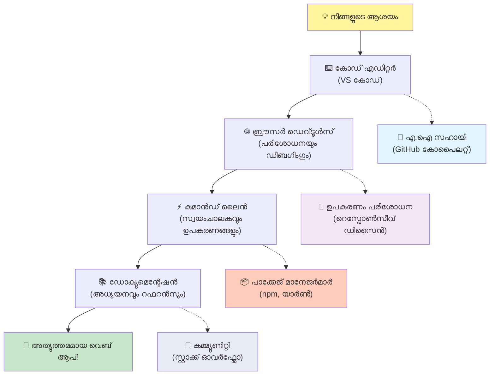
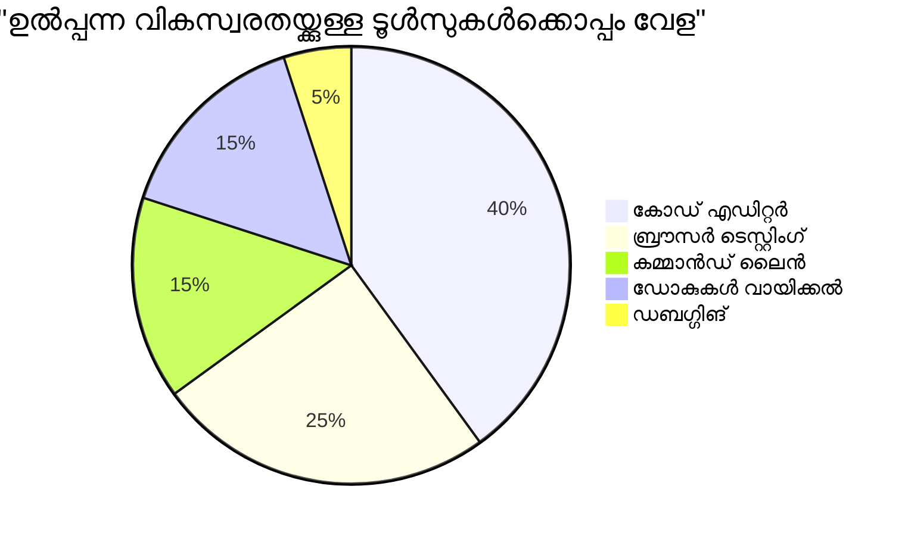
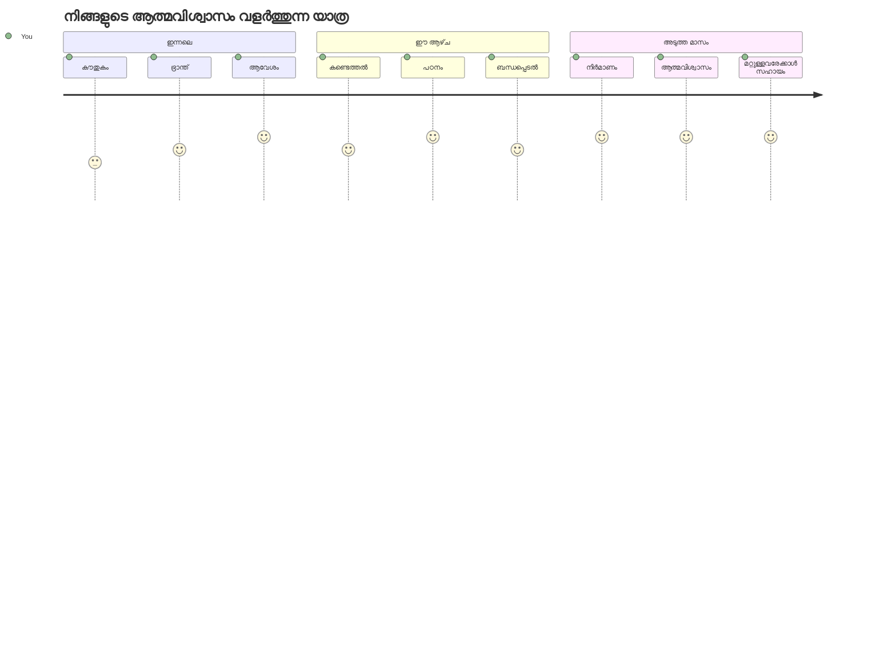

<!--
CO_OP_TRANSLATOR_METADATA:
{
  "original_hash": "d45ddcc54eb9232a76d08328b09d792e",
  "translation_date": "2026-01-08T20:09:54+00:00",
  "source_file": "1-getting-started-lessons/1-intro-to-programming-languages/README.md",
  "language_code": "ml"
}
-->
# പ്രോഗ്രാമിംഗ് ഭാഷകളും ആധുനിക ഡെവലപ്പർ ടൂളുകളുമാണ് പരിചയം

ഹായ്, ഭാവിയിലെ ഡെവലപ്പർ! 👋 ഞാൻ നിനക്കൊരു രഹസ്യം പറയാമോ, അത് എനിക്ക് ഓരോ ദിവസവും കണ്ണ് പിമ്പിക്കുന്നു? പ്രോഗ്രാമിംഗ് എന്നത് കംപ്യൂട്ടറുകളെക്കുറിച്ചല്ല – ഇത് നിങ്ങളുടെ സ്ഥാപനഭംഗി ഐഡിയകൾ ജീവനൊലിപ്പിക്കാൻ ഉള്ള യഥാർത്ഥ അത്ഭുത്യമാർന്ന ശക്തികളാണ്!

നിങ്ങളുടെ പ്രിയപ്പെട്ട ആപ്പ് ഉപയോഗിക്കുമ്പോൾ എല്ലാം പകിട്ടായി പൊരുത്തപ്പെടുന്നതിനുള്ള ആ നിമിഷം നിങ്ങൾക്ക് അറിയാമോ? നിങ്ങൾ ഒരു ബട്ടൺ തള്ളുമ്പോൾ അത്ഭുതം പടർന്നുപോകുന്ന ഒരു കാര്യമാണ് സംഭവിക്കുന്നത്, നിങ്ങളെ "വാവ്, അവർ അത് എങ്ങനെ ചെയ്തുവെന്ന്?" എന്ന് ചോദിക്കുന്നതാക്കും? അങ്ങനെ, നിങ്ങൾ പോലൊരു വ്യക്തി – എങ്കിലും അവരുടെ പ്രിയപ്പെട്ട കാപ്പി ഷോപ്പിൽ 2 മണിക്ക് മൂന്നാം എസ്പ്രസോ കപ്പുമായി ഇരിക്കുന്ന – ആ മായാജാലം സൃഷ്ടിച്ച കോഡ് എഴുതിയതാണ്. ഇതാകട്ടെ നിങ്ങളുടെ മനസ്സ് പൊട്ടിക്കും: ഈ പാഠത്തിന്റെ അവസാനം, അവർ അത് എങ്ങനെ ചെയ്തെന്നും നിങ്ങൾക്ക് മനസിലാകും മാത്രമല്ല, അത് നിങ്ങൾ തന്നെ ശ്രമിക്കാൻ താൽപ്പര്യം ഉണ്ടാകും!

നിങ്ങൾക്ക് പ്രോഗ്രാമിംഗ് ഇപ്പോൾ ഭയപ്പെട്ട പോലെ തോന്നിയാൽ ഞാൻ മനസ്സിലാക്കുന്നു. ഞാൻ തുടങ്ങുമ്പോൾ, നിങ്ങൾക്ക് മാത്ത് ജീനിയസായിരിക്കണം അല്ലെങ്കിൽ അഞ്ചു വയസു മുതൽ കോഡിങ് ചെയ്യും എന്ന് ഞാൻ വിശ്വസിച്ചു. പക്ഷേ, എന്റെ കാഴ്ചപ്പാട് പൂർണ്ണമായും മാറിയത്: പ്രോഗ്രാമിംഗ് ഒരു പുതിയ ഭാഷയിൽ സംഭാഷണം പഠിക്കുന്നതുപോലെയാണ്. നിങ്ങൾ "ഹലോ" "നന്ദി" മുതലായവയിൽ നിന്ന് തുടങ്ങി, പിന്നീട് കാപ്പി ഓർഡർ ചെയ്യുന്നതിലും പിന്നെ തൽസമയ തത്ത്വ ചർച്ചകൾ ചെയ്യുന്നതിലേക്കും പോകും! എന്നാൽ ഈ സാഹചര്യത്തിൽ, നിങ്ങൾ കംപ്യൂട്ടറുകളുമായി സംസാരിച്ചുകൊണ്ടിരിക്കുകയാണ്, സത്യത്തിൽ? അവർ ലോകത്തിലെ ഏറ്റവും ക്ഷമയുള്ള സംഭാഷണ പാർട്ണറുമാണ് – ഒരുമിച്ച് ചെയ്ത പിശകുകൾക്ക് തീരുമാനമിടാറില്ല, വീണ്ടും ശ്രമിക്കാൻ എപ്പോഴും ആവേശത്തിലാണ്!

ഇന്ന് നാം ആധുനിക വെബ് വികസനം സാദ്ധ്യമാക്കുന്നതിനും അതിനായി വൃത്തിവത്കരിച്ച ആധുനിക ടൂളുകളെക്കുറിച്ച് പ്രാവശ്യമാണ്. നെറ്റ്ഫ്ലിക്സ്, സ്പോട്ടിഫൈ, നിങ്ങളുടെ പ്രിയപ്പെട്ട ഇൻഡീ ആപ്പ് സ്റ്റുഡിയോ എന്നിവിടങ്ങളിലെ ഡെവലപ്പറർമാർ ദിവസവും ഉപയോഗിക്കുന്ന സമാനമായ എഡിറ്റർ, ബ്രൗസർ, പ്രവൃത്തി രീതികൾ ആണ് ഇവിടെ ഉദ്ദേശിക്കുന്നത്. ഇത് നിങ്ങളെ സന്തോഷത്തിൽ റീച്ച് ചെയ്യാൻ പോകുന്നത്: ഈ പ്രൊഫഷണൽ ഗ്രേഡ്, വ്യവസായ നിലവാരത്തിലുള്ള ടൂളുകൾ കൂടുതലായി സൗജന്യമാണ്!


> സ്കെച് നോട്ട്സ്: [Tomomi Imura](https://twitter.com/girlie_mac)


## നീന്തിൻറോ നീ അറിയുന്നതെന്തൊക്കെയെന്നു നമുക്ക് നോക്കാം!

ആ പരിചയപ്പെടുത്തലുകൾ തുടങ്ങാൻ മുൻപ്, ഈ പ്രോഗ്രാമിംഗ് ലോകത്തെക്കുറിച്ച് നിനക്ക് ഇതുവരെ എന്ത് അറിയാമെന്നു ഞാൻ കൗതുകം തോന്നുന്നു! നീ ഈ ചോദ്യങ്ങൾ കാണുമ്പോൾ "ഇതൊക്കെ ഞാൻ പകർന്നുമാത്രം അറിയില്ല" എന്ന് തോന്നിയാലും അതു സാധാരണമാണ്, പ്രതീക്ഷിച്ച കാര്യത്തിും നിറഞ്ഞതാണ്! അങ്ങനെ, നീ ശരിയായ സ്ഥലത്തുണ്ട്. ഈ ക്വിസ് ഒരു വർക്ക്ഔട്ടിന് മുമ്പുള്ള പൊരുത്തമാണ് – നാം നമ്മുടെ മസ്തിഷ്‌ക പേശികൾ ചൂടാക്കുകയാണ്!

[പാഠം ആരംഭിക്കുന്നതിന് മുമ്പ് ക്വിസ് എടുത്തു നോക്ക്](https://forms.office.com/r/dru4TE0U9n?origin=lprLink)


## നാം ചേർന്ന് ചെയ്യാൻ പോകുന്ന സഞ്ചാരം

ശരി, ഇന്ന് നാം അന്വേഷിക്കാൻ പോകുന്നത് എത്ര എക്‌സൈറ്റിങ് ആണെന്ന് ഞാൻ నిజമായി ഉറ്റുനോക്കുന്നു! ഈ ആശയങ്ങൾ ചിലപ്പോൾ നിനക്ക് ക്ലിക് ചെയ്യുമ്പോൾ, നിന്നിൽ മുഖം കണ്ടാൽ എനിക്ക് ആഗ്രഹമുണ്ടൂ. നമ്മൾ ചേർന്ന് പോകുന്ന അത്ഭുതകരമായ യാത്ര ഇതാണ്:

- **പ്രോഗ്രാമിംഗ് എന്നാൽ എന്തെന്ന് ആകത്തരം (കാരണം ഇത് എങ്ങനെ ഏറ്റവും കൂളായ കാര്യമാണെന്ന്!)** – കോഡ് എന്നാൽ നിസ്‌ക്കളമായ മായാജാലം, അത് നിങ്ങളെ ചുറ്റിപ്പറ്റിയ എല്ലാം ആർജ്ജിക്കുന്നതിന്റെ പിഞ്ച് എന്നറിയാം, ആ ആലാറം സിസ്റ്റം എങ്ങനെ തിങ്കൾ രാവിലെ ആയി എന്ന് മനസ്സിലാക്കുന്നതിന് തുടങ്ങിയവർക്ക്Netflix ഉള്ള സുതാര്യമായ‌ യന്ത്രങ്ങൾ വരെ
- **പ്രോഗ്രാമിംഗ് ഭാഷകളും അവയുടെ അത്ഭുത വിചിത്രതകളും** – വ്യത്യസ്ത വ്യക്തികൾ വ്യത്യസ്ത പ്രശ്നങ്ങൾ പരിഹരിക്കുന്ന വിധങ്ങളിൽ സൂപ്പർപവർ ഉള്ള പാർട്ടിയിൽ നിങ്ങൾ നടക്കുകയാണെന്ന് ദ്യായിക്കൂ. അങ്ങനെ തന്നെ പ്രോഗ്രാമിംഗ് ഭാഷകൾ ലോകമാണെന്നും അവയെകൂടി കാണാൻ നിങ്ങൾ ഇഷ്ടപ്പെടും!
- **ഡിജിറ്റൽ മായാജാലം ഉണ്ടാക്കുന്ന അടിസ്ഥാന ഘടകങ്ങൾ** – ഇതിനെ ലെഗോ സജ്ജീകരണം എന്ന് ചിന്തിക്കൂ. ഈ ഭാഗങ്ങൾ എങ്ങനെ ചേർക്കാൻ അറിയുമ്പോൾ നിനക്ക് സ്വപ്നം കാണുന്ന കാര്യങ്ങൾ നിഷേധം മാത്രമല്ല സൃഷ്ടിക്കാം
- **പ്രൊഫഷണൽ ടൂളുകൾ, നിങ്ങൾക്ക് ജാദുകർ വണ്ട് നൽകി തന്നെന്നാണ് അനുഭവപ്പെടുക** – ഞാൻ നാടകമല്ല, ഈ ടൂളുകൾ നിങ്ങളെ യഥാർത്ഥത്തിൽ സൂപ്പർപവർ ഉള്ളതായി തോന്നിക്കും, കൂടുതലായി? അതെ പ്രൊഫഷണലുകൾ ഉപയോഗിക്കുന്ന തന്നെയാണ്!

> 💡 **കുറിപ്പ്**: ഇന്നത്തെ പാഠം എല്ലാം ഓർമ്മിക്കാൻ ശ്രമിക്കരുത്! ഇപ്പോൾ ഞാൻ നിങ്ങളെ ആ വിളക്ക് തോന്നാൻ ആഗ്രഹിക്കുന്നു. വിശദാംശങ്ങൾ സ്വാഭാവികമായി പതിക്കും – പുത്തൻ പഠനം അതുപോലെയാണ്!

> നിങ്ങൾക്ക് ഈ പാഠം [Microsoft Learn](https://docs.microsoft.com/learn/modules/web-development-101/introduction-programming/?WT.mc_id=academic-77807-sagibbon) ലും എടുക്കാം!

## അതെന്ത് അതിലും *പരിഗണിക്കപ്പെടുന്നത്* പ്രോഗ്രാമിംഗ്?

സരി, മില്യൺ ഡോളർ ചോദ്യം: പ്രോഗ്രാമിംഗ് എന്നാൽ എന്താണ്?

ഇതിനെ കുറിച്ചുള്ള എനിക്ക് കാഴ്ചപ്പാട് പൂർണ്ണമായും മാറ്റിയ ഒരു കഥ ഞാൻ പറയാം. കഴിഞ്ഞ ആഴ്ച, ഞങ്ങളുടെ പുതിയ സ്മാർട്ട് ടിവി റിമോട്ട് മാതാവിനോട് എങ്ങനെ ഉപയോഗിക്കാമെന്ന് വിശദീകരിക്കാൻ ശ്രമിച്ചപ്പോഴാണ്. ഞാൻ പറയുന്നത്: "പൂവൻ ചുവപ്പ് ബട്ടൺ അമർത്തൂ, പക്ഷേ വലിയ ചുവപ്പ് ബട്ടൺ അല്ല, ഇടത്തുള്ള ചെറിയ ചുവപ്പ് ബട്ടൺ... അല്ല, നീയുടെ മറ്റൊരു ഇടത്തുള്ളത്... ശരി, ഇപ്പോൾ അത് രണ്ട് സെക്കൻഡ് അമർത്തൂ, ഒന്ന് അല്ല, മൂന്നു അല്ല..." എന്നിങ്ങനെ. പരിചിതമാണോ? 😅

അത് പ്രോഗ്രാമിംഗ്! വളരെ ശക്തമായ, വിശദമായ, ഘട്ടം തോറും നിർദേശങ്ങൾ നൽകുന്നതിനുള്ള കലയാണ്. എന്നാൽ നിങ്ങളുടെ അമ്മായിയോട് വിശദീകരിക്കുന്നതിനുപകരം (അവൾ ചോദിക്കാം "എന്ത് ചുവപ്പ് ബട്ടൺ?") കംപ്യൂട്ടറോട് പറയുന്നു (ആർജ്ജിക്കുന്നത് കേൾക്കാതെ എപ്രകാരമാണ് പറഞ്ഞത് എന്നതിനേക്കാളും ശരിയായതു മാത്രം നടത്തുന്നു).

ഞാൻ ആദ്യം പഠിച്ചപ്പോൾ മനശ്ശ്ശ്യം പൊട്ടിപ്പോയത്: കംപ്യൂട്ടറുകൾ മിക്കപ്പോഴും ലളിതമാണ്. അവയ്ക്ക് രണ്ട് കാര്യങ്ങൾ മാത്രം മനസ്സിലാവും – 1യും 0യും, അതായത് "ആകും" "ഇല്ല" അല്ലെങ്കിൽ "ഓൺ" "ഓഫ്." അതെത്ര! എന്നാൽ ഇതാണ് മായാജാലം – നമ്മൾ 1-ഉം 0-ഉം സംസാരിക്കേണ്ടതില്ല, അത് ത് The Matrix ലെ പോലെ അല്ല. അതാണ് **പ്രോഗ്രാമിംഗ് ഭാഷകൾ** സഹായിക്കുന്നത്. അവ ഭരണഭാഷയായി നമുക്ക് പരിചയമുള്ള മാനവ ചിന്തകൾ കംപ്യൂട്ടർ ഭാഷയിലാക്കി മാറ്റാൻ ഏറ്റവും മികച്ച വിവർത്തകര് പോലെയാണ്.

ഞാൻ ഇന്നും ഓരോ രാവിലെ ഉണരുമ്പോൾ അത്ഭുതമുള്ള ചൂടില്ലാതെ പ്രവേശിക്കുന്ന കാര്യം: നിങ്ങളുടെ ജീവിതത്തിലൊഴികെയുള്ള ഡിജിറ്റൽ എല്ലാം തന്നെ ഒരു ആൾ, നിങ്ങൾ പോലെ, സന്ധ്യയിൽ ജാമകളടിച്ച് കാപ്പി കുടിച്ച് ലാപ്ടോപ്പിൽ കോഡ് ടൈപ്പ് ചെയ്യുന്നതോടെ തുടങ്ങി. ആ ഇൻസ്റ്റാഗ്രാം ഫിൽറ്റർ നിങ്ങളുടെ സൗന്ദര്യം വർദ്ധിപ്പിക്കുന്നതു? ആരോ അത് കോഡ് ചെയ്തു. പുതിയ മനസ്സിലാക്കിയ പാട്ടിലേക്ക് വഴി കണ്ടെത്തിയ ശുപാർശ? ഒരു ഡെവലപ്പർ ആ ആൽഗോറിതം നിർമ്മിച്ചു. നിങ്ങളുടെ സുഹൃത്തുക്കൾക്കൊപ്പം ഡിന്നർ ബില്ലുകൾ തിരിഞ്ഞ് നൽകുന്നതിന് ആപ്പ്? ആരോ "ഇത് എനിക്കു വിഷമമാണ്, ഞാനു പരിഹരിക്കും" എന്ന് വിചാരിച്ചു, പിറ്റേയ്ക്ക് അവർ ചെയ്തു!

നിങ്ങൾ പ്രോഗ്രാമിംഗ് പഠിക്കുമ്പോൾ, നിങ്ങൾ ഒരു നവീന കഴിവ് മാത്രവും നേടുന്നത് അല്ല – പ്രശ്നപരിഹാര ടീമിന്റെ അംഗമായിത്തിരിക്കുന്നു, ആരും "ഏതെങ്കിലും ഒരു കാര്യം മറ്റൊരാളുടെ ദിവസം കുറച്ച് മികച്ചതാക്കി മാറ്റാമോ?" എന്ന് ആലോചിക്കുന്നു. സത്യത്തിൽ, ഇതിന്റെതിൽ സുഖകരമായ ഒന്നുമുണ്ടോ?

✅ **ഫൺ ഫാക്ട് ഹണ്ട്**: നിങ്ങളുടെ സമയം ഉള്ളപ്പോൾ തേടേണ്ടതായൊരു കിടിലം നറുക്ക് – ലോകത്തിലെ ആദ്യ പ്രോഗ്രാമർ ആരായിരുന്നു എന്ന് നിങ്ങൾ വിചാരിക്കുന്നു? ഞാൻ സൂചന നല്‍കുന്നു: നിങ്ങൾ പ്രതീക്ഷിക്കുന്നവനല്ല! ആ വ്യക്തിയുടെ കഥ അത്ഭുതകരമായതാണ്, പ്രോഗ്രാമിംഗ് സൃഷ്ടിപരമായ പ്രശ്നപരിഹാരത്തിന്റെയും പരിധികളിൽ ചിന്തിക്കുന്നതിന്റെ ഭാഗമായാണ് എന്നും തെളിയിക്കുന്നു.

### 🧠 **അവലോകന സമയം: നിങ്ങൾ എങ്ങനെ അനുഭവപ്പെടുന്നു?**

**ഒരു നിമിഷം ചിന്തിക്കൂ:**
- "കമ്പ്യൂട്ടറുകൾക്ക് നിർദ്ദേശങ്ങൾ നൽകുന്നത്" നിങ്ങളുടെ മനസ്സിലായി കഴിഞ്ഞോ?
- നിങ്ങൾ പ്രതിദിന പ്രവർത്തനം പ്രോഗ്രാമിങ്ങ് ഉപയോഗിച്ച് സ്വയം പ്രവർത്തിപ്പിക്കാൻ ആഗ്രഹിക്കുന്നുണ്ടോ?
- പ്രോഗ്രാമിംഗ് സംബന്ധിച്ച് എന്തൊക്കെ ചോദ്യങ്ങൾ എടുക്കുന്നു?

> **ഓർമ്മിക്കുക**: ചില ആശയങ്ങൾ ഇപ്പോൾ മയങ്ങുകയും ശരിയിട്ട് മനസ്സിലാകാതിരിക്കേണ്ടതാണ്. ഒരു പുതിയ ഭാഷ പഠിക്കുന്നത് പോലെ പ്രോഗ്രാമിംഗ് പഠനത്തിനും നിങ്ങളുടെ മസ്തിഷ്‌കത്തിന് അനുയോജ്യമായ നാഡിവഴികൾ രൂപപ്പെടാൻ സമയം വേണ്ടിവരും. നിങ്ങൾ മികച്ചതായി പോവുകയാണ്!

## പ്രോഗ്രാമിംഗ് ഭാഷകൾ മായാജാലത്തിന്റെ വ്യത്യസ്ത രുചികളാണ്

ശരി, ഇത് അല്പം വിചിത്രമായി തോന്നാമെങ്കിലും ശ്രദ്ധിക്കൂ – പ്രോഗ്രാമിംഗ് ഭാഷകൾ വിവിധ തരം സംഗീതങ്ങളറുപോലെയാണ്. ജാസ്സ് മൃദുവും തൽസമയപരവുമാണ്, റോക്ക് ശക്തിയുള്ളതും സുതാര്യവുമാണ്, ക്ലാസിക്കൽ സകലകူശലവും ഘടനാപരവുമാണ്, ഹിപ്-ഹോപ്പ് സൃഷ്ടി പരവും പ്രകടനപരവുമാണ്. ഓരോ ശൈലിയുടെയും തനത് ലൈഫ്, അതിന്റെ ആരാധക സമൂഹം ഉണ്ട്, ഓരോന്നും വ്യത്യസ്തമായ മനോഭാവങ്ങൾക്കും അവസരങ്ങൾക്കും അനുയോജ്യം.

പ്രോഗ്രാമിംഗ് ഭാഷകളും അതുപോലെയാണ്! വലിയ ക്യുoanുകൾ കൈകാര്യം ചെയ്യുന്നതിനും ഒരു രസകരമായ മൊബൈൽ ഗെയിം നിർമ്മിക്കുന്നതിനും ഒരേ ഭാഷ ഉപയോഗിക്കില്ല, നാം യോഗ ക്ലാസിൽ ഡെത്ത് മെറ്റൽ പ്ലേ ചെയ്യുന്നില്ല പോലെ (അധികം യോഗാ ക്ലാസുകളല്ലന്നെങ്കിലും! 😄).

എന്തുകൊണ്ടയിരിക്കും എപ്പോഴെങ്കിലും വിചാരിക്കുന്നത്: ഈ ഭാഷകൾ ലോകത്തിലെ ഏറ്റവും ക്ഷമയുള്ള, ഏറ്റവും മുത്തശ്ശി ഗുണം തെളിയിച്ച വിവർത്തകരെ പോലെയാണ്; നിങ്ങൾക്ക് നിങ്ങളുടെ മനുഷ്യ ചിന്തകൾ സ്വാഭാവിക സന്ദേശങ്ങളാക്കി അവതരിപ്പിക്കാൻ കഴിയും, അവ ക്യുoan 1,0 സാങ്കേതിക ഭാഷയിലേക്ക് വിവർത്തനം ചെയ്യുന്നു. മനുഷ്യ സൃഷ്ടിപരത്വവും കംപ്യൂട്ടർ തർക്കവും അറിയുന്ന സുഹൃത്ത് പോലെയാണ് – എപ്പോഴും ക്ഷീണിക്കാറില്ല, കോഫി ബ്രേക്ക് ആവശ്യമില്ല, ഒരേ ചോദ്യം രണ്ടുതവണ ചോദിച്ചതിന് അപമാനിക്കുന്നില്ല!

### ജനപ്രിയ പ്രോഗ്രാമിംഗ് ഭാഷകളും അവയുടെ ഉപയോക്തൃ രീതികളും


| ഭാഷ | മികച്ചത് | പ്രശസ്തമായ കാരണം |
|----------|----------|------------------|
| **ജാവാസ്ക്രിപ്റ്റ്** | വെബ് വികസനം, ഉപയോക്തൃ ഇന്റർഫേസുകൾ | ബ്രൗസറുകളിൽ പ്രവർത്തിക്കുന്നു, ഇന്ററാക്ടീവ് വെബ്സൈറ്റുകൾക്ക് ശക്തി നൽകുന്നു |
| **പൈതൺ** | ഡാറ്റാ സയൻസ്, ഓട്ടോമേഷൻ, എഐ | വായിക്കാൻ എളുപ്പവും പഠിക്കാൻ സൗകര്യവുമുള്ള ശക്തമായ ലൈബ്രറികൾ |
| **ജാവ** | സംരംഭ ആപ്ലിക്കേഷനുകൾ, ആൻഡ്രോയിഡ് ആപ്പുകൾ | പ്ലാറ്റ്‌ഫോം സ്വതന്ത്രം, വലിയ സിസ്റ്റങ്ങളിലേക്ക് ശക്തം |
| **സി#** | വിൻഡോസ് ആപ്ലിക്കേഷനുകൾ, ഗെയിം വികസനം | മൈക്രോസോഫ്റ്റിന്റെ ശക്തമായ പരിസരം പിന്തുണയ്ക്കുന്നു |
| **ഗോ** | ക്ലൗഡ് സേവനങ്ങൾ, ബാക്ക്‌എൻഡ് സിസ്റ്റങ്ങൾ | വേഗതയുള്ള, ലളിതമായ, ആധുനിക കമ്പ്യൂട്ടിംഗിന് രൂപകൽപ്പന ചെയ്‌തത് |

### ഹൈലെവൽ vs ലോലെവൽ ഭാഷകൾ

സത്യത്തിൽ പഠനത്തിനു മുമ്പാണ് ഈ ആശയം എന്റെ മസ്തിഷ്‌കം പൊട്ടിച്ചത്, ഞാൻ ഉപമ നൽകുന്നു – അത് നിങ്ങൾക്കുമുള്ള സഹായിയായിരിക്കും എന്ന് പ്രതീക്ഷിക്കുന്നു!

ഒരു മുസafir / വിദേശ യാത്രക്കാരനായി എന്ത് ഭാഷയും അറിയാതെ രാജ്യത്തു പോയി അടുത്ത ശൗചാലയം കണ്ടെത്തേണ്ടത് (നാം എല്ലാവരും പോയിട്ടുണ്ട്, അല്ലേ? 😅):

- **താഴത്തെക്കു വരുന്ന പ്രോഗ്രാമിംഗ്**: നിങ്ങളുടെ പ്രാദേശിക ഭാഷയിലുള്ള ഒരു പഴയ മുത്തശ്ശി കൊണ്ട് പഴയ സംസ്കാരങ്ങൾ, പ്രാദേശിക തകരാറുകൾ, ഇന്സൈഡ് ജോക്കുകൾ ഉൾപ്പെടുത്തി പറയുമ്പോൾ. അത്ഭുതകരം, കാര്യക്ഷമവും... പക്ഷേ നിങ്ങൾക്ക് ദയവായി ഒരു ശൗചാലയം കണ്ടെത്താനാണെങ്കിൽ വളരെ ബുദ്ധിമുട്ടുള്ളത്.

- **മുകളിൽ വരുന്ന പ്രോഗ്രാമിംഗ്**: നിന്നെ മനസിലാക്കുന്ന ഒരു പ്രാദേശിക സുഹൃത്ത് പോലെയാണ്. നിങ്ങൾ "ഞാൻ ശൗചാലയം കണ്ടെത്തേണ്ടതാണ്" എന്ന സാധാരണ ഇംഗ്ലീഷ് പറയുമ്പോൾ കുറവുകൾക്കായി പരിഭാഷെന്നും വഴിക്കാട്ടിയും നൽകുന്നു.

പ്രോഗ്രാമിങ്ങിൽ ഇത് ഇങ്ങനെ കൂടിയാണ്:
- **താഴത്തെക്കു വരുന്ന ഭാഷകൾ** (അസംബ്ലി, C പോലുള്ള) നിങ്ങളുടെ കംപ്യൂട്ടറിലെ ഹാർഡ്വെയർ നേരിട്ട് നിയന്ത്രിക്കാൻ അനുവദിക്കുന്നു, പക്ഷെ യന്ത്രം പോലെ ചിന്തിക്കേണ്ടതുണ്ട് – വളരെ മനസ്സിലാക്കാൻ പ്രയാസമാണ്!
- **മുകളിൽ വരുന്ന ഭാഷകൾ** (ജാവാസ്ക്രിപ്റ്റ്, പൈതൺ, സി#) നിങ്ങൾ ഒരുപാട് മനുഷ്യപോലെ ചിന്തിക്കുമ്പോൾ പിന്നണിയിൽ യന്ത്രഭാഷ കൈകാര്യം ചെയ്യുന്നു. കൂടാതെ, പുതിയവരാരെന്ന ഓർമിച്ച് സഹായിക്കാൻ സന്നദ്ധരായ മനോഹര സമുദായങ്ങൾ ഇതിലേക്ക് ഉണ്ട്!

നിങ്ങൾക്ക് ആരംഭിക്കാൻ ഞാൻ ഏത് ശുപാർശ ചെയ്യുന്നുവെന്ന് തില്ലോ? 😉 ഉയർന്നതലത്തിലുള്ള ഭാഷകൾ പരിശീലന ചക്രങ്ങൾ പോലെയാണ്, നീ ഒന്നും നീക്കം ചെയ്യാൻ ആഗ്രഹിക്കില്ല, കാരണം അത് അനുഭവം വളരെ സുഗമമാക്കും!


### ഉയർന്നതലത്തിലുള്ള ഭാഷകൾ എങ്ങനെ സുഹൃദയമായിട്ടാണ് കാണുന്നത് എന്ന് ഞാൻ കാണിച്ചുതരാം

ശരി, ഉയർന്നതലത്തിലുള്ള ഭാഷകളോടുള്ള എന്റെ സ്നേഹം തീർത്തും വ്യക്തമായി കാണിക്കുന്ന ഉദാഹരണം കാണിക്കുകയാണ് – ഇതു കാണുമ്പോൾ ഞെട്ടാതിരിക്കുക. ഇത് ഭീതി തോന്നുന്നാവശ്യവും ആണ്. ആ കാരണമാണ് ഞാൻ പറയുന്നത്!

നാം ഒരേ ജോലി രണ്ട് വ്യത്യസ്ത രീതികളിൽ എഴുതിയതാണ് കാണുന്നത്. രണ്ട് രീതികളും ഫിബൊനാച്ചി സിക്വൻസ് സൃഷ്ടിക്കുന്നു – ഓരോ സംഖ്യയും മുമ്പത്തെ രണ്ടിന്റെ കൂട്ടമാണ്: 0, 1, 1, 2, 3, 5, 8, 13... (രസകരം: പ്രകൃതിയിൽ എല്ലായിടത്തും ഈ മാതൃക കാണാം – സൂര്യക്കുളം സർക്കിളുകൾ, പൈൻകോൺ മാതൃകകൾ, ഗലക്സി രൂപീകരണം!)

വ്യത്യാസം കാണാൻ തയ്യാറാണോ? നമുക്ക് പോകാം!

**ഉയർന്നതല ഭാഷ (ജാവാസ്ക്രിപ്റ്റ്) – മനുഷ്യന് സൗഹൃദം:**

```javascript
// ഘട്ടം 1: അടിസ്ഥാന ഫിബോണാച്ചി സജ്ജീകരണം
const fibonacciCount = 10;
let current = 0;
let next = 1;

console.log('Fibonacci sequence:');
```

**ഈ കോഡ് ചെയ്യും:**
- **ഒരുചെരിപ്പ് നിശ്ചയിക്കും**, ഫിബൊനാച്ചി സംഖ്യ എത്രത്തോളം സൃഷ്ടിക്കാനാണ് എന്നത് സംബന്ധിച്ച്
- **രണ്ട്변숫ുകൾ ആരംഭിക്കും**, ഇപ്പോഴത്തെ സംഖ്യയും അടുത്ത സംഖ്യയും ട്രാക്ക് ചെയ്യാനായി
- **സൂരാംശം ക്രമീകരിക്കും** (0, 1) ഫിബൊനാച്ചി മാതൃക നിർവ്വചിക്കാൻ
- **ഒരു തലക്കെട്ട് സന്ദേശം പ്രദർശിപ്പിക്കും** ഞങ്ങളുടെ ഫലം തിരിച്ചറിയാൻ

```javascript
// ഘട്ടം 2: ലുപ് ഉപയോഗിച്ച് വിപ്രവാഹം സൃഷ്ടിക്കുക
for (let i = 0; i < fibonacciCount; i++) {
  console.log(`Position ${i + 1}: ${current}`);
  
  // അനുക്രമത്തിലെ അടുത്ത സംഖ്യ ഗണിക്കുക
  const sum = current + next;
  current = next;
  next = sum;
}
```

**ഇവിടെ സംഭവിക്കുന്ന കാര്യങ്ങൾ:**
- **`for` ലൂപ്പ് ഉപയോഗിച്ച്** സീക്വൻസിലെ ഓരോ സ്ഥാനത്തിലും യാത്രചെയ്യുന്നു
- **ഫലം പ്രദർശിപ്പിക്കുന്നു** ഓരോ സംഖ്യയും അതിന്റെ സ്ഥാനത്തോടുകൂടി ടെംപ്ലേറ്റ് ലിടെറൽ ഉപയോഗിച്ച്
- **അടുത്ത സംഖ്യ കണക്കാക്കുന്നു** ഇപ്പോഴത്തെയും അടുത്തതുമായ സംഖ്യകൾ കൂട്ടിച്ചേർത്ത്
- **ട്രാക്കിംഗ് വേരിയബിളുകൾ പുതുക്കുന്നു** അടുത്ത തവണയുടെ അതിക്രമം കൈകാര്യം ചെയ്യാൻ

```javascript
// ഘട്ടം 3: ആധുനിക പ്രവർത്തന സമീപനം
const generateFibonacci = (count) => {
  const sequence = [0, 1];
  
  for (let i = 2; i < count; i++) {
    sequence[i] = sequence[i - 1] + sequence[i - 2];
  }
  
  return sequence;
};

// ഉപയോഗ ഉദാഹരണം
const fibSequence = generateFibonacci(10);
console.log(fibSequence);
```

**മുൻപുള്ളത്:**
- **ആധുനിക എറോ ഫങ്ഷൻ സംഖ്യ ഉപയോഗിച്ച്** പുനരുപയോഗയോഗ്യമാക്കി പ്രവർത്തനം നിർമ്മിച്ചു
- **ഒരു അറേ നിർമ്മിച്ചു** മുഴുവൻ സീക്വൻസ് സൂക്ഷിക്കാൻ, ഒരൊറ്റ സംഖ്യ പ്രദർശിപ്പിക്കുന്നതിനുപകരം
- **അറേയുടെ ഇൻഡെക്സിംഗും ഉപയോഗിച്ചു** പുതിയ സംഖ്യ കണക്കാക്കാൻ
- **മുഴുവൻ പരമ്പര തിരിച്ചുനൽകി**, നമ്മുടെ പ്രോഗ്രാമിന്റെ ബാക്കി ഭാഗങ്ങളിൽ ഇഷ്ടാനുസരണം ഉപയോഗിക്കാൻ

**താഴത്തെക്കു വരുന്ന ഭാഷ (ARM Assembly) – കംപ്യൂട്ടറിനോട് സൗഹൃദം:**

```assembly
 area ascen,code,readonly
 entry
 code32
 adr r0,thumb+1
 bx r0
 code16
thumb
 mov r0,#00
 sub r0,r0,#01
 mov r1,#01
 mov r4,#10
 ldr r2,=0x40000000
back add r0,r1
 str r0,[r2]
 add r2,#04
 mov r3,r0
 mov r0,r1
 mov r1,r3
 sub r4,#01
 cmp r4,#00
 bne back
 end
```

ജാവാസ്ക്രിപ്റ്റ് പതിപ്പ് ഇംഗ്ലീഷ് നിർദ്ദേശങ്ങൾ പോലെ വായിക്കപ്പെടുന്നത് കാണുക, അസംബ്ലി പതിപ്പ് കംപ്യൂട്ടറിന്റെ പ്രോസസ്സറെ നേരിട്ട് നിയന്ത്രിക്കുന്ന cryptic കമാൻഡുകൾ ഉപയോഗിക്കുന്നു. രണ്ട് പതിപ്പുകളും ഒരേ ജോലി നിർവഹിക്കുന്നു, പക്ഷെ ഉയർന്നതല ഭാഷ മനുഷ്യർക്ക് മനസിലാക്കാനും എഴുതാനും പരിപാലിക്കാനും വളരെ എളുപ്പമാണ്.

**മുൻകൂർ ശ്രദ്ധിക്കേണ്ട പ്രധാന വ്യത്യാസങ്ങൾ:**
- **വായനാസൗകര്യം**: ജാവാസ്ക്രിപ്റ്റ് വിവരപരമായ പേര് ഉപയോഗിക്കുന്നു, ഉദാ., `fibonacciCount`, അസംബ്ലി cryptic ലേബലുകൾ, ഉദാ., `r0`, `r1`
- **അഭിപ്രായങ്ങൾ**: ഉയർന്ന തലഭാഷകൾ സ്വയം രേഖപ്പെടുത്തുന്ന കോഡ് സൃഷ്ടിക്കുന്നതിന് വിശദീകരണാത്മകമായ വിശദീകരണങ്ങൾ പ്രോത്സാഹിപ്പിക്കുന്നു  
- **ഘടന**: ജാവാസ്ക്രിപ്റ്റിന്റെ തർക്കബദ്ധമായ പ്രവാഹം മനുഷ്യർ പ്രശ്നങ്ങളെ ഘട്ടം ഘട്ടമായായി ചിന്തിക്കുന്ന രീതിയിലേക്ക് പൊരുത്തപ്പെടുന്നു  
- **പരിപാലനം**: വ്യത്യസ്ത ആവശ്യങ്ങൾക്കായി ജാവാസ്ക്രിപ്റ്റ് പതിപ്പ് പുതുക്കൽ ചെയ്യുന്നത് ലളിതവും വ്യക്തവുമായാണ്  

✅ **ഫിബോണാച്ചി ശ്രേണി കുറിച്ച്**: ഈ അത്യന്തം മനോഹരമായ സംഖ്യാ ശ്രേണി (ഇവിടെയുള്ള ഓരോ സംഖ്യയും അതിന് മുന്നിലുള്ള രണ്ട് സംഖ്യകളുടെ ജോഡിയുടെ ഫലം ആയിരിക്കുന്നു: 0, 1, 1, 2, 3, 5, 8...) പ്രകൃതിയിൽ *എവിടെയും* കാണപ്പെടുന്നു! ഈ ശ്രേണി ഈരളിഞ്ചി ചിറകുകളിൽ, പൈന്കോണിന്റെ മാതൃകകളിൽ, നോട്ടുലസ് ശെല്ലുകളുടെ വളവിൽ, മരം ശാഖുകൾ വളരുന്ന രീതിയിലും കാണാം. ഗണിതവും കോഡും പ്രകൃതിയിലെ പ്രകൃതി സൃഷ്ടിക്കുന്ന സുന്ദരമായ മാതൃകകൾ നമ്മൾ മനസ്സിലാക്കി പുനരാവിഷ്കരിക്കാനും സഹായിക്കുന്നുവെന്ന് കാണുന്നത് സ്‌തബ്ധനാക്കുന്നുണ്ട്!  

## മായാജാലം സൃഷ്ടിക്കുന്ന അടിസ്ഥാനഘടകങ്ങൾ

നന്നായി, നിങ്ങൾക്ക് പ്രോഗ്രാമിങ് ഭാഷകൾ പ്രവർത്തനത്തിൽ എങ്ങനെയാണ് എന്ന് കാണിച്ചുകഴിഞ്ഞു, ഇനി എല്ലാ പ്രോഗ്രാമുകളും എഴുതിയിരിക്കുന്ന അടിസ്ഥാനഘടകങ്ങൾ പരിശോധിക്കാം. ഇവയെ നിങ്ങളുടെ പ്രിയപ്പെട്ട പാചകക്രമത്തിൽ ഉള്ള അനിവാര്യമായ ഘടകങ്ങൾ പോലെ കരുതുക – ഓരോന്നിന്റെയും പ്രവർത്തനം നിങ്ങൾ മനസ്സിലാക്കി കഴിഞ്ഞാൽ നിങ്ങൾക്ക് ഏതൊരു ഭാഷയിലും കോഡ് വായിക്കാനും എഴുതാനുമാകും!  

ഇത് പ്രോഗ്രാമിങ്ങിന്റെ വ്യാകരണ പഠനത്തോടു സമാനമാണ്. സ്കൂളിൽ നിങ്ങൾ നാമം, ക്രിയ, അരുതായും വാക്യങ്ങൾ എങ്ങനെ പണിയാമെന്നു പഠിച്ച രീതിയെ ഓർക്കൂ! പ്രോഗ്രാമിംഗിന് സ്വന്തം ഒരു വ്യാകരണമുണ്ട്, ആ ഇംഗ്ലീഷ് വ്യാകരണത്തേക്കാൾ വളരെ തർക്കസങ്കേതം കൂടിയതും ക്ഷമയുള്ളതുമാണ്! 😄  

### പ്രസ്താവനകൾ: ക്രമപൂർവ്വ നിർദ്ദേശങ്ങൾ

**പ്രസ്താവനകൾ**-ൽ നിന്ന് ആരംഭിക്കാം – ഇ примерно നിങ്ങളുടെ കമ്പ്യൂട്ടറുമായുള്ള സംഭാഷണത്തിലെ വ്യത്യസ്തവാക്കൽ പോലെ. ഓരോ പ്രസ്താവനയും കമ്പ്യൂട്ടറിന് ഒരു പ്രത്യേക കാര്യം ചെയ്യാൻ പറയുന്നു, “ഇവിടെ ഇടതേക്ക് തിരിയൂ,” “ചുവന്ന ലൈറ്റിൽ നിർത്തൂ,” “അവിടെ പാർക്ക് ചെയ്യൂ,” എന്നിങ്ങനെ ഒരു മാര്‍ഗനിർദ്ദേശം നൽകുന്ന പോലെ.  

എനിക്ക് പ്രസ്താവനകൾ ഇഷ്ടം വല്ലപ്പോഴും അവർ എങ്ങനെ വായിക്കാൻ എളുപ്പമാണ് എന്ന് കാണുന്നതു്. ഇതു നോക്കൂ:  

```javascript
// ഏകകാർയങ്ങൾ നടത്തുന്നു അടിസ്ഥാന പ്രസ്താവനകൾ
const userName = "Alex";                    
console.log("Hello, world!");              
const sum = 5 + 3;                         
```
  
**ഈ കോഡ് ചെയ്യുന്നത്:**  
- ഒരു സ്ഥിരമായി നാമം സൂക്ഷിക്കാന്‍ സ്ഥിരം വേരിയബിൾ പ്രഖ്യാപിക്കുക  
- കോൺസോൾ ഔട്ട്പുട്ടിലേക്ക് ഒരു അഭിവാദന സന്ദേശം പ്രദർശിപ്പിക്കുക  
- ഗണിത പ്രവർത്തനത്തിന്റെ ഫലം കണക്കാക്കി സൂക്ഷിക്കുക  

```javascript
// വെബ് പേജുകളുമായി ഇടപെടുന്ന പ്രസ്താവനകൾ
document.title = "My Awesome Website";      
document.body.style.backgroundColor = "lightblue";
```
  
**കൂടെ സി കൂട്ടത്തിൽ ഇത് നടക്കുന്നത്:**  
- ബ്രൗസർ ടാബിൽ കാണുന്ന വെബ്പേജ് തലവാചകം മാറ്റുക  
- പേജ് ബോഡിയുടെ പശ്ചാത്തല നിറം മാറ്റുക  

### വേരിയബിളുകൾ: നിങ്ങളുടെ പ്രോഗ്രാമിന്റെ മെമ്മറി സിസ്റ്റം

ശരി, **വേരിയബിളുകൾ** എന്നത് എന്റെ ഏറ്റവും ഇഷ്ടപ്പെട്ട ആശയങ്ങളിലൊന്നാണ് കാരണം അവ നിങ്ങൾ എല്ലാ ദിവസവും ഉപയോഗിക്കുന്ന കാര്യങ്ങളോട് വളരെ സമാനമാണ്!  

നിങ്ങളുടെ ഫോണിലെ കോൺടാക്റ്റ് ലിസ്റ്റിനെ കുറിച്ച് ചിന്തിക്കു. ഓരോ ഫോൺ നമ്പറും നിങ്ങൾ ഓർക്കുകയില്ല – പകരം, “അമ്മ,” “സ്നേഹിതൻ,” “രാത്രി 2 മണി വരെ ഡെലിവറി ചെയ്യുന്ന പിസ്സാ തുടങ്ങിയവ സംഭരിച്ച് നിങ്ങളുടെ ഫോൺ ആ നമ്പറുകൾ ഓർക്കുന്നു. വേരിയബിളുകൾ യഥാക്രമം അങ്ങനെയാണ്! അവ ലേബൽ ചേർത്ത കുപ്പികളാണ്, അവിടെ നിങ്ങളുടെ പ്രോഗ്രാം വിവരങ്ങൾ സൂക്ഷിക്കാനും പിന്നീട് പേരlynനയിച്ച് ലഭിക്കാനുമാകും.  

മികച്ച കാര്യം: വേരിയബിളുകൾ പ്രോഗ്രാം പ്രവർത്തിക്കുമ്പോൾ മാറാം (അതിനാൽ "വേരിയബിൾ" എന്ന് പേരിട്ടിട്ടുണ്ട് – നോക്കൂ അതിന്റെ രസം!). നിങ്ങൾക്ക് മെച്ചപ്പെട്ട പിസ്സാ ഷോപ്പ് കണ്ടെത്തിയപ്പോൾ കോൺടാക്റ്റ് മാറ്റി കൊടുക്കുന്നതുപോലെ, പ്രോഗ്രാമും പുതിയ വിവരങ്ങൾ ശേഖരിച്ചുകൊണ്ട് വേരിയബിളുകൾ പുതുക്കും!  

ഇത് എത്ര എളുപ്പമാണെന്ന് എനിക്ക് കാണിക്കാം:  

```javascript
// ഘട്ടം 1: അടിസ്ഥാന വ്യത്യസ്തികൾ സൃഷ്ടിക്കൽ
const siteName = "Weather Dashboard";        
let currentWeather = "sunny";               
let temperature = 75;                       
let isRaining = false;                      
```
  
**ഈ ആശയങ്ങൾ മനസ്സിലാക്കാം:**  
- `const` വേരിയബിളുകളിൽ മാറ്റം ഇല്ലാത്ത മൂല്യങ്ങൾ സൂക്ഷിക്കുക (ഉദാഹരണത്തിന് സൈറ്റ് നാമം)  
- ആപ്ലിക്കേഷനിൽ മാറാവുന്ന മൂല്യങ്ങൾക്ക് `let` ഉപയോഗിക്കുക  
- വ്യത്യസ്ത ഡാറ്റാ ടൈപ്പുകൾ വിനിയോഗിക്കുക: പദങ്ങൾ, സംഖ്യകൾ, ബൂലിയൻ (true/false)  
- ഓരോ വേരിയബിൾ എന്ത് സൂക്ഷിക്കുന്നു എന്ന് വിശദമാക്കുന്ന നാമങ്ങൾ തിരഞ്ഞെടുക്കുക  

```javascript
// ഘട്ടം 2: ബന്ധപ്പെട്ട ഡാറ്റ കൂട്ടിച്ചേർക്കാൻ ഒബ്ജക്ടുകളുമായി പ്രവർത്തിക്കുക
const weatherData = {                       
  location: "San Francisco",
  humidity: 65,
  windSpeed: 12
};
```
  
**മുകളിൽ, നാം:**  
- ബന്ധിച്ച കാലാവസ്ഥാ വിവരങ്ങൾ കൂട്ടിയായി സൂക്ഷിക്കാൻ ഒരു ഒബ്ജക്ട് സൃഷ്ടിച്ചു  
- ഒരു വേരിയബിൾ നാമത്തിൽ നിരവധി ഡാറ്റാ പീസ് ക്രമപ്പെടുത്തി  
- ഓരോ വിവരവും തെളിയിക്കാൻ കീ-വാലു ജോഡികൾ ഉപയോഗിച്ചു  

```javascript
// ചുവടുവയ്പ് 3: ചേരുവകൾ ഉപയോഗിക്കുകയും പുതുക്കുകയും ചെയ്യൽ
console.log(`${siteName}: Today is ${currentWeather} and ${temperature}°F`);
console.log(`Wind speed: ${weatherData.windSpeed} mph`);

// മാറിവരുന്ന ചേരുവകൾ പുതുക്കൽ
currentWeather = "cloudy";                  
temperature = 68;                          
```
  
**ഓരോ ഭാഗവും മനസ്സിലാക്കാം:**  
- `${}` സിന്റാക്സിൽ ടെംപ്ലേറ്റ് ലിറ്ററലുകൾ ഉപയോഗിച്ച് വിവരങ്ങൾ പ്രദർശിപ്പിക്കുക  
- ഡോട്ട് നോട്ടേഷൻ ഉപയോഗിച്ച് ഒബ്ജക്ടിന്റെ ഗുണങ്ങൾ എങ്ങനെ ആക്‌സസ് ചെയ്യാം (`weatherData.windSpeed`)  
- മാറ്റം വരുത്താവുന്ന അവസ്ഥകൾ `let` കണക്കാക്കിയ വേരിയബിളുകൾ പുതുക്കുക  
- പല വേരിയബിളുകളും സംയോജിപ്പിച്ച് പ്രാസംഗിക സന്ദേശങ്ങൾ സൃഷ്ടിക്കുക  

```javascript
// ഘട്ടം 4: ശുചിത്വമുള്ള കോഡിനായി ആധുനിക വിഭജനം
const { location, humidity } = weatherData; 
console.log(`${location} humidity: ${humidity}%`);
```
  
**നാം അറിയേണ്ടത്:**  
- ഡിസ്ട്രക്ചറിംഗ് അസൈൻമെന്റ് വഴി ഒബ്ജക്ടുകളിലെ പ്രത്യേക ഗുണങ്ങൾപ്പെടുക  
- ഒബ്ജക്റ്റ് കീകളും അതേ നാമത്തിലുള്ള പുതിയ വേരിയബിളുകൾ സ്വയം സൃഷ്ടിക്കുക  
- ഉത്തരവാദിത്വം വീണ്ടും വീണ്ടും ഡോട്ട് നോട്ടേഷൻ ഒഴിവാക്കാൻ കോഡ് ലളിതമാക്കുക  

### കണ്ട്രോൾ ഫ്ലോ: നിങ്ങളുടെ പ്രോഗ്രാമിനെ ചിന്തിക്കാൻ പഠിപ്പിക്കൽ

ശരി, ഇവിടെ പ്രോഗ്രാമിങ് അതീവ മനോഹരമായ തലത്തിലേക്ക് എത്തുന്നു! **കണ്ട്രോൾ ഫ്ലോ** എന്നു പറയുന്നത് essentially നിങ്ങൾ കൊടുത്തിട്ടുള്ള if-then വരെ ഉള്ള ലജിക് പ്രോഗ്രാമിന് പഠിപ്പിക്കുകയാണ്, നിങ്ങൾ ദിവസേന യോചിക്കാതെ തന്നെ ചെയ്യുന്നതുപോലെ.  

ഇന്ന് രാവിലെ നിങ്ങൾ “മഴയായി എങ്കിൽ കുട പിടിക്കും, തണുപ്പ് ഉണ്ടെങ്കിൽ ജാക്കറ്റ് ധരിക്കും, വൈകിയാൽ ബ്രേക്കഫാസ്റ്റ് വെട്ടിക്കൊണ്ടുപോവുകയും പാതിയിൽ കോഫി വാങ്ങുകയും ചെയ്യും” എന്ന് തീരുമാനിച്ചതുപോലെ, നിങ്ങളുടെ മസ്തിഷ്കം if-then ലജിക് അനേകം തവണ പ്രയോഗിക്കുന്നു!  

ഇതാണ് പ്രോഗ്രാമുകൾ ബുദ്ധിമുട്ടുകളില്ലാതെ കൃത്രിമ ബുദ്ധി പോലെ തോന്നുന്നതിനുള്ള കാരയം. അവ അവസ്ഥ കാണും, വിലയിരുത്തും, യോജിച്ച വിധം പ്രതികരിക്കും. നിങ്ങളുടെ പ്രോഗ്രാമിന് ഒരു മസ്തിഷ്കം നൽകുന്നതുപോലെ!  

ഇത് എത്ര മനോഹരമായി പ്രവർത്തിക്കുന്നത് കാണാമോ? ഞാൻ കാണിക്കുന്നു:  

```javascript
// ഘട്ടം 1: അടിസ്ഥാന ശരണീയ ന്യായം
const userAge = 17;

if (userAge >= 18) {
  console.log("You can vote!");
} else {
  const yearsToWait = 18 - userAge;
  console.log(`You'll be able to vote in ${yearsToWait} year(s).`);
}
```
  
**ഈ കോഡ് ചെയ്യുന്നത്:**  
- ഉപയോക്താവിന്റെ പ്രായം വോട്ടിംഗ് അർഹത പൂർത്തിയാകുമോ എന്നു പരിശോധിക്കുക  
- വ്യത്യസ്ത കോഡ് ബ്ലോകുകൾ നിബന്ധനയുടെ ഫലപ്രകാരമുള്ള നടപടികൾ നടപ്പിലാക്കുക  
- 18കപ്പുറം പ്രായമെങ്കിൽ വോട്ടിംഗിന് എത്ര സമയം ബാക്കി എന്നു കണക്കുകൂട്ടി കാണിക്കുക  
- ഓരോ സാഹചര്യത്തിനും പ്രത്യേക ഉപകാരപ്രദമായ പ്രതികരണങ്ങൾ നൽകുക  

```javascript
// ഘട്ടം 2: ലാജിക്കൽ ഓപ്പറേറ്ററുകളുമായി ഒന്നിലധികം നിബന്ധനകൾ
const userAge = 17;
const hasPermission = true;

if (userAge >= 18 && hasPermission) {
  console.log("Access granted: You can enter the venue.");
} else if (userAge >= 16) {
  console.log("You need parent permission to enter.");
} else {
  console.log("Sorry, you must be at least 16 years old.");
}
```
  
**ഇവിടെ നടക്കുന്നതിനെ വിശദീകരിക്കുക:**  
- `&&` (ആൻഡ്) ഒപ്പറേറ്റർ ഉപയോഗിച്ച് നിരവധി നിബന്ധനകൾ കൂട്ടിച്ചേർക്കുക  
- വീണ്ടും `else if` ഉപയോഗിച്ച് വിട്ടുവീഴ്ച സാത്ത്വരങ്ങളുള്ള ഒരു അനുക്രമം സൃഷ്ടിക്കുക  
- അവസാനത്തിലും എല്ലാവിധ സംഭവങ്ങളും കൈകാര്യം ചെയ്യാൻ `else` സ്റ്റേറ്റ്മെന്റ് നൽകുക  
- വ്യത്യസ്ത പ്രതിഭാസങ്ങൾക്ക് വ്യക്തവും പ്രയോഗയോഗ്യവുമായ പ്രതികരണങ്ങൾ നൽകുക  

```javascript
// ഘട്ടം 3: ട്രിനറി ഓപ്പറേറ്ററോടു കൂടിയ സംക്ഷിപ്ത വ്യവസ്ഥിതികം
const votingStatus = userAge >= 18 ? "Can vote" : "Cannot vote yet";
console.log(`Status: ${votingStatus}`);
```
  
**വിചാരിക്കേണ്ടത്:**  
- ശ്ലേഷ്മ മൂല്യങ്ങൾക്കായി ടേണറി ഒപ്പറേറ്റർ (`? :`) ഉപയോഗിക്കുക  
- ആദ്യം നിബന്ധനയെ എഴുതുക, തുടർന്ന് `?`, പിന്നീട് സത്യമെങ്കിൽ ഫലം, `:`, പിന്നെ അസത്യം ഫലം  
- നിബന്ധനകളുടെ അടിസ്ഥാനത്തിൽ മൂല്യങ്ങൾ നൽകേണ്ട സാഹചര്യം ഉണ്ടെങ്കിൽ ഈ മാതൃക പ്രയോഗിക്കുക  

```javascript
// ഘട്ടം 4: നിരവധി പ്രത്യേക കേസുകൾ കൈകാര്യം ചെയ്യുന്നു
const dayOfWeek = "Tuesday";

switch (dayOfWeek) {
  case "Monday":
  case "Tuesday":
  case "Wednesday":
  case "Thursday":
  case "Friday":
    console.log("It's a weekday - time to work!");
    break;
  case "Saturday":
  case "Sunday":
    console.log("It's the weekend - time to relax!");
    break;
  default:
    console.log("Invalid day of the week");
}
```
  
**ഈ കോഡ് ഇതു സാധ്യമാക്കുന്നു:**  
- വേരിയബിൾ മൂല്യത്തെ നിരവധി പ്രത്യേക സംഭവങ്ങളോട് പൊരുത്തപ്പെടുത്തുക  
- ആഴ്ചയിലെ ദിവസം ഒന്നിലധികം കേസുകൾ കൂട്ടിച്ചേർക്കുക (വാരദിനങ്ങളും വാരാന്ത്യവും)  
- പൊരുത്തം കണ്ടെത്തിയപ്പോൾ അനുയോജ്യമായ കോഡ് ബ്ലോക്ക് പ്രവർത്തിപ്പിക്കുക  
- അനിവാര്യമായ കേസുകൾക്കായി ഡിഫോൾട്ട് കേസ് ഉൾപ്പെടുത്തുക  
- അടുത്ത കേസ് അവസരത്തിലേക്ക് കോഡ് തുടരുമെന്നത് തടയാൻ ബ്രേക്ക് സ്റ്റേറ്റ്മെന്റുകൾ ഉപയോഗിക്കുക  

> 💡 **യാഥാർത്ഥ്യത്തിന്റെ ഉദാഹരണം**: കണ്ട്രോൾ ഫ്ലോയെ ഏറ്റവും ക്ഷമയുള്ള GPS നിക്കാൻപകരം നടത്തിപ്പ് ചെയ്യുന്ന രീതിയെന്നു കരുതുക. “മേൻ സ്ട്രീറ്റിൽ ട്രാഫിക് ഉണ്ടെങ്കിൽ ഹൈവേ വഴി പോകൂ. ഹൈവേ തടസപ്പെടുകയാണെങ്കിൽ കൗമാര അഴിമതി വഴി ശ്രമിക്കൂ” എന്നുപോലെ. പ്രോഗ്രാമുകൾ വിവിധ സാഹചര്യങ്ങൾക്ക് ബുദ്ധിമുട്ടില്ലാതെ പ്രതികരിക്കുന്നതിനും ഉപയോക്താക്കളെ മികച്ച അനുഭവം നൽകുന്നതിനും ഈ തരത്തിലുള്ള നിബന്ധനാപരമായ ലജിക് ഉപയോഗിക്കുന്നു.  

### 🎯 **സങ്കൽപ പരിശോധന: അടിസ്ഥാന ഘടകങ്ങൾ പ്രാവീണ്യം**

**അടിസ്ഥാനങ്ങളിൽ നിങ്ങൾ എങ്ങനെയുണ്ട് നോക്കാം:**  
- വേരിയബിൾ ഒപ്പം പ്രസ്താവന എന്നിങ്ങനെ വ്യത്യാസം നിങ്ങളുടെ സ്വത്തുപോലെ വിശദീകരിക്കാമോ?  
- ഒരു യാഥാർത്ഥ്യ സാഹചര്യത്തിൽ if-then തീരുമാനവും ഉപയോഗിക്കൂ (നമ്മുടെ വോട്ടിംഗ് ഉദാഹരണത്തെപോലെ)  
- പ്രോഗ്രാമിങ് ലജിക്കിൽ നിങ്ങൾക്ക് ആഷ്ചര്യം തോന്നിച്ച ഒരു കാര്യം എന്താണ്?  

**വേഗത്തിലുള്ള ആത്മവിശ്വാസ വർദ്ധനം:**  

✅ **അടുത്തത് വരുന്നത്**: നമ്മൾ ഈ ആശയങ്ങളിൽ കൂടുതൽ ആഴത്തിൽ ഇറങ്ങിപ്പോകാനിരിക്കുകയാണ്! ഇപ്പോൾ, ഈ അസാധാരണമായ സാധ്യതകളെ കുറിച്ചുള്ള ആവേശം മനസ്സിലാക്കി മനസിലാക്കാൻ ശ്രദ്ധ പകർന്നു. നിബന്ധിതമായ കഴിവുകളും സാങ്കേതിക വിദ്യകളും നമ്മൾ ഒരുമിച്ച് അഭ്യസിക്കുമ്പോൾ സ്വാഭാവികമായി അനുബന്ധിക്കുകയും ചെയ്യും – ഇതു നിങ്ങൾക്ക് കരുതുന്നതേക്കാൾ കൂടുതലായും രസകരമാകും എന്ന് ഞാൻ വാഗ്ദാനം ചെയ്യുന്നു!  

## വ്യാപാര സാങ്കേതികവിദ്യകൾ

ശരി, ഇത് ഞാൻ ഒരിക്കലും കടന്നുപോകാതെ രസിക്കുന്ന ഭാഗമാണ്! 🚀 ഇനി നാം അവരുടെ പുന്നപ്രസംഗങ്ങൾ കൊണ്ട് നിങ്ങളെ ഡിജിറ്റൽ ബഹ്റൂപാവതാരത്തിലുള്ള കീകൾ ലഭിച്ചവരായി തോന്നിക്കുന്ന അത്ഭുതകരമായ ഉപകരണങ്ങളെക്കുറിച്ച് സംസാരിക്കാനിരിക്കുകയാണ്.  

ഒരു ഷെഫിന് കൈകൾ പോലെയുള്ള സമതൂലിതവും മികവുമായി കത്തികൾ ഉണ്ടെന്നറിയാമല്ലോ? അല്ലെങ്കിൽ ഗാനരചയിതാവിന് സ്പർശം കൊണ്ട് തന്നെ പാട്ടുപാടുന്ന ഒരു ഗിറ്റാർ ഉണ്ടെന്നു? അതുപോലെ, ഡവലപ്പർമാർക്കുണ്ട് അവരുടെ അത്ഭുതകരമായ ഉപകരണങ്ങളെന്നു പറയാനാകുന്നവർ, അവ ചിന്തിക്കാൻ പോലും സാധിക്കാത്തത്രമാത്രം മികവാർന്നവയും പല സ്ഥലവും ഞെട്ടിക്കുന്നവയും ആണെന്ന് നിങ്ങൾ അത്ഭുതപ്പെടും – അവയുടെ മിക്കവരും പൂർണ്ണമായും സൗജന്യമാണ്!  

ഈ ഉപകരണങ്ങൾ എന്റെ മനസ്സ് എത്രമാത്രം ആവേശഭരിതമാക്കുവാൻ കഴിയുന്നുവെന്ന് ഞാൻ വെല്ലുവിളിക്കുന്നു – ഞാൻ അവയെ നിങ്ങളോടും പങ്കിടുകയാണ് കാരണം നമ്മുടെ സോഫ്റ്റ്‌വെയർ നിർമ്മാണത്തിന് ഏതു തരത്തിലോ മാറ്റമുണ്ടാക്കിയവയല്ലാതെ. നാം പറയുന്നത് AI സഹായികൾ അടങ്ങിയ കോഡ് എഴുത്ത് സഹായികൾ (നിങ്ങളെ വളരെ കൂടുതൽ സഹായിക്കുന്നവ!), വൈഫൈ വഴി എവിടെയുകിലും പൂർത്തിയാക്കാവുന്ന ക്ലൗഡ് പരിസ്ഥിതികൾ, പ്രോഗ്രാമിന്റെ X-റേ ദർശനത്തിനായി സമാനമായ ഉന്നത ಪರಿಶോധന ഉപകരണങ്ങൾ എന്നിവയാണ്.  

ഇനി അത്ഭുതപ്പെടുത്തുന്ന ഭാഗം: ഇവ “ആരంభകർക്കുള്ള ഉപകരണങ്ങൾ” അല്ല, നിങ്ങൾ വളർന്ന് വിട്ടുപോവുകേണ്ട തരം അല്ല. ഗൂഗിൾ, നെട്ഫ്ലിക്സ്, നിങ്ങൾ ഇഷ്ടപ്പെടുന്ന ഇന്‍ഡി ആപ്പ് സ്റ്റുഡിയോകൾ ഇപ്പോഴയും ഉപയോഗിക്കുന്ന പുത്തൻ പ്രൊഫഷണൽ ഗ്രേഡ് ഉപകരണങ്ങളാണ് ഇവ. നിങ്ങളെ ഉപയോഗിച്ചപ്പോൾ വളരെ പ്രൊഫഷണൽ ആയെന്ന് തോന്നും!  


### കോഡ് എഡിറ്ററുകളും ഇന്റഗ്രേറ്റഡ് ഡെവലപ്പ്മെന്റ് എൻവയിറൺമെന്റുകളും: നിങ്ങളുടെ പുതിയ ഡിജിറ്റൽ ചെറുക്കന്മാർ  

കോഡ് എഡിറ്ററുകളെക്കുറിച്ച് സംസാരിക്കാം – ഇവ വളരെ വേഗം നിങ്ങളുടെ ഏറ്റവും ഇഷ്ടപ്പെട്ട ഇടങ്ങളാകാൻ പോകുന്നു! അവയെ നിങ്ങളുടെ വ്യക്തിഗത കോഡിങ് അഭയാർത്ഥിയായായി കരുതുക, ഇവിടെ നിങ്ങൾ കൂടുതൽ സമയം ചെലവഴിക്കുമെന്ന്.  

ഇപ്പോൾ ആധുനിക എഡിറ്ററുകളുടെ അത്ഭുതകാരിത മനസ്സിലാക്കുക: അവ സാധാരണ ടെക്സ്റ്റ് എഡിറ്ററുകൾ മാത്രമല്ല. 24/7 എപ്പോഴും നിങ്ങളുടെ അടുത്ത് ഇരിക്കുന്ന അത്ര മനോഹരവും സഹായകവുമായ കോഡിങ് മെന്ററുകൾ പോലെ. അവർ നിങ്ങളെ നിങ്ങൾ കഴിഞ്ഞു കണ്ടുപിടിക്കാനും മുൻപേ തെറ്റുകൾ കണ്ടെത്തി ഉത്തമ നിർദേശങ്ങൾ നൽകുന്നു, ഓരോ കോഡിന്റെയും ഫങ്ഷൻ എന്താണെന്ന് മനസ്സിലാക്കാൻ സഹായിക്കുന്നു, ചിലപ്പോൾ നിങ്ങൾ ടൈപ്പ് ചെയ്യാൻ തുടങ്ങുമ്പോൾ അതിന്റെ പൂര്‍ത്തീകരണം നിർദേശിക്കുന്നു!  

എനിക്ക് ഓർക്കാം, ഓട്ടോ-കമ്പ്ലീഷൻ ആദ്യം കണ്ടപ്പോഴ് ഞാൻ തീർച്ചയായും ഭാവിയിൽ ജീവിക്കുന്നുവെന്നു തോന്നി. നിങ്ങൾ ടൈപ്പ് ചെയ്യുമ്പോൾ, നിങ്ങളുടെ എഡിറ്റർ ചൊല്ലുന്നു, “ഹേ, നീ ചിന്തിച്ചതു ഇതാ, ഈ ഫങ്ഷൻ അതെ ചെയ്യും!” മാനസിക വായനക്കാരനായി നിങ്ങളുടെ കോഡിങ് കൂട്ടുകാരനെ ఉండുന്നത് പോലെയാണ്!  

**ഇവ എനിക്കൊക്കെുന്നതിനുള്ള വിചിത്രം എന്ത്?**  

ആധുനിക കോഡ് എഡിറ്ററുകൾ നിർമ്മിതിയുടെ കാര്യക്ഷമത വർദ്ധിപ്പിക്കാൻ ഈ ഗുണങ്ങൾ വാഗ്ദാനം ചെയ്യുന്നു:  

| ഗുണം | ചെയ്യുന്നത് | സഹായിക്കുന്നതു് |  
|---------|--------------|--------------|  
| **സിന്റാക്സ് ഹൈലൈറ്റിംഗ്** | നിങ്ങളുടെ കോഡിന്റെ വ്യത്യസ്ത ഭാഗങ്ങൾ നിറം വരയ്ക്കുന്നു | കോഡ് വായിക്കാൻ എളുപ്പവും പിഴവുകൾ കണ്ടുകമറാനും |  
| **ഓട്ടോ-കമ്പ്ലീഷൻ** | നിങ്ങൾ ടൈപ്പ് ചെയ്യുമ്പോൾ കോഡ് നിർദ്ദേശിക്കുന്നു | കോഡിംഗ് വേഗത്തിലാക്കുന്നു, പിഴവ് കുറയ്ക്കുന്നു |  
| **ഡീബഗ്ഗിംഗ് ടൂൾസ്** | പിഴവുകൾ കണ്ടെത്താനും പരിഹരിക്കാനുമാകും | പിശകുകളെ തിരച്ചിൽ ചെയ്യാനായാൽ മണിക്കൂറുകൾ ലാഭിക്കും |  
| **വികസനങ്ങൾ (എക്സ്റ്റൻഷൻസ്)** | പ്രത്യേക സവിശേഷതകൾ ചേർക്കാം | നിങ്ങളുടെ എഡിറ്റർ ഏതു സാങ്കേതികവിദ്യയ്ക്കും അനുയോജ്യമായി ഇഴഗം ചെയ്യാം |  
| **AI സഹായികൾ** | കോഡ് നിർദ്ദേശങ്ങളും വിശദീകരണങ്ങളും നൽകുന്നു | പഠനം വേഗത്തിലാക്കുന്നു, ഉൽപ്പെടുക്കൽ വർദ്ധിപ്പിക്കുന്നു |  

> 🎥 **വീഡിയോ റിസോഴ്‌സ്**: ഈ ഉപകരണങ്ങൾ പ്രവർത്തനത്തിൽ കാണാൻ ആഗ്രഹിക്കുന്നുവോ? ഈ [Tools of the Trade വീഡിയോ](https://youtube.com/watch?v=69WJeXGBdxg) സംഗ്രഹം നോക്കുക.  

#### വെബ് വികസനത്തിന് ശുപാർശ ചെയ്ത എഡിറ്ററുകൾ  

**[Visual Studio Code](https://code.visualstudio.com/?WT.mc_id=academic-77807-sagibbon)** (സൗജന്യം)  
- വെബ് ഡെവലപ്പർമാരിൽ ഏറ്റവും പരിപാലിതം  
- മികച്ച എക്സ്റ്റൻഷൻ സമാഹാരം  
- ഇൻബിൽട്ട് ടെർമിനൽ, Git സംയോജനം  
- **ആവശ്യമായ എക്സ്റ്റൻഷനുകൾ**:  
  - [GitHub Copilot](https://marketplace.visualstudio.com/items?itemName=GitHub.copilot) - AI അടിസ്ഥാനത്തിലുള്ള കോഡ് നിർദേശങ്ങൾ  
  - [Live Share](https://marketplace.visualstudio.com/items?itemName=MS-vsliveshare.vsliveshare) - യഥാർത്ഥ-സമയ സഹകരണം  
  - [Prettier](https://marketplace.visualstudio.com/items?itemName=esbenp.prettier-vscode) - സ്വയം കോഡ് ഫോർമാറ്റിംഗ്  
  - [Code Spell Checker](https://marketplace.visualstudio.com/items?itemName=streetsidesoftware.code-spell-checker) - കോഡിൽ ടൈപ്പോസ് കണ്ടെത്തുക  

**[JetBrains WebStorm](https://www.jetbrains.com/webstorm/)** (പേയ്‍ഡ്, വിദ്യാർത്ഥികൾക്ക് സൗജന്യം)  
- മുൻനിര ഡീബഗ്ഗിംഗ്, ടെസ്റ്റിംഗ് ഉപകരണങ്ങൾ  
- ബുദ്ധിശാലിയായ കോഡ് ആധികാരികമായ പൂർത്തീകരണം  
- ഇൻബിൽട്ട് വേർഷൻ നിയന്ത്രണം  

**ക്ലൗഡ് അടിസ്ഥാനമാക്കിയ IDEകൾ** (വിവിധ വില രൂപകൽപ്പനകൾ)  
- [GitHub Codespaces](https://github.com/features/codespaces) - ബ്രൗസറിൽ പൂർണ്ണമായ VS കോഡ്  
- [Replit](https://replit.com/) - പഠനത്തിനും കോഡ് പങ്കിടുന്നതിനുമായി മികച്ചത്  
- [StackBlitz](https://stackblitz.com/) - ഉടൻ തുടങ്ങാൻ പൂർണ്ണ സ്റ്റാക്ക് വെബ് വികസനം  

> 💡 **ആരംഭിക്കാൻ സൂചന**: Visual Studio Code നിന്നു തുടങ്ങൂ – ഇത് സൗജന്യമാണ്, വ്യവസായത്തിൽ വ്യാപകമായി ഉപയോഗിക്കുന്നു, സഹായകമായ ട്യൂട്ടോറിയലുകളും എക്സ്റ്റൻഷനുകളും സൃഷ്ടിക്കുന്ന വലിയ സമൂഹമുണ്ട്.  

### വെബ് ബ്രൗസറുകൾ: നിങ്ങളുടെ രഹസ്യ ഡെവലപ്പ്മെന്റ് ലബോറട്ടറി

ശരി, മനസ്സ് പൂര്‍ണമായി ഞെട്ടാൻ തയ്യാറാവുക! നിങ്ങൾ സോഷ്യൽ മീഡിയയിൽ സ്ക്രോൾ ചെയ്യാനും വീഡിയോകൾ കാണാനുമാണ് ബ്രൗസർ ഉപയോഗിക്കുന്നതെന്ന് അറിയാമല്ലോ? എന്നാൽ ബ്രൗസറുകൾ നിങ്ങൾ കണ്ടെത്താനായി സദാ കാത്തിരിക്കുന്ന അത്ഭുതകരമായ രഹസ്യ ഡെവലപ്പ്മെന്റ് ലബോറട്ടറി മറച്ചുവെച്ചിട്ടുണ്ട്!  

ഓരോ തവണയും നിങ്ങൾ ഒരു വെബ്പേജ് മൗസ് റൈറ്റ്-ക്ലിക്ക് ചെയ്ത് "Inspect Element" തിരഞ്ഞെടുക്കുമ്പോൾ, നിങ്ങൾ തുറക്കുന്നുണ്ട് വികസന ടൂളുകളുടെ ഒരു മറഞ്ഞുവച്ച ലോകം, അത് ചില അധിക വിലയുള്ള സോഫ്റ്റ്വെയറുകളേക്കാൾ ശക്തമാണ്. ഇത് നമ്മൾ സാധാരണമായി ഉപയോഗിക്കുന്ന അടുക്കളയുടെ പിന്നിൽ ഒരു പ്രൊഫഷണൽ ഷെഫിന്റെ ലബോറട്ടറി ഉള്ളതെന്നു കണ്ടെത്തുന്നതുപോലെ!
ഒരു ജോലിക്കാരൻ ആദ്യമായി ബ്രൗസർ DevTools എന്നത് എനിക്ക് കാണിച്ചതുകൾ കാണുമ്പോൾ, ഞാൻ ഏകദേശം മൂന്ന് മണിക്കൂറുകളോളം ചുറ്റി ക്ലിക്ക് ചെയ്യുകയായിരുന്നു, "കങ്ക, ഇതിനും സാധിക്കുമോ?!" നിങ്ങൾ യഥാർത്ഥ സമയത്ത് ഏതും വെബ്സൈറ്റ് എഡിറ്റ് ചെയ്യാനാകും, എത്ര വേഗം എല്ലാമും ലോഡ് ചെയ്യുന്നു എന്ന് കൃത്യമായി കാണാനാകും, നിങ്ങളുടെ സൈറ്റ് വ്യത്യസ്ത ഉപകരണങ്ങളിൽ എങ്ങനെ കാണപ്പെടുന്നു എന്ന് പരീക്ഷിക്കാം, സ്രഷ്ടാവ് പോലെ ജാവാസ്ക്രിപ്റ്റും ഡീബഗ് ചെയ്യാം. ഇത് ശരിക്കും മനോഹരമാണ്!

**ബ്രൗസറുകൾ നിങ്ങളുടെ രഹസ്യ ആയുധമാണ് എന്നതു കൊണ്ട്:** 

നിങ്ങൾ ഒരു വെബ്സൈറ്റ് അല്ലെങ്കിൽ വെബ് അപ്ലിക്കേഷൻ സൃഷ്ടിക്കുമ്പോൾ, അത് യഥാർത്ഥ ലോകത്തിൽ എങ്ങനെ കാണപ്പെടുന്നു എന്നും എങ്ങനെ പ്രവർത്തിക്കുന്നു എന്നും കാണേണ്ടതാണ്. ബ്രൗസറുകൾ നിങ്ങളുടെ പ്രവർത്തനം പ്രദർശിപ്പിക്കുന്നതിനാൽ മാത്രമല്ല, പ്രകടനം, പ്രവേശനക്ഷമത, സാധ്യതയുള്ള പ്രശ്‌നങ്ങൾ എന്നിവയെക്കുറിച്ച് വിശദമായ ഫീഡ്ബാക്കും നൽകുന്നു.

#### ബ്രൗസർ ഡെവലപ്പർ ടൂൾസ് (DevTools)

ആധുനിക ബ്രൗസറുകൾ സമഗ്രമായ ഡെവലപ്‌മെന്റ് സ്യൂട്ടുകൾ ഉൾക്കൊള്ളുന്നു:

| ടൂൾ വിഭാഗം | എന്ത് ചെയ്യുന്നു | ഉദാഹരണ ഉപയോഗം |
|-------------|---------------|------------------|
| **എലമെന്റ് ഇൻസ്പക്ടർ** | യഥാർത്ഥ സമയത്ത് HTML/CSS കാണാനും എഡിറ്റ് ചെയ്യാനും | തൽക്ഷണ ഫലങ്ങൾ കാണാൻ സ്റ്റൈലിംഗ് ക്രമീകരിക്കുക |
| **കോൺസോൾ** | പിശക് സന്ദേശങ്ങൾ കാണാനും ജാവാസ്ക്രിപ്റ്റ് പരീക്ഷിക്കാനും | പ്രശ്‌നങ്ങൾ ഡീബഗ് ചെയ്യാനും കോഡ് പരീക്ഷിക്കാനും |
| **നെറ്റ്‌വർക്ക് മൊണിറ്റോർ** | ഉറവിടങ്ങൾ എങ്ങനെ ലോഡ് ചെയ്യുന്നു എന്ന് പിന്തുടരുക | പ്രകടനം മെച്ചപ്പെടുത്താനും ലോഡിങ് സമയം കുറക്കാനും |
| **പ്രവേശനക്ഷമത ചെക്കർ** | ഉൾപ്പെടുത്തിയ ഡിസൈനിന് പരിശോധന നടത്തുക | നിങ്ങളുടെ സൈറ്റ് എല്ലാ ഉപയോക്താക്കൾക്കും പ്രവർത്തിക്കുന്നത്രെ ഉറപ്പാക്കുക |
| **ഉപകരണം സിമുലേറ്റർ** | വിവിധ സ്ക്രീൻ വലുപ്പങ്ങളിൽ പരിചയം നേടുക | பல ഉപകരണങ്ങൾ ഇല്ലാതെയും പ്രതിക്രിയാശേഷിയായ ഡിസൈന് പരിശോധിക്കുക |

#### ഡെവലപ്‌മെന്റിന് ശുപാർശ ചെയ്ത ബ്രൗസറുകൾ

- **[ക്രോം](https://developers.google.com/web/tools/chrome-devtools/)** - വിപുലമായ ഡോക്യുമെന്റേഷനിൽ പരിചിതമായ വ്യവസായ സ്റ്റാൻഡേർഡ് DevTools
- **[ഫയർഫോക്സ്](https://developer.mozilla.org/docs/Tools)** - CSS ഗ്രിഡും പ്രവേശനക്ഷമത ടെൂളുകളും ഉത്തമം
- **[എഡ്ജ്](https://docs.microsoft.com/microsoft-edge/devtools-guide-chromium/?WT.mc_id=academic-77807-sagibbon)** - ക്രോമിയത്തിൽ അടിസ്ഥാനമാക്കിയെടുത്ത മൈക്രോസോഫ്റ്റിന്റെ ഡെവലപ്പർ റിസോഴ്‌സുകൾ

> ⚠️ **പ്രധാന പരീക്ഷണ ടിപ്പ്**: എപ്പോഴും വെബ്സൈറ്റുകൾ പല ബ്രൗസറുകളിലും പരിശോധിക്കുക! ക്രോമിൽ പൂർണ്ണമായും പ്രവർത്തിക്കുന്നതു സഫാരിയിൽ അല്ലെങ്കിൽ ഫയർഫോക്സിൽ വ്യത്യസ്തമായി കാണാനിടയുണ്ട്. പ്രൊഫഷണൽ ഡെവലപ്പർമാർ എല്ലാ പ്രധാന ബ്രൗസറുകളിലും പരീക്ഷണം നടത്തുന്നു, ഒരേ പോലെ ഉപയോക്താവ് അനുഭവം ഉറപ്പാക്കാൻ.

### കമാൻഡ് ലൈനുകൾ: ഡെവലപ്പർ സൂപർപവർസിലേക്ക് നിങ്ങളുടെ കവാടം

അതെ, കമാൻഡ് ലൈൻ സംബന്ധിച്ചു നമ്മൾ ഒരു സത്യസന്ധമായ നിമിഷം ചിലവിടാം, കാരണം ഞാൻ നിങ്ങൾ എന്തെന്ന് മനസിലാക്കുന്ന ഒരാൾക്കു നിന്നാണ് ഇത് പറയാൻ ആഗ്രഹിക്കുന്നത്. ആദ്യമായി ഞാൻ അത് കണ്ടപ്പോൾ – കറുത്തസ്ക്രീനിൽ ടൈപ്പ് ചെയ്യുന്ന വന്നു നീന്തിപ്പോകുന്ന അക്ഷരങ്ങളുള്ളത് – ഞാൻ ശരിക്കും കരുതി, "ഇല്ല, പൂർണ്ണമായും ഇല്ല! ഇത് 1980-കളിലെ ഹാക്കർ സിനിമയിൽനിന്നുള്ളത് പോലെ തോന്നുന്നു, ഞാൻ ഇതിന് മതി കുഴപ്പമില്ല!" 😅

പക്ഷെ, ആ സമയത്ത് ആരെയെങ്കിലും പറഞ്ഞുതരണമെന്നും ഞാൻ ആഗ്രഹിക്കുന്നത് ഇപ്പോൾ നിങ്ങൾക്ക് പറയും: കമാൻഡ് ലൈൻ ഭയപ്പെടേണ്ട ഒന്നല്ല – അത് നിങ്ങളുടെ കമ്പ്യൂട്ടറുമായി നേരിട്ട് സംഭാഷണം നടത്തുന്നതുപോലെയാണ്. ഫോട്ടോകളും മെനുവുകളും അടങ്ങിയ ഒരു ആപ്പിലൂടെ ഭക്ഷണം ഓർഡർ ചെയ്യുന്നതും (അതെളുപ്പമാണ്) നിങ്ങളുടെ ഇഷ്ടങ്ങൾ അറിയുന്ന ഒരു ഷെഫ് ഉള്ള പ്രിയപ്പെട്ട റെസ്റ്റോറന്റിലേക്ക് നേരിട്ടു ചേർന്ന് "എന്തെങ്കിലും അത്ഭുതം തരൂ" എന്ന് പറഞ്ഞുടനെ പുണ്യപുണ്യമായ ഒരിടവേള സൃഷ്ടിക്കപ്പെട്ടോ പോലെ.

കമാൻഡ് ലൈനിൽ ഡെവലപ്പർമാർ മുഴുവൻ മായാജാലക്കാരെന്ന് തോന്നുന്നു. ചില മായാജാല വാക്കുകൾ (അതെ, നിങ്ങൾക്ക് അത്രേകമല്ല, അവ കമാൻഡുകൾ മാത്രമാണ്, പക്ഷെ അവ മായാജാലമുപോലെയാണ്) ടൈപ്പ് ചെയ്യുക, എന്റർ അമർത്തുക, പിന്നെ ബൂം- നിനക്ക് എന്റയർ പ്രോജക്റ്റ് റ്റ്രീകൾ സൃഷ്ടിച്ചിട്ടുണ്ടാകും, ലോകമാകെ നിന്ന് ഭീകരമായ ടൂളുകൾ ഇൻസ്റ്റാൾ ചെയ്തിട്ടുണ്ടാകും, അല്ലെങ്കിൽ നിങ്ങളുടെ അപ്ലിക്കേഷൻ ഇന്റർനെറ്റിൽ കോടികൾക്കായി പ്രക്ഷിപ്തമാക്കിയിട്ടുണ്ടാകും. ആദ്യം ആ ശക്തിയുടെ സ്വാദ് ലഭിച്ചാൽ, അത് സത്യം വളരെ പതിവാകും!

**കമാൻഡ് ലൈൻ നിങ്ങളുടെ പ്രിയപ്പെട്ട ടൂൾ ആയേക്കാനുള്ള കാരണം:**

ഗ്രാഫിക്കൽ ഇന്റർഫേസുകൾ പല ജോലികൾക്കും വിഗ്രഹമാണ്, പക്ഷെ കമാൻഡ് ലൈൻ ഓട്ടോമേഷൻ, കൃത്യത, അതിവേഗത എന്നിവയിൽ മികവ് പുലർത്തുന്നു. നിരവധി ഡെവലപ്മെന്റ് ടൂളുകൾ പ്രധാനമായും കമാൻഡ് ലൈൻ മുഖേന പ്രവർത്തിക്കുന്നു, അവ ശീഘ്രം പഠിച്ച് ഉപയോഗിക്കുന്നത് നിങ്ങളുടെ ഉൽപാദനക്ഷമത വൻ രീതിയിൽ മെച്ചപ്പെടുത്തും.

```bash
# പടി 1: പ്രോജക്റ്റ് ഡയറക്ടറി സൃഷ്ടിച്ച് അവിടെ പോകുക
mkdir my-awesome-website
cd my-awesome-website
```
  
**ഈ കോഡ് ചെയ്യുന്നത്:**  
- പ്രോജക്റ്റിന് പുതിയ ഡയറക്ടറി "my-awesome-website" സൃഷ്ടിക്കുക  
- പുതിയ സൃഷ്ടിച്ച ഡയറക്ടറിയിലെക്ക് നീങ്ങുക ജോലി തുടങ്ങാൻ  

```bash
# ഘട്ടം 2: project പാക്കജ്.json ഉപയോഗിച്ച് ആരംഭിക്കുക
npm init -y

# ആധുനിക വികസന ടൂളുകൾ ഇൻസ്റ്റാൾ ചെയ്യുക
npm install --save-dev vite prettier eslint
npm install --save-dev @eslint/js
```
  
**പടി പടി സംഭവിക്കുന്നത്:**  
- `npm init -y` ഉപയോഗിച്ച് ഡീഫോൾട്ട് ക്രമീകരണത്തോടെ പുതിയ Node.js പ്രോജക്റ്റ് തുടക്കംവിടെക്കുക  
- വേഗതയുള്ള ഡെവലപ്പ്മെന്റിനും പ്രൊഡക്ഷൻ ബിൽഡുകൾക്കുമായി ആധുനിക ബിൽഡ്‌ടൂൾ Vite ഇൻസ്റ്റാൾ ചെയ്യുക  
- കോഡ് ഫോർമാറ്റിംഗ് ഓട്ടോമാറ്റിക്കും കോഡ് ഗുണമേന്മാ പരിശോധനയ്ക്ക് Prettier, ESLint ചേർക്കുക  
- ഈ ഡിപ്പെൻഡൻസികൾ ഡെവലപ്മെന്റിനായി മാത്രം എന്നതിന് `--save-dev` ഫ്ലാഗ് ഉപയോഗിക്കുക  

```bash
# ഘട്ടം 3: പ്രോജക്റ്റ് ഘടനയും ഫയലുകളും സൃഷ്ടിക്കുക
mkdir src assets
echo '<!DOCTYPE html><html><head><title>My Site</title></head><body><h1>Hello World</h1></body></html>' > index.html

# ഡവലപ്പ്മെന്റ് സർവർ ആരംഭിക്കുക
npx vite
```
  
**മുകളിൽ, ഞങ്ങൾ:**  
- സോഴ്‌സ് കോഡിനും അസറ്റിനും പ്രത്യേകം ഫോൾഡറുകൾ സൃഷ്ടിച്ച് പ്രോജക്റ്റ് ക്രമീകരിച്ചു  
- വിശദമായ ഡോക്യുമെന്റ് ഘടനയോടെ അടിസ്ഥാന HTML ഫയൽ ജനറേറ്റ് ചെയ്തു  
- ലൈവ് റീലോഡിംഗിനും ഹോട്ട് മോഡ്യൂൾ റിപ്ലെയ്‌സ്‌മെന്റിനും Vite ഡെവലപ്‌മെന്റ് സെർവർ ആരംഭിച്ചു  

#### വെബ് ഡെവലപ്‌മെന്റിന് അടിസ്ഥാന കമാൻഡ് ലൈൻ ടൂൾസ്

| ടൂൾ | ഉദ്ദേശ്യം | നിങ്ങൾക്ക് അതിന്റെ ആവശ്യം എന്തിന്? |
|-------|----------|------------------------------|
| **[Git](https://git-scm.com/)** | വെർഷൻ നിയന്ത്രണം | മാറ്റങ്ങൾ പിന്തുടരുക, മറ്റു പേർക്ക് സഹകരിക്കാൻ, ബാക്കപ്പ് എടുക്കാൻ |
| **[Node.js & npm](https://nodejs.org/)** | ജാവാസ്ക്രിപ്റ്റ് റണ്ണൈം & പാക്കേജ് മാനേജ്‌മെന്റ് | ബ്രൗസറിന് പുറത്തും ജാവാസ്ക്രിപ്റ്റ് റൺ ചെയ്യുക, ആധുനിക ടൂളുകൾ ഇൻസ്റ്റാൾ ചെയ്യുക |
| **[Vite](https://vitejs.dev/)** | ബിൽഡ് ടൂൾ & ഡെവ് സെർവർ | അതിവേഗ ഡെവലപ്മെന്റ് ഹോട്ട് മോഡ്യൂൾ റിപ്ലേസ്‌മെന്റ് ഉപയോഗിച്ച് |
| **[ESLint](https://eslint.org/)** | കോഡ് ഗുണമേന്മ | ജാവാസ്ക്രിപ്റ്റിലെ പ്രശ്‌നങ്ങൾ സ്വയം കണ്ടെത്തിയും പരിഹരിക്കുകയും ചെയ്യുക |
| **[Prettier](https://prettier.io/)** | കോഡ് ഫോർമാറ്റിംഗ് | നിങ്ങളുടെ കോഡ് സ്ഥിരമായി ഫോർമാറ്റ് ചെയ്ത് വായിക്കാൻ അനുകൂലമാക്കുക |

#### പ്ലാറ്റ്ഫോം-നിർദിഷ്ട ഓപ്ഷനുകൾ

**Windows:**  
- **[Windows Terminal](https://docs.microsoft.com/windows/terminal/?WT.mc_id=academic-77807-sagibbon)** - ആധുനികവും സവിശേഷതകളുള്ള ടെർമിനൽ  
- **[PowerShell](https://docs.microsoft.com/powershell/?WT.mc_id=academic-77807-sagibbon)** 💻 - ശക്തമായ സ്ക്രിപ്റ്റിംഗ് പരിസരം  
- **[Command Prompt](https://docs.microsoft.com/windows-server/administration/windows-commands/?WT.mc_id=academic-77807-sagibbon)** 💻 - പാരമ്പര്യ വിംഡോസ് കമാൻഡ് ലൈൻ  

**macOS:**  
- **[Terminal](https://support.apple.com/guide/terminal/)** 💻 - സിസ്റ്റത്തിൽ കഴിഞ്ഞു വരുന്ന ടെർമിനൽ അപ്ലിക്കേഷൻ  
- **[iTerm2](https://iterm2.com/)** - ആണ് ടെർമിനൽ വീണ്ടും മേന്മയാർന്ന സവിശേഷതകളോടെ  

**Linux:**  
- **[Bash](https://www.gnu.org/software/bash/)** 💻 - സ്റ്റാൻഡേഡ് ലിനക്സ് ഷെൽ  
- **[KDE Konsole](https://docs.kde.org/trunk5/en/konsole/konsole/index.html)** - പുരോഗമനഫലമായി ടെർമിനൽ എമുലേറ്റർ  

> 💻 = പ്രവർത്തനവ്യവസ്ഥയിൽ മുൻകൂട്ടിയെഴുത്തായാണ് ഉൾപ്പെടുന്നത്

> 🎯 **പഠന മാർഗ്ഗം**: `cd` (ഡയറക്ടറി മാറ്റുക), `ls` അല്ലെങ്കിൽ `dir` (ഫയലുകൾ പട്ടിക ചെയ്യുക), `mkdir` (ഫോൾഡർ ആക്കി ലഭിക്കുക) പോലുള്ള അടിസ്ഥാന കമാൻഡുകളിലൂടെ തുടങ്ങുക. ആധുനിക പ്രവാഹ കമാൻഡുകൾ `npm install`, `git status`, `code .` (നിലവിലെ ഡയറക്ടറി VS കോഡിൽ തുറക്കുന്നു) പരിശീലിക്കുക. കൂടുതൽ അഭ്യാസത്തോടെ, കൂടുതൽ പുരോഗമന കമാൻഡുകളും ഓട്ടോമേഷൻ സാങ്കേതികവിദ്യകളും സ്വാഭാവികമായി നിങ്ങൾക്ക് സാന്ദ്രമായിരിക്കും.

### ഡോക്യുമെന്റേഷൻ: നിങ്ങളുടെ എപ്പോഴും ലഭ്യമായ പഠന ഗുരു

നന്നായി, തുടക്കക്കാർക്കായി നിങ്ങൾക്ക് മനസിലാകാൻ സഹായിക്കുന്ന ഒരു രഹസ്യം പങ്കിടാം: ഏറ്റവും പരിചയസമ്പന്നരായ ഡെവലപ്പർമാർ പോലും അവരുടെ സമയത്തിന് വലിയൊരു ഭാഗം ഡോക്യുമെന്റേഷൻ വായിക്കുന്നതിനാണ് ചിലവിടുന്നത്. അവർ അറിയാത്തതിനാൽ അല്ല – പതിവിലായി ബുദ്ധിമുട്ടില്ലാതിരിക്കാൻ!

ഡോക്യുമെന്റേഷൻ നിങ്ങളെപ്പോലെ 24/7 ലഭ്യമായ ലോകത്തെ ഏറ്റവും ക്ഷമയുള്ള, ജ്ഞാനമുള്ള അധ്യാപകരെ പോലെ തന്നെ കരുതുക. 2 AM-ന് ഒരു പ്രശ്‌നം പട്രിച്ച് പിടിച്ചാൽ? ഡോക്യുമെന്റേഷൻ ഉണ്ട് ഒരു വേനലക്കാറ്റു പോലെ, നിങ്ങൾക്ക് ആവശ്യമായ ഉത്തരം നൽകാൻ. എല്ലാവരോ സംസാരിക്കുന്ന പുതിയ ഫീച്ചർ പഠിക്കണമോ? ഡോക്യുമെന്റേഷൻ നിങ്ങളുടെ പിന്തുണയാണ് സുവിന്യാസം കൂടാതെ ഉദാഹരണങ്ങളോടെ. എന്തെങ്കിലും എങ്ങനെ പ്രവർത്തിക്കുന്നു എന്ന് മനസ്സിലാക്കാൻ ശ്രമിക്കുമ്പോൾ? അതാണ്, ഡോക്യുമെന്റേഷൻ തീർച്ചയായും അത് വ്യക്തമായി വിശദീകരിക്കും!

ഇതൊന്നു എന്റെ തീർച്ചയായ ദൃഷ്ടികോണം മാറ്റി: വെബ് ഡെവലപ്പ്മെന്റ് ലോകം അതിവേഗം മാറുകയാണ്, ആരും എല്ലാം മനസ്സിലാക്കുവാൻ സാധിക്കും എന്ന് കരുതരുത് (പുതിയതായി പറയാനുതകും, ആരും അല്ല!). 15+ വർഷം പരിചയമുള്ള മുതിർന്ന ഡെവലപ്പർമാർ അടിക്കുറിപ്പുകൾ നോക്കുന്നത് ഞാൻ കണ്ടിട്ടുണ്ട്, അറിയാമോ? അത് ലജ്ജിക്കാൻ പാടില്ല – അത് ബുദ്ധിമുട്ടല്ല! ഇത് ഒരു മികച്ച സ്മരണയല്ല, മുൻകൂട്ടലായി എവിടെയാണ് വിശ്വസനീയമായ ഉത്തരം കണ്ടെത്താമെന്ന് അറിയുന്നത്.

**ഇവിടെ യഥാർത്ഥ മാജിക് നടക്കുന്നു:**

പ്രൊഫഷണൽ ഡെവലപ്പർമാർ അവരുടെ സമയം വലിയൊരു ശതമാനം ഡോക്യുമെന്റേഷൻ വായിക്കാൻ ചിലവിടുന്നു – അവർ അറിയാത്തതിനാൽ അല്ല, വെബ് ഡെവലപ്പ്മെന്റ് ലോക്കൻഡ് അതിവേഗം മാറിവരുന്നതുകൊണ്ട്, സുതാര്യമായി പഠനം തുടർച്ചയായിരിക്കണം. നല്ല ഡോക്യുമെന്റേഷൻ നിങ്ങളെ വെറും *എങ്ങനെ* ഉപയോഗിക്കാമെന്ന് മാത്രമല്ല, *എന്തിന്*, *എപ്പോൾ* ഉപയോഗിക്കാമെന്നും മനസിലാക്കാൻ സഹായിക്കുന്നു.

#### അനിവാര്യ ഡോക്യുമെന്റേഷൻ വിഭവങ്ങൾ

**[Mozilla Developer Network (MDN)](https://developer.mozilla.org/docs/Web)**  
- വെബ് ടെക്നോളജി ഡോക്യുമെന്റേഷനിൽ സ്വർണ്ണ സ്റ്റാൻഡേർഡ്  
- HTML, CSS, ജാവാസ്ക്രിപ്റ്റ് സംബന്ധിച്ച സമഗ്ര ഗൈഡുകൾ  
- ബ്രൗസർ അനുഭവ്യത വിവരങ്ങൾ ഉൾപ്പെടുന്നു  
- പ്രായോഗിക ഉദാഹരണങ്ങളും ഇന്ററാക്ടീവ് ഡെമോകളും  

**[Web.dev](https://web.dev)** (ഗൂഗിൾ)  
- ആധുനിക വെബ് ഡെവലപ്പ്മെന്റ് മികച്ച രീതികൾ  
- പ്രകടനം മെച്ചപ്പെടുത്തുന്ന മാർഗ്ഗനിർദ്ദേശങ്ങൾ  
- പ്രവേശനക്ഷമതയും ഉൾപ്പെട്ട രൂപകൽപ്പന പ്രിൻസിപ്പളുകളും  
- വാസ്തവ ലോക പദ്ധതികളിൽ നിന്നുള്ള കേസ് സ്റ്റഡികൾ  

**[Microsoft Developer Documentation](https://docs.microsoft.com/microsoft-edge/#microsoft-edge-for-developers)**  
- എഡ് ബ്രൗസർ ഡെവലപ്പ്മെന്റ് വിഭവങ്ങൾ  
- പ്രോഗ്രസ്സീവ് വെബ് ആപ്പ് മാര്‍ഗ്ഗ നിർദ്ദേശങ്ങൾ  
- ക്രോസ്-പ്ലാറ്റ്ഫോം ഡെവലപ്പ്മെന്റ് അറിവുകൾ  

**[Frontend Masters Learning Paths](https://frontendmasters.com/learn/)**  
- ഘടിത പഠന പരിപാടികൾ  
- വ്യവസായ വിദഗ്ധരുടെ വീഡിയോ കോഴ്സുകൾ  
- ഹന്റ്സോൺ കോഡിംഗ് അഭ്യാസങ്ങൾ  

> 📚 **പഠന തന്ത്രം**: ഡോക്യുമെന്റേഷൻ മനംമാറാതെ പഠിക്കാതെ അവിടെ എങ്ങനെ സുഖപ്രദമായി നാവിഗേറ്റ് ചെയ്യാമെന്ന് മനസ്സിലാക്കുക. സ്ഥിരമായി ഉപയോഗിക്കുന്ന റഫറൻസ് ബുക്ക് മാർക്ക് ചെയ്യുക, വേഗത്തിൽ പ്രത്യേക വിവരങ്ങൾ കണ്ടെത്താൻ തേടൽ സംവിധാനങ്ങൾ ഉപയോഗിക്കുന്നത് അഭ്യാസം നടത്തുക.

### 🔧 **ടൂൾ മാസ്റ്ററി പരിശോധന: നിങ്ങൾക്ക് ഏത് താല്പര്യമുണ്ട്?**

**ഒരു നിമിഷം ചിന്തിക്കാം:**  
- നിങ്ങൾ ആദ്യം പരീക്ഷിക്കാൻ ഏറ്റവും ഉത്സുകനായ ടൂൾ ഏതാണ്? (തെറ്റില്ലാത്ത ഉത്തരം ഉണ്ടായിരിക്കും!)  
- കമാൻഡ് ലൈൻ ഇപ്പോഴും ഭയപ്പെടുന്നുണ്ടോ, അതോ അതിൽ കാഴ്ചപ്പാട് ഉണ്ടായിരിക്കുന്നു?  
- നിങ്ങൾക്ക് ബ്രൗസർ DevTools ഉപയോഗിച്ച് നിങ്ങളുടെ ഇഷ്ട വെബ്സൈറ്റുകളുടെ മറവിൽ ചുവടു നോക്കാമെന്ന് സ്വപ്‌നം കാണാനാകുന്നുണ്ടോ?


> **വിനോദകരമായ അറിവ്**: ഡെവലപ്പർമാർ അവരുടെ കോഡ് എഡിറ്ററിൽ ഏകദേശം 40% സമയം ചിലവിടുന്നു, പക്ഷെ പരീക്ഷണം, പഠനം, പ്രശ്‌ന പരിഹാരം കാണുന്നതിൽ എത്ര സമയം ചെലവാകുന്നു ശ്രദ്ധിക്കുക. പ്രോഗ്രാമിംഗ് വെറും കോഡ് എഴുതൽ മാത്രം അല്ല – അനുഭവങ്ങൾ രൂപപ്പെടുത്തലാണ്!

✅ **ചിന്തിക്കാൻ:** വെബ്സൈറ്റ് നിർമ്മാണത്തിനുള്ള ടൂളുകളും (ഡെവലപ്‌മെന്റും) അവയുടെ രൂപകൽപ്പനയ്ക്കുള്ള ടൂളുകൾ തമ്മിലുള്ള വ്യത്യാസം നിങ്ങൾക്ക് എങ്ങനെ തോന്നുന്നു? മനസിലാക്കാൻ സഹായിക്കുന്ന മറ്റ് അനുപാതമായ സ്വഭാവമാണ് ഇത് – ഒരു ആർക്കിടെക്റ്റാണ് ആഭരണം ഡിസൈൻ ചെയുന്നത്, മറ്റൊരാൾ കൺട്രാക്ടർ ആണ് അതിന്റെ നിർമ്മാണം നടത്തുന്നത്. രണ്ട് വഴികളും അനിവാര്യമാണ്, പക്ഷെ അവയ്ക്കും വ്യത്യസ്ത ടൂളുകൾ ആവശ്യമുണ്ട്! ഇത്തരം ചിന്തനങ്ങൾ നിങ്ങൾക്ക് വെബ്സൈറ്റുകൾ എങ്ങനെ പ്രാപിച്ചിരിക്കുന്നു എന്ന വലിയ ചിത്രം കാണാൻ സഹായിക്കും.

## GitHub Copilot Agent Challenge 🚀

Agent മോഡ് ഉപയോഗിച്ച് താഴെ കൊടുത്തിരിക്കുന്ന ചലഞ്ച് പൂർത്തിയാക്കുക:

**വിവരണം:** ആധുനിക കോഡ് എഡിറ്റർ അല്ലെങ്കിൽ IDE-യുടെ സവിശേഷതകൾ പരിചയപ്പെടുക, അത് വեբ് ഡെവലപ്പറായി നിങ്ങളുടെ പ്രവാഹം എങ്ങനെ മെച്ചപ്പെടുത്തുന്നു എഡീക്റ്റ് ചെയ്ത് കാണിക്കുക.

**പ്രേരണ:** ഒരു കോഡ് എഡിറ്റർ അല്ലെങ്കിൽ IDE (ഉദാഹരണത്തിന് Visual Studio Code, WebStorm, അല്ലെങ്കിൽ ക്ലൗഡ്-അധിഷ്ഠിത IDE) തിരഞ്ഞെടുക്കുക. കോഡ് എഴുതാനും, ഡീബഗ് ചെയ്യാനും, പരിപാലിക്കാനുമുള്ള സഹായം നൽകുന്ന മൂന്ന് സവിശേഷതകൾ/എക്സ്റ്റൻഷനുകൾ പട്ടികപ്പെടുത്തുക. ഓരോതിൽ, നിങ്ങളുടെ പ്രവാഹത്തിന് ലഭിക്കുന്ന പ്രയോജനം ചുരുക്കം വിശദീകരിക്കുക.

---

## 🚀 ചലഞ്ച്

**ശരി, ഡിറ്റക്ടീവ്, നിങ്ങളുടെ ആദ്യ കേസിനായി തയ്യാറാകുവോ?**

ഇപ്പോൾ നിങ്ങൾക്ക് ഈ ഉത്തമ അടിസ്ഥാനമുണ്ടാകും, ഞാൻ നിങ്ങളെ സഹായിക്കാൻ ഒരു സാഹസികതയുണ്ട്, പ്രോഗ്രാമിംഗ് ലോകം എത്ര വ്യത്യസ്തവും ആകർഷകവുമാണെന്ന് നിങ്ങൾക്കു കാണാൻ. കേൾക്കു – ഇതു ഇതുവരേയും കോഡ് എഴുതാനുള്ള കാര്യമല്ല, അതിനാൽ സമ്മർദ്ദം വേണ്ട! നിങ്ങളെ പ്രോഗ്രാമിംഗ് ഭാഷാ ഡിറ്റക്ടീവായി കരുതുക, നിങ്ങളുടെ ആദ്യ രസകരമായ കേസ്സിൽ!

**നിങ്ങളുടെ ദൗത്യം, നിങ്ങൾ ഇത് സ്വീകരിച്ചാൽ:**  
1. **ഭാഷാ എണ്ണയാളൻ ആവുക**: പൂർണ്ണമായും വ്യത്യസ്ത ലോകങ്ങളിലുള്ള മൂന്ന് പ്രോഗ്രാമിംഗ് ഭാഷകൾ തിരഞ്ഞെടുക്കുക – ഒരുവത് വെബ്സൈറ്റുകൾ നിർമ്മിക്കുന്ന ഭാഷ ആയിരിക്കും, മറ്റൊന്ന് മൊബൈൽ ആപ്പുകൾ സൃഷ്ടിക്കുന്നത്, മറ്റൊന്ന് ശാസ്ത്രജ്ഞർക്കായി ഡാറ്റ കണക്കുകൂട്ടുന്ന ഭാഷ. ഒരേ ലളിതമുള്ള പ്രവൃത്തി മൂന്നു ഭാഷകളിൽ എഴുതിയ ഉദാഹരണങ്ങൾ കണ്ടെത്തുക. ഒരിലവിൽ എത്ര വ്യത്യസ്തമായി കാണാമെന്നു നിങ്ങൾ വിസ്മയിക്കും!  

2. **അവരുടെ ആരംഭകഥകൾ കണ്ടെത്തുക**: ഓരോ ഭാഷയുടെ പ്രത്യേകത എന്താണ്? ഓരോ പ്രോഗ്രാമിംഗ് ഭാഷയും സൃഷ്ടിച്ചു കൊണ്ടിരുന്നത് "ഇതിനെക്കുറിച്ച് മികച്ചൊരു മാർഗ്ഗം ഉണ്ടാകണം" എന്ന മനസ്സ് കൊണ്ടായിരുന്നു. ആ പ്രശ്‌നങ്ങൾ എന്തൊക്കെയാണെന്ന് കണ്ടെത്തൂ. ചില കഥകൾ അതിന്ദ്രിയമാണ്!  

3. **സമൂഹങ്ങളെ പരിചയപ്പെടുക**: ഓരോ ഭാഷയുടെ സമൂഹം എത്ര ക്ഷണപ്രിയവും ഉത്സാഹപരവുമാണ് എന്ന് പരിശോധിക്കുക. ചിലർ കോടികളുടെ ഡെവലപ്പർമാരുള്ള വലുതായ സമുഹങ്ങൾ, മറ്റ് ചെറിയ പക്ഷേ വളരെയധികം കൂട്ടായ്മയും പിന്തുണയും ഉള്ള സമുഹങ്ങൾ. ഈ വ്യത്യസ്ത വ്യക്തിത്വങ്ങൾ കാണാൻ പാടില്ല!  

4. **അന്തരീക്ഷം അനുസരിച്ച് തിരഞ്ഞെടുക്കുക**: ഇപ്പോൾ ഏത് ഭാഷ നിങ്ങൾക്ക് ഏറ്റവും അടുത്തതായി തോന്നുന്നു? "പരമ" തിരഞ്ഞെടുപ്പിന് സമ്മർദ്ദം നൽകേണ്ടതില്ല – നിങ്ങളുടെ ഇഷ്ടാനുസരണം മാത്രം കേൾക്കുക! തെറ്റൊരു ഉത്തരം ഈ മേഖലയിൽ ഇല്ല, പിന്നീട് മറ്റുള്ളവയും പരിശോധിക്കാം.  

**ബോണസ് ഡിറ്റക്ടീവ് പ്രവർത്തനം**: ഓരോ ഭാഷയും ഉപയോഗിച്ച് നിർമ്മിച്ച പ്രധാന വെബ്‌സൈറ്റുകളോ ആപ്പുകളോ കണ്ടെത്താൻ ശ്രമിക്കുക. നിങ്ങൾ ഇഷ്ടപ്പെടുന്ന ഇൻസ്റ്റാഗ്രാം, നെറ്റ്ഫ്ലിക്സ്, അല്ലെങ്കിൽ ആ മൊബൈൽ ഗെയിം ഏതെല്ലാം ഭാഷ ഉപയോഗിക്കുന്നുവെന്ന് അറിഞ്ഞാൽ ഞെട്ടും!

> 💡 **സ്മരിക്കുക**: ഇന്ന് ഈ ഭാഷകളിലെ കൈകഴിവിൽ മാത്തൃകയാകാൻ ശ്രമിക്കേണ്ടത് അല്ല. നിങ്ങളുടെ ആവാസസ്ഥലം തെരഞ്ഞെടുക്കുന്നതിനു മുമ്പ് പരിസരത്തെ മാത്രം അറിഞ്ഞിരിക്കുകയാണ് ലക്ഷ്യം. ധൈര്യം ചെയ്തു, രസിച്ച് പഠിക്കുക, നിങ്ങളുടെ കൗതുകം വഴി മുന്നോട്ട് പോകുക!

## നിങ്ങൾ കണ്ടെത്തിയതിനെ ആഘോഷിക്കാം!

ഓ മഹാത്മാ, ഇന്ന് നിങ്ങൾ എത്ര അത്ഭുതകരമായ വിവരങ്ങൾ സ്വീകാര്യമാക്കി! നിങ്ങൾ ഈ അത്ഭുതകരമായ യാത്രയിൽ എത്രയെത്ര കാര്യങ്ങൾ മനസ്സിലാക്കിയെന്ന് കാണാൻ ഞാൻ യഥാർത്ഥത്തിൽ ആവേശത്തിലാണ്. ഓർമ്മിക്കുക – ഇത് ഒരു പരീക്ഷണമല്ല, എല്ലാം തികച്ചും ശരിയല്ലാതെ ചെയ്യേണ്ടത്. നിങ്ങൾ പഠിച്ച എല്ലാ തികച്ചും ഉറ്റ ബന്ധങ്ങളുടെ ആഘോഷമാണ് ഇതു!

[പോസ്റ്റ്-ലക്ഷൻ ക്വിസ് എടുത്തു നോക്കൂ](https://ff-quizzes.netlify.app/web/)
## അവലോകനം & സ്വയമാധ്യനം

**ഇത് അന്വേഷിക്കാൻ സമയമെടുത്ത് അത് ആസ്വദിക്കുക!**

നീങ്ങൾ ഇന്ന് വളരെ കാര്യങ്ങൾ പഠിച്ചു, അത് അഭിമാനിക്കാൻ പാടുള്ളതാണ്! ഇപ്പോൾ രസകരമായ ഭാഗമാകും – നിങ്ങളുടെ കൗതുകം ഉണർത്തുന്ന വിഷയങ്ങളിൽ ആഴത്തിൽ അന്വേഷണമാരംഭിക്കുന്നത്. ഓർമ്മിക്കുക, ഇത് ഹോംവർക്ക് അല്ല – ഇത് ഒരു സാഹസിക യാത്രയാണ്!

**നിങ്ങളെ ആവേശവതിയാക്കുന്ന കാര്യങ്ങളിൽ കൂടുതൽ ആഴത്തിൽ പോകൂ:**

**പ്രോഗ്രാമിംഗ് ഭാഷകളിൽ പ്രായോഗിക പരിചയം നേടുക:**
- നിങ്ങൾ ശ്രദ്ധേയമായ 2-3 ഭാഷകളുടെ ഔദ്യോഗിക വെബ്‌സൈറ്റുകൾ സന്ദർശിക്കുക. ഓരോന്നിന്റെയും തനതായ സ്വഭാവവും കഥയും ഉണ്ടാകാം!
- [CodePen](https://codepen.io/), [JSFiddle](https://jsfiddle.net/), അല്ലെങ്കിൽ [Replit](https://replit.com/) പോലുള്ള ഓൺലൈൻ കോഡിംഗ് പ്ലേഗ്രൗണ്ടുകളിൽ പരീക്ഷണങ്ങൾ നടത്തുക. പരീക്ഷിക്കാൻ ഭയപ്പെടേണ്ട! ഒന്നും തകരാറിലാകില്ല!
- നിങ്ങളുടെ ഇഷ്ടഭാഷ എന്തു തരത്തിൽ രൂപപ്പെട്ടുവെന്ന് വായിക്കുക. ചില കഥകൾ ശ്രദ്ധേയവും ചേതസ്സിലാക്കുന്നതുമായവയാണ്, അതിലൂടെ ഭാഷകൾ എന്തുകൊണ്ട് ആ രീതിയിൽ പ്രവർത്തിക്കുന്നു എന്ന് മനസ്സിൽ വരും.

**നിങ്ങളുടെ പുതിയ ഉപകരണങ്ങളുമായി പരിചിതരാകൂ:**
- നിങ്ങൾ ഇനിയും ഡൗൺലോഡ് ചെയ്തില്ലേെങ്കിൽ Visual Studio Code ഡൗൺലോഡ് ചെയ്യൂ – ഇത് ഫ്രീയും നിങ്ങൾക്ക് വളരെ പ്രിയപ്പെട്ടതാകും!
- ഒരു കുറച്ച്പ്രാവശ്യം Extensions മാര്‍ക്കറ്റ്പ്ലേസ് ബ്രൗസ് ചെയ്യൂ. ഇത് നിങ്ങളുടെ കോഡ് എഡിറ്ററിന്റെ ആപ്പ് സ്റ്റോറുപോലെ ആണ്!
- ബ്രൗസറിലെ Developer Tools തുറന്ന് ഇതിലൊക്കെ നോക്കൂ, ക്ലിക്കു ചെയ്യൂ. എല്ലാം മനസ്സിലാക്കാൻ ഉദ്ദേശിക്കേണ്ട, പൊതു പരിചയം നേടുക.

**കമ്മ്യൂണിറ്റിയിലേക്ക് ചേരൂ:**
- [Dev.to](https://dev.to/), [Stack Overflow](https://stackoverflow.com/), അല്ലെങ്കിൽ [GitHub](https://github.com/) പോലുള്ള ചില ഡെവലപ്പർ കമ്മ്യൂണിറ്റികൾ പിന്തുടരൂ. പ്രോഗ്രാമിംഗ് കമ്മ്യൂണിറ്റി പുതിയവരും അംഗീകരിക്കുന്ന വിധത്തിൽ വളരെ സൗഹൃദപരമാണ്!
- തുടക്കക്കാരന് അനുയോജ്യമായ കോഡിംഗ് വീഡിയോകൾ YouTube-ൽ കാണൂ. അനേകം നല്ല സൃഷ്ടിപ്രവണരുണ്ട്, അവരെ തുടക്കകാലം എങ്ങനെ അതിജീവിച്ചു എന്നത് അവർ ഓർക്കുന്നു.
- പ്രാദേശിക മീറ്റപ്പുകളോ ഓൺലൈൻ കമ്മ്യൂണിറ്റികളോ ചേരുന്നത് പരിഗണിക്കുക. വിശ്വസിക്കൂ, ഡെവലപ്പർമാർ തുടക്കക്കാരെ സഹായിയെ സ്‌നേഹിക്കുന്നു!

> 🎯 **കേൾക്കൂ, ഇങ്ങനെ ഞാന് നിങ്ങൾക്ക് ഓർമ്മപ്പെടുത്താൻ ആഗ്രഹിക്കുന്നത്**: ഒരിക്കലും ഒരുനൈപുണ്യശാലിയായ കോഡർ ആകണമെന്നു പ്രതീക്ഷിക്കരുത്! ഇപ്പോള്‍ നിങ്ങൾ ഈ അത്ഭുതകരമായ പുതിയ ലോകം പരിചയപ്പെടുകയാണ്. സമയം എടുത്ത്, യാത്രയെ ആസ്വദിക്കുക, ഓര്‍മിക്കുക – നിങ്ങളെ അപരിചിതനാക്കി മാറ്റുന്ന എല്ലാ ഡെവലപ്പർമാരും ഒരു കാലത്ത് നിങ്ങളോടു സദൃശമായ നിലയിൽ ഇരുന്നിരുന്നത്, ഉദ്ദേശം ഉണരുകയും ചെറിയ ഞെട്ടലുമായി. അതാണ് സ്വാഭാവികം, അത് നിങ്ങൾ ശരിയായ മാര്‍ഗത്തിലാണ് എന്നതിന് തെളിവാണ്!


## അസൈൻമെന്റ്

[Reading the Docs](assignment.md)

> 💡 **നിങ്ങളുടെ അസൈൻമെന്റിനുള്ള ചെറിയ പ്രേരണം**: നമ്മൾ ഇതുവരെ പരാമർശിച്ചിട്ടില്ലാത്ത ചില ഉപകരണങ്ങൾ നിങ്ങൾ അന്വേഷിക്കുന്നതിന് ഞാൻ ആഗ്രഹിക്കുന്നു! ഞങ്ങൾ ഇതിനകം പറഞ്ഞ എഡിറ്ററുകളും ബ്രൗസറുകളുടെയും കമാൻഡ് ലൈനിലും ഉള്ള ടൂളുകളും ഒഴിവാക്കുക – അവിടെയുണ്ട് അത്ഭുതകരമായ ഡെവലപ്പ്മെന്റ് ടൂൾസിന്റെ ഒരു വലിയ രാജ്യം, അവ കണ്ടെത്താൻ കാത്തിരിക്കുന്നു. സജീവമായി പരിപാലിക്കപ്പെടുന്ന, ഉത്സാഹപരവും സഹായകവുമായ കമ്മ്യൂണിറ്റികൾ ഉള്ളവ തിരഞ്ഞെടുക്കൂ (ഇവയ്ക്ക് മികച്ച ട്യൂട്ടോറിയലുകളും, നേരിടുമ്പോൾ സഹായിക്കാൻ ഇഷ്ടപ്പെടുന്ന ആളുകളും ഉണ്ടായിരിക്കും).

---

## 🚀 നിങ്ങളുടെ പ്രോഗ്രാമിംഗ് യാത്രാ ടൈംലൈൻ

### ⚡ **അടുത്ത 5 മിനുട്ടിൽ ചെയ്യാവുന്ന കാര്യങ്ങൾ**
- [ ] ശ്രദ്ധേയമായ 2-3 പ്രോഗ്രാമിംഗ് ഭാഷാ വെബ്സൈറ്റുകൾ ബുക്ക്മാർക്ക് ചെയ്യുക
- [ ] നിങ്ങൾക്ക് ഇനിയും ഡൗൺലോഡ് ചെയ്യാതെ ഉണ്ടെങ്കിൽ Visual Studio Code ഡൗൺലോഡ് ചെയ്യുക
- [ ] ബ്രൗസറിന്റെ DevTools (F12) തുറന്ന് ഏതെങ്കിലും വെബ്സൈറ്റിൽ ക്ലിക്ക് ചെയ്യുക
- [ ] ഒരു പ്രോഗ്രാമിംഗ് കമ്മ്യൂണിറ്റിയിൽ ചേരുക (Dev.to, Reddit r/webdev, അല്ലെങ്കിൽ Stack Overflow)

### ⏰ **ഈ മണിക്കൂറിൽ നേടാവുന്ന കാര്യങ്ങൾ**
- [ ] പാഠം കഴിഞ്ഞ് ക്വിസ് പൂരിപ്പിക്കുകയും ഉത്തരങ്ങൾ അവലോകനം ചെയ്യുകയും ചെയ്യുക
- [ ] VS Code-നെ GitHub Copilot എക്സ്റ്റൻഷനോടെ സജ്ജമാക്കുക
- [ ] ഓൺലൈനിൽ 2 വ്യത്യസ്ത പ്രോഗ്രാമിംഗ് ഭാഷകളിൽ "Hello World" ഉദാഹരണങ്ങൾ പരീക്ഷിക്കുക
- [ ] YouTube-ൽ “ഒരു ഡെവലപ്പറുടെ ദിനചര്യ” വീഡിയൊ കാണുക
- [ ] ഭാഷാന്വേഷണത്തെ തുടക്കം കുറിക്കുക (ചലഞ്ച് അനുസരിച്ച്)

### 📅 **നിങ്ങളുടെ ആഴ്ച നളംഭ مؤتمرകൂഷാർ**
- [ ] അസൈൻമെന്റ് പൂര്‍ത്തിയാക്കി 3 പുതിയ ഡെവലപ്പുമെന്റ് ഉപകരണങ്ങൾ പരീക്ഷിക്കുക
- [ ] 5 ഡെവലപ്പർമാരെ അല്ലെങ്കിൽ പ്രോഗ്രാമിംഗ് അക്കൗണ്ടുകൾ സോഷ്യൽ മീഡിയയിൽ പിന്തുടരുക
- [ ] CodePen അല്ലെങ്കിൽ Replit-ൽ ചെറിയൊരു കൃതി നിർമ്മിക്കാൻ ശ്രമിക്കുക ("Hello, [Your Name]!" മാത്രം ആണെങ്കിൽ പോലും)
- [ ] ആരെയോ ഒരു ഡെവലപ്പറുടെ കോഡിംഗ് യാത്രയെ കുറിച്ചുള്ള ബ്ലോഗ് പോസ്റ്റ് വായിക്കുക
- [ ] ഒരു വിർച്വൽ മീറ്റപ്പ് ചേരുക അല്ലെങ്കിൽ പ്രോഗ്രാമിംഗ് ടോക്ക് കാണുക
- [ ] നിങ്ങളുടെ തിരഞ്ഞെടുത്ത ഭാഷ ഓൺലൈൻ ട്യൂട്ടോറിയലുകൾ ഉപയോഗിച്ച് പഠനാരംഭം നടത്തുക

### 🗓️ **നിങ്ങളുടെ മാസാന്ത മാറ്റം**
- [ ] നിങ്ങളുടെ ആദ്യ ছোটൊരു പ്രോജക്റ്റ് നിർമ്മിക്കുക (ഒരു ലളിതമായ വെബ്പേജ് പോലും മതിയാകും!)
- [ ] ഒരു ഓപ്പൺ സോഴ്‌സ് പ്രോജക്റ്റിൽ സംഭാവന നൽകുക (ഡോക്യുമെന്റേഷൻ പരിഷ്ക്കാരങ്ങളിൽ നിന്ന് ആരംഭിക്കുക)
- [ ] പ്രോഗ്രാമിങ്ങ് യാത്ര ആരംഭിക്കുന്ന ആരെയെങ്കിലും മെന്റോർ ചെയ്യുക
- [ ] നിങ്ങളുടെ ഡെവലപ്പർ പോർട്ട്ഫോളിയോ വെബ്സൈറ്റ് സൃഷ്ടിക്കുക
- [ ] പ്രാദേശിക ഡെവലപ്പർ കമ്മ്യൂണിറ്റികളുമായി ബന്ധം സ്ഥാപിക്കുക അല്ലെങ്കിൽ പഠന സംഘം രൂപീകരിക്കുക
- [ ] നിങ്ങളുടെ അടുത്ത പഠന ഘട്ടം പദ്ധതിയിടുക

### 🎯 **അവസാന പ്രതിഫലനം**

** മുന്നോട്ട് പോകും മുൻപ്, ഒരു നിമിഷം ആഘോഷിക്കൂ:**
- ഇന്ന് പ്രോഗ്രാമിംഗിൽ ഏത് ഒരു കാര്യം നിങ്ങളെ ആവേശവതിയാക്കി?
- ഏതു ഉപകരണം അല്ലെങ്കിൽ ആശയം ആദ്യം അന്വേഷിക്കാൻ ആഗ്രഹിക്കുന്നു?
- ഈ പ്രോഗ്രാമിംഗ് യാത്ര ആരംഭിക്കാൻ എങ്ങിനെ നിങ്ങൾ അനുഭവിക്കുന്നു?
- ഇപ്പോൾ ഒരു ഡെവലപ്പറോട് ചോദിക്കാൻ നിങ്ങൾക്ക് ഒരു ചോദ്യമുണ്ടോ?


> 🌟 **ഓർമ്മിക്കൂ**: എല്ലാ വിദഗ്ധരും ഒരുമിച്ചു ആരംഭിച്ചവരാണ്. എല്ലാ മുതിർന്ന ഡെവലപ്പർമാരുമെർക്കും ഇപ്പോഴത്തെ നിങ്ങൾപോലെയായിരുന്നു – ആവേശത്തോടെ, പെട്ടെന്നൊട്ടും അലസപ്പെടാതെ, എന്ത് സാധ്യമല്ല എന്നതിന് കൂടുതൽ സഹായികൾ തേടിക്കൊണ്ട്. നിങ്ങൾ അത്ഭുതകരമായ കൂട്ടത്തിലൊരുക്കപ്പെട്ടിരിക്കുന്നു, ഈ യാത്ര അസാധ്യമല്ലാത്ത ഒന്നാകും. പ്രോഗ്രാമിംഗിൻറെ അത്ഭുതകരമായ ലോകത്തിലേക്ക് സ്വാഗതം! 🎉

---

<!-- CO-OP TRANSLATOR DISCLAIMER START -->
**ബോധിപ്പിക്കൽ**:  
ഈ ഡോക്യുമെന്റ് [Co-op Translator](https://github.com/Azure/co-op-translator) എന്ന AI വിവർത്തന സേവനം ഉപയോഗിച്ച് അനുവദമായതാണ്. നമുക്ക് കൃത്യത ഉറപ്പാക്കാൻ ശ്രമിച്ചിട്ടുണ്ടെങ്കിലും, ഓട്ടോമേറ്റഡ് വിവർത്തനങ്ങളിൽ പിഴവുകൾ അല്ലെങ്കിൽ അയോഗ്യതകൾ ഉണ്ടാകാമെന്ന് ദയവായി ശ്രദ്ധിക്കുക. അതിന്റെ മാതൃഭാഷയിലുള്ള കാര്യപ്രമാണം കൂടുതൽ വിശ്വസനീയമായ ഉറവിടമായി പരിഗണിക്കാൻ ഉചിതമാണ്. പ്രധാനമായ വിവരങ്ങൾക്ക് പ്രൊഫഷണൽ മനുഷ്യ വിവർത്തനം ശുപാർശ ചെയ്യപ്പെടുന്നു. ഈ വിവർത്തനം ഉപയോഗിക്കുന്നതിനാൽ ഉണ്ടാകുന്ന误വശേഷിയോ തെറ്റായ വ്യാഖ്യാനങ്ങളോ സംബന്ധിച്ച് ഞങ്ങൾ ഉത്തരവാദിത്വം ഏറ്റെടുക്കുന്നില്ല.
<!-- CO-OP TRANSLATOR DISCLAIMER END -->