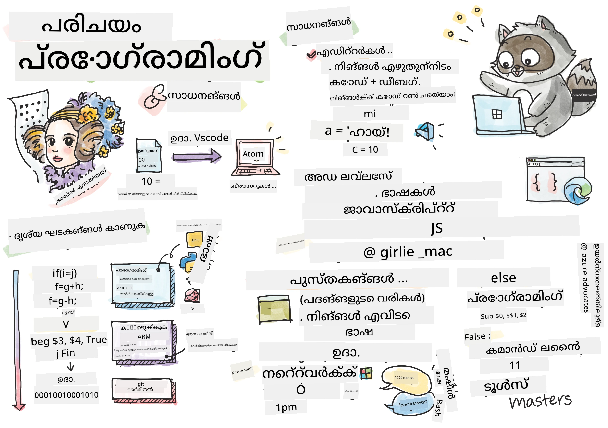
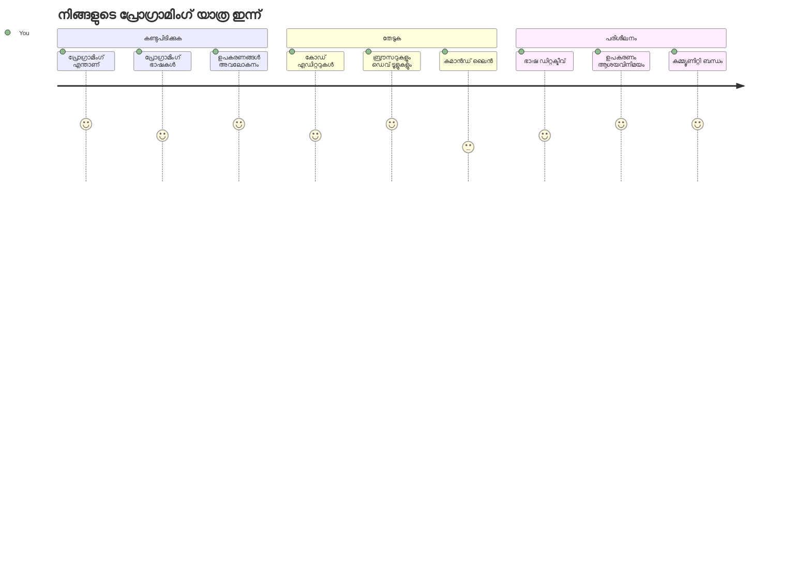
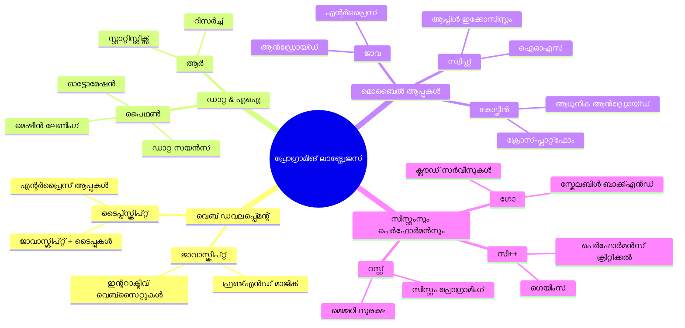
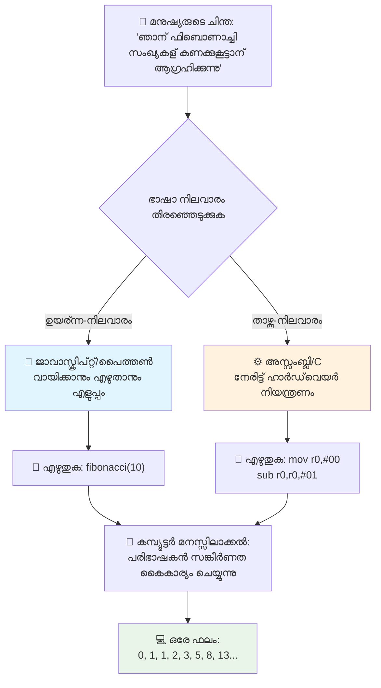
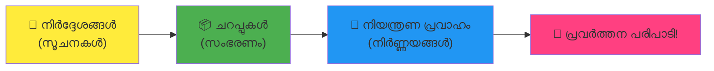
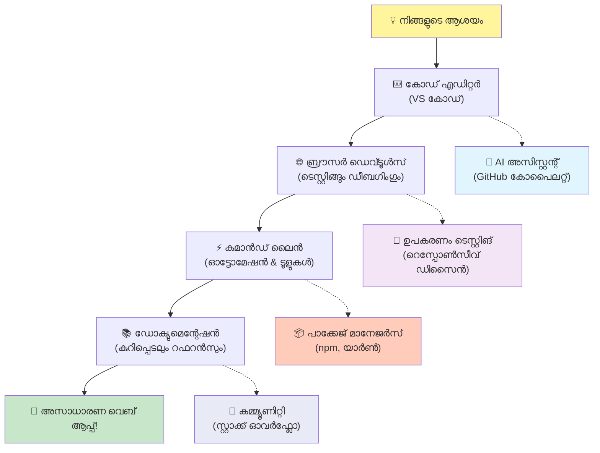
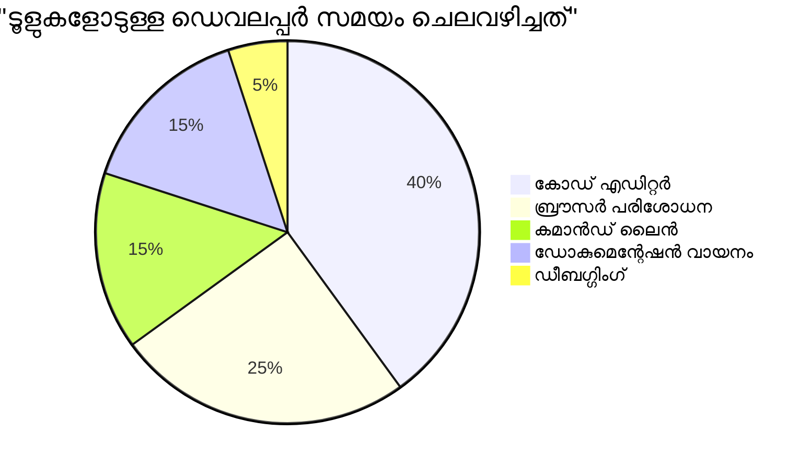
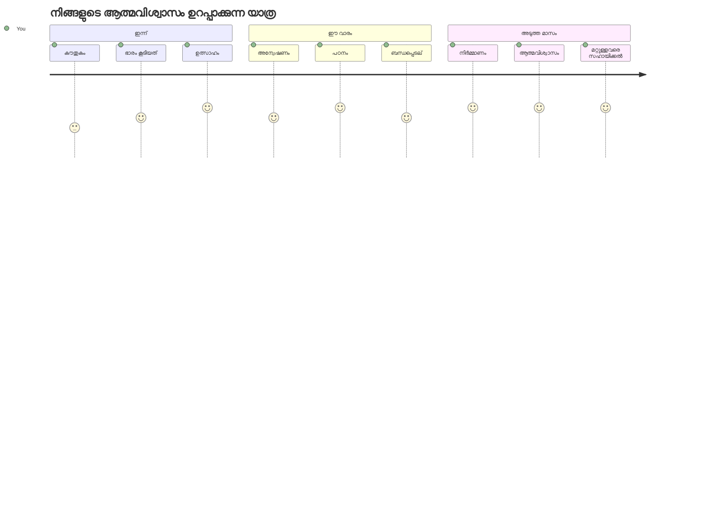

# പ്രോഗ്രാമിംഗ് ഭാഷകൾക്കും ആധുനിക ഡെവലപ്പർ ടൂളുകൾക്കും ഒരു പരിചയം

ഹേയ്, ഭാവിയിലെ ഡെവലപ്പർ! 👋 ഓരോ ദിവസവും എന്നെ ശീതളിപ്പിക്കുന്ന ചില കാര്യങ്ങൾ ഞാൻ നിങ്ങളോട് പറയാമോ? പ്രോഗ്രാമിംഗ് കമ്പ്യൂട്ടറുകളേക്കാള്‍ മാത്രം മാത്രമേ ആണെന്ന് നിങ്ങൾ കരുതുന്നുണ്ടെങ്കിൽ, നിങ്ങള്‍ക്ക് അത്യന്തം ശക്തമായ സ്വഭാവങ്ങൾ ഉണ്ടാക്കാനുള്ള കഴിവ് ഉണ്ടെന്നതാണെന്ന് ඔබ അന്വേഷിക്കാനിരിക്കുകയാണെന്ന് അറിയണം!

നിങ്ങളുടെ പ്രിയപ്പെട്ട ആപ്പ് ഉപയോഗിക്കുമ്പോൾ എല്ലാം നന്നായി ഫിറ്റ് ആവുന്നത് അനുഭവിച്ചിരുന്ന സമയം നിങ്ങൾ അറിഞ്ഞിട്ടില്ലേ? ഒരു ബട്ടൺ അമർത്തുമ്പോൾ അത്യന്തം മര്മരദമായ കാര്യം സംഭവിക്കുന്നു, നിങ്ങള്‍ "വാവ്, അവർ എങ്ങനെ ചെയ്തിരിക്കുന്നു?" എന്ന് ചോദിക്കാൻ മുൻപാകുന്ന ദിവസം? ശരി, നിങ്ങളെപ്പോലെ ഒരാൾ — ഏറ്റവും സാധ്യതയുള്ളത് രാത്രി 2 മണിക്ക് അവരുടെ ഏറ്റവും പ്രിയ കഫേയിൽ മൂന്നാം എസ്പ്രസ്സോയുമായി ഇരിക്കുന്നു — ആ മായാജാലം സൃഷ്ടിച്ച കോഡ് എഴുതിയതാണ്. ഈ പാഠത്തിന്റെ അവസാനം നിങ്ങൾ ആ മക്കളുടെ രീതിയെ മാത്രം മനസിലാക്കുകയല്ല, നിങ്ങൾ തന്നെ പരീക്ഷിക്കാൻ താൽപ്പര്യമുള്ളവനാകും!

നിങ്ങൾക്ക് പ്രോഗ്രാമിംഗ് ഇപ്പോൾ ഭീതി തോന്നുകയാണെങ്കിൽ ഞാൻ ആ തികയെകൂർ ചെയ്യും. ഞാൻ ആദ്യം ആരംഭിച്ചപ്പോൾ, നിങ്ങൾക്ക് ഏതെങ്കിലും ഗണിത ജീനിയസ് ആകണമെന്നോ അഞ്ചു വയസ്സിൽ മുതൽ കോഡിംഗ് നടത്തിക്കൊണ്ടിരിക്കണമെന്നോ ഞാൻ വിചാരിച്ചിരുന്നു. പക്ഷേ എന്റെ അഭിപ്രായം പൂർണമായി മാറിയതു ഇതാണ്: പ്രോഗ്രാമിംഗ് പുതിയ ഒരു ഭാഷയിൽ സംവദിക്കാൻ പഠിക്കുന്നതിന് തുല്യമാണ്. നിങ്ങൾ "ഹലോ"യും "നന്ദി"യും പഠിക്കുന്നത് ആരംഭിക്കുന്നു, തുടർന്ന് കേഫി ഓർഡർ ചെയ്യുന്നതുവരെ എത്തുമ്പോൾ, ഇതിനകം നിങ്ങൾ ദീർഘമായ ദാർശനിക ചർച്ചകൾ നടത്താൻ തുടങ്ങും! ഇതിൽ, നിങ്ങൾ കമ്പ്യൂട്ടറുകളുമായി സംവദിക്കുന്നു, അവർ ഏറ്റവും സഹനശീലമുള്ള സംവദിക്കാരാണ് — അവർ നിങ്ങളുടെ പിഴവുകൾ വിലയിരുത്തുകയില്ല, ഒരിടത്തും വീണ്ടും ശ്രമിക്കാൻ 항상 ആവേശഭരിതന്മാരാണ്!

ഇന്ന്, ആധുനിക വെബ് ഡെവലപ്‌മെന്റ് സാദ്ധ്യമാക്കുന്ന അതിമനോഹര ടൂളുകൾ പരിശോധിക്കാം, സാധാരണക്കാരെ പോലും അതോറന്മാരാക്കുന്ന ടൂളുകൾ. ഞാൻ പറയുന്നത് Netflix, Spotify, നിങ്ങളുടെ പ്രിയപ്പെട്ട ഇൻഡി ആപ്പ് സ്റ്റുഡിയോ പോലുള്ള ഡെവലപ്പർമാർ എല്ലാ ദിവസവും ഉപയോഗിക്കുന്ന എഡിറ്ററുകൾ, ബ്രൗസറുകൾ, വർക്‌ഫ്ലോകുകൾ തന്നെ. കേട്ടോ? ഈ വ്യവസായ നിലവാരമുള്ള ടൂളുകളിൽ മിക്കവയും പൂർണമായും സൗജന്യമാണ്!


> ടോമോമി ഇമുര (https://twitter.com/girlie_mac) രചിച്ചത്


```mermaid
journey
    title നിങ്ങളുടെ പ്രോഗ്രാമിംഗ് യാത്ര ഇന്ന്
    section കണ്ടുപിടിക്കുക
      പ്രോഗ്രാമിംഗ് എന്താണ്: 5: You
      പ്രോഗ്രാമിംഗ് ഭാഷകൾ: 4: You
      ഉപകരണങ്ങൾ അവലോകനം: 5: You
    section തേടുക
      കോഡ് എഡിറ്ററുകൾ: 4: You
      ബ്രൗസറുകളും ഡെവ് ടൂളുകളും: 5: You
      കമാൻഡ് ലൈൻ: 3: You
    section പരിശീലനം
      ഭാഷ ഡിറ്റക്ടീവ്: 4: You
      ഉപകരണം ആശയവിനിമയം: 5: You
      കമ്മ്യൂണിറ്റി ബന്ധം: 5: You
```
## നിങ്ങൾ മുമ്പ് അറിയുന്ന കാര്യങ്ങൾ നോക്കാം!

വിനോദകരമായ കാര്യങ്ങളിലേക്ക് ചാടുന്നതിന് മുമ്പ്, ഈ പ്രോഗ്രാമിംഗ് ലോകത്തെക്കുറിച്ച് നിങ്ങൾക്ക് എന്തൊക്കെ അറിയാം എന്ന് ഞാനറിയാൻ ആഗ്രഹിക്കുന്നു. ഈ ചോദ്യങ്ങൾ നോക്കുമ്പോൾ "എനിക്ക് ഇതെല്ലാം ഒന്നും അറിയില്ല" എന്ന് തോന്നിയാലും, അത് നല്ലതായിരുന്നു, ഇത് ഏറ്റവും സിനിമാളെ സുഖമുള്ള സ്ഥലം ആണ്. ഈ ക്വിസ് ഒരു വർക്ക്‌ഔട്ടിന് മുമ്പ് ശരീര ചാലിപ്പിടിക്കാനുള്ളതുപോലെ ആക്കുക — നാം ആ ദിമാക്‌സ്ഥലം ഉണർത്തുകയാണ്!

[പ്രീ-ലസൺ ക്വിസ് നൽകുക](https://ff-quizzes.netlify.app/web/)

## നാം కలిసి നടത്തുന്ന സാഹസിക യാത്ര

ശരി, ഇന്ന് നമ്മൾ എന്തെല്ലാം കാണാനിരിക്കുന്നുവെന്ന് ഞാൻ അതീവ ആകാംക്ഷയോടെയുണ്ട്! ഈ ആശയങ്ങൾ നിങ്ങൾക്ക് എപ്പോഴും മനസ്സിലായതിൽ ഞാൻ മുഖം കാണാൻ ആഗ്രഹിക്കുന്നു. നമുക്കൊപ്പമാണ് ഈ അത്ഭുതകരമായ യാത്ര:

- **പ്രോഗ്രാമിംഗ് അതിവിശേഷമായി എന്താണ് (ഏതുകൊണ്ടും ഏറ്റവും കേൾക്കാവുന്ന സംവാദം!)** – കോഡ് നിങ്ങളുടെ ചുറ്റുപാട് എല്ലാം സജീവമാക്കുന്ന അദൃശ്യ മായാജാലമാണെന്ന് നമ്മുക്ക് കണ്ടെത്താനാണ്, തിങ്കളാഴ്ച രാവിലെ അറിയാറ്റ്ച്ചുള്ള അലാറം മുതൽ നെട്ട്ഫ്ളിക്‌സ് ശുപാർശകൾ പരിപൂർണമായി ക്രമീകരിക്കുന്ന ആൽഗോരിതം വരെ
- **പ്രോഗ്രാമിംഗ് ഭാഷകളും അവയുടെ അത്ഭുതജനക വ്യക്തിത്വങ്ങളും** – ഓരോ വ്യക്തിയും വ്യത്യസ്ത സൂപ്പർപവർസും പ്രശ്ന പരിഹരിക്കുന്ന വൈവിധ്യമാർന്ന മാർഗ്ഗങ്ങളും ഉള്ള ഒരു പാർട്ടിയിൽ നിങ്ങൾ പിടിമുറുക്കുകയാണ് എന്ന് കരുതൂ. ആ പ്രോഗ്രാമിംഗ് ഭാഷയുടെ ലോകം അതുപോലെ തന്നെയാണ്, അവയെ പരിചയപ്പെടാൻ നിങ്ങൾ ആസ്വദിക്കുമെന്നും ഞാൻ ഉറപ്പുവരുത്തുന്നു!
- **ഡിജിറ്റൽ മായാജാലം സൃഷ്ടിക്കുന്ന അടിസ്ഥാന ഘടകങ്ങൾ** – ഇവയെ ഏറ്റവും പുതിയ ക്രിയേറ്റീവ് LEGO സെറ്റ് എന്ന് കരുതൂ. ഇവ എങ്ങനെ ജോലിചെയ്യുന്നുവെന്ന് മനസ്സിലാക്കിയാൽ, നിങ്ങൾക്കത് നിങ്ങളുടെ കാത്തിരിക്കുന്ന എന്തുവെച്ച് ഏതാനും മായാ നിർമ്മിക്കാൻ കഴിയും
- **പ്രൊഫഷണൽ ടൂളുകൾ, നിങ്ങൾക്ക് ഒരു വിദഗ്ധന്റെ മായാജാല വിമാനം ലഭിച്ചതുപോലെ തോന്നിക്കും** – ഞാൻ വ്യാകരണം ചെയ്യുന്നില്ല – ഈ ടൂളുകൾ നിങ്ങൾക്ക് സൂപർപവർസുള്ളവരായി തോന്നിക്കും, ഏറ്റവും നല്ല ഭാഗം? ഈ ടൂളുകൾ പ്രൊഫഷണലുകൾ ഉപയോഗിക്കുന്നവ തന്നെയാണ്!

> 💡 **ഇവിടെയാണ് കാര്യങ്ങൾ:** ഇന്ന് എല്ലാം ഓർമ്മിക്കാൻ ശ്രമിക്കേണ്ടെന്ന് കരുതല്ല. ഇപ്പോൾ ഞാൻ നിങ്ങൾക്ക് സാധ്യതകളെ കുറിച്ചുള്ള ആതുല്യ ആവേശം തോന്നിക്കാനാണ് ആഗ്രഹിക്കുന്നത്. നാം ഒരുമിച്ചു ശീലിക്കുമ്പോൾ വിശദാംശങ്ങൾ സ്വാഭാവികമായി മനസ്സിലാകും – അതായിരിക്കും യഥാർത്ഥ പഠനം!

> നിങ്ങൾ ഈ പാഠം [Microsoft Learn](https://learn.microsoft.com/en-us/learn/modules/web-development-101/introduction-programming/?WT.mc_id=academic-77807-sagibbon)ൽ പഠിക്കാം!

## ശരി, പ്രോഗ്രാമിംഗ് *എന്താണ്*?

ശരി, വിവിധം കോടി വിചാരമാണ്: പ്രോഗ്രാമിംഗ് എന്താണെന്നു നിസ്സാരമായി പറഞ്�

ഞാൻ ഒരു കഥ പറയുന്നു, അത് എന്റെ ചിന്തയെ പൂർണമായി മറുത്തു. കഴിഞ്ഞ ആഴ്ച, ഞാൻ പുതിയ സ്മാർട്ട് ടി.വി. റിമോട്ട് ഉപയോഗിക്കാൻ അമ്മയെ എങ്ങനെ പഠിപ്പിക്കാമെന്ന് പറഞ്ഞു തരാൻ ശ്രമിച്ചു. ഞാൻ പറഞ്ഞിരുന്നുവത്രിൽ "ചുവപ്പ് ബട്ടൺ അമർത്തൂ, പക്ഷേ വലിയ ചുവപ്പ് ബട്ടൺ അല്ല, ഇടതുവശത്തെ ചെറിയ ചുവപ്പ് ബട്ടൺ... അല്ല, നിങ്ങളുടെ മറ്റുവശം... ഇപ്പോൾ രണ്ട് സെക്കന്റ് അമർത്തി പിടിക്കൂ, ഒന്ന് അല്ല, മൂന്ന് അല്ല..." എന്നിങ്ങനെ. പരിചിതമായി തോന്നുന്നുവേ? 😅

അതെ, അതാണ് പ്രോഗ്രാമിങ്! അദ്ഭുതകരമായ, പടുത്തിണങ്ങലുള്ള, ഘട്ടംവൈസി നിർദ്ദേശങ്ങൾ നൽകുന്നതിനുള്ള കല. അതെ, നിങ്ങൾക്ക് നിങ്ങളുടെ അമ്മയോട് വിശദമായി ബട്ടണുകൾ ചോദിക്കാൻ കഴിയണം (അവർക്കു പറയാൻ സാധിക്കാത്തൂ "ഏത് ചുവപ്പ് ബട്ടൺ?" എന്നുചോദിക്കാം), എന്നാൽ കമ്പ്യൂട്ടറോട് പറഞ്ഞാൽ അവർ നിങ്ങൾ പറയുന്നത് ശരിയായി തർത്തു, നിങ്ങൾ ഉദ്ദേശിച്ചത് കുറച്ചെടുത്താകാം പോലും.

പഴയ ഈടുപിഴച്ചപ്പോഴാണ് മനസ്സിലായത്: കമ്പ്യൂട്ടറുകൾ അടിസ്ഥാനപരമായി വളരെ ലളിതമാണ്. അവർക്ക് അത് മനസ്സിലാകും രണ്ടുതരം മാത്രം – 1,0, അഥവാ "ആവാം" അല്ലെങ്കിൽ "അല്ല" അല്ലെങ്കിൽ "ഓൺ" അല്ലെങ്കിൽ "ഓഫ്". ഇതാണ് മുഴുവൻ! പക്ഷേ മായാജാലം ഇവിടെ ആരംഭിക്കുന്നു – ഞങ്ങൾ 1കളിലും 0കളിലുമല്ല പറഞ്ഞ് സംസാരിക്കേണ്ടതില്ല. പ്രോഗ്രാമിംഗ് ഭാഷകൾ അതിനു ചർച്ചയായിരുന്നു. അവ ലോകത്തിലെ ഏറ്റവും മികച്ച വിവർത്തകരാണ്, അവർ നിങ്ങളുടെ സാധാരണ മനുഷ്യ ചിന്തകൾ കമ്പ്യൂട്ടർ ഭാഷയായി പരിഭാഷപ്പെടുത്തുന്നു.

ഇതുവരെ എനിക്ക് പ്രഭാതമണിഞ്ഞപ്പോഴും ശരിയായ മനസ്സിലുള്ള ശാന്തത നൽകുന്ന കാര്യം: നിങ്ങളുടെ ജീവിതത്തിലെ *എല്ലാം* ഡിജിറ്റൽ ആദ്യം ബാധകമായ ആളുകൾ പോലെ ആരംഭിച്ചു, കഫിയോപ്പം പyjamas അണിഞ്ഞു, ലാപ്ടോപ്പിൽ കോഡ് ടൈപ്പ് ചെയ്തു. നിങ്ങൾനു സുന്ദരമായി കാണിക്കുന്ന ഇൻസ്റ്റഗ്രാം ഫിൽറ്റർ? ഒരാൾ അത് കോഡിങ് ചെയ്തു. നിങ്ങൾ പുതിയ പ്രിയപ്പെട്ട പാട്ടിലേക്കു വഴിതെളിച്ച ശുപാർശ? ഒരു ഡെവലപ്പർ ആ ആൽഗോരിതം നിർമ്മിച്ചു. ഡിന്നർ ബില്ല് കൂട്ടുകാരെ പ്രകടിപ്പിക്കാൻ സഹായിക്കുന്ന ആപ്പ്? ഒരാൾ "ഇത് അലക്ഷ്യമാണ്, ഞാൻ ഇത് പരിഹരിക്കാമെന്ന്" വിചാരിച്ചു, പിന്നെ ചെയ്തു!

നിങ്ങൾ പ്രോഗ്രാമിംഗ് പഠിക്കുമ്പോൾ, നിങ്ങൾ ഒരു പുതിയ കഴിവു മാത്രമല്ല നേടുന്നത് – പ്രശ്ന പരിഹാരകരുടെ അതിശയകരമായ സമുദായത്തിന്റെ ഒരു ഭാഗമാകുന്നു, അവർക്കു ദിവസവും "ഒരുർക്കാർക്ക് ദിവസം थोड़ा മെച്ചം വരുത്താൻ ഞാൻ ഒരു ചെറിയ കാര്യവും നിർമ്മിക്കാമോ?" എന്ന ചിന്തയിലുണ്ട്. വിശ്വസിക്കുക, എന്തിനും അതിലും മികവുള്ള കാര്യമുണ്ടോ?

✅ **വിനോദകരമായ ഒരു കാര്യം:** ഒഴിവുകാലത്ത് തിരയാൻ നല്ലത് – ലോകത്തിലെ ആദ്യ കമ്പ്യൂട്ടർ പ്രോഗ്രാമർ ആർക്കെന്ന് നിങ്ങൾ കരുതുന്നു? ഒരു സൂചന കൊടുക്കാം: നിങ്ങൾ കരുതുന്നത് ആകണമെന്നില്ല! ആ വ്യക്തിയുടെ കഥ അത്യന്തം ആകർഷകമാണ്, പ്രോഗ്രാമിംഗ് എല്ലായ്പ്പോഴും സൃഷ്ടിപരമായ പ്രശ്ന പരിഹാരത്തിനും പരമ്പരാഗത ചിന്തയ്ക്ക് പുറത്തുള്ളതുമെന്നു കാണിക്കുന്നു.

### 🧠 **നിങ്ങളുടെ അവസ്ഥ പരിശോധിക്കുക: നിങ്ങൾ എങ്ങനെ അനുഭവപ്പെടുന്നു?**

**ഒരൊഴുക്കു ഇടുക:**
- "കമ്പ്യൂട്ടറുകൾക്ക് നിർദ്ദേശങ്ങൾ നൽകൽ" എന്ന ആശയം ഇപ്പോൾ മനസ്സിലായിരുന്നോ?
- നിങ്ങളുടെ പ്രോഗ്രാമിംഗ് ഉപയോഗിച്ച് സാധാരണ ഒരു ടാസ്ക് ഓട്ടോമേറ്റു ചെയ്യാൻ താല്പര്യമുണ്ടോ?
- ഈ പ്രോഗ്രാമിംഗ് കാര്യങ്ങളിൽ ചിന്തിക്കുന്ന ചില ചോദ്യങ്ങൾ എന്തൊക്കെ?

> **ഓർമ്മിക്കുക:** ചില ആശയങ്ങൾ ഇപ്പോൾ സന്ധിഗ്ധമായിരിക്കാം, അത് സാധാരണമാണ്. പ്രോഗ്രാമിംഗ് പുതിയ ഒരു ഭാഷ പഠിക്കുന്നത് പോലെ – നൂററുകളെ ബന്ധിപ്പിക്കാൻ സമയം വേണം. നിങ്ങൾ മികച്ചതായി നടക്കുകയാണ്!

## പ്രോഗ്രാമിംഗ് ഭാഷകൾ പലവിധ മായാജാലംപോലെ

ശരി, ഇത് അസാധാരണമായി കേൾക്കാമെങ്കിലും ഞങ്ങളെ പിന്തുടരുക – പ്രോഗ്രാമിംഗ് ഭാഷകൾ പലവിധ സംഗീതങ്ങളിൽപോലെ ആണ്. ജാസ്, അതുസ്വാദൂമായ, ഇംപ്രൊവൈസേഷണൽ, റോക്ക് ശക്തി നിറഞ്ഞ, ക്ലാസിക്കൽ ശൈലിയിൽ സുസ്ഥിരം, ഹിപ്-ഹോപ്പ് സൃഷ്ടിപരവും പ്രകടനപരവുമാണ്. ഓരോ ശൈലിയ്ക്കും സ്വന്തം ജൈവികത, ആരാധകരുളള സമുദായം ഉണ്ട്, ഒപ്പം ഏത് മനോഭാവത്തിനും സാന്ദർശ്യത്തിനും അനുയോജ്യമാണ്.

പ്രോഗ്രാമിംഗ് ഭാഷകളും ഇതുപോലെ തന്നെയാണ്! വലിയ കാലാവസ്ഥ ഡാറ്റ കൈകാര്യം ചെയ്യാൻ ഉപയോഗിക്കുന്ന ഭാഷ_fun_mobile game_ നിർമ്മിക്കുന്നതിനുള്ള ഭാഷ ഒരുപോലല്ല, യോഗ ക്ലാസിൽ ഡത്ത് മെറ്റലിലെൻ അടിച്ചുപൊള്ളിക്കുന്നതു പോലെയാണ് (അത് കൂടെ പല യോഗ ക്ലാസുകളിലും അല്ലതായിരുന്നു 😄).

പക്ഷേ ഓരോ തവണയും എന്നെ അത്ഭുതപ്പെടുത്തുന്നത് എന്തെന്ന് കേട്ടേ എങ്കിൽ: ഈ ഭാഷകൾ അതിസഹനശീലമുള്ള, പ്രതിഭാസമുള്ള വ്യാഖ്യാതാവിനോട് നിങ്ങൾക്കുണ്ട് എന്ന അനുഭവം നൽകുന്നു. നിങ്ങളുടെ അസംസ്കാരാധീനമായ മനുഷ്യബുദ്ധിയനുസൃതമായി നിങ്ങളുടെ ആശയങ്ങൾ രേഖപ്പെടുത്താനും അവർ അതിനെ 1കൾക്കും 0കൾക്കും പരിഭാഷപ്പെടുത്താനും. "മനുഷ്യ സൃഷ്ടി"ക്കും "കമ്പ്യൂട്ടർ ലജിക്"ക്കും പൂർണമായും പ്രാവീണ്യമുള്ള സുഹൃത്ത് ഒരാൾ കിട്ടിയതുപോലെ, തളരാതെ, കോഫി ബ്രേക്ക് ആവശ്യമില്ലാതെ, ഒരே ചോദ്യം രണ്ടുതവണ ചോദിച്ചാലും വിലയിരുത്താതെ!

### പ്രചാരമുള്ള പ്രോഗ്രാമിംഗ് ഭാഷകളും അവയുടെ ഉപയോഗങ്ങളും


```mermaid
mindmap
  root((പ്രോഗ്രാമിങ് ലാങ്ഗ്വേജസ്))
    വെബ് ഡവലപ്പ്മെന്റ്
      ജാവാസ്ക്രിപ്റ്റ്
        ഫ്രണ്ട്‌എൻഡ് മാജിക്
        ഇന്ററാക്ടീവ് വെബ്സൈറ്റുകൾ
      ടൈപ്പ്‌സ്ക്രിപ്റ്റ്
        ജാവാസ്ക്രിപ്റ്റ് + ടൈപ്പുകൾ
        എന്റർപ്രൈസ് ആപ്പുകൾ
    ഡാറ്റ & എഐ
      പൈഥൺ
        ഡാറ്റ സയൻസ്
        മെഷീൻ ലേണിംഗ്
        ഓട്ടോമേഷൻ
      ആർ
        സ്റ്റാറ്റിസ്റ്റിക്സ്
        റിസർച്ച്
    മൊബൈൽ ആപ്പുകൾ
      ജാവ
        ആൻഡ്രോയ്ഡ്
        എന്റർപ്രൈസ്
      സ്വിഫ്റ്റ്
        ഐഓഎസ്
        ആപ്പിൾ ഇക്കോസിസ്റ്റം
      കോട്ട്ലിൻ
        ആധുനിക ആൻഡ്രോയ്ഡ്
        ക്രോസ്-പ്ലാറ്റ്‌ഫോം
    സിസ്റ്റംസും പെർഫോർമൻസും
      സി++
        ഗെയിംസ്
        പെർഫോർമൻസ് ക്രിറ്റിക്കൽ
      റസ്റ്റ്
        മെമ്മറി സുരക്ഷ
        സിസ്റ്റം പ്രോഗ്രാമിംഗ്
      ഗോ
        ക്ലൗഡ് സർവീസുകൾ
        സ്കേലബിൾ ബാക്ക്എൻഡ്
```
| ഭാഷ | മികച്ച ഉപയോഗം | ഉദാത്തം നേടാനുള്ള കാരണം |
|----------|----------|------------------|
| **ജാവാസ്ക്രിപ്റ്റ്** | വെബ് ഡെവലപ്പ്മെന്റ്, യൂസർ ഇന്റർഫേസുകൾ | ബ്രൗസറുകളിൽ പ്രവർത്തിച്ച് ഇന്ററാക്ടീവ് സൈറ്റുകൾ സാധ്യമാക്കും |
| **പൈതൺ** | ഡാറ്റ സയൻസ്, ഓട്ടോമേഷൻ, Artificial Intelligence | വായിക്കാൻ എളുപ്പം, ശക്തമായ ലൈബ്രറികളുണ്ട് |
| **ജावा** | എന്റർപ്രൈസ് ആപ്പുകൾ, ആൻഡ്രോയിഡ് ആപ്പുകൾ | പ്ലാറ്റ്ഫോം സ്വതന്ത്രം, വലിയ സിസ്റ്റങ്ങൾക്കായുള്ള ഊർജ്ജസ്വലമായ |
| **സി#** | വിൻഡോസ് ആപ്പുകൾ, ഗെയിം ഡെവലപ്‌മെന്റ് | Microsoft് സ്ട്രോങ് എക്കോസിസ്റ്റം പിന്തുണ |
| **ഗോ** | ക്ലൗഡ് സർവിസുകൾ, ബാക്ക്എൻഡ് സിസ്റ്റങ്ങൾ | വേഗം, ലളിതം, ആധുനിക കംപ്യൂട്ടിങ്ങിനായിത്തയാറാക്കിയെടുത്തത് |

### ഹൈ ലെവൽ vs ലോ ലെവൽ ഭാഷകൾ

ശരി, ആദ്യമായി പഠിക്കുമ്പോൾ എന്റെ മനസ്സു പുതുക്കി എറിയുകയും ചെയ്യിയത് ഈ ആശയമായിരുന്നു, അതിനാൽ എന്റെ മനസ്സിലുണ്ടായ ഏക ഉദാഹരണം ഞങ്ങൾ പങ്കുവെക്കും – ഞങ്ങൾക്കും നിങ്ങൾക്കും സഹായകരമാകും എന്ന് ഞാൻ വിശ്വസിക്കുന്നു!

നിങ്ങൾ ഒരു വിദേശ രാജ്യത്തായി വെള്ളം ചേച്ചു പിടികൂടുക കഴിയാത്ത ഒരു ഭാഷ സംസാരിക്കുന്നിടത്ത് ഇപ്പോൾ ബാത്ത്റൂം കണ്ടെത്താനുള്ള ആവശ്യം ഉണ്ട് എന്ന് കരുതൂ (ഞങ്ങൾ എല്ലാവരും അതുപോലെ അനുഭവിച്ചിട്ടുണ്ട്, അല്ലെ? 😅):

- **ലോ-ലെവല് പ്രോഗ്രാമിംഗ്** അതും ശാഖയിലെബരിക്കാൻ മുട്ടർചായം വിൽക്കുന്ന വെളുപ്പിച്ചമ്മുമായി സംസാരം നടത്തുന്നതുപോലെ ആണ്, സാംസ്കാരിക പരാമർശങ്ങളും, നാട്ടു ഭാഷാ ബ്ലാക്കും, അകത്തുള്ള തമാശകളും ഉൾക്കൊള്ളിച്ച്. തീർച്ചയായും അത്ര മനോഹരം, കാര്യക്ഷമവും... എന്നാൽ നിങ്ങൾ ഒരു ബാത്ത്റൂം കണ്ടെത്തണം എന്നിടത്ത് എന്നിൽ തീരെ പുഞ്ചിരിയില്ല.

- **ഹൈ-ലെവൽ പ്രോഗ്രാമിംഗ്** അത്ര മനസ്സിലാകുന്ന ഒരു സുഹൃത്ത് ഉണ്ടാകുന്നതുപോലെയാണ്. നിങ്ങൾക്ക് ശരളമായ ഇംഗ്ലീഷിൽ "എനിക്ക് ബാത്ത്റൂം കണ്ടെത്തണം" എന്ന് പറയാം, അവൻ എല്ലാ സാംസ്കാരിക വിവർത്തനവും കൈകാര്യം ചെയ്ത് നിങ്ങളുടെ സങ്കടമില്ലാതെ മാർഗനിർദ്ദേശം നൽകും.

പ്രോഗ്രാമിംഗ് പദങ്ങളിൽ:
- **ലോ-ലെവൽ ഭാഷകൾ** (അസംബ്ലി അല്ലെങ്കിൽ സി പോലുള്ള) നിങ്ങളുടെ കമ്പ്യൂട്ടറിന്റെ ഹാർഡ്വെയറുമായി വളരെ വിശദമായ സംവാദം നടത്താൻ അനുവദിക്കുന്നു, എന്നാൽ മെഷീനായി ചിന്തിക്കണം, അത് മനസ്സിലാക്കുന്നത് വലിയ ബുദ്ധിമുട്ടാണ്!
- **ഹൈ-ലെവൽ ഭാഷകൾ** (ജാവാസ്‌ക്രിപ്റ്റ്, പൈതൺ, സി# പോലുള്ള) നിങ്ങൾ മനുഷ്യപോലെ ചിന്തിക്കാനും ബാക്കി മെഷീൻ ഭാഷ അവര് കൈകാര്യം ചെയ്യാനും അനുവദിക്കുന്നു. കൂടാതെ, അവർ പുതിയവർക്കിടയിൽ സഹനശീലമുള്ള, സഹായം കൊടുക്കാൻ ആഗ്രഹിക്കുന്ന സമുദായങ്ങൾ നിറഞ്ഞതാണ്!

എന്ത് പറയൂ? നിങ്ങൾ ആരംഭിക്കേണ്ടത് ഏത് ഭാഷയാണ്? 😉 ഹൈ-ലെവൽ ഭാഷകൾ പരിശീലന ചക്രങ്ങളൊക്കെ പോലെയാണ്, അത് ഒരിക്കലും മാറ്റിക്കൊണ്ടുപോകാൻ താൽപര്യമില്ല എങ്കിൽ അനുഭവം അത്ര മനോഹരം തന്നെ!


```mermaid
flowchart TB
    A["👤 മനുഷ്യരുടെ ചിന്ത: <br/>'ഞാന് ഫിബൊണാച്ചി സംഖ്യകള് കണക്കുകൂട്ടാന് ആഗ്രഹിക്കുന്നു'"] --> B{ഭാഷാ നിലവാരം തിരഞ്ഞെടുക്കുക}
    
    B -->|ഉയര്ന്ന-നിലവാരം| C["🌟 ജാവാസ്ക്രിപ്റ്റ്/പൈത്തൺ<br/>വായിക്കാനും എഴുതാനും എളുപ്പം"]
    B -->|താഴ്ന്ന-നിലവാരം| D["⚙️ അസ്സംബ്ലി/C<br/>നേരിട്ട് ഹാർഡ്‌വെയർ നിയന്ത്രണം"]
    
    C --> E["📝 എഴുതുക: fibonacci(10)"]
    D --> F["📝 എഴുതുക: mov r0,#00<br/>sub r0,r0,#01"]
    
    E --> G["🤖 കമ്പ്യൂട്ടർ മനസ്സിലാക്കൽ:<br/>പരിഭാഷകൻ സങ്കീർണത കൈകാര്യം ചെയ്യുന്നു"]
    F --> G
    
    G --> H["💻 ഒരേ ഫലം:<br/>0, 1, 1, 2, 3, 5, 8, 13..."]
    
    style C fill:#e1f5fe
    style D fill:#fff3e0
    style H fill:#e8f5e8
```
### ഹൈ-ലെവൽ ഭാഷകൾ എങ്ങനെ സൗഹൃദപരമാണ് എന്ന് ഞാൻ കാണിക്കാം

ശരി, ഞാൻ നിങ്ങളോട് ഒരു ഉദാഹരണം കാണിക്കാൻ പോകുകയാണ്, അത് ഞാൻ ഹൈ-ലെവൽ ഭാഷകളോട് സ്‌നേഹം തോന്നിയതിന്റെ കാരണം വ്യക്തമാക്കും, പക്ഷേ ആദ്യം – ഒരു വാക്ക് വാഗ്ദാനം ചെയ്യണം. നിങ്ങൾ ആദ്യ കോഡ് ഉദാഹരണം കാണുമ്പോൾ ചിന്താശൂന്യമാകേണ്ട. അതെ, ഇത് ഭീതി സൃഷ്ടിക്കാൻ വേണ്ടിയുള്ളതാണ്. അതാണ് ഞാൻ വിശദമാക്കാൻ പോവുന്നത്!

നാം രണ്ടുതരം വ്യത്യസ്ത രീതികളിൽ എഴുതപ്പെട്ട ഒരേ ടാസ്‌ക് കാണും. ഫിബൊണാച്ചി ക്രമം സൃഷ്ടിക്കുന്നതാണ് – അത് ഒരു അദ്ഭുതകരമായ ഗണിത മാതൃകയാണ്, ഓരോ സംഖ്യയുടെ മൂല്യം അതിനു മുന്‍പുള്ള രണ്ട് സംഖ്യകളുടെ കൂട്ടമായിരിക്കും: 0, 1, 1, 2, 3, 5, 8, 13... (രസകരമായ ഒരു കാര്യം: ഈ നിയമം പ്രകൃതിയിലെ അനവധി സ്ഥലങ്ങളിൽ കാണാം – സൺഫ്ലവർ വിത്തുകളുടെ സവിശേഷ സ്പിരൽ, പൈൻകോൺ പാറ്റേൺ, ഗാലക്‌സികളുടെ രൂപം വരെ!)

അറിഞ്ഞിരിക്കാൻ തയ്യാറാണോ? പോവാം!

**ഹൈ-ലെവൽ ഭാഷ (ജാവാസ്ക്രിപ്റ്റ്) – മനുഷ്യസൗഹൃദം:**

```javascript
// പടി 1: അടിസ്ഥാന ഫിബൊനാച്ചി ക്രമീകരണം
const fibonacciCount = 10;
let current = 0;
let next = 1;

console.log('Fibonacci sequence:');
```

**ഈ കോഡ് എന്താണെന്നും:**
- **ഘോഷിയ്ക്കുക** എത്ര ഫിബൊണാച്ചി സംഖ്യകൾ സൃഷ്ടിക്കണമെന്നു കാണിക്കുന്ന ഒരു സ്ഥിരം മൂല്യം
- **ആരംഭിക്കുക** ഇപ്പോഴത്തെ സംഖ്യയും അടുത്ത സംഖ്യയും ട്രാക്ക് ചെയ്യാൻ രണ്ട് വേരിയബിളുകൾ
- **സജ്ജമാക്കുക** ഫിബൊണാച്ചി മാതൃക നിർവ്വചിക്കുന്ന ആരംഭ മൂല്യങ്ങൾ (0, 1)
- **പ്രദർശിപ്പിക്കുക** ഔട്ട്‌പുട്ട് തിരിച്ചറിയാനുള്ള ഹെഡർ സന്ദേശം

```javascript
// ഘട്ടം 2: ഒരു ലൂപ്പുമായി അനുഭവക്രമം സൃഷ്ടിക്കുക
for (let i = 0; i < fibonacciCount; i++) {
  console.log(`Position ${i + 1}: ${current}`);
  
  // അനുഭവക്രമത്തിലെ അടുത്ത സംഖ്യ حسابചയിക്കുക
  const sum = current + next;
  current = next;
  next = sum;
}
```

**ഇവിടെ സംഭവിക്കുന്ന കാര്യം വിശദീകരിക്കുന്നു:**
- **ലൂപ്പ്** സീക്വൻസിലെ ഓരോ സ്ഥലം `for` ലൂപ്പ് ഉപയോഗിച്ച് തരണം
- **പ്രദർശിപ്പിക്കുക** ഓരോ സംഖ്യയും അതിന്റെ സ്ഥാനം ടെംപ്ലേറ്റ് ലിറ്ററൽ ഫോർമാറ്റിങ്ങിൽ
- **കണക്കാക്കുക** അടുത്ത ഫിബൊണാച്ചി സംഖ്യയെ നിലവിലുള്ള സംഖ്യയും അടുത്ത സംഖ്യയും ചേർക്കാൻ
- **പുതുക്കുക** ട്രാക്കിംഗ് വേരിയബിളുകൾ അടുത്ത അഭ്യാസത്തിലേക്ക് പോകാൻ

```javascript
// ഘട്ടം 3: ആധുനിക ഫംഗ്ഷണൽ സമീപനം
const generateFibonacci = (count) => {
  const sequence = [0, 1];
  
  for (let i = 2; i < count; i++) {
    sequence[i] = sequence[i - 1] + sequence[i - 2];
  }
  
  return sequence;
};

// ഉപയോഗ ഉദാഹരണം
const fibSequence = generateFibonacci(10);
console.log(fibSequence);
```

**മുകളിൽ നമ്മൾ:**
- **നിർമ്മിച്ചു** ആധുനിക_ARROW FUNCTION_ سینแทക്സുപയോഗിച്ച് പുനരുപയോഗയോഗ്യമായ ഫംഗ്ഷൻ
- **ഉണ്ടാക്കി** ഒരു പട്ടിക സീക്വൻസ് മുഴുവൻ സൂക്ഷിക്കാൻ, ഒരൊറ്റ സംഖ്യ പ്രദർശിപ്പിക്കാനല്ല
- **ഉപയോഗിച്ചു** പട്ടിക ഇൻഡക്സിംഗ് ഓരോ പുതിയ സംഖ്യ മുമ്പത്തുള്ള മൂല്യങ്ങളിൽ നിന്നു കണക്കാക്കാൻ
- **മാറി** മുഴുവൻ സീക്വൻസ് തിരിച്ചുകൊടുത്തു, മറ്റ് പ്രോഗ്രാം ഭാഗങ്ങളിൽ സ്വതന്ത്രമായി ഉപയോഗിക്കാനായി

**ലോ-ലെവൽ ഭാഷ (ARM അസംബ്ലി) – കമ്പ്യൂട്ടർ സൗഹൃദം:**

```assembly
 area ascen,code,readonly
 entry
 code32
 adr r0,thumb+1
 bx r0
 code16
thumb
 mov r0,#00
 sub r0,r0,#01
 mov r1,#01
 mov r4,#10
 ldr r2,=0x40000000
back add r0,r1
 str r0,[r2]
 add r2,#04
 mov r3,r0
 mov r0,r1
 mov r1,r3
 sub r4,#01
 cmp r4,#00
 bne back
 end
```

ജാവാസ്ക്രിപ്റ്റ് പതിപ്പ് ഇംഗ്ലീഷ് നിർദ്ദേശങ്ങൾ പോലെയാണ് വായിക്കാൻ തോന്നുന്നത്, അസംബ്ലി പതിപ്പ് കമ്പ്യൂട്ടറിന്റെ പ്രൊസസറെ നേരിട്ട് നിയന്ത്രിക്കുന്ന രഹസ്യാകാര കമാൻഡുകൾ ഉപയോഗിക്കുന്നു. രണ്ട് പതിപ്പുകളും ഒരേ ടാസ്‌ക് പൂർത്തിയാക്കുന്നു, എന്നാൽ ഹൈ-ലെവൽ ഭാഷ മനുഷ്യർക്ക് മനസ്സിലാക്കാനും എഴുതാനും പരിപാലിക്കാനും വളരെ എളുപ്പമാണ്.

**നിങ്ങൾ ശ്രദ്ധിക്കാവുന്ന പ്രധാന വ്യത്യാസങ്ങൾ:**
- **വായനാസൗകര്യം**: JavaScript `fibonacciCount` പോലുള്ള വിവരണാത്മക പേരുകൾ ഉപയോഗിക്കുന്നതെപ്പോൾ Assembly `r0`, `r1` പോലുള്ള രഹസ്യമയമായ ലേബലുകൾ ഉപയോഗിക്കുന്നു  
- **കോമന്റുകൾ**: ഉയർന്ന നിലയുടെ ഭാഷകൾ സ്വയം-രേഖാമേഖലാകാനായി വിശദീകരണാത്മക കോമന്റുകൾ പ്രോത്സാഹിപ്പിക്കുന്നു  
- **ഘടന**: JavaScriptന്റെ ലജിക്കല്‍ പ്രവാഹം പ്രശ്‌നങ്ങളെപ്പറ്റി മനുഷ്യർ ഒരുതടവിൽ ചിന്തിക്കുന്ന രീതിയോട് പൊരുത്തപ്പെടുന്നു  
- **പരിപാലനം**: വ്യത്യസ്ത ആവശ്യകതകൾക്കായി JavaScript പതിപ്പു അപ്ഡേറ്റ് ചെയ്യുക നേരിട്ടും വ്യക്തമുമാണ്  

✅ **ഫിബൊനാച്ചി അനുക്രമത്തെക്കുറിച്ച്**: ഈ അത്യന്തം മനോഹരമായ സംഖ്യാ മാതൃക (ഒരു സംഖ്യ മുമ്പെ കണ്ട രണ്ട് സംഖ്യകളുടെ ഒത്തുചേരലായതു കൂടിയാണ് എന്നത്: 0, 1, 1, 2, 3, 5, 8...) പ്രകൃതിയിൽ *എവിടെയായി* കാണാം! നിങ്ങൾ ഇത് സൺഫ്ലവർ സ്‌പൈറലുകളിൽ, പൈന്കോൺ പാറ്റേണുകളിൽ, നായുറൈറ്റസ് ഷെല്ലുകളുടെ വെട്ടൽ രീതി, മരകാപ്ലങ്ങൾക്ക് വളരുന്ന രീതിയിലും കണ്ടെത്തും. ഗണിതവും കോഡും പ്രകൃതിയുടെ സൗന്ദര്യം സൃഷ്ടിക്കാൻ ഉപയോഗിക്കുന്ന മാതൃകകൾ മനസ്സിലാക്കാനും പുനഃസൃഷ്ടിക്കാനുമുള്ള സഹായകരമാണ് എന്നത് വളരെ അത്ഭുതകരമാണ്!  


## മാജിക്ക് സംഭവിയ്ക്കുന്നത് സൃഷ്ടിക്കുന്ന ഘടകങ്ങൾ  

ശരി, ഇപ്പോൾ നിങ്ങൾ പ്രോഗ്രാമിംഗ് ഭാഷകൾ പ്രവർത്തനത്തിൽ കാണിച്ചതിനുശേഷം, എഴുതപ്പെട്ടിരുന്ന എല്ലാ പ്രോഗ്രാമുകളെയും ഘടിപ്പിക്കുന്ന അടിസ്ഥാനഘടകങ്ങളെ വേർതിരിക്കാൻ പോകാം. നിങ്ങളുടെ പ്രിയപ്പെട്ട പാചകക്കുറിപ്പിലെ അടിസ്ഥാനഘടകങ്ങൾ എന്നാണ് ഇത് ആലോചിക്കൂ – ഓരോ ഘടകവും എന്ത് ചെയ്യുന്നു എന്ന് നിങ്ങൾ മനസ്സിലാക്കുമ്പോൾ, നിങ്ങൾക്ക് ഏതെങ്കിലും ഭാഷയിൽ കോഡ് വായിക്കാനും എഴുതാനും കഴിയും!  

ഇത് പ്രോഗ്രാമിങ്ങിന്റെ വ്യാകരണധാരണ പഠിക്കുന്നത് പോലെയാണ്. സ്കൂളിൽ നിങ്ങൾ നാമപദങ്ങൾ, ക്രിയാപദങ്ങൾ, വാചകകലയുടെ കാര്യം പഠിക്കുമ്പോൾ ഓർക്കൂ? പ്രോഗ്രാമിംഗിനും അതിന്റെ സ്വന്തം വ്യാകരണം ഉണ്ട്, അതും സത്യത്തിൽ ഇംഗ്ലീഷിൽ നിന്നുള്ള വ്യാകരണത്തേക്കാൾ വളരെ ലജിക്കൽ ആയും ക്ഷമയുള്ളതും ആണ്! 😄  

### സ്റ്റേറ്റ്‌മെന്റുകൾ: ഘട്ടങ്ങൾ ധാരാളമുള്ള നിർദ്ദേശങ്ങൾ  

**സ്റ്റേറ്റ്‌മെന്റുകൾ** കൊണ്ട് തുടങ്ങി തുടങ്ങിയാൽ – ഇവ നിങ്ങളുടെ കമ്പ്യൂട്ടറുമായി സംഭാഷണത്തിലെ വ്യക്തിഗത വാക്യങ്ങൾ പോലെയാണ്. ഓരോ സ്റ്റേറ്റ്‌മെന്റും കമ്പ്യൂട്ടറിന് പ്രത്യേകമായ ഒരു കാര്യം ചെയ്യാൻ പറയും, "ഇവിടെ ഇടതോട്ട് തിരിയുക," "ചുവപ്പ് ലൈറ്റിൽ നിർത്തുക," "അത് പാർക്ക് ചെയ്യുക" എന്നതുപോലെ.  

സ്റ്റേറ്റ്‌മെന്റുകളുടെ വായനാസൗകര്യം എനിക്ക് വളരെ ഇഷ്ടമാണ്. ഇത് നോക്കൂ:  

```javascript
// ഏകദേശ പ്രവർത്തനങ്ങൾ നടത്തുന്ന അടിസ്ഥാന പ്രസ്താവനകൾ
const userName = "Alex";                    
console.log("Hello, world!");              
const sum = 5 + 3;                         
```
  
**ഈ കോഡ് ചെയ്യുന്നത്:**  
- ഒരു ഉപയോക്തൃനാമം സൂക്ഷിക്കാൻ സ്ഥിരം വേരിയബിൾ പ്രഖ്യാപിക്കുക  
- കൺസോൾ ഔട്ട്പുട്ടിൽ ഒരു സ്വാഗത സന്ദേശം പ്രദർശിപ്പിക്കുക  
- ഒരു ഗണിത ജോലിയുടെ ഫലം കണക്കാക്കി സൂക്ഷിക്കുക  

```javascript
// വെബ് പേജുകളുമായി പോരാടുന്ന പ്രസ്താവനകൾ
document.title = "My Awesome Website";      
document.body.style.backgroundColor = "lightblue";
```
  
**ഘട്ടം ഘട്ടമായി സംഭവിക്കുന്നത്:**  
- ബ്രൗസർ ടാബിൽ കാണുന്ന വെബ് പേജിന്റെ ശീർഷകം മാറ്റുക  
- പേജ് ബോഡിയുടെ പശ്ചാത്തല നിറം മാറ്റുക  

### വേരിയബിളുകൾ: നിങ്ങളുടെ പ്രോഗ്രാമിന്റെ മെമ്മറി സിസ്റ്റം  

ശരി, **വേരിയബിളുകൾ** സത്യത്തിൽ എനിക്ക് ഏറ്റവും ഇഷ്ടം ഉള്ള ആശയങ്ങളിൽ ഒന്നാണ്, കാരണം നിങ്ങളുടെ ദിനശേഖരത്തിൽ ഉപയോഗിക്കുന്നവയെ പോലെയാണ്!  

നിങ്ങളുടെ ഫോണിലെ കോൺടാക്ട് ലിസ്റ്റ് കുറച്ച് ആലോചിക്കൂ. നിങ്ങൾ എല്ലാവരുടെയും ഫോൺ നമ്പർ ഓർമിക്കാൻ ശ്രമിക്കുന്നില്ല – പകരം, "അമ്മ," "ഏറ്റവും നല്ല സുഹൃത്ത്," അല്ലെങ്കിൽ "രാത്രി 2 വരെ ഡെലിവറി ചെയ്യുന്ന പിസ്സയുടെ വാണിജ്യസ്ഥലം" എന്നിങ്ങനെ പേര് സേവ് ചെയ്യുന്നുവല്ലോ, ഫോൺ യഥാർത്ഥ നമ്പറുകൾ ഓർമിക്കുന്നു. വേരിയബിളുകൾ അതേ രീതിയാണ്! അവ ലേബൽ വെച്ച കണ്ടൈനറുകളാണ്, പ്രോഗ്രാം അവിടെ ഡാറ്റ സൂക്ഷിച്ച് നാമം ഉപയോഗിച്ച് പിന്നീട് തിരിച്ചറിയാനും കഴിയും.  

ഇതു സുദൃಢമാണ്: വേരിയബിളുകൾക്ക് പ്രോഗ്രാം പ്രവർത്തനത്തിൽ മാറ്റങ്ങൾ വരുത്താം (അതുകൊണ്ട് തന്നെ "വാനിയബിള്‍" എന്ന് നാമകരണം ചെയ്തിരിക്കുന്നത് – കണ്ടോ എന്ത് ഉദ്ദേശിച്ചിരിക്കുന്നത്?). നിങ്ങൾക്ക് മികച്ച മറ്റൊരു പിസ്സ വാണിജ്യസ്ഥലം കണ്ടെത്തുമ്പോൾ കോൺടാക്ട് അപ്ഡേറ്റു ചെയ്യുന്ന പോലെ, വേരിയബിളുകളും പുതിയ വിവരങ്ങൾ കൾ കിട്ടുമ്പോൾ, പരിസ്ഥിതികൾ മാറുമ്പോൾ അപ്ഡേറ്റ് ചെയ്യപ്പെടും!  

ഇതു എത്ര ലളിതമാണ് എന്ന് ഞാൻ കാണിക്കാം:  

```javascript
// ഘട്ടം 1: അടിസ്ഥാന വ്യത്യാസങ്ങൾ സൃഷ്ടിക്കുന്നു
const siteName = "Weather Dashboard";        
let currentWeather = "sunny";               
let temperature = 75;                       
let isRaining = false;                      
```
  
**ഈ ആശയങ്ങൾ മനസ്സിലാക്കുക:**  
- `const` വേരിയബിളുകളിൽ മാറ്റം ഇല്ലാത്ത മൂല്യങ്ങൾ സൂക്ഷിക്കുക (ഉദാ: സൈറ്റ് നാമം)  
- പ്രോഗ്രാമിലെ വേറിട്ട മൂല്യങ്ങൾക്കായി `let` ഉപയോഗിക്കുക  
- വേരിയബിളുകൾക്ക് വിവിധ ഡാറ്റാ തരം നിർവചിക്കുക: സ്ട്രിംഗ്സ് (ടെക്സ്റ്റ്), നമ്പറുകൾ, ബൂലിയൻസ് (true/false)  
- ഓരോ വേരിയബിളിൽ ഉള്ളത് വിശദീകരിക്കുന്ന വിവരണാത്മക നാമങ്ങൾ തിരഞ്ഞെടുക്കുക  

```javascript
// ഘട്ടം 2: ബന്ധപ്പെട്ട ഡാറ്റ ഗ്രൂപ്പ് ചെയ്യുന്നതിന് ഒബ്ജക്റ്റുകളുമായി പ്രവര്‍ത്തനം
const weatherData = {                       
  location: "San Francisco",
  humidity: 65,
  windSpeed: 12
};
```
  
**മുകളിൽ ഞങ്ങൾ:**  
- ബന്ധപ്പെട്ട കാലാവസ്ഥ വിവരങ്ങൾ കൂട്ടത്തിൽ സംഭരിച്ചു ഒബ്‌ജെക്ട് സൃഷ്ടിച്ചു  
- ഒരൊറ്റ വേരിയബിളിൽ വിവിധ ഡാറ്റ സൂക്ഷിച്ചു  
- ഓരോ ഡാറ്റയ്ക്ക് കീ-വാല്യു ജോഡികൾ ഉപയോഗിച്ചു, પ્રમાણമായി ലേബൽ നൽകി  

```javascript
// ചുവടുവിഭവം 3: ചലനശീലമായ വേരിയബിളുകൾ ഉപയോഗിക്കുകയും പുതുക്കുകയും ചെയ്യുന്നു
console.log(`${siteName}: Today is ${currentWeather} and ${temperature}°F`);
console.log(`Wind speed: ${weatherData.windSpeed} mph`);

// മാറ്റങ്ങൾ നടത്തിയ വേരിയബിളുകൾ പുതുക്കുന്നു
currentWeather = "cloudy";                  
temperature = 68;                          
```
  
**ഓരോ ഭാഗവും മനസിലാക്കാം:**  
- ടെംപ്ലേറ്റ് ലിറ്ററലുകൾ `${}` സിന്റാക്‌സ് ഉപയോഗിച്ച് വിവരങ്ങൾ പ്രദർശിപ്പിക്കുക  
- ഒബ്‌ജെക്ട് പ്രോപ്പർട്ടികൾ ഡോട്ട് നോട്ടേഷൻ (`weatherData.windSpeed`) ഉപയോഗിച്ച് ആക്‌സസ് ചെയ്യുക  
- `let` ഉപയോഗിച്ച് പ്രഖ്യാപിച്ച വേരിയബിളുകൾ മാറ്റം വരുത്തുക  
- വിവിധ വേരിയബിളുകൾ ചേർത്ത് പ്രസംഗപ്രധാനമായ സന്ദേശങ്ങൾ ഉണ്ടാക്കുക  

```javascript
// ഘട്ടം 4: കൂടുതൽ സുതാര്യമായ കോഡിനായുള്ള ആധുനിക വിരാമീകരണം
const { location, humidity } = weatherData; 
console.log(`${location} humidity: ${humidity}%`);
```
  
**നിങ്ങൾ അറിയേണ്ടത്:**  
- ഒബ്‌ജെക്റ്റുകളിൽ നിന്ന് പ്രത്യേക പ്രോപ്പർട്ടികൾ ഡിസ്ട്രക്ചറിംഗ് അസൈൻമെന്റ് ഉപയോഗിച്ച് പുറത്തെെടുക്കുക  
- ഒബ്‌ജെക്ടിന്റെ കീകൾ പോലെയുള്ള പേരുകളിൽ പുതിയ വേരിയബിളുകൾ ത automatisch സൃഷ്ടിക്കുക  
- ആവർത്തിക്കുന്ന ഡോട്ട് നോട്ടേഷൻ ഒഴിവാക്കാനായി കോഡ് ലളിതമാക്കുക  

### കൺട്രോൾ ഫ്ലോ: നിങ്ങളുടെ പ്രോഗ്രാം ചിന്തിക്കാൻ പഠിക്കുന്നു  

ശരി, ഇതാണ് പ്രോഗ്രാമിംഗ് അത്യന്തം മനോഹരമാകുന്നത്! **കൺട്രോൾ ഫ്ലോ** എളുപ്പത്തിൽ പറയുമ്പോൾ, നിങ്ങളുടെ പ്രോഗ്രാമിനെ ബുദ്ധിമാനായ തീരുമാനങ്ങൾ എടുക്കാൻ പഠിപ്പിക്കൽ ആണ്, നിങ്ങൾ ഒരുപാട് തവണ ബോധ്യന്റേടെ ചെയ്യുമ്പോൾ പോലെയാണ്.  

തിരിഞ്ഞു നോക്കൂ: ഇന്ന് രാവിലെ "മഴ പെയ്താൽ കുട എടുക്കും. തണുപ്പായാൽ ജാക്കറ്റ് ധരിക്കും. വൈകിപ്പോകുന്നുവെങ്കിൽ പ്രഭാതഭക്ഷണം കെട്ടിവയ്ക്കും, കാപ്പി എടുത്തു പോകും." നിങ്ങളുടെ മെച്ചം ഈ ഇഫ്എന്ഡ് (If-then) ലജിക് പല തവണ പിന്തുടരുന്നു!  

ഇതാണ് പ്രോഗ്രാമുകൾ ബുദ്ധിമാനും ജീവൻ ഉള്ളതുമായ അനുഭവപ്പെടുന്നത്, സാധാരണക്കൊണ്ട് ഒരല്പം ബോറാകിയ ലേഖനപ്പോലെ അല്ല. അവ നിലപാട് വിലയിരുത്തി അനുയോജ്യമായി പ്രതികരിക്കാനാകും. പ്രോഗ്രാമിന് ഒരു മസ്തിഷ്‌കം നൽകുന്നതുപോലെ അത് ആനുകൂല്യങ്ങൾക്കായി തിരഞ്ഞെടുക്കാം!  

ഇതു എത്ര സുന്ദരം പ്രവർത്തിക്കുന്നു എന്ന് ഞാൻ കാണിക്കാം:  

```javascript
// ഘട്ടം 1: അടിസ്ഥാന നിബന്ധനാത്മക ലജിക്
const userAge = 17;

if (userAge >= 18) {
  console.log("You can vote!");
} else {
  const yearsToWait = 18 - userAge;
  console.log(`You'll be able to vote in ${yearsToWait} year(s).`);
}
```
  
**ഈ കോഡ് ചെയ്യുന്നത്:**  
- ഉപയോക്താവിന്റെ പ്രായം വോട്ടിങ്ങിനുള്ള യോഗ്യത കണ്ടെത്തുക  
- ശരത്കൊണ്ട ഫലത്തിലാക്കപ്പെട്ട മറ്റ് കോഡ് ബ്ലോക്കുകൾ നടപ്പിലാക്കുക  
- 18 വയസ്സിന് താഴെ ആയാൽ വോട്ട് ചെയ്യാൻ വേണ്ട സമയമത്ര കണക്കാക്കുക പ്രദർശിപ്പിക്കുക  
- ഓരോ സാഹചര്യത്തിനും പ്രത്യേക, സഹായകമായ പ്രതികരണം നൽകുക  

```javascript
// ഘട്ടം 2: തർക്കോപകരണങ്ങളോടുകൂടെ მრავალ നിബന്ധനകൾ
const userAge = 17;
const hasPermission = true;

if (userAge >= 18 && hasPermission) {
  console.log("Access granted: You can enter the venue.");
} else if (userAge >= 16) {
  console.log("You need parent permission to enter.");
} else {
  console.log("Sorry, you must be at least 16 years old.");
}
```
  
**ഇവിടെ സംഭവിക്കുന്ന കാര്യങ്ങൾ:**  
- എങ്കിലും ഒറ്റ നിബന്ധനകൾ `&&` (ആൻഡ്) ഓപ്പറേറ്റർ ഉപയോഗിച്ച് കൂട്ടിച്ചേർക്കുക  
- നിരവധി സാഹചര്യങ്ങൾക്ക് `else if` ഉപയോഗിച്ച് നിബന്ധനാ തലങ്ങൾ സൃഷ്ടിക്കുക  
- എല്ലാ സാധ്യതകളിലും അവസാനത്തെ `else` സംവരണവും കൈകാര്യം ചെയ്യുക  
- ഓരോ വ്യത്യസ്ത സാഹചര്യത്തിനും വ്യക്തമായ പ്രതികരണം നൽകുക  

```javascript
// അരികിൽ 3: ടേർനറി ഓപ്പറേറ്ററോടുള്ള പരിമിതമായ ശരം
const votingStatus = userAge >= 18 ? "Can vote" : "Cannot vote yet";
console.log(`Status: ${votingStatus}`);
```
  
**മതി അറിഞ്ഞിരിക്കേണ്ടത്:**  
- എളുപ്പമുള്ള രണ്ട്-തൊരം നിബന്ധനയിൽ ternary ഓപ്പറേറ്റർ (`? :`) ഉപയോഗിക്കുക  
- ആദ്യം നിബന്ധന എഴുതി, പിന്നെ `?`, ശരിയായ ഫലം, പിന്നീട് `:`, തെറ്റായ ഫലം എഴുതുക  
- നിബന്ധനകൾ അടിസ്ഥാനമാക്കി മൂല്യങ്ങൾ നൽകുമ്പോൾ ഈ മാതൃക ഉപയോഗിക്കുക  

```javascript
// ഘട്ടം 4: നിരവധി പ്രത്യേക കേസുകൾ കൈകാര്യം ചെയ്യൽ
const dayOfWeek = "Tuesday";

switch (dayOfWeek) {
  case "Monday":
  case "Tuesday":
  case "Wednesday":
  case "Thursday":
  case "Friday":
    console.log("It's a weekday - time to work!");
    break;
  case "Saturday":
  case "Sunday":
    console.log("It's the weekend - time to relax!");
    break;
  default:
    console.log("Invalid day of the week");
}
```
  
**ഈ കോഡ് ചെയ്യുന്നത്:**  
- വേരിയബിൾ മൂല്യം നിരവധി പ്രത്യേക കേസുകളുമായി പൊരുത്തപ്പെടുത്തുക  
- സാമാന്യമായ കേസുകൾ സമ്പ്രദായത്തിൽ കൂട്ടിക്കുക (വർക്മുറ്റ് ദിവസങ്ങളും വീക്ക്എൻഡുകളും)  
- പൊരുത്തം കണ്ടാൽ അനുയോജ്യമായ കോഡ് ബ്ലോക്ക് നടപ്പാക്കുക  
- പ്രതീക്ഷിക്കാത്ത മൂല്യങ്ങൾ കൈകാര്യം ചെയ്യാൻ `default` കേസ് ഉൾപ്പെടുത്തുക  
- അടുത്ത കേസിലേയ്ക്ക് പോയി കോഡ് തുടർന്നുപോകാതിരിക്കാൻ `break` ഉപയോഗിക്കുക  

> 💡 **യഥാർത്ഥ ജീവിത ഉദാഹരണം**: കൺട്രോൾ ഫ്ലോ ആണെന്ന് കരുതുക ലോകത്തിലെ ഏറ്റവും ക്ഷമയുള്ള GPS നിങ്ങളെ ദിശാസൂചകം നൽകുന്നത് പോലെ. "മേൻ സ്‌ട്രീറ്റിൽ ഗതാഗതം ഉണ്ട് എങ്കിൽ ഹൈവേ വഴി തോറുക. ഹൈവേ കെട്ടിട നിർമ്മാണം തടസ്സമാകുന്നു എങ്കിൽ മനോഹരമായ വഴിയിലൂടെ പോവുക" എന്ന നിർദ്ദേശം സമാനമാണ്. പ്രോഗ്രാമുകൾ വ്യത്യസ്ത സാഹചര്യങ്ങൾക്ക് ബുദ്ധിമാനായി പ്രതികരിക്കാൻ ഈ തരത്തിലുള്ള ശർത്തിപ്പാതി ഡത്താൻ ഉപയോഗിക്കുന്നു, ഉപയോക്താക്കൾക്ക് മികച്ച അനുഭവം നൽകുന്നു.  

### 🎯 **ധാരണ പരിശോധിക്കൽ: ഘടകങ്ങളിൽ പ്രാവീണ്യം**  

**അടിസ്ഥാനങ്ങളിൽ നിങ്ങൾ എങ്ങനെ പോവുകയാണ് എന്ന് നോക്കാം:**  
- നിങ്ങളുടെ വാക്കുകളിൽ, വേരിയബിൾക്കും സ്റ്റേറ്റ്‌മെന്റിനും ഇടയിലുള്ള വ്യത്യാസം വിശദീകരിക്കാമോ?  
- വോട്ടിംഗ് ഉദാഹരണത്തിൽപോലുള്ള ഒരു യഥാർത്ഥ ജീവിത if-then തീരുമാനം ചിന്തിക്കൂ  
- പ്രോഗ്രാമിംഗ് ലജിക് നിങ്ങൾക്കു ഏത് വസ്തുത ഒന്ന് അത്ഭുതിപ്പിച്ചു?  

**എളുപ്പത്തിലുള്ള ആത്മവിശ്വാസം വർധിപ്പിക്കൽ:**  

```mermaid
flowchart LR
    A["📝 നിർദ്ദേശങ്ങൾ<br/>(സൂചനകൾ)"] --> B["📦 ചറപ്പുകൾ<br/>(സംഭരണം)"] --> C["🔀 നിയന്ത്രണ പ്രവാഹം<br/>(നിർണ്ണയങ്ങൾ)"] --> D["🎉 പ്രവർത്തന പരിപാടി!"]
    
    style A fill:#ffeb3b
    style B fill:#4caf50
    style C fill:#2196f3
    style D fill:#ff4081
```  
✅ **അടുത്തതായി എന്താണ് വരുന്നത്**: ഞങ്ങൾ ഈ ആശയങ്ങളിൽ കൂടുതൽ ആഴത്തിൽ ഇറങ്ങി പഠിക്കുന്ന അത്ഭുതകരമായ യാത്ര തുടരാൻ പോകുകയാണ്! ഇപ്പോൾ നിങ്ങളുടെ മനസ്സിൽ അതിന്റെ ആവേശം മാത്രം ഉണ്ടാകട്ടെ. ഞങ്ങൾ കൂടെ അഭ്യസിക്കുമ്പോൾ പ്രത്യേക കുസൃതികളും സാങ്കേതികങ്ങളും പ്രകൃത്യാസിദ്ധമായും മനസ്സിലാകും – ഇത് നിങ്ങൾ പ്രതീക്ഷിച്ചതിലും വളരെ രസകരമാകും!  

## വ്യാപാരം നടത്താനുള്ള ഉപകരണങ്ങൾ  

ശരി, ഇങ്ങിനെയാണ് ഞാൻ അത്രയും ആവേശം വീണ്ടെടുക്കുന്നത്! 🚀 ഇനി നിങ്ങൾക്ക് ഒരു ഡിജിറ്റൽ ബഹിരാകാശയാനത്തിന്റെ താക്കോൽ കൈപ്പറ്റിയതുപോലെ അനുഭവപ്പെടുന്ന അത്ഭുതകരമായ ഉപകരണങ്ങളെപ്പറ്റി സംസാരിക്കും.  

ഒരു ചെഫിന് കൈകളുടെ വിപുലീകരണമായി തോന്നുന്ന പരിചിത്രമായ കത്തികൾ ഉണ്ട് എന്ന് നിങ്ങൾ അറിയാം? അല്ലെങ്കിൽ സംഗീതജ്ഞനോടു അവരുടെ ഗിറ്റാർ സ്പർശിച്ചതുമായി കാണുമ്പോൾ അത് പാട്ടുപാടി തുടങ്ങുന്നതുപോലെ? ഞങ്ങളുടെ വികസനക്കാർക്ക് അതുപോലെ തന്നെ അവരുടെ അത്ഭുതകരമായ ഉപകരണങ്ങളുടെ പതിപ്പ് ഉണ്ട്, അവയിൽ പലതും പൂർണമായും സൗജന്യമാണ്!  

ഈ ഉപകരണങ്ങൾ ഞങ്ങൾക്കു സോഫ്റ്റ്‌വെയർ നിർമ്മाणത്തിലൂടെ പൂർണമായും വിപ്ലവകരമായ മാറ്റങ്ങളെഴുതി ഏർപ്പെടുത്തിയിട്ടുണ്ട്. AI-സാഹചര്യത്തിലുള്ള കോഡിംഗ് അസിസ്റ്റന്റുകൾ കോഡ് എഴുതാൻ സഹായിക്കുന്നു (ഞാൻ തമാശ പറയുന്നില്ല!), ക്ലൗഡ് അന്തരീക്ഷങ്ങൾ നിന്ന് നിങ്ങൾക്ക് Wi-Fi ഉള്ള ഏതുനിന്നും മുഴുവൻ അപ്ലിക്കേഷനുകളെ നിർമ്മിക്കാൻ കഴിയും, ഡീബഗിംഗ് ടൂളുകൾ അത്ര ഭീകരത്തിനായിരിക്കുന്നു, പ്രോഗ്രാമുകൾക്കായി X-റേ കാഴ്ചങ്ങൾ പോലെയാണ്.  

ഇനി ഇത് ഇപ്പോഴും எனக்கு കുളം നിറയ്ക്കുന്ന ഭാഗം: ఇవിടെ "അനുഭവം കുറഞ്ഞവർക്ക് മാത്രം" എന്ന ഉപകരണങ്ങൾ അല്ല. നിങ്ങളുടെ പ്രിയ Google, Netflix, നിങ്ങൾ ഇഷ്ടപ്പെടുന്ന那个 ഇൻഡി ആപ്പ് സ്റ്റുഡിയോ ആൾക്കാർ ഇപ്പോഴും ഉപയോഗിക്കുന്ന അതേ പ്രൊഫഷണൽ ക്ലാസ് ഉപകരണങ്ങളാണ് ഇവ. അത് ഉപയോഗിച്ചുകൊണ്ട് നിങ്ങൾ പ്രൊഫഷണൽ ആണെന്ന് തന്നെ അനുഭവിക്കും!  


```mermaid
graph TD
    A["💡 നിങ്ങളുടെ ആശയം"] --> B["⌨️ കോഡ് എഡിറ്റർ<br/>(VS കോഡ്)"] 
    B --> C["🌐 ബ്രൗസർ ഡെവ്ടൂൾസ്<br/>(ടെസ്റ്റിങ്ങും ഡീബഗിംഗും)"]
    C --> D["⚡ കമാൻഡ് ലൈൻ<br/>(ഓട്ടോമേഷൻ & ടൂളുകൾ)"]
    D --> E["📚 ഡോക്യുമെന്റേഷൻ<br/>(കുറിപ്പെടലും റഫറൻസും)"]
    E --> F["🚀 അസാധാരണ വെബ് ആപ്പ്!"]
    
    B -.-> G["🤖 AI അസിസ്റ്റന്റ്<br/>(GitHub കോപൈലറ്റ്)"]
    C -.-> H["📱 ഉപകരണം ടെസ്റ്റിങ്<br/>(റെസ്പോൺസീവ് ഡിസൈൻ)"]
    D -.-> I["📦 പാക്കേജ് മാനേജർസ്<br/>(npm, യാർൺ)"]
    E -.-> J["👥 കമ്മ്യൂണിറ്റി<br/>(സ്റ്റാക്ക് ഓവർഫ്ലോ)"]
    
    style A fill:#fff59d
    style F fill:#c8e6c9
    style G fill:#e1f5fe
    style H fill:#f3e5f5
    style I fill:#ffccbc
    style J fill:#e8eaf6
```  
### കോഡ് എഡിറ്റർകളും IDEകളും: നിങ്ങളുടെ പുതിയ ഡിജിറ്റൽ ഏറ്റവും നല്ല കൂട്ടുകാരും  

കോഡ് എഡിറ്റർമാർപ്പിക്കാം – നിങ്ങൾ പണ്ടാരത്തിന്റെ ഏറ്റവും ഇഷ്ട സ്ഥലങ്ങളായിത്തീരുമെന്നത് ഗൗരവം കൊണ്ട് പറയാം! അവ നിങ്ങളുടെ വ്യക്തിഗത കോഡിങ് സങ്കേതസ്ഥലമാണ്, നിങ്ങളെക്കാൾ അധികം സമയമേക്കണ്ടോളം അപര്യാപ്തതയും കൃത്യതയുമുള്ള നിങ്ങളുടെ ഡിജിറ്റൽ സൃഷ്ടികൾ കൈകാര്യം ചെയ്യുക.  

പക്ഷേ ആധുനിക എഡിറ്ററുകളെക്കുറിച്ച് അത്യന്തം മനോഹരം ഇവ വെറും ആഡംബര ടെക്സ്റ്റ് എഡിറ്ററുകൾ മാത്രമല്ല. അവ ഓരോന്നും മികച്ച, പിന്തുണയുള്ള കോഡിങ് മോർഗ്ഗുള്ള ഗൈഡാണ്, 24/7 നിങ്ങളുടെ കൂടെ ഇരിക്കുന്നതിന് തുല്യമാണ്. അവ താങ്കളുടെ ടൈപ്പോ പിടിച്ചുവെക്കും, അടിസ്ഥാനപരമായി നല്ല നിർദ്ദേശങ്ങൾ നൽകും, ഏതൊരു കോഡ് പീസും എന്താണെന്ന് മനസ്സിലാക്കാൻ സഹായിക്കും, ചിലപ്പോൾ നിങ്ങൾ ടൈപ്പ് ചെയ്യാനിരിക്കുന്നതും മുമ്പെ പ്രവചിച്ച് ആലോചന പൂർത്തിയാക്കാൻ സഹായിക്കും!  

ആറൽ പൂർണത കണ്ടെത്തിയപ്പോൾ ഞാൻ വിചാരിച്ചിരുന്നു ഞാൻ ഭാവിയിൽ ജീവിക്കുന്നു എന്ന് പോലെ. നിങ്ങൾ കുറിച്ച് എഴുതാൻ തുടങ്ങുമ്പോൾ എഡിറ്റർ നിങ്ങളോട് പറയും, "ഈ ഫംഗ്ഷൻ നിങ്ങൾക്ക് വേണ്ടത് ചെയ്യുന്നവയാണോ എന്ന് നിങ്ങൾ ആലോചിച്ചിരുന്നോ?" കോഡിങ് കൂട്ടുകാരനായി മനസ്സു വായിക്കുന്ന ഒരു സുഹൃത്ത് പോലെ!  

**എന്താണ് ഈ എഡിറ്ററുകളെ അത്ര അద్భുതമാക്കുന്നത്?**  

ആധുനിക കോഡ് എഡിറ്ററുകൾ നിങ്ങളുടെ ഉൽപാദന ശേഷി വർദ്ധിപ്പിക്കുന്ന നിരവധി സവിശേഷതകൾ നൽകുന്നു:  

| സവിശേഷത | എന്ത് ചെയ്യുന്നു | എന്തിനാണ് ഉപകാരപ്രദം |  
|---------|--------------|--------------|  
| **സിന്റാക്‌സ് ഹൈലൈറ്റിംഗ്** | കോഡിന്റെ വ്യത്യസ്ത ഭാഗങ്ങൾക്ക് നിറം നൽകുന്നു | കോഡ് വായന അധികം എളുപ്പവും പിഴവുകൾ കണ്ടെത്തലും |  
| **ഓട്ടോ-കമ്പ്ലീഷൻ** | ടൈപ്പു ചെയ്യുമ്പോൾ കോഡ് നിർദ്ദേശിക്കുന്നു | കോഡിംഗ് വേഗത്തിലും പിഴവുകൾ കുറയ്ക്കാനും |  
| **ഡീബഗിംഗ് ടൂൾസ്** | പിഴവുകൾ കണ്ടെത്താനും പരിഹരിക്കാനും സഹായിക്കുന്നു | പ്രശ്ന മനസ്സിലാക്കൽ സമയമതി ഷ് |  
| **എക്സ്റ്റെൻഷനുകൾ** | പ്രത്യേക സവിശേഷതകൾ ചേർക്കുന്നു | ഏതു സാങ്കേതികവിദ്യക്കും എഡിറ്റർ ഇഷ്ടാനുസൃതമാക്കുക |  
| **AI അസിസ്റ്റന്റുകൾ** | കോഡ് നിർദ്ദേശങ്ങൾക്കും وضاحات പ്രദർശിപ്പിക്കുന്നു | പഠനവും ഉൽപ്പാദനക്ഷമതയും വേഗത്തിലാക്കുന്നു |  

> 🎥 **വീഡിയോ റിസോഴ്‌സ്**: ഈ ഉപകരണങ്ങൾ പ്രവർത്തിക്കുന്നതിൽ കാണാൻ ആഗ്രഹിക്കുന്നുവോ? ഇതു പരിശോധിക്കുക [Tools of the Trade video](https://youtube.com/watch?v=69WJeXGBdxg) സമഗ്രമായ അവലോകനത്തിന്.  

#### വെബ് ഡെവലപ്പ്മെന്റിന് ശുപാർശ ചെയ്‌ത എഡിറ്ററുകൾ  

**[Visual Studio Code](https://code.visualstudio.com/?WT.mc_id=academic-77807-sagibbon)** (സൗജന്യം)  
- വെബ് ഡെവലപ്പർമാരിൽ അത്ര ജനപ്രിയമാണ്  
- മികച്ച എക്സ്റ്റെൻഷൻ സമ്പ്രദായം  
- ഇൻബിൽറ്റ് ടെർമിനൽ, Git ഇന്റഗ്രേഷൻ  
- **അത്യാവശ്യ എക്സ്റ്റെൻഷനുകൾ**:  
  - [GitHub Copilot](https://marketplace.visualstudio.com/items?itemName=GitHub.copilot) - AI-പവർഡ് കോഡ് നിർദ്ദേശങ്ങൾ  
  - [Live Share](https://marketplace.visualstudio.com/items?itemName=MS-vsliveshare.vsliveshare) - റിയൽ ടൈം സഹകരണത്തോടെ  
  - [Prettier](https://marketplace.visualstudio.com/items?itemName=esbenp.prettier-vscode) - സ്വയം കോഡ് ഫോർമാറ്റിങ്  
  - [Code Spell Checker](https://marketplace.visualstudio.com/items?itemName=streetsidesoftware.code-spell-checker) - കോഡിൽ ടിപ്പോയുകൾ പിടികൂടുക  

**[JetBrains WebStorm](https://www.jetbrains.com/webstorm/)** (പണം നൽകേണ്ടത്, വിദ്യാർത്ഥികൾക്ക് സൗജന്യം)  
- പുരോഗമന ഡീബഗിംഗ്, ടെസ്റ്റിംഗ് ഉപകരണങ്ങൾ  
- ബുദ്ധിമത്തോടെയുള്ള കോഡ് പൂർത്തീകരണം  
- ഇൻബിൽറ്റ് വേർഷൻ നിയന്ത്രണം  

**ക്ലൗഡ് അടിസ്ഥാന IDEകൾ** (വിവിധ വിലകൾ)  
- [GitHub Codespaces](https://github.com/features/codespaces) - ബ്രൗസറിൽ പൂർണ്ണമായ VS Code  
- [Replit](https://replit.com/) - പഠനത്തിനും കോഡ് പങ്കിടലിനും മികച്ചതാണ്  
- [StackBlitz](https://stackblitz.com/) - സ്വതന്ത്രവും പൂർണവുമായ വെബ് ഡെവലപ്‌മെന്റ്  

> 💡 **ഏറ്റവും നല്ല തുടക്കം**: Visual Studio Code ഉപയോഗിക്കുക – സൗജന്യവും വ്യവസായത്തിൽ വ്യാപകമായി ഉപയോഗിക്കുന്നതും, ഉപകാരപ്രദമായ ട്യൂട്ടോറിയലുകളും എക്സ്റ്റെൻഷനുകളും ഉള്ള വലിയ കമ്മ്യൂണിറ്റിയുമുണ്ട്.  


### വെബ് ബ്രൗസറുകൾ: നിങ്ങളുടെ രഹസ്യ ഡെവലപ്പ്മെന്റ് ലൈബ്രറി  

ശരി, മനസ്സ് മുഴുവൻ തലയിലേക്കു പോകാൻ തയ്യാറായി! നിങ്ങൾ സോഷ്യൽ മീഡിയ സ്ക്രോൾ ചെയ്യാനും വീഡിയോകൾ കാണാനും ബ്രൗസറുകൾ ഉപയോഗിക്കുന്നുവല്ലോ? എന്നാൽ ഇവ ഒരുപാട് കാലമായി നിങ്ങളുടെ കണ്ടെത്തലിനായി കാത്തിരിക്കുന്ന ഒരു അത്ഭുതകരമായ രഹസ്യ ഡെവലപ്പ്മെന്റ് ലാബൊറട്ടറിയെ ഒളിപ്പിച്ചിരിക്കുന്നു!  

ഒരു വെബ് പേജ് റൈറ്റ്ക്ലിക്ക് ചെയ്ത് "Inspect Element" തിരഞ്ഞെടുക്കുമ്പോൾ마다, നിങ്ങൾ ഒരു മറഞ്ഞ ബെഹുദു വികസന ഉപകരണങ്ങളുടെ ലോകം തുറക്കുകയാണ്. ഇത്ര വിലയേറിയ സോഫ്റ്റ്‌വെയർ സ്വന്തമാക്കാൻ നൂറു ഡോളർ ചെലവാക്കേണ്ടത് ഞാൻ പരിചയപ്പെട്ടിട്ടുണ്ട്, അതിലേതിനേക്കാളും ശക്തവുമാണ്! സാധാരണക്കിടയിലെ നിങ്ങളുടെ അടുക്കളക്ക് പുറകിൽ ഒരു പ്രൊഫഷണൽ ഷെഫിന്റെ ലാബൊറട്ടറിൻ്റെ കണ്ടെത്തൽ പോലെയാണ്!
ആദ്യം ആരെങ്കിലും എനിക്ക് ബ്രൗസർ ഡെവ്‌ടൂൾസ് കാണിച്ചപ്പോൾ, ഞാൻ മണിക്കൂറുകൾ മുഴുവൻ മൗസ് ക്ലിക്കിംഗോട് കൂടെ "കാത്തിരിക്കുക, അത് അങ്ങനെ ചെയ്യുമോ?!" എന്ന് പറഞ്ഞു. യഥാർത്ഥ സമയത്ത് ഏതൊരു വെബ്‌സൈറ്റ് എഡിറ്റ് ചെയ്യാനും, എല്ലാം എത്ര വേഗത്തിൽ ലോഡ് ആകുന്നതെന്ന് കൃത്യമായി കാണാനും, വിവിധ ഡിവൈസുകളിൽ സൈറ്റ് എങ്ങനെ കാണപ്പെടുന്നുവെന്ന് പരീക്ഷിക്കാനുമാണ് നിങ്ങൾക്ക് സാധിക്കുന്നത്, ഇതോടൊപ്പം ജാവാസ്ക്രിപ്റ്റ് പൊരുത്തപ്പെടാൻ പോലും പ്രൊഫഷണൽ പോലെ ഡീബഗ് ചെയ്യാം. ഇത് മനസ്സ് മാറ്റിപ്പോകുന്ന അനുഭവമാണ്!

**ബ്രൗസറുകൾ നിങ്ങളുടെ രഹസ്യ ആയുധമായിട്ടുള്ളത് ഇതാണ്:**

നിങ്ങൾ ഒരു വെബ്സൈറ്റ് അല്ലെങ്കിൽ വെബ് അപ്ലിക്കേഷൻ സൃഷ്ടിക്കുന്നപ്പോൾ അതു യാഥാർത്ഥ്യത്തിൽ എങ്ങനെ തോന്നുന്നു, പ്രവർത്തിക്കുന്നു എന്ന് കാണേണ്ടതുണ്ട്. ബ്രൗസറുകൾ നിങ്ങളുടെ പ്രവൃത്തിയെ പ്രദർശിപ്പിക്കേണ്ടതോടൊപ്പം പ്രകടനക്ഷമത, ആക്സസിബിലിറ്റി, സാധ്യതയുള്ള പ്രശ്നങ്ങൾക്ക് വിശദമായ പ്രതികരണം നൽകുന്നു.

#### ബ്രൗസർ ഡെവലപ്പർ ടൂളുകൾ (DevTools)

ആധുനിക ബ്രൗസറുകളിൽ സമഗ്രമായ ഡെവലപ്പ്മെന്റ് സ്യൂട്ടുകൾ ഉൾപ്പെടുത്തിയിട്ടുണ്ട്:

| ഉപകരണം വിഭാഗം | അതിനുള്ള പ്രവൃത്തി | ഉദാഹരണ ഉപയോഗം |
|---------------|--------------|------------------|
| **എലിമെന്റ് ഇൻസ്പെക്ടർ** | യഥാർത്ഥ സമയത്ത് HTML/CSS കാണാനും എഡിറ്റ് ചെയ്യാനും | തൽക്ഷണഫലങ്ങൾ കാണാൻ സ്റ്റൈലിംഗ് ക്രമാണുസൃതമാക്കുക |
| **കോൺസോൾ** | പിശക് സന്ദേശങ്ങൾ കാണാനും ജാവാസ്ക്രിപ്റ്റ് പരീക്ഷിക്കാനും | പ്രശ്നങ്ങൾ ഡീബഗ് ചെയ്യാനും കോഡ് പരീക്ഷണങ്ങൾ നടത്താനും |
| **നെറ്റ്‌വർക്ക് മോണിറ്റർ** | വിതരണങ്ങൾ എങ്ങനെ ലോഡ് ആകുന്നു എന്നാണ് ട്രാക്ക് ചെയ്യുന്നത് | പ്രകടനം വർധിപ്പിക്കാനും ലോഡിംഗ് സമയം കുറയ്ക്കാനുമുള്ള |
| **ആക്സസിബിലിറ്റി ചെക്കർ** | ഉൾക്കൊള്ളുന്ന ഡിസൈൻ പരീക്ഷിക്കുക | നിങ്ങളുടെ സൈറ്റ് എല്ലാ ഉപയോക്താക്കൾക്കും എൽക്കുന്നത് ഉറപ്പാക്കുക |
| **ഡിവൈസ് സിമുലേറ്റർ** | വ്യത്യസ്ത സ്ക്രീൻ അളവുകളിൽ മുൻകൂട്ടി കാണുക | എത്രレス്പോൺസീവ് ഡിസൈൻ പരിശോദിക്കുക മിക്ക ഡിവൈസുകളില്ലാതെ |

#### വികസനത്തിനുള്ള ശുപാർശ ചെയ്യുന്ന ബ്രൗസറുകൾ

- **[ക്രോം](https://developers.google.com/web/tools/chrome-devtools/)** - വ്യാപകമായ ഡോക്യുമെന്റേഷനും കൂടിയ വ്യവസായ സ്റ്റാൻഡേർഡ് ഡെവ്‌ടൂൾസ്
- **[ഫയർഫോക്സ്](https://developer.mozilla.org/docs/Tools)** - അതുല്യമായ CSS ഗ്രിഡും ആക്സസിബിലിറ്റി ടൂളുകളും
- **[എഡ്ജ്](https://docs.microsoft.com/microsoft-edge/devtools-guide-chromium/?WT.mc_id=academic-77807-sagibbon)** - ക്രോമിയം അടിസ്ഥാനമാക്കി മൈക്രോസോഫ്റ്റിന്റെ ഡെവലപ്പർ റിസോഴ്‌സുകളുമുള്ളത്

> ⚠️ **പ്രധാന പരീക്ഷണ ടിപ്പ്**: നിങ്ങളുടെ വെബ്‌സൈറ്റുകൾ എപ്പോഴും നിരവധി ബ്രൗസറുകളിൽ ടെസ്റ്റ് ചെയ്യുക! ക്രോത്തിലാണ് പർഫെക്ടായി പ്രവർത്തിക്കുന്നത് സഫാരി അല്ലെങ്കിൽ ഫയർഫോക്സിൽ വ്യത്യസ്തമാകാം. പ്രൊഫഷണൽ ഡെവലപ്പർമാർ എല്ലാ പ്രധാന ബ്രൗസറുകളിലും ടെസ്റ്റ് ചെയ്ത് സ്ഥിരതയുള്ള ഉപയോക്തൃ അനുഭവം ഉറപ്പാക്കുന്നു.


### കമാൻഡ് ലൈൻ ടൂളുകൾ: ഡെവലപ്പർ സൂപ്പർപവർസിലേക്ക് നിങ്ങളുടെ ഗേറ്റ്ഡ്വേ

ശരി, കമാൻഡ് ലൈൻ സംബന്ധിച്ച് മിക്കസത്യസന്ധമായ ഒരു മുഹൂർത്തം എടുക്കാം, കാരണം ഇത് പ്രാവർത്തികമായി മനസ്സിലാക്കുന്ന ഒരാൾ നിങ്ങളെക്കുറിച്ച് കേൾക്കണമെന്നും ഞാൻ ആഗ്രഹിക്കുന്നു. ആദ്യം ഇത് കണ്ടപ്പോൾ - വെറും അത്തരമൊരു ഭയക്കാവുന്ന കറുത്ത സ്ക്രീനും ബ്ലിങ്കിംഗ് ടെക്സ്റ്റും - ഞാൻ എഴുതി, "ഇല്ല, പൂർണ്ണമായും ഇല്ല! ഇത് 1980 കളിലെ ഹാക്കർ സിനിമയിലെ ഒന്നുപോലെയാണ്, ഞാൻ അതിനുള്ള suficientemente ബുദ്ധിയുള്ളവൻ അല്ല!" 😅

പക്ഷെ ഞാൻ ആ സമയത്ത് ആരോടും കേൾക്കാൻ അനുവദിച്ചിരുന്നെങ്കിൽ, ഇപ്പോൾ നിങ്ങളുടെ പാട്ടേ പറയുന്നത് ഇതാണ്: കമാൻഡ് ലൈൻ ഭയപ്പെടുത്തുന്ന ഒന്നല്ല – ഇത് നിങ്ങളുടെ കമ്പ്യൂട്ടറുമായി നേരിട്ടുള്ള സംഭാഷണമുപോലെയാണ്. Fancy ആപ്പിലൂടെ ചിത്രംകളും മെനുവുകളും ഉള്ള ഫുഡ് ഓർഡർ ചെയ്യാൻ ഉള്ളതും, നിങ്ങളുടെ പ്രിയപ്പെട്ട നൽകിയ രാത്രി ഭക്ഷണശാലയിലെ ചെഫുമായുള്ള സംഭാഷണം തമ്മിലുള്ള സമാനതയാണിത്. അവൻ നിങ്ങൾക്ക് "അമ്പരന്നു പോകാമാ" എന്ന് പറയുന്നതിനു മാത്രം പറ്റിയ ഭക്ഷണം പാചകം ചെയ്യാനാകും.

കമാൻഡ് ലൈൻ ആയിരിക്കും ഡെവലപ്പർമാർ ആത്മസങ്കൽപത്തിൽ മായാജാലക്കാർ ആകാൻ പോകുന്നത്. കുറച്ച് മാജിക് വാക്കുകൾ (ഓകെ, കമാൻഡുകളാണ്, പക്ഷെ അത്ഭുതം തോന്നുന്നു!) ടൈപ്പ് ചെയ്ത്, എൻറ്റർ അമർത്തുക, ബൂം – മുഴുവൻ പ്രോജക്ട് ഘടനകളും സൃഷ്ടിച്ചിട്ടുണ്ട്, ലോകത്തെ ശക്തമായ ടൂളുകൾ ഇൻസ്റ്റാൾ ചെയ്തു, മില്ല്യണുകൾ കാണാൻ നിങ്ങളുടെ ആപ്പ് ഇന്റർനെറ്റിൽ പ്രക്ഷേപിച്ചു. ഈ ശക്തിയുടെ ആദ്യ സ്വാദിന് ശേഷം, അത് ആകർഷകമാണ്!

**കമാൻഡ് ലൈൻ നിങ്ങളുടെ പ്രിയപ്പെട്ട ടൂൾ ആയിക്കൊണ്ടിരിക്കുക എന്നതിനുള്ള കാരണം:**

ഗ്രാഫിക്കൽ ഉപകരണങ്ങൾ പല ജോലികൾക്കുമാണ് ഉത്തമം, പക്ഷെ കമാൻഡ് ലൈൻ ഓട്ടോമേഷൻ, കൃത്യത, വേഗത എന്നിവയിൽ മികവാണ്. പല ഡെവലപ്പ്മെന്റ് ടൂളുകളും പ്രധാനമായി കമാൻഡ് ലൈൻ മുഖം മുഖം പ്രവർത്തിക്കുന്നു, ഇവ ഉപയോഗിക്കാൻ പഠിക്കുന്നത് നിങ്ങളുടെ ഉൽപാദ്യത വളരെ വർധിപ്പിക്കും.

```bash
# ഘട്ടം 1: പ്രോജക്റ്റ് ഡയറക്ടറി സൃഷ്ടിച്ച് അங்கே പോകുക
mkdir my-awesome-website
cd my-awesome-website
```

**ഈ കോഡ് ചെയ്യുന്നത്:**
- നിങ്ങളുടെ പ്രോജക്ടിനായി "my-awesome-website" എന്ന പുതിയ ഡയറക്ടറി സൃഷ്ടിക്കുക
- പ്രവർത്തനം തുടങ്ങാൻ പുതിയ ഡയറക്ടറിയിലേക്ക് പ്രവേശിക്കുക

```bash
# ഘട്ടം 2: package.json ഉപയോഗിച്ച് പ്രോജക്ട് ആരംഭിക്കുക
npm init -y

# ആധുനിക ഡവലപ്പ്മെന്റ് ഉപകരണങ്ങൾ ഇൻസ്റ്റാൾ ചെയ്യുക
npm install --save-dev vite prettier eslint
npm install --save-dev @eslint/js
```

**പടിപടിയായി ഇത് നടക്കുന്നത്:**
- ഡീഫോൾട്ട് ക്രമീകരണങ്ങളോടെ പുതിയ Node.js പ്രോജക്ട് `npm init -y` ഉപയോഗിച്ച് ആരംഭിക്കുക
- വേഗത്തിലുള്ള വികസനത്തിനും പ്രൊഡക്ഷൻ ബിൽഡുകൾക്കും ആധുനിക ബിൽഡ് ടൂളായ Vite ഇൻസ്റ്റാൾ ചെയ്യുക
- ഓട്ടോമാറ്റിക് കോഡ് ഫോർമാറ്റിംഗിനും കോഡ് ഗുണമേന്മ പരിശോധനയ്ക്കും Prettier, ESLint ചേർക്കുക
- ഇവയെ ഡെവലപ്മെന്റ്-മാത്രം ഡിപെൻഡൻസികൾ ആയി സുചിപ്പിക്കാൻ `--save-dev` ഫ്ലാഗ് ഉപയോഗിക്കുക

```bash
# ഘട്ടം 3: പ്രോജക്ട് ഘടനയും ഫയൽകളും സൃഷ്ടിക്കുക
mkdir src assets
echo '<!DOCTYPE html><html><head><title>My Site</title></head><body><h1>Hello World</h1></body></html>' > index.html

# ഡെവലപ്പ്മെന്റ് സെർവർ ആരംഭിക്കുക
npx vite
```

**മുകളിൽ, നാം:**
- സോഴ്‌സ് കോഡിനും ആസറ്റ് ഫയൽസിനും പ്രത്യേകം ഫോൾഡറുകൾ സൃഷ്ടിച്ച് പ്രോജക്ട് ക്രമീകരിച്ചു
- ശരിയായ ഡോക്യുമെന്റ് ഘടനയുള്ള അടിസ്ഥാനം HTML ഫയൽ സൃഷ്ടിച്ചു
- ലൈവ് റീലോഡിംഗിനും ഹോട്ട് മോഡ്യൂൾ മാറ്റത്തിനും Vite ഡെവലപ്മെന്റ് സെർവറെ ആരംഭിച്ചു

#### വെബ് ഡെവലപ്മെന്റിനുള്ള അടിസ്ഥാന കമാൻഡ് ലൈൻ ടൂളുകൾ

| ടൂൾ | ഉദ്ദേശ്യം | നിങ്ങള്ക്ക് എന്ത് വേണ്ടി |
|------|---------|-----------------|
| **[Git](https://git-scm.com/)** | വേർഷൻ കണ്ട്രോൾ | മാറ്റങ്ങൾ പിന്തുടരുക, കൂട്ടുപ്രവർത്തനം, ബാക്കപ്പ് |
| **[Node.js & npm](https://nodejs.org/)** | ജാവാസ്ക്രിപ്റ്റ് റൺടൈം & പാക്കേജ് മാനേജ്മെന്റ് | ബ്രൗസറുകളുടെ പുറത്തും ജാവാസ്ക്രിപ്റ്റ് ഓടിക്കുക, ആധുനിക ടൂൾസ് ഇൻസ്റ്റാൾ ചെയ്യുക |
| **[Vite](https://vitejs.dev/)** | ബിൽഡ് ടൂൾ & ഡെവ് സെർവർ | വേഗത്തിലുള്ള ഡെവലപ്മെന്റ് ഹോട്ട് മോഡ്യൂൾ റീപ്ലേസ്മെന്റോടെ |
| **[ESLint](https://eslint.org/)** | കോഡ് ഗുണമേന്മ | നിങ്ങളുടെ ജാവാസ്ക്രിപ്റ്റിൽ പ്രശ്നങ്ങൾ കണ്ടെത്താനും ശരിയാക്കാനും സ്വയം |
| **[Prettier](https://prettier.io/)** | കോഡ് ഫോർമാറ്റിംഗ് | നിങ്ങളുടെ കോഡ് സ്ഥിരതയോടെ ഫോർമാറ്റ് ചെയ്യാനും വായിക്കാൻ എളുപ്പമാക്കാനും |

#### പ്ലാറ്റ്ഫോം-സ്പെസിഫിക് ഓപ്ഷനുകൾ

**Windows:**
- **[Windows Terminal](https://docs.microsoft.com/windows/terminal/?WT.mc_id=academic-77807-sagibbon)** - ആധുനികവും ഫീച്ചർ സമൃദ്ധവും ആയ ടെർമിനൽ
- **[PowerShell](https://docs.microsoft.com/powershell/?WT.mc_id=academic-77807-sagibbon)** 💻 - ശക്തമായ സ്ക്രിപ്റ്റിംഗ് പരിസ്ഥിതി
- **[Command Prompt](https://learn.microsoft.com/windows-server/administration/windows-commands/windows-commands)** 💻 - പരമ്പരാഗത വിൻഡോസ് കമാൻഡ് ലൈൻ

**macOS:**
- **[Terminal](https://support.apple.com/guide/terminal/)** 💻 - ഇൻബിൽറ്റ് ടെർമിനൽ അപ്ലിക്കേഷൻ
- **[iTerm2](https://iterm2.com/)** - വർദ്ധിച്ച ഫീച്ചറുകളുള്ള ടെർമിനൽ

**Linux:**
- **[Bash](https://www.gnu.org/software/bash/)** 💻 - സ്റ്റാൻഡേർഡ് ലിനക്സുകാരന്റെ ഷെൽ
- **[KDE Konsole](https://docs.kde.org/trunk5/en/konsole/konsole/index.html)** - ആധുനിക ടെർമിനൽ എമുലേറ്റർ

> 💻 = ഓപ്പറേറ്റിംഗ് സിസ്റ്റം പ്രി-ഇൻസ്റ്റാളഡ്

> 🎯 **പഠന പഥം**: `cd` (ഡയറക്ടറി മാറ്റുക), `ls` അല്ലെങ്കിൽ `dir` (ഫയലുകൾ പട്ടിക ചെയ്യുക), `mkdir` (ഫോൾഡർ സൃഷ്ടിക്കുക) പോലുള്ള അടിസ്ഥാന കമാൻഡുകൾ തുടങ്ങുക. പിന്നീട് `npm install`, `git status`, `code .` (നിലവിലെ ഡയറക്ടറി VS കോഡിൽ തുറക്കുക) പോലുള്ള ആധുനിക പ്രവർത്തനങ്ങൾ അഭ്യസിക്കുക. കൂടുതൽ സ്വാഭാവികമായി നിങ്ങൾക്ക് കൂടുതൽ ഉയർന്ന തലത്തിലുള്ള കമാൻഡുകളും ഓട്ടോമേഷൻ സംവിധാനങ്ങളും ആവൂം.


### ഡോക്യുമെന്റേഷൻ: നിങ്ങളുടെ എപ്പോഴും ലഭ്യമായ പഠന മേധാവ്

ശരി, ഒരു ചെറിയ രഹസ്യം പങ്കുവെക്കാം, ഇത് ഒരു തുടക്കക്കാരനായി നിങ്ങൾക്ക് വളരെ ആശ്വാസകരമാകും: ഏറ്റവും പരിചയസമ്പന്നരായി പ്രവർത്തിക്കുന്ന ഡെവലപ്പർമാരും അവരുടെ സമയം വളരെ വലിയൊരു ഭാഗം ഡോക്യുമെന്റേഷൻ വായനയ്ക്ക് ചിലവിടുന്നു. അത് അവരുടെ അറിയപ്പെടാത്തതിനു കാരണമല്ല – മറിച്ച് അതിന്റെ സൂചന ആത്മജ്ഞാനത്തിനാണ്!

ഡോക്യുമെന്റേഷൻ ലോകത്തിലെ ഏറ്റവും ക്ഷമയുള്ള, ജ്ഞാനസമ്പന്നരായ അദ്ധ്യാപകരുടെ 24/7 ലഭ്യതയെപ്പോലെ കണ്ടു. രാത്രി 2 മണിക്ക് ഒരു പ്രശ്നത്തിൽ കുടുങ്ങിയാൽ? ഡോക്യുമെന്റേഷൻ അവിടെ ഉണ്ട് ഒരു ചൂടുള്ള വെർച്ച്വൽ ആവലാതും നിങ്ങൾക്ക് ആവശ്യമായ കൃത്യമായ ഉത്തരം കൂടി. എല്ലാവരും സംസാരിക്കുന്ന ചില കൂളായി പുതിയ ഫീച്ചറുകൾ പഠിക്കാൻ ആഗ്രഹിക്കുമോ? ഡോക്യുമെന്റേഷൻ നിങ്ങളെ പടി-പടി എടുക്കുന്ന ഉദാഹരണങ്ങളോടെ സഹായിക്കുന്നു. എന്തെങ്കിലും എങ്ങനെ പ്രവർത്തിക്കുന്നു എന്ന് മനസ്സിലാക്കാൻ ശ്രമിക്കുന്നുണ്ടോ? പറഞ്ഞുതരാം – ഡോക്യുമെന്റേഷൻ അവിടെ തീർച്ചയായും വിശദീകരിക്കാൻ.

എന്റെ കാഴ്ചപ്പാടിൽ പൂർണ്ണമായ മാറ്റം വന്നത് ഇതാണ്: വെബ് ഡെവലപ്മെന്റ് ലോകം അത്യന്തം വേഗത്തിൽ മാറുന്നു, ഒരാളും (മറ്റൊരു അറിവില്ലാത്തവൻ) എല്ലാം ഓർമിച്ച് വയ്ക്കുകയില്ല. ഞാൻ 15+ വർഷം അനുഭവമുള്ള മുതിർന്ന ഡെവലപ്പർമാരെ അടിസ്ഥാന സിന്റാക്സ് കാണുന്നതിനായി അന്വേഷിക്കുന്നത് കണ്ടിട്ടുണ്ട്, ആ അതിവൈരുദ്ധ്യമല്ല – കൃത്യമായ അറിവാണ്! കൃത്യമായ ഓർമപിടിക്കൽ അല്ല, വിശ്വസനീയമായ ഉത്തരം എങ്ങിനെ കണ്ടെത്തണമെന്ന് അറിയുന്നതും അത് എങ്ങനെ പ്രയോഗിക്കാമെന്നുമാണ്.

**ഇതാ യഥാർത്ഥ മായാജാലം നടക്കുന്നത്:**

പ്രൊഫഷണൽ ഡെവലപ്പർമാർ അവരുടെ സമയം ഡോക്യുമെന്റേഷൻ വായനയ്ക്ക് ചിലവിടുന്നു – അവരെക്കുറിച്ച് അറിയാതെ അല്ല, പക്ഷെ വെബ് ഡെവലപ്മെന്റ് പരിസ്ഥിതി അതിവേഗം രൂപാന്തരമാകുന്നു, അതിനാൽ തുടർച്ചയായ പഠനം ആവശ്യമാണെന്ന് ഉറപ്പാക്കാൻ. മികച്ച ഡോക്യുമെന്റേഷൻ നിങ്ങളെ സഹായിക്കുന്നു *എങ്ങനെ* ഉപയോഗിക്കాలో മാത്രം അല്ല, *എന്തുകൊണ്ട്*യും *എപ്പോൾ* ഉം.

#### അടിസ്ഥാന ഡോക്യുമെന്റേഷൻ സ്രോതസ്സ്

**[Mozilla Developer Network (MDN)](https://developer.mozilla.org/docs/Web)**
- വെബ് സാങ്കേതികശാസ്ത്രത്തിന്റെ സ്വർണക്കണക്കായ ബൂത്ത്
- HTML, CSS, ജാവാസ്ക്രിപ്റ്റ് സംബന്ധമായ സമഗ്ര ഗൈഡുകൾ
- ബ്രൗസർ അനുയോജ്യത വിവരങ്ങൾ ഉൾക്കൊള്ളുന്നു
- പ്രായോഗിക ഉദാഹരണങ്ങളും ഇന്ററാക്ടീവ് ഡെമോകളും

**[Web.dev](https://web.dev)** (ഗൂഗിള്‍)
- ആധുനിക വെബ് ഡെവലപ്മെന്റ് മികച്ച രീതി
- പ്രകടനം മെച്ചപ്പെടുത്തൽ ഗൈഡുകൾ
- ആക്സസിബിലിറ്റി, ഉൾക്കൊള്ളുന്ന ഡിസൈൻ സിദ്ധാന്തങ്ങൾ
- യാഥാർത്ഥ്യം പ്രോജക്ടുകളിലെ കേസ് സ്റ്റഡികൾ

**[Microsoft Developer Documentation](https://docs.microsoft.com/microsoft-edge/#microsoft-edge-for-developers)**
- Edge ബ്രൗസർ ഡെവലപ്പ്മെന്റ് സ്രോതസ്സ്
- പ്രോഗ്രസീവ് വെബ് അപ്ലിക്കേഷൻ മാർഗ്ഗനിർദ്ദേശങ്ങൾ
- ക്രോസ്-പ്ലാറ്റ്‌ഫോം വികസന വിവരങ്ങൾ

**[Frontend Masters Learning Paths](https://frontendmasters.com/learn/)**
- ഘടിതമായ പഠന പാഠ്യപദ്ധതികൾ
- വ്യവസായ വിദഗ്ധരുടെ വീഡിയോ കോഴ്സുകൾ
- പ്രായോഗിക കോഡിങ്ങ് അഭ്യാസങ്ങൾ

> 📚 **പഠന തന്ത്രം**: ഡോക്യുമെന്റേഷൻ ഓർമിക്കാൻ ശ്രമിക്കരുത് – അതിനെ എങ്ങനെ ഫലപ്രദമായി തിരയാമെന്ന് പഠിക്കുക. സ്ഥിരം ഉപയോഗിക്കുന്ന റഫറൻസുകൾ ബുക്ക്‌മാർക്ക് ചെയ്യുകയും പ്രത്യേക വിവരങ്ങൾ വേഗത്തിൽ കണ്ടെത്താൻ തിരയൽ പ്രവർത്തനങ്ങൾ ഉപയോഗിക്കാനും പ്രാക്ടീസ് ചെയ്യുക.

### 🔧 **ടൂൾ മാസ്റ്ററി പരിശോധന: നിങ്ങളെ എന്താണ് ആകര്‍ഷിക്കുന്നത്?**

**ഒരു നിമിഷം ധരിപ്പിക്കുക:**
- നിങ്ങൾ ആദ്യം പരീക്ഷിക്കാൻ ഏറ്റവും കൂടുതൽ ആഗ്രഹിക്കുന്ന ടൂൾ ഏതാണ്? (തെറ്റായ മറുപടി ഒന്നുമില്ല!)
- കമാൻഡ് ലൈൻ ഇപ്പോഴും നിങ്ങൾക്ക് ഭയമായി തോന്നുന്നുണ്ടോ, അല്ലെങ്കിൽ അത് സംബന്ധിച്ചു നിങ്ങൾക്ക് അത്ഭുതമുണ്ടോ?
- നിങ്ങളുടെ പ്രിയ വെബ്‌സൈറ്റുകളുടെ പിറകിലെ പരδραശ്യങ്ങൾ കാണാൻ ബ്രൗസർ ഡെവ്‌ടൂളുകൾ ഉപയോഗിക്കുന്നത് കണക്കാക്കാമോ?


```mermaid
pie title "ടൂളുകളോടുള്ള ഡെവലപ്പർ സമയം ചെലവഴിച്ചത്"
    "കോഡ് എഡിറ്റർ" : 40
    "ബ്രൗസർ പരിശോധന" : 25
    "കമാൻഡ് ലൈൻ" : 15
    "ഡോകുമെന്റേഷൻ വായനം" : 15
    "ഡീബഗ്ഗിംഗ്" : 5
```
> **മനോഹരമായ അറിവ്**: അധികാരത്തിന്റെ 40% കാലവും കമാൻഡ് എഡിറ്ററിൽ ചിലവഴിക്കുമ്പോൾ, ടെസ്റ്റിംഗ്, പഠനം, പ്രശ്നപരിഹാരം എന്നിവയ്ക്കായി എത്ര സമയം നീങ്ങുന്നുവെന്ന് ശ്രദ്ധിക്കുക. പ്രോഗ്രാമിംഗ് വെറും കോഡ് എഴുതാനുള്ളതല്ല – അനുഭവങ്ങൾ സൃഷ്ടിക്കുന്നതും ആണ്!

✅ **ആലോചനക്കായ ഭക്ഷണം**: വെബ്സൈറ്റുകൾ നിർമിക്കുന്നതിനുള്ള (ഡെവലപ്പ്മെന്റ്) ടൂളുകളും അവയുടെ രൂപം നിർദേശിക്കുന്നതിനുള്ള (ഡിസൈൻ) ടൂളുകളും എങ്ങനെ വ്യത്യാസപ്പെട്ടേക്കാമെന്ന് ചിന്തിക്കുക? അത് മനോഹരമായ ഒരു വീട് രൂപകല്‍പന ചെയ്യുന്ന ആർക്കിടെക്റ്റും അതു നിർമ്മിക്കുന്ന കോൺട്രാക്ടറും തമ്മിലുള്ള വ്യത്യാസം പോലെയാണ്. രണ്ട് പ്രധാനം, പക്ഷെ വ്യത്യസ്ത ടൂൾബോക്സുകൾ വേണം! ഇത്തരം ചിന്തനം നിങ്ങൾക്ക് വെബ്സൈറ്റുകൾ എങ്ങനെ ജീവനുള്ളവയാകുന്നു എന്ന് വലിയ ദൃശ്യങ്ങൾ കാണാൻ സഹായിക്കും.

## GitHub Copilot Agent ചലഞ്ച് 🚀

Agent മോഡ് ഉപയോഗിച്ച് താഴെപ്പറയുന്ന ചലഞ്ച് പൂർത്തിയാക്കുക:

**വിവരണം:** ആധുനിക കോഡ് എഡിറ്റർ അല്ലെങ്കിൽ IDEയുടെ സവിശേഷതകൾ പരിശോധിച്ച് അത് ഒരു വെബ് ഡെവലപ്പറായി നിങ്ങളുടെ പ്രവർത്തനപദ്ധതി എങ്ങനെ മെച്ചപ്പെടുത്താമെന്ന് കാണിക്കുക.

**പ്രോംപ്റ്റ്:** Visual Studio Code, WebStorm, അല്ലെങ്കിൽ ക്ലൗഡ് അധിഷ്ഠിത IDE പോലുള്ള ഒരു കോഡ് എഡിറ്റർ അല്ലെങ്കിൽ IDE തിരഞ്ഞെടുക്കുക. കോഡ് എഴുതാനും, ഡീബഗ് ചെയ്യാനും, പരിപാലിക്കാനും സഹായിക്കുന്ന മൂന്ന് സവിശേഷതകൾ അല്ലെങ്കിൽ എക്സ്റ്റൻഷനുകൾ പട്ടികപ്പെടുത്തുക. ഓരോതിന്റെയും നിങ്ങളുടെ പ്രവർത്തനപദ്ധതിക്ക് എങ്ങനെ ഗുണകരമാണ് എന്ന് ലഘുവായ വിവരണം നൽകുക.

---

## 🚀 ചലഞ്ച്

**ശരി, ഡിറ്റക്ടീവ്, നിങ്ങളുടെ ആദ്യ കേസ് തയ്യാറാണോ?**

ഇപ്പോൾ നിങ്ങൾക്ക് ഈ അത്ഭുതകരമായ അടിസ്ഥാനം കിട്ടിയിരിക്കുന്നു, ഞാൻ നിങ്ങളെ പ്രോഗ്രാമിംഗ് ലോകത്തിന്റെ വൈവിധ്യവും ആകർഷകതയും എങ്ങനെയാണ് എന്ന് കാണിക്കാൻ സഹായിക്കുന്ന ഒരു സാഹസത്തിന് നൽകുന്നു. കേൾപ്പോഴെ – ഇതു കോഡിംഗ് എഴുതാനുള്ള കാര്യമല്ല, അതിനാൽ ഇടയാവശ്യമില്ല! നിങ്ങൾ ഒരു പ്രോഗ്രാമിംഗ് ഭാഷ ഡിറ്റക്ടീവായി ആദ്യ രസകരമായ കേസിനായി.

**നിങ്ങളുടെ ദൗത്യം, നിങ്ങൾ സ്വീകരിക്കുവാൻ ഉദ്ദേശിക്കുന്നുവെങ്കിൽ:**
1. **ഭാഷാ അസ്വാധാനിയായി മാറുക**: പൂർണ്ണമായി വ്യത്യസ്ത ലോകങ്ങളിൽ നിന്നുള്ള മൂന്ന് പ്രോഗ്രാമിംഗ് ഭാഷകൾ തിരഞ്ഞെടുക്കുക – ചിലപ്പോൾ വെബ്‌സൈറ്റുകൾ ഉണ്ടാക്കുന്നത്, ചിലപ്പോൾ മൊബൈൽ ആപ്പുകൾ സൃഷ്ടിക്കുന്നത്, ഏതാനും ശാസ്ത്രജ്ഞർക്കായി ഡാറ്റ crunch ചെയ്യുന്നത്. ഓരോ ഭാഷയിലും ഒരേ ലളിതമായ പ്രവൃത്തി എഴുതിയ ഉദാഹരണങ്ങൾ കണ്ടെത്തുക. ഞാൻ വാഗ്ദാനം ചെയ്യുന്നു നിങ്ങൾ എത്ര വ്യത്യസ്തമായി അത് തോന്നാമെന്നു കാണുമ്പോൾ ഞെട്ടും!
2. **അവിയുടെ ഉത്ഭവ കഥകൾ തേടി**: ഓരോ ഭാഷയും പ്രത്യേകത വായ്ക്കുന്നത് എന്താണ്? ഒരു കൂളായ വിഭിന്നം – എല്ലാ പ്രോഗ്രാമിംഗ് ഭാഷകളും ആരോ "ഞാൻ കരുതുന്നു, ഈ പ്രത്യേക പ്രശ്നം പരിഹരിക്കാനുള്ള ഒരു നല്ല മാർഗ്ഗം വേണം" എന്നു വിചാരിച്ച് നിർമ്മിച്ചത്. ആ പ്രശ്നങ്ങൾ എന്തായിരുന്നു എന്ന് കണ്ടെത്താമോ? ചില കഥകൾ വളരെ രസകരമാണ്!
3. **കമ്മ്യൂണിറ്റികളുമായി പരിചയം നേടുക**: ഓരോ ഭാഷയുടെ സമുദായത്തിൻറെ സഹജതയും ആവേശവും പരിശോധിക്കുക. ചിലപ്പോൾ മില്യണുകളായ ഡെവലപ്പർമാരും അറിയപ്പെടുന്നു, മറ്റുചിലപ്പോൾ ചെറിയതിലും ചേർന്നുള്ളവയും സഹായകരവുമാണ്. ഈ സമുദായങ്ങളുടെ വ്യക്തിത്വങ്ങൾ കാണാൻ നിങ്ങൾ ആസ്വദിക്കും!
4. **നിങ്ങളുടെ ഉള്ളുറപ്പിനെ അനുസരിക്കുക**: ഇപ്പോൾ ഏറ്റവും അനുയോജ്യമായ ഭാഷ ഏതാണ് എന്ന് നിങ്ങൾ മനസ്സിലാക്കുക? "പരിപൂർണ്ണ" തിരഞ്ഞെടുപ്പ് നടത്താൻ സമ്മർദ്ദമെടുക്കേണ്ട. സ്വാഭാവികമായി പോകുക! തെറ്റായ മറുപടി ഒന്നുമില്ല, മറ്റുള്ളവയും പിന്നീട് പരീക്ഷിക്കാം.

**ബോണസ് ഡിറ്റക്ടീവ് ജോബ്**: ഓരോ ഭാഷയും കൊണ്ട് നിർമ്മിച്ച പ്രധാന വെബ്സൈറ്റുകളും ആപ്പുകളും കണ്ടെത്താൻ ശ്രമിക്കൂ. Instagram, Netflix, അല്ലെങ്കിൽ നിങ്ങൾ ചെറുതായി കളിക്കുന്ന മൊബൈൽ ഗെയിം ഏത് ഭാഷയിൽ നിർമ്മിച്ചതാണെന്ന് കണ്ടുകൂടെ!

> 💡 **ഓർമ്മുക**: ഇന്ന് നിങ്ങൾ ആ ഏതൊരു ഭാഷയിൽ കൂടി വിദഗ്ധനാകാൻ ശ്രമിക്കുന്നില്ല. പ്ലേഷൻ വിട്ട് തീരുമാനിക്കുന്നതിന് മുമ്പ് ആ പ്രദേശം അറിയുകയാണ് ഉദ്ദേശം. സമയം എടുക്കുക, ആസ്വദിച്ച് പഠിക്കുക, നിങ്ങളുടെ കുരiosityന് അനുസരിക്കുക!

## നിങ്ങൾ കണ്ടെത്തിയതു നമുക്ക് ആഘോഷിക്കാം!

ഹോളി മോളി, നാളെ നിങ്ങൾ ഇത്ര രൂപപ്പെട്ടതിനെക്കുറിച്ച് അതീവം അത്ഭുതകരമായ വിവരങ്ങൾ നേടിയിട്ടുണ്ട്! ഈ അത്ഭുതകരമായ യാത്രയുടെ എത്ര ഭാഗം നിങ്ങളുമായി തുടരുന്നു എന്ന് ഞാൻ ശരിക്കും ആകാംക്ഷയോടെ കാണുന്നു. ഓർമ്മിക്കുക – ഇത് നിങ്ങൾക്ക് എല്ലാം ശരിയായി ചെയ്യേണ്ട പരീക്ഷയല്ല. ഇത് ഈ ആകർഷകമായ ലോകത്തെക്കുറിച്ച് നിങ്ങൾ പഠിച്ച ചെറുകഥകളുടെ ആഘോഷമാണ്!

[പോസ്റ്റ്-ലെഷൻ ക്വിസ് എടുത്തു കാണുക](https://ff-quizzes.netlify.app/web/)

## അവലോകനം & സ്വയം പഠനം

**സമയം എടുത്തുകൊണ്ട് ആസ്വദിച്ച് പഠിക്കുക!**
നിങ്ങൾ ഇന്ന് വളരെ കാര്യങ്ങൾ പഠിച്ചു, അത് തന്നെ ഒരുപാട് സന്തോഷം നൽകുന്ന കാര്യമാണ്! ഇനി രസകരമായ ഭാഗം വരുന്നു – നിങ്ങളുടെ കൗതുകം ഉയർത്തിയ വിഷയങ്ങളെക്കുറിച്ച് അന്വേഷിക്കുക. ഓർക്കുക, ഇത് ഹോംവർക്ക് അല്ല – ഇത് ഒരു യാത്രയാണ്!

**നിങ്ങളെ ഉത്തേജിപ്പിക്കുന്നതിൽ കൂടുതൽ ആഴത്തിൽ കുളിക്കുക:**

**പ്രോഗ്രാമിങ് ഭാഷകളോട് കൈയെഴുത്ത് നേടുക:**
- നിങ്ങൾക്ക് ആകർഷണമായ 2-3 ഭാഷകളുടെ ഔദ്യോഗിക വെബ്സൈറ്റുകൾ കാണുക. ഓരോന്നിനും തങ്ങളുടെ വ്യക്തിത്വവും കഥയും ഉണ്ട്!
- [CodePen](https://codepen.io/), [JSFiddle](https://jsfiddle.net/), അല്ലെങ്കിൽ [Replit](https://replit.com/) പോലുള്ള ഓൺലൈൻ കോഡിങ് പ്ലേഗ്രൗണ്ഡുകളിൽ ശ്രമിക്കുക. പരീക്ഷിക്കാൻ പേടിക്കണ്ട, നിങ്ങൾക്ക് ഒന്നും തകരാൻ болмайാ!
- നിങ്ങളുടെ ഇഷ്ടഭാഷ എങ്ങനെ രൂപപ്പെട്ടു എന്ന് വായിക്കുക. സീരിയസ് ആയി പറയുമ്പോൾ, ഈ ഉദ്ഭവകഥകൾ ചിലത് അതിസുന്ദരമാണ്, ഭാഷകൾ എങ്ങിനെ പ്രവർത്തിക്കുന്നുവെന്ന് നമുക്ക് മനസ്സിലാക്കാൻ സഹായിക്കും.

**നിങ്ങളുടെ പുതിയ ഉപകരണങ്ങളോട് പരിചയം നേടുക:**
- നിങ്ങൾക്ക് դեռ ഡൗൺലോഡ് ചെയ്തിട്ടില്ലെങ്കിൽ Visual Studio Code ഡൗൺലോഡ് ചെയ്യുക – ഇത് സൗജന്യമാണ്, നിങ്ങൾക്ക് അതിനെ സ്നേഹിക്കേണ്ടി വരും!
- എക്സ്റ്റൻഷൻസ് മാർക്കറ്റുപ്ലേക്ക് കുറച്ച് മിനിറ്റുകൾ ഇടതുക. ഇത് നിങ്ങളുടെ കോഡ് എഡിറ്ററിന്റെ അപ്‌സ്റ്റോർപോലെയാണ്!
- നിങ്ങളുടെ ബ്രൗസറിന്റെ ഡെവലപ്പർ ടൂൾസ് തുറന്ന് ചുറ്റി നോക്കൂ. എല്ലാം മനസ്സിലാക്കേണ്ടത് വേണ്ട, അങ്ങിനെയുണ്ടെന്നാണ് പരിചയപ്പെടുക.

**സമുദായത്തിലേയ്ക്ക് ചേരുക:**
- [Dev.to](https://dev.to/), [Stack Overflow](https://stackoverflow.com/), അല്ലെങ്കിൽ [GitHub](https://github.com/) തുടങ്ങിയ ഡെവലപ്പർ സമുദായങ്ങളെ പിന്തുടരുക. പ്രോഗ്രാമിങ് സമൂഹം പുതിയവരെ വളരെ സ്നേഹത്തോടെ സ്വീകരിക്കുന്നു!
- YouTube-ൽ ആരംഭിക്കുന്നവർക്ക് അനുയോജ്യമായ കോഡിങ് വീഡിയോകൾ കാണുക. പുതിയവരായപ്പോൾ ഉണ്ടാകുന്ന അനുഭവം ഓർക്കുന്ന നിജപ്രവർത്തകർ അങ്ങനെയുണ്ട്.
- പ്രാദേശിക മീറ്റപ്പുകളിലും ഓൺലൈൻ സമൂഹങ്ങളിലും ചേരാൻ പരിഗണിക്കുക. വിശ്വസിക്കൂ, ഡെവലപ്പർമാർ പുതിയവരെ സഹായിക്കാൻ ഇഷ്ടപ്പെടും!

> 🎯 **എന്താണ് ഞാൻ നിങ്ങളോട് ഓർക്കാൻ പറയാൻ ആഗ്രഹിക്കുന്നത്**: നിങ്ങൾ ഒരു രാത്രി തൊട്ടു മാത്രം കോഡിങ് വിദഗ്ധൻ ആകുമെന്ന് പ്രതീക്ഷിക്കേണ്ട! ഇപ്പോൾ നിങ്ങൾ അടുത്തടുക്കുന്ന ഈ അത്ഭുതകരമായ ലോകത്തെ അറിയുമ്പോഴാണ് നിങ്ങൾ. സമയമെടുത്ത് യാത്രയെ ആസ്വദിക്കുക, ഓർക്കുക – നിങ്ങൾ ആരാധിക്കുന്ന എല്ലാ ഡെവലപ്പർമാരും ഒരിക്കൽ ഉണ്ടായിരുന്നു നിങ്ങൾ ഉള്ളിടത്തെങ്കിലും, ഉത്സാഹത്തോടെ, കൂടാതെ ചെറിയൊരു തിരക്കുള്ള അനുഭവത്തിലായിരുന്നു. അതു സാധാരണമാണ്, ഇത് നിങ്ങൾ ശരിയായ രീതിയിൽ നടക്കുന്നുവെന്നതാണ്!


## അസൈൻമെന്റ്

[Reading the Docs](assignment.md)

> 💡 **നിങ്ങളുടെ അസൈൻമെന്റിനുള്ള ചെറിയ ഉത്തേജനം**: നാം ഇതുവരെ പരിചയപ്പെടുത്തിയിട്ടില്ലാത്ത ചില ഉപകരണങ്ങൾ നിങ്ങൾ അന്വേഷിക്കുന്നതിൽ ഞാൻ ഏറെ ആസ്വദിക്കും! നാം ഇതിനുമുമ്പും ചർച്ചചെയ്ത എഡിറ്റർസും ബ്രൗസറുകളും കമാൻഡ് ലൈനും ഒഴിവാക്കി – ഇവിടെ അതീന്ദ്രിയമായ വികസന ഉപകരണങ്ങളുടെ ഒരു ലോകം കാത്തിരിക്കുന്നു. സജീവമായി പരിപാലിക്കപ്പെടുന്നവയും ജീവകാരുണ്യസമൂഹങ്ങളുള്ളവയും തിരയുക (ഇവിടെയാണ് ഏറ്റവും മികച്ച ട്യൂട്ടോറിയലുകളും ഈടാക്കുന്നവരെ സഹായിക്കുന്ന നല്ലവരും ഉണ്ടാകുന്നിടം).

---

## 🚀 നിങ്ങളുടെ പ്രോഗ്രാമിങ് യാത്രയുടെ സമയരേഖ

### ⚡ **അടുത്ത 5 മിനിറ്റിൽ നിങ്ങൾ ചെയ്യാവുന്നതെന്താണ്**
- [ ] നിങ്ങളുടെ ശ്രദ്ധ പിടിച്ചെടുത്ത 2-3 പ്രോഗ്രാമിങ് ഭാഷാ വെബ്സൈറ്റുകൾ ബുക്മാർക്ക് ചെയ്യുക
- [ ] നിങ്ങൾക്കിവിടെ ഡൗൺലോഡ് ചെയ്‌തിട്ടില്ലെങ്കിൽ Visual Studio Code ഡൗൺലോഡ് ചെയ്യുക
- [ ] നിങ്ങളുടെ ബ്രൗസറിന്റെ DevTools (F12) തുറന്ന് ഏതെങ്കിലും വെബ്സൈറ്റിൽ ചുറ്റിവളത്
- [ ] ഒരു പ്രോഗ്രാമിങ് സമൂഹത്തിൽ ചേരുക (Dev.to, Reddit r/webdev, അല്ലെങ്കിൽ Stack Overflow)

### ⏰ **ഈ മണിക്കൂറിൽ നിങ്ങൾ നേടാവുന്നതെന്താണ്**
- [ ] പാഠം കഴിഞ്ഞുള്ള ക്വിസ് പൂർത്തിയാക്കി നിങ്ങളുടെ ഉത്തരം തിരിച്ചറിയുക
- [ ] GitHub Copilot എക്സ്റ്റൻഷനോടുകൂടെ VS Code സജ്ജമാക്കുക
- [ ] 2 വ്യത്യസ്ത പ്രോഗ്രാമിങ് ഭാഷകളിൽ ഓൺലൈനായി "Hello World" ഉദാഹരണം ശ്രമിക്കുക
- [ ] YouTube-ൽ "ഡെവലപ്പറുടെ ദിനം" വീഡിയോകൾ കാണുക
- [ ] നിങ്ങളുടെ പ്രോഗ്രാമിംഗ് ഭാഷാ അന്വേഷണം (ചലഞ്ചിൽ നിന്നുള്ളത്) ആരംഭിക്കുക

### 📅 **നിങ്ങളുടെ ഒരു ആഴ്ച നീണ്ട സാഹസികം**
- [ ] അസൈൻമെന്റ് പൂർത്തിയാക്കി 3 പുതിയ വികസന ഉപകരണങ്ങൾ പരിശോധിക്കുക
- [ ] 5 ഡെവലപ്പർമാരെയോ പ്രോഗ്രാമിങ് അക്കൗണ്ടുകളെയോ സോഷ്യൽ മീഡിയയിൽ പിന്തുടരുക
- [ ] CodePen അല്ലെങ്കിൽ Replit-ൽ ചെറിയൊരു നിർമ്മാണം ചെയ്യുക ("Hello, [നിങ്ങളുടെ പേര്]!" പോലെയും)
- [ ] ഒരാൾക്ക് പ്രോഗ്രാമിങ് യാത്രയെക്കുറിച്ച് ഒരു ഡെവലപ്പർ ബ്ലോഗ് പോസ്റ്റ് വായിക്കുക
- [ ] ഒരു വെർച്വൽ മീറ്റപ് ചേരുക അല്ലെങ്കിൽ പ്രോഗ്രാമിങ് പ്രസംഗം കാണുക
- [ ] നിങ്ങൾ തെരഞ്ഞെടുത്ത ഭാഷ ഓൺലൈൻ ട്യൂട്ടോറിയലുകളിലൂടെ പഠനം തുടങ്ങുക

### 🗓️ **നിങ്ങളുടെ മാസം നീണ്ട പരിവർത്തനം**
- [ ] നിങ്ങളുടെ ആദ്യ ചെറിയ പ്രോജക്ട് നിർമ്മിക്കുക (സാധാരണ ഒരു വെബ്പേജ് മതിയാകും!)
- [ ] ഒരു ഓപ്പൺ സോഴ്സ് പ്രോജക്ടിൽ സംഭാവന നൽകുക (ഡോക്യുമെന്റേഷൻ പിഴവുകൾ പരിഹരിക്കുന്നതിൽ നിന്ന് തുടങ്ങാം)
- [ ] പ്രോഗ്രാമിങ് യാത്ര ആരംഭിക്കുന്ന ആളുകളെ ഗൈഡ് ചെയ്യുക
- [ ] നിങ്ങളുടെ ഡെവലപ്പർ പോർട്ട്ഫോളിയോ വെബ്സൈറ്റ് സൃഷ്ടിക്കുക
- [ ] പ്രാദേശിക ഡെവലപ്പർ സമൂഹങ്ങളുമായി അല്ലെങ്കിൽ പഠന ഗ്രൂപ്പുകളുമായി ബന്ധപ്പെടുക
- [ ] നിങ്ങളുടെ അടുത്ത പഠന ലക്ഷ്യം ക്രമീകരിക്കാൻ തുടങ്ങുക

### 🎯 **അവസാന പ്രതികരണം പരിശോധിക്കൽ**

**മുന്നോട്ട് പോകുന്നതിന് മുമ്പ് ചെറിയ ആഘോഷമാക്കൂ:**
- ഇന്ന് പ്രോഗ്രാമിങിൽ നിങ്ങൾക്ക് ഏറ്റവും ഉത്തേജിപ്പിച്ചത് എന്താണ്?
- ആദ്യമായി ഏത് ഉപകരണം അല്ലെങ്കിൽ ആശയം അന്വേഷിക്കാൻ ആഗ്രഹിക്കുന്നു?
- ഈ പ്രോഗ്രാമിങ്ങ് യാത്ര ആരംഭിക്കുന്നതിനെക്കുറിച്ച് നിങ്ങൾ എങ്ങനെ അനുഭവിക്കുകയാണ്?
- ഇപ്പോൾ ഒരു ഡെവലപ്പറോട് ചോദിക്കാൻ നിങ്ങൾക്ക് ഒന്നാമത്തെ ചോദ്യം എന്ത് ആകും?


```mermaid
journey
    title നിങ്ങളുടെ ആത്മവിശ്വാസം ഉറപ്പാക്കുന്ന യാത്ര
    section ഇന്ന്
      കൗതുകം: 3: You
      ഭാരം കൂടിയത്: 4: You
      ഉത്സാഹം: 5: You
    section ഈ വാരം
      അന്വേഷണം: 4: You
      പഠനം: 5: You
      ബന്ധപ്പെടല്: 4: You
    section അടുത്ത മാസം
      നിർമ്മാണം: 5: You
      ആത്മവിശ്വാസം: 5: You
      മറ്റുള്ളവരെ സഹായിക്കൽ: 5: You
```
> 🌟 **ഉറപ്പിച്ചുകൊണ്ട് ഓർക്കുക**: ഓരോ വിദഗ്ധനും തുടക്കക്കാരൻ ആയിരുന്നു. ഓരോ ജൂനിയർ ഡെവലപ്പറുമായിരുന്നു നിങ്ങൾ ഇപ്പോൾ അത്ഭുതപ്പെടുകയും ചിലപ്പോൾ അലസത അനുഭവിക്കുകയും ചെയ്യുന്ന സാഹചര്യത്തിൽ. നിങ്ങൾ അതുല്യരുമായ കൂട്ടായ്മയിലാണെന്നും ഈ യാത്ര അത്യധികം അത്ഭുതകരമായിരിക്കും എന്നും ഓർക്കുക. പ്രോഗ്രാമിംഗിന്റെ അത്ഭുത ലോകത്തിലേക്ക് സ്വാഗതം! 🎉

---

<!-- CO-OP TRANSLATOR DISCLAIMER START -->
**സത്യവാങ്മൂലം**:  
ഈ ഡോക്യുമെന്റ് എഐ പരിഭാഷ സേവനമായ [Co-op Translator](https://github.com/Azure/co-op-translator) ഉപയോഗിച്ചാണ് പരിഭാഷപ്പെടുത്തിയത്. ഞങ്ങൾ നിർവ്വഹിക്കുന്ന കൃത്യതയ്ക്ക് ശ്രമിച്ചെങ്കിലും, സ്വയം പ്രവർത്തിക്കുന്ന പരിഭാഷകളിൽ പിശകുകൾ ഉണ്ടാകാമെന്ന് ദയവായി മനസ്സിലാക്കുക. സ്വാഭാവിക ഭാഷയിലെ asli ഡോക്യുമെന്റ് ആണ് പ്രാമാണിക സ്രോതസ് എന്നതിനാൽ അതാകെ പരിഗണിക്കുക. നിർണായക വിവരങ്ങൾക്കായി പ്രൊഫഷണൽ മനുഷ്യ പരിഭാഷ ശുപാർശ ചെയ്യുന്നു. ഈ പരിഭാഷയുടെ ഉപയോഗത്തിൽനിന്നുണ്ടാകുന്ന തേജസ്സുകളോ തെറ്റായ വ്യാഖ്യാനങ്ങളോ സംബന്ധിച്ച് ഞങ്ങൾക്ക് ഉത്തരവാദിത്വമില്ല.
<!-- CO-OP TRANSLATOR DISCLAIMER END -->